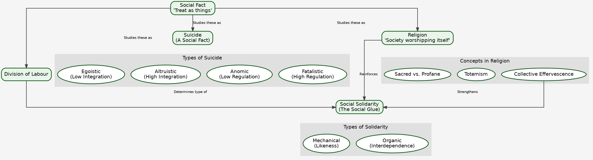

---
---

### **A. Core Mindmap: Karl Marx (Markdown Format)**

## Karl Marx (1818-1883)

### 1. Historical Materialism (HM)
- **Core Idea:** "It is not the consciousness of men that determines their being, but, on the contrary, their social being that determines their consciousness."
- **Philosophical Root:** Dialectical Materialism.
    - Inverted Hegel's Dialectical Idealism (Idea -> Material World) to Materialism (Material World -> Idea).
    - Thesis -> Antithesis -> Synthesis (e.g., Feudalism -> Bourgeoisie -> Capitalism).
- **Base-Superstructure Model:**
    - **Base (Substructure):** Economic foundation.
        - **Forces of Production:** Tech, raw materials, labor power.
        - **Relations of Production:** Social relations (class). Who owns, who works.
    - **Superstructure:** Non-economic institutions (Politics, Law, Religion, Culture, Family).
        - Function: Legitimizes & maintains the base. Religion is the "opium of the masses."
- **Paper 2 Link (A.R. Desai):** Used HM to analyze Indian Nationalism as a product of new material conditions created by British colonialism (new economic relations, modern education, press).

### 2. Mode of Production (MoP)
- **Definition:** The specific articulation of Forces + Relations of Production.
- **Historical Evolution (Unilinear):**
    - **Primitive Communism:** No classes, common ownership.
    - **Ancient (Slave) MoP:** Masters vs. Slaves.
    - **Feudal MoP:** Lords vs. Serfs.
    - **Capitalist MoP:** Bourgeoisie vs. Proletariat.
    - **Future Stages:** Socialism -> Communism (classless, stateless).
- **Indian Context:**
    - **Debate:** Was India ever truly feudal?
    - **Scholars:** Hamza Alavi (Colonial MoP), D.D. Kosambi ("Feudalism from above & below").

### 3. Class & Class Struggle
- **Class Definition:** Objective. Defined by relationship to the means of production. Not by income/status.
- **Core Idea:** "The history of all hitherto existing society is the history of class struggles."
- **Key Concepts:**
    - **Class-in-itself (An sich):** An objective structural reality. Unconscious of its status.
    - **Class-for-itself (Für sich):** A self-aware class, conscious of its conflict with other classes. Possesses **Class Consciousness**.
    - **False Consciousness:** Misguided ideology of the subordinate class, accepting the worldview of the dominant class.
    - **Class Polarization:** Society splits into two great hostile camps. Middle class sinks into the proletariat.
- **Paper 2 Link:**
    - **Agrarian Class Structure:** Landlords vs. landless labourers (e.g., Daniel Thorner, Utsa Patnaik).
    - **Caste & Class:** Andre Beteille's critique - Caste is not just class. Weberian framework (Status) is also needed.

### 4. Alienation (Entfremdung)
- **Core Idea:** Estrangement of humans from their "species-being" (Gattungswesen) under capitalism. Work is not for self-expression but for survival.
- **Four Types of Alienation:**
    1.  **From the Product:** Worker has no control over or ownership of what they create. (e.g., Foxconn worker making an iPhone they can't afford).
    2.  **From the Process of Production:** Work is repetitive, mindless, forced. No creativity. (e.g., Assembly line work, modern call centers).
    3.  **From Species-Being (Self):** Denied unique human potential for creative, conscious work. Reduced to an animal level.
    4.  **From Fellow Humans:** Social relations become market relations. Competition replaces cooperation.
- **Contemporary Indian Examples:**
    - **Gig Economy:** Zomato/Uber drivers alienated from platform, algorithm, customers.
    - **IT/BPO Sector:** Repetitive tasks, monitoring, lack of connection to final service.
    - **Farmers' Suicides:** Alienated from their land, produce (due to debt, market forces).
- **Related Concept: Fetishism of Commodities**
    - Social relationships between people are perceived as economic relationships among things (money, goods).
    - e.g., A person's worth measured by the brand of their phone/car.

### 5. Critique & Relevance
- **Major Criticisms:**
    - **Economic Determinism:** (Weber's critique) Ideas, culture, religion (Protestant Ethic) can also shape economy.
    - **Failed Prophecy:** Proletarian revolution hasn't occurred in advanced capitalist societies.
    - **Neglect of Middle Class:** Dahrendorf's "decomposition of capital & labour."
    - **One-dimensional view of power:** Focuses only on class, ignores gender (Feminists), caste (Ambedkar), race.
- **Contemporary Relevance (High-Yield for Conclusions):**
    - **Global Inequality:** Oxfam reports on wealth concentration.
    - **Crony Capitalism:** Nexus of state and capital.
    - **Environmental Crisis:** Capitalism's inherent need for infinite growth on a finite planet.
    - **Commodification:** Everything becomes a commodity (health, education, data).
    - **Digital Capitalism:** Data as the new means of production, creating new forms of exploitation.
    

---

### **C. Supplementary Tables**

#### **Table 1: Marx vs. Other Thinkers (Comparative Analysis)**

| Feature | **Karl Marx** | **Max Weber** | **Emile Durkheim** |
| :--- | :--- | :--- | :--- |
| **Basis of Stratification** | **Class** (Economic, relation to means of production). Unidimensional. | **Class, Status, Party** (Economic, Social, Political). Multidimensional. | **Moral Integration** & **Division of Labour**. Stratification is functional, reflects natural inequality. |
| **View of Capitalism** | Inherently exploitative, crisis-ridden, leading to alienation and its own destruction. | The epitome of **Rationality**. Creates an "Iron Cage" of bureaucracy and disenchantment. | A system of complex **Division of Labour** leading to **Organic Solidarity**, but risks **Anomie**. |
| **Driver of Social Change** | **Dialectical Materialism** & **Class Conflict**. | **Ideas & Values** (e.g., Protestant Ethic) alongside economic factors. Rationalization is the key process. | **Dynamic Density** & evolution of **Collective Conscience**. Change from Mechanical to Organic solidarity. |
| **Future of Society** | **Revolution** leading to a classless, stateless **Communist** society. | Increasing **Rationalization** and entrapment in the **Iron Cage**. Pessimistic outlook. | Evolution towards greater **Organic Solidarity** and moral individualism, with state managing integration. |

#### **Table 2: PYQ Answer Templates (Intro & Conclu)**

**Theme 1: Alienation**

*   **Question Type:** "Critically analyze Marx's concept of alienation. Is it relevant today?"
*   **Standard Intro:**
    > "Karl Marx's concept of 'Alienation' or 'Entfremdung', elaborated in his 'Economic and Philosophic Manuscripts of 1844', is a cornerstone of his critique of capitalism. Rooted in his philosophy of Historical Materialism, it describes the profound estrangement of individuals from their work, their products, themselves, and their fellow beings. Marx identified four key dimensions of alienation: from the product, the process, the 'species-being', and others, which this answer will now explore in the context of contemporary society."
*   **Standard Conclusion:**
    > "In conclusion, while Marx's prophecy of a revolution fueled by alienation has not materialized, the concept itself remains a powerful analytical tool. Its relevance has arguably expanded beyond the factory floor to the modern gig economy, the digital workplace, and the commodified social relations of the 21st century. Critics like Weber might argue that the issue is 'rationalization' rather than just capitalism, but Marx's framework compellingly highlights the human cost of a system prioritizing profit over human potential. Thus, alienation is not an obsolete idea but a lens to critically examine the quality of human life in modern society."

**Theme 2: Historical Materialism**

*   **Question Type:** "Explain Marx's concept of Historical Materialism as a critique of Hegelian philosophy."
*   **Standard Intro:**
    > "Historical Materialism is the scientific and philosophical foundation of Marxist thought, presenting a radical theory of social change and history. Developed as a direct critique of G.W.F. Hegel's 'dialectical idealism', Marx, in his famous words, 'turned Hegel on his head.' Where Hegel saw history propelled by the conflict of ideas, Marx argued that history progresses through the conflict of material forces. This framework, centered on the 'base-superstructure' model, posits that the economic mode of production is the primary driver of societal evolution, shaping its political, legal, and cultural superstructure."
*   **Standard Conclusion:**
    > "To conclude, Marx's Historical Materialism offered a revolutionary departure from idealist philosophies by grounding history in the material realities of human existence. While it has been criticized for its economic determinism, overlooking the autonomy of the superstructure as Weber pointed out, its strength lies in its ability to uncover the economic interests behind dominant ideologies and institutions. Its application by scholars like A.R. Desai to the Indian context proves its enduring value as a critical methodology for understanding the relationship between economy, society, and social change."


---
---

Excellent point. Brevity is paramount in the exam. I will adjust the intro/conclusion templates to be much more concise, aiming for that 15-30 word sweet spot. They will serve as sharp, impactful starting and ending points.

Let's proceed with **Emile Durkheim**.

---

### **A. Core Mindmap: Emile Durkheim (1858-1917)**

```markdown
## Emile Durkheim (1858-1917)

### 1. Social Fact (Fait Social)
- **Core Idea:** "Treat social facts as things." Sociology's subject matter.
- **Philosophical Root:** Positivism (Comte). Scientific, objective study of society.
- **Characteristics:**
    - **Exteriority:** Exist outside the individual consciousness.
    - **Constraint:** Exert coercive power over individuals (e.g., law, custom).
    - **Generality:** Widespread throughout a society.
- **Types:**
    - **Normal:** General for a given stage of societal development (e.g., crime is normal).
    - **Pathological:** Exceptional, not widely found (e.g., very high crime/suicide rates).
- **Paper 2 Link:** Caste as a social fact – it is external to an individual, constrains their choices (marriage, occupation), and is a general feature of Indian society.

### 2. Division of Labour (DoL)
- **Core Work:** *The Division of Labour in Society*.
- **Core Question:** How does modern, individualistic society hold together?
- **Social Solidarity (The Social Glue):**
    - **Mechanical Solidarity:**
        - **Society:** Simple, traditional (e.g., tribal societies).
        - **DoL:** Low. Homogenous population.
        - **Collective Conscience (CC):** Strong, rigid, shared by all.
        - **Law:** Repressive. Punishes offender to reinforce CC.
    - **Organic Solidarity:**
        - **Society:** Complex, modern, industrial.
        - **DoL:** High. Interdependence of specialized roles.
        - **Collective Conscience (CC):** Weaker, more abstract (e.g., value of human dignity).
        - **Law:** Restitutive. Aims to restore status quo.
- **Cause of Change:** Increasing **Dynamic Density** (population volume + interaction).
- **Pathology: Anomie**
    - Normlessness; breakdown of social regulation. Occurs during rapid change when old norms die before new ones emerge.

### 3. Suicide
- **Core Work:** *Suicide: A Study in Sociology*.
- **Core Idea:** Proving sociology's scientific credentials. Suicide is a social fact, not just psychological.
- **Method:** Correlating suicide rates with social variables (religion, marital status, etc.).
- **Two Core Social Forces:**
    - **Integration:** Degree of attachment to social groups.
    - **Regulation:** Degree of external constraint on people.
- **Four Types of Suicide:**
    1.  **Egoistic (Low Integration):** Excessive individualism. Detached from group. (e.g., Unmarried > Married).
    2.  **Altruistic (High Integration):** Individual is subsumed by the group. Duty to die. (e.g., Sati, hara-kiri).
    3.  **Anomic (Low Regulation):** Norms break down during drastic change (economic boom/bust). Aspirations are unchecked.
    4.  **Fatalistic (High Regulation):** Excessive regulation, oppression. No hope. (e.g., Slaves).
- **Paper 2 Link / Contemporary Examples:**
    - **Farmer Suicides:** Anomic (sudden debt crisis) + Fatalistic (trapped in debt cycle).
    - **Student Suicides (Kota):** Egoistic (isolation) + Anomic (intense, unregulated competition).

### 4. Religion
- **Core Work:** *The Elementary Forms of Religious Life*.
- **Core Idea:** "Religion is a unified system of beliefs and practices relative to sacred things... which unite into one single moral community called a Church, all those who adhere to them."
- **Key Concepts:**
    - **Sacred:** Things set apart, forbidden, inspiring awe (the collective).
    - **Profane:** Mundane, everyday, ordinary aspects of life (the individual).
    - **Totemism:** Most elementary form of religion. The totem (an animal/plant) symbolizes both the clan (society) and the god.
    - **Conclusion:** **When people worship god, they are unconsciously worshipping society itself.**
- **Functions of Religion:**
    - Creates social solidarity and integration.
    - **Collective Effervescence:** Moments of heightened collective energy (rituals, festivals) that reaffirm group identity.
- **Paper 2 Link:** Role of festivals (Diwali, Eid, Kumbh Mela) in creating collective effervescence and reinforcing social norms in India.

### 5. Critique & Relevance
- **Major Criticisms:**
    - **Functionalist Bias:** Overlooks dysfunctional aspects of social institutions.
    - **Neglect of Conflict:** Ignores power and conflict (Marx's critique).
    - **Conservative:** Focuses on order and stability, not change.
    - **Methodological Issues:** Used secondary data for *Suicide*.
- **Contemporary Relevance:**
    - **Anomie:** Explains modern feelings of disorientation, anxiety, and meaninglessness.
    - **Collective Effervescence:** Seen in national celebrations (World Cup wins), political rallies, social movements.
    - **Moral Individualism:** His idea of a modern morality based on the 'cult of the individual' is highly relevant.
    - **Functionalism (via Merton/Parsons):** Remains a major sociological perspective.
```

---

### **B. Visual Mindmap: The Logic of Durkheim (Graphviz Code)**



---

### **C. Supplementary Tables**

#### **Table 1: Durkheim vs. Other Thinkers (Comparative Analysis)**

| Feature | **Emile Durkheim** | **Karl Marx** | **Max Weber** |
| :--- | :--- | :--- | :--- |
| **Problem of Modernity** | **Anomie** (Normlessness). How to maintain moral integration? | **Alienation** & **Exploitation**. How to overcome class conflict? | **Disenchantment** & **Iron Cage**. How to escape excessive rationality? |
| **View of Individual** | Individual is a product of society. Constrained by social facts. | Individual's consciousness is shaped by their class position. | Individual is an actor who attaches **meaning** to their actions. (Social Action). |
| **Role of Religion** | **Integrative**. Source of social solidarity. Society worshipping itself. | **Oppressive**. "Opium of the masses." Part of the ideological superstructure. | **Transformative**. Can be a force for social change (e.g., Protestant Ethic). |
| **Methodology** | **Positivist**. Macro-level comparative analysis of social facts. | **Historical Materialism**. Macro-level analysis of economic history. | **Interpretive (Verstehen)**. Understanding subjective meanings. Use of **Ideal Types**. |

#### **Table 2: PYQ Answer Templates (Intro & Conclu - Short Format)**

**Theme 1: Social Fact**

*   **Question Type:** "What are social facts? Discuss with examples."
*   **Short Intro:** Emile Durkheim defined sociology as the study of 'social facts'—external and coercive social forces. He advocated for treating them as 'things' to establish a scientific, positivist sociology.
*   **Short Conclu:** Thus, the concept of social fact was foundational to Durkheim's project. While critiqued for its determinism, it remains a vital tool for analyzing macro-level structures like law and caste.

**Theme 2: Suicide**

*   **Question Type:** "Explain how Durkheim established suicide as a social phenomenon."
*   **Short Intro:** In his classic study 'Suicide', Durkheim demonstrated that suicide is a social fact, not merely a psychological act, determined by levels of social integration and regulation in society.
*   **Short Conclu:** Durkheim's theory remains a powerful sociological explanation for variations in suicide rates. It is applicable today to phenomena like farmer suicides, highlighting social forces behind individual distress.

**Theme 3: Religion**

*   **Question Type:** "According to Durkheim, the essence of religion is the same in modern and primitive societies. Comment."
*   **Short Intro:** Durkheim, in 'The Elementary Forms of Religious Life', argued that religion's core function is creating social solidarity by distinguishing the sacred from the profane. This function persists universally.
*   **Short Conclu:** Hence, for Durkheim, society worships itself through religion. This function of reinforcing collective identity remains relevant, whether through traditional rituals or modern secular ceremonies like national holidays.

This completes the analysis for Durkheim. We can now move to **Max Weber** to complete the "holy trinity." Please confirm.