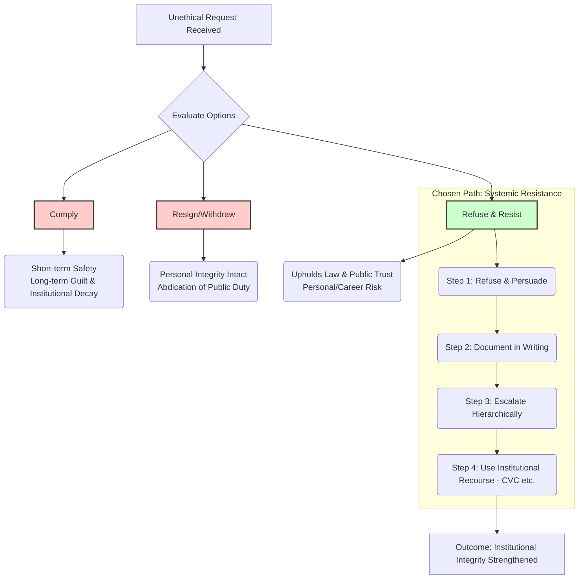
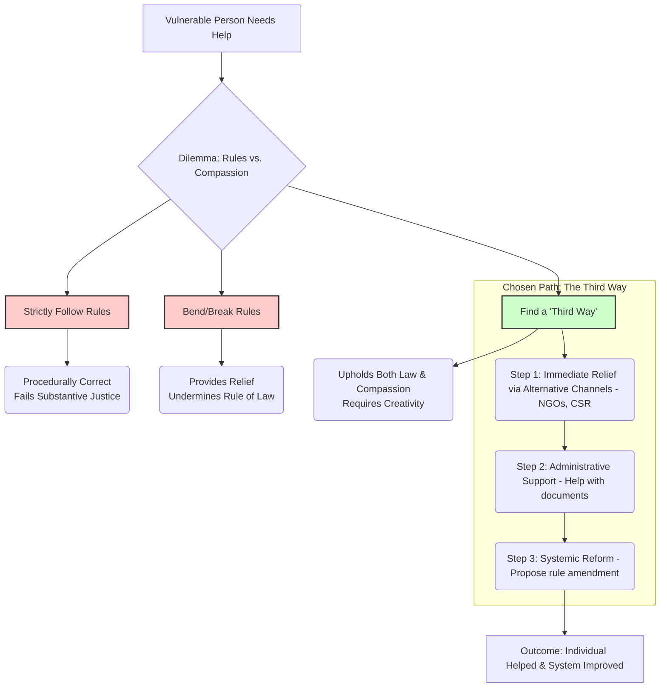
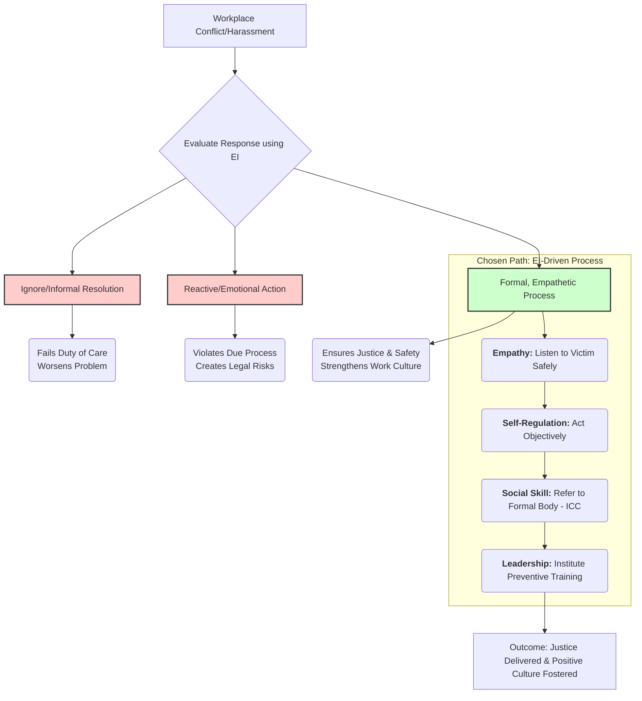

---

### **GS Paper IV: Case Study Master Notes (Expanded & Enriched)**

#### **Part 1: The Universal Answering Structure (The Blueprint)**

1.  **Introduction:** State the core dilemma.
2.  **Stakeholder Analysis:** Map the players and their interests.
3.  **Ethical Issues/Principles:** List conflicting values.
4.  **Options & Evaluation:** Analyze courses of action.
5.  **Chosen Course of Action:** Detail your step-by-step plan.
6.  **Justification:** Defend your choice.
7.  **Conclusion:** Forward-looking statement.

---

#### **Part 2: Core Frameworks & Application Modules (Detailed Version)**

### **Framework 1: The Guardian of Probity (Duty & Integrity)**

*   **When to Use:** Corruption, Political Pressure, Nepotism, Cronyism, Conflict of Interest.
*   **Core Principle:** Deontology (Duty-based ethics), Kant's Categorical Imperative (act only according to a maxim that you would wish to become a universal law).

**A. Expanded List of Standard Introductions:**
*   *"This case places my **fiduciary responsibility** as a custodian of public resources in direct conflict with illicit external pressures, testing my adherence to **absolute integrity**."*
*   *"The situation presents a clear instance of a potential **quid pro quo**, demanding a response that is not only legally compliant but also ethically unimpeachable to uphold the **dignity of my office**."*
*   *"This is a test of my **moral fiber** and ability to withstand pressure, a cornerstone of the **steel frame** of Indian bureaucracy as envisioned by Sardar Patel."*

**B. Expanded List of Ethical Issues & Keywords:**
*   **Core Conflicts:**
    *   Public Interest vs. Private/Political Gain
    *   Rule of Law vs. Rule by Whim
    *   Transparency vs. Opacity
    *   Accountability vs. Impunity
    *   Institutional Integrity vs. Individual Greed
*   **Ethical Jargon:**
    *   **Conflict of Interest:** (Actual, Potential, Perceived)
    *   **Nolan Principles:** (Selflessness, Integrity, Objectivity, Accountability, Openness, Honesty, Leadership)
    *   **Probity in Governance:** (As per 2nd ARC - ensuring integrity and uprightness)
    *   **Doctrine of Public Trust:** (Public office is a trust, not a property)
    *   **Abuse of Discretionary Power**
    *   **Crony Capitalism/Nepotism**
    *   **Violation of All India Services (Conduct) Rules, 1968**

**C. Expanded List of Courses of Action (The "Systemic Resistance" Path):**
1.  **Refuse, Record, Report (The 3R Strategy):**
    *   **Refuse:** Politely but firmly decline. Articulate the specific legal (e.g., Prevention of Corruption Act, GFR), procedural, and ethical violations the request entails. Use **persuasive communication**, not aggressive confrontation.
    *   **Record:** **"Create a paper trail."** Document every conversation, phone call, and meeting. Follow up verbal discussions with a formal note/email seeking written clarification. This creates an evidence-based **procedural firewall**.
    *   **Report:** Escalate the matter through the **proper hierarchical channel**. If the immediate superior is the problem, approach their superior. Mention the situation in your official reports or monthly updates.
2.  **Seek an "Ethical Alliance":**
    *   Discreetly consult with trusted senior colleagues who are known for their integrity. This is not for collusion, but for guidance and moral support.
    *   Build a coalition of like-minded officers within the department to foster a culture of integrity.
3.  **Utilize Institutional "Safety Valves":**
    *   If the entire hierarchy seems compromised, leverage formal institutional mechanisms.
    *   **Actionable Ideas:** File a report with the CVC; seek a meeting with the Cabinet Secretary/Chief Secretary; use the protections under the **Whistle Blowers Protection Act, 2014**.
4.  **Strategic Delay (A last resort):**
    *   If immediate refusal is dangerous, you can use procedural tools to delay the unethical action, such as by asking for more data, forming a committee for review, or seeking legal opinion. This buys time to build a stronger case or for the situation to change.

**D. Expanded List of Standard Conclusions:**
*   *"By choosing a path of principled resistance, I am not merely rejecting an illegal order, but actively strengthening the **immune system of the administration** against the virus of corruption."*
*   *"My actions aim to send a clear signal that the system has robust **checks and balances**, and that an officer's primary allegiance is to the Constitution, thereby reinforcing the very foundation of **Good Governance**."*

---

### **Framework 2: The Compassionate Administrator (Justice & Welfare)**

*   **When to Use:** Rules vs. Human Suffering, Vulnerable Sections, Social Justice.
*   **Core Principle:** Ethics of Care, Utilitarianism (with a focus on the vulnerable), `Antyodaya`.

**A. Expanded List of Standard Introductions:**
*   *"This case requires me to navigate the fine line between being a **rule-bound administrator** and a **responsive, humane public servant**, resolving a classic **crisis of conscience**."*
*   *"The situation demands an application of **discretionary wisdom**, where the 'spirit of the law' must be invoked to prevent the 'letter of thelaw' from causing a **travesty of justice**."*
*   *"My response will be guided by the constitutional mandate of creating a **socio-economic democracy**, where the state acts as a guardian for its most vulnerable citizens."*

**B. Expanded List of Ethical Issues & Keywords:**
*   **Core Conflicts:**
    *   Procedural Justice vs. Substantive Justice
    *   Uniformity/Objectivity vs. Empathy/Compassion
    *   Legal Positivism vs. Natural Law
    *   Type I Error (denying a genuine person) vs. Type II Error (granting a non-genuine person)
*   **Ethical Jargon:**
    *   **Gandhiji's Talisman**
    *   **Rawls's "Veil of Ignorance" & "Difference Principle"** (inequalities are only justified if they benefit the least advantaged)
    *   **Amartya Sen's Capability Approach** (focus on enhancing human capabilities, not just providing goods)
    *   **Crisis of Conscience**
    *   **Responsive Administration**
    *   **Transformative Constitutionalism**

**C. Expanded List of Courses of Action (The "Creative & Humane" Path):**
1.  **Immediate, Legally-Compliant Relief (The "Bridge" Strategy):**
    *   **Leverage Networks:** Actively connect the individual with verified NGOs, philanthropic organizations, or CSR departments of local companies.
    *   **Scheme Convergence:** Thoroughly examine if the person can be helped under any other Central or State government scheme (e.g., if not eligible for Scheme A, check Scheme B or C).
    *   **Administrative Support:** Use the office's resources to help the person acquire the necessary documents they lack. Guide them through the process.
    *   **Discretionary Power:** Judiciously use any legally sanctioned discretionary or emergency funds available to your office, with full documentation.
2.  **Systemic Reform (The "Architect" Strategy):**
    *   **Data-Driven Advocacy:** Document this case and others like it to create a data-backed report.
    *   **Policy Recommendation:** Submit a formal proposal for policy review.
        *   **Actionable Ideas:** Recommend simplifying the application process; suggest accepting alternative forms of documentation; propose a **"pro-poor verification"** system where the onus is on the state to verify, not on the poor to provide documents.
    *   **Social Audit:** Propose a social audit mechanism for the scheme to get direct feedback from beneficiaries and identify other such exclusionary gaps.

**D. Expanded List of Standard Conclusions:**
*   *"This two-pronged approach of providing immediate, innovative relief while pushing for long-term policy reform embodies the spirit of a **learning and evolving administration** that is truly committed to **inclusive growth**."*
*   *"By addressing both the individual's plight and the systemic flaw, my action seeks to transform a moment of crisis into an opportunity for creating a more just, effective, and **people-centric governance** model."*

---

### **Framework 3: The Emotionally Intelligent Leader (Workplace & Team)**

*   **When to Use:** Harassment, Team Conflict, Demotivation, Mental Health, Work-Life Balance.
*   **Core Principle:** Emotional Intelligence (EI), Virtue Ethics (fostering a virtuous work environment).

**A. Expanded List of Standard Introductions:**
*   *"This case requires the application of **Emotional Intelligence (EI)** to resolve a sensitive interpersonal issue, ensuring that the response is both just and restorative for the **organizational climate**."*
*   *"As a leader, my responsibility extends beyond achieving targets to fostering a **psychologically safe and ethical work culture**. This situation is a critical test of that leadership."*

**B. Expanded List of Ethical Issues & Keywords:**
*   **Core Conflicts:**
    *   Individual Rights vs. Organizational Reputation
    *   High Performer's Value vs. Unethical Behavior
    *   Formal Justice vs. Informal Resolution
*   **Ethical Jargon:**
    *   **Emotional Intelligence (EI):** (Self-awareness, Self-regulation, Empathy, Social Skills)
    *   **Psychological Safety**
    *   **Organizational Climate/Culture**
    *   **Duty of Care** (The organization's duty to protect its employees)
    *   **POSH Act, 2013 & Vishakha Guidelines**
    *   **Procedural Fairness & Natural Justice** (`Audi alteram partem` - hear the other side)
    *   **Vicarious Liability** (The organization's liability for the actions of its employees)

**C. Expanded List of Courses of Action (The "EI-Driven" Path):**
1.  **Immediate Response (The "First Responder" Strategy):**
    *   **Acknowledge & Validate:** Listen to the complainant with empathy and without judgment. Validate their feelings and assure them that their complaint is being taken with the utmost seriousness.
    *   **Ensure Safety:** Immediately ensure the victim's physical and psychological safety. This may involve granting leave, changing reporting lines temporarily, or arranging for professional counseling.
    *   **De-escalate:** Avoid immediate, reactive confrontation with the accused. The process must be formal and structured.
2.  **Formal & Fair Process (The "Due Process" Strategy):**
    *   **Mandatory Referral:** Without delay, formally refer the written complaint to the **Internal Complaints Committee (ICC)**. This is a legal requirement under the POSH Act and is non-negotiable.
    *   **Maintain Confidentiality:** Ensure strict confidentiality for all parties involved to prevent gossip and protect reputations pending the outcome of the inquiry.
    *   **Cooperate Fully:** Provide the ICC with all necessary support, but do not interfere in its independent functioning.
3.  **Organizational Healing & Prevention (The "Gardener" Strategy):**
    *   **Communicate to the Team:** After the ICC process is complete, communicate the outcome (while respecting privacy) and reaffirm the organization's zero-tolerance policy.
    *   **Systemic Training:** Implement mandatory, high-quality, and interactive training modules on workplace ethics, gender sensitivity, and the POSH Act for all employees at all levels.
    *   **Lead by Example:** Consistently model respectful and professional behavior. Promote a culture where people feel safe to speak up.

**D. Expanded List of Standard Conclusions:**
*   *"A swift, fair, and empathetic response not only delivers justice to the individual but also sends a powerful message about the organization's values, ultimately enhancing employee morale, trust, and productivity."*
*   *"By treating this not just as an HR issue but as a fundamental leadership challenge, I aim to transform the workplace into an environment where **dignity and performance** are mutually reinforcing."*

### Framework D: The "Safety Net" Generic Framework (When you're stuck)

This is a simple, robust, all-purpose framework to use when a case is confusing or you're under extreme time pressure. It's based on the acronym **R.O.P.E.S.**

1.  **R - Rules & Regulations:** What do the law, the Constitution, and the conduct rules say? This is your first and safest anchor.
2.  **O - Options & Outcomes:** What are the 2-3 most obvious courses of action? What are their likely positive and negative outcomes?
3.  **P - Principles & Probity:** What ethical principles are at stake? (Integrity, Compassion, Justice, etc.). Which option best upholds these principles?
4.  **E - Empathy & Equity:** Who is the most vulnerable stakeholder? How will my decision impact them? Does my decision promote fairness?
5.  **S - Systemic Solution:** What is my chosen course of action, and what long-term measures can I suggest to prevent this from happening again?

This framework ensures you touch upon all the key evaluation points (legal, ethical, emotional, practical) in a structured manner, even if you can't think of a more creative approach.

---
---
---

# Quick Summary and tables

## Part 1: Mermaid Diagrams for Core Frameworks

#### **Diagram 1: The Guardian of Probity Framework**



#### **Diagram 2: The Compassionate Administrator Framework**



#### **Diagram 3: The Emotionally Intelligent Leader Framework**



---

## **Part 2: Tabular Format for Exam-Ready Notes**

#### **Table 1: Framework 1 - The Guardian of Probity**

| Section | Content for Memorization & Application |
| :--- | :--- |
| **When to Use** | Corruption, Political Pressure, Nepotism, Cronyism, Conflict of Interest. |
| **Core Principle** | **Deontology** (Duty-based ethics), **Kant's Categorical Imperative**. |
| **Standard Intros** | 1. "This case tests my **moral integrity** and pits **probity in public life** against **undue influence**."<br>2. "This situation presents a potential **quid pro quo**, demanding an ethically unimpeachable response to uphold the **dignity of my office**." |
| **Ethical Issues & Jargon** | - **Conflicts:** Public Interest vs. Private Gain; Rule of Law vs. Rule by Whim.<br>- **Jargon:** Conflict of Interest (Actual, Potential, Perceived), Nolan Principles, Probity in Governance, Doctrine of Public Trust, Abuse of Discretionary Power, All India Services (Conduct) Rules. |
| **Options Analysis** | **1. Comply:** Dereliction of duty, institutionalizes corruption.<br>**2. Resign:** Abdication of responsibility, creates a vacuum.<br>**3. Resist Systemically:** Upholds law, protects public interest, carries personal risk. |
| **Course of Action (3R Strategy)** | **1. Refuse:** Politely but firmly decline, citing specific rules.<br>**2. Record:** Create a **paper trail**; seek **written directives**.<br>**3. Report:** Escalate through the **proper hierarchical channel** or use institutional safety valves (CVC, Whistle Blowers Act). |
| **Standard Conclusions** | 1. "By choosing principled resistance, I strengthen the **immune system of the administration** against corruption."<br>2. "My actions reaffirm that an officer's primary allegiance is to the Constitution, reinforcing the foundation of **Good Governance**." |

#### **Table 2: Framework 2 - The Compassionate Administrator**

| Section | Content for Memorization & Application |
| :--- | :--- |
| **When to Use** | Rules vs. Human Suffering, Vulnerable Sections, Social Justice dilemmas. |
| **Core Principle** | **Ethics of Care**, **Utilitarianism** (with focus on vulnerable), **`Antyodaya`**. |
| **Standard Intros** | 1. "This case presents a **crisis of conscience**, requiring a balance between **procedural propriety** and **substantive justice**."<br>2. "The situation demands **discretionary wisdom**, where the 'spirit of the law' must be invoked to prevent a **travesty of justice**." |
| **Ethical Issues & Jargon** | - **Conflicts:** Procedural vs. Substantive Justice; Uniformity vs. Empathy.<br>- **Jargon:** Gandhiji's Talisman, Rawls's Veil of Ignorance, Amartya Sen's Capability Approach, Crisis of Conscience, Responsive Administration, Transformative Constitutionalism. |
| **Options Analysis** | **1. Strict Rules:** Procedurally safe but fails the human element.<br>**2. Bend Rules:** Well-intentioned but legally risky and sets a bad precedent.<br>**3. Third Way:** Creative, legally tenable, and humane. |
| **Course of Action (Creative & Humane)** | **1. Immediate Relief (The "Bridge"):** Connect to NGOs/CSR, check alternative schemes, use discretionary funds, provide administrative support.<br>**2. Systemic Reform (The "Architect"):** Document the case, submit a data-backed proposal to amend rules, suggest a **"pro-poor verification"** system and **social audits**. |
| **Standard Conclusions** | 1. "This two-pronged approach embodies a **learning and evolving administration** committed to **inclusive growth**."<br>2. "This transforms a crisis into an opportunity for creating a more just and **people-centric governance** model." |

#### **Table 3: Framework 3 - The Emotionally Intelligent Leader**

| Section | Content for Memorization & Application |
| :--- | :--- |
| **When to Use** | Workplace Harassment, Team Conflict, Demotivation, Mental Health issues. |
| **Core Principle** | **Emotional Intelligence (EI)**, **Virtue Ethics** (fostering a virtuous environment). |
| **Standard Intros** | 1. "This situation requires high **Emotional Intelligence (EI)** to ensure the response is both just and restorative for the **organizational climate**."<br>2. "As a leader, my duty extends beyond targets to fostering a **psychologically safe and ethical work culture**." |
| **Ethical Issues & Jargon** | - **Conflicts:** Individual Rights vs. Org. Reputation; High Performer vs. Unethical Behavior.<br>- **Jargon:** Emotional Intelligence (all 4 pillars), Psychological Safety, Duty of Care, POSH Act & Vishakha Guidelines, Procedural Fairness, Natural Justice, Vicarious Liability. |
| **Options Analysis** | **1. Ignore:** Fails duty of care, legally non-compliant.<br>**2. Emotional Reaction:** Unprofessional, violates due process.<br>**3. Formal & Empathetic Process:** Legally correct, ethically sound, and restorative. |
| **Course of Action (EI-Driven)** | **1. Immediate:** Listen with **empathy**, ensure victim's safety, de-escalate.<br>**2. Formal Process:** Refer to the **Internal Complaints Committee (ICC)**, maintain confidentiality, cooperate fully.<br>**3. Prevention:** Conduct mandatory training, strengthen grievance mechanisms, lead by example. |
| **Standard Conclusions** | 1. "This response reaffirms the organization's zero-tolerance policy, enhancing employee morale, trust, and productivity."<br>2. "This approach ensures that **dignity and performance** are mutually reinforcing pillars of our work culture." |

#### **Table 4: Framework 4 - The Universal "SPADE" Model**

| Section | Content for Memorization & Application |
| :--- | :--- |
| **When to Use** | Any novel, unexpected, or confusing case study where other frameworks don't fit. |
| **Core Principle** | Logical deconstruction of the problem from situation to solution. |
| **S - Situation & Stakeholders** | **Action:** Define the core event and map all affected parties and their primary interests. |
| **P - Principles at Play** | **Action:** Brainstorm the conflicting ethical values (e.g., Truth vs. Order; Justice vs. Mercy; Rights vs. Duty). |
| **A - Avenues of Action** | **Action:** Generate 2-3 plausible courses of action. Briefly list the pros and cons of each. |
| **D - Decision & Defense** | **Action:** Clearly state your chosen course of action. Defend it by linking it back to the principles identified in step 'P'. |
| **E - Effect (Long-term)** | **Action:** Conclude by suggesting a systemic, forward-looking reform or policy change to prevent such issues in the future. This demonstrates administrative foresight. |

---
---

## Brownie tables

---
### **Part 3: Quotations for Case Studies (Diverse & High-Impact List)**

| S.No. | Quote | Author/Source | When to Use & How |
| :--- | :--- | :--- | :--- |
| 1. | **"The true measure of any society can be found in how it treats its most vulnerable members."** | Mahatma Gandhi | **For Compassion/Welfare Cases:** Justifying a decision that favors a marginalized person over rigid rules. *E.g., "My decision is guided by the Gandhian principle that the true measure of our administration lies in how we treat the most vulnerable."* |
| 2. | **"It is not the critic who counts... The credit belongs to the man who is actually in the arena..."** | Theodore Roosevelt | **For Courage/Integrity Cases:** Justifying a difficult, risky decision against corruption or pressure. It shows you understand that public service involves struggle, not just armchair criticism. *E.g., "As an officer in the arena, I must act, even at personal risk, rather than remain a passive critic."* |
| 3. | **"A small body of determined spirits fired by an unquenchable faith in their mission can alter the course of history."** | Mahatma Gandhi | **For Individual vs. System Cases:** Justifying why one person's ethical stand matters against a corrupt or apathetic system. *E.g., "While my actions may seem small against a large system, I am driven by the belief that a determined spirit can initiate meaningful change."* |
| 4. | **"The standard you walk past is the standard you accept."** | David Morrison | **For Leadership/Workplace Culture Cases:** Perfect for situations involving ethical lapses by subordinates. It shows you understand a leader's responsibility in setting the culture. *E.g., "Ignoring this misconduct would mean I accept it as the new standard. Therefore, I must act decisively."* |
| 5. | **"In a time of universal deceit, telling the truth is a revolutionary act."** | George Orwell | **For Whistle-blowing/Transparency Cases:** Use when justifying the release of information that, while controversial, serves a greater public good. *E.g., "In a situation where facts are being obscured, my primary duty is to the truth and the public's right to know."* |
| 6. | **"The arc of the moral universe is long, but it bends toward justice."** | Martin Luther King Jr. | **For Justifying a Difficult Path:** A powerful concluding line for any case where your ethical choice leads to short-term difficulty but upholds long-term justice. It shows foresight and moral optimism. |
| 7. | **"To be persuasive, we must be believable; to be believable, we must be credible; to be credible, we must be truthful."** | Edward R. Murrow | **For Communication/Persuasion:** When explaining your strategy to convince a superior or the public about an ethical course of action. |
| 8. | **"The ultimate measure of a man is not where he stands in moments of comfort... but where he stands at times of challenge and controversy."** | Martin Luther King Jr. | **For Crisis of Conscience Cases:** An excellent way to frame your justification for choosing a difficult ethical path over an easy one. |
| 9. | **"An unjust law is no law at all."** | St. Augustine / MLK Jr. | **For Spirit vs. Letter of Law Cases:** A strong, though carefully used, justification for prioritizing substantive justice over a flawed or oppressive rule. |
| 10. | **"He who is cruel to animals becomes hard also in his dealings with men..."** | Immanuel Kant | **For Environmental/Animal Welfare Cases:** Provides a deep philosophical grounding for decisions related to environmental protection and animal rights. |
| 11. | **"The hottest places in Hell are reserved for those who, in a time of great moral crisis, maintain their neutrality."** | Dante Alighieri (inferred) | **For Integrity/Courage Cases:** A powerful justification for taking a stand instead of choosing silence or inaction. |
| 12. | **"A man is ethical only when life... is sacred to him, that of plants and animals as that of his fellow men."** | Albert Schweitzer | **For Environmental/Displacement Cases:** Grounding decisions in a philosophy of **“Reverence for Life.”** |
| 13. | **"The bureaucracy is a circle from which no one can escape. Its hierarchy is a hierarchy of knowledge."** | Karl Marx | **For Bureaucratic Apathy/Red-Tape Cases:** Use critically to show you understand systemic flaws, then offer participative solutions to break the circle. |
| 14. | **"It is difficult to get a man to understand something when his salary depends upon his not understanding it."** | Upton Sinclair | **For Conflict of Interest/Systemic Corruption:** A sharp insight into institutional resistance to change. |
| 15. | **"The function of freedom is to free someone else."** | Toni Morrison | **For Social Justice/Empowerment:** Frame your role as using your privileged position to empower the marginalized. |
| 16. | **"The only thing necessary for the triumph of evil is for good men to do nothing."** | Edmund Burke (attributed) | **For Leadership/Workplace Culture Cases:** A classic justification for intervening against unethical practices, framing inaction as complicity. |
| 17. | **"What is popular is not always right, and what is right is not always popular."** | John F. Kennedy | **For Political Pressure/Populism Cases:** A direct and effective way to justify a decision that may be unpopular but is ethically and legally correct. |
| 18. | **"To do a great right, do a little wrong."** | William Shakespeare | **For Spirit vs. Letter of Law Dilemma:** Introduce the dilemma, but then argue *against* unethical shortcuts from a public servant's perspective. |

---

### **Part 4: Contemporary Ideas & Scriptural Wisdom (Diverse List)**

| S.No. | Source/Concept | Key Idea & Application |
| :--- | :--- | :--- |
| 1. | **Nudge Theory**<br>*(Book: Nudge)* | **Idea:** Guide people to better choices without coercion by designing the **"choice architecture"** intelligently. <br>**Application:** Use in behavior change cases (e.g., waste segregation, traffic discipline) to suggest solutions beyond punitive measures. |
| 2. | **Antifragility**<br>*(Book: Antifragile)* | **Idea:** Systems that don't just resist shocks but get stronger from them. <br>**Application:** Frame a tough reform (e.g., transparency, audit) as a way to make the administrative system **"antifragile"** and more resilient to future corruption. |
| 3. | **Psychological Safety**<br>*(Concept by Amy Edmondson)* | **Idea:** A workplace where people feel safe to speak up, admit mistakes, and take risks without fear of humiliation. <br>**Application:** In leadership/culture cases, state your goal as creating **"psychological safety"**—a modern, powerful term for a positive work culture. |
| 4. | **Thinking, Fast and Slow**<br>*(Book by Daniel Kahneman)* | **Idea:** Differentiating between **"System 1"** (fast, intuitive) and **"System 2"** (slow, logical) thinking. <br>**Application:** When facing a crisis, explain: *"I would consciously avoid a 'System 1' reactive decision and engage 'System 2' thinking to analyze the situation logically and ethically before acting."* |
| 5. | **The Fifth Discipline**<br>*(Book by Peter Senge)* | **Idea:** The concept of a **"learning organization"** that continuously adapts and improves. <br>**Application:** In your conclusion, frame your long-term suggestions as steps towards making your department a "learning organization" that learns from its failures. |
| 6. | **Nishkama Karma**<br>*(Bhagavad Gita)* | **Idea:** Performing one's duty without attachment to the results or fruits of the action. <br>**Application:** The ultimate "umbrella" concept for a civil servant. Use it to justify your commitment to duty, regardless of personal risk or reward. |
| 7. | **Aparigraha (Non-possessiveness)**<br>*(Jainism / Yoga Sutras)* | **Idea:** The virtue of limiting one's possessions to what is necessary and not being greedy. <br>**Application:** In corruption cases, this provides a deep philosophical reason for honesty, linking it to a virtuous way of life. |
| 8. | **Karuna & Prajna (Compassion & Wisdom)**<br>*(Buddhism)* | **Idea:** The union of compassion with wisdom. Compassion without wisdom is ineffective; wisdom without compassion is cruel. <br>**Application:** The perfect justification for the "Compassionate Administrator" framework. *"My approach seeks to balance Karuna (compassion) with Prajna (wisdom)."* |
| 9. | **Sarve Bhavantu Sukhinah**<br>*(Vedic Prayer)* | **Idea:** "May all beings be happy." The principle of universal well-being. <br>**Application:** A powerful concluding thought for any case involving public welfare, showing a commitment to the good of all. |
| 10. | **Vasudhaiva Kutumbakam**<br>*(Maha Upanishad)* | **Idea:** "The world is one family." <br>**Application:** Useful in cases with international dimensions (e.g., refugees, international aid) or local conflicts, promoting a sense of shared humanity. |
| 11. | **Veil of Ignorance**<br>*(Concept by John Rawls)* | **Idea:** The most just decision is one you would make if you did not know what your own position in society would be. <br>**Application:** A powerful "umbrella" concept for justifying impartial decisions in social justice cases. |
| 12. | **The Banality of Evil**<br>*(Concept by Hannah Arendt)* | **Idea:** Great evils are often committed by ordinary people who simply follow orders without critical thought. <br>**Application:** Use this to explain the danger of a culture of unthinking obedience in bureaucracy. |
| 13. | **Iqbal's 'Khudi' (Selfhood)**<br>*(Philosophy of Allama Iqbal)* | **Idea:** The development of the self to its full potential through action, courage, and self-respect. <br>**Application:** A unique concept for justifying actions that empower communities or for an officer taking a stand. |
| 14. | **Tirukkural's Duty Maxims**<br>*(Ancient Tamil Text)* | **Idea:** Emphasizes that real power lies in the dutiful execution of one's responsibilities without fail. <br>**Application:** Use to show deep-rooted ethical grounding from Indian traditions, highlighting administrative wisdom. |
| 15. | **Amartya Sen's Capability Approach** | **Idea:** Development should be measured by the real freedoms and capabilities people have to live a life they value. <br>**Application:** In any development or welfare case, frame your goal as enhancing **"capabilities."** |
| 16. | **Zero-Sum vs. Positive-Sum Game**<br>*(Game Theory)* | **Idea:** A zero-sum game is where one person's gain is another's loss. A positive-sum game is where cooperation can lead to mutual benefit. <br>**Application:** When resolving conflicts, frame your solution as an attempt to create a **"positive-sum game."** |
| 17. | **Sewa (Selfless Service)**<br>*(Sikhism)* | **Idea:** The core tenet of serving humanity without any desire for reward, seeing the divine in all. <br>**Application:** A powerful alternative to "Spirit of Service," with deep cultural resonance. |

---

### **Part 5: Master Table of Ethical Jargon & Keywords (Expanded & Diversified)**

| S.No. | Category                        | Keywords & Jargon                                                                                                                                                                                                                                                                                                  |
| :---- | :------------------------------ | :----------------------------------------------------------------------------------------------------------------------------------------------------------------------------------------------------------------------------------------------------------------------------------------------------------------- |
| 1.    | **Universal/Umbrella Terms**    | Constitutional Morality, Nishkama Karma (Gita), Rawls's Veil of Ignorance, Sewa (Sikhism), The Golden Mean (Aristotle), Categorical Imperative (Kant), Public Trust, Fiduciary Responsibility.                                                                                                                     |
| 2.    | **Integrity & Corruption**      | Probity, Rectitude, Uprightness, Conflict of Interest (Actual, Potential, Perceived), Quid Pro Quo, Cronyism, Nepotism, Collusive Corruption, Coercive Corruption, Moral Turpitude, Abuse of Discretionary Power, Patronage Politics, Rent-Seeking Behavior.                                                       |
| 3.    | **Justice & Welfare**           | Substantive Justice, Procedural Justice, Distributive Justice, Restorative Justice, Social Equity, `Antyodaya`, Amartya Sen's Capability Approach, Ethics of Care, Transformative Constitutionalism, Principle of Proportionality, Legitimate Expectation.                                                         |
| 4.    | **Administrative & Leadership** | Emotional Intelligence (EI), Psychological Safety, Discretionary Wisdom, Accountability (Vertical, Horizontal, Social), Due Process, Natural Justice (`Audi alteram partem`), Stakeholder Management, Nudge Theory, Antifragility, Learning Organization, Principle of Subsidiarity, Evidence-Based Policy Making. |
| 5.    | **Personal Ethics & Dilemmas**  | Crisis of Conscience, Moral Courage, Courage of Conviction, Virtue Ethics, Deontology, Utilitarianism (Act & Rule), Moral Myopia, Ethical Fading, Cognitive Dissonance, Moral Muteness, Locus of Control (Internal/External), The Banality of Evil (Arendt).                                                       |
| 6.    | **Rights, Duties & Conflicts**  | Freedom of Speech vs. Public Order, Right to Information vs. Official Secrets, Right to Livelihood vs. Development, Intra-generational vs. Inter-generational Equity, Duty of Care, Tragedy of the Commons, Zero-Sum vs. Positive-Sum Thinking.                                                                    |


---
---
---
## ~~XYZ~~
### ~~**Guiding Principle for All Frameworks: The "360-Degree View"**~~

~~Before presenting any option, a high-scoring answer always demonstrates a holistic understanding. Start every case study answer with this 2-step mental checklist:~~

1.  ~~**Core Dilemma Identification:** In one sentence, state the central conflict.~~
    *   ~~*E.g., "This case presents a conflict between administrative duty to enforce the law and the ethical imperative of compassion for the vulnerable."*~~
2.  ~~**Stakeholder Analysis:** Quickly map the key players and their interests. This is a non-negotiable first step.~~

| Stakeholder           | Interest / Right (What they want)                | Duty / Responsibility (What they owe)             |
| :-------------------- | :----------------------------------------------- | :------------------------------------------------ |
| **You (The Officer)** | Upholding law, career progression, peace of mind | Public service, impartiality, accountability      |
| **The Aggrieved**     | Justice, relief, safety, dignity                 | To follow the law, cooperate                      |
| **The Antagonist**    | Profit, power, escaping accountability           | Adherence to law, corporate social responsibility |
| **The Government**    | Public trust, order, implementation of policy    | Ensuring justice, protecting officials            |
| **Society at Large**  | Fairness, rule of law, ethical governance        | Social cohesion, supporting ethical actions       |

~~---~~

### ~~**Framework 1: The "Deontological Guardian" Framework (Duty & Integrity)**~~

~~**Ideal for:** Corruption, Political Pressure, Conflict of Interest, Bending Rules.~~
~~**Core Idea:** Your duty as a public servant is absolute and non-negotiable. The means justify the ends.~~

~~**Structure & Content:**~~

1.  ~~**Introduction & Ethical Keywords:**~~
    *   ~~"This case is a test of my **moral integrity** and **courage of conviction**."~~
    *   ~~It pits **probity in public life** and **adherence to the Rule of Law** against pressures of **political expediency/personal gain**.~~
    *   ~~The core ethical principles involved are **Impartiality, Non-partisanship, Objectivity, and Accountability** as enshrined in the **Nolan Principles** and the Civil Service **Code of Conduct**.~~

2.  ~~**Options Analysis (Merits & Demerits):**~~

| Option | Merits (Apparent/Short-term) | Demerits (Real/Long-term) |
| :--- | :--- | :--- |
| **1. Comply with the unethical order.** | Avoids conflict, pleases superior, ensures personal/career safety. | **Dereliction of duty**, violation of oath, sets a negative precedent, **institutionalizes corruption**, loss of self-esteem and public trust. |
| **2. Resign / Seek Transfer.** | Maintains personal integrity, avoids direct confrontation. | **Abdication of responsibility**, creates a vacuum for the corrupt, seen as an act of cowardice, fails the public who depend on honest officers. |
| **3. Refuse & Resist Systemically.** | Upholds the **dignity of the office**, protects public funds/interest, strengthens the institution. | Risks personal harm, career stagnation, departmental victimization, mental stress. |

3.  ~~**Chosen Course of Action (The "Iron Hand in a Velvet Glove" approach):**~~

    *   ~~**Step 1: Persuasion & Documentation:**~~
        *   ~~Politely and respectfully explain to the superior/politician the legal and procedural impropriety of their request.~~
        *   ~~Quote the relevant rules (e.g., GFR, CVC guidelines).~~
        *   ~~**Crucial Action:** Document this conversation by sending a formal note/email summarizing the discussion and seeking a **written directive**. This shifts the onus.~~
        *   ~~**Ethical Jargon:** "My approach is one of **persuasive communication** while creating a **procedural firewall**."~~

    *   ~~**Step 2: Escalation & Institutional Recourse:**~~
        *   ~~If pressure continues, escalate the matter to the next higher, un-conflicted authority in the hierarchy.~~
        *   ~~If the entire channel seems compromised, use institutional mechanisms like the Cabinet Secretary, CVC, or relevant administrative tribunals.~~
        *   ~~**Ethical Jargon:** "I will utilize the established **grievance redressal mechanisms** to uphold **procedural justice**."~~

4.  ~~**Justification:**~~
    *   ~~"My decision is rooted in a **deontological (duty-based) ethical framework**. As a public servant, my primary allegiance is to the Constitution and the Rule of Law, not to any individual. While this path carries personal risk, the long-term cost of institutional decay from unethical compliance is far greater."~~

~~---~~

### ~~**Framework 2: The "Compassionate Utilitarian" Framework (Justice & Welfare)**~~

~~**Ideal for:** Rules vs. Human Suffering, Welfare Schemes, Social Justice Issues.~~
~~**Core Idea:** The greatest good for the greatest number, with special protection for the most vulnerable (`Antyodaya`). The spirit of the law trumps the letter.~~

~~**Structure & Content:**~~

1.  ~~**Introduction & Ethical Keywords:**~~
    *   ~~"This case presents a profound **crisis of conscience**, forcing a choice between **procedural rigidity** and the **substantive justice** envisioned by our welfare state."~~
    *   ~~It requires balancing the values of **Objectivity** and **Uniformity** with **Empathy, Compassion, and Social Equity**.~~
    *   ~~The guiding light is **Gandhiji's Talisman**: "Recall the face of the poorest and the weakest man whom you may have seen, and ask yourself, if the step you contemplate is going to be of any use to him."~~

2.  ~~**The Dilemma Visualized (Mermaid Diagram):**~~

    ```mermaid
    graph TD
        A[My Decision] --> B{Follow Rules Strictly};
        A --> C{Bend/Break Rules};
        B --> D[Upholds Law & Order<br>Ensures Uniformity<br>Avoids Precedent];
        B --> E[Fails the Vulnerable<br>Defeats Scheme's Purpose<br>Bureaucratic Apathy];
        C --> F[Provides Immediate Relief<br>Shows Human Face of Govt<br>Fulfills 'Spirit of Law'];
        C --> G[Sets Dangerous Precedent<br>Risks Allegations of Favoritism<br>Undermines Rule of Law];
    ```

3.  ~~**Chosen Course of Action (The "Third Way" - Creative & Humane Solution):**~~

    *   ~~**Step 1: Immediate Relief (Without Breaking Rules):**~~
        *   ~~Provide immediate, temporary relief through alternative channels.~~
        *   ~~**Actionable Ideas:**~~
            *   ~~Connect the person with a relevant **NGO** or a **Corporate CSR** initiative.~~
            *   ~~Explore eligibility under a **different government scheme**.~~
            *   ~~Utilize any **discretionary funds** available to the office for emergency relief.~~
            *   ~~In extreme cases, offer personal help as a temporary bridge.~~
        *   ~~**Ethical Jargon:** "My immediate goal is to provide **interim relief** while upholding **procedural integrity**."~~

    *   ~~**Step 2: Systemic Correction (The Administrator's True Value):**~~
        *   ~~Formally document this case as an example of how the current rules are flawed.~~
        *   ~~Write a detailed proposal to the policy-making body (e.g., the concerned Ministry) suggesting a **review and amendment of the eligibility criteria**.~~
        *   ~~Recommend adding a **discretionary clause** for officials to handle such exceptional cases based on a transparent, documented verification process.~~
        *   ~~**Ethical Jargon:** "This approach moves from mere **problem-solving** to **systemic reform**, ensuring the scheme is more inclusive and effective in the long run."~~

4.  ~~**Justification:**~~
    *   ~~"This course of action is based on a **virtue ethics** approach, balancing the virtues of compassion and justice. It resolves the immediate dilemma humanely without compromising the legal framework, and more importantly, it seeks to improve the system for all future beneficiaries, embodying the principle of **transformative constitutionalism**."~~

~~---~~

### ~~**Framework 3: The "Emotionally Intelligent Leader" Framework (Workplace & Team Issues)**~~

~~**Ideal for:** Harassment, Team Conflict, Demotivation, Work-Life Balance.~~
~~**Core Idea:** Using emotional and social skills to resolve conflicts, foster a positive work culture, and ensure justice.~~

~~**Structure & Content:**~~

1.  ~~**Introduction & Ethical Keywords:**~~
    *   ~~"This situation demands a high degree of **Emotional Intelligence (EI)** to navigate sensitive interpersonal dynamics."~~
    *   ~~The key is to address the issue with **empathy** and **objectivity**, ensuring a fair process while maintaining **organizational health** and a positive **work culture**.~~
    *   ~~Relevant principles: **Dignity of the individual, Gender Justice (Vishakha Guidelines/POSH Act), Leadership, and Responsibility.**~~

2.  ~~**Applying the Four Pillars of Emotional Intelligence:**~~

| EI Pillar | My Understanding & Approach | Concrete Actions |
| :--- | :--- | :--- |
| **1. Self-Awareness** | I must recognize my own biases and emotional reactions to the situation to remain objective. | Take a moment to think before acting. Acknowledge the seriousness of the complaint without pre-judging. |
| **2. Self-Regulation** | I must act in a calm, controlled, and professional manner, adhering to due process, not emotion. | Avoid immediate confrontation. Do not make promises I can't keep. My communication must be measured and formal. |
| **3. Social Awareness (Empathy)** | My first duty is to the aggrieved. I need to understand their perspective and emotional state. | Provide a safe, private, and non-judgmental space for the victim to share their story. Listen actively. Offer immediate support (e.g., leave, counseling). |
| **4. Relationship Management** | I must manage the situation to resolve the conflict, ensure justice, and restore team morale. | **Formalize:** Immediately refer the complaint to the **Internal Complaints Committee (ICC)** as per the POSH Act. **Insulate:** Ensure the victim and accused do not have to work together during the inquiry. **Communicate:** Reassure the team that the matter is being handled through a fair and confidential process. |

3.  ~~**Long-term Systemic Measures for a Healthy Work Culture:**~~
    *   ~~**Preventive:** Institute mandatory, regular workshops on gender sensitization and workplace ethics for all employees.~~
    *   ~~**Procedural:** Strengthen the ICC, ensure its members are trained, and publicize its existence and functions widely.~~
    *   ~~**Promotive:** Foster an "open-door" policy for grievances and lead by example in demonstrating respectful and professional conduct.~~

4.  ~~**Justification:**~~
    *   ~~"This EI-based approach ensures that the response is not just a reaction to a crisis but a reaffirmation of the organization's commitment to a **safe, respectful, and ethical work environment**. It protects the individual, upholds the law, and strengthens the institutional fabric."~~

~~This detailed, modular approach should equip you to handle the vast majority of cases with confidence, structure, and a unique presentational style. We can now proceed to discuss how to adapt these for unforeseen "black swan" events in the exam.~~

~~---~~
~~Excellent. Let's move to the crucial aspect of handling the unpredictable—the "black swan" case studies. UPSC is known for introducing novel situations to prevent rote learning and test genuine analytical ability under pressure.~~

~~Your toolkit needs two more components:~~
1.  ~~**A Universal "First Principles" Framework:** For completely novel situations where standard models don't neatly fit.~~
2.  ~~**A "Future-Ready" Thematic Analysis:** To anticipate and prepare for the types of new cases that might appear.~~

~~---~~

### ~~**Framework 4: The "First Principles" Universal Framework (The SPADE Model)**~~

~~This is your ultimate safety net. When a case seems bizarre or you're completely blank, fall back on this. It's a simple, logical progression from the situation to the solution, ensuring you cover all the bases. The acronym is **SPADE**.~~

~~**S - Situation & Stakeholders**~~
~~**P - Principles at Play**~~
~~**A - Avenues of Action**~~
~~**D - Decision & Defense**~~
~~**E - Effect (Long-term)**~~

~~**How to Apply the SPADE Model:**~~

1.  ~~**S - Situation & Stakeholders (1-2 minutes):**~~
    *   ~~**Deconstruct the Situation:** In one sentence, what is the core event? *E.g., "A deepfake video has gone viral before an election, threatening public order."*~~
    *   ~~**Map the Stakeholders:** Who is affected? (Voters, the candidate, the opposition, Election Commission (you), media, tech platforms). What is their primary stake? (Fair election, reputation, winning, credibility, viewership, responsibility).~~

2.  ~~**P - Principles at Play (2 minutes):**~~
    *   ~~This is the ethical core. Brainstorm the conflicting values. Don't just list them; frame them as a conflict.~~
    *   ~~**Ethical Keywords:**~~
        *   ~~**Truth vs. Post-Truth:** The challenge of verifying facts in a world of misinformation.~~
        *   ~~**Freedom of Speech vs. Public Order:** The limits of expression when it incites violence.~~
        *   ~~**Right to Reputation vs. Public's Right to Information.**~~
        *   ~~**Speed of Governance vs. Speed of Misinformation.**~~
        *   ~~**Procedural Fairness vs. Need for Swift Action.**~~
        *   ~~**Technological Neutrality vs. Accountability of Platforms.**~~

3.  ~~**A - Avenues of Action (3 minutes):**~~
    *   ~~Generate 2-3 plausible courses of action. Think in terms of immediate, medium, and long-term responses.~~
    *   ~~**Avenue 1 (Minimalist):** "Take no immediate action on the video itself, focus only on maintaining law and order on the ground."~~
    *   ~~**Avenue 2 (Interventionist):** "Issue a public statement urging calm, request social media platforms to label the content as 'unverified', and expedite the forensic analysis."~~
    *   ~~**Avenue 3 (Overreach):** "Order a complete takedown of the video and arrest the people sharing it." (This is often a flawed option to critique).~~

4.  ~~**D - Decision & Defense (3 minutes):**~~
    *   ~~**State Your Decision Clearly:** "My chosen course of action would be Avenue 2."~~
    *   ~~**Defend it Robustly:** Justify your choice by linking it back to the principles.~~
        *   ~~*"This approach is the most balanced. It upholds my primary duty to maintain **public order** (by urging calm) without prematurely infringing on **freedom of speech** (by not ordering a takedown without verification). It respects **procedural fairness** by not acting against the candidate based on unverified information. By publicly flagging the content as unverified, it empowers the **voters' wisdom** and counters the **misinformation effect**."*~~

5.  ~~**E - Effect (Long-term Systemic Solution) (1 minute):**~~
    *   ~~This is where you show administrative foresight.~~
    *   ~~*"In the long term, I would submit a report to the Election Commission of India recommending the creation of a **Rapid Response Cell for Misinformation** for future elections. This cell should have pre-established protocols with tech platforms and forensic labs to handle such incidents within a time-bound manner, thereby strengthening the **integrity of the electoral process**."*~~

~~The **SPADE** model is simple, logical, and ensures you never miss a critical dimension of the problem, making it perfect for high-pressure, unexpected scenarios.~~

~~---~~

~~---~~
~~---~~

### ~~**Part 1: The Purpose - Why Does UPSC Use Case Studies?**~~

~~First, let's understand the fundamental purpose. The syllabus states the paper tests a candidate's "attitude and approach to issues relating to integrity, probity in public life and his problem-solving approach."~~

~~Case studies are not just theoretical problems; they are **simulations of the administrative life**. They are designed to test your character and competence by placing you in a high-stakes, often no-win, situation. UPSC is looking for evidence of:~~

1.  ~~**Ethical Reasoning:** Can you identify the core ethical conflict? Can you articulate *why* something is an issue, using principles beyond just a gut feeling?~~
2.  ~~**Decision-Making Ability:** Can you weigh conflicting options, anticipate consequences, and make a reasoned, justifiable choice under pressure?~~
3.  ~~**Administrative Acumen:** Do you understand the practical realities of the system—hierarchy, rules, political pressure, public sentiment, and the limits of your power?~~
4.  ~~**Core Values in Action:** Can you demonstrate integrity, compassion, courage, impartiality, and emotional intelligence through your proposed course of action?~~

~~In essence, case studies bridge the gap between **knowing what is right (theory)** and **doing what is right in a complex, messy reality (application)**.~~

~~---~~

### ~~**Part 2: Thematic Analysis of PYQs - The Recurring Battlegrounds**~~

~~After analyzing the entire set of case studies from 2013 to 2023, I've identified five dominant thematic categories. Almost every case study is a variation or a combination of these.~~

#### ~~**Theme 1: The Crucible of Integrity (Corruption, Political Pressure & Conflict of Interest)**~~

~~This is the most common and classic theme. It tests your moral backbone.~~

*   ~~**Core Conflict:** Your professional duty and integrity vs. pressure from superiors, political figures, or powerful vested interests. It often involves a quid pro quo (a favour for a favour).~~
*   ~~**PYQ Examples:**~~
    *   ~~**2023:** The bank manager facilitating a loan from a dormant account for a colleague.~~
    *   ~~**2023:** Vinod (IAS) being pressured by a corrupt Chairman who is close to the CM.~~
    *   ~~**2022:** Ramesh being asked by his superior to withdraw a report on illegal migrants to protect his promotion.~~
    *   ~~**2018:** A minister insisting you realign a road project to benefit his farmhouse.~~
*   ~~**What's being tested?** Courage of conviction, integrity, non-partisanship, and your ability to use the system's rules to protect yourself and the public interest.~~

#### ~~**Theme 2: The Compassionate Dilemma (Rules vs. Social Justice)**~~

~~This theme tests your heart as much as your head. It places the "letter of the law" in direct opposition to the "spirit of the law."~~

*   ~~**Core Conflict:** Rigid adherence to rules vs. showing empathy and delivering justice to the vulnerable and suffering.~~
*   ~~**PYQ Examples:**~~
    *   ~~**2018:** An old couple needing healthcare who fulfill all criteria for a scheme except one (reserved community).~~
    *   ~~**2013:** An old, destitute woman needing support but lacking the necessary documents.~~
    *   ~~**2017:** Deciding on compensation for a worker who died on duty but was found to be drunk.~~
*   ~~**What's being tested?** Empathy, compassion for weaker sections, crisis of conscience, and your creativity in finding a solution that is both humane and legally tenable.~~

#### ~~**Theme 3: The Human-Centric Leader (Workplace Dynamics & Emotional Intelligence)**~~

~~These cases focus on your role as a manager of people and situations. They test your interpersonal skills and leadership qualities.~~

*   ~~**Core Conflict:** Maintaining organizational goals and discipline vs. handling sensitive human issues like harassment, team morale, and work-life balance.~~
*   ~~**PYQ Examples:**~~
    *   ~~**2023:** The case of Seema, the talented architect being harassed by her insecure senior.~~
    *   ~~**2023:** Rashika, the Joint Secretary, struggling with work-life balance and an over-demanding superior.~~
    *   ~~**2021:** Pawan, the officer being systematically humiliated by his toxic boss.~~
    *   ~~**2019:** Heading a rescue operation where your team members are attacked and want to withdraw.~~
*   ~~**What's being tested?** Emotional Intelligence, leadership, work culture, and your understanding of institutional mechanisms (like the POSH Act's Internal Complaints Committee).~~

#### ~~**Theme 4: The Systemic Architect (Large-Scale Socio-Economic Problems)**~~

~~These are broad-canvas problems where you are positioned as a high-level administrator (often a DM/Collector) tasked with tackling a deep-rooted issue.~~

*   ~~**Core Conflict:** The need for immediate action vs. the necessity of a long-term, sustainable, multi-pronged strategy.~~
*   ~~**PYQ Examples:**~~
    *   ~~**2020:** The Rampura case involving child labor, migration, and abject poverty.~~
    *   ~~**2022:** The Aravalli Hills illegal mining nexus involving corrupt officials and politicians.~~
    *   ~~**2020:** The Municipal Commissioner discovering a nexus of corruption after a mall collapses.~~
    *   ~~**2014:** The problem of rural-to-urban migration.~~
*   ~~**What's being tested?** Your holistic understanding of governance, ability to coordinate with multiple stakeholders (NGOs, police, other departments), and your vision for systemic reform.~~

#### ~~**Theme 5: The Modern Maze (Technology, Social Media & New-Age Dilemmas)**~~

~~This is an emerging and increasingly important theme. It tests your ability to apply timeless ethical principles to modern challenges.~~

*   ~~**Core Conflict:** The benefits of new technology vs. its potential for misuse, harm, and ethical violations.~~
*   ~~**PYQ Examples:**~~
    *   ~~**2023:** The case of your son being bullied, which escalates into a fake news campaign against you on social media.~~
    *   ~~**2022:** The ethical issues involved in using online methodology (telemedicine, etc.) for vulnerable sections.~~
    *   ~~**2018:** The Edward Snowden case, pitting national security against the public's right to know about surveillance.~~
*   ~~**What's being tested?** Your adaptability, foresight, and ability to think critically about the societal impact of technology.~~

~~---~~

### ~~**Part 3: The Actor's Perspective - The Roles You Play**~~

~~Notice that you are never just an "observer." You are always an actor in a specific role. Your answer must be consistent with the powers and limitations of that role. The common roles are:~~

*   ~~**The District Magistrate/Collector:** The most powerful role. You have wide-ranging authority over police, health, and development. Your answers can be more decisive and multi-pronged.~~
*   ~~**The Head of a Department/Division:** You have authority over your team but are also accountable to superiors. Your actions often involve balancing team management with upward reporting.~~
*   ~~**The Mid-Level Officer/Executive:** You have limited power and are often caught between your conscience and an unethical directive from an immediate boss. Your options are more constrained.~~
*   ~~**The Aspiring/New Civil Servant:** These cases (e.g., the accident before the interview) test your foundational values even before you formally enter the system.~~

~~---~~
~~---~~

### ~~**Part 1: Granular Analysis - Beyond the Five Themes**~~

~~While the five themes represent the major clusters, the real texture of a case study lies in its specific "flavors" or sub-themes. Understanding these will allow you to add nuance and precision to your answers.~~

~~**Sub-Theme Analysis (The Finer Details):**~~

1.  ~~**Personal vs. Professional Domain:**~~
    *   ~~**Conflict:** Your duties as an officer clash with your role as a parent, spouse, or friend.~~
    *   ~~**Examples:** The officer whose son is bullied (2023); Rashika's work-life balance (2023); Pawan's abusive boss affecting his family life (2021); the accident involving your relative before the IAS interview (2017).~~
    *   ~~**What's Tested:** Your ability to maintain professional objectivity while acknowledging human emotions. Can you draw a line? Where does your public duty end and private life begin?~~

2.  ~~**Spirit vs. Letter of the Law:**~~
    *   ~~**Conflict:** A rule, when applied mechanically, defeats the very purpose for which it was created.~~
    *   ~~**Examples:** The destitute woman without documents (2013); the old couple not meeting one criterion (2018); the bank manager using a dormant account to save a life (2023).~~
    *   ~~**What's Tested:** Your understanding that laws are a means to an end (justice, welfare), not an end in themselves. It tests your **discretionary wisdom**.~~

3.  ~~**Individual Conscience vs. Organizational Silence/Culture:**~~
    *   ~~**Conflict:** You see something wrong, but everyone else in the organization is either complicit or advises you to stay quiet.~~
    *   ~~**Examples:** The fresh engineering graduate discovering toxic waste dumping (2016); the shoe company employee asked to clear a defective consignment (2022); the architect Seema being harassed while others look away (2023).~~
    *   ~~**What's Tested:** **Moral courage** and your ability to be a "whistle-blower" in a responsible, systemic way, not just an agitator.~~

4.  ~~**Ends vs. Means:**~~
    *   ~~**Conflict:** A noble goal (e.g., development, national security) is sought to be achieved through questionable means (e.g., violating rights, bending rules).~~
    *   ~~**Examples:** The Edward Snowden case (2018); the development project in Vikaspuri that displaces locals (2016); re-appropriating funds from a welfare scheme for another "important" project (2020).~~
    *   ~~**What's Tested:** Your commitment to **procedural and ethical propriety**. Do you believe that the ends justify the means? (Hint: A public servant's answer should almost always be 'no').~~

5.  ~~**Short-term Gains vs. Long-term Consequences:**~~
    *   ~~**Conflict:** An action might provide an immediate solution or benefit but could damage the institution, the environment, or public trust in the long run.~~
    *   ~~**Examples:** Clearing the defective shoe consignment to avoid financial loss (2022); patching up the cracked pier on the corridor to meet a deadline (2021); allowing illegal mining for economic activity (2022).~~
    *   ~~**What's Tested:** **Foresight, wisdom, and a commitment to sustainable and ethical governance.**~~

6.  ~~**Public Interest vs. Private/Political Interest:**~~
    *   ~~**Conflict:** The classic battle between what is good for the many vs. what benefits a few powerful individuals.~~
    *   ~~**Examples:** The minister wanting the road realigned (2018); the corrupt Chairman of the transport corporation (2023); the politician's son caught cheating in an exam (2021).~~
    *   ~~**What's Tested:** Your **impartiality, non-partisanship,** and your understanding of your role as a trustee of public resources and faith.~~

~~This granular analysis gives you a more precise vocabulary. Instead of just saying "it's a corruption case," you can say, "This case presents a conflict between public interest and the private interests of a political figure, forcing a choice between short-term compliance and upholding the long-term integrity of my office."~~

~~---~~

### ~~**Part 2: The Expanded Framework Toolkit**~~

~~Now, let's build on this analysis to create a wider range of frameworks, including specialized ones for unique situations and a "safety-net" generic framework.~~

#### ~~**Framework A: The "Stakeholder-Centric" Framework (For complex social issues)**~~

~~This is a more detailed version of the "Systemic Reformer" framework, excellent for cases with many competing interests.~~

1.  ~~**Identify Stakeholders & Their Stakes (in a table for clarity):**~~
 
 
 ~~Stakeholder | Their Primary Interest/Right | Their Duty/Responsibility |~~
 ~~| :--- | :--- | :--- |~~
 ~~| The Vulnerable Group | Livelihood, Safety, Justice | To cooperate with authorities |~~
~~| The Antagonist(s) | Profit, Power | To follow the law |~~
~~| The Administration (You) | Upholding Law, Public Welfare | To act impartially and effectively |~~
~~| The Broader Society | Peace, Order, Trust in Govt. | To support just actions |~~
~~| NGOs/Media | Advocacy, Transparency | To report responsibly |~~
   
   


2.  ~~**Core Ethical Tension:** Frame the problem as a clash of these interests (e.g., "The core tension is between the economic interests of the factory owners and the Right to Life and a clean environment for the local community").~~
3.  ~~**Guiding Principles:** State the constitutional/ethical principles that will guide your action (e.g., "My actions will be guided by the DPSPs, Article 21, the principle of `Antyodaya`, and the doctrine of Public Trust").~~
4.  ~~**Course of Action (The 3-D Approach):**~~
    *   ~~**Diagnostic:** What is the immediate and root cause? (e.g., "Immediate cause is illegal dumping; root cause is regulatory failure and a culture of impunity").~~
    *   ~~**Directive:** What immediate actions will you take? (e.g., "Issue a stop-work notice under the EPA, 1986; provide immediate medical relief; form an inquiry committee").~~
    *   ~~**Developmental:** What long-term reforms will you initiate? (e.g., "Strengthen the State Pollution Control Board; create a joint monitoring committee with citizen participation; promote green industries").~~

#### ~~**Framework B: The "Ethical Matrix" Framework (For dilemmas with multiple options)**~~

~~This is a highly structured way to evaluate options, perfect for showing analytical rigor.~~

1.  ~~**Identify the Dilemma:** State the core conflict.~~
2.  ~~**List the Options:** Clearly state 3-4 courses of action.~~
3.  ~~**Define Evaluation Criteria:** Choose 4-5 key criteria based on the case. Examples:~~
    *   ~~**Ethical Soundness** (Is it right? Upholds values?)~~
    *   ~~**Legal Propriety** (Is it lawful?)~~
    *   ~~**Public Good** (Does it serve the most people?)~~
    *   ~~**Practical Feasibility** (Can it be done?)~~
    *   ~~**Long-term Impact** (Is it sustainable?)~~
4.  ~~**Create the Matrix & Evaluate (Mental or on rough paper; present in prose):**~~
    ~~| Option | Ethical Soundness | Legal Propriety | Public Good | Feasibility | Long-term Impact |~~
    ~~| :--- | :--- | :--- | :--- | :--- | :--- |~~
    ~~| Option 1 | Low | High | Low | High | Negative |~~
    ~~| Option 2 | High | Low | High | Low | Risky |~~
    ~~| Option 3 | High | High | High | Medium | Positive |~~
5.  ~~**Justify Your Choice:** "Based on the analysis, Option 3 is the most balanced course of action. While it presents some practical challenges (medium feasibility), it is ethically sound, legally permissible, serves the public good, and has the most positive long-term impact on institutional integrity."~~

#### ~~**Framework C: The "Concentric Circles of Responsibility" Framework (For personal vs. professional conflicts)**~~

~~This framework helps structure your thinking when your personal life is involved. It shows maturity and a clear sense of priorities.~~

1.  ~~**The Core (Self):** Acknowledge your personal feelings and values. "As an individual and a parent, my immediate emotional response is one of anger and a desire to protect my child." This shows self-awareness.~~
2.  ~~**The First Circle (Family):** Articulate your responsibility to your family. "My primary duty in the personal sphere is to provide emotional support to my son and ensure his well-being and safety."~~
3.  ~~**The Second Circle (Professional Role):** Define your public duty. "However, as a public servant, my actions, even in a personal capacity, are subject to public scrutiny and must be guided by principles of fairness, restraint, and adherence to the rule of law. I cannot engage in vigilantism or misuse my position."~~
4.  ~~**The Outer Circle (Society/Institution):** Connect your actions to the broader context. "My response will set a precedent. A responsible, measured approach will reinforce public trust in the conduct of civil servants, while a reactive one would undermine it."~~
5.  ~~**Integrated Course of Action:** Propose a solution that addresses all circles. (e.g., "I will first counsel my son (Family). Then, I will approach the school authorities through proper channels (Professional Role). I will use my experience to advocate for better anti-bullying policies in schools generally (Societal Role), while refraining from using my official power to influence the specific case (Core Self-Restraint)").~~


~~---~~
