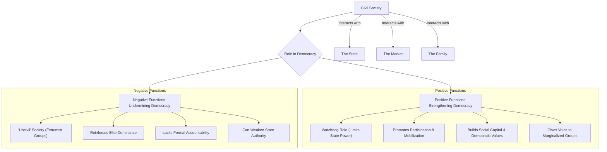
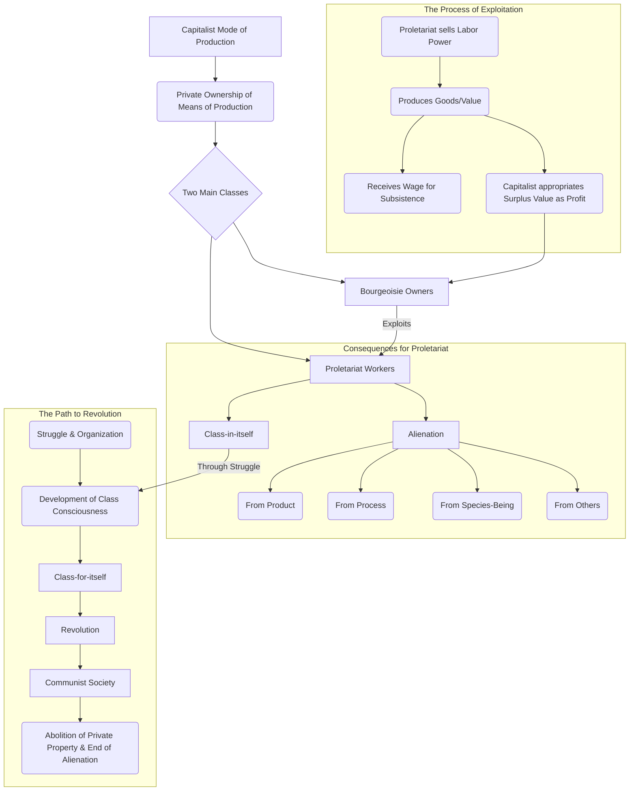
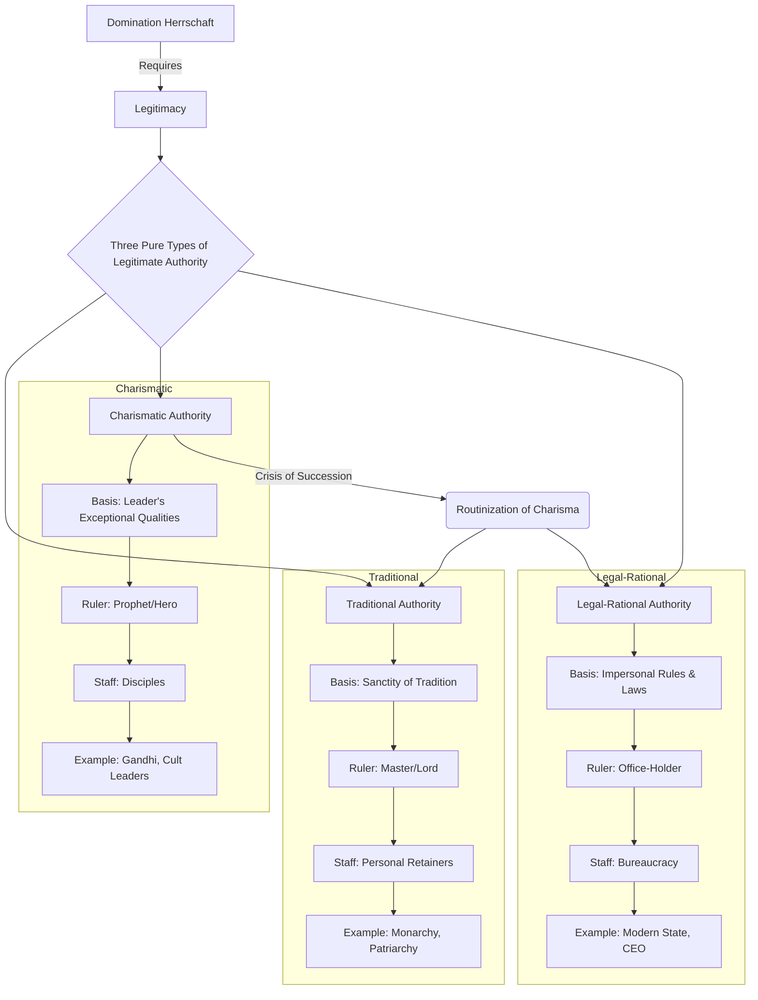
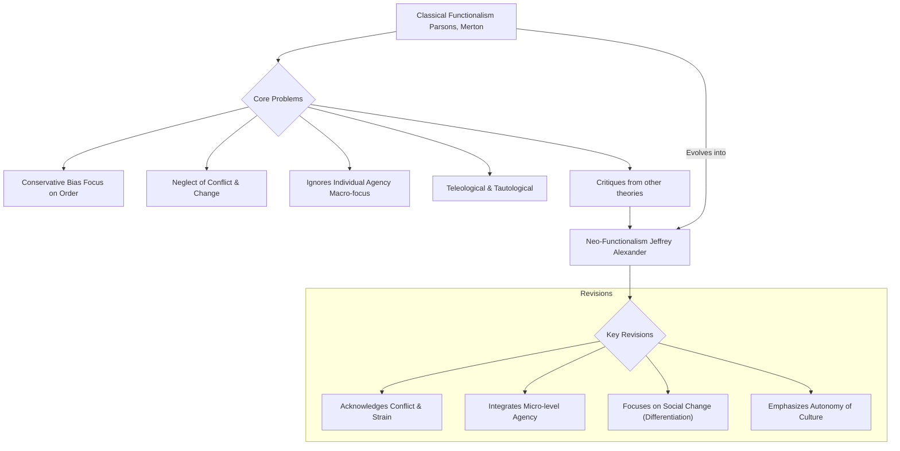
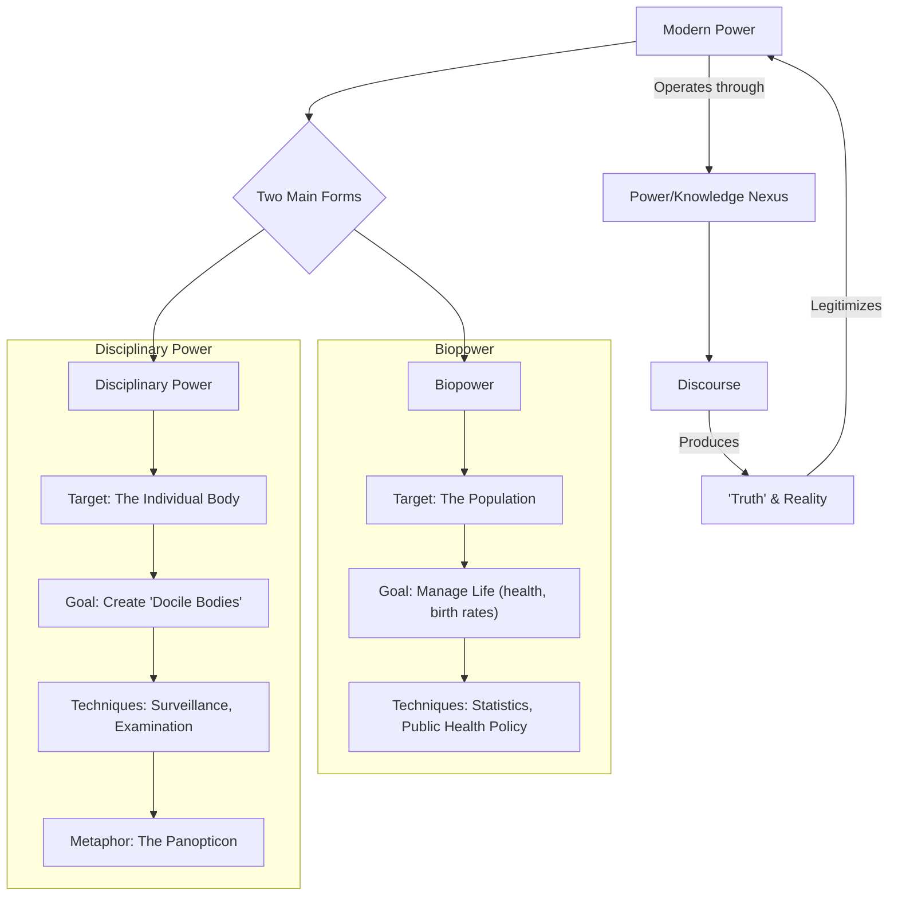
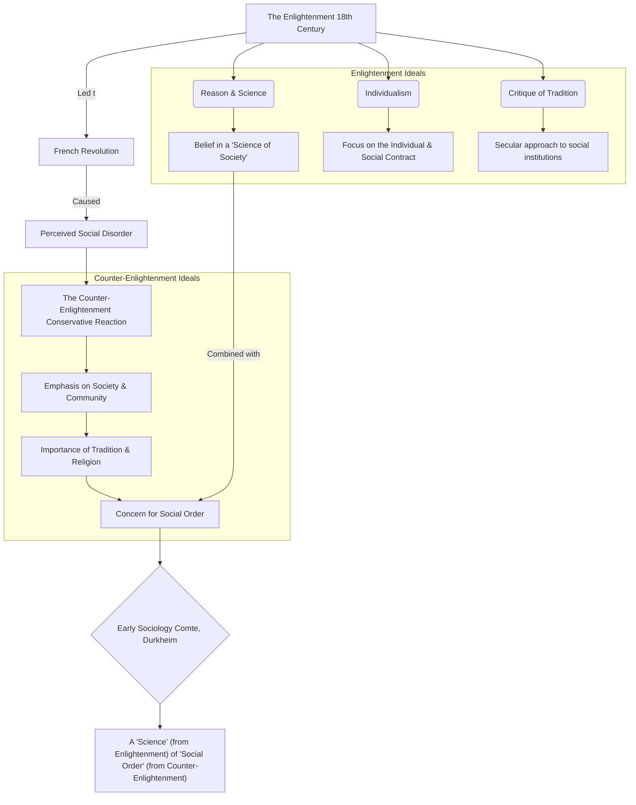
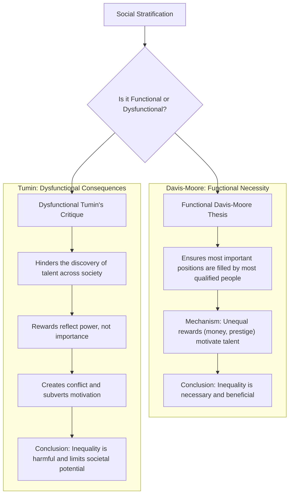
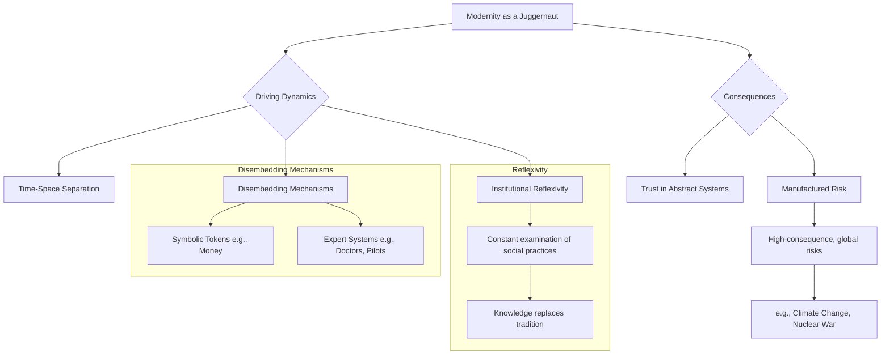
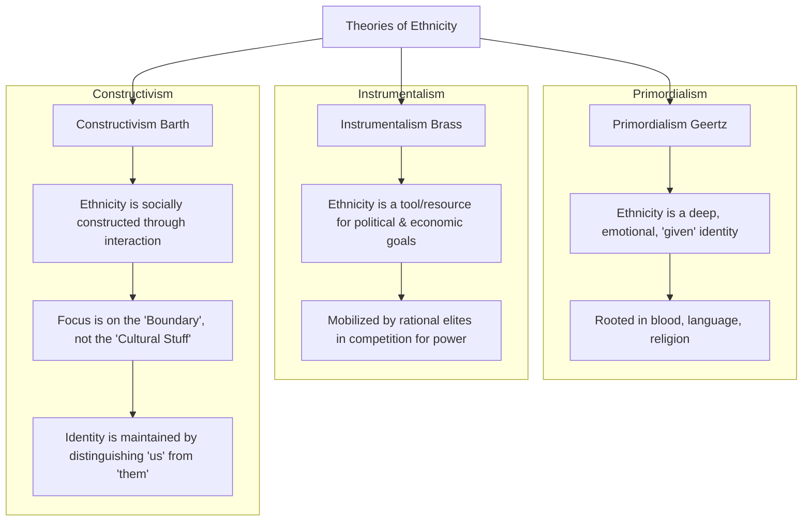

# MSO 01 Sociological Theories and Concepts
---
### Blocks 7- Units 31
#### **Block 1: Classical Sociological Tradition - I**
This block introduces the intellectual and social context from which sociology emerged, focusing on the early foundational thinkers.

*   **Unit 1:** The Enlightenment
*   **Unit 2:** The Conservative Reaction
*   **Unit 3:** The Contribution of Saint-Simon
*   **Unit 4:** Auguste Comte
*   **Unit 5:** Alexis de Tocqueville
*   **Unit 6:** Herbert Spencer

#### **Block 2: Classical Sociological Tradition - II**
This block delves into the three most influential classical sociologists who are considered the "founding fathers" of the discipline.

*   **Unit 7:** Karl Marx
*   **Unit 8:** Emile Durkheim
*   **Unit 9:** Max Weber
*   **Unit 10:** Georg Simmel

#### **Block 3: Classical Sociological Tradition - III**
This block continues the exploration of classical thought, including key figures from the early 20th century.

*   **Unit 11:** Vilfredo Pareto
*   **Unit 12:** The Social Theory of Talcott Parsons
*   **Unit 13:** The Social Theory of Robert K. Merton
*   **Unit 14:** George Herbert Mead
*   **Unit 15:** Claude Lévi-Strauss

#### **Block 4: Conceptual and Theoretical Issues**
This block shifts focus from individual theorists to core sociological concepts and debates.

*   **Unit 16:** Fact, Value and Objectivity
*   **Unit 17:** Social Structure and Social Organisation
*   **Unit 18:** Power and Authority
*   **Unit 19:** Status and Role
*   **Unit 20:** Culture and Socialisation

#### **Block 5: Social Stratification and Change**
This block examines the key concepts and theories related to social inequality and societal transformation.

*   **Unit 21:** Social Stratification
*   **Unit 22:** Social Mobility
*   **Unit 23:** Theories of Social Change

#### **Block 6: Contemporary Sociological Theories - I**
This block introduces influential theoretical perspectives from the mid-20th century, often building upon or reacting to classical theories.

*   **Unit 24:** Alfred Schutz (Phenomenology)
*   **Unit 25:** The Frankfurt School (Critical Theory)
*   **Unit 26:** Erving Goffman (Dramaturgy)
*   **Unit 27:** Harold Garfinkel (Ethnomethodology)

#### **Block 7: Contemporary Sociological Theories - II**
This block covers some of the most prominent sociological thinkers and theoretical movements of the late 20th and early 21st centuries.

*   **Unit 28:** Pierre Bourdieu
*   **Unit 29:** Anthony Giddens
*   **Unit 30:** Jürgen Habermas
*   **Unit 31:** Postmodernism

---

### **Assessment and Examination Pattern**

Understanding the assessment structure is crucial for preparing for this course:

*   **Assignments (Tutor Marked Assignments - TMA):** This carries a weightage of **30%**. You will have to submit one assignment for this course before the Term-End Examination.
*   **Term-End Examination (TEE):** This is the final written exam and carries a weightage of **70%**.

**Typical TEE Question Paper Format:**

*   **Duration:** 3 Hours
*   **Maximum Marks:** 100
*   **Structure:** The paper is usually divided into two sections. You are required to answer a total of **five questions**, selecting at least two questions from each section.
*   **Word Limit:** Each answer should be approximately **500 words**.
*   **Marks per Question:** Each question carries **20 marks**.

### **Tips for Studying MSO-01**

1.  **Understand, Don't Just Memorize:** This course is highly theoretical. Focus on understanding the core arguments of each thinker, the context in which they were writing, and their key concepts (e.g., Marx's 'alienation', Durkheim's 'anomie', Weber's 'ideal types').
2.  **Make Connections:** Try to connect the ideas of different theorists. How did Weber respond to Marx? How did Merton refine Parsons' ideas? How do contemporary thinkers like Giddens or Bourdieu build on classical theory?
3.  **Practice Writing:** The TEE requires you to write long-form answers. Practice writing 500-word essays on key topics to improve your speed and clarity.
4.  **Solve Previous Year Question Papers:** This is the best way to understand the exam pattern and identify frequently asked topics.
5.  **Use IGNOU Material:** The IGNOU study material is comprehensive and written specifically for the exam. Use it as your primary resource. The 'Check Your Progress' sections are very helpful for self-assessment.
---
---

## Comprehensive Tables

### **1. High-Impact Comparative Tables**

| Sl. No.     | Comparison Topic     | Feature               | **Karl Marx**                                 | **Max Weber**                                                                                                            |
| :---------- | :------------------- | :-------------------- | :-------------------------------------------- | :----------------------------------------------------------------------------------------------------------------------- |
| 1.1         | **Stratification**   | **Basis**             | Economic relationship to means of production  | Multi-dimensional                                                                                                        |
| 1.2         |                      | **Dimensions**        | One: **Class** (Bourgeoisie vs. Proletariat)  | Three: **Class** (Market situation), **Status** (Social honor), **Party** (Political power)                              |
| 1.3         |                      | **Class Action**      | Inevitable (Class-for-itself)                 | Not inevitable; a class is not always a community                                                                        |
| 1.4         |                      | **Focus**             | Exploitation and Revolution                   | Life Chances and Social Closure                                                                                          |
| 1.5         |                      | **Model**             | Dichotomous (Two-class model)                 | Pluralistic (Multiple classes and status groups)                                                                         |
|             |                      |                       |                                               |                                                                                                                          |
| **Sl. No.** | **Comparison Topic** | **Feature**           | **A.R. Radcliffe-Brown**                      | **Claude Levi-Strauss**                                                                                                  |
| 2.1         | **Social Structure** | **Nature**            | **Empirical Reality** (Observable)            | **Abstract Model** (Unconscious)                                                                                         |
| 2.2         |                      | **Definition**        | Network of actual social relationships        | Underlying mental logic (binary oppositions)                                                                             |
| 2.3         |                      | **Focus**             | How structure **functions** to maintain order | How structure **generates** cultural patterns                                                                            |
| 2.4         |                      | **Analogy**           | Biological Organism                           | Universal Grammar of the Mind                                                                                            |
|             |                      |                       |                                               |                                                                                                                          |
| **Sl. No.** | **Comparison Topic** | **Thinker(s)**        | **"Face" of Power**                           | **Description & Example**                                                                                                |
| 3.1         | **Faces of Power**   | **Robert Dahl**       | **First Face**                                | **Decision-Making:** Power is winning in open conflict. (e.g., A bill is passed in Parliament).                          |
| 3.2         |                      | **Bachrach & Baratz** | **Second Face**                               | **Agenda-Setting:** Power is keeping issues off the political agenda. (e.g., Lobby prevents pollution law discussion).   |
| 3.3         |                      | **Steven Lukes**      | **Third Face**                                | **Ideological:** Power is shaping beliefs to make people accept the status quo. (e.g., Believing inequality is natural). |

---

### **2. High-Impact Sociological Quotes**

| Sl. No. | Theme | Quote | Thinker & Source |
| :--- | :--- | :--- | :--- |
| 1 | **Class Conflict** | "The history of all hitherto existing society is the history of class struggles." | Karl Marx, *The Communist Manifesto* |
| 2 | **Rationality** | "...the 'disenchantment of the world'." | Max Weber, *Science as a Vocation* |
| 3 | **Methodology** | "Treat social facts as things." | Emile Durkheim, *The Rules of Sociological Method* |
| 4 | **Power** | "There is no power relation without the correlative constitution of a field of knowledge..." | Michel Foucault, *Discipline and Punish* |
| 5 | **Modernity** | "Modernity is a juggernaut... a runaway engine of enormous power..." | Anthony Giddens, *The Consequences of Modernity* |

---

### **3. Jargon & Keyword Bank**

| Sl. No. | Keyword | Associated Thinker(s) | Brief Meaning |
| :--- | :--- | :--- | :--- |
| 1 | **Anomie** | Durkheim | A state of normlessness; breakdown of social norms. |
| 2 | **Verstehen** | Weber | Empathetic understanding of human action. |
| 3 | **Ideal Type** | Weber | An analytical construct or mental model for measurement. |
| 4 | **Social Fact** | Durkheim | Ways of acting/thinking, external to the individual, and coercive. |
| 5 | **Disenchantment** | Weber | The decline of magic and religion in the face of rationality. |
| 6 | **Surplus Value** | Marx | The value workers produce beyond their wages; the source of profit. |
| 7 | **Social Capital** | Putnam, Bourdieu | Networks of trust and reciprocity in a community. |
| 8 | **Habitus** | Bourdieu | Ingrained habits, skills, and dispositions of a social group. |
| 9 | **Governmentality** | Foucault | The art of governing populations through diffuse techniques. |
| 10 | **Risk Society** | Ulrich Beck | A society preoccupied with managing self-created, manufactured risks. |
| 11 | **Binary Oppositions** | Levi-Strauss | The tendency of the human mind to think in pairs of opposites (e.g., raw/cooked). |
| 12 | **AGIL Paradigm** | Parsons | The four functional prerequisites of any social system: Adaptation, Goal-Attainment, Integration, Latency. |

---

### **4. Contemporary Thinkers & Books for Application**

| Sl. No. | Thinker / Book                                              | Core Concept                  | Application in MSO-001 Answers                                                                                                                |
| :------ | :---------------------------------------------------------- | :---------------------------- | :-------------------------------------------------------------------------------------------------------------------------------------------- |
| 1       | **Amartya Sen** (*The Idea of Justice*)                     | **Capability Approach**       | Critique purely economic views of inequality (Marx/Weber). Argue that true equality is about having the capability to live a life one values. |
| 2       | **Ulrich Beck** (*Risk Society*)                            | **Manufactured Risk**         | Complement Giddens' theory of modernity. Use examples like Bhopal gas tragedy or microplastics to illustrate modern risks.                    |
| 3       | **Dipankar Gupta** (*Mistaken Modernity*)                   | **Mistaken Modernity**        | Conclude an answer on modernity in India. Argue India adopted Western symbols but not core values like civic consciousness.                   |
| 4       | **Christophe Jaffrelot** (*The Hindu Nationalist Movement*) | **Elite Mobilization**        | Provide concrete examples for the Instrumentalist theory of ethnicity, showing how elites mobilize caste/religion for political gain.         |
| 5       | **Robert Putnam** (*Bowling Alone*)                         | **Decline of Social Capital** | Strengthen answers on Civil Society. Argue that a decline in associational life (people "bowling alone") weakens democracy.                   |

---
---
## Tier 1: The Absolute Core (Highest Priority)

This tier contains the most frequently asked and foundational topics. Mastering these is essential for a high score.

**Themes Covered in Tier 1:**
1.  **Theories of Community Power:** The Elitist vs. Pluralist Debate (Miller vs. Dahl).
2.  **Perspectives on Social Structure:** The debate between Structural Functionalism (Radcliffe-Brown), Structuralism (Levi-Strauss), and the perspective of Evans-Pritchard.
3.  **Civil Society and Democracy:** Its role, relationship with the state, and critiques.
4.  **Marxist Theory:** Core concepts of Alienation and Class Conflict.
5.  **Weberian Theory:** Core concepts of Power (Class, Status, Party) and Legitimacy/Authority.
6.  **Functionalism & Neo-Functionalism:** Basic premises, critiques, and evolution.
7.  **Power and Knowledge:** Foucault's perspective.

---
**Relevant PYQs for Tier 1 Themes:**

*   **Community Power (Miller & Dahl):** June 2024, Dec 2022, Dec 2021, Feb 2021.
*   **Social Structure:**
    *   **Radcliffe-Brown:** Dec 2023, June 2020, Dec 2018, June 2015.
    *   **Levi-Strauss:** June 2024, Dec 2021.
    *   **Evans-Pritchard:** Dec 2022, June 2021, Feb 2021.
*   **Civil Society & Democracy:** June 2024, Dec 2023, June 2023, Dec 2022, June 2022, Dec 2021, Dec 2018, Dec 2017, Dec 2016.
*   **Marx (Alienation/Class):** Dec 2022, June 2019, Dec 2017, Dec 2016, Dec 2015.
*   **Weber (Power/Legitimacy):** June 2024, Dec 2021, Dec 2017.
*   **Functionalism/Neo-Functionalism:** Dec 2023, June 2021, Dec 2017.
*   **Foucault (Power/Knowledge):** June 2022, June 2020.

---


### **Theme1: Theories of Community Power: The Elitist vs. Pluralist Debate**

**(Keywords: Elitism, Pluralism, Community Power, Reputational Method, Decisional Method, Non-decision making)**

#### **Introduction**

The fundamental question of **"Who governs?"** at the local community level has been central to political sociology. This query sparked a major theoretical debate between two opposing schools of thought: **1. The Elitist perspective**, which posits that power is concentrated in the hands of a few, and **2. The Pluralist perspective**, which argues that power is dispersed among multiple competing groups. The classic proponents of these views are **Delbert Miller** and **Robert Dahl**, respectively, whose studies represent a landmark confrontation in the field.

#### **1. The Elitist View: Delbert Miller's Reputational Approach**

Following the work of **Floyd Hunter**, **Delbert Miller** championed the elitist view of community power. His central thesis is that a small, cohesive, and often business-dominated elite holds the real power and influences key decisions, even from behind the scenes.

*   **Methodology: The "Reputational Method"**
    Miller utilized the **"reputational method."** This involves asking a panel of knowledgeable citizens, "Who are the most powerful people in this community?" The individuals who are consistently named are considered the ruling elite. For Miller, power is an **attribute** of individuals and is relatively permanent.

*   **Core Findings**
    In his comparative study of an American city ("Regional City") and an English city ("English City"), Miller found that **business leaders** overwhelmingly constituted the power elite in the American context. He argued that this elite forms a **stable and monolithic structure of power**, whose influence cuts across various issues.

#### **2. The Pluralist Counter: Robert Dahl's Decisional Approach**

**Robert Dahl** launched a direct critique of the elitist model, proposing a pluralist vision of power. He argued that power is not a monolithic structure but is **fragmented, non-cumulative, and dispersed** among various interest groups who contend for influence.

*   **Methodology: The "Decisional Method"**
    Dahl developed the **"decisional (or event-analysis) method."** Instead of asking about reputation, he studied who actually participated in and influenced the outcomes of key political decisions in specific issue areas (e.g., education, urban renewal). His focus was on the **actual exercise of power**.

*   **Core Findings**
    In his landmark study of New Haven, **"Who Governs?" (1961)**, Dahl found no single, all-purpose elite. The group that was influential in educational policy was different from the one that dominated urban redevelopment. He concluded that politics is a process of **bargaining and compromise** between competing groups. Power, for Dahl, is **issue-specific and relational**.

#### **3. Critical Evaluation and Synthesis**

The Miller-Dahl debate highlights a fundamental tension in understanding power.

1.  **Critique of Miller:** The reputational approach can be a self-fulfilling prophecy, confusing the **reputation for power** with the actual **exercise of it**.
2.  **Critique of Dahl:** The decisional approach was criticized by **Bachrach and Baratz** for ignoring the **"second face of power."** They argued that elites also exercise power by preventing certain issues from ever reaching the decision-making agenda, a concept known as **"non-decision making."**
3.  **Steven Lukes' Contribution:** Lukes further developed this with his **"three-dimensional view of power,"** adding the power to shape people's perceptions and preferences, making them accept their role in the existing order as natural or inevitable.

#### **Comparative Framework: Miller vs. Dahl**

| Basis of Comparison | **Delbert Miller (Elitist)** | **Robert Dahl (Pluralist)** |
| :--- | :--- | :--- |
| **Nature of Power** | Concentrated, Monolithic, Stable | Dispersed, Fragmented, Dynamic |
| **Locus of Power** | A single, cohesive elite (often business) | Multiple, competing interest groups |
| **Research Method** | Reputational Method (Who is powerful?) | Decisional Method (Who decides?) |
| **Key Finding** | Power is an attribute of a few individuals. | Power is relational and issue-specific. |

#### **Conclusion & Contemporary Indian Relevance**

The Miller-Dahl debate remains foundational for analyzing local governance. In contemporary India, this dynamic is clearly visible. The push for a new industrial plant may be driven by a powerful **corporate-political elite** (Miller's view). However, this is often met with resistance from a coalition of **farmers' unions, environmental NGOs, and local Panchayat bodies**, showcasing a pluralistic contestation of power (Dahl's view), as seen in cases like the **Niyamgiri hills protest against Vedanta** or the **Narmada Bachao Andolan**.

---
### **Quick Revision Scaffold**

*   **Elitism (Miller):**
    *   **Thesis:** Power is concentrated in a small, stable, business-led elite.
    *   **Method:** Reputational (Who is powerful?).
    *   **Power is:** An attribute of individuals.
*   **Pluralism (Dahl):**
    *   **Thesis:** Power is dispersed among competing groups.
    *   **Method:** Decisional (Who decides on key issues?).
    *   **Power is:** Relational and issue-specific.
*   **Critiques:**
    *   **Of Miller:** Confuses reputation with reality.
    *   **Of Dahl:** Ignores "non-decision making" (Bachrach & Baratz) and ideological power (Lukes).
*   **Indian Example:** Corporate Elite vs. Civil Society Coalition (e.g., Niyamgiri, Narmada).

---

### **Theme 2: Perspectives on Social Structure**

This is a classic comparative theme. The exam loves to ask about these thinkers individually or pit them against each other. The core of the debate is: **Is social structure an observable reality or an underlying abstract model?**

---

### **Note 2.1: A.R. Radcliffe-Brown's Structural-Functionalism**

**(Keywords: Social Structure, Social Physiology, Social Morphology, Empirical Reality, Network of Relations)**

#### **Introduction**

**A.R. Radcliffe-Brown** is a key figure in the British school of social anthropology and a pioneer of **structural-functionalism**. He famously asserted that **"Social structure is a reality."** For him, sociology should be a natural science of society, and social structure was not an abstract concept but an **empirical, observable reality** that could be studied directly, much like the anatomy of an organism.

#### **1. The Concept of Social Structure**

Radcliffe-Brown defined social structure as the **"network of actually existing social relationships."** This network connects individuals to one another in an ordered arrangement.

1.  **Unit of Analysis:** The fundamental unit of social structure is the **person**, viewed not as an organism but as a complex of social relationships.
2.  **Focus on Relations:** The structure itself is the set of relations between these persons, institutionalized through **roles, statuses, norms, and values**.
3.  **Direct Observation:** Crucially, this network of relationships can be **directly observed** by the fieldworker. An anthropologist can map out kinship ties, political hierarchies, and economic exchanges within a community.

#### **2. Analogy with a Biological Organism**

To explain his concept, Radcliffe-Brown used a powerful analogy with a biological organism.

*   **Social Morphology:** This is the study of the **form or structure** of society—its constituent parts and their arrangement (e.g., kinship systems, political organization). This is like studying the anatomy of an animal.
*   **Social Physiology:** This is the study of how this structure **functions**. It examines how the different parts work together to maintain the life of the whole social system. This is like studying the physiological processes of an animal.
*   **Function:** The "function" of any recurrent social activity is the part it plays in the total social life, i.e., its contribution to the **maintenance of structural continuity**.

#### **3. Social Structure as a Dynamic Reality**

While he focused on continuity, Radcliffe-Brown acknowledged that social structure is not static.

1.  **Continuity and Change:** The structure persists over time, even as the individuals who occupy the positions within it change (e.g., a king dies, but the monarchy continues).
2.  **Dynamic Process:** Social life is a dynamic process of interactions. The structure is constantly being renewed and maintained through these interactions.

#### **4. Critique of Radcliffe-Brown's View**

1.  **Overemphasis on Harmony:** Critics argue that his focus on function and continuity leads to an overemphasis on social harmony and stability, neglecting **conflict, contradiction, and radical change**.
2.  **Tautological Reasoning:** The argument can be circular: a social institution exists because it is functional, and we know it is functional because it exists.
3.  **Neglect of Individual Agency:** The individual is seen merely as a product of the social structure, with little room for agency or deviation.
4.  **Empiricist Limitation:** **Edmund Leach** and **Levi-Strauss** argued that focusing only on observable reality is superficial. It describes the "how" but not the "why." The real structure, they claimed, lies in the unobservable, underlying principles that generate the observable reality.

#### **Conclusion**

Radcliffe-Brown's contribution was to establish social structure as a central, empirically grounded concept in sociology and anthropology. His insistence on treating it as an observable reality paved the way for systematic, scientific fieldwork. However, his approach was challenged by structuralists like Levi-Strauss, who argued that the true structure is not the visible network of relations but the **unconscious mental model** that gives it form.

---
### **Note 2.2: Claude Levi-Strauss's Structuralism**

**(Keywords: Structuralism, Unconscious Infrastructure, Binary Oppositions, Model, Mythemes)**

#### **Introduction**

**Claude Levi-Strauss**, the father of **structuralism**, offered a radical alternative to Radcliffe-Brown's empiricism. He argued that social structure is **not an empirical reality** but a **"model"** constructed by the sociologist to explain that reality. The true structure is the **unconscious, underlying mental infrastructure** that generates the surface-level social phenomena like kinship and myth.

#### **1. Social Structure as a Model**

For Levi-Strauss, what we observe (the network of relationships) is just the surface. The real work of the sociologist is to uncover the hidden logic behind it.

1.  **Structure vs. Social Relations:** He made a sharp distinction. **Social relations** are the raw data of social life—they are observable but often chaotic and contradictory. **Social structure** is the formal, logical **model** built by the analyst to make sense of these relations.
2.  **Unconscious Foundation:** This underlying structure is not conscious to the actors themselves. It is a product of the **universal structures of the human mind**, which, he argued, tends to think in terms of **binary oppositions** (e.g., raw/cooked, nature/culture, left/right).

#### **2. The Study of Kinship and Myth**

Levi-Strauss applied this method most famously to kinship and myth.

*   **Kinship:** He argued that the observable diversity of marriage rules could be explained by a single, underlying principle: the **"exchange of women"** between groups. This exchange is a universal mechanism for creating social solidarity. The different forms (e.g., restricted vs. generalized exchange) are just surface variations of this deep structural logic.
*   **Myth:** He broke down myths from different cultures into their smallest constituent units, which he called **"mythemes."** He showed that these mythemes were organized in binary oppositions. The purpose of a myth, he argued, is to provide a logical model capable of **mediating or resolving a fundamental contradiction** in human existence (e.g., the conflict between life and death).

#### **3. Characteristics of a Structural Model**

A model, to be considered a "structure," must have several characteristics:

1.  **Systemic:** It must be a system where a change in one element affects all other elements.
2.  **Transformational:** It should be possible to predict how the model will react if one of its elements is modified.
3.  **Explanatory:** The model must make it possible to understand all the observed facts.

#### **4. Critique of Levi-Strauss's View**

1.  **Ahistorical and Static:** Critics argue that his approach is overly abstract and detached from historical context and social change. It presents a static, timeless view of the human mind.
2.  **Reification of Models:** He is accused of treating his own analytical models as if they were real entities, imposing a rigid, formal logic onto the messiness of human life.
3.  **Lack of Empirical Proof:** The existence of these "unconscious universal structures" is an assertion that is difficult, if not impossible, to prove empirically.
4.  **Neglect of Agency:** Like Radcliffe-Brown, he leaves little room for individual agency, seeing humans as puppets of deep, unconscious structures.

#### **Conclusion**

Levi-Strauss fundamentally shifted the focus of social analysis from the **observable social order** to the **hidden cognitive order**. His structuralism sought to uncover the universal "grammar" of the human mind that underpins all social institutions. While Radcliffe-Brown saw structure as the visible skeleton of society, Levi-Strauss saw it as the invisible DNA that codes for that skeleton.

---
### **Note 2.3: E.E. Evans-Pritchard on Social Structure**

**(Keywords: Structural Form, Ecological Relations, Political System, Segmentary Lineage)**

#### **Introduction**

**E.E. Evans-Pritchard**, a student of the British school, offers a perspective that bridges the gap between Radcliffe-Brown's strict empiricism and later critiques. While he initially followed the structural-functionalist model, his later work showed a move towards a more nuanced and historical understanding. His famous statement is that **"Social structure refers to relations between groups."**

#### **1. Structure as Inter-Group Relations**

Evans-Pritchard's primary focus was on the **political and territorial organization** of societies, particularly those without centralized states ("acephalous" societies).

1.  **Beyond the Individual:** He shifted the focus from the network of interpersonal relations (Radcliffe-Brown) to the **relations between enduring social groups** (like clans, lineages, and age-sets).
2.  **Structural Form:** He was interested in the **"structural form"** or the persistent principles that governed how these groups related to each other over time and space.
3.  **Ecological Context:** He uniquely emphasized the importance of the **ecological environment** in shaping the social structure. The way a society adapts to its physical surroundings is a key part of its structure.

#### **2. The Nuer Study: A Classic Example**

His masterpiece, **"The Nuer" (1940)**, is a classic demonstration of his approach.

*   **The Problem:** How do the Nuer, who lack chiefs or any formal government, maintain social order?
*   **The Solution: The Segmentary Lineage System**
    *   The Nuer are organized into a series of clans and lineages of increasing scale (minimal, major, maximal).
    *   Political relations are structured by this lineage system. The principle is **"balanced opposition."**
    *   For example, two minimal lineages might fight, but if one is attacked by a larger lineage, they will unite to face the common threat.
    *   This system creates a flexible and dynamic political order based on a **relative and situational identity**. Who you are depends on who you are opposing.

#### **3. Shift in Perspective**

In his later career, Evans-Pritchard grew critical of the "natural science" model of sociology.

1.  **Sociology as Humanities:** He argued that sociology is closer to **history and the humanities** than to the natural sciences. It should seek to **interpret and understand** societies, not just explain them with universal laws.
2.  **Focus on Meaning:** This showed a move towards understanding the **subjective meanings** and values that people hold, a step away from the purely objective analysis of structure.

#### **Conclusion**

Evans-Pritchard's work represents a crucial development in the study of social structure. By focusing on **inter-group relations** and the **dynamic, situational nature of political identity**, he provided a powerful model for understanding order in stateless societies. His later turn towards a more interpretive and historical approach also foreshadowed the decline of rigid structural-functionalism and the rise of more agency-focused theories.

---
### **Mermaid Diagram: Comparing Perspectives on Social Structure**

```mermaid
graph TD
    A[Social Structure] --> B{Is it an observable reality or an abstract model?};
    B --> C[Observable Reality];
    B --> D[Abstract Model];

    subgraph Radcliffe-Brown ((Structural-Functionalism))
        C --> C1["Network of actually existing social relationships"];
        C1 --> C2["Can be directly observed (Empirical)"];
        C2 --> C3["Focus: Maintaining social order (Function)"];
    end

    subgraph Levi-Strauss (Structuralism)
        D --> D1["A model built by the analyst to explain reality"];
        D1 --> D2["Reflects unconscious structures of the human mind"];
        D2 --> D3["Focus: Binary oppositions and universal logic"];
    end
    
    subgraph Evans-Pritchard (Bridging View)
        A --> E["Relations between enduring social groups (lineages, clans)"];
        E --> E1["Focus on political and ecological systems"];
        E1 --> E2["Structure is dynamic and situational (e.g., The Nuer)"];
    end

```

---
### **Quick Revision Scaffold**

*   **Radcliffe-Brown:**
    *   **Thesis:** Structure is an **observable, empirical reality**.
    *   **Definition:** A network of actual social relations.
    *   **Analogy:** Biological organism (morphology & physiology).
    *   **Focus:** Function, continuity, order.
*   **Levi-Strauss:**
    *   **Thesis:** Structure is an **abstract model**, not reality.
    *   **Definition:** A model of unconscious mental logic.
    *   **Method:** Uncovering binary oppositions (e.g., in myths).
    *   **Focus:** Universal grammar of the human mind.
*   **Evans-Pritchard:**
    *   **Thesis:** Structure is the relation **between social groups**.
    *   **Definition:** Persistent principles governing group interactions.
    *   **Example:** Segmentary lineage system of The Nuer.
    *   **Focus:** Political order, ecology, situational identity.

---

Excellent. Proceeding to the next high-priority theme. This is one of the most repeated topics in the MSO-001 exam.

---

### **Theme 3: Civil Society and Democracy**

**(Keywords: Civil Society, State, Democracy, Public Sphere, Associational Life, Social Capital)**

#### **Introduction**

The concept of **civil society** is fundamental to modern democratic theory. It refers to the realm of organized social life that is **voluntary, self-generating, largely self-supporting, and autonomous from the state**. This "third sector" exists between the state and the family/market. The relationship between a vibrant civil society and a healthy democracy is a central theme in sociology, with thinkers from **Hegel** and **Gramsci** to contemporary theorists like **Jurgen Habermas** and **Robert Putnam** offering crucial insights.

#### **1. Defining Civil Society: The Associational Realm**

Civil society is the arena where citizens associate and organize themselves around shared interests, purposes, and values.

1.  **Key Components:** Its institutional core includes **Non-Governmental Organizations (NGOs), community groups, women's organizations, trade unions, professional associations, social movements, and religious bodies.**
2.  **Distinction from State and Market:**
    *   It is distinct from the **state**, which holds a monopoly on coercive power.
    *   It is distinct from the **market**, which is driven by profit motives.
    *   It is distinct from the **family** or private sphere.
3.  **The Public Sphere:** As conceptualized by **Jurgen Habermas**, civil society creates a **"public sphere"** where citizens can deliberate on matters of public concern, form public opinion, and hold the state accountable.

#### **2. The Role of Civil Society in Strengthening Democracy**

A robust civil society is widely considered essential for a functioning democracy. It performs several critical functions:

1.  **Limiting State Power (A "Watchdog" Role):** Civil society acts as a crucial **counterweight to the state**. By monitoring government actions, exposing corruption, and advocating against rights violations, it prevents the state from becoming overly authoritarian.
    *   **Indian Example:** The **People's Union for Civil Liberties (PUCL)** has consistently used public interest litigation (PIL) to challenge state excesses.

2.  **Promoting Political Participation:** It provides channels for citizens to participate in politics beyond simply voting. Social movements and advocacy groups mobilize people, articulate their interests, and lobby the government.
    *   **Indian Example:** The **Narmada Bachao Andolan** mobilized thousands of people and brought the issue of displacement to the national and international stage.

3.  **Fostering Democratic Values (A "School of Democracy"):** Participation in voluntary associations teaches citizens the skills of democracy: **debate, tolerance, compromise, and collective decision-making**. This builds what **Robert Putnam** calls **"social capital"**—networks of trust and reciprocity that are vital for a healthy society.

4.  **Articulating and Aggregating Interests:** Civil society gives a voice to diverse and often marginalized groups (e.g., Dalits, Adivasis, LGBTQ+ communities) whose interests might otherwise be ignored by mainstream political parties.
    *   **Indian Example:** The rise of Dalit literature and activist groups has brought issues of caste discrimination to the forefront of national debate.

5.  **Providing Policy Alternatives:** NGOs and think tanks often possess specialized knowledge and can develop and propose innovative solutions to complex social problems, enriching public discourse and improving governance.
    *   **Indian Example:** The **Centre for Science and Environment (CSE)** in Delhi provides expert analysis and advocacy on environmental issues, influencing government policy.

#### **3. The "Dark Side" of Civil Society: Critiques and Limitations**

The relationship between civil society and democracy is not always positive. Critics point to several potential problems:

1.  **"Uncivil" Society:** Not all associations are democratic or tolerant. Civil society can also include **ethnic chauvinist groups, religious fundamentalist organizations, and extremist movements** that can undermine democracy and promote hatred.
    *   **Indian Example:** The rise of vigilante "Gau Rakshak" (cow protection) groups has led to violence and social polarization.

2.  **Reinforcing Inequalities:** Civil society is not a level playing field. Well-funded, urban-based NGOs may have a much louder voice than grassroots organizations representing the poor. It can sometimes amplify the voices of the elite rather than the marginalized.

3.  **The Problem of Legitimacy and Accountability:** Unlike elected governments, civil society organizations are not formally accountable to the public. This raises questions about who they represent and to whom they answer, especially in the case of foreign-funded NGOs.

4.  **Weakening the State:** An overly adversarial civil society can sometimes paralyze governance and weaken the legitimate authority of the state, creating a policy vacuum or gridlock.

#### **Conclusion**

The relationship between civil society and democracy is complex and dialectical. A vibrant, autonomous civil society is a necessary, but not sufficient, condition for a healthy democracy. It plays an indispensable role in checking state power, fostering participation, and building democratic values. However, it is not inherently virtuous. The challenge for any democracy, including India's, is to foster a pluralistic and tolerant civil society while guarding against its "uncivil" tendencies, ensuring it remains a space for constructive dialogue and democratic empowerment.

---
### **Mermaid Diagram: Functions and Dysfunctions of Civil Society**



---
### **Quick Revision Scaffold**

*   **Definition:** The "third sector" of voluntary, autonomous associations between the state, market, and family.
*   **Core Components:** NGOs, social movements, unions, community groups.
*   **Positive Roles in Democracy:**
    1.  **Watchdog:** Limits state power.
    2.  **Participation:** Mobilizes citizens.
    3.  **School of Democracy:** Builds social capital (Putnam).
    4.  **Voice:** Articulates interests of the marginalized.
    5.  **Policy:** Provides alternative solutions.
*   **"Dark Side" / Critiques:**
    1.  **Uncivil Society:** Extremist, intolerant groups.
    2.  **Inequality:** Can be dominated by elites.
    3.  **Accountability:** Lacks formal democratic legitimacy.
    4.  **Weakening State:** Can lead to policy gridlock.
*   **Indian Examples:** PUCL (watchdog), Narmada Andolan (participation), CSE (policy), Gau Rakshaks (uncivil).

---

Perfect. Moving on to the next core theme: the foundational concepts of Karl Marx.

---

### **Theme 4: Marxist Theory: Alienation and Class Conflict**

**(Keywords: Alienation, Dehumanization, Class, Bourgeoisie, Proletariat, Class Conflict, Historical Materialism)**

### **Note 4.1: Marx's Theory of Alienation**

#### **Introduction**

**Karl Marx's** theory of **alienation** (or estrangement), primarily detailed in his **"Economic and Philosophic Manuscripts of 1844,"** is a profound critique of capitalism. He argued that under the capitalist mode of production, human labor is reduced to a commodity, leading to a process of **dehumanization**. Workers become separated from their own humanity, their work, the products they create, and their fellow human beings. Alienation is not a feeling but an **objective condition** rooted in the economic structure of society.

#### **1. The Four Dimensions of Alienation**

Marx identified four key aspects of how workers are alienated under capitalism:

1.  **Alienation from the Product of Labor:**
    *   The worker creates a product that does not belong to them. It is owned by the **capitalist (bourgeoisie)**.
    *   The more the worker produces, the poorer they become, as the value they create is appropriated as profit.
    *   The product becomes an **alien object** that stands against the worker, dominating them. The world of objects they create becomes a hostile force.
    *   **Example:** A factory worker on an assembly line produces thousands of smartphones but cannot afford to buy one and has no control over its design or distribution.

2.  **Alienation from the Process of Labor (The Act of Production):**
    *   Work is not a voluntary, creative expression of human potential. It is **forced, external labor** performed only to earn a wage for survival.
    *   The worker does not find fulfillment in their work; they feel miserable and deny themselves. They only feel "at home" during their leisure time.
    *   The work process is controlled by the capitalist, dictating the pace, hours, and conditions.
    *   **Example:** A call center employee follows a rigid script, with their time monitored to the second, turning the act of communication into a mechanical, unfulfilling task.

3.  **Alienation from "Species-Being" (Gattungswesen):**
    *   "Species-being" refers to the essential, creative nature of humanity. Humans, unlike animals, can engage in **conscious, free, and creative production**.
    *   Capitalism reduces this creative potential to a mere **means of physical survival**.
    *   The worker is alienated from their own human essence. Their humanity is stripped away, and they are reduced to the level of an animal, working only to eat.

4.  **Alienation from Other Human Beings (Fellow Workers):**
    *   Capitalism pits workers against each other in a competitive labor market.
    *   Social relationships become **market relationships**, mediated by money and competition rather than cooperation and solidarity.
    *   The worker sees the capitalist as an alien, hostile power, and their fellow workers as competitors for scarce jobs.
    *   **Example:** Gig economy workers (e.g., food delivery riders) competing for the same orders, with their interactions managed by an impersonal algorithm.

#### **2. The Root Cause and Solution**

*   **Cause:** The root cause of alienation is the **private ownership of the means of production**. This fundamental division separates the owners (bourgeoisie) from the non-owners (proletariat).
*   **Solution:** For Marx, the only way to overcome alienation is to abolish private property through a **proletarian revolution**. In a communist society, where the means of production are collectively owned, labor would once again become a free, creative, and fulfilling expression of human nature.

---

### **Note 4.2: Marx's Theory of Class and Class Conflict**

#### **Introduction**

For Karl Marx, the concept of class is the master key to understanding history and society. In the famous opening line of **"The Communist Manifesto" (co-authored with Friedrich Engels)**, he declares, **"The history of all hitherto existing society is the history of class struggles."** Class is not defined by income or status but by one's **relationship to the means of production**. Class conflict is the primary engine of historical change.

#### **1. The Definition of Class**

1.  **Objective Criterion:** A class is a group of people who share a common relationship to the **means of production** (e.g., land, factories, tools).
2.  **The Two Great Classes:** In every historical epoch, society is fundamentally divided into two antagonistic classes:
    *   **The Bourgeoisie (Haves):** The owners of the means of production.
    *   **The Proletariat (Have-Nots):** Those who own nothing but their own **labor power**, which they must sell to the bourgeoisie to survive.
3.  **Other Classes:** Marx acknowledged the existence of other classes, like the **petty bourgeoisie** (small shopkeepers) and the **lumpenproletariat** (the "social scum"), but he saw them as transitional and ultimately destined to be absorbed into the two main classes.

#### **2. From "Class-in-itself" to "Class-for-itself"**

Marx made a crucial distinction for a class to become a revolutionary agent:

*   **Class-in-itself (Klasse an sich):** This is an objective category. The proletariat exists as a class simply because its members share the same economic position (non-owners of capital). However, they are not yet aware of their shared interests or common enemy.
*   **Class-for-itself (Klasse für sich):** This is a subjective category. It is achieved when the proletariat develops **class consciousness**—a subjective awareness of their exploitation and their historical mission to overthrow capitalism. This transformation occurs through struggle, organization (e.g., trade unions), and the development of a revolutionary ideology.

#### **3. The Inevitability of Class Conflict**

Class conflict is not accidental but is **built into the very structure of capitalism**.

1.  **Exploitation:** The relationship between the bourgeoisie and the proletariat is inherently exploitative. The capitalist extracts **surplus value** from the worker—the value created by the worker beyond what they are paid in wages. This is the source of profit.
2.  **Irreconcilable Interests:** The interests of the two classes are fundamentally opposed. The bourgeoisie seeks to maximize profit by minimizing wages and intensifying work, while the proletariat seeks to improve its conditions by increasing wages and reducing exploitation.
3.  **The Trajectory of Capitalism:** Marx predicted that capitalism's own dynamics would lead to its downfall:
    *   **Increasing Polarization:** The middle classes would sink into the proletariat.
    *   **Increasing Misery (Pauperization):** The condition of the workers would worsen.
    *   **Economic Crises:** Capitalism is prone to cyclical crises of overproduction.
    *   These factors would heighten class consciousness and accelerate the revolutionary struggle.

#### **4. Critique of Marx's Theory**

1.  **The Missing Revolution:** The proletarian revolutions Marx predicted did not occur in advanced capitalist societies.
2.  **Rise of the Middle Class:** Instead of disappearing, the middle class has grown significantly in the 20th and 21st centuries.
3.  **Two-Class Model is Too Simplistic:** **Max Weber** argued that class is more complex, and that **status** and **party (political power)** are also crucial dimensions of social stratification.
4.  **Role of the State:** Marx saw the state as a mere "executive committee of the bourgeoisie." However, the modern welfare state has often acted to mediate class conflict and improve workers' conditions, blunting revolutionary potential.

#### **Conclusion**

Despite these critiques, Marx's theories of alienation and class conflict remain among the most powerful and influential critiques of modern society. They provide an indispensable framework for analyzing economic inequality, exploitation, and the dynamics of power in capitalist systems. While history did not unfold exactly as he predicted, his concepts continue to illuminate the deep-seated tensions that shape our world.

---
### **Mermaid Diagram: Marx's Theory of Historical Change**



---
### **Quick Revision Scaffold**

*   **Alienation:** Dehumanization under capitalism. Rooted in private property.
    *   **Four Types:**
        1.  **From Product:** Belongs to capitalist.
        2.  **From Process:** Forced, not creative.
        3.  **From Species-Being:** From human essence.
        4.  **From Others:** Competition, not solidarity.
*   **Class:** Defined by relationship to means of production.
    *   **Two Classes:** Bourgeoisie (owners) vs. Proletariat (workers).
    *   **Exploitation:** Capitalist extracts surplus value.
*   **Class Conflict:** The engine of history.
    *   **Class-in-itself:** Objective economic position.
    *   **Class-for-itself:** Subjective class consciousness.
    *   **Revolution:** Inevitable outcome of capitalism's contradictions.
*   **Critiques:** Revolution didn't happen; middle class grew; Weber's multi-dimensional view (class, status, party).

---

Excellent. We now turn to Max Weber, whose work provides a crucial counterpoint to Marx's economic determinism.

---

### **Theme 5: Weberian Theory: Power, Legitimacy, and Authority**

**(Keywords: Power, Domination, Legitimacy, Authority, Class, Status, Party, Charismatic, Traditional, Legal-Rational)**

### **Note 5.1: Weber's Multi-dimensional View of Power: Class, Status, and Party**

#### **Introduction**

**Max Weber**, in his seminal work **"Economy and Society,"** offered a more nuanced and multi-dimensional theory of power and stratification than Marx. While he agreed with Marx that economic class was a crucial factor, he argued it was not the only one. For Weber, social stratification and the distribution of **power (Macht)** in a society occur along three distinct, though often overlapping, dimensions: **Class, Status, and Party**. This framework provides a sophisticated tool for analyzing social inequality.

#### **1. The Concept of Power (Macht) and Domination (Herrschaft)**

*   **Power (Macht):** Weber defined power as "the probability that one actor within a social relationship will be in a position to carry out his own will despite resistance." This is a very broad definition, encompassing almost any form of influence.
*   **Domination (Herrschaft):** A more specific and sociologically important concept for Weber. It is the "probability that a command with a given specific content will be obeyed by a given group of persons." Domination implies **legitimacy**—the belief that the ruler has the right to rule.

#### **2. The Three Dimensions of Stratification**

Weber argued that society is stratified based on how power is distributed within three distinct "orders":

1.  **The Economic Order (Class):**
    *   **Definition:** A class is a group of people who share a similar **"market situation."** It is an economic category.
    *   **Basis:** Your class is determined by your economic resources and skills, which shape your **"life chances"** in the marketplace.
    *   **Unlike Marx:** Weber saw more than just two classes. He distinguished between:
        *   **Property Classes:** Determined by ownership of property (e.g., rentiers).
        *   **Commercial Classes:** Determined by entrepreneurial skills (e.g., merchants, industrialists).
        *   **Social Classes:** Broader groupings (e.g., the working class, the petty bourgeoisie, the intelligentsia).
    *   **Key Point:** For Weber, a class is not necessarily a community and does not automatically lead to collective action.

2.  **The Social Order (Status - Stand):**
    *   **Definition:** A status group is a community whose members share a specific **"social honor" or prestige**.
    *   **Basis:** It is based on the **"style of life"** (consumption patterns, social conventions, education) and the social esteem others accord to you.
    *   **Function:** Status groups create social boundaries. They practice **social closure** to restrict outsiders from accessing their privileges (e.g., through exclusive clubs, inter-marriage).
    *   **Example:** In India, **caste** is a classic example of a status group, where social honor is determined by birth and maintained through strict rules of endogamy and commensality, independent of an individual's wealth. A poor Brahmin may have higher status than a wealthy merchant from a lower caste.

3.  **The Political Order (Party):**
    *   **Definition:** Parties are associations that aim to secure **"power within an organization for its leaders in order to attain ideal or material advantages for its active members."**
    *   **Basis:** Parties are organized to acquire social power and influence decision-making. They are the most organized form of power-seeking.
    *   **Scope:** While modern political parties are the clearest example, Weber's concept is broader and can include any organized group aiming for influence, such as interest groups, lobbies, or factions within a club.

#### **3. Interplay and Conclusion**

The three dimensions are analytically distinct but empirically intertwined.

*   Wealth (class) can be a basis for high status, but not always.
*   A powerful political party can create economic opportunities for its members.
*   A high-status group can use its prestige to exert political influence.

By separating class, status, and party, Weber provides a more flexible and comprehensive framework than Marx for understanding the complex nature of social inequality and power distribution in modern societies.

---

### **Note 5.2: Weber's Theory of Legitimacy and Authority**

#### **Introduction**

For Weber, a stable social order cannot rest on force alone. It requires **legitimacy**—the belief among the ruled that the rulers' power is just and they have a right to command. This legitimate form of domination is what Weber calls **"authority."** He identified three **"pure types"** of legitimate authority, each based on a different source of legitimacy. These are ideal types used for analytical purposes; in reality, they are often found in mixed forms.

#### **1. The Three Types of Legitimate Authority**

1.  **Traditional Authority:**
    *   **Basis of Legitimacy:** An established belief in the **"sanctity of immemorial traditions."** People obey because "it has always been this way."
    *   **Source of Power:** Inherited status. The ruler holds power because they belong to a specific lineage or have been designated by a traditional process.
    *   **Administrative Staff:** Consists of personal retainers, servants, or favorites, not officials with defined duties. They owe personal loyalty to the leader.
    *   **Examples:** Monarchy, feudalism, the authority of a village elder or the *karta* (head) of a Hindu Joint Family.

2.  **Charismatic Authority:**
    *   **Basis of Legitimacy:** Devotion to the exceptional **sanctity, heroism, or exemplary character** of an individual leader—their **"charisma."**
    *   **Source of Power:** The leader's extraordinary personal qualities, which are perceived as supernatural or superhuman. This is a revolutionary and unstable form of authority.
    *   **Administrative Staff:** Consists of a group of devoted **disciples or followers** who are chosen for their personal loyalty and charismatic qualities, not technical skill.
    *   **Examples:** Prophets (Jesus, Buddha), revolutionary leaders (Mahatma Gandhi, Nelson Mandela), or cult leaders.

3.  **Legal-Rational Authority:**
    *   **Basis of Legitimacy:** A belief in the legality of **impersonal rules and procedures**. People obey the office, not the person.
    *   **Source of Power:** A formally established position or office within a hierarchical structure. Authority is defined by written laws.
    *   **Administrative Staff:** The modern **bureaucracy** is the purest form. Officials are appointed based on technical qualifications (merit), have clearly defined duties, and operate within a hierarchy.
    *   **Examples:** The modern state, corporations, universities. The authority of a Prime Minister, a CEO, or a judge.

#### **2. The Problem of Charisma: Routinization**

Charismatic authority is inherently unstable because it is tied to a single individual. When the leader dies or their charisma fades, a crisis of succession occurs. For the movement to survive, the charisma must be transferred to a permanent institutional structure. Weber called this process the **"routinization of charisma."**

*   **Process:** The unique, revolutionary energy of the charismatic leader is transformed into the everyday, predictable structures of either:
    *   **Traditional Authority:** The charisma is believed to be passed down through heredity (e.g., a monarchy is established).
    *   **Legal-Rational Authority:** The leader's teachings are turned into a set of rules and an administrative organization (a bureaucracy) is created to manage them (e.g., the Christian church after Christ).
*   **Example:** The Indian National Congress transformed from a charismatic movement under Gandhi into a bureaucratic political party after his death.

---
### **Mermaid Diagram: Weber's Typology of Authority**



---
### **Quick Revision Scaffold**

*   **Power (Macht):** Carrying out one's will despite resistance.
*   **Three Dimensions of Power/Stratification:**
    1.  **Class:** Economic. Based on **market situation**. Creates "life chances."
    2.  **Status:** Social. Based on **social honor/prestige** and "style of life." Creates social closure. (e.g., Caste).
    3.  **Party:** Political. Organized groups aiming to influence power.
*   **Authority:** Legitimate domination.
    *   **Three Types:**
        1.  **Traditional:** Based on "what has always been." (e.g., King).
        2.  **Charismatic:** Based on leader's personal gift. (e.g., Prophet).
        3.  **Legal-Rational:** Based on impersonal rules. (e.g., Bureaucrat).
*   **Routinization of Charisma:** The process by which unstable charismatic authority is transformed into a permanent traditional or bureaucratic structure after the leader's death. (e.g., Gandhi's movement to Congress party).

---

Excellent. Let's proceed with the next core theme. Functionalism is a foundational paradigm in sociology, and understanding its evolution into neo-functionalism is a frequent exam topic.

---

### **Theme 6: Functionalism and Neo-Functionalism**

**(Keywords: Functionalism, Social System, AGIL, Manifest/Latent Functions, Dysfunction, Neo-functionalism)**

### **Note 6.1: The Basic Premises of Functionalism**

#### **Introduction**

**Functionalism**, also known as **structural-functionalism**, is a major theoretical perspective in sociology that views society as a **complex system** whose parts work together to promote solidarity and stability. Drawing an analogy with a **biological organism**, functionalists see society as a whole composed of interrelated parts (institutions like family, economy, religion). Each part performs a specific **function** that contributes to the survival and maintenance of the entire social system. Key thinkers include **Emile Durkheim, Talcott Parsons, and Robert K. Merton.**

#### **1. Core Assumptions and Premises**

Functionalism is built on several key premises:

1.  **Society as a System:** Society is conceptualized as a system of interconnected parts. A change in one part of the system will affect other parts.
2.  **The Primacy of the Whole:** The social system as a whole is seen as more than the sum of its parts. The system has needs and requisites of its own that must be met for it to survive.
3.  **Universal Functionalism:** All standardized social and cultural forms have a positive function that contributes to the maintenance of the system.
4.  **Functional Unity:** All parts of the system are functionally integrated and work together in harmony.
5.  **Equilibrium and Order:** Social systems have a natural tendency towards **equilibrium** or balance. When disruptions occur, the system's parts will adapt to restore stability. This makes functionalism a theory focused on **social order** rather than conflict.

#### **2. Key Contributions: Parsons and Merton**

*   **Talcott Parsons' AGIL Scheme:**
    **Talcott Parsons** is the most prominent figure in functionalism. He argued that any social system must solve four fundamental problems to survive. This is known as the **AGIL paradigm**:
    1.  **Adaptation (A):** The system must adapt to its environment and secure sufficient resources. This function is primarily performed by the **economy**.
    2.  **Goal Attainment (G):** The system must define and achieve its primary goals. This is the function of the **polity** or political system.
    3.  **Integration (I):** The system must regulate the interrelationship of its component parts, managing conflict and ensuring coordination. This is the function of the **legal system and societal community**.
    4.  **Latency (L) / Pattern Maintenance:** The system must furnish, maintain, and renew the motivation of individuals and the cultural patterns that create and sustain that motivation. This is the function of institutions like the **family, schools, and religion**.

*   **Robert K. Merton's Refinements:**
    **Robert K. Merton** was a student of Parsons who sought to refine the cruder postulates of early functionalism. He introduced several crucial concepts:
    1.  **Manifest Functions:** The recognized and intended consequences of any social pattern. (e.g., the manifest function of education is to transmit knowledge and skills).
    2.  **Latent Functions:** The unrecognized and unintended consequences. (e.g., a latent function of education is to act as a marriage market or to reinforce class hierarchies).
    3.  **Dysfunctions:** Social patterns that have negative consequences for the operation of society. (e.g., bureaucracy can be dysfunctional if its rigid rules lead to "red tape" and inefficiency).
    4.  **Functional Alternatives:** Merton argued that a single institution is not indispensable; the same function can be performed by different institutions.

#### **3. Critiques of Classical Functionalism**

Functionalism was the dominant paradigm in the mid-20th century but faced heavy criticism:

1.  **Teleology and Tautology:** It is teleological because it explains social phenomena in terms of their effects or purposes, as if society had a "will." It is tautological (circular reasoning) because it argues an institution exists because it is functional, and we know it is functional because it exists.
2.  **Inability to Explain Social Change:** By focusing on equilibrium and stability, functionalism struggles to account for social conflict, contradiction, and radical change. It is often seen as a conservative theory that justifies the status quo.
3.  **Overemphasis on Harmony:** It presents an overly harmonious and integrated view of society, downplaying conflict, power differentials, and coercion.
4.  **Ignoring Agency:** It is a macro-level theory that tends to view individuals as passive puppets of the social system, with little room for individual agency or creativity.

---

### **Note 6.2: The Emergence of Neo-Functionalism**

#### **Introduction**

In the 1980s, in response to the powerful critiques leveled against classical functionalism, a new school of thought emerged known as **neo-functionalism**. Led by sociologists like **Jeffrey C. Alexander** and **Paul Colomy**, neo-functionalism is not a revival but a **reconstruction** of the functionalist tradition. It attempts to overcome the problems of classical functionalism by synthesizing its insights with elements from other theoretical traditions.

#### **1. Key Goals and Modifications of Neo-Functionalism**

Neo-functionalism is a self-critical enterprise that seeks to broaden the intellectual scope of functionalism.

1.  **A Move Away from a Unilateral Focus on Order:** Neo-functionalism acknowledges that society is not always in a state of equilibrium. It accepts that **conflict and strain** are natural parts of any social system and does not treat order as a given.
2.  **Rejection of Anti-Individualism:** It seeks to integrate a micro-level understanding of **individual action and agency** with the macro-level analysis of social structures. It recognizes that social order is a product of individual interactions.
3.  **Emphasis on Social Change:** Unlike its predecessor, neo-functionalism is keenly interested in the processes of social change, particularly **differentiation** (the process by which social institutions become more specialized).
4.  **Open and Pluralistic Approach:** It is not a closed, grand theory. It aims to be a "tendency" or a "research program" that is open to incorporating ideas from conflict theory, symbolic interactionism, and other perspectives.
5.  **Focus on Culture:** Neo-functionalism places a strong emphasis on the **autonomy of culture** (values, norms, symbols) as a key component of social life, rather than seeing it as a mere reflection of the social system's needs.

#### **2. Merits and Limitations of Neo-Functionalism**

*   **Merits:**
    1.  **Theoretical Synthesis:** Its greatest strength is its attempt to bridge the gap between different sociological paradigms, creating a more balanced and comprehensive theory.
    2.  **Overcoming Old Flaws:** It successfully addresses many of the most glaring weaknesses of classical functionalism, such as its conservative bias and inability to handle conflict and change.
    3.  **Micro-Macro Linkage:** It makes a serious effort to connect individual action with large-scale social structures.

*   **Limitations:**
    1.  **Lack of a Clear Identity:** Critics argue that in its effort to be so open and eclectic, neo-functionalism has lost its distinctive theoretical core. It is not always clear what makes it "functionalist."
    2.  **Overly Abstract:** Much of the work, particularly by Alexander, remains highly abstract and programmatic, with some critics questioning its utility for empirical research.
    3.  **Limited Impact:** While influential in theoretical circles, it has not achieved the dominant status that classical functionalism once held.

#### **Conclusion**

Neo-functionalism represents a significant intellectual effort to salvage the valuable insights of the functionalist tradition while discarding its problematic assumptions. By creating a more open, multi-dimensional, and self-critical framework, it has moved the conversation beyond the sterile opposition between "order" and "conflict" theories. It stands as a testament to the ongoing evolution of sociological theory, demonstrating how paradigms can be reconstructed in response to critique and new intellectual challenges.

---
### **Mermaid Diagram: The Evolution from Functionalism to Neo-Functionalism**



---
### **Quick Revision Scaffold**

*   **Functionalism:**
    *   **Analogy:** Society as a biological organism.
    *   **Core Idea:** Social institutions have functions that maintain system equilibrium.
    *   **Parsons (AGIL):** Adaptation, Goal-Attainment, Integration, Latency.
    *   **Merton:** Manifest/Latent functions, Dysfunction.
    *   **Critiques:** Conservative, ignores conflict & change, teleological.
*   **Neo-Functionalism (Alexander):**
    *   **Goal:** A self-critical reconstruction, not a revival.
    *   **Key Shifts:**
        1.  Accepts conflict is normal.
        2.  Integrates individual agency (micro-macro link).
        3.  Focuses on change.
        4.  Open to other theories.
    *   **Merit:** More balanced and synthetic.
    *   **Limitation:** Can be overly abstract, lacks a clear identity.

---


Excellent. Here is the final note for the Tier 1 topics, focusing on Michel Foucault's revolutionary perspective on power.

---

### **Theme 7: Foucault's Theory of Power and Knowledge**

**(Keywords: Power/Knowledge, Disciplinary Power, Panopticon, Discourse, Biopower, Governmentality)**

#### **Introduction**

**Michel Foucault**, a French post-structuralist thinker, fundamentally challenged traditional sociological understandings of power. He rejected the idea that power is something that is **possessed** by the state or a ruling class (like in Marxist or Weberian theory). Instead, Foucault argued that power is **exercised** throughout society in a diffuse, capillary-like network. His most radical contribution is the concept of **power-knowledge (savoir-pouvoir)**, the idea that power and knowledge are not separate entities but are intrinsically linked and mutually productive. Power produces knowledge, and knowledge, in turn, reinforces and legitimizes power.

#### **1. The Traditional vs. Foucault's View of Power**

To understand Foucault, it's crucial to contrast his view with traditional models:

*   **Traditional "Sovereign" Power:**
    *   **Nature:** Negative, repressive, and prohibitive. It works by saying "No" (e.g., "Thou shalt not kill").
    *   **Locus:** Centralized in the state, the law, and the sovereign (the king or government).
    *   **Function:** To forbid, punish, and subtract (e.g., through taxes, executions).

*   **Foucault's "Productive" Power:**
    *   **Nature:** Positive, productive, and normalising. It doesn't just say "No"; it actively **produces reality**. It creates categories, norms, and "truths."
    *   **Locus:** Diffuse and decentralized. It operates everywhere—in schools, prisons, hospitals, families, and even in our own self-perception.
    *   **Function:** To discipline, regulate, and manage populations.

#### **2. Key Concepts in Foucault's Theory**

1.  **Power-Knowledge (Savoir-Pouvoir):**
    *   This is the central concept. Power and knowledge are two sides of the same coin.
    *   **Power produces knowledge:** For example, the development of criminology as a "science" was inseparable from the need of the modern state to manage and control its criminal population.
    *   **Knowledge produces power:** The "knowledge" produced by disciplines like psychiatry or medicine gives experts (doctors, psychiatrists) immense power to define what is "normal" and "abnormal," thereby controlling individuals.

2.  **Discourse:**
    *   A discourse is a system of thoughts, ideas, and language that produces a particular version of reality or "truth."
    *   For example, the **medical discourse** on sexuality in the 19th century didn't just describe sexuality; it actively constructed categories like "homosexual" and "hysterical woman," which then became objects of knowledge and targets of power.
    *   Power operates *through* discourse by defining what can be said, thought, and done.

3.  **Disciplinary Power:**
    *   This is a key form of modern power, detailed in Foucault's book **"Discipline and Punish."** It is a micro-power that targets the **human body**.
    *   Its goal is to create **"docile bodies"**—bodies that are productive, efficient, and obedient.
    *   It operates through techniques like surveillance, examination, and hierarchical observation.
    *   **The Panopticon:** Foucault uses Jeremy Bentham's design for a prison—the Panopticon—as a metaphor for modern disciplinary society. In the Panopticon, a central tower can watch all prisoners, but the prisoners cannot see if they are being watched. This uncertainty forces them to **internalize the gaze** and discipline themselves. This is a model for how power operates in schools, factories, and hospitals.

4.  **Biopower:**
    *   If disciplinary power targets the individual body, biopower targets the **population as a whole**.
    *   It is a form of power concerned with managing the life of the population through statistics and regulations related to birth rates, public health, mortality, and longevity.
    *   **Example:** Public health campaigns, census data collection, and family planning policies are all exercises of biopower.

#### **3. Critique of Foucault's Theory**

1.  **Neglect of Agency and Resistance:** Critics argue that Foucault's vision of power is so pervasive and totalizing that it leaves little room for human agency or the possibility of meaningful resistance. If power is everywhere, how can one ever be free of it? (Foucault later tried to address this by developing the concept of "care of the self").
2.  **Overlooking the State:** By focusing on micro-powers, Foucault is accused of downplaying the continued importance of the centralized state and its coercive apparatus (the police, the army) as a primary locus of power.
3.  **Conspiratorial Undertones:** While he denies it, his theory can sometimes sound like a grand conspiracy where anonymous power structures control everything, without any identifiable actors or interests.
4.  **Relativism:** His idea that "truth" is always a product of power leads to a form of relativism that makes it difficult to challenge one discourse (e.g., a fascist one) as being less true than another (e.g., a democratic one).

#### **Conclusion**

Michel Foucault's work has profoundly reshaped our understanding of power. By shifting the focus from sovereign repression to productive discipline and from the state to the micro-physics of everyday life, he provided a powerful set of tools for analyzing how modern societies regulate and control individuals. His concept of power-knowledge reveals that the struggle for freedom is not just a fight against political oppression but also a struggle over knowledge, truth, and the very categories through which we understand ourselves and the world.

---
### **Mermaid Diagram: Foucault's Model of Modern Power**



---
### **Quick Revision Scaffold**

*   **Core Idea:** Power is not possessed, but exercised. It is productive, not just repressive.
*   **Power-Knowledge:** Power and knowledge are inseparable. Power produces knowledge, and knowledge reinforces power.
*   **Discourse:** Systems of language/thought that create "truth" and through which power operates.
*   **Two Forms of Modern Power:**
    1.  **Disciplinary Power:** Targets the individual **body** to create "docile bodies."
        *   **Metaphor:** The **Panopticon** (internalized surveillance).
        *   **Found in:** Prisons, schools, hospitals.
    2.  **Biopower:** Targets the **population** as a whole.
        *   **Focus:** Managing life (health, birth rates).
        *   **Example:** Census, public health campaigns.
*   **Critiques:** Neglects agency/resistance; downplays the state; seems conspiratorial.

---
---
---

## **Tier 2: High-Probability Topics**

This tier covers essential concepts that frequently appear as standalone questions or are necessary for comparative answers.

**Themes Covered in Tier 2:**
1.  **Foundations of Sociology:** The Enlightenment's influence and the social context of sociology's emergence.
2.  **Theories of Stratification:** The Functionalist perspective (Davis-Moore) and its critique (Tumin).
3.  **Theories of Modernity:** The perspective of Anthony Giddens.
4.  **Theories of Ethnicity:** Fredrik Barth's model of ethnic boundaries and the Instrumentalist approach.
5.  **The Concept of Sovereignty:** Its characteristics and dynamics.
6.  **Talcott Parsons' Social Action Theory:** A deeper dive into his framework.

---
**Relevant PYQs for Tier 2 Themes:**

*   **Enlightenment/Emergence:** June 2024, Dec 2018, Dec 2015.
*   **Stratification (Davis-Moore/Tumin):** Dec 2023, Dec 2022, Dec 2016.
*   **Modernity (Giddens):** Dec 2023, June 2022, Dec 2017.
*   **Ethnicity (Barth/Instrumentalism):** June 2023, June 2022, Feb 2021, Dec 2018.
*   **Sovereignty:** June 2024, Feb 2021, Dec 2018, Dec 2016.
*   **Parsons' Social Action:** June 2023, June 2021, Feb 2021.

---

### **Theme 8: Foundations of Sociology: The Role of the Enlightenment**

**(Keywords: Enlightenment, Reason, Individualism, Secularism, Science, Social Contract, Counter-Enlightenment)**

#### **Introduction**

The emergence of sociology as a distinct discipline in the 19th century was not an isolated event. It was profoundly shaped by the intellectual revolution of the 18th century known as the **Enlightenment**. This period, often called the "Age of Reason," championed the power of **human reason, science, and individualism** to understand and improve the world. While sociology was in many ways a product of Enlightenment ideals, it also emerged as a conservative reaction *against* some of its more radical consequences, creating a special and complex relationship that defined the early growth of the discipline.

#### **1. The Core Ideas of the Enlightenment that Influenced Sociology**

The Enlightenment provided the intellectual toolkit and the core questions that early sociologists would grapple with.

1.  **The Power of Reason and Science:** Enlightenment thinkers, or *philosophes*, like **Voltaire** and **Diderot**, believed that the methods of the natural sciences could be applied to the study of society. They argued that social institutions, like the natural world, were governed by underlying laws that could be discovered through empirical observation and rational analysis. This belief in a "science of society" was the foundational stone for **Auguste Comte's** concept of "sociology."
2.  **Individualism:** The Enlightenment placed the **individual** at the center of the universe. Thinkers like **John Locke** and **Jean-Jacques Rousseau** argued that individuals possess inherent rights and that society is a product of a **"social contract"** among free individuals. This focus on the individual's relationship with society became a central theme for sociology.
3.  **Secularism and Critique of Tradition:** The philosophes launched a powerful critique against the authority of the monarchy and the church. They argued that tradition and religious dogma should be replaced by reason and empirical evidence. This critical spirit paved the way for sociologists to analyze social institutions like religion and family from a secular, scientific perspective.
4.  **The Idea of Progress:** Enlightenment thinkers were optimists. They believed that through the application of reason and science, humanity could achieve continuous progress, leading to a more rational, free, and just society. This belief in progress heavily influenced early sociologists like **Comte** and **Spencer**.

#### **2. The "Counter-Enlightenment": The Conservative Reaction**

While sociology inherited the Enlightenment's scientific ambition, its immediate intellectual roots also lie in the **Counter-Enlightenment**, a conservative reaction to the perceived chaos and social disorder unleashed by the French Revolution (which was itself a product of Enlightenment ideals).

1.  **Emphasis on Society over the Individual:** Thinkers like **Louis de Bonald** and **Joseph de Maistre** criticized the Enlightenment's radical individualism. They argued that society is not just a collection of individuals but an organic whole with its own reality. They stressed the importance of tradition, community, and authority for maintaining social order.
2.  **The Importance of Non-Rational Factors:** They argued that the Enlightenment's focus on pure reason was misguided. Society is held together by non-rational elements like **ritual, ceremony, and religious faith**.
3.  **Fear of Social Disorder:** These conservative thinkers were deeply concerned with the problem of social order and the forces that threatened to tear society apart.

#### **3. The Synthesis in Early Sociology**

Early sociology, particularly in the work of French thinkers, represents a creative synthesis of these two opposing forces.

*   **Auguste Comte:** He embodied this synthesis perfectly. He took the Enlightenment's belief in science to create "sociology" but used it for a conservative goal: to restore social order after the French Revolution.
*   **Emile Durkheim:** His work is a classic example of this dual inheritance.
    *   **Enlightenment Influence:** He was committed to establishing sociology as a rigorous, objective science (as seen in **"The Rules of Sociological Method"**).
    *   **Counter-Enlightenment Influence:** His primary concern was the problem of social order and solidarity. He studied non-rational elements like religion (**"The Elementary Forms of the Religious Life"**) and collective conscience as the glue holding society together, a clear echo of conservative thought.

#### **Conclusion**

The relationship between the Enlightenment and the development of sociology is one of both **continuity and critique**. Sociology inherited the Enlightenment's core commitment to using **reason and scientific method** to understand society. However, it applied this scientific lens to address the very problems of **social order, community, and authority** that the Counter-Enlightenment thinkers had raised in response to the Enlightenment's radical individualism. This dialectical relationship gave early sociology its unique character, making it a discipline dedicated to scientifically analyzing the foundations of social stability in a world transformed by revolution and modernity.

---
### **Mermaid Diagram: The Intellectual Roots of Sociology**



---
### **Quick Revision Scaffold**

*   **Enlightenment's Contribution (The "Thesis"):**
    1.  **Science & Reason:** Provided the method. Believed a "science of society" was possible.
    2.  **Individualism:** Made the individual-society relationship a key problem.
    3.  **Secularism:** Allowed for a scientific critique of social institutions.
*   **Counter-Enlightenment's Contribution (The "Antithesis"):**
    1.  **Reaction to French Revolution's "chaos."**
    2.  **Focus on Society:** Stressed the importance of community, tradition, and authority for social order.
    3.  **Non-Rational Factors:** Argued that religion and ritual are essential social glue.
*   **Early Sociology (The "Synthesis"):**
    *   **Comte & Durkheim:** Used Enlightenment's **scientific methods** to solve the Counter-Enlightenment's **problem of social order**.
    *   Sociology became a science dedicated to understanding the basis of social solidarity in the modern world.

---

### **Theme 9: Theories of Stratification: The Functionalist Debate**

**(Keywords: Social Stratification, Functionalism, Functional Necessity, Davis-Moore Thesis, Tumin's Critique, Dysfunction)**

#### **Introduction**

**Social stratification** refers to a system by which a society ranks categories of people in a hierarchy, leading to structured inequality. The **functionalist perspective** on stratification, most famously articulated by **Kingsley Davis and Wilbert Moore**, argues that this inequality is not only inevitable but also **functionally necessary** for the survival and smooth operation of any society. This view, known as the **Davis-Moore thesis**, sparked one of the most intense debates in sociology, with **Melvin Tumin** providing the most comprehensive and powerful critique.

### **Note 9.1: The Davis-Moore Thesis: A Functionalist Theory of Stratification**

#### **Introduction**

In their influential 1945 article, "Some Principles of Stratification," **Kingsley Davis and Wilbert Moore** presented a functionalist explanation for the universal existence of social inequality. They argued that stratification is a functional prerequisite—a necessary feature that all societies must have to survive. It is an unconsciously evolved device by which societies ensure that the most important positions are conscientiously filled by the most qualified persons.

#### **1. The Core Argument: The Functional Necessity of Stratification**

The Davis-Moore thesis can be broken down into a series of logical propositions:

1.  **Unequal Functional Importance:** All societies have positions that are more important for their survival than others (e.g., a doctor is more functionally important than a janitor).
2.  **Scarcity of Talent:** Only a limited number of individuals in any society have the talent or skills required to fill these important positions.
3.  **Need for Training and Sacrifice:** Converting talent into skills requires a period of training, during which individuals must make sacrifices (e.g., years of medical school).
4.  **Inducement and Rewards:** To motivate talented individuals to undergo these sacrifices, society must offer them greater rewards. These rewards can include:
    *   **Sustenance and Comfort (High Salary)**
    *   **Humor and Diversion (Leisure, Perks)**
    *   **Self-Respect and Ego Expansion (Prestige, Honor)**
5.  **Resulting Inequality:** This differential access to rewards results in social stratification. Therefore, social inequality is a functional mechanism for **"placing and motivating individuals"** in the social structure. It ensures optimal role allocation and performance.

#### **2. The Determinants of Positional Rank**

According to Davis and Moore, the rank of a position is determined by two main factors:

1.  **Functional Importance:** How crucial the position is for the society's survival.
2.  **Scarcity of Personnel:** The difficulty in finding and training qualified people to fill the position.

A position that is highly important and requires rare skills (e.g., a neurosurgeon) will command the highest rewards. A position that is less important and requires common skills (e.g., a manual laborer) will receive the lowest rewards.

#### **3. Conclusion of the Thesis**

Social stratification is both **universal and necessary**. It is an essential feature of all societies because it serves the vital function of motivating the best people to fill the most important roles. It is, in essence, a solution to the problem of societal efficiency and survival.

---

### **Note 9.2: Melvin Tumin's Critique of the Davis-Moore Thesis**

#### **Introduction**

In his 1953 article, "Some Principles of Stratification: A Critical Analysis," **Melvin Tumin** systematically dismantled the Davis-Moore thesis, arguing that stratification is not functional but **dysfunctional** for society. He challenged each of its core assumptions, providing a powerful conflict-oriented counter-argument.

#### **1. Tumin's Point-by-Point Critique**

1.  **Critique of Functional Importance:**
    *   Tumin questioned whether we can objectively determine the "functional importance" of positions. Is a doctor really more important than an engineer who builds the hospital, or a sanitation worker who prevents the spread of disease?
    *   He argued that the high rewards given to certain positions may be a result of the **power** held by their occupants, not their functional importance. The elite can define their own roles as "important" to justify their privileges.

2.  **Critique of the Scarcity of Talent (The "Discovery" of Talent):**
    *   The Davis-Moore thesis assumes that society operates like a perfect meritocracy where talent is always discovered and trained.
    *   Tumin argued the opposite: **stratification acts as a barrier to the discovery of talent**. An individual born into a lower stratum has far fewer opportunities to discover and develop their talents than someone born into the elite, regardless of their innate ability.
    *   Therefore, stratification limits the pool of available talent rather than expanding it.

3.  **Critique of Training and Sacrifice:**
    *   Tumin challenged the idea that the training period for elite positions is a great "sacrifice." He pointed out that the costs of training (e.g., tuition) are often borne by parents.
    *   Furthermore, student life often brings its own rewards (leisure, prestige). The real "sacrifice" is made by the poor, who must enter the workforce early and give up the opportunity for further education.

4.  **Critique of Motivation:**
    *   The thesis assumes that only unequal material and status rewards can motivate people.
    *   Tumin argued that people can also be motivated by the **"joy of work"** and a sense of **"social duty" or service**. A stratified system may actually reduce motivation by creating a sense of injustice and exclusion among the lower strata.

#### **2. The Dysfunctions of Stratification**

Tumin went beyond critique to argue that stratification is actively harmful to society. He identified several key **dysfunctions**:

1.  **Limits the Discovery of Talent:** As mentioned, it restricts the full range of talent available to society.
2.  **Subverts Motivation:** It can create hostility, distrust, and apathy among those at the bottom.
3.  **Justifies the Status Quo:** It provides the elite with a powerful ideology to rationalize and justify their privileged position, making it resistant to change.
4.  **Weakens Social Integration:** It creates unequal life chances and lifestyles, which can erode feelings of social solidarity and loyalty to the society as a whole.

#### **Conclusion of the Critique**

Tumin concluded that social stratification is not a functional necessity. Instead, it is a source of conflict and dysfunction that limits a society's potential. He suggested that the degree to which a society is stratified is inversely correlated with its capacity to discover and utilize the full range of its population's talents.

---
### **Mermaid Diagram: The Davis-Moore vs. Tumin Debate**



---
### **Quick Revision Scaffold**

*   **Davis-Moore Thesis (Functionalist):**
    *   **Argument:** Stratification is a universal, necessary, and functional device.
    *   **Logic:**
        1.  Positions have unequal importance.
        2.  Talent is scarce.
        3.  Training requires sacrifice.
        4.  Unequal rewards are needed to motivate talent.
    *   **Conclusion:** Inequality ensures efficiency and survival.
*   **Tumin's Critique (Conflict):**
    *   **Critiques the Logic:**
        1.  **Importance:** Who decides what's important? It's about power.
        2.  **Talent:** Stratification *prevents* the discovery of talent in lower strata.
        3.  **Sacrifice:** The poor make the real sacrifices.
        4.  **Motivation:** People can be motivated by joy in work and social duty.
    *   **Dysfunctions of Stratification:** Limits talent, subverts motivation, weakens social integration.
    *   **Conclusion:** Inequality is harmful and limits a society's potential.

---

### **Theme 10: Theories of Modernity: The Perspective of Anthony Giddens**

**(Keywords: Modernity, Juggernaut, Disembedding Mechanisms, Reflexivity, Risk, Late Modernity)**

#### **Introduction**

**Anthony Giddens**, a leading British sociologist, offers a powerful and distinct analysis of **modernity**. He rejects the idea that we have moved into a "post-modern" era. Instead, he argues we are living in a period of **"late" or "high" modernity**, where the consequences of modernity have become more radicalized and universal. In his book **"The Consequences of Modernity" (1990)**, Giddens describes modernity as a **"juggernaut"**—a massive, runaway engine of immense power that we can steer to some extent but which threatens to career out of control.

#### **1. The Defining Characteristics of Modernity**

Giddens identifies three key characteristics that distinguish modern societies from traditional ones:

1.  **The Pace of Change:** The sheer speed of social change in the modern era is unprecedented.
2.  **The Scope of Change:** Change affects all parts of the globe, creating interconnected global systems.
3.  **The Nature of Modern Institutions:** Modern societies have unique social forms, such as the nation-state and the commodification of goods and labor.

#### **2. The Dynamics of Modernity: The Juggernaut's Engine**

According to Giddens, the dynamism of the modernity juggernaut is driven by three core elements:

1.  **Time-Space Separation (or Distanciation):**
    *   In traditional societies, time was linked to place (e.g., "when the sun is highest").
    *   Modernity "empties" time and space. The invention of the **clock** standardized time, and modern transport and communication technologies collapsed space.
    *   This allows social relations to be lifted out of their local contexts and restructured across vast distances. **Example:** A video conference call connects people in different time zones and continents instantly.

2.  **Disembedding Mechanisms:**
    *   These are mechanisms that "lift out" social relations from local contexts and re-embed them in abstract systems. Giddens identifies two main types:
        *   **Symbolic Tokens:** These are media of exchange that have a standard value and can be passed around without regard to the specific individuals or groups involved. The most important is **money**.
        *   **Expert Systems:** These are systems of technical accomplishment or professional expertise that organize large areas of our lives. **Examples:** We trust anonymous pilots to fly planes, unknown engineers to build bridges, and doctors to perform surgery. Our trust is not in the person but in the **impersonal expert system** they represent.

3.  **Institutional Reflexivity:**
    *   This is the most crucial dynamic. In traditional societies, practices were justified by appealing to tradition ("we do it this way because it has always been done this way").
    *   In modern society, all practices are constantly being **examined and reformed in the light of incoming information**. Nothing is taken for granted.
    *   Social practices are no longer governed by tradition but by the **reflexive application of knowledge**. **Example:** A company constantly analyzes market data to change its products; a government constantly revises its economic policy based on new statistics.

#### **3. The Consequences of Modernity: Risk and Trust**

The dynamism of modernity creates a world that is fundamentally different from traditional societies, characterized by new forms of risk and trust.

*   **Trust in Abstract Systems:** We are forced to place our trust not in people we know, but in impersonal **disembedding mechanisms**. We trust that the bank will honor our money and that the pilot is properly trained. This is a form of "faceless" trust.
*   **Manufactured Risk:** Traditional societies faced "external risks" from nature (e.g., famine, plague). Modern societies face **"manufactured risks"**—risks created by the very progress of our own knowledge and technology.
    *   **Examples:** The threat of nuclear war, ecological disaster (climate change), or global financial collapse. These are high-consequence risks that are global in scope.
*   **The Juggernaut Analogy:** This is why Giddens calls modernity a juggernaut. It is a system of immense power and dynamism that has brought unprecedented progress, but it also carries catastrophic risks. We are all passengers on this juggernaut, with limited control over its path.

#### **Conclusion**

Giddens provides a compelling framework for understanding the nature of contemporary social life. By focusing on the dynamics of time-space separation, disembedding, and reflexivity, he explains why modern society feels both incredibly powerful and profoundly insecure. His concept of the "juggernaut of modernity" captures the dual experience of living in a world of immense opportunity and unprecedented, self-created risk. For Giddens, the challenge is not to escape modernity but to learn how to better navigate its path and mitigate its destructive potential.

---
### **Mermaid Diagram: Giddens' Juggernaut of Modernity**



---
### **Quick Revision Scaffold**

*   **Core Idea:** We live in "late" or "high" modernity, not post-modernity.
*   **Metaphor:** Modernity is a **Juggernaut**—a powerful, runaway engine.
*   **Driving Dynamics:**
    1.  **Time-Space Separation:** Time and space are "emptied" and standardized, allowing for global connection.
    2.  **Disembedding Mechanisms:** Lift social relations from local contexts.
        *   **Symbolic Tokens:** Money.
        *   **Expert Systems:** Trust in impersonal expertise (doctors, engineers).
    3.  **Reflexivity:** Constant revision of social practices based on new knowledge, not tradition.
*   **Consequences:**
    *   **Trust:** Shifts from personal to abstract systems.
    *   **Risk:** Shifts from external (nature) to **manufactured** (human-created) risks like climate change.

---

### **Theme 11: Theories of Ethnicity**

**(Keywords: Ethnicity, Primordialism, Instrumentalism, Constructivism, Ethnic Boundary, Fredrik Barth)**

#### **Introduction**

**Ethnicity** is a complex and powerful form of social identity. It refers to a sense of shared ancestry, culture, history, language, and beliefs that binds a group of people together and distinguishes them from others. Sociological and anthropological theories on ethnicity have evolved significantly, moving from seeing it as a fixed, ancient identity to understanding it as a fluid, situational, and socially constructed phenomenon. The three main theoretical approaches are **Primordialism, Instrumentalism, and Constructivism**, with **Fredrik Barth's** work being a cornerstone of the constructivist turn.

### **Note 11.1: The Instrumentalist Approach to Ethnicity**

#### **Introduction**

The **Instrumentalist** approach emerged in the 1960s and 70s as a direct challenge to primordialism. Led by thinkers like **Paul Brass** and **Abner Cohen**, this perspective argues that ethnicity is not a deeply ingrained, emotional attachment but a **resource or tool** that is strategically mobilized by individuals and groups to achieve specific **political and economic goals**. Ethnicity is a means to an end, not an end in itself.

#### **1. Core Premises of Instrumentalism**

1.  **Ethnicity as a Resource:** Ethnic identity is a valuable resource that can be used to mobilize people, claim resources from the state, and compete with other groups for power, jobs, and political representation.
2.  **Rational Choice:** Individuals and leaders are seen as **rational actors** who weigh the costs and benefits of asserting their ethnic identity. They will emphasize their ethnicity when it is politically or economically advantageous to do so.
3.  **The Role of Elites:** Instrumentalists place a strong emphasis on the role of **political and cultural elites**. These elites are the primary actors who **"activate"** or even **"invent"** ethnic identities and traditions to build a political constituency and further their own ambitions.
4.  **Situational and Fluid:** Ethnic identity is not fixed. It is situational and can become more or less salient depending on the political context. It is a form of political organization, comparable to an interest group.

#### **2. Paul Brass's View on Elite Competition**

**Paul Brass**, in his studies of North India, provided a classic instrumentalist argument.

*   He argued that ethnicity is a product of **competition between elites** from different groups.
*   Elites select specific cultural symbols from their group's heritage (e.g., language, religion), give them new meaning, and use them to mobilize the masses and create a distinct political identity.
*   The success of an ethnic movement depends on the ability of its leaders to link these symbols to tangible grievances and aspirations of the people.

#### **3. Critique of Instrumentalism**

1.  **Overly Rationalistic:** Critics argue that instrumentalism presents an overly cynical and rationalistic view of human behavior. It cannot explain the powerful **emotional and affective dimensions** of ethnic identity—why people are willing to die for their ethnic group.
2.  **Neglect of the Masses:** It tends to see the masses as passive and easily manipulated by elites, ignoring the fact that ethnic sentiments often emerge from the grassroots.
3.  **Why Ethnicity?** It explains *how* ethnicity is used but struggles to explain *why* ethnicity, rather than some other identity like class, becomes the chosen vehicle for mobilization. It takes the existence of the cultural "raw materials" for granted.

---

### **Note 11.2: Fredrik Barth's Model of Ethnic Boundaries (A Constructivist Approach)**

#### **Introduction**

**Fredrik Barth's** 1969 introduction to the volume **"Ethnic Groups and Boundaries"** marked a revolutionary turning point in the study of ethnicity. It shifted the focus from the **"cultural stuff"** *inside* the group to the **social boundary** that separates "us" from "them." This is the foundation of the **Constructivist** approach, which sees ethnicity as a product of social interaction. For Barth, ethnic identity is not about shared culture, but about the **maintenance of a boundary** between groups.

#### **1. The Focus on Boundaries, Not Content**

1.  **Critique of Traditional Views:** Barth criticized earlier approaches for defining ethnic groups by a checklist of objective cultural traits (language, dress, customs). He pointed out that these traits often change over time and are shared across group boundaries.
2.  **The Boundary is Key:** The crucial element is the **social boundary** itself. An ethnic group exists because its members and outsiders recognize a distinction between them. The group's identity is defined by this social border.
3.  **Self-Ascription and Ascription by Others:** A group's identity is maintained through a process of **self-ascription** (we define ourselves as 'X') and **ascription by others** (they define us as 'X').

#### **2. How Boundaries are Maintained**

Barth argued that ethnic boundaries are not maintained by isolation but are actively produced and reproduced through **social interaction** between groups.

1.  **Interaction Reinforces Boundaries:** Contact with other groups does not necessarily lead to assimilation. Instead, it can make the differences between groups more salient and reinforce the boundary.
2.  **Selection of Diacritical Marks:** Groups select a few cultural traits (diacritica) to act as **signals or signs of their identity** (e.g., a specific style of dress, a dietary rule, a linguistic accent). These are the symbols that are important at the boundary.
3.  **Fluidity and Change:** The cultural content enclosed by the boundary can change over time, and individuals can sometimes cross the boundary (e.g., through conversion or intermarriage), but the boundary itself persists.

#### **3. Conclusion: Ethnicity as an "Organizational Vessel"**

Barth's groundbreaking insight was to see ethnicity as an **"organizational vessel."** It is a way of organizing social life. The "vessel" (the boundary) can persist even if the "cultural stuff" it contains changes completely. This constructivist approach emphasizes that ethnic identities are not given by nature but are **socially constructed, negotiated, and maintained** through ongoing interaction and the demarcation of boundaries.

---
### **Mermaid Diagram: Theories of Ethnicity**



---
### **Quick Revision Scaffold**

*   **Instrumentalism (Paul Brass):**
    *   **Core Idea:** Ethnicity is a **tool** used by **rational elites** to achieve **political/economic goals**.
    *   **Process:** Elites select cultural symbols to mobilize a political base.
    *   **Critique:** Too cynical; ignores the emotional power of ethnicity.
*   **Constructivism (Fredrik Barth):**
    *   **Core Idea:** Ethnicity is **socially constructed**. The focus is on the **boundary**, not the cultural content.
    *   **Boundary Maintenance:** Identity is defined by the distinction between "us" and "them," which is reinforced through social interaction.
    *   **Diacritica:** Groups select specific cultural traits to signal their identity at the boundary.
    *   **Metaphor:** Ethnicity is an **"organizational vessel"** that can hold different cultural content over time.

---

### **Theme 12: The Concept of Sovereignty**

**(Keywords: Sovereignty, State, Internal Sovereignty, External Sovereignty, Westphalian System, Globalization)**

#### **Introduction**

**Sovereignty** is a foundational concept in political science and sociology, inextricably linked to the rise of the modern **nation-state**. In its simplest form, sovereignty refers to the **supreme and independent authority** over a territory and its population. It implies that there is no higher power than the state within its own borders, and that the state is autonomous in its relations with other states. The concept is traditionally divided into two dimensions: **internal sovereignty** and **external sovereignty**.

#### **1. The Two Dimensions of Sovereignty**

1.  **Internal Sovereignty:**
    *   **Definition:** This refers to the state's supreme authority **within its own territory**.
    *   **Function:** It is the power of the state to make and enforce laws, maintain order, and command the ultimate loyalty of its citizens. All other associations and groups within the country (e.g., corporations, religious bodies) are subordinate to the state's authority.
    *   **Example:** The Indian Parliament's power to pass laws that are binding on all citizens and institutions within India is an exercise of internal sovereignty.

2.  **External Sovereignty:**
    *   **Definition:** This refers to the state's **independence and autonomy in the international arena**.
    *   **Function:** It means the state is free from external control by other states. It has the right to enter into treaties, declare war, and conduct its foreign policy without outside interference.
    *   **Foundation:** This principle is the cornerstone of the modern international system, often traced back to the **Peace of Westphalia (1648)**, which established the principle of non-interference in the domestic affairs of other sovereign states.
    *   **Example:** India's ability to decide its own foreign policy, such as its stance of strategic autonomy, is an expression of its external sovereignty.

#### **2. Characteristics of Sovereignty**

Classical political theory attributes several key characteristics to sovereignty:

1.  **Absoluteness:** The sovereign power is absolute and unlimited. There is no higher legal authority.
2.  **Permanence:** Sovereignty is perpetual. It continues to exist as long as the state itself exists, even if the government changes.
3.  **Universality:** The sovereign power extends over all individuals and associations within the state's territory.
4.  **Inalienability:** Sovereignty cannot be given away or transferred without the state ceasing to be sovereign.
5.  **Indivisibility:** Sovereignty is a single, unified whole and cannot be divided (a view challenged by federal systems).

#### **3. Challenges to Sovereignty in the Contemporary World (The External Dynamics)**

In the era of **globalization**, the classical, absolute notion of sovereignty is facing significant challenges. The external dynamics of the modern world are eroding the state's supreme authority.

1.  **Economic Globalization:** The power of **Transnational Corporations (TNCs)** and global financial markets can often exceed that of individual states. States must often tailor their economic policies to attract foreign investment or comply with the rules of international economic bodies like the **World Trade Organization (WTO)** and the **International Monetary Fund (IMF)**.
2.  **International Law and Human Rights:** The rise of a global human rights regime challenges the principle of non-interference. International bodies like the **United Nations** and the **International Criminal Court (ICC)** can claim jurisdiction and sanction states for human rights violations, thereby limiting their internal sovereignty.
3.  **Intergovernmental Organizations (IGOs):** Membership in powerful regional blocs like the **European Union (EU)** requires states to pool or cede some of their sovereignty. The EU can make laws that are binding on all its member states, overriding national laws.
4.  **Global Problems:** Transnational issues like **climate change, terrorism, and pandemics** cannot be solved by any single state acting alone. They require international cooperation and treaties that limit a state's freedom of action.
5.  **Information and Technology:** The internet and global media make it impossible for states to control the flow of information across their borders, eroding their control over their populations.

#### **Conclusion**

Sovereignty remains a central principle of the international order, but its meaning is changing. The absolute, indivisible, and unlimited sovereignty of the classical Westphalian model is being transformed into a more **relative, divided, and responsible** concept. While the nation-state remains the primary actor on the world stage, its power is increasingly shared with a complex web of international organizations, corporations, and non-state actors, reflecting the interconnected realities of a globalized world.

---
### **Quick Revision Scaffold**

*   **Definition:** The supreme and independent authority of the state over its territory.
*   **Two Dimensions:**
    1.  **Internal:** Supreme power *within* the state (law-making).
    2.  **External:** Independence *from* other states (foreign policy).
*   **Classical Characteristics:** Absolute, Permanent, Universal, Indivisible.
*   **Challenges in a Globalized World (External Dynamics):**
    1.  **Economic:** Power of TNCs, WTO, IMF.
    2.  **Human Rights:** UN, ICC challenge non-interference.
    3.  **IGOs:** EU requires pooling of sovereignty.
    4.  **Global Problems:** Climate change, terrorism require international treaties.
    5.  **Technology:** Internet erodes information control.
*   **Conclusion:** Sovereignty is not disappearing but is becoming more relative and shared.

---

### **Theme 13: Talcott Parsons' Theory of Social Action**

**(Keywords: Social Action, Action Frame of Reference, Voluntaristic Theory, Unit Act, AGIL)**

#### **Introduction**

**Talcott Parsons** is one of the most influential and controversial figures in 20th-century sociology. His work aimed to create a grand, unified theory of society. The foundation of this entire theoretical system is his **theory of social action**, first laid out in his monumental work, **"The Structure of Social Action" (1937)**. Parsons sought to move beyond the sterile debate between positivism (which saw action as determined by external forces) and idealism (which saw it as purely a product of internal ideas). He proposed a **"voluntaristic theory of action,"** which synthesizes these views, arguing that human action is both constrained by the social environment and driven by the subjective choices of actors.

#### **1. The "Unit Act": The Building Block of Social Life**

Parsons argued that the most basic unit of social life is the **"Unit Act."** Any social action, no matter how complex, can be broken down into four essential components, which he called the **"action frame of reference"**:

1.  **The Actor:** The individual or collective agent who performs the act.
2.  **The End:** The future state of affairs or goal that the actor is trying to achieve. Action is goal-oriented.
3.  **The Situation:** The context in which the action takes place. The situation has two elements:
    *   **Conditions:** Aspects of the situation over which the actor has **no control** (e.g., their physical environment, their genetic makeup).
    *   **Means:** Aspects of the situation over which the actor **has control** and can use to achieve their end (e.g., tools, knowledge, money).
4.  **The Normative Orientation:** This is the most crucial element. The actor's choice of means to achieve their ends is not random. It is guided and constrained by **social norms, values, and ideas**. These norms define what are considered legitimate goals and appropriate means.

#### **2. Voluntaristic Theory of Action**

Parsons' theory is "voluntaristic" because it emphasizes the element of **choice** or volition on the part of the actor. However, this is not a completely free choice.

*   **Synthesis:** The actor makes subjective choices about their goals and means, but these choices are limited by both the objective **conditions** of the situation and the shared **normative framework** of their society.
*   **Example:** A student (**actor**) has the **end** of passing an exam. The **situation** includes **conditions** (the difficulty of the exam, the time available) and **means** (books, notes, study groups). The student makes a voluntary choice to study, but this choice is guided by the **norm** that cheating is wrong. The normative orientation channels their action towards legitimate means.

#### **3. From Social Action to Social System: The Pattern Variables**

To explain how individual actions combine to create a stable social system, Parsons developed the concept of **"pattern variables."** These are five sets of dichotomous choices that actors must make in any social situation. The choices are shaped by the dominant values of the society.

1.  **Affectivity vs. Affective Neutrality:** (Gratification vs. Restraint) - Should I seek immediate emotional gratification or be emotionally neutral?
2.  **Self-orientation vs. Collectivity-orientation:** (Private vs. Collective Interests) - Should I act in my own interest or the group's interest?
3.  **Universalism vs. Particularism:** (General Rules vs. Special Relationships) - Should I treat everyone according to the same general rule (e.g., a judge) or based on my particular relationship with them (e.g., a friend)?
4.  **Ascription vs. Achievement (Quality vs. Performance):** (Who you are vs. What you can do) - Should I judge someone based on their ascribed qualities (e.g., age, sex, family) or their achievements (e.g., skills, performance)?
5.  **Specificity vs. Diffuseness:** (Limited vs. Broad Obligations) - Is my relationship with someone limited to a specific purpose (e.g., a shopkeeper) or is it broad and open-ended (e.g., a parent)?

Parsons argued that **modern societies** tend to be characterized by choices towards **affective neutrality, collectivity-orientation, universalism, achievement, and specificity**. These choices create the patterns of interaction that form the structure of modern institutions.

#### **Conclusion**

Parsons' theory of social action was a monumental attempt to provide a comprehensive framework for analyzing all aspects of social life, from the smallest "unit act" to the largest social system. By emphasizing the interplay of the actor's goals, the objective situation, and the guiding power of social norms, his "voluntaristic" theory created a sophisticated model that sought to integrate agency and structure. While heavily criticized for being overly abstract and complex, it remains a landmark in sociological theory and the essential foundation for understanding his later work on social systems (like the AGIL scheme).

---
### **Quick Revision Scaffold**

*   **Goal:** A "voluntaristic" theory of action, synthesizing positivism and idealism.
*   **The Unit Act (Action Frame of Reference):**
    1.  **Actor:** The agent.
    2.  **End:** The goal.
    3.  **Situation:**
        *   **Conditions:** Uncontrollable aspects.
        *   **Means:** Controllable aspects.
    4.  **Normative Orientation:** The crucial element. Shared values and norms guide choices.
*   **Voluntarism:** Actors make choices, but these are constrained by conditions and norms.
*   **Pattern Variables:** Five dilemmas of choice that structure social interaction.
    *   **Modernity's Choices:** Universalism, Achievement, Specificity, Affective Neutrality.
*   **Function:** Links individual action to the broader social system.

---
---
---

## **Tier 3: Strategic Awareness Topics**

| Sl. No. | Theme / Concept | Core Idea in One Sentence | Key Thinker(s) | Key Jargon / Example | How to Use in an Answer |
| :--- | :--- | :--- | :--- | :--- | :--- |
| 1 | **Post-Modernism** | A critique of "grand narratives" (like Marxism or functionalism), arguing that reality is fragmented, media-saturated, and there is no single "truth." | **Jean Baudrillard, Jean-François Lyotard, Fredric Jameson** | **Hyperreality:** A situation where simulations of reality become more real than reality itself (e.g., Disneyland, reality TV). **Simulacra:** A copy without an original. | Use as a critique of the classical thinkers. Argue that in today's media-driven world, classic theories of class or structure are insufficient. Contrast Giddens' "late modernity" with the post-modern view. |
| 2 | **Theories on Origin of Caste** | Explanations for the emergence of the caste system in India range from racial and religious to occupational theories. | **G.S. Ghurye, J.H. Hutton, Herbert Risley, Louis Dumont** | **Brahmanical Theory:** Caste is a divine creation. **Racial Theory:** Caste emerged from the conflict between Aryans and Dravidians. **Occupational Theory:** Castes are crystallized guilds. **Dumont's Homo Hierarchicus:** The core principle is the opposition of pure/impure. | Structure the answer by briefly explaining 3-4 theories (e.g., Racial, Occupational, Religious). Conclude with Ghurye's multi-factor approach or Dumont's structuralist view as a more sophisticated explanation. |
| 3 | **Paradigm Shift** | Science does not progress linearly but through revolutionary "paradigm shifts" where an entire worldview is overthrown by a new one when the old one can no longer solve key puzzles. | **Thomas Kuhn** (*The Structure of Scientific Revolutions*) | **Paradigm:** The entire constellation of beliefs, values, and techniques shared by a scientific community. **Normal Science:** Science conducted within an existing paradigm. **Anomaly:** A puzzle that the current paradigm cannot solve. | Explain that sociology itself has undergone paradigm shifts (e.g., the shift from functionalism's dominance to the rise of conflict and interpretive theories). Use it to discuss the nature of sociological theory itself. |
| 4 | **Malinowski's Theory of Culture** | Culture is a functional apparatus that exists to satisfy the fundamental biological and psychological needs of human beings. | **Bronislaw Malinowski** | **Basic Needs:** (e.g., food, shelter) lead to **Cultural Responses** (e.g., food-gathering techniques, kinship systems). **Instrumental Needs:** (e.g., law, education) arise from these responses. | Use as a classic example of functionalist logic. Contrast his individual-needs focus with Radcliffe-Brown's focus on the needs of the *social structure*. A good, simple example of functionalist thought. |
| 5 | **Reference Group Theory** | Individuals evaluate their own attitudes and conduct by referring to other groups ("reference groups"), which can be groups they belong to or aspire to belong to. | **Robert K. Merton** | **Reference Group:** The group used as a standard for self-appraisal. **Anticipatory Socialization:** Adopting the values of a group one wishes to join. **Relative Deprivation:** Feeling deprived not in absolute terms, but relative to one's reference group. | Use to add a micro-level dimension to answers on stratification or inequality. Explain how feelings of inequality (relative deprivation) are socially constructed through comparison, which can be a driver for social mobility or conflict. |

---
---

Of course. Here is the same detailed analysis and integration plan for MSO-01, comparing your "Crisp Notes" with the "Gemini Notes."

### Overall Analysis

*   **MSO-01 Crisp Notes:** Your notes are excellent. They are structured around the most high-yield PYQ topics, which is the perfect exam strategy. The use of comparative tables, diagrams, and revision scaffolds is top-notch. The A-B-C-D-E framework for tough questions is a brilliant addition.
*   **MSO-01 Gemini Notes:** These notes are incredibly detailed and serve as a fantastic "raw material" database. They cover a wider range of thinkers and concepts from the syllabus, providing the descriptive depth that can be used to enrich the analytical structure of your Crisp Notes.

The goal is to use the Gemini Notes to add specific, high-value details to your already strong Crisp Notes, making them even more comprehensive without losing their exam-oriented focus.

---

### **Gap Analysis and Recommendations for Integration**

#### **1. Theme: Theories of Social Structure (Radcliffe-Brown, Levi-Strauss, Evans-Pritchard)**

*   **Missing Point from Gemini Notes:** The specific steps in **Radcliffe-Brown's proposed methodology** for formulating a theory (Intensive Study -> Abstraction -> Comparison -> General Laws).
*   **Why It's a Valuable Addition:** Your notes excellently capture the core ideas of each thinker. Adding Radcliffe-Brown's methodology strengthens your answer on him by showing *how* he believed his "natural science of society" should operate. It demonstrates a deeper understanding of his scientific ambitions.
*   **Specific Recommendation:** In your Crisp Notes under Note 2.1 (Radcliffe-Brown), add a small section titled "Methodology for a Science of Society":
    > "To build his 'natural science of society,' Radcliffe-Brown proposed a four-step method: 1) **Intensive Study** of a specific social structure; 2) **Abstraction** of its 'structural type'; 3) **Comparative Analysis** with other structural types; and 4) Formulation of **General Laws** of society."

---

#### **2. Theme: Marxist Theory**

*   **Missing Point from Gemini Notes:** The explicit breakdown of **Modes of Production** (Primitive Communism, Ancient, Feudal, Capitalist, etc.) and the concept of **Dialectical Materialism**.
*   **Why It's a Valuable Addition:** Your notes on Alienation and Class Conflict are perfect. However, a question on "Historical Materialism" requires you to explain the engine of history. The Gemini Notes provide the perfect structure for this: **Dialectical Materialism** is the *method* (thesis-antithesis-synthesis), and the sequence of **Modes of Production** is the *result*. This adds a crucial historical and philosophical dimension to your analysis of Marx.
*   **Specific Recommendation:** In your Crisp Notes under Theme 4 (Marxist Theory), before Note 4.1, add a small introductory note titled "Marx's Theory of History: Historical & Dialectical Materialism":
    > **Historical Materialism:** The core idea that the **economic base** (forces and relations of production) determines the **social superstructure** (politics, law, ideology).
    > **Dialectical Materialism:** History moves through a dialectical process of conflict. Each **Mode of Production** (e.g., Feudalism) contains contradictions that lead to a new stage (e.g., Capitalism).
    > **Sequence of Modes:** Primitive Communism -> Ancient (Slave) -> Feudal -> Capitalist -> Socialism/Communism.

---

#### **3. Theme: Weberian Theory**

*   **Missing Point from Gemini Notes:** The four types of **Social Action** (Zweckrational, Wertrational, Affective, Traditional).
*   **Why It's a Valuable Addition:** Your notes on Weber's concepts of Power and Authority are excellent. However, the absolute foundation of all of Weber's sociology is his theory of **Social Action**. It's what he defined sociology as being about. Adding this concept shows you understand the micro-foundations of his macro theories. It's a very high-value addition.
*   **Specific Recommendation:** In your Crisp Notes under Theme 5 (Weberian Theory), create a new note (Note 5.3) titled "Weber's Theory of Social Action":
    > **Definition of Sociology:** For Weber, sociology is the "interpretive understanding of social action."
    > **Four Ideal Types of Social Action:**
    > 1.  **Zweckrational (Instrumentally Rational):** Action where both means and ends are rationally calculated for efficiency (e.g., an engineer building a bridge).
    > 2.  **Wertrational (Value-Rational):** Action driven by a commitment to a value (e.g., honor, duty), regardless of the consequences (e.g., a captain going down with his ship).
    > 3.  **Affective Action:** Action driven by emotions (e.g., crying at a funeral).
    > 4.  **Traditional Action:** Action driven by habit or custom (e.g., performing a daily ritual).

---

#### **4. Theme: Functionalism**

*   **Missing Point from Gemini Notes:** **Malinowski's Need Theory of Culture** and the distinction between his **individual functionalism** and Radcliffe-Brown's **structural functionalism**.
*   **Why It's a Valuable Addition:** Your notes on Functionalism focus on Parsons and Merton, which is great. Adding Malinowski provides a crucial earlier perspective and a point of comparison. It shows you know the internal debates *within* functionalism. The distinction between satisfying *individual needs* (Malinowski) vs. satisfying *societal needs* (Radcliffe-Brown/Parsons) is a classic and important one.
*   **Specific Recommendation:** In your Crisp Notes under Theme 6 (Functionalism), before Note 6.1, add a small introductory paragraph:
    > "Early functionalism had two main strands. **Bronisław Malinowski's** 'individual functionalism' argued that culture exists to satisfy the basic biological and psychological **needs of the individual**. In contrast, **A.R. Radcliffe-Brown's** 'structural-functionalism' focused on how social institutions function to maintain the needs of the **social structure** itself. This distinction sets the stage for the later, more abstract systems-level functionalism of Talcott Parsons."

---

#### **5. Theme: Theories of Power**

*   **Missing Point from Gemini Notes:** **C. Wright Mills' "The Power Elite"** and **David Riesman's "Veto Groups."**
*   **Why It's a Valuable Addition:** Your notes on community power (Miller vs. Dahl) are excellent for the local level. Mills' theory of the Power Elite scales this up to the *national* level. It's a classic theory of power concentration. Mentioning Riesman's "Veto Groups" provides an immediate pluralist counter-argument, showing you understand the broader debate beyond just the community power studies.
*   **Specific Recommendation:** Create a new Tier 2 note titled "Theories of National Power: Elite vs. Pluralist Models."
    > **1. The Power Elite (C. Wright Mills):** Argued that power in America is concentrated in a unified elite at the top of three interlocking domains: the **Political Directorate**, the **Corporate Chieftains**, and the **Military Warlords**.
    > **2. The Pluralist Counter (David Riesman):** Argued that power is not concentrated but dispersed among competing **"Veto Groups."** No single group dominates; instead, various interest groups have enough power to block decisions they dislike, leading to a system of checks and balances.

---

### **Summary of Key Recommendations (Tabular Format)**

| Sr. No. | Note Theme (in Crisp Notes) | Primary Notes to be Added (Core Concepts) | Secondary Notes to be Added (Value Addition) |
| :--- | :--- | :--- | :--- |
| 1 | **Theme 2: Social Structure** | **Radcliffe-Brown's Methodology:**<br>• Outline his 4-step scientific method: **Intensive Study -> Abstraction -> Comparison -> General Laws.** | **Lévi-Strauss's Model Types:**<br>• Briefly mention his distinction between **Conscious vs. Unconscious models** and **Mechanical vs. Statistical models** to add depth. |
| 2 | **Theme 4: Marxist Theory** | **Marx's Theory of History:**<br>• Explain **Historical Materialism** (Base/Superstructure).<br>• Explain **Dialectical Materialism** (Thesis-Antithesis-Synthesis).<br>• List the **Modes of Production** (Ancient, Feudal, Capitalist). | **Mention "False Consciousness":**<br>• Define it as the ideological barrier where the proletariat adopts bourgeois values, hindering class consciousness. Mention religion as a key source ("opium of the people"). |
| 3 | **Theme 5: Weberian Theory** | **Weber's Theory of Social Action:**<br>• Define sociology as the study of social action.<br>• List the 4 ideal types: **Zweckrational, Wertrational, Affective, Traditional.** | **Mention "Verstehen":**<br>• Define it as Weber's method of "empathetic understanding" required to grasp the subjective meaning behind social action. |
| 4 | **Theme 6: Functionalism** | **Early Functionalism (Malinowski):**<br>• Explain Malinowski's **Need Theory of Culture** (culture serves individual biological/psychological needs).<br>• Contrast this with Radcliffe-Brown's focus on the needs of the social structure. | **Merton's Strain Theory of Deviance:**<br>• Briefly mention this as an application of his functionalist logic, where a disjuncture between cultural goals (e.g., wealth) and institutional means creates strain leading to deviance. |
| 5 | **Theme: Theories of Power** *(New Tier 2 Note)* | **National Power Models:**<br>• **The Power Elite (C. Wright Mills):** Power is concentrated in a political-corporate-military elite.<br>• **Veto Groups (David Riesman):** Power is dispersed among competing interest groups that can block each other. | **Pareto's Circulation of Elites:**<br>• Mention this as another classic elite theory, focusing on the cyclical replacement of one ruling elite ("foxes") by another ("lions"). |
| 6 | **Theme 11: Theories of Ethnicity** | **Primordialist Approach:**<br>• Add this as the third major approach alongside Instrumentalism and Constructivism.<br>• Define it as the view that ethnicity is a deep, emotional, "given" identity rooted in blood, language, and religion. | **Richard Jenkins' Model:**<br>• As a specific example of constructivism, mention his idea of the interplay between **internal identification** and **external social interaction** in shaping ethnicity. |

---
---
## How to Handle "Tough" Questions: The A-B-C-D-E Framework

This framework is designed to help you build a structured, sociological answer even when you feel underprepared for the specific question asked.

---

#### **A. Analyze & Deconstruct the Question (Don't Panic)**

Spend the first 2-3 minutes breaking down the question into its core components.
1.  **Identify Keywords:** Circle the main concepts (e.g., "modernity," "social inequality," "civil society").
2.  **Identify the Directive Word:** What is the question *actually* asking you to do?
    *   **"Discuss/Elucidate/Explain":** Present the concept clearly, explain its features, and give examples.
    *   **"Critically Examine/Analyze":** This is key. It means you must present the concept, but also discuss its **strengths, weaknesses, and alternative viewpoints**. This is your biggest opportunity.
    *   **"Compare and Contrast":** You need a structured answer showing both similarities and differences, preferably using a table or clear paragraphs for each.
3.  **Identify the Thinker(s):** If a specific sociologist is named (e.g., "Weber," "Giddens"), your answer *must* revolve around their ideas.

---

#### **B. Broaden the Context (Connect to a Core Theme)**

If the specific question seems narrow or you can't recall the details, connect it to a broader, high-priority theme you *do* know well.
*   **Example 1:** You get a question on **"Malinowski's theory of culture"** (Tier 3) and can't remember the specifics.
    *   **Broaden it:** You know Malinowski is a **functionalist**. Start your answer by explaining the core principles of functionalism (Theme 6). State that Malinowski applied this logic to culture. Argue that he saw culture as functioning to meet basic human needs. Then, you can bring in Merton's more sophisticated functionalism (manifest/latent functions) as a development. You've now written a solid sociological answer, even with limited specific knowledge.

*   **Example 2:** A question on **"Natural vs. Social Inequality."**
    *   **Broaden it:** This is a foundational question in **stratification**. Start by defining both. Then, immediately bring in the core thinkers. Use **Marx** to explain how social inequality is rooted in the economic structure. Use **Weber** to show its multi-dimensional nature (class, status, party). Use the **Davis-Moore vs. Tumin** debate to discuss whether social inequality is functional or dysfunctional. You've turned a simple definition question into a high-level theoretical discussion.

---

#### **C. Construct a "Safe" Structure**

When in doubt, use a simple, logical structure. The Intro-Body-Conclusion format is your safety net.

1.  **Introduction (The "Define and Situate" Intro):**
    *   Define the key term(s) in the question.
    *   State which broader sociological debate or theme the concept belongs to (e.g., "This concept is central to the sociological debate on social order...").
    *   Briefly mention the key thinkers you will discuss.

2.  **Body (The "Argument-Counterargument" Body):**
    *   **Paragraph 1: The Main Idea.** Explain the core concept or the main argument of the primary thinker.
    *   **Paragraph 2: The Critique/Alternative.** Introduce a counter-argument or a critique from another thinker. This is where you demonstrate "critical examination." (e.g., "However, this functionalist view was heavily critiqued by conflict theorists..." or "In contrast to Marx's view, Weber argued...").
    *   **Paragraph 3: Synthesis/Example.** Try to synthesize the views or provide a strong contemporary Indian example to ground the theory.

3.  **Conclusion (The "Summarize and State Significance" Conclusion):**
    *   Briefly summarize your main points (the core tension you discussed).
    *   End by stating the overall significance or relevance of the concept in understanding contemporary society.

---

#### **D. Deploy Your "Jargon & Value-Add" Toolkit**

Even if the core content is a bit thin, you can significantly improve the quality of your answer by strategically using the material we prepared.
*   Sprinkle in relevant **keywords** (e.g., anomie, verstehen, social capital).
*   If you can't remember the details of a theory, at least remember the **thinker's name** and their broad school of thought (e.g., "Foucault, a post-structuralist, offered a different view of power...").
*   Use a relevant **quote** to make a strong opening or closing statement.
*   Draw a simple **diagram or table** to structure the information you *do* have. This creates a powerful visual impression of clarity and organization.

---

#### **E. Emphasize Application (When Recall Fails, Application Shines)**

If you are struggling to recall the finer points of a theory, shift your focus to **application**. A well-explained contemporary example can compensate for a lack of theoretical detail.
*   **Example:** You forget the details of Foucault's "biopower."
    *   **Shift to Application:** You can still write: "Foucault's concept of power extends to the management of populations. In modern India, this is visible in large-scale public health initiatives like the COVID-19 vaccination drive or the collection of demographic data through the Census. These are not just public services but are also techniques for managing and regulating the population, demonstrating how power operates in a productive, not just repressive, manner."

By following this A-B-C-D-E framework, you can confidently build a respectable, well-structured, and sociologically sound answer for almost any question that comes your way, turning a potential moment of panic into an opportunity to demonstrate analytical skill.