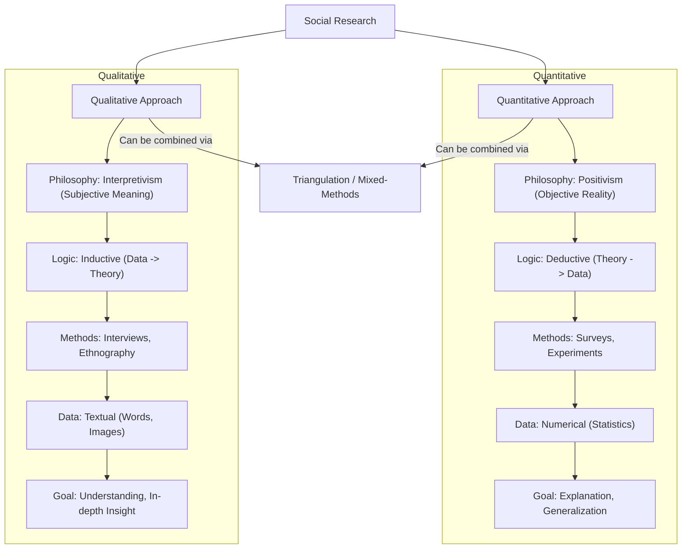
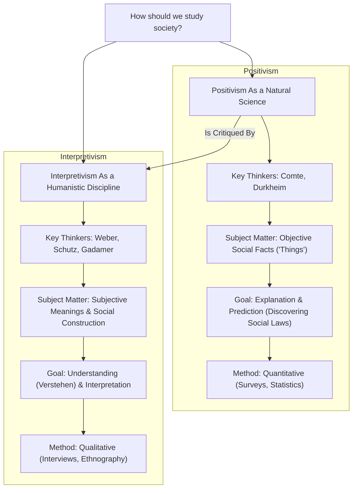
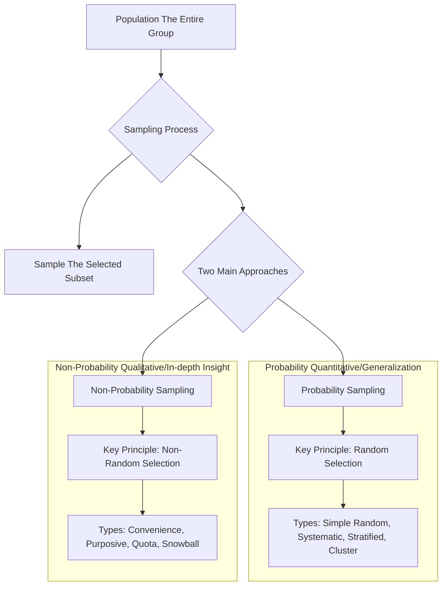
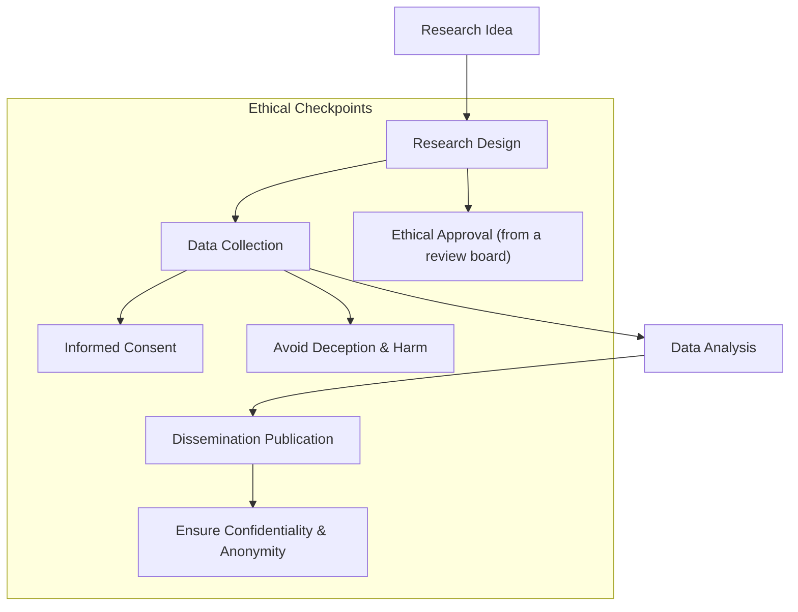
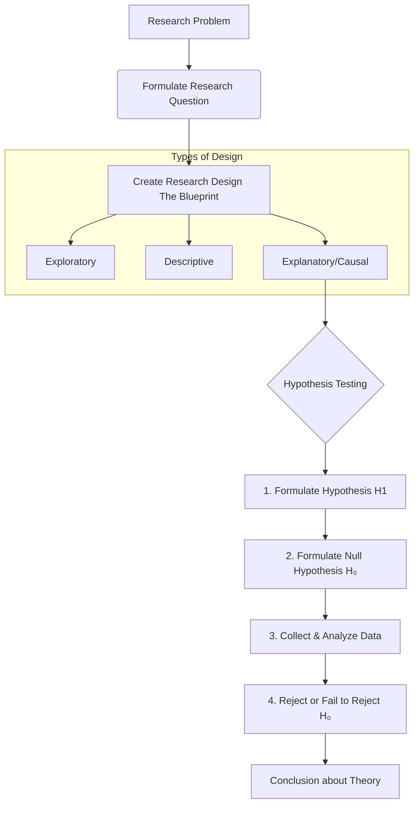
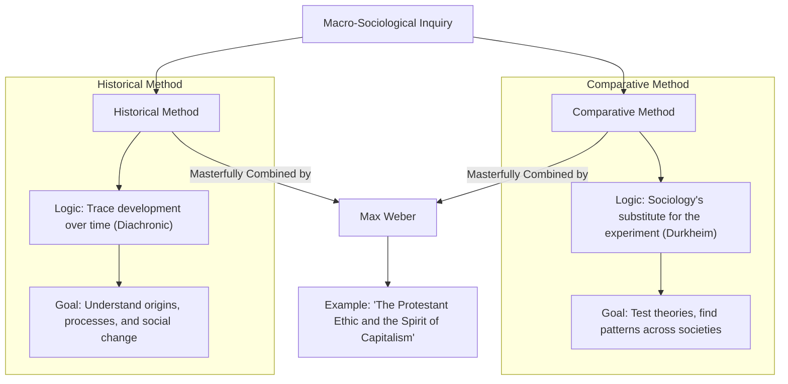
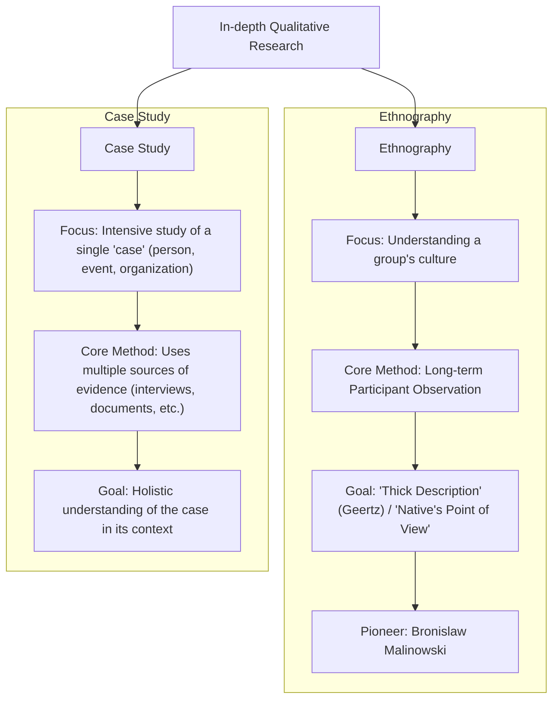
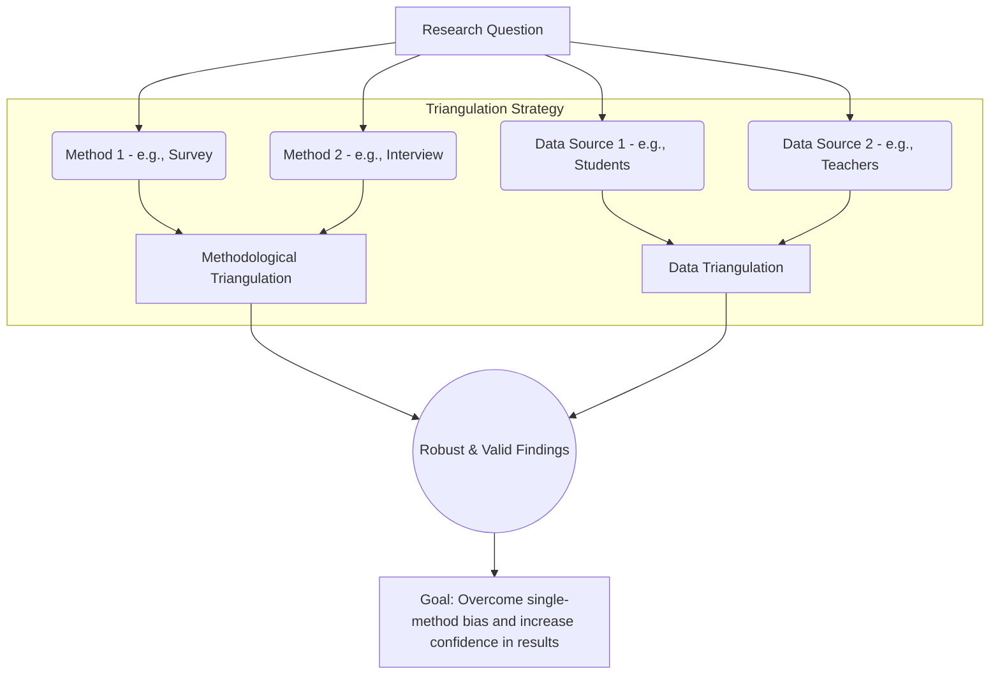
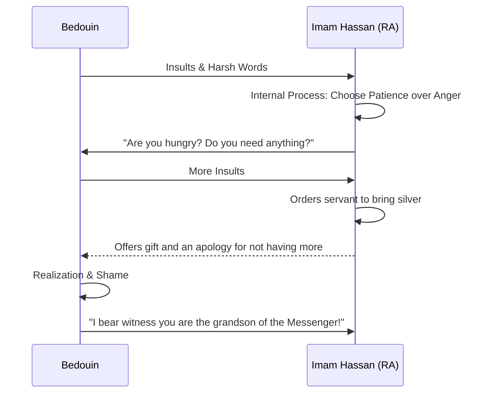

# ToC

```table-of-contents
title: 
style: nestedOrderedList # TOC style (nestedList|nestedOrderedList|inlineFirstLevel)
minLevel: 0 # Include headings from the specified level
maxLevel: 0 # Include headings up to the specified level
include: 
exclude: 
includeLinks: true # Make headings clickable
hideWhenEmpty: false # Hide TOC if no headings are found
debugInConsole: false # Print debug info in Obsidian console
```

---

## **Course Title: MSO-02 Research Methodologies and Methods**

## Blocks 7 - Units 22

#### **Block 1: Logic of Social Inquiry**
This block deals with the philosophical foundations of social research, exploring the different ways of knowing and generating knowledge about the social world.

*   **Unit 1:** Logic of Inquiry in Social Research
*   **Unit 2:** Philosophical Foundations of Social Research
*   **Unit 3:** Contemporary Perspectives
*   **Unit 4:** Feminist Perspectives

#### **Block 2: Generalising Social Research**
This block focuses on fundamental concepts that determine the quality and credibility of research, such as measurement and objectivity.

*   **Unit 5:** Issues of Measurement
*   **Unit 6:** Objectivity, Subjectivity and Reflexivity
*   **Unit 7:** Theory and Research

#### **Block 3: Qualitative Methods**
This block provides a detailed overview of research methods that focus on in-depth understanding, interpretation, and meaning.

*   **Unit 8:** The Field and the Fieldworker
*   **Unit 9:** Case Study Method
*   **Unit 10:** Oral History
*   **Unit 11:** Narratives

#### **Block 4: Quantitative Methods**
This block covers methods that rely on numerical data and statistical analysis to identify patterns and relationships in society.

*   **Unit 12:** Survey Research
*   **Unit 13:** Sampling Methods
*   **Unit 14:** Questionnaire and Schedule

#### **Block 5: Techniques of Data Collection**
This block focuses on the practical tools and techniques researchers use to gather information.

*   **Unit 15:** Observation
*   **Unit 16:** Interviewing
*   **Unit 17:** Content Analysis

#### **Block 6: Analysis and Interpretation of Data**
This block explains how to make sense of the data once it has been collected, covering both quantitative and qualitative approaches.

*   **Unit 18:** Quantitative Data Analysis
*   **Unit 19:** Qualitative Data Analysis
*   **Unit 20:** Use of Computers in Social Research

#### **Block 7: Writing Up Sociological Research**
The final block guides you through the process of presenting your research findings in a formal academic format.

*   **Unit 21:** The Research Report
*   **Unit 22:** Referencing and Citation

---

### **Assessment and Examination Pattern**

The evaluation scheme for MSO-02 is consistent with other MSO courses:

*   **Assignments (Tutor Marked Assignments - TMA):** Carries a weightage of **30%**. You are required to submit one assignment for this course.
*   **Term-End Examination (TEE):** The final written examination accounts for the remaining **70%** of your grade.

**Typical TEE Question Paper Format:**

*   **Duration:** 3 Hours
*   **Maximum Marks:** 100
*   **Structure:** The paper is divided into two sections. You must answer **five questions** in total, ensuring you select **at least two questions from each section**.
*   **Word Limit:** Each answer should be approximately **500 words** long.
*   **Marks per Question:** Each question is worth **20 marks**.

### **Tips for Studying MSO-02**

1.  **Understand the Core Dichotomy:** The entire course revolves around the distinction between **Quantitative** and **Qualitative** research. Make sure you understand their philosophical bases (Positivism vs. Interpretivism), their methods (Surveys vs. Ethnography), their data types (Numbers vs. Words/Images), and their goals (Generalisation vs. In-depth understanding). This is a very common exam topic.
2.  **Master the Terminology:** This course is heavy on specific terminology. Create a glossary for terms like *epistemology, ontology, positivism, hermeneutics, validity, reliability, reflexivity, triangulation, sampling frame, hypothesis,* etc. Using these terms correctly is key to scoring well.
3.  **Think Like a Researcher:** As you study each method, imagine you are designing a research project. Ask yourself: What is my research question? Would a survey or a case study be better? Who would I interview (my sample)? What questions would I ask? This practical approach makes the concepts easier to grasp.
4.  **Connect Philosophy to Practice:** Don't treat Block 1 (Logic of Inquiry) as separate from the rest. Understand how a researcher's philosophical stance (e.g., being a positivist or a feminist) influences their choice of methods and interpretation of data.
5.  **Don't Neglect the Final Steps:** Units on data analysis and report writing (Blocks 6 and 7) are very important and frequently appear in exams. Pay attention to the structure of a research report and the ethics of research.
6.  **Practice with Previous Papers:** Solving past exam papers will help you understand which topics are most frequently asked (e.g., "Compare and contrast quantitative and qualitative research," "Discuss the significance of objectivity in social research," "Explain different types of sampling").
---
---


### **Part 1: In-depth PYQ Analysis & Strategic Insights (MSO-002)**

This paper is clearly divided into two parts: the "Methodology" (the philosophy and logic of research) and the "Methods" (the practical techniques of data collection and analysis).

#### **A. Thematic Clustering & Frequency Analysis**

**Cluster 1: Philosophy of Social Science (Very High Priority - Section A)**
*   **Positivism & its Critiques:** The debate about whether sociology can be a "science" like the natural sciences. Comte's contribution is central here. (Dec 2023, Dec 2018, Dec 2015)
*   **Interpretive Traditions:** Understanding social action from the actor's point of view.
    *   **Phenomenology:** (June 2024, June 2022)
    *   **Hermeneutics:** (Dec 2022, June 2022, June 2019, Dec 2016)
*   **Theory and Research:** The relationship between theory and empirical research. (June 2024, Dec 2018, Dec 2015)
*   **Objectivity and Values:** The problem of keeping personal values out of research (value neutrality). (Dec 2021)
*   **Feminist Methodology:** A critique of traditional "malestream" research and its core features. (Dec 2023, Dec 2022, June 2019, June 2018)

**Cluster 2: Research Design & Process (High Priority)**
*   **Social Research:** Its meaning, significance, and types (e.g., exploratory, descriptive, experimental). (June 2023, June 2020)
*   **Research Design:** The blueprint of research; its elements and steps. (Dec 2021, June 2020, June 2018)
*   **Hypothesis:** Its definition, formulation, and the steps in testing it. (June 2023, June 2019, June 2018)
*   **Reliability and Validity:** The significance of ensuring data is consistent and accurate. (June 2019, June 2015)
*   **Ethics in Social Research:** A very common and important topic. (June 2023, June 2019, Dec 2016)

**Cluster 3: Quantitative Methods & Analysis (High Priority - Often in Section B)**
*   **Quantitative vs. Qualitative Research:** The fundamental differences between the two approaches. This is a classic question. (Dec 2023, June 2020)
*   **Survey Method:** Its rationale, advantages, and weaknesses. (Dec 2023, June 2023, Dec 2022, June 2019, June 2018, etc.)
*   **Sampling:**
    *   **Probability vs. Non-probability Sampling:** (June 2023)
    *   **Types of Sampling:** (June 2024, Dec 2021, Dec 2018, Dec 2016)
*   **Data Analysis (Statistics):**
    *   **Measures of Central Tendency:** Mean, Median, Mode. (June 2024, Dec 2020)
    *   **Correlation:** (June 2024)
    *   **SPSS:** The role of software in data analysis. (June 2024, Dec 2016)

**Cluster 4: Qualitative Methods & Analysis (Very High Priority)**
*   **Observation:** Participant vs. Non-participant observation. (June 2022, June 2018, Dec 2016)
*   **Interview:** Its types, advantages, and disadvantages. (Dec 2023, Dec 2022, June 2022, Dec 2018)
*   **Ethnography & Field Work:** The deep, immersive study of a culture. Malinowski's contribution is key. (Dec 2023, Dec 2022, Dec 2021, June 2020)
*   **Case Study Method:** (June 2023, June 2020, June 2019)
*   **Triangulation:** The strategy of using multiple methods to ensure more reliable findings. (Dec 2022, June 2022, June 2021, Dec 2018)

**Cluster 5: Specific Methodologies (Medium Priority)**
*   **Comparative Method:** Its historical context and use in sociology (Durkheim, Weber). (Dec 2022, Dec 2021, June 2018, Dec 2016)
*   **Historical Method:** (June 2024, June 2015)
*   **Participatory Research:** (June 2024, June 2022, June 2021)

#### **B. Key Trends & Exam-Winning Insights**

1.  **Clear Sectional Divide:** Section A is heavily dominated by the **philosophy of science and methodology** (Positivism, Hermeneutics, Theory, etc.). Section B is dominated by the practical **methods** of data collection and analysis (Survey, Sampling, Interview, Statistics). Your preparation must reflect this.
2.  **"Critique" is Central:** Many questions in Section A are about the great debates: Positivism vs. its critics, Quantitative vs. Qualitative, traditional vs. Feminist methodology.
3.  **Methods Questions are Direct:** Questions in Section B are often very direct: "What is sampling and its types?", "Discuss the advantages and weaknesses of the survey method." These require clear, structured, textbook-style answers.
4.  **Thinker-Method Linkage:** You must associate key thinkers with specific methods: **Durkheim** with the comparative method, **Malinowski** with ethnography/participant observation, **Comte** with positivism.

#### **C. Prioritization: The "Low-Hanging Fruits" for MSO-002**

**Tier 1 (Absolutely Must-Do - The Foundation of the Paper):**
1.  **The Great Debate:** Positivism vs. Interpretivism (Phenomenology, Hermeneutics).
2.  **Quantitative vs. Qualitative Research:** The core differences.
3.  **Key Data Collection Methods:** Survey, Interview, and Observation (Participant vs. Non-participant).
4.  **Sampling:** The logic and types (Probability vs. Non-probability).
5.  **Feminist Methodology.**
6.  **Ethics in Social Research.**

**Tier 2 (Very Likely to Appear - Crucial for Choice):**
7.  **Research Design & Hypothesis Testing.**
8.  **Comparative and Historical Methods.**
9.  **Ethnography and Case Study.**
10. **Triangulation.**
11. **Measures of Central Tendency** (Mean, Median, Mode).
12. **The Role of Theory in Research.**

**Tier 3 (If you have time):**
13. Specific thinkers like Karl Popper (Falsification) or Rene Descartes (Rationalism).
14. Use of ICT/SPSS in research.
15. Participatory Research.

---

### **Part 2: Suggestions, Clarifications & Our Game Plan**

**My Suggestions:**

1.  **Two-Part Structure:** We should organize our notes clearly into "Methodology" (the 'why') and "Methods" (the 'how').
2.  **Focus on Comparison:** For topics like Quant vs. Qual, or Positivism vs. Interpretivism, the notes must be structured comparatively, ideally with a summary table.
3.  **Practical Examples:** For all methods, we need simple, clear examples.
    *   **Sampling:** A national opinion poll uses **stratified random sampling**. A study of a hidden population (like drug users) uses **snowball sampling**.
    *   **Triangulation:** A researcher studying poverty might use a **survey** (quantitative) to understand its scale, **in-depth interviews** (qualitative) to understand the lived experience, and analyze **government documents** (secondary data).

---
---

## **Tier 1: The Absolute Core (Highest Priority for MSO-002)**

**Themes Covered in Tier 1:**
1.  **The Quantitative vs. Qualitative Debate.**
2.  **The Philosophy of Social Research: Positivism and its Critiques (Interpretivism).**
3.  **Key Data Collection Methods:** Survey, Interview, and Observation.
4.  **The Logic of Sampling.**
5.  **Feminist Methodology.**
6.  **Ethics in Social Research.**

---

### **Theme 1: The Quantitative vs. Qualitative Debate**

**(Keywords: Quantitative, Qualitative, Positivism, Interpretivism, Objectivity, Subjectivity, Deduction, Induction)**

#### **Introduction**

The distinction between **quantitative and qualitative research** represents the most fundamental methodological divide in the social sciences. It is not merely a debate about techniques (e.g., numbers vs. words) but a profound philosophical conflict rooted in different understandings of social reality and how it can be known. Quantitative research is aligned with the **positivist** tradition, which seeks to explain social phenomena through objective, numerical data. Qualitative research is aligned with the **interpretivist** tradition, which seeks to understand the subjective meanings and experiences that shape social action.

#### **1. Quantitative Research: The Logic of Measurement**

1.  **Philosophical Foundation:** **Positivism**. It assumes that social reality is objective, external, and can be measured, just like the natural world. The goal is to identify causal relationships and generate law-like generalizations.
2.  **Approach:** It follows a **deductive** approach. The researcher starts with a theory, formulates a specific hypothesis, and then collects numerical data to test it.
3.  **Data Collection Methods:** The methods are highly **structured** and designed for objectivity and replicability.
    *   **Surveys and Questionnaires:** Using closed-ended questions with pre-defined answers.
    *   **Experiments:** Manipulating variables in a controlled setting.
    *   **Structured Observation:** Counting the frequency of specific behaviors.
4.  **Nature of Data:** The data is **numerical** ("hard data"). It is analyzed using **statistical methods**.
5.  **Strengths:**
    *   **Generalizability:** Because it often uses large, random samples, its findings can be generalized to the wider population.
    *   **Objectivity and Replicability:** The structured nature of the methods minimizes researcher bias and allows others to replicate the study.
    *   **Causal Analysis:** It is well-suited for testing causal relationships between variables.
6.  **Weaknesses:**
    *   **Superficiality:** It can be superficial, providing a broad picture but failing to capture the rich context, meaning, and complexity of social life. It tells us *what* is happening, but not always *why*.
    *   **Neglect of Subjectivity:** It treats individuals as passive objects of study and ignores their subjective interpretations and meanings.

#### **2. Qualitative Research: The Logic of Interpretation**

1.  **Philosophical Foundation:** **Interpretivism** (including Phenomenology, Hermeneutics, and Symbolic Interactionism). It assumes that social reality is socially constructed through the subjective meanings of individuals. The goal is to gain an in-depth, empathetic understanding (*Verstehen*).
2.  **Approach:** It follows an **inductive** approach. The researcher starts by collecting rich, detailed data and then builds theories or concepts from the ground up.
3.  **Data Collection Methods:** The methods are **unstructured or semi-structured**, allowing for flexibility and depth.
    *   **In-depth Interviews:** Using open-ended questions to explore participants' perspectives.
    *   **Participant Observation / Ethnography:** The researcher immerses themselves in a social setting to understand it from the inside.
    *   **Case Studies:** An intensive analysis of a single case (an individual, group, or event).
4.  **Nature of Data:** The data is non-numerical ("soft data"), consisting of **texts, words, and images**. It is analyzed through thematic analysis and interpretation.
5.  **Strengths:**
    *   **Depth and Richness:** It provides a deep, rich, and detailed understanding of social phenomena in their natural context.
    *   **Focus on Meaning:** It is excellent for exploring subjective experiences, meanings, and social processes.
    *   **Flexibility:** The research design can evolve as the researcher learns more about the subject.
6.  **Weaknesses:**
    *   **Lack of Generalizability:** Findings are typically based on small, non-representative samples, so they cannot be easily generalized.
    *   **Subjectivity:** The researcher is the primary instrument of data collection, which raises concerns about potential bias and the reliability of the findings.
    *   **Time and Labor Intensive:** It is a very time-consuming and labor-intensive process.

#### **3. Conclusion: Complementarity and Triangulation**

The quantitative-qualitative debate is often presented as a rigid dichotomy, but most contemporary researchers see them as **complementary approaches**. They answer different kinds of questions. The choice of method should depend on the research question being asked. Increasingly, researchers use **mixed-methods** designs that combine both approaches. This strategy, known as **triangulation**, uses the strengths of one method to compensate for the weaknesses of the other, leading to a more comprehensive and valid understanding of social reality.

---
### **Mermaid Diagram: Quantitative vs. Qualitative Research**



---
### **Quick Revision Scaffold**

*   **Quantitative Research:**
    *   **Philosophy:** Positivism (objective reality).
    *   **Logic:** Deductive (theory-testing).
    *   **Methods:** Surveys, experiments.
    *   **Data:** Numbers, statistics.
    *   **Strength:** Generalizability.
    *   **Weakness:** Superficial, lacks context.
*   **Qualitative Research:**
    *   **Philosophy:** Interpretivism (subjective meaning).
    *   **Logic:** Inductive (theory-building).
    *   **Methods:** In-depth interviews, ethnography.
    *   **Data:** Words, texts, images.
    *   **Strength:** Depth, richness, context.
    *   **Weakness:** Not generalizable.
*   **The Solution: Triangulation**
    *   Using both methods in a single study to get a more complete picture. They are complementary, not mutually exclusive.


---
---

### **Theme 2: The Philosophy of Social Research: Positivism and its Critiques**

**(Keywords: Positivism, Comte, Durkheim, Empiricism, Objectivity, Interpretivism, Phenomenology, Hermeneutics, Verstehen)**

### **Note 2.1: Positivism in Sociology**

#### **Introduction**

**Positivism** is the philosophical doctrine that asserts that the only authentic knowledge is scientific knowledge, which comes from the positive affirmation of theories through strict scientific method. In sociology, it is the perspective that the social world can and should be studied with the same principles and procedures as the natural sciences (like physics or biology). Pioneered by **Auguste Comte**, who coined the term "sociology," and later developed by **Emile Durkheim**, positivism aims to discover universal **social laws** that govern social phenomena.

#### **1. The Core Tenets of Positivism**

1.  **The Unity of Scientific Method:** There is no fundamental difference between the natural and social sciences. The same methods of observation, experimentation, and generalization apply to both.
2.  **Empiricism:** Knowledge must be based on **empirical evidence** derived from sensory experience. What cannot be observed and measured is not a valid subject for scientific inquiry. This leads to a focus on **quantitative data**.
3.  **Objectivity and Value Neutrality:** The researcher must be a detached, objective observer. Their personal values, beliefs, and biases must be completely excluded from the research process to ensure the findings are unbiased.
4.  **The Goal of Explanation and Prediction:** The aim of sociological research is to identify **cause-and-effect relationships** between social phenomena. By discovering the general laws that govern society, sociology can explain social events and predict future outcomes.
5.  **Key Thinkers and their Contributions:**
    *   **Auguste Comte:** The "father" of sociology. He proposed the **"Law of Three Stages"** (Theological, Metaphysical, and Positive), arguing that human knowledge culminates in the "Positive" or scientific stage. He believed sociology should be the "queen of the sciences," discovering the laws of social statics (order) and social dynamics (progress).
    *   **Emile Durkheim:** He put positivism into practice. In **"The Rules of Sociological Method,"** he famously urged sociologists to **"treat social facts as things."** This means studying social phenomena as external, objective realities that exert coercive power over individuals. His study **"Suicide"** is a classic example of using statistical data to uncover the social causes (social laws) behind a seemingly individual act.

---

### **Note 2.2: The Interpretivist Critique of Positivism**

#### **Introduction**

The **Interpretivist** tradition emerged as a powerful critique of positivism. It argues that the subject matter of the social sciences (human beings) is fundamentally different from that of the natural sciences (inanimate objects). Humans have consciousness, intentions, and create their own meanings. Therefore, to study them with the methods of natural science is to miss the point entirely. The goal of sociology, for interpretivists, is not to explain human behavior from the outside, but to **understand** it from the inside.

#### **1. The Core Arguments of Interpretivism**

1.  **The Subject Matter is Different:** Unlike atoms or planets, humans are conscious beings who interpret the world and act based on those interpretations. Social reality is not an external "thing" but is **socially constructed** through shared meanings.
2.  **The Goal is Understanding (*Verstehen*):** Drawing on **Max Weber's** concept of **Verstehen**, interpretivists argue that the goal is empathetic understanding. The researcher must try to see the world from the perspective of the social actors they are studying.
3.  **Focus on Subjective Meaning:** Research should focus on the subjective meanings, intentions, and motivations that guide human action. This leads to a preference for **qualitative methods** like in-depth interviews and participant observation.
4.  **Rejection of "Social Laws":** Because human action is meaningful and context-bound, it is impossible to discover universal, law-like generalizations that apply to all societies at all times.

#### **2. Key Interpretive Traditions**

*   **Phenomenology (Alfred Schutz):**
    *   **Focus:** The study of phenomena as they are experienced in consciousness. It seeks to understand the **"life-world"** (*Lebenswelt*)—the everyday, taken-for-granted reality that people experience.
    *   **Method:** It involves **"bracketing"** or suspending the researcher's own assumptions to understand how social reality is constructed through the inter-subjective consciousness of individuals.
*   **Hermeneutics (Wilhelm Dilthey, Hans-Georg Gadamer):**
    *   **Focus:** Originally the theory of interpreting texts (like the Bible), it was expanded to the interpretation of all human action and culture.
    *   **Method:** It sees understanding as a **"hermeneutic circle."** To understand a part (e.g., a single word or action), you must understand the whole (the text or cultural context), and to understand the whole, you must understand its parts. Understanding is a continuous, dialectical process of interpretation. It emphasizes the importance of the researcher's own historical and cultural context in shaping their interpretation.

#### **Conclusion**

The debate between positivism and interpretivism represents the central philosophical divide in sociology. Positivism provides a powerful framework for large-scale, quantitative analysis and the search for causal patterns. Interpretivism provides the tools for a deep, empathetic, and contextual understanding of human social life. While they were once seen as mutually exclusive, many sociologists today recognize that both perspectives are valuable and can be used in a complementary fashion (**triangulation**) to provide a more complete picture of the social world.

---
### **Mermaid Diagram: The Core Philosophical Debate in Sociology**



---
### **Quick Revision Scaffold**

*   **Positivism:**
    *   **Idea:** Study society like a **natural science**.
    *   **Thinkers:** **Comte** (founder), **Durkheim** (practitioner).
    *   **Goal:** Discover objective **social laws** through **empirical, quantitative** methods.
    *   **Key Phrase:** "Treat social facts as things."
*   **Interpretivism (The Critique):**
    *   **Idea:** The social world is different from the natural world; it's about **subjective meaning**.
    *   **Goal:** Empathetic **understanding (*Verstehen*)**, not explanation.
    *   **Method:** **Qualitative**.
    *   **Key Traditions:**
        *   **Phenomenology (Schutz):** Focus on the everyday "life-world."
        *   **Hermeneutics (Gadamer):** The art of interpretation (the "hermeneutic circle").

---
---

### **Theme 3: Key Data Collection Methods**

**(Keywords: Survey, Interview, Observation, Participant Observation, Non-participant Observation, Ethnography, Questionnaire)**

This theme covers the three primary techniques sociologists use to gather primary data. Questions on these are very common and often ask for their types, advantages, and weaknesses.

---

### **Note 3.1: The Survey Method**

#### **Introduction**

The **survey method** is one of the most widely used data collection techniques in the social sciences, particularly in **quantitative research**. It involves collecting standardized information from a large number of people (a **sample**) through the use of a pre-designed **questionnaire** or interview schedule. The primary goal of a survey is to describe, compare, or explain the attitudes, beliefs, and behaviors of a population by studying a representative sample of that population.

#### **1. Rationale and Key Features**

*   **Standardization:** Every respondent is asked the same questions in the same order, ensuring the data is comparable.
*   **Generalizability:** By using proper **probability sampling** techniques, the findings from the sample can be generalized to the entire population from which the sample was drawn.
*   **Large-Scale Data:** It is an efficient way to collect a large amount of data from a large number of people in a relatively short amount of time.

#### **2. Advantages of the Survey Method**

1.  **High Reliability:** The standardized nature of the questionnaire minimizes researcher bias and means that if the survey were repeated, it would likely produce similar results.
2.  **Cost-Effective:** It is generally less expensive and time-consuming than qualitative methods like ethnography, especially when studying large populations.
3.  **Anonymity:** Self-administered questionnaires can offer anonymity, which may encourage respondents to be more honest about sensitive topics.
4.  **Statistical Analysis:** The quantitative data generated is well-suited for powerful statistical analysis, allowing researchers to identify patterns and test causal relationships.

#### **3. Weaknesses of the Survey Method**

1.  **Superficiality:** Surveys are often criticized for being superficial. The use of closed-ended questions may force respondents into simple "yes/no" or "agree/disagree" answers, failing to capture the complexity and nuance of their real opinions.
2.  **Low Validity (The "Honesty" Problem):** There is no guarantee that respondents are being truthful. They may give socially desirable answers rather than expressing their true beliefs. This gap between what people say and what they do is a major validity problem.
3.  **Inflexibility:** Once the questionnaire is designed and the survey is underway, it cannot be changed. The researcher cannot probe unexpected answers or explore new lines of inquiry that emerge.
4.  **Low Response Rates:** Postal or online surveys often suffer from low response rates, which can introduce bias and compromise the representativeness of the sample.

---

### **Note 3.2: The Interview Method**

#### **Introduction**

An **interview** is a method of data collection that involves a researcher asking questions directly to a respondent. It is a flexible and powerful tool used in both quantitative and qualitative research, but it is the cornerstone of the qualitative approach. Unlike a rigid questionnaire, an interview is a social interaction that allows for a deeper and more nuanced exploration of people's experiences, opinions, and feelings.

#### **1. Types of Interviews**

Interviews can be classified based on their degree of structure:

1.  **Structured Interview:**
    *   **Nature:** Essentially a questionnaire that is administered verbally by the researcher. The questions and their order are pre-determined and fixed.
    *   **Use:** Primarily used in **quantitative** research (e.g., large-scale surveys) to ensure standardization and comparability.
2.  **Semi-Structured Interview:**
    *   **Nature:** The researcher has a pre-prepared list of topics and open-ended questions (an "interview guide"), but they have the flexibility to change the order of questions, probe for more detail, and explore interesting tangents that arise.
    *   **Use:** The most common type in **qualitative** research. It combines the structure needed for focus with the flexibility needed for depth.
3.  **Unstructured (or In-depth) Interview:**
    *   **Nature:** It is more like a guided conversation. The researcher may start with only a single broad question or topic and allow the conversation to flow naturally, letting the respondent guide the direction.
    *   **Use:** Used in **qualitative** research (like ethnography or life histories) to achieve maximum depth and understand the world from the respondent's point of view.

#### **2. Advantages and Disadvantages**

*   **Advantages:**
    *   **Depth and Detail:** Allows the researcher to probe deeply into complex issues and obtain rich, detailed data.
    *   **Flexibility:** The researcher can adapt their questions and explore unexpected themes.
    *   **High Validity:** Direct interaction allows the researcher to clarify questions and build rapport, increasing the likelihood of obtaining truthful and nuanced answers.
*   **Disadvantages:**
    *   **Time and Cost:** Interviews are very time-consuming to conduct, transcribe, and analyze.
    *   **Interviewer Bias:** The interviewer's presence, tone, or even their identity (age, gender, class) can influence the respondent's answers.
    *   **Lack of Generalizability:** The findings from a small number of in-depth interviews cannot be generalized to a wider population.

---

### **Note 3.3: The Observation Method**

#### **Introduction**

**Observation** is a method that involves systematically watching, listening to, and recording behavior and events in their natural setting. It is a foundational method in social science, particularly in social anthropology and qualitative sociology. The key strength of observation is that it allows the researcher to study what people **do**, rather than just what they **say** they do. The main distinction within this method is between participant and non-participant observation.

#### **1. Participant Observation**

1.  **Definition:** In participant observation, the researcher actively **participates** in the daily life and activities of the group they are studying. The goal is to gain a deep, "insider's" understanding of the group's culture and social world.
2.  **Ethnography:** This is the classic method of **ethnography**, pioneered by anthropologists like **Bronislaw Malinowski**. It involves long-term immersion in a community.
3.  **Advantages:**
    *   **High Validity:** By observing people in their natural setting over a long period, the researcher can gain a very deep and authentic understanding of their lives, overcoming the problem of respondents not telling the truth.
    *   **Rich, Detailed Data:** It generates incredibly rich and nuanced qualitative data.
4.  **Disadvantages:**
    *   **"Going Native":** The researcher may become so involved with the group that they lose their scientific objectivity.
    *   **Ethical Issues:** Issues of deception (if the researcher's identity is hidden) and the impact of the researcher's presence on the group are major concerns.
    *   **Extremely Time-Consuming.**

#### **2. Non-Participant Observation**

1.  **Definition:** In non-participant observation, the researcher observes the social setting from a distance, without taking part in the group's activities. They are a detached, "fly-on-the-wall" observer.
2.  **Use:** This can be used in both qualitative and quantitative research (e.g., a structured observation where a researcher counts the number of times a specific behavior occurs in a classroom).
3.  **Advantages:**
    *   **Higher Objectivity:** The researcher's detachment reduces the risk of "going native" and may allow for more objective observation.
    *   **Less Intrusive:** The researcher's presence is less likely to affect the behavior of the group being studied.
4.  **Disadvantages:**
    *   **Lack of Depth:** By remaining an outsider, the researcher risks misunderstanding the context and the subjective meaning of the behaviors they are observing. They see what is happening, but may not understand *why*.

---
### **Quick Revision Scaffold**

*   **Survey Method:**
    *   **Type:** Quantitative.
    *   **Tool:** Standardized **Questionnaire**.
    *   **Strength:** **Generalizability** and **Reliability**.
    *   **Weakness:** **Superficial** and potentially low **Validity**.
*   **Interview Method:**
    *   **Types:** **Structured** (Quantitative), **Semi-structured** & **Unstructured** (Qualitative).
    *   **Strength:** **Depth**, **Flexibility**, and high **Validity**.
    *   **Weakness:** **Time-consuming**, potential for **Interviewer Bias**.
*   **Observation Method:**
    *   **Focus:** Studies what people **do**, not just what they say.
    *   **Participant Observation:** Researcher **joins in**. The method of **Ethnography**. **Strength:** Deep, valid insight. **Weakness:** Risk of "going native."
    *   **Non-Participant Observation:** Researcher **watches from a distance**. **Strength:** More objective. **Weakness:** Lacks depth and understanding of meaning.

---
---

Excellent. Let's proceed with the next crucial Tier 1 theme: Sampling. This is a fundamental concept in research methods and a very common exam topic.

---

### **Theme 4: The Logic of Sampling**

**(Keywords: Sampling, Population, Sample, Representative Sample, Probability Sampling, Non-probability Sampling, Random Sampling, Sampling Frame)**

#### **Introduction**

In social research, it is often impossible or impractical to study every single individual in the group we are interested in. The entire group is called the **population** or **universe**. Instead, researchers select a smaller, manageable subset of this group, known as a **sample**. **Sampling** is the systematic process of selecting this subset. The primary goal of sampling, especially in quantitative research, is to choose a sample that is **representative** of the larger population, so that the findings from the sample can be confidently **generalized** to the entire population.

#### **1. The Rationale for Sampling**

Researchers use sampling for several key reasons:
1.  **Practicality:** Studying an entire population (e.g., all citizens of India) is too expensive and time-consuming.
2.  **Accuracy:** A well-designed sample can often produce more accurate results than a poorly conducted census, as more resources can be devoted to ensuring high-quality data collection from the smaller group.
3.  **Feasibility:** For some types of research (e.g., product testing that destroys the product), studying the entire population is impossible.

#### **2. The Two Major Types of Sampling: Probability and Non-Probability**

The fundamental distinction in sampling is between probability and non-probability methods. This choice depends entirely on the goals of the research.

### **Note 4.1: Probability Sampling**

1.  **Core Principle:** In probability sampling, **every unit in the population has a known, non-zero chance of being selected** for the sample. This process involves **random selection**, which is the key to eliminating researcher bias and ensuring representativeness.
2.  **Requirement:** It requires a complete list of every unit in the population, known as a **sampling frame** (e.g., a list of all registered voters, a list of all students in a university).
3.  **Goal:** To produce a statistically **representative sample** so that findings can be generalized to the population. It is the cornerstone of **quantitative research**.

#### **Types of Probability Sampling**

1.  **Simple Random Sampling:**
    *   **Method:** Every member of the population has an equal chance of being selected. This is like drawing names out of a hat or using a random number generator.
    *   **Advantage:** The purest form of probability sampling.
    *   **Disadvantage:** Requires a complete sampling frame, which is often unavailable.
2.  **Systematic Sampling:**
    *   **Method:** Selecting every *n*th unit from the sampling frame (e.g., every 10th person on a list), after a random starting point.
    *   **Advantage:** Simpler and more convenient than simple random sampling.
    *   **Disadvantage:** Can be biased if there is a hidden periodic pattern in the sampling frame.
3.  **Stratified Random Sampling:**
    *   **Method:** The population is first divided into distinct sub-groups or **"strata"** based on relevant characteristics (e.g., age, gender, income level). A simple random sample is then drawn from *each* stratum.
    *   **Advantage:** Ensures that all key sub-groups are adequately represented in the sample, increasing representativeness.
    *   **Example:** In a national opinion poll, the population would be stratified by state to ensure representation from all parts of the country.
4.  **Cluster (or Multi-stage) Sampling:**
    *   **Method:** Used when the population is large and geographically dispersed. The population is divided into clusters (e.g., cities or districts), a random sample of clusters is selected, and then units are sampled from within the selected clusters. This can be done in multiple stages.
    *   **Advantage:** Very practical and cost-effective for large-scale surveys; does not require a complete sampling frame of the entire population at the outset.
    *   **Disadvantage:** Can have a higher sampling error than simple random sampling.

---

### **Note 4.2: Non-Probability Sampling**

1.  **Core Principle:** In non-probability sampling, the selection of units is **not random**. The chance of any particular unit being selected is unknown. The researcher uses their judgment or convenience to select the sample.
2.  **Goal:** This method is **not** used to create a representative sample for generalization. It is used when the goal is to gain in-depth insight, explore a new topic, or study a hard-to-reach population. It is the primary mode of sampling in **qualitative research**.

#### **Types of Non-Probability Sampling**

1.  **Convenience (or Accidental) Sampling:**
    *   **Method:** Selecting whoever is most convenient and easily accessible to the researcher (e.g., interviewing people in a shopping mall).
    *   **Advantage:** Very easy, quick, and inexpensive.
    *   **Disadvantage:** Highly prone to bias and not representative at all.
2.  **Purposive (or Judgmental) Sampling:**
    *   **Method:** The researcher uses their expert judgment to select units that they believe are most representative or knowledgeable about the topic of interest.
    *   **Example:** To study the impact of a new policy, a researcher might purposively select a few "typical" villages to study in depth.
3.  **Quota Sampling:**
    *   **Method:** The non-probability equivalent of stratified sampling. The researcher identifies key strata (e.g., age, gender) and sets a quota for how many people to interview from each stratum. The final selection within the strata is then done by convenience.
    *   **Advantage:** Aims to improve representativeness over simple convenience sampling.
    *   **Disadvantage:** Still prone to selection bias as the final choice is not random.
4.  **Snowball Sampling:**
    *   **Method:** Used to study hidden or hard-to-reach populations for which no sampling frame exists. The researcher identifies one or two members of the population, interviews them, and then asks them to refer other members. The sample "snowballs" from there.
    *   **Example:** Studying homeless people, undocumented immigrants, or members of a secret society.

---
### **Mermaid Diagram: The Logic of Sampling**



---
### **Quick Revision Scaffold**

*   **Sampling:** The process of selecting a subset (sample) from a larger group (population).
*   **Goal:** To make inferences about the population based on the sample.
*   **Two Main Types:**
    1.  **Probability Sampling (Quantitative Research):**
        *   **Principle:** Every unit has a **known, non-zero chance** of selection. Uses **random** selection.
        *   **Goal:** **Generalizability**.
        *   **Types:** Simple Random, Systematic, **Stratified** (for representation), **Cluster** (for large populations).
    2.  **Non-Probability Sampling (Qualitative Research):**
        *   **Principle:** Selection is **not random**.
        *   **Goal:** **In-depth understanding**, not generalization.
        *   **Types:** Convenience (easy access), Purposive (judgment-based), Quota (non-random stratified), **Snowball** (for hidden populations).

---
---

### **Theme 5: Feminist Methodology**

**(Keywords: Feminist Methodology, Patriarchy, Malestream Sociology, Objectivity, Reflexivity, Situated Knowledge, Empowerment)**

#### **Introduction**

**Feminist methodology** is not a specific research method, but a distinct **perspective or approach** to research that emerged from the feminist critique of traditional social science. It argues that mainstream research has historically been **"malestream"**—conducted by men, for men, and about men, while presenting itself as universal and objective. Feminist methodology seeks to correct this bias by placing **women's experiences at the center** of the research process and by conducting research *for* women, with the ultimate goal of challenging **patriarchy** and promoting social change.

#### **1. The Critique of "Malestream" Research**

Feminist scholars like **Ann Oakley, Sandra Harding, and Dorothy Smith** launched a powerful critique of traditional research, highlighting several key biases:

1.  **Androcentrism (Male-centeredness):** Mainstream research often treats men's experiences as the human norm and women's experiences as a deviation or a special case.
2.  **The Myth of Objectivity:** Feminists challenge the positivist ideal of a detached, value-neutral researcher. They argue that this "objective" stance often hides a male perspective. All knowledge is **"situated knowledge"**—it is produced from a specific social location (e.g., that of a white, middle-class, male researcher).
3.  **Hierarchical Research Relationships:** Traditional research methods, like a structured survey, often create a hierarchical, exploitative relationship where the researcher extracts information from the "subject" without giving anything back.
4.  **Ignoring the Private Sphere:** Mainstream sociology has historically focused on the public sphere (work, politics), ignoring the private sphere of the family and household, where much of women's lives and oppression are located.

#### **2. The Essential Features of Feminist Methodology**

While diverse, feminist research is guided by several core principles:

1.  **Placing Women at the Center:** The starting point of feminist research is the lived experiences of women, particularly their experiences of oppression and marginalization. It aims to make women visible and give voice to their perspectives.
2.  **The Political Goal of Empowerment:** Feminist research is not value-neutral; it is politically committed. Its goal is not just to understand the world, but to **change it**. The research should be useful for women and contribute to their empowerment and the struggle against patriarchy.
3.  **Emphasis on Qualitative Methods:** Feminist researchers often prefer qualitative methods like **in-depth, unstructured interviews and ethnography**. These methods are seen as less hierarchical and better suited for capturing the complexity and nuance of women's lived experiences.
4.  **The Importance of Reflexivity:** The researcher must constantly engage in **reflexivity**—a critical self-examination of their own social position, assumptions, and biases, and how these might be shaping the research process and findings.
5.  **A Non-Hierarchical Research Relationship:** Feminist researchers strive to create a more collaborative and egalitarian relationship with the women they study. The goal is a dialogue, not an interrogation. **Ann Oakley** described this as moving beyond the "hygienic" research model to one based on rapport and reciprocity.

#### **Conclusion**

Feminist methodology has offered a profound and essential critique of the biases inherent in traditional social science research. By challenging the myth of objectivity, centering women's experiences, and explicitly linking research to the political goal of empowerment, it has not only made women visible but has also enriched the entire field of sociology. It forces all researchers to be more reflexive about their own positionality and more critical about the power dynamics inherent in the production of knowledge.

---

### **Theme 6: Ethics in Social Research**

**(Keywords: Ethics, Informed Consent, Anonymity, Confidentiality, Deception, Harm to Participants)**

#### **Introduction**

**Ethics** refers to the moral principles and standards that guide the conduct of researchers. While the goal of research is to produce valid knowledge, this goal cannot be pursued at any cost. Sociological research involves human beings, and researchers have a profound ethical responsibility to protect the rights, dignity, and welfare of the people they study. Ethical considerations are not an afterthought but a fundamental part of the entire research process, from design to dissemination.

#### **1. Core Ethical Principles in Social Research**

Most professional sociological associations (like the American Sociological Association) have codes of ethics built around several core principles:

1.  **Informed Consent:**
    *   **Principle:** Participants must voluntarily agree to take part in the research *after* being fully informed about its purpose, procedures, potential risks, and benefits.
    *   **Practice:** This usually involves providing a written consent form. For vulnerable populations (like children), consent must be obtained from legal guardians.
    *   **Challenge:** In some qualitative research (like covert participant observation), obtaining informed consent is impossible, which raises serious ethical dilemmas.

2.  **Protection from Harm:**
    *   **Principle:** Researchers must take all possible precautions to ensure that participants are not harmed physically, psychologically, or socially as a result of the research.
    *   **Practice:** This includes protecting them from stress, embarrassment, or any negative repercussions from their participation (e.g., losing their job). The potential benefits of the research must always outweigh the risks to participants.

3.  **Confidentiality and Anonymity:**
    *   **Principle:** The privacy of participants must be protected.
    *   **Confidentiality:** Means that the researcher knows the identity of the participants but promises not to disclose it in any reports. The data is kept secure.
    *   **Anonymity:** Is a stronger guarantee. It means that even the researcher does not know the identity of the participants (e.g., in an anonymous online survey).
    *   **Practice:** Using pseudonyms and removing identifying details from research reports.

4.  **Avoidance of Deception:**
    *   **Principle:** Researchers should be honest and transparent about the nature of their research and should not deceive or mislead participants.
    *   **Challenge:** Some research designs (e.g., some experiments) may require a degree of deception to ensure the validity of the results. In such cases, it must be justified, minimized, and participants must be fully **debriefed** afterwards.

#### **2. Classic Examples of Ethical Controversies**

*   **The Milgram Experiment (1963):** Stanley Milgram studied obedience to authority by deceiving participants into believing they were delivering painful electric shocks to another person. This study raised profound questions about the psychological harm and stress caused to participants.
*   **Laud Humphreys' "Tearoom Trade" (1970):** Humphreys conducted a covert participant observation study of men engaging in homosexual acts in public restrooms. He acted as a "watchqueen" (lookout) and secretly recorded their license plate numbers to track them down for later interviews, all without their consent. This study is a classic example of severe violations of consent, privacy, and deception.

#### **Conclusion**

Ethical considerations are at the heart of responsible social research. The principles of informed consent, protection from harm, confidentiality, and honesty provide a crucial framework for navigating the complex moral dilemmas that arise when studying human lives. While the pursuit of knowledge is a noble goal, it must always be balanced against the fundamental ethical obligation to respect the humanity and dignity of the research participants.

---
### **Mermaid Diagram: The Research Process & Ethical Checkpoints**



---
### **Quick Revision Scaffold**

*   **Feminist Methodology:**
    *   **Core Idea:** A perspective, not a method. A critique of **"malestream"** (male-centered) research.
    *   **Critique of Traditional Research:** It's androcentric and has a false claim to objectivity.
    *   **Key Principles:**
        1.  Puts **women's experiences** at the center.
        2.  Has a political goal of **empowerment**.
        3.  Prefers **qualitative** methods.
        4.  Emphasizes researcher **reflexivity**.
*   **Ethics in Social Research:**
    *   **Core Idea:** The moral principles guiding research to protect participants.
    *   **Four Key Principles:**
        1.  **Informed Consent:** Participants must agree voluntarily and be fully informed.
        2.  **No Harm:** Protect participants from physical, psychological, or social harm.
        3.  **Confidentiality/Anonymity:** Protect participants' privacy.
        4.  **No Deception:** Be honest about the research.
    *   **Classic Controversies:** Milgram (harm), Humphreys' Tearoom Trade (deception, no consent).

---
---

## **Tier 2: High-Probability Topics (MSO-002)**

**Themes Covered in Tier 2:**
7.  **Research Design & Hypothesis Testing.**
8.  **Comparative and Historical Methods.**
9.  **Ethnography and Case Study.**
10. **Triangulation.**
11. **Measures of Central Tendency.**
12. **The Role of Theory in Research.**

---

### **Theme 7: Research Design & Hypothesis Testing**

**(Keywords: Research Design, Exploratory, Descriptive, Explanatory, Hypothesis, Null Hypothesis, Falsification)**

### **Note 7.1: Research Design**

#### **Introduction**

A **research design** is the overall strategy or **blueprint** that a researcher chooses to integrate the different components of their study in a coherent and logical way. It is the master plan that specifies the methods and procedures for collecting and analyzing the needed information. A good research design ensures that the evidence obtained enables the researcher to effectively address the research problem. The choice of design depends on the nature of the research problem and the objectives of the study.

#### **1. The Purpose and Elements of a Research Design**

*   **Purpose:** To provide a framework for the research, ensuring that the study is systematic, valid, and reliable. It acts as a guide to prevent the researcher from going off track.
*   **Key Elements:** A research design typically includes decisions about:
    1.  The research question and objectives.
    2.  The type of data needed (qualitative, quantitative, or both).
    3.  The sources of data (primary, secondary).
    4.  The methods of data collection (survey, interview, etc.).
    5.  The sampling strategy.
    6.  The procedures for data analysis.
    7.  The ethical considerations.

#### **2. Major Types of Research Design**

1.  **Exploratory Research Design:**
    *   **Purpose:** Used when a problem is not yet clearly defined or understood. The goal is to explore a new topic, generate initial ideas, and formulate more precise questions for future research.
    *   **Methods:** Tends to be flexible and qualitative (e.g., literature reviews, in-depth interviews with key informants, focus groups).
    *   **Example:** A researcher wanting to study the social impact of a new social media app might start with exploratory research to understand what the key issues are.
2.  **Descriptive Research Design:**
    *   **Purpose:** To provide an accurate and systematic description of a population, situation, or phenomenon. It answers the questions of "who, what, where, when, and how," but not "why."
    *   **Methods:** Often uses quantitative methods like large-scale surveys, but can also use qualitative methods like observation.
    *   **Example:** The Census of India is a massive descriptive study that provides a snapshot of the Indian population's characteristics.
3.  **Explanatory (or Causal) Research Design:**
    *   **Purpose:** To identify and test the **causal relationships** between variables. It aims to explain *why* something happens.
    *   **Methods:** The **experimental design** is the "gold standard" for establishing causality. It involves manipulating an independent variable to see its effect on a dependent variable, while controlling for other factors. Surveys can also be used to test causal hypotheses through statistical analysis (e.g., correlation and regression).
    *   **Example:** A study designed to test whether a new teaching method (independent variable) causes an improvement in student test scores (dependent variable).

---

### **Note 7.2: Hypothesis: Formulation and Testing**

#### **1. What is a Hypothesis?**

*   **Definition:** A hypothesis is a **testable statement** that proposes a specific relationship between two or more variables. It is a tentative, speculative answer to a research question, which the research is then designed to either support or reject.
*   **Role:** It provides focus and direction to the research, guiding the process of data collection and analysis. It is central to the **deductive** approach of quantitative research.

#### **2. The Steps in Hypothesis Testing**

The process of hypothesis testing is a core part of the scientific method.

1.  **Formulate the Hypothesis:** The researcher states the expected relationship.
    *   **Example:** "Higher levels of education (Variable 1) lead to higher levels of income (Variable 2)."
2.  **Formulate the Null Hypothesis (H₀):** This is a crucial step. The **null hypothesis** is a statement of **"no relationship"** or "no difference." The goal of the research is to try and *disprove* the null hypothesis.
    *   **Example:** "There is no relationship between the level of education and the level of income."
3.  **Collect Data:** The researcher collects empirical data using an appropriate method (e.g., a survey).
4.  **Analyze Data (Statistical Test):** The researcher applies a statistical test to the data to determine the probability that the observed relationship could have occurred by random chance alone.
5.  **Make a Decision:**
    *   If the probability of the result occurring by chance is very low (typically less than 5%, or *p* < 0.05), the researcher **rejects the null hypothesis**. This provides support for the original research hypothesis.
    *   If the probability is high, the researcher **fails to reject the null hypothesis**. This means the evidence does not support the original research hypothesis.

#### **3. Karl Popper and the Principle of Falsification**

The philosopher of science **Karl Popper** made a crucial contribution to this logic.

*   **Critique of Verification:** He argued that we can never definitively *prove* a scientific theory to be true (verification), because there might always be a future observation that contradicts it.
*   **The Logic of Falsification:** Science progresses not by proving theories right, but by trying to prove them **wrong**. A statement is only scientific if it is **falsifiable**—that is, if it is possible to conceive of an observation that would disprove it.
*   **Implication:** The goal of research is not to find evidence that confirms our hypothesis, but to subject it to the most rigorous tests possible in an attempt to **falsify** it. A hypothesis that survives repeated attempts at falsification is considered strong, but never definitively proven. This logic underpins the use of the null hypothesis.

---
### **Quick Revision Scaffold**

*   **Research Design:** The **blueprint** or master plan of a research project.
    *   **Types:**
        1.  **Exploratory:** For new, undefined topics.
        2.  **Descriptive:** To describe "what is" (e.g., Census).
        3.  **Explanatory:** To test "why" (causal relationships).
*   **Hypothesis:** A **testable statement** about the relationship between variables.
    *   **Null Hypothesis (H₀):** A statement of "no relationship." The goal of research is to **reject the null hypothesis**.
*   **Hypothesis Testing Steps:**
    1.  Formulate Hypothesis.
    2.  Formulate Null Hypothesis.
    3.  Collect Data.
    4.  Analyze Data (Statistical Test).
    5.  Reject or Fail to Reject the Null Hypothesis.
*   **Karl Popper's Falsification:** Science progresses by trying to **disprove** theories, not prove them. A good hypothesis is one that is falsifiable.

---
---

### **Theme 8: Comparative and Historical Methods**

**(Keywords: Comparative Method, Historical Method, Durkheim, Weber, Macro-sociology, Diachronic, Synchronic)**

#### **Introduction**

The **comparative method** and the **historical method** are two closely related, macro-level approaches that are fundamental to the discipline of sociology. They move beyond the study of a single society at a single point in time to analyze social phenomena across different societies or across long historical periods. For classical sociologists like **Emile Durkheim** and **Max Weber**, these methods were the primary tools for discovering general patterns, understanding the uniqueness of social forms, and explaining large-scale social change.

### **Note 8.1: The Comparative Method**

#### **1. The Logic and Purpose of Comparison**

*   **Definition:** The comparative method involves the systematic comparison of social phenomena (e.g., institutions, social structures, cultural patterns) across two or more societies.
*   **Durkheim's View:** **Emile Durkheim** famously stated that **"comparative sociology is not a particular branch of sociology; it is sociology itself."** He saw it as the sociological equivalent of the **experimental method**. Since sociologists cannot conduct true experiments on whole societies, they can simulate an experiment by comparing societies that are similar in most respects but differ on a key variable, allowing them to isolate causal relationships.
*   **Purpose:**
    1.  **To Test Theories and Hypotheses:** By comparing different cases, researchers can test the validity of a general theory.
    2.  **To Understand Uniqueness:** Comparison helps to highlight what is unique about a particular society by contrasting it with others.
    3.  **To Make Generalizations:** It allows sociologists to move beyond the specifics of one case to make broader generalizations about social life.

#### **2. Types of Comparative Analysis**

1.  **Comparison of Similar Societies:** This is closest to Durkheim's "experimental" logic. The researcher compares societies that are very similar to isolate the cause of a specific difference.
    *   **Example:** Comparing the suicide rates in different Protestant and Catholic regions of Europe to isolate the effect of religion (as Durkheim did).
2.  **Comparison of Dissimilar Societies:** This approach aims to see if a general principle holds true across vastly different contexts.
    *   **Example:** A study comparing the structure of the family in an industrial society like Japan and a hunter-gatherer society in the Amazon to see if any universal features exist.

#### **3. Challenges of the Comparative Method**
*   **The Problem of Equivalence:** It can be difficult to ensure that the concepts and measures being used are truly equivalent across different cultural contexts. Does "family" or "religion" mean the same thing in all societies?
*   **Controlling for Variables:** Unlike a true experiment, it is impossible to control for all the potential variables that might be influencing the outcome.

---

### **Note 8.2: The Historical Method**

#### **1. The Logic and Purpose of History**

*   **Definition:** The historical method involves using historical sources and data to trace the development of social phenomena over time. It focuses on processes of **social change, origins, and transformations**.
*   **Analysis Types:**
    *   **Diachronic Analysis:** The study of phenomena as they change through time (this is the essence of the historical method).
    *   **Synchronic Analysis:** The study of phenomena at a single point in time (often the focus of functionalism).
*   **Sources:** Historical sociologists use a wide range of sources, including **archives, government documents, letters, diaries, newspapers, and other historical records.**

#### **2. The Use of Historical Method in Sociology**

The historical method is crucial for several reasons:

1.  **Understanding Origins:** It helps to understand how contemporary social institutions and problems came into being. We cannot understand the present without understanding the past that shaped it.
2.  **Explaining Social Change:** It is the primary method for studying large-scale social transformations like the rise of capitalism, the development of the modern state, or the process of secularization.
3.  **Providing Context:** It provides the necessary historical context for any sociological study.

#### **3. Max Weber: A Master of the Historical-Comparative Method**

**Max Weber** is the supreme exemplar of a sociologist who masterfully combined the historical and comparative methods.

*   **Method:** His entire research program was built on **historical-comparative analysis**. He studied different world civilizations across long historical periods to understand the unique development of the West.
*   **Classic Work: "The Protestant Ethic and the Spirit of Capitalism":**
    *   **The Puzzle:** Why did modern, rational capitalism emerge only in the West?
    *   **His Method:** He first conducted a **historical analysis** of the rise of Protestantism and capitalism in Europe. He then conducted a **comparative analysis** of other world religions (in China, India, etc.) to show why they did *not* develop a similar "spirit of capitalism."
    *   **Conclusion:** By combining historical depth with systematic comparison, he was able to build a powerful causal argument about the role of religious ethics in economic development.

#### **Conclusion**

The comparative and historical methods are indispensable tools for macro-sociology. They allow sociologists to escape the limitations of studying a single society at a single point in time. The comparative method provides breadth, allowing for generalization and the testing of theories across different contexts. The historical method provides depth, allowing for an understanding of origins, processes, and long-term social change. As demonstrated by the classical works of Durkheim and Weber, the most powerful sociological analysis often emerges from the skillful combination of both approaches.

---
### **Quick Revision Scaffold**

*   **Comparative Method:**
    *   **What:** Systematic comparison of social phenomena across different societies.
    *   **Why (Purpose):** To test theories, understand uniqueness, and make generalizations.
    *   **Durkheim's View:** The sociological substitute for the **experiment**.
*   **Historical Method:**
    *   **What:** Using historical sources to trace the development of social phenomena over time (**diachronic analysis**).
    *   **Why (Purpose):** To understand origins, processes of social change, and context.
*   **Weber as the Master:**
    *   He brilliantly **combined** both methods.
    *   **Example:** In *The Protestant Ethic*, he used **historical** analysis to trace the rise of capitalism in Europe and **comparative** analysis to contrast it with other civilizations (China, India).
*   **Relationship:** The two methods are closely linked and often used together in macro-sociological research.

---
---

Excellent. Let's proceed with the final set of notes for Tier 2, covering key qualitative methods and concepts.

---

### **Theme 9: Ethnography and Case Study**

**(Keywords: Ethnography, Fieldwork, Participant Observation, Malinowski, Case Study, Holism)**

### **Note 9.1: Ethnography**

#### **Introduction**

**Ethnography** is both a **process** and a **product** of qualitative research. As a process, it refers to the long-term, in-depth study of a social group's culture and way of life from the "insider's perspective." As a product, it is the written account or description (*-graphy*) of that culture (*ethnos*). Pioneered by social anthropologists like **Bronislaw Malinowski**, ethnography is characterized by prolonged **fieldwork** and the use of **participant observation** as its core method.

#### **1. The Goal and Rationale**

*   **Goal:** To produce a "thick description" (**Clifford Geertz**) of a culture—one that not only describes behavior but also understands its context and the web of meanings that inform it. The aim is to grasp the "native's point of view."
*   **Holism:** Ethnography takes a **holistic** approach, seeking to understand the interconnectedness of different aspects of a society (e.g., how kinship, religion, and economy are all linked).

#### **2. The Method: Participant Observation**

*   The cornerstone of ethnography is **participant observation**. This requires the researcher to immerse themselves in the community they are studying for an extended period (often a year or more).
*   They live with the people, learn their language, and participate in their daily activities, all while systematically observing and recording what they see and hear in detailed **field notes**.
*   **Malinowski's Contribution:** In his study of the Trobriand Islanders, Malinowski established the modern standard for ethnographic fieldwork, moving it from the "armchair" to direct, long-term immersion.

#### **3. Strengths and Weaknesses**

*   **Strengths:**
    1.  **High Validity:** It provides an incredibly deep, rich, and authentic understanding of a social world.
    2.  **Understanding Meaning:** It is unparalleled for understanding the subjective meanings and context of social action.
    3.  **Generates New Theories:** The inductive nature of ethnography makes it excellent for generating new concepts and theories from the ground up.
*   **Weaknesses:**
    1.  **Lack of Generalizability:** Findings from a single, small-scale ethnographic study cannot be generalized to other societies.
    2.  **High Subjectivity:** The researcher is the main instrument, raising concerns about personal bias and the risk of "going native."
    3.  **Extremely Time-Consuming and Difficult:** It requires immense personal and professional commitment.

---

### **Note 9.2: The Case Study Method**

#### **Introduction**

A **case study** is an intensive, in-depth investigation of a single "case"—which could be an individual, a group, an organization, an event, or a community. Like ethnography, it is a holistic method that aims to understand the case in its entirety and within its real-life context. While an ethnography is a specific *type* of case study (of a cultural group), the case study method is a broader research design that can use multiple sources of evidence.

#### **1. The Purpose and Rationale**

*   **Purpose:** To gain a rich, holistic understanding of the dynamics and complexity of a particular case. It is particularly useful for answering "how" and "why" questions.
*   **When to Use:** It is the preferred method when the boundaries between the phenomenon and its context are not clearly evident.

#### **2. Key Features**

1.  **Intensive and In-depth:** It involves a deep dive into a single unit of analysis.
2.  **Multiple Sources of Evidence:** A good case study does not rely on a single method. It often uses a combination of **interviews, observation, analysis of documents and archives, and even quantitative data** related to the case.
3.  **Holistic Perspective:** It seeks to understand the case as a whole, exploring the interplay of various factors.

#### **3. Types of Case Studies**

*   **Intrinsic Case Study:** The researcher is interested in the case for its own sake, because it is unique or unusual.
*   **Instrumental Case Study:** The researcher studies a particular case to gain insight into a broader issue or to test a theory. The case is an instrument to understand something else.
*   **Collective Case Study:** This involves studying multiple cases (an instrumental study extended to several cases) to make broader comparisons and generalizations.

#### **4. Strengths and Weaknesses**

*   **Strengths:**
    1.  **Rich, Detailed Insight:** Provides a very deep and contextualized understanding.
    2.  **Useful for Theory Building:** A detailed case can be used to generate new hypotheses and theories that can then be tested more widely.
    3.  **Examines Real-Life Situations:** It allows for the study of complex phenomena in their natural setting.
*   **Weaknesses:**
    1.  **Lack of Generalizability:** The most common criticism is that findings from a single case cannot be generalized. (Proponents argue the goal is "analytic generalization" to theory, not "statistical generalization" to a population).
    2.  **Potential for Researcher Bias:** The researcher's intense involvement with the case can lead to subjective interpretations.

---

### **Theme 10: Triangulation**

**(Keywords: Triangulation, Mixed-Methods, Validity, Reliability, Data Triangulation, Methodological Triangulation)**

#### **Introduction**

**Triangulation** is a powerful research strategy that involves using **multiple methods, theories, data sources, or researchers** to study a single phenomenon. The term is borrowed from navigation and surveying, where multiple reference points are used to locate an exact position. In social research, the goal of triangulation is to increase the **validity and reliability** of the findings by overcoming the limitations and biases inherent in any single method.

#### **1. The Rationale for Triangulation**

*   **Overcoming Single-Method Bias:** Every research method has its own strengths and weaknesses. For example, surveys are broad but can be superficial, while interviews are deep but not generalizable. By combining them, the strengths of one can compensate for the weaknesses of another.
*   **Enhancing Validity:** If different methods produce similar findings, it provides a more confident and robust conclusion. This is known as **"convergence."**
*   **Providing a More Complete Picture:** Different methods can be used to study different aspects of a phenomenon, leading to a more comprehensive and holistic understanding.

#### **2. Types of Triangulation (as identified by Norman Denzin)**

1.  **Data Triangulation:**
    *   **What:** Using different sources of data. This can involve collecting data at different **times**, in different **places**, or from different **people**.
    *   **Example:** Studying a school by collecting data from students, teachers, and parents.
2.  **Investigator Triangulation:**
    *   **What:** Using multiple researchers or observers to study the same phenomenon.
    *   **Purpose:** To reduce the potential for personal bias from a single researcher.
3.  **Theory Triangulation:**
    *   **What:** Using multiple theoretical perspectives to interpret a single set of data.
    *   **Example:** Analyzing poverty using both a Marxist (class-based) perspective and a Feminist (gender-based) perspective.
4.  **Methodological Triangulation:**
    *   **What:** This is the most common form. It involves using multiple methods to study a single problem.
    *   **Sub-types:**
        *   **Within-Method:** Using different variations of the same method (e.g., using both a structured questionnaire and an open-ended questionnaire in a survey).
        *   **Between-Method (or Mixed-Methods):** Combining different methods, typically **quantitative and qualitative**.
    *   **Classic Example:** A researcher studying poverty might conduct a large-scale **survey** to understand its prevalence (quantitative) and also conduct **in-depth ethnographic fieldwork** in a specific community to understand the lived experience of poverty (qualitative).

#### **Conclusion**

Triangulation is a powerful strategy for enhancing the quality and credibility of social research. It moves beyond the simplistic quantitative vs. qualitative debate by recognizing that a combination of methods can provide a richer, more valid, and more comprehensive understanding of the complex social world. By approaching a research problem from multiple angles, triangulation allows researchers to be more confident in the robustness of their findings.

---
---

### **Mermaid Diagrams for MSO-002 Tier 2 Topics**

#### **Theme 7: Research Design & Hypothesis Testing**



#### **Theme 8: Comparative and Historical Methods**



#### **Theme 9: Ethnography and Case Study**



#### **Theme 10: Triangulation**



---
---

## **Tier 3: Strategic Awareness Topics (MSO-002)**

| Sl. No. | Theme / Concept | Core Idea in One Sentence | Key Thinker(s) / Concepts | How to Use in an Answer |
| :--- | :--- | :--- | :--- | :--- |
| 1 | **Karl Popper & Falsification** | A theory is only scientific if it can be **falsified** (proven wrong); science progresses by eliminating false theories, not by proving true ones. | **Karl Popper** | **Falsifiability:** The criterion for demarcating science from non-science. **Critique of Induction:** We can't prove a general law from a limited number of observations. | Use as a sophisticated critique of simple positivism. Argue that the goal of quantitative research isn't just to "verify" a hypothesis but to rigorously test it against a **null hypothesis** in an attempt to falsify it. |
| 2 | **Rationalism** | The philosophical view that **reason**, rather than sensory experience, is the primary source and test of knowledge. | **René Descartes** | **"I think, therefore I am" (*Cogito, ergo sum*):** Descartes' foundational principle. **Deductive Logic:** Moving from general principles to specific conclusions. | Contrast with **Empiricism** (knowledge from experience), which is the foundation of Positivism. Explain that while sociology is largely empirical, deductive reasoning (central to rationalism) is crucial for theory-building and hypothesis formulation. |
| 3 | **Participatory Research** | A research approach where professional researchers and community members collaborate as **co-researchers** to understand and take action on a problem that affects the community. | **Paulo Freire** (Pedagogy of the Oppressed) | **Action Research:** A key type where the goal is to solve an immediate problem. **Empowerment:** The research process itself is meant to empower the community. | Use as an example of a research approach that directly challenges the traditional, hierarchical researcher-subject relationship. It is a practical application of **Feminist** and **Critical** methodologies. |
| 4 | **Use of ICT / SPSS in Research** | Information and Communication Technologies (ICTs) and statistical software like SPSS have revolutionized research by enabling large-scale data collection, rapid analysis, and global dissemination. | **SPSS (Statistical Package for the Social Sciences)** | **Advantages:** Speed, accuracy in complex calculations, handling large datasets, data visualization (graphs/charts). **Disadvantages:** Can lead to a "black box" approach where the researcher doesn't understand the underlying statistics; risk of misinterpretation. | Use to add a contemporary dimension to answers on quantitative methods. When discussing surveys or statistical analysis, mention that software like SPSS makes this process efficient but requires the researcher to be ethically and theoretically informed. |
| 5 | **Life History Method** | An in-depth qualitative method that involves collecting a person's entire life story to understand how their individual biography intersects with broader historical and social forces. | **W.I. Thomas & F. Znaniecki** (*The Polish Peasant in Europe and America*) | **Biography vs. Life History:** Biography is written by another; life history is the subject's own account. | Use as a specific type of **in-depth interview** or **case study**. It is excellent for understanding subjective experience and the micro-macro link (how personal troubles connect to public issues, as C. Wright Mills would say). |

---
---

### **Gap Analysis and Recommendations for Integration**

#### **1. Theme: Philosophy of Social Science (Positivism & Interpretivism)**

*   **Missing Point from Gemini Notes:** A more detailed breakdown of **Hermeneutics**, including key thinkers like **Schleiermacher, Dilthey, Gadamer, and Ricoeur**. Also, the specific contribution of **Alfred Schutz** to Phenomenology.
*   **Why It's a Valuable Addition:** Your Crisp Notes correctly identify Phenomenology and Hermeneutics as key interpretive traditions. The Gemini Notes provide the specific names and concepts that elevate this from a general point to a scholarly one. Mentioning Dilthey's distinction between *Naturwissenschaften* (natural sciences) and *Geisteswissenschaften* (human sciences) and Gadamer's "Hermeneutic Circle" gives your answer incredible depth and precision.
*   **Specific Recommendation:** In your Crisp Notes under Note 2.2 (The Interpretivist Critique), expand the sub-sections:
    > *   **Phenomenology (Alfred Schutz):** Focuses on the "life-world" (*Lebenswelt*). Schutz applied Husserl's philosophy to the study of the everyday social world, analyzing how we use "typifications" to make sense of reality.
    > *   **Hermeneutics (The Science of Interpretation):**
    >     *   **Dilthey:** Distinguished between explaining (*erklären*) in natural sciences and understanding (*verstehen*) in human sciences.
    >     *   **Gadamer:** Developed the concept of the **"Hermeneutic Circle"**—the idea that we understand the parts of a text (or social action) through the whole, and the whole through the parts, in a continuous interpretive loop.

---

#### **2. Theme: The Research Process & Design**

*   **Missing Point from Gemini Notes:** The **10-step model of the research process**.
*   **Why It's a Valuable Addition:** Your notes on Research Design and Hypothesis are good. The 10-step model from the Gemini Notes provides a clear, linear framework for what an entire research project looks like, from start to finish. This is an excellent way to structure an answer on "the stages of social research" or "research design."
*   **Specific Recommendation:** In your Crisp Notes under Theme 7 (Research Design), create a new sub-section titled "The Stages of the Research Process."
    > "A typical research project follows a logical sequence: 1) **Define the Research Problem**; 2) **Review the Literature**; 3) Identify the Universe & Unit of Study; 4) **Formulate a Hypothesis**; 5) Select Research Techniques; 6) Standardize the Research; 7) **Conduct a Pilot Study**; 8) Collect Data; 9) Analyze Data; 10) **Interpret & Write the Report**." (Highlighting the bolded steps is sufficient for a short summary).

---

#### **3. Theme: Key Data Collection Methods**

*   **Missing Point from Gemini Notes:** The clear, direct comparison between **Questionnaire** and **Schedule**. Also, the concepts of **Gatekeepers** and **Key Informants** in ethnography.
*   **Why It's a Valuable Addition:** The distinction between a questionnaire (self-administered) and a schedule (interviewer-administered) is a fundamental and frequently asked point. The Gemini Notes explain this perfectly. Adding the terms "Gatekeepers" and "Key Informants" to your note on Ethnography adds crucial field-level vocabulary.
*   **Specific Recommendation:**
    *   In your Crisp Notes under Note 3.1 (Survey Method), add a comparative box or a few lines:
        > "The main instruments of a survey are the **Questionnaire** (filled by the respondent themselves, requires literacy) and the **Schedule** (filled by an interviewer, can be used with illiterate respondents)."
    *   In your note on Ethnography (Note 9.1), add:
        > "The ethnographic process involves gaining access to the field, often through **Gatekeepers** (community leaders who grant permission), and building deep relationships with **Key Informants** (knowledgeable community members who provide rich insights)."

---

#### **4. Theme: Qualitative Data Analysis**

*   **Missing Point from Gemini Notes:** The specific techniques of **Qualitative Content Analysis** (Summarising, Explicative, and Structuring).
*   **Why It's a Valuable Addition:** Your notes focus heavily on data collection methods. A question on data *analysis* is very likely. The Gemini Notes provide a clear, structured way to explain how qualitative data is analyzed beyond just "interpretation." This adds a much-needed section on the "how-to" of qualitative analysis.
*   **Specific Recommendation:** Create a new Tier 2 note titled "Qualitative Data Analysis."
    > **Content Analysis:** "A key technique for analyzing qualitative data is content analysis. This can take several forms:
    > *   **Summarising Content Analysis:** Reducing the material to its essential core.
    > *   **Explicative Content Analysis:** Clarifying and elaborating on ambiguous or complex passages.
    > *   **Structuring Content Analysis:** Identifying underlying structures and patterns in the material."

---

#### **5. Theme: Participatory Research**

*   **Missing Point from Gemini Notes:** The distinction between **Rapid Rural Appraisal (RRA)** and **Participatory Rural Appraisal (PRA)**.
*   **Why It's a Valuable Addition:** Your Tier 3 notes correctly identify Participatory Research. The RRA vs. PRA distinction is a classic one in development studies and research methods. It clarifies the evolution from an extractive, expert-led approach (RRA) to an empowering, community-led one (PRA). This is a perfect detail for a 20-mark answer.
*   **Specific Recommendation:** In your Tier 3 table under "Participatory Research," add these details:
    > "It is crucial to distinguish between:
    > *   **RRA (Rapid Rural Appraisal):** An expert-led, extractive method to quickly gather data *for* outsiders.
    > *   **PRA (Participatory Rural Appraisal):** A community-led, empowering process where local people create and own the knowledge *for* themselves. The outsider is a facilitator."

---

### **Summary of Key Recommendations (Tabular Format)**

| Sr. No. | Note Theme (in Crisp Notes) | Primary Notes to be Added (Core Concepts) | Secondary Notes to be Added (Value Addition) |
| :--- | :--- | :--- | :--- |
| 1 | **Theme 2: Philosophy of Research** | **Add Detail to Interpretivist Traditions:**<br>• **Hermeneutics:** Mention **Gadamer's "Hermeneutic Circle"** and **Dilthey's** distinction between explaining (natural science) and understanding (human science).<br>• **Phenomenology:** Link it specifically to **Alfred Schutz** and his concept of the "life-world." | **Mention Key Rationalist Thinker:**<br>• When contrasting with Empiricism/Positivism, mention **René Descartes** ("I think, therefore I am") as the key figure of Rationalism. |
| 2 | **Theme 7: Research Design** | **The 10 Steps of the Research Process:**<br>• List the key stages: Define Problem -> Lit Review -> Hypothesis -> Pilot Study -> Data Collection -> Analysis -> Report. | **Mention the Role of Theory Building:**<br>• Briefly explain the **Deductive** (theory-testing) and **Inductive** (theory-building) approaches to show the link between theory and the research process. |
| 3 | **Theme 3: Data Collection Methods** | **Distinguish Questionnaire vs. Schedule:**<br>• **Questionnaire:** Self-administered, requires literacy.<br>• **Schedule:** Interviewer-administered, can be used with anyone.<br>• **Add Ethnographic Vocabulary:** Explain the roles of **Gatekeepers** and **Key Informants**. | **Mention Types of Observation:**<br>• Clarify the distinction between **Overt** (participants know) and **Covert** (participants don't know) observation and the ethical issues with the latter. |
| 4 | **Theme: Data Analysis** *(New Tier 2 Note)* | **Techniques of Qualitative Content Analysis:**<br>• **Summarising:** Reducing to core content.<br>• **Explicative:** Clarifying ambiguous content.<br>• **Structuring:** Identifying formal patterns. | **Mention CAQDAS:**<br>• Add the term **CAQDAS** (Computer-Assisted Qualitative Data Analysis Software) like NVivo as the modern tool for this process. |
| 5 | **Theme: Participatory Research** | **Distinguish RRA vs. PRA:**<br>• **RRA (Rapid Rural Appraisal):** Expert-led, extractive.<br>• **PRA (Participatory Rural Appraisal):** Community-led, empowering. | **Mention Paulo Freire:**<br>• Link the philosophy of participatory research to **Paulo Freire's** work on critical pedagogy and empowering the oppressed. |


---
---
### **1. High-Impact Comparative Tables (MSO-002)**

**Table 1: Quantitative vs. Qualitative Research**

| Feature | **Quantitative Research** | **Qualitative Research** |
| :--- | :--- | :--- |
| **Philosophical Root** | **Positivism:** Assumes an objective, measurable social reality. | **Interpretivism:** Assumes a socially constructed reality based on subjective meaning. |
| **Primary Goal** | **Explanation & Generalization:** To test hypotheses and generalize findings to a population. | **Understanding & Interpretation:** To gain in-depth, contextual insight into a phenomenon. |
| **Logic of Inquiry** | **Deductive:** Moves from theory to data (Theory-testing). | **Inductive:** Moves from data to theory (Theory-building). |
| **Core Methods** | Surveys, Experiments, Structured Observation. | In-depth Interviews, Participant Observation (Ethnography), Case Studies. |
| **Nature of Data** | **Numerical Data** ("Hard Data"). | **Textual/Visual Data** ("Soft Data"). |
| **Key Strength** | High **Reliability** and **Generalizability**. | High **Validity** and provides rich, deep **Context**. |
| **Key Weakness** | Can be **superficial** and lacks depth. | Findings are not **generalizable**; can be subjective. |

**Table 2: Positivism vs. Interpretivism**

| Feature | **Positivism** | **Interpretivism** |
| :--- | :--- | :--- |
| **View of Social Reality** | It is an **objective, external reality** made up of "social facts." | It is a **subjective reality**, socially constructed through meaning. |
| **Goal of Sociology** | To **Explain** social phenomena by discovering causal laws. | To **Understand** (*Verstehen*) social action from the actor's point of view. |
| **Analogy for Society** | The Natural World (Physics, Biology). | A Text to be read and interpreted. |
| **Preferred Methodology** | **Quantitative** methods that ensure objectivity and measurement. | **Qualitative** methods that capture subjective meaning and context. |
| **Key Thinkers** | **Auguste Comte, Emile Durkheim.** | **Max Weber, Alfred Schutz, Hans-Georg Gadamer.** |

**Table 3: Key Data Collection Methods - A Snapshot**

| Method | Type | Best For... | Key Advantage | Key Disadvantage |
| :--- | :--- | :--- | :--- | :--- |
| **Survey** | Quantitative | Describing a large population; testing relationships between variables. | **Generalizability** | **Superficiality** |
| **Interview** | Qualitative | Exploring subjective experiences, opinions, and meanings in depth. | **Depth & Validity** | **Not Generalizable** |
| **Participant Observation** | Qualitative | Understanding the culture and social world of a group from an "insider" perspective. | **Authenticity & Holism** | **Time-consuming; risk of "going native"** |

---

### **2. High-Impact Sociological Quotes (MSO-002)**

| Sl. No. | Theme | Quote | Thinker & Source |
| :--- | :--- | :--- | :--- |
| 1 | **Positivism** | "The first and most fundamental rule is: Consider social facts as things." | Emile Durkheim, *The Rules of Sociological Method* |
| 2 | **Interpretivism** | "Sociology... is a science which attempts the interpretive understanding of social action in order thereby to arrive at a causal explanation of its course and effects." | Max Weber, *Economy and Society* |
| 3 | **Feminist Methodology** | "There is no single feminist method... but what they have in common is that they are used to challenge the male monopoly over the production of knowledge." | (Paraphrasing) Ann Oakley |
| 4 | **Theory & Research** | "It is a capital mistake to theorize before one has data." | Arthur Conan Doyle (Sherlock Holmes) - *A popular quote illustrating the inductive principle.* |
| 5 | **Falsification** | "A theory which is not refutable by any conceivable event is non-scientific. Irrefutability is not a virtue of a theory (as people often think) but a vice." | Karl Popper, *Conjectures and Refutations* |

---

### **3. Jargon & Keyword Bank (MSO-002)**

| Sl. No. | Keyword | Associated Thinker(s) / Concept | Brief Meaning |
| :--- | :--- | :--- | :--- |
| 1 | **Epistemology** | (Philosophy of Science) | The theory of knowledge. It asks: "How do we know what we know?" |
| 2 | **Methodology** | (Research Design) | The theory and logic behind the research methods used. The "why" of the method. |
| 3 | **Method** | (Research Design) | The practical technique used to collect data (e.g., a survey, an interview). |
| 4 | **Objectivity** | (Positivism) | The principle that research should be value-free and unbiased. |
| 5 | **Reflexivity** | (Interpretivism, Feminism) | The process of a researcher critically examining their own biases and positionality. |
| 6 | **Validity** | (Research Quality) | The degree to which a research instrument measures what it is intended to measure (accuracy). |
| 7 | **Reliability** | (Research Quality) | The degree to which a research instrument produces stable and consistent results (consistency). |
| 8 | **Triangulation** | Norman Denzin | The use of multiple methods, theories, or data sources to enhance the validity of research findings. |
| 9 | **Hypothesis** | (Quantitative Research) | A testable statement about the relationship between two or more variables. |
| 10 | **Ethnography** | Malinowski, Geertz | The in-depth, qualitative study and written description of a culture. |

---

### **4. Contemporary Thinkers & Books for Application (MSO-002)**

| Sl. No. | Thinker / Book | Core Concept | Application in MSO-002 Answers |
| :--- | :--- | :--- | :--- |
| 1 | **Ann Oakley** (*The Sociology of Housework*) | **Feminist Critique of Methods** | The classic source for critiquing traditional, hierarchical interview methods. Argued for a more collaborative, non-hierarchical relationship between researcher and respondent. |
| 2 | **Clifford Geertz** (*The Interpretation of Cultures*) | **Thick Description** | Use to explain the goal of ethnography. It's not just about observing behavior ("thin description") but about understanding the complex layers of meaning behind it ("thick description"). |
| 3 | **Norman Denzin & Yvonna Lincoln** (*Handbook of Qualitative Research*) | **Triangulation** | The key source for the different types of triangulation (data, investigator, theory, methodological). Use to argue for the value of mixed-methods research. |
| 4 | **Pierre Bourdieu** (*Outline of a Theory of Practice*) | **Reflexive Sociology** | A sophisticated argument for reflexivity. Bourdieu argued that sociologists must be aware of their own "habitus" and their position in the "academic field" to avoid imposing their own categories on the world they study. |
| 5 | **Shulamit Reinharz** (*Feminist Methods in Social Research*) | **Diversity of Feminist Methods** | Use to show that there is no single "feminist method," but a feminist *approach* that can use a variety of methods (surveys, interviews, content analysis) as long as they are guided by feminist principles. |

---
---

# Seq Diag - Imam Hasan and Bedouin

