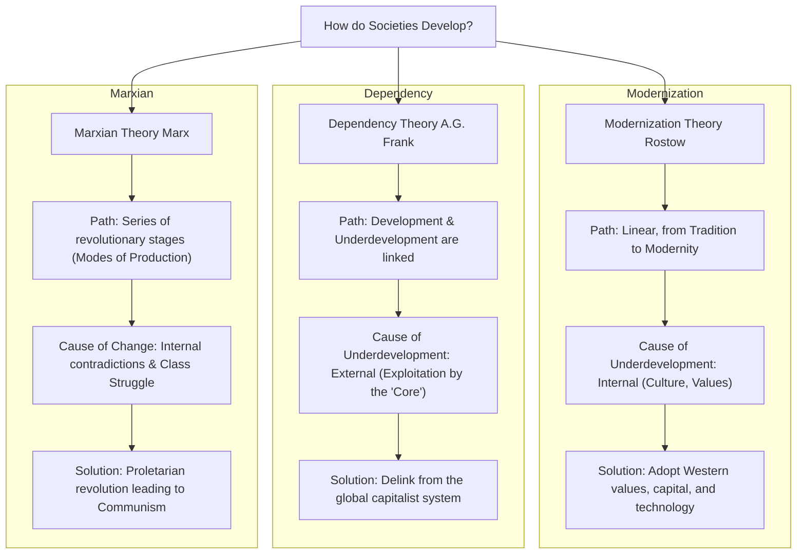
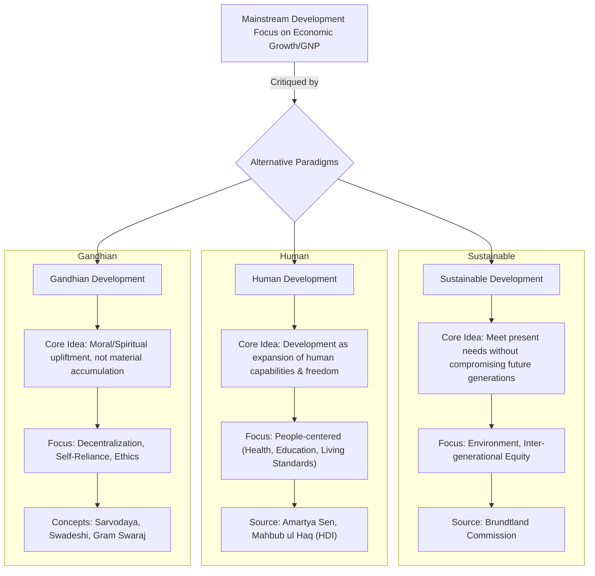
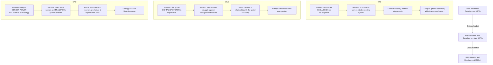
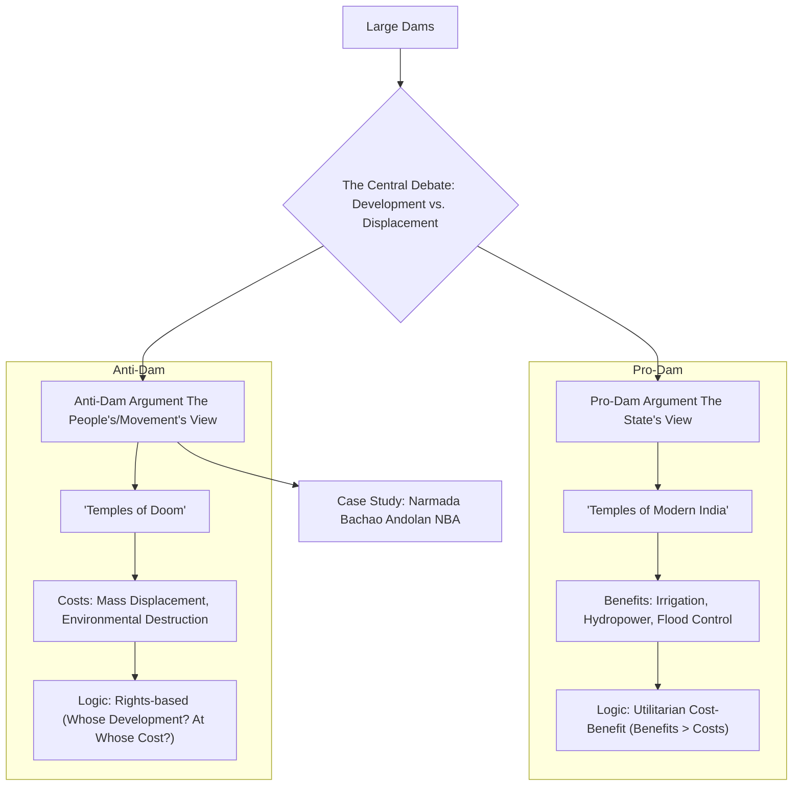
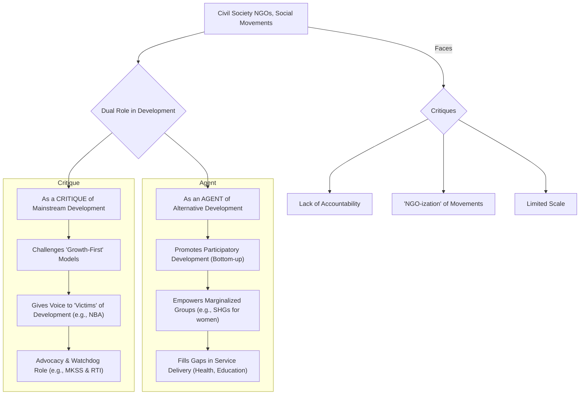

# MSO-03 Sociology of Development**

## Blocks 8 - Units 30
#### **Block 1: Conceptualising Development**
This block lays the foundation by exploring the very meaning and measurement of development.

*   **Unit 1:** Development and Progress: A Conceptual Overview
*   **Unit 2:** Social and Human Development
*   **Unit 3:** Development as Freedom (focus on Amartya Sen's approach)
*   **Unit 4:** Measuring Human Development

#### **Block 2: Changing Conceptions of Development**
This block traces the evolution of major development theories and paradigms.

*   **Unit 5:** Modernisation and Development
*   **Unit 6:** Dependency Theory of Underdevelopment
*   **Unit 7:** The World System Theory
*   **Unit 8:** Alternative Perspectives on Development

#### **Block 3: Issues in Development**
This block focuses on key debates and practical challenges in the field of development.

*   **Unit 9:** Sustainable Development
*   **Unit 10:** State and Market in Development
*   **Unit 11:** Micro-Planning and Participatory Development
*   **Unit 12:** The Knowledge Society and Development

#### **Block 4: Developmental Experiences**
This block examines the real-world application and outcomes of different development paths.

*   **Unit 13:** Capitalist and Socialist Paths of Development
*   **Unit 14:** The Indian Experience of Development
*   **Unit 15:** Globalisation and Development
*   **Unit 16:** Population and Development

#### **Block 5: Social Sector and Development**
This block analyzes the relationship between development and key social sectors.

*   **Unit 17:** Health and Development
*   **Unit 18:** Education and Development
*   **Unit 19:** Family and Development
*   **Unit 20:** Urbanisation and Development

#### **Block 6: Social and Human Aspects of Development**
This block delves into the human costs and social impacts of development processes.

*   **Unit 21:** Equity and Development
*   **Unit 22:** Gender and Development
*   **Unit 23:** Displacement, Rehabilitation and Development
*   **Unit 24:** Tribal People and Development

#### **Block 7: New Social Actors and Development**
This block looks at the role of emerging actors and groups in shaping the development agenda.

*   **Unit 25:** Non-Governmental Organisations (NGOs) and Development
*   **Unit 26:** Social Movements and Development
*   **Unit 27:** Identity, Culture and Development

#### **Block 8: New Forms of Development**
The final block explores contemporary trends and critiques in the field of development.

*   **Unit 28:** Information Technology and Development
*   **Unit 29:** Mass Media and Development
*   **Unit 30:** The Post-Development Perspective

---

### **Assessment and Examination Pattern**

The evaluation scheme for MSO-03 follows the standard IGNOU Master's program format:

*   **Assignments (Tutor Marked Assignments - TMA):** Holds a weightage of **30%**. One assignment must be submitted for this course.
*   **Term-End Examination (TEE):** The final written exam accounts for **70%** of the total marks.

**Typical TEE Question Paper Format:**

*   **Duration:** 3 Hours
*   **Maximum Marks:** 100
*   **Structure:** The paper is composed of two sections. Candidates must answer a total of **five questions**, with the condition of selecting **at least two questions from each section**.
*   **Word Limit:** Each answer should be written in approximately **500 words**.
*   **Marks per Question:** Each question is worth **20 marks**.

### **Tips for Studying MSO-03**

1.  **Understand the Core Theories:** Master the main arguments of Modernisation Theory, Dependency Theory (A.G. Frank), and World-System Theory (Immanuel Wallerstein). Understanding these three pillars is essential for the entire course.
2.  **Go Beyond Economic Indicators:** A central theme of this course is the critique of development as just GDP growth. Focus on concepts like Human Development Index (HDI), Development as Freedom (Amartya Sen), and Sustainable Development. Be prepared to discuss the social, political, and environmental dimensions.
3.  **Connect Theory to Issues:** Link the theories you learn in Block 2 to the specific issues discussed later. For example, how does Dependency Theory help explain the challenges of 'Health and Development' (Block 5) in a developing country? How does globalisation affect 'Gender and Development' (Block 6)?
4.  **Use Indian Case Studies:** While the course has a global focus, your answers will be much stronger if you can illustrate your points with Indian examples. Think about India's Five-Year Plans (Modernisation), the Narmada Bachao Andolan (Displacement, Social Movements), the role of NGOs in rural development, and the impact of the IT revolution.
5.  **Focus on Critiques:** For almost every topic (Modernisation, Globalisation, large dams), there is a counter-argument or critique. Your answers should reflect this complexity. For instance, when discussing NGOs, mention both their positive contributions and the criticisms against them (foreign funding, accountability issues, etc.).
6.  **Master Key Terminology:** Be very clear on terms like Sustainable Development, Participatory Development, Social Capital, Equity vs. Equality, and Post-Development. Using these terms correctly will significantly improve your marks.

---
---

## Comprehensive Tables

### **1. High-Impact Comparative Tables (MSO-003)**

**Table 1: Mainstream vs. Alternative Development Paradigms**

| Feature                 | **Mainstream Development (Modernization/Liberal)**                                     | **Alternative Development (Human/Sustainable/Gandhian)**                         |
| :---------------------- | :------------------------------------------------------------------------------------- | :------------------------------------------------------------------------------- |
| **Primary Goal**        | **Economic Growth** (Increase in GNP/GDP).                                             | **Human Well-being** (Capabilities, Equity, Sustainability).                     |
| **Core Assumption**     | Growth will "trickle down" to benefit all. The market is the most efficient allocator. | Growth is only a means, not an end. It can be inequitable and destructive.       |
| **View of Nature**      | A resource to be exploited for human progress.                                         | An ecosystem to be protected for its intrinsic value and for future generations. |
| **Role of State**       | Minimal ("Night Watchman") in the liberal view; directive in early modernization.      | Can be an active facilitator of human development and environmental regulation.  |
| **Key Metrics**         | GNP per capita, industrial output.                                                     | Human Development Index (HDI), ecological footprint, measures of equity.         |
| **Associated Thinkers** | W.W. Rostow, Adam Smith.                                                               | Amartya Sen, Mahbub ul Haq, E.F. Schumacher.                                     |

**Table 2: Modernization Theory vs. Dependency Theory**

| Feature | **Modernization Theory** | **Dependency Theory** |
| :--- | :--- | :--- |
| **Unit of Analysis** | The Nation-State. | The World Capitalist System. |
| **Cause of Underdevelopment** | **Internal:** "Traditional" culture, lack of capital, weak institutions. | **External:** Exploitative integration into the global system (Core-Periphery). |
| **Historical Process** | **Ahistorical:** All societies follow the same linear path from tradition to modernity. | **Historical:** Underdevelopment is a product of colonialism and imperialism. |
| **Core-Periphery Relation** | The "Core" (West) provides a model and aid to help the "Periphery" develop. | The "Core" actively **underdevelops** the "Periphery" by extracting its surplus. |
| **Key Proponents** | W.W. Rostow, Talcott Parsons. | Andre Gunder Frank, Samir Amin. |
| **Proposed Solution** | Diffusion of Western capital, technology, and values. | **Delinking** from the global capitalist system; socialist revolution. |

**Table 3: Evolution of Gender & Development Approaches**

| Feature | **WID (Women in Development)** | **WAD (Women and Development)** | **GAD (Gender and Development)** |
| :--- | :--- | :--- | :--- |
| **Primary Problem** | Women are **excluded** from the development process. | The **global capitalist system** is inherently exploitative of women. | **Unequal gender power relations** (Patriarchy) are the root cause. |
| **Focus** | **Integrating women** into the existing economic system. Making development efficient. | Women's relationship with class structures and the global economy. | The **relationship between men and women**; transforming social relations. |
| **Solution** | Women-specific projects, access to credit and education. | Women must join the class struggle against global capitalism. | **Empowerment** of women and **Gender Mainstreaming** in all policies. |
| **Theoretical Link** | Liberal Feminism. | Marxist / Dependency Theory. | Socialist / Radical Feminism. |
| **Limitation** | Ignores patriarchy; adds to women's "double burden." | Prioritizes class over gender; sees women as a monolithic group. | Can be difficult to implement; risks being co-opted by bureaucracies. |

---

### **2. High-Impact Sociological Quotes (MSO-003)**

| Sl. No. | Theme | Quote | Thinker & Source |
| :--- | :--- | :--- | :--- |
| 1 | **Sustainable Development** | "Development that meets the needs of the present without compromising the ability of future generations to meet their own needs." | Brundtland Commission, *Our Common Future* |
| 2 | **Human Development** | "The basic purpose of development is to enlarge people's choices... The objective of development is to create an enabling environment for people to enjoy long, healthy and creative lives." | Mahbub ul Haq |
| 3 | **Capability Approach** | "Poverty must be seen as the deprivation of basic capabilities rather than merely as lowness of incomes." | Amartya Sen, *Development as Freedom* |
| 4 | **Gandhian Development** | "The world has enough for everyone's need, but not enough for everyone's greed." | Mahatma Gandhi |
| 5 | **Dependency Theory** | "Underdevelopment is not the lack of development, but the result of a particular historical process of capitalist development." | (Paraphrasing) Andre Gunder Frank |

---

### **3. Jargon & Keyword Bank (MSO-003)**

| Sl. No. | Keyword | Associated Thinker(s) / Concept | Brief Meaning |
| :--- | :--- | :--- | :--- |
| 1 | **Ethnocentrism** | (Critique of Modernization) | Evaluating other cultures according to the standards of one's own, implying superiority. |
| 2 | **Core-Periphery** | Immanuel Wallerstein, Dependency Theorists | A model of the world system where the industrialized "core" nations exploit the resource-exporting "periphery" nations. |
| 3 | **Unequal Exchange** | Arghiri Emmanuel, Dependency Theorists | The process by which the periphery is forced to sell its raw materials cheaply and buy expensive manufactured goods from the core. |
| 4 | **Capability Approach** | Amartya Sen | A theory that defines development as the expansion of people's real freedoms (capabilities) to live a life they value. |
| 5 | **Human Development Index (HDI)** | Mahbub ul Haq (UNDP) | A composite index measuring development based on life expectancy, education, and per capita income. |
| 6 | **Inter-generational Equity** | Sustainable Development | The principle of justice between generations, ensuring the future has the same opportunities as the present. |
| 7 | **Intra-generational Equity** | Sustainable Development | The principle of justice within the current generation, focusing on poverty alleviation. |
| 8 | **Patriarchy** | (Feminist Theory / GAD) | A social system in which men hold primary power and predominate in roles of political leadership, moral authority, and control of property. |
| 9 | **Gender Mainstreaming** | (GAD Approach) | The strategy of integrating a gender perspective into the design, implementation, and evaluation of all policies and programs. |
| 10 | **Bio-piracy** | Vandana Shiva | The commercial exploitation of traditional knowledge and biological resources from developing countries without proper compensation. |

---

### **4. Contemporary Thinkers & Books for Application (MSO-003)**

| Sl. No. | Thinker / Book | Core Concept | Application in MSO-003 Answers |
| :--- | :--- | :--- | :--- |
| 1 | **Amartya Sen** (*Development as Freedom*) | **Capability Approach** | The foundational text for the Human Development paradigm. Use it to critique purely economic (GNP-based) models of development. |
| 2 | **Arturo Escobar** (*Encountering Development*) | **Post-Development** | A radical critique arguing that the entire "development" discourse is a Western construct designed to control the Third World. Use to critique all mainstream theories. |
| 3 | **Vandana Shiva** (*Staying Alive: Women, Ecology and Development*) | **Eco-feminism** | Argue that the destruction of the environment (Prakriti) and the subordination of women are linked products of a patriarchal, Western model of development. Excellent for answers on gender and sustainability. |
| 4 | **James Ferguson** (*The Anti-Politics Machine*) | **The Failures of the "Development" Apparatus** | Use to critique development projects. Ferguson shows how development agencies often misunderstand local realities and their projects end up strengthening bureaucratic power rather than alleviating poverty. |
| 5 | **Walter Fernandes** (Works on Displacement) | **Development-Induced Displacement** | The go-to Indian scholar for data and analysis on the social costs of development projects like large dams and mines. Use his work to provide empirical evidence for the anti-dam argument. |

---
---

## Tier 1: The Absolute Core (Highest Priority for MSO-003)

**Themes Covered in Tier 1:**
1.  **Theories of Development & Underdevelopment:** Modernization Theory (and its decline), Dependency Theory, and the Marxian Perspective.
2.  **The "Alternative Trinity":** Sustainable Development, Human Development, and the Gandhian Perspective.
3.  **Gender and Development:** The WID, WAD, and GAD approaches.
4.  **Globalization:** Its cultural and economic impact on development.

---

### **Theme 1: Theories of Development & Underdevelopment**

This theme covers the grand debate that dominated development studies for decades: the clash between the mainstream, Western-centric Modernization school and its radical critique from the Dependency school.

---

### **Note 1.1: The Modernization Paradigm and its Decline**

**(Keywords: Modernization, Traditional vs. Modern, Rostow's Stages, Parsons' Pattern Variables, Ethnocentrism, Dependency Theory)**

#### **Introduction**

The **Modernization Paradigm** was the dominant theory of development in the 1950s and 1960s, heavily influenced by both functionalist sociology and Cold War politics. It conceptualized development as a **linear, evolutionary process** through which "traditional" societies would progressively transform into "modern" Western-style societies. It argued that the primary barriers to development were **internal** to these traditional societies—their cultural values, social structures, and lack of capital. The solution, therefore, was to adopt Western values, institutions, and economic aid.

#### **1. Core Tenets of Modernization Theory**

1.  **Development as a Linear Path:** All societies are seen as being on a single path from tradition to modernity. The West is simply further along this path, providing the model for others to follow.
2.  **The Traditional vs. Modern Dichotomy:** Society is viewed through a sharp, dualistic lens.
    *   **Traditional Societies:** Characterized by ascription, particularism, collectivism, affective relationships, and a resistance to change.
    *   **Modern Societies:** Characterized by achievement, universalism, individualism, affective neutrality, and a culture of innovation.
    *   **(Link to MSO-001):** This dichotomy is directly based on **Talcott Parsons' "Pattern Variables,"** which provides the sociological foundation for the theory.
3.  **Internal Barriers to Growth:** The theory posits that underdevelopment is caused by internal factors within the "Third World," such as a fatalistic culture, lack of entrepreneurial spirit (*n-ach* or "need for achievement" - **David McClelland**), and traditional social structures.
4.  **The Role of the West:** The West's role is to facilitate this transition through the diffusion of capital, technology, and modern values.

#### **2. Key Models within the Paradigm**

*   **W.W. Rostow's "Stages of Economic Growth":** This is the most famous economic model of modernization. Rostow argued that all societies pass through five stages:
    1.  The Traditional Society
    2.  The Pre-conditions for Take-off
    3.  The **Take-off** (a short period of intensive growth)
    4.  The Drive to Maturity
    5.  The Age of High Mass-Consumption

#### **3. The Decline and Critique of the Modernization Paradigm**

By the late 1960s, the modernization paradigm came under heavy attack, leading to its decline.

1.  **Empirical Failure:** The theory failed in practice. Decades of Western aid and investment did not lead to the promised "take-off" in most of Latin America, Africa, and Asia. Instead, inequality and poverty often worsened.
2.  **Ethnocentrism:** The theory is deeply **ethnocentric**, assuming that the Western model of development is the only desirable or possible one. It devalues traditional cultures and ignores the unique historical paths of different societies.
3.  **Ignoring History and Colonialism:** Its most significant flaw was its complete failure to account for the role of **colonialism and imperialism**. It treated developing nations as if they existed in a historical vacuum, ignoring the fact that their "tradition" was often a product of centuries of colonial exploitation that had destroyed their indigenous industries and distorted their economies.
4.  **The Dependency Theory Critique:** This was the most powerful theoretical challenge. Thinkers like **Andre Gunder Frank** argued that the modernization paradigm had it exactly backward. Underdevelopment was not an original, internal state; it was an **active process** caused by the integration of these societies into the global capitalist system on unequal terms. The West did not develop in isolation; it developed by actively **"underdeveloping"** the rest of the world.

#### **Conclusion**

The Modernization paradigm was the first major attempt to create a systematic theory of development. Its focus on internal cultural and structural factors provided some insights, but its linear, ahistorical, and ethnocentric assumptions ultimately proved to be its undoing. The rise of powerful critiques, especially from the Dependency school, led to its decline and paved the way for more critical and historically grounded understandings of the complex relationship between the developed "core" and the underdeveloped "periphery."

---

### **Note 1.2: Dependency Theory of Underdevelopment**

**(Keywords: Dependency, Core-Periphery, Andre Gunder Frank, Metropolis-Satellite, Unequal Exchange, Underdevelopment)**

#### **Introduction**

**Dependency Theory** emerged in the 1960s and 70s, primarily from Latin American scholars, as a radical critique of the Modernization paradigm. It rejected the idea that underdevelopment was an original or traditional state. Instead, it argued that development and underdevelopment are two sides of the same coin—the result of the integration of the "Third World" (the **periphery**) into the global capitalist system dominated by the West (the **core**). The core actively **underdevelops** the periphery to fuel its own development.

#### **1. Core Tenets of Dependency Theory**

1.  **Development and Underdevelopment are Interlinked:** The wealth of the core nations is directly linked to the poverty of the peripheral nations. They are locked in a single, global capitalist system.
2.  **The Core-Periphery Model:** The world system is divided into:
    *   **The Core (Metropolis):** The powerful, industrialized nations of the West.
    *   **The Periphery (Satellite):** The poor, developing nations that provide cheap labor, raw materials, and markets for the core.
3.  **The Mechanism of Exploitation: Unequal Exchange:** The relationship is inherently exploitative. The periphery is forced to sell its raw materials cheaply and buy expensive manufactured goods from the core. This leads to a continuous **transfer of economic surplus** from the periphery to the core.
4.  **External Forces are Key:** Unlike modernization theory, which blames internal factors, dependency theory insists that the primary causes of underdevelopment are **external**—the structure of the global capitalist system.

#### **2. Andre Gunder Frank's "Development of Underdevelopment"**

**Andre Gunder Frank (A.G. Frank)** was one of the most forceful proponents of this view.

*   **Critique of Dualism:** He rejected the idea that developing countries have a "dual society" (one modern, one traditional). He argued that even the most seemingly "traditional" or feudal parts of the periphery have been penetrated and shaped by capitalism for centuries.
*   **Metropolis-Satellite Chain:** Frank described a chain of exploitation. The global **metropolis** (e.g., the USA) exploits its national **satellites** (e.g., Brazil). Within Brazil, the national capital (e.g., São Paulo) acts as a metropolis, exploiting its regional satellites, which in turn exploit the local peasantry. Surplus is drained up the chain at every step.
*   **The Solution: Delinking:** Since integration into the capitalist system is the cause of underdevelopment, the only solution for the periphery is to **"delink"** from it through socialist revolution.

#### **3. Critique of Dependency Theory**

Dependency theory also faced significant criticism:

1.  **Overly Deterministic:** It can be overly deterministic, suggesting that the periphery is trapped with no possibility of development within the capitalist system.
2.  **The Rise of the NICs:** The theory struggled to explain the rapid economic growth of the **"Newly Industrializing Countries" (NICs)** like South Korea, Taiwan, and Singapore in the 1970s and 80s, which achieved development *while* being integrated into the world system.
3.  **Ignoring Internal Factors:** In its focus on external exploitation, it can downplay the role of **internal factors** like corrupt elites, political instability, and poor governance in hindering development.
4.  **Vague Policy Prescriptions:** The call to "delink" from the global system was seen by many as unrealistic and potentially disastrous.

#### **Conclusion**

Dependency theory provided a vital and necessary corrective to the ethnocentrism of the modernization paradigm. By highlighting the role of colonialism, global power structures, and unequal exchange, it fundamentally changed the debate on development. While its predictions were not always accurate, its core insight—that the development path of the "Third World" cannot be understood in isolation from its relationship with the dominant core—remains a powerful and enduring contribution to the sociology of development.

---

### **Note 1.3: The Marxian Idea of Development**

**(Keywords: Historical Materialism, Mode of Production, Forces of Production, Relations of Production, Class Struggle, Communism)**

#### **Introduction**

**(Link to MSO-001):** **Karl Marx's** idea of development is inseparable from his broader theory of **historical materialism**, which posits that the **mode of production** (the way society produces its material life) is the foundation of any society and the primary engine of historical change. For Marx, development is not a smooth, linear process but a series of revolutionary transformations driven by the internal contradictions and **class struggles** within each mode of production. The ultimate goal of this development is the achievement of a classless, communist society.

#### **1. The Engine of History: The Mode of Production**

Marx argued that history progresses through a sequence of modes of production:

1.  **Primitive Communism**
2.  **Asiatic Mode**
3.  **Ancient (Slave) Mode**
4.  **Feudal Mode**
5.  **Capitalist Mode**

Each mode of production consists of two key elements:

*   **Forces of Production:** The technology, raw materials, and labor power used in production.
*   **Relations of Production:** The social relations that govern production, primarily the system of property ownership (who owns the means of production).

#### **2. The Dialectic of Change**

Development occurs through a dialectical process:

1.  **Contradiction:** The **forces of production** (e.g., new technology, factories) are constantly developing and becoming more powerful.
2.  **Fettering:** At a certain point, the existing **relations of production** (e.g., the feudal system of land ownership) become a **"fetter"** or a barrier to the further development of the productive forces.
3.  **Class Struggle and Revolution:** This contradiction intensifies the **class struggle** between the dominant class (which benefits from the old relations) and the rising class (which is associated with the new forces). This leads to a **social revolution** that overthrows the old relations and establishes a new mode of production.
4.  **Example:** The rise of new commercial forces in the towns (bourgeoisie) came into conflict with the old feudal relations of the countryside, leading to the bourgeois revolutions that established capitalism.

#### **3. Capitalism as a Necessary but Contradictory Stage**

Marx had a dual view of capitalism in the context of development.

*   **Historically Progressive Role:** He saw capitalism as a necessary and revolutionary force. It destroyed the old feudal order, unleashed unprecedented growth in the **forces of production**, created a world market, and paved the way for a future socialist society.
*   **Internal Contradictions:** However, capitalism is also riddled with its own internal contradictions (as discussed in MSO-001, Theme 4), primarily the conflict between the socialized nature of production and the private appropriation of profit. This leads to exploitation, alienation, and economic crises.

#### **4. The Ultimate Goal: Communism**

For Marx, the final stage of historical development is **communism**. This is achieved through a **proletarian revolution** that overthrows the capitalist mode of production.

*   **Abolition of Private Property:** Communism abolishes private ownership of the means of production.
*   **End of Class and Exploitation:** This eliminates class divisions and exploitation.
*   **True Human Development:** For Marx, this is the ultimate form of development. It is a society where alienation is overcome, and humans can finally realize their full creative potential, moving from the "realm of necessity to the realm of freedom."

#### **Conclusion**

The Marxian idea of development is a powerful, historical, and conflict-centered theory. It sees development not as a harmonious process of growth (like modernization theory) but as a series of revolutionary ruptures driven by class struggle. While its predictions of a worldwide proletarian revolution have not come to pass, its focus on the internal contradictions of capitalism and the role of class conflict in shaping historical change remains a profoundly influential framework in the sociology of development.

---
### **Mermaid Diagram: Grand Theories of Development**

---
### **Quick Revision Scaffold**

*   **Modernization Theory:**
    *   **Idea:** Linear path from "traditional" to "modern" (Western) society.
    *   **Cause of Underdevelopment:** Internal cultural/social barriers.
    *   **Critique:** Ethnocentric; ignores colonialism. **(Link to MSO-001: Based on Parsons' Pattern Variables).**
*   **Dependency Theory:**
    *   **Idea:** A radical critique. The "Core" actively **underdevelops** the "Periphery."
    *   **Cause of Underdevelopment:** External exploitation through unequal exchange in the global capitalist system.
    *   **Key Thinker:** A.G. Frank ("Development of Underdevelopment").
*   **Marxian Theory:**
    *   **Idea:** Development occurs through revolutionary stages (**Modes of Production**).
    *   **Engine of Change:** Contradiction between **Forces** and **Relations** of production, leading to **Class Struggle**.
    *   **Goal:** A classless, communist society. **(Link to MSO-001: Based on Historical Materialism).**

---

### **Theme 2: The "Alternative Trinity": Sustainable, Human, and Gandhian Development**

This theme covers three major alternative paradigms that emerged in response to the failures of mainstream development models. They argue that true development must be environmentally sound, people-centered, and ethically grounded.

---

### **Note 2.1: Sustainable Development**

**(Keywords: Sustainable Development, Brundtland Commission, Inter-generational Equity, Intra-generational Equity, Environmentalism, Ecological Modernization)**

#### **Introduction**

The concept of **Sustainable Development** emerged in the 1980s as a powerful critique of mainstream development models that prioritized rapid economic growth at the cost of severe environmental degradation. It seeks to reconcile two often-competing goals: **economic development** and **environmental protection**. The most famous definition comes from the **1987 Brundtland Commission Report ("Our Common Future")**, which defined sustainable development as:

> "Development that meets the needs of the present without compromising the ability of future generations to meet their own needs."

This definition contains two core ethical principles: **inter-generational equity** and **intra-generational equity**.

#### **1. The Core Principles of Sustainable Development**

1.  **Inter-generational Equity (Justice between Generations):** This is the heart of the Brundtland definition. It means that the current generation has a moral obligation to leave a healthy and resource-rich planet for future generations. We should not deplete natural resources or cause irreversible environmental damage that will harm our children and grandchildren.
2.  **Intra-generational Equity (Justice within the Current Generation):** This principle emphasizes that sustainable development must also address the needs of the poor and marginalized in the present. It recognizes that poverty is a major cause of environmental degradation (as the poor are often forced to over-exploit their immediate environment for survival). Therefore, achieving social justice and poverty alleviation is an integral part of sustainability.
3.  **Integration of Environment and Economy:** Sustainable development rejects the idea that environment and economy are in opposition. It argues that long-term economic prosperity depends on a healthy environment. It calls for a shift towards green technologies, renewable energy, and a "circular economy" that minimizes waste.
4.  **The Three Pillars:** The concept is often visualized as resting on three interconnected pillars:
    *   **Environmental Sustainability:** Protecting ecosystems and biodiversity.
    *   **Economic Sustainability:** Ensuring long-term, stable economic growth.
    *   **Social Sustainability:** Promoting social equity, justice, and cultural diversity.

#### **2. Critiques of Sustainable Development**

While widely adopted, the concept has also faced significant criticism:

1.  **Vague and Ambiguous:** Critics argue that the term is so broad and all-encompassing that it has become a meaningless buzzword. It can be interpreted in many different ways, allowing corporations and governments to engage in **"greenwashing"**—using the language of sustainability to continue environmentally destructive practices.
2.  **Oxymoron? (The "Growth vs. Environment" Debate):** More radical critics (often called **"eco-socialists"** or **"deep ecologists"**) argue that "sustainable development" is an oxymoron. They claim that the capitalist pursuit of infinite economic growth on a finite planet is inherently unsustainable. True sustainability, they argue, requires a move away from the growth paradigm altogether (**"de-growth"**).
3.  **Ignoring Power and Politics:** The concept can be apolitical, presenting sustainability as a technical problem to be solved by experts. It often overlooks the powerful vested interests (e.g., fossil fuel corporations) that resist the transition to a sustainable economy and the deep inequalities in power that shape environmental outcomes.

#### **Conclusion**

Despite its ambiguities, the concept of sustainable development has fundamentally changed the global conversation about development. It has successfully placed environmental concerns and the principle of inter-generational justice at the center of policy-making. While the challenge of translating its principles into effective action remains immense, it provides an indispensable ethical and analytical framework for navigating the complex environmental and social crises of the 21st century.

---

### **Note 2.2: The Human Development Approach**

**(Keywords: Human Development, Amartya Sen, Mahbub ul Haq, Capability Approach, Human Development Index (HDI), People-centered)**

#### **Introduction**

The **Human Development Approach** emerged in the 1990s as a powerful challenge to the dominant view that defined development purely in terms of economic growth (i.e., growth in Gross National Product or GNP). Pioneered by the economist **Mahbub ul Haq** and Nobel laureate **Amartya Sen**, this approach argues that the ultimate goal of development is not just to increase wealth, but to **expand human freedoms and capabilities**. It is a people-centered approach that asks not how much a country is producing, but how its people are faring.

#### **1. The Core Idea: Development as Freedom**

1.  **Critique of "Commodity Fetishism":** The approach critiques the traditional focus on GNP and income, which treats people as mere instruments for producing commodities. It argues that wealth is only a means, not the end of development.
2.  **Development as Expansion of Capabilities:** As articulated in **Amartya Sen's "Capability Approach,"** true development is the process of expanding people's **"capabilities"**—the real freedoms and opportunities they have to live the kind of life they have reason to value.
3.  **Functionings and Capabilities:**
    *   **Functionings:** Are the various things a person can *be* and *do* (e.g., being well-nourished, being educated, participating in community life).
    *   **Capabilities:** Are the set of valuable functionings that are realistically available to a person. It is the *freedom to choose* between different ways of living.
    *   **Example:** A rich person who is fasting is different from a poor person who is starving. Both have the same "functioning" (not eating), but the rich person has the "capability" to be well-nourished, while the poor person does not. Development is about expanding this capability set.

#### **2. The Human Development Index (HDI)**

To put these ideas into practice, Mahbub ul Haq and the **United Nations Development Programme (UNDP)** created the **Human Development Index (HDI)** in 1990.

*   **Purpose:** The HDI is a composite index that provides a more holistic measure of development than GNP per capita alone.
*   **Three Dimensions:** It combines three key dimensions of human well-being:
    1.  **A Long and Healthy Life:** Measured by **life expectancy at birth**.
    2.  **Knowledge:** Measured by **mean years of schooling** and **expected years of schooling**.
    3.  **A Decent Standard of Living:** Measured by **Gross National Income (GNI) per capita**.
*   **Impact:** The annual publication of the HDI has been highly influential in shifting the global development discourse away from a narrow focus on economic growth towards a broader concern for human well-being.

#### **Conclusion**

The Human Development Approach represents a paradigm shift in thinking about development. By defining development as the expansion of human freedom and capabilities, it places people firmly at the center of the process. It reminds us that the true measure of a society's success is not the size of its economy, but the quality of life and the real opportunities available to its citizens.

---

### **Note 2.3: The Gandhian Perspective on Development**

**(Keywords: Sarvodaya, Swadeshi, Trusteeship, Gram Swaraj, Appropriate Technology, Anti-industrialism)**

#### **Introduction**

**Mahatma Gandhi** offered a radical and profound critique of the Western model of industrial, materialist development long before concepts like sustainability became popular. His vision, articulated through concepts like **Sarvodaya, Swadeshi, and Gram Swaraj**, presents a holistic, ethical, and decentralized alternative. For Gandhi, true development was not about unlimited material accumulation but about moral and spiritual upliftment, self-reliance, and the well-being of the last person—**Antyodaya**.

#### **1. Core Principles of the Gandhian Model**

1.  **Sarvodaya (Welfare of All):** This is the central principle. It stands in contrast to the utilitarian idea of "the greatest good of the greatest number," which can justify sacrificing the minority. Sarvodaya insists on the well-being of *all*, especially the most marginalized.
2.  **Swaraj (Self-Rule):** Gandhi's concept of Swaraj was not just about political independence from the British. It meant **self-control, self-reliance, and rule over oneself**. True Swaraj is achieved when individuals and communities are masters of their own destiny.
3.  **Gram Swaraj (Village Self-Sufficiency):** The ideal social order for Gandhi was a nation of self-sufficient, self-governing village republics. Each village would produce for its own needs, have its own local governance, and be linked to other villages in a system of ever-widening, non-hierarchical circles.
4.  **Swadeshi (Localism):** This is the principle of prioritizing the use of local goods and services. It is a call for economic self-reliance and a rejection of dependence on mass-produced, centralized industry.
5.  **Trusteeship:** Gandhi's solution to class conflict. He argued that the wealthy should not see themselves as owners of their wealth, but as **"trustees"** who hold it in trust for the benefit of society. It is a call for the rich to voluntarily limit their consumption and use their surplus wealth for the common good.
6.  **Critique of Industrialism:** Gandhi was a fierce critic of large-scale, centralized industrialization, which he saw as the root cause of exploitation, inequality, and alienation. He advocated for **"appropriate technology"**—small-scale, decentralized technologies (like the *charkha* or spinning wheel) that are controlled by the user and do not displace labor.

#### **Conclusion**

The Gandhian perspective offers a powerful moral and ecological critique of mainstream development. In an era defined by climate change, extreme inequality, and social alienation, his ideas on decentralization, sustainability, localism, and ethical consumption have gained renewed relevance. While often dismissed as romantic or impractical, the Gandhian vision provides a timeless reminder that the ultimate goal of development should be the creation of a just, equitable, and humane social order, not just endless material growth.

---
### **Mermaid Diagram: The Alternative Development Trinity**

---
### **Quick Revision Scaffold**

*   **Sustainable Development:**
    *   **Definition (Brundtland):** Meeting present needs without compromising the future.
    *   **Core Principles:** **Inter-generational equity** (justice between generations) and **Intra-generational equity** (justice for the poor today).
    *   **Critique:** Vague; is "sustainable growth" an oxymoron?
*   **Human Development:**
    *   **Core Idea:** Development is not about GNP, but about expanding people's **capabilities** (freedoms).
    *   **Key Thinkers:** **Amartya Sen** (Capability Approach), **Mahbub ul Haq**.
    *   **Measurement:** **Human Development Index (HDI)**, which includes health, education, and standard of living.
*   **Gandhian Development:**
    *   **Core Idea:** A moral and ethical alternative to Western materialism.
    *   **Key Concepts:**
        *   **Sarvodaya:** Welfare of all.
        *   **Gram Swaraj:** Village self-sufficiency.
        *   **Swadeshi:** Localism.
        *   **Trusteeship:** The wealthy as trustees for society.
    *   **Relevance:** A powerful ecological and ethical critique of modern development.

---

### **Theme 3: Gender and Development**

**(Keywords: Gender, WID, WAD, GAD, Empowerment, Patriarchy, Gender Mainstreaming)**

#### **Introduction**

For much of its history, development theory and practice were **"gender-blind."** It was implicitly assumed that the benefits of development would automatically "trickle down" to women. However, feminist scholars and activists, beginning in the 1970s, powerfully demonstrated that development often has a differential and frequently negative impact on women. This led to the emergence of the field of **"Gender and Development,"** which has evolved through three major theoretical and policy approaches: **Women in Development (WID)**, **Women and Development (WAD)**, and **Gender and Development (GAD)**.

#### **1. The WID Approach: Women in Development**

1.  **Emergence:** The WID approach emerged in the early 1970s, influenced by liberal feminism and the work of **Esther Boserup** ("Woman's Role in Economic Development").
2.  **Core Argument:** The central problem, according to WID, is that women have been **excluded** from the development process. Development has been male-dominated, ignoring women's economic contributions (especially in agriculture and the informal sector).
3.  **The Solution: Integration:** The solution is to **integrate women into the existing development model**. This involves creating women-specific projects (e.g., income-generation schemes, skills training) and giving them better access to education, credit, and markets.
4.  **Focus:** The focus is on making development more **efficient** by utilizing the untapped potential of women. It is about adding women to the development equation.
5.  **Critique:**
    *   **Doesn't Challenge the System:** WID does not question the fundamental nature of the development model itself, which may be inherently unequal. It simply wants to "add women and stir."
    *   **Focus on Productive Roles:** It tends to focus only on women's productive roles, ignoring their reproductive roles (childcare, household work) and the heavy "double burden" they carry.
    *   **Ignores Patriarchy:** It does not adequately address the underlying structures of **patriarchy** and unequal gender power relations that cause women's exclusion in the first place.

#### **2. The WAD Approach: Women and Development**

1.  **Emergence:** The WAD approach emerged in the late 1970s, influenced by Marxist and Dependency Theory perspectives.
2.  **Core Argument:** The problem is not just women's exclusion, but the **exploitative nature of the global capitalist system** itself. This system exploits both women and developing nations. Women's subordination is seen as a product of class and colonial oppression.
3.  **The Solution: Structural Transformation:** The solution is not just to integrate women into this exploitative system, but to **transform the system itself**. It emphasizes the need for women from the Global South to organize and struggle against both international capitalism and local class structures.
4.  **Focus:** The focus is on the relationship between **women and the development process**, highlighting how women have always been integrated, but in an exploitative way (as a source of cheap labor).
5.  **Critique:**
    *   **Class over Gender:** WAD is criticized for prioritizing class analysis over gender analysis. It tends to see women as a uniform class, downplaying the specific structures of **patriarchy** that oppress women across different classes.
    *   **Focus on Productive Roles:** Like WID, it also tends to focus primarily on women's productive labor.

#### **3. The GAD Approach: Gender and Development**

1.  **Emergence:** The GAD approach emerged in the 1980s, influenced by socialist and radical feminism. It represents the most comprehensive and widely accepted approach today.
2.  **Core Argument:** The problem is not women, but the **unequal social and power relations between men and women (i.e., gender relations)**. It argues that society assigns different roles, responsibilities, and resources to men and women, and these relationships are rooted in the ideology of **patriarchy**.
3.  **The Solution: Empowerment and Transformation of Gender Relations:** The solution is not just to integrate women or overthrow capitalism, but to **empower women** and **transform the unequal gender relations** in all spheres of life—the household, the community, the market, and the state.
4.  **Focus:**
    *   **Holistic View:** GAD looks at both women's productive and reproductive roles and the social construction of gender.
    *   **Men as Part of the Solution:** It explicitly includes men in the analysis, recognizing that gender relations involve both men and women and that men must also be involved in the process of change.
    *   **Empowerment:** The goal is women's empowerment, which means not just improving their condition but enhancing their ability to make strategic life choices and challenge existing power structures.
5.  **Key Strategy: Gender Mainstreaming:** This is the primary strategy of the GAD approach. It involves ensuring that a gender perspective is integrated into all development policies, programs, and institutions, not just in separate "women's projects."

#### **Conclusion**

The evolution from WID to WAD to GAD represents a deepening of the feminist critique of development. It marks a theoretical journey from seeing women as a "problem" to be fixed (WID), to seeing the global economic system as the problem (WAD), and finally, to identifying **unequal gender power relations (patriarchy)** as the fundamental barrier to both women's empowerment and genuine, equitable development. The GAD approach, with its focus on empowerment and transforming social relations, remains the most holistic and influential framework for creating a more just and gender-equal world.

---
### **Mermaid Diagram: Evolution of Gender and Development Approaches**

---
### **Quick Revision Scaffold**

*   **WID (Women in Development):**
    *   **Problem:** Women are **excluded**.
    *   **Solution:** **Integrate** them into the current system (e.g., via income-generation projects).
    *   **Critique:** Doesn't challenge the system or patriarchy.
*   **WAD (Women and Development):**
    *   **Problem:** The **global capitalist system** is the problem.
    *   **Solution:** Women must join the class struggle to overthrow it.
    *   **Critique:** Focuses on class, downplays patriarchy.
*   **GAD (Gender and Development):**
    *   **Problem:** Unequal **gender power relations** (patriarchy).
    *   **Solution:** **Empower** women and **transform** these relations.
    *   **Focus:** Includes men, reproductive roles, and social construction of gender.
    *   **Strategy:** **Gender Mainstreaming** (integrating a gender perspective into all policies).

---
---

## **Tier 2: High-Probability Topics (MSO-003)**

**Themes Covered in Tier 2:**
5.  **Debates on Large Dams and Displacement.**
6.  **The Role of Civil Society and Social Movements (Environmental).**
7.  **Knowledge, Information, and Technology in Development.**
8.  **The Liberal Perspective on Development.**

---
### **Theme 5: Debates on Large Dams and Displacement**

**(Keywords: Development-induced Displacement, Large Dams, Cost-Benefit Analysis, Narmada Bachao Andolan (NBA), Involuntary Resettlement)**

#### **Introduction**

Large dams have often been projected as "temples of modern India," symbols of national progress, technological prowess, and the state's ability to tame nature for human benefit. The stated goals are noble: **irrigation for agriculture, generation of hydroelectricity, and flood control**. However, this mainstream "developmentalist" narrative has been powerfully challenged by a counter-narrative that highlights the immense **social and environmental costs** of large dams. The debate centers on the issue of **development-induced displacement**, questioning who benefits from this model of development and who pays the price.

#### **1. The State's/Pro-Dam Argument: Dams as Temples of Modernity**

The official justification for large dams rests on a utilitarian, cost-benefit logic.

1.  **National Interest:** Dams are presented as essential for the "national interest." They are crucial for ensuring **food security** (through irrigation) and **energy security** (through hydropower), which are the foundations of industrial and economic growth.
2.  **Taming Nature:** They represent the triumph of modern science and engineering over the vagaries of nature, particularly the monsoon. They promise to control destructive floods and store water for use during droughts.
3.  **Cost-Benefit Analysis:** Proponents argue that the large-scale benefits to millions of people (in terms of electricity, irrigation, and industrial growth) far outweigh the costs, including the "unfortunate but necessary" displacement of a smaller number of people.
4.  **Promise of Rehabilitation:** The state promises that the displaced people (often called **Project Affected Persons or PAPs**) will be adequately compensated and resettled in a way that improves their standard of living.

#### **2. The Critique: The Social and Environmental Costs**

Critics and social movements, most famously the **Narmada Bachao Andolan (NBA)**, have systematically dismantled the pro-dam argument.

1.  **Massive Displacement:** Large dams cause the **involuntary displacement** of vast numbers of people, disproportionately affecting the most vulnerable communities, especially **Adivasis (tribals)** and Dalits, who have a deep cultural and economic connection to the land and forests that are submerged.
2.  **Failed Rehabilitation:** The promise of "land for land" and adequate rehabilitation has almost universally failed. Displaced people are often given poor quality land, cash compensation that is quickly spent, or are simply left to fend for themselves in urban slums. This leads to **impoverishment, loss of livelihood, and social disintegration.** Sociologist **Walter Fernandes** has extensively documented this process of marginalization.
3.  **Environmental Destruction:** The environmental costs are immense and often underestimated in official reports. They include:
    *   Submergence of vast tracts of **forests and biodiversity**.
    *   Disruption of riverine ecosystems and loss of fisheries.
    *   Problems of **siltation** (which reduces the dam's lifespan) and **water-logging/salinity** in command areas.
4.  **Flawed Cost-Benefit Analysis:** Critics argue that the official cost-benefit analyses are deeply flawed. They systematically **overestimate the benefits** (e.g., irrigation and power generation often fall far short of targets) and **underestimate the social and environmental costs**, which are treated as mere "externalities."
5.  **Violation of Rights:** The process of displacement often involves the violation of the human and constitutional rights of affected people, particularly the right to life and livelihood.

#### **3. The Narmada Bachao Andolan (NBA): A Case Study**

The NBA, a movement against the Sardar Sarovar Project on the Narmada river, became the global symbol of resistance to destructive, top-down development.

*   **Leadership:** Led by activists like **Medha Patkar**.
*   **Core Argument:** The movement shifted the debate from a narrow technical one to a fundamental political and ethical one. It asked: **"Whose development? At whose cost?"**
*   **Impact:** While the dam was eventually built, the NBA succeeded in bringing the issue of displacement and the politics of development to the national and international stage. It forced a greater degree of transparency and accountability and led to improved (though still inadequate) rehabilitation policies.

#### **Conclusion**

The debate on large dams encapsulates the central conflict in the sociology of development. It pits a top-down, state-led, techno-centric model of development against a people-centered, rights-based, and environmentally conscious perspective. It reveals that "development" is not a neutral process but a deeply political one, involving struggles over resources, rights, and competing visions of progress. The legacy of movements like the NBA is the powerful lesson that the social and human costs of development cannot be ignored and that the voices of the displaced and marginalized must be at the center of any just and sustainable development process.

---
### **Mermaid Diagram: The Large Dam Debate**

---
### **Quick Revision Scaffold**

*   **The Debate:** Pits a state-led, growth-centric view against a people-centered, rights-based view.
*   **Pro-Dam Argument (State's View):**
    *   **Goal:** National interest (food/energy security).
    *   **Logic:** Utilitarian cost-benefit analysis.
    *   **Slogan:** "Temples of Modern India."
*   **Anti-Dam Argument (Movement's View):**
    *   **Main Problem:** **Development-induced displacement**, disproportionately affecting Adivasis.
    *   **Key Issues:**
        1.  Failed rehabilitation and impoverishment.
        2.  Environmental destruction (submergence of forests).
        3.  Flawed cost-benefit calculations.
        4.  Violation of human rights.
    *   **Classic Example:** The **Narmada Bachao Andolan (NBA)** led by Medha Patkar.
*   **Conclusion:** The debate reveals development is a political process of struggle over resources and rights.

---

### **Theme 6: The Role of Civil Society and Social Movements in Development**

**(Keywords: Civil Society, Non-Governmental Organizations (NGOs), Social Movements, Empowerment, Advocacy, Participatory Development)**

#### **Introduction**

**(Link to MSO-001 & MSO-004):** As we've discussed, **civil society** is the "third sector" of voluntary, autonomous associations that exist between the state, market, and family. In the context of development, civil society, particularly through **Non-Governmental Organizations (NGOs)** and **Social Movements**, has emerged as a critical actor. It plays a dual role: first, as a **critique** of mainstream, top-down development models, and second, as an **agent** for promoting alternative, more equitable, and participatory forms of development, especially for the empowerment of marginalized groups.

#### **1. Civil Society as a Critique of State-led Development**

Historically, the dominant model of development was state-led and top-down. Civil society organizations and social movements have been instrumental in highlighting the failures and negative consequences of this model.

1.  **Challenging the "Development-as-Growth" Narrative:** They have challenged the narrow definition of development as mere economic growth, arguing that it often leads to greater inequality and environmental destruction.
2.  **Giving Voice to the "Victims" of Development:** Social movements, like the **Narmada Bachao Andolan**, have brought the voices of those displaced and marginalized by large-scale development projects (like dams and mines) into the public sphere. They expose the hidden social costs of "progress."
3.  **Advocacy and Policy Change:** Civil society acts as a "watchdog," monitoring state policies and advocating for change. They use public campaigns, media advocacy, and legal action (Public Interest Litigation or PIL) to hold the state accountable.
    *   **Example:** The **Mazdoor Kisan Shakti Sangathan (MKSS)** in Rajasthan led a powerful grassroots movement for the "Right to Information," which was a direct response to corruption in development schemes. This ultimately led to the national Right to Information (RTI) Act of 2005.

#### **2. Civil Society as an Agent of Alternative Development**

Beyond critique, civil society organizations are actively involved in implementing alternative, people-centered development models on the ground.

1.  **Promoting Participatory Development:** NGOs often work to ensure that local communities have a say in the planning and implementation of development projects that affect them. This "bottom-up" approach contrasts with the "top-down" approach of the state.
    *   **Example:** Many NGOs facilitate the process of **participatory rural appraisal (PRA)**, where villagers themselves map their resources and identify their needs.
2.  **Empowerment of the Marginalized:** This is a key function. Civil society organizations work to empower marginalized groups like women, Dalits, and Adivasis.
    *   **Women's Empowerment:** The formation of **Self-Help Groups (SHGs)**, often facilitated by NGOs, has been a major strategy for the economic and social empowerment of rural women.
    *   **Dalit and Adivasi Rights:** Organizations work on issues of land rights, prevention of atrocities, and ensuring access to education and justice for these communities.
3.  **Service Delivery and Filling Gaps:** In areas where the state's reach is weak, NGOs often step in to provide essential services in areas like **health, education, and sanitation**, demonstrating alternative and often more effective models of service delivery.
4.  **Environmental Protection:** Environmental NGOs and movements have been at the forefront of struggles to protect forests, rivers, and common property resources, advocating for sustainable models of development. (e.g., The Chipko Movement, Greenpeace).

#### **3. Critiques of Civil Society and NGOs**

While their role is crucial, the civil society sector is not without its problems.

1.  **Accountability and Legitimacy:** Unlike the state, NGOs are not democratically elected. This raises questions about their legitimacy and to whom they are accountable—their foreign donors or the local communities they claim to represent?
2.  **"NGO-ization" of Social Movements:** Some critics argue that the influx of foreign funding can lead to the "NGO-ization" of grassroots movements. This can cause them to become more bureaucratic, professionalized, and disconnected from their mass base, blunting their radical political edge.
3.  **Reinforcing Dependencies:** Poorly designed interventions can sometimes create new forms of dependency rather than fostering genuine self-reliance.
4.  **Small Scale:** The impact of most NGOs is localized. They often struggle to "scale up" their successful micro-level projects to bring about macro-level structural change.

#### **Conclusion**

Civil society has become an indispensable actor in the modern development landscape. It plays a vital dual role as both a conscience-keeper that critiques the failures of the state and the market, and as an innovator that pioneers more participatory and equitable models of development on the ground. While facing legitimate questions about accountability and effectiveness, the work of social movements and NGOs in empowering the marginalized and advocating for a more just and sustainable world is a crucial component of the ongoing struggle to redefine the very meaning of development.

---
### **Mermaid Diagram: The Role of Civil Society in Development**

---
### **Quick Revision Scaffold**

*   **Definition:** The "third sector" of voluntary associations. Key actors in development are **NGOs** and **Social Movements**.
*   **Dual Role:**
    1.  **As a CRITIQUE:**
        *   Challenges top-down, state-led development.
        *   Highlights social/environmental costs (e.g., NBA vs. dams).
        *   Acts as a watchdog (e.g., **MKSS** and the **RTI Act**).
    2.  **As an AGENT:**
        *   Promotes **participatory, bottom-up** development.
        *   **Empowers the marginalized** (e.g., Self-Help Groups for women).
        *   Fills gaps in state service delivery.
*   **Critiques of NGOs:**
    *   Lack of democratic **accountability**.
    *   **"NGO-ization"**: Can blunt the radical edge of social movements.
    *   Impact is often localized and hard to scale up.
*   **Link to MSO-004:** This theme directly connects to the role of New Social Movements in India.

---

### **Theme 7: Knowledge, Information, and Technology in Development**

**(Keywords: Knowledge Society, Information Society, Digital Divide, Indigenous Knowledge, Bio-piracy, TRIPS)**

#### **Introduction**

In the contemporary era of globalization, **knowledge and information** have become central factors of production and key drivers of development, leading to the emergence of the concept of the **"Knowledge Society"** or **"Information Society."** This new paradigm, powered by advances in Information and Communication Technologies (ICTs), offers immense potential for development. However, it also creates new challenges, including the **digital divide**, and sparks critical debates around the ownership, control, and protection of different forms of knowledge, particularly the clash between modern intellectual property regimes and **indigenous/traditional knowledge**.

#### **1. The Concept of the Knowledge Society**

1.  **Definition:** A knowledge society is one in which the creation, dissemination, and utilization of knowledge and information have become the most important drivers of economic growth and social development. It marks a shift from a resource-based or industrial economy to a knowledge-based economy.
2.  **Key Features:**
    *   **Primacy of Theoretical Knowledge:** As argued by **Daniel Bell** in his concept of "post-industrial society," theoretical knowledge, research, and development become the primary sources of innovation.
    *   **Role of ICTs:** The internet, mobile phones, and other digital technologies are the key infrastructure that enables the rapid dispersal and processing of information.
    *   **New Class Structure:** It leads to the rise of a new class of "knowledge workers" (e.g., scientists, engineers, programmers, consultants).

#### **2. The "Digital Divide": A New Form of Inequality**

While ICTs hold the promise of democratizing access to information, they have also created a new form of inequality known as the **"digital divide."**

*   **Definition:** The digital divide refers to the gap between individuals, communities, and countries that have access to modern information and communication technology and those that do not.
*   **Dimensions of the Divide:**
    *   **Global Divide:** The gap between developed (information-rich) and developing (information-poor) nations.
    *   **Domestic Divide:** The gap within a country, often along lines of **urban-rural, rich-poor, gender, and caste**. For example, urban, educated, upper-class men in India have far greater access to the internet than rural, uneducated, lower-caste women.
*   **Consequence:** This divide can exacerbate existing inequalities, as those without access to digital tools are left behind in an increasingly knowledge-driven economy.

#### **3. The Conflict Over Indigenous and Traditional Knowledge**

This is a critical issue for developing countries like India, which have a rich heritage of traditional knowledge systems.

1.  **Indigenous Knowledge (IK) / Traditional Knowledge (TK):** This refers to the knowledge systems that have been developed and passed down over generations within a local community, often orally. It includes knowledge about **medicinal plants, agricultural practices, and sustainable resource management.**
2.  **The Threat of "Bio-piracy":** This is the act by which corporations, often from the Global North, patent traditional knowledge or genetic resources from the Global South without permission or compensation.
    *   **Classic Example:** The patenting of the anti-fungal properties of the **neem tree** by a US corporation, which was later successfully challenged by India. Another example is the patenting of **turmeric** for its wound-healing properties.
3.  **The Role of TRIPS:** The **Trade-Related Aspects of Intellectual Property Rights (TRIPS)** agreement of the World Trade Organization (WTO) has been heavily criticized by developing countries.
    *   **Critique:** TRIPS imposes a Western-style, individualistic patent system that is ill-suited to protect traditional knowledge, which is often collectively owned and orally transmitted. Critics argue that it facilitates bio-piracy by making it easier for corporations to patent knowledge that has been in the public domain in developing countries for centuries.

#### **4. Initiatives for Protection**

In response, there have been several initiatives to protect traditional knowledge:

*   **Documentation:** Creating digital libraries and databases of traditional knowledge, like India's **Traditional Knowledge Digital Library (TKDL)**, to provide prior art evidence and prevent wrongful patenting.
*   **Sui Generis Systems:** Developing unique (*sui generis*) legal systems that are specifically designed to protect community-owned knowledge.
*   **Benefit-Sharing Agreements:** Pushing for international agreements that ensure that communities receive a fair share of the benefits derived from the commercial use of their knowledge and resources.

#### **Conclusion**

The rise of the knowledge society presents a dual reality for development. On one hand, ICTs and web-based knowledge dispersal offer unprecedented opportunities for education, empowerment, and economic growth. On the other hand, they create new inequalities through the digital divide and intensify the conflict over the ownership of knowledge. The struggle to protect traditional knowledge from bio-piracy and to bridge the digital divide are central challenges in the quest for a more equitable and just form of development in the information age.

---

### **Theme 8: The Liberal Perspective on Development**

**(Keywords: Liberalism, Adam Smith, Laissez-faire, Free Market, Economic Growth, Neoliberalism)**

#### **Introduction**

The **Liberal Perspective** is one of the oldest and most influential theories of development, rooted in the classical economic thought of **Adam Smith**. Its core belief is that the most effective path to development is through the functioning of a **free market economy** with minimal state intervention. Development is primarily defined as **economic growth**, and it is assumed that the wealth created by a free market will ultimately benefit society as a whole. This perspective has seen a powerful resurgence since the 1980s in the form of **neoliberalism**.

#### **1. Core Tenets of Classical Liberalism**

1.  **The Primacy of the Individual:** Liberalism places the rational, self-interested individual at the center of its analysis.
2.  **The "Invisible Hand" of the Market:** **Adam Smith**, in **"The Wealth of Nations,"** argued that when individuals pursue their own economic self-interest in a competitive market, an "invisible hand" works to promote the overall good of society. The market is seen as the most efficient mechanism for allocating resources.
3.  **Laissez-faire (Minimal State Intervention):** The role of the state should be limited to that of a "night watchman"—enforcing contracts, protecting private property, and providing national defense. It should not interfere in the workings of the economy.
4.  **Free Trade:** Nations should specialize in producing what they are best at and engage in free trade with other nations. This, it is argued, will lead to greater efficiency and prosperity for all.
5.  **Development as Economic Growth:** Development is measured primarily by economic indicators like the growth of Gross National Product (GNP). It is assumed that the benefits of this growth will **"trickle down"** to the poorest sections of society.

#### **2. The Rise of Neoliberalism**

After a period where state-led development models (like the Keynesian and socialist models) were dominant, liberalism saw a major comeback in the 1980s under the banner of **neoliberalism**, championed by leaders like Margaret Thatcher and Ronald Reagan.

*   **Core Policies (The "Washington Consensus"):** Neoliberalism advocates for a specific set of policies, often promoted by institutions like the **World Bank** and the **IMF**:
    *   **Privatization:** Selling off state-owned enterprises.
    *   **Deregulation:** Removing government controls on business.
    *   **Liberalization:** Opening up the economy to foreign trade and investment.
    *   **Fiscal Austerity:** Cutting government spending, especially on social services.
*   **India's 1991 Reforms:** India's shift to the **LPG (Liberalization, Privatization, Globalization)** model in 1991 was a classic example of the adoption of neoliberal policies.

#### **3. Critique of the Liberal/Neoliberal Perspective**

The liberal perspective has been subject to powerful critiques from various schools of thought.

1.  **Critique from Marxian/Dependency Theory:**
    *   They argue that the "free market" is not free at all but is a system structured to benefit the owners of capital (the bourgeoisie or the core nations) at the expense of the workers (or the periphery).
    *   It ignores the reality of **unequal power relations** and exploitation.
2.  **Critique from Human Development Approach:**
    *   **Amartya Sen** and others argue that defining development as just GNP growth is a form of "commodity fetishism." It ignores the real goal of development, which is to expand human well-being and capabilities (health, education).
    *   The "trickle-down" effect often does not work; growth can occur alongside rising poverty and inequality.
3.  **Critique from Sustainable Development Perspective:**
    *   The liberal focus on infinite growth ignores the **environmental limits** of the planet. The market, left to itself, fails to account for environmental costs ("externalities") like pollution and resource depletion.
4.  **The Need for the State:** Critics argue that the state plays a crucial role in providing public goods (like education and healthcare), regulating markets to prevent monopolies and financial crises, and ensuring a social safety net, all of which are essential for long-term, stable development.

#### **Conclusion**

The liberal perspective provides a powerful and enduring argument for the role of markets and individual enterprise in generating wealth. Its neoliberal variant has been the dominant global development paradigm for the past four decades. However, its narrow focus on economic growth, its tendency to ignore inequality and power, and its neglect of social and environmental costs have led to powerful critiques. The ongoing debate between the liberal model and its alternatives (human, sustainable, and state-led development) remains the central conversation in the sociology of development today.

---
---

## **Tier 3: Strategic Awareness Topics (MSO-003)**

| Sl. No. | Theme / Concept                           | Core Idea in One Sentence                                                                                                                                                                                         | Key Thinker(s) / Concepts                                                                                 | How to Use in an Answer                                                                                                                                                                                                                                                                                                                                                                                    |                                                                                                                                                                                                              |
| :------ | :---------------------------------------- | :---------------------------------------------------------------------------------------------------------------------------------------------------------------------------------------------------------------- | :-------------------------------------------------------------------------------------------------------- | :--------------------------------------------------------------------------------------------------------------------------------------------------------------------------------------------------------------------------------------------------------------------------------------------------------------------------------------------------------------------------------------------------------- | ------------------------------------------------------------------------------------------------------------------------------------------------------------------------------------------------------------ |
| 1       | **Endogenous Development**                | A "development from within" approach that emphasizes using a community's own cultural values, knowledge, and resources as the basis for its development, rather than imposing external models.                    | **Arturo Escobar** (Critique of Development), **Gustavo Esteva**                                          | **Ethno-development:** A form of endogenous development focused on the specific cultural identity and aspirations of ethnic groups. **Example:** Adivasi communities using their traditional ecological knowledge for forest management.                                                                                                                                                                   | Use as a key "alternative development" paradigm, alongside Gandhian and Sustainable development. It's a powerful critique of the ethnocentrism of Modernization theory.                                      |
| 2       | **People's Science Movements (PSMs)**     | Grassroots movements in India that aim to demystify science and technology, promote scientific literacy among the masses, and use science to solve local problems in an environmentally and socially just manner. | **Kerala Sasthra Sahithya Parishad (KSSP)** is the most famous example.                                   | **"Science for Social Revolution":** The motto of the KSSP. **Literacy Campaigns:** KSSP's role in the Total Literacy Campaign in Kerala.                                                                                                                                                                                                                                                                  | Use as a specific example of a "New Social Movement" in India. It demonstrates how civil society can play a role in democratizing knowledge and promoting a more people-centric form of development.         |
| 3       | **Micro-Planning**                        | A decentralized, "bottom-up" approach to development planning that starts at the local or village level, involving the community in identifying their own needs, resources, and priorities.                       | **Robert Chambers** (Participatory Rural Appraisal - PRA)                                                 | **Participatory Rural Appraisal (PRA):** A set of techniques (like social mapping, resource mapping) used to facilitate community participation in planning.                                                                                                                                                                                                                                               | Use as a practical example of **Participatory Development**. It is the methodological opposite of the top-down, centralized planning associated with the early post-colonial state and modernization theory. |
| 4       | **Social Change**                         | A broad concept referring to the alteration of social structures, cultural norms, and social relations over time; development is a specific, often planned, type of social change.                                | **Auguste Comte, Herbert Spencer** (Evolutionary Theories), **Karl Marx** (Conflict/Revolutionary Change) | **Evolutionary vs. Revolutionary Change:** The two classic models. **Link to MSO-001:** This is a foundational concept. A question on "perspectives on social change" is an invitation to discuss the core theories of Marx, Weber, and Durkheim regarding what drives historical transformation.                                                                                                          |                                                                                                                                                                                                              |
| 5       | **Case Studies (Brazil, Zimbabwe, etc.)** | These questions ask about the specific development challenges or policies of another developing country, often to draw parallels or contrasts with India.                                                         | (Specific to the country)                                                                                 | **Strategy:** If you encounter such a question and are unsure, use it as a prompt to discuss a **broader theory**. For example, a question on "social challenges in Brazil" can be answered by discussing the general challenges faced by peripheral nations according to **Dependency Theory**, or the problems of inequality generated by **neoliberal reforms**, using Brazil as the illustrative case. |                                                                                                                                                                                                              |

---
---

Of course. Here is the detailed analysis and integration plan for MSO-03, comparing your "Crisp Notes" with the "Gemini Notes."

### Overall Analysis

*   **MSO-03 Crisp Notes:** Your notes are very well-structured for the exam. The tiered approach is excellent, and the comparative tables (Mainstream vs. Alternative, Modernization vs. Dependency, WID/WAD/GAD) are perfect for high-scoring answers. The inclusion of key quotes and jargon is also a strong point.
*   **MSO-03 Gemini Notes:** These notes are a goldmine of descriptive detail and specific examples. They provide rich content on Indian case studies (Tehri, Narmada, Chilika), detailed explanations of different development models, and a clear breakdown of concepts like Indigenous Knowledge and Biopiracy.

The strategy here is to infuse the analytical framework of your Crisp Notes with the concrete examples and detailed explanations from the Gemini Notes.

---

### **Gap Analysis and Recommendations for Integration**

#### **1. Theme: Theories of Development & Underdevelopment**

*   **Missing Point from Gemini Notes:** The detailed breakdown of **W.W. Rostow's "Stages of Economic Growth"** and the different perspectives on modernization (Ideal-Typical, Diffusionist, Psychological).
*   **Why It's a Valuable Addition:** Your Crisp Notes correctly identify Modernization Theory as a core theme. The Gemini Notes provide the specific, classic model (Rostow's stages) that is the most famous example of this theory. Being able to list and briefly explain the five stages (Traditional Society, Preconditions for Take-off, Take-off, etc.) adds significant substance to your answer and shows you know the theory in detail.
*   **Specific Recommendation:** In your Crisp Notes under Note 1.1 (The Modernization Paradigm), explicitly add Rostow's model as the key example.
    > **Key Model: W.W. Rostow's "Stages of Economic Growth":** "The most famous economic model of modernization, Rostow argued all societies pass through five linear stages: 1) The Traditional Society, 2) The Pre-conditions for Take-off, 3) The Take-off, 4) The Drive to Maturity, and 5) The Age of High Mass-Consumption. This model exemplifies the linear and ethnocentric assumptions of the paradigm."

---

#### **2. Theme: Debates on Large Dams and Displacement (Tier 2)**

*   **Missing Point from Gemini Notes:** Specific Indian case studies beyond just the Narmada Bachao Andolan (NBA). The Gemini notes provide excellent details on the **Tehri Dam conflict**, the **Bhopal Gas Leak**, and the **Chilika Shrimp Farming Project**.
*   **Why It's a Valuable Addition:** Your notes on the dam debate are good, using the NBA as the primary example. Broadening your examples to include Tehri (Himalayan ecology, seismic risk) and Chilika (coastal ecosystem, fisherfolk livelihoods) demonstrates a wider knowledge of Indian environmental movements. The Bhopal Gas Leak is a classic example of the dark side of industrial development.
*   **Specific Recommendation:** In your Crisp Notes under Theme 5 (Debates on Large Dams), create a small box or sub-section titled "Other Key Environmental Conflicts in India."
    > *   **Tehri Dam Conflict:** Highlighted issues of **seismic risk** in the fragile Himalayas. Led by **Sunderlal Bahuguna**.
    > *   **Chilika Bachao Andolan:** A struggle by traditional **fisherfolk** against corporate shrimp farming that was polluting the lagoon.
    > *   **Bhopal Gas Tragedy (1984):** A catastrophic industrial disaster (Union Carbide, MIC gas) that exposed the dangers of unregulated industrialization.

---

#### **3. Theme: Globalization and Development**

*   **Missing Point from Gemini Notes:** The detailed breakdown of the **Economic Dimensions of Globalization** (Liberalisation, Privatisation, FDI, MNCs, SEZs) and the **Social Dimensions** (Withdrawal of State, Labour Reforms, Feminisation of Labour).
*   **Why It's a Valuable Addition:** Your Crisp Notes have a Tier 1 theme on Globalization's cultural and economic impact. The Gemini Notes provide the specific terminology and processes that constitute these impacts. Using terms like "Liberalisation," "Privatisation," "Feminisation of Labour," and "withdrawal of the state from the social sector" will make your answers much more precise and sociological.
*   **Specific Recommendation:** In your Crisp Notes, create a new Tier 2 note titled "The Dimensions of Globalization."
    > **1. Economic Dimensions:**
    > *   **LPG Reforms:** Driven by **Liberalisation** (reducing state control), **Privatisation** (selling public assets), and **Globalization**.
    > *   **Key Actors:** Rise of **Multinational Corporations (MNCs)** and increased flows of **Foreign Direct Investment (FDI)**.
    > **2. Social Dimensions:**
    > *   **Withdrawal of the State:** Reduced spending on social sectors like health and education.
    *   **Labour Reforms:** Weakening of trade unions and job security to create "flexible" labour markets.
    > *   **Feminisation of Labour:** Increased participation of women in low-wage, precarious jobs in export industries.

---

#### **4. Theme: Knowledge, Technology, and Development (Tier 2)**

*   **Missing Point from Gemini Notes:** The detailed explanation of **Indigenous Knowledge (IK)**, the specific cases of **Biopiracy** (Turmeric, Neem, Basmati), and the role of the **Traditional Knowledge Digital Library (TKDL)**.
*   **Why It's a Valuable Addition:** Your Crisp Notes correctly identify Bio-piracy as a key term. The Gemini Notes provide the classic, must-know Indian examples that bring this concept to life. Mentioning the TKDL as a concrete policy response shows a deeper, solution-oriented understanding.
*   **Specific Recommendation:** In your Crisp Notes under Theme 7 (Knowledge, Information, and Technology), expand the section on Bio-piracy.
    > **Bio-piracy in India:** "This refers to the patenting of traditional knowledge by foreign corporations. Famous cases include the patenting of **turmeric's** healing properties and the fungicidal properties of the **neem tree**, both of which were successfully challenged by India. To combat this, India created the **Traditional Knowledge Digital Library (TKDL)**, a database to provide 'prior art' evidence to global patent offices."

---

#### **5. Theme: Alternative Development**

*   **Missing Point from Gemini Notes:** The concept of **Endogenous Development**.
*   **Why It's a Valuable Addition:** Your notes cover Sustainable, Human, and Gandhian perspectives, which is excellent. "Endogenous Development" is a key term in the "alternative development" discourse. It means "development from within" and is closely related to participatory and ethno-development. Using this term shows you are familiar with the specific vocabulary of this sub-field.
*   **Specific Recommendation:** In your Tier 3 table, you have this concept. I suggest elevating it. In your introduction to Theme 2 (The "Alternative Trinity"), add this sentence:
    > "These alternatives, which include Sustainable, Human, and Gandhian models, are all forms of **Endogenous Development**—a 'development from within' that prioritizes a community's own culture, knowledge, and participation over externally imposed models."

---

### **Summary of Key Recommendations (Tabular Format)**

| Sr. No. | Note Theme (in Crisp Notes) | Primary Notes to be Added (Core Concepts) | Secondary Notes to be Added (Value Addition) |
| :--- | :--- | :--- | :--- |
| 1 | **Theme 1: Theories of Development** | **Rostow's 5 Stages of Economic Growth:** • List the stages as the classic example of Modernization Theory: 1. Traditional Society, 2. Preconditions for Take-off, 3. Take-off, 4. Drive to Maturity, 5. High Mass-Consumption. | **Mention other Modernization Perspectives:** • Briefly name the **Diffusionist** (spread of ideas from West) and **Psychological** (McClelland's "need for achievement") perspectives to show broader knowledge. |
| 2 | **Theme 5: Debates on Large Dams** | **Add Specific Indian Case Studies:** • **Tehri Dam:** Highlighted seismic risks in the Himalayas (Leader: Sunderlal Bahuguna). • **Chilika Lake:** Struggle of fisherfolk against corporate shrimp farming. • **Bhopal Gas Tragedy:** The dark side of industrial development. | **Mention Walter Fernandes:** • Name him as a key Indian sociologist who has extensively documented the process of **development-induced displacement** and failed rehabilitation. |
| 3 | **Theme: Globalization** *(New Tier 2 Note)* | **Detail the Dimensions of Globalization:** • **Economic:** LPG reforms, FDI, MNCs. • **Social:** Withdrawal of state from social sector, labour reforms, feminisation of labour, rising inequality. | **Mention the "Washington Consensus":** • Use this term to describe the set of neoliberal policies (privatisation, deregulation, liberalisation) promoted by the IMF and World Bank. |
| 4 | **Theme 7: Knowledge & Technology** | **Detail the Bio-piracy Issue:** • Define **Indigenous Knowledge (IK)**. • Give specific examples of biopiracy: **Turmeric, Neem, Basmati Rice**. • Mention the key Indian policy response: **Traditional Knowledge Digital Library (TKDL)**. | **Mention Vandana Shiva:** • Name her as a leading Indian eco-feminist and critic of biopiracy, who calls it a "double theft." |
| 5 | **Theme 2: Alternative Development** | **Introduce "Endogenous Development":** • Define it as "development from within." • Use it as an umbrella term to link the Gandhian, participatory, and ethno-development approaches. | **Mention Amartya Sen's "Development as Freedom":** • While you have the Capability Approach, explicitly using the book title and the core idea that development *is* the expansion of freedom is a powerful point. |
| 6 | **Theme: Development Experiences** *(New Tier 2 Note)* | **Add a Note on Social Challenges in Brazil:** • This is a very common PYQ. • Key challenges: Extreme **inequality**, **regional disparity** (Northeast vs. Southeast), **unemployment**, and the legacy of slavery. Mention the **"lost decade"** of the 1980s. | **Mention "Bolsa Família":** • Name this as Brazil's famous and successful conditional cash transfer program, showing you know about policy responses as well. |

---
