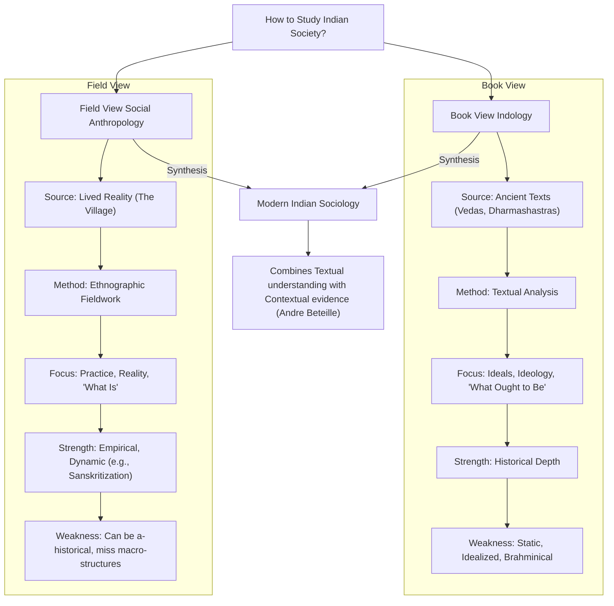
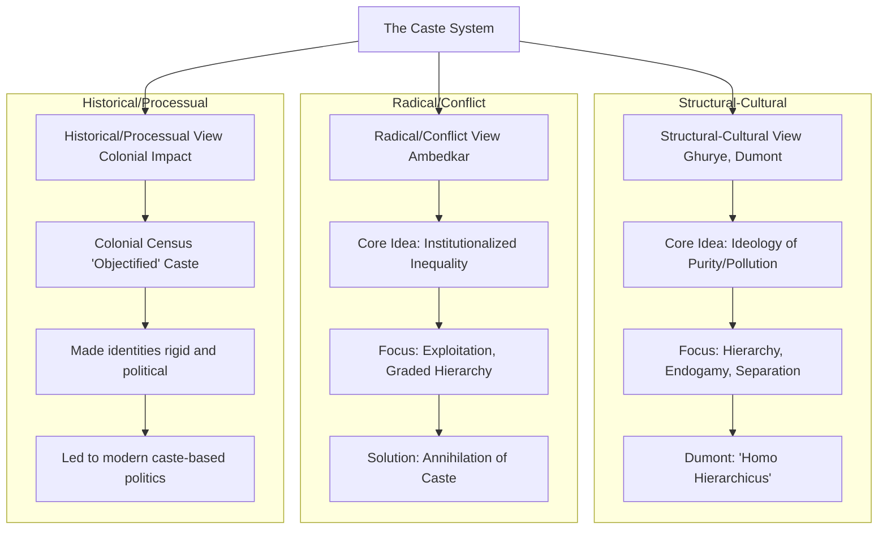
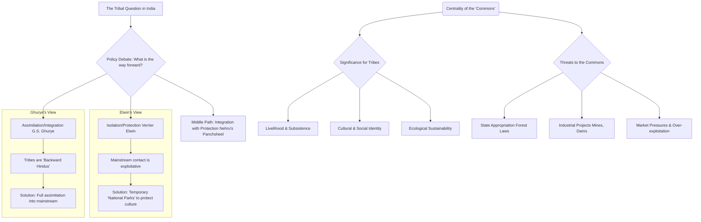
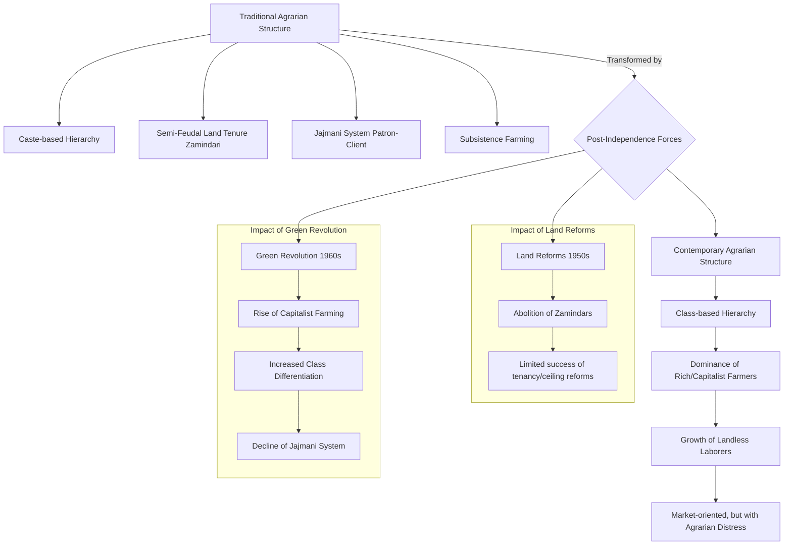
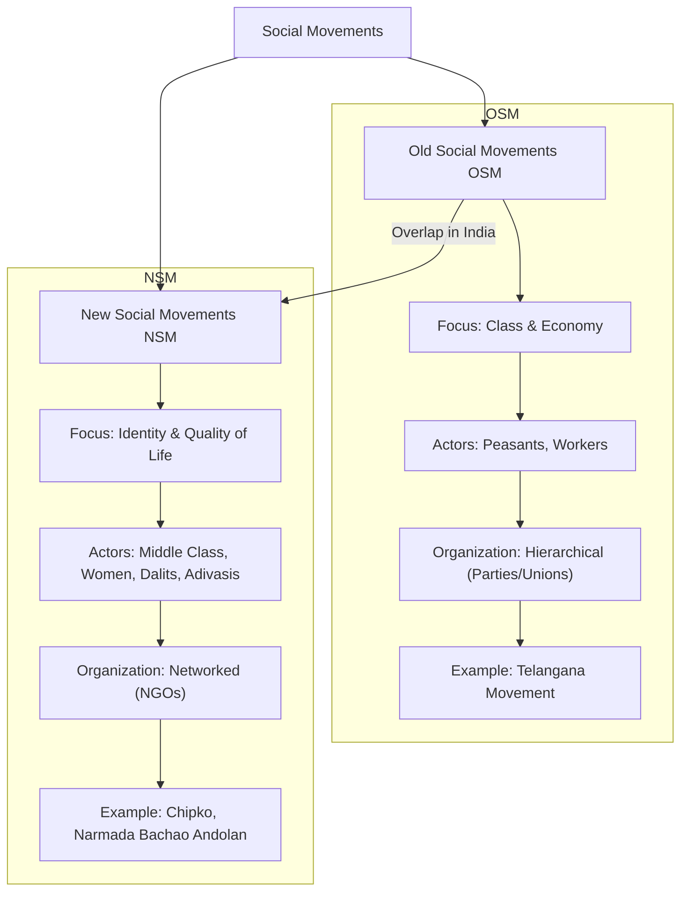
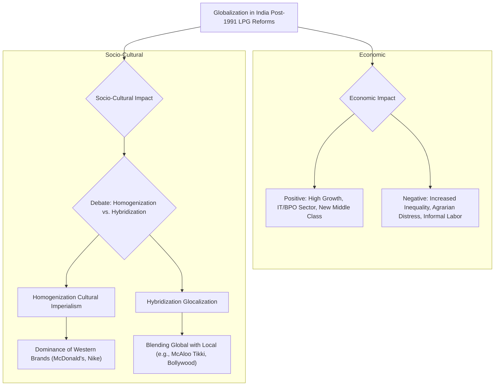
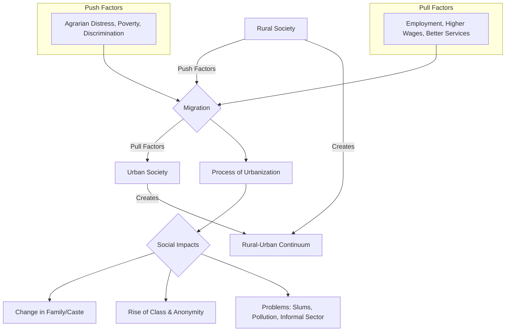

---

# MSO-04 Sociology in India**

## Blocks 8- Units 26

#### **Block 1: Approaches to the Study of Indian Society**
This block introduces the major theoretical perspectives or "lenses" used by sociologists to analyze and understand Indian society.

*   **Unit 1:** Indological Perspective (G.S. Ghurye)
*   **Unit 2:** Structural-Functional Perspective (M.N. Srinivas)
*   **Unit 3:** Marxist Perspective (A.R. Desai)

#### **Block 2: Social Background of Indian Nationalism**
This block examines the social composition and dynamics behind the Indian nationalist movement, focusing on the roles played by different social groups.

*   **Unit 4:** Agrarian Social Structure and Peasant Movements
*   **Unit 5:** The Role of the Middle Class
*   **Unit 6:** Dalit Movements

#### **Block 3: Social Class in India**
This block focuses on the class structure in India, looking at different sectors and their unique characteristics and dynamics.

*   **Unit 7:** The Agrarian Class Structure
*   **Unit 8:** The Industrial Working Class
*   **Unit 9:** The Middle Class

#### **Block 4: Caste in India**
This block delves into one of the most significant and complex features of Indian society—caste—from various conceptual and empirical angles.

*   **Unit 10:** Conceptual and Theoretical Issues
*   **Unit 11:** Caste and Class
*   **Unit 12:** Caste and Tribe
*   **Unit 13:** Caste and Politics: The Role of Caste in Indian Politics
*   **Unit 14:** The Scheduled Castes: Identity and Change

#### **Block 5: Tribe and Kinship in India**
This block focuses on tribal communities in India, their characteristics, and their relationship with the broader social fabric, particularly caste and kinship systems.

*   **Unit 15:** Tribe: Concept and Distribution
*   **Unit 16:** Tribe and Caste
*   **Unit 17:** Tribe, and Kinship Systems

#### **Block 6: Family, Marriage and Kinship in India**
This block explores the diversity of family and kinship patterns across India, highlighting the key regional differences, especially between North and South India.

*   **Unit 18:** Regional Variations in Kinship Systems
*   **Unit 19:** Family, Marriage and Kinship in North India
*   **Unit 20:** Family, Marriage and Kinship in South India

#### **Block 7: Religion in India**
This block examines the complex interplay of religion, state, and society in India, covering concepts central to Indian political and social life.

*   **Unit 21:** Religious Pluralism
*   **Unit 22:** Secularism
*   **Unit 23:** Communalism

#### **Block 8: Social Change in India**
The final block looks at the major forces and processes driving social transformation in contemporary India.

*   **Unit 24:** Modernisation and Secularisation
*   **Unit 25:** Globalisation and its Impact
*   **Unit 26:** Social Movements

---

### **Assessment and Examination Pattern**

The assessment structure for MSO-04 is the same as for other MSO courses:

*   **Assignments (Tutor Marked Assignments - TMA):** Carries a weightage of **30%**. You will need to complete and submit one assignment for this course.
*   **Term-End Examination (TEE):** The final exam carries a weightage of **70%**.

**Typical TEE Question Paper Format:**

*   **Duration:** 3 Hours
*   **Maximum Marks:** 100
*   **Structure:** The paper is divided into two sections. You must answer **five questions** in total, selecting **at least two questions from each section**.
*   **Word Limit:** Each answer should be approximately **500 words**.
*   **Marks per Question:** Each question carries **20 marks**.

### **Tips for Studying MSO-04**

1.  **Link with MSO-01:** This course is the application of MSO-01. When you study the Marxist perspective in India (A.R. Desai), relate it back to the core ideas of Karl Marx. When you study Structural-Functionalism (M.N. Srinivas), connect it to the ideas of Durkheim, Parsons, and Merton.
2.  **Focus on Indian Scholars:** Unlike MSO-01, this course is centered on the work of Indian sociologists. Pay close attention to the key arguments of thinkers like **G.S. Ghurye, M.N. Srinivas, A.R. Desai, Louis Dumont, Iravati Karve, and Andre Beteille**. Quoting them in your answers will fetch you better marks.
3.  **Understand Key Debates:** The course is built around major debates. For example: Is caste a cultural or structural phenomenon? What is the relationship between caste and class? Is India truly secular? Understand the different viewpoints on these issues.
4.  **Use Specific Examples:** When writing about topics like peasant movements, communalism, or social change, use concrete examples from Indian history and contemporary events to support your arguments.
5.  **Master the Concepts:** Be very clear about the definitions and nuances of key concepts like Sanskritization, Westernization, Dominant Caste (Srinivas), Book-view vs. Field-view (Srinivas & Dumont), and the specificities of Indian secularism.
6.  **Practice Answer Writing:** As with all MSO papers, the ability to write structured, 500-word answers under time pressure is critical. Practice with previous years' question papers.

---
---

You are absolutely right to point that out. My apologies. I deviated from our established, more detailed format. I will correct that immediately and provide the comprehensive tables in the style we perfected for MSO-01.

Thank you for keeping the process on track. Here is the revised, high-quality set of tables for MSO-004.

---

## Comprehensive Tables

### **1. High-Impact Comparative Tables (MSO-004)**

**Table 1: Approaches to Studying Indian Society**

| Feature | **Book View (Indological Approach)** | **Field View (Sociological/Anthropological)** |
| :--- | :--- | :--- |
| **Primary Source** | Ancient Sanskrit texts (Vedas, Dharmashastras). | Lived reality of people, primarily in villages. |
| **Core Methodology** | Textual analysis, philology, historical interpretation. | Participant observation, ethnographic fieldwork. |
| **View of Society** | Tends to be static, idealized, and normative ('what ought to be'). | Dynamic, complex, and empirical ('what is'). |
| **Key Proponents** | Orientalists, **G.S. Ghurye**, **Louis Dumont**. | **M.N. Srinivas**, **S.C. Dube**, **Andre Beteille**. |
| **Major Contribution** | Provided historical depth and understanding of core ideologies (Varna, Purity). | Revealed the gap between prescription and practice; generated key concepts like **Sanskritization** and **Dominant Caste**. |
| **Key Limitation** | Ignores regional diversity and the perspectives of lower castes; can be elitist. | Can be a-historical and miss the influence of larger macro-structures (state, economy). |

**Table 2: The Ghurye vs. Elwin Debate on Tribal Policy**

| Feature | **G.S. Ghurye (Assimilationist View)** | **Verrier Elwin (Isolationist/Protectionist View)** |
| :--- | :--- | :--- |
| **Core Argument** | Tribes are "Backward Hindus," not fundamentally different from caste society. | Tribes are unique, pristine communities whose culture needs protection. |
| **Main Problem** | Economic backwardness and lack of development. | Exploitation by outsiders (moneylenders, traders) and cultural degradation. |
| **Proposed Solution** | Full **assimilation** into the Hindu mainstream. | Temporary **isolation** in "National Parks" to allow for autonomous development. |
| **View of Contact** | A natural historical process that should be encouraged. | A destructive force that leads to loss of land, debt, and demoralization. |
| **Ultimate Goal** | To bring tribes into the national mainstream. | To preserve the cultural integrity and autonomy of tribal groups. |
| **Policy Influence** | Influenced the view that tribes are part of the Hindu fold. | Directly influenced Nehru's "Panchsheel" policy of **integration with protection**. |

**Table 3: Old vs. New Social Movements in India**

| Feature | **Old Social Movements (OSMs)** | **New Social Movements (NSMs)** |
| :--- | :--- | :--- |
| **Central Conflict** | **Class-based:** Centered on economic inequality and control over means of production. | **Identity-based:** Centered on quality of life, cultural recognition, and rights. |
| **Key Issues** | Land rights, wages, rent, anti-feudal/anti-capitalist struggles. | Environment, gender equality, ethnic identity, human rights, displacement. |
| **Primary Actors** | Peasants, industrial working class. | Students, urban middle class, women, Dalits, Adivasis, intellectuals. |
| **Organizational Form** | Hierarchical and centralized (Political Parties, Trade Unions, Kisan Sabhas). | Decentralized, networked, and grassroots-based (NGOs, autonomous groups). |
| **Ideology** | Universalist and totalizing (e.g., Marxism, Socialism). | Particularistic and issue-specific (e.g., Feminism, Ecologism). |
| **Classic Examples** | Telangana Movement, Tebhaga Movement. | Chipko Movement, Narmada Bachao Andolan, LGBTQ+ Rights Movement. |

You are absolutely right. My apologies for the oversight. I will provide the remaining value-addition tables for MSO-004 immediately, following our established format.

Here is the complete set of value-addition tables for MSO-004.

---

### **2. High-Impact Sociological Quotes (MSO-004)**

| Sl. No. | Theme | Quote | Thinker & Source |
| :--- | :--- | :--- | :--- |
| 1 | **Caste & Hierarchy** | "The principle of the opposition of the pure and the impure... is the foundation of the caste system." | Louis Dumont, *Homo Hierarchicus* |
| 2 | **Caste & Annihilation** | "The real remedy for breaking caste is inter-marriage. Nothing else will serve as a solvent of caste." | B.R. Ambedkar, *Annihilation of Caste* |
| 3 | **Village & Caste Dynamics** | "The village was a world in itself... but it was also part of a wider world." | M.N. Srinivas, *The Remembered Village* |
| 4 | **Tribal Identity** | "The so-called aborigines... are best described as the imperfectly integrated classes of Hindu society." | G.S. Ghurye, *The Scheduled Tribes* |
| 5 | **Modernity in India** | "To be modern in India, it is not necessary to be less Indian." | Yogendra Singh, *Modernization of Indian Tradition* |

---

### **3. Jargon & Keyword Bank (MSO-004)**

| Sl. No. | Keyword | Associated Thinker(s) | Brief Meaning |
| :--- | :--- | :--- | :--- |
| 1 | **Sanskritization** | M.N. Srinivas | The process by which a lower caste adopts the customs and rituals of a higher caste to claim higher social status. |
| 2 | **Dominant Caste** | M.N. Srinivas | A caste that holds economic and political power in a local area, regardless of its ritual rank in the Varna system. |
| 3 | **Jajmani System** | William Wiser, T.O. Beidelman | A traditional system of exchange of goods and services between different caste groups in a village, based on patron-client relationships. |
| 4 | **Book View** | (Term used by Srinivas & others) | The approach of understanding Indian society primarily through ancient Sanskrit texts (Indology). |
| 5 | **Field View** | (Term used by Srinivas & others) | The approach of understanding Indian society through direct ethnographic fieldwork. |
| 6 | **Homo Hierarchicus** | Louis Dumont | The concept that Indian society is fundamentally structured by the principle of ritual hierarchy (pure vs. impure), unlike the West's *Homo Aequalis* (egalitarian individual). |
| 7 | **Graded Hierarchy** | B.R. Ambedkar | The unique structure of caste where each group has a sense of superiority over the one below it, thus preventing unity among the oppressed. |
| 8 | **Sarva Dharma Samabhava** | (Concept in Indian politics) | The Indian principle of secularism meaning equal respect for all religions, as opposed to strict separation. |
| 9 | **Principled Distance** | Rajeev Bhargava | A term to describe Indian secularism, where the state maintains a flexible, principled distance from religion, allowing for intervention to ensure social justice. |
| 10 | **Glocalization** | Roland Robertson | The process of adapting global products or ideas to fit local cultures and tastes (e.g., McAloo Tikki). |

---

### **4. Contemporary Thinkers & Books for Application (MSO-004)**

| Sl. No. | Thinker / Book | Core Concept | Application in MSO-004 Answers |
| :--- | :--- | :--- | :--- |
| 1 | **Andre Beteille** (*Caste, Class, and Power*) | **Harmonic vs. Disharmonic Systems** | Use to critique Dumont. Beteille's study of Sripuram village showed that while caste (status) and class (economic power) were once aligned (harmonic), they are now increasingly misaligned (disharmonic) in modern India. |
| 2 | **Yogendra Singh** (*Modernization of Indian Tradition*) | **Modernization as a Process** | Argue that modernity in India is not a simple rejection of tradition. Instead, traditions are reinterpreted and adapted. Modernity and tradition are in a constant dialectical relationship. |
| 3 | **Dipankar Gupta** (*Interrogating Caste*) | **Caste as Discrete Units** | Critique Dumont's view of hierarchy. Gupta argues that the key feature of caste today is not hierarchy but the existence of discrete, separate communities that compete for resources in the political arena. |
| 4 | **Gail Omvedt** (*Reinventing Revolution*) | **Blurring of Old & New Movements** | Use to critique the rigid distinction between Old and New Social Movements. Argue that in India, movements like farmers' protests combine class issues (old) with identity and environmental concerns (new). |
| 5 | **Ramachandra Guha** (*The Unquiet Woods*) | **Environmentalism of the Poor** | Provide a strong theoretical backing for the Chipko movement. Argue that environmentalism in India is not a middle-class luxury but a matter of survival for the poor and Adivasis whose livelihoods depend directly on the commons. |

---
---
## **Tier 1: The Absolute Core (Highest Priority for MSO-004)**

This tier is built on the highest frequency topics from the PYQs.

**Themes Covered in Tier 1:**
1.  **The Discipline of Sociology in India:** Emergence, Historical Roots, and Approaches (Colonial, Book vs. Field View).
2.  **Caste: Perspectives and Dynamics:** The views of Ghurye, Dumont, and Ambedkar; the role of the colonial census.
3.  **Tribal Society: The Integration vs. Isolation Debate:** The classic Ghurye-Elwin debate and the concept of 'Commons'.
4.  **Agrarian Structure and Change:** The concept of agrarian class structure and the impact of the Green Revolution.
5.  **Social Movements:** The distinction between Old and New Social Movements.

---

### **Theme 1: The Discipline of Sociology in India**

This is a foundational theme. We will create a comprehensive note covering the emergence and the key methodological debates that shaped the discipline.

---

### **Note 1.1: The Emergence and Development of Sociology in India**

**(Keywords: Colonialism, Nationalism, Indology, Social Anthropology, Village Studies, Institutionalization)**

#### **Introduction**

The emergence of sociology in India is a complex story, deeply intertwined with the experience of **colonialism** and the subsequent rise of **nationalism**. Unlike in the West, where sociology emerged as a response to the internal dynamics of industrialization and modernity, in India, it began as an intellectual response to the colonial encounter. Its development can be traced through distinct phases, from the early writings of colonial administrators to its formal institutionalization in Indian universities and its later turn towards more critical and indigenous perspectives.

#### **1. The Colonial Context: The Pre-History of Indian Sociology**

The initial groundwork for the study of Indian society was laid not by sociologists, but by British colonial administrators, missionaries, and orientalists in the 18th and 19th centuries.

1.  **Administrative Needs:** The British needed to understand the structure of Indian society to govern it effectively. This led to massive data-collection exercises like the **Census (starting in 1871)**, ethnographic surveys, and the compilation of imperial gazetteers.
2.  **The Colonial Gaze:** These early studies were shaped by the **"colonial gaze."** They often portrayed Indian society as static, timeless, and fundamentally different from the "modern" West. They had a vested interest in emphasizing caste divisions and exotic customs to justify colonial rule.
3.  **Orientalist/Indological Approach:** Scholars like **William Jones** and **Max Müller** focused on ancient Sanskrit texts (the "book view") to understand India. They constructed an image of a "glorious" past, often seen as the essence of Indian civilization, while ignoring the lived realities of the people.

#### **2. The Institutionalization Phase (Early 20th Century)**

The formal academic discipline of sociology began to take root in the early 20th century, largely as part of the nationalist intellectual ferment.

1.  **Pioneering Departments:** Sociology was first introduced at the **University of Bombay in 1919** under the leadership of **Patrick Geddes**, followed by departments in Calcutta and Lucknow.
2.  **The Founding Fathers:** This era was dominated by the "founding fathers" like **G.S. Ghurye, Radhakamal Mukerjee, and D.P. Mukerji.**
    *   **G.S. Ghurye (Bombay School):** Often considered the "father of Indian sociology," Ghurye combined the Indological approach with empirical fieldwork. His work on **caste, tribes, and kinship** set the agenda for the discipline for decades.
    *   **The Lucknow School (Mukerjee & Mukerji):** They advocated for an interdisciplinary approach, combining sociology with economics and history, and emphasized the importance of understanding Indian traditions.

#### **3. The Post-Independence Phase: The Turn to the Village**

After 1947, Indian sociology underwent a significant shift, influenced by American structural-functionalism and a new national imperative for rural development.

1.  **The Village as a Laboratory:** The Indian village became the primary site for sociological research. It was seen as a microcosm of Indian society where institutions like caste, kinship, and religion could be studied in their living context.
2.  **The Rise of the "Field View":** This marked a decisive move away from the text-based "book view." Sociologists like **M.N. Srinivas** (with his studies of Rampura village) and **S.C. Dube** (in his study of Shamirpet) used intensive ethnographic fieldwork to understand the dynamics of rural India.
3.  **Key Concepts:** This phase produced some of the most enduring concepts in Indian sociology, such as **M.N. Srinivas's "Sanskritization"** and **"Dominant Caste,"** which challenged the static view of caste and highlighted its dynamic nature.

#### **4. The Critical Turn (1970s Onwards)**

From the 1970s, Indian sociology began to move in a more critical direction, influenced by Marxist and other conflict perspectives.

1.  **Critique of Village Studies:** Scholars began to criticize the village studies for ignoring issues of **class conflict, power, and inequality** in the agrarian structure.
2.  **New Areas of Focus:** The focus expanded to include new themes like **agrarian class relations (Andre Beteille), social movements, gender, and the sociology of development.**
3.  **Subaltern and Indigenous Perspectives:** There was a growing call to move beyond Western theoretical frameworks and develop more indigenous or "decolonized" perspectives for understanding Indian society, as seen in the work of the **Subaltern Studies** collective.

#### **Conclusion**

The trajectory of sociology in India reflects the nation's own historical journey. It began as a tool of the colonial state, was reshaped by nationalist aspirations, found its empirical footing in the study of the Indian village, and has now matured into a diverse and critical discipline. It continues to grapple with the central challenge of using a Western-origin discipline to understand a uniquely complex and historically deep civilization, constantly negotiating between universal theories and particular Indian realities.

---

### **Note 1.2: The Debate Between Book View and Field View**

#### **Introduction**

One of the most significant methodological debates in the history of Indian sociology is the tension between the **"Book View"** and the **"Field View."** The Book View, rooted in **Indology**, seeks to understand Indian society through the study of classical Sanskrit texts. The Field View, rooted in **social anthropology**, insists on understanding society through direct empirical observation and ethnographic fieldwork. This debate, personified by the shift from the dominance of **G.S. Ghurye** to that of **M.N. Srinivas**, represents a fundamental move from a textual to an empirical understanding of India.

#### **1. The Book View (Indological/Textual Approach)**

*   **Core Belief:** The essential and enduring structure of Indian society and its core values can be found in its sacred and classical texts (e.g., the Vedas, Dharmashastras, Epics).
*   **Methodology:** Textual analysis, philology, and historical interpretation.
*   **Key Proponents:** Early Orientalists, and Indian sociologists like **G.S. Ghurye** and **Louis Dumont** (in his own structuralist way).
*   **Contribution:** It provided a deep historical and civilizational perspective, highlighting the ideals and ideologies (like the Varna system and the concept of purity/pollution) that have shaped Indian society.
*   **Limitation:** It presents a static, idealized, and often Brahminical view of society. It ignores the vast gap between the textual prescription and the lived reality (**"what is written" vs. "what is practiced"**). It also neglects regional variations and the perspectives of lower castes and other marginalized groups.

#### **2. The Field View (Empirical/Sociological Approach)**

*   **Core Belief:** The reality of Indian society can only be understood by studying it as it is lived and practiced in the present. The focus is on the "is" rather than the "ought."
*   **Methodology:** Intensive fieldwork, participant observation, and ethnographic case studies, primarily of villages.
*   **Key Proponents:** **M.N. Srinivas, S.C. Dube, Andre Beteille.**
*   **Contribution:** The field view revolutionized Indian sociology. It revealed the dynamism and complexity of institutions like caste. **M.N. Srinivas's** field-based concepts are a prime example:
    *   **Sanskritization:** Showed that caste was not rigid, as lower castes could adopt the customs of upper castes to claim higher status.
    *   **Dominant Caste:** Showed that ritual status (Varna) was not the only source of power; a numerically strong, landowning caste could hold the real power in a village, regardless of its ritual rank.
*   **Limitation:** Critics argue that the field view, especially in its early phase, could be "empiricist" and a-historical. By focusing too much on a single village, it could miss the larger structural forces (like colonialism or capitalism) and historical contexts that shaped village life.

#### **Conclusion: Towards a Synthesis**

The sharp opposition between the Book View and the Field View has now largely been resolved. Most contemporary sociologists agree that both are necessary. As **Andre Beteille** argues, a complete understanding of Indian society requires a dialectical interplay between the textual and the contextual. The texts provide the ideological framework and historical depth, while the field provides the empirical evidence of how these ideologies are interpreted, negotiated, and contested in everyday life. The challenge is not to choose one over the other, but to skillfully combine them.

---
### **Mermaid Diagram: Methodological Debates in Indian Sociology**

---
### **Quick Revision Scaffold**

*   **Emergence of Sociology in India:**
    *   **Colonial Phase:** Driven by administrative needs (Census). Characterized by the "colonial gaze" and Indology (Book View).
    *   **Institutionalization Phase:** Founding of departments (Bombay, 1919). Dominated by "founding fathers" like **G.S. Ghurye**.
    *   **Post-Independence Phase:** Turn to **Village Studies**. Rise of the **Field View** with **M.N. Srinivas** (Sanskritization, Dominant Caste).
    *   **Critical Phase (70s+):** Marxist/conflict perspectives emerge. Focus on agrarian class, gender, and subaltern voices.
*   **Book View vs. Field View Debate:**
    *   **Book View:** Understand India through **ancient texts**. Provides historical/ideological context. **Critique:** Static and idealized.
    *   **Field View:** Understand India through **fieldwork in villages**. Provides empirical reality. **Critique:** Can be a-historical.
    *   **Synthesis (Beteille):** Both are needed. We must understand the relationship between the text and the context.

---

### **Theme 2: Caste: Perspectives and Dynamics**

**(Keywords: Caste, Varna, Jati, Purity/Pollution, Hierarchy, G.S. Ghurye, Louis Dumont, B.R. Ambedkar, M.N. Srinivas, Colonial Census)**

### **Note 2.1: The Structural-Cultural View: Ghurye and Dumont**

#### **Introduction**

The structural or cultural approach to caste, championed by **G.S. Ghurye** and later, in a more rigorous form, by **Louis Dumont**, seeks to understand the caste system as a unique and comprehensive system of social organization defined by a core set of ideological principles. This perspective, often drawing from the "Book View," emphasizes the ideas of **hierarchy, purity, and pollution** as the fundamental logic that structures the entire system.

#### **1. G.S. Ghurye's Features of the Caste System**

**G.S. Ghurye**, in his classic work **"Caste and Race in India,"** provided a foundational, feature-based definition of the caste system. He identified six key structural features:

1.  **Segmental Division of Society:** Society is divided into a number of closed segments (castes or *jatis*), with membership determined by birth.
2.  **Hierarchy:** These segments are arranged in a clear hierarchy of rank and status, with the Brahmins at the top.
3.  **Restrictions on Feeding and Social Intercourse:** There are strict rules governing the sharing of food and water between castes, reflecting the hierarchy.
4.  **Civil and Religious Disabilities and Privileges:** The hierarchy is expressed through unequal access to public utilities (like wells) and religious spaces (like temples). Higher castes have privileges, while lower castes face disabilities.
5.  **Lack of Unrestricted Choice of Occupation:** Occupations are traditionally hereditary and linked to caste.
6.  **Restrictions on Marriage (Endogamy):** The most crucial feature. Marriage is strictly restricted to within one's own caste group (*jati endogamy*), which maintains the segmental division.

#### **2. Louis Dumont's "Homo Hierarchicus"**

**Louis Dumont**, in his influential but controversial book **"Homo Hierarchicus,"** offered a more abstract and purely structuralist explanation.

1.  **The Core Principle: Purity and Pollution:** For Dumont, the entire caste system is built upon a single, overarching ideological principle: the opposition between the **pure and the impure**. This is the "grammar" or deep structure of the system.
2.  **Hierarchy, Not Power:** The hierarchy of caste is not about power or wealth, but about ritual purity. The Brahmins are at the top not because they are powerful, but because they are ritually the purest.
3.  **Separation of Status and Power:** A key argument is the **disjunction between ritual status and temporal power**. The Brahmin (priest) holds the highest ritual status, but the Kshatriya (king/warrior) holds the actual political and economic power. The king is powerful, but he is ritually subordinate to the priest. This, for Dumont, is what makes the Indian system unique.
4.  **Encompassment of the Contrary:** The principle of purity "encompasses" its contrary, impurity. The system is a holistic structure where every caste has a specific place in relation to this central opposition.

#### **Critique of the Structural-Cultural View**

This perspective has been heavily criticized for being overly idealized, static, and for downplaying conflict and power. It relies heavily on the textual (Brahminical) view and ignores the lived realities of exploitation and resistance.

---

### **Note 2.2: The Radical Critique: B.R. Ambedkar's Perspective**

#### **Introduction**

**B.R. Ambedkar** offered the most powerful and radical critique of the caste system from the perspective of the oppressed. He rejected cultural or religious explanations and saw caste as a system of **institutionalized inequality, exploitation, and graded degradation**. His analysis, most famously articulated in **"Annihilation of Caste,"** is not just a sociological account but a political call for its complete destruction.

#### **1. The Origin and Essence of Caste**

1.  **Caste as Enclosed Class:** Ambedkar argued that caste originated from the practice of **endogamy**. He believed that the Brahmins, to preserve their purity and status, "enclosed" themselves by practicing strict endogamy. This practice was then emulated by other groups, leading to the fragmentation of society into a multitude of closed, endogamous units (*jatis*).
2.  **The "Infection of Imitation":** Lower groups imitated the higher groups, creating their own boundaries and leading to the proliferation of castes and sub-castes.
3.  **The Key is Endogamy:** For Ambedkar, the "very soul of caste" is **endogamy**. Without the prohibition on inter-marriage, the system could not survive.

#### **2. Caste as a System of "Graded Hierarchy"**

Ambedkar's most brilliant insight was the concept of **"graded hierarchy."**

*   Unlike a simple hierarchy with a top and a bottom, the caste system ensures its own survival by giving every group (except those at the very bottom) a sense of superiority over the group below it.
*   This **"ascending scale of reverence and a descending scale of contempt"** prevents the lower castes from uniting against the Brahmins. Each group is invested in maintaining the hierarchy to preserve its own minor privileges and status over another. This division is what prevents a unified "proletarian" revolution against the system.

#### **3. The Solution: Annihilation, Not Reform**

*   Ambedkar was deeply pessimistic about reforming Hinduism from within. He argued that the caste system was not a perversion of Hinduism but its very essence, sanctioned by the sacred texts (the Shastras).
*   Therefore, the only solution was the **"annihilation of caste,"** which required destroying the religious sanctity that underpinned it. This led to his call for Dalits to **convert** out of Hinduism, a step he himself took by converting to Buddhism.
*   He also advocated for modern, secular solutions like **inter-caste marriage, education, and political representation** (reservations) to break the system's hold.

---

### **Note 2.3: The Role of the Colonial Census**

#### **Introduction**

The British colonial state, particularly through the institution of the **decennial census**, played a paradoxical and crucial role in shaping the modern form of caste. While the British did not create caste, their administrative practices of counting, classifying, and ranking had the unintended consequence of making caste identities more **rigid, official, and politically significant** than ever before.

#### **1. The Process of "Objectification"**

1.  **Counting and Classifying:** The census was a massive exercise in social mapping. Census commissioners like **Herbert Risley** used a mix of textual knowledge and pseudo-scientific racial theories (like measuring nasal indexes) to create a definitive, pan-Indian hierarchy of castes.
2.  **Fixing a Fluid Reality:** This administrative act attempted to fit a complex, fluid, and regionally diverse reality (*jati*) into a neat, hierarchical, and standardized framework. It transformed fuzzy, local identities into hard, enumerated categories.
3.  **The Politics of Ranking:** The census published official rankings of castes. This immediately sparked intense political competition. Numerous caste associations emerged, petitioning the census authorities to grant them a higher rank in the next census, thereby politicizing caste identity on a massive scale.

#### **2. Consequences of the Census**

*   **Hardening of Boundaries:** The census made caste boundaries more rigid and less permeable.
*   **Politicization of Caste:** It turned caste into an explicit category for political mobilization and competition for state resources.
*   **Creation of a "Pan-Indian" Caste Consciousness:** It encouraged local *jatis* to affiliate with larger, province-wide or even all-India caste categories, laying the groundwork for modern caste-based politics.

Sociologists like **Bernard Cohn** and **Nicholas Dirks** have argued that the census was a key tool of colonial "governmentality," which fundamentally transformed the nature of caste in modern India.

---
### **Mermaid Diagram: Perspectives on Caste**

---
### **Quick Revision Scaffold**

*   **Ghurye's 6 Features:** 1. Segmental Division, 2. Hierarchy, 3. Commensal Restrictions, 4. Civil/Religious Disabilities, 5. Hereditary Occupation, 6. **Endogamy**.
*   **Dumont's "Homo Hierarchicus":**
    *   Core principle is **Purity vs. Impurity**.
    *   Hierarchy is about ritual **status**, not economic **power**.
*   **Ambedkar's Critique:**
    *   Caste is **institutionalized inequality**.
    *   Essence is **Endogamy**.
    *   System is maintained by **"Graded Hierarchy,"** which prevents unity of the oppressed.
    *   Solution is **Annihilation**, not reform.
*   **Colonial Census:**
    *   Did not create caste, but **"objectified"** and **politicized** it.
    *   Made fluid, local identities into rigid, pan-Indian categories.

---

### **Theme 3: Tribal Society: The Integration vs. Isolation Debate & The Commons**

**(Keywords: Tribe, Adivasi, Scheduled Tribe, G.S. Ghurye, Verrier Elwin, Integration, Isolation, Assimilation, Commons)**

### **Note 3.1: The Ghurye-Elwin Debate on the "Tribal Question"**

#### **Introduction**

The "tribal question" in India revolves around a central policy dilemma: what should be the relationship between tribal communities (often called *Adivasis*) and mainstream Hindu society? This question sparked a famous and influential debate in the mid-20th century between two towering figures: the sociologist **G.S. Ghurye** and the anthropologist-activist **Verrier Elwin**. Ghurye advocated for the **integration and assimilation** of tribes into the Hindu fold, while Elwin argued for a policy of **temporary isolation and protection** to save them from exploitation.

#### **1. G.S. Ghurye's Position: Tribes as "Backward Hindus"**

**G.S. Ghurye**, in his book **"The Aborigines - So-called - and their Future"** (later retitled "The Scheduled Tribes"), put forward a strong argument for assimilation.

1.  **No Real Distinction:** Ghurye argued that there was no clear dividing line between tribes and caste-based Hindu society. He saw tribal communities not as distinct, pristine groups but as **"imperfectly integrated classes of Hindu society"** or simply **"Backward Hindus."**
2.  **Continuum of Culture:** He believed that most tribes had already been in contact with Hindu culture for centuries and had absorbed many of its elements. They existed on a cultural continuum with rural Hindu society.
3.  **The Problem is Economic, Not Cultural:** For Ghurye, the main problem facing tribes was not cultural loss but **economic backwardness** and lack of development.
4.  **The Solution is Assimilation:** He argued that the ultimate solution was the complete **assimilation** of tribes into mainstream Hindu society. He believed this was a natural historical process that should be encouraged, as it would bring them the benefits of development and social mobility. He was deeply suspicious of any policy that sought to isolate them, seeing it as a colonial tactic to "divide and rule."

#### **2. Verrier Elwin's Position: The "National Park" Policy**

**Verrier Elwin**, who lived for years among the Baiga and Gond tribes, offered a passionate counter-argument based on his direct experience.

1.  **Destructive Impact of Mainstream Contact:** Elwin witnessed firsthand the devastating impact of contact with the "mainstream." He saw how traders, moneylenders, and forest contractors exploited tribal people, alienated their land, and destroyed their culture, leaving them demoralized and impoverished.
2.  **The Problem is Exploitation:** The core problem was not their backwardness, but their vulnerability to **exploitation**. Unfettered contact was destructive.
3.  **The Solution is Temporary Isolation:** To protect them, Elwin initially proposed a policy of creating **"National Parks"** or reserved areas where tribal communities could live without outside interference. This was a policy of **temporary isolation** to allow them to develop according to their own genius.
4.  **Preservation of Culture:** He believed that tribal culture had its own intrinsic value—its art, its folklore, its egalitarian social structures—and that it should be protected and preserved, not dissolved into the "drab uniformity" of mainstream society.

#### **3. The Synthesis: Nehru's "Panchsheel" Policy**

The newly independent Indian state, under Prime Minister **Jawaharlal Nehru**, had to formulate an official policy. Nehru was influenced by both sides of the debate. He rejected the "museum" approach of permanent isolation but also feared the destructive consequences of forced assimilation.

The result was a middle path, often called **Nehru's "Panchsheel" for Tribal Development**, which was heavily influenced by Elwin's later, more moderate views:

1.  People should develop along the lines of their own genius.
2.  Tribal rights in land and forests should be respected.
3.  A team of their own people should be trained for administration and development.
4.  We should not over-administer these areas or impose our ways on them.
5.  Results should be judged not by statistics, but by the quality of human character that is evolved.

This policy of **integration**, which aimed to bring development while respecting cultural autonomy, became the official philosophy of the Indian state, though its implementation has been widely debated.

---

### **Note 3.2: The Concept and Significance of 'Commons'**

#### **Introduction**

The concept of **'Commons'** or **Common Property Resources (CPRs)** is central to understanding the socio-economic life of tribal and other rural communities in India. Commons refer to resources that are collectively owned or managed by a community, where members have specific rights of use, but no right of private ownership or sale. These resources, including **forests, pastures, water bodies, and village wastelands**, are not "free-for-alls" but are governed by complex community-based rules and norms.

#### **1. The Significance of Commons for Tribal Societies**

For tribal communities, the commons are not just an economic resource; they are the foundation of their social, cultural, and ecological existence.

1.  **Livelihood and Subsistence:** Commons provide a wide range of essential goods for subsistence: **food (fruits, roots, small game), fodder for livestock, fuel wood, timber for housing, and medicinal herbs.** This is especially crucial as a safety net during lean agricultural seasons.
2.  **Social and Cultural Hub:** The commons are the site of community life. They are where religious rituals are performed, festivals are celebrated, and social gatherings take place. They are integral to the community's **cultural identity**.
3.  **Ecological Sustainability:** Traditional community-based management of the commons often involves sustainable practices that have evolved over generations, ensuring the long-term health of the ecosystem.
4.  **Egalitarianism:** Access to the commons often acts as an equalizing force, ensuring that even the poorest, landless members of the community have access to basic resources for survival.

#### **2. Challenges to the Tribal Commons**

The commons in India, particularly those used by tribal communities, have faced a severe crisis due to several historical and contemporary pressures.

1.  **State Appropriation (Colonial and Post-Colonial):** The British colonial state was the first to systematically take over the commons. It declared vast tracts of forest as **"Reserved Forests,"** extinguishing traditional community rights and turning tribal people into "encroachers" on their own land. This policy was largely continued by the post-colonial Indian state.
2.  **Industrialization and Development Projects:** The post-independence drive for development has led to the large-scale diversion of common lands for **dams, mines, industrial plants, and infrastructure projects**, leading to massive displacement of tribal populations.
3.  **Market Pressures:** The encroachment of the market has led to the over-exploitation and commercialization of common resources, disrupting traditional sustainable practices.
4.  **Population Growth:** Increasing population pressure has also put a strain on the carrying capacity of the commons.
5.  **Erosion of Community Institutions:** The weakening of traditional community institutions (like the village council) has eroded their ability to manage the commons effectively, leading to what **Garrett Hardin** famously called the **"Tragedy of the Commons"** (though Hardin's model has been criticized for ignoring community regulation).

#### **Conclusion**

The struggle over the commons is a central issue in contemporary tribal politics in India. The erosion of the commons represents not just an economic loss but an assault on the very cultural identity and way of life of Adivasi communities. Recent legislation like the **Forest Rights Act (2006)** represents a significant, though imperfectly implemented, attempt to reverse this historical injustice by legally recognizing the traditional rights of tribal and other forest-dwelling communities over their common resources.

---
### **Mermaid Diagram: The Tribal Question and the Commons**

---
### **Quick Revision Scaffold**

*   **Ghurye-Elwin Debate:**
    *   **Ghurye (Assimilation):** Tribes are "Backward Hindus." The solution is to integrate them into the mainstream to solve their economic problems.
    *   **Elwin (Isolation):** Mainstream contact is exploitative. The solution is temporary "National Parks" to protect their unique culture.
    *   **Nehru's Synthesis:** "Panchsheel" policy of integration while respecting cultural autonomy.
*   **The Commons (Common Property Resources):**
    *   **Definition:** Collectively managed resources (forests, pastures) crucial for community life.
    *   **Significance for Tribes:** Livelihood, cultural identity, ecological balance.
    *   **Threats:**
        1.  **State Appropriation:** Colonial and post-colonial forest laws.
        2.  **Development Projects:** Dams, mines.
        3.  **Market Forces.**
    *   **Contemporary Relevance:** The **Forest Rights Act (2006)** is an attempt to restore community rights over the commons.

---

### **Theme 4: Agrarian Structure and Change**

**(Keywords: Agrarian Social Structure, Land Tenure, Green Revolution, Class, Jajmani System, Agrarian Distress)**

#### **Introduction**

The **agrarian social structure** refers to the complex web of social and economic relationships that revolve around the ownership, control, and use of land in rural society. In India, this structure has historically been intertwined with the caste system and has undergone profound transformations, particularly after independence. Understanding the traditional structure and the changes brought about by forces like **land reforms** and the **Green Revolution** is crucial for grasping the dynamics of rural class, power, and conflict.

#### **1. The Traditional Agrarian Structure**

Before significant state intervention, the traditional agrarian structure in India was characterized by several key features:

1.  **Complex Land Tenure Systems:** The British introduced three main types of land tenure, which created different class structures:
    *   **Zamindari System:** A landlord (Zamindar) was recognized as the owner of the land and was responsible for collecting rent from peasants and paying a fixed revenue to the state. This created a class of absentee landlords and a vast, exploited peasantry.
    *   **Ryotwari System:** The individual peasant (*ryot*) was recognized as the proprietor and paid revenue directly to the state.
    *   **Mahalwari System:** Land revenue was settled for the entire village or estate (*mahal*), with the village community being jointly responsible for payment.
2.  **Intertwining of Caste and Class:** There was a strong correlation between caste and one's position in the agrarian hierarchy. The upper castes were typically the landowners (Zamindars, Jagirdars), the middle or "intermediate" castes were the cultivating tenants, and the lowest castes (Dalits) were the landless agricultural laborers.
3.  **The Jajmani System:** This was a traditional system of exchange of goods and services between different caste groups in a village. Landowning castes (*jajmans*) received services from lower, service-providing castes (*kamins* or *praja*), paying them in kind (a share of the harvest) rather than cash. While often described as a system of reciprocal exchange, critics like **B.R. Ambedkar** and **Kathleen Gough** saw it as an institutionalized system of exploitation that reinforced caste hierarchy.
4.  **Subsistence-Oriented Production:** Agriculture was largely for subsistence, not for the market, with traditional technologies and low productivity.

#### **2. Post-Independence Changes: Land Reforms**

After 1947, the Indian state initiated a series of **land reforms** with the stated goals of promoting social justice and increasing agricultural productivity.

1.  **Abolition of Intermediaries:** The first and most successful step was the abolition of the Zamindari system, which brought about 20 million tenants into a direct relationship with the state.
2.  **Tenancy Reforms:** These aimed to provide tenants with security of tenure, regulate rent, and give them the right to purchase the land they cultivated.
3.  **Ceilings on Landholdings:** This policy aimed to limit the maximum amount of land an individual or family could own and to redistribute the surplus land to the landless.

**Impact of Land Reforms:** The impact was mixed. While Zamindari abolition was successful, tenancy reforms and land ceilings were largely ineffective due to legal loopholes, lack of political will, and resistance from powerful landed interests. The primary beneficiaries were often the upper-level tenants from dominant castes, not the landless laborers.

#### **3. The Green Revolution and its Socio-Economic Impact**

The **Green Revolution** of the mid-1960s was a technological intervention that fundamentally transformed Indian agriculture and its class structure. It involved the introduction of **High-Yielding Variety (HYV) seeds, chemical fertilizers, pesticides, and modern irrigation**.

1.  **Increased Productivity:** The Green Revolution dramatically increased food grain production, particularly wheat and rice, making India self-sufficient in food.
2.  **Rise of Capitalist Agriculture:** It marked a shift from subsistence farming to **commercial, market-oriented agriculture**. Agriculture became a business enterprise.
3.  **Intensification of Class Differentiation:** The impact on the class structure was profound and widely debated.
    *   **The Rise of a "Rich Farmer" Class:** The primary beneficiaries were the medium and large farmers who had the capital to invest in the new technology. This led to the emergence of a powerful class of capitalist farmers, often from the dominant castes.
    *   **Proletarianization of the Peasantry:** Small and marginal farmers, unable to afford the expensive inputs, were often pushed into debt and forced to sell their land, becoming agricultural laborers. This increased the number of landless workers.
    *   **Decline of Traditional Ties:** The Jajmani system and other traditional relationships based on patronage were replaced by impersonal, contractual wage labor.
4.  **Regional Disparities:** The benefits of the Green Revolution were concentrated in certain regions with good irrigation, like **Punjab, Haryana, and Western Uttar Pradesh**, leading to increased regional inequality.
5.  **Ecological Consequences:** It led to long-term ecological problems like soil degradation, water depletion, and loss of biodiversity.

#### **Conclusion**

The agrarian social structure in India has moved from a traditional, caste-based, semi-feudal system to a more dynamic, class-based, capitalist one. While interventions like land reforms and the Green Revolution have broken old structures and increased productivity, they have also created new forms of inequality and conflict. The contemporary agrarian scene is marked by the dominance of a rich farmer class, the persistence of a large population of marginal farmers and landless laborers, and the ongoing crisis of **"agrarian distress,"** including farmer suicides, which highlights the complex and often contradictory consequences of agricultural modernization in India.

---
### **Mermaid Diagram: Transformation of Agrarian Structure**

---
### **Quick Revision Scaffold**

*   **Traditional Structure:**
    *   **Land Tenure:** Zamindari, Ryotwari, Mahalwari systems.
    *   **Social Relations:** Caste and class were intertwined. **Jajmani system** of reciprocal (but unequal) exchange.
*   **Post-Independence Changes:**
    *   **Land Reforms:** Aimed at social justice. Zamindari abolition was successful; ceiling/tenancy reforms largely failed.
    *   **Green Revolution (1960s):** Technological package (HYV seeds, fertilizers).
*   **Impact of Green Revolution:**
    *   **Economic:** Increased productivity, shift to **capitalist/commercial farming**.
    *   **Social:**
        1.  Increased **class differentiation**: Rise of a **rich farmer** class.
        2.  **Proletarianization**: Small farmers became landless laborers.
        3.  Decline of traditional ties like Jajmani.
    *   **Regional:** Increased regional disparities (Punjab, Haryana benefited most).
*   **Contemporary Situation:** Characterized by class conflict and **agrarian distress**.

---

### **Theme 5: Social Movements in India**

**(Keywords: Social Movement, Old Social Movements, New Social Movements, Class-based, Identity-based, Peasant Movements)**

#### **Introduction**

A **social movement** can be defined as a collective, organized, and sustained effort by a group of people to bring about or resist social change. In India, social movements have been a powerful force in shaping the nation's political and social landscape, from the anti-colonial struggle to contemporary protests. Sociologists often distinguish between **"Old" Social Movements (OSMs)**, which were primarily class-based, and **"New" Social Movements (NSMs)**, which are organized around non-class issues like identity, environment, and human rights.

#### **1. Old Social Movements (OSMs): The Politics of Class**

Old Social Movements, which were dominant until the 1960s-70s, are rooted in the classic industrial-era conflicts over economic resources and political power.

1.  **Core Focus:** The central issues were **class and economic exploitation**. The primary goal was often to capture or restructure state power.
2.  **Key Actors:** The main actors were clearly defined economic classes, such as the **industrial working class (proletariat)** and the **peasantry**.
3.  **Ideology:** They were typically guided by formal, universalist ideologies like **Marxism, socialism, or nationalism**.
4.  **Organizational Structure:** They were often organized hierarchically, led by formal organizations like **political parties (e.g., Communist parties) and trade unions**.
5.  **Examples in India:**
    *   **The All India Kisan Sabha:** A classic peasant movement that organized tenants and agricultural laborers against landlords and the colonial state.
    *   **The Tebhaga Movement (1946-47):** A struggle by sharecroppers in Bengal demanding a two-thirds share of the produce.
    *   **The Telangana Movement (1946-51):** A communist-led peasant revolt against the feudal oppression of the Nizam and local landlords (*jagirdars*).

#### **2. New Social Movements (NSMs): The Politics of Identity and Quality of Life**

Emerging from the 1970s onwards, New Social Movements represent a shift in the terrain of social conflict. They are seen as a response to the problems of post-industrial, modern society.

1.  **Core Focus:** NSMs are not primarily about class. They focus on issues related to **quality of life, identity, human rights, and autonomy**. They are often critical of the modern state and the dominant model of development.
2.  **Key Actors:** The social base is much more diverse and often cross-class. It includes students, intellectuals, professionals, and marginalized identity groups (the **"new middle class"** is often prominent).
3.  **Ideology:** Their ideologies are often more localized and particularistic. They focus on issues of **gender, ethnicity, ecology, and peace**, rather than a single grand theory.
4.  **Organizational Structure:** They tend to have a more decentralized, non-hierarchical, and network-based structure. They often rely on grassroots mobilization and civil society organizations (NGOs) rather than political parties.
5.  **Examples in India:**
    *   **The Chipko Movement (1970s):** An iconic environmental movement, led by rural women in the Himalayas, who hugged trees to prevent commercial logging. It is often cited as an early **eco-feminist** movement.
    *   **The Narmada Bachao Andolan (NBA):** A movement against the construction of large dams on the Narmada river, raising issues of environmental destruction and the displacement of Adivasi communities.
    *   **The Dalit Movement:** A movement for social dignity and against caste oppression, focusing on cultural identity and rights.
    *   **The Women's Movement:** Campaigns against dowry, domestic violence, and for legal and political rights.
    *   **The LGBTQ+ Rights Movement:** A struggle for social recognition and the decriminalization of homosexuality (culminating in the 2018 Supreme Court judgment).

#### **3. Differentiating Old and New Social Movements**

| Feature | **Old Social Movements (OSMs)** | **New Social Movements (NSMs)** |
| :--- | :--- | :--- |
| **Central Issue** | Economic Exploitation, Class Conflict | Quality of Life, Identity, Rights |
| **Goal** | Capture/Restructure State Power | Autonomy, Cultural Recognition, Policy Change |
| **Key Actors** | Working Class, Peasantry | Middle Class, Students, Marginalized Groups |
| **Ideology** | Universal (Marxism, Socialism) | Particular (Ecology, Feminism, Ethnicity) |
| **Organization** | Hierarchical (Parties, Unions) | Networked, Decentralized (NGOs, Grassroots) |
| **Example** | Telangana Peasant Revolt | Chipko Movement / Narmada Bachao Andolan |

#### **4. Critique and Overlap**

The distinction between Old and New Social Movements is a useful analytical tool, but it can be overly rigid.

*   **Gail Omvedt** and other scholars have argued that in a country like India, the lines are often blurred.
*   Many "new" movements, like the NBA or farmers' protests against globalization, have a strong "old" component of class and livelihood issues. The fight for the environment is also a fight for the land and resources of the poor.
*   Similarly, "old" movements are increasingly adopting the language and tactics of "new" movements, focusing on identity and human rights.

#### **Conclusion**

The landscape of social movements in India has diversified significantly over time. While the class-based struggles of the "old" movements continue to be relevant, the rise of "new" social movements reflects the changing nature of Indian society and its new axes of conflict. These movements, focused on identity, environment, and rights, have expanded the meaning of politics beyond the state and the economy, bringing new actors and new issues into the public sphere and deepening the process of democratization in India.

---
### **Mermaid Diagram: Old vs. New Social Movements**

---
### **Quick Revision Scaffold**

*   **Social Movement:** A collective, organized effort for or against social change.
*   **Old Social Movements (OSMs):**
    *   **Focus:** **Class**, economic exploitation.
    *   **Actors:** Peasants, workers.
    *   **Goal:** Capture state power.
    *   **Example:** Telangana peasant revolt.
*   **New Social Movements (NSMs):**
    *   **Focus:** **Identity**, environment, rights, quality of life.
    *   **Actors:** Diverse, cross-class (students, women, Dalits).
    *   **Goal:** Autonomy, policy change.
    *   **Example:** Chipko Movement, Women's Movement, LGBTQ+ Movement.
*   **Key Distinction:** The shift from **class politics** to **identity politics**.
*   **Indian Context (Critique):** The line is often blurred. Many Indian movements (like farmer protests) combine both "old" class issues and "new" identity/environmental concerns.

---
---

## **Tier 2: High-Probability Topics (MSO-004)**

**Themes Covered in Tier 2:**
6.  **Globalization and its Impact on India.**
7.  **Urbanization and Migration in India.**
8.  **The Significance of Village Studies.**
9.  **Secularism: The Indian Model vs. the Western Model.**
10. **Peasant Movements in India.**

---

### **Theme 6: Globalization and its Impact on India**

**(Keywords: Globalization, Liberalization, Privatization, Homogenization, Hybridization, Glocalization)**

#### **Introduction**

**Globalization** refers to the increasing interconnectedness and interdependence of societies worldwide, driven by flows of capital, goods, people, and information across national borders. For India, the process accelerated dramatically after the **economic reforms of 1991**, which embraced a policy of **Liberalization, Privatization, and Globalization (LPG)**. The impact of globalization on Indian society has been profound, complex, and contradictory, affecting its economy, class structure, culture, and identity in multifaceted ways.

#### **1. The Economic Impact**

1.  **Growth and Integration:** Globalization has integrated India into the global economy, leading to high rates of economic growth, a surge in foreign direct investment (FDI), and the growth of new sectors like **Information Technology (IT) and Business Process Outsourcing (BPO)**.
2.  **Rise of a New Middle Class:** The growth of the service sector has fueled the expansion of a new, consumerist middle class with higher disposable incomes and global aspirations.
3.  **Increased Inequality:** The benefits of globalization have not been evenly distributed. It has led to a widening gap between the rich and the poor, and between urban and rural India. While a new class of billionaires has emerged, sectors like agriculture have faced distress due to competition from subsidized global imports.
4.  **Informalization of Labor:** To remain competitive, many industries have shifted towards hiring contract or informal labor, leading to job insecurity and a lack of social security for a vast majority of the workforce.

#### **2. The Socio-Cultural Impact: The Homogenization vs. Hybridization Debate**

The cultural impact of globalization is one of the most debated topics.

1.  **Cultural Homogenization (or "Americanization"):** This argument suggests that globalization leads to the erosion of local cultures and the imposition of a uniform, Western (primarily American) consumer culture.
    *   **Evidence:** The proliferation of global brands like **McDonald's, Coca-Cola, and Nike**, the dominance of Hollywood films, and the spread of Western fashion and music. This is seen as a form of **"cultural imperialism."**

2.  **Cultural Hybridization (or "Glocalization"):** This counter-argument posits that culture is not a one-way street. Local cultures are resilient and actively appropriate, modify, and blend global cultural products with local traditions to create new, hybrid forms.
    *   **The "Glocalization" Thesis (Roland Robertson):** Global products are adapted to local tastes.
    *   **Examples in India:**
        *   **McAloo Tikki Burger:** McDonald's adapting its menu for the Indian palate.
        *   **MTV India:** Broadcasting a mix of Western pop music and Indian film music or "Indi-pop."
        *   **Bollywood:** Incorporating global cinematic techniques, music styles, and storylines while retaining a distinct Indian flavor.

#### **3. Impact on Identity and Politics**

1.  **Strengthening of Particularistic Identities:** Paradoxically, the threat of global cultural homogenization can lead to a defensive reaction and a stronger assertion of local, particularistic identities (religious, ethnic, regional). The rise of cultural nationalism and identity politics can be seen as a response to the pressures of globalization.
2.  **Rise of Transnational Networks:** Globalization has enabled the rise of transnational social movements and identity networks. For example, global environmental movements connect with local activists in India, and diaspora communities play an active role in the politics of their homeland.

#### **Conclusion**

The impact of globalization on India is a double-edged sword. It has unleashed powerful forces of economic growth and connected India to the world in unprecedented ways, creating new opportunities and a vibrant, hybrid culture. However, it has also exacerbated economic inequalities, created social insecurities, and posed new challenges to cultural identity. As sociologist **Arjun Appadurai** suggests, the central feature of global culture is the tension between **cultural homogenization** and **cultural heterogenization**. India's experience vividly illustrates this ongoing dialectic, as global flows are constantly negotiated, reinterpreted, and reshaped by the enduring realities of local life.

---
### **Mermaid Diagram: The Dual Impact of Globalization on India**

---
### **Quick Revision Scaffold**

*   **Definition:** Increasing global interconnectedness, accelerated in India by **1991 LPG reforms**.
*   **Economic Impact:**
    *   **Positives:** High GDP growth, rise of IT sector, new consumerist middle class.
    *   **Negatives:** Widening inequality, agrarian distress, informalization of labor.
*   **Cultural Impact (The Core Debate):**
    *   **Homogenization:** The fear that Western/American culture is erasing local cultures ("Cultural Imperialism").
    *   **Hybridization / Glocalization:** The reality that local cultures actively mix and adapt global influences to create new hybrid forms (e.g., McAloo Tikki, Bollywood).
*   **Political Impact:** Can lead to a defensive backlash and strengthening of local/religious identities.
*   **Key Thinkers:** **Roland Robertson** (Glocalization), **Arjun Appadurai** (Homogenization vs. Heterogenization).

---

### **Theme 7: Urbanization and Migration in India**

**(Keywords: Urbanization, Migration, Push and Pull Factors, Rural-Urban Continuum, Informal Sector, Urbanism)**

#### **Introduction**

**Urbanization** is the process of population shift from rural to urban areas, the corresponding decrease in the proportion of people living in rural areas, and the ways in which societies adapt to this change. It is a key indicator of economic and social development. In India, urbanization is closely linked to the process of **migration**, which is the movement of people from one place to another with the intention of settling. Together, these processes are reshaping the social, economic, and cultural fabric of the nation, creating both opportunities and immense challenges.

### **Note 7.1: The Process and Impact of Urbanization**

#### **1. The Nature and Trends of Urbanization in India**

1.  **Accelerated Pace:** While India remains predominantly rural, the pace of urbanization has accelerated significantly in the post-independence era, especially after the 1991 economic reforms.
2.  **"Top-Heavy" Structure:** India's urbanization is characterized by a "top-heavy" structure, with a large proportion of the urban population concentrated in a few large metropolitan cities (like Mumbai, Delhi, Kolkata, Chennai).
3.  **Census Definition:** The Census of India defines an "urban" area based on criteria of population size, density, and the percentage of the male working population engaged in non-agricultural pursuits.

#### **2. The Social Impact of Urbanization**

The shift from rural to urban life brings about profound social changes, a phenomenon the sociologist **Louis Wirth** described as **"Urbanism as a Way of Life."**

1.  **Changes in Family and Kinship:** Urban life tends to weaken traditional, large joint family structures in favor of smaller, **nuclear families**. Kinship ties become less encompassing, though they often remain important for support networks.
2.  **Anonymity and Secondary Relationships:** Urban environments are characterized by anonymity, impersonality, and a predominance of **secondary relationships** (instrumental and formal) over the primary relationships (personal and emotional) that dominate village life.
3.  **Weakening of Caste System:** The rigidity of the caste system is often diluted in the anonymous urban setting. While caste identity does not disappear, traditional restrictions on occupation and social intercourse are significantly weaker.
4.  **New Forms of Social Stratification:** Urban society is stratified more by **class, education, and occupation** than by caste alone. A new urban class structure, including a large middle class and a vast informal working class, emerges.
5.  **Cultural Diversity and Tolerance:** Cities are melting pots of people from diverse regional, linguistic, and religious backgrounds, which can foster greater tolerance but also create potential for inter-group conflict.

#### **3. Problems of Urbanization in India**

Rapid and often unplanned urbanization in India has led to a host of severe problems:

1.  **Housing and Slums:** A massive housing shortage has led to the proliferation of slums and informal settlements, characterized by overcrowding and lack of basic amenities. (e.g., Dharavi in Mumbai).
2.  **Strain on Infrastructure:** Cities are struggling with inadequate public transport, water supply, sanitation, and electricity.
3.  **Environmental Degradation:** High levels of air and water pollution, along with the problem of waste management, pose serious health and environmental risks.
4.  **Urban Poverty and the Informal Sector:** A large proportion of the urban population is poor and works in the **informal sector** (e.g., street vendors, rickshaw pullers, construction workers), with low wages, no job security, and no social protection.

---

### **Note 7.2: Migration in India**

#### **1. Defining Migration and its Types**

Migration is the movement of people across a specified boundary for the purpose of establishing a new residence. It can be classified based on several criteria:
*   **By Boundary:** **Internal** (within a country) vs. **International** (across countries).
*   **By Direction:** Rural-Urban, Rural-Rural, Urban-Rural, Urban-Urban.
*   **By Duration:** Temporary/Circular vs. Permanent.

In India, **internal, rural-urban migration** is the most significant stream in terms of its social and economic impact.

#### **2. Push and Pull Factors of Migration**

The decision to migrate is typically driven by a combination of "push" factors (reasons to leave the place of origin) and "pull" factors (reasons to move to the place of destination).

| **Push Factors (From Rural Areas)** | **Pull Factors (To Urban Areas)** |
| :--- | :--- |
| 1. **Agrarian Distress:** Lack of land, low agricultural productivity, debt. | 1. **Employment Opportunities:** Perceived availability of jobs, especially in construction and services. |
| 2. **Poverty and Lack of Livelihoods:** Absence of non-farm employment. | 2. **Higher Wages:** The potential to earn more than in the village. |
| 3. **Caste-based Discrimination and Oppression.** | 3. **Better Educational and Health Facilities.** |
| 4. **Natural Disasters:** Droughts, floods. | 4. **"Bright Lights" Effect:** The allure of an urban lifestyle and social mobility. |

#### **3. Key Trends and Patterns of Migration in India**

1.  **Dominance of Economic Reasons:** The vast majority of migration is driven by the search for work and better economic opportunities.
2.  **Gender Dimension:** While men often migrate for economic reasons, a large proportion of female migration is linked to **marriage**. However, female labor migration is also increasing.
3.  **Circular Migration:** Much of the labor migration is **circular or temporary**. Migrants (often male) leave their villages to work in cities for a part of the year, sending back remittances, but maintain strong ties with their rural homes and families.
4.  **The "Rural-Urban Continuum":** Sociologists argue that the distinction between rural and urban is becoming blurred. Migrants create a **"rural-urban continuum,"** carrying urban ideas and consumption patterns back to their villages, while recreating village-based social networks (e.g., caste or regional associations) in the city.

#### **Conclusion**

Urbanization and migration are two sides of the same coin, driving the engine of India's socio-economic transformation. While they are engines of growth and offer pathways to social mobility, the process in India has been characterized by significant challenges. The creation of a vast, precarious informal sector in cities and the persistence of strong rural-urban linkages mean that the migrant often lives in a state of "in-betweenness." Addressing the problems of unplanned urbanization and ensuring the rights and welfare of migrants are among the most critical policy challenges facing India today.

---
### **Mermaid Diagram: The Urbanization-Migration Nexus**

---
### **Quick Revision Scaffold**

*   **Urbanization:** Process of population shift to urban areas. In India, it is "top-heavy" and rapid.
*   **Social Impact of Urbanization (Urbanism):**
    *   Weakens joint family and caste ties.
    *   Promotes anonymity and secondary relationships.
    *   Creates new class-based stratification.
    *   **Problems:** Slums, infrastructure strain, pollution, urban poverty.
*   **Migration:** Movement of people. In India, mainly internal and rural-urban.
*   **Drivers of Migration:**
    *   **Push Factors (Rural):** Agrarian distress, poverty.
    *   **Pull Factors (Urban):** Employment, higher wages.
*   **Key Patterns:** Migration is often **economic, circular, and gendered**. It creates a **"rural-urban continuum."**

---

### **Theme 8: The Significance of Village Studies**

**(Keywords: Village Studies, Field View, M.N. Srinivas, S.C. Dube, Dominant Caste, Sanskritization, Participant Observation)**

#### **Introduction**

The tradition of **village studies** holds a place of paramount importance in the history of Indian sociology and social anthropology. Emerging in the post-independence era, this focus on the village as the primary site of research marked a decisive shift from the text-based **"Book View"** to the empirical **"Field View."** Led by pioneers like **M.N. Srinivas**, these studies used intensive ethnographic methods to challenge the static, idealized image of rural India, revealing it to be a complex and dynamic social world. They not only provided rich data about rural life but also generated some of the most enduring analytical concepts for understanding Indian society as a whole.

#### **1. The Rationale for Village Studies**

After 1947, several factors converged to make the village the central focus of sociological inquiry:

1.  **Rejection of the "Book View":** There was a growing dissatisfaction with the Indological approach, which portrayed a uniform and often Brahminical view of society. Sociologists wanted to understand the "lived reality" of the vast majority of Indians.
2.  **Nationalist Imperative:** The new Indian state was focused on **rural development and nation-building**. Understanding the social structure of the village was seen as essential for planning and implementing policies like the Community Development Programme.
3.  **The Village as a Microcosm:** The village was seen as a manageable unit of study that could serve as a **microcosm of Indian society**. It was believed that by studying a single village in depth, one could understand the functioning of broader institutions like caste, kinship, and religion.
4.  **Influence of Social Anthropology:** The methodology of **participant observation** and intensive fieldwork, central to British and American social anthropology, was adopted by Indian sociologists as the ideal way to study village life.

#### **2. Key Contributions and Concepts**

The village studies tradition produced a wealth of knowledge and powerful new concepts that transformed our understanding of Indian society.

1.  **Challenging the Idea of the "Isolated Village Republic":** Early colonial and nationalist accounts often portrayed the Indian village as a self-sufficient, isolated republic. Village studies showed that villages were, and always had been, deeply connected to the outside world through networks of kinship, trade, and political administration.
2.  **Revealing the Dynamics of Caste:** This was perhaps the most significant contribution.
    *   **M.N. Srinivas** (in his study of Rampura village, detailed in **"The Remembered Village"**):
        *   **Dominant Caste:** He showed that power in a village was not always held by the ritually highest caste (Brahmins). A "dominant caste" could be one that was numerically large, owned a significant portion of the land, and had political influence, regardless of its ritual status.
        *   **Sanskritization:** He demonstrated that the caste system was not entirely rigid. Lower castes could engage in a process of "Sanskritization"—adopting the rituals, customs, and lifestyle of higher castes—to try and claim a higher position in the local hierarchy over a few generations.
3.  **Providing a View from Below:** Village studies gave a voice to the lived experiences of ordinary people, including lower castes and women, providing a crucial counterpoint to the elite, textual perspectives.
4.  **Understanding the Agrarian Structure:** They provided detailed accounts of land relations, the functioning of the Jajmani system, and the impact of new economic forces on the rural class structure. **S.C. Dube's** study of Shamirpet village is another classic in this regard.

#### **3. Critiques of the Village Studies Tradition**

From the 1970s onwards, the village studies approach came under criticism for several limitations:

1.  **Lack of Representativeness:** Critics questioned whether a single village could truly be representative of the immense diversity of rural India.
2.  **Neglect of Macro-Structures:** By focusing intensely on the internal workings of the village, these studies were accused of ignoring the larger historical and political-economic forces (like colonialism, capitalism, and the state) that shaped village life.
3.  **Overemphasis on Harmony:** The structural-functionalist framework that guided many early studies tended to emphasize social harmony and integration, often downplaying conflict, exploitation, and power dynamics within the village.
4.  **The "Village" as a Colonial Construct:** Some scholars argued that the very idea of the bounded, clearly defined "village" was itself a product of colonial administrative practices and did not reflect the more fluid realities of rural settlement patterns.

#### **Conclusion**

Despite these critiques, the legacy of the village studies tradition is undeniable. It was instrumental in establishing an empirically grounded, fieldwork-based sociology in India. It dismantled the myth of the static, unchanging Indian village and provided a dynamic understanding of core institutions like caste. While contemporary sociology has moved on to study a wider range of phenomena (like urbanization, globalization, and social movements), the foundational concepts and the methodological rigor pioneered by the village studies scholars remain an indispensable part of the discipline's heritage.

---

### **Theme 9: Secularism: The Indian Model vs. The Western Model**

**(Keywords: Secularism, Secularization, Principled Distance, Sarva Dharma Samabhava, Laïcité)**

#### **Introduction**

**Secularism** is a core principle of the modern nation-state, but its meaning and practice vary significantly across different contexts. The Indian model of secularism is unique and fundamentally different from the dominant Western model. While the Western model typically advocates for a strict **"wall of separation"** between state and religion, the Indian model is based on the concept of **"principled distance"** or **"Sarva Dharma Samabhava"** (equal respect for all religions). This difference is rooted in the distinct historical and social realities of India, particularly its deep religious diversity.

#### **1. The Western Model of Secularism**

1.  **Core Principle: Separation of Church and State:** The primary goal is to create two mutually exclusive domains: a secular public sphere (politics, law, science) and a private sphere (religion). The state must not interfere in religion, and religion must not influence the state.
2.  **State Neutrality:** The state is strictly neutral and indifferent towards religion. It does not support or hinder any religion.
3.  **Individual Rights:** The focus is on the individual's right to freedom of religion or freedom *from* religion.
4.  **Historical Context:** This model emerged from the history of Europe's bloody "Wars of Religion" between different Christian denominations. The goal was to create peace by taking religion out of politics.
5.  **Examples:**
    *   **France (Laïcité):** A very strict model where religion is aggressively excluded from the public sphere (e.g., the ban on wearing religious symbols like the hijab or crucifix in public schools).
    *   **USA:** The "wall of separation" doctrine, though its interpretation is constantly debated.

#### **2. The Indian Model of Secularism**

The Indian model, as enshrined in the Constitution and interpreted by political theorists like **Rajeev Bhargava**, is not about strict separation but about principled engagement.

1.  **Core Principle: Principled Distance:** The state does not maintain a strict separation but a **"principled distance"** from all religions. It can intervene in religious affairs, but it must do so based on secular principles like liberty, equality, and social justice.
2.  **Equal Respect (Sarva Dharma Samabhava):** The state is not indifferent to religion. It accords equal respect and protection to all religions. It can even support religious institutions (e.g., by funding pilgrimages or managing religious endowments), as long as it does so in a non-discriminatory way.
3.  **Focus on Community Rights:** Indian secularism protects not only the rights of individuals but also the rights of **religious communities** to maintain their own cultural and educational institutions (e.g., Articles 29 and 30 of the Constitution).
4.  **The Right to Intervene for Social Reform:** This is a crucial feature. The Indian state reserves the right to intervene in religious practices to eradicate social evils and promote social justice.
    *   **Examples:** The abolition of untouchability (Article 17), the passing of the Hindu Code Bills to reform marriage and inheritance laws, and the ban on "triple talaq" in Muslim personal law.

#### **3. Why is the Indian Model Different?**

*   **Deep Religious Diversity:** India is home to multiple major world religions that have coexisted for centuries. A model of strict separation or privatization of religion was seen as unworkable and undesirable.
*   **Intra-Religious Oppression:** Indian society has a long history of hierarchical oppression *within* religions (e.g., the caste system within Hinduism). A non-interventionist state would have allowed these oppressive practices to continue. Therefore, the state needed the power to intervene for social reform.

#### **Conclusion**

The Indian model of secularism is a unique and context-sensitive solution to the problem of managing deep religious diversity. As **T.N. Madan** has argued, in a society where religion permeates every aspect of life, a strict separation of state and religion is impossible. The Indian model of "principled distance" attempts a difficult balancing act: protecting religious freedom while also promoting social reform and ensuring equality between communities. While it faces constant political challenges and is often criticized for being inconsistent, it represents a significant and original contribution to political theory.

---

### **Theme 10: Peasant Movements in India**

**(Keywords: Peasant, Agrarian Movement, Pre-Independence, Post-Independence, Tebhaga, Telangana, Naxalbari)**

#### **Introduction**

**Peasant movements** have been a recurring and powerful feature of India's social and political history. These movements represent the collective efforts of cultivating classes to resist exploitation and bring about changes in the agrarian structure. The nature, goals, and leadership of these movements have transformed significantly from the pre-independence to the post-independence era, reflecting the changing political economy of rural India. Sociologists like **A.R. Desai, D.N. Dhanagare, and Kathleen Gough** have provided valuable frameworks for understanding these struggles.

#### **1. Peasant Movements in the Pre-Independence (Colonial) Era**

During the colonial period, peasant movements were primarily directed against the exploitative structures created by the British.

1.  **Primary Target:** The main enemies were the **Zamindars (landlords), moneylenders, and the colonial state** itself.
2.  **Core Issues:** The struggles were centered on issues of **exorbitant rent, illegal evictions, forced labor (*begar*), and rural indebtedness.**
3.  **Nature:** These were often localized, spontaneous uprisings, though later movements were more organized.
4.  **Key Examples:**
    *   **The Indigo Revolt (1859-60):** A revolt by peasants in Bengal against European planters who forced them to grow indigo instead of more profitable rice.
    *   **The Deccan Riots (1875):** An uprising in Maharashtra against the oppression of local moneylenders.
    *   **The Moplah Rebellion (1921):** A complex movement in Malabar that combined class grievances of Muslim tenants against Hindu landlords with religious and anti-colonial sentiments.
    *   **Movements led by the Kisan Sabhas (1930s-40s):** The **Tebhaga** and **Telangana** movements were more organized, ideologically driven (often by Communists), and clearly articulated class-based demands.

#### **2. Changing Facets in the Post-Independence Era**

After 1947, the context and nature of peasant movements changed dramatically.

1.  **Shift in Target:** The primary target shifted from the colonial state and zamindars to the **policies of the post-colonial Indian state**.
2.  **The "New" Farmers' Movements (1970s-80s):** A new type of movement emerged, led not by poor tenants but by the **rich and middle-class capitalist farmers** who had benefited from the Green Revolution.
    *   **Leadership:** Led by figures like **Mahendra Singh Tikait (BKU in UP)** and **Sharad Joshi (Shetkari Sanghatana in Maharashtra)**.
    *   **Core Issues:** Their demands were not about land redistribution but about securing better terms of trade for agriculture. They demanded **higher prices for agricultural produce, lower prices for inputs (fertilizers, electricity), and loan waivers.**
    *   **Ideology:** They often used an ideology that pitted the interests of **"Bharat" (rural India)** against **"India" (urban India)**, arguing that government policies were biased towards the urban-industrial sector.
3.  **Movements of the Rural Poor:** Alongside the rich farmer movements, the struggles of marginal farmers and landless laborers have continued, often focusing on issues of **land redistribution, minimum wages, and dignity (as seen in Naxalite movements).**
4.  **Contemporary Movements:** Recent farmer protests (e.g., the 2020-21 protests against the new farm laws) show a complex mix of actors, including both rich farmers and smaller cultivators, united against perceived threats from corporate agriculture and the withdrawal of state support.

#### **Conclusion**

The history of peasant movements in India is a story of continuous struggle and transformation. From the anti-colonial revolts against feudal oppression to the post-independence agitations of capitalist farmers for better prices, these movements reflect the shifting contours of the agrarian class structure. While their specific demands and leadership have changed, they remain a vital expression of the political and economic aspirations of rural India, constantly challenging the state and shaping the discourse on agricultural policy and rural development.

---

## **Tier 3: Strategic Awareness Topics (MSO-004)**

| Sl. No. | Theme / Concept              | Core Idea in One Sentence                                                                                                                                                                                                                                    | Key Thinker(s) / Concepts                   | How to Use in an Answer                                                                                                                                                                                                                                                |
| :------ | :--------------------------- | :----------------------------------------------------------------------------------------------------------------------------------------------------------------------------------------------------------------------------------------------------------- | :------------------------------------------ | :--------------------------------------------------------------------------------------------------------------------------------------------------------------------------------------------------------------------------------------------------------------------- |
| 1       | **Kinship Systems in India** | The study of kinship in India is dominated by two approaches: the **Descent Theory** (focusing on lineage and ancestry, common in African studies) and the **Alliance Theory** (focusing on marriage as an exchange between groups, more relevant to India). | **Louis Dumont, Irawati Karve**             | **Descent vs. Alliance:** Frame the answer around this debate. **Karve's Four Zones:** Mention her classification of Indian kinship into Northern, Southern, Eastern, and Central zones, each with distinct marriage rules (e.g., cross-cousin marriage in the South). |
| 2       | **Family and Marriage**      | The "traditional" Indian family is often idealized as a patriarchal joint family, but in reality, it has always been diverse and is currently undergoing significant change due to urbanization, migration, and changing gender roles.                       | **I.P. Desai, A.M. Shah, Patricia Uberoi**  | **Joint vs. Nuclear:** Discuss the debate on whether the joint family is disintegrating. **A.M. Shah's view:** The "household" is a better unit of analysis than "family"; families go through cycles of being joint and nuclear.                                      |
| 3       | **The Indian Middle Class**  | The Indian middle class is not a monolithic entity; it has evolved from a small, nationalist "old" middle class (professionals, civil servants) to a large, consumerist "new" middle class produced by the post-1991 service economy.                        | **B.B. Misra, Pavan Varma, Dipankar Gupta** | **Old vs. New Middle Class:** Structure your answer around this distinction. Discuss the role of the "old" middle class in the freedom struggle and the consumerist, globalized outlook of the "new" middle class. Link its rise to globalization and the IT sector.   |

---

