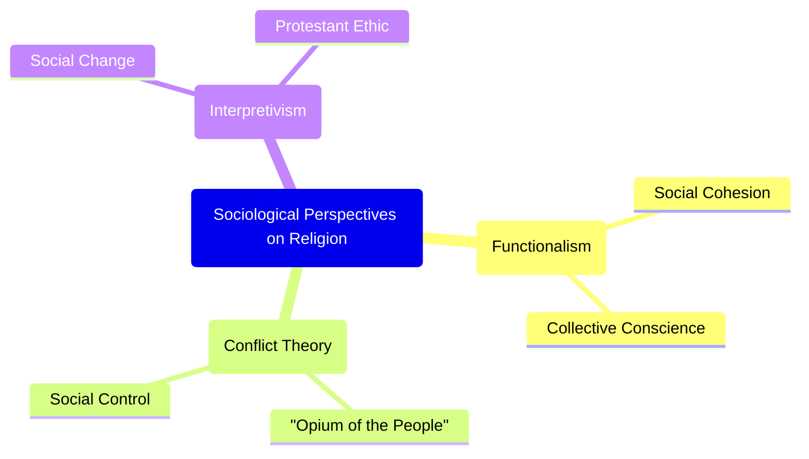
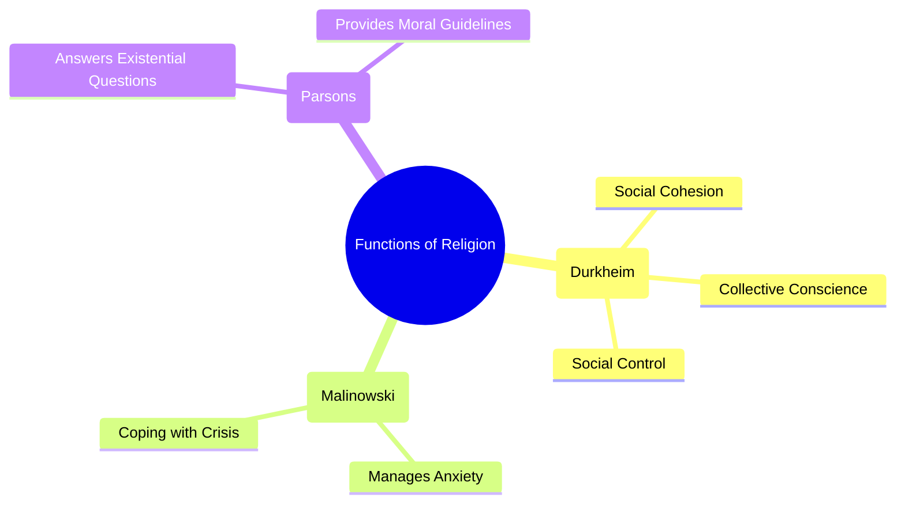
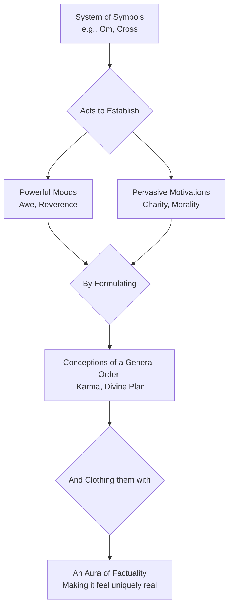
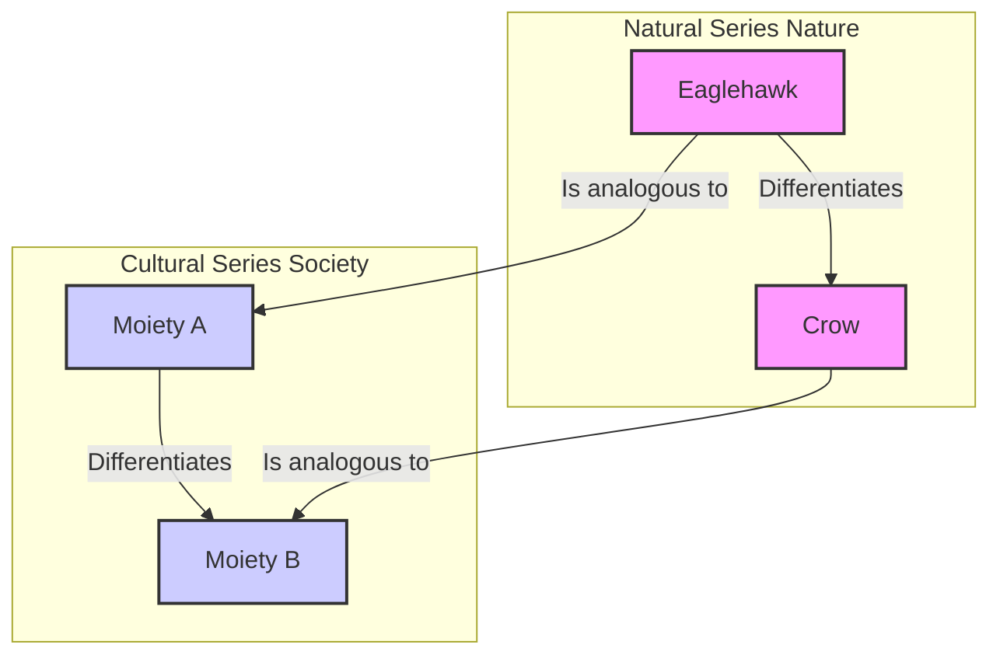

**

---

### Master Prompt for a 90+ Marks IGNOU MSO Assignment

Objective: Generate a 90+ marks-worthy answer for the IGNOU MSO (Master of Arts in Sociology) Second Year assignment question provided below. The output must be optimized for an evaluator looking for exceptional quality.

  

Core Directives:

  

1. Strict Adherence to IGNOU Format: The entire output must be tailored for a handwritten assignment.
    

  

2. Word Count: The total word count must be strictly between 425 and 450 words. Do not exceed this limit.
    

  

3. Writing Style & Tone (Evaluator-Focused):
    

  

- Academic and Human-like: The language must be sophisticated yet clear, avoiding AI-like generic phrasing and overly ornamental words. The goal is to sound like a well-read, articulate student.
    
- Varied and Flowing: Employ varied sentence lengths and natural transitional phrases (e.g., "Furthermore," "In contrast," "Consequently") to ensure a smooth, human-like narrative flow that is easy and engaging for an evaluator to read.
    

  

4. High-Impact Structure:
    

  

- Introduction (Approx. 50-60 words): Start with a compelling introduction that immediately defines the core concepts and provides a clear roadmap of the answer. This should hook the evaluator from the start.
    
- Body (Approx. 300-340 words):
    

- Use clear, logical headings and subheadings. This is non-negotiable as it drastically improves readability.
    
- Adopt the hybrid "paragraph-then-pointers" model: Introduce a key theme in a short paragraph to provide context, then use 2-3 bullet points to elaborate on its features, arguments, or examples. This structure makes the answer scannable and easy to digest.
    

- Conclusion (Way Forward) (Approx. 50-60 words): End with a powerful concluding paragraph titled "Way Forward" or "Conclusion." It must summarize the main arguments and offer a forward-looking or critical sociological insight, leaving a lasting positive impression on the evaluator.
    

  

5. Content Requirements (Demonstrating Mastery):
    

  

- Answer the Complete Question: Meticulously address every single sub-part of the question, both core and peripheral. Do not include irrelevant information. The structure should be a direct response to the question's demands.
    
- Sociological Depth: The answer must be rich with sociological concepts and terminology, used correctly and appropriately.
    
- Integrate Thinkers: Seamlessly integrate the ideas or theories of one or two course-relevant sociological thinkers. [For best results, specify them here, e.g., "Focus on the contributions of M.N. Srinivas and G.S. Ghurye."]
    
- Use Specific Indian Examples: Provide relevant, specific, and contemporary examples from the Indian context. For instance, instead of "social media impacts society," use "the role of WhatsApp in organizing local social movements in India."
    

  

6. Value-Adding Mermaid Diagram:
    

  

- Include one simple, clean, and value-adding Mermaid diagram that visually summarizes a key process, relationship, or concept from the answer.
    
- The diagram must be easy to replicate by hand. Choose the most suitable and effective diagram type based on the question's demands (e.g., flowchart for a process, mind map for concepts, cycle diagram for recurring events).
    
- Provide the diagram syntax within a mermaid code block.
    

  

Final Output: Generate a single, clean block of text that is ready to be copied and used as a model for the handwritten assignment.

  

---

## [PASTE THE IGNOU ASSIGNMENT QUESTION HERE]

  
***


***

# MSOE-003 Sociology of Religion

# Section - 1

# Q1. Discuss the sociological perspective on religion.

### The Sociological Perspective on Religion

#### Introduction

The sociological perspective on religion analyses it as a social institution, focusing on its functions, its role in social stratification, and its influence on human behaviour, rather than evaluating the truth of its beliefs. This approach, pioneered by classical thinkers like Émile Durkheim, Karl Marx, and Max Weber, examines how religion shapes and is shaped by society. This answer will discuss these three foundational perspectives to understand religion's complex role in the social world.

#### The Functionalist View: Émile Durkheim

Émile Durkheim, in The Elementary Forms of Religious Life, argued that religion's primary function is to create social solidarity and cohesion. He proposed that all societies distinguish between the 'sacred' (things set apart with special significance) and the 'profane' (everyday, mundane things). For Durkheim, when people worship sacred symbols, they are unknowingly worshipping society itself.

  

- Social Cohesion: Religious rituals and ceremonies bring community members together, reinforcing shared norms and a collective conscience—the shared beliefs and moral attitudes that unify a society. In India, large religious gatherings like the Kumbh Mela serve as powerful examples of reinforcing collective identity.
    
- Providing Meaning: Religion offers answers to ultimate questions about life, death, and suffering, providing emotional comfort and stability during personal crises.
    

#### The Conflict View: Karl Marx

In stark contrast, Karl Marx viewed religion through the lens of conflict theory, seeing it as an instrument of social control and oppression. He famously described religion as the "opium of the people," a drug that dulls the pain of exploitation experienced by the working class (proletariat) in a capitalist society.

  

- Legitimising Inequality: Religion maintains the status quo by teaching that existing social arrangements are divinely ordained. The historical justification of the caste system in India through religious doctrines is a classic example of religion legitimising social stratification.
    
- False Consciousness: By promising rewards in the afterlife, religion distracts the oppressed from their earthly suffering and discourages them from challenging the ruling class, thus preventing revolutionary change.
    

#### The Interpretive View: Max Weber

Max Weber offered a more nuanced perspective, arguing that religion could be a powerful force for social change. In his seminal work, The Protestant Ethic and the Spirit of Capitalism, Weber contended that the values of certain Protestant sects, particularly Calvinism, were instrumental in the rise of modern capitalism.

  

- Driving Social Change: Weber demonstrated how religious ideas could shape economic behaviour. The Calvinist emphasis on hard work, discipline, and asceticism created an ethic that spurred capital accumulation.
    
- Motivation for Action: Unlike Marx, Weber believed that religion was not merely a reflection of economic forces but could independently motivate social action. Socio-religious reform movements in India, such as the Bhakti movement, challenged existing social hierarchies and promoted significant social change.
    

  



#### Way Forward

The classical sociological perspectives reveal that religion is not a monolithic entity but a complex social phenomenon with diverse functions and consequences. While Durkheim highlights its role in social integration, Marx exposes its potential to perpetuate inequality, and Weber showcases its capacity to drive transformation. In a deeply religious and diverse society like India, these frameworks remain indispensable for critically analysing contemporary issues such as secularism, communalism, and the dynamic interplay between faith and social progress.

  

—

# Q3. Discuss the functional interpretation of religion.

### The Functional Interpretation of Religion

#### Introduction

The functionalist interpretation of religion, a cornerstone of classical sociology, posits that religion serves vital social and psychological functions, contributing to the overall stability and maintenance of society. Rather than assessing the validity of religious beliefs, this perspective analyses what religion does for society and the individual. Pioneered by thinkers like Émile Durkheim and further developed by others like Bronisław Malinowski and Talcott Parsons, the functionalist view sees religion as a powerful force for social cohesion, control, and providing meaning.

#### Émile Durkheim: Religion and Social Cohesion

For Émile Durkheim, the primary function of religion is to generate social solidarity. In his work on Australian aboriginal tribes, he noted that societies distinguish between the sacred—things set apart with special reverence—and the profane—the mundane aspects of everyday life. Durkheim argued that in worshipping sacred symbols or totems, people are essentially worshipping society itself, reinforcing the collective conscience.

  

- Reinforcing Social Bonds: Religious rituals and ceremonies bring people together, creating a shared experience that strengthens community ties. In India, large-scale festivals like Diwali or Eid transcend their religious origins to become cultural celebrations that foster a sense of shared identity among diverse communities.
    
- Imposing Discipline: By prescribing certain behaviours and moral codes, such as the Ten Commandments, religion encourages self-discipline and reinforces social norms.
    

#### Malinowski and Parsons: Psychological and Adaptive Functions

Bronisław Malinowski expanded the functionalist view by focusing on the psychological functions of religion. He argued that religion helps individuals and society cope with the emotional stress that arises from uncontrollable and unpredictable situations.

  

- Managing Anxiety: Malinowski observed that Trobriand Islanders used religious rituals when fishing in dangerous, open waters but not in calm lagoons. Religion provides comfort and a sense of control in times of crisis, such as death, birth, or illness.
    
- Answering Ultimate Questions: Talcott Parsons added that religion helps people make sense of contradictory and existential questions, such as suffering and injustice. It provides a framework of meaning that helps maintain social order when outcomes seem random or unfair.
    

  



#### Way Forward

The functional interpretation provides a powerful lens for understanding religion's enduring presence and its role in promoting social stability. However, this perspective is often criticised for downplaying religion's dysfunctional aspects, such as its role in inciting conflict and violence. In contemporary India, while religion often acts as a unifying force, fostering community and shared values, it is also a source of social division and conflict. A complete sociological analysis must, therefore, acknowledge both the cohesive and the divisive potential of this profound social institution.

—

# Q5. Discuss the perspective of Clifford Geertz on religion.

### Clifford Geertz's Perspective on Religion

#### Introduction

Clifford Geertz, a prominent cultural anthropologist, offered a groundbreaking interpretive perspective on religion that shifted the sociological focus from its social functions to its role as a system of cultural meaning. Moving away from the grand theories of Durkheim or Marx, Geertz was interested in how religion provides a framework for interpreting reality and giving meaning to human existence. For him, religion is fundamentally a cultural system, a lens through which individuals see the world and their place within it.

#### Religion as a System of Symbols

Geertz's perspective is famously encapsulated in his definition of religion as "(1) a system of symbols which acts to (2) establish powerful, pervasive, and long-lasting moods and motivations in men by (3) formulating conceptions of a general order of existence and (4) clothing these conceptions with such an aura of factuality that (5) the moods and motivations seem uniquely realistic." This definition provides a comprehensive framework for understanding religion's cultural work.

  

- System of Symbols: At its core, religion uses symbols—such as a cross, the crescent moon, or the sound of 'Om'—that are not just objects or signs but carriers of deep cultural meaning. These symbols condense complex ideas and emotions into a tangible form.
    
- Establishing Moods and Motivations: Religious symbols are not passive; they actively shape human experience. They evoke powerful moods (like awe, reverence, or tranquility) and motivate individuals to act in certain ways (e.g., performing charity, undertaking a pilgrimage, or following ethical precepts).
    

#### Formulating a Worldview

For Geertz, religion's most crucial role is to provide a worldview—a coherent picture of how the universe is structured and what it all means. It addresses the "problem of meaning" by offering explanations for suffering, injustice, and death, which might otherwise seem chaotic and incomprehensible.

  

- Creating a General Order: Religious narratives and doctrines, such as the concept of Karma in Hinduism or divine providence in Christianity, provide a sense of an underlying order to existence.
    
- The "Aura of Factuality": Religion makes this worldview seem intensely real and authoritative through rituals. During a religious ceremony, the symbolic world and the everyday world merge, making the religious conceptions feel like undeniable truths. The experience of a powerful puja or a solemn church service makes the divine feel tangibly present.
    

  



#### Way Forward

Clifford Geertz's interpretive approach provides an invaluable tool for understanding religion from the "native's point of view." His focus on symbols, meaning, and culture allows us to see religion not just as a social glue or an oppressive force, but as a complex tapestry of meanings that shapes human consciousness and experience. In a multi-religious society like India, where symbols and worldviews are deeply intertwined with identity and politics, Geertz's perspective is more relevant than ever for deciphering the profound ways in which religion continues to shape public and private life.

—

# Section - 2

# Q6. Is totemism a reality? Discuss with reference to the writings of Lèvi-Strauss.

### Is Totemism a Reality? A Discussion with Reference to Lévi-Strauss

#### Introduction

The concept of totemism, traditionally understood as a primitive religious system where social groups have a mystical relationship with a natural object (a totem), was a central topic in early anthropology and sociology. However, the French structuralist Claude Lévi-Strauss radically challenged this view. He argued that totemism, as a distinct, real institution, is an illusion created by scholars. For Lévi-Strauss, the phenomenon is not about religion but about a universal mode of human classification.

#### The Classical View vs. Lévi-Strauss's Critique

Early thinkers like Émile Durkheim saw totemism as a genuine, elementary form of religion. For Durkheim, the totem symbol (e.g., a Kangaroo for a particular clan) was a sacred object through which the clan worshipped its own social unity. The totem was real and functional, binding the group together. Lévi-Strauss, in his seminal work Totemism, dismantled this entire framework. He argued that scholars had arbitrarily bundled together diverse practices from different cultures under the single, misleading label of "totemism."

  

- An Intellectual Illusion: Lévi-Strauss claimed totemism was not a real-world institution but an analytical construct. He saw it as a specific expression of a universal human tendency to organize the world through logical structures.
    
- A System of Classification: The core of his argument is that totemism is fundamentally a system of classification. It uses the observable differences in the natural world as a conceptual blueprint to understand and structure differences in the social world.
    

#### "Good to Think": The Logic of Totemic Classification

Lévi-Strauss's most famous insight is that totemic species are chosen not because they are "good to eat" (i.e., of economic value) or sacred in themselves, but because they are "good to think." They provide a set of terms for creating a logical system of differences and oppositions.

  

- Homology, Not Identity: A clan does not claim to be a bear. Instead, it uses the bear's relationship with other animals to model its own relationship with other clans. The crucial insight is the concept of homology: the difference between Clan A and Clan B is like the difference between an eagle and a crow.
    
- Binary Oppositions: This system relies on binary oppositions found in nature (e.g., sky/earth, predator/prey, eagle/crow) to structure social relations. It is the relationship between the totems, not the totems themselves, that holds meaning. For instance, in some Australian tribes, the opposition between the Eaglehawk and the Crow moieties structures the entire social and marital system.
    

  



#### Way Forward

In conclusion, according to Claude Lévi-Strauss, totemism is not a reality in the way early sociologists imagined it—as a unified, primitive religion. Its reality is far more profound: it is a testament to the structured, logical nature of the human mind. By reframing totemism as a system of classification, Lévi-Strauss demonstrated that so-called 'primitive' thought is as complex and logical as modern scientific thought, thereby revolutionizing the anthropological study of culture and cognition.

—

# Q7. Discuss Peter Berger’s viewpoint on the future of religion in society.

### Peter Berger’s Viewpoint on the Future of Religion in Society

#### Introduction

Peter Berger, a highly influential sociologist of religion, offers a dynamic and evolving perspective on the future of religion. Initially a proponent of the classic secularization thesis—the idea that modernity inevitably leads to religious decline—Berger famously reversed his position later in his career. He concluded that the future of religion is not one of disappearance but of vibrant, albeit transformed, persistence. His revised viewpoint argues that modernity's primary impact is not secularization but a profound increase in pluralism, which reshapes religious belief and practice.

#### The Retraction of the Secularization Thesis

In his early work, such as The Sacred Canopy (1967), Berger argued that modernization, with its emphasis on rationality and science, would erode the "sacred canopy"—the overarching religious worldview that gives meaning to society. However, observing the global resurgence of faith movements, from evangelical Christianity to political Islam, he later admitted this prediction was empirically false. He concluded that the world was not becoming more secular but was, in many places, "as furiously religious as it ever was."

  

- Desecularization: Berger coined the term "desecularization" to describe this unexpected resurgence of religion in the public and private spheres.
    
- Exceptions to the Rule: He did note two major exceptions to this global trend: Western Europe and an international, highly educated intellectual class, both of which remain significantly secularized.
    

#### Pluralism: The True Consequence of Modernity

Berger's revised thesis posits that modernity does not necessarily destroy religion but instead enforces pluralism. In a globalized world, different religious and secular worldviews are forced to coexist, fundamentally changing the nature of faith.

  

- From Fate to Choice: In traditional societies, one's religion was a matter of fate, an unquestioned reality. In a pluralistic society, belief becomes a matter of individual choice. Individuals are confronted with a "market" of religious options, making their own faith less taken-for-granted and more reflective.
    
- Challenge to Authority: Pluralism erodes the authority of any single religious institution. When multiple truths are on offer, no single one can maintain a monopoly on reality. This creates a more fluid and individualised religious landscape.
    

```mermaid
flowchart LR
    A[Modernity] --> B{Key Outcome};
    subgraph Early Theory
        B -- x SECULARIZATION <br> (Religious Decline);
    end
    subgraph Later Theory
        B -- ✓ PLURALISM <br> (Coexistence of Beliefs);
    end
    C[Pluralism] --> D[Religion becomes <br> a matter of CHOICE];
    D --> E[Resurgence & Transformation <br> of Religion];
```
  


#### Way Forward

Peter Berger’s viewpoint suggests that the future of religion will not be its absence but its continued, dynamic presence in a pluralistic world. Religion is not fading away; it is adapting, diversifying, and often thriving. This perspective is highly relevant to contemporary India, a society characterised by deep religious pluralism. Berger’s framework helps explain the simultaneous rise of intense religious movements alongside a secular public discourse. The challenge for modern societies, as Berger saw it, is not how to manage religion's decline, but how to navigate the complex and often tense coexistence of multiple, deeply held belief systems.

—

# Q8. What is religious conversion? Explain its sociological interpretation.

### What is Religious Conversion? Explained with its Sociological Interpretation

#### Introduction

Religious conversion is the process of adopting a new religious identity, or a set of beliefs, that is different from one's previous affiliation. While often viewed as a deeply personal and spiritual journey, sociology interprets it as a profound social phenomenon. A sociological lens moves beyond individual faith to examine conversion as a shift in social identity, group allegiance, and worldview, often driven by structural factors like social stratification, cultural dislocation, and the influence of social networks.

#### The Sociological Interpretation of Conversion

Sociologists are less concerned with the theological truth of a conversion and more interested in the social contexts that precipitate it and the consequences that follow. They analyze the "push" and "pull" factors that lead individuals or groups to embrace a new faith. This interpretation can be understood through three primary frameworks.

  

- Conversion as a Path to Social Mobility: For marginalized and oppressed communities, conversion can be a powerful strategy to escape an entrenched, discriminatory social hierarchy. It is an act of protest and a quest for dignity and equality. The most prominent Indian example is Dr. B.R. Ambedkar's mass conversion to Buddhism in 1956, where he led hundreds of thousands of Dalits to leave Hinduism as a means of rejecting the injustices of the caste system.
    
- Conversion as a Response to Social Dislocation: Rapid social change, urbanization, and migration can create a state of anomie, where old norms and values lose their hold. In such times of uncertainty, individuals may turn to new religious movements that offer a strong sense of community, clear moral guidelines, and a stable worldview. The growth of Pentecostal Christianity in urban slums across India can be partly attributed to the support networks it provides to migrants.
    
- The Role of Social Networks: Contemporary sociology emphasizes that conversion is rarely a solitary act. It is often facilitated through pre-existing social ties. Individuals are more likely to adopt a new faith if their friends, family, or close community members are already adherents. Belief, in this sense, is transmitted through relationships of trust, making social networks a crucial vehicle for religious change.
    

  

flowchart TD

  

    subgraph Drivers (Push/Pull Factors)

  

        A[Social Oppression <br> (e.g., Caste System)]

  

        B[Social Dislocation <br> (e.g., Migration)]

  

        C[Social Networks <br> (e.g., Friends, Family)]

  

    end

  

  

    subgraph The Process

  

        D{Religious Conversion}

  

    end

  

    subgraph Outcomes

  

        E[New Social Identity]

  

        F[New Community & Allegiance]

  

        G[New Worldview & Values]

  

    end

  

    A --> D

  

    B --> D

  

    C --> D

  

    D --> E & F & G

#### Way Forward

In conclusion, the sociological interpretation reveals that religious conversion is far more than a private change of heart; it is a social act embedded in power structures, community dynamics, and the human search for meaning. It is a process through which individuals and groups renegotiate their identity and their place in the world. In a pluralistic and politically charged society like India, understanding the social drivers of conversion is essential for navigating the complex and sensitive debates surrounding religious freedom, identity politics, and minority rights.

—

  
***


---


***

# MSOE-004: Urban Sociology

# Section - 1

# Q1. Critically examine the origin and historical development of urban sociology as a sub-discipline of sociology.

### The Origin and Historical Development of Urban Sociology

#### Introduction

Urban sociology emerged as a distinct sub-discipline of sociology in the late 19th and early 20th centuries, primarily as an intellectual response to the profound social transformations brought about by the Industrial Revolution. The unprecedented growth of cities created a host of social problems—overcrowding, poverty, crime, and alienation—that demanded systematic study. This answer critically examines the historical development of urban sociology through its key intellectual phases: the classical European foundations, the formalization by the Chicago School, and the critical turn of the New Urban Sociology.

#### Classical European Foundations

The intellectual groundwork for urban sociology was laid by classical European thinkers who grappled with the nature of the emerging modern, industrial city. Though they did not identify as "urban sociologists," their analyses were foundational.

  

- Karl Marx and Friedrich Engels: They viewed the industrial city as a physical manifestation of capitalism, an arena for class conflict where the bourgeoisie and proletariat were concentrated. Engels’ work, The Condition of the Working Class in England, was a pioneering empirical study of urban squalor and exploitation.
    
- Max Weber: In The City, Weber provided a historical-comparative analysis, defining the city as a distinct social entity with political autonomy, a market, and a unique form of association. He contrasted the self-governing "occidental city" with the cities of Asia.
    
- Georg Simmel: In his influential essay The Metropolis and Mental Life, Simmel focused on the psychological impact of urban living. He argued that the intense stimuli of the city produced a "blasé attitude," a detached and rational orientation, as a necessary shield for the individual's inner life.
    

#### The Chicago School: The Formalization of the Discipline

Urban sociology was formally institutionalized as an empirical field of study in the 1920s and 1930s by the Chicago School in the United States. Treating the city of Chicago as a "social laboratory," its scholars developed groundbreaking theories and methods.

  

- Human Ecology: Robert Park applied concepts from biology to the city, viewing it as an ecosystem where different social groups competed for resources and territory, leading to processes of invasion, succession, and segregation.
    
- Concentric Zone Model: Ernest Burgess proposed this influential model, suggesting that cities grow outward from a central business district in a series of concentric rings, each with distinct social characteristics.
    
- Urbanism as a Way of Life: Louis Wirth argued that the city's defining characteristics—large size, high population density, and social heterogeneity—produced a unique way of life characterized by anonymous, superficial, and instrumental social relationships.
    

#### The Critical Turn: The New Urban Sociology

By the 1970s, the ecological determinism of the Chicago School faced significant criticism. A new generation of scholars, influenced by Marxist thought, argued that urban forms were shaped not by natural ecological processes but by the political and economic forces of global capitalism.

  

- Key Thinkers: Scholars like Henri Lefebvre, David Harvey, and Manuel Castells shifted the focus to issues of power, capital accumulation, and social conflict in shaping urban space.
    
- Central Argument: This "New Urban Sociology" contends that urban development is driven by the decisions of real estate developers, corporations, and government actors, often leading to inequality and social injustice.
    

  

flowchart LR

  

    A[Industrial Revolution <br> (Mass Urbanization)] --> B[Classical Foundations <br> (Marx, Weber, Simmel)];

  

    B --> C[The Chicago School <br> (Park, Burgess, Wirth) <br> <b>Formalization</b>];

  

    C --> D[New Urban Sociology <br> (Harvey, Castells) <br> <b>The Critical Turn</b>];

#### Way Forward

The historical development of urban sociology reflects a journey from foundational observations of industrial cities to a systematic, empirical science, and finally to a critical perspective focused on global political and economic forces. While these Western-centric theories provide a crucial framework, their application to post-colonial contexts like India requires critical adaptation. Contemporary Indian urban sociology must grapple with unique challenges like the massive scale of the informal sector, caste-based segregation, and the politics of "smart cities," ensuring the discipline remains relevant in a rapidly urbanizing world.

—

# Q2. Discuss the major theoretical perspectives in urban sociology.

### Major Theoretical Perspectives in Urban Sociology

#### Introduction

Urban sociology employs several theoretical perspectives to understand the complex dynamics of city life, from the spatial arrangement of social groups to the individual's experience of the urban environment. These frameworks provide distinct lenses for analysing how cities are formed, how they function, and how they impact society. The three major theoretical pillars that have shaped the discipline are the Human Ecology perspective of the Chicago School, the critical Political Economy perspective, and the Culturalist or Symbolic Interactionist perspective.

#### Human Ecology: The City as an Organism

Pioneered by the Chicago School in the early 20th century, the Human Ecology perspective views the city as a natural ecosystem. Scholars like Robert Park and Ernest Burgess applied concepts from biology to explain the organization of urban space. They argued that different social groups, much like plant and animal species, compete for scarce resources (like desirable land), leading to a natural, ordered pattern of social distribution.

  

- Key Processes: This competition results in processes of invasion, succession, and segregation, as new groups move into urban areas and displace existing ones, leading to the formation of distinct neighbourhoods or "natural areas."
    
- The Concentric Zone Model: Ernest Burgess’s model is a classic example, proposing that cities grow in a series of five concentric rings, with the central business district at the core and affluent residential areas on the periphery. This model attempted to create a universal map of urban social organization.
    

#### The Political Economy Perspective: The City as a Growth Machine

Emerging in the 1970s as a critique of Human Ecology, the Political Economy perspective, heavily influenced by Marxist thought, rejects the idea that cities are shaped by natural processes. Instead, thinkers like David Harvey and Manuel Castells argue that urban space is actively produced by the interplay of capital and power.

  

- Capital and Conflict: This view sees the city as an arena for class conflict, where decisions about land use are driven by the pursuit of profit by corporations, real estate developers, and financial institutions, often supported by the state.
    
- Uneven Development: The pursuit of profit leads to uneven development, creating zones of extreme wealth alongside areas of neglect and poverty. The development of gated communities and luxury high-rises in Indian cities like Mumbai, often at the cost of displacing slum dwellers, is a stark example of this process.
    

#### The Culturalist Perspective: The City as Lived Experience

The Culturalist or Symbolic Interactionist perspective focuses on the micro-level, examining how individuals experience the city and create meaning in their everyday lives. Building on the foundational work of Georg Simmel, this view is concerned with urbanism as a unique way of life.

  

- Focus on Subcultures: It explores how the anonymity and diversity of the city allow for the formation of a wide array of subcultures (e.g., artistic communities, ethnic enclaves, youth groups), providing individuals with a sense of identity and belonging.
    
- Urban Identity: This perspective analyses how people navigate urban spaces, interpret symbols, and interact with strangers. The vibrant street life and distinct neighbourhood cultures (e.g., the paras of Kolkata) in many Indian cities exemplify how residents actively create a unique social fabric.
    

  

mindmap

  

  root((Urban Perspectives))

  

    Human Ecology

  

      ::icon(fa fa-leaf)

  

      Key Idea: Natural Competition

  

      Thinkers: Park, Burgess

  

      Focus: Spatial Patterns

  

    Political Economy

  

      ::icon(fa fa-money-bill-wave)

  

      Key Idea: Capital & Power

  

      Thinkers: Harvey, Castells

  

      Focus: Inequality

  

    Culturalist

  

      ::icon(fa fa-comments)

  

      Key Idea: Lived Experience

  

      Thinkers: Simmel, Wirth

  

      Focus: Subcultures & Identity

#### Way Forward

No single theoretical perspective can fully capture the complexity of urban life. While Human Ecology provides a valuable macro-level view of spatial organization, the Political Economy perspective critically exposes the power dynamics that shape our cities. The Culturalist approach, in turn, offers crucial insights into the human experience of urbanism. A comprehensive understanding of contemporary cities, particularly the multi-layered and rapidly changing urban landscapes of India, requires an integrated approach that draws upon the strengths of all three perspectives.

—

# Q4. Explain the technique of social area analysis in urban sociology.

### The Technique of Social Area Analysis in Urban Sociology

#### Introduction

Social Area Analysis (SAA) is a quantitative technique developed in the mid-20th century to identify and classify urban neighbourhoods based on their underlying social dimensions. Emerging as a sophisticated alternative to the overly simplistic ecological models of the Chicago School, SAA provided a more systematic and empirically grounded method for studying the social geography of cities. Developed by sociologists Eshref Shevky, Wendell Bell, and Marilyn Williams, the technique links broad societal changes to the residential differentiation of urban populations.

#### The Theoretical Foundation

The core premise of SAA is that the increasing "scale of society"—driven by industrialization and modernization—creates distinct patterns of social organization within a city. Shevky and Bell argued that this increasing scale manifests in three fundamental societal trends, which in turn structure the social landscape of the city.

  

- Changes in the Division of Labour: As society becomes more complex, so do its occupational structures. This leads to differentiation based on skills, education, and economic standing, creating a dimension of Social Rank or Economic Status.
    
- Changes in Family Structure: Urban-industrial life alters the traditional functions of the family. This leads to variations in lifestyle, family size, and female participation in the workforce, creating a dimension of Urbanization or Family Status.
    
- Changes in Population Composition: Increased migration and mobility lead to greater ethnic and racial diversity within cities. This results in the spatial sorting of different groups, creating a dimension of Segregation or Ethnic Status.
    

#### Methodology and Application

In practice, SAA uses census tract data to measure these three underlying dimensions. For each census tract (a small, relatively stable urban neighbourhood), a set of variables is used to create a composite score for each of the three indices.

  

- Social Rank Index: This is typically measured using variables like the proportion of residents with higher education and the proportion employed in white-collar occupations. Areas with high scores are considered high-status neighbourhoods.
    
- Urbanization Index: This is measured using variables that reflect modern family life, such as low fertility rates, a high proportion of women in the workforce, and a low number of single-family dwellings.
    
- Segregation Index: This simply measures the proportion of the population in a census tract belonging to specific minority racial or ethnic groups.
    

  

By scoring each neighbourhood on these three independent dimensions, researchers can create a detailed "social map" of the city, identifying areas with similar social characteristics and comparing the social structures of different cities.

  

flowchart TD

  

    A[Increasing Scale of Society] --> B{Three Core Constructs};

  

    B --> C[<b>Social Rank</b> <br> (Economic Status)];

  

    B --> D[<b>Urbanization</b> <br> (Family Status)];

  

    B --> E[<b>Segregation</b> <br> (Ethnic Status)];

  

    C --> F[Census Variables <br> (Occupation, Education)];

  

    D --> G[Census Variables <br> (Fertility, Women in Workforce)];

  

    E --> H[Census Variables <br> (Ethnic Concentration)];

  

    F & G & H --> I[Social Area Typology <br> (Classification of Neighbourhoods)];

#### Way Forward

Social Area Analysis marked a significant methodological advancement in urban sociology. It provided a multi-dimensional, empirically testable framework that moved beyond the simple spatial determinism of earlier models. While it has been criticized for being overly descriptive and was later refined by the more statistically complex method of factorial ecology, its foundational contribution remains immense. The technique's core insight—that urban social geography is a product of broader societal forces—continues to be a vital tool for understanding patterns of inequality, residential segregation, and social differentiation in cities across the world, including the complex urban landscapes of modern India.

—

# Section - 2

# Q7. Describe the key dimensions of the urban informal sector in India.

### The Key Dimensions of the Urban Informal Sector in India

#### Introduction

The urban informal sector, often referred to as the unorganized or unregulated economy, is a pervasive and defining feature of Indian cities. It comprises a vast range of economic activities, enterprises, and workers that are not regulated or protected by the state. Far from being a marginal phenomenon, this sector provides livelihoods for a majority of the urban workforce. Understanding its key dimensions—economic, social, and its linkage with the formal economy—is crucial for comprehending the reality of urban life and survival in India.

#### Economic and Operational Characteristics

The informal sector is characterized by a distinct set of economic and operational features that set it apart from the formal economy. These characteristics facilitate its existence but also contribute to its instability.

  

- Ease of Entry: Operations in the informal sector typically require minimal capital, skills, and bureaucratic clearances, making it the primary entry point for poor migrants arriving in the city.
    
- Small Scale and Labour-Intensive: Enterprises are generally small-scale, often household-based, and use labour-intensive technology. Examples range from street vendors and rickshaw pullers to small-scale manufacturing and repair shops.
    
- Unregulated Markets: These activities operate in highly competitive and unregulated markets, lacking the legal frameworks and protections afforded to formal businesses.
    

#### Social Composition and Vulnerability

The social dimension of the informal sector reveals its deep connection to structures of inequality. The workforce is not random but is largely composed of the most socially and economically marginalized groups.

  

- A Haven for Migrants: The sector is dominated by rural-to-urban migrants who lack the social capital and educational qualifications to enter the formal job market.
    
- Lack of Social Security: As sociologist Jan Breman has extensively documented, workers in this sector are "footloose labour," with no job security, written contracts, paid leave, health benefits, or pensions. This makes them extremely vulnerable to economic shocks, illness, and old age.
    
- Concentration of Marginalized Groups: Women, lower castes, and religious minorities are disproportionately represented in the lowest-paid and most precarious segments of the informal economy, such as domestic work and waste picking.
    

#### Linkages with the Formal Sector

A critical dimension often overlooked is the intricate and dependent relationship the informal sector has with the formal economy. It is not a separate economy but is deeply integrated, often in an exploitative manner.

  

- Subcontracting and Outsourcing: Formal industries frequently outsource production and services to informal units to reduce labour costs and bypass regulations. For instance, the garment industry in cities like Delhi subcontracts stitching and embroidery work to small, home-based informal workshops.
    
- Providing Cheap Goods and Services: The informal sector subsidizes the formal economy by providing cheap goods and services (food, transport, housing) to formal sector workers, thus helping keep formal sector wages low.
    

  

mindmap

  

  root((Urban Informal Sector))

  

    Economic Dimensions

  

      Easy Entry

  

      Small Scale

  

      Unregulated

  

    Social Dimensions

  

      Dominated by Migrants

  

      High Vulnerability

  

      No Social Security

  

    Linkages to Formal Sector

  

      Subcontracting

  

      Cheap Labour Supply

  

      Exploitative Relationship

#### Way Forward

The key dimensions of India's urban informal sector paint a picture of a resilient yet highly vulnerable economic space. It is an integral, not peripheral, part of the urban economy, characterized by its accessibility, social composition of marginalized groups, and its subordinate linkage to the formal sector. Acknowledging its immense contribution, urban policy must shift from a perspective of neglect or eradication towards one of integration and empowerment, focusing on providing social security, legal recognition, and improved working conditions for the millions who sustain the Indian city.

—

# Q8. Write a critical note on urban poverty in India.

### A Critical Note on Urban Poverty in India

#### Introduction

Urban poverty in India is a complex and multi-dimensional phenomenon that extends far beyond a simple lack of income. It is a direct consequence of rapid, often unplanned, urbanization and is characterized by a severe deprivation of essential capabilities and access to services. A critical analysis reveals that urban poverty is not merely an overflow of rural poverty but a distinct structural issue rooted in the nature of India's urban economy and exclusionary urban planning.

#### The Multi-Dimensional Nature of Deprivation

Official poverty estimates, based on consumption expenditure (the Tendulkar or Rangarajan poverty lines), fail to capture the true nature of urban deprivation. Poverty in the city is a condition of precarious existence defined by a lack of access to basic amenities and social security, a concept Amartya Sen would term "capability deprivation."

  

- Inadequate Access to Basic Services: The urban poor are often clustered in slums and informal settlements (like Dharavi in Mumbai) that are underserved by municipal services. This results in a lack of access to safe drinking water, sanitation, primary healthcare, and quality education.
    
- Housing Insecurity: A defining feature of urban poverty is the lack of secure housing tenure. Residents of informal settlements live under the constant threat of eviction, as seen in numerous slum demolition drives for urban "beautification" or infrastructure projects.
    
- Social Exclusion: The poor are often spatially and socially excluded from the formal life of the city. They face discrimination and are denied a political voice in urban governance, reinforcing their marginalization.
    

#### The Informal Economy and Structural Vulnerability

Urban poverty is intrinsically linked to the structure of the urban labour market, which is dominated by the informal sector. The vast majority of the urban poor are engaged in informal employment, which is characterized by its precarious and exploitative nature.

  

- Dependence on Precarious Livelihoods: The urban poor work as street vendors, construction labourers, waste pickers, or domestic help. As sociologist Jan Breman notes, they constitute "footloose labour," with no job security, low and irregular wages, and a complete absence of social safety nets.
    
- High Vulnerability: This dependence on the informal economy makes the urban poor extremely vulnerable to economic shocks, health crises, and personal emergencies. The mass exodus of migrant workers from cities during the COVID-19 lockdown starkly illustrated this structural vulnerability.
    

  

mindmap

  

  root((Dimensions of Urban Poverty))

  

    ::icon(fa fa-city)

  

    Income Poverty

  

      Below Poverty Line

  

    Capability Deprivation

  

      Lack of Basic Services

  

        Water & Sanitation

  

        Healthcare

  

        Education

  

      Insecure Housing

  

        Slums & Squatter Settlements

  

        Threat of Eviction

  

    Structural Vulnerability

  

      Informal Employment

  

        Low, Irregular Wages

  

        No Social Security

  

      Social Exclusion

#### Way Forward

A critical perspective on urban poverty reveals that it is a systemic problem, not an individual failing. Current policy responses, often focused on simplistic poverty line metrics or punitive actions like slum demolitions, are inadequate. An effective approach must be rights-based, recognizing the "right to the city" for all its inhabitants. This requires inclusive urban planning that focuses on providing secure housing tenure, delivering essential services to informal settlements, and creating policies that protect and empower workers in the informal economy.

—

# Q10. Describe the interface between media and governance in urban settings, using relevant examples.

### The Interface Between Media and Governance in Urban Settings

#### Introduction

In modern urban settings, the interface between media and governance is a dynamic and powerful one. Media, in its various forms from traditional print to digital social media, acts not merely as a passive reporter of events but as an active participant in the process of urban governance. It functions as a watchdog, an agenda-setter, and a platform for public discourse, creating a complex relationship that can enhance accountability and citizen participation, but also be subject to manipulation.

#### The Watchdog Role: Ensuring Accountability

The most fundamental role of the media in urban governance is that of a watchdog. It scrutinizes the actions and policies of urban local bodies (ULBs) like municipal corporations, development authorities, and the police, bringing issues of mismanagement and corruption to public attention.

  

- Exposing Corruption: Investigative journalism often uncovers scams in urban projects, such as irregularities in the allocation of housing contracts or the misuse of public funds. The media's extensive coverage of the Commonwealth Games (CWG) scam in Delhi exposed deep-rooted corruption in urban infrastructure projects, leading to public outcry and official investigations.
    
- Monitoring Service Delivery: Media outlets regularly report on the failures of civic services, such as inadequate waste management, poor road conditions, or erratic water supply, compelling municipal authorities to respond.
    

#### The Agenda-Setting Function: Shaping Urban Priorities

The media plays a crucial role in shaping the public and political agenda by deciding which issues receive prominence. By repeatedly highlighting a particular problem, the media can elevate it from a minor nuisance to a major policy priority.

  

- Highlighting Civic and Environmental Issues: Sustained media campaigns have been instrumental in drawing attention to critical urban issues like the severe air pollution in Delhi or the foaming lakes of Bengaluru. This coverage forces a lethargic administration to acknowledge the problem and formulate action plans.
    
- Influencing Policy and Planning: By framing debates around urban development, such as the need for more public transport versus more flyovers, the media can influence urban planning decisions and budget allocations.
    

#### New Media: A Platform for Direct Citizen Engagement

The rise of social media has radically transformed the media-governance interface, enabling a more direct and instantaneous form of interaction.

  

- Citizen Journalism: Ordinary citizens, armed with smartphones, can now act as journalists, reporting civic issues like a broken traffic light or an overflowing garbage bin in real-time.
    
- Direct Interface with Authorities: Platforms like Twitter (now X) have become grievance redressal mechanisms. Citizens can directly tag the relevant municipal corporation or police department in their posts, often receiving a swift response. The active use of social media by the Bengaluru and Mumbai police to manage traffic and respond to citizen complaints is a prime example of this direct interface.
    

  

mindmap

  

  root((Media-Governance Interface))

  

    Watchdog Role

  

      Exposing Corruption (e.g., CWG Scam)

  

      Monitoring Civic Services

  

    Agenda-Setting Role

  

      Highlighting Issues (e.g., Delhi Pollution)

  

      Influencing Urban Policy

  

    Public Sphere Role (New Media)

  

      Citizen Journalism

  

      Direct Engagement (e.g., Twitter)

#### Way Forward

The interface between media and urban governance is indispensable for a functioning urban democracy. It empowers citizens, promotes transparency, and holds power to account. However, this relationship is not without its flaws. Media can be biased by corporate or political interests, and it can resort to sensationalism. The future challenge lies in leveraging the democratic potential of new media while fostering a critical and responsible journalism that contributes to creating more inclusive, accountable, and responsive cities.

—

  
**