---
### **A. Core Mindmap: Karl Marx (Markdown Format)**

## Karl Marx (1818-1883)

### 1. Historical Materialism (HM)
- **Core Idea:** "It is not the consciousness of men that determines their being, but, on the contrary, their social being that determines their consciousness."
- **Philosophical Root:** Dialectical Materialism.
    - Inverted Hegel's Dialectical Idealism (Idea -> Material World) to Materialism (Material World -> Idea).
    - Thesis -> Antithesis -> Synthesis (e.g., Feudalism -> Bourgeoisie -> Capitalism).
- **Base-Superstructure Model:**
    - **Base (Substructure):** Economic foundation.
        - **Forces of Production:** Tech, raw materials, labor power.
        - **Relations of Production:** Social relations (class). Who owns, who works.
    - **Superstructure:** Non-economic institutions (Politics, Law, Religion, Culture, Family).
        - Function: Legitimizes & maintains the base. Religion is the "opium of the masses."
- **Paper 2 Link (A.R. Desai):** Used HM to analyze Indian Nationalism as a product of new material conditions created by British colonialism (new economic relations, modern education, press).

### 2. Mode of Production (MoP)
- **Definition:** The specific articulation of Forces + Relations of Production.
- **Historical Evolution (Unilinear):**
    - **Primitive Communism:** No classes, common ownership.
    - **Ancient (Slave) MoP:** Masters vs. Slaves.
    - **Feudal MoP:** Lords vs. Serfs.
    - **Capitalist MoP:** Bourgeoisie vs. Proletariat.
    - **Future Stages:** Socialism -> Communism (classless, stateless).
- **Indian Context:**
    - **Debate:** Was India ever truly feudal?
    - **Scholars:** Hamza Alavi (Colonial MoP), D.D. Kosambi ("Feudalism from above & below").

### 3. Class & Class Struggle
- **Class Definition:** Objective. Defined by relationship to the means of production. Not by income/status.
- **Core Idea:** "The history of all hitherto existing society is the history of class struggles."
- **Key Concepts:**
    - **Class-in-itself (An sich):** An objective structural reality. Unconscious of its status.
    - **Class-for-itself (Für sich):** A self-aware class, conscious of its conflict with other classes. Possesses **Class Consciousness**.
    - **False Consciousness:** Misguided ideology of the subordinate class, accepting the worldview of the dominant class.
    - **Class Polarization:** Society splits into two great hostile camps. Middle class sinks into the proletariat.
- **Paper 2 Link:**
    - **Agrarian Class Structure:** Landlords vs. landless labourers (e.g., Daniel Thorner, Utsa Patnaik).
    - **Caste & Class:** Andre Beteille's critique - Caste is not just class. Weberian framework (Status) is also needed.

### 4. Alienation (Entfremdung)
- **Core Idea:** Estrangement of humans from their "species-being" (Gattungswesen) under capitalism. Work is not for self-expression but for survival.
- **Four Types of Alienation:**
    1.  **From the Product:** Worker has no control over or ownership of what they create. (e.g., Foxconn worker making an iPhone they can't afford).
    2.  **From the Process of Production:** Work is repetitive, mindless, forced. No creativity. (e.g., Assembly line work, modern call centers).
    3.  **From Species-Being (Self):** Denied unique human potential for creative, conscious work. Reduced to an animal level.
    4.  **From Fellow Humans:** Social relations become market relations. Competition replaces cooperation.
- **Contemporary Indian Examples:**
    - **Gig Economy:** Zomato/Uber drivers alienated from platform, algorithm, customers.
    - **IT/BPO Sector:** Repetitive tasks, monitoring, lack of connection to final service.
    - **Farmers' Suicides:** Alienated from their land, produce (due to debt, market forces).
- **Related Concept: Fetishism of Commodities**
    - Social relationships between people are perceived as economic relationships among things (money, goods).
    - e.g., A person's worth measured by the brand of their phone/car.

### 5. Critique & Relevance
- **Major Criticisms:**
    - **Economic Determinism:** (Weber's critique) Ideas, culture, religion (Protestant Ethic) can also shape economy.
    - **Failed Prophecy:** Proletarian revolution hasn't occurred in advanced capitalist societies.
    - **Neglect of Middle Class:** Dahrendorf's "decomposition of capital & labour."
    - **One-dimensional view of power:** Focuses only on class, ignores gender (Feminists), caste (Ambedkar), race.
- **Contemporary Relevance (High-Yield for Conclusions):**
    - **Global Inequality:** Oxfam reports on wealth concentration.
    - **Crony Capitalism:** Nexus of state and capital.
    - **Environmental Crisis:** Capitalism's inherent need for infinite growth on a finite planet.
    - **Commodification:** Everything becomes a commodity (health, education, data).
    - **Digital Capitalism:** Data as the new means of production, creating new forms of exploitation.

### **B. Visual Mindmap: The Logic of Marx (Graphviz Code)**

You can copy this code and paste it into a Graphviz editor (like `webgraphviz.com` or an Obsidian plugin) to generate the SVG image.

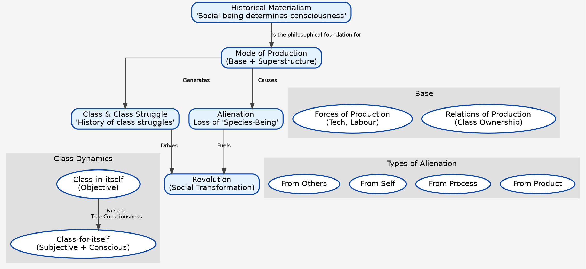

---

### **C. Supplementary Tables**

#### **Table 1: Marx vs. Other Thinkers (Comparative Analysis)**

| Feature | **Karl Marx** | **Max Weber** | **Emile Durkheim** |
| :--- | :--- | :--- | :--- |
| **Basis of Stratification** | **Class** (Economic, relation to means of production). Unidimensional. | **Class, Status, Party** (Economic, Social, Political). Multidimensional. | **Moral Integration** & **Division of Labour**. Stratification is functional, reflects natural inequality. |
| **View of Capitalism** | Inherently exploitative, crisis-ridden, leading to alienation and its own destruction. | The epitome of **Rationality**. Creates an "Iron Cage" of bureaucracy and disenchantment. | A system of complex **Division of Labour** leading to **Organic Solidarity**, but risks **Anomie**. |
| **Driver of Social Change** | **Dialectical Materialism** & **Class Conflict**. | **Ideas & Values** (e.g., Protestant Ethic) alongside economic factors. Rationalization is the key process. | **Dynamic Density** & evolution of **Collective Conscience**. Change from Mechanical to Organic solidarity. |
| **Future of Society** | **Revolution** leading to a classless, stateless **Communist** society. | Increasing **Rationalization** and entrapment in the **Iron Cage**. Pessimistic outlook. | Evolution towards greater **Organic Solidarity** and moral individualism, with state managing integration. |

#### **Table 2: PYQ Answer Templates (Intro & Conclu)**

**Theme 1: Alienation**

*   **Question Type:** "Critically analyze Marx's concept of alienation. Is it relevant today?"
*   **Standard Intro:**
    > "Karl Marx's concept of 'Alienation' or 'Entfremdung', elaborated in his 'Economic and Philosophic Manuscripts of 1844', is a cornerstone of his critique of capitalism. Rooted in his philosophy of Historical Materialism, it describes the profound estrangement of individuals from their work, their products, themselves, and their fellow beings. Marx identified four key dimensions of alienation: from the product, the process, the 'species-being', and others, which this answer will now explore in the context of contemporary society."
*   **Standard Conclusion:**
    > "In conclusion, while Marx's prophecy of a revolution fueled by alienation has not materialized, the concept itself remains a powerful analytical tool. Its relevance has arguably expanded beyond the factory floor to the modern gig economy, the digital workplace, and the commodified social relations of the 21st century. Critics like Weber might argue that the issue is 'rationalization' rather than just capitalism, but Marx's framework compellingly highlights the human cost of a system prioritizing profit over human potential. Thus, alienation is not an obsolete idea but a lens to critically examine the quality of human life in modern society."

**Theme 2: Historical Materialism**

*   **Question Type:** "Explain Marx's concept of Historical Materialism as a critique of Hegelian philosophy."
*   **Standard Intro:**
    > "Historical Materialism is the scientific and philosophical foundation of Marxist thought, presenting a radical theory of social change and history. Developed as a direct critique of G.W.F. Hegel's 'dialectical idealism', Marx, in his famous words, 'turned Hegel on his head.' Where Hegel saw history propelled by the conflict of ideas, Marx argued that history progresses through the conflict of material forces. This framework, centered on the 'base-superstructure' model, posits that the economic mode of production is the primary driver of societal evolution, shaping its political, legal, and cultural superstructure."
*   **Standard Conclusion:**
    > "To conclude, Marx's Historical Materialism offered a revolutionary departure from idealist philosophies by grounding history in the material realities of human existence. While it has been criticized for its economic determinism, overlooking the autonomy of the superstructure as Weber pointed out, its strength lies in its ability to uncover the economic interests behind dominant ideologies and institutions. Its application by scholars like A.R. Desai to the Indian context proves its enduring value as a critical methodology for understanding the relationship between economy, society, and social change."

---
---

### **A. Core Mindmap: Emile Durkheim (1858-1917)**

## Emile Durkheim (1858-1917)

### 1. Social Fact (Fait Social)
- **Core Idea:** "Treat social facts as things." Sociology's subject matter.
- **Philosophical Root:** Positivism (Comte). Scientific, objective study of society.
- **Characteristics:**
    - **Exteriority:** Exist outside the individual consciousness.
    - **Constraint:** Exert coercive power over individuals (e.g., law, custom).
    - **Generality:** Widespread throughout a society.
- **Types:**
    - **Normal:** General for a given stage of societal development (e.g., crime is normal).
    - **Pathological:** Exceptional, not widely found (e.g., very high crime/suicide rates).
- **Paper 2 Link:** Caste as a social fact – it is external to an individual, constrains their choices (marriage, occupation), and is a general feature of Indian society.

### 2. Division of Labour (DoL)
- **Core Work:** *The Division of Labour in Society*.
- **Core Question:** How does modern, individualistic society hold together?
- **Social Solidarity (The Social Glue):**
    - **Mechanical Solidarity:**
        - **Society:** Simple, traditional (e.g., tribal societies).
        - **DoL:** Low. Homogenous population.
        - **Collective Conscience (CC):** Strong, rigid, shared by all.
        - **Law:** Repressive. Punishes offender to reinforce CC.
    - **Organic Solidarity:**
        - **Society:** Complex, modern, industrial.
        - **DoL:** High. Interdependence of specialized roles.
        - **Collective Conscience (CC):** Weaker, more abstract (e.g., value of human dignity).
        - **Law:** Restitutive. Aims to restore status quo.
- **Cause of Change:** Increasing **Dynamic Density** (population volume + interaction).
- **Pathology: Anomie**
    - Normlessness; breakdown of social regulation. Occurs during rapid change when old norms die before new ones emerge.

### 3. Suicide
- **Core Work:** *Suicide: A Study in Sociology*.
- **Core Idea:** Proving sociology's scientific credentials. Suicide is a social fact, not just psychological.
- **Method:** Correlating suicide rates with social variables (religion, marital status, etc.).
- **Two Core Social Forces:**
    - **Integration:** Degree of attachment to social groups.
    - **Regulation:** Degree of external constraint on people.
- **Four Types of Suicide:**
    1.  **Egoistic (Low Integration):** Excessive individualism. Detached from group. (e.g., Unmarried > Married).
    2.  **Altruistic (High Integration):** Individual is subsumed by the group. Duty to die. (e.g., Sati, hara-kiri).
    3.  **Anomic (Low Regulation):** Norms break down during drastic change (economic boom/bust). Aspirations are unchecked.
    4.  **Fatalistic (High Regulation):** Excessive regulation, oppression. No hope. (e.g., Slaves).
- **Paper 2 Link / Contemporary Examples:**
    - **Farmer Suicides:** Anomic (sudden debt crisis) + Fatalistic (trapped in debt cycle).
    - **Student Suicides (Kota):** Egoistic (isolation) + Anomic (intense, unregulated competition).

### 4. Religion
- **Core Work:** *The Elementary Forms of Religious Life*.
- **Core Idea:** "Religion is a unified system of beliefs and practices relative to sacred things... which unite into one single moral community called a Church, all those who adhere to them."
- **Key Concepts:**
    - **Sacred:** Things set apart, forbidden, inspiring awe (the collective).
    - **Profane:** Mundane, everyday, ordinary aspects of life (the individual).
    - **Totemism:** Most elementary form of religion. The totem (an animal/plant) symbolizes both the clan (society) and the god.
    - **Conclusion:** **When people worship god, they are unconsciously worshipping society itself.**
- **Functions of Religion:**
    - Creates social solidarity and integration.
    - **Collective Effervescence:** Moments of heightened collective energy (rituals, festivals) that reaffirm group identity.
- **Paper 2 Link:** Role of festivals (Diwali, Eid, Kumbh Mela) in creating collective effervescence and reinforcing social norms in India.

### 5. Critique & Relevance
- **Major Criticisms:**
    - **Functionalist Bias:** Overlooks dysfunctional aspects of social institutions.
    - **Neglect of Conflict:** Ignores power and conflict (Marx's critique).
    - **Conservative:** Focuses on order and stability, not change.
    - **Methodological Issues:** Used secondary data for *Suicide*.
- **Contemporary Relevance:**
    - **Anomie:** Explains modern feelings of disorientation, anxiety, and meaninglessness.
    - **Collective Effervescence:** Seen in national celebrations (World Cup wins), political rallies, social movements.
    - **Moral Individualism:** His idea of a modern morality based on the 'cult of the individual' is highly relevant.
    - **Functionalism (via Merton/Parsons):** Remains a major sociological perspective.

### **B. Visual Mindmap: The Logic of Durkheim (Graphviz Code)**

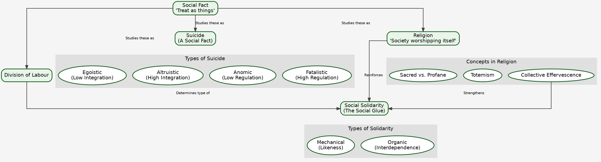

---

### **C. Supplementary Tables**

#### **Table 1: Durkheim vs. Other Thinkers (Comparative Analysis)**

| Feature | **Emile Durkheim** | **Karl Marx** | **Max Weber** |
| :--- | :--- | :--- | :--- |
| **Problem of Modernity** | **Anomie** (Normlessness). How to maintain moral integration? | **Alienation** & **Exploitation**. How to overcome class conflict? | **Disenchantment** & **Iron Cage**. How to escape excessive rationality? |
| **View of Individual** | Individual is a product of society. Constrained by social facts. | Individual's consciousness is shaped by their class position. | Individual is an actor who attaches **meaning** to their actions. (Social Action). |
| **Role of Religion** | **Integrative**. Source of social solidarity. Society worshipping itself. | **Oppressive**. "Opium of the masses." Part of the ideological superstructure. | **Transformative**. Can be a force for social change (e.g., Protestant Ethic). |
| **Methodology** | **Positivist**. Macro-level comparative analysis of social facts. | **Historical Materialism**. Macro-level analysis of economic history. | **Interpretive (Verstehen)**. Understanding subjective meanings. Use of **Ideal Types**. |

#### **Table 2: PYQ Answer Templates (Intro & Conclu - Short Format)**

**Theme 1: Social Fact**

*   **Question Type:** "What are social facts? Discuss with examples."
*   **Short Intro:** Emile Durkheim defined sociology as the study of 'social facts'—external and coercive social forces. He advocated for treating them as 'things' to establish a scientific, positivist sociology.
*   **Short Conclu:** Thus, the concept of social fact was foundational to Durkheim's project. While critiqued for its determinism, it remains a vital tool for analyzing macro-level structures like law and caste.

**Theme 2: Suicide**

*   **Question Type:** "Explain how Durkheim established suicide as a social phenomenon."
*   **Short Intro:** In his classic study 'Suicide', Durkheim demonstrated that suicide is a social fact, not merely a psychological act, determined by levels of social integration and regulation in society.
*   **Short Conclu:** Durkheim's theory remains a powerful sociological explanation for variations in suicide rates. It is applicable today to phenomena like farmer suicides, highlighting social forces behind individual distress.

**Theme 3: Religion**

*   **Question Type:** "According to Durkheim, the essence of religion is the same in modern and primitive societies. Comment."
*   **Short Intro:** Durkheim, in 'The Elementary Forms of Religious Life', argued that religion's core function is creating social solidarity by distinguishing the sacred from the profane. This function persists universally.
*   **Short Conclu:** Hence, for Durkheim, society worships itself through religion. This function of reinforcing collective identity remains relevant, whether through traditional rituals or modern secular ceremonies like national holidays.

---

### **A. Core Mindmap: Max Weber (1864-1920)**

## Max Weber (1864-1920)

### 1. Methodology
- **Core Focus:** Sociology as an interpretive science of **Social Action**.
- **Social Action:** Action to which individuals attach **subjective meaning**. Behaviour is reactive; action is meaningful.
    - **Four Types (Ideal Types):**
        1.  **Zweckrational (Instrumental-Rational):** Action driven by calculated efficiency to achieve a goal. (e.g., Engineer building a bridge).
        2.  **Wertrational (Value-Rational):** Action driven by a belief in an intrinsic value (ethical, religious), irrespective of success. (e.g., A captain going down with the ship).
        3.  **Affectual Action:** Driven by emotions and feelings. (e.g., Crying at a funeral).
        4.  **Traditional Action:** Driven by habit, custom, routine. (e.g., Touching elders' feet).
- **Verstehen (Interpretive Understanding):** The method to grasp the subjective meaning behind actions.
    - **Two Levels:**
        - **Aktuelles Verstehen:** Direct observational understanding.
        - **Erklärendes Verstehen:** Explanatory understanding of motives.
- **Ideal Type:** The main methodological tool.
    - **Definition:** An analytical construct, a "one-sided accentuation" of reality, a "measuring rod."
    - **It is NOT:** Morally ideal, statistically average, or a perfect representation.
    - **Examples:** Bureaucracy, the three types of authority.
- **Objectivity & Value-Neutrality:**
    - **Value-Relevance:** Values influence topic choice.
    - **Value-Neutrality:** Values must NOT distort the research process itself.

### 2. The Protestant Ethic and the Spirit of Capitalism (PESC)
- **Core Thesis:** A challenge to Marx's Historical Materialism. Argues that **ideas (religion) can influence the economy**.
- **The Puzzle:** Why did modern, rational capitalism emerge uniquely in the West?
- **The "Spirit" of Capitalism:** Not just greed, but a moral duty to pursue profit rationally and systematically. "Time is money."
- **The "Protestant Ethic" (specifically Calvinism):**
    - **Predestination:** Salvation is pre-decided by God. Created immense "salvation anxiety."
    - **The Calling (Beruf):** Worldly work seen as a duty to God.
    - **Asceticism:** Rejection of worldly pleasures.
- **The Link (Elective Affinity):**
    - Success in one's calling was seen as a *sign* (not a cause) of being chosen for salvation.
    - This drove believers to work hard rationally (the calling) and not spend the profits on luxury (asceticism).
    - Result: **Systematic accumulation of capital for reinvestment.**
- **Quote:** "The Puritan wanted to work in a calling; we are forced to do so."

### 3. Bureaucracy & Rationalization
- **Rationalization:** The master process of modernity. Shift from tradition/emotion to efficiency/calculation.
- **Bureaucracy:** The purest form of rational-legal authority. The most efficient organizational form.
- **Ideal Type Characteristics:**
    - Hierarchy of authority.
    - Impersonality (rules, not rulers).
    - Written rules and regulations.
    - Specialized division of labour.
    - Career structure based on merit.
- **The "Iron Cage" (das stahlharte Gehäuse):**
    - The dark side of rationality.
    - Bureaucracy traps individuals in a system that stifles creativity, spontaneity, and human spirit.
    - Leads to **Disenchantment of the World.**

### 4. Authority (Legitimate Domination)
- **Definition:** Power that is considered legitimate by those who are subject to it.
- **Three Ideal Types:**
    1.  **Traditional Authority:** Legitimacy from custom, tradition. "It has always been this way." (e.g., Patriarchy, Monarchy).
    2.  **Charismatic Authority:** Legitimacy from the leader's exceptional personal qualities. Inherently unstable; must be "routinized." (e.g., Gandhi, Hitler, many religious gurus).
    3.  **Rational-Legal Authority:** Legitimacy from a belief in the legality of rules and procedures. The dominant form in modern states. (e.g., A Prime Minister, a CEO).

### 5. Stratification: Class, Status, and Party
- **Core Idea:** A multidimensional critique of Marx's focus on class.
- **Class:** Economic dimension. A group sharing a similar **market situation**.
- **Status (Stände):** Social dimension. Based on **social honour and prestige**, expressed through a common **lifestyle**. (e.g., Brahmins in the caste system).
- **Party:** Political dimension. Groups formed for the pursuit of **power** and influencing collective action.
- **Paper 2 Link:** This framework is essential for India. **Caste is a classic example of a 'status group'**. While class and caste overlap, they are analytically distinct (e.g., a poor Brahmin has high status but low class).

### **B. Visual Mindmap: The Logic of Weber (Graphviz Code)**

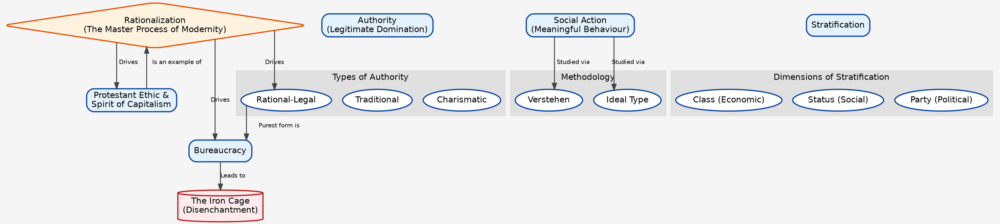

---

### **C. Supplementary Tables**

#### **Table 1: Weber's Key Concepts & Indian Examples**

| Weberian Concept | Definition | Contemporary Indian Example |
| :--- | :--- | :--- |
| **Zweckrational Action** | Action calculated for maximum efficiency. | A student choosing an optional subject based purely on scoring trends and syllabus length. |
| **Wertrational Action** | Action based on intrinsic values. | Anna Hazare's anti-corruption fasts, driven by a belief in ethical governance. |
| **Charismatic Authority** | Authority based on a leader's personality. | The political appeal of leaders like Narendra Modi or Arvind Kejriwal; the following of spiritual gurus. |
| **Bureaucracy** | Rational, rule-based organization. | The Indian Administrative Service (IAS), with its hierarchy, written exams (merit), and procedures. |
| **Status Group** | A community based on social honour/prestige. | **Caste groups**, especially the concept of ritual purity/pollution defining social honour. |
| **The Iron Cage** | Trapped by excessive rationality/rules. | The feeling of being stuck in procedural delays ("red tape") in government offices, stifling initiative. |

#### **Table 2: PYQ Answer Templates (Intro & Conclu - Short Format)**

**Theme 1: Bureaucracy**

*   **Question Type:** "Bureaucracy is the iron cage of modern society. Discuss."
*   **Short Intro:** Max Weber's ideal type of bureaucracy represents the pinnacle of rational efficiency. However, he warned it could trap humanity in an "iron cage," stifling freedom and spirit.
*   **Short Conclu:** Thus, Weber presents a dual-edged view of bureaucracy. While essential for modern administration, its potential for dehumanization remains a central challenge for contemporary societies, including India's.

**Theme 2: Protestant Ethic**

*   **Question Type:** "Explain Weber's thesis on the Protestant Ethic and the Spirit of Capitalism."
*   **Short Intro:** In his seminal work, Weber argued against economic determinism, proposing that the Calvinist ethic, with its values of asceticism and calling, fostered the "spirit" necessary for modern capitalism's rise.
*   **Short Conclu:** Weber's thesis highlights the "elective affinity" between ideas and economic structures. While historically debated, its core insight—that culture matters in economic development—remains profoundly influential.

**Theme 3: Class, Status, and Party**

*   **Question Type:** "How is Weber's theory of stratification different from Marx's?"
*   **Short Intro:** Unlike Marx's unidimensional focus on class, Max Weber proposed a multidimensional model of stratification, comprising class (economic), status (social honour), and party (political power).
*   **Short Conclu:** Weber's framework provides a more nuanced tool for social analysis, proving especially crucial in contexts like India where caste, as a status group, operates alongside economic class.

This completes the foundational trinity of Marx, Durkheim, and Weber. We now have a solid, comparative base to tackle a significant portion of the syllabus.

Where would you like to go next? Some logical options are:
1.  **The other thinkers (Parsons, Merton, Mead).**
2.  **Topic 2: Sociology as Science (Positivism debate).**
3.  **Topic 5: Stratification and Mobility.**

---
---

### **Part 1: Talcott Parsons (1902-1979) - The Grand Theorist**

#### **A. Core Mindmap: Talcott Parsons (Markdown)**

## Talcott Parsons (1902-1979)

### 1. Social System
- **Core Idea:** Society is a system of interconnected parts, tending towards equilibrium.
- **System Levels (Hierarchy of Conditioning):**
    - **Cultural System:** Highest level of control (values, norms).
    - **Social System:** Integration of acting units.
    - **Personality System:** Individual actor's motivations.
    - **Behavioural Organism:** The biological being.
- **Unit of Analysis: The Social Action**
    - Builds on Weber, but systematizes it.
    - **Actor** is motivated, has **goals**, a **situation** (means, conditions), and is guided by **norms & values**.

### 2. The AGIL Paradigm (Functional Prerequisites)
- **Core Question:** What functions must *any* social system perform to survive?
- **The Four Functions:**
    1.  **Adaptation (A):** Adapting to the environment. Acquiring resources.
        - **Subsystem:** The Economy.
    2.  **Goal Attainment (G):** Defining and achieving collective goals.
        - **Subsystem:** The Polity (Government).
    3.  **Integration (I):** Regulating the interrelationship of the system's parts. Maintaining cohesion.
        - **Subsystem:** The Societal Community (Law, Religion).
    4.  **Latency (L) / Pattern Maintenance:** Furnishing, maintaining, and renewing individual motivation and cultural patterns.
        - **Subsystem:** Fiduciary System (Family, School).
- **Example (University as a Social System):**
    - **A:** Securing funding, building infrastructure.
    - **G:** Setting academic goals, conducting research.
    - **I:** University rules, codes of conduct, integrating various departments.
    - **L:** Socializing students into academic culture, maintaining educational standards.

### 3. Pattern Variables
- **Core Idea:** A set of five dichotomies of choice an actor must make in any situation. Characterizes the shift from traditional to modern societies.
- **The Five Choices (Traditional vs. Modern):**
    1.  **Affectivity vs. Affective Neutrality:** (Emotion vs. Restraint)
        - *Traditional:* Family relations (affective).
        - *Modern:* Doctor-patient relation (affectively neutral).
    2.  **Diffuseness vs. Specificity:** (Broad, undefined relation vs. narrow, defined relation)
        - *Traditional:* Landlord-tenant relation (diffuse).
        - *Modern:* Bureaucrat-client relation (specific).
    3.  **Particularism vs. Universalism:** (Treating people based on who they are vs. based on general rules)
        - *Traditional:* Nepotism (particularistic).
        - *Modern:* Civil service exams (universalistic).
    4.  **Ascription vs. Achievement:** (Judging based on birth/attributes vs. based on performance)
        - *Traditional:* Caste (ascription).
        - *Modern:* Job promotion (achievement).
    5.  **Collectivity-Orientation vs. Self-Orientation:** (Prioritizing group interests vs. individual interests)
        - *Traditional:* Soldier's duty (collectivity).
        - *Modern:* Businessman's profit motive (self).

### 4. Critique & Relevance
- **Critique:**
    - **Grand Theory:** Too abstract, difficult to test empirically (C. Wright Mills).
    - **Functionalist Bias:** Over-emphasis on harmony, order, consensus.
    - **Neglect of Social Change:** Seen as a "static" theory. (Though he did write on social evolution).
    - **Teleological:** Assumes system needs determine social phenomena.
- **Relevance:**
    - AGIL provides a comprehensive checklist for analyzing any social institution.
    - Pattern Variables are a classic tool for characterizing modernity.

---

### **Part 2: Robert K. Merton (1910-2003) - The Middle-Range Theorist**

#### **A. Core Mindmap: R.K. Merton (Markdown)**

## Robert K. Merton (1910-2003)

### 1. Middle-Range Theory
- **Core Idea:** A critique of Parsons' "grand theory." Sociology should focus on limited, testable theories that bridge the gap between raw empiricism and abstract theory.
- **Example:** Theory of Reference Groups, Theory of Anomie.

### 2. Critique of Functionalism
- **Refining Functionalism:** Moves away from "crude" functionalism.
- **Three Postulates Critiqued:**
    1.  **Functional Unity:** Rejects the idea that all parts of a society are tightly integrated.
    2.  **Universal Functionalism:** Rejects the idea that all social forms have positive functions.
    3.  **Indispensability:** Rejects the idea that certain functions are indispensable or can only be fulfilled by one institution.
- **Key Concepts for Analysis:**
    - **Functions:** Observed consequences that help a system adapt or adjust.
    - **Dysfunctions:** Observed consequences that lessen adaptation or adjustment. (e.g., Bureaucracy's dysfunction is red tape).
    - **Manifest Functions:** Intended and recognized consequences. (e.g., Rain dance to bring rain).
    - **Latent Functions:** Unintended and unrecognized consequences. (e.g., Rain dance also promotes group solidarity).
    - **Latent Dysfunctions:** Unintended negative consequences.
    - **Functional Alternatives:** Different institutions can fulfill the same function.

### 3. Anomie / Strain Theory (Deviance)
- **Core Idea:** Deviance results from a "strain" between culturally prescribed goals and the socially structured means to achieve them.
- **Focus:** American society's emphasis on monetary success (**Cultural Goal**) without providing legitimate means for all (**Institutional Means**).
- **Five Modes of Adaptation (Typology of Deviance):**
    | Mode | Cultural Goals | Institutional Means | Example |
    | :--- | :--- | :--- | :--- |
    | **1. Conformity** | + | + | The "normal" citizen. |
    | **2. Innovation** | + | - | Criminals, cheats. |
    - **3. Ritualism** | - | + | Bureaucrat who blindly follows rules. |
    | **4. Retreatism** | - | - | Drug addicts, vagrants. |
    | **5. Rebellion** | +/- | +/- | Revolutionaries, terrorists. |
- **Paper 2 Link:** Explaining corruption or crime in India as a form of "innovation" to achieve success goals.

### 4. Reference Group Theory
- **Core Idea:** People evaluate their own situation and conduct by comparing themselves to others.
- **Reference Group:** The group to which an individual relates or aspires to relate.
- **Key Concepts:**
    - **Anticipatory Socialization:** Adopting the norms/values of a group one wishes to join.
    - **Relative Deprivation:** Feeling deprived not in absolute terms, but relative to one's reference group.
- **Paper 2 Link:** M.N. Srinivas's concept of **Sanskritization** is a classic example of reference group behaviour, where lower castes adopt the rituals and practices of upper castes.

---

### **Part 3: George Herbert Mead (1863-1931) - The Social Psychologist**

#### **A. Core Mindmap: G.H. Mead (Markdown)**

## George Herbert Mead (1863-1931)

### 1. Symbolic Interactionism (SI)
- **Core Idea:** Society is created and maintained through the meaningful interactions (communication) of individuals. A micro-level perspective.
- **Key Principles (by Blumer):**
    1.  Humans act towards things based on the **meanings** they have for them.
    2.  Meaning arises from **social interaction**.
    3.  Meanings are handled and modified through an **interpretive process**.

### 2. The Self
- **Core Idea:** The Self is not a biological given; it is a **social product**. It emerges through social experience.
- **"I" and "Me" - The Two Phases of the Self:**
    - **The "Me":** The socialized self. The organized set of attitudes of others which one assumes. It represents social control. (The "generalized other").
    - **The "I":** The impulsive, spontaneous, creative response of the individual to the "Me." It is the source of novelty and change.
    - **The Self emerges from the dialogue between the "I" and the "Me".**
- **Quote:** "The self is something which has a development; it is not initially there, at birth, but arises in the process of social experience and activity."

### 3. Development of the Self (Stages)
- **Mechanism:** Role-taking (putting oneself in another's shoes).
1.  **Preparatory Stage (Imitation):** Infants imitate others without understanding.
2.  **Play Stage:** Child takes the role of **one other person at a time** (e.g., playing "mommy" or "doctor"). The "significant other."
3.  **Game Stage:** Child learns to take the role of **many others simultaneously**. Understands the organized rules of the game. (e.g., a baseball player).
- **The "Generalized Other":**
    - The final stage where the individual internalizes the attitudes and expectations of the entire community or social group.
    - This is how social control becomes self-control.

### 4. Mind & Symbols
- **Mind:** Not a physical thing, but a process of internal conversation with oneself using significant symbols.
- **Significant Symbols:** Gestures (especially language) that arouse the same meaning in the person making them as they do in the person they are addressed to. The basis of all social interaction.

### 5. Critique & Relevance
- **Critique:**
    - Neglects macro-level structures (class, state).
    - Ignores conflict and power.
    - Concepts like "I" and "Me" are vague and difficult to operationalize.
- **Relevance:**
    - Foundation for many micro-sociological theories.
    - Crucial for understanding socialization, identity formation.
    - **Contemporary Link:** Analyzing how the "self" is constructed and presented on social media platforms.

---

### **Visual Mindmaps (Graphviz Code)**

#### **Parsons & Merton (Functionalism)**

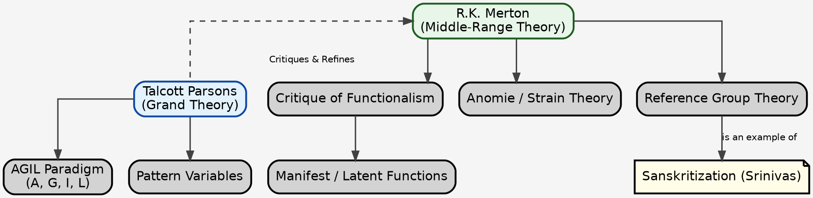

#### **G.H. Mead (Symbolic Interactionism)**

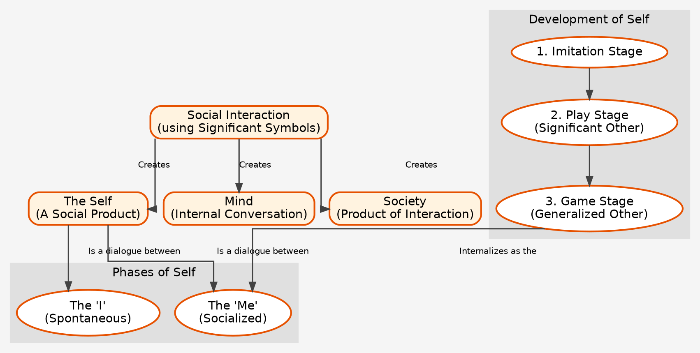

This is a foundational topic that explores the very nature of the discipline. The central debate is whether sociology can and should be a 'science' like the natural sciences. This topic directly builds on the methodological differences we saw among the thinkers.

I will structure this to cover the entire syllabus section: (a) Science, scientific method and critique; (b) Major theoretical strands of research methodology; (c) Positivism and its critique; (d) Fact value and objectivity; and (e) Non-positivist methodologies.

---

### **A. Core Mindmap: Sociology as Science (Markdown)**

## Topic 2: Sociology as Science

### 1. The Core Debate: Can Sociology be a Science?
- **Science Definition:** A body of knowledge obtained via systematic observation/experimentation, aimed at discovering universal laws.
- **Key Elements of Scientific Method:** Objectivity, Empiricism, Testability, Predictability, Universality.
- **Two Main Camps:**
    - **YES (Positivists):** Sociology should emulate natural sciences. (Comte, Durkheim, Spencer).
    - **NO (Non-Positivists/Interpretivists):** Social reality is fundamentally different from natural reality. (Weber, Mead, Phenomenologists).

### 2. Positivism & Its Critique
- **Positivism (The 'YES' Camp):**
    - **Founder:** Auguste Comte.
    - **Core Beliefs:**
        - Social phenomena are observable, measurable "facts."
        - Aims to find **social laws** (e.g., Durkheim's laws of suicide).
        - Prefers **quantitative methods** (surveys, statistics, experiments).
        - Society can be studied with **objectivity** and value-neutrality.
        - **Durkheim's "Social Facts":** The epitome of the positivist approach. "Treat social facts as things."
- **Critique of Positivism (The 'NO' Camp):**
    - **Problem of Subjectivity:** Humans have consciousness, attach meaning. They are not like rocks or atoms.
    - **Problem of Objectivity:** The sociologist is part of the society they study. Complete value-neutrality is impossible.
    - **Problem of Empiricism:** Many social phenomena are not directly observable (e.g., social structures, norms, power).
    - **Ethical/Political Issues:** Using science to control society can be dangerous (e.g., "social engineering").
    - **Hawthorne Effect:** People change their behaviour when they know they are being observed.

### 3. Fact, Value, and Objectivity
- **Fact:** An empirically verifiable observation.
- **Value:** A belief about what is good, right, or desirable.
- **Objectivity:** The goal of eliminating personal biases and values from research to see reality as it is.
- **The Debate:**
    - **Durkheim (Positivist):** Objectivity is possible and necessary. Values must be kept out.
    - **Marx (Critical):** Sociology cannot be value-free. It should be driven by the value of emancipation and critique of exploitation.
    - **Weber (Middle Path):**
        - **Value-Relevance:** Values are crucial for selecting a research topic.
        - **Value-Neutrality:** Once the topic is chosen, the research itself must be conducted objectively, without bias.
        - Acknowledges that absolute objectivity is an "ideal type."
    - **Myrdal's View:** Values are always present. The only solution is to be explicit about one's own values ("value frankness").

### 4. Non-Positivist Methodologies
- **Core Idea:** The goal is not to find universal laws, but to understand subjective meanings, experiences, and social constructions of reality.
- **Key Strands:**
    - **1. Interpretivism (Max Weber):**
        - **Method:** *Verstehen* (empathetic understanding).
        - **Goal:** To understand the subjective meanings behind social action.
        - **Tool:** Ideal Types.
    - **2. Symbolic Interactionism (G.H. Mead, Blumer):**
        - **Focus:** Micro-level interactions, symbols, and the construction of self.
        - **Methods:** Participant observation, in-depth interviews.
    - **3. Phenomenology (Alfred Schutz):**
        - **Focus:** How individuals experience and make sense of their everyday world (the "life-world").
        - **Core Concept:** "Typifications" - stocks of common-sense knowledge we use to navigate reality.
    - **4. Ethnomethodology (Harold Garfinkel):**
        - **Focus:** The methods people use to produce and sustain a sense of social order in everyday life.
        - **Method:** "Breaching experiments" - deliberately breaking social norms to reveal the taken-for-granted assumptions that hold society together.
- **Preference for Qualitative Methods:** In-depth interviews, participant observation, ethnography, case studies.

### 5. Research Methods & Designs
- **Major Theoretical Strands:**
    - **Positivist:** Quantitative, deductive (theory -> hypothesis -> data).
    - **Interpretivist:** Qualitative, inductive (data -> patterns -> theory).
- **Research Designs:**
    - **Explanatory:** Aims to explain cause-and-effect relationships (e.g., Durkheim's *Suicide*).
    - **Exploratory:** Investigates a topic with little prior research to generate initial ideas.
    - **Descriptive:** Aims to provide a detailed picture of a social phenomenon (e.g., a census).
- **Feminist Methodology:**
    - A critique of "malestream" sociology.
    - Argues that traditional research is patriarchal and objectifying.
    - Promotes qualitative, collaborative methods that empower research subjects (e.g., Ann Oakley's work on motherhood).

---

### **B. Visual Mindmap: The Great Methodological Divide (Graphviz Code)**

```dot
digraph Sociology_as_Science {
    // Graph Attributes
    graph [rankdir="TB", splines=ortho, bgcolor="#f5f5f5", fontname="Helvetica"];
    node [shape=box, style="rounded,filled", fontname="Helvetica", penwidth=2];
    edge [fontname="Helvetica", fontsize=10, color="#424242", penwidth=1.5];

    // Main Question
    MainQ [label="Can Sociology be a Science?", shape=diamond, fillcolor="#fffde7", color="#f57f17"];

    // Two Camps
    Positivism [label="YES: Positivism", fillcolor="#e3f2fd", color="#0d47a1"];
    NonPositivism [label="NO: Non-Positivism / Interpretivism", fillcolor="#e8f5e9", color="#1b5e20"];
    
    MainQ -> {Positivism, NonPositivism};

    // Positivist Details
    subgraph cluster_pos {
        label = "Positivist Camp";
        style=filled;
        color="#e0e0e0";
        node [shape=ellipse, fillcolor=white];
        P_Thinkers [label="Thinkers:\nComte, Durkheim"];
        P_Goal [label="Goal:\nFind Social Laws"];
        P_Method [label="Method:\nQuantitative"];
        P_Reality [label="Reality:\nObjective, External Facts"];
    }

    // Non-Positivist Details
    subgraph cluster_nonpos {
        label = "Non-Positivist Camp";
        style=filled;
        color="#e0e0e0";
        node [shape=ellipse, fillcolor=white];
        NP_Thinkers [label="Thinkers:\nWeber, Mead, Schutz"];
        NP_Goal [label="Goal:\nUnderstand Subjective Meaning"];
        NP_Method [label="Method:\nQualitative, Verstehen"];
        NP_Reality [label="Reality:\nSocially Constructed"];
    }
    
    // Core Concepts linking the debate
    FactValue [label="Fact-Value Debate\n(Objectivity)", shape=cylinder, fillcolor="#fafafa"];
    
    // Relationships
    Positivism -> {P_Thinkers, P_Goal, P_Method, P_Reality} [style=invis];
    NonPositivism -> {NP_Thinkers, NP_Goal, NP_Method, NP_Reality} [style=invis];
    Positivism -> FactValue [label="Advocates for\nValue-Freedom"];
    NonPositivism -> FactValue [label="Questions\nValue-Freedom"];
    Weber [label="Weber's Middle Path\n(Value-Relevance + Value-Neutrality)", shape=note, fillcolor="#fff9c4"];
    FactValue -> Weber;
}
```

---

### **C. Supplementary Tables**

#### **Table 1: Quantitative vs. Qualitative Methods**

| Feature | **Quantitative Methods** | **Qualitative Methods** |
| :--- | :--- | :--- |
| **Associated with** | **Positivism** | **Interpretivism, Phenomenology** |
| **Aim** | To measure, test hypotheses, find causal relationships, generalize findings. | To explore, understand meanings, describe experiences, generate theory. |
| **Data Type** | Numerical data, statistics. | Textual data (interviews), images, observations. |
| **Common Techniques** | Surveys, Questionnaires, Structured Interviews, Experiments. | Participant Observation, In-depth Interviews, Focus Groups, Ethnography. |
| **Strengths** | High reliability, generalizability, objectivity. | High validity, depth of understanding, contextual detail. |
| **Weaknesses** | Lacks depth, can be superficial, ignores context and meaning. | Low reliability, difficult to generalize, risk of researcher bias. |

#### **Table 2: PYQ Answer Templates (Intro & Conclu - Short Format)**

**Theme 1: Positivism and its Critique**

*   **Question Type:** "Critically examine the positivist approach in sociological studies."
*   **Short Intro:** Positivism, pioneered by Comte and championed by Durkheim, asserts that sociology should adopt the methods of natural science to discover objective social laws, treating social facts as things.
*   **Short Conclu:** However, critics argue this ignores human subjectivity and meaning. Thus, while positivism gave sociology its scientific ambition, non-positivist approaches are essential for a complete understanding of social reality.

**Theme 2: Fact, Value, and Objectivity**

*   **Question Type:** "How is objectivity different from value neutrality? Discuss with reference to Weber."
*   **Short Intro:** Objectivity is the goal of unbiased research, while value-neutrality is the principle of keeping personal values out of the research process. Weber argued for a nuanced approach.
*   **Short Conclu:** Weber's distinction between value-relevance in topic selection and value-neutrality in execution remains a guiding principle, acknowledging the inevitability of values while striving for scientific rigour in sociology.

 We will now proceed to **Topic 3: Research Methods and Analysis**.

This topic is the practical "how-to" of sociology. It moves from the theoretical debates of "Sociology as Science" to the actual tools and procedures researchers use to study society. The questions from this section are often direct and require a clear understanding of specific techniques and concepts.

---

### **A. Core Mindmap: Research Methods and Analysis (Markdown)**

## Topic 3: Research Methods and Analysis

### 1. The Research Process & Core Concepts
- **Hypothesis:**
    - **Definition:** A specific, testable proposition about the relationship between variables.
    - **Source:** Derived from theory, previous research, or observation.
    - **Example:** "Higher levels of education (variable 1) lead to lower levels of caste prejudice (variable 2)."
- **Variables:**
    - **Definition:** A concept whose value changes from case to case (e.g., age, income, class).
    - **Types:**
        - **Independent Variable (IV):** The cause. The variable that is manipulated.
        - **Dependent Variable (DV):** The effect. The variable that is measured.
- **Reliability & Validity (Crucial Distinction):**
    - **Reliability:** Consistency. If the same study is repeated, will it produce the same results? (e.g., A weighing scale that consistently shows 2kg extra is reliable).
    - **Validity:** Accuracy. Does the study actually measure what it intends to measure? (e.g., The same weighing scale is not valid).
    - **The Trade-Off:** Quantitative methods often have high reliability but may lack validity. Qualitative methods often have high validity but may lack reliability.
    - **Triangulation:** Using multiple methods (e.g., survey + interviews) to increase both reliability and validity.

### 2. Sampling
- **Definition:** The process of selecting a representative subset of a population for study.
- **Two Main Types:**
    - **1. Probability (Random) Sampling:**
        - **Principle:** Every unit has a known, non-zero chance of being selected.
        - **Goal:** Generalizability. Findings can be applied to the whole population.
        - **Techniques:**
            - **Simple Random:** Drawing from a hat.
            - **Systematic:** Selecting every nth person from a list.
            - **Stratified:** Dividing population into strata (e.g., caste, gender) and sampling from each. Ensures representation.
            - **Cluster:** Dividing population into clusters (e.g., villages, schools) and sampling clusters.
    - **2. Non-Probability Sampling:**
        - **Principle:** Selection is not random; based on judgment or convenience.
        - **Goal:** Used when a sampling frame is unavailable or for exploratory research.
        - **Techniques:**
            - **Convenience:** Selecting whoever is easiest to reach.
            - **Purposive/Judgmental:** Selecting specific individuals who are experts or meet criteria.
            - **Snowball:** Asking initial participants to refer others. Useful for studying hidden populations (e.g., drug users, illegal migrants).
            - **Quota:** Pre-setting quotas for subgroups (e.g., 50 men, 50 women) and filling them non-randomly.

### 3. Data Collection: Methods & Techniques
- **(a) Quantitative Methods (Measuring 'how many'):**
    - **Survey / Questionnaire:** Standardized questions given to a large sample.
        - **Example:** National Family Health Survey (NFHS), Census of India.
    - **Structured Interview:** Verbally administered questionnaire with fixed questions.
- **(b) Qualitative Methods (Exploring 'why' and 'how'):**
    - **Participant Observation:** Researcher immerses themselves in the daily life of the group being studied.
        - **Quote:** "To grasp the native's point of view, his relation to life, to realise *his* vision of *his* world." - Bronisław Malinowski.
        - **Paper 2 Link:** M.N. Srinivas's study of Rampura village (*The Remembered Village*).
    - **Ethnography:** A rich, in-depth, holistic description of a culture or social group. The written product of participant observation.
        - **Contemporary:** Digital Ethnography (studying online communities).
    - **In-depth / Unstructured Interview:** A flexible, conversational interview to explore topics in detail.
    - **Focus Group Discussion (FGD):** A guided group discussion to gather collective views and observe group dynamics.
    - **Case Study:** Intensive, in-depth analysis of a single case (a person, event, or institution).
    - **Historical Method:** Using documents and historical records to understand social phenomena.
        - **Example:** Weber's use of historical texts in *PESC*. A.R. Desai's use of archives for *Social Background of Indian Nationalism*.
- **(c) Mixed Methods:** Combining quantitative and qualitative approaches for a more complete picture (Triangulation).

---

### **B. Visual Mindmap: The Sociological Research Toolkit (Graphviz Code)**

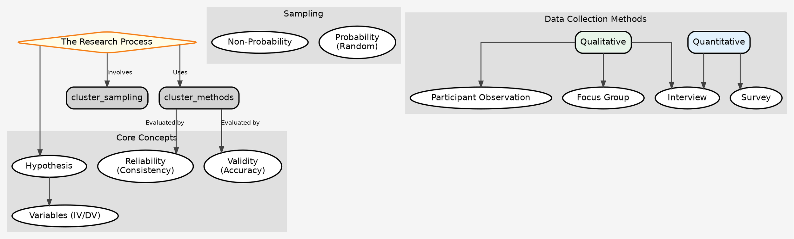

---

### **C. Supplementary Tables**

#### **Table 1: Strengths & Weaknesses of Key Data Collection Techniques**

| Technique | Strengths | Weaknesses | Best For |
| :--- | :--- | :--- | :--- |
| **Survey / Questionnaire** | High reliability, generalizable (if sampled well), low cost, quick data collection. | Low validity (can be superficial), inflexible, low response rates. | Studying large populations, finding broad patterns. |
| **Participant Observation** | High validity (deep insight), captures context, flexible. | Low reliability, not generalizable, time-consuming, risk of researcher bias ("going native"). | In-depth study of small groups, cultures, subcultures. |
| **In-depth Interview** | High validity, provides rich detail, flexible. | Low reliability, not generalizable, time-consuming, interviewer bias can affect responses. | Exploring personal experiences, sensitive topics. |

#### **Table 2: PYQ Answer Templates (Intro & Conclu - Short Format)**

**Theme 1: Reliability vs. Validity**

*   **Question Type:** "Distinguish between reliability and validity in social research."
*   **Short Intro:** Reliability refers to the consistency of a measure, while validity refers to its accuracy. In social research, these two crucial principles are often in a trade-off.
*   **Short Conclu:** Ultimately, robust research strives for both. Methodological pluralism and triangulation are key strategies to balance the quantitative quest for reliability with the qualitative pursuit of validity.

**Theme 2: Participant Observation**

*   **Question Type:** "Discuss participant observation as a method of collecting data. What are its limitations?"
*   **Short Intro:** Participant observation is a qualitative method where the researcher immerses in a community to gain a deep, first-hand understanding. It is central to the ethnographic tradition in sociology and anthropology.
*   **Short Conclu:** Despite its unparalleled validity, it faces challenges of researcher bias and lack of generalizability. Its strength lies in generating rich, contextualized data that other methods miss.

---
---

### **A. Core Mindmap: Stratification and Mobility (Markdown)**

## Topic 5: Stratification and Mobility

### 1. Core Concepts
- **Social Stratification:**
    - **Definition:** A system by which a society ranks categories of people in a hierarchy. It is a characteristic of society, not simply a reflection of individual differences.
    - **Quote:** "Social stratification is the division of society into a hierarchy of relatively stable, unequal groups." - Gisbert.
- **Key Concepts:**
    - **Inequality:** Unequal distribution of valued resources (wealth, power, prestige).
    - **Hierarchy:** The ranking of social positions.
    - **Exclusion:** The process of shutting out groups from social, economic, and political life. (e.g., Dalits excluded from temples).
    - **Poverty:**
        - **Absolute Poverty:** Lack of basic necessities for survival.
        - **Relative Poverty:** Deprivation in relation to the living standards of the majority.
    - **Deprivation:** The state of lacking resources or opportunities that are available to the wider society.

### 2. Theories of Social Stratification
- **(a) Structural Functionalist Theory (Davis & Moore):**
    - **Core Idea:** Stratification is a functional necessity for all societies.
    - **Argument:**
        1.  Some positions are more functionally important than others.
        2.  Limited number of people have the talent for these positions.
        3.  Training for these positions requires sacrifice.
        4.  Therefore, society must offer unequal rewards (wealth, prestige) to motivate the best people to fill the most important roles.
    - **Critique (Melvin Tumin):**
        - How to measure "functional importance"? (A sanitation worker is very important).
        - It neglects the role of power in determining rewards.
        - It justifies the status quo and ignores dysfunctions of inequality.
- **(b) Marxist Theory (Conflict Perspective):**
    - **Core Idea:** Stratification is a system of exploitation, not a functional necessity.
    - **Argument:**
        - Based on the relationship to the means of production (Bourgeoisie vs. Proletariat).
        - The dominant class uses its economic power to control the superstructure (state, ideology) to maintain its position.
        - Stratification is a source of conflict that will ultimately lead to its own destruction.
- **(c) Weberian Theory (Multidimensional Perspective):**
    - **Core Idea:** Stratification is not just about class; it's multidimensional.
    - **Three Dimensions (Class, Status, Party):**
        1.  **Class:** Economic order. Based on market situation. A collection of individuals.
        2.  **Status:** Social order. Based on social honour/prestige and lifestyle. A community.
        3.  **Party:** Political order. Based on the pursuit of power.
    - **Significance:** Provides a more nuanced view than Marx. Crucial for understanding non-economic forms of inequality like caste.

### 3. Dimensions of Stratification
- **(a) Class:**
    - **Marxist View:** Objective, based on ownership of means of production.
    - **Weberian View:** Based on market situation and life chances.
    - **Contemporary View (Bourdieu):** Includes **Cultural Capital** (knowledge, skills) and **Social Capital** (networks).
- **(b) Status Groups:**
    - **Weber's Concept:** Based on social honour.
    - **Paper 2 Link:** **Caste** is the quintessential status group. Its hierarchy is based on ritual purity/pollution, not just wealth.
- **(c) Gender:**
    - **Definition:** Socially constructed roles, behaviours, and attributes that a society considers appropriate for men and women.
    - **Patriarchy:** A social system where men hold primary power and predominate in roles of political leadership, moral authority, and control of property.
    - **Feminist View (Sylvia Walby):** Patriarchy operates in multiple structures (household, employment, state, culture).
- **(d) Race & Ethnicity:**
    - **Race:** A social construct based on perceived physical differences.
    - **Ethnicity:** A group identity based on shared culture, language, or national origin.
    - **Paper 2 Link:** Tribal groups in India are often defined as ethnic communities. Ethno-nationalism in the North-East.
- **Intersectionality (Kimberlé Crenshaw):**
    - The interconnected nature of social categorizations like race, class, and gender, creating overlapping and interdependent systems of discrimination or disadvantage.
    - **Example:** The experience of a Dalit woman is not just her caste experience + her gender experience; it is a unique experience of oppression.

### 4. Social Mobility
- **Definition:** The movement of individuals or groups between different positions in a social hierarchy.
- **Types of Systems:**
    - **Closed System:** Mobility is not possible. Status is ascribed. (e.g., Traditional caste system).
    - **Open System:** Mobility is possible. Status is achieved. (e.g., Modern class system).
- **Types of Mobility:**
    - **Vertical:** Movement up or down the hierarchy.
    - **Horizontal:** Movement from one position to another at the same level.
    - **Inter-generational:** Change in social position between generations (e.g., a farmer's son becomes a doctor).
    - **Intra-generational:** Change in social position within an individual's own lifetime.
- **Sources & Causes of Mobility:**
    - **Structural Factors:** Changes in the occupational structure (e.g., growth of IT sector).
    - **Individual Factors:** Education, skills, ambition.
    - **Paper 2 Link:** Education is seen as a key driver of social mobility in modern India, but access is still shaped by caste and class. M.N. Srinivas's **Sanskritization** is a form of group mobility within the caste system.

---

### **B. Visual Mindmap: The Landscape of Inequality (Graphviz Code)**

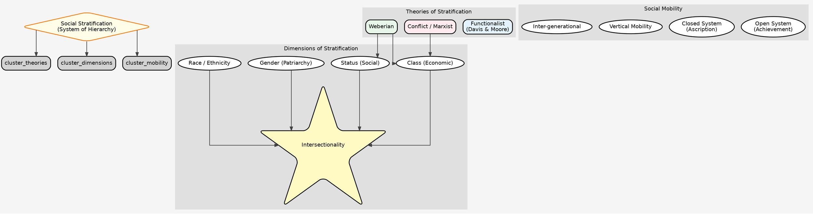

---

### **C. Supplementary Tables**

#### **Table 1: Comparing the Three Main Theories of Stratification**

| Feature | **Functionalism (Davis & Moore)** | **Marxism** | **Weberianism** |
| :--- | :--- | :--- | :--- |
| **Nature of Stratification** | Necessary, beneficial, functional. | Exploitative, divisive, dysfunctional. | Inevitable, multidimensional. |
| **Basis of Hierarchy** | Functional importance of roles. | Relationship to means of production. | Class (market), Status (honour), Party (power). |
| **Social Order** | Based on value consensus. | Based on coercion and ideology. | Based on legitimate authority. |
| **Inevitability** | Inequality is inevitable and necessary. | Inequality is not inevitable; can be overcome by revolution. | Inequality is inevitable, but its form can change. |

#### **Table 2: PYQ Answer Templates (Intro & Conclu - Short Format)**

**Theme 1: Functionalist Theory of Stratification**

*   **Question Type:** "Critically evaluate the functionalist theory of social stratification."
*   **Short Intro:** The Davis-Moore thesis posits that social stratification is a functional necessity, ensuring that the most important roles in society are filled by the most qualified individuals through unequal rewards.
*   **Short Conclu:** Critiqued by Tumin for ignoring power and dysfunctions, the theory is often seen as a justification for inequality. Yet, it highlights the universal need for role allocation in society.

**Theme 2: Dimensions of Stratification (Gender/Caste/Class)**

*   **Question Type:** "Why is gender a dimension of social stratification?"
*   **Short Intro:** Gender, as a social construct, is a key dimension of stratification through the system of patriarchy, which unequally distributes power, resources, and prestige between men and women.
*   **Short Conclu:** As feminist scholars argue, gender intersects with other hierarchies like caste and class, creating complex systems of oppression that cannot be reduced to economic factors alone.

**Theme 3: Social Mobility**

*   **Question Type:** "Discuss social mobility in open and closed systems."
*   **Short Intro:** Social mobility, the movement within a social hierarchy, is heavily influenced by whether a system is open (permitting mobility) or closed (restricting it).
*   **Short Conclu:** While modern societies are 'open' class systems, factors like caste and inherited wealth show that ascriptive elements persist, making the ideal of equal opportunity a continuing struggle.

This completes the unit on Stratification and Mobility. This is a very large and crucial topic.

The next logical steps could be:
1.  **Topic 6: Works and Economic Life** (which builds directly on Marx and Weber's ideas about capitalism).
2.  **Topic 9: Systems of Kinship** (covering family, marriage, etc.).
3.  Begin **Paper 2** with **Topic 1: Perspectives on the Study of Indian Society (Ghurye, Srinivas, Desai)**, as we now have the theoretical base to understand them.

---
---

### **A. Core Mindmap: Works and Economic Life (Markdown)**

## Topic 6: Works and Economic Life

### 1. Social Organization of Work (Historical Perspective)
- **(a) Slave Society:**
    - **Core Relation:** Master vs. Slave.
    - **Nature of Work:** Forced, coercive labour. Slaves are property (chattel).
    - **Marxist View:** Extreme alienation; workers do not even own their own labour power.
- **(b) Feudal Society:**
    - **Core Relation:** Lord vs. Serf.
    - **Nature of Work:** Serfs are tied to the land, owe labour/produce to the lord in exchange for protection. Not property, but unfree.
    - **Key Feature:** Obligation based on tradition and personal fealty.
- **(c) Industrial Capitalist Society:**
    - **Core Relation:** Bourgeoisie (Capitalist) vs. Proletariat (Worker).
    - **Nature of Work:** "Free" wage labour. Workers are free to sell their labour power in the market.
    - **Key Features (Marx):**
        - **Alienation:** From product, process, self, others.
        - **Exploitation:** Through extraction of surplus value.
    - **Key Features (Weber):**
        - **Rationalization:** Work is organized for maximum efficiency.
        - **Bureaucracy:** The dominant organizational form.
    - **Taylorism (Scientific Management):**
        - **F.W. Taylor's Principle:** De-skilling work by breaking it down into simple, repetitive tasks. "One best way."
        - **Goal:** Maximum efficiency and management control.
        - **Critique:** Extreme form of alienation and dehumanization.
    - **Fordism:**
        - **Henry Ford's Innovation:** Application of Taylorism to the assembly line.
        - **Key Addition:** Linking mass production with mass consumption (paying workers enough to buy the products).

### 2. Formal and Informal Organization of Work
- **(a) Formal Sector:**
    - **Definition:** The part of the economy that is regulated, taxed, and monitored by the state.
    - **Characteristics:** Formal contracts, regular wages, social security benefits (pension, health insurance), fixed working hours.
    - **Examples:** Government jobs, large corporations (TCS, Reliance).
- **(b) Informal (Unorganized) Sector:**
    - **Definition:** Work that is not regulated or protected by the state.
    - **Characteristics:** No formal contracts, irregular wages, no social security, poor working conditions, easy entry/exit.
    - **Paper 2 Link (India):** The vast majority of India's workforce is in the informal sector (~90%).
    - **Examples:** Street vendors, domestic workers, construction labourers, small shop owners.
- **Informalisation of Labour:**
    - **Definition:** The process where formal sector jobs increasingly take on informal characteristics (e.g., contract work, outsourcing, gig economy).
    - **Causes:** Globalization, neo-liberal policies, desire for labour flexibility by companies.
    - **Consequence:** Increased precarity and insecurity for workers.

### 3. Labour and Society
- **(a) The Gig Economy:**
    - **Definition:** A labour market characterized by short-term contracts or freelance work, often mediated by digital platforms.
    - **Examples:** Uber, Zomato, Swiggy, Urban Company.
    - **Sociological Analysis:**
        - **Promise:** Flexibility, autonomy.
        - **Reality (Critique):**
            - **Algorithmic Management:** The "boss" is an algorithm, leading to new forms of control and surveillance.
            - **Precarity:** No job security, benefits, or minimum wage.
            - **Alienation:** Workers are alienated from the platform, customers, and fellow workers.
            - **Guy Standing's Concept:** The rise of the **"Precariat"** - a new class facing chronic insecurity.
- **(b) Work From Home (WFH):**
    - **Trigger:** COVID-19 pandemic.
    - **Sociological Impact:**
        - **Blurring Boundaries:** The line between work (public sphere) and family (private sphere) is erased.
        - **Gender Dimension:** Increased "double burden" for women, who manage both professional work and domestic chores.
        - **Digital Divide:** Excludes those without access to technology and a suitable home environment.
- **(c) Labour & Globalization:**
    - **"Race to the Bottom":** Countries compete to attract capital by lowering wages and labour standards.
    - **Global Division of Labour:** High-skill work in developed nations (Global North), low-skill manufacturing/services in developing nations (Global South).
    - **Feminization of Labour:** Increasing participation of women, often in low-paid, precarious jobs (e.g., garment industry).

---

### **B. Visual Mindmap: The World of Work (Graphviz Code)**

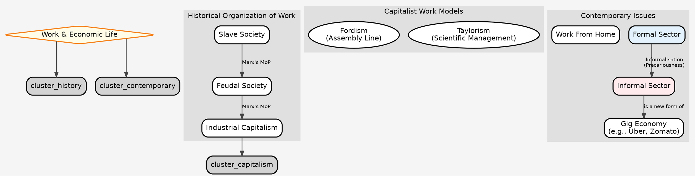

---

### **C. Supplementary Tables**

#### **Table 1: Formal vs. Informal Sector**

| Feature | **Formal Sector** | **Informal Sector** |
| :--- | :--- | :--- |
| **Legal Status** | Officially recognized, regulated, taxed. | Unregulated, outside state purview. |
| **Work Contract** | Formal, written contract. | Verbal, informal agreement. |
| **Job Security** | High, with legal protection against dismissal. | Low, precarious, "hire and fire." |
| **Wages** | Regular, fixed, often with minimum wage laws. | Irregular, piece-rate, below minimum wage. |
| **Social Security** | Yes (pension, health insurance, paid leave). | No benefits. |
| **Worker Organization** | Trade unions are common. | Difficult to organize. |
| **Indian Context** | A small fraction of the workforce. | The vast majority of the workforce. |

#### **Table 2: PYQ Answer Templates (Intro & Conclu - Short Format)**

**Theme 1: Formal vs. Informal Labour**

*   **Question Type:** "What do you understand by 'informalisation of labour'? Discuss with reference to India."
*   **Short Intro:** Informalisation refers to the trend of jobs in the formal sector adopting characteristics of the informal sector, such as a lack of contracts and social security, a dominant feature of India's economy.
*   **Short Conclu:** This process, driven by globalization and the pursuit of flexibility, leads to increased worker precarity. The rise of the gig economy represents the latest frontier of this informalisation.

**Theme 2: The Gig Economy**

*   **Question Type:** "Define the concept of 'gig economy' and discuss its impact on the labour market."
*   **Short Intro:** The gig economy is a labour market of short-term, platform-mediated work. While promising flexibility, it raises significant sociological questions about control, security, and worker rights.
*   **Short Conclu:** The gig economy creates a "precariat," subject to algorithmic management and lacking social safety nets, posing a major challenge for labour policy in the 21st century.

**Theme 3: Taylorism/Fordism**

*   **Question Type:** "What is Taylorism? Analyze its merits and demerits."
*   **Short Intro:** Taylorism, or Scientific Management, is a theory of workplace control that breaks down tasks into their simplest components to maximize efficiency, epitomizing Weber's concept of rationalization.
*   **Short Conclu:** While it boosted productivity, Taylorism is heavily critiqued from a Marxist perspective for intensifying alienation and dehumanizing the worker, treating them as mere cogs in a machine.

---
---

### **A. Core Mindmap: Politics and Society (Markdown)**

## Topic 7: Politics and Society

### 1. Sociological Theories of Power
- **Power Definition (Weber):** "The chance of a man or a number of men to realize their own will in a communal action even against the resistance of others who are participating in the action."
- **(a) Weber's View on Power & Authority:**
    - **Power:** Coercive, often illegitimate.
    - **Authority:** Legitimate power. People obey because they believe it is right. (See Weber mindmap for 3 types: Traditional, Charismatic, Rational-Legal).
- **(b) Marxist View on Power:**
    - **Power:** Held by the dominant class (bourgeoisie).
    - **The State:** Is an "executive committee for managing the common affairs of the whole bourgeoisie." It is an instrument of class rule.
    - **Hegemony (Gramsci):** Rule is maintained not just by force, but by consent, through the control of ideology in the superstructure.
- **(c) Functionalist View on Power (Parsons):**
    - **Power:** A collective resource, not a source of conflict. It is the capacity of the social system to achieve collective goals (Goal Attainment).
    - **Not a "zero-sum" game** (where one's gain is another's loss), but a "variable-sum" game.

### 2. Key Political Actors & Institutions
- **Power Elite (C. Wright Mills):**
    - **Thesis:** In America, real power is concentrated in the hands of a small, unified elite at the top of the **military, corporate, and political** institutions.
    - They share a common worldview and move between these three domains. Democracy is a "formal" facade.
- **Pressure Groups:**
    - **Definition:** Organizations that seek to influence government policy without seeking political office themselves.
    - **Examples:** FICCI (business), All India Kisan Sabha (farmers), Narmada Bachao Andolan (environmental).
- **Political Parties:**
    - **Definition:** Organizations that aim to win political power and form a government.
    - **Function:** Interest aggregation, political mobilization.
    - **Robert Michels' "Iron Law of Oligarchy":** "Who says organization, says oligarchy." All large organizations, including socialist parties, inevitably become ruled by a small elite.

### 3. Nation, State, & Citizenship
- **State:** A political apparatus (government, courts, military) with sovereign power over a defined territory. Has a monopoly on the legitimate use of force (Weber).
- **Nation:** A group of people with a shared identity, culture, language, and a sense of belonging. A "symbolic community."
- **Nation-State:** An ideal where the boundaries of the state and the nation coincide.
- **Citizenship (T.H. Marshall's Theory):**
    - **Evolution of Rights:**
        1.  **Civil Rights (18th C):** Rights necessary for individual freedom (free speech, justice). Associated with **Courts**.
        2.  **Political Rights (19th C):** Right to participate in the exercise of political power (right to vote). Associated with **Parliament**.
        3.  **Social Rights (20th C):** Right to a minimum standard of economic welfare and security. Associated with the **Welfare State** (education, healthcare).
- **Civil Society:**
    - **Definition:** The realm of uncoerced collective action around shared interests, purposes, and values. The space between the family, the state, and the market.
    - **Examples:** NGOs, community groups, social movements, academic institutions.
    - **Role:** Acts as a check on state power, promotes democracy.

### 4. Social Movements, Protest, & Revolution
- **Social Movement:**
    - **Definition:** A collective, organized, and sustained effort to bring about or resist social change.
    - **Types:**
        - **Reformist:** Aims to change some aspects of society (e.g., Women's suffrage movement).
        - **Revolutionary:** Aims to overthrow the entire social/political order (e.g., Bolshevik Revolution).
- **New Social Movements (NSMs):**
    - **Contrast with Old Movements:** Old movements were class-based, focused on economic issues.
    - **Characteristics of NSMs:**
        - **Focus:** Quality of life, identity, rights (e.g., environmental, feminist, LGBTQ+ movements).
        - **Base:** Often middle-class, cross-cuts class lines.
        - **Methods:** Focus on media, culture, and lifestyle changes, not just capturing state power.
- **Revolution:**
    - **Definition:** A rapid, fundamental, and often violent transformation of a country's state structure and class structure.
    - **Theda Skocpol's Theory:** Revolutions are not just made by movements; they happen when the **state collapses** due to external pressures (e.g., war) and internal conflicts (elite-peasant conflict).

---

### **B. Visual Mindmap: The Sociological View of Politics (Graphviz Code)**

```dot
digraph Politics_and_Society {
    // Graph Attributes
    graph [rankdir="TB", splines=ortho, bgcolor="#f5f5f5", fontname="Helvetica"];
    node [shape=box, style="rounded,filled", fontname="Helvetica", penwidth=2];
    edge [fontname="Helvetica", fontsize=10, color="#424242", penwidth=1.5];

    // Main Concept
    Power [label="Power & Authority", shape=diamond, fillcolor="#fffde7", color="#f57f17"];

    // Theories of Power
    subgraph cluster_theories {
        label = "Theories of Power";
        style=filled;
        color="#e0e0e0";
        node [fillcolor=white];
        Weber [label="Weberian\n(Legitimate Domination)"];
        Marxist [label="Marxist\n(Class Rule)"];
        Functionalist [label="Functionalist\n(Collective Resource)"];
        Elite [label="Elite Theory\n(C. Wright Mills)"];
    }

    // Key Concepts & Institutions
    subgraph cluster_concepts {
        label = "Key Concepts & Institutions";
        style=filled;
        color="#e0e0e0";
        node [shape=ellipse, fillcolor=white];
        State [label="State"];
        Nation [label="Nation"];
        Citizenship [label="Citizenship\n(T.H. Marshall)"];
        CivilSociety [label="Civil Society"];
        PoliticalParties [label="Political Parties"];
        PressureGroups [label="Pressure Groups"];
    }

    // Collective Action
    subgraph cluster_action {
        label = "Collective Action";
        style=filled;
        color="#e0e0e0";
        node [shape=ellipse, fillcolor=white];
        SocialMovements [label="Social Movements"];
        NSM [label="New Social Movements"];
        Revolution [label="Revolution"];
        SocialMovements -> NSM [label="Evolves into"];
    }

    // Relationships
    Power -> {cluster_theories, cluster_concepts, cluster_action};
    State -> Citizenship [label="Grants rights of"];
    CivilSociety -> State [label="Checks & Balances"];
}
```

---

### **C. Supplementary Tables**

#### **Table 1: Old vs. New Social Movements**

| Feature | **Old Social Movements (OSM)** | **New Social Movements (NSM)** |
| :--- | :--- | :--- |
| **Primary Focus** | Economic issues, class struggle, capturing state power. | Quality of life, identity, culture, rights, environment. |
| **Social Base** | Primarily working class, peasants. | Cross-class, often led by the new middle class. |
| **Organizational Structure** | Hierarchical, bureaucratic (e.g., trade unions, parties). | Decentralized, network-based, informal. |
| **Arena of Action** | State, factory, workplace. | Civil society, media, cultural sphere. |
| **Examples** | Labour movements, peasant movements. | Feminist, Environmental, LGBTQ+, Anti-nuclear movements. |

#### **Table 2: PYQ Answer Templates (Intro & Conclu - Short Format)**

**Theme 1: Power Elite**

*   **Question Type:** "Critically examine C. Wright Mills' theory of the Power Elite."
*   **Short Intro:** C. Wright Mills argued that American society is dominated by a unified 'power elite' from the top echelons of the military, corporate, and political worlds, making democracy largely a formality.
*   **Short Conclu:** While critiqued by pluralists who see power as dispersed, Mills' theory remains a potent tool for analyzing the concentration of power and the nexus between state and capital in modern democracies.

**Theme 2: Pressure Groups and Political Parties**

*   **Question Type:** "Distinguish between pressure groups and political parties."
*   **Short Intro:** Political parties seek to win and exercise state power directly, whereas pressure groups aim to influence government policy from the outside without contesting elections, representing specific interests.
*   **Short Conclu:** Both are vital to democracy. While parties aggregate broad interests, pressure groups articulate specific concerns, ensuring a more vibrant and responsive political system, though risking oligarchic tendencies.

**Theme 3: Citizenship**

*   **Question Type:** "Discuss T.H. Marshall's theory of citizenship."
*   **Short Intro:** T.H. Marshall outlined a historical evolution of citizenship in England, from civil to political and finally social rights, linking the expansion of rights to the development of the modern state.
*   **Short Conclu:** Marshall's framework is a classic model for understanding the welfare state. However, critics argue it is Anglocentric and overlooks the role of conflict and struggles in winning these rights.

---
---

### **A. Core Mindmap: Religion and Society (Markdown)**

## Topic 8: Religion and Society

### 1. Sociological Theories of Religion
- **(a) Functionalist Theory (Durkheim):**
    - **Core Idea:** Religion is a source of social solidarity and collective conscience. It is society worshipping itself.
    - **Key Concepts:**
        - **Sacred vs. Profane:** The fundamental distinction. Sacred things are set apart, inspiring awe.
        - **Totemism:** The most elementary form, where the totem symbolizes both the clan and the god.
        - **Collective Effervescence:** Rituals generate a shared emotional energy that binds the group.
    - **Function:** Integration, social control, providing meaning.
- **(b) Weberian Theory (Interpretive):**
    - **Core Idea:** Religion can be a powerful force for social change.
    - **Thesis (PESC):** The values of the Protestant (Calvinist) ethic had an "elective affinity" with the "spirit" of modern capitalism, helping to drive its development.
    - **Comparative Studies:** Studied other world religions (Hinduism, Confucianism) to show why capitalism did *not* develop there, highlighting barriers like the caste system's traditionalism.
- **(c) Marxist Theory (Conflict):**
    - **Core Idea:** Religion is an instrument of class oppression and part of the ideological superstructure.
    - **Quote:** "Religion is the sigh of the oppressed creature, the heart of a heartless world... It is the **opium of the masses**."
    - **Function:**
        - **Legitimizes Inequality:** Promises a reward in the afterlife, making suffering in this life bearable.
        - **Distracts from Exploitation:** Diverts attention from the real, material causes of misery.
- **(d) Early Theories (Evolutionary):**
    - **E.B. Tylor:** Religion evolved from **Animism** (belief in spirits).
    - **Max Muller:** Religion evolved from **Naturism** (worship of nature's forces).

### 2. Types of Religious Practices & Organizations
- **(a) Forms of Religious Practice:**
    - **Animism:** Belief that spirits inhabit objects and natural phenomena.
    - **Monism:** Belief that all reality is ultimately one unified substance or principle.
    - **Pluralism:** The coexistence of multiple religious groups in one society.
    - **Monotheism:** Belief in one God.
    - **Polytheism:** Belief in many gods.
- **(b) Types of Religious Organization (Weber & Troeltsch):**
    - **Church:** Large, bureaucratic organization, well-integrated with society, formal membership (often by birth). (e.g., Catholic Church).
    - **Sect:** Smaller, less formal group that has broken away from a church, often in protest. High commitment required. (e.g., Early Protestants).
    - **Denomination:** A sect that has cooled down and become more institutionalized. Coexists peacefully with others. (e.g., Baptists, Methodists).
    - **Cult:** A loosely structured, highly individualistic group, often centered on a charismatic leader. Frequently involves new or syncretic beliefs. (e.g., Osho movement).

### 3. Religion in Modern Society
- **(a) The Secularization Thesis:**
    - **Definition:** The process by which religious institutions, practices, and beliefs lose their social significance.
    - **Proponents:** Wilson, Berger (early work).
    - **Arguments for Secularization:**
        - **Structural Differentiation:** State, economy, education become separate from religion's control.
        - **Rationalization (Weber):** Science provides a more logical explanation of the world, leading to "disenchantment."
        - **Privatization:** Religion becomes a matter of private belief rather than public practice.
- **(b) Critique of Secularization Thesis / Counter-Trends:**
    - **Persistence of Religion:** Religion remains a powerful force globally.
    - **Peter Berger's Reversal:** Berger later recanted, arguing the world is "as furiously religious as it ever was."
    - **Religious Revivalism:** A renewed interest in and adherence to traditional religious beliefs.
    - **Fundamentalism:** A militant rejection of secular modernity. Characterized by literal interpretation of scripture and a desire to shape public life according to religious principles.
- **(c) Religion and Science:**
    - **Conflict Thesis:** They are fundamentally opposed (e.g., Galileo affair).
    - **Independence Thesis:** They operate in separate domains (NOMA - Non-Overlapping Magisteria). Science deals with the "how," religion with the "why"/meaning.
    - **Integration Thesis:** They can be harmonized.
- **(d) Contemporary Issues:**
    - **Religious Pluralism:** How diverse religious communities coexist.
    - **Communalism (Paper 2 Link):** The manipulation of religious identity for political ends, leading to inter-group conflict.

---

### **B. Visual Mindmap: The Sociological Study of Religion (Graphviz Code)**

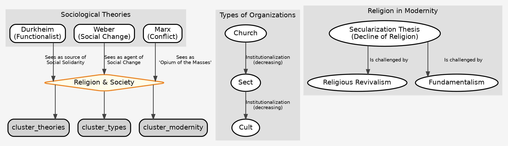

---

### **C. Supplementary Tables**

#### **Table 1: Comparing Sociological Theories of Religion**

| Feature | **Durkheim (Functionalist)** | **Marx (Conflict)** | **Weber (Interpretive)** |
| :--- | :--- | :--- | :--- |
| **Primary Role** | **Integration:** Creates social solidarity and collective conscience. | **Oppression:** Legitimizes inequality and is the "opium of the masses." | **Social Action:** Can be a force for either social change or stability. |
| **Focus** | The sacred/profane distinction; rituals; collective effervescence. | Ideology; false consciousness; role in the superstructure. | Subjective meaning; relationship between religious ethics and economic behaviour. |
| **View of Future** | Religion's form may change (e.g., 'cult of the individual'), but its function will persist. | Religion will disappear in a communist society as its material basis (exploitation) is removed. | Secularization and "disenchantment" will increase as rationality spreads. |

#### **Table 2: PYQ Answer Templates (Intro & Conclu - Short Format)**

**Theme 1: Secularization**

*   **Question Type:** "Is religion declining in the face of modernity? Discuss the secularization thesis."
*   **Short Intro:** The secularization thesis argues that religious institutions and beliefs lose social significance with the rise of modernity, rationality, and science. However, this view is highly contested.
*   **Short Conclu:** While religion's public authority has diminished in some areas, the rise of revivalism and fundamentalism globally suggests religion is not disappearing but rather changing its form and expression.

**Theme 2: Durkheim on Religion**

*   **Question Type:** "Explain how Durkheim, through the study of totemism, demonstrates the reality of religion."
*   **Short Intro:** In 'The Elementary Forms', Durkheim studied Australian totemism, arguing that the totem, symbolizing both God and the clan, proves that in worshipping religion, society worships itself.
*   **Short Conclu:** For Durkheim, religion's reality lies not in its cosmology but in its function of creating social solidarity. This function, he argued, is a permanent and essential feature of social life.

**Theme 3: Sects and Cults**

*   **Question Type:** "Distinguish between sects and cults with illustrations."
*   **Short Intro:** Sects and cults are religious groups existing in tension with mainstream society. Sects are typically break-away groups from established churches, while cults are often newer, more loosely organized entities.
*   **Short Conclu:** The proliferation of sects and cults in modern society is often cited as evidence against simple secularization, indicating a continuing search for meaning and community outside traditional religious institutions.

---
---

### **A. Core Mindmap: Systems of Kinship (Markdown)**

## Topic 9: Systems of Kinship

### 1. Core Concepts: Kinship, Descent, Alliance
- **Kinship:** A social network of relationships based on blood (consanguinity), marriage (affinity), or adoption. The most basic principle of social organization.
- **Two Pillars of Kinship:**
    - **Descent (Blood Ties):** Tracing kinship through parent-child links.
    - **Alliance (Marriage Ties):** Creating kinship between groups.
- **(a) Descent Systems:**
    - **Unilineal:** Tracing descent through one parent's line only.
        - **Patrilineal:** Through the father's line. (Most common in India).
        - **Matrilineal:** Through the mother's line. (e.g., Khasi, Garo tribes in India).
    - **Bilateral:** Tracing descent through both parents' lines. (Common in modern, Western societies).
- **(b) Descent Groups:**
    - **Lineage:** A descent group that can trace their common ancestor.
    - **Clan:** A descent group whose common ancestor is a mythical figure or totem (cannot be traced).
- **(c) Alliance / Marriage Rules:**
    - **Endogamy:** Marrying *within* a specific social group (e.g., caste endogamy in India).
    - **Exogamy:** Marrying *outside* a specific social group (e.g., gotra exogamy in India).
    - **Hypergamy (Anuloma):** A woman marrying a man of higher status/caste.
    - **Hypogamy (Pratiloma):** A woman marrying a man of lower status/caste (traditionally sanctioned).

### 2. Marriage
- **Definition:** A socially approved and recognized union, typically between two individuals, that establishes rights and obligations between them, their children, and their in-laws.
- **Forms of Marriage:**
    - **Monogamy:** One spouse at a time.
    - **Polygamy:** Multiple spouses at a time.
        - **Polygyny:** One man, multiple wives.
        - **Polyandry:** One woman, multiple husbands (e.g., Toda tribe of Nilgiris).

### 3. Family and Household
- **Family:** A group of people related by kinship who often live together and share economic resources. Its primary function is the procreation and socialization of children.
- **Household:** A residential unit where people live together, share a common hearth ('chullah'), and cooperate economically. **A household is not always a family** (e.g., it can include non-kin like servants or tenants).
- **Forms of Family:**
    - **Nuclear Family:** Parents and their dependent children.
    - **Extended/Joint Family:** Two or more generations or siblings living together.
- **Functionalist View (G.P. Murdock):** Family performs four universal functions: Sexual, Reproductive, Economic, and Educational (socialization).

### 4. Patriarchy & Sexual Division of Labour
- **Patriarchy:**
    - **Definition:** A social system of male domination where men hold primary power in all spheres of life—political, economic, social, and familial.
    - **Quote:** "Patriarchy's chief institution is the family." - Kate Millett.
    - **Manifestations:** Control over women's sexuality, property, and mobility.
    - **Sylvia Walby:** Differentiates between **Private Patriarchy** (in the household) and **Public Patriarchy** (in the state and economy).
- **Sexual Division of Labour:**
    - **Definition:** The allocation of different tasks and roles to men and women based on their sex.
    - **Traditional Pattern:** Men in the public sphere (work, politics), women in the private sphere (home, childcare).
    - **Consequence:** Devaluation of women's work, economic dependency.
- **Paper 2 Link:** Honour killings, dowry, domestic violence are all manifestations of patriarchy in India.

### 5. Contemporary Trends
- **Structural Changes:**
    - Shift from joint to nuclear families.
    - Rise of dual-earner families ("symmetrical family" - Young & Willmott).
    - Increase in single-parent households, female-headed households.
- **Changes in Norms & Values:**
    - **Live-in Relationships:** Increasing social (and legal) acceptance.
    - **Same-Sex Relationships:** Decriminalization (Navtej Singh Johar case, 2018) marks a major shift.
    - **Companionate Marriage:** Emphasis on love, companionship over social obligation.
- **Technological Impact:**
    - Assisted Reproductive Technologies (ART) like IVF and surrogacy are changing ideas of parenthood.
- **Theoretical Shift (David Morgan):**
    - Move from studying "the family" (as a thing) to studying **"family practices"** (the things people do that they define as family).

---

### **B. Visual Mindmap: The Web of Kinship (Graphviz Code)**

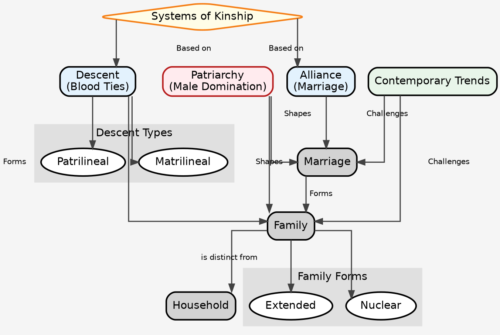

---

### **C. Supplementary Tables**

#### **Table 1: Family vs. Household**

| Basis | **Family** | **Household** |
| :--- | :--- | :--- |
| **Meaning** | A kinship-based social group. | A residential and domestic unit. |
| **Membership** | Based on kinship ties (blood, marriage, adoption). | Based on co-residence and a shared kitchen. |
| **Composition** | Always composed of kin. | Can include non-kin (e.g., tenants, servants). |
| **Example** | A couple and their children living in different cities are still a family. | A group of unrelated students sharing an apartment form a household. |

#### **Table 2: PYQ Answer Templates (Intro & Conclu - Short Format)**

**Theme 1: Patriarchy**

*   **Question Type:** "Define patriarchy. How does it manifest in interpersonal relations?"
*   **Short Intro:** Patriarchy is a system of male domination where men hold primary power. It manifests in interpersonal relations through control over women's choices, labour, and sexuality within the family.
*   **Short Conclu:** Though challenged by feminist movements and legal reforms, patriarchy's ideological roots ensure its persistence, making gender equality an ongoing struggle in both public and private spheres.

**Theme 2: Changing Family Forms**

*   **Question Type:** "Examine the emerging trends in marriage and family in response to social change."
*   **Short Intro:** The family is not a static institution but is dynamically responding to modernization and globalization. This has led to the emergence of diverse forms beyond the traditional joint family.
*   **Short Conclu:** These trends indicate a shift towards individualism and companionship, diversifying family structures rather than causing their collapse, reflecting the adaptability of kinship systems in modern society.

**Theme 3: Kinship in India**

*   **Question Type:** "Discuss the regional variations of kinship system in Indian society."
*   **Short Intro:** India's kinship systems show significant regional variation, broadly categorized by Irawati Karve into the patrilineal North and the more diverse South, with its distinct marriage rules and Dravidian terminology.
*   **Short Conclu:** These regional systems, deeply intertwined with caste and language, demonstrate that kinship is a fundamental organizing principle of Indian social structure, shaping everything from property rights to social alliances.

---
---

### **A. Core Mindmap: Social Change in Modern Society (Markdown)**

## Topic 10: Social Change in Modern Society

### 1. Sociological Theories of Social Change
- **Definition:** Significant alteration over time in behaviour patterns, cultural values, and norms.
- **(a) Linear Theories:**
    - **View:** Society progresses in a single direction, from simple to complex.
    - **Thinkers:**
        - **Auguste Comte:** Law of Three Stages (Theological -> Metaphysical -> Positive).
        - **Herbert Spencer:** Social Darwinism (Simple -> Compound -> Doubly Compound).
- **(b) Cyclical Theories:**
    - **View:** Societies rise, mature, and fall in cycles.
    - **Thinkers:**
        - **Oswald Spengler:** *The Decline of the West*.
        - **Arnold Toynbee:** "Challenge and Response."
- **(c) Conflict Theories (Marx):**
    - **View:** Change is driven by internal contradictions and class conflict.
    - **Mechanism:** Dialectical Materialism. Change is revolutionary, not evolutionary.
- **(d) Functionalist Theories (Parsons):**
    - **View:** Change is evolutionary, adaptive, and incremental. Society moves towards greater differentiation and integration.
    - **Mechanism:** Structural Differentiation.
- **(e) Cultural Lag (W.F. Ogburn):**
    - **Core Idea:** Different parts of culture change at different rates.
    - **Material Culture** (e.g., technology) changes rapidly.
    - **Non-material Culture** (e.g., norms, values, laws) lags behind, creating social problems.
    - **Contemporary Example:** Development of AI (material) has outpaced the development of ethical/legal frameworks (non-material) to govern it.

### 2. Development and Dependency
- **(a) Modernization Theory (Functionalist):**
    - **View:** "Third World" countries can develop by following the path of Western nations.
    - **Mechanism:** Adopting modern values (achievement, universalism), institutions (democracy, capitalism), and technology.
    - **Critique:** Ethnocentric, ignores historical context of colonialism.
- **(b) Dependency Theory (A.G. Frank):**
    - **Core Idea:** A direct critique of modernization theory. Underdevelopment is not an original state but a condition created by global capitalism.
    - **Thesis:** The "development of underdevelopment."
    - **Mechanism:** The **Metropolis (Core)** nations actively underdevelop the **Satellite (Periphery)** nations by extracting surplus.
    - **Solution:** Breaking away from the capitalist world system (delinking).
- **(c) World-Systems Theory (Immanuel Wallerstein):**
    - **Core Idea:** A refinement of dependency theory. The world is a single capitalist system.
    - **Three Zones:**
        1.  **Core:** Dominant, high-skill production (e.g., USA, Germany).
        2.  **Periphery:** Exploited, low-skill, raw material extraction (e.g., many African nations).
        3.  **Semi-periphery:** A mix of core and periphery characteristics. Acts as a buffer. (e.g., India, Brazil, China).
    - **Significance:** More dynamic than dependency theory; allows for mobility between zones.

### 3. Agents of Social Change
- **Definition:** The forces, factors, or institutions that drive social change.
- **(a) Education:**
    - **Functionalist View:** Promotes value consensus, provides skilled labour for the economy.
    - **Conflict View:** Reproduces social inequality (Bourdieu's Cultural Capital).
    - **As an Agent of Change:** Spreads modern values (secularism, democracy), promotes social mobility, empowers marginalized groups.
    - **Paper 2 Link:** Role of education in the Dalit movement and women's empowerment in India.
- **(b) Science and Technology:**
    - **Impact:** Transforms economic production (Industrial/IT revolutions), communication (internet), health (vaccines), and warfare.
    - **Sociological View:** Technology is not neutral; its development and impact are shaped by social values and power structures.
    - **Contemporary Example:** Social media's role in political mobilization ("Arab Spring") and social movements.
- **(c) Mass Media:**
    - **Role:** Shapes public opinion, diffuses culture, sets agendas.
    - **Frankfurt School Critique:** Media is part of a "culture industry" that promotes conformity and consumerism.
- **(d) Law & Constitution (Paper 2 Link):**
    - Law can be an instrument of social change by codifying new rights and abolishing old customs.
    - **Examples:** Hindu Marriage Act (banning polygamy), laws against untouchability, reservation policies.

---

### **B. Visual Mindmap: The Dynamics of Social Change (Graphviz Code)**

```dot
digraph Social_Change {
    // Graph Attributes
    graph [rankdir="TB", splines=ortho, bgcolor="#f5f5f5", fontname="Helvetica"];
    node [shape=box, style="rounded,filled", fontname="Helvetica", penwidth=2];
    edge [fontname="Helvetica", fontsize=10, color="#424242", penwidth=1.5];

    // Main Concept
    SocialChange [label="Social Change in Modern Society", shape=diamond, fillcolor="#fffde7", color="#f57f17"];

    // Theories
    subgraph cluster_theories {
        label = "Theories of Social Change";
        style=filled;
        color="#e0e0e0";
        node [fillcolor=white];
        Linear [label="Linear\n(Comte, Spencer)"];
        Conflict [label="Conflict\n(Marx)"];
        Functionalist [label="Functionalist\n(Parsons)"];
        CulturalLag [label="Cultural Lag\n(Ogburn)"];
    }

    // Development
    subgraph cluster_dev {
        label = "Development & Dependency";
        style=filled;
        color="#e0e0e0";
        node [fillcolor=white];
        Modernization [label="Modernization Theory"];
        Dependency [label="Dependency Theory\n(A.G. Frank)"];
        WorldSystem [label="World-Systems Theory\n(Wallerstein)"];
        Modernization -> Dependency [label="Critiqued by"];
        Dependency -> WorldSystem [label="Refined by"];
    }

    // Agents
    subgraph cluster_agents {
        label = "Agents of Social Change";
        style=filled;
        color="#e0e0e0";
        node [shape=ellipse, fillcolor=white];
        Education [label="Education"];
        Technology [label="Science & Technology"];
        Law [label="Law & State"];
        Media [label="Mass Media"];
    }

    // Relationships
    SocialChange -> {cluster_theories, cluster_dev, cluster_agents};
}
```

---

### **C. Supplementary Tables**

#### **Table 1: Modernization vs. Dependency Theory**

| Feature | **Modernization Theory** | **Dependency Theory** |
| :--- | :--- | :--- |
| **Unit of Analysis** | The Nation-State. | The Capitalist World-System. |
| **Problem** | Internal factors: Traditional values, lack of capital/tech. | External factors: Colonialism, exploitation by the core. |
| **Process** | Development is an evolutionary path followed by all nations. | Development and underdevelopment are two sides of the same coin. |
| **Solution** | Diffusion of Western capital, technology, and values. | Delinking from the world system; revolution. |
| **Associated with** | Functionalism. | Marxism / Conflict Theory. |

#### **Table 2: PYQ Answer Templates (Intro & Conclu - Short Format)**

**Theme 1: Cultural Lag**

*   **Question Type:** "Is the theory of cultural lag valid in present times? Discuss."
*   **Short Intro:** W.F. Ogburn's theory of cultural lag posits that social problems arise when non-material culture (norms, laws) fails to keep pace with rapid changes in material culture (technology).
*   **Short Conclu:** The theory remains highly valid today, evident in debates surrounding AI ethics, data privacy, and climate change, where technological advancement has outstripped our social and regulatory capacity.

**Theme 2: Dependency Theory**

*   **Question Type:** "Assess critically A.G. Frank's 'theory of development of underdevelopment'."
*   **Short Intro:** A.G. Frank's dependency theory radically challenged modernization theory, arguing that the underdevelopment of the periphery is a direct result of its exploitation by the capitalist core or metropolis.
*   **Short Conclu:** While critiqued for its determinism, Frank's theory was crucial in highlighting the role of global power structures and historical exploitation in shaping contemporary inequalities between nations.

**Theme 3: Education and Social Change**

*   **Question Type:** "Education is often viewed as an agency of social change. However, it could also reinforce inequalities. Discuss."
*   **Short Intro:** Education is a dual-edged sword: while it can be a powerful agent of social change and mobility, it can also function, as conflict theorists argue, to reproduce existing social inequalities.
*   - **Short Conclu:** The outcome depends on whether educational systems promote critical thinking and equal access or merely reinforce dominant ideologies and cultural capital, as seen in the Indian context.

---
---
# ***END Paper 1***

---
---

