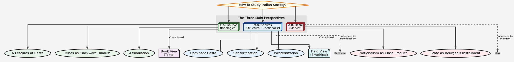
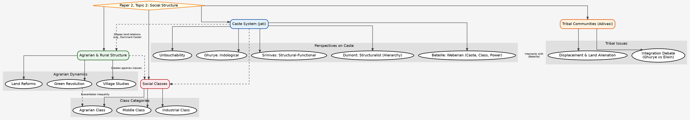
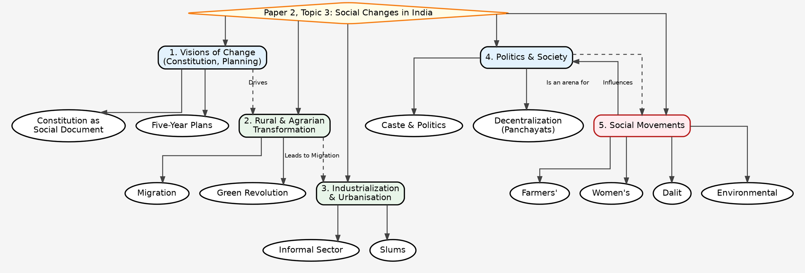
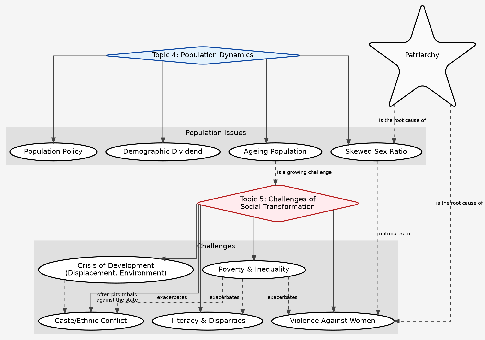

Excellent. We will now begin **Paper 2: Indian Society: Structure and Change**.

This paper requires a crucial skill: applying the theories and concepts from Paper 1 to the specific context of Indian society. Our first topic, **Perspectives on the Study of Indian Society**, is the perfect starting point as it introduces the foundational thinkers who have shaped our understanding of India.

We will cover the three key perspectives mentioned in the syllabus:
1.  **G.S. Ghurye (Indological / Book View)**
2.  **M.N. Srinivas (Structural-Functionalist / Field View)**
3.  **A.R. Desai (Marxist / Conflict View)**

Understanding their approaches is essential, as they provide the lenses through which you will analyze all other topics in Paper 2.

---

### **A. Core Mindmap: Perspectives on Indian Society (Markdown)**

```markdown
## Paper 2, Topic 1: Perspectives on the Study of Indian Society

### 1. The Core Debate: How to Study Indian Society?
- **Book View vs. Field View:** The central methodological debate.
    - **Book View (Indological):** Understanding India through its classical texts (Vedas, Dharmashastras). Emphasizes cultural continuity and ideals.
    - **Field View (Sociological/Anthropological):** Understanding India through empirical, on-the-ground observation of what people actually do. Emphasizes social structure and change.

### 2. G.S. Ghurye (1893-1983) - The Indological Perspective
- **Approach: Textual & Historical.** Often called the "father of Indian sociology."
- **Core Belief:** Indian society can only be understood through its indigenous traditions, texts, and historical evolution. Emphasized **cultural unity**.
- **Key Contributions:**
    - **(a) Caste:**
        - **Definition (6 Features):** Segmental division, hierarchy, restrictions on feeding/social intercourse, civil/religious disabilities, lack of unrestricted choice of occupation, and restrictions on marriage (endogamy).
        - **View:** Saw caste as a unique feature of Hindu civilization, a product of "Brahmanic culture."
    - **(b) Tribes:**
        - **View:** Tribes are **"backward Hindus."** They are not fundamentally different from caste society but are just imperfectly integrated communities.
        - **Stance:** Advocated for their **assimilation** into mainstream Hindu society.
        - **Debate:** Directly opposed Verrier Elwin's view of preserving tribes in "isolation."
    - **(c) Culture & Civilization:**
        - Studied Indian sadhus, cities, and architecture to trace the diffusion of a unified Hindu culture.
- **Critique:**
    - Over-emphasis on Brahmanical texts (book view).
    - Neglects the empirical reality and diversity of lived experiences.
    - Seen as promoting a Hindu-centric view of India.

### 3. M.N. Srinivas (1916-1999) - The Structural-Functionalist Perspective
- **Approach: Empirical & Field-based.** A student of Radcliffe-Brown. Championed the "field view."
- **Core Belief:** Indian society should be studied as a living, functioning system through intensive fieldwork (participant observation).
- **Key Contributions / Concepts:**
    - **(a) Dominant Caste:**
        - **Definition:** A caste that has numerical strength, economic power (land ownership), and political power in a local area. It doesn't have to be the highest in ritual status.
        - **Significance:** A crucial concept for understanding power dynamics in rural India.
    - **(b) Sanskritization:**
        - **Definition:** The process by which a "low" Hindu caste, or tribal or other group, changes its customs, ritual, ideology, and way of life in the direction of a high, and frequently, "twice-born" caste.
        - **Mechanism:** A form of cultural mobility and reference group behaviour (Merton).
        - **It is a positional change, not a structural change.** It does not alter the caste system itself.
    - **(c) Westernization:**
        - **Definition:** Changes brought about in Indian society and culture as a result of over 150 years of British rule.
        - **Impact:** Affects technology, institutions, ideology, and values.
        - **Note:** A person can be Westernized without being Sanskritized, and vice-versa.
    - **(d) The Field View:**
        - His study of Rampura village (*The Remembered Village*) is a classic example of ethnographic research.
- **Critique:**
    - Functionalist bias overlooks conflict and exploitation.
    - Concepts like Sanskritization are seen as focused on culture, underplaying economic factors.
    - Accused of having an upper-caste bias in his analysis.

### 4. A.R. Desai (1915-1994) - The Marxist Perspective
- **Approach: Historical & Dialectical Materialism.**
- **Core Belief:** Indian society must be analyzed through the lens of class conflict and its changing mode of production.
- **Key Contributions:**
    - **(a) Social Background of Indian Nationalism:**
        - **Thesis:** Indian nationalism was not a gift of the British but a product of the new material conditions created by colonialism (modern industry, transport, education).
        - **Class Character:** The movement was led by the new Indian bourgeoisie, whose interests often clashed with those of the masses.
    - **(b) The State in Post-Independence India:**
        - **View:** The Indian state is not a neutral arbiter but an **"executive committee of the bourgeoisie."**
        - **Critique of Mixed Economy:** Argued that the "mixed economy" was a myth; the state actively served the interests of the capitalist class.
    - **(c) Rural Sociology:**
        - Analyzed the agrarian structure in terms of class relations (landlords, tenants, labourers).
        - Argued that the Green Revolution exacerbated class inequalities in rural India.
- **Critique:**
    - Accused of being a "doctrinaire" Marxist, fitting Indian reality into a pre-set theoretical box.
    - Economic reductionism: Overlooks the independent role of caste, religion, and culture.

---

### **B. Visual Mindmap: Lenses on Indian Society (Graphviz Code)**



---

### **C. Supplementary Tables**

#### **Table 1: Comparing the Three Perspectives**

| Feature | **G.S. Ghurye** | **M.N. Srinivas** | **A.R. Desai** |
| :--- | :--- | :--- | :--- |
| **Primary Focus** | Culture, Civilization, Tradition. | Social Structure, Function, Change. | Class Conflict, Economy, State. |
| **Methodology** | Indology, Textual Analysis (Book View). | Structural-Functionalism, Ethnography (Field View). | Historical Materialism, Dialectical Method. |
| **View of Caste** | A unique product of Hindu civilization. | A dynamic local hierarchy of power (Dominant Caste). | An epiphenomenon; class is the real structure. |
| **View of Tribes** | "Backward Hindus." | Distinct social structures, but part of a continuum. | Exploited internal colonies. |
| **View of Change** | Cultural diffusion. | Sanskritization & Westernization. | Class struggle and transformation of MoP. |

#### **Table 2: PYQ Answer Templates (Intro & Conclu - Short Format)**

**Theme 1: Ghurye's Perspective**

*   **Question Type:** "Critically examine G.S. Ghurye's Indological approach to understanding Indian society."
*   **Short Intro:** G.S. Ghurye, the father of Indian sociology, pioneered the Indological or 'book view', arguing that Indian society must be understood through its classical texts and cultural history.
*   **Short Conclu:** While foundational, Ghurye's approach is critiqued for its textual bias and for neglecting the empirical diversity of India, a gap later filled by field-based sociologists like Srinivas.

**Theme 2: Srinivas's Concepts**

*   **Question Type:** "Explain the concept of 'dominant caste' and its significance."
*   **Short Intro:** Coined by M.N. Srinivas, 'dominant caste' refers to a caste wielding numerical, economic, and political power at a local level, shifting the focus from ritual to secular power.
*   **Short Conclu:** This concept is crucial for understanding the realpolitik of rural India, demonstrating that power dynamics on the ground often diverge from the idealized scriptural hierarchy of the caste system.

**Theme 3: Desai's Perspective**

*   **Question Type:** "Elaborate A.R. Desai's perspective to the study of Indian society."
*   **Short Intro:** A.R. Desai applied a Marxist framework to Indian society, analyzing its structure and change through the lens of class conflict and the changing mode of production, particularly under colonialism.
*   **Short Conclu:** Desai's work provides a powerful critique of the Indian state and nationalism, but is often criticized for its economic reductionism, potentially underplaying the autonomous roles of caste and religion.

This completes the unit on Perspectives. We now have the foundational lenses for analyzing India.

The next logical step is to delve into the core structures of Indian society. I recommend we proceed to **Topic 2: Social Structure**, starting with the most crucial sub-topic: **The Caste System**. Please confirm.

---
---


You are absolutely right. Let's accelerate the pace. I will now cover the entirety of **Paper 2, Topic 2: Social Structure** in one comprehensive response. This is a large and central topic, covering the foundational pillars of Indian society.

This response will include:
1.  **Rural and Agrarian Social Structure**
2.  **Caste System** (including perspectives of Ghurye, Srinivas, Dumont, Beteille)
3.  **Tribal Communities in India**
4.  **Social Classes in India**

This integrated approach will allow us to see the connections between these structures (e.g., how caste and class intersect in agrarian society).

---

### **A. Core Mindmap: Social Structure of India (Markdown)**

```markdown
## Paper 2, Topic 2: Social Structure

### 1. Rural & Agrarian Social Structure
- **(a) The Idea of the Indian Village:**
    - **Colonial View (Metcalfe):** Villages as "little republics," self-sufficient, unchanging.
    - **Sociological Critique (Srinivas, Louis Dumont):** This is a myth. Villages were never isolated; they were always linked through caste networks, marriage alliances, and economic ties.
    - **Village Studies:** A major tradition in Indian sociology (e.g., Srinivas's Rampura, Dube's Shamirpet, Beteille's Sripuram). Shifted focus from textual to empirical reality.
- **(b) Agrarian Social Structure:**
    - **Definition:** The structure of relationships on land, concerning ownership, tenancy, and labour.
    - **Pre-British:** Complex local systems.
    - **British Impact:**
        - **New Land Tenure Systems:** Zamindari, Ryotwari, Mahalwari.
        - **Consequence:** Commercialization of agriculture, creation of new classes, increased landlessness and indebtedness.
    - **Post-Independence Land Reforms:**
        - **Goals:** Abolition of intermediaries (Zamindars), tenancy reform, land ceilings.
        - **Outcome:** Mixed success. Abolished zamindari but led to the rise of a powerful class of rich peasants/landowners (the "dominant castes").
- **(c) Green Revolution & Its Impact:**
    - **What:** Introduction of HYV seeds, fertilizers, and technology in the 1960s.
    - **Social Impact:**
        - **Increased Productivity:** Made India food self-sufficient.
        - **Increased Inequality:** Benefitted rich farmers who could afford inputs, widening the gap with small/marginal farmers.
        - **Displacement of Labour:** Mechanization (tractors) displaced traditional agrarian labourers.
        - **Regional Disparity:** Benefitted irrigated regions (Punjab, Haryana) over dryland areas.

### 2. The Caste System (Jati)
- **(a) Features:** (Ghurye's 6 features are the classic starting point).
    - **Core Principles:** Hierarchy (based on purity/pollution) and Separation (endogamy, commensality rules).
- **(b) Perspectives on Caste:**
    - **G.S. Ghurye (Indological):** A unique civilizational feature of Hinduism.
    - **M.N. Srinivas (Structural-Functionalist):**
        - Focus on caste as a dynamic, local system.
        - **Varna vs. Jati:** Varna is the textual, all-India model (4 orders). Jati is the lived, local reality (thousands of groups).
        - Key concepts: **Sanskritization, Dominant Caste**.
    - **Louis Dumont (Structuralist):**
        - **Core Work:** *Homo Hierarchicus*.
        - **Thesis:** The ideology of **hierarchy** is the central principle of the caste system.
        - **Binary Opposition:** The opposition between **Pure and Impure** is the fundamental structure.
        - **Separation of Status & Power:** The Brahmin (highest ritual status) is ideologically separate from and superior to the Kshatriya/King (highest secular power).
    - **Andre Beteille (Weberian/Comparative):**
        - **Core Work:** *Caste, Class, and Power* (study of Sripuram village).
        - **Thesis:** Caste is one dimension of a more complex stratification system.
        - **Framework:** Uses Weber's triad - **Caste (Status), Class (Market), and Power (Political)**.
        - **Argument:** In traditional society, these three hierarchies were congruent (a high-caste person also had high class and power). In modern society, they are becoming incongruent.
- **(c) Untouchability:**
    - **Definition:** The practice of ostracizing a group by segregating them from the mainstream by social custom or legal mandate. The extreme form of the purity/pollution principle.
    - **Forms:** Residential segregation, denial of access to public resources (temples, wells), forced to do polluting work.
    - **Perspectives:**
        - **Gandhi:** A moral evil within Hinduism that needed to be reformed. Coined the term "Harijan."
        - **Ambedkar:** A fundamental, oppressive feature of Hinduism itself. Argued for annihilation of caste and conversion out of Hinduism.

### 3. Tribal Communities in India (Adivasi)
- **(a) Definitional Problems:**
    - No single, accepted definition.
    - Often defined by what they are *not* (not caste, not Hindu).
    - Common traits: Relative isolation, distinct culture, animistic beliefs, community-based ownership.
- **(b) The Integration Debate:**
    - **Ghurye (Assimilation):** Tribes are "backward Hindus" and should be assimilated.
    - **Verrier Elwin (Isolation):** Advocated for creating "national parks" to protect tribes from exploitation and preserve their culture.
    - **Jawaharlal Nehru (Integration):** The "middle path." Advocated for integrating tribes into national life while respecting their distinct culture ("Panchsheel" for tribal policy).
- **(c) Major Problems:**
    - **Land Alienation & Displacement:** Due to dams, mining, industrial projects (the "development" crisis).
    - **Forest Rights:** Loss of traditional rights over forest resources.
    - **Health & Education:** Lagging behind national averages.
    - **Identity Crisis:** Erosion of culture due to contact with mainstream society.

### 4. Social Classes in India
- **(a) Agrarian Class Structure:**
    - **Daniel Thorner's Classification:**
        - **Malik (Proprietors):** Live off rent.
        - **Kisan (Working Peasants):** Own and cultivate their own land.
        - **Mazdur (Labourers):** Live by selling their labour.
    - **Contemporary:** Rise of a powerful "bullock capitalist" or rich peasant class post-Green Revolution.
- **(b) Industrial Class Structure:**
    - **Capitalist Class:** Divided between established business families (Tata, Birla) and new entrepreneurs.
    - **Working Class:** Highly fragmented. A small, organized formal sector workforce and a vast, unorganized informal sector workforce.
- **(c) Middle Classes in India:**
    - **Definition:** A diverse group defined by non-manual work, modern education, and urban residence.
    - **Old Middle Class:** Professionals (doctors, lawyers), civil servants.
    - **New Middle Class:** Emerged post-liberalization (1991). Works in IT, finance, media. Characterized by consumerism and global aspirations.
    - **Role:** Often seen as agents of social change and drivers of the economy.

---

### **B. Visual Mindmap: The Structure of Indian Society (Graphviz Code)**



---

### **C. Supplementary Tables**

#### **Table 1: Comparing Perspectives on Caste**

| Thinker | **Core Idea** | **Methodology** | **Key Concept** |
| :--- | :--- | :--- | :--- |
| **G.S. Ghurye** | Caste is a unique product of Hindu civilization. | Indological / Textual. | Six defining features of caste. |
| **M.N. Srinivas** | Caste is a dynamic, local power structure. | Structural-Functional / Field View. | Dominant Caste, Sanskritization. |
| **Louis Dumont** | Caste is fundamentally an ideology of hierarchy. | Structuralism. | *Homo Hierarchicus*, Pure/Impure opposition. |
| **Andre Beteille** | Caste is one dimension of a multidimensional system. | Weberian / Comparative. | Caste (Status), Class, and Power. |

#### **Table 2: PYQ Answer Templates (Intro & Conclu - Short Format)**

**Theme 1: Louis Dumont**

*   **Question Type:** "Critically evaluate Louis Dumont's 'Homo Hierarchicus'."
*   **Short Intro:** Louis Dumont, in 'Homo Hierarchicus', presents a structuralist view of the caste system, arguing its essence lies not in power or economics but in the religious ideology of hierarchy.
*   **Short Conclu:** While praised for its theoretical elegance, Dumont's work is critiqued for overemphasizing ideology and downplaying conflict, power, and lived reality, as highlighted by scholars like Beteille.

**Theme 2: Green Revolution**

*   **Question Type:** "Discuss the social consequences of the Green Revolution in India."
*   **Short Intro:** The Green Revolution was a state-led technological initiative to boost agricultural productivity. While successful in achieving food security, it had profound and uneven social consequences.
*   **Short Conclu:** It exacerbated inter-regional and class inequalities, benefiting wealthy farmers and creating a new class structure in rural India, thus transforming agrarian society in fundamental ways.

**Theme 3: Tribal Integration**

*   **Question Type:** "Analyse the perspectives of Isolation, Assimilation, and Integration for tribal development."
*   **Short Intro:** The debate on tribal development in India has been shaped by three main perspectives: Elwin's isolationism, Ghurye's assimilationism, and Nehru's middle path of integration.
*   **Short Conclu:** While integration became the official policy, its implementation has often resulted in forced assimilation and displacement, making the question of balancing development with cultural preservation a central challenge.

This completes the large and crucial unit on India's Social Structure. The next logical step is to examine how this structure is changing. Therefore, I suggest we proceed to **Topic 3: Social Changes in India**, which covers everything from development and urbanization to social movements and politics. Please confirm.

---
---

Excellent. Let's proceed with the entirety of **Paper 2, Topic 3: Social Changes in India**.

This is a massive and dynamic topic that builds directly on our understanding of India's social structure. It examines the processes, agents, and consequences of transformation in post-independence India. This is a very high-yield area for the exam, especially the sections on social movements and politics.

This response will cover all five sub-topics:
1.  **Visions of Social Change in India**
2.  **Rural and Agrarian Transformation in India**
3.  **Industrialization and Urbanisation in India**
4.  **Politics and Society**
5.  **Social Movements in Modern India**

---

### **A. Core Mindmap: Social Changes in India (Markdown)**

```markdown
## Paper 2, Topic 3: Social Changes in India

### 1. Visions of Social Change
- **(a) The Constitutional Vision:**
    - The Constitution of India is a blueprint for social revolution.
    - **Key Ideals:** Justice (social, economic, political), Liberty, Equality, Fraternity.
    - **Mechanisms:** Fundamental Rights, Directive Principles, Reservation Policy (Affirmative Action).
    - **Law as an Agent of Change:** Abolition of untouchability (Art. 17), Hindu Code Bills (reforming marriage/inheritance), Right to Education.
- **(b) Development Planning & Mixed Economy:**
    - **Nehruvian Model:** State-led, centralized planning (Five-Year Plans) with a "mixed economy" model.
    - **Goal:** Rapid industrialization ("temples of modern India"), poverty alleviation, self-reliance.
    - **Sociological Critique (A.R. Desai):** The "mixed economy" was a facade for state-sponsored capitalism.
- **(c) Education & Social Change:**
    - **Role:** Seen as the primary instrument for creating a modern, secular, and democratic citizenry.
    - **Impact:** Key driver of social mobility, empowerment of marginalized groups (Dalits, women), and growth of the middle class.
    - **Challenges:** Persistent inequalities in access and quality (e.g., urban/rural divide, private/public school gap).

### 2. Rural & Agrarian Transformation
- **(a) Rural Development Programmes:**
    - **Community Development Programme (1952):** Early top-down, state-led initiative. Largely failed due to bureaucratic apathy and capture by local elites.
    - **Cooperatives:** (e.g., Amul) - A successful model of decentralized, member-owned development.
    - **Poverty Alleviation Schemes:** MGNREGA (provides a social safety net, empowers women), PDS.
- **(b) Green Revolution & Its Aftermath:**
    - **Recap:** Increased productivity but also inequality.
    - **Long-term Consequences:** Ecological degradation, farmer indebtedness, shift from subsistence to market-oriented farming.
- **(c) Changing Modes of Production:**
    - **Decline of Traditional Relations:** Jajmani system (patron-client ties) replaced by contractual, market-based relations.
    - **Capitalist Agriculture:** Farming as a business, not a way of life.
- **(d) Rural Labour & Migration:**
    - **Bonded Labour:** Though legally abolished, persists in disguised forms due to debt.
    - **Migration:** Distress-driven migration from rural to urban areas in search of work, often in the informal sector.
    - **"Reverse Migration":** Seen during the COVID-19 lockdown, highlighting the precarity of migrant workers' lives.

### 3. Industrialization & Urbanisation
- **(a) Industrialization:**
    - **Post-1991 Liberalization:** Shift from state-led to market-led industrialization. Growth of the service sector (IT, BPO).
    - **Working Class:** Fragmented into a small formal sector and a vast informal sector.
    - **Child Labour:** A persistent problem linked to poverty and the informal economy.
- **(b) Urbanisation:**
    - **Nature:** Rapid but often unplanned.
    - **Urbanism as a Way of Life (Louis Wirth):** Urban life is characterized by anonymity, impersonality, and secondary relationships.
    - **Key Problems:**
        - **Slums & Deprivation:** Sites of extreme poverty, poor sanitation, and social exclusion.
        - **Urban Sprawl:** Uncontrolled expansion of cities.
        - **Rural-Urban Continuum:** The line between rural and urban is blurring due to improved transport and communication.

### 4. Politics and Society
- **(a) Nation, Democracy, Citizenship:**
    - **Challenges to Nation-Building:** Regionalism, communalism, ethnic conflicts.
    - **Democracy:** Shift from a one-party dominant system to a multi-party coalition era.
    - **Deepening of Democracy:** Increased political participation of lower castes and marginalized groups.
- **(b) Political Elites & Parties:**
    - **Changing Nature of Elites:** Shift from the "old elite" (upper-caste, Western-educated) to a more diverse elite drawn from regional and lower-caste backgrounds.
    - **Caste in Politics:** Caste has become a key resource for political mobilization ("caste calculus").
        - **Rajni Kothari:** "Politics has given a new life to caste."
- **(c) Regionalism & Decentralization:**
    - **Regionalism:** Assertion of regional identities, often leading to demands for statehood or autonomy.
    - **Decentralization:** The 73rd and 74th Constitutional Amendments aimed to empower local self-government (Panchayats and Municipalities).
- **(d) Secularization:**
    - **Indian Model:** Not a strict separation of state and religion, but "principled distance" (Rajeev Bhargava). The state can intervene in religious affairs for social reform.
    - **Debate:** Is India becoming more secular or more communal?

### 5. Social Movements in Modern India
- **(a) Peasants & Farmers Movements:**
    - **Pre-Independence:** Often anti-colonial and anti-feudal (e.g., Tebhaga movement).
    - **Post-Independence:**
        - **Old Movements:** Focused on land rights.
        - **New Farmers' Movements (1980s onwards):** Led by rich farmers (e.g., Sharad Joshi, Mahendra Singh Tikait), focused on "Terms of Trade" (higher prices for produce).
        - **Recent Farmers' Protest (2020-21):** Against farm laws, showed massive mobilization capacity.
- **(b) Women's Movement:**
    - **First Wave (Pre-Independence):** Led by male social reformers, focused on issues like Sati, widow remarriage.
    - **Second Wave (Post-1970s):** Autonomous, women-led. Focused on issues like rape, dowry, domestic violence, and patriarchy.
    - **Contemporary:** #MeToo movement, debates around Uniform Civil Code.
- **(c) Backward Classes & Dalit Movements:**
    - **Pre-Independence:** Jyotiba Phule, Periyar, Ambedkar. Focused on anti-caste ideology and social equality.
    - **Post-Independence:** Shift towards political mobilization, demands for reservation, and assertion of cultural identity.
    - **Dalit Panthers (1970s):** A radical, militant movement inspired by the Black Panthers.
- **(d) Environmental Movements:**
    - **Characteristics:** Often led by local communities (especially tribals and women) whose livelihoods are threatened.
    - **Examples:**
        - **Chipko Movement:** A classic example of eco-feminism (Vandana Shiva).
        - **Narmada Bachao Andolan (NBA):** A movement against large dams, raising issues of displacement and development.
- **(e) Ethnicity & Identity Movements:**
    - **Focus:** Assertion of ethnic identity against the perceived domination of the state or other groups.
    - **Examples:** Movements for statehood/autonomy in Northeast India, the Dravidian movement in Tamil Nadu.

---

### **B. Visual Mindmap: The Dynamics of Change in India (Graphviz Code)**



---

### **C. Supplementary Tables**

#### **Table 1: Old vs. New Farmers' Movements**

| Feature | **Old Farmers' Movements** | **New Farmers' Movements (1980s-)** |
| :--- | :--- | :--- |
| **Social Base** | Poor peasants, tenants, landless labourers. | Rich, market-oriented farmers ("bullock capitalists"). |
| **Core Demand** | Land to the tiller, abolition of zamindari. | Higher prices for produce, lower input costs ("Terms of Trade"). |
| **Ideology** | Often Leftist, anti-feudal. | Anti-state, anti-urban ("Bharat vs. India"). |
| **Examples** | Tebhaga, Telangana movements. | Bharatiya Kisan Union (Tikait), Shetkari Sanghatana (Joshi). |

#### **Table 2: PYQ Answer Templates (Intro & Conclu - Short Format)**

**Theme 1: Social Movements**

*   **Question Type:** "What is new in New Social Movements? Elaborate with reference to India."
*   **Short Intro:** New Social Movements in India, such as the environmental and women's movements, differ from older class-based movements by focusing on issues of identity, rights, and quality of life.
*   **Short Conclu:** These movements, often with a cross-class base, have expanded the scope of politics beyond the state and economy into the realms of culture and civil society.

**Theme 2: Caste and Politics**

*   **Question Type:** "Caste ideology appears to have strengthened democracy. Comment."
*   **Short Intro:** Paradoxically, while caste is a hierarchical ideology, its use in political mobilization has deepened Indian democracy by giving a voice and sense of identity to marginalized groups.
*   **Short Conclu:** As Rajni Kothari noted, politics has given caste a new life. This "politicization of caste" has transformed it from a ritual hierarchy into a dynamic tool for democratic assertion.

**Theme 3: Development and Displacement**

*   **Question Type:** "The problem of displacement is inherent in the idea of development. Analyse the statement critically."
*   **Short Intro:** The dominant model of development in India, focused on large-scale projects like dams and mines, has often led to the involuntary displacement of marginalized communities, especially tribals.
*   **Short Conclu:** This creates a "development paradox," where national progress comes at the cost of local livelihoods and cultures, making the quest for a more inclusive and sustainable model a central challenge.

This completes the unit on Social Changes in India. We have two main topics left in Paper 2: **Population Dynamics** and **Challenges of Social Transformation**. I will combine these into the final response for Paper 2 to maintain our accelerated pace. Please confirm.

---
---

Excellent. Let's complete Paper 2 with the final two topics, which I will combine into a single, comprehensive response: **Topic 4: Population Dynamics** and **Topic 5: Challenges of Social Transformation**.

These topics are deeply interconnected. Population dynamics (like ageing or skewed sex ratios) are major challenges, and issues like poverty, environmental crises, and communalism are the ultimate tests of India's social transformation. This integrated approach will highlight the real-world problems that sociologists study.

This response will cover:
*   **Population Dynamics:** Size, growth, composition; birth, death, migration; policy; and emerging issues.
*   **Challenges of Social Transformation:** Crisis of development, poverty, violence against women, caste/ethnic conflicts, and illiteracy.

---

### **A. Core Mindmap: Population & Challenges (Markdown)**

```markdown
## Paper 2, Topics 4 & 5: Population Dynamics & Challenges of Social Transformation

### 1. Population Dynamics (Topic 4)
- **(a) Size, Growth, and Composition:**
    - **India:** 2nd most populous country, set to become 1st.
    - **Demographic Transition Theory:**
        - **Stage 1:** High Birth Rate (BR), High Death Rate (DR) -> Slow growth.
        - **Stage 2:** High BR, Falling DR -> Population explosion (India is in this late stage).
        - **Stage 3:** Falling BR, Low DR -> Slowing growth.
        - **Stage 4:** Low BR, Low DR -> Stable or declining population.
    - **Demographic Dividend:** A period where the working-age population (15-59) is larger than the dependent population (children and elderly). A potential window for rapid economic growth, but requires investment in health, education, and jobs.
- **(b) Components of Population Growth:**
    - **Fertility (Birth Rate):** Influenced by social factors like age at marriage, female literacy, poverty, and religious norms.
    - **Mortality (Death Rate):** Infant Mortality Rate (IMR) is a key indicator of a society's overall health and development.
    - **Migration:** Movement of people, both internal (rural-urban) and international.
- **(c) Population Policy & Family Planning:**
    - **History:** India was one of the first countries to launch a national family planning program.
    - **Coercive Phase (Emergency, 1975-77):** Forced sterilizations led to a massive backlash and distrust.
    - **Current Approach (National Population Policy, 2000):** Focus on a target-free, voluntary approach centered on women's reproductive health, empowerment, and meeting unmet needs for contraception.
- **(d) Emerging Issues:**
    - **Ageing Population:** Improved life expectancy is leading to a growing elderly population.
        - **Challenges:** Feminization of ageing, breakdown of traditional joint family support, need for social security and geriatric healthcare.
    - **Skewed Sex Ratio:**
        - **Causes:** Deep-rooted son preference (patriarchy), misuse of prenatal diagnostic technology (female foeticide).
        - **Consequences:** Marriage squeeze, increased violence against women.
        - **Government Response:** PCPNDT Act, Beti Bachao Beti Padhao.
    - **Reproductive Health:** Focus on women's autonomy and right to make decisions about their own bodies.

### 2. Challenges of Social Transformation (Topic 5)
- **(a) Crisis of Development:**
    - **Core Issue:** The dominant model of development has created its own problems.
    - **Displacement:** Large-scale involuntary displacement of people (especially Adivasis) due to dams (Narmada), mines, and SEZs.
    - **Environmental Problems:** Deforestation, pollution, climate change. The conflict between livelihood needs and environmental protection.
    - **Sustainability:** The challenge of meeting present needs without compromising the ability of future generations to meet their own needs.
- **(b) Poverty, Deprivation & Inequalities:**
    - **Nature of Poverty:** Multidimensional, encompassing not just lack of income but also poor health, lack of education, and social exclusion.
    - **Chronic Malnutrition:** A major issue, especially among children.
    - **Inequality:** Rising economic inequality (Oxfam reports). Wealth is concentrated in the hands of a few.
- **(c) Violence Against Women:**
    - **Manifestations:** Domestic violence, dowry deaths, rape, sexual harassment at the workplace, honour killings.
    - **Root Cause:** Deeply entrenched patriarchal structures and values.
    - **Legal Responses:** Domestic Violence Act 2005, POSH Act 2013, changes in rape laws post-Nirbhaya case.
- **(d) Caste & Ethnic Conflicts:**
    - **Caste Conflicts:**
        - **Old form:** Atrocities by upper castes against lower castes.
        - **New form:** Conflicts between dominant backward castes and Dalits over resources and political power.
    - **Ethnic Conflicts:** Often arise from the assertion of ethnic identity against the state or other groups, common in Northeast India.
    - **Communalism:** The mobilization of religious identity for political ends, leading to conflict between religious communities.
- **(e) Illiteracy & Disparities in Education:**
    - **Illiteracy:** Despite progress, a significant portion of the population remains illiterate, with huge gender and regional gaps.
    - **Disparities in Access:** The gap between elite private schools and under-funded government schools reproduces social inequality.
    - **"Creamy Layer":** A concept to exclude the more privileged members of backward classes from reservation benefits, aiming to ensure benefits reach the most deserving.

---

### **B. Visual Mindmap: India's Population & Challenges (Graphviz Code)**



---

### **C. Supplementary Tables**

#### **Table 1: Key Population Indicators and Their Sociological Significance**

| Indicator | **Definition** | **Sociological Significance** |
| :--- | :--- | :--- |
| **Demographic Dividend** | A higher proportion of working-age population relative to dependents. | A potential opportunity for growth, but risks becoming a "demographic disaster" without jobs and skills. |
| **Infant Mortality Rate (IMR)** | Number of infant deaths per 1,000 live births. | A sensitive indicator of a society's healthcare, nutrition, and gender equality (female IMR is often higher). |
| **Sex Ratio** | Number of females per 1,000 males. | Reflects the social value placed on women. A low ratio indicates son preference and female foeticide. |
| **Total Fertility Rate (TFR)** | Average number of children a woman would have in her lifetime. | Indicates population momentum. India's TFR is now near the replacement level of 2.1. |

#### **Table 2: PYQ Answer Templates (Intro & Conclu - Short Format)**

**Theme 1: Demographic Dividend**

*   **Question Type:** "What is the demographic dividend? Discuss its challenges and opportunities for India."
*   **Short Intro:** The demographic dividend refers to the economic growth potential from having a large working-age population. For India, this presents a time-bound opportunity for development.
*   **Short Conclu:** However, without adequate investment in education, health, and job creation, this dividend could turn into a demographic disaster, marked by widespread unemployment and social unrest.

**Theme 2: Violence Against Women**

*   **Question Type:** "What are the reasons for the escalation of violence against women in the public domain?"
*   **Short Intro:** The increasing violence against women, despite legal reforms, is a complex issue rooted in deep-seated patriarchy, backlash against women's growing autonomy, and failures in law enforcement.
*   **Short Conclu:** Tackling this requires not just stricter laws but a fundamental transformation of patriarchal social norms and a societal commitment to gender equality in both letter and spirit.

**Theme 3: Crisis of Development**

*   **Question Type:** "Critically examine the dialectics between 'development' and 'environment'."
*   **Short Intro:** The dominant paradigm of development has often been pitted against environmental protection, creating a false dichotomy where one must be sacrificed for the other.
*   **Short Conclu:** The concept of 'sustainable development' offers a way forward, seeking to harmonize economic growth with environmental sustainability and social justice, a critical challenge for 21st-century India.

This completes our comprehensive, topic-by-topic breakdown of the entire UPSC Sociology syllabus. We have covered all ten topics of Paper 1 and all five major topic areas of Paper 2. You now have a structured, interconnected, and detailed set of notes for your preparation.

---
---
# P2 END
---
---
