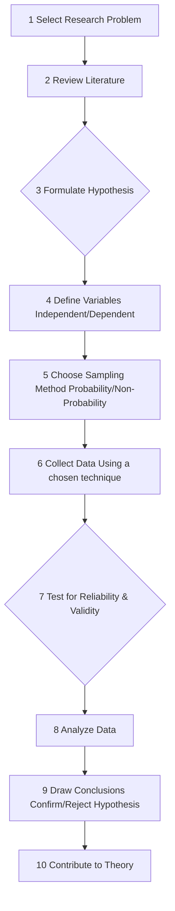
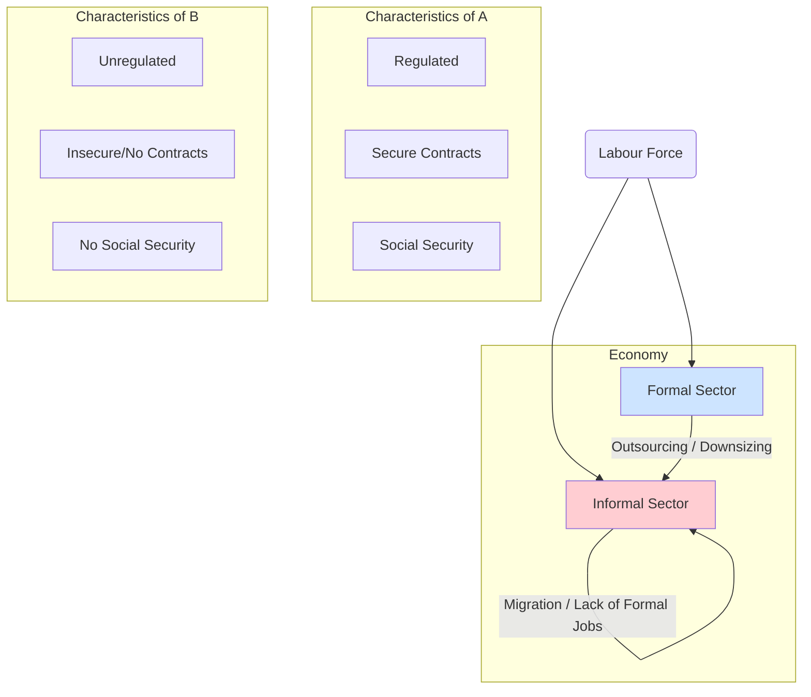
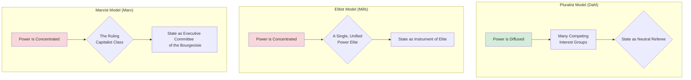
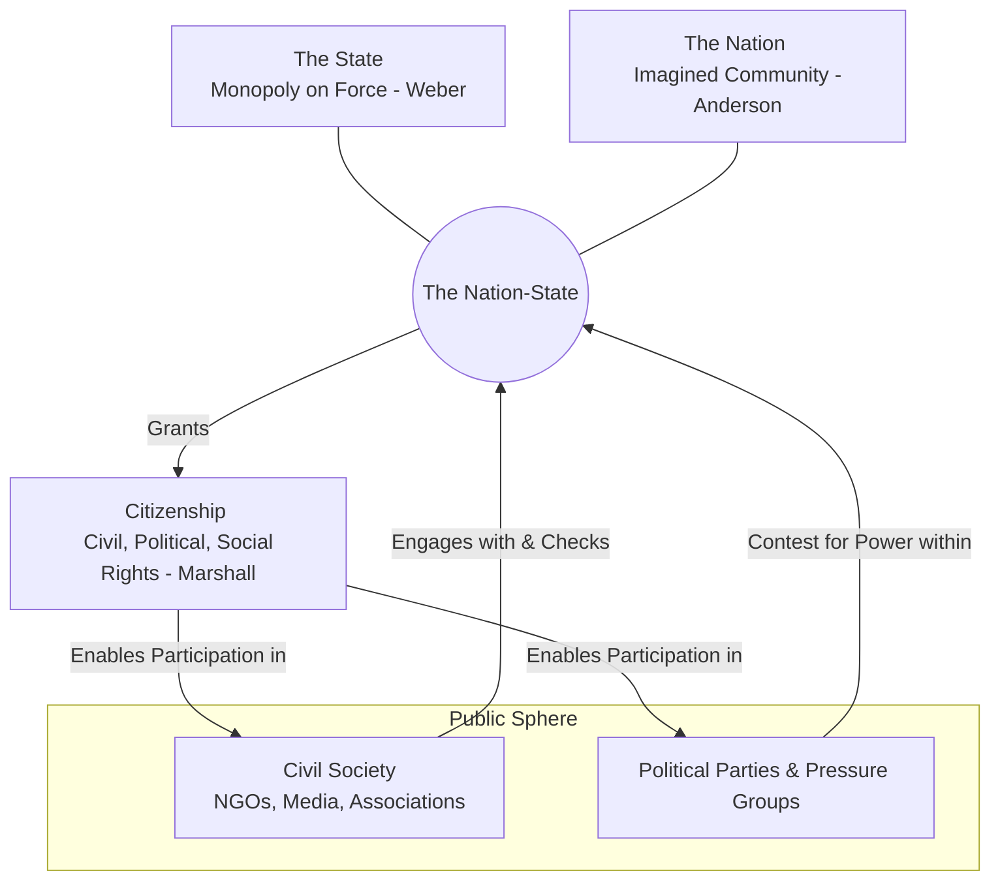
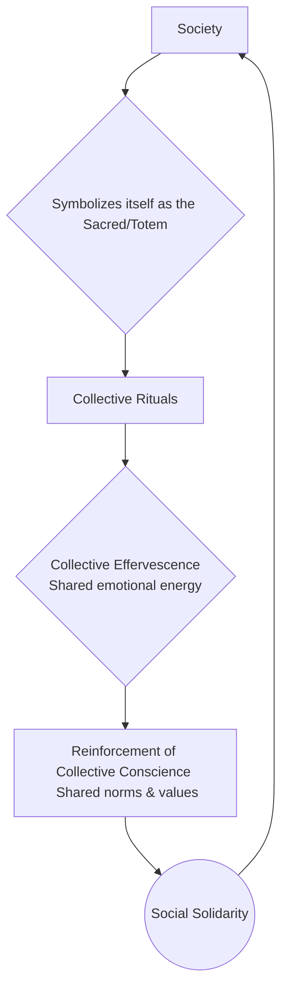
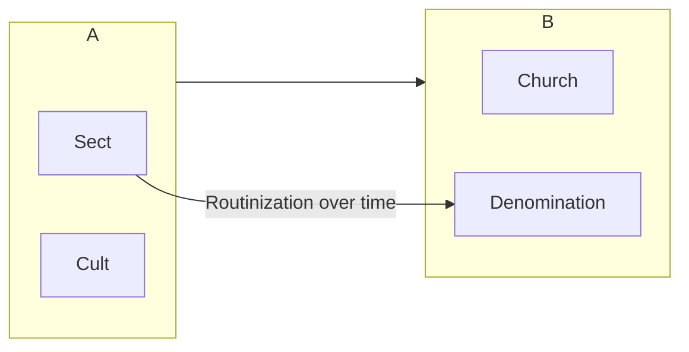
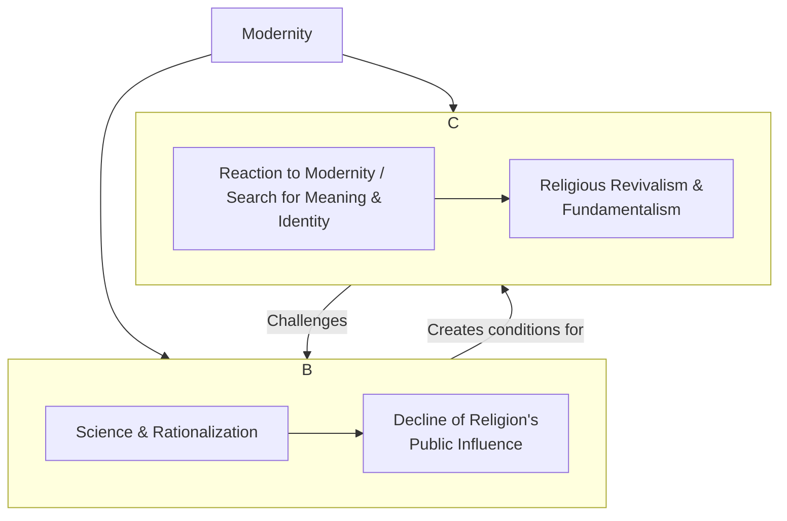
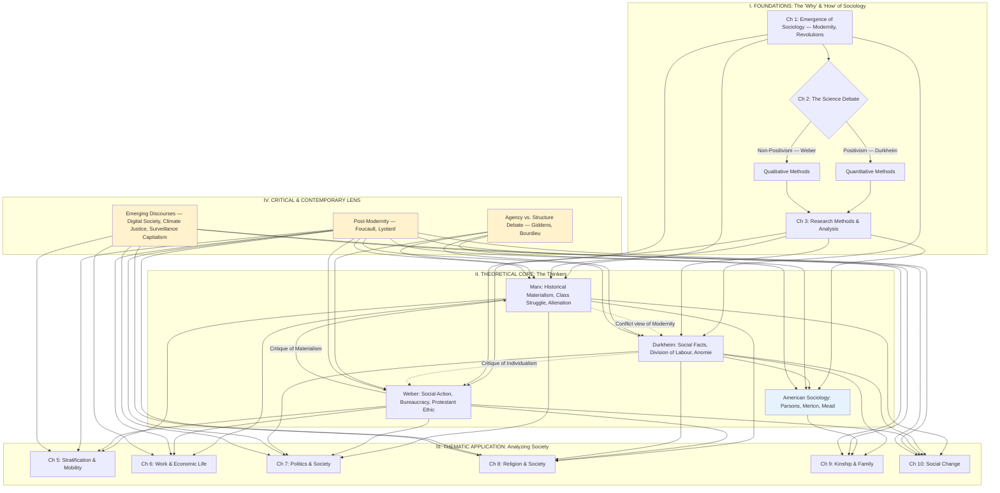

---

### **UPSC Sociology Optional - Paper 1 Notes**

### **Chapter 1: Sociology - The Discipline**

#### **1.1 Modernity and social changes in Europe and emergence of Sociology**

1.  **Introduction**
    *   Sociology emerged in 19th century Western Europe as a scientific and intellectual response to the profound social, economic, and political transformations triggered by Modernity. It sought to comprehend the chaos and construct a new social order.

2.  **The Context: Transition from Tradition to Modernity**
    *   Sociology is often called the "science of modernity." The transition involved a shift from:
        1.  **Tradition:** Feudal economy, religious authority (Church), community-centric life (`Gemeinschaft`), fixed social hierarchy, cyclical view of time.
        2.  **Modernity:** Industrial capitalism, secular-rational authority (State), individual-centric life (`Gesellschaft`), social mobility, linear view of progress.

3.  **Key Revolutions and their Sociological Impact**

    1.  **The Intellectual Revolution (Enlightenment & Scientific Revolution)**
        1.  **Core Idea:** Emphasized reason, empiricism, and humanism over superstition and divine will. It provided the ideological foundation for sociology.
        2.  **Key Thinkers:**
            *   `Montesquieu:` Argued social phenomena were subject to underlying laws (*The Spirit of the Laws*).
            *   `Rousseau:` Analyzed the social contract and sources of inequality.
        3.  **Impact:** Fostered the belief that a "science of society" was possible, capable of discovering social laws just as physics discovered natural laws.

    2.  **The French Revolution (Political Revolution)**
        1.  **Core Idea:** Overthrew the monarchy and feudal order, championing liberty, equality, and fraternity. It created massive social and political upheaval.
        2.  **Sociological Impact:**
            *   Generated concerns about social order, anarchy, and radical change.
            *   Led early thinkers like `Comte` and `Durkheim` to focus on social integration, solidarity, and the basis of a stable society.
            *   Brought concepts like state, citizenship, and rights to the forefront.

    3.  **The Industrial Revolution (Economic Revolution)**
        1.  **Core Idea:** A shift from agrarian, manual production to machine-based factory production, fundamentally altering the structure of society.
        2.  **Sociological Impact:**
            *   **Urbanization:** Mass migration to cities, leading to problems of slums, crime, and sanitation.
            *   **New Class Structure:** Emergence of the industrial bourgeoisie (capitalists) and the urban proletariat (working class).
            *   **New Work Ethic:** The factory system introduced disciplined, alienated labour.
            *   **Social Problems:** Widespread poverty, exploitation, and poor working conditions.
        3.  **Thinkers' Response:**
            *   `Karl Marx:` Focused on class conflict, exploitation, and alienation inherent in the new capitalist system.
            *   `Max Weber:` Studied the rise of bureaucracy and the rationalization of modern life.

4.  **Diagram: The Confluence of Forces**

    ```mermaid
    graph TD
        subgraph "Intellectual Forces"
            A[Enlightenment: Reason]
            B[Scientific Revolution: Empiricism]
        end

        subgraph "Material/Social Forces"
            C[Industrial Revolution]
            D[French Revolution]
        end

        A & B --> E{Intellectual Climate for a 'Science of Society'}
        C & D --> F{New Social Problems & Structures}

        E & F --> G((Emergence of Sociology))

        G --> H[Auguste Comte]
        G --> I[Karl Marx]
        G --> J[Emile Durkheim]
        G --> K[Max Weber]
    ```

5.  **Interlinkage (P1 <-> P2)**
    1.  Sociology's emergence in India was different. It was a response to the colonial encounter with modernity, not an organic process.
    2.  `Yogendra Singh` in *Modernization of Indian Tradition* argues that Indian modernity was "selective" and "contested," leading to unique social processes.
    3.  Early Indian sociology (e.g., `G.S. Ghurye`) focused on understanding Indian tradition (caste, tribes, village) through an Indological lens, a direct contrast to the European focus on industrialism.

6.  **Critique of the Eurocentric Narrative**
    1.  `Raewyn Connell` in *Southern Theory* argues that this standard origin story is Eurocentric.
    2.  She posits that sociological thought also developed in the colonies as a way to understand the experience of colonization and its impact, which is often ignored in mainstream accounts.

7.  **Conclusion**
    *   Sociology is fundamentally the child of European modernity, born from the intellectual tools of the Enlightenment and the social turmoil of the French and Industrial Revolutions. Its core questions remain rooted in this foundational experience of profound, disruptive change.

---

#### **1.2 Scope of the subject and comparison with other social sciences**

1.  **Introduction**
    *   The scope of sociology is vast and dynamic, encompassing the study of human social life, groups, and societies, from fleeting street encounters to global social processes. Its uniqueness lies in its holistic and relational perspective compared to other social sciences.

2.  **Defining the Scope: Two Major Schools of Thought**

    1.  **The Formalistic/Specialistic School**
        1.  **Core Idea:** Sociology should be a pure, independent science confined to studying the *forms* of social interaction, not their content.
        2.  **Proponents:**
            *   `Georg Simmel:` Argued sociology should study forms like competition, subordination, and division of labour, which are present in all social domains (economic, political, etc.).
            *   `Ferdinand Tönnies:` Differentiated between `Gemeinschaft` (community) and `Gesellschaft` (society) as two basic forms of human association.
        3.  **Critique:** Overly restrictive; form and content are inseparable in social reality.

    2.  **The Synthetic School**
        1.  **Core Idea:** Sociology should be a synthesis of all social sciences, studying society in its entirety. It is a general, not a pure, science.
        2.  **Proponents:**
            *   `Emile Durkheim:` Conceived of sociology as the study of 'social facts' (e.g., law, religion, economy) and their interrelationships.
            *   `Morris Ginsberg:` Saw sociology's role as discovering the relationship between different parts of society (e.g., how economic changes affect family structures).

3.  **C. Wright Mills: The Sociological Imagination**
    *   A more modern view on scope. `Mills` argued that sociology's true promise is its ability to connect "personal troubles" (e.g., one person's unemployment) with "public issues" (e.g., structural unemployment due to economic policy). It links individual biography with societal history.

4.  **Comparison with Other Social Sciences (Table Format)**

| **Discipline** | **Core Focus** | **Relationship with Sociology** | **Key Difference** |
| :--- | :--- | :--- | :--- |
| **History** | Past events, unique sequences. | Sociology uses historical data to find patterns; History uses sociological concepts. `G.E. Howard:` "History is past Sociology, and Sociology is present History." | History is idiographic (studies unique events); Sociology is nomothetic (seeks general laws/patterns). |
| **Political Science** | State, power, government, political behaviour. | Political Sociology studies the social bases of power, voting behaviour, social movements. `A.R. Desai` studied the social background of Indian nationalism. | Pol. Science focuses on formal power structures; Sociology studies both formal and informal power dynamics in all of society. |
| **Economics** | Production, distribution, consumption of goods/services; rational choice. | Economic Sociology (`Weber`, `Marx`) studies how social factors (culture, religion, class) shape economic behaviour. | Economics assumes rational actors maximizing utility; Sociology argues behaviour is shaped by non-rational social norms, values, and status. |
| **Anthropology** | **Social Anthro:** Simple, pre-literate, non-Western societies. **Cultural Anthro:** Culture, customs, beliefs. | Both use similar methods (participant observation). Sociology traditionally studied complex, modern societies. `M.N. Srinivas` used anthropological fieldwork to study Indian villages. | The distinction is blurring. Anthropology was the 'other's' study; Sociology was the 'self's' study. Now, both study all types of societies. Sociology is more quantitative. |
| **Psychology** | The individual mind, personality, cognition, emotion. | Social Psychology is a shared subfield, studying how the individual is shaped by the group. `G.H. Mead` studied the development of the 'self' through social interaction. | Psychology is individual-centric (internal processes); Sociology is group-centric (external social structures and forces). |

5.  **Interlinkage (P1 <-> P2)**
    1.  The scope of sociology in India is uniquely shaped by its context. It must engage with caste, religion, kinship, and agrarian structures, topics less central to early European sociology.
    2.  Indian sociologists like `Andre Beteille` (*Caste, Class, and Power*) have shown the necessity of a multi-disciplinary approach, combining sociological, economic, and political analyses to understand the Indian reality.

6.  **Contemporary Relevance: The Changing Scope**
    1.  **Globalization:** The scope has expanded from the nation-state to global networks, migration, and global culture.
    2.  **New Fields:** Emergence of new sub-disciplines like Sociology of the Internet, Sociology of Disasters, and Sociology of Emotions.
    3.  **Multidisciplinarity:** Growing importance of working with other sciences (e.g., environmental science, data science) to address complex problems like climate change or digital surveillance.

7.  **Conclusion**
    *   While the formalistic vs. synthetic debate defined its early boundaries, sociology's modern scope is broad, synthetic, and increasingly interdisciplinary. Its core strength remains its ability to provide a holistic understanding of social life by linking micro-level actions to macro-level structures.

---

#### **1.3 Sociology and common sense**

1.  **Introduction**
    *   Sociology's relationship with common sense is intimate yet fraught with tension. While sociology often begins with commonsensical observations, it systematically interrogates, refines, and frequently refutes these taken-for-granted assumptions through rigorous scientific methods.

2.  **The Nature of Common Sense**
    1.  **Definition:** Knowledge that people use to navigate their everyday lives. It is practical, localized, and often unexamined.
    2.  **Characteristics:**
        *   **Stereotypical:** Based on preconceived notions.
        *   **Unreflective:** Not subjected to critical scrutiny.
        *   **Contradictory:** Can hold opposing views simultaneously (e.g., "look before you leap" and "he who hesitates is lost").
        *   **Normative:** Often expresses what 'ought to be' rather than what 'is'.

3.  **How Sociology Differs from Common Sense**

    1.  **Systematic Method vs. Intuition:**
        *   `Peter Berger:` "The sociologist... tries to see what is there. He may have hopes or fears concerning what he may find. But he will try to see in spite of them."
        *   Sociology uses scientific methods (surveys, interviews, observation) with rules of evidence, ensuring reliability and validity. Common sense is impressionistic and based on limited personal experience.

    2.  **Broader Field of Enquiry vs. Localized View:**
        *   Common sense is tied to an individual's immediate social world.
        *   Sociology connects individual experiences to wider social structures and historical processes (`C. Wright Mills' Sociological Imagination`). For example, common sense might see poverty as individual failure; sociology examines structural factors like class, education, and economic policy.

    3.  **Causal Explanation vs. Tautology:**
        *   Common sense explanations are often tautological (circular). E.g., "People are poor because they are lazy."
        *   Sociology seeks to establish causal links between social phenomena. `Durkheim` in *Suicide* did not accept the commonsensical view of suicide as a purely personal act. He provided a sociological explanation by linking suicide rates to the level of social integration and regulation.

    4.  **Conceptual Framework vs. Ad-hoc Ideas:**
        *   `Andre Beteille:` "Sociology has a body of concepts, methods and data, commonsense has none."
        *   Sociology uses abstract concepts (e.g., social structure, anomie, cultural capital) to analyze the world. Common sense lacks this organized, theoretical framework.

4.  **The Interdependence of Sociology and Common Sense**

    1.  **Starting Point:** Common sense provides the raw material and initial questions for sociological research. Many sociological studies begin by testing a commonsensical hypothesis.
    2.  **Enriching Sociology:** `Anthony Giddens` argues for a "two-way" relationship. Sociological findings often filter back into society, becoming part of its common sense and changing social behaviour (e.g., the idea of "patriarchy").
    3.  **Critique of Positivism:** Non-positivist approaches like Ethnomethodology (`Garfinkel`) argue that the "common sense" methods people use to make sense of their world are the very subject matter of sociology.

5.  **Interlinkage (P1 <-> P2)**
    1.  In India, many commonsensical notions are tied to caste and religion (e.g., "caste is a thing of the past").
    2.  Sociological studies by scholars like `M.N. Srinivas` (*The Dominant Caste*) and `Andre Beteille` have systematically debunked these myths, showing the persistent and changing role of caste in modern Indian life, from politics to the economy.
6. Of course. Argdown is an excellent tool for mapping the dialectical relationship between Sociology and Common Sense. It visually captures the thesis, antithesis, and synthesis of the argument, which is perfect for memorization.
7. Argument Map: The Dialectic Relationship
   
 

### **Argdown Diagram**

```argdown
# Thesis

    + Sociology is systematic and empirical.

# Antithesis

    - Sociology is not distinct from common sense.

# Synthesis

    + Sociology and common sense are dialectically related.

```

**How to Interpret this for Exam Revision:**

*   **Thesis (The Main Argument):** Start by establishing the core differences. These are your primary points for a question asking "How is sociology different from common sense?"
*   **Antithesis (The Counter-Argument):** This provides the nuance and critical depth. Use these points to show the relationship isn't one of simple opposition. This is crucial for "Critically examine" or "Discuss" questions.
*   **Synthesis (The Conclusion):** This is your balanced, concluding thought. It acknowledges both sides and presents a sophisticated final take on the relationship.

This map provides a complete, multi-dimensional structure for any question on this topic.

I am now ready to proceed to **Chapter 2: Sociology as Science** whenever you are. Please confirm.

1.  **Conclusion**
    *   Sociology's task is to go beyond the surface-level assumptions of common sense. It is a disciplined, skeptical, and systematic "debunking" exercise that transforms private troubles into public issues, thereby offering a deeper and more critical understanding of the social world.

---
---
---

### **Chapter 2: Sociology as Science**

#### **2.1 Science, scientific method and critique**

1.  **Introduction**
    *   The claim of sociology to be a science has been a central and contentious debate since its inception. This debate revolves around whether the study of complex human society can, or should, adhere to the methods and assumptions of the natural sciences.

2.  **What is Science? Core Tenets**
    *   Science is not defined by its subject matter, but by its method. Key characteristics include:
        1.  **Empiricism:** Knowledge derived from sensory experience and observation.
        2.  **Objectivity:** Procedures and findings are free from personal bias and values.
        3.  **Testability & Falsifiability:** Hypotheses can be tested and potentially proven false (`Karl Popper`). A theory that cannot be falsified is not scientific.
        4.  **Cumulativity:** Knowledge builds upon previous research.
        5.  **Predictability:** Aims to predict future events based on established causal laws.
        6.  **Universality:** Findings are held to be true across time and space.

3.  **The Scientific Method in Sociology**
    *   A systematic process for acquiring knowledge.
        1.  **Selection of a Research Problem:** Identifying a gap in knowledge.
        2.  **Review of Literature:** Understanding existing research.
        3.  **Formulation of a Hypothesis:** A testable statement about the relationship between variables.
        4.  **Research Design:** A blueprint for collecting data (e.g., survey, experiment, ethnography).
        5.  **Data Collection:** Gathering empirical information.
        6.  **Data Analysis & Interpretation:** Identifying patterns and drawing conclusions.
        7.  **Theory Building/Generalization:** Formulating broader explanations.

4.  **Arguments FOR Sociology as a Science (The Positivist View)**
    1.  **Comte & Durkheim:** Argued society is a part of nature and can be studied objectively. `Durkheim`'s study of *Suicide* is a classic attempt to apply scientific method to discover social laws.
    2.  **Quantitative Methods:** Use of surveys, statistics, and large-scale data analysis allows for generalization and testing of hypotheses, mimicking natural sciences.
    3.  **Falsification is Possible:** Sociological hypotheses can be tested and falsified. E.g., the hypothesis that industrialization always leads to secularization can be tested and has been challenged by evidence of religious revivalism.
    4.  **Objectivity is a Goal:** While complete objectivity is difficult, sociologists use methods like peer review and triangulation to minimize bias.

5.  **Critique: Arguments AGAINST Sociology as a Science (The Non-Positivist View)**
    1.  **Problem of Objectivity:** Sociologists are part of the society they study, making value-neutrality a myth. `Alvin Gouldner` argued for a "reflexive sociology" where researchers acknowledge their own biases.
    2.  **Problem of Experimentation:** It is often impossible or unethical to conduct controlled experiments on human societies.
    3.  **Human Consciousness & Meaning:** Unlike natural objects, humans have consciousness, emotions, and intentions. They interpret the world and act upon it. Sociology must understand this subjective meaning (`Verstehen` - `Max Weber`), which cannot be measured like a chemical reaction.
    4.  **The Social Construction of Reality:** Social phenomena (e.g., gender, money) are not natural "things" but are created and sustained through social agreement. Their meaning can change across cultures and time, making universal laws difficult.
    5.  **Hawthorne Effect:** The very act of observation can change the behaviour of those being studied, compromising the validity of findings.

6.  **Interlinkage (P1 <-> P2)**
    1.  The "science" debate is reflected in Indian sociological methods. `A.R. Desai` used a Marxist (positivist, scientific) framework to analyze Indian nationalism.
    2.  In contrast, `M.N. Srinivas` used participant observation (a non-positivist, interpretive method) to develop concepts like 'Sanskritization' and 'Dominant Caste', which required deep, qualitative understanding, not just quantitative measurement.

7.  **Conclusion**
    *   Sociology is a science, but a different kind of science. It cannot be a slavish imitation of the natural sciences due to its unique subject matter—conscious, meaning-seeking human beings. It is a multi-paradigm science, employing both positivist and non-positivist methods to capture the complexity of social reality.

---

#### **2.2 Major theoretical strands of research methodology**

1.  **Introduction**
    *   Research methodology in sociology is not monolithic; it is guided by different theoretical strands or paradigms. These paradigms represent fundamental assumptions about the nature of social reality (ontology) and how it can be known (epistemology).

2.  **The Positivist Strand**
    1.  **Ontology (Nature of Reality):** Social reality is external, objective, and exists independently of the individual. Society has a definite structure and operates according to social laws.
    2.  **Epistemology (Nature of Knowledge):** Knowledge is gained through empirical observation, measurement, and the discovery of causal relationships. The goal is explanation (`Erklären`).
    3.  **Key Thinkers:** `Auguste Comte`, `Emile Durkheim`, `Karl Marx` (in his structural aspects).
    4.  **Preferred Methods:** Quantitative methods like surveys, experiments, statistical analysis, comparative method.
    5.  **Example:** `Durkheim`'s *Suicide* - used official statistics (quantitative data) to find correlations between suicide rates (the effect) and social integration (the cause).

3.  **The Interpretivist (Non-Positivist) Strand**
    1.  **Ontology:** Social reality is not external but is socially constructed through the meanings and interpretations of individuals. There is no single objective reality, but multiple subjective realities.
    2.  **Epistemology:** Knowledge is gained by understanding the subjective meanings, intentions, and motivations of social actors. The goal is understanding (`Verstehen`).
    3.  **Key Thinkers:** `Max Weber`, `G.H. Mead`, `Alfred Schutz`.
    4.  **Preferred Methods:** Qualitative methods like participant observation, unstructured interviews, case studies, ethnography.
    5.  **Example:** `Max Weber`'s *The Protestant Ethic and the Spirit of Capitalism* - sought to understand the subjective meaning (religious values of Calvinism) that motivated the economic actions leading to capitalism.

4.  **The Critical Strand**
    1.  **Ontology:** Social reality is shaped by power structures, conflict, and ideology, which create oppression and inequality (e.g., based on class, gender, race).
    2.  **Epistemology:** The goal of research is not just to understand or explain society, but to critique and change it. Knowledge should be emancipatory and empower the oppressed.
    3.  **Key Thinkers:** `Karl Marx` (in his activist aspects), Frankfurt School (`Adorno`, `Horkheimer`), Feminist scholars (`Ann Oakley`, `Dorothy Smith`).
    4.  **Preferred Methods:** A mix of methods, often historical analysis, ideological critique, and participatory action research.
    5.  **Example:** Feminist methodology (`Ann Oakley`) critiques traditional "masculine" research methods as hierarchical and exploitative. It advocates for collaborative, non-hierarchical interviews to empower female respondents.

5.  **Comparison Table: Major Theoretical Strands**

| **Basis** | **Positivism** | **Interpretivism** | **Critical Theory** |
| :--- | :--- | :--- | :--- |
| **Goal** | Explanation, Prediction | Understanding (`Verstehen`) | Critique, Emancipation |
| **Reality** | Objective, External | Subjectively Constructed | Structured by Power/Conflict |
| **Focus** | Social Structures, Laws | Individual Meanings, Actions | Ideology, Inequality, Change |
| **Methods** | Quantitative | Qualitative | Historical, Ideological Critique |
| **Thinker** | `Durkheim` | `Weber` | `Marx`, `Ann Oakley` |

6.  **Conclusion**
    *   The choice of a research methodology is not a neutral technical decision but a deeply theoretical one. Each strand offers a different lens to view society, and a comprehensive sociological understanding often requires drawing insights from all three.

---

#### **2.3 Positivism and its critique**

1.  **Introduction**
    *   Positivism, the first and most influential philosophical framework in sociology, asserts that society can and should be studied with the same scientific rigor as the natural world. Its subsequent critique gave rise to alternative methodologies that define the discipline today.

2.  **Core Tenets of Positivism**
    1.  **Founder:** `Auguste Comte` (coined the term).
    2.  **Key Proponent:** `Emile Durkheim`.
    3.  **Principles:**
        1.  **Scientific Unity:** All sciences, including sociology, share a common logic and method.
        2.  **Empiricism:** Knowledge must be based on observable, verifiable facts.
        3.  **Objectivity & Value-Neutrality:** The researcher must remain detached and unbiased.
        4.  **Causal Laws:** The goal is to identify cause-and-effect relationships to formulate general laws of social life.
        5.  **Structural Focus:** Focuses on social structures and institutions that constrain individual behaviour. `Durkheim`'s core rule: "Treat social facts as things."

3.  **Positivism in Practice: Durkheim's Study of Suicide**
    *   He deliberately chose suicide, a seemingly individual act, to prove the power of a positivist approach.
    *   He used quantitative data (official statistics) to show that suicide rates were stable social facts, not random occurrences.
    *   He established causal links between suicide rates and social forces like social integration (Egoistic/Altruistic suicide) and social regulation (Anomic/Fatalistic suicide).

4.  **Critique of Positivism (The Non-Positivist Rebuttal)**
    1.  **Neglect of Subjective Meaning (The Interpretivist Critique):**
        *   Positivism treats humans as passive objects reacting to external stimuli, ignoring their consciousness and ability to interpret their world.
        *   `Max Weber` argued for `Verstehen` (empathetic understanding) to grasp the subjective motives behind social action.
        *   `Jack Douglas`, in his critique of Durkheim, argued that suicide statistics are socially constructed. To understand suicide, one must uncover the meaning the act had for the individual.

    2.  **The Myth of Value-Freedom (The Critical Critique):**
        *   Positivism's claim of value-neutrality is an illusion. The choice of research topic, the concepts used, and the source of funding are all influenced by values.
        *   `Alvin Gouldner` argued that positivism, by focusing on "what is," implicitly supports the status quo and serves the interests of the powerful.

    3.  **The Problem of a 'Natural' Social World (The Social Constructionist Critique):**
        *   Positivism assumes society is a 'natural' object. But social phenomena like 'family' or 'crime' are not natural; they are defined and redefined by societies. Their meaning is not fixed, making universal laws problematic.

    4.  **The Limits of Observation (The Realist Critique):**
        *   `Karl Popper` and realists argue that science often deals with unobservable structures (e.g., gravity, atoms). Positivism's strict focus on observation is too restrictive. In sociology, structures like 'patriarchy' or 'capitalism' are not directly observable but have real effects.

5.  **Conclusion**
    *   While classical positivism is no longer dominant, its legacy persists in quantitative sociology. The critiques against it were foundational in establishing alternative paradigms—Interpretivism and Critical Theory—which together create the rich, multi-faceted discipline that sociology is today.

---

#### **2.4 Fact value and objectivity**

1.  **Introduction**
    *   The relationship between facts (what 'is'), values (what 'ought to be'), and the possibility of objectivity is a cornerstone of sociological debate. It questions whether a sociologist can, or even should, produce knowledge free from personal beliefs and societal ideologies.

2.  **Defining the Concepts**
    1.  **Facts:** Empirically verifiable statements about the world. They are objective and can be checked for accuracy. E.g., "The poverty rate in country X is 20%."
    2.  **Values:** Personal or collective beliefs about what is good, right, desirable, or important. They are subjective and cannot be empirically proven. E.g., "Poverty is bad and should be eradicated."
    3.  **Objectivity:** The ability to conduct research and present findings without being influenced by personal values, biases, or emotions. It implies value-neutrality.

3.  **The Classical Positions on Objectivity**

    1.  **Emile Durkheim (For Objectivity):**
        1.  **Stance:** Advocated for maximum objectivity. Sociology must be a science of 'social facts'.
        2.  **Method:** Proposed two key rules:
            *   "Treat social facts as things" – study them externally, like objects in nature.
            *   "Eradicate all preconceptions" – the sociologist must shed their common-sense ideas and values.
        3.  **Critique:** Critics argue that social facts are not 'things' but are imbued with meaning, and eradicating all values is psychologically impossible.

    2.  **Max Weber (A Middle Path):**
        1.  **Stance:** Proposed a more nuanced view, distinguishing between different stages of research.
        2.  **Argument:**
            *   **Value-Relevance (in choice of topic):** Values are unavoidable and even necessary when a sociologist *chooses* a topic to study. We study what we deem important (e.g., capitalism, bureaucracy).
            *   **Value-Neutrality (in data collection/analysis):** Once the topic is chosen, the researcher must be objective and value-neutral in their investigation. They must report the facts as they are, even if they dislike them.
        3.  **Key Concept:** `Ideal Types` - Weber proposed this methodological tool to aid objective analysis by creating a one-sided, rational model against which messy reality can be compared.

4.  **The Critique of Objectivity**

    1.  **Alvin Gouldner ("The Myth of a Value-Free Sociology"):**
        1.  **Stance:** Argued that value-freedom is a myth that serves the powerful.
        2.  **Argument:** By claiming to be neutral, sociologists often implicitly accept the existing power structures and avoid asking critical questions. He called for a "reflexive sociology" where sociologists openly acknowledge their values and moral commitments.

    2.  **Feminist Standpoint Theory (`Dorothy Smith`, `Sandra Harding`):**
        1.  **Stance:** Objectivity is not only a myth but a "male" or "dominant" perspective masquerading as universal truth.
        2.  **Argument:** Knowledge is always situated. The perspective of marginalized groups (like women) can provide a more complete and less distorted view of reality than the perspective of the dominant group. True objectivity, for them, comes from acknowledging and starting from these marginalized standpoints.

    3.  **Postmodernism (`Foucault`, `Lyotard`):**
        1.  **Stance:** Rejects the very idea of objective truth.
        2.  **Argument:** All knowledge is a form of "discourse" that is tied to power. There is no single, universal truth, only competing "narratives" or "truths." The claim to objectivity is a claim to power.

5.  **Conclusion**
    *   While complete objectivity may be an unattainable ideal, it remains a crucial guiding principle in sociological research. The debate has shifted from a naive belief in absolute value-freedom to a more sophisticated understanding of the need for reflexivity, methodological rigor, and acknowledging the inevitable influence of values.

---

#### **2.5 Non-positivist methodologies**

1.  **Introduction**
    *   Non-positivist methodologies emerged as a direct critique of positivism's failure to account for human consciousness, meaning, and subjective experience. They argue that the study of society requires a different epistemological and methodological toolkit than the natural sciences.

2.  **Core Principle: The Primacy of Subjectivity**
    *   All non-positivist approaches share a common foundation: social reality is not an external structure but is actively created and sustained by the interpretations and actions of individuals. The goal is to understand this subjective world.

3.  **Major Non-Positivist Methodologies**

    1.  **Interpretivism / Verstehen (Max Weber):**
        1.  **Core Idea:** To understand social action, the sociologist must grasp the subjective meaning an actor attaches to it. `Verstehen` means "empathetic understanding."
        2.  **Method:** It is not just intuition. Weber advocated combining `Verstehen` with causal analysis. The `Ideal Type` is a key tool for this.
        3.  **Example:** To understand capitalism, one must understand the religious meanings that motivated the early Protestant entrepreneurs.

    2.  **Symbolic Interactionism (`G.H. Mead`, `Herbert Blumer`):**
        1.  **Core Idea:** Society is the product of everyday interactions between individuals. People act based on the meanings they assign to things, and these meanings are derived from social interaction and modified through interpretation.
        2.  **Method:** Focus on micro-level interactions. Participant observation is a key method to see how people create and negotiate meanings in real-life settings.
        3.  **Example:** `Howard Becker`'s study of marijuana users showed how individuals *learn* to define the experience as pleasurable through social interaction.

    3.  **Phenomenology (`Alfred Schutz`):**
        1.  **Core Idea:** Seeks to understand how individuals experience and make sense of the world. It focuses on the "lifeworld" (`Lebenswelt`)—the taken-for-granted reality of everyday life.
        2.  **Method:** Focuses on uncovering the "typifications" or stocks of common-sense knowledge people use to classify their experiences and interact with others.
        3.  **Example:** Studying how people in a queue typify each other's behaviour to maintain order without explicit rules.

    4.  **Ethnomethodology (`Harold Garfinkel`):**
        1.  **Core Idea:** The study of the "methods" that people use on a daily basis to produce and sustain a sense of social order. It argues that social order is not a pre-existing structure but a moment-to-moment accomplishment.
        2.  **Method:** Uses "breaching experiments" (disrupting normal social situations) to make the hidden, taken-for-granted rules of social life visible.
        3.  **Example:** Garfinkel had his students act like boarders in their own homes to reveal the unstated rules and assumptions of family life.

4.  **Critique of Non-Positivist Methodologies**
    1.  **Accusation of being "Unscientific":** Critics argue these methods are too subjective, impressionistic, and produce findings that are difficult to generalize.
    2.  **Neglect of Macro Structures:** By focusing on micro-level interactions, they are often accused of ignoring the impact of larger social structures like class, the state, or patriarchy on individual lives.
    3.  **Problem of `Verstehen`:** How can a researcher truly know they have accurately understood the subjective meaning of another person, especially one from a different culture or historical period?

5.  **Conclusion**
    *   Non-positivist methodologies fundamentally shifted the focus of sociology from external structures to subjective meanings and everyday interactions. While they face critiques about their scientific rigor, they provide an indispensable lens for understanding the socially constructed nature of our world, offering a vital complement to positivist approaches.

**2.6 Chapter Summary: The Epistemological Spectrum of Sociology**
### **Argdown Diagram: The Debate on Sociology as a Science**

```argdown
# Is Sociology a Science? The Central Debate

[Thesis: Sociology is a Natural Science (Positivism)]
    - Argues: Society is an objective, external reality. It can be studied empirically to discover universal social laws.
    - Goal: Explanation & Prediction (`Erklären`).
    - Method: Quantitative (Surveys, Statistics).
    - Thinkers: Comte, Durkheim.
    - Example: Durkheim's study of suicide rates as 'social facts'.

    -> <Critique 1: The Problem of Meaning>
        - Argues: Humans are conscious, meaning-making actors, not passive objects. Social reality is subjectively interpreted.
        - Goal: Understanding (`Verstehen`).
        - Thinkers: Weber, Schutz.
        - Leads to: [Interpretivism]
            - Method: Qualitative (Participant Observation, Interviews).
            - Example: Weber's study of the 'spirit' of capitalism.

    -> <Critique 2: The Problem of Objectivity & Values>
        - Argues: Value-freedom is a myth. Research is inherently political and reflects power structures.
        - Goal: Critique & Emancipation.
        - Thinkers: Marx, Frankfurt School, Feminists (Gouldner, Oakley).
        - Leads to: [Critical Theory]
            - Method: Historical-Dialectical, Ideological Critique.
            - Example: Feminist critique of 'malestream' research methods.

    -> <Critique 3: The Problem of Empiricism>
        - Argues: Science often studies unobservable structures (e.g., gravity). Strict empiricism is limiting.
        - Goal: Explaining underlying mechanisms.
        - Thinkers: Karl Popper, Roy Bhaskar.
        - Leads to: [Scientific Realism]
            - Method: Abstraction, identifying generative mechanisms.
            - Example: Analyzing 'patriarchy' as a deep, unobservable structure with real effects.

[Conclusion: Sociology is a Multi-Paradigm Science]
    - Argues: No single approach is sufficient. Sociology uses a combination of positivist, interpretivist, and critical methods to capture the complexity of social life. It is a science, but a unique social science.
```

---
---
---

### **Chapter 3: Research Methods and Analysis**

#### **3.1 Qualitative and quantitative methods**

1.  **Introduction**
    *   The distinction between quantitative and qualitative methods represents the most fundamental methodological divide in sociology. This division stems directly from the epistemological debate between positivism and interpretivism, shaping how sociologists collect and analyze data.

2.  **Quantitative Methods**
    1.  **Philosophical Underpinning:** Positivism. Assumes an objective social reality that can be measured.
    2.  **Core Goal:** To measure social phenomena, identify causal relationships, and make generalizations about a larger population. Focuses on the 'what', 'where', and 'when'.
    3.  **Nature of Data:** Numerical data, statistics, counts, and measures. Data is 'hard' and reliable.
    4.  **Key Techniques:**
        *   **Surveys & Questionnaires:** Collecting data from large samples using standardized, closed-ended questions.
        *   **Social Experiments:** Studying cause-and-effect under controlled conditions (rare in sociology).
        *   **Structured Interviews:** Using a fixed set of questions for all respondents.
        *   **Analysis of Official Statistics:** Using government data (e.g., census, crime rates).
    5.  **Strengths:**
        *   **Generalizability:** Findings from a representative sample can be applied to the whole population.
        *   **Reliability:** The standardized nature of the research allows it to be easily replicated by other researchers.
        *   **Objectivity:** Reduces researcher bias through standardized procedures.
    6.  **Weaknesses:**
        *   **Lacks Depth:** Fails to capture the context, meaning, and subjective experience behind the numbers.
        *   **Superficiality:** Can provide a "snapshot" but not a deep understanding of social processes.
        *   **Imposes Researcher's Framework:** The pre-set questions may not reflect the respondent's true concerns or reality.

3.  **Qualitative Methods**
    1.  **Philosophical Underpinning:** Interpretivism/Non-positivism. Assumes social reality is subjectively constructed.
    2.  **Core Goal:** To gain a deep, rich, and holistic understanding of social life from the perspective of the participants. Focuses on the 'why' and 'how'.
    3.  **Nature of Data:** Non-numerical data like text, interview transcripts, images, and field notes. Data is 'rich' and high in validity.
    4.  **Key Techniques:**
        *   **Participant Observation/Ethnography:** The researcher immerses themselves in a social setting to observe behaviour firsthand.
        *   **Unstructured/In-depth Interviews:** Open-ended, flexible conversations to explore topics in detail.
        *   **Focus Group Discussions (FGDs):** A guided discussion with a small group to explore their collective views.
        *   **Case Studies:** Intensive analysis of a single case (a person, group, or event).
    .   **Strengths:**
        *   **High Validity:** Provides a true-to-life and authentic picture of the social world.
        *   **Depth and Detail:** Uncovers complex social processes and subjective meanings.
        *   **Flexibility:** Allows the researcher to adapt and explore new avenues as they emerge during research.
    5.  **Weaknesses:**
        *   **Low Reliability:** The research is highly dependent on the individual researcher's skills and interpretations, making it difficult to replicate.
        *   **Lack of Generalizability:** Findings are typically based on small, non-representative samples.
        *   **Researcher Bias:** The close involvement of the researcher can lead to subjectivity or "going native."

4.  **The Complementarity of Methods: Triangulation**
    *   `Norman Denzin` advocated for **triangulation**, the use of multiple methods to study the same phenomenon.
    *   This approach combines the strengths of both quantitative (breadth) and qualitative (depth) methods to produce a more comprehensive and valid understanding.
    *   **Example:** A study on poverty could use a quantitative survey to measure its extent and a qualitative study (in-depth interviews) to understand the lived experience of being poor.

5.  **Interlinkage (P1 <-> P2)**
    1.  `M.N. Srinivas`'s study of Rampura village used qualitative participant observation (the 'field-view').
    2.  `A.R. Desai`'s work on Indian nationalism primarily used a quantitative/historical analysis of documents and statistics (the 'book-view').
    3.  This highlights how the choice of method in Indian sociology often reflects the researcher's theoretical perspective on Indian society.

```arg
# The Methodological Debate: Quantitative vs. Qualitative

<Thesis: Quantitative Methods are Superior>
    + [Scientific Rigor]: Adheres to positivist ideals of objectivity, reliability, and measurement.
    + [Generalizability]: Allows for statistical generalization from a sample to a population.
    + [Breadth]: Can study large-scale social patterns and structures efficiently.
    - [Critique]: Lacks depth and context; treats individuals as numbers, ignoring subjective meaning.

<Antithesis: Qualitative Methods are Superior>
    + [High Validity]: Provides a deep, authentic understanding of social reality from the actors' perspective (`Verstehen`).
    - [Critique]: Accused of being subjective, impressionistic, and difficult to generalize from small samples.
    + [Depth]: Uncovers the 'why' and 'how' behind social actions and processes.

<Synthesis: Methodological Pluralism (Triangulation)>
    - Argues: The debate is a false dichotomy. Neither method is inherently superior.
    + [Complementarity]: The choice of method should be driven by the research question.
    + [Triangulation (Denzin)]: Combining both methods provides a more complete and valid picture. It leverages the breadth of quantitative with the depth of qualitative.
    - Conclusion: Modern sociology favors a pragmatic, multi-method approach over rigid adherence to one paradigm.
```

6.  **Conclusion**
    *   The quantitative-qualitative debate is not about which method is superior, but which is appropriate for the research question. The modern consensus favors methodological pluralism and triangulation, recognizing that a complete sociological picture requires both measuring social structures and understanding subjective experiences.

---

#### **3.2 Techniques of data collection**

1.  **Introduction**
    *   Data collection techniques are the practical tools sociologists use to gather empirical evidence. The choice of technique is determined by the research question, the theoretical paradigm, and practical considerations like time, cost, and access.

2.  **Primary Data Collection Techniques** (Data collected firsthand by the researcher)

    1.  **Observation:**
        *   **Participant Observation:** The researcher becomes part of the group they are studying. `William F. Whyte`'s *Street Corner Society* is a classic example.
        *   **Non-Participant Observation:** The researcher observes from a distance without getting involved.
        *   **Strengths:** High validity, provides rich context.
        *   **Weaknesses:** Time-consuming, risk of 'going native', ethical issues (covert observation).

    2.  **Interview:**
        *   **Structured:** Formal, with a fixed set of questions (quantitative).
        *   **Unstructured:** Informal, conversational, flexible (qualitative).
        *   **Semi-structured:** A mix of fixed and open-ended questions.
        *   **Strengths:** Flexible, allows for probing and clarification.
        *   **Weaknesses:** Interviewer bias, social desirability bias (respondents give 'correct' answers).

    3.  **Questionnaire:**
        *   A set of written questions to which respondents provide answers. Can be administered in person, by mail, or online.
        *   **Closed-ended questions:** Provide pre-set answers (e.g., Yes/No, multiple choice).
        *   **Open-ended questions:** Allow respondents to answer in their own words.
        *   **Strengths:** Cost-effective for large samples, ensures anonymity.
        *   **Weaknesses:** Low response rates, respondents cannot ask for clarification.

    4.  **Focus Group Discussion (FGD):**
        *   A small group (6-10 people) led by a moderator to discuss a specific topic.
        *   **Strengths:** Generates diverse ideas through group interaction, reveals group norms.
        *   **Weaknesses:** A few dominant individuals might control the discussion, groupthink.

3.  **Secondary Data Collection Techniques** (Data that already exists)

    1.  **Official Statistics:**
        *   Government-collected data like the Census of India, National Sample Survey (NSS), National Crime Records Bureau (NCRB).
        *   **Strengths:** Covers large populations, allows for trend analysis.
        *   **Weaknesses:** Data may not be in the format the sociologist needs; `J. Douglas` argues statistics are social constructions, not objective facts.

    2.  **Documents:**
        *   **Personal Documents:** Diaries, letters, autobiographies.
        *   **Public Documents:** Government reports, newspapers, company records.
        *   **Historical Documents:** Used to study past societies.
        *   **Strengths:** Provides rich historical and personal context.
        *   **Weaknesses:** Authenticity and credibility can be questionable.

4.  **Modern Techniques: Digital Ethnography & Big Data**
    1.  **Digital Ethnography:** Studying online communities and interactions (e.g., social media groups, forums).
    2.  **Big Data Analysis:** Analyzing massive datasets from digital sources to identify social patterns (e.g., tracking disease spread through search queries).
    3.  **Strengths:** Access to vast amounts of naturally occurring data.
    4.  **Weaknesses:** Ethical concerns (privacy, consent), digital divide (not everyone is online).

5.  **Conclusion**
    *   Each data collection technique has unique strengths and limitations. A skilled sociologist chooses the most appropriate tool for their research objective and often employs multiple techniques (triangulation) to ensure the richness and validity of their findings.

---

#### **3.3 Variables, sampling, hypothesis, reliability and validity**

1.  **Introduction**
    *   These concepts form the bedrock of rigorous quantitative research design. They provide the framework for transforming abstract sociological questions into testable propositions and ensuring that the research findings are both credible and generalizable.



2.  **Key Concepts in Research Design**

    1.  **Variables:**
        *   **Definition:** A concept or characteristic that can take on different values (e.g., age, income, social class, level of education).
        *   **Types:**
            *   **Independent Variable (IV):** The variable that is presumed to be the cause. It is manipulated by the researcher.
            *   **Dependent Variable (DV):** The variable that is the presumed effect. It changes in response to the IV.
        *   **Example:** In a study of education and income, 'level of education' is the IV, and 'income' is the DV.

    2.  **Hypothesis:**
        *   **Definition:** A specific, testable statement about the expected relationship between two or more variables.
        *   **Function:** It provides a clear direction for the research and a framework for analyzing the results.
        *   **Example:** "Higher levels of education (IV) are associated with higher levels of income (DV)."
        *   **Null Hypothesis (H₀):** A statement of 'no relationship' between variables, which the researcher aims to disprove.

    3.  **Sampling:**
        *   **Definition:** The process of selecting a subset of a population to study, from which generalizations can be made about the entire population.
        *   **Types of Sampling:**
            *   **Probability (Random) Sampling:** Every member of the population has a known, non-zero chance of being selected. This is essential for generalizability.
                *   *Simple Random:* Like a lottery.
                *   *Systematic:* Selecting every nth person from a list.
                *   *Stratified:* Dividing the population into strata (e.g., by gender, caste) and sampling from each.
            *   **Non-Probability Sampling:** Selection is not random. Used in qualitative research where generalizability is not the primary goal.
                *   *Convenience:* Selecting whoever is easily available.
                *   *Snowball:* Asking initial participants to refer others. Used for hard-to-reach populations.
                *   *Purposive:* Selecting specific individuals who fit the research criteria.

    4.  **Reliability:**
        *   **Definition:** The consistency and repeatability of a research measure. If the same study is conducted again, will it produce the same results?
        *   **Concern:** Are the research tools (e.g., questionnaire questions) consistent?
        *   **Example:** A weighing scale that shows a different weight each time is unreliable. A survey question that is interpreted differently by different people is unreliable.

    5.  **Validity:**
        *   **Definition:** The accuracy of a research measure. Does it actually measure what it claims to measure?
        *   **Concern:** Is the research capturing the true social reality?
        *   **Example:** Using church attendance to measure religiosity might lack validity, as people can be religious without attending church. Qualitative methods are often said to have higher validity than quantitative ones.

3.  **The Relationship between Reliability and Validity**
    *   A measure can be reliable but not valid. (e.g., a broken clock is reliable—it's consistently wrong—but not valid).
    *   A measure cannot be valid if it is not reliable. If a measure is inconsistent, it cannot be accurate.
    *   **Ideal:** Sociological research aims for measures that are both reliable and valid.

4.  **Conclusion**
    *   These concepts are the grammar of scientific social research. A clear hypothesis, appropriate variables, a sound sampling strategy, and a commitment to ensuring reliability and validity are what distinguish rigorous sociological inquiry from mere speculation or common sense.


---
---
---

### **Chapter 4: Sociological Thinkers**

#### **4.1 Karl Marx (1818-1883)**

**Introduction**
*   Karl Marx was a German philosopher, economist, and revolutionary socialist whose work provides a powerful critical analysis of capitalism. His materialist conception of history, theory of class struggle, and concept of alienation form a foundational pillar of sociological thought, offering a conflict-based perspective on society.

---

#### **4.1.1 Historical Materialism**

1.  **Introduction**
    *   Historical Materialism is Marx's core philosophy of history and the methodological foundation of his work. It posits that the material conditions of a society—specifically, the way humans produce their means of subsistence—are the primary drivers of historical change and shape all other aspects of society.

2.  **Core Idea: Rejection of Hegelian Idealism**
    1.  **Hegel's Idealism:** Argued that history is driven by the evolution of ideas (`Geist` or spirit). The material world is a reflection of the world of ideas.
    2.  **Marx's Materialism:** Marx "turned Hegel on his head." He argued it is not consciousness that determines existence, but social existence that determines consciousness. The real, material world (economic production) shapes the world of ideas (superstructure).

3.  **The Base-Superstructure Model**
    *   This is the central framework of Historical Materialism.

    1.  **Base (The Foundation):** The economic foundation of society. It consists of:
        *   **Forces of Production:** The technology, raw materials, and labour power used in production. (e.g., tools, factories, skills).
        *   **Relations of Production:** The social relationships people enter into to produce goods. This is primarily the class relationship between those who own the means of production and those who do not. (e.g., master-slave, lord-serf, bourgeoisie-proletariat).

    2.  **Superstructure (The Edifice):** All other institutions and ideologies in society, which are shaped by and serve to legitimize the economic base. It includes:
        *   **Institutions:** State, law, family, education.
        *   **Ideologies:** Religion, philosophy, art, dominant values.
        *   **Function:** The superstructure maintains and reproduces the relations of production. For example, the legal system protects private property, and religion (`"the opium of the people"`) pacifies the oppressed.

4.  **Mermaid Diagram: Base-Superstructure Model**

    ```mermaid
    graph TD
        subgraph Superstructure [Ideological & Institutional Realm]
            A[Politics & Law]
            B[Religion & Culture]
            C[Family & Education]
        end

        subgraph Base [Economic Foundation - Mode of Production]
            D{Relations of Production <br/> (Class Structure)}
            E{Forces of Production <br/> (Technology, Labour)}
        end

        Base -- Determines --> Superstructure;
        Superstructure -- Maintains & Legitimizes --> Base;

        D -- Shapes --> E;
        E -- Influences --> D;
    ```
    *   **Placement:** This diagram should be placed right after the explanation of the Base-Superstructure model to visually represent the relationship.

5.  **Dialectical Materialism: The Engine of Change**
    *   History progresses through a series of contradictions and conflicts within the economic base.
        1.  **Thesis:** A given Mode of Production (e.g., Feudalism).
        2.  **Antithesis:** The Forces of Production (e.g., new technology, a new class like the bourgeoisie) develop and come into conflict with the existing Relations of Production (the feudal lord-serf relationship).
        3.  **Synthesis:** This contradiction leads to a period of social revolution, resulting in a new Mode of Production (e.g., Capitalism) with a new class structure.

6.  **Interlinkage (P1 <-> P2)**
    1.  `A.R. Desai` applied the Historical Materialist framework to India in his *Social Background of Indian Nationalism*. He argued that the rise of Indian nationalism was not just an ideological movement but was rooted in the new material conditions and class structure created by British colonialism (the introduction of capitalism).
    2.  This contrasts with Indological approaches (`Ghurye`) that emphasize culture and ideas (superstructure) as the primary movers of Indian society.

7.  **Critique of Historical Materialism**
    1.  **Economic Determinism:** Critics (`Max Weber`) argue that Marx overemphasized the economy and neglected the independent role of ideas. Weber's *The Protestant Ethic* shows how religious ideas (superstructure) can shape the economic base (capitalism).
    2.  **Oversimplified Model:** The Base-Superstructure model is seen as too rigid. The relationship is more complex and dialectical than a simple one-way determination.
    3.  **Neglect of Agency:** The theory can be deterministic, suggesting individuals are mere puppets of economic forces, downplaying their ability to shape their own history.

8.  **Conclusion**
    *   Despite its critiques, Historical Materialism remains a profoundly influential sociological tool. It provides a powerful framework for analyzing the relationship between economic structures, social institutions, and historical change, forcing a critical examination of the material basis of social life.

---

#### **4.1.2 Mode of Production**

1.  **Introduction**
    *   The Mode of Production (MoP) is the central concept in Marx's theory of historical epochs. It refers to the specific way in which a society is organized to produce its means of subsistence, combining its technology and its class structure.

2.  **Components of the Mode of Production**
    *   As explained in Historical Materialism, the MoP is a combination of:
        1.  **Forces of Production:** The technological and material capacity of a society.
        2.  **Relations of Production:** The system of ownership and control, which defines the main social classes.

3.  **Historical Progression of Modes of Production**
    *   Marx identified a sequence of MoPs, each defined by its own internal contradictions that lead to its downfall and the rise of the next.

    ```mermaid
    graph LR
        A[Primitive Communism] --> B[Ancient/Slave MoP];
        B --> C[Feudal MoP];
        C --> D[Capitalist MoP];
        D --> E[Socialism/Communism];

        subgraph A
            direction LR
            F1[Forces: Basic tools]
            R1[Relations: No private property, communal ownership]
        end
        subgraph B
            direction LR
            F2[Forces: Agriculture, large estates]
            R2[Relations: Master-Slave]
        end
        subgraph C
            direction LR
            F3[Forces: Advanced agriculture, guilds]
            R3[Relations: Lord-Serf]
        end
        subgraph D
            direction LR
            F4[Forces: Industrial machinery, factories]
            R4[Relations: Bourgeoisie-Proletariat]
        end
        subgraph E
            direction LR
            F5[Forces: Advanced technology]
            R5[Relations: Classless, communal ownership]
        end
    ```

4.  **Key Modes of Production Explained**

| **Mode of Production** | **Forces of Production** | **Relations of Production (Core Conflict)** | **Key Features** |
| :--- | :--- | :--- | :--- |
| **Primitive Communism** | Basic hunting/gathering tools | Communal ownership, no classes | No surplus, no exploitation. |
| **Ancient (Slave)** | Large-scale agriculture | **Master vs. Slave** | Private ownership of people (slaves) as means of production. |
| **Feudalism** | Advanced agriculture, artisan crafts | **Lord vs. Serf** | Serfs tied to the land, giving surplus labour to the lord in exchange for protection. |
| **Capitalism** | Industrial machinery, factories | **Bourgeoisie vs. Proletariat** | Private ownership of means of production. Proletariat are 'free' but must sell their labour power to survive. Exploitation is hidden in the wage system. |
| **(Asiatic MoP)** | Large-scale irrigation works | State bureaucracy vs. village communities | A controversial category Marx used for societies like India/China. Characterized by a strong, centralized state that extracts surplus from self-sufficient villages. |

5.  **Interlinkage (P1 <-> P2)**
    1.  The concept of the **Asiatic Mode of Production** was Marx's attempt to understand non-European societies. It has been heavily debated in the Indian context.
    2.  Scholars have analyzed pre-colonial India to see if it fits the AMoP model. Others have critiqued it as an orientalist and overly simplistic view of India's complex agrarian and political history.
    3.  The transition from a pre-capitalist (arguably feudal or Asiatic) mode to a capitalist mode in India under colonialism is a central theme of Indian historical sociology.

6.  **Conclusion**
    *   The Mode of Production is Marx's key analytical tool for classifying societies and understanding historical dynamics. It provides a structured way to analyze how a society's economic organization generates its class structure, conflicts, and potential for revolutionary transformation.

---

*(I will proceed with Alienation and Class Struggle next, following this structure.)*


Perfect. Continuing with Karl Marx.

---

#### **4.1.3 Alienation**

1.  **Introduction**
    *   Alienation (`Entfremdung`) is a central concept in Marx's early, more humanist work (*Economic and Philosophic Manuscripts of 1844*). It describes the condition under capitalism where individuals are estranged from their own human nature (`Gattungswesen` or species-essence), their work, and their fellow human beings.

2.  **Core Idea: Alienation as a Product of Capitalism**
    1.  **Pre-Capitalist Societies:** Marx believed that in earlier societies (e.g., artisans), workers had control over their labour and its products, leading to a sense of fulfillment and identity.
    2.  **Capitalist Society:** Under capitalism, labour is not a creative expression but a commodity to be bought and sold. The worker does not work to fulfill themselves but merely to survive. This leads to a profound sense of powerlessness and estrangement.

3.  **The Four Dimensions of Alienation**
    *   Marx identified four interconnected ways in which the worker is alienated under capitalism.

    ```mermaid
    graph TD
        A[Capitalist Mode of Production Private Ownership & Wage Labour] --> B{Alienation};
        
        B --> C[1. From the Product of Labour];
        B --> D[2. From the Process of Labour];
        B --> E[3. From Oneself Species-Essence];
        B --> F[4. From Other Humans];
    ```
    *   **Placement:** This flowchart should be placed right after the introduction to outline the four dimensions.

    1.  **Alienation from the Product of Labour:**
        *   The product of the worker's labour does not belong to them but to the capitalist.
        *   The more the worker produces, the poorer they become in relation to the world of objects they have created. The product stands opposite them as an alien, powerful object.
        *   **Example:** A factory worker on an assembly line for a luxury car will likely never own the car they help create.

    2.  **Alienation from the Process of Labour (the Act of Production):**
        *   Work is not voluntary but is forced, external labour. The worker has no control over the design, pace, or conditions of their work.
        *   It is a means to an end (a wage), not an end in itself. The worker only feels like themselves outside of work.
        *   **Example:** A call center employee following a rigid script has no creative input into their work process.

    3.  **Alienation from Oneself (Species-Essence):**
        *   For Marx, what makes humans unique is their ability for free, conscious, and creative labour. This is our 'species-essence'.
        *   Under capitalism, this creative potential is denied. Work is reduced to a mechanical, animal-like activity for survival. The worker is thus alienated from their own humanity.

    4.  **Alienation from Other Humans (Fellow Man):**
        *   Capitalism transforms relationships between people into market relationships.
        *   Workers are forced to compete with each other for jobs and wages, creating hostility instead of solidarity.
        *   The relationship with the capitalist is inherently one of conflict and estrangement.

4.  **Fetishism of Commodities**
    *   This is a related concept from Marx's later work, *Capital*.
    *   **Definition:** Under capitalism, commodities are imbued with a mystical power that seems independent of the human labour that produced them.
    *   **Effect:** Social relationships between people become perceived as economic relationships between things (money, products). We forget that the value of a product comes from human labour and instead see it as an inherent property of the object itself. This mystifies and hides the underlying reality of exploitation.

5.  **Interlinkage (P1 <-> P2)**
    1.  The concept of alienation can be applied to the Indian context, particularly in the formal industrial sector and the modern gig economy.
    2.  The condition of migrant labourers in Indian cities, often working in dehumanizing conditions, far from their communities, and with no control over their work, is a powerful example of all four dimensions of alienation.
    3.  The rise of consumer culture in urban India can be analyzed through the lens of commodity fetishism, where brand value and status symbols obscure the labour conditions under which those goods are produced.

6.  **Critique of the Theory of Alienation**
    1.  **Romanticism:** Critics argue Marx romanticizes pre-capitalist labour, which was often just as harsh and unfulfilling.
    2.  **One-Dimensional View:** `Robert Blauner` in *Alienation and Freedom* argued that alienation is not uniform across all industries. It varies with the level of technology and worker control (e.g., it is higher in assembly-line work than in craft-based automation).
    3.  **Focus on Work:** The theory overemphasizes the role of work in human fulfillment, ignoring other sources of identity and satisfaction like family, community, and leisure.

7.  **Conclusion**
    *   Marx's theory of alienation provides a powerful critique of the human cost of capitalism. It highlights how economic systems can dehumanize individuals by stripping their work of meaning and creativity, a concept that remains highly relevant in analyzing modern work and consumer society.

---

#### **4.1.4 Class and Class Struggle**

1.  **Introduction**
    *   For Marx, class is the most fundamental concept for understanding social structure and historical change. His entire theory is built on the premise that "the history of all hitherto existing society is the history of class struggles."

2.  **Defining Class**
    1.  **Objective Criteria:** Class is not defined by income or status, but by one's relationship to the **means of production**.
    2.  **Dichotomous Model:** In any given Mode of Production, society is fundamentally divided into two main classes:
        *   **The 'Haves' (Bourgeoisie):** Those who own the means of production.
        *   **The 'Have-Nots' (Proletariat):** Those who own only their labour power, which they must sell to survive.
    3.  **Relationship of Exploitation:** The relationship between these two classes is inherently one of antagonism and exploitation. The bourgeoisie extracts **surplus value** (the difference between the value the worker produces and the wage they are paid) from the proletariat.

3.  **Class-in-itself vs. Class-for-itself**
    *   This is a crucial distinction for understanding the development of revolutionary potential.

    | **Concept** | **Definition** | **Characteristics** | **Status** |
    | :--- | :--- | :--- | :--- |
    | **Class-in-itself** (`Klasse an sich`) | An objective category. A collection of people sharing the same relationship to the means of production. | Lacks awareness of their shared class position and common interests. Suffer from **false consciousness** (adopting the ideology of the ruling class). | A passive, unorganized mass. |
    | **Class-for-itself** (`Klasse für sich`) | A subjective category. A class that has achieved collective consciousness and political organization. | Aware of their exploitation and their historic role. Have developed **class consciousness**. | An active, revolutionary agent. |

4.  **The Process of Class Struggle**
    *   The transition from a 'class-in-itself' to a 'class-for-itself' is the essence of class struggle.

    ```mermaid
    graph TD
        A[Capitalist Development] --> B[Concentration of Workers in Factories];
        B --> C[Shared Experience of Exploitation];
        C --> D{Development of Class Consciousness};
        D --> E[Formation of Trade Unions & Political Parties];
        E --> F((Revolution));
        
        subgraph "Class-in-itself"
            A
            B
            C
        end
        
        subgraph "Class-for-itself"
            D
            E
            F
        end
    ```
    *   **Placement:** This flowchart should follow the explanation of the two class types to illustrate the dynamic process.

5.  **The Inevitability of Revolution**
    *   Marx believed that the internal contradictions of capitalism would inevitably lead to its downfall.
        1.  **Pauperization:** Competition would force capitalists to drive down wages, leading to the increasing misery of the proletariat.
        2.  **Homogenization:** Skill differences between workers would be erased by machinery, creating a uniform mass.
        3.  **Polarization:** The middle class would be squeezed out and fall into the ranks of the proletariat, leaving only two great, opposing classes.
        4.  This would create the conditions for a proletarian revolution to overthrow capitalism and establish a classless, communist society.

6.  **Interlinkage (P1 <-> P2)**
    1.  Applying Marx's class model to India is complex. Caste significantly complicates the class structure.
    2.  `Andre Beteille` in *Caste, Class, and Power* showed that in rural India, caste and class were once congruent (upper castes were landowners), but this relationship is now changing.
    3.  The rise of a large middle class in India, rather than polarization, challenges Marx's predictions. The informal sector and agrarian classes also do not fit neatly into the bourgeoisie-proletariat model.

7.  **Critique of Marx's Class Theory**
    1.  **Dichotomous Model is Too Simple:** `Max Weber` argued that class is more complex, including market situation and skills. He also introduced 'Status' (social honour) and 'Party' (political power) as other, independent dimensions of stratification.
    2.  **Failed Prophecy:** The proletarian revolutions did not occur in advanced capitalist societies as Marx predicted. The middle class has grown, not disappeared.
    3.  **Neglect of Other Social Divisions:** Feminists and race theorists argue that Marx overemphasized class and ignored other fundamental sources of inequality and conflict, such as gender and ethnicity.

8.  **Conclusion**
    *   Marx's theory of class and class struggle provides a powerful and enduring framework for analyzing inequality and conflict. While some of its specific predictions have been contested, its core insight—that societies are structured by deep-seated economic conflicts—remains a central and indispensable tool of sociological analysis.


Understood. Accelerating the pace. Here is the complete section on Emile Durkheim.

---

### **4.2 Emile Durkheim (1858-1917)**

**Introduction**
*   Emile Durkheim, a key founding figure of modern sociology, sought to establish sociology as a rigorous scientific discipline. His work is primarily concerned with the problem of **social order** and **solidarity**: what holds societies together in an era of increasing individualism? He championed a positivist, structural-functionalist approach, focusing on the power of society over the individual.

---

#### **4.2.1 Division of Labour**

1.  **Introduction**
    *   In his first major work, *The Division of Labour in Society*, Durkheim analyzes the historical shift from simple to complex societies. He argues that the Division of Labour (DoL) is not just an economic fact but a social one, serving as the primary source of social solidarity in modern societies.

2.  **Core Argument: The Function of DoL is to Create Solidarity**
    *   Durkheim refutes the utilitarian view that DoL is merely for economic efficiency or increased happiness.
    *   Its true function is social and moral: it integrates society by creating a system of mutual interdependence.

3.  **Two Types of Social Solidarity**
    *   Durkheim contrasts two ideal types of society based on their source of solidarity.

| **Basis of Comparison**   | **Mechanical Solidarity**                                                                                                   | **Organic Solidarity**                                                                                                                                               |
| :------------------------ | :-------------------------------------------------------------------------------------------------------------------------- | :------------------------------------------------------------------------------------------------------------------------------------------------------------------- |
| **Found In**              | Simple, traditional societies (e.g., tribes)                                                                                | Complex, modern, industrial societies                                                                                                                                |
| **Source of Solidarity**  | **Likeness/Similarity.** Individuals are similar, share common values and beliefs.                                          | **Difference/Interdependence.** Individuals are different, specialized, and need each other to survive.                                                              |
| **Division of Labour**    | Low, simple.                                                                                                                | High, specialized.                                                                                                                                                   |
| **Collective Conscience** | **Strong,** rigid, detailed. Envelops the individual.                                                                       | **Weaker,** abstract, general. Allows for individuality.                                                                                                             |
| **Individualism**         | Low. The individual is subordinate to the group.                                                                            | High. Individuality is valued and necessary.                                                                                                                         |
| **Type of Law**           | **Repressive Law.** Punishes offenders harshly to reaffirm collective values. (Crime is an offense against the collective). | **Restitutive Law.** Aims to restore the status quo and regulate interactions between specialized parts of society. (Crime is an offense against individuals/parts). |

4.  **The Transition: Dynamic Density**
    *   The shift from mechanical to organic solidarity is caused by an increase in **dynamic density**:
        1.  **Material Density:** Increase in population size.
        2.  **Moral Density:** Increase in the rate of social interaction and communication.
    *   This increased density leads to greater competition for resources, which is resolved not by conflict, but by specialization (DoL).

5.  **Abnormal Forms of Division of Labour**
    *   Durkheim acknowledged that DoL can fail to produce solidarity if it is not properly regulated.
        1.  **Anomic Division of Labour:** Occurs during periods of rapid change when there is a lack of clear norms and regulations to govern the interactions between different specializations. This leads to conflict and a sense of meaninglessness.
        2.  **Forced Division of Labour:** Occurs when individuals are assigned positions based on inherited status (e.g., caste, wealth) rather than natural talent or merit. This creates injustice and conflict.

6.  **Interlinkage (P1 <-> P2)**
    1.  The concept of **Forced Division of Labour** is highly relevant to the Indian caste system, where occupations were traditionally assigned by birth, preventing social mobility and creating conflict.
    2.  The rapid economic changes in modern India can be analyzed through the lens of **Anomic Division of Labour**, explaining phenomena like farmer suicides or urban social dislocation.

7.  **Conclusion**
    *   Durkheim's theory presents a functionalist and optimistic view of modernity. He argues that while individualism rises, social cohesion is not lost but is transformed from a solidarity based on sameness to one based on interdependence, with the Division of Labour as its moral foundation.

---

#### **4.2.2 Social Fact**

1.  **Introduction**
    *   The concept of the 'Social Fact' is the cornerstone of Durkheim's methodology, outlined in *The Rules of Sociological Method*. To establish sociology as a science, he argued it must have a distinct and observable subject matter. For him, this subject matter is social facts.

2.  **Definition of a Social Fact**
    *   "A social fact is any way of acting, whether fixed or not, capable of exerting over the individual an external constraint; which is general over the whole of a given society whilst having an existence of its own, independent of its individual manifestations."

3.  **Characteristics of Social Facts**
    1.  **External:** They exist outside the consciousness of the individual. Society is not just the sum of its parts; it is a reality *sui generis* (of its own kind).
    2.  **Constraining:** They impose themselves on the individual, shaping their behaviour through social control (e.g., laws, customs, moral codes). This constraint is often felt only when resisted.
    3.  **General:** They are widespread throughout a society and are not limited to any single individual.

4.  **Durkheim's Two Rules for Studying Social Facts**
    1.  **Rule 1: Treat Social Facts as Things.**
        *   This is the fundamental rule of his positivist approach. It means sociologists must:
            *   Eradicate all preconceptions and study social facts objectively, from the outside.
            *   Focus on observable, external social phenomena (like laws or suicide rates) rather than subjective individual motives.
    2.  **Rule 2: Explain a Social Fact with another Social Fact.**
        *   The cause of a social fact must be sought in other preceding social facts, not in individual psychology or biology.
        *   **Example:** To explain the social fact of crime rates, one must look at other social facts like poverty or anomie, not the psychological state of criminals.

5.  **Types of Social Facts**
    1.  **Normal Social Facts:** Those that are present in the average society of that type at that stage of its evolution (e.g., some level of crime).
    2.  **Pathological Social Facts:** Those that deviate from the normal form (e.g., an unusually high crime rate, indicating a state of anomie).
    *   **Durkheim's view on Crime:** He argued that crime is a **normal** social fact because it is found in all societies. It is functional because punishing crime reaffirms collective values and can pave the way for social change.

6.  **Interlinkage (P1 <-> P2)**
    1.  In India, **caste** is a classic example of a social fact. It is external to the individual (one is born into it), constraining (it dictates social relations, marriage, etc.), and general.
    2.  The persistence of caste-based discrimination, despite laws against it, demonstrates the powerful constraining nature of social facts over individual intentions.

7.  **Conclusion**
    *   The concept of the social fact was Durkheim's declaration of independence for sociology. By defining a unique and observable subject matter, he carved out a distinct scientific domain for the discipline, focused on the powerful reality of social structures.

---

#### **4.2.3 Suicide**

1.  **Introduction**
    *   Durkheim's study *Suicide* (1897) is a landmark work that exemplifies his sociological method. He deliberately chose suicide—a seemingly hyper-individual and psychological act—to demonstrate that sociology could provide a scientific explanation by linking it to social, not individual, causes.

2.  **Core Argument: Suicide as a Social Fact**
    *   Durkheim was not interested in why a specific individual commits suicide.
    *   He was interested in the **suicide rate**, which he observed was a stable and predictable social fact that varied between different social groups (e.g., Protestants vs. Catholics, married vs. unmarried).
    *   He argued that the suicide rate is a product of two key social forces: **Social Integration** and **Social Regulation**.

3.  **The Two Social Forces**
    1.  **Social Integration:** The degree to which individuals are attached to and feel part of a social group.
    2.  **Social Regulation:** The degree to which an individual's desires and actions are controlled by social norms and rules.

4.  **Durkheim's Four Types of Suicide**
    *   These types are derived from pathological levels (too high or too low) of integration and regulation.

    ```mermaid
    graph TD
        A{Social Integration} --> B[Too Low: Egoistic Suicide];
        A --> C[Too High: Altruistic Suicide];
        
        D{Social Regulation} --> E[Too Low: Anomic Suicide];
        D --> F[Too High: Fatalistic Suicide];
    ```
    *   **Placement:** This diagram should follow the explanation of the two social forces to clearly categorize the four types.

    1.  **Egoistic Suicide (Low Integration):**
        *   **Cause:** Excessive individualism and lack of attachment to a social group. The individual feels isolated, detached, and that their life has no meaning.
        *   **Example:** Higher rates among Protestants (who have a more individual relationship with God) compared to Catholics (who are part of a tightly-knit church community).

    2.  **Altruistic Suicide (High Integration):**
        *   **Cause:** Excessive integration, where the individual's identity is completely absorbed by the group. The individual sacrifices their life for the group's honour or cause.
        *   **Example:** A soldier sacrificing themselves for their platoon; traditional practices like Sati in India or Seppuku in Japan.

    3.  **Anomic Suicide (Low Regulation):**
        *   **Cause:** A state of 'anomie' or normlessness, often during periods of rapid social or economic change (e.g., an economic boom or bust). Old norms break down, and individuals' desires become limitless and unfulfilled, leading to frustration and despair.
        *   **Example:** A sudden stock market crash leading to a spike in suicides among ruined investors; or a lottery winner whose life is thrown into disarray.

    4.  **Fatalistic Suicide (High Regulation):**
        *   **Cause:** Excessive regulation and oppression, where the individual feels their future is completely blocked and they have no hope or agency.
        *   **Example:** Suicide by a slave or a prisoner with a life sentence. (Durkheim considered this type less significant in modern society).

5.  **Interlinkage (P1 <-> P2)**
    1.  Durkheim's framework is frequently used to analyze suicide in India.
    2.  **Farmer suicides** in India are often analyzed as a form of **Anomic Suicide**, resulting from the rapid disruption of the agrarian economy, debt, and the breakdown of traditional support systems.
    3.  Suicides by students due to extreme academic pressure can be seen as a form of **Fatalistic Suicide**.

6.  **Conclusion**
    *   *Suicide* is the quintessential demonstration of Durkheim's sociological method. By explaining a personal tragedy through the impersonal forces of social integration and regulation, he powerfully established sociology's claim to be a distinct science capable of uncovering the hidden social causes of human behaviour.

---

#### **4.2.4 Religion and Society**

1.  **Introduction**
    *   In *The Elementary Forms of Religious Life*, Durkheim explores the origins and social function of religion. He argues that religion is not about belief in supernatural gods, but is a fundamentally social phenomenon where society worships itself.

2.  **Core Argument: God is Society, Writ Large**
    *   Durkheim rejects psychological and naturalist explanations of religion.
    *   He argues that the object of religious worship (God, spirits, etc.) is a symbolic representation of the collective power of society itself. When people worship God, they are unknowingly worshipping the moral force of their own community.

3.  **The Study of the Arunta Tribe (Australian Aboriginals)**
    *   Durkheim studied what he believed to be the simplest form of religion—**Totemism**—to uncover the universal essence of all religions.
    *   **Totem:** A sacred object, plant, or animal that represents the clan.
    *   **Key Insight:** The clan members did not worship the totem object itself, but the impersonal force or principle (`mana`) it represented. This force was the clan itself, personified.

4.  **The Sacred and the Profane**
    *   For Durkheim, the universal feature of all religions is the division of the world into two distinct, mutually exclusive realms:
        1.  **The Sacred:** The realm of things set apart, forbidden, and treated with awe and reverence. It represents the interests of the group and is associated with collective rituals. (e.g., a totem, a cross, the Ganges river).
        2.  **The Profane:** The realm of the mundane, everyday, and utilitarian. It represents the interests of the individual.

5.  **The Function of Religion: Creating Collective Conscience and Effervescence**
    1.  **Collective Conscience:** Religion is the primary source of the shared beliefs and moral values that form the collective conscience, ensuring social solidarity.
    2.  **Collective Effervescence:** During collective rituals, individuals feel swept up in a powerful emotional energy that transcends their individual selves. In this state of high emotional excitement, they feel the powerful presence of society, which they interpret as the divine. This recharges their faith and social bonds.

6.  **Mermaid Diagram: The Social Function of Religion**

    ```mermaid
    graph TD
        A[Society] --> B{Symbolizes itself as the Sacred/Totem};
        B --> C[Collective Rituals];
        C --> D{Collective Effervescence <br/> Shared emotional energy};
        D --> E[Reinforcement of Collective Conscience <br/> Shared norms & values];
        E --> F((Social Solidarity));
        F --> A;
    ```
    *   **Placement:** This diagram should be placed after the explanation of Collective Effervescence to show the cyclical process of how religion reinforces social solidarity.

7.  **Interlinkage (P1 <-> P2)**
    1.  Durkheim's theory can be applied to religion in India. The great religious festivals like Kumbh Mela or Durga Puja are powerful examples of **collective effervescence**, where millions gather, reinforcing a shared identity and collective conscience.
    2.  The concept of the **sacred** is central to Indian life, from sacred rivers (Ganga) and mountains to sacred cows, all of which bind communities together.

8.  **Conclusion**
    *   Durkheim's theory demystifies religion, presenting it not as a divine revelation but as a social creation. Its enduring function is to bind individuals to the social group by periodically reaffirming the collective beliefs and values that make society possible. Even in a secular age, he argued, society would need new "civic religions" to perform this vital integrative function.

---

### **4.3 Max Weber (1864-1920)**

**Introduction**
*   Max Weber, a German sociologist, is a towering figure whose work offers a critical dialogue with both Marx's materialism and Durkheim's positivism. He argued for an **interpretive sociology** (`Verstehen`) that acknowledges the role of subjective meaning in social action, while also analyzing the powerful, objective structures of modernity like bureaucracy and capitalism. His work is a complex synthesis of micro and macro perspectives, focusing on the theme of **rationalization**.

---

#### **4.3.1 Social Action**

1.  **Introduction**
    *   Social action is the core concept and starting point of Weber's entire sociological project. He defined sociology as "a science which attempts the interpretive understanding of social action in order thereby to arrive at a causal explanation of its course and effects."

2.  **Defining Social Action**
    *   **Action:** All human behaviour to which an individual attaches a subjective meaning.
    *   **Social Action:** Action is 'social' insofar as its subjective meaning takes account of the behaviour of others and is thereby oriented in its course.
    *   **Key Elements:**
        1.  **Subjective Meaning:** The action must be meaningful to the actor.
        2.  **Orientation to Others:** The action must be influenced by or directed towards other people (past, present, or future).
    *   **Example:** Two cyclists colliding is 'action'. Two cyclists swerving to avoid each other is 'social action'.

3.  **Methodology: Verstehen**
    *   To study social action, Weber proposed the method of `Verstehen` (interpretive or empathetic understanding).
    *   This involves putting oneself in the shoes of the actor to understand the meaning they attach to their action.
    *   `Verstehen` is not just intuition; it must be combined with causal analysis to be scientifically rigorous.

4.  **Weber's Typology of Social Action**
    *   Weber created an **ideal type** classification of four types of social action based on their form of rationality or motivation.

    ```mermaid
    graph TD
        A{Social Action} --> B[Rational Action];
        A --> C[Non-Rational Action];

        subgraph B
            B1[Zweckrational Instrumental-Rational]
            B2[Wertrational Value-Rational]
        end

        subgraph C
            C1[Affective Action]
            C2[Traditional Action]
        end
    ```
    *   **Placement:** This diagram should follow the introduction to the typology.

    1.  **Zweckrational (Instrumental-Rational Action):**
        *   **Motivation:** Driven by the calculated pursuit of a specific goal. The actor rationally assesses both the means and the ends.
        *   **Characteristics:** Efficient, calculated, goal-oriented. This is the dominant form of action in modern capitalist society.
        *   **Example:** An engineer building a bridge using the most efficient materials and techniques. A student studying a specific syllabus to maximize their exam score.

    2.  **Wertrational (Value-Rational Action):**
        *   **Motivation:** Driven by a conscious belief in the inherent value of a certain ethical, aesthetic, or religious behaviour, regardless of its prospects of success.
        *   **Characteristics:** The goal is not as important as the principled way of achieving it.
        *   **Example:** A soldier sacrificing their life for the honour of their country. An environmental activist chaining themselves to a tree out of a belief in protecting nature.

    3.  **Affective Action (Emotional Action):**
        *   **Motivation:** Determined by the actor's specific emotional state or feelings (e.g., anger, love, fear).
        *   **Characteristics:** Non-rational, impulsive.
        *   **Example:** Slapping someone out of anger. Crying at a funeral.

    4.  **Traditional Action (Habitual Action):**
        *   **Motivation:** Determined by ingrained habit, custom, or long-standing tradition.
        *   **Characteristics:** Unreflective, automatic, "the way things have always been done."
        *   **Example:** Celebrating specific festivals annually. A judge wearing a traditional robe in court.

5.  **Interlinkage (P1 <-> P2)**
    1.  Weber's typology can be used to analyze social change in India. The shift from a society dominated by **Traditional Action** (caste norms, rituals) to one where **Zweckrational Action** (market logic, bureaucracy) is increasingly prevalent is a key feature of Indian modernity.
    2.  Many social movements in India, like the Chipko movement, can be seen as examples of **Wertrational Action**, driven by deeply held values.

6.  **Conclusion**
    *   The theory of social action is Weber's micro-sociological foundation. By classifying the motivations behind human behaviour, he provided a powerful tool for understanding the subjective orientations of individuals and laid the groundwork for his macro-level analysis of the rationalization of the modern world.

---

#### **4.3.2 Ideal Types**

1.  **Introduction**
    *   The Ideal Type is Weber's most important methodological tool, designed to aid in the objective, scientific study of social phenomena. It is not a description of reality, nor is it a moral ideal; it is a conceptual yardstick for analysis.

2.  **Definition of an Ideal Type**
    *   "An ideal type is formed by the one-sided accentuation of one or more points of view and by the synthesis of a great many diffuse, discrete... individual phenomena, which are arranged according to those one-sidedly emphasized viewpoints into a unified analytical construct."
    *   **In simple terms:** It is a pure, logical, and rational model of a social phenomenon that highlights its most essential characteristics.

3.  **Characteristics of an Ideal Type**
    1.  **It is a Mental Construct:** It does not exist in its pure form in reality. It is a tool for thought, not a picture of reality.
    2.  **It is Not a Moral Ideal:** The term 'ideal' does not mean 'best' or 'desirable'. One can construct an ideal type of a 'brothel' or 'crime' just as one can for 'bureaucracy'.
    3.  **It is a Yardstick for Comparison:** Its main function is to be compared against real-world cases to identify similarities, differences, and deviations. This helps in causal analysis.
    4.  **It is Based on Rationality:** Ideal types are often constructed as perfectly rational models of action or structure.

4.  **Weber's Use of Ideal Types**
    *   Weber used ideal types throughout his work:
        1.  **Historical Phenomena:** The 'Protestant Ethic', 'Modern Capitalism'.
        2.  **Structural Forms:** 'Bureaucracy', the three types of 'Authority'.
        3.  **Types of Action:** The four types of social action (`Zweckrational`, etc.).

5.  **Mermaid Diagram: The Function of an Ideal Type**

    ```mermaid
    graph TD
        A[Messy, Complex Reality <br/> e.g., actual government offices] --> B{Sociologist Creates...};
        B --> C[Ideal Type <br/> e.g., the pure model of Bureaucracy];
        C --> D{Compare Reality against the Ideal Type};
        D --> E[Identify Deviations & Similarities];
        E --> F((Causal Explanation <br/> Why does this specific office deviate from the ideal?));
    ```
    *   **Placement:** This diagram should be placed after the characteristics to visually explain the tool's function.

6.  **Interlinkage (P1 <-> P2)**
    1.  The concept of the 'Indian Village' as a self-sufficient, isolated republic can be seen as an **ideal type** that has influenced sociological study.
    2.  Scholars like `M.N. Srinivas` and `Andre Beteille` conducted field studies that compared this ideal type with the complex, interconnected reality of actual Indian villages, thereby providing a more nuanced understanding.

7.  **Conclusion**
    *   The Ideal Type is Weber's solution to the problem of studying a complex and seemingly chaotic social world scientifically. It is a crucial methodological bridge that allows the sociologist to move from the interpretive understanding of subjective meaning to the causal explanation of large-scale social structures.

---

#### **4.3.3 Authority**

1.  **Introduction**
    *   Weber made a crucial distinction between **Power** (the ability to impose one's will on others, even against their resistance) and **Authority** (`Herrschaft`). Authority is **legitimate power**—power that is seen as justified and rightful by those who are subject to it. His typology of authority is an analysis of the different grounds on which legitimacy is claimed.

2.  **The Three Ideal Types of Legitimate Authority**

    ```mermaid
    graph TD
        A{Authority Legitimate Power} --> B[1 Traditional Authority];
        A --> C[2 Charismatic Authority];
        A --> D[3 Rational-Legal Authority];
    ```
    *   **Placement:** Place this diagram after the introduction to outline the three types.

| **Type of Authority** | **Basis of Legitimacy**                                                                               | **Administrative Staff**                                                                                      | **Key Characteristics**                                                | **Stability**                                                       | **Example**                                                                    |
| :-------------------- | :---------------------------------------------------------------------------------------------------- | :------------------------------------------------------------------------------------------------------------ | :--------------------------------------------------------------------- | :------------------------------------------------------------------ | :----------------------------------------------------------------------------- |
| **Traditional**       | **Sanctity of tradition.** "It has always been this way."                                             | **Patrimonial.** Personal retainers, servants, relatives. Loyalty is to the person of the master.             | Based on inherited status, custom.                                     | Stable, but conservative and resistant to change.                   | Patriarchy (father in a family), Monarchy, Feudalism.                          |
| **Charismatic**       | **Exceptional personal qualities** of the leader (heroism, sanctity, charisma).                       | **Disciples.** Chosen for their personal devotion to the leader and his mission.                              | Based on devotion, emotion. Unstable and revolutionary.                | Inherently unstable. Fades with the leader. Must be **routinized**. | Prophets (Jesus, Buddha), revolutionary leaders (Gandhi, Lenin), cult leaders. |
| **Rational-Legal**    | **Belief in the legality of impersonal rules** and the right of those in authority to issue commands. | **Bureaucracy.** Officials appointed based on technical competence. Loyalty is to the office, not the person. | Based on rules, procedures, and competence. The hallmark of modernity. | Highly stable and efficient, but can lead to an "iron cage."        | Modern state, corporations, universities.                                      |

3.  **Routinization of Charisma**
    *   Because charismatic authority is tied to a single person, it is unstable. To survive, it must be transformed into either traditional or rational-legal authority. This is the 'routinization of charisma'.
    *   **Example:** After the death of a prophet (charisma), their disciples may establish a church with priests and rules (rational-legal) or a line of succession based on heredity (traditional).

4.  **Interlinkage (P1 <-> P2)**
    1.  India's political history showcases all three types. The authority of kings and caste panchayats was **traditional**.
    2.  The Indian independence movement was led by figures like Gandhi and Nehru, who wielded immense **charismatic** authority.
    3.  Post-independence, India established a modern state based on a constitution, a legal system, and a vast bureaucracy, the epitome of **rational-legal** authority.

5.  **Conclusion**
    *   Weber's typology of authority is a powerful tool for analyzing political systems and social change. It explains the different ways power is justified and institutionalized, and it forms the basis for his analysis of bureaucracy as the dominant administrative form of the modern, rationalized world.

---

#### **4.3.4 Bureaucracy**

1.  **Introduction**
    *   For Weber, bureaucracy is the purest form of rational-legal authority and the most efficient organizational form ever devised. It is the administrative apparatus of the modern state and economy, and a key manifestation of the broader historical process of rationalization.

2.  **The Ideal Type of Bureaucracy: Key Characteristics**
    1.  **Hierarchy of Authority:** A clear chain of command, with each office under the control of a higher one.
    2.  **Impersonal Rules:** Operations are governed by a consistent system of abstract, formal rules. This ensures uniformity and predictability.
    3.  **Specialized Division of Labour:** Each official has a clearly defined sphere of competence and specific duties.
    4.  **Recruitment based on Technical Competence:** Officials are appointed, not elected, based on qualifications (e.g., exams, degrees).
    5.  **Career Structure:** Employment is a career with a system of promotions based on seniority and/or merit.
    6.  **Written Documentation:** All decisions, rules, and acts are recorded in writing (`the files`). This provides accountability and memory.
    7.  **Separation of Office and Incumbent:** The office and its resources do not belong to the official. There is a strict separation between official duties and private life.

3.  **The Advantages of Bureaucracy**
    *   Technically, it is the most rational and efficient form of organization known.
    *   **Precision, Speed, Unambiguity, Knowledge of the Files, Continuity, Discretion, Unity, Strict Subordination, Reduction of Friction and of Material and Personal Costs**—these are raised to the optimum point in the strictly bureaucratic administration.

4.  **The "Iron Cage" of Rationality: The Dark Side of Bureaucracy**
    *   Despite its efficiency, Weber was deeply pessimistic about the consequences of bureaucracy.
    1.  **Dehumanization:** It treats individuals (both officials and clients) as 'cases' or 'cogs in a machine', stripping them of their humanity and creativity.
    2.  **Disenchantment of the World:** The focus on cold, rational calculation eliminates emotion, spontaneity, and traditional values.
    3.  **Threat to Democracy & Freedom:** The power of expert, unelected officials can become uncontrollable. The system of rules can become an end in itself, trapping individuals in an "iron cage" of rationalization from which there is no escape.

5.  **Interlinkage (P1 <-> P2)**
    1.  The Indian administrative system (the "steel frame" of the IAS) is a classic example of a Weberian bureaucracy.
    2.  However, studies of Indian bureaucracy often highlight its dysfunctions, such as red-tapism, corruption, and the persistence of patrimonial (personalistic) behaviour, showing the gap between the ideal type and reality.

6.  **Conclusion**
    *   Weber's analysis of bureaucracy is profoundly ambivalent. He saw it as a necessary and technically superior tool for modern administration, yet he feared its potential to create a dehumanized and overly rationalized world, ultimately sacrificing individual freedom for administrative efficiency.

---

#### **4.3.5 Protestant Ethic and the Spirit of Capitalism**

1.  **Introduction**
    *   This is Weber's most famous and controversial work. It is a direct engagement with Marx's historical materialism. Weber argues that modern, rational capitalism did not emerge solely from economic changes, but was also significantly shaped by a unique set of religious ideas found in the **Protestant Ethic**.

2.  **The Puzzle: The Rise of a Unique "Spirit of Capitalism"**
    *   Weber observed that capitalism had existed in other societies (e.g., China, India), but only in the West did a unique form of **rational capitalism** emerge.
    *   This was characterized not just by greed, but by the **"Spirit of Capitalism"**: a moral and ethical duty to pursue profit rationally, systematically, and for its own sake, combined with an ascetic lifestyle of avoiding spontaneous enjoyment of that wealth.

3.  **The Causal Link: The Protestant Ethic**
    *   Weber found the source of this spirit in the doctrines of certain Protestant sects, particularly **Calvinism**.

    ```mermaid
    graph TD
        A[Calvinist Doctrines] --> B{Psychological Consequences};
        B --> C[The Protestant Ethic Worldly Asceticism];
        C --> D((The Spirit of Capitalism));

        subgraph A
            A1[Predestination]
            A2[This-Worldly Calling]
        end
    ```
    *   **Placement:** This flowchart illustrates the causal chain of his argument.

    1.  **Doctrine of Predestination:** The belief that God has already chosen who will be saved ('the elect') and who will be damned, and nothing can change this fate.
    2.  **Psychological Consequence:** This created immense inner loneliness and salvation anxiety. Believers desperately sought a **sign** that they were among the elect.
    3.  **The Solution:** Intense, systematic work in a worldly **calling** (vocation) came to be seen as the best way to build self-confidence and prove one's faith. Success in one's calling was interpreted as a sign of being chosen by God.
    4.  **Worldly Asceticism:** This ethic demanded that believers work hard to accumulate wealth but were forbidden from spending it on luxury or pleasure.
    5.  **The Unintended Consequence:** This combination of a drive to accumulate wealth and a refusal to spend it led to the **reinvestment of capital**, which is the very engine of modern rational capitalism.

4.  **The "Iron Cage" Revisited**
    *   Weber concludes that once capitalism was established, it no longer needed the religious ethic. The "spirit" escaped from the "cage" of religious belief.
    *   Today, we are forced to live in this capitalist system, which runs on its own mechanical logic, creating an "iron cage" where the pursuit of wealth is stripped of its original ethical meaning.

5.  **Interlinkage (P1 <-> P2)**
    1.  Weber's work raises the question of why a similar spirit of capitalism did not emerge in India.
    2.  He argued that the Hindu doctrines of **karma** and **dharma**, and the **caste system**, created a traditionalist ethic. They encouraged people to accept their station in life and fulfill their caste duties, rather than rationally pursuing profit to change their fate. This acted as a barrier to the development of rational capitalism.

6.  **Conclusion**
    *   Weber's thesis is not a simple reversal of Marx; he did not say religion *caused* capitalism. He argued for **elective affinity**—that a particular set of religious ideas had a powerful, unintended affinity with a particular economic system. It is a masterful demonstration of how cultural values (superstructure) can be a powerful, independent force in shaping economic history (base).

---

### **4.4 Talcott Parsons (1902-1979)**

**Introduction**
*   Talcott Parsons was the leading figure of American sociology in the mid-20th century and the primary architect of **structural functionalism**. His grand theory aimed to provide a universal framework for analyzing all societies. His work focuses on the problem of social order and how societies maintain equilibrium through shared values and interconnected institutions.

#### **4.4.1 Social System**

1.  **Introduction**
    *   The concept of the social system is the core of Parsons' entire theoretical framework. He viewed society not as a collection of individuals, but as a complex system of interrelated parts, much like a biological organism.

2.  **The AGIL Framework: Functional Prerequisites of a System**
    *   Parsons argued that for any social system to survive, it must solve four fundamental problems. These are the four functional prerequisites, known by the acronym AGIL.

    ```mermaid
    graph TD
        A{Social System}
        A --> B[A: Adaptation];
        A --> G[G: Goal Attainment];
        A --> I[I: Integration];
        A --> L[L: Latency Pattern Maintenance];

        subgraph B
            B1[Function: Adapting to the external environment, securing resources.]
            B2[Subsystem: The Economy]
        end
        subgraph G
            G1[Function: Setting and achieving collective goals.]
            G2[Subsystem: The Polity Government]
        end
        subgraph I
            I1[Function: Regulating the interrelationship of its component parts, managing conflict.]
            I2[Subsystem: The Societal Community Law, Norms]
        end
        subgraph L
            L1[Function: Furnishing, maintaining, and renewing the motivation of individuals and cultural patterns.]
            L2[Subsystem: The Fiduciary System Family, Education, Religion]
        end
    ```
    *   **Placement:** This diagram is essential for explaining the AGIL scheme.

3.  **Hierarchy of Control**
    *   The AGIL subsystems are arranged in a cybernetic hierarchy of control.
    *   Systems high in **information** (like culture - L) control systems high in **energy** (like the economy - A).
    *   **L** (Values) -> **I** (Norms) -> **G** (Collective goals) -> **A** (Economic production).

4.  **Socialization and Social Control**
    *   The system is maintained through:
        1.  **Socialization:** The process by which individuals internalize the shared values of the system (primarily through the family and schools - L).
        2.  **Social Control:** Mechanisms that discourage deviance and ensure conformity to norms (e.g., law - I).

5.  **Critique of the Social System Theory**
    1.  **Overly Abstract & Grandiose:** Critics like `C. Wright Mills` dismissed it as a "grand theory" with little connection to empirical reality.
    2.  **Teleological & Tautological:** It explains social institutions by their effects (functions), which is a circular argument. (e.g., The family exists to socialize children; we know this because it socializes children).
    3.  **Inherent Conservatism:** By emphasizing equilibrium, order, and shared values, it struggles to account for social conflict, inequality, and radical change. It is often seen as an ideology that justifies the status quo.

6.  **Conclusion**
    *   Parsons' social system theory, particularly the AGIL framework, was a monumental attempt to create a unified theory of society. While heavily criticized for its abstraction and conservative bias, it provided a systematic language for analyzing the functions of social institutions and remains a key reference point in functionalist thought.

---

#### **4.4.2 Pattern Variables**

1.  **Introduction**
    *   The Pattern Variables are a set of five dichotomous choices of action that Parsons believed actors must make in any social situation. They provide a way to categorize and compare different types of social roles, relationships, and societies.

2.  **The Five Pattern Variables**
    *   These choices represent the dilemmas actors face when orienting themselves to a situation.

| **Dilemma** | **Choice A (Traditional - `Gemeinschaft`)** | **Choice B (Modern - `Gesellschaft`)** | **Example** |
| :--- | :--- | :--- | :--- |
| **Affectivity vs. Affective Neutrality** | Is immediate emotional gratification expected? | Is emotional restraint and discipline expected? | **Friend (Affectivity)** vs. **Doctor (Affective Neutrality)** |
| **Diffuseness vs. Specificity** | Is the relationship broad and wide-ranging? | Is the relationship narrow and limited to a specific purpose? | **Parent-Child (Diffuseness)** vs. **Clerk-Customer (Specificity)** |
| **Particularism vs. Universalism** | Should I treat people based on our special relationship? | Should I treat everyone according to the same general rules? | **Treating a friend (Particularism)** vs. **A judge applying the law (Universalism)** |
| **Ascription vs. Achievement** | Should I judge people based on who they are (ascribed qualities like age, sex, caste)? | Should I judge people based on what they have done (achieved qualities like skills)? | **Caste System (Ascription)** vs. **Bureaucracy (Achievement)** |
| **Collectivity-Orientation vs. Self-Orientation** | Should I prioritize the interests of the group? | Am I permitted to prioritize my own interests? | **Soldier (Collectivity)** vs. **Businessman (Self)** |

3.  **Function of the Pattern Variables**
    1.  **Linking Micro and Macro:** They connect the individual level of action (choices) to the macro level of social systems (values).
    2.  **Characterizing Societies:** Parsons argued that traditional societies are characterized by the choices on the left (Ascription, Particularism, etc.), while modern societies are characterized by the choices on the right (Achievement, Universalism, etc.). They describe the process of modernization.

4.  **Interlinkage (P1 <-> P2)**
    1.  The Pattern Variables provide a clear framework for analyzing social change in India.
    2.  The transition from a society based on **Ascription** (caste), **Particularism** (kinship obligations), and **Diffuseness** (jajmani system) towards one that values **Achievement** (merit), **Universalism** (law), and **Specificity** (formal contracts) is a central theme of Indian sociology.

5.  **Conclusion**
    *   The Pattern Variables are a crucial part of Parsons' theoretical toolkit. They provide a systematic way to classify social norms and roles, and they offer a powerful, if somewhat rigid, model for understanding the cultural shift from traditional to modern societies.

---

### **4.5 Robert K. Merton (1910-2003)**

**Introduction**
*   Robert K. Merton was a student of Parsons but became one of his most influential critics. He rejected Parsons' "grand theory" in favor of **"theories of the middle range"**—theories that are specific enough to be tested by empirical research but general enough to be more than mere description. Merton's goal was to reform, not replace, functionalism, making it more critical and empirically grounded.

#### **4.5.1 Latent and Manifest Functions**

1.  **Introduction**
    *   This is Merton's most significant contribution to functionalist analysis. He argued that the conscious motivations for social behaviour are often different from their objective consequences. This distinction helps to uncover the hidden or unintended functions of social institutions.

2.  **Defining the Concepts**
    1.  **Manifest Functions:** The recognized and intended consequences of any social pattern. These are the official, overt reasons for an action.
    2.  **Latent Functions:** The unrecognized and unintended consequences of the same social pattern. These are the hidden, covert functions.
    3.  **Dysfunctions:** The unintended consequences that are disruptive to the system or reduce its stability.

3.  **Merton's Example: The Hopi Rain Dance**
    *   **Manifest Function:** To magically produce rain for the crops. (This is empirically false).
    *   **Latent Function:** To promote social cohesion and group solidarity by bringing the community together in a shared ritual, especially during a time of anxiety (drought).
    *   **Sociological Insight:** A practice can persist even if its manifest function is not achieved, because its latent function is socially crucial.

4.  **Other Examples**

| **Social Pattern** | **Manifest Function** | **Latent Function** | **Dysfunction** |
| :--- | :--- | :--- | :--- |
| **Higher Education** | To provide skills and knowledge for jobs. | Acts as a "marriage market"; reinforces class structure. | Creates credential inflation; prolongs dependency. |
| **Political Corruption (Machine Politics)** | (No official function) | Provides services and aid to immigrant communities ignored by formal bureaucracy. | Undermines rule of law; promotes cronyism. |
| **Poverty (Herbert Gans)** | (No official function) | Creates jobs for social workers; provides a market for cheap goods. | Causes human suffering; drains public resources. |

5.  **Conclusion**
    *   The distinction between latent and manifest functions is a powerful analytical tool. It forces the sociologist to look beyond the obvious, common-sense explanations for social phenomena and to uncover the hidden, often more important, social purposes they serve.

---

#### **4.5.2 Conformity and Deviance (Strain Theory)**

1.  **Introduction**
    *   In his famous essay "Social Structure and Anomie," Merton presents a functionalist theory of deviance. He argues that deviance is not a product of individual pathology, but a result of a **strain** or contradiction between a society's culturally defined goals and the legitimate institutional means available to achieve them.

2.  **The Source of Strain: The American Dream**
    *   Merton uses American society as his case study.
    *   **Cultural Goal:** The "American Dream"—the universal goal of monetary success and wealth.
    *   **Institutional Means:** The legitimate ways to achieve this goal (e.g., education, hard work).
    *   **The Strain:** The social structure restricts or blocks access to the legitimate means for a significant part of the population (e.g., the poor, minorities), while still emphasizing the universal importance of the goal. This creates pressure to resort to deviant means.

3.  **Merton's Typology of Individual Adaptation**
    *   Merton outlines five ways individuals adapt to this strain.

| **Mode of Adaptation** | **Cultural Goals** | **Institutional Means** | **Explanation** |
| :--- | :--- | :--- | :--- |
| **1. Conformity** | **+** (Accepts) | **+** (Accepts) | The most common response. Individuals pursue wealth through legitimate means. |
| **2. Innovation** | **+** (Accepts) | **-** (Rejects) | Individuals pursue wealth through illegitimate means. This is typical criminal behaviour (e.g., theft, fraud). |
| **3. Ritualism** | **-** (Rejects/Lowers) | **+** (Accepts) | Individuals abandon the goal of success but compulsively stick to the rules. The "bureaucratic mindset." |
| **4. Retreatism** | **-** (Rejects) | **-** (Rejects) | Individuals reject both the goals and the means, dropping out of society. (e.g., drug addicts, vagrants). |
| **5. Rebellion** | **±** (Rejects & Replaces) | **±** (Rejects & Replaces) | Individuals reject the existing goals and means and seek to create a new social order. (e.g., revolutionaries). |

4.  **Interlinkage (P1 <-> P2)**
    1.  Merton's strain theory can be applied to rising crime rates and corruption in India.
    2.  The intense cultural pressure on youth to achieve economic success (the goal), combined with widespread unemployment and unequal access to quality education (blocked means), creates a strain that can lead to **innovation** (crime, corruption) or **retreatism** (drug abuse).

5.  **Conclusion**
    *   Merton's theory was groundbreaking because it located the cause of deviance not in the individual, but in the social structure itself. It shows how a society, by creating a disconnect between its cultural values and its structural opportunities, can inadvertently generate the very deviance it seeks to control.

---

#### **4.5.3 Reference Groups**

1.  **Introduction**
    *   The theory of reference groups explains how individuals evaluate their own situation and shape their attitudes and behaviour by referring to the standards of other groups. It shows that our satisfaction or deprivation is not absolute but is relative to the group we use as our frame of reference.

2.  **Defining the Concepts**
    1.  **Reference Group:** A group that an individual uses as a standard for evaluating themselves and their own behaviour. This can be a group they belong to (**membership group**) or one they aspire to belong to (**non-membership group**).
    2.  **Relative Deprivation:** The experience of being deprived of something to which one believes they are entitled. It is the gap between expectations and reality, often felt when comparing oneself to a reference group.
    3.  **Anticipatory Socialization:** The process by which individuals adopt the values, norms, and behaviours of a group they aspire to join, in order to ease their entry into that group.

3.  **Merton's Study: *The American Soldier***
    *   Merton developed these concepts while analyzing a study of American soldiers in WWII.
    *   **Finding 1:** Air force soldiers, despite having much higher promotion rates than military police, were more dissatisfied with their promotion chances.
        *   **Explanation:** The air force soldiers' **reference group** was their rapidly promoted peers, leading to high expectations and a sense of **relative deprivation**. The military police's reference group was their slowly promoted peers, leading to lower expectations and greater satisfaction.
    *   **Finding 2:** Fresh recruits who adopted the values of the combat veterans (**anticipatory socialization**) were more likely to be promoted and accepted into the veteran group.

4.  **Interlinkage (P1 <-> P2)**
    1.  `M.N. Srinivas`'s concept of **Sanskritization** is a classic example of reference group behaviour. Lower castes adopt the rituals and lifestyle of the upper castes (their reference group) in an attempt to raise their own social standing.
    2.  The rising aspirations of India's youth, fueled by exposure to global lifestyles via media (a non-membership reference group), can lead to a sense of **relative deprivation** if their own opportunities are limited.

5.  **Conclusion**
    *   The theory of reference groups provides a crucial psychological dimension to sociological analysis. It demonstrates that human behaviour and attitudes are not formed in a vacuum but are shaped by social comparison, making concepts like satisfaction, deprivation, and ambition inherently relative and social.

---

### **4.6 G.H. Mead (1863-1931)**

**Introduction**
*   George Herbert Mead was an American philosopher and social psychologist whose work laid the foundation for **Symbolic Interactionism**. He focused on the micro-level processes of social life, explaining how the human **self** and **mind** emerge through social interaction and the use of symbols, particularly language.

#### **4.6.1 Self and Identity**

1.  **Introduction**
    *   For Mead, the self is not a pre-existing entity but a social product. It is not something we are born with; it emerges and develops through the process of social interaction and communication.

2.  **The Social Origin of the Self**
    *   The key to the development of the self is the ability to **"take the role of the other"**—to see ourselves from the perspective of other people. This allows us to become an object to ourselves, which is the essence of self-consciousness.
    *   This process is mediated by **significant symbols**, especially language.

3.  **The Stages of Self-Development**
    *   Mead outlined three stages in the development of the self in childhood.

| **Stage**                | **Age (Approx.)** | **Key Activity**    | **Description**                                                                                                                                           |
| :----------------------- | :---------------- | :------------------ | :-------------------------------------------------------------------------------------------------------------------------------------------------------- |
| **1. Preparatory Stage** | 0-2 years         | **Imitation**       | The child mimics the behaviour of others without understanding the meaning behind it. The self has not yet emerged.                                       |
| **2. Play Stage**        | 2-6 years         | **Role-Playing**    | The child plays at being other people (e.g., mother, doctor). They learn to take the role of **significant others** (specific individuals) one at a time. |
| **3. Game Stage**        | 7+ years          | **Organized Games** | The child learns to take the role of multiple others simultaneously. They must understand their own role in relation to all the other roles in the game.  |

4.  **The "Generalized Other"**
    *   The final step in the development of a complete self is the ability to take the role of the **"generalized other."**
    *   This refers to the organized attitudes, values, and norms of the community or society as a whole.
    *   When we can see ourselves from the perspective of the generalized other, we have developed a unified sense of self and can function as a member of society.

5.  **The "I" and the "Me": The Two Phases of the Self**
    *   The self is not a static thing but a dynamic social process. Mead analyzed this process as a conversation between two phases: the "I" and the "Me."

    ```mermaid
		graph TD
    A[Social Interaction] --> MeMain["The 'Me'"]
    MeMain -->|Presents a situation| IMain["The 'I'"]
    IMain -->|Responds| D[New Social Action]
    D -->|Becomes part of past experience| MeMain

    subgraph ME ["The 'Me'"]
        Me1[The Socialized Self]
        Me2[Represents the attitudes of the Generalized Other]
        Me3[Conventional, Habitual]
    end

    subgraph I ["The 'I'"]
        I1[The Impulsive, Spontaneous Self]
        I2[The source of creativity, novelty, and agency]
        I3[Unpredictable]
    end

    MeMain --> Me1
    MeMain --> Me2
    MeMain --> Me3

    IMain --> I1
    IMain --> I2
    IMain --> I3

    ```
    *   **Placement:** This diagram illustrates the dynamic, dialectical relationship between the "I" and the "Me".

    *   **The "Me":** The socialized self. It is the part of the self that has internalized the attitudes of the generalized other. It represents conformity and social control.
    *   **The "I":** The spontaneous, impulsive, and creative response of the individual to the "Me." It is the source of agency and social change.
    *   All social action begins with the "Me" (the social situation) and is completed by the "I" (the individual's unique response).

1.  **Conclusion**
    *   Mead's theory of the self is a powerful explanation of how society creates and shapes the individual. It shows that the self and society are "twin-born"—they are two sides of the same coin, dialectically creating and recreating each other through the ongoing process of symbolic interaction.


---
---
---

### **Chapter 5: Stratification and Mobility**

**Introduction**
*   Social stratification refers to the hierarchical arrangement of individuals and groups in a society, based on their differential access to valued resources like wealth, power, and prestige. It is a structured, persistent system of inequality that is passed down through generations. This chapter explores the core concepts of inequality, the major theories explaining it, its key dimensions, and the dynamics of social mobility.

---

#### **5.1 Concepts: equality, inequality, hierarchy, exclusion, poverty, deprivation**

1.  **Introduction**
    *   These concepts are the foundational vocabulary for analyzing social stratification. They provide the tools to describe and understand the nature, forms, and consequences of structured social inequality.

2.  **Core Concepts Defined**

    1.  **Inequality:**
        *   **Definition:** The unequal distribution of and access to socially valued resources, opportunities, and rewards (e.g., income, education, health).
        *   **Types:**
            *   **Natural Inequality:** Differences based on biological attributes like age, strength, or physical ability (`Rousseau`).
            *   **Social Inequality:** Systemic, socially created differences that are institutionalized and passed on. This is the primary focus of sociology.

    2.  **Hierarchy:**
        *   **Definition:** The ranking of social positions or groups in a ladder-like structure, where some are placed above others in terms of status, power, or class.
        *   **Key Feature:** It is not just about difference, but about a system of superiority and inferiority.
        *   **Example:** The Indian caste system is a classic, rigid form of social hierarchy. `Louis Dumont` defined it by the principle of ritual purity and pollution.

    3.  **Social Exclusion:**
        *   **Definition:** A multi-dimensional process by which individuals or groups are systematically blocked from or denied full access to the rights, opportunities, and resources that are normally available to members of a different group.
        *   **Key Feature:** It is a process, not just a condition. It involves the denial of participation in social, economic, political, and cultural life.
        *   **Thinker:** `Amartya Sen` links exclusion to "capability deprivation"—the denial of the freedom to achieve well-being.
        *   **Example:** The historical exclusion of Dalits from temples, common water sources, and education. The marginalization of transgender individuals from mainstream employment.

    4.  **Poverty:**
        *   **Definition:** A state of economic hardship and lack of resources.
        *   **Types:**
            *   **Absolute Poverty:** A condition where household income is below a level necessary to maintain basic living standards (food, shelter, housing). Measured by a 'poverty line'.
            *   **Relative Poverty:** A condition where household income is a certain percentage below the median income of that society. It is a measure of inequality and social deprivation relative to others.
        *   **Example:** A person in a developed country may not be in absolute poverty but can be in relative poverty if they cannot afford the lifestyle considered normal in that society.

    5.  **Deprivation:**
        *   **Definition:** A broader concept than poverty. It refers to a lack of socially perceived necessities, which can be material (lack of income, housing) or social (lack of social networks, participation).
        *   **Key Feature:** It highlights the subjective and social dimensions of disadvantage.
        *   **Thinker:** `Peter Townsend` argued that poverty should be measured in terms of relative deprivation, i.e., the inability to participate in the customary activities of one's society.

3.  **Mermaid Diagram: The Interrelationship of Concepts**

    ```mermaid
    graph TD
        A[Social Inequality] --> B{Creates a Social Hierarchy};
        B --> C{Leads to Processes of Social Exclusion};
        C --> D[Results in Deprivation <br/> Social & Cultural];
        C --> E[Results in Poverty <br/> Economic];
    ```
    *   **Placement:** This diagram helps to visually structure the relationship between these core concepts, showing how they flow from the general (inequality) to the specific (poverty).

4.  **Conclusion**
    *   These concepts are deeply interconnected. Social inequality creates hierarchies, which are maintained through processes of exclusion, leading to conditions of poverty and multi-dimensional deprivation. Understanding these distinctions is crucial for analyzing the complex nature of social stratification in any society.

---

#### **5.2 Theories of social stratification**

1.  **Introduction**
    *   Sociological theories of stratification seek to answer the fundamental question: Why is there inequality? The major theoretical perspectives—Structural Functionalism, Marxism, and Weberianism—offer starkly different answers, focusing on consensus, conflict, and multi-dimensionality, respectively.

2.  **Theories Compared**

| **Theory** | **Core Argument** | **Basis of Stratification** | **Inevitability of Stratification** | **Key Thinkers** | **Critique** |
| :--- | :--- | :--- | :--- | :--- | :--- |
| **Structural Functionalism** | Stratification is a functional necessity for society. It ensures that the most important positions are filled by the most qualified people. | **Differential functional importance** of roles + **scarcity of personnel**. | **Yes, it is inevitable and beneficial.** It serves a positive function. | `Kingsley Davis` & `Wilbert Moore`, `Talcott Parsons`. | Tautological; ignores conflict and power; justifies inequality; difficult to measure 'functional importance'. |
| **Marxist Theory** | Stratification is a result of class conflict rooted in the economic system. It is a system of exploitation that benefits the ruling class. | **Relationship to the means of production** (ownership vs. non-ownership). | **No, it is not inevitable.** It will be abolished in a future communist society. | `Karl Marx`. | Overly deterministic (economic); ignores other sources of inequality (status, gender); failed prophecy of revolution. |
| **Weberian Theory** | Stratification is multi-dimensional, arising from conflict over resources in three distinct, though related, spheres of life. | **Class** (economic order), **Status** (social order), and **Party** (political order). | **Yes, it is inevitable,** but its form can change. It is a result of competition for scarce resources. | `Max Weber`. | More of a description than a comprehensive theory; less predictive power than Marx's theory. |

3.  **Detailed Explanation of Theories**

    1.  **Structural Functionalism (Davis-Moore Thesis):**
        *   **Premise:** All societies have functionally important positions that require special skills and training.
        *   **Mechanism:** To motivate talented individuals to undergo the necessary training and fill these roles, society must offer them greater rewards (wealth, prestige).
        *   **Conclusion:** Therefore, social inequality is an "unconsciously evolved device" by which societies ensure that the most important positions are conscientiously filled by the most qualified persons.

    2.  **Marxist Theory (Conflict Perspective):**
        *   **Premise:** The economic base (Mode of Production) determines the class structure.
        *   **Mechanism:** The ruling class (bourgeoisie) owns the means of production and exploits the subordinate class (proletariat) by appropriating surplus value.
        *   **Conclusion:** Stratification is not about function; it is about exploitation and power. The state and ideology (superstructure) serve to maintain this exploitative system.

    3.  **Weberian Theory (Multi-dimensional Perspective):**
        *   **Class:** A group of people with a similar 'market situation' (economic life chances). It's not just about ownership, but also skills and qualifications.
        *   **Status (`Stände`):** Based on social honour and prestige, expressed through a common 'style of life'. A status group is a community. (e.g., caste groups, professional groups).
        *   **Party:** Groups organized to acquire social power and influence decision-making (e.g., political parties, pressure groups).
        *   **Conclusion:** A person's position in the social hierarchy is a complex interplay of their class, status, and party positions. These are not always aligned (e.g., a 'new money' person may have high class but low status).

4.  **Interlinkage (P1 <-> P2)**
    1.  The **Davis-Moore thesis** is heavily criticized in the Indian context, as the caste system clearly shows that positions were historically filled by ascription (birth), not merit.
    2.  **Marxist analysis** of India focuses on agrarian class conflict and the exploitation of landless labourers.
    3.  **Weber's three-dimensional approach** is particularly useful for India. `Andre Beteille`'s classic study *Caste, Class, and Power* is a direct application of the Weberian framework to an Indian village, showing how the relationship between the three hierarchies has changed over time.

5.  **Conclusion**
    *   These three theories provide the primary lenses for viewing social stratification. While functionalism sees it as a source of order and stability, the conflict perspectives of Marx and Weber see it as a domain of struggle and inequality, rooted in either economic exploitation or a multi-dimensional competition for resources.

---

#### **5.3 Dimensions: Social stratification of class, status groups, gender, ethnicity and race**

1.  **Introduction**
    *   Social stratification is not a single phenomenon but a multi-dimensional one. While class has been a traditional focus, contemporary sociology recognizes that gender, ethnicity, and race are equally powerful and often intersecting principles of social hierarchy and inequality.

2.  **Key Dimensions of Stratification**

    1.  **Class:**
        *   **Definition:** A large-scale grouping of people who share common economic resources, which strongly influence the type of lifestyle they are able to lead.
        *   **Basis:** Primarily economic (wealth, income, occupation).
        *   **Nature:** Achieved (in theory), open system, boundaries are fluid.
        *   **Theorists:** `Marx` (relationship to means of production), `Weber` (market situation).

    2.  **Status Groups:**
        *   **Definition:** A group of people who share a similar level of social honour or prestige, and often a common lifestyle.
        *   **Basis:** Social prestige, honour, lifestyle (e.g., consumption patterns, social circles).
        *   **Nature:** Can be both ascribed and achieved, boundaries can be rigid (closure).
        *   **Theorist:** `Weber`.
        *   **Example:** In India, **caste** is the most prominent example of a traditional status group system based on ascription and ritual purity.

    3.  **Gender:**
        *   **Definition:** The socially constructed roles, behaviours, and attributes that a given society considers appropriate for men and women. It is a system of stratification where men and women are placed in unequal positions.
        *   **Basis:** Patriarchy—a social system where men hold primary power and predominate in roles of political leadership, moral authority, and control of property.
        *   **Nature:** Ascribed at birth, deeply institutionalized.
        *   **Manifestations:** Gender pay gap, glass ceiling, sexual division of labour, violence against women.

    4.  **Race and Ethnicity:**
        *   **Race:** A socially constructed category of people who are perceived to share biologically transmitted traits that members of a society consider important. There is no biological basis for race; it is a social fiction with real consequences.
        *   **Ethnicity:** A shared cultural heritage, such as language, ancestry, or religion.
        *   **Basis:** Perceived physical or cultural differences.
        *   **Nature:** Ascribed, often leading to prejudice (attitude) and discrimination (action).
        *   **Manifestations:** Slavery, apartheid, genocide, systemic discrimination in housing and employment.

3.  **Intersectionality**
    *   **Definition:** A crucial contemporary concept, pioneered by feminist scholar `Kimberlé Crenshaw`. It argues that these dimensions of stratification do not exist in isolation but **intersect** and overlap, creating unique experiences of oppression and privilege.
    *   **Core Idea:** One cannot understand the experience of a black woman by simply adding the effects of racism and sexism. Her experience is unique and different from that of a black man or a white woman.
    *   **Interlinkage (P2):** The experience of a **Dalit woman** in India is a powerful example of intersectionality. She faces a unique form of oppression based on the intersection of her caste (class/status), gender (patriarchy), and often economic position.

4.  **Mermaid Diagram: The Matrix of Domination (Intersectionality)**

    ```mermaid
    graph TD
        A[Class]
        B[Gender]
        C[Race/Ethnicity]
        D[Caste]

        A -- Intersects with --> B;
        B -- Intersects with --> C;
        C -- Intersects with --> A;
        D -- Intersects with --> A;
        D -- Intersects with --> B;
        D -- Intersects with --> C;

        subgraph "Individual's Social Location"
            E((Unique Experience of <br/> Privilege/Oppression))
        end

        A & B & C & D --> E;
    ```
    *   **Placement:** This diagram visually represents the core idea of intersectionality, showing how different axes of inequality combine.

5.  **Conclusion**
    *   A comprehensive analysis of social stratification requires moving beyond a single-dimensional focus on class. Understanding how class, status, gender, race, and ethnicity operate as intersecting systems of power is essential for grasping the complex realities of inequality in the contemporary world.

---

#### **5.4 Social mobility: open and closed systems, types of mobility, sources and causes of mobility**

1.  **Introduction**
    *   Social mobility refers to the movement of individuals or groups between different positions within a society's system of social stratification. The study of social mobility is crucial for understanding the degree of openness and equality of opportunity in a society.

2.  **Systems of Stratification: Open vs. Closed**

| **System Type**   | **Definition**                                                                            | **Basis of Position**                | **Mobility**                        | **Example**                                                    |
| :---------------- | :---------------------------------------------------------------------------------------- | :----------------------------------- | :---------------------------------- | :------------------------------------------------------------- |
| **Closed System** | Boundaries between strata are rigid, and positions are set by ascription.                 | **Ascribed Status** (birth).         | Very little to no social mobility.  | Traditional Indian **Caste System**, Feudal **Estate System**. |
| **Open System**   | Boundaries between strata are more flexible, and positions are influenced by achievement. | **Achieved Status** (merit, effort). | High potential for social mobility. | Modern industrial **Class System** (in theory).                |

3.  **Types of Social Mobility**

    ```mermaid
    graph TD
        A{Social Mobility}
        A --> B[Vertical Mobility];
        A --> C[Horizontal Mobility];
        A --> D[Inter-generational Mobility];
        A --> E[Intra-generational Mobility];

        subgraph B
            B1[Upward]
            B2[Downward]
        end
    ```
    *   **Placement:** This diagram provides a clear classification of the different types of mobility.

    1.  **Vertical Mobility:** Movement up or down the social hierarchy (e.g., a factory worker's son becoming a doctor - upward; a businessman going bankrupt - downward).
    2.  **Horizontal Mobility:** Movement from one social position to another of a similar rank (e.g., a teacher moving from one school to another).
    3.  **Inter-generational Mobility:** A change in social position between generations (e.g., comparing a son's class position to his father's).
    4.  **Intra-generational Mobility:** A change in social position that occurs within a person's own lifetime or career.
    5.  **Structural Mobility:** Mobility that results from changes in the overall occupational structure of a society, rather than individual effort (e.g., the decline of farming and the rise of IT jobs creates upward mobility for many).

4.  **Sources and Causes of Social Mobility**
    *   The level of social mobility in a society is influenced by a range of structural factors.
    1.  **Industrialization & Urbanization:** Creates a shift from agriculture to industry and services, opening up new, higher-status jobs.
    2.  **Education:** Mass education is a key channel for upward mobility, providing individuals with the skills and credentials needed for better jobs. `Blau and Duncan` found education to be the single most important factor for mobility in the US.
    3.  **Legislation & State Policy:** Affirmative action policies (like reservations in India) are designed to promote upward mobility for historically disadvantaged groups.
    4.  **Demographic Factors:** Differential fertility rates between classes can create mobility. If upper classes have fewer children, it creates vacancies at the top that can be filled by individuals from lower classes.
    5.  **Social Networks & Social Capital:** The connections and networks an individual has (`Pierre Bourdieu`) can be a crucial resource for accessing opportunities.

5.  **Barriers to Mobility**
    *   Despite the ideal of an open system, significant barriers remain:
        *   **Cultural Capital (`Bourdieu`):** The cultural knowledge, tastes, and dispositions of the upper classes are valued by institutions like schools, giving their children an unfair advantage.
        *   **Discrimination:** Based on caste, gender, race, or ethnicity.
        *   **The "Stickiness" of the Top and Bottom:** Research shows that the very wealthy and the very poor tend to remain in their positions across generations.

6.  **Interlinkage (P1 <-> P2)**
    1.  In India, the constitutionally 'open' system coexists with the 'closed' logic of caste.
    2.  **Sanskritization (`M.N. Srinivas`)** is a form of group mobility within the traditional caste hierarchy.
    3.  Modern India's mobility is driven by **structural changes** (the IT boom) and **state policy** (reservations), but is still heavily constrained by caste and regional inequalities.

7.  **Conclusion**
    *   Social mobility is a key indicator of a society's fairness and dynamism. While modern societies are theoretically open, mobility is shaped by a complex interplay of individual effort and, more importantly, structural factors like education, economic development, and state policy. The ideal of equal opportunity often remains elusive in practice.
---
---
---

### **Chapter 6: Works and Economic Life**

**Introduction**
*   Work is a central human activity that structures daily life, provides identity, and shapes social relationships. This chapter examines the social organization of work across different societies, the distinction between formal and informal economies, and the broader relationship between labour, society, and economic systems like capitalism.

---

#### **6.1 Social organization of work in different types of society**

1.  **Introduction**
    *   The way work is organized—the division of labour, the relations of production, and the meaning of work—varies dramatically across different types of societies. This evolution reflects changes in technology, social structure, and economic systems.

2.  **Comparative Table of Work Organization**

| **Society Type** | **Dominant Work** | **Division of Labour** | **Relations of Production** | **Key Characteristics** |
| :--- | :--- | :--- | :--- | :--- |
| **Slave Society** | Large-scale agriculture, construction. | Simple, based on master's command. | **Master vs. Slave.** Slaves are property, with no rights. | Work is forced, dehumanizing. High level of direct coercion. |
| **Feudal Society** | Agriculture. | Simple, based on tradition and caste/estate. | **Lord vs. Serf.** Serfs are tied to the land and owe labour/produce to the lord in exchange for protection. | Work is based on obligation and tradition. Limited mobility. |
| **Industrial Capitalist Society** | Factory production, wage labour. | Complex, specialized, technical (Taylorism/Fordism). | **Bourgeoisie vs. Proletariat.** Workers are 'free' but must sell their labour power to survive. | Work is alienated, impersonal, and governed by the clock. Exploitation is indirect (surplus value). |

3.  **Key Concepts in Industrial Work Organization**
    1.  **Taylorism (Scientific Management):** Developed by `F.W. Taylor`. A system to maximize efficiency by breaking down work into simple, repetitive tasks and separating conception (management) from execution (workers). Leads to de-skilling and intense monitoring.
    2.  **Fordism:** Named after `Henry Ford`. Combined Taylorist principles with the moving assembly line and high wages to create a system of mass production and mass consumption.
    3.  **Post-Fordism / Flexible Specialization:** A shift away from mass production towards smaller, more flexible production runs for niche markets. Requires a more skilled, adaptable, and multi-tasking workforce.

4.  **Conclusion**
    *   The social organization of work is a mirror reflecting a society's technological level, class structure, and core values. The historical trend has been a movement from work based on direct coercion and tradition to work based on 'free' but alienated wage labour under industrial capitalism.

---

#### **6.2 Formal and informal organization of work**

1.  **Introduction**
    *   The modern economy is divided into two interconnected sectors: the formal sector, which is regulated and protected by the state, and the informal sector, which operates outside state regulation. This distinction is crucial for understanding labour markets, especially in developing countries.

2.  **Defining the Sectors**

| **Feature** | **Formal Sector** | **Informal Sector (Unorganized Sector)** |
| :--- | :--- | :--- |
| **Regulation** | Regulated by labour laws and the state. | Unregulated, operates outside the legal framework. |
| **Employment** | Secure jobs, formal contracts, fixed wages. | Insecure jobs, no contracts, irregular wages. |
| **Benefits** | Social security, health benefits, paid leave, pensions. | No social security or benefits. |
| **Work Conditions** | Generally safer and standardized. | Often unsafe and exploitative. |
| **Examples** | Government employees, workers in large corporations, bank staff. | Street vendors, domestic workers, rickshaw pullers, construction labourers, gig economy workers. |

#### **Mermaid Diagram: The Formal-Informal Divide**



3.  **The Rise of the Informal Sector**
    *   Initially seen as a temporary phase that would disappear with development, the informal sector has grown globally.
    *   **Causes:**
        1.  **Globalization & Flexible Labour:** Companies seek to cut costs by outsourcing work to the informal sector.
        2.  **Rural-Urban Migration:** Surplus labour from rural areas cannot be absorbed by the formal sector.
        3.  **State Incapacity:** The state is unable to regulate the entire economy or provide formal employment for all.

4.  **The Gig Economy: A New Form of Informalization?**
    *   **Definition:** A labour market characterized by short-term contracts or freelance work, as opposed to permanent jobs (e.g., Uber drivers, food delivery agents).
    *   **Debate:** While technologically advanced, it shares many features of the informal sector: lack of job security, no benefits, and algorithmic management replacing direct supervision. It represents a trend of increasing **precarity** in work.

5.  **Interlinkage (P1 <-> P2)**
    1.  The informal sector constitutes over 90% of India's workforce (`Arjun Sengupta Committee Report`). It is a defining feature of the Indian economy.
    2.  The informal sector in India is deeply intertwined with social structures like caste and gender, with marginalized groups being disproportionately represented.

6.  **Conclusion**
    *   The distinction between formal and informal work highlights the deep dualism in modern capitalist economies. The growth of the informal sector and the gig economy points to a global trend of increasing labour market flexibility and precarity, posing significant challenges for worker rights and social security.

---

#### **6.3 Labour and society**

1.  **Introduction**
    *   The relationship between labour and society is dialectical. The nature of work shapes social structures like class and family, while social factors like globalization, technology, and gender ideologies profoundly impact the world of work.

2.  **Key Issues in the Labour-Society Interface**

    1.  **Automation and the Future of Work:**
        *   **Argument:** The rise of AI and robotics threatens to cause mass technological unemployment by automating both manual and cognitive tasks.
        *   **Sociological Question:** Will this lead to a 'jobless future' and mass inequality, or will new, unforeseen jobs be created? How will society provide for a population with less need for human labour?

    2.  **Globalization and Labour:**
        *   **Impact:** Globalization has created a 'global assembly line', where production processes are fragmented across countries to take advantage of cheap labour.
        *   **Consequences:** A 'race to the bottom' in labour standards, weakening of trade unions in developed nations, and exploitation of workers in developing nations.

    3.  **Feminization of Work:**
        *   **Definition:** The increasing participation of women in the paid workforce.
        *   **Dual Nature:**
            *   **Positive:** Can lead to female empowerment and economic independence.
            *   **Negative:** Women are often concentrated in low-paid, precarious, and informal sector jobs. They also face the "double burden" of paid work and unpaid domestic labour.

    4.  **Labour Movements (Trade Unions):**
        *   **Function:** Collective organizations of workers formed to protect and advance their interests (wages, working conditions).
        *   **Contemporary Challenge:** Union membership has declined globally due to the shift from manufacturing to services, the rise of the informal sector, and anti-union policies. New forms of labour organizing are emerging online and in the gig economy.

3.  **Conclusion**
    *   The world of work is in a state of profound flux, driven by the forces of technology and globalization. The relationship between labour and society is being fundamentally reshaped, raising critical sociological questions about the future of inequality, social cohesion, and the very meaning of work in the 21st century.

---

### **Chapter 7: Politics and Society**

**Introduction**
*   This chapter explores the intricate relationship between political power and social structures. Sociology does not view politics in isolation but analyzes how power is distributed and exercised within a social context, how the state relates to civil society, and how social groups mobilize to effect political change.

---

#### **7.1 Sociological theories of power**

1.  **Introduction**
    *   Sociological theories of power seek to answer the question: Who rules society? The major perspectives offer different models of power distribution, ranging from pluralist diffusion to elitist concentration.

2.  **Major Theories of Power**

| **Theory** | **Core Argument** | **Distribution of Power** | **Role of the State** | **Key Thinkers** |
| :--- | :--- | :--- | :--- | :--- |
| **Pluralist Theory** | Power is widely dispersed among many competing interest groups. No single group dominates. | **Polyarchy.** Diffused and fragmented. | A neutral arbiter or referee that balances the claims of different groups. | `Robert Dahl`. |
| **Elitist Theory** | Power is concentrated in the hands of a small, integrated elite that controls key institutions. | **Oligarchy.** Concentrated and unified. | An instrument used by the elite to serve their own interests. | `C. Wright Mills`, `Vilfredo Pareto`, `Gaetano Mosca`. |
| **Marxist Theory** | Power is held by the economically dominant ruling class (the bourgeoisie). | **Class Domination.** Concentrated in the hands of the capitalist class. | An "executive committee of the bourgeoisie" that serves the interests of capital. | `Karl Marx`, `Ralph Miliband`. |

#### **Mermaid Diagram: Models of Power Distribution**


#### **Argdown Diagram: Who Rules? The Debate on Power**

```argdown
	# Who Rules Society? The Sociological Debate on Power

<Thesis: The Pluralist View>
    + [Power is Diffused]: In modern democracies, power is fragmented and dispersed among numerous competing interest groups (e.g., businesses, unions, environmental groups).
    + [No Single Dominant Group]: Different groups win on different issues, preventing any one group from dominating consistently.
    + [State as Neutral Arbiter]: The government acts as a neutral referee, balancing the competing demands of these groups to create policy that reflects a broad consensus.
    - [Critique]: This view is idealistic. It ignores the vast inequalities in resources between different groups. Not all groups have an equal voice.

<Antithesis: The Elitist View>
    - <Thesis: The Pluralist View>
    + [Power is Concentrated]: Society is ruled by a small, cohesive, and powerful elite.
    + [The Power Elite (C. Wright Mills)]: This elite is composed of top leaders from the military, corporate, and political spheres who share a common background and interests.
    + [State as Instrument]: The state is not neutral but is an instrument used by this elite to protect and advance its own interests.
    - [Critique]: Tends towards conspiracy theory. Overestimates the unity of the elite and underestimates the influence of other groups and popular resistance.

<Synthesis: The Marxist View (as a refined critique)>
    - <Antithesis: The Elitist View>
    + [Power is Structurally Determined]: The concentration of power is not just about who is in the elite, but is rooted in the economic structure of society.
    + [The Ruling Class]: The true ruling power is the capitalist class (the bourgeoisie), which owns the means of production. The state and its personnel are fundamentally constrained to serve the long-term interests of capital accumulation.
    + [Structural vs. Instrumental Marxism]:
        - *Instrumental (Miliband):* The elite directly controls the state through personal ties.
        - *Structural (Poulantzas):* The state has "relative autonomy" but must ultimately serve capitalism to ensure its own survival (e.g., tax revenue).

[Conclusion: Power is Complex and Multi-faceted]
    - No single theory holds the complete truth.
    - Pluralism may describe the surface-level competition between groups.
    - Elitism highlights the disproportionate influence of organized leadership.
    - Marxism reveals the deep structural constraints imposed by the economic system.
    - A comprehensive understanding requires acknowledging all three levels of power.
```

3.  **Key Concepts**
    1.  **The Power Elite (`C. Wright Mills`):** In *The Power Elite*, Mills argued that America is ruled by a unified elite composed of leaders from three key spheres: the military, the corporate world, and the federal government. They share a common social background and worldview.
    2.  **Circulation of Elites (`Vilfredo Pareto`):** Pareto argued that history is a "graveyard of aristocracies." While rule by an elite is inevitable, the specific elite in power changes over time through a process of circulation between "lions" (who rule by force) and "foxes" (who rule by cunning and manipulation).

4.  **Conclusion**
    *   The debate between pluralist, elitist, and Marxist theories highlights the fundamental disagreement over the nature of power in modern democracies. While pluralists see a competitive balance, elite and Marxist theories offer a more critical view of power as a concentrated resource used to maintain structural inequality.

---

#### **7.2 Power elite, bureaucracy, pressure groups and political parties**

1.  **Introduction**
    *   These are the key actors and structures through which power is organized and contested in modern political systems. Their interplay shapes policy, governance, and the nature of democracy itself.

2.  **Key Political Actors and Structures**

    1.  **Political Parties:**
        *   **Definition:** Organizations that seek to win and hold political office to implement their policies and programs.
        *   **Functions (`Robert Michels`):** Aggregate interests, mobilize voters, recruit political leaders, and form governments.
        *   **Iron Law of Oligarchy (`Michels`):** Argued that even parties with democratic aims inevitably become ruled by a small elite (oligarchy) due to the organizational necessities of bureaucracy.

    2.  **Pressure Groups (Interest Groups):**
        *   **Definition:** Organizations that seek to influence government policy and public opinion on specific issues, without seeking office themselves.
        *   **Types:**
            *   **Sectional Groups:** Represent the interests of a particular section of society (e.g., trade unions, business associations).
            *   **Promotional/Cause Groups:** Promote a particular cause or value (e.g., environmental groups, human rights organizations).
        *   **Methods:** Lobbying, public campaigns, protests.

    3.  **Bureaucracy:**
        *   **Political Role:** As the administrative arm of the state, the permanent bureaucracy holds immense power.
        *   **Weber's View:** While technically neutral, its expertise and control over information can give it power over elected politicians, posing a challenge to democracy.

    4.  **Power Elite:**
        *   As per `C. Wright Mills`, this is the real, informal locus of power that operates behind the scenes, influencing the formal institutions of parties and pressure groups.

3.  **Conclusion**
    *   Modern politics is a complex arena where formal institutions like political parties and bureaucracies interact with informal actors like pressure groups and power elites. Understanding their dynamics is key to assessing the health and reality of a democratic system.

---

#### **7.3 Nation, state, citizenship, democracy, civil society, ideology**

1.  **Introduction**
    *   These are the core concepts that define the modern political landscape. Their meanings and interrelationships are central to understanding contemporary political life and conflict.

2.  **Core Political Concepts**

| **Concept**       | **Definition**                                                                                                                                                                                                                                | **Key Thinker/Idea**                                                                                             |
| :---------------- | :-------------------------------------------------------------------------------------------------------------------------------------------------------------------------------------------------------------------------------------------- | :--------------------------------------------------------------------------------------------------------------- |
| **State**         | A political apparatus (government, courts, etc.) with a monopoly on the legitimate use of force within a given territory.                                                                                                                     | `Max Weber`.                                                                                                     |
| **Nation**        | A group of people with a shared identity, culture, language, and a sense of belonging, often aspiring to self-determination. A "named human population sharing a historic territory, common myths and historical memories" (`Anthony Smith`). | `Benedict Anderson`: An "imagined community."                                                                    |
| **Nation-State**  | A state where the territory corresponds to that occupied by a particular nation. The dominant modern political form.                                                                                                                          |                                                                                                                  |
| **Citizenship**   | The set of rights and duties that define an individual's membership in a political community (the state).                                                                                                                                     | `T.H. Marshall`: An evolutionary progression of rights: Civil (18th C), Political (19th C), and Social (20th C). |
| **Democracy**     | A system of government where political rulers are chosen through free and fair elections. "Rule by the people."                                                                                                                               | `Robert Dahl`: "Polyarchy" (rule by many) is the realistic form of democracy.                                    |
| **Civil Society** | The sphere of autonomous associations and groups that exist between the individual/family and the state (e.g., NGOs, community groups, media, religious organizations).                                                                       | Acts as a check on state power and a space for public debate. Crucial for a healthy democracy.                   |
| **Ideology**      | A set of ideas and beliefs that explains and justifies a particular social and political order, often serving the interests of a dominant group.                                                                                              | `Marx`: Ideology is "false consciousness" that legitimizes capitalist rule.                                      |


#### **Mermaid Diagram: The Modern Political System**



3.  **Conclusion**
    *   The modern political order is built upon the interplay of these concepts. The nation-state provides the framework, democracy the procedure, citizenship the rights, civil society the public sphere, and ideology the justification for the exercise of power.

---

#### **7.4 Protest, agitation, social movements, collective action, revolution**

1.  **Introduction**
    *   When formal political channels fail, people resort to collective action to challenge the existing order and demand change. This spectrum of action ranges from localized protests to transformative revolutions.

2.  **Forms of Collective Action**

    1.  **Collective Action:** Action taken by a group of people whose goal is to enhance their status and achieve a common objective.
    2.  **Protest/Agitation:** A more organized form of collective action, often involving public demonstrations to voice grievances and raise awareness.
    3.  **Social Movement:** A sustained, organized collective effort to bring about or resist social change. They are more durable and goal-oriented than a single protest.
        *   **Old Social Movements:** Typically class-based, focused on economic issues and capturing state power (e.g., labour movements).
        *   **New Social Movements (NSMs):** Emerge in post-industrial societies. Often middle-class, focused on issues of identity, culture, and quality of life (e.g., feminist, environmental, LGBTQ+ movements).
    4.  **Revolution:** A rapid, fundamental, and often violent transformation of a society's state and class structures. (`Theda Skocpol`).

3.  **Theories of Social Movements**
    1.  **Relative Deprivation Theory:** Movements arise when a gap emerges between people's expectations and their actual conditions.
    2.  **Resource Mobilization Theory:** Grievances are always present; a movement emerges only when a group can successfully mobilize necessary resources (money, leadership, media access).
    3.  **Political Process Theory:** A movement emerges when the political climate is favorable (e.g., declining state repression, influential allies).

4.  **Conclusion**
    *   Collective action is a vital part of the political process, representing the power of ordinary people to challenge authority and reshape society. The study of social movements reveals the dynamic and often contentious nature of social change.

---

### **Chapter 8: Religion and Society**

**Introduction**
*   Religion is a universal social institution based on a set of shared beliefs and practices related to the sacred. Sociology studies religion not to assess the truth of its beliefs, but to understand its origins, its social functions, and its changing role in the modern world.

---

#### **8.1 Sociological theories of religion**

1.  **Introduction**
    *   The classical sociological theories of religion offer fundamentally different interpretations of its nature and purpose, viewing it as a source of social cohesion (Durkheim), an instrument of oppression (Marx), or a driver of social change (Weber).

2.  **Classical Theories Compared**

| **Theorist** | **Core Argument** | **Function of Religion** | **Future of Religion** |
| :--- | :--- | :--- | :--- |
| **Emile Durkheim** | Religion is society worshipping itself. It is the symbolic representation of the collective. | **Integrative.** Creates social solidarity through shared beliefs (collective conscience) and rituals (collective effervescence). | It will persist. Even if traditional religions decline, society will create new "civic religions" to perform the same function. |
| **Karl Marx** | Religion is the "opium of the people." It is an ideology that legitimizes the exploitation of the proletariat by the bourgeoisie. | **Oppressive.** It dulls the pain of oppression, offers illusory happiness in the afterlife, and prevents the working class from achieving revolutionary class consciousness. | It will disappear in a future classless, communist society, as there will be no need for its illusions. |
| **Max Weber** | Religion can be a powerful force for social change. Certain religious ethics can have unintended consequences that shape economic behaviour. | **Can be transformative.** The Protestant Ethic, with its values of worldly asceticism and calling, was a key factor in the rise of modern capitalism. | Rationalization and disenchantment will lead to its decline in the public sphere, but it will remain a source of personal meaning. |

#### **Mermaid Diagram: Durkheim's Theory of Religion**



3.  **Conclusion**
    *   These classical theories provide the foundational perspectives on religion. Durkheim highlights its role in social integration, Marx in social conflict, and Weber in social change, together offering a comprehensive, multi-faceted understanding of religion's powerful role in society.

---

#### **8.2 Types of religious practices: animism, monism, pluralism, sects, cults**

1.  **Introduction**
    *   Religious life manifests in diverse forms, from broad belief systems to specific organizational structures. Understanding these types helps to classify and analyze the varied landscape of religious practice.

2.  **Types of Belief Systems**
    1.  **Animism:** The belief that spirits or spiritual forces inhabit natural objects (e.g., rocks, trees, rivers). Often found in pre-industrial societies (`E.B. Tylor`).
    2.  **Monism:** The belief that there is no fundamental distinction between God and the universe; all are one. (e.g., Advaita Vedanta in Hinduism).
    3.  **Pluralism:** A social condition where multiple religions coexist within the same society, and an attitude that accepts this diversity as legitimate.

3.  **Types of Religious Organizations (`Troeltsch` & `Weber`)**

| **Type** | **Relationship to Society** | **Membership** | **Leadership** | **Example** |
| :--- | :--- | :--- | :--- | :--- |
| **Church/Ecclesia** | Integrated, dominant. Upholds societal norms. | Inclusive, often by birth. | Formal, bureaucratic hierarchy of professional clergy. | The Catholic Church in medieval Europe; State religions. |
| **Sect** | In tension with society. Rejects worldly values. | Exclusive, by adult conversion. Demands high commitment. | Charismatic, lay leadership. | Early Protestant groups; Jehovah's Witnesses. |
| **Denomination** | Coexists peacefully with society and other denominations. | Voluntary. | Professional clergy. | Mainstream Protestant groups in the US (e.g., Methodists, Baptists). |
| **Cult/New Religious Movement (NRM)** | Often at high tension with society. Focuses on individual spiritual experience. | Loosely structured, fluid. | Charismatic, entrepreneurial leader. | Scientology; many "New Age" groups. |

#### **Mermaid Diagram: The Spectrum of Religious Organization**




4.  **Conclusion**
    *   This typology helps to understand the dynamic relationship between religious groups and the wider society. Groups often evolve, for example, from a world-rejecting sect into a world-accommodating denomination over generations.

---

#### **8.3 Religion in modern society: religion and science, secularization, religious revivalism, fundamentalism**

1.  **Introduction**
    *   The role of religion in the modern world is paradoxical. While classical theorists predicted its decline due to science and rationalization (secularization), the 21st century is marked by powerful waves of religious revivalism and fundamentalism.

2.  **Key Processes and Debates**

    1.  **Religion and Science:**
        *   **Conflict Thesis:** Science and religion are fundamentally incompatible. Science is based on reason and evidence, while religion is based on faith and revelation. The rise of science necessarily undermines religion.
        *   **Independence/Dialogue Thesis:** They are separate "magisteria" (`Stephen Jay Gould`) that address different questions (the 'how' vs. the 'why'). They can coexist or even engage in dialogue.

    2.  **Secularization:**
        *   **Definition:** The process by which religious institutions, beliefs, and practices lose their social significance.
        *   **Proponents (`Weber`, `Wilson`):** Argue that modernization (rationalization, social differentiation, pluralism) inevitably leads to the decline of religion's influence in the public sphere.
        *   **Critique (`Stark`, `Bainbridge`):** The secularization thesis is a myth. It mistakes a decline in traditional church attendance in Europe for a universal trend. Religion is not declining, but changing form.

    3.  **Religious Revivalism:**
        *   **Definition:** A renewed interest in and public expression of religious belief and practice.
        *   **Causes:** A reaction against the perceived coldness and meaninglessness of secular modernity; a source of identity in a globalized world; use of modern media to spread religious messages.
        *   **Example:** The rise of evangelical Christianity in the US and Latin America; the growth of Pentecostalism in Africa.

    4.  **Fundamentalism:**
        *   **Definition:** A form of militant, anti-modernist religiosity that seeks to restore a "fundamental" or "pure" version of their faith and make it the basis for society.
        *   **Characteristics (`Steve Bruce`):**
            *   **Textual Literalism:** Belief in the inerrant, literal truth of sacred texts.
            *   **Rejection of Modernity:** Hostile to secularism, pluralism, and rationalism.
            *   **Activism:** Seek to reshape the public sphere according to their religious principles.
        *   **Example:** Islamic fundamentalism (e.g., ISIS), Christian fundamentalism in the US.


#### **Mermaid Diagram: Religion in Modernity - Competing Forces**



1.  **Conclusion**
    *   The relationship between religion and modernity is far more complex than a simple story of decline. The contemporary world is characterized by a dynamic interplay between secularizing forces and powerful counter-currents of religious revival and fundamentalism, making religion a continued and potent force in social and political life.

---
---
---

### **Chapter 9: Systems of Kinship**

**Introduction**
*   Kinship is the network of social relationships based on blood ties (consanguinity) and marriage (affinity). It is one of the most fundamental organizing principles in all societies, defining rights and obligations, inheritance, social status, and group identity. This chapter explores the core components of kinship systems and their changing nature in the modern world.

---

#### **9.1 Family, Household, and Marriage**

1.  **Introduction**
    *   Family, household, and marriage are the core institutions that constitute the kinship system. While often used interchangeably in common parlance, sociology makes crucial distinctions between them.

2.  **Defining the Core Institutions**

| **Institution** | **Definition** | **Basis** | **Key Function** |
| :--- | :--- | :--- | :--- |
| **Marriage** | A socially approved sexual and economic union between two or more individuals. | Social contract, affinity. | Legitimizes offspring, creates alliances between kin groups. |
| **Family** | A group of people related by kinship ties (blood, marriage, or adoption) who often live together and share economic resources. | Kinship. | Primary socialization, emotional support (`Parsons`). |
| **Household** | A person or group of people who live together in the same dwelling and share meals or living space. | Co-residence, domestic economy. | A unit of consumption and residence. |

3.  **Key Distinctions**
    *   **Family vs. Household:** Not all household members are family (e.g., tenants, boarders). Not all family members live in the same household (e.g., a son who has moved to another city).
    *   **Family vs. Marriage:** Marriage is the institution that typically forms the basis of a new family unit (the nuclear family of procreation).

4.  **The Functionalist Perspective on Family (`Talcott Parsons`)**
    *   Parsons argued that in modern industrial societies, the family has become more specialized, performing two "basic and irreducible" functions:
        1.  **Primary Socialization of Children:** Teaching children the basic norms and values of their society.
        2.  **Stabilization of Adult Personalities:** Providing emotional security and a release from the strains of modern life for adults.

5.  **Critical Perspectives on Family**
    1.  **Marxist View:** The family under capitalism serves the interests of the bourgeoisie. It reproduces labour power, socializes children into accepting inequality, and acts as a unit of consumption.
    2.  **Feminist View (`Sylvia Walby`):** The family is a primary site of patriarchal oppression. It institutionalizes the sexual division of labour, where women perform unpaid domestic work and are often subject to domestic violence.

6.  **Conclusion**
    *   Family, household, and marriage are the building blocks of social life. While functionalists see them as vital for social stability, critical perspectives highlight their role in reproducing inequality and power imbalances based on class and gender.

---

#### **9.2 Types and forms of family**

1.  **Introduction**
    *   Family structures are not universal but vary significantly across cultures and time. They can be classified based on size, composition, authority, and residence patterns.

2.  **Classification of Family Forms**

    ```mermaid
    graph TD
        A{Family}
        A --> B[Based on Size/Structure];
        A --> C[Based on Authority];
        A --> D[Based on Residence];

        subgraph B
            B1[Nuclear Family <br/> Parents & unmarried children]
            B2[Extended/Joint Family <br/> Multiple generations/siblings living together]
        end
        subgraph C
            C1[Patriarchal]
            C2[Matriarchal]
        end
        subgraph D
            D1[Patrilocal]
            D2[Matrilocal]
            D3[Neolocal]
        end
    ```
    *   **Placement:** This diagram provides a clear classification of family types.

3.  **The Nuclear vs. Extended Family Debate**
    *   **Modernization Theory (`Parsons`, `Goode`):** Argued that industrialization leads to the inevitable rise of the **isolated nuclear family**. This is because it is geographically mobile (needed for the industrial labour market) and its emphasis on achievement fits the needs of a modern economy.
    *   **Critique:** Historical research shows the nuclear family was common even in pre-industrial Europe. In many societies, like India, the extended family has proven resilient and has adapted to modernity rather than disappearing.

4.  **Contemporary "New" Family Forms**
    *   Modern societies are seeing a diversification of family structures beyond the traditional nuclear model.
        1.  **Single-Parent Families:** Due to divorce or non-marital births.
        2.  **Reconstituted/Blended Families:** Families formed after divorce and remarriage.
        3.  **Same-Sex Families:** Families headed by gay or lesbian couples.
        4.  **Live-in Relationships / Cohabitation:** Unmarried couples living together.

5.  **Interlinkage (P1 <-> P2)**
    1.  The **joint family** has been a central object of study in Indian sociology. `I.P. Desai` and `K.M. Kapadia` studied its changing nature, arguing for a distinction between structural form and functional reality (a family can be structurally nuclear but functionally joint).
    2.  The rise of new family forms in urban India, like single-parent households and live-in relationships, reflects the impact of globalization and changing social norms.

6.  **Conclusion**
    *   The concept of 'the family' is evolving. While the nuclear family remains a common form, there is increasing diversity in family structures globally, challenging traditional definitions and reflecting broader social and cultural changes.

---

#### **9.3 Lineage and descent**

1.  **Introduction**
    *   Descent refers to the socially recognized rules that trace kinship relationships and allocate rights and duties across generations. A lineage is a descent group composed of people who trace their ancestry back to a common, known ancestor.

2.  **Rules of Descent**
    1.  **Patrilineal Descent:** The most common form. Traces kinship through the male line. Property and status are typically inherited by sons.
    2.  **Matrilineal Descent:** Traces kinship through the female line. Property is often inherited by a man from his mother's brother. Authority often still rests with men.
    3.  **Bilateral Descent:** Traces kinship through both male and female lines. This is common in modern industrial societies and is associated with the nuclear family.

3.  **Descent Groups**
    1.  **Lineage:** A descent group where members can trace their common ancestry back to a known founder.
    2.  **Clan:** A descent group where members claim a common ancestor but cannot trace the exact genealogical links. The ancestor is often a mythical figure or a totem.

4.  **Alliance Theory (`Claude Lévi-Strauss`)**
    *   Lévi-Strauss offered a different perspective, arguing that the fundamental principle of kinship is not descent (shared blood) but **alliance** (relationships created through marriage).
    *   **The Incest Taboo:** He argued the universal incest taboo is the basis of all human society. By forcing individuals to marry outside their immediate kin group (exogamy), it compels them to form alliances with other groups, creating a wider social fabric.
    *   **Conclusion:** For Lévi-Strauss, the essence of kinship is the exchange of women between groups to create social solidarity.

5.  **Conclusion**
    *   Descent and alliance are the two primary principles that structure kinship systems. They determine group membership, inheritance, and the web of social relationships that extend beyond the immediate family.

---

#### **9.4 Patriarchy and sexual division of labour**

1.  **Introduction**
    *   Patriarchy is a social system in which men hold primary power and predominate in roles of political leadership, moral authority, social privilege, and control of property. The sexual division of labour is a key mechanism through which patriarchy is maintained.

2.  **Defining the Concepts**
    1.  **Patriarchy (`Sylvia Walby`):** A system of interrelated social structures through which men exploit women. Walby identifies six key structures: paid work, the household, the state, male violence, sexuality, and culture.
    2.  **Sexual Division of Labour:** The allocation of different tasks and roles to men and women. Typically, men are assigned roles in the public sphere (work, politics), and women are assigned roles in the private sphere (domestic work, childcare).

3.  **The Public/Private Dichotomy**
    *   Feminist theory argues that this division is central to female subordination.
    *   **Public Sphere (Male):** Seen as important, productive, and valuable.
    *   **Private Sphere (Female):** Seen as natural, non-productive, and devalued. Women's domestic labour is unpaid and invisible.

4.  **"The Personal is Political"**
    *   This slogan of second-wave feminism challenges the public/private divide. It argues that power dynamics within the "private" sphere of the family (e.g., domestic violence, unequal division of labour) are not personal issues but are political issues reflecting the broader system of patriarchy.

5.  **Patriarchal Bargain (`Deniz Kandiyoti`)**
    *   Kandiyoti argues that women are not just passive victims of patriarchy. They often make a "patriarchal bargain," actively strategizing and adapting to the system to maximize their security and optimize their life chances within the constraints of patriarchal norms.
    *   **Example:** A woman in a traditional family might conform to patriarchal expectations to gain security and influence through her sons.

6.  **Conclusion**
    *   Patriarchy is a pervasive system of stratification that operates through institutions like the family and the sexual division of labour. It assigns unequal value and power to men and women, a system that is increasingly being challenged by feminist movements and social change.

---

#### **9.5 Contemporary trends**

1.  **Introduction**
    *   Kinship systems globally are undergoing profound transformations due to forces like industrialization, globalization, urbanization, and changing gender ideologies.

2.  **Key Contemporary Trends**
    1.  **Decline of the Traditional Extended Family:** A global trend towards smaller, nuclear family structures.
    2.  **Increasing Diversity of Family Forms:** Rise of single-parent families, same-sex partnerships, and cohabitation.
    3.  **Changing Marriage Patterns:**
        *   Increase in the age at first marriage.
        *   Rise in divorce rates.
        *   Shift from arranged marriages to marriages based on individual choice and romantic love.
    4.  **Weakening of Kinship Ties:** In modern, urban societies, kinship is becoming less important as an organizing principle compared to other identities like profession or class.
    5.  **Challenges to Patriarchy:** Feminist movements and increasing female education and employment are challenging the traditional sexual division of labour and patriarchal authority within the family.
    6.  **The Symmetrical Family (`Young & Willmott`):** A contested idea that modern families are becoming more egalitarian, with a more equal division of labour and shared decision-making between husband and wife.

3.  **Conclusion**
    *   The contemporary landscape of kinship is one of flux and diversification. While traditional forms and norms persist, they are increasingly being challenged and reshaped by the forces of modernity, leading to more individualistic, varied, and egalitarian (though still contested) forms of family and relationships.


---
---
---


### **Chapter 10: Social Change in Modern Society**

**Introduction**
*   Social change refers to the transformation of culture, social institutions, and social structure over time. It is a constant and fundamental feature of social life. This chapter examines the major theories that seek to explain social change, the key processes like development and dependency, and the primary agents driving these transformations.

---

#### **10.1 Sociological theories of social change**

1.  **Introduction**
    *   Sociological theories of social change offer frameworks for understanding the sources, direction, and nature of societal transformation. They range from linear evolutionary models to cyclical and conflict-based explanations.

2.  **Major Theoretical Perspectives**

| **Theory Type** | **Core Argument** | **Direction of Change** | **Key Thinkers** |
| :--- | :--- | :--- | :--- |
| **Evolutionary Theory** | Society progresses through a series of fixed stages, from simple to complex. | **Linear,** progressive. | `Auguste Comte` (Law of Three Stages), `Herbert Spencer` (Simple to Compound). |
| **Cyclical Theory** | Societies rise and fall in predictable cycles, like the life cycle of an organism. | **Cyclical,** repetitive. | `Oswald Spengler` (Decline of the West), `Arnold Toynbee` (Challenge and Response). |
| **Conflict Theory** | Change is driven by conflict and contradiction between social groups, primarily classes. | **Dialectical,** revolutionary. | `Karl Marx` (Class struggle), `Ralf Dahrendorf` (Conflict over authority). |
| **Functionalist Theory** | Society is a system in equilibrium. Change is adaptive and gradual, arising from external pressures or internal differentiation. | **Adaptive,** evolutionary equilibrium. | `Talcott Parsons` (Structural Differentiation). |

3.  **Key Concepts**
    1.  **Structural Differentiation (`Parsons`):** As societies modernize, institutions become more specialized. A single institution that once performed many functions (e.g., the family) splits into multiple specialized ones (e.g., schools, hospitals). This is the main mechanism of adaptive change.
    2.  **Cultural Lag (`William Ogburn`):** A theory of change based on technology. Ogburn argued that **material culture** (technology) changes rapidly, while **non-material culture** (norms, values, laws) lags behind, creating a period of social maladjustment.
        *   **Example:** The invention of the internet (material culture) has outpaced the development of laws and norms regarding online privacy (non-material culture).

4.  **Conclusion**
    *   No single theory can explain all forms of social change. Each perspective offers valuable insights: evolutionary theories highlight long-term trends, conflict theories emphasize the role of power and struggle, and functionalist theories explain gradual, adaptive change.

---

#### **10.2 Development and dependency**

1.  **Introduction**
    *   This section examines two opposing macro-theories that seek to explain global inequality and the developmental trajectories of nations, particularly the gap between the 'developed' West and the 'underdeveloped' Global South.

2.  **Modernization Theory**
    1.  **Core Argument:** A functionalist theory popular in the 1950s-60s. It argues that all societies follow a single, linear path of development from a 'traditional' to a 'modern' state. Underdevelopment is an internal problem caused by a country's own traditional culture, lack of capital, and outdated values.
    2.  **Solution:** To develop, traditional societies must adopt Western values (achievement, universalism), technology, and capital.
    3.  **Key Thinker:** `W.W. Rostow`'s *Stages of Economic Growth* (Traditional Society -> Pre-conditions for take-off -> Take-off -> Drive to maturity -> Age of high mass consumption).

3.  **Dependency Theory**
    1.  **Core Argument:** A Marxist-inspired critique of modernization theory. It argues that underdevelopment is not an internal problem but an external one. It is the active and ongoing result of the exploitation of poor nations (**periphery**) by rich nations (**core**) within a single global capitalist system.
    2.  **Mechanism:** The core extracts raw materials and cheap labour from the periphery, while selling it expensive manufactured goods, thus locking the periphery into a state of permanent **dependency** and underdevelopment. Development of the core and underdevelopment of the periphery are two sides of the same coin.
    3.  **Key Thinker:** `Andre Gunder Frank` (A.G. Frank) - "The development of underdevelopment."

4.  **World-Systems Theory (`Immanuel Wallerstein`)**
    *   **Core Argument:** A refinement of dependency theory. Wallerstein envisions a single **World-System** with a complex division of labour.
    *   **Structure:**
        *   **Core:** Dominant, high-tech, capitalist nations (e.g., USA, Western Europe).
        *   **Periphery:** Exploited, low-wage, raw material-exporting nations (e.g., much of Africa).
        *   **Semi-periphery:** An intermediate zone that is both exploited by the core and exploits the periphery (e.g., Brazil, India, China). This zone acts as a political stabilizer for the whole system.

5.  **Mermaid Diagram: World-Systems Theory**

    ```mermaid
    graph TD
        A((Core <br/> e.g., USA, Germany));
        B((Semi-Periphery <br/> e.g., India, Brazil));
        C((Periphery <br/> e.g., Congo, Bolivia));

        A -- Exploits / Dominates --> B;
        A -- Exploits / Dominates --> C;
        B -- Exploited by --> A;
        B -- Exploits --> C;
        C -- Exploited by --> A;
        C -- Exploited by --> B;
    ```
    *   **Placement:** This diagram clearly illustrates the exploitative relationships in Wallerstein's model.

6.  **Conclusion**
    *   Modernization and Dependency/World-Systems theories offer diametrically opposed explanations for global inequality. While modernization theory blames internal cultural failings, the dependency perspectives provide a powerful structural critique, locating the cause of underdevelopment in the dynamics of global capitalism.

---

#### **10.3 Agents of social change**

1.  **Introduction**
    *   Social change is driven by various forces or 'agents'. These can be broad, impersonal forces or the conscious actions of social groups.

2.  **Key Agents of Change**
    1.  **Technology:** Technological innovation is a powerful driver of change, transforming economies, social relationships, and culture (`Ogburn`'s Cultural Lag). The invention of the printing press, the steam engine, and the internet are prime examples.
    2.  **Economy:** Changes in the economic system (e.g., the rise of capitalism) fundamentally reshape class structures, family life, and politics (`Marx`).
    3.  **Ideology/Values:** The spread of new ideas and values can be a potent force for change (`Weber`'s Protestant Ethic). The rise of ideas like democracy, human rights, and environmentalism have transformed societies.
    4.  **Social Movements:** The collective action of organized groups demanding change from below is a key agent (e.g., the Civil Rights Movement, feminist movements).
    5.  **The State:** The state can be a powerful agent of 'top-down' social change through legislation, policy, and planning (e.g., land reforms, affirmative action policies).

3.  **Conclusion**
    *   Social change is a multi-causal process. It is rarely driven by a single agent but results from the complex interplay of technological, economic, cultural, and political forces, enacted by both powerful institutions and collective social actors.

---

#### **10.4 Education and social change**

1.  **Introduction**
    *   Education is a key institution in modern society with a dual and often contradictory role in social change. It can be a powerful engine for progress and mobility, but it can also function to reproduce existing social inequalities.

2.  **Education as an Agent of Change (Functionalist View)**
    1.  **Promoting Social Mobility:** Education provides individuals with the skills and credentials to achieve a higher social status than their parents. It is a key mechanism for an achievement-based, open society.
    2.  **Transmitting Modern Values:** Schools teach modern, universalistic values like democracy, secularism, and scientific rationality, which can challenge traditional norms.
    3.  **Creating a Skilled Workforce:** Education provides the human capital necessary for economic development and industrialization.

3.  **Education as an Agent of Social Reproduction (Conflict View)**
    1.  **Reproducing Class Inequality (`Bowles & Gintis`):** In their "correspondence principle," they argue that schools mirror the hierarchical structure of the capitalist workplace. They teach conformity, obedience, and acceptance of authority, thus producing a docile and disciplined workforce that accepts its place in the class structure.
    2.  **Reproducing Cultural Inequality (`Pierre Bourdieu`):** The education system values the **cultural capital** (language, tastes, knowledge) of the dominant classes. Children from upper-class backgrounds come to school with this capital, which is then rewarded, while the cultural capital of lower classes is devalued. This makes the system appear fair ("meritocratic") while actually reproducing privilege.
    3.  **Feminist Critique:** Schools can reproduce gender inequality through stereotyped curricula (e.g., boys in science, girls in home economics) and a "hidden curriculum" that reinforces traditional gender roles.

4.  **Conclusion**
    *   The role of education in social change is deeply ambivalent. While it holds the promise of fostering equality of opportunity and promoting modern values, critical theories reveal how it can also serve as a powerful mechanism for the reproduction of class, cultural, and gender inequalities across generations.

---

#### **10.5 Science, technology and social change**

1.  **Introduction**
    *   Science and technology are arguably the most powerful engines of social change in the modern era. They have fundamentally reshaped every aspect of human life, from economic production and warfare to social interaction and the very understanding of our place in the universe.

2.  **Impact on Society**
    1.  **Economic Transformation:** The Industrial Revolution, driven by the steam engine, created the factory system and modern capitalism. The current Information Revolution, driven by the microchip and the internet, is creating a globalized, knowledge-based economy.
    2.  **Social Relations:** Communication technologies (telephone, internet, social media) have transformed social interaction, creating "global villages" (`McLuhan`) but also raising concerns about social isolation and the nature of community.
    3.  **Health and Demography:** Medical science has dramatically increased life expectancy and controlled diseases, leading to population growth and an aging population. Reproductive technologies have changed the nature of family and kinship.
    4.  **Warfare and the State:** Military technology (from gunpowder to nuclear weapons) has centralized power in the state and changed the scale and nature of conflict.
    5.  **Culture and Values:** Science has promoted a rational, secular worldview (`Weber`'s disenchantment), challenging traditional religious beliefs.

3.  **Sociological Perspectives on Technology**
    1.  **Technological Determinism:** The view that technology is an autonomous force that directly causes social change. Society must adapt to the logic of its technology. (`Ogburn`'s Cultural Lag).
    2.  **Social Construction of Technology (SCOT):** The view that technology does not determine society, but is itself shaped by social, political, and economic forces. Different social groups influence the design and use of technology, and its meaning is socially negotiated.
        *   **Example:** The bicycle was initially seen as a dangerous, masculine machine, but its design and meaning were changed by social groups (including feminists) who adapted it for female use.

4.  **Risk Society (`Ulrich Beck`)**
    *   Beck argues that we have moved from a modern society concerned with distributing wealth to a "risk society" concerned with distributing **risks**.
    *   The very success of science and technology has created new, large-scale, and often invisible risks (e.g., nuclear disaster, climate change, genetic modification) that are the unintended consequences of modernization. These risks are global and cut across class lines.

5.  **Conclusion**
    *   The relationship between science, technology, and society is dialectical. While technology is a powerful driver of change, it is also a social product, shaped by human values and choices. The challenge of the contemporary "risk society" is to manage the profound and often unpredictable consequences of our own technological creations.

---
---
---

## EXTRAs - Horizontal Coverage + Value Sprinkling!

### **Chapter 11: Peripheral & Cross-Cutting Themes**

**Introduction**
*   This chapter consolidates key sociological debates and concepts that cut across multiple syllabus topics. These themes are crucial for providing depth, nuance, and a contemporary edge to answers, and for tackling questions that require a synthetic, multi-dimensional approach.

---

#### **11.1 The Agency and Structure Debate**

1.  **Introduction**
    *   This is the central, unresolved debate in sociology: To what extent are individuals' lives determined by social structures, and to what extent do individuals have the freedom (agency) to shape their own lives and society?

2.  **The Two Poles of the Debate**

| **Perspective**                                   | **Core Argument**                                                                                                       | **View of the Individual**                                   | **Key Theorists**                                                                    |
| :------------------------------------------------ | :---------------------------------------------------------------------------------------------------------------------- | :----------------------------------------------------------- | :----------------------------------------------------------------------------------- |
| **Structuralism**                                 | Society and its structures (class, norms, institutions) are primary. They constrain and determine individual behaviour. | A product or bearer of social structures. A "social puppet." | `Durkheim` (Social Facts), `Marx` (Economic Determinism), `Parsons` (Social System). |
| **Methodological Individualism / Interpretivism** | Society is the product of the meaningful actions and interactions of individuals. Agency is primary.                    | A creative, conscious actor who constructs social reality.   | `Weber` (Social Action), `Mead` (The "I"), `Garfinkel` (Ethnomethodology).           |

3.  **Attempts at Synthesis: Bridging the Divide**
    *   Contemporary theorists have tried to overcome this dualism.

    1.  **Structuration Theory (`Anthony Giddens`):**
        *   **Core Idea:** Structure and agency are not a dichotomy but a **duality**. They are two sides of the same coin, recursively creating each other.
        *   **Mechanism:** Structures (rules and resources) are both the **medium** and the **outcome** of social action. We use existing structures (like language) to act, and in doing so, we reproduce or change those very structures.
        *   **Example:** When we speak English, we use the existing structure of the language (medium), and our act of speaking helps to keep the language alive and evolving (outcome).

    2.  **Habitus and Field (`Pierre Bourdieu`):**
        *   **Field:** A specific social arena or system of positions (e.g., the field of education, politics) where actors struggle over resources. It is the objective, structural component.
        *   **Habitus:** A set of durable, internalized dispositions, schemes of perception, and habits that are shaped by our position in a field (e.g., our class background). It is the subjective, embodied agency component.
        *   **The Relationship:** Our habitus guides our actions ("the feel for the game") within a specific field. It is a "structured structure" that also "structures" our practices. It explains why our choices often feel free but tend to reproduce our original social position.

4.  **Conclusion**
    *   The agency-structure debate has moved from a rigid opposition to a more sophisticated understanding of their dialectical interplay. Modern theories like Structuration show that individuals are neither completely free agents nor mindless puppets, but are constantly shaping and being shaped by the social world.

---

#### **11.2 The Modernity and Post-Modernity Debate**

1.  **Introduction**
    *   Post-modernism emerged in the late 20th century as a radical critique of modernity and the classical sociological theories (Marx, Weber, Durkheim) that tried to explain it. It questions the core assumptions of reason, progress, and universal truth that defined the modern era.

2.  **Comparison: Modernity vs. Post-Modernity**

| **Feature** | **Modernity** | **Post-Modernity** |
| :--- | :--- | :--- |
| **Core Belief** | Faith in Reason, Science, and Progress. | Skepticism, Irony, Rejection of universal truths. |
| **Theory** | Seeks to create **"Grand Narratives"** or universal theories to explain society (e.g., Marxism, Functionalism). | Rejects grand narratives as oppressive and totalizing (`Jean-François Lyotard`). |
| **The Self** | A stable, coherent, and rational identity. | A fragmented, fluid, and de-centered identity, constructed from media images. |
| **Culture** | Distinction between 'high' and 'popular' culture. | Blurring of cultural boundaries. Culture is a playful mix of styles (**pastiche**). |
| **Reality** | A stable, objective reality that can be known. | Reality is replaced by **"hyper-reality"**—a world of simulations and media images with no connection to an original reality (`Jean Baudrillard`). |
| **Knowledge/Power** | Knowledge is seen as objective and liberating. | Knowledge is a form of **"discourse"** that is inseparable from power. It is used to control and discipline populations (`Michel Foucault`). |

3.  **Key Post-Modern Concepts**
    1.  **Deconstruction (`Jacques Derrida`):** A method of showing how all texts and concepts are unstable and contain hidden hierarchies and contradictions.
    2.  **Simulation & Simulacra (`Baudrillard`):** In a post-modern world, we are surrounded by simulations (e.g., reality TV, theme parks) that have no basis in reality. The simulation becomes more real than the real.

4.  **Conclusion**
    *   Post-modernism offers a profound challenge to traditional sociology, questioning its scientific claims and its belief in progress. While criticized for its relativism and nihilism, it provides powerful tools for analyzing the culture, media, and fragmented identities of contemporary, late-capitalist society.

---

#### **11.3 The Sociology of Gender (Consolidated)**

1.  **Introduction**
    *   The sociology of gender examines how society creates, maintains, and challenges the distinctions between masculinity and femininity. It distinguishes biological sex from socially constructed gender and analyzes gender as a fundamental axis of social stratification.

2.  **Core Concepts**
    1.  **Sex:** The biological and physiological differences between males and females.
    2.  **Gender:** The socially constructed roles, attributes, and identities associated with being male or female. Gender is learned through socialization.
    3.  **Gender Roles:** The social expectations attached to each sex.
    4.  **Gender Identity:** An individual's personal sense of their own gender.

3.  **Major Theoretical Perspectives on Gender Inequality**

| **Theory** | **Cause of Gender Inequality** | **Key Concepts** |
| :--- | :--- | :--- |
| **Functionalism (`Parsons`)** | It is functional for society. The gendered division of labour is efficient. | **Instrumental Role** (male breadwinner) and **Expressive Role** (female homemaker). |
| **Marxist Feminism** | Capitalism. Women's subordination serves the interests of capital (e.g., as a reserve army of labour, unpaid domestic work). | Women's oppression is a function of class oppression. |
| **Radical Feminism (`Walby`)** | **Patriarchy.** A universal system of male domination that is independent of capitalism and is the primary form of social oppression. | The personal is political; male violence; control over female sexuality. |
| **Liberal Feminism** | Unequal access to legal rights, education, and employment opportunities. | Focus on legal and social reform to achieve equality of opportunity. |

4.  **Contemporary View: Gender as Performance (`Judith Butler`)**
    *   Butler argues that gender is not a fixed identity but something we **do** or **perform** in our everyday interactions.
    *   It is a stylized repetition of acts that creates the illusion of a natural, binary gender. This perspective opens up space for understanding fluid and non-binary gender identities.

5.  **Conclusion**
    *   The sociology of gender has moved from explaining gender roles to analyzing gender as a pervasive system of power and inequality. Contemporary theories emphasize the constructed and fluid nature of gender, challenging the traditional binary and highlighting its intersection with other forms of stratification like class and caste.

---

#### **11.4 The Sociology of Development (Consolidated)**

1.  **Introduction**
    *   The sociology of development critically examines the theories, processes, and consequences of social and economic change, particularly in the context of global inequality. It moves beyond purely economic measures to consider the social, cultural, and human dimensions of development.

2.  **The Main Paradigms**

    ```mermaid
    graph TD
        A[Modernization Theory <br/> Internal Problem] --> B{Critiqued by...};
        B --> C[Dependency / World-Systems Theory <br/> External Problem];
        C --> D{Critiqued by...};
        D --> E[Alternative Development Paradigms];

        subgraph A
            A1[Traditional culture is the barrier.]
            A2[Solution: Adopt Western values & capital.]
        end
        subgraph C
            C1[Global capitalism is the barrier.]
            C2[Solution: Delinking or revolution.]
        end
        subgraph E
            E1[Human Development Sen]
            E2[Sustainable Development]
            E3[Post-Development]
        end
    ```

3.  **Alternative Development Paradigms**
    1.  **Human Development (`Amartya Sen`, `Mahbub ul Haq`):**
        *   **Core Idea:** Development should be defined not by GDP growth, but as a process of expanding people's **capabilities**—their real freedoms and opportunities to live lives they value.
        *   **Focus:** Health, education, political freedom, and human rights. The Human Development Index (HDI) is its key measure.

    2.  **Sustainable Development (`Brundtland Commission`):**
        *   **Core Idea:** "Development that meets the needs of the present without compromising the ability of future generations to meet their own needs."
        *   **Focus:** Balancing three pillars: **Economic Viability**, **Social Equity**, and **Environmental Protection**. It is a critique of development models that destroy the environment.

    3.  **Post-Development:**
        *   **Core Idea:** A radical critique that views the entire concept of "development" as a Western, neo-colonial discourse used to control and manage the Global South.
        *   **Thinkers:** `Arturo Escobar`, `Gustavo Esteva`.
        *   **Focus:** Rejects the development paradigm altogether in favor of local, culturally-specific alternatives and resistance.

4.  **Conclusion**
    *   The sociology of development has evolved from a simple debate between modernization and dependency to a more nuanced field incorporating concerns about human well-being, environmental sustainability, and the power dynamics inherent in the development discourse itself.

---

#### **11.5 Other Horizontal Themes for High-Value Addition**

1.  **Social Capital (`Pierre Bourdieu`, `Robert Putnam`):**
    *   **Definition:** The resources embedded in social networks that individuals can mobilize. It's about "who you know."
    *   **Putnam's View:** Focuses on civic engagement (trust, norms of reciprocity) as crucial for a healthy democracy and economy.
    *   **Bourdieu's View:** Sees it as another form of capital (along with economic and cultural) that is used in the struggle for advantage and reproduces inequality.

2.  **Risk Society (`Ulrich Beck`):**
    *   **Core Idea:** Late modern societies are no longer primarily defined by the distribution of 'goods' (wealth) but by the distribution of 'bads' (risks).
    *   **Nature of New Risks:** These are manufactured, often invisible, and global in scale (e.g., climate change, nuclear contamination, financial crises). They are the unintended consequences of industrialization.
    *   **Impact:** These risks create new forms of social and political conflict that cut across traditional class lines.

3.  **Globalization (`Anthony Giddens`, `Roland Robertson`):**
    *   **Definition:** The intensification of worldwide social relations which link distant localities in such a way that local happenings are shaped by events occurring many miles away and vice versa.
    *   **Dimensions:** Economic (global markets), Political (decline of nation-state sovereignty), Cultural (Glocalization - the mixing of global and local cultures).
    *   **Debate:** Does it lead to cultural homogenization (Americanization) or hybridization?

---
---

This is an excellent final check, pushing for that extra 5% that separates a great answer from a truly exceptional one. You are right; relying solely on the explicit syllabus and past trends is good, but preparing for "bouncers" and having unique "sprinkles" is what top-tier preparation is about.

Based on contemporary events and the direction sociology is heading, here are a few more high-impact, forward-looking themes. These are not just peripheral; they are emerging as central to 21st-century sociology.

I will add one more chapter to the notes: **"Chapter 12: Emerging Horizons and Contemporary Discourses."**

---

### **UPSC Sociology Optional - Paper 1 Notes**

### **Chapter 12: Emerging Horizons and Contemporary Discourses**

**Introduction**
*   This chapter addresses cutting-edge themes and concepts that are shaping contemporary sociological thought. While not always explicitly in the syllabus, these topics provide a sophisticated lens to analyze the modern world and offer unique points for high-scoring answers, demonstrating an awareness of the discipline's evolving frontiers.

---

#### **12.1 The Sociology of the Digital Society**

1.  **Introduction**
    *   The digital revolution has created a new social terrain. This sub-field examines how digital technologies (internet, social media, AI) are reshaping social structures, interactions, identity, and power.

2.  **Key Concepts and Themes**
    1.  **The Network Society (`Manuel Castells`):**
        *   **Core Idea:** The dominant social structure of our age is the network, replacing the hierarchies of the industrial era. Society is organized around information flows in global networks.
        *   **Impact:** Creates a "space of flows" (global, instantaneous connections) and "timeless time" (blurring of life sequences).

    2.  **Surveillance Capitalism (`Shoshana Zuboff`):**
        *   **Core Idea:** A new form of capitalism that claims human experience as free raw material for hidden commercial practices of extraction, prediction, and sales.
        *   **Mechanism:** Digital platforms (like Google, Facebook) are not just connecting people; their primary business is to monitor user behaviour, create predictive data products, and sell these "prediction futures" to advertisers and other clients.
        *   **Impact:** A new, unprecedented form of power ("instrumentarian power") that seeks to shape human behaviour for profit, posing a profound threat to autonomy and democracy.

    3.  **Algorithmic Governance and Bias:**
        *   **Concept:** Algorithms are increasingly used to make crucial social decisions (e.g., loan approvals, criminal sentencing, job recruitment).
        *   **Sociological Issue:** These algorithms are not neutral. They are trained on historical data that contains existing social biases (based on race, gender, class).
        *   **Impact:** They can **launder and amplify** existing inequalities under a veneer of technical objectivity. `Safiya Noble` calls this "Algorithms of Oppression."

3.  **How to Use This Content:**
    *   **Sprinkle:** When discussing Weber's bureaucracy, mention "algorithmic governance" as a new form of rationalized control. When discussing Marx's alienation, link it to the gig economy worker managed by an app. When discussing ideology, mention "surveillance capitalism" as a new ideology that normalizes surveillance.

---

#### **12.2 The Sociology of Climate Change and Environment**

1.  **Introduction**
    *   Climate change is not just a scientific problem; it is a profoundly social one. This field examines the social causes of environmental degradation, the unequal social consequences, and the social movements and conflicts that arise from it.

2.  **Key Concepts and Themes**
    1.  **The Anthropocene:**
        *   **Concept:** A proposed new geological epoch defined by the fact that human activity (`anthropos`) has become the dominant influence on the planet's climate and environment.
        *   **Sociological Significance:** It forces sociology to move beyond a purely social focus and consider the society-nature relationship. It challenges the classical assumption of endless progress.

    2.  **Climate Justice:**
        *   **Core Idea:** The impacts of climate change are not distributed equally. Poor nations and marginalized communities (the "Global South") who have contributed the least to the problem suffer the most from its consequences (e.g., droughts, floods, sea-level rise).
        *   **Focus:** Highlights the global inequality inherent in the climate crisis and frames it as an issue of social and racial justice, not just environmental protection.

    3.  **Ecological Modernization vs. De-growth:**
        *   **Ecological Modernization:** The "optimistic" view that capitalism and technology can solve the environmental crisis through green technology, renewable energy, and market mechanisms ("green capitalism").
        *   **De-growth:** The "pessimistic" or radical view that infinite economic growth on a finite planet is impossible. It argues for a planned reduction of production and consumption in rich countries to achieve sustainability and global equity.

3.  **How to Use This Content:**
    *   **Sprinkle:** When discussing social change, use the Anthropocene as a prime example. When analyzing global inequality (Dependency Theory), link it to Climate Justice. When discussing social movements, refer to climate activism (e.g., Fridays for Future) as a key New Social Movement.

---

#### **12.3 The Sociology of the Body**

1.  **Introduction**
    *   Classical sociology often treated the body as a biological given, external to social analysis. This modern sub-field argues that the body is socially constructed—its meanings, uses, and experiences are shaped by social norms, power, and culture.

2.  **Key Concepts and Themes**
    1.  **The Body as a Social Project:**
        *   **Core Idea:** In late modern societies, the body is no longer a given but a "project" to be worked on and improved through diet, exercise, surgery, and other practices.
        *   **Thinker:** `Anthony Giddens` links this to the construction of self-identity in a post-traditional world.

    2.  **Biopower (`Michel Foucault`):**
        *   **Concept:** A modern form of power that focuses on managing populations by regulating bodies and life itself.
        *   **Mechanisms:**
            *   **Anatomo-politics:** Disciplining the individual body (e.g., in schools, prisons, factories).
            *   **Bio-politics of the Population:** Regulating the collective body of the population (e.g., through public health policies, demography, reproductive controls).
        *   **Impact:** Power is not just repressive; it is productive. It produces certain kinds of "docile bodies" and "healthy populations."

    3.  **Medicalization:**
        *   **Concept:** The process by which non-medical problems become defined and treated as medical problems, usually in terms of illnesses or disorders.
        *   **Example:** Defining shyness as "social anxiety disorder" or sadness as "depression."
        *   **Sociological Significance:** It expands the reach of medical authority and social control over aspects of everyday life.

3.  **How to Use This Content:**
    *   **Sprinkle:** When discussing social control, use Foucault's "biopower" as a modern example. When discussing the self (`Mead`), contrast it with the modern idea of the body as a "project." When discussing science and technology, mention medicalization.

---
---

### **Final Comprehensive Tables for Sociology Paper 1**

#### **Table 1: Core Sociological Perspectives**

| **S.No.** | **Perspective** | **Core Idea** | **View of Society** | **Key Concepts** | **Key Thinkers** |
| :--- | :--- | :--- | :--- | :--- | :--- |
| 1. | **Structural Functionalism** | Society is a complex system whose parts work together to promote solidarity and stability. | A stable, integrated system held together by a value consensus. | Social function, Latent/Manifest function, Anomie, AGIL, Pattern Variables. | Durkheim, Parsons, Merton |
| 2. | **Conflict Theory** | Society is an arena of inequality that generates conflict and change. | A system of structured inequality based on the unequal distribution of resources. | Class struggle, Alienation, Ideology, Power Elite, Exploitation. | Marx, Dahrendorf, C.W. Mills |
| 3. | **Symbolic Interactionism** | Society is the product of the everyday interactions of individuals. | A social reality that is actively and subjectively constructed by people in their daily lives. | Self, "I" & "Me", Generalized Other, Role-taking, Social Action, Verstehen. | Mead, Blumer, Weber |
| 4. | **Post-Modernism** | Rejection of universal theories ("grand narratives") and objective reality. | A fragmented, media-saturated, hyper-real world with no single truth. | Deconstruction, Hyper-reality, Simulation, Discourse, Rejection of metanarratives. | Foucault, Lyotard, Baudrillard |

#### **Table 2: The Three Founding Fathers - A Comparison**

| **S.No.** | **Basis of Comparison** | **Karl Marx** | **Emile Durkheim** | **Max Weber** |
| :--- | :--- | :--- | :--- | :--- |
| 1. | **Primary Focus** | Class Conflict & Capitalism | Social Solidarity & Order | Rationalization & Bureaucracy |
| 2. | **View of Society** | An arena of class struggle. | A reality *sui generis* (of its own kind). | A product of meaningful social actions. |
| 3. | **Driver of History** | **Materialism:** Changes in the Mode of Production. | **Structural Change:** Increase in Dynamic Density. | **Idealism & Materialism:** Interplay of ideas (e.g., religion) and economic factors. |
| 4. | **Methodology** | Historical Materialism, Dialectics. | Positivism, Comparative Method. | Interpretive Sociology (`Verstehen`), Ideal Types. |
| 5. | **Problem of Modernity** | **Alienation** and Exploitation. | **Anomie** (Normlessness). | **Iron Cage** of Rationality and Disenchantment. |
| 6. | **Future of Society** | A revolutionary overthrow leading to a classless, communist society. | A shift from Mechanical to Organic Solidarity. | Increasing rationalization and bureaucratization, leading to a loss of freedom. |

#### **Table 3: Theories of Social Stratification**

| **S.No.** | **Theory** | **Core Argument** | **Basis of Stratification** | **Inevitability** | **Key Thinkers** |
| :--- | :--- | :--- | :--- | :--- | :--- |
| 1. | **Structural Functionalism** | Inequality is necessary to motivate the best people to fill the most important roles. | Functional importance of positions. | Yes, it is inevitable and beneficial. | Davis & Moore |
| 2. | **Marxist Theory** | Inequality is the result of exploitation by the ruling class in a capitalist system. | Relationship to the means of production. | No, it will be abolished with capitalism. | Karl Marx |
| 3. | **Weberian Theory** | Inequality is multi-dimensional, arising from conflict over resources in three spheres. | **Class** (economic), **Status** (social), and **Party** (political). | Yes, it is inevitable but its form changes. | Max Weber |
| 4. | **Feminist Theory** | Inequality is rooted in Patriarchy, a system of male domination. | Gender and control over female sexuality and labour. | No, it can be challenged and dismantled. | Sylvia Walby |

#### **Table 4: Modernity vs. Post-Modernity**

| **S.No.** | **Feature** | **Modernity** | **Post-Modernity** |
| :--- | :--- | :--- | :--- |
| 1. | **Core Belief** | Faith in Reason, Science, and Progress. | Skepticism, Irony, Rejection of universal truths. |
| 2. | **Theory** | Seeks **"Grand Narratives"** (universal theories). | Rejects Grand Narratives (`Lyotard`). |
| 3. | **The Self** | A stable, coherent, rational identity. | A fragmented, fluid, de-centered identity. |
| 4. | **Culture** | Distinction between 'high' and 'popular' culture. | Blurring of cultural boundaries; Pastiche. |
| 5. | **Reality** | A stable, objective reality that can be known. | Replaced by **"Hyper-reality"** (`Baudrillard`). |
| 6. | **Knowledge/Power** | Knowledge is objective and liberating. | Knowledge is a form of **"Discourse"** tied to power (`Foucault`). |

#### **Table 5: Key Social Institutions - A Functionalist vs. Conflict View**

| **S.No.** | **Institution** | **Functionalist View (Promotes Stability)** | **Conflict View (Promotes Inequality)** |
| :--- | :--- | :--- | :--- |
| 1. | **Family** | Performs primary socialization and stabilizes adult personalities (`Parsons`). | Reproduces class inequality and serves as a site of patriarchal oppression (`Walby`). |
| 2. | **Religion** | Creates social solidarity through shared values and rituals (`Durkheim`). | An "opium of the people" that legitimizes exploitation and creates false consciousness (`Marx`). |
| 3. | **Education** | Transmits shared values and provides a path for social mobility based on merit. | Reproduces class structure (`Bowles & Gintis`) and cultural privilege (`Bourdieu`). |
| 4. | **Law** | Reflects the collective conscience and ensures social order. | An instrument of the ruling class used to protect its property and interests. |

#### **Table 6: Types of Social Mobility & Stratification Systems**

| **S.No.** | **Concept** | **Definition** | **Example** |
| :--- | :--- | :--- | :--- |
| 1. | **Closed System** | A system with rigid boundaries where position is based on ascription. | Traditional Indian Caste System; Feudal Estate System. |
| 2. | **Open System** | A system with flexible boundaries where position is based on achievement. | Modern Class System (in theory). |
| 3. | **Vertical Mobility** | Movement up or down the social hierarchy. | A clerk becoming a manager (upward). |
| 4. | **Horizontal Mobility** | Movement between positions of a similar rank. | A doctor moving from one hospital to another. |
| 5. | **Inter-generational Mobility** | Change in social position between generations. | A farmer's son becoming an engineer. |
| 6. | **Intra-generational Mobility** | Change in social position within one's own career. | A teacher becoming a principal. |
| 7. | **Structural Mobility** | Mobility caused by changes in the occupational structure itself. | The IT boom creating new high-status jobs. |

#### **Table 7: Theories of Development & Global Inequality**

| **S.No.** | **Theory** | **Cause of Underdevelopment** | **Solution** | **Key Thinkers** |
| :--- | :--- | :--- | :--- | :--- |
| 1. | **Modernization Theory** | **Internal:** Traditional culture, lack of capital and values. | Adopt Western values, technology, and capital. | W.W. Rostow |
| 2. | **Dependency Theory** | **External:** Exploitation by core nations within a global capitalist system. | Delinking from the capitalist world-system or revolution. | A.G. Frank |
| 3. | **World-Systems Theory** | A nation's position (Core, Periphery, or Semi-periphery) in the global division of labour. | Systemic change; upward mobility within the system is possible but difficult. | Immanuel Wallerstein |
| 4. | **Human Development** | A narrow focus on economic growth instead of human well-being. | Expand human **capabilities** (health, education, freedom). | Amartya Sen |

---

## Final Comprehensive Tables for Sociology Paper 1: Quotes & Keywords

### Table 8: High-Impact Sociological Quotes (Expanded)

| **S.No.** | **Quote** | **Author** | **Best used for...** |
| :--- | :--- | :--- | :--- |
| 1. | *"The first wisdom of sociology is this: things are not what they seem."* | Peter Berger | Introduction to any question that requires debunking common sense or revealing latent functions. |
| 2. | *"The sociological imagination enables us to grasp history and biography and the relations between the two within society."* | C. Wright Mills | Introduction to the scope of sociology; linking personal troubles to public issues (e.g., unemployment, divorce). |
| 3. | *"The history of all hitherto existing society is the history of class struggles."* | Karl Marx | Introduction to any question on Marx, class, conflict, or stratification. |
| 4. | *"It is not the consciousness of men that determines their being, but, on the contrary, their social being that determines their consciousness."* | Karl Marx | Explaining Historical Materialism; contrasting with Weber; discussing ideology. |
| 5. | *"Religion is the opium of the people."* | Karl Marx | Critiquing the function of religion; explaining ideology and false consciousness. |
| 6. | *"Treat social facts as things."* | Emile Durkheim | Explaining the positivist method; defining sociology's subject matter; justifying a scientific approach. |
| 7. | *"When the collective conscience is weakened, society is threatened with disintegration."* | Emile Durkheim | Explaining anomie, social solidarity, and the function of norms. |
| 8. | *"The specialist without spirit, the sensualist without heart; this nullity imagines that it has attained a level of civilization never before achieved."* | Max Weber | Concluding an answer on bureaucracy or rationalization, highlighting the "iron cage" and disenchantment. |
| 9. | *"Sociology is a science concerning itself with the interpretive understanding of social action and thereby with a causal explanation of its course and effects."* | Max Weber | Defining the scope and method of Weberian sociology (`Verstehen`). |
| 10. | *"Society and self are twin-born."* | G.H. Mead | Explaining the relationship between the individual and society; self and identity. |
| 11. | *"Sociology has a body of concepts, methods and data, commonsense has none."* | Andre Beteille | Directly contrasting sociology with common sense. |
| 12. | *"If men define situations as real, they are real in their consequences."* | W.I. Thomas | Explaining social construction of reality; the power of subjective meaning (Weber, Mead). |
| 13. | *"The problem of the 20th century is the problem of the color-line."* | W.E.B. Du Bois | Introducing answers on race, ethnicity, and stratification. A classic quote. |
| 14. | *"One is not born, but rather becomes, a woman."* | Simone de Beauvoir | Introducing answers on gender as a social construct; distinguishing sex from gender. |
| 15. | *"Power is everywhere... not because it embraces everything, but because it comes from everywhere."* | Michel Foucault | Explaining the modern, diffused nature of power (biopower, discourse) beyond the state. |
| 16. | *"We live in a 'risk society' where the central issue is no longer the distribution of wealth, but the distribution of risk."* | Ulrich Beck | Analyzing contemporary social change, environment, and technology. |
| 17. | *"Capitalism born of surveillance."* | Shoshana Zuboff | Providing a sharp, contemporary critique of the digital economy and its new form of power. |
| 18. | *"Development consists of the removal of various types of unfreedoms that leave people with little choice and little opportunity."* | Amartya Sen | Defining the Human Development paradigm; critiquing purely economic models of development. |

---

### Table 9: Sociological Jargon & Keyword Bank (Expanded)

| **S.No.** | **Keyword/Jargon** | **Brief Meaning & Context** |
| :--- | :--- | :--- |
| **A.** | **General & Methodological Concepts** | |
| 1. | **Sociological Imagination** | Linking personal troubles to public issues (Mills). |
| 2. | **Gemeinschaft/Gesellschaft** | Community (traditional) vs. Society/Association (modern) (Tönnies). |
| 3. | **Epistemology / Ontology** | Theory of knowledge (how we know) / Theory of being (what is real). |
| 4. | **Value-Neutrality** | The duty of sociologists to remain impartial and free of personal bias (Weber). |
| 5. | **Reflexivity** | Critically examining one's own research process and biases (Gouldner). |
| 6. | **Triangulation** | Using multiple methods to study a single problem to increase validity (Denzin). |
| 7. | **Idiographic / Nomothetic** | Study of unique cases (History) vs. Search for general laws (Sociology). |
| **B.** | **Stratification & Inequality Concepts** | |
| 8. | **Intersectionality** | The interconnected nature of social categorizations like race, class, and gender (Crenshaw). |
| 9. | **Social Capital** | Resources embedded in social networks (Bourdieu, Putnam). |
| 10. | **Cultural Capital** | Non-economic assets that promote social mobility (e.g., education, style of speech) (Bourdieu). |
| 11. | **Habitus** | Internalized dispositions that guide our actions within a social field (Bourdieu). |
| 12. | **Relative Deprivation** | The gap between expectations and reality, felt in comparison to a reference group (Merton). |
| 13. | **Social Exclusion** | A process of being shut out from the social, political, and economic mainstream. |
| 14. | **Patriarchy** | A social system of male domination over women (Walby). |
| **C.** | **Thinker-Specific Jargon** | |
| 15. | **Historical Materialism** | Marx's theory that material/economic conditions drive history. |
| 16. | **Mode of Production** | The combination of forces and relations of production that defines an era (Marx). |
| 17. | **Alienation** | Estrangement from one's work, products, self, and others under capitalism (Marx). |
| 18. | **Class-for-itself** | A social class possessing revolutionary class consciousness (Marx). |
| 19. | **Commodity Fetishism** | Attributing mystical powers to goods, obscuring the human labour behind them (Marx). |
| 20. | **Social Fact** | External and constraining ways of acting, the subject matter of sociology (Durkheim). |
| 21. | **Collective Conscience** | The shared beliefs and moral attitudes that operate as a unifying force (Durkheim). |
| 22. | **Anomie** | A state of normlessness; a breakdown of social regulation (Durkheim, Merton). |
| 23. | **Sacred/Profane** | The fundamental division of the world in religion (Durkheim). |
| 24. | **Collective Effervescence** | The high emotional energy in collective rituals that reinforces social bonds (Durkheim). |
| 25. | **Rationalization** | The historical process where reason and efficiency replace tradition and emotion (Weber). |
| 26. | **Verstehen** | Empathetic or interpretive understanding of social action (Weber). |
| 27. | **Iron Cage** | The trap of dehumanizing rationality in modern bureaucratic society (Weber). |
| 28. | **Protestant Ethic** | The value system of hard work and worldly asceticism that aided capitalism's rise (Weber). |
| 29. | **AGIL Framework** | The four functional prerequisites of any social system (Parsons). |
| 30. | **Pattern Variables** | The five dichotomous choices of action that define roles and societies (Parsons). |
| 31. | **Latent/Manifest Functions** | Unintended/intended consequences of a social pattern (Merton). |
| 32. | **Generalized Other** | The internalized attitude of the whole community (Mead). |
| **D.** | **Contemporary & Advanced Concepts** | |
| 33. | **Structuration** | The two-way process where structure and agency create each other (Giddens). |
| 34. | **Risk Society** | A society preoccupied with managing the manufactured risks of modernity (Beck). |
| 35. | **Glocalization** | The blending of global and local cultural forms (Robertson). |
| 36. | **Biopower / Discourse** | Modern power focused on managing bodies and populations / Knowledge systems tied to power (Foucault). |
| 37. | **Surveillance Capitalism** | An economic system based on the commodification of personal data (Zuboff). |
| 38. | **Network Society** | A society whose primary structure is based on information networks, not hierarchies (Castells). |
| 39. | **Anthropocene** | The geological age where human activity is the dominant influence on the planet. |
| 40. | **Cultural Lag** | The gap between the change in material culture (technology) and non-material culture (norms) (Ogburn). |

---

### **Table 10: Contemporary Sociological Books & Their Application**

**Purpose:** To cite modern, credible authors and their key ideas to demonstrate contemporary awareness and add weight to your arguments. You don't need to have read them, just know the core idea and author.

| **S.No.** | **Book Title (Year)** | **Author** | **Core Idea / Thesis** | **Where to Use (Topics)** |
| :--- | :--- | :--- | :--- | :--- |
| 1. | *The Second Machine Age* (2014) | Erik Brynjolfsson & Andrew McAfee | Digital technology and AI are creating a new economic revolution, leading to bounty (productivity) but also spread (inequality). | **Work & Economic Life:** Automation, future of work. **Social Change:** Technology as an agent of change. |
| 2. | *Surveillance Capitalism* (2019) | Shoshana Zuboff | A new form of capitalism that profits from monitoring and modifying human behaviour through digital surveillance. | **Politics & Society:** New forms of power, ideology. **Work & Economic Life:** Critique of the digital economy. **Social Change:** Technology. |
| 3. | *Capital in the Twenty-First Century* (2013) | Thomas Piketty | In capitalist economies, the rate of return on capital (r) tends to be greater than the rate of economic growth (g), leading to a massive and increasing concentration of wealth and inequality. | **Stratification & Mobility:** Theories of inequality, class. **Work & Economic Life:** Critique of capitalism. |
| 4. | *Sapiens: A Brief History of Humankind* (2011) | Yuval Noah Harari | Humans conquered the world by creating and believing in shared fictions or "imagined realities" like money, nations, and human rights. | **Sociology as Science:** Social construction of reality. **Politics & Society:** Nation as an "imagined community." **Religion:** As a system of shared myths. |
| 5. | *The Risk Society: Towards a New Modernity* (1986) | Ulrich Beck | Modern societies have shifted from distributing 'goods' (wealth) to distributing 'bads' (manufactured risks like climate change, nuclear threats). | **Social Change:** Critique of modernity. **Environment:** As a new social issue. **Science & Technology:** Unintended consequences. |
| 6. | *The Power Elite* (1956) | C. Wright Mills | American society is ruled by a small, unified elite from the military, corporate, and political spheres. | **Politics & Society:** Theories of power, elites. **Stratification:** As a critique of pluralism. |
| 7. | *Southern Theory* (2007) | Raewyn Connell | Argues that classical sociological theory is Eurocentric and ignores the crucial contributions and perspectives from the Global South, which developed in response to colonialism. | **Sociology - The Discipline:** Critique of the origin story. **Development & Dependency:** Post-colonial critique. |
| 8. | *Liquid Modernity* (2000) | Zygmunt Bauman | Contemporary society is "liquid"—all social bonds, identities, and structures are fluid, fragile, and constantly changing, leading to uncertainty and anxiety. | **Social Change:** Characterizing contemporary society. **Kinship:** Explaining fluid family forms. **Self & Identity:** Fragmented identities. |
| 9. | *Bowling Alone* (2000) | Robert Putnam | A decline in "social capital" (networks, norms, and trust) in American society, leading to a weakening of civic engagement and democracy. | **Politics & Society:** Civil society, democracy. **Stratification:** Social capital as a resource. |
| 10. | *The Managed Heart* (1983) | Arlie Russell Hochschild | Introduces the concept of "emotional labour"—the management of one's feelings as a requirement of a job (e.g., flight attendants). | **Work & Economic Life:** New dimensions of work, alienation. **Gender:** As women are often expected to perform more emotional labour. |
| 11. | *The Great Transformation* (1944) | Karl Polanyi | Argues that the modern market economy is not a natural phenomenon but was created by the state. The attempt to "disembed" the economy from society is unnatural and leads to social crises. | **Work & Economic Life:** Critique of free-market ideology. **Politics & Society:** Role of the state in creating the economy. |
| 12. | *Seeing Like a State* (1998) | James C. Scott | Critiques large-scale state projects (e.g., urban planning, collectivization) for failing because they impose a rigid, simplified logic that ignores complex local, practical knowledge (`mētis`). | **Politics & Society:** Critique of state power, bureaucracy. **Development:** Explaining the failure of top-down planning. |

---

---

## High-Impact Sociological Quotes for Answers

### **Purpose:** Use these to start an answer, conclude a point, or add authority to your argument.

| **Quote** | **Author** | **Best used for...** |
| :--- | :--- | :--- |
| *"The first wisdom of sociology is this: things are not what they seem."* | Peter Berger | Introduction to any question that requires debunking common sense. |
| *"The sociological imagination enables us to grasp history and biography and the relations between the two within society."* | C. Wright Mills | Introduction to the scope of sociology; linking personal troubles to public issues. |
| *"The history of all hitherto existing society is the history of class struggles."* | Karl Marx | Introduction to any question on Marx, class, conflict, or stratification. |
| *"Religion is the opium of the people."* | Karl Marx | Critiquing the function of religion; explaining ideology and false consciousness. |
| *"Treat social facts as things."* | Emile Durkheim | Explaining the positivist method; defining sociology's subject matter. |
| *"The specialist without spirit, the sensualist without heart; this nullity imagines that it has attained a level of civilization never before achieved."* | Max Weber | Concluding an answer on bureaucracy or rationalization, highlighting the "iron cage." |
| *"Society and self are twin-born."* | G.H. Mead | Explaining the relationship between the individual and society; self and identity. |
| *"Sociology has a body of concepts, methods and data, commonsense has none."* | Andre Beteille | Directly contrasting sociology with common sense. |
| *"If men define situations as real, they are real in their consequences."* | W.I. Thomas (The Thomas Theorem) | Explaining social construction of reality; the power of subjective meaning (Weber, Mead). |
| *"The problem of the 20th century is the problem of the color-line."* | W.E.B. Du Bois | Introducing answers on race, ethnicity, and stratification. |
| *"One is not born, but rather becomes, a woman."* | Simone de Beauvoir | Introducing answers on gender as a social construct. |
| *"We live in a 'risk society' where the central issue is no longer the distribution of wealth, but the distribution of risk."* | Ulrich Beck | Analyzing contemporary social change, environment, and technology. |
| *"Capitalism born of surveillance."* | Shoshana Zuboff | Providing a sharp, contemporary critique of the digital economy. |

---

## Sociological Jargon & Keyword Bank

### **Purpose:** Memorize this list and "sprinkle" these terms appropriately throughout your answers. Using the correct jargon signals a strong command of the subject.

| **Keyword/Jargon** | **Brief Meaning & Context** |
| :--- | :--- |
| **General Concepts** | |
| **Sociological Imagination** | Linking personal troubles to public issues (Mills). |
| **Gemeinschaft/Gesellschaft** | Community vs. Society/Association (Tönnies). |
| **Epistemology** | The theory of knowledge; how we know what we know. |
| **Ontology** | The theory of being; what is the nature of reality. |
| **Value-Neutrality** | The duty of sociologists to remain impartial and free of personal bias. |
| **Reflexivity** | The process of critically examining one's own research process and biases. |
| **Triangulation** | Using multiple methods to study a single problem to increase validity. |
| **Intersectionality** | The interconnected nature of social categorizations like race, class, and gender (Crenshaw). |
| **Social Capital** | Resources embedded in social networks (Bourdieu, Putnam). |
| **Cultural Capital** | Non-economic assets that promote social mobility (e.g., education, style of speech) (Bourdieu). |
| **Thinker-Specific Jargon** | |
| **Historical Materialism** | Marx's theory that material/economic conditions drive history. |
| **Base/Superstructure** | The economic base shapes the institutional/ideological superstructure (Marx). |
| **Alienation** | Estrangement from one's work, products, self, and others under capitalism (Marx). |
| **Class-for-itself** | A social class possessing revolutionary class consciousness (Marx). |
| **Commodity Fetishism** | Attributing mystical powers to goods, obscuring the human labour behind them (Marx). |
| **Social Fact** | External and constraining ways of acting, the subject matter of sociology (Durkheim). |
| **Collective Conscience** | The shared beliefs and moral attitudes that operate as a unifying force (Durkheim). |
| **Anomie** | A state of normlessness; a breakdown of social regulation (Durkheim, Merton). |
| **Sacred/Profane** | The fundamental division of the world in religion (Durkheim). |
| **Rationalization** | The historical process where reason, calculation, and efficiency replace tradition and emotion (Weber). |
| **Verstehen** | Empathetic or interpretive understanding of social action (Weber). |
| **Iron Cage** | The trap of dehumanizing rationality in modern bureaucratic society (Weber). |
| **AGIL Framework** | The four functional prerequisites of any social system (Parsons). |
| **Pattern Variables** | The five dichotomous choices of action that define roles and societies (Parsons). |
| **Latent/Manifest Functions** | Unintended/intended consequences of a social pattern (Merton). |
| **Relative Deprivation** | The gap between expectations and reality, felt in comparison to a reference group (Merton). |
| **Generalized Other** | The internalized attitude of the whole community (Mead). |
| **Contemporary Jargon** | |
| **Structuration** | The two-way process where structure and agency create each other (Giddens). |
| **Habitus** | Internalized dispositions that guide our actions within a social field (Bourdieu). |
| **Glocalization** | The blending of global and local cultural forms (Robertson). |
| **Risk Society** | A society preoccupied with managing the manufactured risks of modernity (Beck). |
| **Biopower** | Modern power focused on managing bodies and populations (Foucault). |
| **Surveillance Capitalism** | An economic system based on the commodification of personal data (Zuboff). |
| **Anthropocene** | The current geological age, viewed as the period during which human activity has been the dominant influence on climate and the environment. |

---
---
---


## The Mastermind Map of Sociology Paper 1


```mermaid
	graph TD
    %% === SECTION I: FOUNDATIONS (The 'Why' & 'How' of Sociology) ===
    subgraph "I. FOUNDATIONS: The 'Why' & 'How' of Sociology"
        direction LR
        A[Ch 1: Emergence of Sociology <br/> Response to Modernity: Industrial & French Revolutions] --> B{Ch 2: The Science Debate};
        B --"Positivism Durkheim"--> C[Quantitative Methods];
        B --"Non-Positivism Weber"--> D[Qualitative Methods];
        C & D --> E[Ch 3: Research Methods & Analysis];
    end

    %% === SECTION II: THEORETICAL CORE (The Thinkers & Their Grand Theories) ===
    subgraph "II. THEORETICAL CORE: The Thinkers"
        F[<b>Karl Marx</b><br/>- Historical Materialism<br/>- Class Struggle<br/>- Alienation]
        G[<b>Emile Durkheim</b><br/>- Social Facts<br/>- Division of Labour<br/>- Suicide & Anomie]
        H[<b>Max Weber</b><br/>- Social Action & Verstehen<br/>- Bureaucracy & Rationalization<br/>- Protestant Ethic]
        
        I[<b>American Sociology</b><br/>- Parsons Functionalism<br/>- Merton Middle-Range Theory<br/>- Mead Symbolic Interactionism]
    end

    %% === SECTION III: THEMATIC APPLICATION (Applying Theory to Social Institutions) ===
    subgraph "III. THEMATIC APPLICATION: Analyzing Society"
        J[Ch 5: Stratification & Mobility]
        K[Ch 6: Work & Economic Life]
        L[Ch 7: Politics & Society]
        M[Ch 8: Religion & Society]
        N[Ch 9: Kinship & Family]
        O[Ch 10: Social Change]
    end

    %% === SECTION IV: CRITICAL & CONTEMPORARY LENS ===
    subgraph "IV. CRITICAL & CONTEMPORARY LENS"
        P[<b>Agency vs. Structure Debate</b><br/>Giddens, Bourdieu]
        Q[<b>Post-Modernity</b><br/>Foucault, Lyotard]
        R[<b>Emerging Discourses</b><br/>- Digital Society<br/>- Climate Justice<br/>- Surveillance Capitalism]
    end

    %% === LINKAGES ===
    % Foundations to Core
    A --> F & G & H;
    E --> F & G & H & I;

    % Dialogue within the Core
    H --"Critique of Materialism"--> F;
    F --"Conflict view of Modernity"-.-> G;
    G --"Critique of Individualism"-.-> H;
    G --> I;

    % Core Theories Applied to Thematic Areas
    F & H --> J;
    F & H --> K;
    F & H & G --> L;
    F & H & G --> M;
    G & I --> N;
    F & G & H --> O;

    % Critical Lens looking back on all other sections
    P --"Critiques/Synthesizes"--> II;
    Q --"Critiques/Deconstructs"--> II & III;
    R --"Updates/Re-contextualizes"--> III;

    %% Styling
    style I fill:#e6f3ff
    style P fill:#fff2cc
    style Q fill:#fff2cc
    style R fill:#fff2cc
```


---


---

**Graphviz Dot File**

```dot
	digraph Sociology_Paper_1_Mastermind_Map {
    // Graph Attributes
    graph [rankdir="TB", splines=ortho, nodesep=0.6, ranksep=1.2, bgcolor="#fdfdfd", fontname="Helvetica"];
    node [shape=box, style="rounded,filled", fontname="Helvetica", fillcolor="#e6f3ff", color="#a4c8e0"];
    edge [fontname="Helvetica", fontsize=10, color="#555555"];

    // Clusters for each major section
    subgraph cluster_01_foundations {
        label = "I. FOUNDATIONS: The 'Why' & 'How' of Sociology";
        style="rounded,filled";
        fillcolor="#f0f8ff";
        node [fillcolor="#d4eaff"];
        A [label="Ch 1: Emergence of Sociology\n(Response to Modernity)"];
        B [label="Ch 2: The Science Debate\n(Positivism vs. Non-Positivism)"];
        E [label="Ch 3: Research Methods\n(Quantitative & Qualitative)"];
        A -> B [lhead=cluster_01_foundations];
        B -> E;
    }

    subgraph cluster_02_core {
        label = "II. THEORETICAL CORE: The Thinkers";
        style="rounded,filled";
        fillcolor="#fff0f5";
        node [fillcolor="#ffe4e1"];
        F [label="Karl Marx\n- Historical Materialism\n- Class Struggle\n- Alienation"];
        G [label="Emile Durkheim\n- Social Facts\n- Division of Labour\n- Suicide & Anomie"];
        H [label="Max Weber\n- Social Action & Verstehen\n- Bureaucracy & Rationalization\n- Protestant Ethic"];
        I [label="American Sociology\n- Parsons (Functionalism)\n- Merton (Middle-Range Theory)\n- Mead (Symbolic Interactionism)"];
    }

    subgraph cluster_03_application {
        label = "III. THEMATIC APPLICATION: Analyzing Society";
        style="rounded,filled";
        fillcolor="#f5fff0";
        node [fillcolor="#e4fde1"];
        J [label="Ch 5: Stratification\n& Mobility"];
        K [label="Ch 6: Work &\nEconomic Life"];
        L [label="Ch 7: Politics\n& Society"];
        M [label="Ch 8: Religion\n& Society"];
        N [label="Ch 9: Kinship\n& Family"];
        O [label="Ch 10: Social\nChange"];
    }

    subgraph cluster_04_critical {
        label = "IV. CRITICAL & CONTEMPORARY LENS";
        style="rounded,filled";
        fillcolor="#fffacd";
        node [fillcolor="#fffbe1"];
        P [label="Agency vs. Structure Debate\n(Giddens, Bourdieu)"];
        Q [label="Post-Modernity\n(Foucault, Lyotard)"];
        R [label="Emerging Discourses\n- Digital Society\n- Climate Justice\n- Surveillance Capitalism"];
    }

    // === MAJOR FLOWS & LINKAGES ===

    // Foundations -> Core
    B -> {F, G, H} [style=dashed, arrowhead=normal, color="#000080"];

    // Core -> Application
    {F, H} -> J;
    {F, H} -> K;
    {F, G, H} -> L;
    {F, G, H} -> M;
    {G, I} -> N;
    {F, G, H, I} -> O;

    // Critical Lens -> All other sections
    P -> {F, G, H, I} [label="Synthesizes", style=dashed, color="#d2691e"];
    Q -> {J, K, L, M, N, O} [label="Deconstructs", style=dashed, color="#d2691e"];
    R -> {J, K, L, M, N, O} [label="Updates", style=dashed, color="#d2691e"];

    // Dialogue within the Core
    H -> F [label="Critiques Materialism", dir=both, style=dotted, color="#8b0000"];
    F -> G [label="Conflict vs. Consensus", dir=both, style=dotted, color="#8b0000"];
    G -> H [label="Structure vs. Action", dir=both, style=dotted, color="#8b0000"];
    
    // Set ranks to enforce vertical flow
    {rank=same; A; B; E;}
    {rank=same; F; G; H; I;}
    {rank=same; J; K; L; M; N; O;}
    {rank=same; P; Q; R;}
}
```


---
---
# [[P1 Mindmaps & Graphviz Dot#***END Paper 1***|END]]
---
---
---


---
