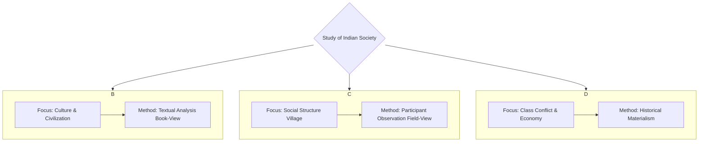
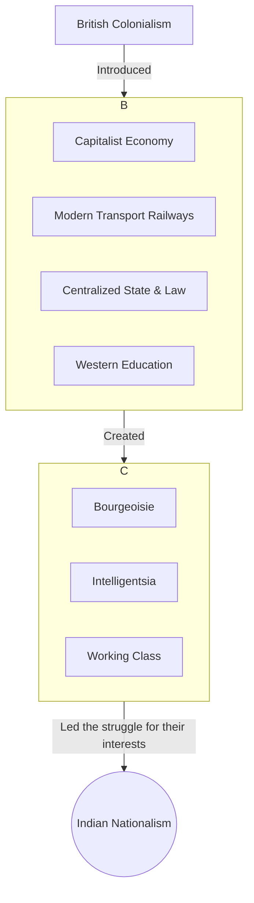
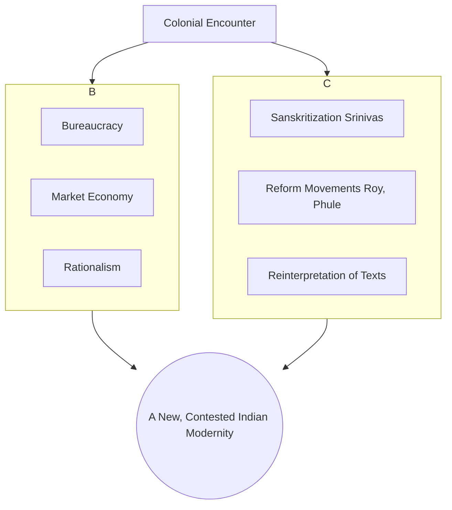
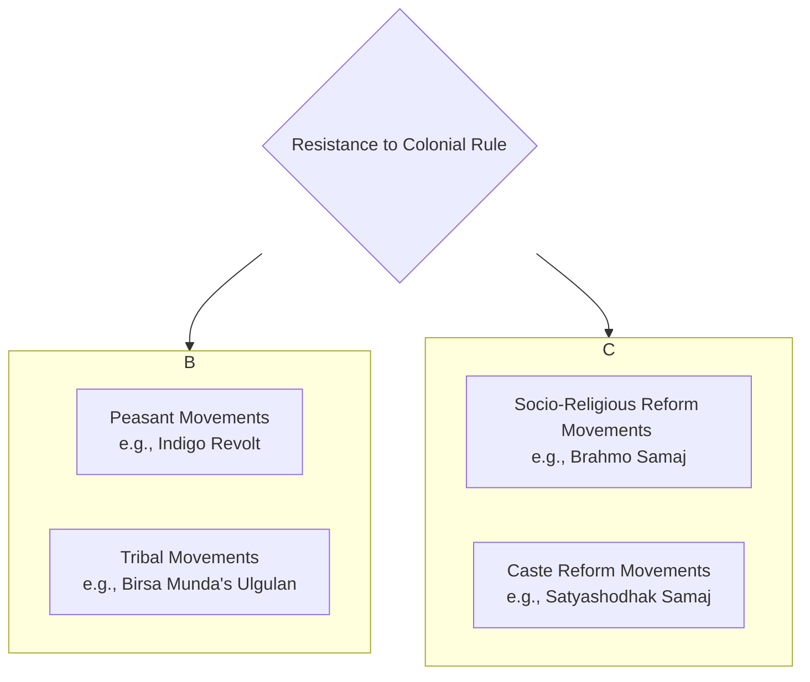
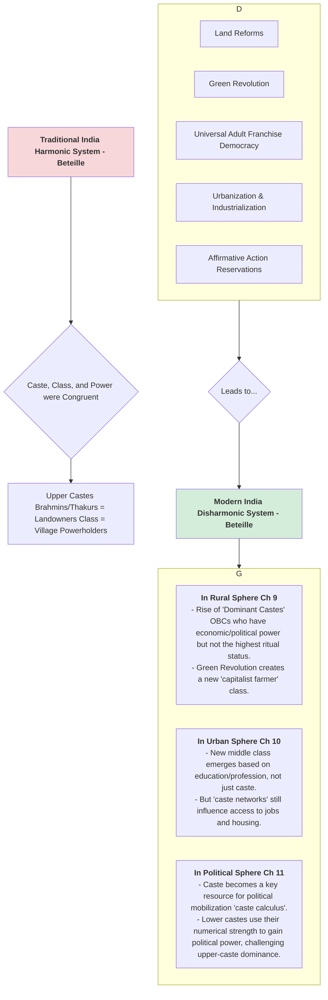
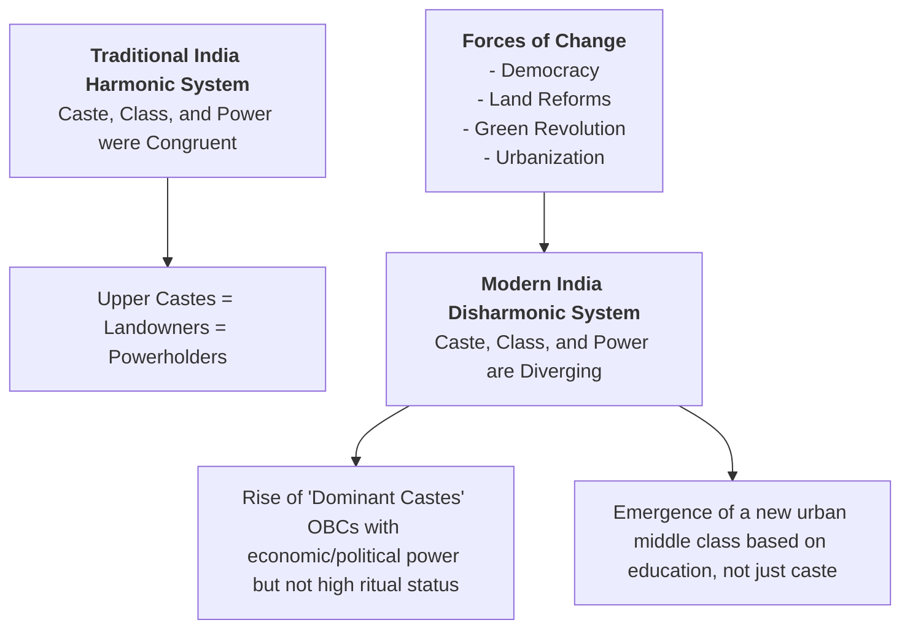
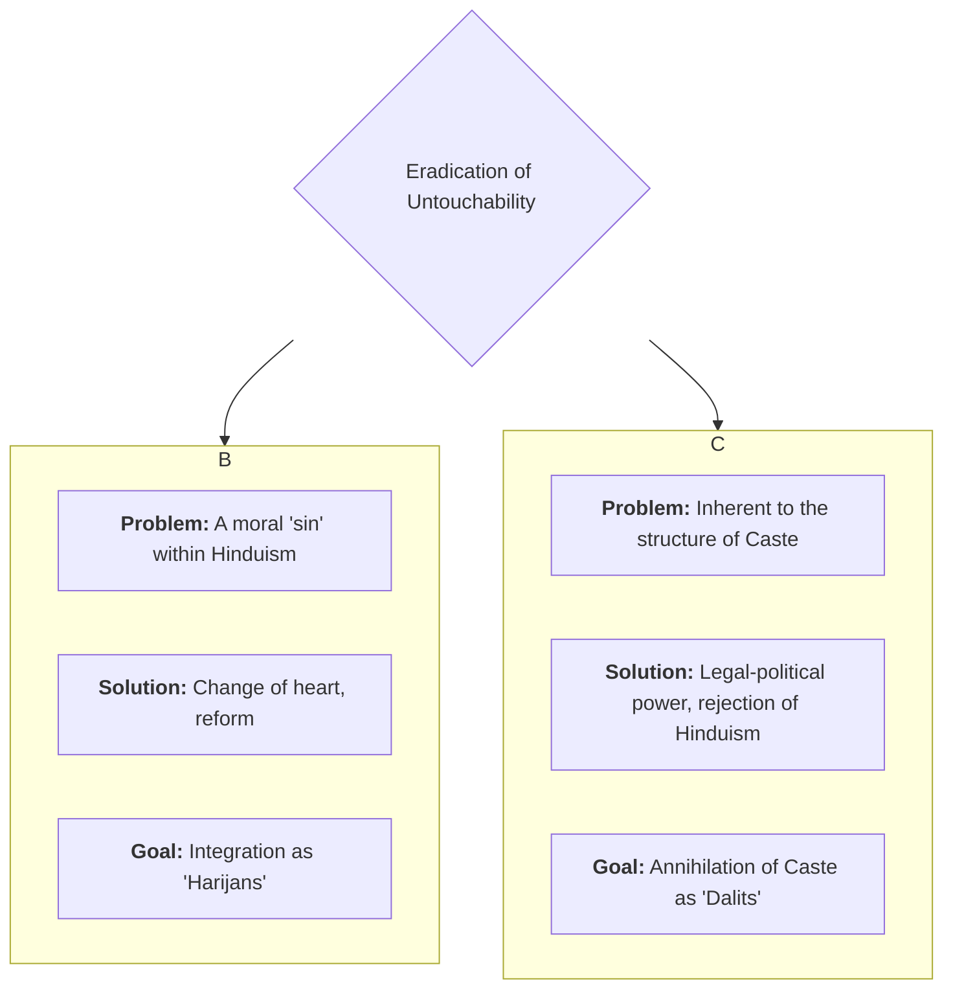

---

# UPSC Sociology Optional - Paper 2 Notes

## Section A: Introducing Indian Society

### **Chapter 1: Perspectives on the Study of Indian Society**

**Introduction**
*   The study of Indian society involves diverse, competing perspectives.
*   These frameworks determine the focus, method, and conclusions of sociological analysis.
*   Three foundational perspectives are Indological, Structural-Functional, and Marxist.

---

#### **1.1 The Three Foundational Perspectives: A Comparative Overview**

| **S.No.** | **Perspective**           | **Core Idea**                                                                   | **Unit of Analysis**                                  | **Methodology**                                           | **Key Thinker** |
| :-------- | :------------------------ | :------------------------------------------------------------------------------ | :---------------------------------------------------- | :-------------------------------------------------------- | :-------------- |
| 1.        | **Indological**           | Understanding India through its classical texts and cultural history.           | Indian civilization, its values and institutions.     | Textual analysis, Historical-Comparative. (**Book-View**) | G.S. Ghurye     |
| 2.        | **Structural-Functional** | Understanding India through empirical study of its living social structures.    | The village as a microcosm of society.                | Participant Observation, Ethnography. (**Field-View**)    | M.N. Srinivas   |
| 3.        | **Marxist**               | Understanding India through the lens of class conflict and economic structures. | The Mode of Production and resulting class relations. | Historical Materialism, Dialectical method.               | A.R. Desai      |
#### **Mermaid Diagram: The Three Foundational Perspectives**


---

#### **1.2 Indological Perspective (G.S. Ghurye)**

1.  **Introduction**
    *   Pioneered by G.S. Ghurye, the "Father of Indian Sociology."
    *   Seeks to understand Indian society via its classical texts (Vedas, Dharmashastras).
    *   Emphasizes cultural-civilizational unity rooted in history and tradition.

2.  **Core Idea & Method**
    *   **Book-View:** The essence of Indian social reality lies in its sacred literature.
    *   **Method:** Historical-comparative analysis of texts, combined with some empirical data.
    *   Focus on culture, values, and ideas as primary drivers of the social system.

3.  **Ghurye's Key Contributions**
    1.  **On Caste (*Caste and Race in India*):**
        *   Defined caste by 6 core features: segmental division, hierarchy, social restrictions, civil/religious disabilities, lack of occupational choice, endogamy.
        *   Saw caste as a unique, pan-Indian institution.
    2.  **On Tribes (*The Scheduled Tribes*):**
        *   Viewed tribes as "backward Hindus," not separate entities.
        *   Argued for their assimilation and integration into mainstream Hindu society.
        *   Directly opposed Verrier Elwin's "isolationist" policy.
    3.  **On Culture & Civilization:**
        *   Emphasized the role of Brahmanical ideology and Sanskritik Hinduism in creating a pan-Indian unity.
        *   This unity was diffused by "rishis" (sages) over centuries.

4.  **Paper 1 Linkages**
    *   **Weberian Influence:** Focus on culture, values, and religious texts mirrors Weber's approach.
    *   **Functionalism:** Implies a functionalist view of culture as an integrative force.

5.  **Critique**
    *   **Elitist/Brahmanical Bias:** Based on upper-caste texts; ignores marginalized perspectives.
    *   **Neglects Empirical Reality:** Idealized "book-view" often conflicts with the "field-view."
    *   **Overlooks Conflict:** Emphasizes harmony, downplaying exploitation in caste.

---

#### **1.3 Structural-Functional Perspective (M.N. Srinivas)**

1.  **Introduction**
    *   Led by M.N. Srinivas; marked a shift from "book-view" to **"field-view."**
    *   Focuses on empirical fieldwork in villages to understand living social institutions.

2.  **Core Idea & Method**
    *   **Field-View:** Understand institutions (caste, kinship) as they actually operate.
    *   **Method:** Participant observation, ethnography.
    *   **Classic Study:** Rampura village ("The Remembered Village").

3.  **Srinivas's Key Concepts (Derived from Fieldwork)**
    1.  **Sanskritization:**
        *   Process where a 'low' caste adopts the customs, rituals, and lifestyle of a 'high' caste.
        *   A form of **positional mobility**, not structural change. The hierarchy itself is not challenged.
    2.  **Dominant Caste:**
        *   A caste with decisive local power. Shifted focus from ritual Varna to secular power.
        *   **Criteria:** Numerical strength, land ownership, political power, access to education/jobs.
    3.  **Westernization:**
        *   Changes from 150+ years of British rule.
        *   Operates at levels of technology, institutions (law, bureaucracy), and values (rationalism).

4.  **Paper 1 Linkages**
    *   **Functionalism (`Radcliffe-Brown`):** Studies how institutions function to maintain social order.
    *   **Reference Group Theory (`Merton`):** Sanskritization is a perfect example of reference group behaviour.

5.  **Critique**
    *   **Micro-Focus:** Neglects macro-structures like the state and capitalism.
    *   **Ahistorical:** Tends to present a static snapshot of village life.
    *   **Overlooks Conflict:** Focuses on harmony and integration, downplaying exploitation.

---

#### **1.4 Marxist Perspective (A.R. Desai)**

1.  **Introduction**
    *   Led by A.R. Desai; a radical critique of the other two perspectives.
    *   Analyzes India via **historical materialism**: class conflict and economic structures.

2.  **Core Idea & Method**
    *   **Dialectical Conflict:** Rejects focus on culture or caste harmony.
    *   **Core Reality:** India's class structure and class struggle.
    *   **Method:** Application of Marxist historical method to Indian history.

3.  **Desai's Key Contributions**
    1.  **On Indian Nationalism (*Social Background of Indian Nationalism*):**
        *   **Thesis:** Nationalism was a product of new material conditions created by British colonialism.
        *   **Mechanism:** British rule created new classes (bourgeoisie, proletariat) who led the movement for their own interests.
    2.  **On the Indian State (*The Myth of the Welfare State*):**
        *   **Thesis:** The post-independence Indian state is a **bourgeois state**, despite "welfare" claims.
        *   **Evidence:** Its policies protect private property and capitalist interests.
    3.  **On Rural Sociology:**
        *   **Thesis:** Rural India is not a harmonious community but an arena of agrarian class conflict due to capitalist penetration.

4.  **Paper 1 Linkages**
    *   **Marxism:** Direct application of Historical Materialism, Class Struggle, and State theory.
    *   **Positivism:** A scientific approach to uncover objective economic laws.

5.  **Critique**
    *   **Economic Determinism:** Reduces caste and culture to reflections of the economic base.
    *   **Neglect of Caste:** Underestimates caste as an independent force of stratification.
    *   **Schematic Application:** Fits complex Indian history into a rigid Marxist model.

---

### **Chapter 2: Impact of Colonial Rule on Indian Society**

**Introduction**
*   British colonialism was not just a political event; it was a profound structural and cultural rupture. It fundamentally transformed Indian society, introducing new economic systems, institutions, and ideas, which in turn triggered unique social responses like nationalism and reform movements.

---

#### **2.1 Social Background of Indian Nationalism**



1.  **Introduction**
    *   Indian nationalism was a modern phenomenon, a direct consequence of the material and administrative conditions created by colonial rule.

2.  **Colonialism as a Unifying Force (Contradictory Process)**
    *   The British unified India in unprecedented ways, which inadvertently created the conditions for a nationalist consciousness.
    1.  **Economic Unification:** Introduction of a capitalist economy, modern transport (especially railways), and communication linked different parts of India into a single market.
    2.  **Administrative Unification:** A centralized state, a uniform legal system (rule of law), and a modern bureaucracy created a single political entity.
    3.  **Intellectual Unification:** Modern Western education introduced concepts like liberty, equality, and nationalism, creating a new English-speaking intelligentsia that could communicate across regions.

3.  **Emergence of New Social Classes**
    *   Colonial policies led to the rise of new classes who became the vanguard of the nationalist movement.
        *   **Industrial Bourgeoisie:** Had its own conflicts with British capital.
        *   **Educated Middle Class/Intelligentsia:** Absorbed nationalist ideas and provided leadership.
        *   **Peasantry & Working Class:** Mobilized against colonial economic exploitation (e.g., land revenue policies, de-industrialization).

4.  **A.R. Desai's Marxist Perspective**
    *   Nationalism was the result of the "material conditions created by British colonialism."
    *   The movement represented the coalescing interests of the newly emerged classes against their common colonial exploiter.

5.  **Conclusion**
    *   Indian nationalism was a complex product of colonial rule. The very instruments the British used to consolidate their power—railways, law, education—became the tools used by Indians to forge a unified national identity and challenge that same power.

---

#### **2.2 Modernization of Indian Tradition**

1.  **Introduction**
    *   Modernity in India was not an organic process but a product of the colonial encounter. This led to a complex interaction between Western "modern" values and Indian "traditional" structures.

2.  **Yogendra Singh's Framework (*Modernization of Indian Tradition*)**
    *   **Core Idea:** Modernization in India involved a process of **structural change** (introduction of bureaucracy, market economy) and **cultural change** (Western values like rationalism, humanism).
    *   **Contradictory Nature:**
        *   Colonialism introduced modernizing elements (e.g., rule of law) but also reinforced traditional structures (e.g., by aligning with princely states and landlords) to maintain control.
        *   This created a "contested modernity."

3.  **Key Processes of Interaction**
    1.  **Structural Changes:**
        *   **Bureaucracy & Law:** Universalistic norms challenged the particularistic norms of caste.
        *   **Market Economy:** Monetization and new land tenure systems disrupted the traditional jajmani system.
    2.  **Cultural Impact:**
        *   **Westernization (`Srinivas`):** Adoption of Western lifestyles, dress, and thinking, especially by the urban elite.
        *   **Rise of a "New Middle Class":** This class was a product of modern education and professions but often retained strong traditional ties.

4.  **Tradition is Not Static**
    *   Tradition itself was reinterpreted and "modernized" in response to the colonial challenge.
    *   Leaders like Raja Ram Mohan Roy sought to reform Hinduism by appealing to ancient texts (Upanishads) to fight "degenerate" practices like Sati.

5.  **Conclusion**
    *   The modernization of Indian tradition was a complex, dialectical process, not a simple replacement of tradition with modernity. It resulted in a unique social fabric where modern institutions and traditional values continue to coexist and interact.

#### **Mermaid Diagram: The Dialectic of Modernization in India**


---

#### **2.3 Protests and Movements during the Colonial Period**

1.  **Introduction**
    *   Colonial rule was not passively accepted. It was met with widespread resistance from various sections of society, including peasants, tribals, and social reformers.

2.  **Peasant Movements**
    *   **Cause:** Driven by colonial economic exploitation—high land revenue demands, new land tenure systems (Zamindari, Ryotwari), forced commercialization of agriculture (e.g., indigo).
    *   **Examples:**
        *   **Indigo Revolt (1859):** Peasants in Bengal refused to grow indigo for exploitative European planters.
        *   **Deccan Riots (1875):** Against the oppression of moneylenders.
        *   **Champaran Satyagraha (1917):** Gandhi's first major movement in India, against the forced indigo cultivation.

3.  **Tribal Movements**
    *   **Cause:** Colonial policies disrupted their traditional way of life.
        *   Forest Acts restricted their access to forest resources.
        *   Influx of outsiders (moneylenders, traders, contractors).
        *   Imposition of a new legal and administrative system.
    *   **Examples:**
        *   **Santhal Rebellion (1855-56):** Against zamindars and moneylenders.
        *   **Birsa Munda's Ulgulan (Great Tumult) (1899-1900):** A millenarian movement aiming to drive out the British and establish "Munda Raj."

4.  **Social Reforms**
    *   **Cause:** A response by the newly educated Indian intelligentsia to the colonial critique of Indian society as "backward" and "degenerate."
    *   **Nature:** Aimed to reform social and religious practices seen as irrational or inhuman.
    *   **Key Issues & Reformers:**
        *   **Sati Abolition (1829):** Led by `Raja Ram Mohan Roy` (Brahmo Samaj).
        *   **Widow Remarriage (1856):** Led by `Ishwar Chandra Vidyasagar`.
        *   **Caste Reform & Women's Education:** Led by `Jyotiba Phule` (Satyashodhak Samaj) and `Savitribai Phule` in Maharashtra.
        *   **Abolition of Untouchability:** A central theme for later reformers like `Dr. B.R. Ambedkar`.

5.  **Conclusion**
    *   Resistance to colonialism was multi-faceted. While peasant and tribal movements represented direct resistance to economic exploitation, the social reform movements represented an internal effort to modernize and strengthen Indian society from within, creating a complex legacy that shaped the future of independent India.

#### **Mermaid Diagram: Spectrum of Resistance to Colonial Rule**



---
---

## Section B: Social Structure

---
### **Chapter 2A: Rural and Agrarian Social Structure**

**Introduction**
*   The Indian village has been the historical bedrock of the country's social structure.
*   Understanding its traditional organization—the concept of the village itself, the Jajmani system, and land tenure systems—is essential to analyze rural society and its changes.

---

#### **2A.1 The Idea of the Indian Village**

1.  **The Colonial / Nationalist View**
    *   British administrators (like `Charles Metcalfe`) and early nationalists portrayed the Indian village as a **"little republic."**
    *   **Characteristics of this view:**
        *   Self-sufficient and autonomous.
        *   Isolated from the outside world.
        *   Internally cohesive and harmonious.
        *   Unchanging over centuries.

2.  **The Sociological Critique (The Field-View)**
    *   Sociological fieldwork in the 1950s and 60s challenged this idealized image.
    *   **M.N. Srinivas:** Argued that villages were never isolated. They were always linked to wider networks through kinship, marriage, trade, and political structures.
    *   **Louis Dumont:** Stated that the village's identity was secondary to the ideology of caste. The vertical ties of caste across villages were often stronger than the horizontal unity of a single village.
    *   **Conclusion:** The "little republic" was a myth. Villages were deeply stratified by caste and class, and were integrated into the larger society.

3.  **Table: The Village - Myth vs. Reality**

| **S.No.** | **Mythical View ("Little Republic")** | **Sociological Reality (Field-View)** |
| :--- | :--- | :--- |
| 1. | Isolated and self-sufficient. | Integrated through kinship, markets, and politics. |
| 2. | Egalitarian and harmonious. | Deeply stratified by caste and class; full of conflict. |
| 3. | Unchanging and static. | Dynamic and constantly undergoing change. |
| 4. | The primary unit of social life. | Caste and kinship networks often transcend the village. |

---

#### **2A.2 The Jajmani System**

1.  **Definition**
    *   A traditional, non-monetary system of exchange of goods and services between different caste groups in a village.
    *   It was a network of patron-client relationships based on hereditary ties.
    *   **Patron (`Jajman`):** Usually a landowning upper-caste family.
    *   **Client (`Kamin` or `Prajan`):** Service-providing lower-caste families (e.g., barber, potter, carpenter, priest).

2.  **Key Features**
    *   **Hereditary:** The relationship was passed down through generations.
    *   **Multiplex:** It was not just an economic relationship but also had social and ritual dimensions.
    *   **Asymmetrical:** The relationship was unequal, reinforcing the dominance of the landowning `Jajman`.
    *   **Integrative:** It created a system of interdependence between different castes, contributing to village solidarity (a functionalist view).

3.  **Mermaid Diagram: The Jajmani Exchange**

    ```mermaid
    graph TD
        A[Jajman Patron <br/> Landowning Upper Caste];
        B[Kamin Client <br/> Service Lower Caste];

        A --"Provides Grain / Food / Protection"--> B;
        B --"Provides Specialized Services (Ritual/Economic)"--> A;
    ```

4.  **Decline of the Jajmani System**
    *   The system has largely disintegrated due to:
        *   **Monetization of the Economy:** Shift from barter to cash transactions.
        *   **Improved Transport:** Villagers can now access services from nearby towns.
        *   **New Employment Opportunities:** Weakened the hereditary link to occupation.
        *   **Rise of a sense of dignity** among lower castes, who began to reject the exploitative aspects of the system.

---

#### **2A.3 Land Tenure Systems (Under British Rule)**

1.  **Introduction**
    *   The British introduced new land tenure systems primarily to maximize and regularize their land revenue collection.
    *   These systems fundamentally altered property relations and the agrarian class structure.

2.  **The Three Major Systems**

| **S.No.** | **System** | **Key Feature** | **Land Ownership** | **State's Role** | **Impact on Peasants** |
| :--- | :--- | :--- | :--- | :--- | :--- |
| 1. | **Zamindari System** | Land revenue was collected from peasants by an intermediary, the Zamindar. | Vested in the **Zamindar**, who was responsible for paying a fixed sum to the state. | Dealt only with the Zamindar, not the cultivator. | Extreme exploitation. Peasants became tenants-at-will, paying high rents and facing eviction. |
| 2. | **Ryotwari System** | Direct settlement between the state and the individual cultivator (`Ryot`). | Vested in the **Ryot** (cultivator), who was directly responsible for paying revenue to the state. | Directly collected revenue from the cultivator. | High revenue demands forced peasants into the clutches of moneylenders, leading to land alienation. |
| 3. | **Mahalwari System** | Land revenue was settled for the entire village or estate (`Mahal`). | Vested in the **village community** as a whole. The village headman collected revenue. | Dealt with the village community, not individuals. | Preserved the village community to some extent, but high revenue demands still led to poverty. |

3.  **Overall Impact**
    *   **Commercialization of Land:** Land became a private, saleable commodity.
    *   **Indebtedness and Land Alienation:** Peasants were forced to borrow from moneylenders at high interest rates, often losing their land.
    *   **Growth of Landless Labourers:** A massive increase in the number of peasants who lost their land and became agricultural labourers.

---
---

### **Chapter 3: Caste System**

**Introduction**
*   The caste system is India's most unique and defining social institution.
*   It is a traditional system of social stratification based on heredity, hierarchy, and ritual purity.
*   While its form has changed significantly, its influence persists in modern Indian social, political, and economic life.

---

#### **3.1 Perspectives on the Study of Caste**

1.  **Introduction**
    *   Sociological understanding of caste is shaped by different theoretical lenses, focusing on its cultural-ideological basis versus its structural-power dimensions.

2.  **Key Perspectives on Caste**

| **S.No.** | **Thinker** | **Perspective** | **Core Idea** | **Key Concept** |
| :--- | :--- | :--- | :--- | :--- |
| 1. | **G.S. Ghurye** | **Indological / Historical** | Caste is a unique Indian phenomenon with specific features, rooted in Hindu culture. | Defined caste by its 6 structural features. |
| 2. | **M.N. Srinivas** | **Structural-Functional** | Caste is best understood as a functioning, dynamic system at the village level. | **Dominant Caste**, Sanskritization. |
| 3. | **Louis Dumont** | **Structuralist / Ideological** | The essence of the caste system is not power or economics, but the ideology of **hierarchy**. | **Homo Hierarchicus**, Purity-Pollution dichotomy. |
| 4. | **Andre Beteille** | **Weberian / Interactional** | Caste is one of three dimensions of stratification, interacting with Class and Power. | **Harmonic vs. Disharmonic** systems. |

3.  **Louis Dumont's Perspective (*Homo Hierarchicus*)**
    *   **Core Idea:** The caste system is fundamentally an ideological system based on the opposition between the **pure** and the **impure**.
    *   **Hierarchy:** This religious principle of purity/pollution dictates the social hierarchy. It is distinct from secular power.
    *   **Separation of Status and Power:** The Brahmin (priest) has the highest ritual status (purity), but the Kshatriya (king) holds secular power. Status encompasses power.
    *   **Critique:** Criticized for being a "Brahmanical" view, ignoring power, conflict, and economic dimensions.

4.  **Andre Beteille's Perspective (*Caste, Class, and Power*)**
    *   **Core Idea:** A direct application and critique of Weber in the Indian context. Studied Sripuram village in Tanjore.
    *   **Harmonic System (Traditional):** In the past, the three hierarchies (Caste, Class, Power) were aligned. The upper castes (Brahmins) were also the landowners (Class) and held political power.
    *   **Disharmonic System (Modern):** In the present, the hierarchies are diverging. A person can have a high class position (e.g., a wealthy lower-caste person) but a low caste status. This creates social tension and change.

---

#### **3.2 Features of the Caste System**

1.  **G.S. Ghurye's Six Core Features**
    1.  **Segmental Division:** Society is divided into distinct segments (castes) with fixed memberships determined by birth.
    2.  **Hierarchy:** These segments are ranked in a clear order of superiority and inferiority, based on ritual purity.
    3.  **Restrictions on Feeding and Social Intercourse:** Strict rules on who can accept food and water from whom.
    4.  **Civil and Religious Disabilities and Privileges:** Lower castes faced severe disabilities (e.g., denied temple entry), while upper castes enjoyed privileges.
    5.  **Lack of Unrestricted Choice of Occupation:** Occupations were traditionally hereditary.
    6.  **Restrictions on Marriage:** Strict rules of **endogamy** (marrying within one's own caste) and **exogamy** (marrying outside one's gotra).

2.  **Varna vs. Jati**
    *   **Varna (Textual Model):** The four-fold ideal classification from ancient texts: Brahmin, Kshatriya, Vaishya, Shudra. It is a broad, all-India framework.
    *   **Jati (Contextual Reality):** The actual, complex system of thousands of endogamous local groups. This is the reality of caste as lived on the ground. Jati is the more important unit for sociological analysis.

---

#### **3.3 Untouchability: Forms and Perspectives**

1.  **Definition**
    *   Untouchability is the most extreme and oppressive manifestation of the caste system's purity-pollution logic.
    *   It refers to the practices of social discrimination and exclusion imposed on castes at the very bottom of the hierarchy (Dalits), who were considered so impure as to pollute others by mere touch or presence.

2.  **Forms of Untouchability**
    *   **Social Disabilities:** Residential segregation (living in separate hamlets), denial of access to common resources (wells, temples), forced deference (e.g., removing footwear).
    *   **Economic Exploitation:** Forced to perform "unclean" occupations (e.g., manual scavenging, leatherwork), landlessness, bonded labour.
    *   **Ritual Exclusion:** Denial of participation in religious ceremonies and festivals.

3.  **Perspectives on Eradication**
    *   **Gandhian Perspective:**
        *   Saw untouchability as a moral "sin" within Hinduism that needed to be purged.
        *   Advocated for a change of heart among upper castes and the integration of Dalits into the Hindu fold.
        *   Coined the term **"Harijan"** (children of God).
        *   Did not advocate for the annihilation of the caste system itself, only untouchability.
    *   **Ambedkarite Perspective:**
        *   Viewed untouchability not as a moral issue but as a problem of **power and exploitation**, inherent to the caste system itself.
        *   Rejected the term "Harijan" as patronizing; promoted the term **"Dalit"** (the oppressed).
        *   Argued that a change of heart was not enough. The only solution was the **"Annihilation of Caste"** itself through legal-political means and the rejection of Hinduism.

4.  **Mermaid Diagram: Gandhi vs. Ambedkar on Untouchability**

    ```mermaid
    graph TD
        A{Untouchability};
        A --> B[Gandhian Perspective];
        A --> C[Ambedkarite Perspective];

        subgraph B
            B1[Problem: A moral 'sin' in Hinduism]
            B2[Solution: Change of heart, reform within Hinduism]
            B3[Goal: Integration as 'Harijans']
        end

        subgraph C
            C1[Problem: Inherent to the structure of Caste & Hinduism]
            C2[Solution: Legal-political empowerment, rejection of Hinduism]
            C3[Goal: Annihilation of Caste as 'Dalits']
        end
    ```

5.  **Contemporary Status**
    *   Untouchability is abolished by law (**Article 17** of the Constitution) and punishable under the **Protection of Civil Rights Act (1955)** and the **SC/ST (Prevention of Atrocities) Act (1989)**.
    *   However, it continues to be practiced in subtle and overt forms, especially in rural India.

---

### **Chapter 4: Tribal Communities in India**

**Introduction**
*   Tribal communities, or **Adivasis**, represent a significant and diverse segment of the Indian population.
*   Sociological study of tribes is marked by debates over their definition, their relationship with mainstream society, and the impact of colonial and post-colonial policies on their lives.

---

#### **4.1 Definitional Problems**

1.  **The Challenge of Definition**
    *   There is no single, universally accepted definition of a "tribe." The term itself is a colonial construct.
    *   The boundaries between tribe and caste are often fluid and blurred.

2.  **Commonly Used Criteria (and their problems)**
    *   **Isolation:** Often live in remote hills and forests. (Problem: Many tribes have had long-standing interactions with non-tribal populations).
    *   **Distinct Culture:** Have their own language, religion (animism), and customs. (Problem: Many have adopted elements of Hinduism).
    *   **Primitive Economy:** Often based on hunting, gathering, or shifting cultivation. (Problem: Many are now settled agriculturists or wage labourers).
    *   **Lack of State/Hierarchy:** Traditionally egalitarian social structures. (Problem: Some tribes have had chiefs or kings).

3.  **The Caste-Tribe Continuum (`F.G. Bailey`)**
    *   Bailey argued against seeing caste and tribe as a rigid dichotomy.
    *   He proposed a continuum, where at one end is the pure, isolated tribe, and at the other is the caste society. Most groups in India lie somewhere in between.
    *   The key difference for Bailey is that caste is a hierarchical system where groups are interdependent, while a tribe is a segmented system where groups are independent.

---

#### **4.2 Geographical Spread & Colonial Policies**

1.  **Geographical Spread**
    *   Tribal populations are concentrated in three main zones:
        1.  **North and North-Eastern Zone:** (e.g., Nagas, Mizos, Khasis).
        2.  **Central Zone:** The largest zone, covering states like MP, Jharkhand, Chhattisgarh, Odisha (e.g., Gonds, Santhals, Bhils).
        3.  **Southern Zone:** (e.g., Todas of Nilgiris, Chenchus of Andhra Pradesh).

2.  **Colonial Policies and their Impact**
    *   Colonial policies fundamentally disrupted tribal life.
    1.  **Forest Acts:** Declared forests as state property, severely restricting tribal access to their traditional livelihood and habitat.
    2.  **Land Alienation:** The introduction of private property in land led to the large-scale transfer of tribal lands to non-tribal moneylenders and zamindars.
    3.  **Administrative Integration:** Imposed a new legal and administrative system, undermining traditional tribal councils and leadership.
    4.  **Cultural Contact:** The influx of Christian missionaries, traders, and contractors led to significant cultural changes.

---

#### **4.3 Issues of Integration and Autonomy**

1.  **The Elwin-Ghurye Debate**
    *   This was the foundational debate on tribal policy in post-independence India.

| **S.No.** | **Thinker** | **Policy Advocated** | **Core Argument** | **Critique** |
| :--- | :--- | :--- | :--- | :--- |
| 1. | **Verrier Elwin** | **Isolationism** (in his early phase) | Tribes have a unique, pristine culture that must be protected from the corrupting influence of the mainstream. Proposed creating "National Parks" or reserved areas. | Seen as promoting a "museum" approach that would keep tribes backward. |
| 2. | **G.S. Ghurye** | **Assimilation** | Tribes are simply "backward Hindus" who have always been part of the larger Hindu civilization. The goal should be their full integration. | Seen as a threat to unique tribal identities and cultures. |

2.  **Nehru's Policy of Integration ("Panchsheel")**
    *   Jawaharlal Nehru sought a middle path, rejecting both extremes.
    *   His policy of **integration** aimed to bring development to tribal areas while respecting their distinct culture and identity.
    *   The **"Tribal Panchsheel"** principles included:
        1.  Develop along the lines of their own genius.
        2.  Respect their rights in land and forests.
        3.  Train their own people for administration and development.
        4.  Avoid over-administration and imposing too much.
        5.  Judge results not by statistics, but by the quality of human character evolved.

3.  **Contemporary Issues**
    *   **Development-Induced Displacement:** Large-scale projects like dams, mines, and industrial plants are often located in tribal areas, leading to mass displacement and loss of livelihood.
    *   **Assertion of Identity:** Rise of ethnic and autonomy movements, demanding greater political self-determination (e.g., Bodoland, Gorkhaland).
    *   **Forest Rights Act (2006):** A landmark law that attempts to redress the historical injustice of colonial forest acts by recognizing the rights of tribal communities over forest land and resources.

4.  **Conclusion**
    *   The "tribal question" in India remains a complex interplay of issues related to identity, exploitation, and development. The central challenge is to foster their socio-economic development while protecting their unique cultural heritage and rights to land and resources.


---
---
### **Chapter 5: Social Classes in India**

**Introduction**
*   While caste has been the traditional basis of hierarchy, **class** has emerged as a significant dimension of stratification in modern India.
*   The class structure in India is complex, shaped by both the pre-existing agrarian order and the development of industrial capitalism. It is also deeply intertwined with the caste system.

---

#### **5.1 Agrarian Class Structure**

1.  **Introduction**
    *   The agrarian class structure refers to the hierarchy of groups in rural India based on their relationship to land.
    *   Colonial land tenure systems (Zamindari, Ryotwari, Mahalwari) fundamentally reshaped this structure.

2.  **Major Agrarian Classes**
    *   **Daniel Thorner's Classification:**
        1.  **Malik (Landlords):** Own land but do not engage in physical labour. They derive income from rent.
        2.  **Kisan (Peasants):** Own and cultivate small plots of land, primarily using family labour.
        3.  **Mazdur (Labourers):** Landless individuals who sell their labour power for wages.
    *   **A.R. Desai's Marxist Classification:**
        *   Focuses on class conflict arising from capitalist development in agriculture.
        *   Identifies classes like rich farmers/capitalist farmers, middle peasants, poor peasants, and the rural proletariat (landless labourers).

3.  **The Green Revolution and its Impact**
    *   **What it was:** A state-led program in the 1960s-70s to increase agricultural productivity using high-yielding variety (HYV) seeds, fertilizers, and irrigation.
    *   **Social Impact:**
        1.  **Increased Class Differentiation:** It primarily benefited wealthy farmers (**Maliks**) who could afford the new inputs, turning them into a powerful class of capitalist farmers. The gap between rich and poor farmers widened.
        2.  **Regional Disparities:** Benefited irrigated regions like Punjab, Haryana, and Western UP, while dryland regions lagged behind.
        3.  **Decline of Traditional Relations:** Replaced traditional patron-client relations (`jajmani`) with impersonal, contractual wage labour.

4.  **Contemporary Issues**
    *   **Agrarian Distress:** Issues of farmer suicide, indebtedness, and unprofitability of agriculture.
    *   **Feminization of Agriculture:** As men migrate to cities for work, women are increasingly taking on agricultural labour, often without land rights or recognition.

---

#### **5.2 Industrial Class Structure**

1.  **Introduction**
    *   The industrial class structure in India emerged with colonial-era industrialization and has evolved significantly in the post-liberalization period.

2.  **Key Industrial Classes**
    1.  **Bourgeoisie / Capitalist Class:**
        *   Owners of the means of industrial production.
        *   Historically dominated by a few family-owned business houses (e.g., Tatas, Birlas).
        *   Post-1991, a new, more aggressive entrepreneurial class has emerged.
    2.  **Working Class / Proletariat:**
        *   Sells their labour power in factories and industries.
        *   Characterized by a deep **formal-informal divide**.
        *   **Formal Sector Workers:** A small, protected "labour aristocracy" with job security and benefits.
        *   **Informal Sector Workers:** The vast majority, facing precarity, low wages, and no social security.
    3.  **White-Collar / Salaried Employees:**
        *   Managers, supervisors, and clerical staff.
        *   Occupy an intermediate position between the bourgeoisie and the working class.

---

#### **5.3 Middle Classes in India**

1.  **Introduction**
    *   The middle class in India is a large, heterogeneous, and socio-politically significant group. Its size and character have been transformed by economic liberalization since 1991.

2.  **The "Old" vs. "New" Middle Class**
    *   **Old Middle Class (Pre-1991):**
        *   Primarily composed of state employees (bureaucrats, public sector workers) and professionals (doctors, lawyers).
        *   Characterized by a focus on job security, savings, and social status.
    *   **New Middle Class (Post-1991):**
        *   Emerged from the growth of the private service sector (IT, finance, media).
        *   Characterized by a culture of **consumerism**, global aspirations, reliance on credit, and a more individualistic outlook.

3.  **Andre Beteille on the Middle Class**
    *   Beteille justifies the "middle class" as a valid sociological category in India.
    *   He argues it is defined not just by income, but by a combination of factors:
        *   Possession of non-manual skills acquired through modern education.
        *   A certain standard of living and consumption pattern.
        *   A shared set of values and aspirations.

4.  **Conclusion on Class in India**
    *   The class structure in India is dynamic and complex. It cannot be understood without reference to caste, as caste identities continue to influence life chances and access to resources, often creating a "caste-class nexus."

---

### **Chapter 6: Systems of Kinship in India**

**Introduction**
*   Kinship is a vital organizing principle of Indian social life, governing marriage, family, inheritance, and social obligations.
*   India exhibits immense regional diversity in kinship systems, most notably between the North and the South.

---

#### **6.1 Lineage and Descent in India**

1.  **Core Principles**
    *   **Patrilineal System:** Dominant in most of India. Descent, inheritance, and succession are traced through the male line.
    *   **Matrilineal System:** Found among some communities, notably the Nairs of Kerala and the Khasis and Garos of Meghalaya. Descent is traced through the female line.
    *   **Lineage:** A key social group based on descent from a known common ancestor. It is often exogamous (one must marry outside the lineage).

---

#### **6.2 Types of Kinship Systems: North vs. South India**

*   **Irawati Karve's** classic study identified two fundamentally different kinship systems.

| **S.No.** | **Feature** | **North Indian System** | **South Indian System** |
| :--- | :--- | :--- | :--- |
| 1. | **Marriage Rules** | **Negative Rules:** Specifies who one *cannot* marry. | **Positive Rules:** Specifies who one *should* marry (preferred partners). |
| 2. | **Key Principle** | **Rule of Four Gotra Exogamy:** Cannot marry into the gotra of one's father, mother, paternal grandmother, and maternal grandmother. | **Cross-Cousin Marriage:** Marriage with one's mother's brother's daughter or father's sister's daughter is preferred. |
| 3. | **Kinship & Affinity** | Sharp distinction between the "family of birth" and the "family of marriage." | The distinction is blurred. Relatives by marriage are often already relatives by blood. |
| 4. | **Terminology** | Different terms for relatives by blood and relatives by marriage. | The same term is often used for both (e.g., mother's brother and father-in-law can be the same person and called *mama*). |

---

#### **6.3 Family and Marriage in India**

1.  **The Joint Family**
    *   **Definition:** A multi-generational group of kin who typically live under one roof, share a common kitchen, hold property in common, and participate in common family worship.
    *   **Changing Nature:**
        *   **Structural Change:** A trend towards nuclear households due to urbanization and migration.
        *   **Functional Change (`I.P. Desai`):** Even when living in nuclear households, families often remain "functionally joint," maintaining strong ties of mutual obligation and support.

2.  **Marriage**
    *   **Traditional Features:** Seen as a sacred duty (`sanskara`), not a contract. A union between two families, not just two individuals. Arranged by parents. Governed by strict rules of caste endogamy.
    *   **Contemporary Trends:**
        *   Rise in the age of marriage.
        *   Increasing importance of individual choice and "love marriage."
        *   Emergence of online matrimonial sites.
        *   Increasing acceptance (though still limited) of inter-caste marriages.

---

#### **6.4 Patriarchy, Entitlements, and Sexual Division of Labour**

1.  **Patriarchy in India**
    *   A deeply entrenched system where men hold authority over women and property.
    *   Manifests in:
        *   **Patrilineal Inheritance:** Property passes from father to son.
        *   **Patrilocal Residence:** The wife moves to live with her husband's family.
        *   **Control over Female Sexuality:** Strong emphasis on female chastity and purity.

2.  **Entitlements (`Amartya Sen`)**
    *   Patriarchy leads to unequal entitlements within the household.
    *   Men and boys often have better access to food, healthcare, and education than women and girls, as reflected in India's skewed child sex ratio.

3.  **Sexual Division of Labour**
    *   A clear demarcation of roles:
        *   **Men:** Public sphere (breadwinning, politics).
        *   **Women:** Private sphere (domestic work, childcare).
    *   Women's domestic labour is crucial for the family's survival but is unpaid, unrecognized, and devalued.

4.  **Mermaid Diagram: The Cycle of Patriarchy in India**

    ```mermaid
    graph TD
        A[Patriarchal Ideology] --> B(Patrilineal Inheritance & Patrilocal Residence);
        B --> C(Son Preference & Neglect of Daughters);
        C --> D(Skewed Sex Ratio & Lower Female Entitlements);
        D --> E(Sexual Division of Labour <br/> Women in Private Sphere);
        E --> F(Limited Female Autonomy & Power);
        F --> A;
    ```

---

### **Chapter 7: Religion and Society in India**

**Introduction**
*   India is a land of immense religious diversity, being the birthplace of four major world religions (Hinduism, Buddhism, Jainism, Sikhism) and home to large populations of Muslims and Christians.
*   Religion is not just a private belief but a powerful social force that shapes identity, community, and politics.

---

#### **7.1 Religious Communities in India**

1.  **Hinduism:** The majority religion, characterized by immense diversity of beliefs and practices, the caste system, and concepts like Dharma, Karma, and Moksha.
2.  **Islam:** India's largest religious minority. Characterized by belief in one God (Allah) and the Prophet Muhammad. Deeply influenced by and has influenced Indian culture (e.g., Sufism).
3.  **Christianity:** Arrived in India in ancient times, but spread significantly under colonial rule.
4.  **Sikhism:** Emerged in 15th century Punjab as a monotheistic religion, critiquing both Hindu and Islamic rituals.
5.  **Buddhism & Jainism:** Ancient religions that emerged as a challenge to Brahmanical orthodoxy. Buddhism is seeing a revival through Dalit conversions (Navayana Buddhism).

---

#### **7.2 Problems of Religious Minorities**

1.  **Issues of Identity vs. Security:** Minorities often face a dual challenge: preserving their distinct cultural identity while ensuring their physical and economic security.
2.  **Communalism:**
    *   **Definition:** An ideology that posits that society is divided into religious communities whose interests are mutually hostile and antagonistic.
    *   **Consequences:** Leads to prejudice, discrimination, communal riots, and political polarization.
3.  **Socio-Economic Issues:**
    *   Some religious minorities, particularly Muslims, lag behind the national average on development indicators like education, employment, and income, as highlighted by the **Sachar Committee Report (2006)**.
4.  **Secularism in India:**
    *   Unlike the Western model of strict separation of church and state, Indian secularism is based on the principle of **"principled distance"** (`Rajeev Bhargava`).
    *   The state does not strictly separate from religion but aims to treat all religions with equal respect and has the right to intervene to address social evils within religions. This model is a subject of intense political debate.

5.  **Conclusion**
    *   Managing religious diversity and ensuring the rights and security of minorities remains a central challenge for Indian democracy. The rise of communal politics poses a significant threat to India's secular and pluralistic fabric.

---
---

## Section C: Social Changes in India

### **Chapter 8: Visions of Social Change in India**

**Introduction**
*   After independence, India's leaders articulated a clear vision for social transformation.
*   This vision aimed to build a modern, democratic, secular, and egalitarian society.
*   The key instruments chosen to achieve this were the Constitution, a planned mixed economy, and education.

---

#### **8.1 The Constitution, Law, and Social Change**

1.  **The Constitution as a Tool for Social Revolution**
    *   `Granville Austin` described the Indian Constitution as a "social revolutionary document."
    *   It was not just a political framework but a blueprint for transforming a hierarchical, traditional society into a modern, egalitarian one.

2.  **Key Constitutional Provisions for Social Change**
    1.  **Fundamental Rights (Part III):**
        *   **Equality:** Article 14 (Equality before law), Article 15 (Prohibition of discrimination), Article 16 (Equality of opportunity).
        *   **Abolition of Untouchability:** Article 17. A direct attack on the caste hierarchy.
        *   **Freedoms:** Article 19 (Freedom of speech, etc.), Article 21 (Right to life and personal liberty).
    2.  **Directive Principles of State Policy (DPSP) (Part IV):**
        *   These are non-justiciable but are "fundamental in the governance of the country."
        *   They outline a vision for a **welfare state**, promoting social and economic justice (e.g., equal pay for equal work, living wage, organization of village panchayats).
    3.  **Affirmative Action (Reservations):**
        *   Provisions for reservation in education (Art 15(4)) and government jobs (Art 16(4)) for Scheduled Castes (SCs), Scheduled Tribes (STs), and later, Other Backward Classes (OBCs).
        *   A powerful tool for promoting the upward mobility of historically disadvantaged groups.

3.  **Law as an Instrument of Change**
    *   The state has enacted numerous laws to bring about social change, based on constitutional values.
    *   **Examples:**
        *   **Hindu Marriage Act (1955):** Legalized inter-caste marriage, banned bigamy, set a minimum age for marriage.
        *   **Hindu Succession Act (1956) (Amended 2005):** Gave daughters equal inheritance rights in ancestral property.
        *   **Protection of Civil Rights Act (1955) & SC/ST (Prevention of Atrocities) Act (1989):** To combat caste-based discrimination and violence.
        *   **Domestic Violence Act (2005):** To protect women from violence within the family.

4.  **Limitations of Law**
    *   `Andre Beteille` points out the gap between "law in the books" and "law in action."
    *   Social change cannot be achieved by law alone; it requires a corresponding change in social attitudes and norms.
    *   **Example:** Despite being illegal, practices like dowry and caste discrimination persist.

5.  **Conclusion**
    *   The Constitution and subsequent laws have been powerful catalysts for social change in India, providing a legal framework for equality and justice. However, their effectiveness is often limited by the persistence of deeply entrenched social hierarchies and patriarchal norms.

---

#### **8.2 Idea of Development Planning and Mixed Economy**

1.  **Introduction**
    *   At independence, India adopted a model of **planned development** to overcome colonial economic stagnation and reduce poverty and inequality.
    *   This was to be achieved through a **mixed economy** model.

2.  **The Rationale for Planning**
    *   **Nehruvian Consensus:** The belief that a pure free-market approach would not work for a poor country like India and would only increase inequality.
    *   **Goals:** Rapid industrialization, self-reliance, reduction of regional and social disparities, and building a "socialistic pattern of society."
    *   **Mechanism:** The **Planning Commission** was established (1950) to formulate **Five-Year Plans** that would set national priorities and allocate resources.

3.  **The Mixed Economy Model**
    *   This model combined elements of both capitalism and socialism.
    *   **Public Sector:** The state would control the "commanding heights" of the economy (heavy industries, infrastructure, defence). This was meant to build a strong industrial base and prevent the concentration of wealth.
    *   **Private Sector:** The private sector was allowed to operate, but was regulated by the state through a system of licenses and permits (the "License Raj").

4.  **Mermaid Diagram: The Nehruvian Development Model**

    ```mermaid
    graph TD
        A{Vision: Socialistic Pattern of Society};
        A --> B[Instrument: Planned Development];
        B --> C[Mechanism: Five-Year Plans Planning Commission];
        C --> D[Economic Model: Mixed Economy];
        
        subgraph D
            D1[Public Sector <br/> Commanding Heights]
            D2[Private Sector <br/> Regulated]
        end
    ```

5.  **Critique and Shift**
    *   **Critique:** The planned economy model was criticized for creating inefficiency, corruption ("License Raj"), and slow growth (the "Hindu rate of growth").
    *   **The 1991 Reforms:** Facing a balance of payments crisis, India shifted towards a model of **Liberalization, Privatization, and Globalization (LPG)**.
    *   **Post-1991:** This marked a move away from state-led development towards a more market-oriented economy. The Planning Commission was replaced by the **NITI Aayog** in 2015, marking a shift from centralized planning to a more advisory role.

6.  **Conclusion**
    *   The vision of planned development was a monumental effort to steer India's post-colonial transformation. While it laid a strong industrial foundation, its limitations led to a major policy shift in 1991, fundamentally altering the path of India's economic and social development.

---

#### **8.3 Education and Social Change in India**

1.  **Introduction**
    *   Education was seen by the Indian state as a primary agent of social change—a tool to promote national integration, secularism, equality, and economic development.

2.  **The Dual Role of Education in India**
    *   This follows the classic functionalist vs. conflict debate from Paper 1.

| **Role** | **Mechanism & Impact** | **Paper 1 Linkage** |
| :--- | :--- | :--- |
| **1. As an Agent of Change (Functionalist View)** | **Promotes Mobility & Equality:** Education is the main channel for upward social mobility, especially for SCs/STs/OBCs through reservations. <br> **Promotes Modern Values:** The curriculum promotes scientific temper, democracy, and secularism, challenging traditionalism. | **Functionalism** |
| **2. As an Agent of Reproduction (Conflict View)** | **Reproduces Inequality:** The education system is highly stratified. Elite, private English-medium schools cater to the upper classes, while poorly funded government schools cater to the poor. <br> **Cultural Capital (`Bourdieu`):** The system values the cultural capital of the elite, putting children from marginalized backgrounds at a disadvantage. | **Conflict Theory** (`Bourdieu`, `Bowles & Gintis`) |

3.  **Key Policies and Issues**
    1.  **Right to Education (RTE) Act, 2009:** Made free and compulsory education a fundamental right for children aged 6-14. A major step towards universalizing elementary education.
    2.  **Disparities in Access:** Significant gaps in educational attainment persist based on:
        *   **Caste:** Gross Enrolment Ratio (GER) is lower for SCs and STs.
        *   **Gender:** Female literacy and enrolment still lag behind males, though the gap is closing.
        *   **Region:** Rural-urban and inter-state disparities are stark.
    3.  **National Education Policy (NEP) 2020:** The latest policy framework aiming to reform the education system, focusing on flexibility, multidisciplinary learning, and vocational skills.

4.  **Conclusion**
    *   Education in India presents a paradox. It has been a powerful force for empowerment and mobility for many, yet the stratified nature of the educational system continues to reproduce and legitimize existing social inequalities, making the goal of equal opportunity an ongoing struggle.

---
---

### **Chapter 9: Rural and Agrarian Transformation in India**

**Introduction**
*   Rural India, home to the majority of the population, has undergone profound transformation since independence.
*   State-led development programs, especially the Green Revolution, have reshaped its economy, class structure, and social relations.

---

#### **9.1 Programmes of Rural Development**

1.  **Community Development Programme (CDP) (1952)**
    *   **Goal:** The first major rural development initiative. Aimed for the holistic development of villages (agriculture, health, education) through people's participation.
    *   **Method:** A block-level administrative setup with a Block Development Officer (BDO) and Village Level Workers (VLWs).
    *   **Outcome:** Largely failed. The **Balwant Rai Mehta Committee (1957)** found it became a top-down, bureaucratic exercise with little genuine participation. It recommended the creation of the **Panchayati Raj** system to fix this.

2.  **Panchayati Raj Institutions (PRIs)**
    *   A system of democratic local self-governance at the village, block, and district levels.
    *   Given constitutional status by the **73rd Amendment Act (1992)**, which mandated regular elections and reserved seats for SCs, STs, and women.

3.  **Poverty Alleviation & Employment Schemes**
    *   **Integrated Rural Development Programme (IRDP) (1978):** An asset-provision program for the rural poor.
    *   **Mahatma Gandhi National Rural Employment Guarantee Act (MGNREGA) (2005):** A landmark law guaranteeing 100 days of wage employment to every rural household. Aims to provide a social safety net and create durable rural assets.

---

#### **9.2 Green Revolution and its Social Consequences**

1.  **Definition**
    *   A state-led agricultural strategy in the mid-1960s to achieve food self-sufficiency.
    *   Based on a technology package: High-Yielding Variety (HYV) seeds, chemical fertilizers, pesticides, and assured irrigation.

2.  **Social Consequences**
    1.  **Increased Class Differentiation (`Francine Frankel`):**
        *   Primarily benefited wealthy farmers who could afford the expensive inputs.
        *   Widened the gap between rich capitalist farmers and small/marginal peasants.
        *   Led to the rise of a powerful "bullock capitalist" or rich peasant class.
    2.  **Increased Regional Disparities:**
        *   Benefited well-irrigated regions (Punjab, Haryana, Western UP, coastal Andhra).
        *   Dryland and eastern regions were left behind, increasing regional inequality.
    3.  **Displacement of Traditional Relations:**
        *   Ended the `jajmani` system (traditional patron-client ties).
        *   Replaced it with impersonal, contractual wage labour.
    4.  **Environmental Impact:**
        *   Overuse of chemical fertilizers led to soil degradation.
        *   Intensive irrigation led to a sharp decline in the water table.

3.  **Mermaid Diagram: Impact of the Green Revolution**

    ```mermaid
    graph TD
        A[Green Revolution <br/> HYV Seeds, Fertilizers, Irrigation];
        A --> B[Economic Impact: Increased Production];
        A --> C[Social Impact];
        
        subgraph C
            C1[Increased Class Differentiation]
            C2[Increased Regional Disparities]
            C3[Displacement of Jajmani System]
            C4[Negative Environmental Consequences]
        end
    ```

---

#### **9.3 Changing Modes of Production in Indian Agriculture**

1.  **The Debate**
    *   A major academic debate in the 1970s on the nature of the Indian agricultural economy.
    *   **Question:** Is Indian agriculture feudal, semi-feudal, or has it become capitalist?

2.  **Key Arguments**
    *   **Semi-Feudal View (`Prabhat Patnaik`, `Amit Bhaduri`):** Argued that features like sharecropping, perpetual indebtedness of tenants, and the landlord's role as both landowner and moneylender created a semi-feudal system that blocked capitalist development.
    *   **Capitalist View (`Utsa Patnaik`):** Argued that capitalist relations were indeed developing, marked by production for the market, use of wage labour, and reinvestment of surplus for profit.

3.  **Contemporary Reality**
    *   Most scholars now agree that Indian agriculture is characterized by **capitalist relations of production**, though it is a distorted or "stunted" form of capitalism.
    *   Key features include: production for the market, use of wage labour, and mechanization.
    *   However, it coexists with pre-capitalist remnants and is heavily dependent on state subsidies.

---

### **Chapter 10: Urbanization and Industrialization in India**

**Introduction**
*   Urbanization and industrialization are key processes of modernization that have reshaped Indian society.
*   They have led to the growth of cities, the emergence of new class structures, and significant social challenges like slums and informal labour.

---

#### **10.1 Industrialization and Urban Growth**

1.  **Industrial Policy**
    *   **Pre-1991:** State-led, focused on public sector heavy industries (Import Substitution Industrialization).
    *   **Post-1991:** Market-led, focused on private sector, services, and integration with the global economy (LPG reforms).

2.  **Growth of Urban Settlements**
    *   India is experiencing rapid urbanization, driven by rural-urban migration.
    *   **Census Definition of Urban:** A place with a minimum population of 5,000; at least 75% of the male working population engaged in non-agricultural pursuits; and a population density of at least 400 persons per sq. km.
    *   **Key Trend:** Growth of large metropolitan cities and "mega-cities" (population > 10 million).

---

#### **10.2 Working Class: Structure and Mobilization**

1.  **Structure: The Formal-Informal Divide**
    *   This is the defining feature of the Indian working class.
    *   **Formal Sector:** A small, protected "labour aristocracy" with job security, high wages, and social security.
    *   **Informal Sector:** The vast majority (>90%). Characterized by precarity, low wages, poor working conditions, and no social security. Includes street vendors, construction workers, domestic help, etc.

2.  **Class Mobilization (Trade Unions)**
    *   **Traditional Role:** Trade unions were strong in the formal manufacturing sector and were often affiliated with political parties.
    *   **Contemporary Challenges:**
        *   Union density has declined due to the shift from manufacturing to services and the rise of the informal sector.
        *   It is very difficult to organize workers in the informal sector due to their dispersed and precarious nature.
        *   New forms of mobilization are emerging in the gig economy.

---

#### **10.3 Slums and Deprivation in Urban Areas**

1.  **Slums**
    *   **Definition:** Overcrowded, dilapidated urban areas inhabited by the poor, characterized by a lack of basic services like clean water, sanitation, and secure housing tenure.
    *   **Cause:** A direct result of the gap between the pace of urbanization and the ability of the state to provide adequate housing and infrastructure.

2.  **Urban Deprivation**
    *   Poverty in urban areas is multi-dimensional:
        *   **Economic:** Low and irregular income from informal work.
        *   **Social:** Lack of social networks, exclusion from the formal city.
        *   **Political:** Lack of voice and political power.
        *   **Environmental:** Exposure to pollution and unsanitary conditions.

3.  **Child Labour**
    *   A significant problem, especially in the urban informal sector (e.g., in dhabas, workshops, domestic service).
    *   Caused by poverty, which forces families to send children to work.
    *   It deprives children of education and a healthy childhood.

---

### **Chapter 11: Politics and Society in India**

**Introduction**
*   The relationship between politics and society in India is dynamic and complex.
*   Democratic politics has both been shaped by, and has reshaped, traditional social structures like caste and religion.

---

#### **11.1 Nation, Democracy, and Citizenship**

1.  **Nation-Building in India**
    *   A challenging process due to India's immense diversity (linguistic, religious, ethnic).
    *   The Indian model of nation-building is based on **"unity in diversity"**—a pluralistic model that accommodates different identities within a secular, democratic framework.

2.  **Democracy**
    *   India's success as a large, poor, and diverse democracy is a major achievement.
    *   **Social Impact:** Democracy has empowered marginalized groups, giving them a political voice and enabling them to challenge traditional hierarchies.

3.  **Citizenship**
    *   Based on the constitutional promise of universal rights (civil, political, social).
    *   However, the full realization of citizenship is often constrained by social inequalities (caste, gender, class).

---

#### **11.2 Political Parties, Pressure Groups, and Regionalism**

1.  **Political Parties**
    *   India has a multi-party system.
    *   **Key Trend:** A shift from a one-party dominant system (Congress) to a multi-party coalition era, and more recently, a return to a single-party majority with a dominant party.
    *   Parties often use social identities like caste and religion for political mobilization.

2.  **Pressure Groups**
    *   Groups that seek to influence government policy.
    *   **Examples:** Business associations (CII, FICCI), trade unions, farmers' associations, caste-based associations (`caste lobbies`), and NGOs.

3.  **Regionalism**
    *   **Definition:** A political expression of regional identity, often based on language, culture, or a sense of economic neglect.
    *   **Manifestations:**
        *   Demands for the creation of new states (e.g., Telangana).
        *   Demands for greater state autonomy.
        *   Rise of regional political parties.

---

#### **11.3 Decentralization of Power and Secularization**

1.  **Decentralization of Power**
    *   The **73rd and 74th Constitutional Amendment Acts (1992)** were landmark steps towards decentralizing power to rural (Panchayats) and urban (Municipalities) local bodies.
    *   **Goal:** To deepen democracy, promote participatory development, and empower local communities.
    *   **Impact:** Has been particularly significant for the political empowerment of women due to the reservation of one-third of seats.

2.  **Secularization**
    *   **Indian Model:** Not a strict separation of state and religion, but a model of **"principled distance"** (`Rajeev Bhargava`). The state aims to treat all religions equally.
    *   **The Debate:**
        *   **Secularization Thesis:** Argues that modernization is leading to a decline in the public influence of religion.
        *   **Counter-Thesis:** Argues that in India, democratic politics has led to the **strengthening of religious identities** and their increased use in political mobilization. The rise of **communalism** is a major challenge to Indian secularism.


### **Synthesis Diagram: The Changing Relationship of Caste, Class, and Power in Modern India**


---
---

### **Chapter 12: Social Movements in Modern India**

**Introduction**
*   Social movements are a form of collective action aimed at bringing about or resisting social change.
*   In India, they are a vital part of the democratic process, often representing the voices of marginalized groups outside formal political channels.

---

#### **12.1 Peasants and Farmers Movements**

1.  **Distinction**
    *   **Peasant Movements (Pre-Green Revolution):** Often led by tenants or landless labourers against landlords and the state (e.g., Tebhaga, Telangana movements). Class-based, often with a radical ideology.
    *   **Farmers' Movements (Post-Green Revolution):** Led by landed, market-oriented farmers (the "bullock capitalists").
        *   **Focus:** Not on class conflict, but on demanding better terms of trade from the state.
        *   **Demands:** Higher prices for agricultural produce, cheaper inputs (subsidies), loan waivers.
        *   **Ideology:** "India vs. Bharat"—argues that state policies are biased towards the urban-industrial sector.
        *   **Examples:** Bharatiya Kisan Union (BKU) led by `Mahendra Singh Tikait`; Shetkari Sanghatana led by `Sharad Joshi`.

2.  **Recent Farmers' Protest (2020-21)**
    *   A major, sustained protest against three new farm laws aimed at liberalizing the agricultural market.
    *   Showcased the enduring mobilization capacity of farmers' organizations.

---

#### **12.2 Women's Movement**

1.  **Historical Phases**
    1.  **Pre-Independence (Social Reform Era):** Dominated by male reformers. Focus on issues like Sati, widow remarriage, and women's education.
    2.  **Post-Independence (1950s-60s):** Relative lull. Women's issues were subsumed under the general banner of national development.
    3.  **Second Wave (1970s onwards):** Emergence of autonomous women's groups.
        *   **Trigger:** The "Towards Equality" Report (1974) revealed the declining status of women.
        *   **Focus:** Issues of violence (rape, dowry, domestic violence), legal reform, and challenging patriarchy. Slogan: "The personal is political."

2.  **Contemporary Issues**
    *   Debates on the Uniform Civil Code (UCC).
    *   The issue of women's safety and sexual harassment at the workplace (**Vishaka Guidelines**, **#MeToo movement**).
    *   Demand for reservation for women in Parliament.

---

#### **12.3 Backward Classes & Dalit Movement**

1.  **Backward Classes Movement**
    *   **Goal:** To challenge the dominance of Brahmins in government jobs and education.
    *   **Early Phase:** Non-Brahmin movements in Tamil Nadu (`Periyar E.V. Ramasamy`'s Self-Respect Movement) and Maharashtra (`Jyotiba Phule`'s Satyashodhak Samaj).
    *   **Post-Independence:** Focus shifted to demanding reservations.
        *   **Mandal Commission (1980):** Recommended 27% reservation for Other Backward Classes (OBCs) in government jobs, implemented in 1990. This led to a major political realignment.

2.  **Dalit Movement**
    *   **Goal:** Not just social mobility, but the complete annihilation of caste and the fight for dignity, self-respect, and social equality.
    *   **Ambedkar's Legacy:** Dr. B.R. Ambedkar is the central figure. He advocated for political power ("political power is the master key"), education, and conversion out of Hinduism.
    *   **Contemporary Forms:**
        *   **Dalit Panthers (1970s):** A militant, radical movement inspired by the Black Panthers in the US.
        *   **Dalit Literature:** A powerful medium for expressing the pain and anger of Dalit experience.
        *   **Rise of Dalit Political Parties:** e.g., Bahujan Samaj Party (BSP).

---

#### **12.4 Environmental Movements**

1.  **Introduction**
    *   Emerged as a critique of the dominant development model that leads to environmental destruction and displacement of marginalized communities.

2.  **Key Movements**
    1.  **Chipko Movement (1973):**
        *   **Location:** Uttarakhand.
        *   **Nature:** A movement of local villagers (especially women) who hugged trees to prevent commercial logging.
        *   **Significance:** Became a symbol of eco-feminism and community-based resource management.
    2.  **Narmada Bachao Andolan (NBA) (1985 onwards):**
        *   **Led by:** `Medha Patkar`.
        *   **Nature:** A protest against the construction of large dams on the Narmada river (Sardar Sarovar Project).
        *   **Focus:** Raised critical questions about the human and environmental costs of large-scale development projects and the issue of displacement and rehabilitation.
    3.  **Silent Valley Movement (Kerala):** A successful movement to prevent a hydroelectric project from destroying a pristine tropical rainforest.

---

### **Chapter 13: Population Dynamics**

**Introduction**
*   Population dynamics are a key factor in India's social and economic development.
*   India is undergoing a major demographic transition, which presents both opportunities and challenges.

---

#### **13.1 Population Size, Growth, and Policy**

1.  **Size and Growth**
    *   India is the world's most populous country.
    *   **Demographic Transition:** India is in the late expanding stage, characterized by a falling birth rate, a low death rate, and a slowing rate of population growth.
    *   **Total Fertility Rate (TFR):** Has fallen to **2.0** (NFHS-5), which is just below the replacement level of 2.1. This indicates population stabilization in the near future.

2.  **Population Policy**
    *   **Early Phase (1952):** India was the first country to launch a national family planning program.
    *   **Emergency Era (1975-77):** Marked by coercive methods (forced sterilizations), which created a major backlash.
    *   **National Population Policy (2000):** A shift from a target-based approach to a more holistic approach focusing on reproductive health, women's empowerment, and meeting unmet needs for contraception.

---

#### **13.2 Emerging Issues**

1.  **Demographic Dividend:**
    *   **Definition:** The economic growth potential that can result from having a large share of the population in the working-age group (15-59 years).
    *   **Challenge:** This "dividend" can only be realized if the youth are educated, skilled, and have access to jobs. Otherwise, it can become a "demographic disaster."

2.  **Ageing Population:**
    *   As fertility falls and life expectancy rises, the proportion of the elderly population is increasing.
    *   **Challenge:** Poses challenges for social security, pension systems, and healthcare for the elderly, especially with the decline of the traditional joint family support system.

3.  **Skewed Sex Ratios:**
    *   India has a historically low sex ratio (females per 1000 males).
    *   The **Child Sex Ratio (0-6 years)** is particularly alarming, indicating the prevalence of sex-selective abortion (female foeticide).
    *   **Cause:** Deep-rooted son preference, linked to patriarchy.
    *   **Government Response:** **Pre-Conception and Pre-Natal Diagnostic Techniques (PCPNDT) Act, 1994**; **Beti Bachao, Beti Padhao** scheme.

---

### **Chapter 14: Challenges of Social Transformation**

**Introduction**
*   While India has made significant progress, its social transformation is fraught with deep-seated challenges and conflicts.
*   These challenges often stem from the contradictions between development goals and social realities.

---

#### **14.1 Poverty, Inequality, and Development Crisis**

1.  **Poverty and Deprivation:**
    *   Despite high economic growth, a significant portion of the population still lives in poverty.
    *   Poverty is multi-dimensional, encompassing lack of income, health, education, and social opportunities (`Amartya Sen`'s capability deprivation).

2.  **Inequality:**
    *   Economic inequality has risen sharply in the post-liberalization era.
    *   Reports by organizations like **Oxfam** consistently highlight the massive concentration of wealth in the hands of the top 1%.

3.  **Crisis of Development:**
    *   **Displacement:** Large-scale development projects (dams, mines, SEZs) often lead to the forced displacement of poor and tribal communities.
    *   **Environmental Degradation:** The pursuit of rapid economic growth has led to severe environmental problems like pollution, deforestation, and climate change impacts.
    *   **Sustainability:** The current development model is seen as environmentally and socially unsustainable.

---

#### **14.2 Violence, Conflicts, and Communalism**

1.  **Violence Against Women:**
    *   A pervasive problem, ranging from domestic violence and dowry deaths to rape and sexual harassment.
    *   Rooted in patriarchal structures and attitudes.
    *   The **Justice Verma Committee Report (2013)**, following the Nirbhaya case, recommended significant legal reforms.

2.  **Caste Conflicts:**
    *   While traditional untouchability has declined in public, new forms of conflict have emerged.
    *   Often arise from the growing assertion of Dalits for dignity and rights, which is met with violent backlash from dominant castes.

3.  **Ethnic Conflicts:**
    *   Conflicts arising from the assertion of distinct ethnic identities, often demanding political autonomy or statehood.
    *   Particularly prevalent in the North-East region.

4.  **Communalism and Religious Revivalism:**
    *   **Communalism:** An ideology that sees religious groups as hostile political communities. It has led to periodic riots and political polarization.
    *   **Religious Revivalism:** A renewed emphasis on religious identity and practice, sometimes taking a militant, fundamentalist form. This is a global phenomenon but has a powerful presence in India.

5.  **Mermaid Diagram: The Vicious Cycle of Communalism**

    ```mermaid
    graph TD
        A[Communal Ideology <br/> Presents religious communities as hostile];
        A --> B(Political Mobilization along Religious Lines);
        B --> C{Increased Social Distrust & Prejudice};
        C --> D(Trigger Event / Rumour);
        D --> E[Communal Violence / Riots];
        E --> F(Deepened Polarization & Segregation);
        F --> A;
    ```

---
---
---

## EXTRA 

Excellent. Here is the final consolidated chapter for Paper 2, focusing on the key Indian Sociologists. This is designed for high-yield, quick revision.

---

### **UPSC Sociology Optional - Paper 2 Notes**

### Extra Unit 15: Indian Sociological Thinkers (Consolidated)

**Introduction**
*   This chapter provides a consolidated overview of the key contributions of the most influential sociologists who have studied Indian society.
*   Understanding their core perspectives, concepts, and methodologies is essential for writing high-quality answers in Paper 2.

---

#### **15.1 G.S. Ghurye (1893-1983) - The Indologist**

1.  **Perspective: Indological & Historical**
    *   Known as the "Father of Indian Sociology."
    *   Sought to understand Indian society through its classical texts (**Book-View**).
    *   Emphasized the cultural unity of India, rooted in Hindu civilization.
    *   Used a historical-comparative and diffusionist approach.

2.  **Key Contributions**
    *   **Caste:** Provided the classic six-point definition (segmental division, hierarchy, etc.). Saw it as the core institution of Hindu society.
    *   **Tribes:** Argued they were "backward Hindus" and advocated for their **assimilation**, opposing the isolationist view.
    *   **Culture:** Stressed the role of Brahmanical ideology and Sanskritik values, diffused by sages, in creating a pan-Indian civilization.
    *   **Legacy:** Established an indigenous sociological tradition focused on India's unique history and culture.

3.  **Paper 1 Linkage:**
    *   **Weberian:** Focus on culture, religion, and values as shapers of society.

---

#### **15.2 M.N. Srinivas (1916-1999) - The Structural-Functionalist**

1.  **Perspective: Structural-Functional & Empirical**
    *   Championed the **Field-View**, shifting focus from texts to empirical village studies.
    *   Used participant observation to understand the functioning of social institutions.
    *   His work is rooted in the British school of functionalism (`Radcliffe-Brown`).

2.  **Key Concepts (Derived from Fieldwork)**
    *   **Sanskritization:** The process where lower castes adopt the customs and rituals of upper castes to achieve positional mobility. A form of cultural imitation.
    *   **Dominant Caste:** A caste with secular power (numerical strength, land ownership, political influence) at the local level. Shifted analysis from ritual Varna to real-world power.
    *   **Westernization:** The broader process of change brought by British rule through technology, institutions, and values.
    *   **Book-View vs. Field-View:** Advocated for the primacy of the field-view for an authentic understanding of Indian society.

3.  **Paper 1 Linkage:**
    *   **Functionalism:** Studied how institutions maintain social order.
    *   **Reference Group Theory (`Merton`):** Sanskritization is a classic example.

---

#### **15.3 A.R. Desai (1915-1994) - The Marxist**

1.  **Perspective: Marxist & Historical**
    *   Applied classical Marxist theory (historical materialism) to the Indian context.
    *   Rejected cultural explanations; focused on class conflict and economic structures.

2.  **Key Contributions**
    *   **Indian Nationalism:** Argued it was a product of new material conditions and classes created by British colonialism, not a cultural phenomenon.
    *   **The State:** Critiqued the post-independence Indian state as a **bourgeois state** that served capitalist interests, despite its "welfare" rhetoric.
    *   **Rural Society:** Analyzed the transformation of rural India due to capitalist penetration, leading to agrarian class differentiation and conflict.

3.  **Paper 1 Linkage:**
    *   **Marxism:** Direct application of Marx's theories of class, state, and mode of production.

---

#### **15.4 Louis Dumont (1911-1998) - The Structuralist**

1.  **Perspective: Structuralist & Ideological**
    *   Sought to uncover the core ideology or "structure" underlying the caste system.
    *   His work, *Homo Hierarchicus*, is a major contribution to the study of caste.

2.  **Key Concepts**
    *   **Hierarchy:** Argued that the essence of the caste system is the religious ideology of hierarchy, based on the opposition of **pure and impure**. This is its fundamental principle.
    *   **Homo Hierarchicus vs. Homo Aequalis:** Contrasted the traditional Indian man (hierarchicus), who sees the world in terms of hierarchy, with the modern Western man (aequalis), who sees it in terms of equality and individualism.
    *   **Status Encompasses Power:** Argued that in the traditional system, ritual status (held by the Brahmin) was ideologically superior to and encompassed secular power (held by the King/Kshatriya).

3.  **Paper 1 Linkage:**
    *   **Structuralism (`Lévi-Strauss`):** Focus on uncovering the deep, binary structures of the human mind that shape society.

---

#### **15.5 Andre Beteille (1934 - Present) - The Weberian**

1.  **Perspective: Weberian & Interactional**
    *   A student of M.N. Srinivas, but moved towards a Weberian framework.
    *   Emphasizes empirical study but combines it with a multi-dimensional analysis of social structure.
    *   Known for his clear, accessible writing style and his role as a public intellectual.

2.  **Key Contributions**
    *   **Caste, Class, and Power:** His classic study of Sripuram village applied Weber's three-dimensional model of stratification to India.
    *   **Harmonic vs. Disharmonic Systems:**
        *   **Harmonic (Traditional):** The three hierarchies of caste, class, and power were congruent (upper castes were also the rich and powerful).
        *   **Disharmonic (Modern):** The hierarchies are now diverging due to forces like democracy and land reform. A person's position in one hierarchy no longer guarantees their position in the others.
    *   **Critique of Over-politicization:** Warns against reducing every social issue to politics and argues for the importance of civil society and autonomous institutions.

3.  **Paper 1 Linkage:**
    *   **Weberian Theory:** Direct application of Weber's multi-dimensional theory of stratification.

---

#### **15.6 Yogendra Singh (1932-2020) - The Synthesizer**

1.  **Perspective: Integrative / Synthetic**
    *   Sought to synthesize different theoretical approaches to understand social change in India.
    *   His work provides a broad, macro-level analysis of India's transformation.

2.  **Key Contributions**
    *   **Modernization of Indian Tradition:** His most famous work. Analyzed the complex interaction between Western modernity (introduced by colonialism) and Indian tradition.
    *   **Types of Change:** Distinguished between:
        *   **Orthogenetic Change:** Change coming from within the tradition (e.g., Sanskritization).
        *   **Heterogenetic Change:** Change coming from outside the tradition (e.g., Westernization).
    *   **Contested Modernity:** Argued that modernity in India was selective and full of contradictions, as colonialism introduced modern elements but also reinforced traditional ones to maintain control.

---

### **Final Master Table of Indian Sociological Thinkers (Expanded & Comprehensive)**

| **S.No.** | **Thinker**        | **Perspective**                   | **Core Argument**                                                                                                                               | **Key Concepts / Contributions**                                                                                      | **Paper 1 Linkage**                                                                          |
| :-------- | :----------------- | :-------------------------------- | :---------------------------------------------------------------------------------------------------------------------------------------------- | :-------------------------------------------------------------------------------------------------------------------- | :------------------------------------------------------------------------------------------- |
| 1.        | **G.S. Ghurye**    | **Indological / Historical**      | Indian society is best understood through its classical texts and cultural history. Emphasized a pan-Indian civilizational unity.               | **Book-View**, 6 features of Caste, Tribes as "Backward Hindus," Assimilation.                                        | **Weberian:** Focus on culture and religion as shapers of society.                           |
| 2.        | **M.N. Srinivas**  | **Structural-Functional**         | Indian society must be understood through empirical fieldwork in villages, focusing on the function of living institutions.                     | **Field-View**, **Sanskritization**, **Dominant Caste**, Westernization.                                              | **Functionalism** (`Radcliffe-Brown`), **Reference Group Theory** (`Merton`).                |
| 3.        | **A.R. Desai**     | **Marxist / Historical**          | Indian society's development is driven by class conflict and the contradictions of the capitalist mode of production introduced by colonialism. | **Historical Materialism** applied to India, Nationalism as a product of new classes, State as **"Bourgeois State."** | **Marxism:** Direct application of class, state, and mode of production theories.            |
| 4.        | **Louis Dumont**   | **Structuralist / Ideological**   | The essence of the caste system is the ideology of **Hierarchy**, based on the binary opposition of **Pure and Impure**.                        | **Homo Hierarchicus**, Purity-Pollution dichotomy, Status encompasses Power.                                          | **Structuralism** (`Lévi-Strauss`): Focus on binary oppositions and deep structures.         |
| 5.        | **Andre Beteille** | **Weberian / Interactional**      | Indian stratification is multi-dimensional, comprising Caste, Class, and Power. The relationship between these has changed over time.           | **Caste, Class, and Power**, **Harmonic vs. Disharmonic Systems**, Agrarian Social Structure.                         | **Weberian Theory:** Direct application of Weber's three-component theory of stratification. |
| 6.        | **Yogendra Singh** | **Integrative / Synthetic**       | Social change in India is a complex synthesis of forces from within its tradition and from outside (the West).                                  | **Modernization of Indian Tradition**, Orthogenetic vs. Heterogenetic change, Contested Modernity.                    | **Synthesis** of various macro-theories of social change.                                    |
| 7.        | **Irawati Karve**  | **Indological / Anthropological** | Kinship is the most fundamental organizing principle of Indian society, with significant regional variations.                                   | Identified distinct **North and South Indian kinship systems** (based on marriage rules).                             | **Structuralism:** Analysis of kinship structures and rules.                                 |
| 8.        | **T.K. Oommen**    | **Political Sociology**           | Critiques simplistic understandings of social movements and nationhood. Emphasizes the nature of deprivation and group identity.                | **Six-fold classification of social movements**, Distinction between "old" (cultural) and "new" (political) nations.  | **Politics & Society:** Theories of social movements, nation-state, and citizenship.         |
| 9.        | **Dipankar Gupta** | **Modernity & Caste**             | Argues India suffers from **"Mistaken Modernity"**: modern institutions exist without modern, universalistic values. Caste is transforming.     | **Mistaken Modernity**, Transformation of caste **from Hierarchy to Difference**, Critique of essentialism.           | **Weberian Theory** (on modernity), **Politics & Society** (caste in politics).              |
| 10.       | **Nandu Ram**      | **Dalit Sociology**               | Focuses on the mobility and status incongruence of educated, urban Dalits who achieve economic mobility but are denied social status.           | **From Atishudra to Dalit**, Mobility among Dalits, **Status Incongruence**.                                          | **Weberian Theory** (Class vs. Status), **Merton** (Reference Group Theory).                 |
| 11.       | **David Hardiman** | **Subaltern Studies**             | Critiques elite-centric histories. Focuses on the consciousness and agency of marginalized groups ("subalterns") like peasants and tribals.     | Analysis of peasant and tribal resistance from their own perspective, "Devi" movement.                                | **Gramscian Marxism:** Focus on subaltern consciousness and resistance.                      |
| 12.       | **Gail Omvedt**    | **Marxist-Feminist / Anti-Caste** | Argued that caste, not just class, is the fundamental contradiction in Indian society. Analyzed anti-caste movements.                           | **Cultural Revolt in a Colonial Society**, Interplay of caste, class, and patriarchy.                                 | **Marxism** (critique of), **Feminist Theory**, **Social Movements**.                        |

---

### **Final Comprehensive Tables for Sociology Paper 2**

#### **Table 1: Core Perspectives on Indian Society**

| **S.No.** | **Perspective** | **Core Idea** | **Methodology** | **Key Concepts** | **Key Thinker** |
| :--- | :--- | :--- | :--- | :--- | :--- |
| 1. | **Indological** | Understanding India through its classical texts and cultural history. | Textual analysis, Historical-Comparative. (**Book-View**) | 6 features of Caste, Tribes as "Backward Hindus." | G.S. Ghurye |
| 2. | **Structural-Functional** | Understanding India through empirical study of its living social structures. | Participant Observation, Ethnography. (**Field-View**) | Sanskritization, Dominant Caste. | M.N. Srinivas |
| 3. | **Marxist** | Understanding India through the lens of class conflict and economic structures. | Historical Materialism, Dialectical method. | Mode of Production, Bourgeois State. | A.R. Desai |
| 4. | **Structuralist** | Understanding the core ideology or "deep structure" of Indian institutions. | Analysis of binary oppositions in texts and culture. | Homo Hierarchicus, Purity-Pollution. | Louis Dumont |
| 5. | **Subaltern** | Understanding Indian history from the perspective of the marginalized and oppressed. | Analysis of folk sources, oral histories; critique of elite narratives. | Subaltern consciousness, resistance. | David Hardiman, Gail Omvedt |

#### **Table 2: Key Thinkers on the Caste System**

| **S.No.** | **Thinker** | **Perspective** | **Core Argument on Caste** | **Key Concept** |
| :--- | :--- | :--- | :--- | :--- |
| 1. | **G.S. Ghurye** | Indological | A unique Indian institution defined by 6 structural features, rooted in Hindu culture. | Segmental Division, Hierarchy. |
| 2. | **M.N. Srinivas** | Structural-Functional | A dynamic, functioning system best understood at the village level through secular power dynamics. | Dominant Caste. |
| 3. | **Louis Dumont** | Structuralist | Fundamentally an ideological system based on the religious principle of Hierarchy (Pure vs. Impure). | Homo Hierarchicus. |
| 4. | **Andre Beteille** | Weberian | One of three interacting dimensions of stratification, which are now diverging. | Harmonic vs. Disharmonic Systems. |
| 5. | **Dipankar Gupta** | Modernity | In modern India, caste is transforming from a system of vertical hierarchy to one of horizontal difference and identity. | From Hierarchy to Difference. |

#### **Table 3: Social Movements in India - A Comparison**

| **S.No.** | **Movement Type** | **Core Grievance** | **Key Demands / Goals** | **Landmark Example** |
| :--- | :--- | :--- | :--- | :--- |
| 1. | **Peasants' Movements** | Exploitation by landlords and moneylenders (pre-independence). | Abolition of Zamindari, land rights (e.g., Tebhaga). | Telangana Movement. |
| 2. | **Farmers' Movements** | Unfavourable terms of trade, state policies seen as "anti-farmer." | Higher crop prices, loan waivers, subsidies. | Bharatiya Kisan Union (BKU). |
| 3. | **Women's Movement** | Patriarchy, gender-based violence, and structural inequality. | Legal reforms, challenging patriarchal norms, political representation. | Anti-Rape Movement (1980s). |
| 4. | **Dalit Movement** | Caste-based oppression, untouchability, and lack of dignity. | Annihilation of caste, social equality, political power, self-respect. | Dalit Panthers Movement. |
| 5. | **Environmental Movement** | Destruction of environment and displacement of communities by "development" projects. | Protection of local ecology, rights of displaced people, sustainable development. | Narmada Bachao Andolan (NBA). |

#### **Table 4: Key Committees and Reports**

| **S.No.** | **Committee / Report** | **Year** | **Core Subject** | **Key Finding / Recommendation** |
| :--- | :--- | :--- | :--- | :--- |
| 1. | **Balwant Rai Mehta Committee** | 1957 | Community Development Programme | Criticized CDP for being bureaucratic; recommended the 3-tier **Panchayati Raj** system. |
| 2. | **"Towards Equality" Report** | 1974 | Status of Women | Revealed the declining status of women in post-independence India; catalyzed the second wave of the women's movement. |
| 3. | **Mandal Commission** | 1980 | Backward Classes | Identified OBCs and recommended **27% reservation** in government jobs and education. |
| 4. | **Sachar Committee** | 2006 | Socio-Economic Status of Muslims | Highlighted that Muslims faced significant development deficits and were lagging behind on indicators like education and employment. |
| 5. | **Justice Verma Committee** | 2013 | Violence Against Women | Formed after the Nirbhaya case; recommended major reforms to laws on rape and sexual assault. |


#### **Table 5: High-Impact Quotes for Indian Society (Paper 2)**

| **S.No.** | **Quote** | **Author** | **Best used for...** |
| :--- | :--- | :--- | :--- |
| 1. | *"The caste system is a hierarchy of endogamous groups, in which status is ascribed by birth."* | M.N. Srinivas | A crisp, standard definition of caste to begin an answer. |
| 2. | *"Caste is a closed organic stratification."* | Andre Beteille | Contrasting caste (closed, ascriptive) with class (open, achieved). |
| 3. | *"The Indian Constitution is a 'social revolutionary' document."* | Granville Austin | Introducing answers on the Constitution's role in social change, law, and equality. |
| 4. | *"The history of Indian nationalism is the history of the transformation of Indian society."* | A.R. Desai | Introducing answers on nationalism, linking it to the creation of new classes under colonialism. |
| 5. | *"The Untouchables are a separate element in the Hindu society... They are not a part of it."* | B.R. Ambedkar | Highlighting the extreme exclusion of Dalits; contrasting with the "backward Hindu" view. |
| 6. | *"The only way to destroy caste is to destroy the religious notions on which it is founded."* | B.R. Ambedkar | Concluding an answer on caste, emphasizing the need for radical social and religious reform. |
| 7. | *"India's tryst with destiny is not yet over."* | Jawaharlal Nehru | Discussing the visions of social change and the ongoing challenges of development and poverty. |
| 8. | *"The real India lives in its villages."* | M.K. Gandhi | Introducing answers on rural society, often to critique this idealized view with sociological reality. |
| 9. | *"The subaltern cannot speak."* | Gayatri Chakravorty Spivak | A critical point for Subaltern studies, highlighting how the voices of the truly oppressed are often mediated or silenced by elites. |
| 10. | *"Modernity in India is a 'contested' process, full of contradictions."* | Yogendra Singh | Analyzing the complex interaction between tradition and modernity in India. |
| 11. | *"India is suffering from a 'mistaken modernity' where we have the form of modern institutions without the substance of modern values."* | Dipankar Gupta | Critiquing contemporary Indian society, especially the persistence of casteism and particularism. |

---

#### **Table 6: Sociological Jargon & Keyword Bank for Indian Society (Paper 2)**

| **S.No.** | **Keyword/Jargon** | **Brief Meaning & Context** |
| :--- | :--- | :--- |
| **A.** | **Perspectives & Concepts** | |
| 1. | **Book-View vs. Field-View** | Understanding society via texts (Ghurye) vs. via empirical fieldwork (Srinivas). |
| 2. | **Indology** | The textual study of Indian society, culture, and history. |
| 3. | **Homo Hierarchicus** | Dumont's term for the traditional Indian person, whose worldview is based on hierarchy. |
| 4. | **Purity-Pollution** | The core ideological principle of the caste hierarchy (Dumont). |
| 5. | **Subaltern** | The marginalized, oppressed groups whose voice is absent from elite history (Hardiman). |
| **B.** | **Caste & Tribe** | |
| 6. | **Sanskritization** | Process where lower castes adopt upper-caste customs for positional mobility (Srinivas). |
| 7. | **Dominant Caste** | A caste with secular power (land, numbers, politics) at the local level (Srinivas). |
| 8. | **Jajmani System** | Traditional system of hereditary exchange of goods and services between castes in a village. |
| 9. | **Annihilation of Caste** | Ambedkar's radical call for the complete destruction of the caste system. |
| 10. | **Caste-Tribe Continuum** | The idea that caste and tribe are not a rigid dichotomy but a fluid spectrum (Bailey). |
| 11. | **Assimilation vs. Isolation** | The two opposing policy approaches for tribes (Ghurye vs. Elwin). |
| **C.** | **Politics & Change** | |
| 12. | **Harmonic/Disharmonic System** | When caste, class, and power are congruent/divergent (Beteille). |
| 13. | **Principled Distance** | The Indian model of secularism, where the state maintains a critical distance from all religions (Bhargava). |
| 14. | **Communalism** | An ideology that sees religious communities as mutually hostile political blocs. |
| 15. | **Vote Bank** | A loyal bloc of voters from a single community who are mobilized by political parties. |
| 16. | **Caste Calculus** | The use of caste arithmetic and mobilization by political parties to win elections. |
| **D.** | **Development & Economy** | |
| 17. | **Demographic Dividend** | The economic growth potential from having a large working-age population. |
| 18. | **Feminization of Agriculture** | The increasing participation of women in agricultural labour, often due to male migration. |
| 19. | **Bullock Capitalist** | Term for the rich, market-oriented farmers who emerged after the Green Revolution. |
| 20. | **Development-Induced Displacement** | The forced displacement of communities due to large-scale projects like dams and mines. |

---

#### **Table 7: Contemporary Books on Indian Society & Their Application**

| **S.No.** | **Book Title (Year)** | **Author** | **Core Idea / Thesis** | **Where to Use (Topics)** |
| :--- | :--- | :--- | :--- | :--- |
| 1. | *India's New Middle Class* (2000) | Pavan K. Varma | Explores the post-1991 "new" middle class, characterized by aggressive consumerism and a disconnect from social responsibilities. | **Social Classes:** Middle Class. **Social Change:** Impact of liberalization. |
| 2. | *The Argumentative Indian* (2005) | Amartya Sen | Argues that India has a long tradition of public debate, heterodoxy, and dialogue, which is the foundation of its democracy. | **Politics & Society:** Democracy, Secularism. **Perspectives:** Critiquing a monolithic view of Indian tradition. |
| 3. | *Annihilation of Caste* (1936) | B.R. Ambedkar | A powerful, foundational text arguing that caste cannot be reformed and must be destroyed along with its religious sanctions. | **Caste System:** Untouchability, Dalit Movement. **Religion & Society:** Critique of Hinduism. |
| 4. | *Why I am Not a Hindu* (1996) | Kancha Ilaiah Shepherd | A powerful critique of Hinduism from a Dalit-Bahujan perspective, arguing it is an inherently oppressive and anti-egalitarian system. | **Caste System:** Dalit perspective. **Religion & Society:** Critique of dominant religious narratives. |
| 5. | *Everybody Loves a Good Drought* (1996) | P. Sainath | A classic work of journalism documenting the realities of rural poverty, agrarian distress, and the failure of development programs. | **Rural & Agrarian Transformation:** Poverty, development crisis. **Challenges of Social Transformation.** |
| 6. | *The Great Indian Migration* (2023) | Chinmay Tumbe | Provides a comprehensive history of migration in and out of India, highlighting its profound impact on society and economy. | **Population Dynamics:** Migration. **Urbanization:** Rural-urban migration. |
| 7. | *Interrogating Caste* (2003) | Dipankar Gupta | Argues that caste has transformed from a system of vertical hierarchy to one of horizontal difference, used for political mobilization. | **Caste System:** Contemporary changes. **Politics & Society:** Caste in politics. |
| 8. | *The Broken Republic* (2011) | Arundhati Roy | A sharp critique of the Indian state, arguing that its model of development is a form of war against its own people (especially tribals and the poor). | **Challenges of Social Transformation:** Development crisis, displacement. **Politics & Society:** Critique of the state. |
| 9. | *Whole Numbers and Half Truths* (2021) | Rukmini S. | Uses data journalism to challenge common narratives about India on topics like employment, crime, and health, revealing a more complex reality. | **Any topic where data is used:** Can be cited to show the importance of nuanced data analysis over simple headlines. |

---
---

### **Final Comprehensive Diagrams for Sociology Paper 2**

#### **1. Mermaid Diagram: The Changing Caste-Class-Power Relationship (Beteille)**

*   **Utility:** Integrates chapters on Caste, Rural, Urban, and Political structures into a single narrative of social change.



#### **2. Mermaid Diagram: The Gandhi vs. Ambedkar Debate**

*   **Utility:** A classic and frequently asked topic, this diagram provides a sharp, comparative summary.


---
---

### **EXTRA Unit 16: Contemporary Discourses in Indian Society**

**Introduction**
*   This chapter consolidates cutting-edge themes that are reshaping Indian society.
*   These concepts provide a sophisticated lens to analyze contemporary India and offer unique points for high-scoring answers, demonstrating an awareness of the discipline's evolving frontiers.

---

#### **16.1 The Digital Transformation of Indian Society**

1.  **Introduction**
    *   The digital revolution (mobile phones, cheap data, UPI, Aadhaar) is fundamentally re-engineering Indian social, economic, and political life.

2.  **Key Dimensions & Concepts**
    1.  **The Biometric State & Aadhaar:**
        *   India has created the world's largest biometric identity system.
        *   **Sociological Impact:** It represents a new form of governance that makes citizens "legible" to the state (`James C. Scott`). It is a tool for welfare delivery but also raises concerns about **state surveillance** and exclusion (e.g., people denied rations due to authentication failures).
    2.  **The Digital Divide:**
        *   While digital access has grown, a significant divide persists based on:
            *   **Class:** Urban vs. Rural.
            *   **Gender:** Men have significantly higher mobile/internet access than women.
            *   **Region:** Inter-state disparities.
        *   This divide exacerbates existing inequalities in access to education, finance, and information.
    3.  **Online Identity & Social Relations:**
        *   **Caste in the Digital Sphere:** Caste identity is being reinforced and negotiated online through matrimonial sites, caste-based forums, and also through online abuse and trolling.
        *   **Politics & Misinformation:** Social media platforms (like WhatsApp) have become powerful tools for political mobilization but also for the rapid spread of misinformation and hate speech, impacting communal relations.

3.  **Paper 1 Linkage:**
    *   **`Foucault` (Biopower/Surveillance):** Aadhaar as a tool for managing populations.
    *   **`Zuboff` (Surveillance Capitalism):** The use of Indian user data by global tech companies.
    *   **`Castells` (Network Society):** India's integration into global information networks.

---

#### **16.2 The New Middle Class, Consumerism, and Urban Spaces**

1.  **Introduction**
    *   The post-1991 "New Middle Class" is not just an economic category but a powerful cultural force, reshaping urban spaces and social values.

2.  **Key Features & Debates**
    1.  **Culture of Consumerism:**
        *   This class is defined more by its consumption patterns than its occupation.
        *   Malls, multiplexes, and branded goods have become key status markers.
        *   The culture is driven by access to credit and global media aspirations.
        *   **Thinker:** `Pavan K. Varma` critiques this class for its political apathy and social insularity.
    2.  **Gated Communities & Urban Segregation:**
        *   The rise of gated communities reflects the middle class's desire to insulate itself from the "chaos" of the Indian city.
        *   This leads to a new form of **urban spatial segregation**, creating sanitized private enclaves that are starkly different from the public city and its slums.
    3.  **Impact on Family & Kinship:**
        *   A shift towards individualism, nuclear families, and a more companionate view of marriage.
        *   However, traditional obligations (like care for elderly parents) and caste/religious endogamy often persist, creating a blend of modern and traditional values.

3.  **Paper 1 Linkage:**
    *   **`Bourdieu` (Cultural Capital):** The lifestyle and consumption patterns of the new middle class are a form of cultural capital.
    *   **`Weber` (Status Groups):** This class can be seen as a new status group defined by a shared lifestyle.

---

#### **16.3 Gender, Identity, and Law in Contemporary India**

1.  **Introduction**
    *   The discourse on gender and sexuality in India is highly dynamic, marked by legal battles, social media activism, and a clash between conservative and liberal forces.

2.  **Key Contemporary Issues**
    1.  **LGBTQ+ Rights Movement:**
        *   **Landmark Event:** The Supreme Court's decriminalization of homosexuality (**Navtej Singh Johar v. Union of India, 2018**), reading down Section 377.
        *   **Sociological Significance:** A major shift from viewing homosexuality as a crime to recognizing it as a matter of identity and dignity. The movement is now focused on issues like same-sex marriage and anti-discrimination laws.
    2.  **The #MeToo Movement in India:**
        *   Exposed the widespread prevalence of sexual harassment at the workplace, especially in media, film, and corporate sectors.
        *   Used social media as a tool for "speaking out" and creating a new form of collective accountability outside formal legal channels.
    3.  **The Uniform Civil Code (UCC) Debate:**
        *   A long-standing, contentious debate about replacing personal laws (based on religion) with a single civil code for all citizens.
        *   **Core Conflict:** Pits the constitutional goal of secularism and gender equality against the right of religious communities to maintain their cultural identity. It is a key site of conflict between the state, religious groups, and feminist movements.

3.  **Paper 1 Linkage:**
    *   **`Butler` (Gender as Performance):** The LGBTQ+ movement challenges the rigid, binary performance of gender.
    *   **`Foucault` (Power/Discourse):** The #MeToo movement is a struggle over discourse—whose story is heard and believed.
    *   **Politics & Society:** The UCC debate is a classic example of the tension between state, religion, and civil society.

---

---


You have pointed out a crucial flaw in the last table. You are absolutely right. A statement like "Analyzes the rise of Hindu nationalism" is a description of a scholar's work, not a portable, reproducible *finding* or *argument* that can be used in an exam.

My apologies. The goal is to provide a sharp, usable insight for each thinker. I will revise the table for Paper 2 to reflect this, ensuring the "Core Idea / Concept" column contains a specific, quotable argument or finding.

Here is the revised, more impactful version.

---

### Table 8: Contemporary Indian & South Asian Thinkers (Revised for Impact)

**Purpose:** To cite modern, credible authors and their specific, reproducible arguments to demonstrate a deep and contemporary understanding of Indian society.

| **S.No.** | **Thinker** | **Domain / Focus** | **Core Idea / Finding (Reproducible Argument)** | **Where to Use (Topics)** |
| :--- | :--- | :--- | :--- | :--- |
| 1. | **Pratap Bhanu Mehta** | Political Theory | Argues that Indian democracy is facing a "crisis of constitutionalism," where the spirit and norms of the constitution are being eroded by majoritarian politics. | **Politics & Society:** Democracy, Secularism, Nationalism. **Challenges of Social Transformation.** |
| 2. | **Christophe Jaffrelot** | Political Sociology / France | Argues that the rise of Hindu nationalism is a "stigma-inverting" movement, where lower castes are mobilized against a common "other" (minorities) to create a unified Hindu identity. | **Politics & Society:** Communalism, Political Parties. **Caste System:** Politicization of caste. |
| 3. | **Jean Drèze** | Development Economics / Belgium-India | Argues that India's high economic growth has failed to translate into broad-based social development due to severe under-investment in public services like health and education. | **Challenges of Social Transformation:** Poverty, Health. **Rural Development:** MGNREGA. |
| 4. | **Gopal Guru** | Dalit & Political Philosophy | Argues that the experience of "humiliation" is central to Dalit consciousness, and that Dalits must develop their own "theoretical reason" to counter the dominant, Brahmanical discourse. | **Caste System:** Dalit perspective. **Dalit Movement.** **Politics & Society.** |
| 5. | **Veena Das** | Anthropology of Violence & Suffering | Finds that large-scale violence (like riots) becomes embedded in the "texture of the everyday," reshaping kinship, community, and memory for generations. | **Challenges of Social Transformation:** Communalism, Violence. **Kinship:** Impact of violence on family. |
| 6. | **Satish Deshpande** | Social Theory & Caste | Argues that caste has become "invisible" but more potent among the urban upper-castes, who see their success as pure merit while benefiting from inherited caste capital. | **Caste System:** Caste in modern India. **Social Classes:** Middle Class. |
| 7. | **Partha Chatterjee** | Post-Colonial Studies | Argues that most Indians operate in **"political society,"** where they negotiate with the state as community groups, not as individual citizens, making claims based on need rather than rights. | **Politics & Society:** Democracy, Citizenship. **Urbanization:** Explaining the politics of slums. |
| 8. | **Nivedita Menon** | Feminist Theory | Argues that the demand for a Uniform Civil Code (UCC) is often a majoritarian project to discipline minorities, rather than a genuine effort for gender justice. | **Women's Movement.** **Gender & Patriarchy.** **Politics & Society:** UCC debate. |
| 9. | **Ashis Nandy** | Psychology & Cultural Critique | Argues that colonialism inflicted a deep psychological wound, creating an "intimate enemy" within the colonized who simultaneously hates and imitates the colonizer. | **Perspectives on Indian Society:** Critique of modernity. **Colonialism.** |
| 10. | **Ayesha Jalal** | History & Political Science / Pakistan | Argues that the Partition was not inevitable but was a result of the failure of Congress and the Muslim League to agree on power-sharing within a united, federal India. | **Politics & Society:** Nationalism, Communalism. **Challenges of Social Transformation.** |

---
---

## The Mastermind Map of Paper 2

```dot
digraph Sociology_Paper_2_Mastermind_Map {
    // Graph Attributes
    graph [rankdir="TB", splines=ortho, nodesep=0.5, ranksep=1.0, bgcolor="#fdfdfd", fontname="Helvetica"];
    node [shape=box, style="rounded,filled", fontname="Helvetica", fillcolor="#e6f3ff", color="#a4c8e0"];
    edge [fontname="Helvetica", fontsize=10, color="#555555"];

    // Clusters for each major section
    subgraph cluster_01_perspectives {
        label = "I. LENSES: Perspectives on Indian Society";
        style="rounded,filled";
        fillcolor="#f0f8ff";
        node [fillcolor="#d4eaff"];
        A [label="Indological (Ghurye)"];
        B [label="Structural-Functional (Srinivas)"];
        C [label="Marxist (Desai)"];
    }

    subgraph cluster_02_structures {
        label = "II. FOUNDATIONAL STRUCTURES (The Baseline)";
        style="rounded,filled";
        fillcolor="#f5fff0";
        node [fillcolor="#e4fde1"];
        D [label="Caste System\n(Hierarchy, Purity)"];
        E [label="Tribal Communities\n(Isolation vs. Integration)"];
        F [label="Rural & Agrarian Structure\n(Village, Jajmani)"];
        G [label="Kinship Systems\n(North vs. South)"];
    }

    subgraph cluster_03_transformation {
        label = "III. FORCES OF TRANSFORMATION";
        style="rounded,filled";
        fillcolor="#fff0f5";
        node [fillcolor="#ffe4e1"];
        H [label="Colonialism"];
        I [label="The Constitution & Law"];
        J [label="Planned Development\n& Green Revolution"];
        K [label="Democracy & Politics"];
    }

    subgraph cluster_04_outcomes {
        label = "IV. CONTEMPORARY OUTCOMES & CHALLENGES";
        style="rounded,filled";
        fillcolor="#fffacd";
        node [fillcolor="#fffbe1"];
        L [label="Changing Class Structure\n(Agrarian, Industrial, Middle)"];
        M [label="Urbanization & Slums"];
        N [label="Social Movements\n(Peasant, Women, Dalit)"];
        O [label="Contemporary Conflicts\n(Communalism, Caste Violence)"];
        P [label="Population Dynamics\n(Dividend, Ageing, Sex Ratio)"];
    }

    // === MAJOR FLOWS & LINKAGES ===
    {A, B, C} -> {D, E, F, G} [label="Analyze", style=dashed, color="#000080"];
    {H, I, J, K} -> {D, E, F, G} [label="Act Upon / Reshape", style=solid, color="#d2691e"];
    {D, E, F, G} -> {L, M, N, O, P} [label="Evolve Into", style=solid, color="#006400"];
    K -> N [style=dashed];

    // Set ranks to enforce vertical flow
    {rank=same; A; B; C;}
    {rank=same; D; E; F; G;}
    {rank=same; H; I; J; K;}
    {rank=same; L; M; N; O; P;}
}
```




---
---
