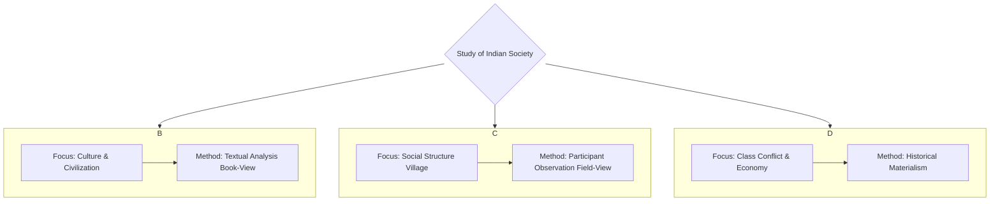
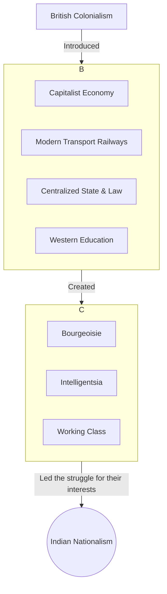
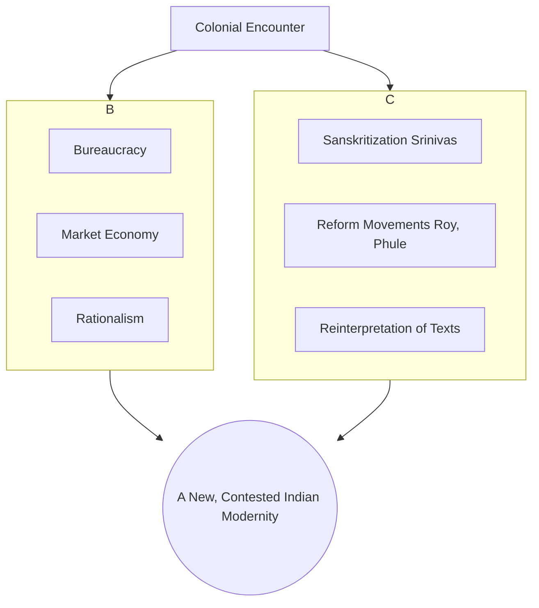
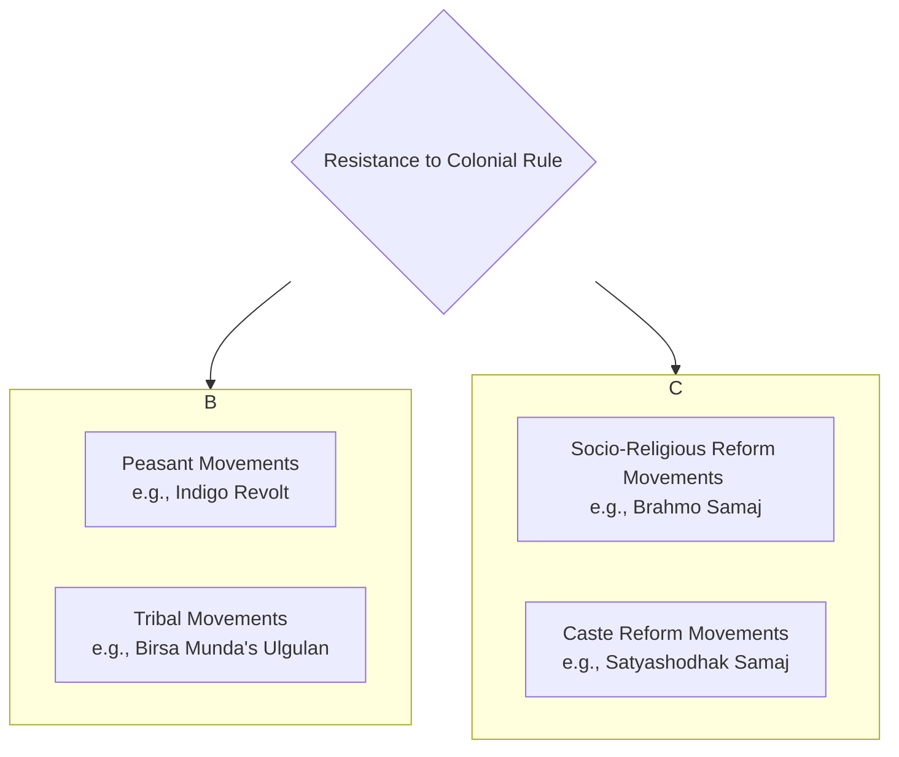

---

# UPSC Sociology Optional - Paper 2 Notes

## Section A: Introducing Indian Society

### **Chapter 1: Perspectives on the Study of Indian Society**

**Introduction**
*   The study of Indian society involves diverse, competing perspectives.
*   These frameworks determine the focus, method, and conclusions of sociological analysis.
*   Three foundational perspectives are Indological, Structural-Functional, and Marxist.

---

#### **1.1 The Three Foundational Perspectives: A Comparative Overview**

| **S.No.** | **Perspective**           | **Core Idea**                                                                   | **Unit of Analysis**                                  | **Methodology**                                           | **Key Thinker** |
| :-------- | :------------------------ | :------------------------------------------------------------------------------ | :---------------------------------------------------- | :-------------------------------------------------------- | :-------------- |
| 1.        | **Indological**           | Understanding India through its classical texts and cultural history.           | Indian civilization, its values and institutions.     | Textual analysis, Historical-Comparative. (**Book-View**) | G.S. Ghurye     |
| 2.        | **Structural-Functional** | Understanding India through empirical study of its living social structures.    | The village as a microcosm of society.                | Participant Observation, Ethnography. (**Field-View**)    | M.N. Srinivas   |
| 3.        | **Marxist**               | Understanding India through the lens of class conflict and economic structures. | The Mode of Production and resulting class relations. | Historical Materialism, Dialectical method.               | A.R. Desai      |
#### **Mermaid Diagram: The Three Foundational Perspectives**


---

#### **1.2 Indological Perspective (G.S. Ghurye)**

1.  **Introduction**
    *   Pioneered by G.S. Ghurye, the "Father of Indian Sociology."
    *   Seeks to understand Indian society via its classical texts (Vedas, Dharmashastras).
    *   Emphasizes cultural-civilizational unity rooted in history and tradition.

2.  **Core Idea & Method**
    *   **Book-View:** The essence of Indian social reality lies in its sacred literature.
    *   **Method:** Historical-comparative analysis of texts, combined with some empirical data.
    *   Focus on culture, values, and ideas as primary drivers of the social system.

3.  **Ghurye's Key Contributions**
    1.  **On Caste (*Caste and Race in India*):**
        *   Defined caste by 6 core features: segmental division, hierarchy, social restrictions, civil/religious disabilities, lack of occupational choice, endogamy.
        *   Saw caste as a unique, pan-Indian institution.
    2.  **On Tribes (*The Scheduled Tribes*):**
        *   Viewed tribes as "backward Hindus," not separate entities.
        *   Argued for their assimilation and integration into mainstream Hindu society.
        *   Directly opposed Verrier Elwin's "isolationist" policy.
    3.  **On Culture & Civilization:**
        *   Emphasized the role of Brahmanical ideology and Sanskritik Hinduism in creating a pan-Indian unity.
        *   This unity was diffused by "rishis" (sages) over centuries.

4.  **Paper 1 Linkages**
    *   **Weberian Influence:** Focus on culture, values, and religious texts mirrors Weber's approach.
    *   **Functionalism:** Implies a functionalist view of culture as an integrative force.

5.  **Critique**
    *   **Elitist/Brahmanical Bias:** Based on upper-caste texts; ignores marginalized perspectives.
    *   **Neglects Empirical Reality:** Idealized "book-view" often conflicts with the "field-view."
    *   **Overlooks Conflict:** Emphasizes harmony, downplaying exploitation in caste.

---

#### **1.3 Structural-Functional Perspective (M.N. Srinivas)**

1.  **Introduction**
    *   Led by M.N. Srinivas; marked a shift from "book-view" to **"field-view."**
    *   Focuses on empirical fieldwork in villages to understand living social institutions.

2.  **Core Idea & Method**
    *   **Field-View:** Understand institutions (caste, kinship) as they actually operate.
    *   **Method:** Participant observation, ethnography.
    *   **Classic Study:** Rampura village ("The Remembered Village").

3.  **Srinivas's Key Concepts (Derived from Fieldwork)**
    1.  **Sanskritization:**
        *   Process where a 'low' caste adopts the customs, rituals, and lifestyle of a 'high' caste.
        *   A form of **positional mobility**, not structural change. The hierarchy itself is not challenged.
    2.  **Dominant Caste:**
        *   A caste with decisive local power. Shifted focus from ritual Varna to secular power.
        *   **Criteria:** Numerical strength, land ownership, political power, access to education/jobs.
    3.  **Westernization:**
        *   Changes from 150+ years of British rule.
        *   Operates at levels of technology, institutions (law, bureaucracy), and values (rationalism).

4.  **Paper 1 Linkages**
    *   **Functionalism (`Radcliffe-Brown`):** Studies how institutions function to maintain social order.
    *   **Reference Group Theory (`Merton`):** Sanskritization is a perfect example of reference group behaviour.

5.  **Critique**
    *   **Micro-Focus:** Neglects macro-structures like the state and capitalism.
    *   **Ahistorical:** Tends to present a static snapshot of village life.
    *   **Overlooks Conflict:** Focuses on harmony and integration, downplaying exploitation.

---

#### **1.4 Marxist Perspective (A.R. Desai)**

1.  **Introduction**
    *   Led by A.R. Desai; a radical critique of the other two perspectives.
    *   Analyzes India via **historical materialism**: class conflict and economic structures.

2.  **Core Idea & Method**
    *   **Dialectical Conflict:** Rejects focus on culture or caste harmony.
    *   **Core Reality:** India's class structure and class struggle.
    *   **Method:** Application of Marxist historical method to Indian history.

3.  **Desai's Key Contributions**
    1.  **On Indian Nationalism (*Social Background of Indian Nationalism*):**
        *   **Thesis:** Nationalism was a product of new material conditions created by British colonialism.
        *   **Mechanism:** British rule created new classes (bourgeoisie, proletariat) who led the movement for their own interests.
    2.  **On the Indian State (*The Myth of the Welfare State*):**
        *   **Thesis:** The post-independence Indian state is a **bourgeois state**, despite "welfare" claims.
        *   **Evidence:** Its policies protect private property and capitalist interests.
    3.  **On Rural Sociology:**
        *   **Thesis:** Rural India is not a harmonious community but an arena of agrarian class conflict due to capitalist penetration.

4.  **Paper 1 Linkages**
    *   **Marxism:** Direct application of Historical Materialism, Class Struggle, and State theory.
    *   **Positivism:** A scientific approach to uncover objective economic laws.

5.  **Critique**
    *   **Economic Determinism:** Reduces caste and culture to reflections of the economic base.
    *   **Neglect of Caste:** Underestimates caste as an independent force of stratification.
    *   **Schematic Application:** Fits complex Indian history into a rigid Marxist model.

---

### **Chapter 2: Impact of Colonial Rule on Indian Society**

**Introduction**
*   British colonialism was not just a political event; it was a profound structural and cultural rupture. It fundamentally transformed Indian society, introducing new economic systems, institutions, and ideas, which in turn triggered unique social responses like nationalism and reform movements.

---

#### **2.1 Social Background of Indian Nationalism**



1.  **Introduction**
    *   Indian nationalism was a modern phenomenon, a direct consequence of the material and administrative conditions created by colonial rule.

2.  **Colonialism as a Unifying Force (Contradictory Process)**
    *   The British unified India in unprecedented ways, which inadvertently created the conditions for a nationalist consciousness.
    1.  **Economic Unification:** Introduction of a capitalist economy, modern transport (especially railways), and communication linked different parts of India into a single market.
    2.  **Administrative Unification:** A centralized state, a uniform legal system (rule of law), and a modern bureaucracy created a single political entity.
    3.  **Intellectual Unification:** Modern Western education introduced concepts like liberty, equality, and nationalism, creating a new English-speaking intelligentsia that could communicate across regions.

3.  **Emergence of New Social Classes**
    *   Colonial policies led to the rise of new classes who became the vanguard of the nationalist movement.
        *   **Industrial Bourgeoisie:** Had its own conflicts with British capital.
        *   **Educated Middle Class/Intelligentsia:** Absorbed nationalist ideas and provided leadership.
        *   **Peasantry & Working Class:** Mobilized against colonial economic exploitation (e.g., land revenue policies, de-industrialization).

4.  **A.R. Desai's Marxist Perspective**
    *   Nationalism was the result of the "material conditions created by British colonialism."
    *   The movement represented the coalescing interests of the newly emerged classes against their common colonial exploiter.

5.  **Conclusion**
    *   Indian nationalism was a complex product of colonial rule. The very instruments the British used to consolidate their power—railways, law, education—became the tools used by Indians to forge a unified national identity and challenge that same power.

---

#### **2.2 Modernization of Indian Tradition**

1.  **Introduction**
    *   Modernity in India was not an organic process but a product of the colonial encounter. This led to a complex interaction between Western "modern" values and Indian "traditional" structures.

2.  **Yogendra Singh's Framework (*Modernization of Indian Tradition*)**
    *   **Core Idea:** Modernization in India involved a process of **structural change** (introduction of bureaucracy, market economy) and **cultural change** (Western values like rationalism, humanism).
    *   **Contradictory Nature:**
        *   Colonialism introduced modernizing elements (e.g., rule of law) but also reinforced traditional structures (e.g., by aligning with princely states and landlords) to maintain control.
        *   This created a "contested modernity."

3.  **Key Processes of Interaction**
    1.  **Structural Changes:**
        *   **Bureaucracy & Law:** Universalistic norms challenged the particularistic norms of caste.
        *   **Market Economy:** Monetization and new land tenure systems disrupted the traditional jajmani system.
    2.  **Cultural Impact:**
        *   **Westernization (`Srinivas`):** Adoption of Western lifestyles, dress, and thinking, especially by the urban elite.
        *   **Rise of a "New Middle Class":** This class was a product of modern education and professions but often retained strong traditional ties.

4.  **Tradition is Not Static**
    *   Tradition itself was reinterpreted and "modernized" in response to the colonial challenge.
    *   Leaders like Raja Ram Mohan Roy sought to reform Hinduism by appealing to ancient texts (Upanishads) to fight "degenerate" practices like Sati.

5.  **Conclusion**
    *   The modernization of Indian tradition was a complex, dialectical process, not a simple replacement of tradition with modernity. It resulted in a unique social fabric where modern institutions and traditional values continue to coexist and interact.

#### **Mermaid Diagram: The Dialectic of Modernization in India**


---

#### **2.3 Protests and Movements during the Colonial Period**

1.  **Introduction**
    *   Colonial rule was not passively accepted. It was met with widespread resistance from various sections of society, including peasants, tribals, and social reformers.

2.  **Peasant Movements**
    *   **Cause:** Driven by colonial economic exploitation—high land revenue demands, new land tenure systems (Zamindari, Ryotwari), forced commercialization of agriculture (e.g., indigo).
    *   **Examples:**
        *   **Indigo Revolt (1859):** Peasants in Bengal refused to grow indigo for exploitative European planters.
        *   **Deccan Riots (1875):** Against the oppression of moneylenders.
        *   **Champaran Satyagraha (1917):** Gandhi's first major movement in India, against the forced indigo cultivation.

3.  **Tribal Movements**
    *   **Cause:** Colonial policies disrupted their traditional way of life.
        *   Forest Acts restricted their access to forest resources.
        *   Influx of outsiders (moneylenders, traders, contractors).
        *   Imposition of a new legal and administrative system.
    *   **Examples:**
        *   **Santhal Rebellion (1855-56):** Against zamindars and moneylenders.
        *   **Birsa Munda's Ulgulan (Great Tumult) (1899-1900):** A millenarian movement aiming to drive out the British and establish "Munda Raj."

4.  **Social Reforms**
    *   **Cause:** A response by the newly educated Indian intelligentsia to the colonial critique of Indian society as "backward" and "degenerate."
    *   **Nature:** Aimed to reform social and religious practices seen as irrational or inhuman.
    *   **Key Issues & Reformers:**
        *   **Sati Abolition (1829):** Led by `Raja Ram Mohan Roy` (Brahmo Samaj).
        *   **Widow Remarriage (1856):** Led by `Ishwar Chandra Vidyasagar`.
        *   **Caste Reform & Women's Education:** Led by `Jyotiba Phule` (Satyashodhak Samaj) and `Savitribai Phule` in Maharashtra.
        *   **Abolition of Untouchability:** A central theme for later reformers like `Dr. B.R. Ambedkar`.

5.  **Conclusion**
    *   Resistance to colonialism was multi-faceted. While peasant and tribal movements represented direct resistance to economic exploitation, the social reform movements represented an internal effort to modernize and strengthen Indian society from within, creating a complex legacy that shaped the future of independent India.

#### **Mermaid Diagram: Spectrum of Resistance to Colonial Rule**



---
---

## Section B: Social Structure

### **Chapter 3: Caste System**

**Introduction**
*   The caste system is India's most unique and defining social institution.
*   It is a traditional system of social stratification based on heredity, hierarchy, and ritual purity.
*   While its form has changed significantly, its influence persists in modern Indian social, political, and economic life.

---

#### **3.1 Perspectives on the Study of Caste**

1.  **Introduction**
    *   Sociological understanding of caste is shaped by different theoretical lenses, focusing on its cultural-ideological basis versus its structural-power dimensions.

2.  **Key Perspectives on Caste**

| **S.No.** | **Thinker** | **Perspective** | **Core Idea** | **Key Concept** |
| :--- | :--- | :--- | :--- | :--- |
| 1. | **G.S. Ghurye** | **Indological / Historical** | Caste is a unique Indian phenomenon with specific features, rooted in Hindu culture. | Defined caste by its 6 structural features. |
| 2. | **M.N. Srinivas** | **Structural-Functional** | Caste is best understood as a functioning, dynamic system at the village level. | **Dominant Caste**, Sanskritization. |
| 3. | **Louis Dumont** | **Structuralist / Ideological** | The essence of the caste system is not power or economics, but the ideology of **hierarchy**. | **Homo Hierarchicus**, Purity-Pollution dichotomy. |
| 4. | **Andre Beteille** | **Weberian / Interactional** | Caste is one of three dimensions of stratification, interacting with Class and Power. | **Harmonic vs. Disharmonic** systems. |

3.  **Louis Dumont's Perspective (*Homo Hierarchicus*)**
    *   **Core Idea:** The caste system is fundamentally an ideological system based on the opposition between the **pure** and the **impure**.
    *   **Hierarchy:** This religious principle of purity/pollution dictates the social hierarchy. It is distinct from secular power.
    *   **Separation of Status and Power:** The Brahmin (priest) has the highest ritual status (purity), but the Kshatriya (king) holds secular power. Status encompasses power.
    *   **Critique:** Criticized for being a "Brahmanical" view, ignoring power, conflict, and economic dimensions.

4.  **Andre Beteille's Perspective (*Caste, Class, and Power*)**
    *   **Core Idea:** A direct application and critique of Weber in the Indian context. Studied Sripuram village in Tanjore.
    *   **Harmonic System (Traditional):** In the past, the three hierarchies (Caste, Class, Power) were aligned. The upper castes (Brahmins) were also the landowners (Class) and held political power.
    *   **Disharmonic System (Modern):** In the present, the hierarchies are diverging. A person can have a high class position (e.g., a wealthy lower-caste person) but a low caste status. This creates social tension and change.

---

#### **3.2 Features of the Caste System**

1.  **G.S. Ghurye's Six Core Features**
    1.  **Segmental Division:** Society is divided into distinct segments (castes) with fixed memberships determined by birth.
    2.  **Hierarchy:** These segments are ranked in a clear order of superiority and inferiority, based on ritual purity.
    3.  **Restrictions on Feeding and Social Intercourse:** Strict rules on who can accept food and water from whom.
    4.  **Civil and Religious Disabilities and Privileges:** Lower castes faced severe disabilities (e.g., denied temple entry), while upper castes enjoyed privileges.
    5.  **Lack of Unrestricted Choice of Occupation:** Occupations were traditionally hereditary.
    6.  **Restrictions on Marriage:** Strict rules of **endogamy** (marrying within one's own caste) and **exogamy** (marrying outside one's gotra).

2.  **Varna vs. Jati**
    *   **Varna (Textual Model):** The four-fold ideal classification from ancient texts: Brahmin, Kshatriya, Vaishya, Shudra. It is a broad, all-India framework.
    *   **Jati (Contextual Reality):** The actual, complex system of thousands of endogamous local groups. This is the reality of caste as lived on the ground. Jati is the more important unit for sociological analysis.

---

#### **3.3 Untouchability: Forms and Perspectives**

1.  **Definition**
    *   Untouchability is the most extreme and oppressive manifestation of the caste system's purity-pollution logic.
    *   It refers to the practices of social discrimination and exclusion imposed on castes at the very bottom of the hierarchy (Dalits), who were considered so impure as to pollute others by mere touch or presence.

2.  **Forms of Untouchability**
    *   **Social Disabilities:** Residential segregation (living in separate hamlets), denial of access to common resources (wells, temples), forced deference (e.g., removing footwear).
    *   **Economic Exploitation:** Forced to perform "unclean" occupations (e.g., manual scavenging, leatherwork), landlessness, bonded labour.
    *   **Ritual Exclusion:** Denial of participation in religious ceremonies and festivals.

3.  **Perspectives on Eradication**
    *   **Gandhian Perspective:**
        *   Saw untouchability as a moral "sin" within Hinduism that needed to be purged.
        *   Advocated for a change of heart among upper castes and the integration of Dalits into the Hindu fold.
        *   Coined the term **"Harijan"** (children of God).
        *   Did not advocate for the annihilation of the caste system itself, only untouchability.
    *   **Ambedkarite Perspective:**
        *   Viewed untouchability not as a moral issue but as a problem of **power and exploitation**, inherent to the caste system itself.
        *   Rejected the term "Harijan" as patronizing; promoted the term **"Dalit"** (the oppressed).
        *   Argued that a change of heart was not enough. The only solution was the **"Annihilation of Caste"** itself through legal-political means and the rejection of Hinduism.

4.  **Mermaid Diagram: Gandhi vs. Ambedkar on Untouchability**

    ```mermaid
    graph TD
        A{Untouchability};
        A --> B[Gandhian Perspective];
        A --> C[Ambedkarite Perspective];

        subgraph B
            B1[Problem: A moral 'sin' in Hinduism]
            B2[Solution: Change of heart, reform within Hinduism]
            B3[Goal: Integration as 'Harijans']
        end

        subgraph C
            C1[Problem: Inherent to the structure of Caste & Hinduism]
            C2[Solution: Legal-political empowerment, rejection of Hinduism]
            C3[Goal: Annihilation of Caste as 'Dalits']
        end
    ```

5.  **Contemporary Status**
    *   Untouchability is abolished by law (**Article 17** of the Constitution) and punishable under the **Protection of Civil Rights Act (1955)** and the **SC/ST (Prevention of Atrocities) Act (1989)**.
    *   However, it continues to be practiced in subtle and overt forms, especially in rural India.

---

### **Chapter 4: Tribal Communities in India**

**Introduction**
*   Tribal communities, or **Adivasis**, represent a significant and diverse segment of the Indian population.
*   Sociological study of tribes is marked by debates over their definition, their relationship with mainstream society, and the impact of colonial and post-colonial policies on their lives.

---

#### **4.1 Definitional Problems**

1.  **The Challenge of Definition**
    *   There is no single, universally accepted definition of a "tribe." The term itself is a colonial construct.
    *   The boundaries between tribe and caste are often fluid and blurred.

2.  **Commonly Used Criteria (and their problems)**
    *   **Isolation:** Often live in remote hills and forests. (Problem: Many tribes have had long-standing interactions with non-tribal populations).
    *   **Distinct Culture:** Have their own language, religion (animism), and customs. (Problem: Many have adopted elements of Hinduism).
    *   **Primitive Economy:** Often based on hunting, gathering, or shifting cultivation. (Problem: Many are now settled agriculturists or wage labourers).
    *   **Lack of State/Hierarchy:** Traditionally egalitarian social structures. (Problem: Some tribes have had chiefs or kings).

3.  **The Caste-Tribe Continuum (`F.G. Bailey`)**
    *   Bailey argued against seeing caste and tribe as a rigid dichotomy.
    *   He proposed a continuum, where at one end is the pure, isolated tribe, and at the other is the caste society. Most groups in India lie somewhere in between.
    *   The key difference for Bailey is that caste is a hierarchical system where groups are interdependent, while a tribe is a segmented system where groups are independent.

---

#### **4.2 Geographical Spread & Colonial Policies**

1.  **Geographical Spread**
    *   Tribal populations are concentrated in three main zones:
        1.  **North and North-Eastern Zone:** (e.g., Nagas, Mizos, Khasis).
        2.  **Central Zone:** The largest zone, covering states like MP, Jharkhand, Chhattisgarh, Odisha (e.g., Gonds, Santhals, Bhils).
        3.  **Southern Zone:** (e.g., Todas of Nilgiris, Chenchus of Andhra Pradesh).

2.  **Colonial Policies and their Impact**
    *   Colonial policies fundamentally disrupted tribal life.
    1.  **Forest Acts:** Declared forests as state property, severely restricting tribal access to their traditional livelihood and habitat.
    2.  **Land Alienation:** The introduction of private property in land led to the large-scale transfer of tribal lands to non-tribal moneylenders and zamindars.
    3.  **Administrative Integration:** Imposed a new legal and administrative system, undermining traditional tribal councils and leadership.
    4.  **Cultural Contact:** The influx of Christian missionaries, traders, and contractors led to significant cultural changes.

---

#### **4.3 Issues of Integration and Autonomy**

1.  **The Elwin-Ghurye Debate**
    *   This was the foundational debate on tribal policy in post-independence India.

| **S.No.** | **Thinker** | **Policy Advocated** | **Core Argument** | **Critique** |
| :--- | :--- | :--- | :--- | :--- |
| 1. | **Verrier Elwin** | **Isolationism** (in his early phase) | Tribes have a unique, pristine culture that must be protected from the corrupting influence of the mainstream. Proposed creating "National Parks" or reserved areas. | Seen as promoting a "museum" approach that would keep tribes backward. |
| 2. | **G.S. Ghurye** | **Assimilation** | Tribes are simply "backward Hindus" who have always been part of the larger Hindu civilization. The goal should be their full integration. | Seen as a threat to unique tribal identities and cultures. |

2.  **Nehru's Policy of Integration ("Panchsheel")**
    *   Jawaharlal Nehru sought a middle path, rejecting both extremes.
    *   His policy of **integration** aimed to bring development to tribal areas while respecting their distinct culture and identity.
    *   The **"Tribal Panchsheel"** principles included:
        1.  Develop along the lines of their own genius.
        2.  Respect their rights in land and forests.
        3.  Train their own people for administration and development.
        4.  Avoid over-administration and imposing too much.
        5.  Judge results not by statistics, but by the quality of human character evolved.

3.  **Contemporary Issues**
    *   **Development-Induced Displacement:** Large-scale projects like dams, mines, and industrial plants are often located in tribal areas, leading to mass displacement and loss of livelihood.
    *   **Assertion of Identity:** Rise of ethnic and autonomy movements, demanding greater political self-determination (e.g., Bodoland, Gorkhaland).
    *   **Forest Rights Act (2006):** A landmark law that attempts to redress the historical injustice of colonial forest acts by recognizing the rights of tribal communities over forest land and resources.

4.  **Conclusion**
    *   The "tribal question" in India remains a complex interplay of issues related to identity, exploitation, and development. The central challenge is to foster their socio-economic development while protecting their unique cultural heritage and rights to land and resources.


---
---
### **Chapter 5: Social Classes in India**

**Introduction**
*   While caste has been the traditional basis of hierarchy, **class** has emerged as a significant dimension of stratification in modern India.
*   The class structure in India is complex, shaped by both the pre-existing agrarian order and the development of industrial capitalism. It is also deeply intertwined with the caste system.

---

#### **5.1 Agrarian Class Structure**

1.  **Introduction**
    *   The agrarian class structure refers to the hierarchy of groups in rural India based on their relationship to land.
    *   Colonial land tenure systems (Zamindari, Ryotwari, Mahalwari) fundamentally reshaped this structure.

2.  **Major Agrarian Classes**
    *   **Daniel Thorner's Classification:**
        1.  **Malik (Landlords):** Own land but do not engage in physical labour. They derive income from rent.
        2.  **Kisan (Peasants):** Own and cultivate small plots of land, primarily using family labour.
        3.  **Mazdur (Labourers):** Landless individuals who sell their labour power for wages.
    *   **A.R. Desai's Marxist Classification:**
        *   Focuses on class conflict arising from capitalist development in agriculture.
        *   Identifies classes like rich farmers/capitalist farmers, middle peasants, poor peasants, and the rural proletariat (landless labourers).

3.  **The Green Revolution and its Impact**
    *   **What it was:** A state-led program in the 1960s-70s to increase agricultural productivity using high-yielding variety (HYV) seeds, fertilizers, and irrigation.
    *   **Social Impact:**
        1.  **Increased Class Differentiation:** It primarily benefited wealthy farmers (**Maliks**) who could afford the new inputs, turning them into a powerful class of capitalist farmers. The gap between rich and poor farmers widened.
        2.  **Regional Disparities:** Benefited irrigated regions like Punjab, Haryana, and Western UP, while dryland regions lagged behind.
        3.  **Decline of Traditional Relations:** Replaced traditional patron-client relations (`jajmani`) with impersonal, contractual wage labour.

4.  **Contemporary Issues**
    *   **Agrarian Distress:** Issues of farmer suicide, indebtedness, and unprofitability of agriculture.
    *   **Feminization of Agriculture:** As men migrate to cities for work, women are increasingly taking on agricultural labour, often without land rights or recognition.

---

#### **5.2 Industrial Class Structure**

1.  **Introduction**
    *   The industrial class structure in India emerged with colonial-era industrialization and has evolved significantly in the post-liberalization period.

2.  **Key Industrial Classes**
    1.  **Bourgeoisie / Capitalist Class:**
        *   Owners of the means of industrial production.
        *   Historically dominated by a few family-owned business houses (e.g., Tatas, Birlas).
        *   Post-1991, a new, more aggressive entrepreneurial class has emerged.
    2.  **Working Class / Proletariat:**
        *   Sells their labour power in factories and industries.
        *   Characterized by a deep **formal-informal divide**.
        *   **Formal Sector Workers:** A small, protected "labour aristocracy" with job security and benefits.
        *   **Informal Sector Workers:** The vast majority, facing precarity, low wages, and no social security.
    3.  **White-Collar / Salaried Employees:**
        *   Managers, supervisors, and clerical staff.
        *   Occupy an intermediate position between the bourgeoisie and the working class.

---

#### **5.3 Middle Classes in India**

1.  **Introduction**
    *   The middle class in India is a large, heterogeneous, and socio-politically significant group. Its size and character have been transformed by economic liberalization since 1991.

2.  **The "Old" vs. "New" Middle Class**
    *   **Old Middle Class (Pre-1991):**
        *   Primarily composed of state employees (bureaucrats, public sector workers) and professionals (doctors, lawyers).
        *   Characterized by a focus on job security, savings, and social status.
    *   **New Middle Class (Post-1991):**
        *   Emerged from the growth of the private service sector (IT, finance, media).
        *   Characterized by a culture of **consumerism**, global aspirations, reliance on credit, and a more individualistic outlook.

3.  **Andre Beteille on the Middle Class**
    *   Beteille justifies the "middle class" as a valid sociological category in India.
    *   He argues it is defined not just by income, but by a combination of factors:
        *   Possession of non-manual skills acquired through modern education.
        *   A certain standard of living and consumption pattern.
        *   A shared set of values and aspirations.

4.  **Conclusion on Class in India**
    *   The class structure in India is dynamic and complex. It cannot be understood without reference to caste, as caste identities continue to influence life chances and access to resources, often creating a "caste-class nexus."

---

### **Chapter 6: Systems of Kinship in India**

**Introduction**
*   Kinship is a vital organizing principle of Indian social life, governing marriage, family, inheritance, and social obligations.
*   India exhibits immense regional diversity in kinship systems, most notably between the North and the South.

---

#### **6.1 Lineage and Descent in India**

1.  **Core Principles**
    *   **Patrilineal System:** Dominant in most of India. Descent, inheritance, and succession are traced through the male line.
    *   **Matrilineal System:** Found among some communities, notably the Nairs of Kerala and the Khasis and Garos of Meghalaya. Descent is traced through the female line.
    *   **Lineage:** A key social group based on descent from a known common ancestor. It is often exogamous (one must marry outside the lineage).

---

#### **6.2 Types of Kinship Systems: North vs. South India**

*   **Irawati Karve's** classic study identified two fundamentally different kinship systems.

| **S.No.** | **Feature** | **North Indian System** | **South Indian System** |
| :--- | :--- | :--- | :--- |
| 1. | **Marriage Rules** | **Negative Rules:** Specifies who one *cannot* marry. | **Positive Rules:** Specifies who one *should* marry (preferred partners). |
| 2. | **Key Principle** | **Rule of Four Gotra Exogamy:** Cannot marry into the gotra of one's father, mother, paternal grandmother, and maternal grandmother. | **Cross-Cousin Marriage:** Marriage with one's mother's brother's daughter or father's sister's daughter is preferred. |
| 3. | **Kinship & Affinity** | Sharp distinction between the "family of birth" and the "family of marriage." | The distinction is blurred. Relatives by marriage are often already relatives by blood. |
| 4. | **Terminology** | Different terms for relatives by blood and relatives by marriage. | The same term is often used for both (e.g., mother's brother and father-in-law can be the same person and called *mama*). |

---

#### **6.3 Family and Marriage in India**

1.  **The Joint Family**
    *   **Definition:** A multi-generational group of kin who typically live under one roof, share a common kitchen, hold property in common, and participate in common family worship.
    *   **Changing Nature:**
        *   **Structural Change:** A trend towards nuclear households due to urbanization and migration.
        *   **Functional Change (`I.P. Desai`):** Even when living in nuclear households, families often remain "functionally joint," maintaining strong ties of mutual obligation and support.

2.  **Marriage**
    *   **Traditional Features:** Seen as a sacred duty (`sanskara`), not a contract. A union between two families, not just two individuals. Arranged by parents. Governed by strict rules of caste endogamy.
    *   **Contemporary Trends:**
        *   Rise in the age of marriage.
        *   Increasing importance of individual choice and "love marriage."
        *   Emergence of online matrimonial sites.
        *   Increasing acceptance (though still limited) of inter-caste marriages.

---

#### **6.4 Patriarchy, Entitlements, and Sexual Division of Labour**

1.  **Patriarchy in India**
    *   A deeply entrenched system where men hold authority over women and property.
    *   Manifests in:
        *   **Patrilineal Inheritance:** Property passes from father to son.
        *   **Patrilocal Residence:** The wife moves to live with her husband's family.
        *   **Control over Female Sexuality:** Strong emphasis on female chastity and purity.

2.  **Entitlements (`Amartya Sen`)**
    *   Patriarchy leads to unequal entitlements within the household.
    *   Men and boys often have better access to food, healthcare, and education than women and girls, as reflected in India's skewed child sex ratio.

3.  **Sexual Division of Labour**
    *   A clear demarcation of roles:
        *   **Men:** Public sphere (breadwinning, politics).
        *   **Women:** Private sphere (domestic work, childcare).
    *   Women's domestic labour is crucial for the family's survival but is unpaid, unrecognized, and devalued.

4.  **Mermaid Diagram: The Cycle of Patriarchy in India**

    ```mermaid
    graph TD
        A[Patriarchal Ideology] --> B(Patrilineal Inheritance & Patrilocal Residence);
        B --> C(Son Preference & Neglect of Daughters);
        C --> D(Skewed Sex Ratio & Lower Female Entitlements);
        D --> E(Sexual Division of Labour <br/> Women in Private Sphere);
        E --> F(Limited Female Autonomy & Power);
        F --> A;
    ```

---

### **Chapter 7: Religion and Society in India**

**Introduction**
*   India is a land of immense religious diversity, being the birthplace of four major world religions (Hinduism, Buddhism, Jainism, Sikhism) and home to large populations of Muslims and Christians.
*   Religion is not just a private belief but a powerful social force that shapes identity, community, and politics.

---

#### **7.1 Religious Communities in India**

1.  **Hinduism:** The majority religion, characterized by immense diversity of beliefs and practices, the caste system, and concepts like Dharma, Karma, and Moksha.
2.  **Islam:** India's largest religious minority. Characterized by belief in one God (Allah) and the Prophet Muhammad. Deeply influenced by and has influenced Indian culture (e.g., Sufism).
3.  **Christianity:** Arrived in India in ancient times, but spread significantly under colonial rule.
4.  **Sikhism:** Emerged in 15th century Punjab as a monotheistic religion, critiquing both Hindu and Islamic rituals.
5.  **Buddhism & Jainism:** Ancient religions that emerged as a challenge to Brahmanical orthodoxy. Buddhism is seeing a revival through Dalit conversions (Navayana Buddhism).

---

#### **7.2 Problems of Religious Minorities**

1.  **Issues of Identity vs. Security:** Minorities often face a dual challenge: preserving their distinct cultural identity while ensuring their physical and economic security.
2.  **Communalism:**
    *   **Definition:** An ideology that posits that society is divided into religious communities whose interests are mutually hostile and antagonistic.
    *   **Consequences:** Leads to prejudice, discrimination, communal riots, and political polarization.
3.  **Socio-Economic Issues:**
    *   Some religious minorities, particularly Muslims, lag behind the national average on development indicators like education, employment, and income, as highlighted by the **Sachar Committee Report (2006)**.
4.  **Secularism in India:**
    *   Unlike the Western model of strict separation of church and state, Indian secularism is based on the principle of **"principled distance"** (`Rajeev Bhargava`).
    *   The state does not strictly separate from religion but aims to treat all religions with equal respect and has the right to intervene to address social evils within religions. This model is a subject of intense political debate.

5.  **Conclusion**
    *   Managing religious diversity and ensuring the rights and security of minorities remains a central challenge for Indian democracy. The rise of communal politics poses a significant threat to India's secular and pluralistic fabric.

---
---


