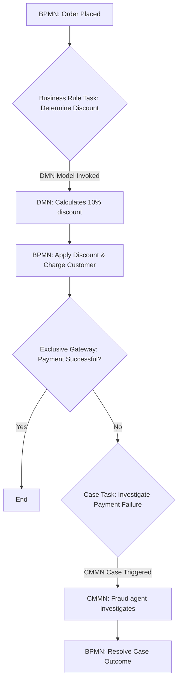

# Draft 2

You are absolutely right. The previous guide was an introduction. Let's build the definitive, in-depth resource you're looking for.

This guide moves beyond the basics to cover the nuances, advanced concepts, and practical applications that professionals need. It's structured to be a comprehensive reference for modeling complex business operations accurately and effectively.

***

# The Definitive Guide to Business Modeling: BPMN, CMMN, & DMN

This is an in-depth guide to the OMG's "Triple Crown" of business modeling standards. It is intended for analysts, architects, and managers who need to move beyond simple flowcharts to create precise, executable, and auditable models of their business operations.

---

## 1. Executive Summary: A Strategic Overview

These notations are not competitors; they are collaborators. Understanding their distinct problem domains is the first step to mastery.

| Notation                               | 📜 BPMN (Business Process Model and Notation)                               | 🗂️ CMMN (Case Management Model and Notation)                                | 🎯 DMN (Decision Model and Notation)                                         |
| -------------------------------------- | --------------------------------------------------------------------------- | ---------------------------------------------------------------------------- | ---------------------------------------------------------------------------- |
| **Core Problem Solved**                | **Orchestrating predictable work.** It answers "What is the next step?"        | **Managing unpredictable situations.** It answers "What is possible now?"      | **Decoupling and managing business rules.** It answers "What is the right answer?" |
| **Paradigm**                           | **Imperative (Prescriptive).** You define the exact path(s) the process must take. | **Declarative (Descriptive).** You define available actions and the rules that govern them. | **Functional (Input/Output).** You define how inputs are transformed into a clear output. |
| **Primary Use Case**                   | Automating and optimizing high-volume, structured workflows like loan origination, order fulfillment, or employee onboarding. | Empowering knowledge workers in adaptive processes like complex insurance claims, medical diagnoses, or high-stakes sales cycles. | Centralizing and managing complex, frequently changing business logic like risk assessment, pricing, or eligibility checks. |
| **Key Strength**                       | Explicit, visual, and auditable flow control. Excellent for compliance and automation. | Flexibility and empowerment of the user. Models the reality of knowledge work. | Agility. Business rules can be changed by analysts without redeploying the entire process application. |
| **Key Weakness**                       | Can become rigid and overly complex when trying to model exceptions and human judgment. | Not suitable for highly structured, repetitive tasks where efficiency is paramount. Can be harder to optimize. | Is not a process. It has no concept of time or flow; it simply provides answers to questions. |

---

## 2. 📜 In-Depth Guide: BPMN (Business Process Model and Notation)

BPMN is the language of process orchestration. Its primary goal is to provide a standard, unambiguous notation that is understandable by business stakeholders but precise enough for IT implementation and automation.

### Core Philosophy: The Process as a Sequence of Events

Think of a BPMN model as a contract. It explicitly defines the sequence of work, the hand-offs between roles, the communication with external systems, and how exceptions are handled.

### A. Deeper Dive into BPMN Elements

#### A.1. Events: The Triggers and Outcomes

Events are not just start/stop markers; they are the nervous system of your process.

| Event Type      | Visual            | In-Depth Explanation & Use Case                                                                                                                              |
| --------------- | ----------------- | ------------------------------------------------------------------------------------------------------------------------------------------------------------ |
| **Start**       | 🟢 (Thin Circle)    | **Start Events:** Can be generic (`None`), or specific like `Timer` (e.g., "Run payroll on the 1st of the month"), `Message` (e.g., "A new customer order was received via API"), or `Signal` (e.g., "Broadcast a system-wide freeze"). |
| **Intermediate**| 🔵 (Double Circle)  | **Intermediate Events:** Occur *during* a process. Can be `Catching` (pauses the flow to wait for something, e.g., wait for a document) or `Throwing` (sends something out, e.g., send an email notification). |
| **End**         | 🔴 (Thick Circle)   | **End Events:** Can be generic (`None`) or specific like `Terminate` (immediately kills the entire process instance), `Error` (throws a business error to be caught elsewhere), or `Message` (sends a final confirmation message). |
| **Boundary**    | 🔵 on Task Border | **Boundary Events:** Attached to a task. They listen for an event *while the task is active*. Crucially, they can be **Interrupting** (solid border - cancels the task) or **Non-Interrupting** (dashed border - lets the task continue). |

> **Pro Tip:** Use a Non-Interrupting Timer Boundary Event to send reminders. For example, on a "Review Document" task, a non-interrupting timer can fire every 24 hours to send a "Please review" email without canceling the original task.

#### A.2. Activities: The Work Being Done

| Activity Type   | Visual            | In-Depth Explanation & Use Case                                                                                                                              |
| --------------- | ----------------- | ------------------------------------------------------------------------------------------------------------------------------------------------------------ |
| **User Task**   | 👤 (Rectangle)      | Work done by a human, typically using a form in a software application. This is the most common task type for human-in-the-loop processes.                  |
| **Service Task**| ⚙️ (Rectangle)      | Work done by an automated system. It invokes a web service, runs a script, or executes code. The "worker" that connects BPMN to the real world.            |
| **Business Rule Task** | ▦ (Rectangle) | A special task that invokes a decision engine, almost always a DMN model. It externalizes the decision logic from the process flow.                      |
| **Sub-Process** | ⏹ (Rect w/ `+`)    | A process within a process. Can be **Embedded** (logic is defined inside) or **Reusable** (calls another, separate BPMN process). Essential for managing complexity. |

#### A.3. Gateways: The Brains of the Flow

| Gateway Type    | Visual            | In-Depth Explanation & Use Case                                                                                                                              |
| --------------- | ----------------- | ------------------------------------------------------------------------------------------------------------------------------------------------------------ |
| **Exclusive (XOR)** | 💠 (Diamond w/ X) | **"One or the other."** The flow will follow exactly one outgoing path based on conditions. The classic `if/else if/else` logic.                           |
| **Parallel (AND)**  | 💠 (Diamond w/ +) | **"All at once."** Splits the flow into multiple paths that execute concurrently. The joining parallel gateway waits for all incoming paths to complete before continuing. |
| **Inclusive (OR)**  | 💠 (Diamond w/ O) | **"One or more."** A powerful but complex gateway. Evaluates conditions on all outgoing paths and follows all paths where the condition is true. Requires a joining gateway to synchronize the active paths. |
| **Event-Based** | 💠 (Diamond w/ ⚡)  | **"Race condition."** Pauses the flow and waits for the *first* of several possible events to occur. Used for handling competing events, like "Receive Approval" or "Timer Expires after 72 hours." |

### B. In-Depth Example: Insurance Claim Initial Processing

This BPMN model handles the structured part of a new insurance claim.

**Structured Pseudo-Code:**
```
PROCESS: "Process New Insurance Claim"

POOL: "InsureCorp"
  LANE: "Automated System"
    - MESSAGE_START_EVENT: "Claim Received via Web Portal"
    - SERVICE_TASK: "Create Claim Record in System"
    - BUSINESS_RULE_TASK: "Initial Fraud & Validity Check" (Invokes DMN) -> (sends to Triage)

  LANE: "Claim Triage Agent"
    - USER_TASK: "Review Initial Claim Details"
    - EXCLUSIVE_GATEWAY: "Is Claim Simple?"
      - Path (Yes): -> (sends to Junior Adjuster)
      - Path (No): -> (sends to Senior Adjuster)

  LANE: "Junior Adjuster"
    - USER_TASK: "Assess Simple Claim & Propose Payout"
      - BOUNDARY_TIMER_EVENT (Interrupting, 5 days): "Escalate to Senior" -> (sends to Senior Adjuster)
    - SERVICE_TASK: "Send Proposal to Customer" -> (ends this path)

  LANE: "Senior Adjuster"
    - USER_TASK: "Conduct Detailed Investigation"
    - PARALLEL_GATEWAY (Split):
      - Path A: USER_TASK: "Request Police Report"
      - Path B: USER_TASK: "Schedule Vehicle Inspection"
    - PARALLEL_GATEWAY (Join): (waits for both tasks to complete)
    - EXCLUSIVE_GATEWAY: "Suspicion of Fraud?"
      - Path (No): -> USER_TASK: "Finalize Complex Payout" -> (ends this path)
      - Path (Yes): -> THROW_SIGNAL_EVENT: "FRAUD_INVESTIGATION_REQUIRED" -> (ends this path)
```

**Rendered Output (in a BPMN Modeler):**
> This renders a sophisticated process diagram. It starts with a message icon. A Business Rule Task (with a table icon) shows the call to DMN. The flow splits at an Exclusive Gateway (X) into two lanes. The "Junior Adjuster" lane contains a task with a timer icon on its border, indicating the escalation path. The "Senior Adjuster" lane shows a Parallel Gateway (+) splitting the flow into two concurrent tasks and another (+) joining them back. The process concludes with a Signal event (triangle icon), designed to be caught by a CMMN case.

### C. BPMN Best Practices
1.  **Model from Left to Right:** Follow the natural reading order.
2.  **Verb-Noun Naming:** Name tasks with a verb-noun pair (e.g., "Approve Claim," not "Claim Approval").
3.  **Pair Your Gateways:** Every splitting gateway should have a corresponding joining gateway of the same type. This prevents synchronization errors.
4.  **Use Sub-Processes:** If a part of your diagram has more than 10-15 elements, encapsulate it in a sub-process to keep the top-level view clean.
5.  **Pools for Participants:** Use a separate pool for each distinct entity (Your Company, Customer, Partner). Communication between pools *must* use Message Flows (dashed lines), not Sequence Flows.

---

## 3. 🗂️ In-Depth Guide: CMMN (Case Management Model and Notation)

CMMN addresses the reality that not all work is a predictable process. It models how knowledge workers manage a "case" by providing them with a flexible set of tools and rules, not a rigid path.

### Core Philosophy: Empowering the Knowledge Worker

Think of a CMMN model as a doctor's toolkit. The doctor has scalpels, stethoscopes, and medicine, but the order in which they are used depends entirely on the patient's evolving condition. CMMN models this by defining what is *possible* and the conditions under which actions become available.

### A. Deeper Dive into CMMN Elements

#### A.1. The Case Plan and its Contents

| Element           | Visual            | In-Depth Explanation & Use Case                                                                                                                              |
| ----------------- | ----------------- | ------------------------------------------------------------------------------------------------------------------------------------------------------------ |
| **Case Plan Model** | 🗂️ (Large Folder) | The top-level container. It has an **auto-complete** condition, meaning the case can close itself if a certain state is reached (e.g., `Milestone: "Case Resolved"` is achieved). |
| **Case File Item**| 📄 (Document Icon)  | Represents a piece of data in the case, like a document or a form field. These are the "variables" of the case.                                          |
| **Stage**         | 📂 (Rect w/ +/-)    | A container for other plan items, representing a phase of the case. Stages themselves have sentries and can be activated or completed as a group.          |
| **Milestone**     | 🎯 (Oval)           | A significant, business-relevant state change. Reaching a milestone can trigger other activities via a sentry. It represents an achievement, not an action. |

#### A.2. Plan Items: The Actions and Events

| Plan Item Type  | Visual            | In-Depth Explanation & Use Case                                                                                                                              |
| --------------- | ----------------- | ------------------------------------------------------------------------------------------------------------------------------------------------------------ |
| **Human Task**  | 📝 (Rectangle)      | A task for a knowledge worker. Can be **Blocking** (the worker must complete it before doing other things) or **Non-Blocking**.                               |
| **Process Task**| ⏯ (Rect w/ Play)  | Invokes a structured BPMN process to handle a predictable part of the case. For example, a "Process Refund" BPMN can be called from an "Approve Refund" Human Task. |
| **Event Listener**| ✉️ (Double Circle)  | Listens for an event to occur, like a timer expiring or a document being uploaded. It can trigger other items in the case.                               |

#### A.3. The Declarative "Magic": Sentries and Rules

This is the most critical part of CMMN.

| Control Element      | Visual            | In-Depth Explanation & Use Case                                                                                                                              |
| -------------------- | ----------------- | ------------------------------------------------------------------------------------------------------------------------------------------------------------ |
| **Sentry**           | ◇ (Diamond on border) | A condition that guards a plan item. It consists of an `ifPart` (the trigger) and an `onPart` (the action it enables). **Entry Criteria** (`->◇`) control when an item becomes available/required. **Exit Criteria** (`◇->`) control when a stage or the case itself is terminated. |
| **Discretionary Item** | (Dashed Border)   | The item is not available by default. A knowledge worker must explicitly choose to start it from a list of available optional tasks. This is the ultimate form of empowerment. |
| **Repetition Rule**  | 🔁 (Marker)         | A rule on a task that allows it to be performed multiple times. For example, a "Upload Evidence" task can be repeated as many times as needed.           |
| **Manual Activation**| `!` (Marker)        | A rule on a task that prevents it from starting automatically even if its entry criteria are met. The user must manually trigger it.                      |

### B. In-Depth Example: Insurance Fraud Investigation Case

This CMMN case is triggered by the signal from our BPMN process.

**Structured Pseudo-Code:**
```
CASE_PLAN: "Investigate Potentially Fraudulent Claim"
  - SENTRY (Entry): IF Signal "FRAUD_INVESTIGATION_REQUIRED" is received, THEN activate this case.

CASE_FILE_ITEMS: "Claim Form", "Police Report", "Photos", "Investigation Notes"

STAGE: "Initial Assessment" (auto-activated on case start)
  - HUMAN_TASK: "Review Claim and Flagged Inconsistencies" (Required)
  - MILESTONE: "Initial Review Complete" (achieved after task completion)

STAGE: "Evidence Gathering"
  - SENTRY (Entry): IF Milestone "Initial Review Complete" is achieved.
  - HUMAN_TASK: "Interview Claimant" (Discretionary)
    - REPETITION_RULE: Can be performed multiple times.
  - HUMAN_TASK: "Request Financial Records" (Discretionary, Manual Activation)
  - HUMAN_TASK: "Consult with External Investigator" (Discretionary)

STAGE: "Final Decision"
  - SENTRY (Entry): IF (Human Task "Interview Claimant" is complete) AND (Human Task "Request Financial Records" is complete).
  - HUMAN_TASK: "Summarize Findings and Make Recommendation" (Required)
  - EXCLUSIVE_GATEWAY (attached to task): "Final Outcome"
    - Path (Approve): -> MILESTONE: "Claim Approved"
    - Path (Deny): -> MILESTONE: "Claim Denied as Fraudulent"

CASE_COMPLETION: Terminate when "Claim Approved" OR "Claim Denied" milestone is reached.
```

**Rendered Output (in a CMMN Modeler):**
> This renders a case plan with three stages. The "Evidence Gathering" stage contains tasks with dashed borders (discretionary) and markers for repetition (`🔁`) and manual activation (`!`). Diamonds (sentries) on the borders of the stages and tasks define the complex conditions for their activation, showing how the case progresses based on the investigator's actions, not a predefined path.

### C. CMMN Best Practices
1.  **Think in States, Not Steps:** Model the possible states of the case (e.g., "Awaiting Evidence," "Under Review") and what actions are possible in each state.
2.  **Empower, Don't Constrain:** Use discretionary items and manual activation liberally. Your goal is to support the knowledge worker, not replace them with a rigid checklist.
3.  **Use Milestones for Clarity:** Milestones are excellent for communicating the progress of the case to stakeholders and for triggering major state transitions.
4.  **Combine with BPMN:** Don't reinvent the wheel. If a part of your case is structured and repeatable (like sending a formal notice), model it in BPMN and call it with a Process Task.

---

## 4. 🎯 In-Depth Guide: DMN (Decision Model and Notation)

DMN's purpose is to take complex business rule logic, pull it out of the process code, and place it into a format that business users can understand and manage.

### Core Philosophy: Separating Logic from Process

A process knows the *flow* of work, but it shouldn't know *how* to calculate a premium or *what* constitutes a high-risk transaction. DMN provides a callable "black box" that answers these questions, allowing the rules to evolve independently of the process flow.

### A. Deeper Dive into DMN Elements

#### A.1. The Decision Requirements Diagram (DRD)

This is the high-level map of your decision-making.

| DRD Element        | Visual                | In-Depth Explanation & Use Case                                                                                                                              |
| ------------------ | --------------------- | ------------------------------------------------------------------------------------------------------------------------------------------------------------ |
| **Decision**       | 📄 (Rectangle)        | A point where a decision is made. It requires inputs and produces an output. Crucially, decisions can be **chained**: the output of one decision can be the input to another. |
| **Input Data**     | 📥 (Oval)             | The raw data that feeds the decision-making process. This is the "API contract" for your decision model (e.g., `Customer Age`, `Order Amount`).           |
| **Business Knowledge Model (BKM)** | 🧠 (Clipped Rect)     | A reusable piece of logic, like a function. For example, a BKM could define a complex formula for "Calculate Credit Score," which can then be invoked by multiple decisions. |
| **Decision Service** | 🌐 (Rounded Rect)     | Exposes a subset of your decisions as a callable service. It defines a clear public interface, hiding the internal complexity of intermediate decisions. |

#### A.2. The Decision Logic: Decision Tables and FEEL

This is where the rules are actually defined.

| Logic Element      | Explanation & Use Case                                                                                                                                                                                                                                                             |
| ------------------ | ---------------------------------------------------------------------------------------------------------------------------------------------------------------------------------------------------------------------------------------------------------------------------------- |
| **Decision Table** | The workhorse of DMN. It's a grid of rules. The key is the **Hit Policy**, which defines what happens when multiple rules match.                                                                                                                                                      |
| **FEEL**           | **Friendly Enough Expression Language.** The standard language for writing expressions in DMN. It's more powerful than simple values. Examples: `customer.age > 18 and customer.age < 65`, `sum(lineItems.price)`, `date("2025-01-01")`.                                              |
| **Literal Expression** | When a decision table is overkill, you can just write a single FEEL expression. For example, a decision "Calculate VAT" could be a literal expression: `order.subtotal * 0.20`.                                                                                                       |

#### A.3. Understanding Hit Policies (Critical Concept)

| Hit Policy  | Code | Explanation                                                                                                                             |
| ----------- | ---- | --------------------------------------------------------------------------------------------------------------------------------------- |
| **Unique**  | U    | Only one rule can match. Throws an error if more than one matches. Use for ensuring data integrity.                                       |
| **Any**     | A    | Multiple rules can match, but they must all have the same output. Use for when different conditions lead to the same result.              |
| **First**   | F    | Multiple rules can match. The table returns the output of the *first* matching rule based on their order in the table. The classic `if/else if` chain. |
| **Rule Order**| R    | Multiple rules can match. The outputs are collected in a list, ordered by the rules' sequence in the table.                               |
| **Collect** | C    | Multiple rules can match. The outputs are collected in a list. An optional aggregator (`+`, `#`, `<`, `>`) can be used to sum, count, or find min/max. |

### B. In-Depth Example: Insurance Claim Risk & Payout Calculation

This DMN model is called by the BPMN "Business Rule Task." It chains two decisions.

**DRD Description:**
1.  **Input Data:** `Claim Type` (e.g., "Auto," "Property"), `Claim Value`, `Client History` (e.g., "Good," "Poor").
2.  **Decision 1:** `Assess Claim Risk`. This decision takes all three inputs and produces a `Risk Level` ("Low," "Medium," "High").
3.  **Decision 2:** `Determine Final Payout`. This decision takes the `Risk Level` (from Decision 1) and the `Claim Value` as its inputs, and produces the `Final Payout Amount` and `Auditor Action`.

**Decision Table 1: "Assess Claim Risk"**
```
HIT POLICY: FIRST (F)

Inputs:
  1. Claim Type (Text)
  2. Claim Value (Number)
  3. Client History (Text)

Outputs:
  1. Risk Level (Text)

Rules:
| Rule # | Claim Type | Claim Value | Client History | | Risk Level |
|--------|------------|-------------|----------------|---|------------|
| 1      | -          | > 50000     | -              |->| "High"     |
| 2      | "Auto"     | > 10000     | "Poor"         |->| "High"     |
| 3      | "Property" | > 25000     | -              |->| "Medium"   |
| 4      | -          | -           | "Poor"         |->| "Medium"   |
| 5      | -          | -           | -              |->| "Low"      |
```

**Decision Table 2: "Determine Final Payout"**
```
HIT POLICY: UNIQUE (U)

Inputs:
  1. Risk Level (Text)
  2. Claim Value (Number)

Outputs:
  1. Final Payout Amount (Number)
  2. Auditor Action (Text)

Rules:
| Rule # | Risk Level | Claim Value | | Final Payout Amount | Auditor Action          |
|--------|------------|-------------|---|---------------------|-------------------------|
| 1      | "High"     | -           |->| 0                   | "Forward to Fraud Case" |
| 2      | "Medium"   | -           |->| Claim Value * 0.9   | "Requires Sr. Approval" |
| 3      | "Low"      | -           |->| Claim Value         | "Auto-Approve"          |
```

### C. DMN Best Practices
1.  **Keep Tables Small:** If a decision table has more than 7-10 rules or 4-5 inputs, it's a sign that you should break it down into smaller, chained decisions.
2.  **Involve Business Users:** DMN's primary benefit is business-IT alignment. Sit with the business experts to write and validate the rules in the decision tables.
3.  **Choose the Right Hit Policy:** This is not a minor detail. `First` is good for simple logic. `Collect` with a `sum` aggregator is powerful for calculations like scoring. `Unique` is essential for preventing ambiguity.
4.  **Use BKMs for DRY (Don't Repeat Yourself):** If you have a complex formula that's used in multiple decisions, define it once in a Business Knowledge Model.

---

## 5. The Grand Unification: Synergy & Implementation

The true power of these standards is realized when they are used together to model an entire business operation.

**The Full Insurance Claim Lifecycle:**

1.  **BPMN - The Conductor:** The `Process New Insurance Claim` BPMN process orchestrates the standard workflow.
2.  **DMN - The Oracle:** At the start, the BPMN process makes a call to the `Assess Claim Risk` DMN Decision Service.
    *   If the DMN output `Auditor Action` is "Auto-Approve," the BPMN process continues on its happy path.
    *   If the DMN output is "Forward to Fraud Case," the BPMN process throws the `FRAUD_INVESTIGATION_REQUIRED` signal.
3.  **CMMN - The Detective:** A CMMN `Investigate Potentially Fraudulent Claim` case is listening for that signal. When it receives it, a new case is instantiated, giving a fraud expert the tools and flexibility to investigate.
4.  **The Loop Back:** Once the CMMN case is resolved (e.g., the "Claim Approved" milestone is reached), it can send a message back to the original BPMN process instance (using a correlation ID like `claimId`), allowing the structured process to resume and issue the payment.

This combination allows an organization to automate the predictable 80% of its work (BPMN), manage the complex 20% with expertise (CMMN), and make both processes smarter and more agile with externalized business rules (DMN).

### Tooling and Execution
*   **Modelers:** Tools like **Camunda Modeler**, **bpmn.io**, **Trisotech**, and **Signavio** provide graphical interfaces to build these diagrams.
*   **Execution Engines:** The real power comes from engines like **Camunda Platform**, **Flowable**, and **jBPM**. These platforms take the XML definitions of your models and execute them, managing state, assigning tasks to users, and calling system APIs. Your models become living, breathing applications.

# Draft 1

Of course. This is a natural and powerful extension. While Mermaid, D2, and Graphviz are excellent for general-purpose diagramming, the "Triple Crown" of OMG standards—**BPMN, CMMN, and DMN**—are formal, specialized languages for modeling business operations.

This guide will follow the same structure, but with a critical distinction: BPMN, CMMN, and DMN are typically created using graphical modeling tools, and their underlying "code" is verbose XML, not meant for human writing.

Therefore, for the "Code" blocks, I will provide a **structured pseudo-code or descriptive list**. This captures the logic in a human-readable, "as-code" spirit, which you can then use as a blueprint to build the diagram in a dedicated modeler.

Here is the guide.

***

##  The Professional's Guide to Business Modeling: BPMN, CMMN, & DMN

This guide covers the three industry-standard modeling notations from the Object Management Group (OMG). Unlike general-purpose tools, these are formal languages designed to precisely describe, analyze, and automate business processes, cases, and decisions.

---

## 1. Executive Summary: Which Notation Should I Use?

These three notations are designed to work together. Use this table to understand their distinct roles.

| Notation                               | 📜 BPMN (Business Process Model and Notation)                               | 🗂️ CMMN (Case Management Model and Notation)                                | 🎯 DMN (Decision Model and Notation)                                         |
| -------------------------------------- | --------------------------------------------------------------------------- | ---------------------------------------------------------------------------- | ---------------------------------------------------------------------------- |
| **Core Purpose**                       | To model **structured, repeatable processes**. The "How" of work.             | To model **unstructured, knowledge-driven cases**. The "What If" of work.    | To model **complex, rule-based decisions**. The "Which" choice to make.      |
| **Metaphor**                           | A **Recipe** or **Assembly Line**. The steps are predictable and ordered.     | A **Doctor's Diagnosis** or **Legal Investigation**. The path is emergent.   | A **Tax Form** or **Rulebook**. A set of inputs produces a clear output.     |
| **Key Elements**                       | Events, Tasks, Gateways, Pools, Lanes.                                      | Case, Stages, Sentries, Milestones, Discretionary Tasks.                     | Decisions, Input Data, Business Knowledge, Decision Tables.                  |
| **When to Use**                        | Employee onboarding, loan applications, manufacturing, content publishing.      | Complex IT support tickets, patient treatment plans, insurance fraud investigation. | Calculating insurance premiums, determining customer discounts, checking eligibility. |
| **Relationship to Others**             | A BPMN process can **call a DMN model** to make a decision or **trigger a CMMN case** to handle an exception. | A CMMN case can **execute a BPMN process** for a repeatable sub-task.        | A DMN model is a **callable function** for both BPMN and CMMN.               |
| **"The Vibe"**                         | "We need to define and optimize our standard operating procedure."            | "We need to empower our experts to handle unpredictable situations effectively." | "We need to extract our business rules from the process so we can manage them." |

---

## 2. 📜 Deep Dive: BPMN (Business Process Model and Notation)

BPMN is the global standard for process modeling. It provides a rich set of symbols to visualize everything from a simple workflow to a complex, multi-organization business process.

### Core Concepts
*   **Events (Circles 🟢):** Things that happen. `Start`, `Intermediate`, and `End` events. They can be triggered by timers, messages, errors, etc.
*   **Tasks (Rectangles 👤):** Units of work. Can be performed by a user (`User Task`), an automated system (`Service Task`), or by sending a message (`Send Task`).
*   **Gateways (Diamonds 💠):** Control the flow. `Exclusive` (X) for "either/or" decisions, `Parallel` (+) for "do all at once," and `Inclusive` (O) for "one or more."
*   **Pools & Lanes (Containers 🏊):** `Pools` represent separate organizations or participants (e.g., "Customer," "Company"). `Lanes` are sub-divisions within a pool, representing roles or departments (e.g., "Sales," "Support").

### Example: Multi-Department Content Publishing Workflow

This BPMN diagram shows how a blog post goes from draft to publication, involving multiple teams.

**Structured Pseudo-Code:**
```
PROCESS: "Blog Post Publishing"

POOL: "Marketing Department"
  LANE: "Content Writer"
    - START_EVENT: "Idea Conceived"
    - USER_TASK: "Draft Blog Post"
    - USER_TASK: "Submit for Review" -> (sends to Editor)

  LANE: "Editor"
    - USER_TASK: "Review Content"
    - EXCLUSIVE_GATEWAY: "Approved?"
      - Path (Yes): -> (sends to SEO Specialist)
      - Path (No): -> (sends back to Content Writer with feedback)

  LANE: "SEO Specialist"
    - USER_TASK: "Optimize for SEO"
    - USER_TASK: "Schedule for Publication"
    - SERVICE_TASK: "Publish on CMS" -> (system action)
    - END_EVENT: "Post Published"

POOL: "External Contributor" (optional, shows interaction)
  - MESSAGE_EVENT: Receives "Publication Notice" from "Publish on CMS" task.
```

**Rendered Output (in a BPMN Modeler):**
> This would render a diagram with two large containers (Pools) labeled "Marketing Department" and "External Contributor." Inside the Marketing pool, three horizontal Lanes ("Content Writer," "Editor," "SEO Specialist") organize the flow. The process starts with a green circle in the Writer's lane, moves through tasks (rectangles), and hits a diamond-shaped gateway in the Editor's lane. The "Yes" path flows down to the SEO lane, while the "No" path loops back to the Writer. The process ends with a red circle after a final automated task.

### 📝 BPMN Scaffold Summary

| Element             | Visual (Typical) | Purpose                                                              |
| ------------------- | ---------------- | -------------------------------------------------------------------- |
| **Start Event**     | 🟢 (Thin Circle)   | The trigger that begins a process.                                   |
| **End Event**       | 🔴 (Thick Circle)  | The outcome that concludes a process.                                |
| **User Task**       | 👤 (Rectangle)     | A task performed by a human with the help of a software application. |
| **Service Task**    | ⚙️ (Rectangle)     | A task performed automatically by a system.                          |
| **Exclusive Gateway** | 💠 (Diamond w/ X)  | Splits the flow into one of several alternative paths.               |
| **Parallel Gateway**| 💠 (Diamond w/ +)  | Splits the flow into multiple paths that execute simultaneously.     |
| **Pool**            | 🏊 (Container)     | Represents a participant in the process (e.g., a company).           |
| **Lane**            |  Lanes in 🏊    | Represents a role or department within a participant.                |

---

## 3. 🗂️ Deep Dive: CMMN (Case Management Model and Notation)

CMMN is for modeling work that is unpredictable and driven by events and the discretion of knowledge workers. It focuses on what *can* be done, not what *must* be done in a specific order.

### Core Concepts
*   **Case File (Folder 📁):** A container for all data related to a case (documents, forms, data).
*   **Case Plan Model (The "Box"):** The main container for all activities within a case.
*   **Tasks (Rectangles 📝):** Activities that can be performed. `Human Tasks` are done by people, and they can be `Discretionary` (optional).
*   **Stages (Rectangles w/ +/-):** Groupings of tasks that act like folders. Can be expanded or collapsed.
*   **Sentries (Diamonds ◇):** The "brains" of the case. They are conditions (`if X happens...`) that trigger tasks or stages to become available or required (`...then Y becomes available`).
*   **Milestones (Ovals 🎯):** Represent an achievable target or state within the case.

### Example: Major IT Incident Resolution

This CMMN model describes how a senior engineer handles a critical system outage. The steps are not fixed.

**Structured Pseudo-Code:**
```
CASE_PLAN: "Resolve Major IT Incident"
CASE_FILE_ITEMS: "System Logs", "Monitoring Alerts", "Architecture Diagram", "Runbook"

STAGE: "1. Triage & Initial Response" (auto-activated on case start)
  - HUMAN_TASK: "Acknowledge Incident & Notify Stakeholders" (Required)
  - MILESTONE: "Communication Sent" (achieved after task completion)
  - HUMAN_TASK: "Review Monitoring Data" (Discretionary)
  - HUMAN_TASK: "Analyze System Logs" (Discretionary)

STAGE: "2. Investigation & Diagnosis"
  - SENTRY: Becomes available IF "Triage" stage is complete.
  - HUMAN_TASK: "Isolate Faulty Component" (Discretionary)
  - HUMAN_TASK: "Consult with Subject Matter Expert" (Discretionary)
  - HUMAN_TASK: "Formulate Hypothesis" (Discretionary)

STAGE: "3. Remediation"
  - SENTRY: Becomes available IF "Hypothesis Formulated" milestone is reached.
  - HUMAN_TASK: "Apply Fix from Runbook" (Discretionary)
  - HUMAN_TASK: "Restart Service" (Discretionary)
  - PROCESS_TASK: "Execute 'System Rollback' BPMN Process" (Discretionary)

EVENT_LISTENER: On "External Event: New Error Log", make "Analyze System Logs" task available again.
CASE_COMPLETION: Terminate when "System Stable" milestone is reached.
```

**Rendered Output (in a CMMN Modeler):**
> This would render a large container (the Case Plan) with a folder icon at the top. Inside are three smaller containers (Stages) for Triage, Investigation, and Remediation. Each stage contains several task rectangles. Many tasks have a dashed border, indicating they are discretionary. Small diamond shapes (Sentries) are attached to the borders of stages and tasks, showing the conditions that make them active.

### 📝 CMMN Scaffold Summary

| Element              | Visual (Typical) | Purpose                                                                    |
| -------------------- | ---------------- | -------------------------------------------------------------------------- |
| **Case Plan Model**  | 🗂️ (Large Folder) | The overall container for a case.                                          |
| **Human Task**       | 📝 (Rectangle)     | A task performed by a knowledge worker.                                    |
| **Discretionary Task** | 📝 (Dashed Rect)   | An optional task that a case worker can choose to perform.                 |
| **Stage**            | 📂 (Rect w/ +/-)   | A container for grouping tasks and other elements; a phase of the case.    |
| **Sentry**           | ◇ (Diamond)        | A condition that, when met, triggers something else (e.g., enables a task). |
| **Milestone**        | 🎯 (Oval)          | A significant, achievable goal or state within the case.                   |

---

## 4. 🎯 Deep Dive: DMN (Decision Model and Notation)

DMN is for externalizing and managing business rules. It separates decision logic from process flow, making rules easier to understand, test, and change without altering the BPMN or CMMN diagram.

### Core Concepts
*   **Decision Requirements Diagram (DRD):** The main diagram showing the relationships between decisions and their inputs.
*   **Decision (Rectangle 📄):** Represents the act of making a determination. It takes inputs and produces an output.
*   **Input Data (Oval 📥):** The information needed to make a decision (e.g., "Customer Age," "Order Total").
*   **Business Knowledge Model (Rect w/ clipped corners 🧠):** A reusable function or policy (e.g., a formula for calculating risk).
*   **Decision Table:** The most common way to implement a decision. It's a grid of inputs (columns) and outputs (columns) with rules (rows).

### Example: Customer Discount Eligibility

This DMN model determines the discount percentage for a customer based on their status and purchase history.

**Decision Table (The "Code"):**
This is the core logic inside the "Determine Discount" decision.


DECISION TABLE: "Determine Customer Discount"
HIT POLICY: UNIQUE (Only one rule can be true)

Inputs:
  1. Customer Status (Text: "Bronze", "Silver", "Gold")
  2. Purchase History (Number: Total spent in last 12 months)

Outputs:
  1. Discount Percentage (Number)

Rules:
| Rule # | Customer Status | Purchase History | | Discount Percentage | Annotation                     |
|--------|-----------------|------------------|---|---------------------|--------------------------------|
| 1      | "Gold"          | -                |->| 15                  | "Top tier gets max discount"   |
| 2      | "Silver"        | >= 1000          |->| 10                  | "High-spending Silver"         |
| 3      | "Silver"        | < 1000           |->| 7                   | "Standard Silver"              |
| 4      | "Bronze"        | >= 500           |->| 5                   | "High-spending Bronze"         |
| 5      | -               | -                |->| 0                   | "Default: No discount"         |


**Rendered Output (in a DMN Modeler):**
> This would render in two parts. First, a **Decision Requirements Diagram (DRD)** showing two oval shapes, "Customer Status" and "Purchase History," feeding into a rectangle, "Determine Discount." Second, double-clicking the "Determine Discount" rectangle would open the **Decision Table** shown above, a clear grid that business analysts and product managers can easily read and edit.

### 📝 DMN Scaffold Summary

| Element                   | Visual (Typical)      | Purpose                                                                 |
| ------------------------- | --------------------- | ----------------------------------------------------------------------- |
| **Decision**              | 📄 (Rectangle)        | Represents a decision to be made. Implemented by logic like a table.    |
| **Input Data**            | 📥 (Oval)             | The raw information required to make decisions.                         |
| **Business Knowledge Model** | 🧠 (Clipped Rect)     | A reusable piece of logic or policy.                                    |
| **Decision Table**        | ▦ (Grid)              | A tabular representation of rules for making a decision.                |
| **Information Requirement** | ⟶ (Solid Arrow)       | Shows that an element (e.g., Input Data) is required by a Decision.     |
| **Knowledge Requirement** | ⇢ (Dashed Arrow)      | Shows that a Decision requires a Business Knowledge Model.              |

---

## 5. How They Work Together: A Unified Example

Imagine an e-commerce order process.

**Code (Mermaid Diagram):**


**Rendered Output:**
> This renders a flowchart showing the synergy. A **BPMN** process starts, then hits a "Business Rule Task." This task calls a **DMN** model to get a discount value. The process continues, but if payment fails, it triggers a **CMMN** case for a fraud agent to perform an unstructured investigation. This perfectly illustrates using the right tool for the right job.