# Draft 2

Of course. Let's begin crafting the definitive guide. Based on your feedback, this guide is tailored for a diverse, intermediate audience and focuses on practical, in-depth examples beyond simple "A -> B" flows.

Here is the complete guide, ready to be copied into a single Obsidian note.

***

# The Ultimate Guide to Diagrams-as-Code: Mermaid, D2, & Graphviz

This guide is your one-stop solution for mastering the three leading diagrams-as-code tools: Mermaid.js, D2, and Graphviz. It's designed for product managers, business analysts, engineers, and policy makers who want to create clear, version-controlled, and maintainable diagrams directly from text.

---

## 1. Executive Summary: Which Tool Should I Use?

Before diving deep, use this table to make a quick decision based on your immediate needs.

| Feature             | 🧜‍♀️ Mermaid.js                                                              |  D2 (D2Lang)                                                                     | 🌳 Graphviz (DOT)                                                               |
| ------------------- | ---------------------------------------------------------------------------- | --------------------------------------------------------------------------------- | ------------------------------------------------------------------------------- |
| **Philosophy**      | **Quick & Ubiquitous.** Simple syntax, great for embedding anywhere (Markdown). | **Modern & Declarative.** Focus on readability and a powerful, automatic layout engine. | **Powerful & Mature.** The original, highly customizable engine for complex graphs. |
| **Ease of Use**     | ⭐⭐⭐⭐⭐ (Easiest)                                                            | ⭐⭐⭐⭐ (Easy, very readable)                                                     | ⭐⭐ (Steep learning curve)                                                      |
| **Layout Control**  | ⭐⭐ (Limited, mostly automatic)                                               | ⭐⭐⭐⭐⭐ (Excellent, with TALA engine)                                            | ⭐⭐⭐⭐ (Powerful, but requires manual tuning)                                   |
| **Styling**         | ⭐⭐⭐ (Good, CSS-like directives)                                             | ⭐⭐⭐⭐ (Very good, with style blocks)                                            | ⭐⭐⭐⭐⭐ (Excellent, fine-grained attribute control)                            |
| **Tooling**         | **Native** in Obsidian, GitHub, GitLab, etc.                                 | Requires a **CLI or plugin**. Excellent language server for IDEs.                 | Requires a **local install or plugin**. Libraries in almost every language.     |
| **Best For...**     | Quick flowcharts, sequence diagrams, Gantt charts, embedding in documentation. | Complex architecture diagrams, system designs, where layout and clarity are paramount. | Network topologies, dependency graphs, decision trees, academic papers.         |
| **"The Vibe"**      | "I need a good-looking diagram in my notes, *right now*."                    | "I want to design a complex system and have the layout look perfect automatically." | "I need absolute control to generate a precise graph for a formal publication." |

---

## 2. 🧜‍♀️ Deep Dive: Mermaid.js

Mermaid is the king of convenience. It lives inside your Markdown files and renders beautiful diagrams with minimal effort. Its syntax is intuitive and designed to be learned in minutes.

### Core Concepts
*   **Graph Type:** You start by declaring the diagram type (e.g., `graph TD`, `sequenceDiagram`).
*   **Nodes:** Represent entities. You can define them with an `id` and an optional `[Label]`.
*   **Links/Edges:** Connect nodes using arrows like `-->` (arrow), `---` (line), or `-.->` (dotted arrow).

### Common Diagram Examples

#### A) Flowchart: Product Feature Approval Process
This shows the multi-departmental workflow for getting a new product feature approved and launched.

**Code:**
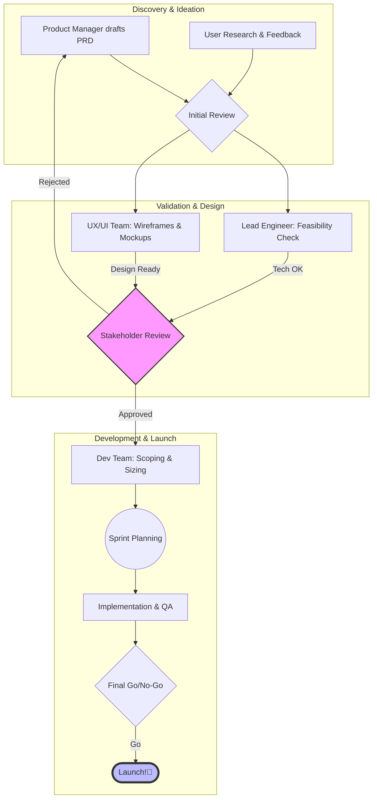

**Rendered Output:**
> This renders a top-to-bottom flowchart. The process flows through three distinct phases (Discovery, Validation, Development), represented by subgraphs. Key decision points like "Stakeholder Review" and "Final Go/No-Go" are clearly visible, with different paths for approval and rejection. The "Launch" node is styled to stand out.

#### B) Sequence Diagram: API Authentication Flow
This diagram is essential for understanding processes that happen over time, like a user logging into a system.

**Code:**
```mermaid
sequenceDiagram
    actor User
    participant Browser
    participant AuthService as Auth Service
    participant APIService as API Service

    User->>Browser: Enters credentials and clicks Login
    Browser->>AuthService: POST /login (username, password)
    activate AuthService

    AuthService->>AuthService: Hash password & query DB
    Note right of AuthService: Validates credentials

    alt Credentials Valid
        AuthService-->>Browser: 200 OK (JWT Token)
        deactivate AuthService
        Browser->>APIService: GET /user/profile (Authorization: Bearer <JWT>)
        activate APIService
        APIService-->>Browser: 200 OK (User Data)
        deactivate APIService
        Browser->>User: Displays Profile Page
    else Credentials Invalid
        AuthService-->>Browser: 401 Unauthorized
        deactivate AuthService
        Browser->>User: Shows "Invalid Login" message
    end
```

**Rendered Output:**
> This renders a sequence diagram showing four participants (User, Browser, Auth Service, API Service). The flow shows the user logging in, the auth service validating credentials and issuing a token, and the browser using that token to fetch data from the API service. The `alt/else` block clearly visualizes the success and failure paths.

#### C) Gantt Chart: Marketing Campaign Plan

**Code:**
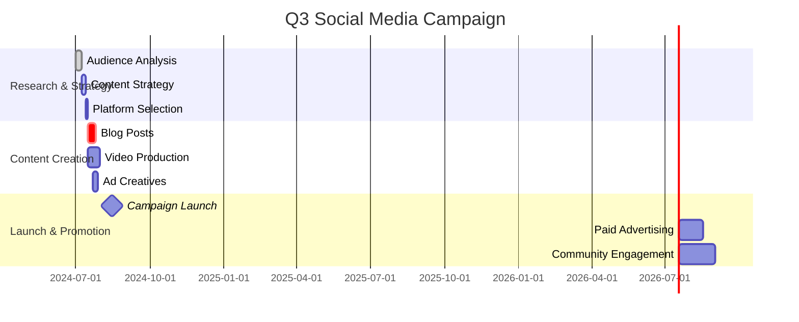

**Rendered Output:**
> This renders a Gantt chart for a marketing campaign. It's divided into three sections: Research, Creation, and Launch. It clearly shows task durations, dependencies (`after des2`), and critical paths (`crit`). A key `milestone` for the launch date is also marked.

### Niche but Useful Diagrams

*   **State Diagram:** Models the lifecycle of an object, like a support ticket (`Open` -> `In Progress` -> `Resolved` / `Closed`).
*   **ER Diagram:** Visualizes database table relationships (one-to-many, many-to-many).
*   **Mind Map:** Great for brainstorming sessions.

> For more, see the [Official Mermaid.js Docs](https://mermaid.js.org/intro/).

### 📝 Mermaid Scaffold Summary

| Element           | Syntax                                                      | Example                                    |
| ----------------- | ----------------------------------------------------------- | ------------------------------------------ |
| **Node** (Default)  | `id[Label]`                                                 | `db[Database]`                             |
| **Node** (Circle)   | `id((Label))`                                               | `cicd((CI/CD Pipeline))`                   |
| **Node** (Rhombus)  | `id{Label}`                                                 | `decision{Is it approved?}`                 |
| **Link** (Arrow)    | `A --> B`                                                   | `User --> API`                             |
| **Link** (Labeled)  | `A -- Label --> B`                                          | `API -- JSON data --> Frontend`            |
| **Link** (Dotted)   | `A -.-> B`                                                  | `A -.-> B`                                 |
| **Subgraph**      | `subgraph Title` <br> `...nodes...` <br> `end`               | `subgraph "Cloud" ... end`                 |
| **Comment**       | `%% This is a comment`                                      | `%% TODO: Add error handling`              |
| **Styling**       | `style id fill:#f9f,stroke:#333`                            | `style db fill:lightgrey`                  |

---

## 3.  D2 Deep Dive: D2Lang

D2 is the new challenger, built with a focus on **readability** and a **powerful layout engine**. You declare *what* exists and *how* it's connected, and D2's TALA (Text-to-Arrow-Layout-Algorithm) engine figures out the best way to arrange it. This makes it phenomenal for complex system architecture diagrams.

### Core Concepts
*   **Objects:** Anything in your diagram (nodes). Defined with a simple `key: label`.
*   **Connections:** Links between objects. `key1 -> key2`.
*   **Containers:** How you group objects. `cloud_provider: { ... }`.
*   **Layouts & Directions:** You can give hints to the engine, like `direction: right`.

### Common Diagram Examples

#### A) Architecture Diagram: E-Commerce Microservices
This is where D2 shines. Notice how containers create clear boundaries and the layout is clean without manual positioning.

**Code:**
```d2
# Direction for the overall flow
direction: right

# Actors
user: User {
  shape: person
}

# Main application container
app: E-Commerce Platform {
  style.stroke-dash: 2

  # Ingress and Frontend
  lb: Load Balancer {
    shape: cloud
  }
  frontend: Web App (React)

  # Backend Services (grouped in a container)
  backend: Backend Services {
    api_gateway: API Gateway

    services: {
      direction: down
      users: Users Service
      products: Products Service
      orders: Orders Service
    }

    api_gateway -> services.users
    api_gateway -> services.products
    api_gateway -> services.orders
  }

  # Data Tier
  db: Primary Database {
    shape: database
  }
  cache: In-Memory Cache (Redis) {
    shape: cylinder
  }

  # Connections
  user -> lb -> frontend -> backend.api_gateway
  backend.services.users -> db
  backend.services.products -> db
  backend.services.orders -> db
  backend.services.* -> cache
}
```

**Rendered Output (requires a D2 plugin):**
> This would render a sophisticated architecture diagram. A `User` connects to a `Load Balancer`, which directs traffic to the `Web App`. The app communicates with an `API Gateway`, which routes requests to three distinct microservices (`Users`, `Products`, `Orders`). These services interact with a `Primary Database` and a `Redis Cache`. The use of nested containers for `Backend Services` and `services` creates a visually organized and easy-to-understand system map.

#### B) Sequence Diagram: Financial Transaction
D2's sequence diagrams are also declarative. You declare the steps, and it builds the timeline.

**Code:**
```d2
# A sequence diagram showing a payment flow
seq: {
  u: User
  m: Merchant App
  p: Payment Gateway
  b: Bank

  u -> m: "1. Add to Cart & Checkout"
  m -> p: "2. Initiate Payment (amount, details)"
  p -> b: "3. Authorize Transaction"
  b -> b: "4. Check Funds & Fraud Score"
  b -> p: "5. Authorization Success"
  p -> m: "6. Payment Confirmed"
  m -> u: "7. Order Confirmation"
}
```

**Rendered Output (requires a D2 plugin):**
> This renders a clean sequence diagram with four participants. It traces a transaction from the user's checkout action in the merchant app, through the payment gateway's authorization request to the bank, and back through the chain to confirm the order to the user. The numbered steps make the flow exceptionally clear.

### Niche but Useful Diagrams

*   **SQL Tables:** D2 has a first-class `sql_table` shape for ERDs.
*   **Classes:** The `class` shape is perfect for UML Class Diagrams.
*   **Image Placeholders:** You can embed images as shapes: `logo: { shape: image; icon: /path/to/logo.png }`.

> For more, see the [Official D2 Docs](https://d2lang.com/tour/intro).

### 📝 D2 Scaffold Summary

| Element         | Syntax                                                              | Example                                         |
| --------------- | ------------------------------------------------------------------- | ----------------------------------------------- |
| **Object**      | `key: Label`                                                        | `db: Production Database`                       |
| **Connection**  | `key1 -> key2: Label`                                               | `api -> db: Reads/Writes`                       |
| **Container**   | `container_key: { ...objects... }`                                  | `aws: { ... }`                                  |
| **Direction**   | `direction: up | down | left | right`                               | `direction: down`                               |
| **Shape**       | `key: Label { shape: shape_name }`                                  | `db: { shape: database }`                       |
| **Style**       | `key.style.fill: "#f00"` <br> `key.style.stroke-dash: 2`             | `critical_service.style.opacity: 0.8`           |
| **Icons**       | `key: { icon: "https://.../icon.svg" }`                             | `user: { shape: person }`                       |
| **Grid Layout** | `grid_container: { grid-rows: 2; grid-cols: 2; ...objects... }`     | Organizes objects into a strict grid.           |

---

## 4. 🌳 Deep Dive: Graphviz (DOT Language)

Graphviz is the original powerhouse. It's not a single tool but a collection of graph layout programs that use the **DOT language**. It offers unparalleled control over every aspect of the graph, but this power comes with a steeper learning curve. Its layout engines (`dot`, `neato`, `fdp`) are legendary and used under the hood by many other tools.

### Core Concepts
*   **Graph Type:** `digraph { ... }` for directed graphs (with arrows) or `graph { ... }` for undirected graphs.
*   **Nodes & Edges:** Defined with attributes in square brackets. `node_id [label="My Node", shape=box];`.
*   **Attributes:** You can set default attributes for all `graph`, `node`, or `edge` elements.
*   **Subgraphs:** Subgraphs prefixed with `cluster_` are drawn with a bounding box, which is essential for grouping.

### Common Diagram Examples

#### A) Decision Tree: Public Policy Funding Allocation
This example is perfect for a policy analyst or sociologist, modeling a complex decision-making process.

**Code:**
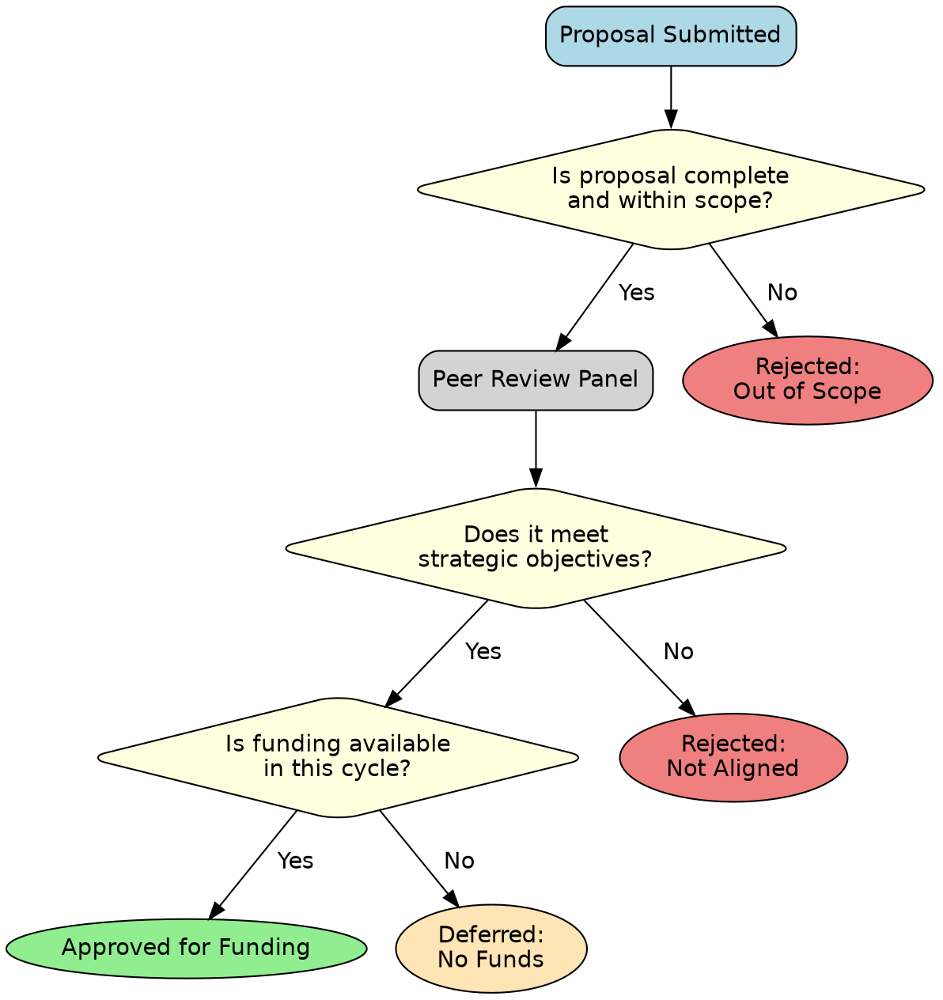

**Rendered Output (requires a Graphviz plugin):**
> This renders a classic decision tree. It starts with a "Proposal Submitted" node and flows through three diamond-shaped decision points: scope check, strategic alignment, and funding availability. Each decision point branches into a "Yes" or "No" path, leading to different outcomes like "Approved," "Rejected," or "Deferred." The use of different colors and shapes for questions and outcomes makes the diagram highly intuitive.

#### B) Dependency Graph: Organizational Reporting Structure
Graphviz is excellent for any kind of hierarchy or network, like an org chart.

**Code:**
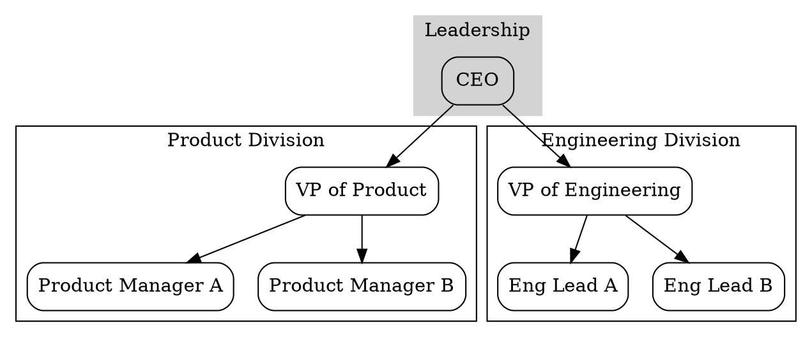

**Rendered Output (requires a Graphviz plugin):**
> This renders a clean top-down organizational chart. A "CEO" node sits at the top. Below, two clustered subgraphs for "Product Division" and "Engineering Division" contain their respective VPs and team members. Arrows clearly indicate the reporting structure from the CEO to the VPs and from the VPs to their direct reports.

### Niche but Useful Diagrams

*   **Network Topology:** The classic use case, mapping routers, switches, and servers.
*   **Finite Automata / State Machines:** A staple in computer science theory.
*   **Data Flow Diagrams (DFD):** Can be created using different node shapes for processes, data stores, and external entities.

> For more, see the [Official Graphviz Docs](https://graphviz.org/documentation/).

### 📝 Graphviz Scaffold Summary

| Element          | Syntax                                                              | Example                                           |
| ---------------- | ------------------------------------------------------------------- | ------------------------------------------------- |
| **Directed Graph** | `digraph G { ... }`                                                 | `digraph my_flow { ... }`                         |
| **Node**         | `id [attribute=value, ...];`                                        | `A [label="Start", shape=ellipse];`               |
| **Edge**         | `id1 -> id2 [attribute=value];`                                     | `A -> B [label="Step 1", color=blue];`            |
| **Global Attrs** | `graph [key=val];` <br> `node [key=val];` <br> `edge [key=val];`      | `node [shape=box, style=filled, color=lightblue];` |
| **Cluster**      | `subgraph cluster_name { ... }`                                     | `subgraph cluster_0 { label="Group A"; ... }`      |
| **Comment**      | `// Single line` <br> `/* Multi-line */`                             | `// This node is critical`                        |
| **Layout Engine**| (Set via command line) `dot`, `neato`, `fdp`, `circo`, `twopi`        | `dot` (hierarchical), `neato` (spring model)      |

---

## 5. Complex Examples from Diverse Fields

Here are more complex, real-world examples that showcase the unique strengths of each tool.

### A) D2: Cloud-Native Application Monitoring Architecture

This diagram shows how monitoring data flows from various sources through a processing pipeline to different destinations. D2's layout engine and containers make this complex view manageable.

**Code:**
```d2
direction: right
title: "Cloud-Native Monitoring & Alerting Pipeline"

# Data Sources
sources: {
  direction: down
  k8s: Kubernetes Cluster {
    icon: "https://.../k8s.svg" # Placeholder for icon
  }
  vms: Legacy VMs
  cloudwatch: AWS CloudWatch Logs
}

# Collection & Processing Pipeline
pipeline: {
  style.stroke-dash: 2
  
  aggregator: Log Aggregator (Fluentd) {
    shape: hexagon
  }

  processor: {
    metrics: Prometheus {
      style.fill: "#E6522C"
    }
    logs: Loki {
      style.fill: "#F1C40F"
    }
  }
  
  aggregator -> processor.metrics
  aggregator -> processor.logs
}

# Visualization & Alerting
outputs: {
  direction: down
  
  dashboard: Grafana {
    style.fill: "#F46800"
  }
  
  alerting: Alertmanager {
    shape: hexagon
  }
}

# Alert Destinations
destinations: {
  direction: down
  slack: Slack Channel
  pagerduty: PagerDuty
  email: Email Notifications
}

# Connections
sources.k8s -> pipeline.aggregator: "Metrics & Logs"
sources.vms -> pipeline.aggregator: "Syslogs"
sources.cloudwatch -> pipeline.aggregator: "Cloud Logs"

pipeline.processor.metrics -> outputs.dashboard
pipeline.processor.logs -> outputs.dashboard
pipeline.processor.metrics -> outputs.alerting

outputs.alerting -> destinations.*: "Fires Alert"
```

**Rendered Output (requires a D2 plugin):**
> This renders a comprehensive monitoring pipeline. On the left, data sources like Kubernetes and VMs feed into a central "Log Aggregator." This aggregator sends data to "Prometheus" for metrics and "Loki" for logs. Both are then visualized in "Grafana." Prometheus also sends data to "Alertmanager," which dispatches alerts to Slack, PagerDuty, and Email. The diagram clearly separates concerns into sources, pipeline, outputs, and destinations using containers.

### B) Graphviz: Public Policy Feedback Loop Model

This diagram models the cyclical and often non-linear relationships between different actors in a policy ecosystem. Graphviz's ability to draw complex, non-hierarchical graphs is key here.

**Code:**
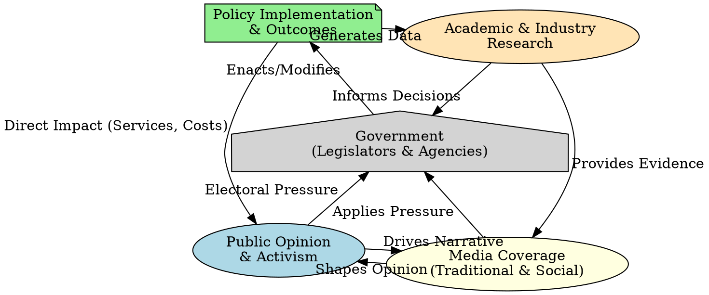

**Rendered Output (requires a Graphviz plugin):**
> This renders a network graph, not a simple tree. The `neato` layout engine arranges the five actors (Public, Media, Government, Policy, Research) in a circle-like pattern. The arrows show the complex, multi-directional influences between them, creating a true feedback "loop." For example, it shows that the media both shapes and is driven by public opinion, creating a powerful cycle that influences government.

### C) Mermaid: Cross-Functional Product Launch Flowchart

This flowchart visualizes the dependencies and parallel workstreams required for a major product launch, a common scenario for a Product Manager.

**Code:**
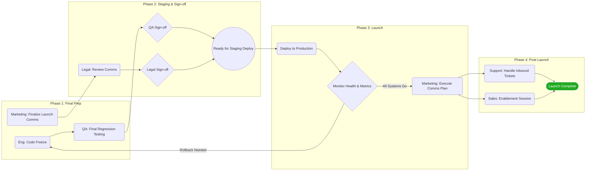

**Rendered Output:**
> This renders a left-to-right flowchart organized into four distinct phases. It clearly shows parallel tracks for Engineering/QA and Marketing/Legal in the early phases. The `&` connector (`D & F --> G`) effectively shows that both QA and Legal sign-offs are required before deployment. A critical feedback loop is included, showing a potential "Rollback" from monitoring back to the "Code Freeze" state.

---

## 6. General Best Practices for All Tools

1.  **Version Control Your Diagrams:** Store your `.md`, `.d2`, or `.dot` files in Git. This gives you a history of every change to your architecture or process.
2.  **Clarity Over Complexity:** If a diagram becomes a "ball of mud," split it into multiple, more focused diagrams. Link between them using text or URLs.
3.  **Use Comments Liberally:** Your code should explain the *what*. Your comments should explain the *why*. `%% Why we chose a queue here` or `// This is a legacy system`.
4.  **Consistent Naming Conventions:** Use a consistent scheme for your node IDs (e.g., `srv_auth`, `srv_users` or `auth-service`, `users-service`). This makes your diagrams easier to read and maintain.
5.  **Leverage Containers/Subgraphs:** Grouping related items is the single most effective way to reduce cognitive load for the reader. Always group components by team, function, or network boundary.

# Draft 1 

```table-of-contents
title: 
style: nestedOrderedList # TOC style (nestedList|nestedOrderedList|inlineFirstLevel)
minLevel: 0 # Include headings from the specified level
maxLevel: 0 # Include headings up to the specified level
include: 
exclude: 
includeLinks: true # Make headings clickable
hideWhenEmpty: false # Hide TOC if no headings are found
debugInConsole: false # Print debug info in Obsidian console
```

Of course. This is an excellent use case for a structured learning guide. By preparing it for Obsidian, we can create a powerful, interactive document.

Here is a comprehensive, modular learning guide designed to be copy-pasted directly into an Obsidian note.

### Before You Begin: Setting Up Your Obsidian Environment

To make this guide fully interactive in Obsidian, you will need to install two community plugins:
1.  **Mermaid Tools:** This is often built-in, but a dedicated plugin gives you more options.
2.  **D2:** You will need to search for and install the "D2" plugin from the community plugins browser.

Once installed, you can simply copy and paste this entire document into a new note, and the diagrams will render live.

---

## A Parallel Learning Guide: Mermaid & D2

This guide is structured in modules. Each module introduces a new concept and shows you how to implement it in both Mermaid and D2, side-by-side. This allows you to learn both syntaxes and understand their core philosophical differences as you go.

### Module 1: The "Hello, World!" - Basic Nodes & Connections

The most fundamental part of any diagram is a shape (a node) connected to another.

#### 🧜‍♀️ Mermaid: The Procedural Approach

Mermaid's syntax feels like giving instructions. You declare the graph type (`graph TD` for Top-Down) and then list the connections.

**Annotated Code (for reading):**
```markdown
%% This is a comment in Mermaid
graph TD; %% "TD" means Top to Down. You can also use "LR" for Left to Right.
  A --> B; %% Create a connection from a node named "A" to a node named "B"
```

**Render Block (for Obsidian):**
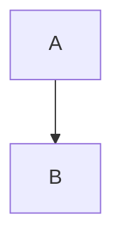

---

#### 🤖 D2: The Declarative Approach

D2's syntax feels like describing a system. You declare objects and their relationships, and the layout engine figures out the best arrangement.

**Annotated Code (for reading):**
```d2
# This is a comment in D2.
# By default, the direction is down, so we don't need to declare it.

# Declare the connection. D2 automatically creates the nodes "A" and "B".
A -> B
```

**Render Block (for Obsidian):**
```d2
A -> B
```

**Key Takeaway:** Mermaid requires you to specify the layout direction upfront. D2 assumes a default and lets you override it if needed (`direction: right`).

---

### Module 2: Customizing Nodes (Text & Shapes)

Plain nodes are boring. Let's give them custom text and different shapes.

#### 🧜‍♀️ Mermaid: Shape Modifiers

Mermaid uses special brackets to define shapes and text.

**Annotated Code (for reading):**
```markdown
graph TD;
  %% Node 'id1' will have the text "Start" and the default rectangle shape
  id1[Start] --> id2(Process); %% Parentheses create a rounded rectangle
  id2 --> id3{Decision}; %% Curly braces create a diamond (decision) shape
  id3 --> id4((End)); %% Double parentheses create a circle
```

**Render Block (for Obsidian):**
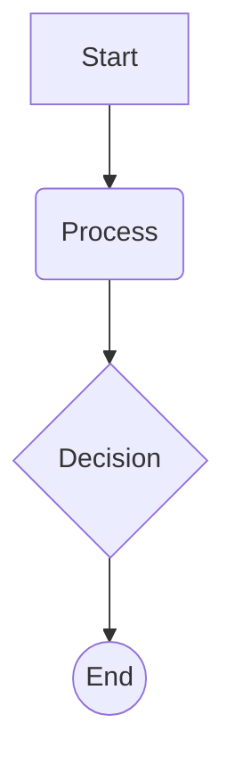

---

#### 🤖 D2: The Attribute System

D2 uses a consistent `key: value` system to add attributes to any object. This is more verbose but incredibly powerful and consistent.

**Annotated Code (for reading):**
```d2
# We declare the nodes and their connections separately for clarity.

# Connections
id1 -> id2 -> id3 -> id4

# Declarations with attributes
id1: Start # A colon sets the label (text) for a node
id2: Process {shape: rectangle} # Use curly braces for attributes
id3: Decision {shape: diamond}
id4: End {shape: circle}
```

**Render Block (for Obsidian):**
```d2
id1 -> id2 -> id3 -> id4

id1: Start
id2: Process {shape: rectangle}
id3: Decision {shape: diamond}
id4: End {shape: circle}
```

**Key Takeaway:** Mermaid's shape syntax is fast but limited. D2's attribute system is universal—the same `{}` syntax is used for shapes, styles, icons, and everything else.

---

### Module 3: Customizing Connections (Labels & Styles)

Connections can also carry information.

#### 🧜‍♀️ Mermaid: Edge Labels & Styles

Mermaid adds labels with `|text|` and has different arrow styles.

**Annotated Code (for reading):**
```markdown
graph TD;
  A -- text --> B; %% A solid line with text
  B -.-> C; %% A dashed line
  C ==> D; %% A thick line
```

**Render Block (for Obsidian):**
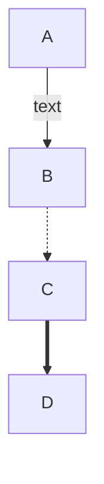

---

#### 🤖 D2: Connection Attributes

In D2, connections are first-class citizens and can have labels and attributes, just like nodes.

**Annotated Code (for reading):**
```d2
# A colon after the arrow adds a label to the connection
A -> B: text

# Connections can also have attributes in curly braces
B -> C: {
  style: {
    stroke-dash: 4 # Make the line dashed
  }
}

C -> D: {
  style: {
    stroke-width: 4 # Make the line thick
  }
}
```

**Render Block (for Obsidian):**
```d2
A -> B: text
B -> C: {
  style: {
    stroke-dash: 4
  }
}
C -> D: {
  style: {
    stroke-width: 4
  }
}
```

**Key Takeaway:** D2's approach is more structured and CSS-like, offering finer control. Mermaid's is quicker for common styles.

---

### Module 4: The Differentiator - Hierarchy & Containers

This is where the two tools diverge significantly. How do you group nodes together?

#### 🧜‍♀️ Mermaid: Subgraphs

Mermaid uses a `subgraph` block. It works, but can become difficult to manage and lay out.

**Annotated Code (for reading):**
```markdown
graph TD;
  User --> LB;

  subgraph "Cloud Provider" %% Start of the container
    LB(Load Balancer) --> App1;
    LB(Load Balancer) --> App2;
    
    subgraph "Web Tier" %% A nested container
      App1(App Server 1)
      App2(App Server 2)
    end

    App1 --> DB(Database);
  end
```

**Render Block (for Obsidian):**
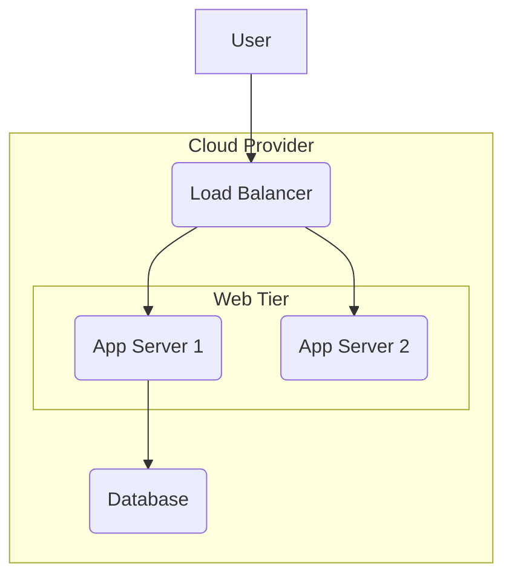

---

#### 🤖 D2: True Containers

D2's container system is its killer feature. You define objects within other objects using blocks and access them with dot notation. The layout engine handles the nesting perfectly.

**Annotated Code (for reading):**
```d2
User -> cloud.lb

# Define a container called "cloud" with the label "Cloud Provider"
cloud: Cloud Provider {
  # Define objects inside the container
  lb: Load Balancer

  # A nested container
  web_tier: Web Tier {
    app1: App Server 1
    app2: App Server 2
  }

  db: Database {shape: cylinder}
}

# Connections can be defined inside or outside the container
# Using dot notation makes it clear what you're connecting
cloud.lb -> cloud.web_tier.app1
cloud.lb -> cloud.web_tier.app2
cloud.web_tier.app1 -> cloud.db
cloud.web_tier.app2 -> cloud.db
```


**Render Block (for Obsidian):**
```d2
User -> cloud.lb

cloud: Cloud Provider {
  lb: Load Balancer

  web_tier: Web Tier {
    app1: App Server 1
    app2: App Server 2
  }

  db: Database {shape: cylinder}
}

cloud.lb -> cloud.web_tier.app1
cloud.lb -> cloud.web_tier.app2
cloud.web_tier.app1 -> cloud.db
cloud.web_tier.app2 -> cloud.db
```

**Key Takeaway:** D2's container model is far more robust, scalable, and readable for any complex architecture diagram. This is its primary advantage over Mermaid.

---

### Module 5: Sequence Diagrams

Let's look at a different diagram type to see how the syntaxes compare.

#### 🧜‍♀️ Mermaid: An Intuitive, Specific Syntax

Mermaid has a dedicated, easy-to-read syntax for sequence diagrams.

**Annotated Code (for reading):**
```markdown
sequenceDiagram
  participant User
  participant WebApp
  participant API

  User->>WebApp: Clicks "Login" button
  WebApp->>API: POST /login (username, password)
  API-->>WebApp: JWT Token
  WebApp-->>User: Redirect to Dashboard
```

**Render Block (for Obsidian):**
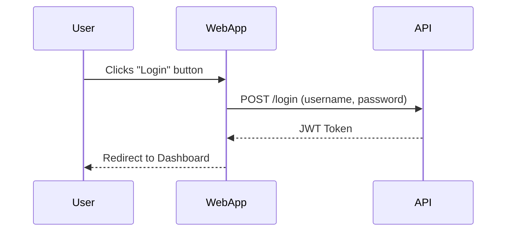

---

#### 🤖 D2: The Unified Syntax

D2 uses its standard `->` syntax, simply adding a `sequence_diagram: true` attribute to a container.

**Annotated Code (for reading):**


```css
# Create a container and tell D2 to render it as a sequence diagram
login_flow: {
  sequence_diagram: true

  # The rest is standard D2 syntax
  user: User
  webapp: WebApp
  api: API

  user -> webapp: Clicks "Login" button
  webapp -> api: POST /login (username, password)
  
  # Dashed lines are done with the style attribute
  api -> webapp: JWT Token {
    style.stroke-dash: 4
  }
  webapp -> user: Redirect to Dashboard {
    style.stroke-dash: 4
  }
}
```

**Render Block (for Obsidian):**
```d2
login_flow: {
  sequence_diagram: true

  user: User
  webapp: WebApp
  api: API

  user -> webapp: Clicks "Login" button
  webapp -> api: POST /login (username, password)
  
  api -> webapp: JWT Token {
    style.stroke-dash: 4
  }
  webapp -> user: Redirect to Dashboard {
    style.stroke-dash: 4
  }
}
```

**Key Takeaway:** Mermaid's approach is easier for a one-off sequence diagram. D2's unified approach means once you learn the core language, you can apply it to any diagram type, which is powerful for long-term use.

---

### Module 6: The Elder - Graphviz Basics

Graphviz is the powerful engine that inspired many modern tools. Its `DOT` language is less friendly but incredibly powerful. You cannot render this in Obsidian by default, but understanding the syntax is crucial.

**Core Concepts:**
*   **Graph Type:** `graph` for undirected, `digraph` for directed (arrows).
*   **Nodes & Attributes:** `NodeName [attribute="value"];`
*   **Edges:** `NodeA -> NodeB;`

**Annotated Code (for reading and understanding):**
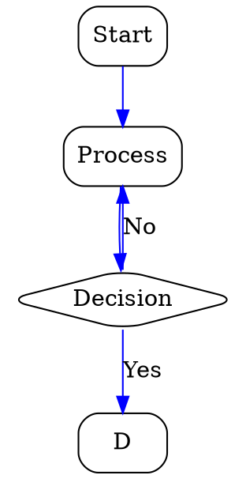

**Key Takeaway:** Graphviz gives you low-level control and has legendary layout algorithms. D2 aims to provide this power but with a much more modern and user-friendly syntax and feature set. You can even tell D2 to use Graphviz as its layout engine (`d2 --layout=dot ...`) to get the best of both worlds.

Happy Diagramming

---
---

