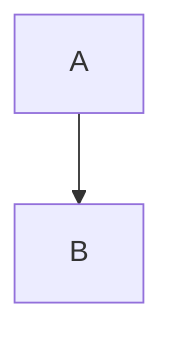
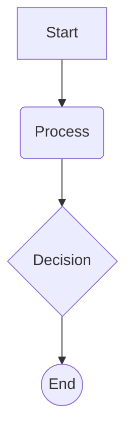
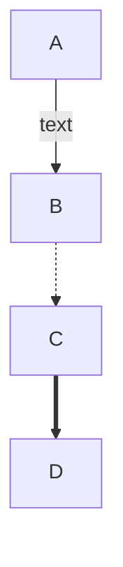
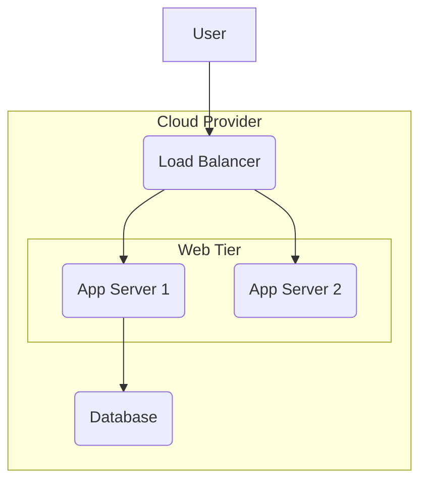
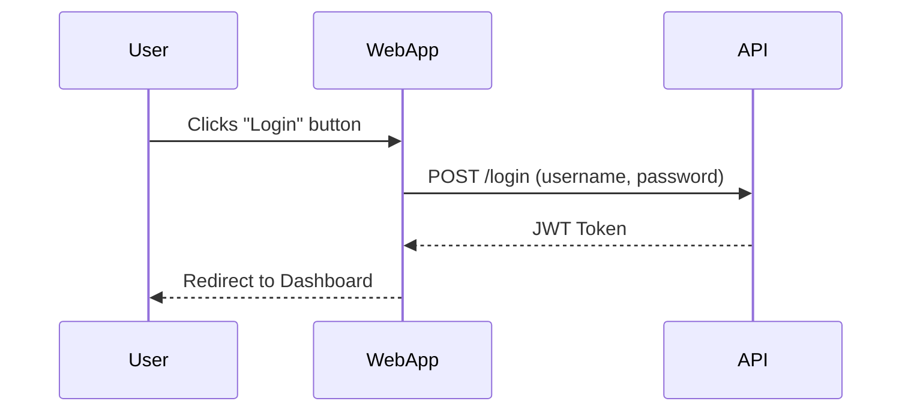
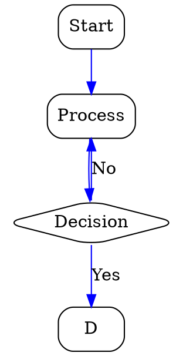

```table-of-contents
title: 
style: nestedOrderedList # TOC style (nestedList|nestedOrderedList|inlineFirstLevel)
minLevel: 0 # Include headings from the specified level
maxLevel: 0 # Include headings up to the specified level
include: 
exclude: 
includeLinks: true # Make headings clickable
hideWhenEmpty: false # Hide TOC if no headings are found
debugInConsole: false # Print debug info in Obsidian console
```

Of course. This is an excellent use case for a structured learning guide. By preparing it for Obsidian, we can create a powerful, interactive document.

Here is a comprehensive, modular learning guide designed to be copy-pasted directly into an Obsidian note.

### Before You Begin: Setting Up Your Obsidian Environment

To make this guide fully interactive in Obsidian, you will need to install two community plugins:
1.  **Mermaid Tools:** This is often built-in, but a dedicated plugin gives you more options.
2.  **D2:** You will need to search for and install the "D2" plugin from the community plugins browser.

Once installed, you can simply copy and paste this entire document into a new note, and the diagrams will render live.

---

## A Parallel Learning Guide: Mermaid & D2

This guide is structured in modules. Each module introduces a new concept and shows you how to implement it in both Mermaid and D2, side-by-side. This allows you to learn both syntaxes and understand their core philosophical differences as you go.

### Module 1: The "Hello, World!" - Basic Nodes & Connections

The most fundamental part of any diagram is a shape (a node) connected to another.

#### 🧜‍♀️ Mermaid: The Procedural Approach

Mermaid's syntax feels like giving instructions. You declare the graph type (`graph TD` for Top-Down) and then list the connections.

**Annotated Code (for reading):**
```markdown
%% This is a comment in Mermaid
graph TD; %% "TD" means Top to Down. You can also use "LR" for Left to Right.
  A --> B; %% Create a connection from a node named "A" to a node named "B"
```

**Render Block (for Obsidian):**


---

#### 🤖 D2: The Declarative Approach

D2's syntax feels like describing a system. You declare objects and their relationships, and the layout engine figures out the best arrangement.

**Annotated Code (for reading):**
```d2
# This is a comment in D2.
# By default, the direction is down, so we don't need to declare it.

# Declare the connection. D2 automatically creates the nodes "A" and "B".
A -> B
```

**Render Block (for Obsidian):**
```d2
A -> B
```

**Key Takeaway:** Mermaid requires you to specify the layout direction upfront. D2 assumes a default and lets you override it if needed (`direction: right`).

---

### Module 2: Customizing Nodes (Text & Shapes)

Plain nodes are boring. Let's give them custom text and different shapes.

#### 🧜‍♀️ Mermaid: Shape Modifiers

Mermaid uses special brackets to define shapes and text.

**Annotated Code (for reading):**
```markdown
graph TD;
  %% Node 'id1' will have the text "Start" and the default rectangle shape
  id1[Start] --> id2(Process); %% Parentheses create a rounded rectangle
  id2 --> id3{Decision}; %% Curly braces create a diamond (decision) shape
  id3 --> id4((End)); %% Double parentheses create a circle
```

**Render Block (for Obsidian):**


---

#### 🤖 D2: The Attribute System

D2 uses a consistent `key: value` system to add attributes to any object. This is more verbose but incredibly powerful and consistent.

**Annotated Code (for reading):**
```d2
# We declare the nodes and their connections separately for clarity.

# Connections
id1 -> id2 -> id3 -> id4

# Declarations with attributes
id1: Start # A colon sets the label (text) for a node
id2: Process {shape: rectangle} # Use curly braces for attributes
id3: Decision {shape: diamond}
id4: End {shape: circle}
```

**Render Block (for Obsidian):**
```d2
id1 -> id2 -> id3 -> id4

id1: Start
id2: Process {shape: rectangle}
id3: Decision {shape: diamond}
id4: End {shape: circle}
```

**Key Takeaway:** Mermaid's shape syntax is fast but limited. D2's attribute system is universal—the same `{}` syntax is used for shapes, styles, icons, and everything else.

---

### Module 3: Customizing Connections (Labels & Styles)

Connections can also carry information.

#### 🧜‍♀️ Mermaid: Edge Labels & Styles

Mermaid adds labels with `|text|` and has different arrow styles.

**Annotated Code (for reading):**
```markdown
graph TD;
  A -- text --> B; %% A solid line with text
  B -.-> C; %% A dashed line
  C ==> D; %% A thick line
```

**Render Block (for Obsidian):**


---

#### 🤖 D2: Connection Attributes

In D2, connections are first-class citizens and can have labels and attributes, just like nodes.

**Annotated Code (for reading):**
```d2
# A colon after the arrow adds a label to the connection
A -> B: text

# Connections can also have attributes in curly braces
B -> C: {
  style: {
    stroke-dash: 4 # Make the line dashed
  }
}

C -> D: {
  style: {
    stroke-width: 4 # Make the line thick
  }
}
```

**Render Block (for Obsidian):**
```d2
A -> B: text
B -> C: {
  style: {
    stroke-dash: 4
  }
}
C -> D: {
  style: {
    stroke-width: 4
  }
}
```

**Key Takeaway:** D2's approach is more structured and CSS-like, offering finer control. Mermaid's is quicker for common styles.

---

### Module 4: The Differentiator - Hierarchy & Containers

This is where the two tools diverge significantly. How do you group nodes together?

#### 🧜‍♀️ Mermaid: Subgraphs

Mermaid uses a `subgraph` block. It works, but can become difficult to manage and lay out.

**Annotated Code (for reading):**
```markdown
graph TD;
  User --> LB;

  subgraph "Cloud Provider" %% Start of the container
    LB(Load Balancer) --> App1;
    LB(Load Balancer) --> App2;
    
    subgraph "Web Tier" %% A nested container
      App1(App Server 1)
      App2(App Server 2)
    end

    App1 --> DB(Database);
  end
```

**Render Block (for Obsidian):**


---

#### 🤖 D2: True Containers

D2's container system is its killer feature. You define objects within other objects using blocks and access them with dot notation. The layout engine handles the nesting perfectly.

**Annotated Code (for reading):**
```d2
User -> cloud.lb

# Define a container called "cloud" with the label "Cloud Provider"
cloud: Cloud Provider {
  # Define objects inside the container
  lb: Load Balancer

  # A nested container
  web_tier: Web Tier {
    app1: App Server 1
    app2: App Server 2
  }

  db: Database {shape: cylinder}
}

# Connections can be defined inside or outside the container
# Using dot notation makes it clear what you're connecting
cloud.lb -> cloud.web_tier.app1
cloud.lb -> cloud.web_tier.app2
cloud.web_tier.app1 -> cloud.db
cloud.web_tier.app2 -> cloud.db
```

**Render Block (for Obsidian):**
```d2
User -> cloud.lb

cloud: Cloud Provider {
  lb: Load Balancer

  web_tier: Web Tier {
    app1: App Server 1
    app2: App Server 2
  }

  db: Database {shape: cylinder}
}

cloud.lb -> cloud.web_tier.app1
cloud.lb -> cloud.web_tier.app2
cloud.web_tier.app1 -> cloud.db
cloud.web_tier.app2 -> cloud.db
```

**Key Takeaway:** D2's container model is far more robust, scalable, and readable for any complex architecture diagram. This is its primary advantage over Mermaid.

---

### Module 5: Sequence Diagrams

Let's look at a different diagram type to see how the syntaxes compare.

#### 🧜‍♀️ Mermaid: An Intuitive, Specific Syntax

Mermaid has a dedicated, easy-to-read syntax for sequence diagrams.

**Annotated Code (for reading):**
```markdown
sequenceDiagram
  participant User
  participant WebApp
  participant API

  User->>WebApp: Clicks "Login" button
  WebApp->>API: POST /login (username, password)
  API-->>WebApp: JWT Token
  WebApp-->>User: Redirect to Dashboard
```

**Render Block (for Obsidian):**


---

#### 🤖 D2: The Unified Syntax

D2 uses its standard `->` syntax, simply adding a `sequence_diagram: true` attribute to a container.

**Annotated Code (for reading):**
```markdown
# Create a container and tell D2 to render it as a sequence diagram
login_flow: {
  sequence_diagram: true

  # The rest is standard D2 syntax
  user: User
  webapp: WebApp
  api: API

  user -> webapp: Clicks "Login" button
  webapp -> api: POST /login (username, password)
  
  # Dashed lines are done with the style attribute
  api -> webapp: JWT Token {
    style.stroke-dash: 4
  }
  webapp -> user: Redirect to Dashboard {
    style.stroke-dash: 4
  }
}
```

**Render Block (for Obsidian):**
```d2
login_flow: {
  sequence_diagram: true

  user: User
  webapp: WebApp
  api: API

  user -> webapp: Clicks "Login" button
  webapp -> api: POST /login (username, password)
  
  api -> webapp: JWT Token {
    style.stroke-dash: 4
  }
  webapp -> user: Redirect to Dashboard {
    style.stroke-dash: 4
  }
}
```

**Key Takeaway:** Mermaid's approach is easier for a one-off sequence diagram. D2's unified approach means once you learn the core language, you can apply it to any diagram type, which is powerful for long-term use.

---

### Module 6: The Elder - Graphviz Basics

Graphviz is the powerful engine that inspired many modern tools. Its `DOT` language is less friendly but incredibly powerful. You cannot render this in Obsidian by default, but understanding the syntax is crucial.

**Core Concepts:**
*   **Graph Type:** `graph` for undirected, `digraph` for directed (arrows).
*   **Nodes & Attributes:** `NodeName [attribute="value"];`
*   **Edges:** `NodeA -> NodeB;`

**Annotated Code (for reading and understanding):**


**Key Takeaway:** Graphviz gives you low-level control and has legendary layout algorithms. D2 aims to provide this power but with a much more modern and user-friendly syntax and feature set. You can even tell D2 to use Graphviz as its layout engine (`d2 --layout=dot ...`) to get the best of both worlds.

Happy Diagramming

---
---

