**

---

### Master Prompt for a 90+ Marks IGNOU MSO Assignment
Objective: Generate a 90+ marks-worthy answer for the IGNOU MSO (Master of Arts in Sociology) Second Year assignment question provided below. The output must be optimized for an evaluator looking for exceptional quality.

Core Directives: 
1. Strict Adherence to IGNOU Format: The entire output must be tailored for a handwritten assignment.
2. Word Count: The total word count must be strictly between 425 and 450 words. Do not exceed this limit.
3. Writing Style & Tone (Evaluator-Focused):
	1. Academic and Human-like: The language must be sophisticated yet clear, avoiding AI-like generic phrasing and overly ornamental words. The goal is to sound like a well-read, articulate student.
	2. Varied and Flowing: Employ varied sentence lengths and natural transitional phrases (e.g., "Furthermore," "In contrast," "Consequently") to ensure a smooth, human-like narrative flow that is easy and engaging for an evaluator to read.
4. High-Impact Structure:
	1. Introduction (Approx. 50-60 words): Start with a compelling introduction that immediately defines the core concepts and provides a clear roadmap of the answer. This should hook the evaluator from the start.
	2. Body (Approx. 300-340 words):
	3. Use clear, logical headings and subheadings. This is non-negotiable as it drastically improves readability.
	4. Adopt the hybrid "paragraph-then-pointers" model: Introduce a key theme in a short paragraph to provide context, then use 2-3 bullet points to elaborate on its features, arguments, or examples. This structure makes the answer scannable and easy to digest.
	5. Conclusion (Way Forward) (Approx. 50-60 words): End with a powerful concluding paragraph titled "Way Forward" or "Conclusion." It must summarize the main arguments and offer a forward-looking or critical sociological insight, leaving a lasting positive impression on the evaluator.
5. Content Requirements (Demonstrating Mastery):
	1. Answer the Complete Question: Meticulously address every single sub-part of the question, both core and peripheral. Do not include irrelevant information. The structure should be a direct response to the question's demands.
	2. Sociological Depth: The answer must be rich with sociological concepts and terminology, used correctly and appropriately.
	3. Integrate Thinkers: Seamlessly integrate the ideas or theories of one or two course-relevant sociological-political thinkers. [For best results, specify them here, e.g., "Focus on the contributions of M.N. Srinivas and G.S. Ghurye."]
	4. Use Specific Indian Examples: Provide relevant, specific, and contemporary examples from the Indian context. For instance, instead of "social media impacts society," use "the role of WhatsApp in organizing local social movements in India."
6. Value-Adding Mermaid Diagram:
	1. Include one simple, clean, and value-adding Mermaid diagram that visually summarizes a key process, relationship, or concept from the answer.
	2. The diagram must be easy to replicate by hand. Choose the most suitable and effective diagram type based on the question's demands (e.g., flowchart for a process, mind map for concepts, cycle diagram for recurring events).
	3. Provide the diagram syntax within a mermaid code block.

Final Output: Generate a single, clean block of text that is ready to be copied and used as a model for the handwritten assignment.

  

---

## [PASTE THE IGNOU ASSIGNMENT QUESTION HERE]

  
***


***

# MSOE-003 Sociology of Religion

# Section - 1

# Q1. Discuss the sociological perspective on religion.

### The Sociological Perspective on Religion
#### Introduction
The sociological perspective on religion analyses it as a social institution, focusing on its functions, its role in social stratification, and its influence on human behaviour, rather than evaluating the truth of its beliefs. This approach, pioneered by classical thinkers like Émile Durkheim, Karl Marx, and Max Weber, examines how religion shapes and is shaped by society. This answer will discuss these three foundational perspectives to understand religion's complex role in the social world.
#### The Functionalist View: Émile Durkheim
Émile Durkheim, in The Elementary Forms of Religious Life, argued that religion's primary function is to create social solidarity and cohesion. He proposed that all societies distinguish between the 'sacred' (things set apart with special significance) and the 'profane' (everyday, mundane things). For Durkheim, when people worship sacred symbols, they are unknowingly worshipping society itself.
- Social Cohesion: Religious rituals and ceremonies bring community members together, reinforcing shared norms and a collective conscience—the shared beliefs and moral attitudes that unify a society. In India, large religious gatherings like the Kumbh Mela serve as powerful examples of reinforcing collective identity.
- Providing Meaning: Religion offers answers to ultimate questions about life, death, and suffering, providing emotional comfort and stability during personal crises.
#### The Conflict View: Karl Marx
In stark contrast, Karl Marx viewed religion through the lens of conflict theory, seeing it as an instrument of social control and oppression. He famously described religion as the "opium of the people," a drug that dulls the pain of exploitation experienced by the working class (proletariat) in a capitalist society.
- Legitimising Inequality: Religion maintains the status quo by teaching that existing social arrangements are divinely ordained. The historical justification of the caste system in India through religious doctrines is a classic example of religion legitimising social stratification.
- False Consciousness: By promising rewards in the afterlife, religion distracts the oppressed from their earthly suffering and discourages them from challenging the ruling class, thus preventing revolutionary change.
#### The Interpretive View: Max Weber
Max Weber offered a more nuanced perspective, arguing that religion could be a powerful force for social change. In his seminal work, The Protestant Ethic and the Spirit of Capitalism, Weber contended that the values of certain Protestant sects, particularly Calvinism, were instrumental in the rise of modern capitalism.
- Driving Social Change: Weber demonstrated how religious ideas could shape economic behaviour. The Calvinist emphasis on hard work, discipline, and asceticism created an ethic that spurred capital accumulation.
- Motivation for Action: Unlike Marx, Weber believed that religion was not merely a reflection of economic forces but could independently motivate social action. Socio-religious reform movements in India, such as the Bhakti movement, challenged existing social hierarchies and promoted significant social change.
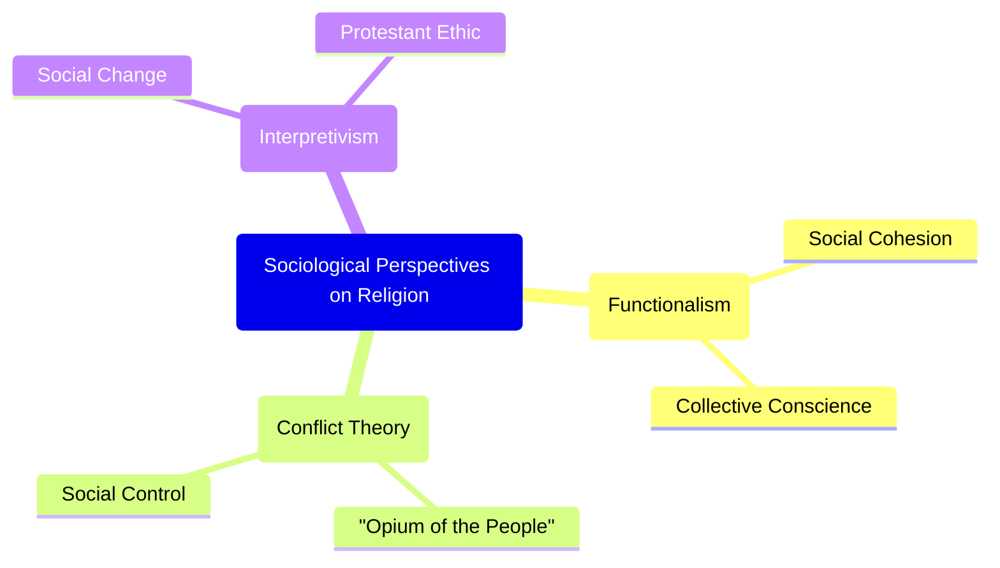

#### Way Forward
The classical sociological perspectives reveal that religion is not a monolithic entity but a complex social phenomenon with diverse functions and consequences. While Durkheim highlights its role in social integration, Marx exposes its potential to perpetuate inequality, and Weber showcases its capacity to drive transformation. In a deeply religious and diverse society like India, these frameworks remain indispensable for critically analysing contemporary issues such as secularism, communalism, and the dynamic interplay between faith and social progress.
 
---

# Q3. Discuss the functional interpretation of religion.
### The Functional Interpretation of Religion
#### Introduction
The functionalist interpretation of religion, a cornerstone of classical sociology, posits that religion serves vital social and psychological functions, contributing to the overall stability and maintenance of society. Rather than assessing the validity of religious beliefs, this perspective analyses what religion does for society and the individual. Pioneered by thinkers like Émile Durkheim and further developed by others like Bronisław Malinowski and Talcott Parsons, the functionalist view sees religion as a powerful force for social cohesion, control, and providing meaning.
#### Émile Durkheim: Religion and Social Cohesion
For Émile Durkheim, the primary function of religion is to generate social solidarity. In his work on Australian aboriginal tribes, he noted that societies distinguish between the sacred—things set apart with special reverence—and the profane—the mundane aspects of everyday life. Durkheim argued that in worshipping sacred symbols or totems, people are essentially worshipping society itself, reinforcing the collective conscience.

- Reinforcing Social Bonds: Religious rituals and ceremonies bring people together, creating a shared experience that strengthens community ties. In India, large-scale festivals like Diwali or Eid transcend their religious origins to become cultural celebrations that foster a sense of shared identity among diverse communities.
- Imposing Discipline: By prescribing certain behaviours and moral codes, such as the Ten Commandments, religion encourages self-discipline and reinforces social norms.
#### Malinowski and Parsons: Psychological and Adaptive Functions
Bronisław Malinowski expanded the functionalist view by focusing on the psychological functions of religion. He argued that religion helps individuals and society cope with the emotional stress that arises from uncontrollable and unpredictable situations.

- Managing Anxiety: Malinowski observed that Trobriand Islanders used religious rituals when fishing in dangerous, open waters but not in calm lagoons. Religion provides comfort and a sense of control in times of crisis, such as death, birth, or illness.
- Answering Ultimate Questions: Talcott Parsons added that religion helps people make sense of contradictory and existential questions, such as suffering and injustice. It provides a framework of meaning that helps maintain social order when outcomes seem random or unfair.
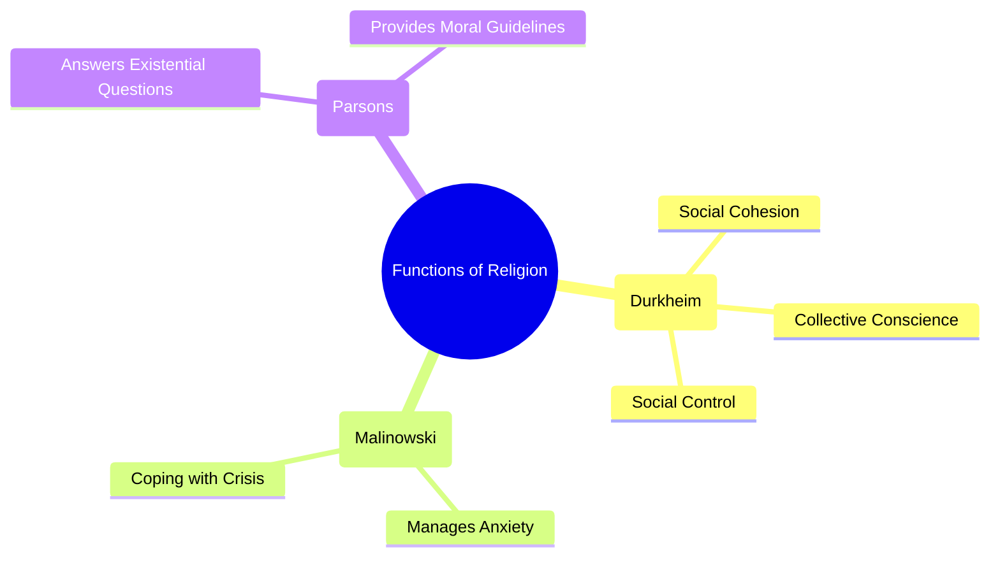

#### Way Forward
The functional interpretation provides a powerful lens for understanding religion's enduring presence and its role in promoting social stability. However, this perspective is often criticised for downplaying religion's dysfunctional aspects, such as its role in inciting conflict and violence. In contemporary India, while religion often acts as a unifying force, fostering community and shared values, it is also a source of social division and conflict. A complete sociological analysis must, therefore, acknowledge both the cohesive and the divisive potential of this profound social institution.

---

# Q5. Discuss the perspective of Clifford Geertz on religion.

### Clifford Geertz's Perspective on Religion

#### Introduction

Clifford Geertz, a prominent cultural anthropologist, offered a groundbreaking interpretive perspective on religion that shifted the sociological focus from its social functions to its role as a system of cultural meaning. Moving away from the grand theories of Durkheim or Marx, Geertz was interested in how religion provides a framework for interpreting reality and giving meaning to human existence. For him, religion is fundamentally a cultural system, a lens through which individuals see the world and their place within it.

#### Religion as a System of Symbols

Geertz's perspective is famously encapsulated in his definition of religion as "(1) a system of symbols which acts to (2) establish powerful, pervasive, and long-lasting moods and motivations in men by (3) formulating conceptions of a general order of existence and (4) clothing these conceptions with such an aura of factuality that (5) the moods and motivations seem uniquely realistic." This definition provides a comprehensive framework for understanding religion's cultural work.

  

- System of Symbols: At its core, religion uses symbols—such as a cross, the crescent moon, or the sound of 'Om'—that are not just objects or signs but carriers of deep cultural meaning. These symbols condense complex ideas and emotions into a tangible form.
    
- Establishing Moods and Motivations: Religious symbols are not passive; they actively shape human experience. They evoke powerful moods (like awe, reverence, or tranquility) and motivate individuals to act in certain ways (e.g., performing charity, undertaking a pilgrimage, or following ethical precepts).
    

#### Formulating a Worldview

For Geertz, religion's most crucial role is to provide a worldview—a coherent picture of how the universe is structured and what it all means. It addresses the "problem of meaning" by offering explanations for suffering, injustice, and death, which might otherwise seem chaotic and incomprehensible.

  

- Creating a General Order: Religious narratives and doctrines, such as the concept of Karma in Hinduism or divine providence in Christianity, provide a sense of an underlying order to existence.
    
- The "Aura of Factuality": Religion makes this worldview seem intensely real and authoritative through rituals. During a religious ceremony, the symbolic world and the everyday world merge, making the religious conceptions feel like undeniable truths. The experience of a powerful puja or a solemn church service makes the divine feel tangibly present.
    

  


#### Way Forward

Clifford Geertz's interpretive approach provides an invaluable tool for understanding religion from the "native's point of view." His focus on symbols, meaning, and culture allows us to see religion not just as a social glue or an oppressive force, but as a complex tapestry of meanings that shapes human consciousness and experience. In a multi-religious society like India, where symbols and worldviews are deeply intertwined with identity and politics, Geertz's perspective is more relevant than ever for deciphering the profound ways in which religion continues to shape public and private life.

—

# Section - 2

# Q6. Is totemism a reality? Discuss with reference to the writings of Lèvi-Strauss.
### Is Totemism a Reality? A Discussion with Reference to Lévi-Strauss
#### Introduction
The concept of totemism, traditionally understood as a primitive religious system where social groups have a mystical relationship with a natural object (a totem), was a central topic in early anthropology and sociology. However, the French structuralist Claude Lévi-Strauss radically challenged this view. He argued that totemism, as a distinct, real institution, is an illusion created by scholars. For Lévi-Strauss, the phenomenon is not about religion but about a universal mode of human classification.
#### The Classical View vs. Lévi-Strauss's Critique
Early thinkers like Émile Durkheim saw totemism as a genuine, elementary form of religion. For Durkheim, the totem symbol (e.g., a Kangaroo for a particular clan) was a sacred object through which the clan worshipped its own social unity. The totem was real and functional, binding the group together. Lévi-Strauss, in his seminal work Totemism, dismantled this entire framework. He argued that scholars had arbitrarily bundled together diverse practices from different cultures under the single, misleading label of "totemism."
- An Intellectual Illusion: Lévi-Strauss claimed totemism was not a real-world institution but an analytical construct. He saw it as a specific expression of a universal human tendency to organize the world through logical structures.
- A System of Classification: The core of his argument is that totemism is fundamentally a system of classification. It uses the observable differences in the natural world as a conceptual blueprint to understand and structure differences in the social world.
#### "Good to Think": The Logic of Totemic Classification
Lévi-Strauss's most famous insight is that totemic species are chosen not because they are "good to eat" (i.e., of economic value) or sacred in themselves, but because they are "good to think." They provide a set of terms for creating a logical system of differences and oppositions.
- Homology, Not Identity: A clan does not claim to be a bear. Instead, it uses the bear's relationship with other animals to model its own relationship with other clans. The crucial insight is the concept of homology: the difference between Clan A and Clan B is like the difference between an eagle and a crow.
- Binary Oppositions: This system relies on binary oppositions found in nature (e.g., sky/earth, predator/prey, eagle/crow) to structure social relations. It is the relationship between the totems, not the totems themselves, that holds meaning. For instance, in some Australian tribes, the opposition between the Eaglehawk and the Crow moieties structures the entire social and marital system.
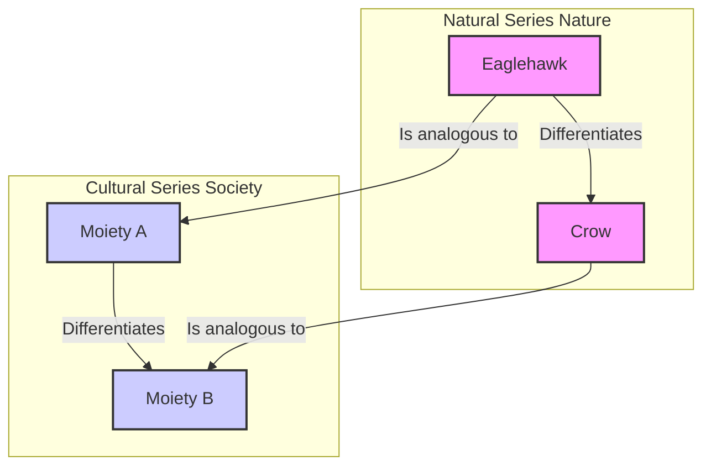
#### Way Forward
In conclusion, according to Claude Lévi-Strauss, totemism is not a reality in the way early sociologists imagined it—as a unified, primitive religion. Its reality is far more profound: it is a testament to the structured, logical nature of the human mind. By reframing totemism as a system of classification, Lévi-Strauss demonstrated that so-called 'primitive' thought is as complex and logical as modern scientific thought, thereby revolutionizing the anthropological study of culture and cognition.

---

# Q7. Discuss Peter Berger’s viewpoint on the future of religion in society.

### Peter Berger’s Viewpoint on the Future of Religion in Society

#### Introduction

Peter Berger, a highly influential sociologist of religion, offers a dynamic and evolving perspective on the future of religion. Initially a proponent of the classic secularization thesis—the idea that modernity inevitably leads to religious decline—Berger famously reversed his position later in his career. He concluded that the future of religion is not one of disappearance but of vibrant, albeit transformed, persistence. His revised viewpoint argues that modernity's primary impact is not secularization but a profound increase in pluralism, which reshapes religious belief and practice.

#### The Retraction of the Secularization Thesis

In his early work, such as The Sacred Canopy (1967), Berger argued that modernization, with its emphasis on rationality and science, would erode the "sacred canopy"—the overarching religious worldview that gives meaning to society. However, observing the global resurgence of faith movements, from evangelical Christianity to political Islam, he later admitted this prediction was empirically false. He concluded that the world was not becoming more secular but was, in many places, "as furiously religious as it ever was."

  

- Desecularization: Berger coined the term "desecularization" to describe this unexpected resurgence of religion in the public and private spheres.
    
- Exceptions to the Rule: He did note two major exceptions to this global trend: Western Europe and an international, highly educated intellectual class, both of which remain significantly secularized.
    

#### Pluralism: The True Consequence of Modernity

Berger's revised thesis posits that modernity does not necessarily destroy religion but instead enforces pluralism. In a globalized world, different religious and secular worldviews are forced to coexist, fundamentally changing the nature of faith.

  

- From Fate to Choice: In traditional societies, one's religion was a matter of fate, an unquestioned reality. In a pluralistic society, belief becomes a matter of individual choice. Individuals are confronted with a "market" of religious options, making their own faith less taken-for-granted and more reflective.
    
- Challenge to Authority: Pluralism erodes the authority of any single religious institution. When multiple truths are on offer, no single one can maintain a monopoly on reality. This creates a more fluid and individualised religious landscape.
    

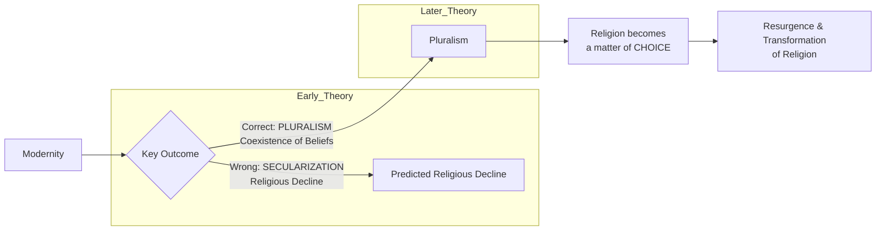
  


#### Way Forward

Peter Berger’s viewpoint suggests that the future of religion will not be its absence but its continued, dynamic presence in a pluralistic world. Religion is not fading away; it is adapting, diversifying, and often thriving. This perspective is highly relevant to contemporary India, a society characterised by deep religious pluralism. Berger’s framework helps explain the simultaneous rise of intense religious movements alongside a secular public discourse. The challenge for modern societies, as Berger saw it, is not how to manage religion's decline, but how to navigate the complex and often tense coexistence of multiple, deeply held belief systems.

—

# Q8. What is religious conversion? Explain its sociological interpretation.

### What is Religious Conversion? Explained with its Sociological Interpretation

#### Introduction

Religious conversion is the process of adopting a new religious identity, or a set of beliefs, that is different from one's previous affiliation. While often viewed as a deeply personal and spiritual journey, sociology interprets it as a profound social phenomenon. A sociological lens moves beyond individual faith to examine conversion as a shift in social identity, group allegiance, and worldview, often driven by structural factors like social stratification, cultural dislocation, and the influence of social networks.

#### The Sociological Interpretation of Conversion

Sociologists are less concerned with the theological truth of a conversion and more interested in the social contexts that precipitate it and the consequences that follow. They analyze the "push" and "pull" factors that lead individuals or groups to embrace a new faith. This interpretation can be understood through three primary frameworks.

  

- Conversion as a Path to Social Mobility: For marginalized and oppressed communities, conversion can be a powerful strategy to escape an entrenched, discriminatory social hierarchy. It is an act of protest and a quest for dignity and equality. The most prominent Indian example is Dr. B.R. Ambedkar's mass conversion to Buddhism in 1956, where he led hundreds of thousands of Dalits to leave Hinduism as a means of rejecting the injustices of the caste system.
    
- Conversion as a Response to Social Dislocation: Rapid social change, urbanization, and migration can create a state of anomie, where old norms and values lose their hold. In such times of uncertainty, individuals may turn to new religious movements that offer a strong sense of community, clear moral guidelines, and a stable worldview. The growth of Pentecostal Christianity in urban slums across India can be partly attributed to the support networks it provides to migrants.
    
- The Role of Social Networks: Contemporary sociology emphasizes that conversion is rarely a solitary act. It is often facilitated through pre-existing social ties. Individuals are more likely to adopt a new faith if their friends, family, or close community members are already adherents. Belief, in this sense, is transmitted through relationships of trust, making social networks a crucial vehicle for religious change.
    

  
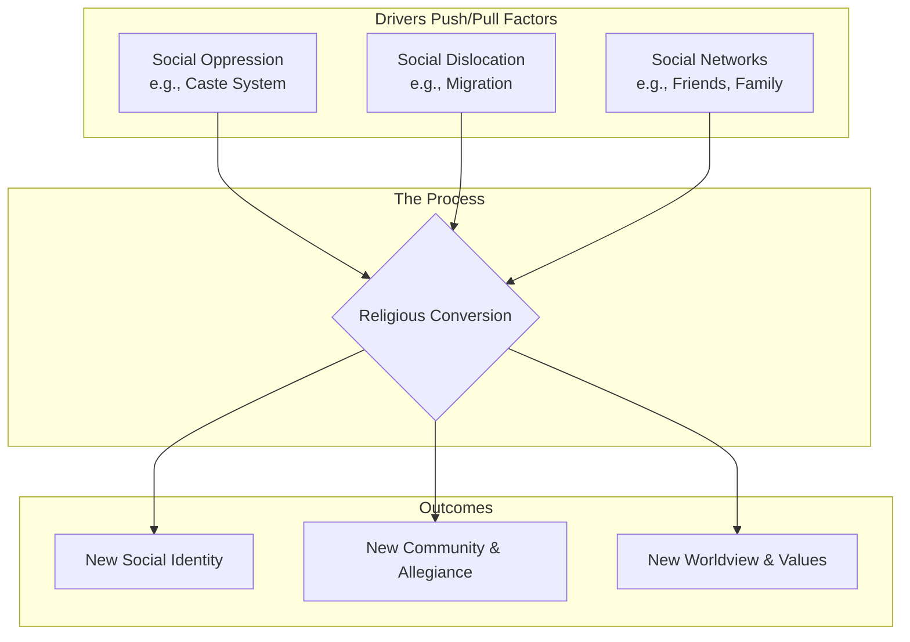

#### Way Forward

In conclusion, the sociological interpretation reveals that religious conversion is far more than a private change of heart; it is a social act embedded in power structures, community dynamics, and the human search for meaning. It is a process through which individuals and groups renegotiate their identity and their place in the world. In a pluralistic and politically charged society like India, understanding the social drivers of conversion is essential for navigating the complex and sensitive debates surrounding religious freedom, identity politics, and minority rights.

—

  
***


---


***

# MSOE-004: Urban Sociology

# Section - 1

# Q1. Critically examine the origin and historical development of urban sociology as a sub-discipline of sociology.

### The Origin and Historical Development of Urban Sociology
#### Introduction
Urban sociology emerged as a distinct sub-discipline of sociology in the late 19th and early 20th centuries, primarily as an intellectual response to the profound social transformations brought about by the Industrial Revolution.
#### Classical European Foundations
The intellectual groundwork for urban sociology was laid by classical European thinkers who grappled with the nature of the emerging modern, industrial city. Though they did not identify as "urban sociologists," their analyses were foundational.
- Karl Marx and Friedrich Engels: They viewed the industrial city as a physical manifestation of capitalism, an arena for class conflict where the bourgeoisie and proletariat were concentrated. Engels’ work, The Condition of the Working Class in England, was a pioneering empirical study of urban squalor and exploitation.
- Max Weber: In The City, Weber provided a historical-comparative analysis, defining the city as a distinct social entity with political autonomy, a market, and a unique form of association. He contrasted the self-governing "occidental city" with the cities of Asia.
- Georg Simmel: In his influential essay The Metropolis and Mental Life, Simmel focused on the psychological impact of urban living. He argued that the intense stimuli of the city produced a "blasé attitude," a detached and rational orientation, as a necessary shield for the individual's inner life.
#### The Chicago School: The Formalization of the Discipline
Urban sociology was formally institutionalized as an empirical field of study in the 1920s and 1930s by the Chicago School in the United States. Treating the city of Chicago as a "social laboratory," its scholars developed groundbreaking theories and methods.
- Human Ecology: Robert Park applied concepts from biology to the city, viewing it as an ecosystem where different social groups competed for resources and territory, leading to processes of invasion, succession, and segregation.
- Concentric Zone Model: Ernest Burgess proposed this influential model, suggesting that cities grow outward from a central business district in a series of concentric rings, each with distinct social characteristics.
- Urbanism as a Way of Life: Louis Wirth argued that the city's defining characteristics—large size, high population density, and social heterogeneity—produced a unique way of life characterized by anonymous, superficial, and instrumental social relationships.
#### The Critical Turn: The New Urban Sociology
By the 1970s, the ecological determinism of the Chicago School faced significant criticism. A new generation of scholars, influenced by Marxist thought, argued that urban forms were shaped not by natural ecological processes but by the political and economic forces of global capitalism.

- Key Thinkers: Scholars like Henri Lefebvre, David Harvey, and Manuel Castells shifted the focus to issues of power, capital accumulation, and social conflict in shaping urban space.
- Central Argument: This "New Urban Sociology" contends that urban development is driven by the decisions of real estate developers, corporations, and government actors, often leading to inequality and social injustice.

  


#### Way Forward
The historical development of urban sociology reflects a journey from foundational observations of industrial cities to a systematic, empirical science, and finally to a critical perspective focused on global political and economic forces. While these Western-centric theories provide a crucial framework, their application to post-colonial contexts like India requires critical adaptation. Contemporary Indian urban sociology must grapple with unique challenges like the massive scale of the informal sector, caste-based segregation, and the politics of "smart cities," ensuring the discipline remains relevant in a rapidly urbanizing world.

---

# Q2. Discuss the major theoretical perspectives in urban sociology.

### Major Theoretical Perspectives in Urban Sociology
#### Introduction
Urban sociology employs several theoretical perspectives to understand the complex dynamics of city life, from the spatial arrangement of social groups to the individual's experience of the urban environment. These frameworks provide distinct lenses for analysing how cities are formed, how they function, and how they impact society.
#### Human Ecology: The City as an Organism
Pioneered by the Chicago School in the early 20th century, the Human Ecology perspective views the city as a natural ecosystem. Scholars like Robert Park and Ernest Burgess applied concepts from biology to explain the organization of urban space. They argued that different social groups, much like plant and animal species, compete for scarce resources (like desirable land), leading to a natural, ordered pattern of social distribution.
- Key Processes: This competition results in processes of invasion, succession, and segregation, as new groups move into urban areas and displace existing ones, leading to the formation of distinct neighbourhoods or "natural areas."
- The Concentric Zone Model: Ernest Burgess’s model is a classic example, proposing that cities grow in a series of five concentric rings, with the central business district at the core and affluent residential areas on the periphery. This model attempted to create a universal map of urban social organization.
#### The Political Economy Perspective: The City as a Growth Machine
Emerging in the 1970s as a critique of Human Ecology, the Political Economy perspective, heavily influenced by Marxist thought, rejects the idea that cities are shaped by natural processes. Instead, thinkers like David Harvey and Manuel Castells argue that urban space is actively produced by the interplay of capital and power.
- Capital and Conflict: This view sees the city as an arena for class conflict, where decisions about land use are driven by the pursuit of profit by corporations, real estate developers, and financial institutions, often supported by the state.
- Uneven Development: The pursuit of profit leads to uneven development, creating zones of extreme wealth alongside areas of neglect and poverty. The development of gated communities and luxury high-rises in Indian cities like Mumbai, often at the cost of displacing slum dwellers, is a stark example of this process.
#### The Culturalist Perspective: The City as Lived Experience
The Culturalist or Symbolic Interactionist perspective focuses on the micro-level, examining how individuals experience the city and create meaning in their everyday lives. Building on the foundational work of Georg Simmel, this view is concerned with urbanism as a unique way of life.
- Focus on Subcultures: It explores how the anonymity and diversity of the city allow for the formation of a wide array of subcultures (e.g., artistic communities, ethnic enclaves, youth groups), providing individuals with a sense of identity and belonging.
- Urban Identity: This perspective analyses how people navigate urban spaces, interpret symbols, and interact with strangers. The vibrant street life and distinct neighbourhood cultures (e.g., the paras of Kolkata) in many Indian cities exemplify how residents actively create a unique social fabric.

```mermaid
mindmap

  

  root(Urban Perspectives)

  

    Human Ecology

  

      ::icon(fa fa-leaf)

  

      Key Idea: Natural Competition

  

      Thinkers: Park, Burgess

  

      Focus: Spatial Patterns

  

    Political Economy

  

      ::icon(fa fa-money-bill-wave)

  

      Key Idea: Capital & Power

  

      Thinkers: Harvey, Castells

  

      Focus: Inequality

  

    Culturalist

  

      ::icon(fa fa-comments)

  

      Key Idea: Lived Experience

  

      Thinkers: Simmel, Wirth

  

      Focus: Subcultures & Identity
```
#### Way Forward
No single theoretical perspective can fully capture the complexity of urban life. A comprehensive understanding of contemporary cities, particularly the multi-layered and rapidly changing urban landscapes of India, requires an integrated approach that draws upon the strengths of all three perspectives.

—

# Q4. Explain the technique of social area analysis in urban sociology.

### The Technique of Social Area Analysis in Urban Sociology
#### Introduction
Social Area Analysis (SAA) is a quantitative technique developed in the mid-20th century to identify and classify urban neighbourhoods based on their underlying social dimensions. Emerging as a sophisticated alternative to the overly simplistic ecological models of the Chicago School, SAA provided a more systematic and empirically grounded method for studying the social geography of cities. Developed by sociologists Eshref Shevky, Wendell Bell, and Marilyn Williams, the technique links broad societal changes to the residential differentiation of urban populations.
#### The Theoretical Foundation
The core premise of SAA is that the increasing "scale of society"—driven by industrialization and modernization—creates distinct patterns of social organization within a city. Shevky and Bell argued that this increasing scale manifests in three fundamental societal trends, which in turn structure the social landscape of the city.
- Changes in the Division of Labour: As society becomes more complex, so do its occupational structures. This leads to differentiation based on skills, education, and economic standing, creating a dimension of Social Rank or Economic Status.
- Changes in Family Structure: Urban-industrial life alters the traditional functions of the family. This leads to variations in lifestyle, family size, and female participation in the workforce, creating a dimension of Urbanization or Family Status.
- Changes in Population Composition: Increased migration and mobility lead to greater ethnic and racial diversity within cities. This results in the spatial sorting of different groups, creating a dimension of Segregation or Ethnic Status.
#### Methodology and Application
In practice, SAA uses census tract data to measure these three underlying dimensions. For each census tract (a small, relatively stable urban neighbourhood), a set of variables is used to create a composite score for each of the three indices.
- Social Rank Index: This is typically measured using variables like the proportion of residents with higher education and the proportion employed in white-collar occupations. Areas with high scores are considered high-status neighbourhoods.
- Urbanization Index: This is measured using variables that reflect modern family life, such as low fertility rates, a high proportion of women in the workforce, and a low number of single-family dwellings.
- Segregation Index: This simply measures the proportion of the population in a census tract belonging to specific minority racial or ethnic groups.

By scoring each neighbourhood on these three independent dimensions, researchers can create a detailed "social map" of the city, identifying areas with similar social characteristics and comparing the social structures of different cities.
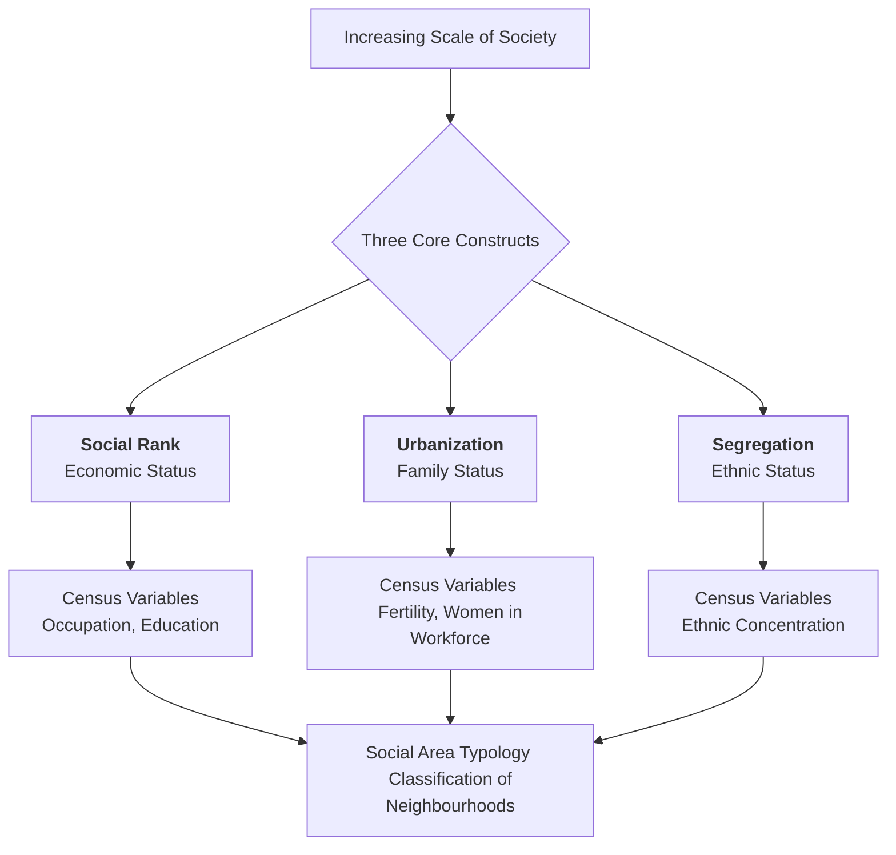
#### Way Forward
Social Area Analysis marked a significant methodological advancement in urban sociology. It provided a multi-dimensional, empirically testable framework that moved beyond the simple spatial determinism of earlier models. While it has been criticized for being overly descriptive and was later refined by the more statistically complex method of factorial ecology, its foundational contribution remains immense. The technique's core insight—that urban social geography is a product of broader societal forces—continues to be a vital tool for understanding patterns of inequality, residential segregation, and social differentiation in cities across the world, including the complex urban landscapes of modern India.

—

# Section - 2

# Q7. Describe the key dimensions of the urban informal sector in India.

### The Key Dimensions of the Urban Informal Sector in India

#### Introduction

The urban informal sector, often referred to as the unorganized or unregulated economy, is a pervasive and defining feature of Indian cities. It comprises a vast range of economic activities, enterprises, and workers that are not regulated or protected by the state. Far from being a marginal phenomenon, this sector provides livelihoods for a majority of the urban workforce. Understanding its key dimensions—economic, social, and its linkage with the formal economy—is crucial for comprehending the reality of urban life and survival in India.

#### Economic and Operational Characteristics

The informal sector is characterized by a distinct set of economic and operational features that set it apart from the formal economy. These characteristics facilitate its existence but also contribute to its instability.

  

- Ease of Entry: Operations in the informal sector typically require minimal capital, skills, and bureaucratic clearances, making it the primary entry point for poor migrants arriving in the city.
    
- Small Scale and Labour-Intensive: Enterprises are generally small-scale, often household-based, and use labour-intensive technology. Examples range from street vendors and rickshaw pullers to small-scale manufacturing and repair shops.
    
- Unregulated Markets: These activities operate in highly competitive and unregulated markets, lacking the legal frameworks and protections afforded to formal businesses.
    

#### Social Composition and Vulnerability

The social dimension of the informal sector reveals its deep connection to structures of inequality. The workforce is not random but is largely composed of the most socially and economically marginalized groups.

  

- A Haven for Migrants: The sector is dominated by rural-to-urban migrants who lack the social capital and educational qualifications to enter the formal job market.
    
- Lack of Social Security: As sociologist Jan Breman has extensively documented, workers in this sector are "footloose labour," with no job security, written contracts, paid leave, health benefits, or pensions. This makes them extremely vulnerable to economic shocks, illness, and old age.
    
- Concentration of Marginalized Groups: Women, lower castes, and religious minorities are disproportionately represented in the lowest-paid and most precarious segments of the informal economy, such as domestic work and waste picking.
    

#### Linkages with the Formal Sector

A critical dimension often overlooked is the intricate and dependent relationship the informal sector has with the formal economy. It is not a separate economy but is deeply integrated, often in an exploitative manner.

  

- Subcontracting and Outsourcing: Formal industries frequently outsource production and services to informal units to reduce labour costs and bypass regulations. For instance, the garment industry in cities like Delhi subcontracts stitching and embroidery work to small, home-based informal workshops.
    
- Providing Cheap Goods and Services: The informal sector subsidizes the formal economy by providing cheap goods and services (food, transport, housing) to formal sector workers, thus helping keep formal sector wages low.
    

  

mindmap

  

  root((Urban Informal Sector))

  

    Economic Dimensions

  

      Easy Entry

  

      Small Scale

  

      Unregulated

  

    Social Dimensions

  

      Dominated by Migrants

  

      High Vulnerability

  

      No Social Security

  

    Linkages to Formal Sector

  

      Subcontracting

  

      Cheap Labour Supply

  

      Exploitative Relationship

#### Way Forward

The key dimensions of India's urban informal sector paint a picture of a resilient yet highly vulnerable economic space. It is an integral, not peripheral, part of the urban economy, characterized by its accessibility, social composition of marginalized groups, and its subordinate linkage to the formal sector. Acknowledging its immense contribution, urban policy must shift from a perspective of neglect or eradication towards one of integration and empowerment, focusing on providing social security, legal recognition, and improved working conditions for the millions who sustain the Indian city.

—

# Q8. Write a critical note on urban poverty in India.
Urban poverty in India is a complex and multi-dimensional phenomenon that extends far beyond a simple lack of income. It is a direct consequence of rapid, often unplanned, urbanization and is characterized by a severe deprivation of essential capabilities and access to services. A critical analysis reveals that urban poverty is not merely an overflow of rural poverty but a distinct structural issue rooted in the nature of India's urban economy and exclusionary urban planning.
#### The Multi-Dimensional Nature of Deprivation
Official poverty estimates, based on consumption expenditure (the Tendulkar or Rangarajan poverty lines), fail to capture the true nature of urban deprivation. Poverty in the city is a condition of precarious existence defined by a lack of access to basic amenities and social security, a concept Amartya Sen would term "capability deprivation."

- Inadequate Access to Basic Services: The urban poor are often clustered in slums and informal settlements (like Dharavi in Mumbai) that are underserved by municipal services. This results in a lack of access to safe drinking water, sanitation, primary healthcare, and quality education.
- Housing Insecurity: A defining feature of urban poverty is the lack of secure housing tenure. Residents of informal settlements live under the constant threat of eviction, as seen in numerous slum demolition drives for urban "beautification" or infrastructure projects.
- Social Exclusion: The poor are often spatially and socially excluded from the formal life of the city. They face discrimination and are denied a political voice in urban governance, reinforcing their marginalization.
#### The Informal Economy and Structural Vulnerability
Urban poverty is intrinsically linked to the structure of the urban labour market, which is dominated by the informal sector. The vast majority of the urban poor are engaged in informal employment, which is characterized by its precarious and exploitative nature.  

- Dependence on Precarious Livelihoods: The urban poor work as street vendors, construction labourers, waste pickers, or domestic help. As sociologist Jan Breman notes, they constitute "footloose labour," with no job security, low and irregular wages, and a complete absence of social safety nets.
- High Vulnerability: This dependence on the informal economy makes the urban poor extremely vulnerable to economic shocks, health crises, and personal emergencies. The mass exodus of migrant workers from cities during the COVID-19 lockdown starkly illustrated this structural vulnerability.
  
```mermaid
mindmap

  

  root(Dimensions of Urban Poverty)

  

    ::icon(fa fa-city)

  

    Income Poverty

  

      Below Poverty Line

  

    Capability Deprivation

  

      Lack of Basic Services

  

        Water & Sanitation

  

        Healthcare

  

        Education

  

      Insecure Housing

  

        Slums & Squatter Settlements

  

        Threat of Eviction

  

    Structural Vulnerability

  

      Informal Employment

  

        Low, Irregular Wages

  

        No Social Security

  

      Social Exclusion
```
#### Way Forward
A critical perspective on urban poverty reveals that it is a systemic problem, not an individual failing. Current policy responses, often focused on simplistic poverty line metrics or punitive actions like slum demolitions, are inadequate. An effective approach must be rights-based, recognizing the "right to the city" for all its inhabitants. This requires inclusive urban planning that focuses on providing secure housing tenure, delivering essential services to informal settlements, and creating policies that protect and empower workers in the informal economy.

—

# Q10. Describe the interface between media and governance in urban settings, using relevant examples.
In modern urban settings, the interface between media and governance is a dynamic and powerful one. Media, in its various forms from traditional print to digital social media, acts not merely as a passive reporter of events but as an active participant in the process of urban governance. It functions as a watchdog, an agenda-setter, and a platform for public discourse, creating a complex relationship that can enhance accountability and citizen participation, but also be subject to manipulation.
#### The Watchdog Role: Ensuring Accountability
The most fundamental role of the media in urban governance is that of a watchdog. It scrutinizes the actions and policies of urban local bodies (ULBs) like municipal corporations, development authorities, and the police, bringing issues of mismanagement and corruption to public attention.

- Exposing Corruption: Investigative journalism often uncovers scams in urban projects, such as irregularities in the allocation of housing contracts or the misuse of public funds. The media's extensive coverage of the Commonwealth Games (CWG) scam in Delhi exposed deep-rooted corruption in urban infrastructure projects, leading to public outcry and official investigations.
- Monitoring Service Delivery: Media outlets regularly report on the failures of civic services, such as inadequate waste management, poor road conditions, or erratic water supply, compelling municipal authorities to respond.
#### The Agenda-Setting Function: Shaping Urban Priorities
The media plays a crucial role in shaping the public and political agenda by deciding which issues receive prominence. By repeatedly highlighting a particular problem, the media can elevate it from a minor nuisance to a major policy priority. 

- Highlighting Civic and Environmental Issues: Sustained media campaigns have been instrumental in drawing attention to critical urban issues like the severe air pollution in Delhi or the foaming lakes of Bengaluru. This coverage forces a lethargic administration to acknowledge the problem and formulate action plans.
- Influencing Policy and Planning: By framing debates around urban development, such as the need for more public transport versus more flyovers, the media can influence urban planning decisions and budget allocations.
#### New Media: A Platform for Direct Citizen Engagement
The rise of social media has radically transformed the media-governance interface, enabling a more direct and instantaneous form of interaction. 

- Citizen Journalism: Ordinary citizens, armed with smartphones, can now act as journalists, reporting civic issues like a broken traffic light or an overflowing garbage bin in real-time.
- Direct Interface with Authorities: Platforms like Twitter (now X) have become grievance redressal mechanisms. Citizens can directly tag the relevant municipal corporation or police department in their posts, often receiving a swift response. The active use of social media by the Bengaluru and Mumbai police to manage traffic and respond to citizen complaints is a prime example of this direct interface.

  ```mermaid
mindmap

  

  root((Media-Governance Interface))

  

    Watchdog Role

  

      Exposing Corruption (e.g., CWG Scam)

  

      Monitoring Civic Services

  

    Agenda-Setting Role

  

      Highlighting Issues (e.g., Delhi Pollution)

  

      Influencing Urban Policy

  

    Public Sphere Role (New Media)

  

      Citizen Journalism

  

      Direct Engagement (e.g., Twitter)
```
#### Way Forward
The interface between media and urban governance is indispensable for a functioning urban democracy. It empowers citizens, promotes transparency, and holds power to account. However, this relationship is not without its flaws. Media can be biased by corporate or political interests, and it can resort to sensationalism. The future challenge lies in leveraging the democratic potential of new media while fostering a critical and responsible journalism that contributes to creating more inclusive, accountable, and responsive cities.

—

  
***

---
---

# MPS 003 

# Section 1
## Q 1. Define development from a political perspective. How does democratic governance influence the process and outcomes of development in India?
#### **Introduction**
From a political perspective, development transcends mere economic growth, encompassing the expansion of human freedoms, institutional capabilities, and citizen empowerment. It is a process of enhancing the capacity of individuals to lead lives they value. As Amartya Sen argues in his "Development as Freedom" thesis, political liberties and democratic rights are not just instruments for development but are constitutive of development itself.
#### **The Political Conception of Development**
Politically, development is understood as the creation of a stable and legitimate state apparatus coupled with an expansion of citizen participation and rights. It is not merely about increasing GDP but about building robust, accountable institutions that can deliver public goods and ensure social justice. This perspective focuses on the quality of governance and the relationship between the state and its citizens.

*   **Institution Building:** This involves creating effective, autonomous, and accountable institutions like a fair judiciary, a non-partisan election commission, and a responsive bureaucracy that can uphold the rule of law.
*   **Citizen Empowerment:** It centres on enhancing political participation through free and fair elections, protecting civil liberties, and ensuring the rights of marginalised groups to influence policy-making.
*   **State Capacity:** This refers to the state's ability to formulate and implement policies, regulate the economy, and provide essential services like health and education to its populace effectively.

#### **Democratic Governance and Development in India**
In India, the democratic framework acts as the primary mechanism through which developmental goals are negotiated and pursued. While often seen as slow and contentious, this process embeds development with legitimacy and responsiveness, directly influencing both its methods and results. The interplay between democratic pressures and state action is central to India's developmental trajectory.

*   **Process Influence (Accountability and Participation):** Democratic mechanisms have created avenues for citizen-led accountability. The **Right to Information (RTI) Act, 2005**, for instance, has empowered citizens to demand transparency in governance, directly impacting how development projects are implemented and monitored. Similarly, the 73rd and 74th Constitutional Amendments establishing Panchayati Raj Institutions have sought to decentralise planning, making the development process more participatory.
*   **Outcome Influence (Rights-Based Welfare):** Many of India's key development outcomes are a direct result of democratic mobilisation and electoral politics. The **Mahatma Gandhi National Rural Employment Guarantee Act (MGNREGA)**, which guarantees 100 days of wage employment, is a landmark example of a rights-based social security measure born from political demand. Likewise, policies like the National Food Security Act reflect the state's response to popular pressures for equitable resource distribution.
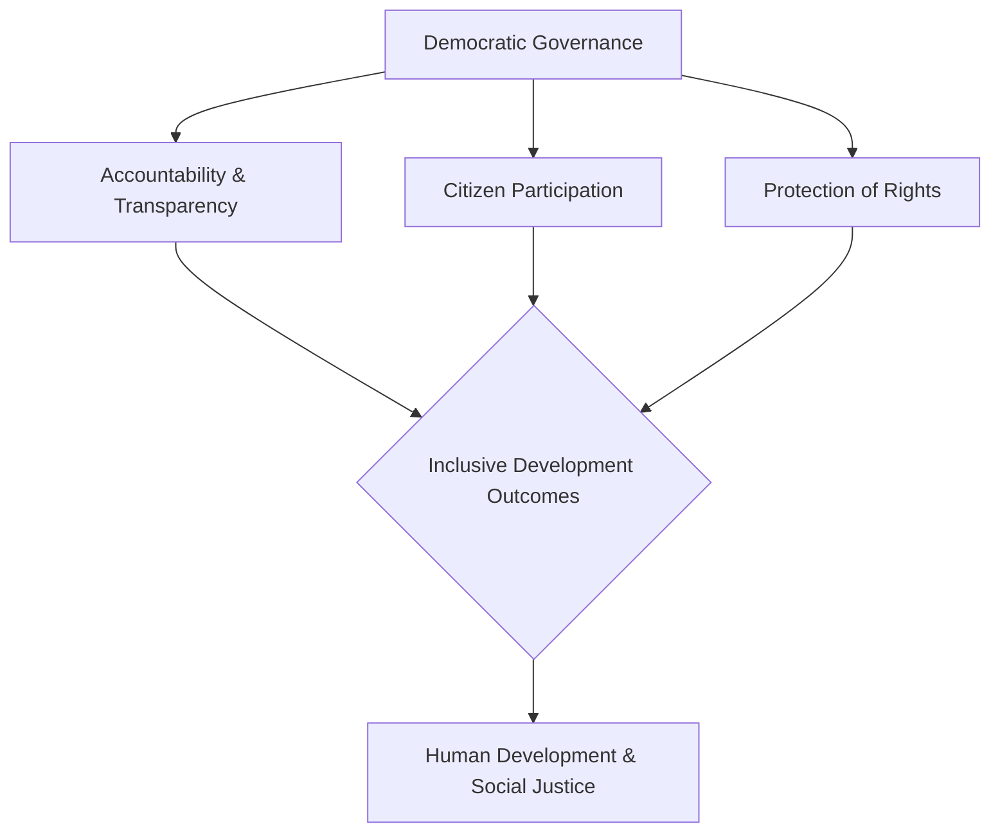

#### Conclusion**
In conclusion, the political perspective frames development as an expansion of freedom and institutional strength, a process in which Indian democracy is deeply implicated. Democratic governance fundamentally shapes development by infusing it with principles of accountability, participation, and rights. While challenges of corruption, inequality, and implementation gaps persist, the democratic process ensures that development remains a contested and evolving domain, constantly pushed towards being more inclusive and just for its citizens.

---

## Q 2. Assess the institutional mechanisms of centre-state relations in India.
#### **Introduction**
India’s quasi-federal structure is maintained through a complex web of institutional mechanisms designed to manage the intricate relationship between the Union and the States. These mechanisms, enshrined in the Constitution, span legislative, administrative, and financial domains. An assessment reveals a system that, while providing a robust framework for cooperation, is often marked by a centralising tendency that can strain the federal balance, a reality political thinkers like Granville Austin have noted despite describing the structure as one of "cooperative federalism."
#### **Legislative and Administrative Mechanisms**
The Constitution meticulously demarcates legislative powers through the Union, State, and Concurrent lists. However, several mechanisms tilt the balance in favour of the Centre. Administrative integration is primarily achieved through the All-India Services, whose officers hold key positions in state governments but are ultimately accountable to the Union. This creates a dual line of command and ensures a degree of central oversight in state administration.
*   **The Governor's Office:** The Governor, appointed by the President, functions as the constitutional head of the state but also as a vital agent of the Centre. The discretionary power to reserve state bills for the President's assent (Article 200) is a significant tool of central control and has often become a source of political friction, particularly in states governed by opposition parties.
*   **Central Emergency Powers:** Under Articles 356 and 365, the Centre can impose President's Rule, taking over the state's administration. While intended as a last resort, its alleged misuse has been a persistent challenge to state autonomy.
#### **Financial and Coordinative Mechanisms**
Financial relations are the bedrock of federal dynamics, with the Centre possessing greater revenue-raising powers. To balance this, specific institutional arrangements are in place to ensure a fair distribution of resources and promote inter-governmental cooperation.

*   **The Finance Commission (Article 280):** This constitutional body is the cornerstone of fiscal federalism. It recommends the vertical and horizontal distribution of tax revenues, providing a structured and periodic mechanism to address fiscal imbalances between the Centre and the states, and among the states themselves.
*   **Inter-Governmental Bodies:** To foster cooperation, bodies like the Inter-State Council (Article 263) were established to provide a forum for dialogue and dispute resolution. More recently, the NITI Aayog was created to succeed the Planning Commission, with a mandate to foster "cooperative federalism" by involving states in the policy-making process.
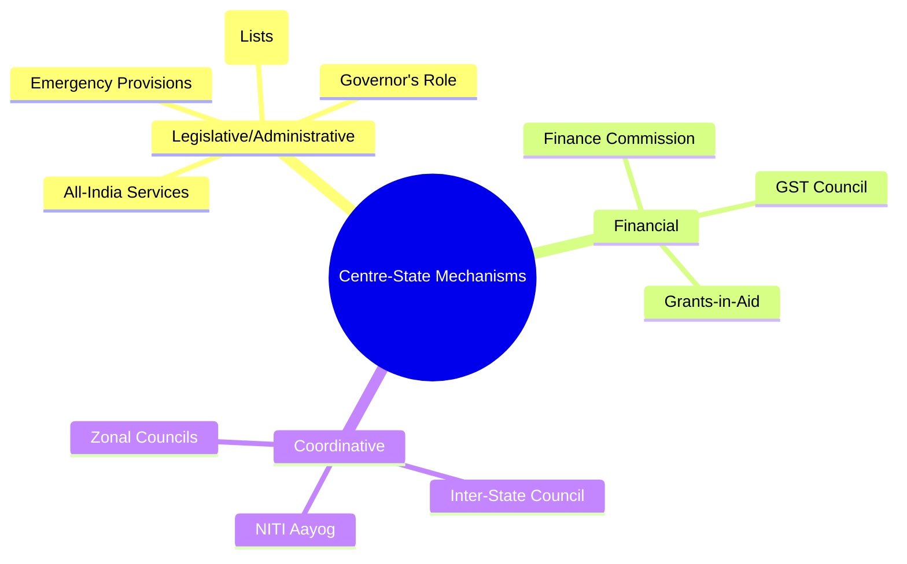
#### **Conclusion**
The institutional mechanisms governing centre-state relations in India present a mixed picture. While constitutional bodies like the Finance Commission provide a stable framework for fiscal sharing, administrative and legislative tools often empower the Centre to override state interests. The effectiveness of these mechanisms hinges on the prevailing political culture. For a more harmonious federal balance, the way forward lies in strengthening the consultative and cooperative bodies like the Inter-State Council and ensuring that the discretionary powers of the Centre are exercised with restraint and constitutional propriety.

---

## Q 5. Write short notes on the following in about 250 words each: a) The changing role of the state in a liberalised economy b) The link between civil society and democratic development
#### a) The changing role of the state in a liberalised economy**
The advent of economic liberalisation in India since 1991 has fundamentally redefined the role of the state, forcing a transition from a 'provider' and 'controller' to that of a 'regulator' and 'facilitator'. Previously, the state dominated the "commanding heights" of the economy through public sector undertakings and extensive licensing. The post-liberalisation era, however, necessitated a strategic withdrawal from direct production and a focus on creating a conducive environment for market forces while safeguarding public interest.

This transformation is evident across several key domains. The state has increasingly embraced a regulatory function, establishing independent bodies to oversee critical sectors and ensure fair competition. Simultaneously, it has focused on facilitating economic activity by investing in infrastructure and simplifying business procedures to attract private investment.

*   **Shift to a Regulatory State:** The primary change is the creation of autonomous regulatory agencies. Institutions like the Securities and Exchange Board of India (SEBI) for capital markets and the Telecom Regulatory Authority of India (TRAI) now set the rules of the game for private players, ensuring market stability and consumer protection.
*   **Role as a Facilitator:** Instead of directly running industries, the state now acts as an enabler. Initiatives like "Make in India" and the focus on improving the 'Ease of Doing Business' index are prime examples of the state working to create a favourable climate for private enterprise.
*   **Redefined Welfare Provider:** While the state has retreated from some economic areas, it has reasserted its role in social welfare through a rights-based framework. Schemes like MGNREGA and the National Food Security Act aim to provide a social safety net, mitigating the inequalities that can arise from market-led growth.

In conclusion, the state in a liberalised economy has not disappeared but has become more strategic. Its core challenge now lies in balancing the imperatives of market efficiency with the constitutional mandate of ensuring social justice and inclusive development.
#### b) The link between civil society and democratic development
Civil society, understood as the autonomous sphere of association between the family and the state, is intrinsically linked to the deepening and development of democracy. It provides the institutional channels through which citizens can articulate interests, demand accountability, and participate in governance beyond the formal act of voting. As political sociologist Larry Diamond argues, a vibrant civil society is a cornerstone of a consolidated, substantive democracy.

The link between civil society and democratic development is multifaceted. These organisations act as a crucial intermediary, translating societal grievances into policy debates and ensuring that the state remains responsive to the needs of its citizens. They cultivate the values of dialogue, tolerance, and collective action, which are the lifeblood of a democratic political culture.

*   **The Watchdog Function:** Civil society organisations (CSOs) act as a check on state power by monitoring government activities and exposing instances of corruption and human rights violations. In India, the Association for Democratic Reforms (ADR) has played a vital role in enhancing electoral transparency by publicising the financial and criminal records of candidates.
*   **Advocacy and Policy Influence:** CSOs often bring the concerns of marginalised communities to the forefront of public discourse. The sustained advocacy by women's rights groups in India following the 2012 Delhi gang rape case was instrumental in the enactment of the stringent Criminal Law (Amendment) Act, 2013.
*   **Fostering Civic Engagement:** By organising people around common causes, civil society builds "social capital" and promotes democratic participation. Local environmental movements, citizen-led urban planning forums, and community associations all contribute to a more engaged and politically conscious citizenry.

In essence, civil society is the bedrock upon which democratic development rests. A healthy democracy requires not just robust state institutions but also an active and autonomous civil society that can hold those institutions accountable and ensure that governance is truly of, by, and for the people.

---
---

# Section 2

# Q 7. Analyse the emergence of identity-based regionalism and its impact on national integration.
#### **Introduction**
Identity-based regionalism in India refers to political mobilisation rooted in a shared sense of identity based on language, ethnicity, tribe, or culture, often confined to a specific geographical area. It emerges from a collective feeling of marginalisation and seeks political recognition and autonomy. This phenomenon, as analysed by scholars like Myron Weiner, presents a complex duality: while it can pose significant challenges to national integration, it has also played a crucial role in deepening India's democratic and federal character.
#### **Drivers of Identity-Based Regionalism**
The emergence of this form of regionalism is a response to specific socio-economic and political conditions. It is driven by the perception that a dominant national culture or a centralised state apparatus overlooks or suppresses distinct regional identities. This sentiment is often compounded by experiences of uneven development, where certain regions feel left behind economically.
*   **Linguistic and Cultural Assertion:** The most powerful driver has been the politics of language and culture. The post-independence demand for linguistic reorganisation of states was a classic example. The Dravidian movement in Tamil Nadu, for instance, was a powerful assertion of a distinct cultural identity against the perceived imposition of Hindi, solidifying regional consciousness.
*   **Ethnic and Tribal Consciousness:** In Northeast India, regionalism is primarily driven by the unique ethnic identities of tribal communities. Movements for statehood, such as those that led to the creation of Nagaland and Mizoram, were born from a desire to protect distinct tribal customs, traditions, and ways of life from being subsumed by the mainstream.
*   **Economic Neglect and Disparity:** Perceived economic injustice often fuels identity politics. The movement for the creation of Telangana, for example, was underpinned by arguments that the region's resources were being diverted to develop other parts of Andhra Pradesh, linking regional identity directly to the demand for developmental equity.
#### **The Dual Impact on National Integration**
The impact of identity-based regionalism on national integration simultaneously generates both centrifugal and centripetal forces, challenging and reinforcing the Indian nation-state.
*   **Negative Impact (Challenge to Integration):** In its extreme form, identity regionalism can manifest as secessionism, directly threatening the nation's territorial integrity. The Khalistan movement in Punjab in the 1980s is a stark example of how identity assertion can lead to violent conflict. It can also fuel inter-regional disputes over resources like river water and create a parochial "sons of the soil" politics that is hostile to migrants.
*   **Positive Impact (Strengthening Integration):** Paradoxically, the political accommodation of regional identities has often strengthened national integration. By creating linguistic states and autonomous councils, the Indian state provided a democratic outlet for regional aspirations, preventing them from escalating into separatist movements. This process has made the federal structure more representative and has given diverse groups a stake in the national project, thereby fostering a model of "unity in diversity."
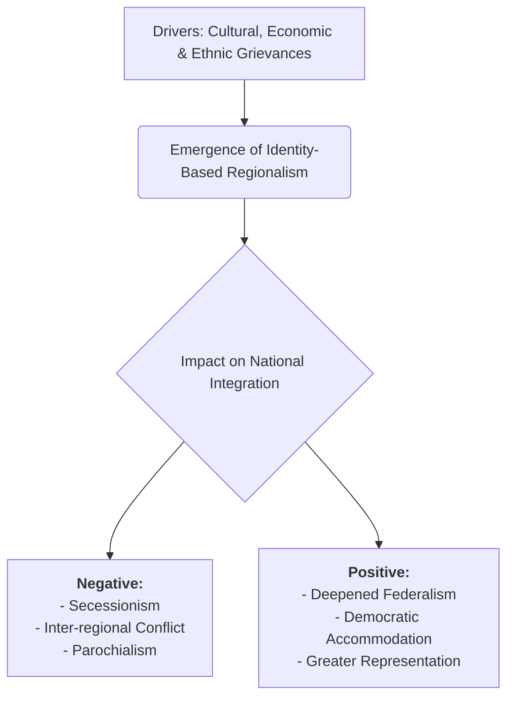
#### **Conclusion**
In conclusion, identity-based regionalism is an intrinsic feature of India's diverse polity. It emerges from genuine feelings of cultural and economic marginalisation. While its potential to foster secessionist tendencies poses a clear threat, the Indian state's response of accommodating these identities through democratic means has largely reinforced national unity. The way forward lies not in suppressing these identities, but in addressing the underlying issues of disparity and ensuring that federal institutions are robust enough to manage these tensions constructively.

---
---

# Q8. Explain the concept of sustainable development and assess India’s policy responses to environmental challenges.
#### **Introduction**
Sustainable development is a paradigm that seeks to harmonise economic growth with environmental protection and social equity. The concept, famously defined by the 1987 Brundtland Commission Report as "development that meets the needs of the present without compromising the ability of future generations to meet their own needs," advocates for a balanced and integrated approach.
#### **The Pillars of Sustainable Development**
Sustainable development rests on three interdependent pillars, arguing that long-term prosperity is impossible without addressing all three concurrently. It moves beyond a narrow focus on GDP to a more holistic understanding of human well-being, emphasising the principle of inter-generational equity.
*   **Environmental Sustainability:** This pillar focuses on protecting the integrity of natural ecosystems. It involves conserving natural resources, reducing pollution and waste, combating climate change, and preserving biodiversity to ensure that the planet's life-support systems are maintained for future generations.
*   **Social Sustainability:** This dimension is concerned with social equity and justice. It aims to ensure that all members of society have access to essential services like healthcare and education, enjoy human rights, and can participate in the decisions that affect their lives. It particularly focuses on empowering marginalised communities.
*   **Economic Sustainability:** This refers to the ability of an economy to support a defined level of economic production indefinitely. It promotes efficient resource use, long-term profitability without damaging the environment, and the creation of resilient economies that provide decent livelihoods for all.
#### **India’s Policy Responses to Environmental Challenges**
India's policy framework reflects the inherent tension between its developmental aspirations and environmental compulsions. While a robust legal and policy architecture exists, its implementation remains a significant challenge. The state has increasingly adopted the language of sustainability, but a gap between policy intent and on-ground outcomes persists.
*   **Legislative Framework:** India has enacted comprehensive environmental laws, including the **Environment (Protection) Act, 1986**, the Water (Prevention and Control of Pollution) Act, 1974, and the Forest (Conservation) Act, 1980. These acts provide a strong legal basis for environmental governance, though their enforcement is often weak.
*   **Climate Change Mitigation:** In response to global climate challenges, India launched the **National Action Plan on Climate Change (NAPCC)** in 2008, which includes eight missions, such as the National Solar Mission. This signals a significant policy shift towards renewable energy and a commitment to decoupling economic growth from carbon emissions.
*   **Programmatic Initiatives:** Recent years have seen large-scale programmes like the **Swachh Bharat Mission**, aimed at improving sanitation and waste management, and initiatives to combat air pollution in major cities. However, their success is often hampered by institutional capacity constraints and a lack of sustained public participation.
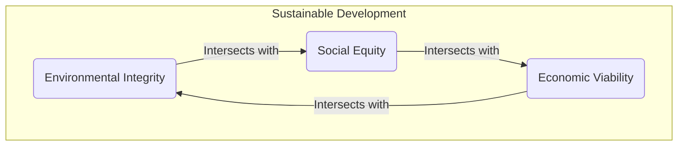
#### **Conclusion**
In conclusion, the concept of sustainable development provides a vital framework for addressing the interconnected challenges of the 21st century. India has responded with a multi-pronged policy approach, creating strong legislative frameworks and ambitious national missions. The way forward, however, depends critically on strengthening regulatory enforcement, fostering greater convergence between developmental and environmental goals, and empowering local communities as key stakeholders in the pursuit of a truly sustainable future.

---

# Q9. Examine the demographic and socio-economic consequences of over-urbanisation in Indian cities.

Of course. Here is a 90+ marks-worthy answer for the next MPS-003 question, crafted in strict adherence to your master prompt.

***

**Q9. Examine the demographic and socio-economic consequences of over-urbanisation in Indian cities.**

**Answer:**

**Introduction**

Over-urbanisation in India describes a situation where the rate of urban population growth, driven largely by distress-led rural-to-urban migration, significantly outpaces the development of infrastructure, housing, and formal employment. This phenomenon creates cities that are demographically imbalanced and fraught with severe socio-economic challenges. This analysis examines the critical demographic and socio-economic consequences of this unsustainable urban expansion in the Indian context.

**Demographic Consequences**

The relentless influx of migrants fundamentally reshapes the demographic profile of Indian cities, leading to unsustainable population densities and distorted social structures. This rapid, unplanned population growth puts immense pressure on the very fabric of urban life, creating distinct demographic patterns that are characteristic of over-urbanised centres.

*   **Extreme Population Density and Slum Growth:** Cities like Mumbai and Delhi experience hyper-density, which directly fuels the proliferation of informal settlements. Lacking affordable formal housing, a significant portion of the urban population is forced into slums like Dharavi, which are characterised by overcrowding and a complete lack of basic civic amenities.
*   **Skewed Sex and Age Ratios:** The migration pattern is often male-selective, as men move to cities seeking employment, leaving families behind. This results in an imbalanced sex ratio in urban areas, which can contribute to social tensions. Furthermore, it creates a "youth bulge," a large concentration of a young, working-age population that can strain the job market.

**Socio-Economic Consequences**

When urban infrastructure and services cannot cope with population growth, it triggers a cascade of negative socio-economic outcomes. The formal economy is unable to absorb the massive labour influx, leading to widespread precarity and deepening inequalities that manifest spatially and socially across the urban landscape.

*   **Overburdened Infrastructure and Services:** Public services are the first casualty of over-urbanisation. Essential infrastructure like public transport, water supply, sanitation, and healthcare systems become severely strained. The daily reality of overcrowded local trains in Mumbai or the acute water shortages in cities like Bengaluru and Chennai are direct consequences of this infrastructural deficit.
*   **Dominance of the Informal Economy:** A key outcome is the expansion of a vast informal sector. Unable to find formal jobs, millions work as street vendors, construction labourers, or domestic help, without job security, social protection, or decent wages. This creates a dualistic economy and institutionalises urban poverty.
*   **Acute Housing Crisis and Social Segregation:** The immense pressure on land leads to an acute housing crisis, with skyrocketing real estate prices. This results in a stark spatial segregation, creating cities of extreme contrasts with affluent gated communities existing alongside sprawling, underserved slums, thereby reinforcing social stratification.

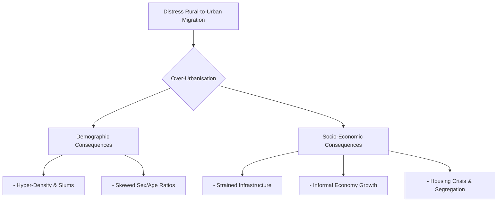

**Conclusion**

In conclusion, over-urbanisation in Indian cities leads to critical demographic distortions and a host of debilitating socio-economic problems, from infrastructural collapse to the institutionalisation of poverty. The way forward is not to curb migration but to manage urbanisation more effectively. This requires a paradigm shift towards balanced regional development, focusing on creating economic opportunities and robust infrastructure in Tier-II and Tier-III cities to ease the unsustainable pressure on the country's megacities.


---
----


---
---

# MPA 16 DECENTRALISATION AND LOCAL GOVERNANCE

# Section 1 

## Q 1) Describe the meaning, concept and significance of Democratic Decentralisation. 
***
#### **Introduction**
Democratic decentralisation is a profound political and administrative process involving the transfer of power, resources, and decision-making authority from higher levels of government to elected bodies at the local level. It is fundamentally about bringing governance closer to the people, transforming them from passive recipients of development into active participants. Rooted in the philosophy of subsidiarity, it holds that governance functions should be performed at the lowest practicable level. This answer describes the core meaning and concept of democratic decentralisation before analysing its immense significance for contemporary governance.
#### **The Meaning and Concept of Democratic Decentralisation**
Conceptually, democratic decentralisation is distinct from other forms of administrative decentralisation. It is not merely 'deconcentration' (shifting workloads to field offices) or 'delegation' (transferring specific responsibilities to subordinate agencies). Instead, its essence lies in 'devolution,' which is the legal transfer of political and financial power to sub-national, democratically elected local governments that have a significant degree of autonomy. This process embodies the ideals of self-governance, echoing Mahatma Gandhi's vision of 'Gram Swaraj' or village self-rule, where local communities manage their own affairs.

*   **The Three 'Fs' (Functions, Finances, Functionaries):** True devolution rests on the effective transfer of the three 'Fs'. Local governments must be endowed with a clear mandate over specific functions (like sanitation or local infrastructure), have adequate and untied financial resources (through grants and local taxation powers) to perform them, and have administrative control over the functionaries responsible for implementation.
*   **Political and Administrative Dimensions:** The concept operates on two interconnected planes. Politically, it aims to deepen democracy by creating vibrant platforms for citizen participation and holding elected officials directly accountable. Administratively, it seeks to improve the efficiency and responsiveness of public service delivery by tailoring development programmes to specific local needs and contexts.
#### **The Significance of Democratic Decentralisation**
The significance of democratic decentralisation lies in its potential to make governance more inclusive, effective, and accountable. By empowering local communities, it strengthens the very foundations of the state and fosters a more participatory political culture. Its importance can be understood through its impact on democracy, governance, and social equity.

*   **Deepening Democracy and Fostering Participation:** It acts as a school of democracy, nurturing leadership from the grassroots. In India, institutions like the Gram Sabha provide a platform for direct democracy, allowing citizens to participate in planning and social audits. This active engagement makes democracy a more tangible and lived reality for ordinary people.
*   **Enhancing Governance and Service Delivery:** Local governments are better positioned to identify local needs and priorities, leading to more relevant and effective development outcomes. For instance, a Panchayat is more likely to correctly decide whether a village needs a new well or a road repair, making public spending more efficient and governance more responsive.
*   **Promoting Social Inclusion and Empowerment:** It can be a powerful tool for social justice. The 73rd Constitutional Amendment in India, which mandates reservations for women, Scheduled Castes, and Scheduled Tribes in Panchayati Raj Institutions, has been instrumental in bringing millions from marginalised communities into the formal political process, giving them a voice in local decision-making.
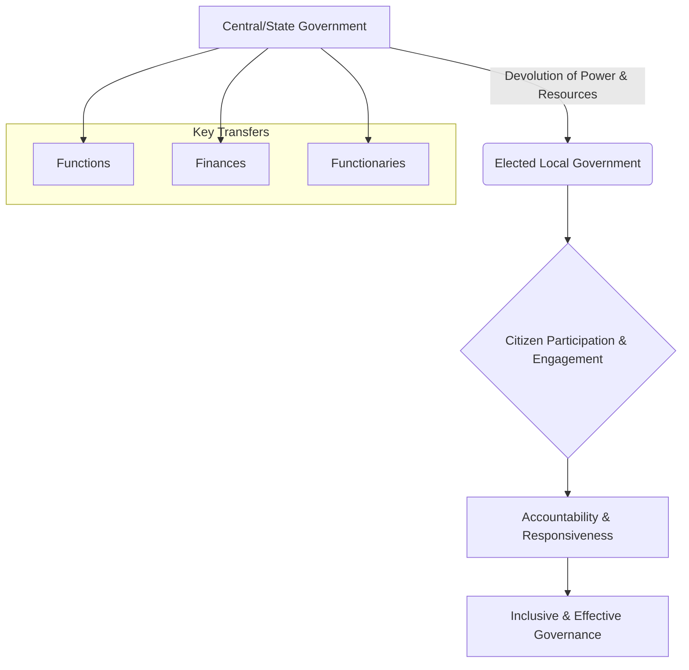

#### **Conclusion**
In conclusion, democratic decentralisation is far more than an administrative reform; it is a political philosophy aimed at empowering citizens and making governance truly representative. Its significance lies in its capacity to deepen democracy, improve service delivery, and advance social inclusion. While its implementation in India faces challenges of capacity building and genuine financial autonomy for local bodies, its foundational importance for building a robust, participatory, and equitable state remains undisputed.

---

## Q 2) Discuss the Salient features of 73rd and 74th Constitutional Amendment Act, 1992.
#### **Introduction**
The 73rd and 74th Constitutional Amendment Acts of 1992 represent a watershed moment in the evolution of Indian democracy, granting constitutional sanctity to rural and urban local self-governing bodies. These amendments sought to transform Panchayati Raj Institutions (PRIs) and Urban Local Bodies (ULBs) from mere administrative agencies into vibrant, autonomous institutions of local governance. By establishing a uniform framework across the country, they aimed to institutionalise grassroots democracy and decentralised planning.
#### **Constitutional Status and Structural Uniformity**
The most fundamental feature of the amendments was the insertion of Part IX (The Panchayats) and Part IX-A (The Municipalities) into the Constitution. This act of constitutionalisation made it mandatory for all states to establish a system of local self-government, ending their discretionary and often neglectful attitude towards these bodies.
*   **Three-Tier System:** The 73rd Amendment mandated a uniform three-tier structure of Panchayats at the village (Gram Panchayat), intermediate (Panchayat Samiti), and district (Zila Parishad) levels for states with a population over 20 lakhs. Similarly, the 74th Amendment provided for three types of municipalities: Nagar Panchayats for transitional areas, Municipal Councils for smaller urban areas, and Municipal Corporations for larger urban areas.
*   **Foundation of Direct Democracy:** The Acts established the Gram Sabha (for rural areas) and Ward Committees (for urban areas) as the bedrock of the local governance system. These bodies, comprising all registered voters in their respective areas, were envisioned as platforms for direct citizen participation in planning and oversight.
#### **Mandates for Social Justice and Political Stability**
A crucial thrust of the amendments was to ensure social equity in political representation and to provide stability and continuity to local governments, which were previously prone to arbitrary dissolution by state governments.
*   **Reservations for Empowerment:** The Acts introduced a revolutionary system of reservations. Seats are reserved for Scheduled Castes (SCs) and Scheduled Tribes (STs) in proportion to their population at all levels. Furthermore, a minimum of one-third of the total seats, including those reserved for SCs/STs, are reserved for women. This provision has been instrumental in bringing millions of women and individuals from marginalised communities into the formal political arena.
*   **Fixed Tenure and State Election Commissions (SECs):** To ensure political stability, a fixed five-year term was mandated for all local bodies. In case of dissolution, fresh elections must be held within six months. To conduct these elections in a free and fair manner, the Acts provided for the creation of an independent State Election Commission in every state.
#### **Mechanisms for Functional and Financial Autonomy**
To enable local bodies to function as genuine institutions of self-government, the amendments laid down mechanisms for the devolution of powers and financial resources.
*   **Eleventh and Twelfth Schedules:** The 73rd Amendment added the Eleventh Schedule, listing 29 subjects (e.g., minor irrigation, rural housing), while the 74th Amendment added the Twelfth Schedule with 18 subjects (e.g., urban planning, public health), which could be devolved to local governments.
*   **State Finance Commissions (SFCs):** The Acts mandate the constitution of a State Finance Commission every five years. The SFC's role is to review the financial position of local bodies and recommend the principles for the distribution of taxes and grants-in-aid from the state to its local governments.
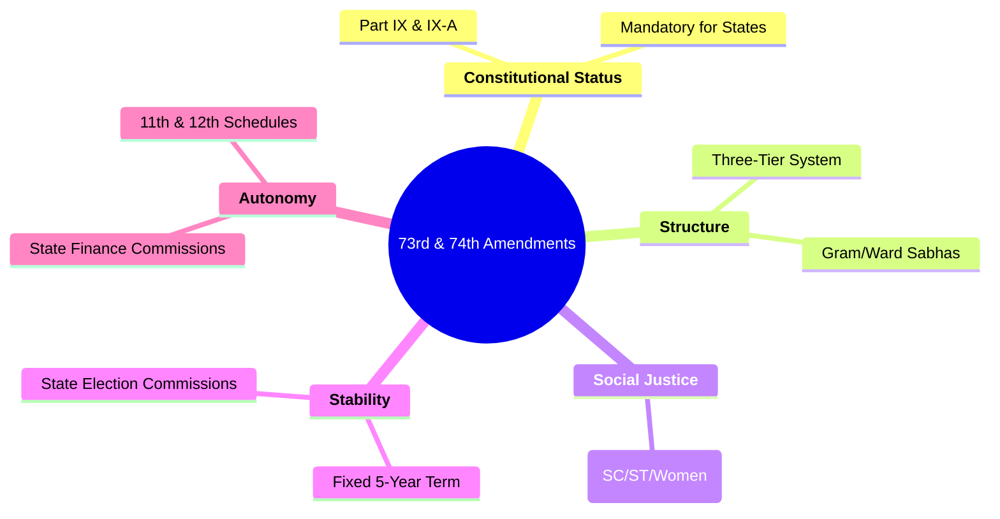

#### **Conclusion**
In essence, the 73rd and 74th Amendments provided a robust constitutional architecture for democratic decentralisation in India. They established a uniform structure, ensured representation for marginalised groups, and created mechanisms for financial and functional autonomy. The way forward, however, lies in moving from letter to spirit. The true success of these amendments is contingent upon the political will of state governments to genuinely devolve the 'three Fs'—Functions, Finances, and Functionaries—to these grassroots democratic institutions.

---

## Q5) Discuss the Challenges to sustainable Development and Environment. 
**Introduction**

Sustainable development, defined by the Brundtland Commission as meeting present needs without compromising the ability of future generations to meet theirs, is a globally accepted goal. However, its realisation is fraught with profound challenges, particularly in developing nations like India. These challenges stem from the inherent conflict between rapid economic growth and environmental preservation, coupled with significant governance deficits and socio-cultural barriers that impede the transition to a sustainable model.

**The Primacy of Economic Growth**

A primary challenge lies in the developmental paradox where the immediate imperative of poverty alleviation through rapid economic growth often takes precedence over long-term environmental concerns. This creates a policy environment where environmental protection is frequently viewed as a constraint on development rather than an integral component of it.

*   **Resource-Intensive Growth Model:** India's economic trajectory has been heavily reliant on resource-intensive industries, leading to widespread deforestation, depletion of water resources, and degradation of agricultural land. The pressure to attract investment often results in the dilution of environmental impact assessment (EIA) norms for industrial and infrastructure projects.
*   **Unsustainable Consumption Patterns:** As incomes rise, so do consumption levels. The growing demand for energy, consumer goods, and transportation, modelled on Western consumption patterns, places an unsustainable burden on the natural resource base and contributes significantly to pollution and carbon emissions.

**Institutional and Governance Deficits**

The existence of robust environmental legislation does not automatically translate into effective action. A significant implementation gap, particularly at the sub-national and local levels, poses a formidable challenge to environmental governance and the pursuit of sustainability.

*   **Weak Regulatory Enforcement:** State Pollution Control Boards and other regulatory bodies are often understaffed, underfunded, and lack the political autonomy to enforce environmental laws strictly against powerful corporate or political interests. This results in widespread non-compliance with pollution standards.
*   **Capacity Constraints in Local Governance:** Panchayats and Municipalities, the institutions central to decentralised governance, are on the front lines of environmental management. However, they frequently lack the financial resources, technical expertise, and administrative capacity to effectively manage critical functions like solid waste management, water conservation, and the protection of common property resources.

**Socio-Cultural and Awareness Barriers**

Deep-seated social attitudes and a lack of widespread environmental awareness create a challenging context for implementing sustainable practices. The burden of environmental degradation is also borne unequally, further complicating the issue.

*   **Limited Public Awareness and Participation:** There is often a disconnect between understanding environmental issues at a macro level (like climate change) and adopting sustainable practices at a personal or community level (like waste segregation or water conservation). Effective public participation in environmental decision-making remains limited.
*   **The Equity Dimension:** The costs of environmental damage, such as displacement due to large projects or the health impacts of pollution, are disproportionately borne by the poor and marginalised communities. This creates a deep social equity challenge that is central to the concept of sustainable development.

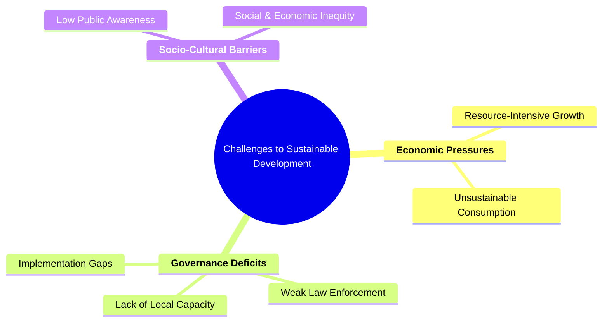

**Conclusion**

In conclusion, the path to sustainable development is obstructed by a complex interplay of economic compulsions, governance failures, and social inertia. The way forward requires a fundamental policy reorientation that integrates environmental concerns into the very core of economic planning. This must be coupled with a concerted effort to empower and build the capacity of decentralised governance institutions, as it is at the local level that the battle for a sustainable future will ultimately be won or lost.


---

# Section 2


## Q 7) Elaborate the Financial Resources of Panchayati Raj Institutions.
#### Introduction
The financial viability of Panchayati Raj Institutions (PRIs) is the bedrock of effective democratic decentralisation. The 73rd Constitutional Amendment Act, 1992, while granting constitutional status to PRIs, also laid down a framework for their financial empowerment. This framework envisages a mix of own-source revenues, devolved funds, and grants to enable these local bodies to function as autonomous institutions of self-government. An elaboration of these resources reveals a system designed for fiscal autonomy, though its practical implementation remains a significant challenge.
#### Own Source Revenue (OSR)
This category includes revenues that PRIs raise from their own jurisdiction and is the most critical component for genuine financial independence. A robust OSR base reduces dependency on higher levels of government and enhances local accountability. However, in reality, this is often the most underdeveloped source of PRI finance due to a lack of political will to impose local taxes.

*   **Tax Revenues:** State legislatures can authorise Panchayats to levy, collect, and appropriate certain taxes, duties, tolls, and fees. Common examples include taxes on property and houses, markets, and professional taxes. The revenue potential here is significant but largely untapped.
*   **Non-Tax Revenues:** This includes income generated from the assets owned by the PRI, such as community ponds, markets, and ferries. It also encompasses fees for providing specific services like water supply and sanitation, as well as fines and penalties.
#### Transferred Funds and Grants-in-Aid
Constituting the largest share of PRI finances, these are resources transferred from the state and central governments. The quantum and nature of these transfers are pivotal in determining the functional autonomy of Panchayats.

*   **Recommendations of Finance Commissions:** The State Finance Commission (SFC), mandated by Article 243-I, is the key institution that recommends the principles for sharing state tax revenues with PRIs and the distribution of grants-in-aid. Furthermore, the Central Finance Commissions (CFCs) have, since the 10th CFC, been recommending substantial grants directly to local bodies to supplement their resources.
*   **Tied vs. Untied Grants:** A crucial distinction exists between tied and untied funds. Tied grants are earmarked for specific schemes (e.g., MGNREGA wages or material) and offer little discretionary power to PRIs. In contrast, untied grants, like the basic grants from the CFC, allow PRIs to plan and spend based on locally identified needs, which is the essence of decentralised planning.
#### **Other Financial Sources**
Beyond OSR and statutory transfers, PRIs also receive funds through other channels, primarily for implementing specific development programmes.

*   **Scheme-Specific Funds:** PRIs often act as the implementing agencies for various Centrally Sponsored Schemes (CSS) and State Schemes. Funds for programmes like the Swachh Bharat Mission or the Pradhan Mantri Awas Yojana are channelled through them.
*   **Loans and Borrowings:** Subject to the limits and conditions laid down by the state government, PRIs are also empowered to raise loans to finance capital-intensive development projects like building local infrastructure.
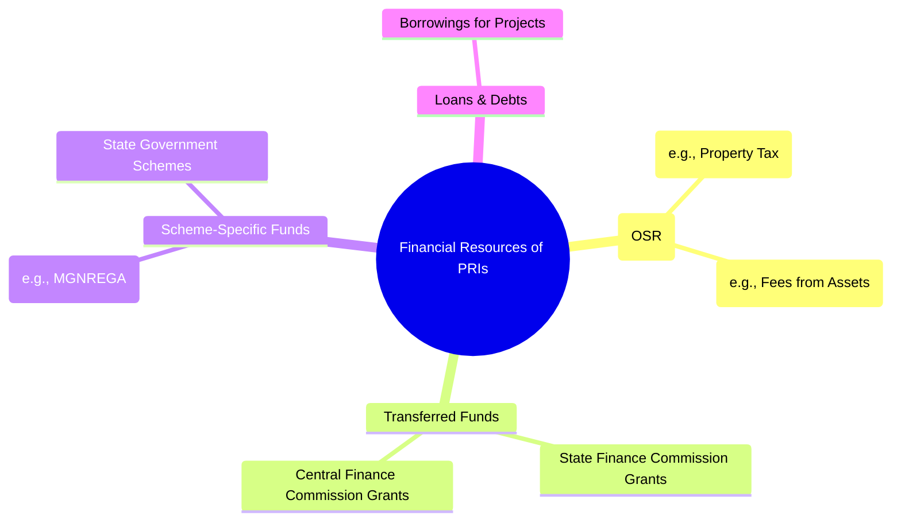
#### **Conclusion (Way Forward)**
In conclusion, the constitutional and legal framework provides for a diverse portfolio of financial resources for Panchayati Raj Institutions. However, the system is marked by an overwhelming dependence on external grants, with the potential of Own Source Revenue remaining largely unrealised. The way forward for strengthening fiscal decentralisation is to enhance the capacity of PRIs to generate their own revenues and to increase the proportion of untied grants, thereby empowering them to transition from mere implementing agencies to genuine institutions of local self-government.

---

## Q8) Describe the Political Decentralisation. 
#### **Introduction**
Political decentralisation is the most comprehensive form of decentralisation, involving the constitutional or statutory devolution of decision-making powers and authority to democratically elected local governments. It is not merely an administrative rearrangement but a fundamental restructuring of the state to deepen democracy. Its core objective is to create a third tier of governance with the autonomy to legislate, plan, and govern on matters of local concern, thereby enhancing citizen participation and state legitimacy.
#### **The Core Concept and Its Dimensions**
Political decentralisation is fundamentally about creating new, autonomous centres of political power at the sub-national level. It aims to institutionalise a system where local communities have a direct and meaningful say in their own governance. This concept is built upon several critical dimensions that distinguish it from weaker forms of decentralisation like deconcentration or delegation. The Balwantrai Mehta Committee (1957) in India captured this essence by coining the term 'democratic decentralisation' to emphasize the need for a genuine transfer of power.
*   **Devolution of Authority:** The cornerstone of political decentralisation is the legal transfer of powers and responsibilities to local bodies. This means local governments are not just implementing agents for higher authorities but have the independent authority to make binding decisions on a range of specified local subjects, as envisioned in the 11th and 12th Schedules of the Indian Constitution.
*   **Electoral Legitimacy:** Local governments derive their legitimacy directly from the people through regular, free, and fair elections. The establishment of independent State Election Commissions under the 73rd and 74th Amendments ensures that local representatives have a direct mandate from their constituents, making them politically accountable to the local populace rather than to the state government.
*   **Creation of Deliberative Forums:** It involves creating formal spaces for citizen engagement and deliberation. The Gram Sabha in rural India is a prime example, constitutionally recognised as a body of all voters in a village. It serves as a platform for direct democracy, where citizens can participate in planning, beneficiary selection, and social audits, thereby influencing local governance directly.
#### **The Significance of Political Decentralisation**
The ultimate purpose of political decentralisation is to make the state more responsive, accountable, and democratic. By bringing political power closer to the people, it transforms the relationship between the citizen and the state.
*   **Enhancing Downward Accountability:** It shifts the primary line of accountability. In a centralised system, officials are accountable upwards to their superiors. In a politically decentralised system, elected local leaders are directly and downwardly accountable to the citizens who elect them. This proximity makes them more responsive to local needs and demands.
*   **Deepening Democratic Representation:** It broadens the base of the political system, creating opportunities for leadership to emerge from the grassroots. The policy of reservations for women and marginalised communities in India's Panchayats is a powerful illustration of how political decentralisation can make the political system more inclusive and representative of society's diversity.
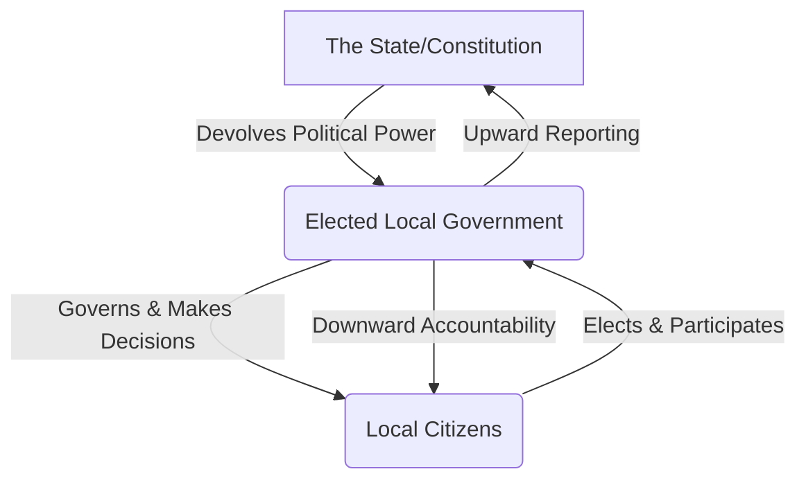
#### **Conclusion (Way Forward)**
In conclusion, political decentralisation is a transformative process aimed at redistributing power from the centre to the periphery, creating autonomous and accountable local governments. It is defined by the devolution of authority, electoral legitimacy, and direct citizen participation. The way forward for strengthening it in contexts like India is to ensure that the formal structures created are matched by a genuine transfer of financial and administrative autonomy, preventing local bodies from becoming mere extensions of state control and allowing them to flourish as true institutions of self-government.

---

## Q9) Discuss the Structure, Powers and Functions of Local Government.
#### **Introduction**
Local government in India, institutionalised as the third tier of governance by the 73rd and 74th Constitutional Amendments, represents the formal structure for democratic decentralisation. It is designed to bring governance to the citizen's doorstep, operating on the principle of subsidiarity. An examination of its structure, powers, and functions reveals a comprehensive framework intended to empower grassroots communities, though the extent of this empowerment varies significantly across states.
#### **The Structure of Local Government**
The Constitution mandates a largely uniform structure for local government, bifurcated into rural and urban bodies to cater to their distinct governance needs. This structure is hierarchical, ensuring connectivity from the grassroots level to the district level.
*   **Panchayati Raj Institutions (PRIs) - Rural:** The 73rd Amendment establishes a three-tier system in most states:
    1.  **Gram Panchayat:** At the village level, serving as the primary unit of local self-government.
    2.  **Panchayat Samiti/Block Panchayat:** At the intermediate or block level, linking the Gram Panchayats to the district.
    3.  **Zila Parishad:** At the apex district level, responsible for coordinating activities across the district.
    The **Gram Sabha**, comprising all registered voters of a village, is the foundation of this entire structure, embodying direct democracy.
*   **Urban Local Bodies (ULBs) - Urban:** The 74th Amendment provides for three types of municipalities based on the size of the urban area:
    1.  **Nagar Panchayat:** For areas transitioning from rural to urban.
    2.  **Municipal Council:** For smaller urban areas.
    3.  **Municipal Corporation:** For large metropolitan cities.
    In larger cities, **Ward Committees** are constituted to facilitate citizen participation at the neighbourhood level.
#### **Powers of Local Government**
The powers of local bodies are not inherent; they are devolved by the state legislature. These powers are crucial for them to function as autonomous institutions and can be broadly categorised into administrative and financial domains.
*   **Administrative and Planning Powers:** Local governments are empowered to prepare and implement plans for economic development and social justice. This includes the power to make by-laws, regulations, and decisions concerning the subjects devolved to them.
*   **Financial Powers:** To ensure fiscal autonomy, local bodies are granted powers to generate their own revenues through taxes (e.g., property tax, market fees), receive grants-in-aid from the State and Central Finance Commissions, and, in some cases, raise loans for development projects.
#### **Functions of Local Government**
The specific functions of local governments are outlined in the Eleventh and Twelfth Schedules of the Constitution, which list the subjects that can be devolved to PRIs and ULBs, respectively.
*   **Functions of PRIs (Eleventh Schedule):** The 29 subjects listed include core rural development activities such as agriculture, minor irrigation, rural housing, drinking water, sanitation, and the management of community assets. They also act as the primary implementing agency for crucial schemes like MGNREGA.
*   **Functions of ULBs (Twelfth Schedule):** The 18 subjects for municipalities focus on urban management, including urban planning, regulation of land use, public health, solid waste management, slum improvement, and the provision of urban amenities like parks and street lighting.

```mermaid
graph TD
    A["Constitutional Mandate (73rd & 74th Amendments)"] --> B{Structure}
    
    B --> C["Rural (PRIs)
    - Zila Parishad
    - Panchayat Samiti
    - Gram Panchayat"]
    
    B --> D["Urban (ULBs)
    - Municipal Corporation
    - Municipal Council
    - Nagar Panchayat"]
    
    B --> E["Powers (Administrative & Financial)"]
    
    E --> F["Functions (11th & 12th Schedules)"]
    
    F --> G(("Goal: Local Self-Governance"))
```
#### **Conclusion (Way Forward)**
In conclusion, the Indian framework provides a robust structure for local government, endowed with a wide range of potential powers and functions. The architecture for grassroots democracy is constitutionally secure. The way forward, however, depends entirely on the political will of state governments to move beyond mere structural creation and genuinely devolve the 'three Fs'—Functions, Finances, and Functionaries. True empowerment lies not in the letter of the law but in the spirit of its implementation.

---
---


