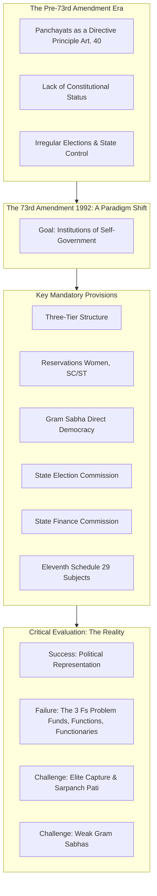
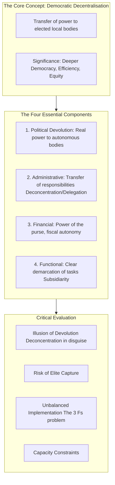
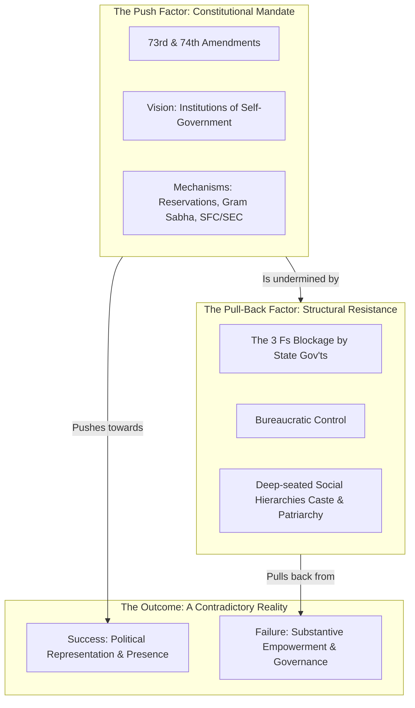

PENDING

Excellent. I have received the PYQ files and have already begun the analysis. The pattern is remarkably clear and consistent, which is excellent news for a strategic approach.

As you suggested, I will fetch the official IGNOU MPA-16 syllabus myself and integrate it into the analysis.

We will now proceed with **Part 1: The Strategic Blueprint**. I will conduct the full, multi-layered analysis of the PYQs and the syllabus, just as we did for the previous subjects. The output will be the definitive strategic plan for MPA-16.

---

### **Part 1: In-depth PYQ Analysis & Strategic Plan for MPA-16: Decentralisation and Local Governance**

This analysis decodes the intellectual structure of the MPA-16 examination to build the most efficient and high-scoring study plan possible.

#### **1. Syllabus Integration: Official IGNOU MPA-16 Syllabus**

First, here is the official syllabus, which serves as our foundational map.

*   **Block 1: Decentralisation: Conceptual Framework**
    *   Unit 1: Decentralisation: Concept, Types and Significance
    *   Unit 2: Evolution of Local Government in India
    *   Unit 3: The Global and National Context of Decentralisation
    *   Unit 4: Components of Decentralisation: Political, Administrative, Functional and Financial

*   **Block 2: Decentralised Development**
    *   Unit 5: Rationale and Requirements of Development Planning
    *   Unit 6: Micro-Level Planning
    *   Unit 7: Sustainable Development and its Challenges
    *   Unit 8: Principles in Distribution of Benefits of Development

*   **Block 3: The Constitutional Framework**
    *   Unit 9: Constitutional Dimensions of Democratic Decentralisation
    *   Unit 10: The 73rd Constitutional Amendment Act
    *   Unit 11: The 74th Constitutional Amendment Act

*   **Block 4: Decentralised Governance: Rural**
    *   Unit 12: Structure and Functions of Panchayati Raj Institutions
    *   Unit 13: Devolution of Powers and Functions to PRIs
    *   Unit 14: Intra-Tier Responsibilities of PRIs
    *   Unit 15: Financial Resources of PRIs

*   **Block 5: Decentralised Governance: Urban**
    *   Unit 16: Organisational Structure of Urban Local Government
    *   Unit 17: Devolution of Powers and Functions to ULBs
    *   Unit 18: Financial Resources of ULBs
    *   Unit 19: Urban Planning

*   **Block 6: Empowerment**
    *   Unit 20: Concept and Significance of Empowerment
    *   Unit 21: People's Participation: Modalities and Challenges
    *   Unit 22: Empowerment of Women
    *   Unit 23: Empowerment of the Weaker Sections (SC/ST)

*   **Block 7: Emerging Issues and Trends**
    *   Unit 24: Role of Government in the Era of Globalisation
    *   Unit 25: Partnership among Local Authorities and Special Purpose Agencies
    *   Unit 26: Capacity-Building of Elected Functionaries
    *   Unit 27: Post-Modernist Critique of Decentralisation

#### **2. Thematic Clustering & Frequency Analysis**

The PYQ analysis reveals a powerful concentration of questions around a few core themes. This is even more pronounced than in the other subjects.

| Thematic Cluster | Core Concepts | Relevant Syllabus Blocks/Units | Frequency Score (Approx.) |
| :--- | :--- | :--- | :--- |
| **1. The Constitutional Core (73rd & 74th)** | Features, provisions, critical analysis, and impact of the **73rd and 74th Constitutional Amendment Acts**. | **Block 3 (Units 10, 11)**, Block 4, Block 5 | **100%** (Guaranteed) |
| **2. The Concept of Decentralisation** | Meaning, significance, evolution, and **types** (Political, Administrative, Financial, Functional). | **Block 1 (Units 1, 4)** | **95%** |
| **3. Challenges to Local Governance** | Problems in devolution, financial constraints, lack of autonomy, strengthening local bodies. The **"3 Fs"** problem. | **Block 4 (Units 13, 15)**, **Block 5 (Units 17, 18)** | **90%** |
| **4. People's Participation & Empowerment** | Modalities of participation, concept of empowerment, problems and constraints in the empowerment process. | **Block 6 (Units 20, 21)** | **80%** |
| **5. Local Planning** | Micro-level planning (issues, constraints), rationale of development planning. | **Block 2 (Units 5, 6)** | **70%** |
| **6. Structures of Local Bodies** | Three-tier system of PRIs, organisational structure of ULBs, powers and functions. | **Block 4 (Unit 12)**, **Block 5 (Unit 16)** | **65%** |
| **7. Partnerships & Governance** | Partnerships between local authorities and Special Purpose Agencies (SPAs) in various sectors. | **Block 7 (Unit 25)** | **50%** |
| **8. Sustainable Development** | Challenges to sustainable development in urban and rural areas. | **Block 2 (Unit 7)** | **40%** |

#### **3. Four-Tier Prioritization & Thematic Breakdown**

This is the definitive, high-confidence prioritization for MPA-16.

**Tier 1: The Foundational Core (The Absolute Must-Knows)**
*   **Theme 1: The Constitutional Framework - The 73rd and 74th Amendments:**
    *   **Core Idea:** This is the sun around which the entire subject orbits. You must know these two amendments inside and out. They are the legal and political foundation of modern local governance in India.
    *   **Topics & Sub-topics:** The key features and provisions of the **73rd Amendment** (Gram Sabha, 3-tier structure, reservations, State Finance Commission, Eleventh Schedule); The key features and provisions of the **74th Amendment** (types of ULBs, Ward Committees, District Planning Committees, Twelfth Schedule); A critical evaluation of their impact and implementation.

*   **Theme 2: The Conceptual Framework of Decentralisation:**
    *   **Core Idea:** Understanding the "what" and "why" of decentralisation. This theme provides the theoretical language for the entire paper.
    *   **Topics & Sub-topics:** The concept, evolution, and significance of democratic decentralisation; The crucial distinction between the four types: **Political, Administrative, Financial, and Functional Decentralisation**.

*   **Theme 3: The Reality Check - Challenges to Decentralisation:**
    *   **Core Idea:** The persistent and critical gap between the constitutional promise and the on-the-ground reality of local governance.
    *   **Topics & Sub-topics:** The critical problem of devolution—the failure to transfer the **"3 Fs" (Funds, Functions, and Functionaries)**; The nature of financial resources of local bodies and their lack of autonomy; Measures for strengthening PRIs and ULBs.

**Tier 2: High Probability & Application**
*   **Theme 4: People's Participation and Empowerment:**
    *   **Core Idea:** The ultimate goal of decentralisation is to empower citizens and deepen democracy. This theme explores the mechanisms and challenges of achieving this.
    *   **Topics & Sub-topics:** The concept and operational framework of **Empowerment**; The various modalities for **people's participation** in local governance (Gram Sabha, social audit, citizen charters); Problems and constraints in the empowerment process (elite capture, lack of awareness).

*   **Theme 5: Decentralised Planning:**
    *   **Core Idea:** The process of planning from the bottom up, as envisioned by the constitutional amendments.
    *   **Topics & Sub-topics:** The rationale and requirements of **development planning**; The issues and constraints in **micro-level planning** (lack of data, technical expertise, political will).

*   **Theme 6: The Structures of Local Government:**
    *   **Core Idea:** The formal organisational machinery of rural and urban local bodies.
    *   **Topics & Sub-topics:** The **three-tier system of Panchayati Raj Institutions** (Gram Panchayat, Panchayat Samiti, Zila Parishad) and their functions; The **organisational structure of Urban Local Government** (Municipal Corporation, Municipality, Nagar Panchayat).

**Tier 3: Conceptual Breadth & Nuance**
*   **Theme 7: Partnerships in Local Governance:**
    *   **Core Idea:** The shift from "government" to "governance," involving non-state actors.
    *   **Topics & Sub-topics:** The nature of partnerships between local authorities and **Special Purpose Agencies (SPAs)** in various sectors (health, education, etc.); The role of NGOs and civil society.

*   **Theme 8: Sustainable Development:**
    *   **Core Idea:** The linkage between local governance and the broader goals of environmental and social sustainability.
    *   **Topics & Sub-topics:** The concept of sustainable development; The challenges to achieving it in urban and rural contexts.

**Tier 4: Strategic Awareness (For Short Notes & Value Addition)**
*   **Capacity-Building:** Measures for training and equipping elected functionaries.
*   **Post-Modernist Critique:** A theoretical critique of the grand narratives of decentralisation.
*   **Specific Programmes:** Case studies like the Bhagidari programme in Delhi.
*   **Principles of Distribution:** Concepts like desert, need, and balance.

#### **4. Key Insights & Strategic Advice**

*   **The 73rd/74th Amendments are Everything:** I cannot overstate this. Every single theme in this paper connects back to the provisions and the implementation (or lack thereof) of these two amendments. Mastering them is the key to unlocking the entire subject.
*   **The "3 Fs" is Your Go-To Critique:** The failure to devolve **Funds, Functions, and Functionaries** is the single most important and universally applicable critical point in this paper. You can and should use it in almost any answer discussing the challenges or reality of local governance in India.
*   **Rural vs. Urban:** Be prepared to compare and contrast the rural (PRI) and urban (ULB) systems. While the principles of the 73rd and 74th amendments are similar, their structures, challenges, and political dynamics are often different.
*   **Structure Your Answers Logically:** A highly effective structure for a 20-mark answer is:
    1.  **Introduction:** Define the core concept (e.g., financial decentralisation).
    2.  **The Ideal/Provision:** Explain what the Constitution or theory says (e.g., the provisions of the 73rd Amendment regarding finances).
    3.  **The Reality/Critique:** Critically analyze the on-the-ground situation (e.g., the failure to devolve funds, the "3 Fs" problem).
    4.  **Suggestions/Way Forward:** Briefly provide some measures for strengthening the system.
    5.  **Conclusion:** Summarize your argument.

This completes Part 1. This strategic plan is robust, verified against a decade of question papers, and tailored to the specific demands of the MPA-16 paper.

Please review this plan. Once you confirm your satisfaction, I will proceed to Part 2 by creating the first sample note on our top-priority Tier 1 theme: **"The 73rd Constitutional Amendment Act."**

---
---


Excellent. We will now proceed with Part 2, the creation of the study notes, beginning with our confirmed top-priority Tier 1 theme.

Here is the comprehensive note on the 73rd Constitutional Amendment Act. It is crafted using our finalized "Note 2.0" model and is designed to serve as a complete, high-scoring answer for any 20-mark question on this foundational topic.

---

# TIER 1

## **Theme 1: The 73rd Constitutional Amendment Act, 1992**

**Syllabus Reference:**
*   **Primary:** Block 3, Unit 10 (The 73rd Constitutional Amendment Act).
*   **Secondary:** Block 3, Unit 9 (Constitutional Dimensions); Block 4 (all units); Block 6 (all units).

#### **Introduction (Argumentative)**

The 73rd Constitutional Amendment Act of 1992 represents a watershed moment and a paradigm shift in the history of democratic decentralisation in India. Moving beyond mere policy rhetoric, the Amendment granted constitutional sanctity to Panchayati Raj Institutions (PRIs), establishing them as the third tier of governance. Its core objective was to transform these bodies from mere agencies of the state government into vibrant and viable "institutions of self-government." Through mandatory provisions for regular elections, reservations for marginalized groups, and the creation of the Gram Sabha as the bedrock of direct democracy, the Act initiated a massive and unprecedented experiment in grassroots empowerment. However, a critical analysis after three decades of implementation reveals a significant and persistent gap between its constitutional promise and the on-the-ground reality, primarily due to the reluctance of state governments to devolve genuine power and resources.

#### **Intellectual Context & Core Argument**

> [!note] From Rhetoric to Constitutional Mandate
> The idea of Panchayati Raj is not new; it was a cherished ideal of the nationalist movement (Gandhi's *Gram Swaraj*) and was included as a non-justiciable Directive Principle (Article 40) in the Constitution. However, for over four decades, various attempts to revitalize panchayats (e.g., Balwantrai Mehta Committee, Ashok Mehta Committee) failed because they lacked constitutional protection and were at the mercy of the political will of state governments. The 73rd Amendment was revolutionary because it shifted PRIs from the realm of state discretion to the realm of **constitutional obligation**.

**1. The Core Objective: "Institutions of Self-Government"**
The primary aim of the Act was to create a framework for the establishment of democratic, empowered, and functional local bodies that could prepare and implement plans for **"economic development and social justice."**

**2. Key Features and Provisions of the Act**
The Amendment introduced a new Part IX to the Constitution, containing several mandatory provisions for all states.

1.  **The Gram Sabha: The Soul of Panchayati Raj:**
    *   The Act mandates the creation of a **Gram Sabha** in every village, consisting of all registered voters.
    *   It is envisioned as the foundation of the PRI system—a forum for **direct democracy** where citizens can participate in decision-making, approve plans and budgets, and conduct social audits.

2.  **A Uniform Three-Tier Structure:**
    *   It established a uniform three-tier system of panchayats at the **village (Gram Panchayat), intermediate (Panchayat Samiti/Block), and district (Zila Parishad)** levels. (States with a population below 20 lakhs have the option of not having the intermediate level).

3.  **Reservations for Social Justice and Empowerment:**
    *   This is one of the most transformative features. It mandates the reservation of seats for **Scheduled Castes (SCs) and Scheduled Tribes (STs)** in proportion to their population at all three levels.
    *   Crucially, it mandates that **not less than one-third of all seats and chairperson positions** at all levels must be reserved for **women**.

4.  **Regular and Fair Elections:**
    *   It mandates a fixed **five-year term** for all panchayats.
    *   It created the **State Election Commission (SEC)** in each state, an independent constitutional body responsible for conducting free and fair elections to all local bodies.

5.  **Financial Devolution:**
    *   It created the **State Finance Commission (SFC)**, to be constituted every five years.
    *   The SFC's role is to review the financial position of the panchayats and recommend the principles for the distribution of taxes between the state and the panchayats, and for providing grants-in-aid.

6.  **Powers and Functions (The Eleventh Schedule):**
    *   The Act added the **Eleventh Schedule** to the Constitution, which lists **29 subjects** on which powers and responsibilities can be devolved to the panchayats (e.g., agriculture, minor irrigation, rural housing, drinking water, poverty alleviation programmes).

#### **Critical Evaluation: The Promise vs. The Performance**

While the 73rd Amendment has been a resounding success in creating a new layer of political representation, its performance in achieving genuine self-governance has been deeply flawed.

1.  **The "3 Fs" Failure (The Master Critique):** The single biggest obstacle has been the failure of state governments to devolve the "3 Fs":
    *   **Funds:** PRIs remain financially starved and overwhelmingly dependent on discretionary grants from the state and central governments. They have very limited powers to raise their own revenue, crippling their autonomy.
    *   **Functions:** States have been extremely reluctant to transfer the 29 subjects in a meaningful way. Most key functions are still controlled by state government line departments and their parallel bureaucracies.
    *   **Functionaries:** The administrative and technical staff working at the local level remain under the control of the state bureaucracy, not the elected panchayat leaders. The Panchayat Secretary, a state government employee, often wields more real power than the elected Sarpanch.

2.  **The Problem of Elite Capture:** Despite reservations, PRIs are often captured by traditional rural elites (dominant castes, large landowners). The phenomenon of **"Sarpanch Pati"** (husbands of elected women Sarpanches exercising power on their behalf) is a widespread challenge to genuine women's empowerment.

3.  **Weakening of the Gram Sabha:** In many places, the Gram Sabha has been reduced to a rubber stamp, with low attendance and a lack of real power to hold the Gram Panchayat accountable.

4.  **Inadequate Capacity-Building:** There has been a general failure to provide adequate training and capacity-building for the millions of newly elected representatives, many of whom are first-generation leaders from marginalized communities.

#### **Conclusion (Synthesizing)**

The 73rd Amendment was a constitutional masterpiece that laid the institutional groundwork for the world's largest experiment in grassroots democracy. Its success in creating a new tier of political representation, especially for women and marginalized communities, is undeniable and transformative. However, the dream of turning PRIs into genuine "institutions of self-government" remains largely unfulfilled. The deep-rooted resistance from state-level political and bureaucratic establishments to devolve real power—particularly financial power—has rendered many panchayats weak and ineffective. The ongoing challenge, therefore, is to move beyond the formal letter of the Amendment and fight for its implementation in spirit, ensuring that power truly shifts from the state capitals to the village councils.

#### **Comprehensive Mermaid Diagram**



---

#### **Bulletproof Add-ons**

<br>

> [!book] **Conceptual Toolkit**
> 1.  **Democratic Decentralisation:** The transfer of power and responsibility from the central government to subordinate, democratically elected local bodies.
> 2.  **Panchayati Raj Institutions (PRIs):** The three-tier system of rural local self-government in India.
> 3.  **Gram Sabha:** A body consisting of all persons registered in the electoral rolls of a village; the foundation of direct democracy in the PRI system.
> 4.  **Devolution:** The transfer of power (legislative, administrative, and financial) from a higher level of government to a lower level, giving the lower level a degree of autonomous authority.
> 5.  **Eleventh Schedule:** The schedule added to the Constitution by the 73rd Amendment, which lists 29 subjects that can be devolved to Panchayats.

<br>

> [!eye] **Thinker's Lens**
> 1.  **Gandhian Lens:** From a Gandhian perspective, the 73rd Amendment is the most significant step towards realizing the dream of ***Gram Swaraj*** (village self-rule). The emphasis on the Gram Sabha, in particular, aligns perfectly with Gandhi's vision of a republic built from the bottom up, with each village being a self-sufficient unit.
> 2.  **Public Administration Lens:** From this perspective, the key challenge is the tension between the new political executive (the elected Sarpanch and members) and the old permanent executive (the state bureaucracy). The failure to create a dedicated local government cadre and the continued control of the state bureaucracy over local functionaries is seen as a major administrative flaw that undermines the principle of decentralisation.

<br>

> [!link] **Cross-Linkages**
> 1.  **Connects to:**
>     1.  **Theme 3 (Challenges):** The "3 Fs" critique is the direct application of this theme.
>     2.  **Theme 4 (Empowerment):** The reservation provisions are the primary mechanism for empowerment discussed in this theme.
>     3.  **Theme 5 (Planning):** The mandate for PRIs to create plans for "economic development and social justice" is the basis for micro-level planning.
> 2.  **Contrasts with:**
>     1.  **Theme 1 (74th Amendment):** Provides the basis for a comparative analysis of rural vs. urban local governance frameworks.

---

## **Quick Revision Scaffold**

## The 73rd Constitutional Amendment Act

### 1. Core Idea
- **Goal:** To create constitutionally protected **"Institutions of Self-Government"** (PRIs).
- **Shift:** From state discretion to **constitutional obligation**.

### 2. Key Provisions
1.  **Gram Sabha:** Foundation of **direct democracy**.
2.  **Three-Tier Structure:** Village, Intermediate, District.
3.  **Reservations:** For SC/STs (by population) and **1/3 for Women**.
4.  **Regular Elections:** Fixed 5-year term, managed by **State Election Commission**.
5.  **Finance:** **State Finance Commission** to recommend devolution.
6.  **Functions:** **Eleventh Schedule** lists 29 subjects for devolution.

### 3. Critical Evaluation: Promise vs. Performance
- **Success:** Huge increase in **political representation**, especially for women.
- **Failures & Challenges:**
    1.  **The "3 Fs" Problem:** Failure to devolve **Funds, Functions, Functionaries**. This is the master critique.
    2.  **Elite Capture:** Dominant castes and **"Sarpanch Pati"** phenomenon.
    3.  **Weak Gram Sabhas:** Often reduced to a rubber stamp.
    4.  **Lack of Capacity-Building** for new representatives.

### 4. Conclusion
- A landmark for **political decentralisation** but a limited success in achieving **functional and financial decentralisation**.
- The struggle for genuine devolution continues.

---
---


Excellent. We will now proceed with the next core theme from Tier 1.

Having established the "how" of decentralisation with the 73rd Amendment, we now turn to the "what" and "why." This note covers the foundational theoretical concepts of decentralisation, providing the essential vocabulary and analytical framework for the entire subject.

Here is the comprehensive note on the Conceptual Framework of Decentralisation, following our established "Note 2.0" model.

---

## **Theme 2: The Conceptual Framework of Decentralisation**

**Syllabus Reference:**
*   **Primary:** Block 1, Unit 1 (Decentralisation: Concept, Types and Significance); Block 1, Unit 4 (Components of Decentralisation).
*   **Secondary:** Block 1, Unit 2 (Evolution of Local Government in India).

#### **Introduction (Argumentative)**

Decentralisation has emerged as a dominant paradigm in modern public administration and democratic theory, representing a fundamental shift away from the top-down, centralised models of the post-war era. At its core, **democratic decentralisation** is the meaningful transfer of power and authority from central governments to lower, democratically elected local bodies, bringing governance closer to the people. It is not a monolithic concept but a complex, multi-dimensional process encompassing distinct **political, administrative, financial, and functional** components. While lauded for its potential to deepen democracy, enhance administrative efficiency, and promote equitable development, a critical analysis reveals that its success is contingent on the genuine and balanced implementation of all its components, a condition that often remains elusive in practice.

#### **Intellectual Context & Core Argument**

> [!note] The Rationale for Decentralisation
> The global push for decentralisation since the 1980s was driven by a convergence of factors:
> 1.  **The Crisis of the Centralised State:** Overly centralised planning was increasingly seen as inefficient, unresponsive, and unable to cope with diverse local needs.
> 2.  **The "Good Governance" Agenda:** International development agencies (like the World Bank) promoted decentralisation as a key component of "good governance," linking it to transparency, accountability, and participation.
> 3.  **The Third Wave of Democracy:** The global spread of democracy created popular demand for greater citizen participation and control over local affairs.

**1. Defining Democratic Decentralisation: Concept and Significance**
Democratic decentralisation is the transfer of governance authority to local bodies that are representative, accountable, and autonomous.

*   **Significance:** Its importance lies in its potential to:
    *   **Deepen Democracy:** By creating avenues for citizen participation at the grassroots level.
    *   **Enhance Administrative Efficiency:** By allowing local solutions for local problems, cutting through central bureaucratic red tape.
    *   **Ensure Equity and Social Justice:** By giving a voice to marginalized groups and enabling more responsive delivery of welfare services.
    *   **Act as a "School of Democracy":** Local government provides a training ground for citizens and future political leaders.

**2. The Four Core Components of Decentralisation**
For decentralisation to be effective, it must occur across four interrelated dimensions. The failure to address any one of these can undermine the entire process.

1.  **Political Decentralisation (or Devolution):**
    *   **Core Idea:** This is the most crucial and genuine form of decentralisation. It involves the transfer of **real power and authority** to local government units that are autonomous, independent, and democratically elected.
    *   **Mechanism:** This is what the **73rd and 74th Amendments** sought to achieve by creating a constitutionally protected sphere for PRIs and ULBs.
    *   **Key Feature:** The local bodies have the legal authority to make binding decisions within their jurisdiction.

2.  **Administrative Decentralisation:**
    *   **Core Idea:** This involves the transfer of administrative responsibilities from central government ministries to lower levels of government or other organisations. It has two main sub-types:
    *   **Deconcentration (Weakest Form):** Shifting workloads and responsibilities from the central ministry headquarters to its own **field offices** at the regional or local level. Power remains within the central government hierarchy (e.g., a District Collector acting as an agent of the state government).
    *   **Delegation:** Transferring responsibility for specific functions to organisations that are outside the regular central government structure but are ultimately accountable to it. **Special Purpose Agencies (SPAs)** or parastatal bodies are classic examples.

3.  **Financial Decentralisation:**
    *   **Core Idea:** This is the "power of the purse." It involves providing local governments with adequate financial resources and the autonomy to manage them.
    *   **Mechanism:** This includes the power to levy and collect local taxes, receive unconditional grants from higher levels of government (as recommended by **State Finance Commissions**), and plan their own budgets.
    *   **The Litmus Test:** The degree of financial autonomy is often considered the true litmus test of decentralisation. Without it, political decentralisation is meaningless.

4.  **Functional Decentralisation:**
    *   **Core Idea:** This involves the clear and unambiguous demarcation of functions and responsibilities among different levels of government.
    *   **Mechanism:** It requires identifying which tasks are best performed at the central, state, and local levels (the **Principle of Subsidiarity**). The **Eleventh and Twelfth Schedules** of the Indian Constitution are a framework for functional decentralisation.
    *   **The Goal:** To avoid confusion, overlap, and the encroachment of higher levels of government on the legitimate domain of local bodies.

#### **Critical Evaluation**

The concept of decentralisation is powerful in theory but fraught with challenges in practice.

1.  **The Illusion of Devolution:** Often, what is presented as "devolution" (political decentralisation) is merely "deconcentration" (administrative decentralisation). Central governments create the appearance of local power while keeping real control firmly in the hands of their own bureaucrats.
2.  **The Risk of Elite Capture:** Decentralising power does not automatically mean it will reach the most marginalized. Power can be captured by local elites (dominant castes, landlords, political strongmen) who may use the new structures for their own benefit.
3.  **Unbalanced Implementation:** The most common failure is unbalanced implementation. Governments may enact political decentralisation (hold elections) but deliberately withhold financial and functional decentralisation, creating elected local bodies that are powerless and dependent. This is the core of the **"3 Fs" problem** in India.
4.  **Capacity Constraints:** Local bodies often lack the technical, administrative, and planning capacity to effectively carry out the functions devolved to them.

#### **Conclusion (Synthesizing)**

Decentralisation is far more than a simple administrative reform; it is a profound political project aimed at reconfiguring the relationship between the state and its citizens. Understanding its four key components—political, administrative, financial, and functional—is essential for analyzing its implementation. The Indian experience, particularly after the 73rd and 74th Amendments, demonstrates that while establishing the political framework for decentralisation is a necessary first step, it is insufficient. Genuine decentralisation requires a simultaneous and sincere commitment to empowering local bodies with the autonomous funds, functions, and functionaries needed to transform them into true institutions of self-government.

#### **Comprehensive Mermaid Diagram**



---

#### **Bulletproof Add-ons**

<br>

> [!book] **Conceptual Toolkit**
> 1.  **Devolution:** The transfer of power and authority to an autonomous, independent, and democratically accountable lower level of government. The strongest form of decentralisation.
> 2.  **Deconcentration:** The transfer of workload and administrative responsibility to field offices of the same central government department. The weakest form.
> 3.  **Delegation:** The transfer of responsibility for specific tasks to semi-autonomous bodies (like SPAs) that are still ultimately accountable to the central government.
> 4.  **Elite Capture:** A process whereby the benefits of a public policy or institution (like a panchayat), intended for the poor, are usurped by dominant and powerful groups in a community.
> 5.  **Principle of Subsidiarity:** The idea that public functions should be handled by the lowest competent authority, and the central government should only perform those tasks that cannot be performed effectively at a more local level.

<br>

> [!eye] **Thinker's Lens**
> 1.  **Public Choice Theory Lens:** This school of thought would strongly support decentralisation. It argues that a system with many local governments creates competition, making them more responsive and efficient in delivering public services that match the specific preferences of their local "customers" (citizens).
> 2.  **Marxist Lens:** A Marxist would be skeptical. They might view decentralisation as a strategy of the capitalist state to manage conflict and legitimize itself without fundamentally altering the class structure. It can be a way to offload responsibility for social welfare onto under-funded local bodies, thus rolling back the welfare state.

<br>

> [!link] **Cross-Linkages**
> 1.  **Connects to:**
>     1.  **Theme 1 (73rd/74th Amendments):** This note provides the theoretical vocabulary to analyze the amendments. The amendments are an attempt at **Political, Functional, and Financial** decentralisation.
>     2.  **Theme 3 (Challenges):** The "3 Fs" problem is a direct result of **unbalanced decentralisation**, where political decentralisation is not matched by financial and functional decentralisation.
> 2.  **Informs:**
>     1.  **Theme 7 (Partnerships):** The use of **Special Purpose Agencies (SPAs)** is a form of **Delegation** (a sub-type of administrative decentralisation).

---

## **Quick Revision Scaffold**

## The Conceptual Framework of Decentralisation

### 1. Core Idea
- **Definition:** Transfer of power from central to **democratically elected** local bodies.
- **Significance:** Deepens democracy, improves efficiency, promotes equity.

### 2. The Four Key Components
1.  **Political (Devolution):**
    - **Strongest form.**
    - Transfer of **real power** to autonomous, elected bodies.
    - *Example:* The constitutional status of PRIs/ULBs.

2.  **Administrative:**
    - Transfer of tasks/responsibilities.
    - **Deconcentration (Weakest):** To field offices of the same ministry.
    - **Delegation:** To semi-autonomous agencies (SPAs).

3.  **Financial:**
    - The "power of the purse."
    - Fiscal autonomy: power to tax, receive grants, make budgets.
    - **The litmus test of real decentralisation.**

4.  **Functional:**
    - Clear division of who does what.
    - Based on the **Principle of Subsidiarity**.
    - *Example:* The 11th and 12th Schedules.

### 3. Critical Evaluation
- **Illusion vs. Reality:** Often deconcentration is disguised as devolution.
- **Elite Capture:** Local power can be seized by dominant groups.
- **Unbalanced Implementation:** The core of the **"3 Fs" problem**.
- **Capacity Constraints:** Local bodies may lack skills and staff.

### 4. Conclusion
- Success depends on the **balanced and genuine** transfer of all four components.

---
---

Excellent. We have now completed the theoretical and constitutional foundations of the subject. This brings us to the third and final pillar of the Tier 1 core: the critical analysis of *why* this grand vision often fails in practice.

This note is arguably the most important one for scoring high marks, as it provides the master key for the "critical evaluation" part of almost any question in the exam. It focuses on the central, recurring problems that plague local governance in India.

Here is the comprehensive note on the challenges to decentralisation, built around the crucial "3 Fs" framework.

---

## **Theme 3: The Reality Check - Challenges to Decentralisation**

**Syllabus Reference:**
*   **Primary:** Block 4, Unit 13 (Devolution of Powers and Functions to PRIs); Block 4, Unit 15 (Financial Resources of PRIs); Block 5, Unit 17 (Devolution of Powers and Functions to ULBs); Block 5, Unit 18 (Financial Resources of ULBs).
*   **Secondary:** Block 6 (all units, as a contextual problem).

#### **Introduction (Argumentative)**

While the 73rd and 74th Constitutional Amendments created a robust formal framework for democratic decentralisation, the journey towards genuine local self-governance in India has been fraught with immense challenges. The revolutionary promise of the amendments has been systematically undermined by a deep-seated reluctance on the part of state-level political and bureaucratic establishments to relinquish real power. This has created a "form without substance" predicament, where local bodies exist politically but lack the functional, financial, and administrative autonomy to be effective. The core of this problem can be brilliantly encapsulated in the critical framework of the **"3 Fs": the failure to devolve Funds, Functions, and Functionaries**, which remains the single greatest obstacle to the success of decentralisation in India.

#### **Intellectual Context & Core Argument**

> [!note] The Centralising Tendency
> The challenges to decentralisation are not accidental; they are rooted in the historical structure of the Indian state. The legacy of a highly centralised colonial administration, combined with the post-independence emphasis on a strong central government for nation-building and planned development, created a powerful "centralising tendency." State governments, having fought for their own autonomy from the Centre, are now unwilling to cede that same autonomy to a third tier of government, viewing it as a threat to their own power and patronage networks.

**1. The "3 Fs": The Unholy Trinity of Disempowerment**
The failure of decentralisation can be most effectively analyzed through the interconnected problems of the 3 Fs.

**A. The Failure of Functional Devolution (Functions):**
*   **The Promise:** The Eleventh and Twelfth Schedules list 29 and 18 subjects, respectively, to be devolved to PRIs and ULBs to enable them to function as institutions of self-government.
*   **The Reality:** This devolution has been, at best, partial and, at worst, illusory.
    1.  **Ambiguous Transfer:** State governments have often transferred responsibilities without transferring the necessary authority or control over the related assets and institutions.
    2.  **Creation of Parallel Bodies:** States continue to operate through their own line departments (e.g., Health, Education) and powerful **parastatal agencies** or **Special Purpose Vehicles (SPVs)** that bypass local governments, especially for major projects.
    3.  **Activity Mapping:** There is a widespread failure to conduct "activity mapping," a crucial exercise that clearly defines which specific tasks within a broad subject (like "health") will be handled by the Gram Panchayat, the Block, and the Zila Parishad, leading to confusion and overlap.

**B. The Crisis of Financial Devolution (Funds):**
*   **The Promise:** The amendments envisioned financially robust local bodies with their own sources of revenue, supplemented by a predictable and fair transfer of funds from the state, as recommended by the State Finance Commissions (SFCs).
*   **The Reality:** This is the most critical failure. Local bodies are financially starved and dependent.
    1.  **Limited Own-Source Revenue:** The power to levy significant taxes (like property tax in urban areas) is often limited by state-imposed caps, and the political will to collect them is weak.
    2.  **Dependence on Tied Grants:** The vast majority of funds received by local bodies are **"tied grants"** from central and state schemes. This reduces them to mere **"implementing agencies"** with no discretion to plan according to local needs, instead of being self-governing bodies.
    3.  **Ineffective SFCs:** The recommendations of the State Finance Commissions are often not taken seriously or are implemented with long delays by state governments, defeating their very purpose.

**C. The Lack of Administrative Devolution (Functionaries):**
*   **The Promise:** For local bodies to be autonomous, they must have administrative control over the staff who implement their decisions.
*   **The Reality:** This is a classic case of **dual control and divided loyalty**.
    1.  **Bureaucratic Supremacy:** The key administrative and technical staff at the local level (e.g., the Panchayat Secretary, the Block Development Officer, the Municipal Commissioner) are state government employees.
    2.  **Accountability to the State, Not the People:** These officials are accountable to their superiors in the state bureaucracy for their career progression, not to the elected local leaders. This creates a situation where the permanent, unelected executive often wields more power than the elected political executive, completely subverting the principle of democratic accountability.

**2. Other Major Challenges**

While the 3 Fs are central, other significant problems compound the issue:

1.  **Elite Capture:** Decentralised power is often captured by local strongmen and dominant caste groups, who use the new institutions to further their own interests and exclude the marginalized. The **"Sarpanch Pati"** phenomenon is a stark example of the subversion of women's reservations.
2.  **Lack of Capacity:** Millions of elected representatives, especially women and those from SC/ST communities, often lack the education, training, and information needed to navigate complex administrative and financial rules, making them dependent on officials.
3.  **Weak Citizen Participation:** The Gram Sabha, the cornerstone of direct democracy, often suffers from low attendance and is treated as a formality, failing in its role as a watchdog.

#### **Conclusion (Synthesizing)**

The story of decentralisation in India is a classic tale of a revolutionary idea being constrained by a resistant political and administrative structure. While the constitutional framework for local self-government is in place, the "steel frame" of the state has refused to yield the vital resources—the Funds, Functions, and Functionaries—that would give it life. This has created a system of "decentralisation by halves," which has deepened political representation but has failed to deliver genuine self-governance. The future of Indian democracy hinges on resolving this fundamental contradiction and fulfilling the constitutional mandate not just in letter, but in spirit.

#### **Comprehensive Mermaid Diagram**

```mermaid
graph TD
    subgraph A [The Constitutional Promise (73rd/74th Amendments)]
        A1[Empowered "Institutions of Self-Government"]
    end

    subgraph B [The Central Challenge: The "3 Fs" Blockage]
        B1[1. No Real Transfer of FUNCTIONS (Bypassed by State agencies)]
        B2[2. No Real Transfer of FUNDS (Dependence on Tied Grants)]
        B3[3. No Real Control over FUNCTIONARIES (Bureaucratic Supremacy)]
    end

    subgraph C [Compounding Problems]
        C1[Elite Capture & "Sarpanch Pati"]
        C2[Lack of Capacity-Building]
        C3[Weak Citizen Participation]
    end

    subgraph D [The Result: Weak & Ineffective Local Bodies]
        D1["Form without Substance"]
        D2["Implementation Agencies, not Self-Governing Institutions"]
    end

    A --Blocked by--> B;
    B --Worsened by--> C;
    B & C --> D;
```

---

#### **Bulletproof Add-ons**

<br>

> [!book] **Conceptual Toolkit**
> 1.  **The 3 Fs:** The shorthand for **Funds, Functions, and Functionaries**. The most crucial framework for critiquing the implementation of decentralisation in India.
> 2.  **Tied vs. Untied Grants:** **Tied grants** are funds given for a specific, pre-determined purpose, offering no flexibility. **Untied grants** can be used by the local body according to its own priorities. The dominance of tied grants is a major problem.
> 3.  **Parastatal / Special Purpose Agency (SPA):** A state-owned and controlled agency created for a specific function (e.g., a city's Water Board or Development Authority) that often operates with more power and resources than the elected local body.
> 4.  **Activity Mapping:** The process of dissecting a broad subject (like "education") into specific activities and clearly assigning responsibility for each activity to the appropriate tier of local government.
> 5.  **Dual Control:** The problematic situation where local government staff are accountable to both their elected local superiors and their administrative superiors in the state bureaucracy.

<br>

> [!eye] **Thinker's Lens**
> 1.  **Federalism Lens:** The challenges to decentralisation in India can be seen as a problem of **"asymmetrical federalism."** The Indian system has a strong unitary bias, and the states, which are subordinate to the Centre in many ways, treat the local bodies as their own subordinate agencies rather than as a genuine third tier of the federal system.
> 2.  **Elite Theory Lens:** This perspective would argue that the failure to devolve power is not an accident but a deliberate strategy by the **"state-level elite"** (MLAs, ministers, senior bureaucrats). They see empowered local bodies as a direct threat to their own networks of patronage, power, and rent-seeking, and therefore actively work to keep them weak.

<br>

> [!link] **Cross-Linkages**
> 1.  **Connects to:**
>     1.  **Theme 1 (73rd/74th Amendments):** This note is the direct and essential critique of the implementation of those amendments.
>     2.  **Theme 2 (Conceptual Framework):** It shows what happens when decentralisation is **unbalanced**—when political decentralisation is not matched by the other components.
> 2.  **Informs:**
>     1.  **Theme 4 (Empowerment):** The lack of the "3 Fs" is the single biggest constraint on the empowerment of elected representatives, especially women and Dalits.

---

## **Quick Revision Scaffold**

## The Challenges to Decentralisation

### 1. Core Problem
- A huge gap between the **constitutional promise** and the **on-the-ground reality**.
- State governments are reluctant to devolve real power.

### 2. The "3 Fs" Framework (The Master Critique)
1.  **FUNCTIONS:**
    - Devolution is ambiguous and partial.
    - State creates **parallel bodies (parastatals/SPAs)** that bypass local governments.
2.  **FUNDS:**
    - Local bodies are financially starved.
    - Over-dependent on **tied grants**, making them mere "implementing agencies."
    - **State Finance Commissions (SFCs)** are often ignored.
3.  **FUNCTIONARIES:**
    - Staff are controlled by the **state bureaucracy**, not elected local leaders.
    - Problem of **dual control** and bureaucratic supremacy.

### 3. Other Major Challenges
- **Elite Capture** (dominant castes, "Sarpanch Pati").
- **Lack of Capacity-Building** and training for representatives.
- **Weak Citizen Participation** (Gram Sabhas are often ineffective).

### 4. Conclusion
- The result is **"form without substance."**
- We have political representation, but not genuine self-governance.
- The core issue is the political will of state governments.

---
---

Excellent. We will now proceed with the Tier 2 notes.

This note covers the first and most important theme from this tier: **People's Participation and Empowerment**. This topic is the philosophical and practical heart of decentralisation. It explores the ultimate "why" behind the entire project—to deepen democracy and empower citizens—and examines the mechanisms and challenges involved.

Here is the comprehensive note, following our enhanced "Note 2.0" model.

---

# TIER 2

## **Theme 4: People's Participation and Empowerment**

**Syllabus Reference:**
*   **Primary:** Block 6, Unit 20 (Concept and Significance of Empowerment); Block 6, Unit 21 (People's Participation: Modalities and Challenges).
*   **Secondary:** Block 3 (all units, as the framework for empowerment).

#### **Introduction (Argumentative)**

People's participation and empowerment are the twin pillars upon which the entire edifice of democratic decentralisation rests. They represent the ultimate objective of shifting citizens from being passive recipients of state-delivered services to active agents in their own governance. The 73rd and 74th Amendments provided a powerful operational framework to achieve this, primarily through the institutionalisation of the **Gram Sabha** as a forum for direct democracy and the use of **political reservations** to empower women and marginalized communities. However, while these mechanisms have successfully created formal spaces for participation and representation, a critical analysis reveals that making this participation *substantive* and this empowerment *genuine* remains a profound challenge, constantly undermined by deep-seated social hierarchies, bureaucratic resistance, and elite capture.

#### **Intellectual Context & Core Argument**

> [!note] From Representative to Participatory Democracy
> The focus on participation marks a significant evolution in democratic theory.
> 1.  **Representative Democracy:** The traditional model where citizens' role is limited to electing representatives every few years.
> 2.  **Participatory Democracy:** A more robust model that argues for the ongoing, direct involvement of citizens in the decision-making processes that affect their lives. Decentralisation is the primary vehicle for achieving this, moving power from distant capitals to local communities.

**1. The Concept and Framework of Empowerment**
Empowerment is the process of enhancing the capacity of individuals or groups to make choices and to transform those choices into desired actions and outcomes.

1.  **A Multi-Dimensional Process:** It is not just about political power. It encompasses:
    *   **Social Empowerment:** Challenging social hierarchies like caste and patriarchy.
    *   **Economic Empowerment:** Gaining control over economic resources and livelihoods.
    *   **Political Empowerment:** Having a voice and influence in decision-making processes.
2.  **The Operational Framework in India:** The 73rd/74th Amendments are the primary framework. The most potent tool for empowerment within them is **political reservation**.
    *   **The Logic of Reservation:** By mandating the reservation of seats and chairperson positions for women, SCs, and STs, the amendments ensure their **presence** in the formal structures of power from which they were historically excluded.
    *   **The Goal:** The goal is that this "presence" will translate into a "voice," allowing them to articulate their interests and influence policy outcomes.

**2. The Modalities of People's Participation**
Participation is the practical action through which empowerment is exercised. The framework for decentralisation provides several key modalities (methods).

1.  **The Gram Sabha (The Cornerstone):**
    *   This is the only institution of **direct democracy** in India's representative system. It is the assembly of all voters in a village.
    *   **Functions:** It is supposed to be the key platform for participatory planning (approving development plans), financial accountability (approving budgets and utilization certificates), and transparency (conducting social audits).

2.  **Ward Committees (Urban Equivalent):**
    *   The 74th Amendment provides for the creation of Ward Committees in larger urban areas to facilitate citizen participation at the neighborhood level.

3.  **Social Audit:**
    *   A powerful tool for accountability where citizens have the right to audit official records and verify that public works and expenditures have been carried out as reported. It is a legally mandated part of schemes like MGNREGA.

4.  **Other Modalities:** These include participatory budgeting, citizen charters, public hearings, and the use of the Right to Information (RTI) Act to demand accountability from local bodies.

**3. Problems and Constraints: The Gap Between Ideal and Reality**
Despite the robust formal framework, genuine participation and empowerment face formidable obstacles.

1.  **Elite Capture and Social Hierarchies:** Local power structures are often controlled by dominant castes and wealthy families. They can co-opt the panchayat system, control its resources, and silence the voices of the marginalized, making a mockery of participation.
2.  **The Scourge of Patriarchy ("Sarpanch Pati"):** This is the most visible challenge to women's empowerment. Elected women representatives are often reduced to rubber stamps, with their male relatives (husbands, fathers, sons) exercising real power on their behalf.
3.  **Bureaucratic Apathy and Resistance:** Government officials, accustomed to a top-down administrative culture, are often unwilling to share information and power with elected representatives and ordinary citizens, whom they may view as uneducated or incapable.
4.  **Lack of Awareness and Capacity:** A significant portion of the population, including many elected representatives, is not fully aware of their powers, roles, and responsibilities under the Panchayati Raj Acts. This, combined with low literacy levels, makes effective participation difficult.

#### **Conclusion (Synthesizing)**

People's participation and empowerment are the soul of the decentralisation project. The constitutional amendments have successfully created the *spaces* for this to happen, bringing millions of previously excluded individuals into the formal political arena. This in itself is a silent revolution. However, creating spaces is not enough. The challenge now is to make these spaces truly effective. This requires a concerted effort to combat the deep-rooted structures of social and patriarchal power, to build the capacity of elected representatives, and to foster a political and administrative culture that treats citizens as partners in governance, not just as beneficiaries. The journey from formal participation to substantive empowerment is the long and arduous path that Indian democracy must now walk.

#### **Comprehensive Mermaid Diagram**

**Diagram: The Process and Challenges of Empowerment & Participation**
```mermaid
graph TD
    subgraph A [The Goal: Democratic Decentralisation]
        A1[Empowerment: From Passive Beneficiary to Active Agent]
    end

    subgraph B [The Mechanisms & Modalities]
        B1[Mechanism 1: Political Reservations (for Women, SC/ST)]
        B2[Mechanism 2: People's Participation]
        B2 -- Leads to Modalities --> B3[1. Gram Sabha (Direct Democracy)]
        B2 -- Leads to Modalities --> B4[2. Social Audit (Accountability)]
        B2 -- Leads to Modalities --> B5[3. Ward Committees (Urban)]
    end

    subgraph C [The Constraints & Blockages]
        C1[Elite Capture (Dominant Castes)]
        C2[Patriarchy ("Sarpanch Pati")]
        C3[Bureaucratic Resistance]
        C4[Lack of Awareness & Capacity]
    end

    subgraph D [The Outcome]
        D1[Formal Representation Achieved]
        D2[Substantive Empowerment Remains a Challenge]
    end

    A --> B;
    B --Blocked by--> C;
    C --> D;
```

---

#### **Bulletproof Add-ons**

<br>

> [!book] **Conceptual Toolkit**
> 1.  **Empowerment:** The process of increasing the capacity of individuals or groups to make choices and to transform those choices into desired actions and outcomes.
> 2.  **People's Participation:** The active involvement of citizens in the decision-making, planning, implementation, and evaluation of policies and programmes that affect their lives.
> 3.  **Social Audit:** A process that allows citizens to scrutinize and verify the implementation of government schemes by comparing official records with the ground reality.
> 4.  **Elite Capture:** The process by which local power structures and resources, often intended for the wider community, are controlled and monopolized by dominant social or economic groups.
> 5.  **Substantive vs. Formal Participation:** **Formal participation** is being present in a meeting or having the right to vote. **Substantive participation** is having a real, effective influence on the final decision.

<br>

> [!eye] **Thinker's Lens**
> 1.  **Amartya Sen's Capability Approach:** This provides a powerful theoretical framework for understanding empowerment. From this perspective, empowerment is about expanding the **"capabilities"** of the poor and marginalized—their real freedoms to choose and live a life they value. Political reservations and participation are crucial means to expand these capabilities by giving them greater agency and voice.
> 2.  **Feminist Lens:** A feminist analysis of the reservation for women in PRIs would highlight its contradictory outcomes. On the one hand, it is a historic step that has brought millions of women into public life (**"presence"**). On the other hand, the "Sarpanch Pati" phenomenon shows how patriarchal structures adapt to neutralize this presence, preventing it from becoming genuine power (**"voice"**).

<br>

> [!link] **Cross-Linkages**
> 1.  **Connects to:**
>     1.  **Theme 1 (73rd Amendment):** The provisions for reservations and the Gram Sabha are the direct legal basis for empowerment and participation.
>     2.  **Theme 3 (Challenges):** The failure to devolve the "3 Fs" is a major constraint on empowerment. An elected Sarpanch without control over funds or functionaries is a disempowered leader.
> 2.  **Informs:**
>     1.  **Tier 4 (Capacity-Building):** Capacity-building is a direct policy response to the problem of the lack of awareness and skills among elected representatives, which is a major barrier to their empowerment.

---

## **Quick Revision Scaffold**

## People's Participation & Empowerment

### 1. Core Idea
- The ultimate goal of decentralisation: moving citizens from **passive beneficiaries** to **active agents**.
- A shift from **representative** to **participatory** democracy.

### 2. Empowerment
- **Definition:** Enhancing the capacity to make choices and act on them.
- **Key Mechanism in India:** **Political Reservations** in PRIs/ULBs for women, SCs, and STs. This ensures their *presence* in power structures.

### 3. People's Participation
- **Definition:** Citizens' involvement in decision-making.
- **Key Modalities (Methods):**
    1.  **Gram Sabha:** The cornerstone of **direct democracy**.
    2.  **Social Audit:** A powerful tool for accountability.
    3.  **Ward Committees:** The urban equivalent of the Gram Sabha.

### 4. Problems and Constraints
- **Elite Capture:** Dominant groups control the process.
- **Patriarchy:** The **"Sarpanch Pati"** phenomenon undermines women's empowerment.
- **Bureaucratic Resistance:** Officials are unwilling to share power.
- **Lack of Awareness & Capacity** among citizens and representatives.

### 5. Conclusion
- The **formal spaces** for participation have been created.
- The challenge is to make participation **substantive** and empowerment **genuine**.

---
---

Excellent. We will proceed with the next theme from Tier 2.

This note covers the crucial topic of **Decentralised Planning**. It directly follows our discussions on the constitutional framework and participation, as it examines the primary technical function that empowered local bodies are expected to perform: planning for their own development from the bottom up.

Here is the comprehensive note, following our established "Note 2.0" model.

---

## **Theme 5: Decentralised Planning**

**Syllabus Reference:**
*   **Primary:** Block 2, Unit 5 (Rationale and Requirements of Development Planning); Block 2, Unit 6 (Micro-Level Planning).
*   **Secondary:** Block 3, Unit 10 & 11 (The Constitutional Amendments).

#### **Introduction (Argumentative)**

Decentralised planning represents a fundamental departure from the top-down, centralised planning model that dominated India's development strategy for decades. The core idea is to shift the locus of planning from the national and state capitals to the district level and below, a process often termed **"micro-level planning."** The 73rd and 74th Constitutional Amendments provided the legal and institutional mandate for this shift, empowering local governments to prepare and implement plans for "economic development and social justice." However, while the rationale for decentralised planning is compelling—that it is more responsive, efficient, and equitable—its practice in India has been severely constrained by a lack of financial autonomy, technical capacity, reliable data, and genuine political will, often reducing it to a token exercise.

#### **Intellectual Context & Core Argument**

> [!note] From Centralised to Multi-Level Planning
> 1.  **The Era of Centralised Planning:** From the 1950s, India followed a Soviet-style model of Five-Year Plans formulated by the Planning Commission in New Delhi. This "one-size-fits-all" approach was increasingly criticized for being out of touch with diverse local realities and for creating a culture of dependency.
> 2.  **The Shift to Multi-Level Planning:** The 73rd/74th Amendments formally initiated a shift towards a **multi-level planning** framework. In this ideal model, plans are prepared at the village and municipal level, then consolidated at the intermediate and district levels by a **District Planning Committee (DPC)**, and finally integrated with the state-level plan.

**1. The Rationale: Why Plan from Below?**
The theoretical argument for decentralised development planning is powerful and rests on several key advantages:

1.  **Responsiveness to Local Needs:** Local people and their representatives have the most intimate knowledge of their own problems, priorities, and resources. Bottom-up planning ensures that development schemes are relevant and context-specific.
2.  **Effective Resource Mobilisation and Utilisation:** It allows for the identification and use of local resources that might be overlooked by central planners.
3.  **Promotion of Equity:** By involving marginalized communities in the planning process (theoretically through the Gram Sabha), it can ensure that their needs are addressed, leading to more inclusive development outcomes.
4.  **Enhanced Accountability and Ownership:** When citizens participate in creating a plan, they develop a sense of ownership over it and are better able to hold the implementing agencies accountable.

**2. The Process of Micro-Level Planning**
Micro-level planning is the operational core of the decentralised planning vision.

*   **The Ideal Process:**
    1.  **Needs Identification:** The **Gram Sabha** or **Ward Committee** meets to discuss local needs and priorities.
    2.  **Plan Formulation:** The elected Gram Panchayat or Municipality formulates a draft development plan based on these inputs.
    3.  **Consolidation:** These village/town-level plans are then sent to the intermediate (Block) level, where they are consolidated.
    4.  **District-Level Integration:** All the block-level plans are then sent to the **District Planning Committee (DPC)**. The DPC (mandated by Article 243ZD of the Constitution) is responsible for consolidating all rural and urban plans into a single, coherent draft development plan for the entire district.

**3. The Major Issues and Constraints in Micro-Level Planning**
This is where the ideal vision collides with a harsh reality. The process is plagued by numerous constraints that render it ineffective.

1.  **Financial Constraints (The "Funds" Problem):** This is the most critical constraint.
    *   Local bodies prepare plans without knowing the budget available to them.
    *   The overwhelming dominance of **"tied funds"** from state and central schemes means that local bodies have very little discretionary funding to plan for their own unique priorities. Their "plan" is often just a list of works to be executed under pre-existing, top-down schemes.

2.  **Lack of Technical Capacity:**
    *   Elected representatives and local officials often lack the technical expertise required for sound planning, such as data analysis, project appraisal, and resource assessment.
    *   There is a severe shortage of professional planners and technical staff at the district level and below.

3.  **The Data Deficit:**
    *   Effective planning requires reliable, up-to-date, and disaggregated data at the local level. This is almost universally absent, forcing plans to be made on the basis of guesswork rather than evidence.

4.  **Political and Bureaucratic Resistance:**
    *   State-level politicians (MLAs, MPs) and the bureaucracy often see empowered local planning as a threat to their own power and control over patronage networks. They prefer to channel development funds through their own departments and schemes, bypassing the local planning process.

5.  **Weak Participatory Mechanisms:**
    *   The Gram Sabhas, which are supposed to be the starting point of the entire process, are often poorly attended or dominated by elites, failing to generate genuine, inclusive inputs.

#### **Conclusion (Synthesizing)**

The shift towards decentralised, micro-level planning is one of the most intellectually sound and democratically vital components of the 73rd and 74th Amendments. The institutional architecture, in the form of the District Planning Committees, is in place. However, this architecture remains largely hollow due to the crippling constraints of financial dependency, a lack of technical capacity, and an unwilling political and administrative culture. Until local bodies are empowered with untied funds and the technical support to plan for themselves, and until their plans are given legal and financial primacy over top-down schemes, micro-level planning will remain more of a populist slogan than a transformative reality.

#### **Comprehensive Mermaid Diagram**

**Diagram: The Ideal vs. The Reality of Micro-Level Planning**
```mermaid
graph TD
    subgraph A [The Ideal Process of Bottom-Up Planning]
        A1[1. Gram Sabha Identifies Needs] --> A2[2. Panchayat Formulates Plan];
        A2 --> A3[3. Consolidation at Block Level];
        A3 --> A4[4. District Planning Committee (DPC) creates District Plan];
    end

    subgraph B [The Constraints & Blockages]
        B1[Financial Constraints (No Untied Funds)]
        B2[Lack of Technical Capacity & Data]
        B3[Political & Bureaucratic Resistance]
        B4[Weak Citizen Participation]
    end

    subgraph C [The Outcome]
        C1[Plans are often just a "wish list"]
        C2[Top-down schemes continue to dominate]
        C3[The DPC is largely ineffective]
    end

    A --Blocked at every stage by--> B;
    B --> C;
```

---

#### **Bulletproof Add-ons**

<br>

> [!book] **Conceptual Toolkit**
> 1.  **Micro-Level Planning:** Development planning that takes place at the sub-state level, typically the district, block, and village.
> 2.  **Multi-Level Planning:** An integrated system of planning where plans are formulated at different levels (local, state, national) and are linked with each other.
> 3.  **District Planning Committee (DPC):** A constitutionally mandated body (Article 243ZD) responsible for consolidating the plans prepared by rural and urban local bodies into a single draft development plan for the district.
> 4.  **Participatory Planning:** An approach to planning that emphasizes the direct involvement of communities and stakeholders in the formulation and implementation of plans.
> 5.  **Tied Funds:** Financial grants that must be used for a specific purpose or scheme dictated by the higher level of government.

<br>

> [!eye] **Thinker's Lens**
> 1.  **Public Administration Lens:** This perspective would focus on the "how-to" failures. The problem is seen as a lack of administrative capacity, poor data management, and a need for better training and guidelines for local planners. The solution lies in strengthening the administrative machinery.
> 2.  **Political Economy Lens:** This perspective would argue that the failure of micro-level planning is not a technical problem but a **political** one. The state-level elite deliberately keeps the local planning process weak because genuine bottom-up planning would disrupt their control over the allocation of state resources and their ability to distribute patronage through top-down schemes.

<br>

> [!link] **Cross-Linkages**
> 1.  **Connects to:**
>     1.  **Theme 1 (73rd/74th Amendments):** The mandate for local planning and the creation of the DPC are direct provisions of these amendments.
>     2.  **Theme 3 (Challenges):** The financial constraints on planning are a direct manifestation of the "Funds" aspect of the "3 Fs" problem.
>     3.  **Theme 4 (Participation):** Micro-level planning is supposed to be the primary technical task through which people's participation (via the Gram Sabha) is channeled.

---

## **Quick Revision Scaffold**

## Decentralised Planning

### 1. Core Idea
- A shift from **top-down** (Planning Commission) to **bottom-up** planning.
- Also called **Micro-Level Planning**.
- Mandated by the 73rd/74th Amendments.

### 2. The Rationale (Why do it?)
- More **responsive** to local needs.
- Better use of local resources.
- Promotes **equity** and inclusion.
- Creates accountability and **ownership**.

### 3. The Ideal Process
1.  **Gram Sabha** identifies needs.
2.  **Panchayat** formulates a plan.
3.  Plans are consolidated at the Block level.
4.  **District Planning Committee (DPC)** creates the final district plan.

### 4. Major Issues and Constraints
1.  **Financial:** Plans are meaningless without money. The dominance of **tied funds** from top-down schemes is the biggest problem.
2.  **Technical:** Lack of expertise and professional staff at the local level.
3.  **Data:** Absence of reliable local-level data for evidence-based planning.
4.  **Political:** Resistance from state-level politicians and bureaucrats who lose control over resources.
5.  **Participatory:** Weak and ineffective Gram Sabhas.

### 5. Conclusion
- The institutional framework exists, but the process is hollow.
- It lacks the financial autonomy and political will to be effective.

---
---


Excellent. We will now proceed with the final theme from Tier 2.

This note covers the essential descriptive knowledge of the subject: the formal organisational machinery of local government in India. Understanding these structures is the necessary prerequisite for analyzing their powers, functions, and challenges.

Here is the comprehensive note on the Structures of Local Government, following our established "Note 2.0" model.

---

## **Theme 6: The Structures of Local Government**

**Syllabus Reference:**
*   **Primary:** Block 4, Unit 12 (Structure and Functions of Panchayati Raj Institutions); Block 5, Unit 16 (Organisational Structure of Urban Local Government).
*   **Secondary:** Block 3, Unit 10 & 11 (The Constitutional Amendments).

#### **Introduction (Argumentative)**

The 73rd and 74th Constitutional Amendments did not just grant status to local bodies; they mandated a uniform and democratic structural framework for them across the country, replacing the ad-hoc and varied systems that existed previously. For rural India, this framework is the **three-tier system of Panchayati Raj Institutions (PRIs)**, designed as an interconnected pyramid of governance from the village to the district. For urban India, it is a graded system of **Urban Local Bodies (ULBs)**, with different structures for transitional, smaller, and larger urban areas. While these formal structures provide a clear and standardized architecture for grassroots democracy, their effectiveness is critically dependent on the degree to which state governments have endowed them with genuine powers and functions.

#### **Intellectual Context & Core Argument**

> [**note**] **From Committee Recommendations to Constitutional Mandate**
> The three-tier structure for rural governance was first famously recommended by the **Balwantrai Mehta Committee** in 1957. However, for decades, its adoption was voluntary and inconsistent across states. Some states adopted it, others preferred a two-tier model (recommended by the Ashok Mehta Committee), and many had no effective panchayats at all. The 73rd Amendment was revolutionary because it made the three-tier structure a **constitutional mandate**, establishing a uniform pattern nationwide.

**1. The Rural Structure: The Three-Tier System of Panchayati Raj**
The 73rd Amendment mandates a three-tier structure of elected bodies, organically linked to each other.

1.  **Gram Panchayat (Village Level):**
    *   **Structure:** This is the executive body for a village or a group of villages. It consists of a directly elected President (called **Sarpanch** or **Pradhan**) and a number of ward members (**Panches**).
    *   **Role:** It is the primary implementing agency for government schemes at the local level and is responsible for core civic functions like sanitation, drinking water, local roads, and streetlights. It is directly accountable to the **Gram Sabha**.

2.  **Panchayat Samiti (Intermediate/Block/Mandal Level):**
    *   **Structure:** This is the crucial link between the Gram Panchayat and the Zila Parishad. Its members are typically the Sarpanches of the Gram Panchayats within the block, along with directly elected members, MPs, and MLAs from that area. It is headed by a Chairperson (**Block Pramukh**).
    *   **Role:** Its primary role is to coordinate and supervise the work of the Gram Panchayats and to act as the main executive body for development programmes at the block level.

3.  **Zila Parishad (District Level):**
    *   **Structure:** This is the apex body of the PRI system. Its members include the Chairpersons of the Panchayat Samitis, along with directly elected members, and the MPs and MLAs of the district. It is headed by a President or Chairperson (**Zila Adhyaksh**).
    *   **Role:** Its main functions are to coordinate the activities of the Panchayat Samitis, prepare the overall development plan for the district, and oversee all development programmes.

**2. The Urban Structure: Urban Local Bodies (ULBs)**
The 74th Amendment provides for a graded structure of three types of municipalities, based on the size and nature of the urban area.

1.  **Nagar Panchayat:**
    *   **For:** A "transitional area"—an area in the process of changing from rural to urban.
    *   **Structure:** A small body of elected ward councillors and a Chairperson. It combines features of both rural and urban administration.

2.  **Municipal Council (or Municipality):**
    *   **For:** A "smaller urban area" (typically a small or medium-sized town).
    *   **Structure:** Composed of elected ward councillors headed by a President or Chairperson, who is elected from among them.

3.  **Municipal Corporation:**
    *   **For:** A "larger urban area" (a major city).
    *   **Structure:** This is the most complex structure, characterized by a clear separation of powers between three distinct authorities:
        1.  **The Council:** The deliberative or legislative wing, composed of directly elected councillors from various wards, headed by the **Mayor**.
        2.  **The Standing Committees:** These are smaller committees of the Council that oversee specific functional areas like water supply, health, education, and taxation.
        3.  **The Municipal Commissioner:** The chief executive officer of the corporation. The Commissioner is a senior civil servant (usually an IAS officer) appointed by the state government and is responsible for the day-to-day administration of the city.

#### **Critical Evaluation: The Structural Dilemmas**

1.  **Structural Uniformity vs. Functional Variation:** The biggest critique is that while the *structure* is uniform across the country, the *actual powers and functions* vested in these bodies vary dramatically from state to state, depending on the conformity acts passed by the state legislatures.
2.  **The Political vs. Administrative Dichotomy:** This is a major source of conflict, especially in Municipal Corporations. The elected wing (Mayor and Council) represents the democratic will of the people, but the executive power is concentrated in the hands of the appointed Municipal Commissioner, who is accountable to the state government. This severely undermines the principle of local self-government.
3.  **Overlapping Jurisdictions and the Role of Parastatals:** The authority of both PRIs and ULBs is often undermined by the presence of powerful, state-controlled **parastatal agencies** (like Development Authorities, Water Boards, and SPVs for Smart Cities) that perform functions that should rightfully belong to the elected local body.

#### **Conclusion (Synthesizing)**

The 73rd and 74th Amendments succeeded in creating a standardized and democratically elected structural framework for local governance across India. The three-tier system of PRIs and the graded structure of ULBs provide a clear architecture for representation and administration at the grassroots. However, a structure is merely a skeleton; without the "flesh and blood" of real functions and the "lifeblood" of autonomous finances, it cannot be effective. The persistent tension between the elected political wing and the state-appointed administrative wing, coupled with the erosion of their authority by parallel state agencies, means that while the structures of local self-government are in place, the substance of self-governance remains a distant goal.

#### **Comprehensive Mermaid Diagram**

**Diagram: The Formal Structures of Local Government in India**
```mermaid
graph TD
    subgraph A [Constitutional Mandate (73rd & 74th Amendments)]
        A1[Uniform, Democratic Structures]
    end

    subgraph B [Rural Governance: The Three-Tier PRI System]
        B1[Zila Parishad (District Level)] -- Supervises --> B2[Panchayat Samiti (Block Level)];
        B2 -- Supervises --> B3[Gram Panchayat (Village Level)];
        B3 -- Accountable to --> B4[Gram Sabha (Direct Democracy)];
    end

    subgraph C [Urban Governance: The Graded ULB System]
        C1[Municipal Corporation (Large City)]
        C2[Municipal Council (Small City)]
        C3[Nagar Panchayat (Transitional Area)]
    end
    
    subgraph D [Key Structural Problem]
        D1[Tension between Elected Wing (Mayor/Sarpanch) and Appointed Bureaucracy (Commissioner/Secretary)]
    end

    A --> B;
    A --> C;
    B & C --Face the same--> D;
```

---

#### **Bulletproof Add-ons**

<br>

> [!book] **Conceptual Toolkit**
> 1.  **Three-Tier System:** The hierarchical structure of Panchayati Raj: Gram Panchayat, Panchayat Samiti, and Zila Parishad.
> 2.  **Sarpanch/Pradhan:** The elected head of a Gram Panchayat.
> 3.  **Mayor:** The ceremonial and often political head of a Municipal Corporation.
> 4.  **Municipal Commissioner:** The powerful, state-appointed IAS officer who serves as the chief executive of a Municipal Corporation.
> 5.  **Parastatal Agency:** A state-owned entity (e.g., a Development Authority) that performs municipal functions, often bypassing the elected ULB.

<br>

> [!eye] **Thinker's Lens**
> 1.  **Public Administration Lens (Weberian):** This perspective would focus on the organizational design. It would analyze the hierarchy, span of control, and the clear separation of powers in the Municipal Corporation model. It would be particularly interested in the inherent conflict and inefficiency arising from the **"political-administrative dichotomy"** (the tension between the Mayor and the Commissioner).
> 2.  **Federalism Lens:** This perspective would analyze these structures as the creation of a **"third tier"** of the federal system. It would critique the fact that, unlike the Centre-State relationship, the State-Local relationship is not one of federalism, as the states still hold ultimate power to create, dissolve, and control local bodies, despite the constitutional amendments.

<br>

> [!link] **Cross-Linkages**
> 1.  **Connects to:**
>     1.  **Theme 1 (73rd/74th Amendments):** This note describes the structures that the amendments created.
>     2.  **Theme 3 (Challenges):** The structural tension between the political and administrative wings is a key challenge, directly related to the "Functionaries" aspect of the 3 Fs problem.
> 2.  **Informs:**
>     1.  **Theme 5 (Planning):** The District Planning Committee (DPC) is a structural body designed to integrate the plans created by both the rural (PRI) and urban (ULB) structures.

---

## **Quick Revision Scaffold**

## The Structures of Local Government

### 1. Rural Structure (PRIs - 73rd Amendment)
- **A mandatory Three-Tier System:**
    1.  **Zila Parishad (District Level):** Apex body for coordination and planning.
    2.  **Panchayat Samiti (Block Level):** The key link, supervises Gram Panchayats.
    3.  **Gram Panchayat (Village Level):** The executive body, headed by the Sarpanch. Accountable to the **Gram Sabha**.

### 2. Urban Structure (ULBs - 74th Amendment)
- **A graded system based on population:**
    1.  **Municipal Corporation (Large City):**
        - **Key Feature:** Separation of powers.
        - **Council (Elected):** Headed by the Mayor.
        - **Commissioner (Appointed):** The powerful CEO, an IAS officer.
    2.  **Municipal Council (Small City):** Headed by a President/Chairperson.
    3.  **Nagar Panchayat (Transitional Area).**

### 3. Critical Evaluation
- **Uniform Structure, Varied Powers:** The actual functions and powers differ greatly from state to state.
- **Political vs. Administrative Conflict:** The major source of paralysis, especially the **Mayor vs. Commissioner** tension in cities.
- **Overlapping Jurisdictions:** Power is often undermined by state-controlled **parastatal agencies**.

### 4. Conclusion
- The amendments created a clear, democratic **structural skeleton**.
- However, this skeleton lacks the "flesh and blood" of real power due to the dominance of the state bureaucracy and the failure to devolve functions.

---
----

Excellent. We have now completed all the Tier 1 and Tier 2 notes, establishing a very strong foundation.

We will now proceed with the Tier 3 themes. These notes are designed to add conceptual breadth and nuance, demonstrating a more sophisticated and well-rounded understanding of the subject. This note covers the increasingly important trend of **Partnerships in Local Governance**.

---

# TIER 3

## **Theme 7: Partnerships in Local Governance**

**Syllabus Reference:**
*   **Primary:** Block 7, Unit 25 (Partnership among Local Authorities and Special Purpose Agencies).
*   **Secondary:** Block 7, Unit 24 (Role of Government in the Era of Globalisation).

#### **Introduction (Argumentative)**

In the contemporary era of globalisation and neoliberalism, the role of the government has undergone a significant transformation, shifting from being the sole "provider" of services to a "facilitator" or "enabler." This has given rise to the paradigm of **"governance" over "government,"** where public functions are increasingly carried out through a network of partnerships between state and non-state actors. At the local level, this translates into partnerships between local authorities (PRIs and ULBs) and a range of other bodies, including **Special Purpose Agencies (SPAs), the private corporate sector, and civil society organisations (NGOs)**. While these partnerships can bring much-needed capital, expertise, and efficiency to local service delivery, a critical analysis reveals that they also pose significant challenges to democratic accountability, equity, and the constitutional authority of elected local bodies.

#### **Intellectual Context & Core Argument**

> [!note] The "New Public Management" (NPM) and "Good Governance" Paradigms
> The rise of partnerships is a core tenet of two dominant global administrative philosophies:
> 1.  **New Public Management (NPM):** An influential paradigm that seeks to introduce private sector principles (like competition, efficiency, and customer focus) into public administration. Promoting Public-Private Partnerships (PPPs) is a key NPM strategy.
> 2.  **Good Governance:** A model promoted by international agencies like the World Bank, which emphasizes principles like participation, transparency, and accountability. It advocates for a multi-stakeholder approach, involving civil society and the private sector in the process of governance.

**1. Types of Partnerships in Local Governance**
Local bodies engage in various forms of partnership to perform their functions.

1.  **Partnership with Special Purpose Agencies (SPAs) / Parastatals:**
    *   **Nature:** SPAs are autonomous or semi-autonomous bodies created by the state government to handle a specific task, often across multiple local government jurisdictions (e.g., a city's Water Supply and Sewerage Board, a Housing Board, or a Development Authority).
    *   **Rationale:** They are created with the argument that they have the specialized technical expertise, financial resources, and managerial autonomy that general-purpose local bodies lack.
    *   **The Problem:** This is the most problematic form of "partnership." In reality, these powerful, state-controlled, and bureaucratically-run agencies often **supplant, rather than partner with,** the elected local bodies. They perform functions that should belong to PRIs/ULBs, thus undermining the 73rd/74th Amendments.

2.  **Public-Private Partnerships (PPPs):**
    *   **Nature:** A contractual arrangement between a public agency (like a Municipal Corporation) and a private sector entity to deliver a public service or infrastructure project.
    *   **Rationale:** To leverage private sector capital, technology, and managerial efficiency.
    *   **Examples:** Building a new bridge or road on a Build-Operate-Transfer (BOT) basis; contracting out solid waste management to a private company; developing a "Smart City" project.

3.  **Partnership with Civil Society (NGOs and Community-Based Organisations):**
    *   **Nature:** Collaboration between local bodies and non-profit, voluntary organisations.
    *   **Rationale:** To utilize the grassroots connect, community mobilization skills, and specialized knowledge of NGOs.
    *   **Examples:** An NGO running primary health centers on behalf of the municipality; a CBO working with the Gram Panchayat to implement a watershed management project; the **Bhagidari programme** in Delhi, which was a formal platform for partnership between the government and Resident Welfare Associations (RWAs).

**2. Critical Evaluation: The Perils of Partnership**
While partnerships offer potential benefits, they are fraught with significant challenges.

1.  **The Democratic Accountability Deficit:** This is the most serious critique. When public services are delivered by unelected SPAs, private companies, or NGOs, who are they accountable to? This can erode the authority of the elected local council and weaken the link between citizens and their representatives.
2.  **Fragmentation of Governance:** A multiplicity of agencies, each responsible for a single function, leads to a "silo" effect. There is a lack of coordination, resulting in a fragmented and chaotic governance landscape where no single body is responsible for the integrated development of an area.
3.  **The Problem of Equity (Especially in PPPs):** Private companies are driven by a profit motive. They are likely to invest only in profitable projects and services, potentially neglecting the needs of the urban poor and remote rural areas. This can lead to a "dual city" where affluent areas have world-class services while poor areas are left behind.
4.  **Erosion of the Constitutional Mandate:** The proliferation of SPAs and the trend of creating Special Purpose Vehicles (SPVs) for new missions (like the Smart Cities Mission) are a direct assault on the spirit of the 73rd and 74th Amendments. They represent a re-centralization of power in the hands of the state bureaucracy, undermining the goal of creating empowered institutions of self-government.

#### **Conclusion (Synthesizing)**

Partnerships are an undeniable and often necessary feature of modern local governance, offering a pragmatic way to overcome the capacity and financial constraints of local bodies. They can bring valuable resources and expertise to the table. However, the current model of partnership in India is deeply problematic. It is often driven by a logic that bypasses and weakens, rather than strengthens, elected local governments. For partnerships to be truly effective and democratic, they must be reconfigured. They should operate under the clear authority and supervision of the constitutionally mandated PRIs and ULBs, ensuring that efficiency and expertise are combined with public accountability and a commitment to equitable development for all citizens.

#### **Comprehensive Mermaid Diagram**

**Diagram: The Logic and Challenges of Local Governance Partnerships**
```mermaid
graph TD
    subgraph A [The Context: The Shift to "Governance"]
        A1[Government as "Enabler," not "Provider"]
    end

    subgraph B [The Local Body (PRI/ULB)]
    end

    subgraph C [The Partners]
        C1[Special Purpose Agencies (SPAs)]
        C2[Private Sector (PPPs)]
        C3[Civil Society (NGOs)]
    end

    subgraph D [The Rationale for Partnership]
        D1[Efficiency]
        D2[Capital Investment]
        D3[Specialized Expertise]
    end

    subgraph E [The Critical Challenges]
        E1[Democratic Accountability Deficit]
        E2[Fragmentation of Governance]
        E3[Equity Concerns (Profit Motive)]
        E4[Undermining the 73rd/74th Amendments]
    end

    A --> B;
    B -- Forms Partnerships with --> C;
    C -- Justified by --> D;
    B & C -- Leads to --> E;
```

---

#### **Bulletproof Add-ons**

<br>

> [!book] **Conceptual Toolkit**
> 1.  **Governance:** The process of decision-making and the process by which decisions are implemented (or not implemented). It involves both state and non-state actors.
> 2.  **Public-Private Partnership (PPP):** A long-term contract between a private party and a government entity for providing a public asset or service, in which the private party bears significant risk and management responsibility.
> 3.  **Special Purpose Agency (SPA) / Parastatal:** A government-owned body created to pursue a specific commercial or social objective, operating with a degree of autonomy from the regular government machinery.
> 4.  **New Public Management (NPM):** A public administration theory that advocates for introducing market-oriented principles and private sector management techniques into the public sector.
> 5.  **Bhagidari Programme:** A citizen-government partnership initiative launched in Delhi, primarily involving Resident Welfare Associations (RWAs) in local governance.

<br>

> [!eye] **Thinker's Lens**
> 1.  **Political Economy (Marxist) Lens:** This perspective would view the rise of partnerships, especially PPPs, as a core feature of **neoliberalism**. It is a process by which the state facilitates the **privatization of public goods** and creates new avenues for capital accumulation. It represents a retreat of the democratic state in favor of corporate power.
> 2.  **Public Choice Theory Lens:** This school would strongly endorse partnerships. It argues that creating a "market" of service providers (public, private, and non-profit) introduces competition, which drives down costs and increases the quality and responsiveness of services, giving citizens more "choice."

<br>

> [!link] **Cross-Linkages**
> 1.  **Connects to:**
>     1.  **Theme 3 (Challenges):** The creation of powerful SPAs is a key mechanism through which the state withholds "Functions" from local bodies, contributing to the "3 Fs" problem.
>     2.  **Theme 5 (Planning):** The creation of Special Purpose Vehicles (SPVs) for the Smart Cities Mission is a prime example of a partnership model that bypasses the DPC and the regular planning process.
> 2.  **Informs:**
>     1.  **Theme 1 (73rd/74th Amendments):** The rise of partnerships is a major post-amendment trend that significantly impacts the functioning and relevance of the institutions created by them.

---

## **Quick Revision Scaffold**

## Partnerships in Local Governance

### 1. Core Idea
- A shift from **"Government"** (the state as sole provider) to **"Governance"** (a network of state and non-state actors).
- Driven by **New Public Management (NPM)** and **"Good Governance"** paradigms.

### 2. Types of Partnerships
1.  **With Special Purpose Agencies (SPAs):**
    - State-created bodies for specific tasks (e.g., Water Board).
    - **Problem:** They often supplant and weaken elected local bodies.
2.  **Public-Private Partnerships (PPPs):**
    - Contracts with the corporate sector for infrastructure/services.
    - **Rationale:** Leverage private capital and efficiency.
3.  **With Civil Society (NGOs):**
    - Collaboration with non-profits for social sector delivery.
    - **Rationale:** Utilize grassroots connect and expertise.

### 3. Critical Evaluation
1.  **Democratic Accountability Deficit:** Unelected bodies perform public functions.
2.  **Fragmentation of Governance:** Lack of coordination between multiple agencies.
3.  **Equity Concerns:** PPPs may neglect the poor due to the profit motive.
4.  **Undermining the 73rd/74th Amendments:** A form of re-centralization of power.

### 4. Conclusion
- Partnerships can bring benefits but must be managed carefully.
- They should **supplement**, not **supplant**, the authority of democratically elected local governments.

---
---

Excellent. We will now complete the Tier 3 notes with our final theme in this category.

This note covers the crucial and highly contemporary theme of **Sustainable Development**. It connects the entire subject of local governance to one of the most significant global challenges, examining the role of PRIs and ULBs as the front-line institutions for creating a more sustainable future.

Here is the comprehensive note, following our established "Note 2.0" model.

---

## **Theme 8: Sustainable Development**

**Syllabus Reference:**
*   **Primary:** Block 2, Unit 7 (Sustainable Development and its Challenges).
*   **Secondary:** Block 2, Unit 5 (Development Planning); Block 4 & 5 (as a context for rural/urban governance).

#### **Introduction (Argumentative)**

Sustainable development has emerged as the dominant global paradigm for reconciling the often-conflicting goals of economic growth, social equity, and environmental protection. Famously defined as "development that meets the needs of the present without compromising the ability of future generations to meet their own needs," it is a holistic concept that is fundamentally local in its application. The popular slogan **"Think Globally, Act Locally"** perfectly encapsulates its core operational principle. In the Indian context, Panchayati Raj Institutions (PRIs) and Urban Local Bodies (ULBs) are the constitutionally mandated institutions best placed to implement sustainable development at the grassroots. However, while they are the ideal agents for this task, they are severely hampered by the same structural weaknesses—lack of funds, functions, and capacity—that plague their overall functioning.

#### **Intellectual Context & Core Argument**

> [!note] The Evolution of the Concept
> The idea of sustainable development gained global prominence with the 1987 report of the **Brundtland Commission**, titled **"Our Common Future."** It was a direct response to the growing realization that the dominant 20th-century model of development, focused solely on maximizing GDP growth, was leading to catastrophic environmental degradation and exacerbating social inequalities. The concept was further institutionalized at the 1992 Rio Earth Summit, which emphasized the crucial role of local authorities in its implementation through **Agenda 21**.

**1. The Rationale: Why Local Governments are Key to Sustainability**
Local governments are not just another level of administration; they are the indispensable front-line actors for achieving sustainable development for several key reasons:

1.  **Proximity and Local Knowledge:** They are closest to the people and have an intimate understanding of their local ecosystems, resources, and social dynamics. This knowledge is crucial for creating context-specific, sustainable solutions.
2.  **Constitutional Mandate:** The **Eleventh and Twelfth Schedules** of the Constitution assign PRIs and ULBs responsibility for a wide range of subjects that are central to sustainability, including:
    *   Agriculture and soil conservation
    *   Water management and watershed development
    *   Forestry and social forestry
    *   Poverty alleviation and public health
    *   Sanitation and solid waste management
    *   Urban planning and protection of the environment
3.  **Platform for Participation:** As democratic bodies with forums like the **Gram Sabha**, they are the ideal platforms for ensuring citizen participation in environmental decision-making, which is a core principle of sustainable development.

**2. The Challenges to Sustainable Development in Rural Areas**
PRIs face a dual challenge of managing natural resources while addressing deep-seated poverty.

1.  **Environmental Challenges:**
    *   **Pressure on Common Resources:** The degradation of common property resources like village forests, grazing lands, and water bodies.
    *   **Unsustainable Agriculture:** Depletion of groundwater due to over-extraction for irrigation, and soil degradation due to the overuse of chemical fertilizers.
    *   **Deforestation and Biodiversity Loss.**
2.  **Socio-Economic Challenges:**
    *   **Poverty-Environment Nexus:** Extreme poverty often forces people into unsustainable survival strategies (e.g., cutting down forests for firewood).
    *   **Lack of Funds and Expertise:** PRIs lack the financial resources and technical expertise to implement sustainable projects like watershed management, renewable energy schemes, or organic farming.

**3. The Challenges to Sustainable Development in Urban Areas**
ULBs are at the epicenter of some of India's most acute environmental crises, driven by rapid and often chaotic urbanization.

1.  **Environmental Challenges:**
    *   **Pollution:** Severe air and water pollution from industrial discharge and vehicular emissions.
    *   **Waste Management Crisis:** The overwhelming challenge of managing and disposing of massive quantities of solid waste.
    *   **Water Scarcity:** Depletion of groundwater and pollution of surface water sources, leading to a chronic water crisis in many cities.
    *   **Unplanned Sprawl:** The encroachment of urban areas on fertile agricultural land, wetlands, and forests.
2.  **Socio-Economic Challenges:**
    *   **Growth of Slums:** The proliferation of slums lacking basic services like sanitation and clean water is a major social and environmental problem.
    *   **Inequitable Access to Resources:** The urban poor bear a disproportionate burden of environmental hazards, living in the most polluted and vulnerable areas of the city.

#### **Conclusion (Synthesizing)**

Local governments in India are theoretically empowered but practically constrained in their role as custodians of sustainable development. They hold the constitutional mandate and the local knowledge necessary to integrate environmental concerns with development planning, but they lack the crucial financial autonomy and technical capacity to do so effectively. The prevailing top-down, scheme-based approach to both development and environmental management further undermines their authority. Achieving a sustainable future for India is therefore inextricably linked to the project of genuine decentralisation. It requires empowering PRIs and ULBs with untied "green funds," building their technical capacity, and giving them the legal and administrative authority to plan for the long-term well-being of their communities and ecosystems.

#### **Comprehensive Mermaid Diagram**

**Diagram: The Local Governance-Sustainability Nexus**
```mermaid
graph TD
    subgraph A [The Global Paradigm: Sustainable Development]
        A1[Core Idea: Balancing Economy, Equity, & Environment]
        A2[Motto: "Think Globally, Act Locally"]
    end

    subgraph B [The Key Local Actors: PRIs & ULBs]
        B1[Rationale: Proximity, Constitutional Mandate, Participatory Platform]
    end

    subgraph C [The Challenges]
        C1[Rural Challenges: Resource Depletion, Poverty-Environment Nexus]
        C2[Urban Challenges: Pollution, Waste Crisis, Slums]
        C3[Overarching Institutional Challenge: The "3 Fs" Problem - Lack of Funds & Capacity]
    end

    subgraph D [The Outcome]
        D1[A huge gap between the mandate and the capacity to deliver]
    end

    A -- Must be implemented by --> B;
    B -- Are blocked by --> C;
    C --> D;
```

---

#### **Bulletproof Add-ons**

<br>

> [!book] **Conceptual Toolkit**
> 1.  **Sustainable Development:** Development that meets the needs of the present without compromising the ability of future generations to meet their own needs (Brundtland Commission, 1987).
> 2.  **Brundtland Commission:** The World Commission on Environment and Development, whose 1987 report "Our Common Future" popularized the concept of sustainable development.
> 3.  **Agenda 21:** A comprehensive plan of action adopted at the 1992 Rio Earth Summit, which outlines the role of various actors, including local governments, in achieving sustainable development.
> 4.  **Poverty-Environment Nexus:** The vicious cycle in which poverty causes environmental degradation, and environmental degradation, in turn, exacerbates poverty.
> 5.  **Carrying Capacity:** The maximum population size of a biological species that can be sustained by that specific environment, given the food, habitat, water, and other resources available.

<br>

> [!eye] **Thinker's Lens**
> 1.  **Gandhian Lens:** This perspective is the philosophical bedrock of sustainable development in the Indian context. Gandhi's emphasis on ***Gram Swaraj*** (village self-sufficiency), his critique of consumerist industrial society, his advocacy for the use of local resources, and his principle of trusteeship over nature are all core tenets of sustainability. He was, in many ways, India's first great theorist of sustainable development.
> 2.  **Political Economy (Marxist) Lens:** This perspective would be deeply critical of the mainstream discourse on sustainable development. It would argue that the root cause of environmental destruction is **capitalism's inherent need for constant growth and profit accumulation**. The system must "grow or die," which is fundamentally incompatible with the finite limits of the planet. From this viewpoint, "sustainable development" is often a contradiction in terms, a form of "greenwashing" that allows the capitalist system to continue its destructive path under a more benign label.

<br>

> [!link] **Cross-Linkages**
> 1.  **Connects to:**
>     1.  **Theme 1 (73rd/74th Amendments):** The Eleventh and Twelfth Schedules provide the legal mandate for local bodies to work on sustainability issues.
>     2.  **Theme 3 (Challenges):** The lack of the "3 Fs" is the primary reason why local bodies cannot effectively implement sustainable development projects.
>     3.  **Theme 5 (Planning):** Integrating sustainability principles into micro-level planning is a key objective and challenge.

---

## **Quick Revision Scaffold**

## Sustainable Development

### 1. Core Idea
- **Definition (Brundtland Commission):** Meeting present needs without compromising the needs of future generations.
- **Three Pillars:** Economy, Social Equity, Environment.
- **Motto:** "Think Globally, **Act Locally**."

### 2. Why Local Governments are Key
1.  **Proximity:** They have local knowledge.
2.  **Mandate:** The 11th & 12th Schedules cover key sustainability subjects (water, sanitation, forestry).
3.  **Participation:** They provide a platform for citizen involvement (Gram Sabha).

### 3. Key Challenges
- **Rural (PRIs):**
    - Pressure on common resources (water, forests).
    - **Poverty-Environment Nexus**.
    - Lack of funds/expertise for sustainable projects.
- **Urban (ULBs):**
    - Massive pollution and waste management crisis.
    - Unplanned sprawl.
    - Inequitable access to clean resources.

### 4. Overarching Problem
- The same old story: The **"3 Fs" problem**. Local bodies have the responsibility for sustainability but lack the **Funds** and **Capacity** to act.

### 5. Conclusion
- Achieving sustainability is impossible without empowered local governments.
- The solution requires genuine decentralisation of financial and technical resources.

---
---


Excellent. We have now completed all the thematic notes for Tiers 1, 2, and 3. Our knowledge base is comprehensive, covering the constitutional, theoretical, practical, and critical dimensions of the subject.

The final steps are to efficiently cover the Tier 4 topics, create the "Grand Synthesis" note, and compile the final toolkit.

Let's begin with the **Tier 4 Notes**. As promised, I will create them in the concise, table-based format for rapid learning and value addition. I will group them all into a single response for efficiency.

---

# TIER 4

## **Tier 4: Strategic Awareness Notes**

### **1. Capacity-Building of Elected Functionaries**

| Aspect | Core Idea & Explanation |
| :--- | :--- |
| **Syllabus Ref.** | Block 7, Unit 26 (Capacity-Building of Elected Functionaries) |
| **Core Thesis** | The 73rd/74th Amendments brought millions of new representatives into the political system, many of whom are women, from SC/ST communities, and have low levels of formal education. **Capacity-building** refers to the systematic process of equipping these functionaries with the necessary knowledge, skills, and orientation to perform their roles effectively. It is a critical but often neglected component for the success of decentralisation. |
| **Why is it Needed?** | **1. Complexity of Governance:** Elected representatives need to understand complex government rules, budgeting, scheme guidelines, and legal provisions. <br> **2. Overcoming Social Barriers:** Representatives from marginalized groups need training in leadership, public speaking, and negotiation to overcome historical disadvantages and assert themselves in a system often dominated by traditional elites and patriarchal norms. <br> **3. Bridging the Knowledge Gap:** They need to be aware of their own powers, roles, and responsibilities, as well as the rights of the citizens they represent. |
| **Key Areas of Training** | **1. Knowledge:** Understanding the provisions of the Panchayati Raj/Municipality Act, the structure of local government, and the guidelines of major development schemes. <br> **2. Skills:** Practical skills in financial management, conducting meetings, participatory planning, conflict resolution, and project monitoring. <br> **3. Attitude/Orientation:** Fostering a sense of public service, transparency, accountability, and gender sensitivity. |
| **Challenges in Implementation** | **1. Inadequate Funding:** Training efforts are often under-funded and ad-hoc. <br> **2. Poor Quality & Design:** Training modules are often top-down, lecture-based, and not tailored to the specific needs and literacy levels of the participants. <br> **3. Lack of Follow-up:** One-time training events are not enough; there is a need for continuous, on-the-job support and peer learning networks. |
| **Application** | Use this to add a crucial "way forward" or "suggestions" point to any answer on the **Challenges to Decentralisation (Theme 3)** or **Empowerment (Theme 4)**. You can argue that the failure of the "3 Fs" is compounded by a failure in capacity-building, creating a situation of disempowerment on all fronts. |

---

### **2. Post-Modernist Critique of Decentralisation**

| Aspect | Core Idea & Explanation |
| :--- | :--- |
| **Syllabus Ref.** | Block 7, Unit 27 (Post-Modernist Critique of Decentralisation) |
| **Core Thesis** | Post-modernism is a school of thought that is deeply skeptical of "grand narratives" or universal theories that claim to offer a complete explanation for society. The post-modernist critique of decentralisation argues that the very idea of a rational, ordered, and participatory planning process at the local level is a flawed **modernist "grand narrative."** |
| **The Critique** | **1. Rejection of Rational Planning:** Post-modernists argue that local society is not a single, harmonious "community" with a unified interest. It is a fragmented collection of diverse groups with conflicting interests and multiple, often incommensurable, "local knowledges." The idea of creating a single, rational "micro-level plan" that represents everyone is an illusion. <br><br> **2. Power is Diffuse, Not Just Centralised:** They critique the simple idea that power is a "thing" that can be "transferred" from the top to the bottom. Power is more complex and diffuse; it operates through language, discourse, and social norms. Even in a decentralised system, subtle forms of power and exclusion will persist. <br><br> **3. The "Tyranny of the Local":** Decentralisation is not inherently liberating. It can lead to the "tyranny of the local," where local majorities can become even more oppressive towards minorities than a distant, impersonal central state. It can reinforce parochialism and local prejudices. |
| **Application** | This is a high-level theoretical critique. Use it to demonstrate conceptual depth. You can contrast the **optimistic, modernist faith** in decentralisation (that it will lead to participation, equity, and rational planning) with the **pessimistic, post-modernist skepticism** (that it will simply create new, more complex forms of fragmentation and conflict). It's a powerful way to show that decentralisation is not a magic bullet. |

---

### **3. The Bhagidari Programme**

| Aspect | Core Idea & Explanation |
| :--- | :--- |
| **Syllabus Ref.** | Appears in PYQs, related to Block 7, Unit 25 (Partnerships) |
| **Definition** | **Bhagidari** (meaning "partnership") was a significant citizen-government partnership programme launched by the Government of Delhi in the early 2000s. Its stated goal was to create a new model of urban governance based on collaboration between government agencies and citizens' groups. |
| **The Model** | **1. Key Partners:** The primary partners on the citizen side were **Resident Welfare Associations (RWAs)** and Market and Traders Associations (MTAs). <br> **2. The Process:** Regular meetings were held between government officials (from departments like the Municipal Corporation, Delhi Jal Board, etc.) and the office-bearers of these RWAs/MTAs to jointly identify local problems (e.g., garbage collection, park maintenance, water supply) and co-produce solutions. <br> **3. The Goal:** To make administration more responsive, transparent, and accountable by creating a formal platform for dialogue and joint action. |
| **Critiques** | **1. An Elitist Model:** The biggest critique was that the programme was heavily biased towards the middle and upper-middle classes. It privileged the voice of organized, formal **RWAs** in planned colonies, while almost completely excluding the residents of slums, unauthorized colonies, and other settlements of the urban poor who are not organized in the same way. <br> **2. Limited Scope:** It focused primarily on improving civic amenities in specific neighborhoods and did not address the larger, structural issues of urban poverty, housing, or informal employment. <br> **3. Lack of Statutory Basis:** It was an executive initiative, not a legally mandated one. Its effectiveness depended heavily on the political will of the ruling government and the enthusiasm of individual bureaucrats. |
| **Application** | Use this as a concrete case study for **Partnerships in Local Governance (Theme 7)**. It is a perfect example of both the potential and the pitfalls of citizen partnership. It demonstrates how a well-intentioned programme can end up reinforcing existing inequalities if it is not designed with a strong focus on inclusivity. |

---

### **4. Principles of Distribution (Desert, Need, Balance)**

| Aspect             | Core Idea & Explanation                                                                                                                                                                                                                                                                                                                                                                                                                                                                                                                                                                                                                                                                                                                                                                                                                                                                                                                                                                                                                                                                                                                                                                                                                                                                                                                                                                                                                                                      |
| :----------------- | :--------------------------------------------------------------------------------------------------------------------------------------------------------------------------------------------------------------------------------------------------------------------------------------------------------------------------------------------------------------------------------------------------------------------------------------------------------------------------------------------------------------------------------------------------------------------------------------------------------------------------------------------------------------------------------------------------------------------------------------------------------------------------------------------------------------------------------------------------------------------------------------------------------------------------------------------------------------------------------------------------------------------------------------------------------------------------------------------------------------------------------------------------------------------------------------------------------------------------------------------------------------------------------------------------------------------------------------------------------------------------------------------------------------------------------------------------------------------------- |
| **Syllabus Ref.**  | Block 2, Unit 8 (Principles in Distribution of Benefits of Development)                                                                                                                                                                                                                                                                                                                                                                                                                                                                                                                                                                                                                                                                                                                                                                                                                                                                                                                                                                                                                                                                                                                                                                                                                                                                                                                                                                                                      |
| **Core Thesis**    | When the state distributes the benefits of development (subsidies, welfare schemes, resources), it must be guided by certain ethical principles to ensure the distribution is fair and just. This unit explores three such competing principles.                                                                                                                                                                                                                                                                                                                                                                                                                                                                                                                                                                                                                                                                                                                                                                                                                                                                                                                                                                                                                                                                                                                                                                                                                             |
| **The Principles** | **1. The Principle of Desert (Merit):** This principle argues that benefits should be distributed based on what people **deserve**. This is often interpreted as being based on their contribution, effort, or merit. In a market economy, this is the dominant principle: those who contribute more (or are perceived to) earn more. <br> *Critique:* This can justify vast inequalities and ignores the fact that people's ability to "contribute" is often determined by advantages of birth, not just effort. <br><br> **2. The Principle of Need:** This principle argues that benefits should be distributed based on people's **basic human needs**, regardless of their merit or contribution. This is the foundational principle of the welfare state. The goal is to ensure a minimum standard of living for all. <br> *Example:* Providing free healthcare or subsidized food grains to the poor. <br><br> **3. The Principle of Balance (Equity):** This is a more complex, synthesizing principle. It acknowledges that both need and desert have some validity, but they must be balanced by the overarching goal of **equity** or social justice. It seeks to correct for historical disadvantages and ensure "equality of opportunity." <br> *Example:* Affirmative action policies (like reservations) are based on this principle. They are not based purely on need or merit, but on the need to balance the scales and correct for historical injustice. |
| **Application**    | This is a theoretical topic that provides the ethical framework for public policy. Use it to add depth to any answer about **Sustainable Development (Theme 8)** or **Empowerment (Theme 4)**. You can argue that the goal of decentralised development is to move away from a purely merit-based distribution towards one that is more sensitive to local **needs** and the broader goals of **equity**.                                                                                                                                                                                                                                                                                                                                                                                                                                                                                                                                                                                                                                                                                                                                                                                                                                                                                                                                                                                                                                                                    |


---
---

Excellent. We have now completed all the thematic notes for Tiers 1, 2, 3, and 4. Our knowledge base is comprehensive.

The final and most crucial step is to create the **"Grand Synthesis" note**. This is our capstone. Its purpose is to move beyond analyzing each theme in isolation and to master the art of **comparative analysis**. This note will explicitly place the core concepts, tensions, and structures of Indian decentralisation in a direct, point-by-point dialogue, equipping you to tackle the most challenging questions with authority and flair.

Here is the Grand Synthesis note for MPA-16.

---

## **Theme 0: The Grand Synthesis - The Core Debates in Indian Decentralisation**

#### **Introduction**

The study of "Decentralisation and Local Governance" in India is fundamentally an analysis of a single, profound narrative: the gap between a revolutionary constitutional **promise** and a deeply challenging political **performance**. The entire subject is animated by a series of core tensions: the ideological battle between centralisation and decentralisation; the legal-political friction between the state and the newly created third tier of government; and the socio-political struggle between empowered elites and newly represented but under-resourced grassroots leaders. Mastering this paper is not about memorizing the provisions of the 73rd and 74th Amendments, but about understanding the dynamics of this ongoing, contested process of democratic deepening.

#### **Comparative Analysis Across Key Axes**

This analysis will synthesize our knowledge across the three most important axes of debate.

**1. The Ideological Debate: Centralisation vs. Decentralisation**

This debate explores the foundational arguments for and against the concentration of state power.

| Feature | **The Logic of Centralisation** | **The Logic of Decentralisation** |
| :--- | :--- | :--- |
| **Core Rationale** | National unity, uniform development, administrative efficiency, economies of scale. | Deepening democracy, responsiveness to local needs, participation, equity. |
| **View of the State** | The state as a strong, unified, top-down provider and planner for the nation. | The state as a facilitator and enabler, with governance as a shared, multi-level partnership. |
| **View of the Citizen** | A passive beneficiary of state programmes; a subject to be administered. | An active participant in their own governance; a citizen with rights and a voice. |
| **Historical Legacy in India** | The strong, centralised "steel frame" of the colonial and Nehruvian state. | The Gandhian ideal of *Gram Swaraj* and the vision of the 73rd/74th Amendments. |

**2. The Central Debate: The Constitutional Promise vs. The Ground Reality**

This is the most critical axis of analysis for the MPA-16 paper. It directly pits the ideal of the Amendments against their flawed implementation.

| Aspect | **The Constitutional Promise (The "Ideal")** | **The Ground Reality (The "Critique")** |
| :--- | :--- | :--- |
| **Political Status** | PRIs/ULBs are constitutionally mandated "Institutions of Self-Government." | They are treated as subordinate **"Implementing Agencies"** for state and central schemes. |
| **Representation & Empowerment** | Reservations ensure the **presence** of women and SC/STs in formal power structures. | **Elite capture** and **"Sarpanch Pati"** phenomenon prevent presence from becoming genuine **voice** and power. |
| **Citizen Participation** | The **Gram Sabha** is the foundation of direct democracy, participatory planning, and social audit. | Gram Sabhas are often poorly attended, dominated by elites, or treated as a mere formality (a **"rubber stamp"**). |
| **Planning** | A bottom-up, **micro-level planning** process, consolidated by the District Planning Committee (DPC). | Planning is still dominated by **top-down schemes** and **tied funds**, making local plans a meaningless "wish list." |
| **Finances** | The State Finance Commission (SFC) will ensure a predictable and fair devolution of **untied funds**. | Local bodies are financially starved, dependent on discretionary grants, and SFC recommendations are often ignored. |
| **Functions & Functionaries** | The 11th/12th Schedules provide a clear list of functions to be devolved, with staff accountable to the local body. | The **"3 Fs" Failure**: States have not devolved **Functions** (using parastatals) or **Functionaries** (maintaining bureaucratic control). |

**3. The Structural Debate: Rural (PRI) vs. Urban (ULB) Governance**

This debate compares the parallel structures created by the 73rd and 74th Amendments.

| Feature | **Rural Governance (PRIs - 73rd Amendment)** | **Urban Governance (ULBs - 74th Amendment)** |
| :--- | :--- | :--- |
| **Core Unit** | The **Village** and the **Gram Sabha** (community-based). | The **Ward** (territorial/administrative unit). |
| **Structure** | A uniform **three-tier system** (Gram Panchayat, Panchayat Samiti, Zila Parishad). | A **graded system** based on population (Nagar Panchayat, Municipal Council, Municipal Corporation). |
| **Key Institution of Participation** | The **Gram Sabha** (an assembly of all voters, representing direct democracy). | **Ward Committees** (a smaller, representative body). |
| **Executive Power** | The elected head (**Sarpanch**) is the direct executive leader. | A sharp **political-administrative dichotomy**, especially in Corporations (Mayor vs. state-appointed Commissioner). |
| **Financial Base** | Very weak. Limited taxation powers, highly dependent on government grants. | Potentially stronger. ULBs have more significant tax handles (e.g., property tax, octroi), but often fail to exploit them. |

#### **Conclusion: A Story of Contradictions**

The journey of decentralisation in India is a profound story of contradictions. It has unleashed a silent revolution in **political representation**, bringing millions of women and marginalized citizens into the formal corridors of power for the first time. In this sense, it has been a remarkable success. However, it has been a stalled revolution in **administrative and financial empowerment**. The reluctance of the state-level power structure to devolve the "3 Fs" has created a system that is democratic in form but often hollow in substance. The ultimate challenge for Indian governance is to bridge this chasm—to ensure that the representatives who have been given a seat at the table are also given the power to actually govern.

#### **Comprehensive Mermaid Diagram: The Core Tension of Indian Decentralisation**



---
---


Excellent. We have now completed all the thematic notes for Tiers 1, 2, 3, and 4, as well as the crucial "Grand Synthesis" note. Our final step is to compile the promised "toolkit" of high-impact resources.

This toolkit is designed for the final stage of your preparation. It consolidates the most important comparative frameworks, quotes, and keywords from all our notes into a single, high-density resource for rapid revision and value addition in your answers.

---

## **The Final Toolkit for MPA-16**

### **1. High-Impact Comparative Tables**

These tables are designed to help you structure answers for the most common comparative questions.

**Table 1: The Grand Debate - Promise vs. Reality of Decentralisation**

| Feature | **The Constitutional Promise (The Ideal)** | **The Ground Reality (The Critique)** |
| :--- | :--- | :--- |
| **Status of Local Bodies** | "Institutions of Self-Government" | Subordinate "Implementing Agencies" |
| **Planning** | Bottom-up, via Gram Sabha & DPC | Top-down, via Tied-Fund Schemes |
| **Finances** | Autonomous, with own-source revenue & untied grants from SFCs. | Financially starved, dependent on discretionary state grants. |
| **Functions** | Clear devolution of 11th/12th Schedule subjects. | Ambiguous transfer, bypassed by Parastatal agencies/SPAs. |
| **Functionaries** | Accountable to the elected local body. | Controlled by the state bureaucracy (Dual Control). |
| **Participation** | Substantive, via empowered Gram Sabhas. | Formalistic, with weak and often captured Gram Sabhas. |
| **Empowerment** | Genuine power for women & SC/STs. | Often symbolic, undermined by "Sarpanch Pati" & Elite Capture. |

**Table 2: The Four Types of Decentralisation**

| Type | Core Meaning | Key Mechanism / Example |
| :--- | :--- | :--- |
| **Political (Devolution)** | Transfer of **real power** to autonomous, elected bodies. | The 73rd/74th Amendments granting constitutional status to PRIs/ULBs. |
| **Administrative** | Transfer of **tasks and responsibilities**. | **Deconcentration:** A state ministry's district office. **Delegation:** A city's Water Board (a Parastatal/SPA). |
| **Financial** | Transfer of **fiscal power** and resources. | The power to levy local taxes; recommendations of the State Finance Commission. |
| **Functional** | Clear demarcation of **who does what**. | The 11th and 12th Schedules of the Constitution; Activity Mapping. |

**Table 3: Rural (PRI) vs. Urban (ULB) Structures**

| Feature | **Panchayati Raj Institutions (PRIs)** | **Urban Local Bodies (ULBs)** |
| :--- | :--- | :--- |
| **Constitutional Basis** | 73rd Amendment | 74th Amendment |
| **Structure** | Uniform Three-Tier System | Graded System (based on population) |
| **Apex Body (District)** | Zila Parishad | Municipal Corporation (in large cities) |
| **Direct Democracy Forum** | Gram Sabha (assembly of all voters) | Ward Committee (representative body) |
| **Executive Power** | Concentrated in the elected head (Sarpanch). | Divided between elected Mayor and appointed Commissioner. |
| **Financial Base** | Very Weak | Potentially Stronger (e.g., Property Tax) |

---

### **2. High-Impact Quotes & Phrases**

Using a direct quote or a powerful phrase can significantly elevate your answer.

| Sl. No. | Theme | Quote / Phrase | Source / Concept |
| :--- | :--- | :--- | :--- |
| 1 | **Core Idea** | "Institutions of Self-Government" | Article 243G/243W of the Constitution |
| 2 | **Gandhian Vision** | The 73rd Amendment is the closest we have come to realizing the dream of *"Gram Swaraj"* (village self-rule). | M.K. Gandhi |
| 3 | **The Core Critique** | The failure to devolve the **"3 Fs"**—Funds, Functions, and Functionaries. | Common academic critique |
| 4 | **The Outcome** | The amendments have created **"representation without empowerment."** | Academic critique |
| 5 | **Women's Empowerment** | The challenge is to move from the mere **"presence"** of women to their effective **"voice."** | Feminist analysis |
| 6 | **Planning** | Local plans are often reduced to a **"meaningless wish list"** due to the dominance of tied funds. | Administrative analysis |
| 7 | **Sustainability** | The principle of **"Think Globally, Act Locally"** places local governments at the heart of the sustainability agenda. | Brundtland Commission / Agenda 21 |

---

### **3. Jargon & Keyword Bank**

Using precise terminology demonstrates mastery.

| Keyword | Associated Concept | Brief Meaning |
| :--- | :--- | :--- |
| **Devolution** | Political Decentralisation | The transfer of real, autonomous power to elected local bodies. The strongest form of decentralisation. |
| **The 3 Fs** | Challenges to Decentralisation | The shorthand for the failure to devolve **Funds, Functions, and Functionaries**. |
| **Gram Sabha** | 73rd Amendment | The assembly of all voters in a village; the cornerstone of direct democracy in the PRI system. |
| **State Finance Commission (SFC)** | Financial Decentralisation | The constitutional body that recommends the distribution of finances between the state and local bodies. |
| **District Planning Committee (DPC)** | Decentralised Planning | The constitutional body that consolidates rural and urban plans into a single district plan. |
| **Elite Capture** | Empowerment / Participation | The process by which local power and resources are monopolized by dominant social or economic groups. |
| **Sarpanch Pati** | Empowerment / Gender | The phenomenon where the male relatives of an elected woman representative exercise power on her behalf. |
| **Parastatal / SPA** | Partnerships / Challenges | A state-controlled agency (e.g., a Water Board) that performs municipal functions, often bypassing the elected local body. |
| **Tied Funds** | Financial Decentralisation | Grants given for a specific purpose, which restrict the autonomy of local bodies. |
| **Principle of Subsidiarity** | Functional Decentralisation | The idea that public functions should be handled by the lowest competent authority. |

---

### **4. Thinker & Committee Map**

A quick reference for linking key names to their central contributions.

| Name / Committee | Core Contribution / Idea |
| :--- | :--- |
| **Balwantrai Mehta Committee (1957)** | Recommended the original **three-tier system** of Panchayati Raj. |
| **Ashok Mehta Committee (1978)** | Recommended a two-tier system and the concept of Mandal Panchayats. |
| **L.M. Singhvi Committee (1986)** | Famously recommended that PRIs be granted **Constitutional Status**. |
| **M.K. Gandhi** | The philosophical father of the idea of ***Gram Swaraj*** (village self-rule). |
| **Brundtland Commission (1987)** | Popularized the concept of **Sustainable Development**. |

This completes the entire study package for MPA-16. You are now equipped with a comprehensive, deep, and strategically organized set of resources to excel in your examination.

---
---

