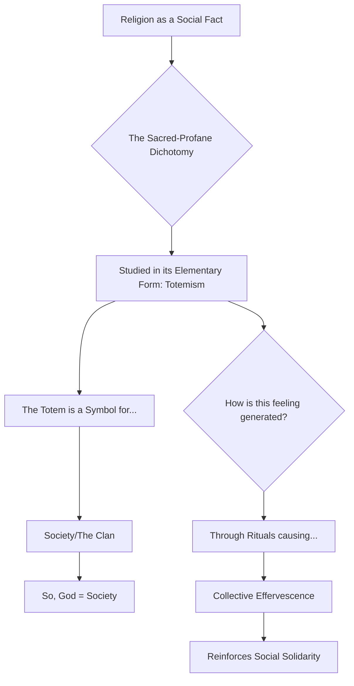
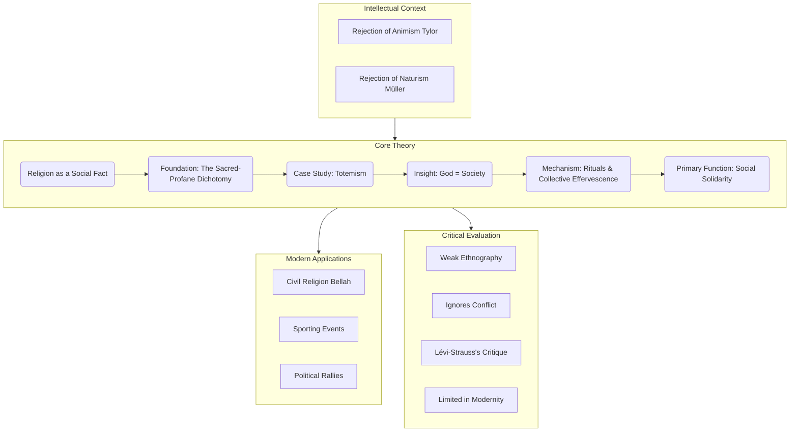
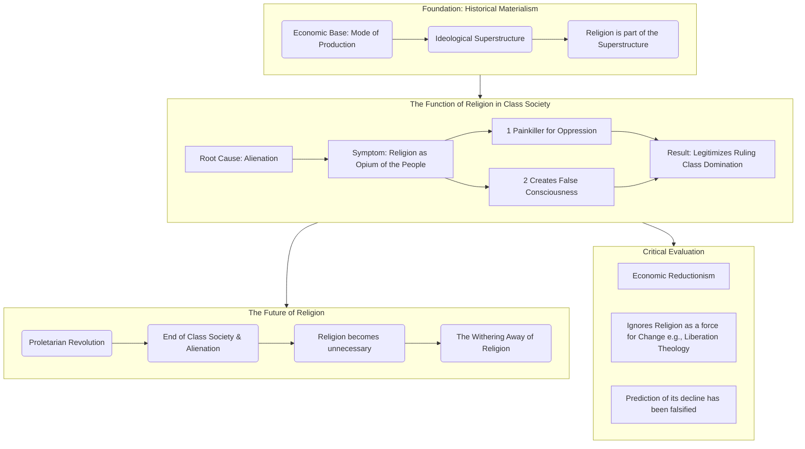
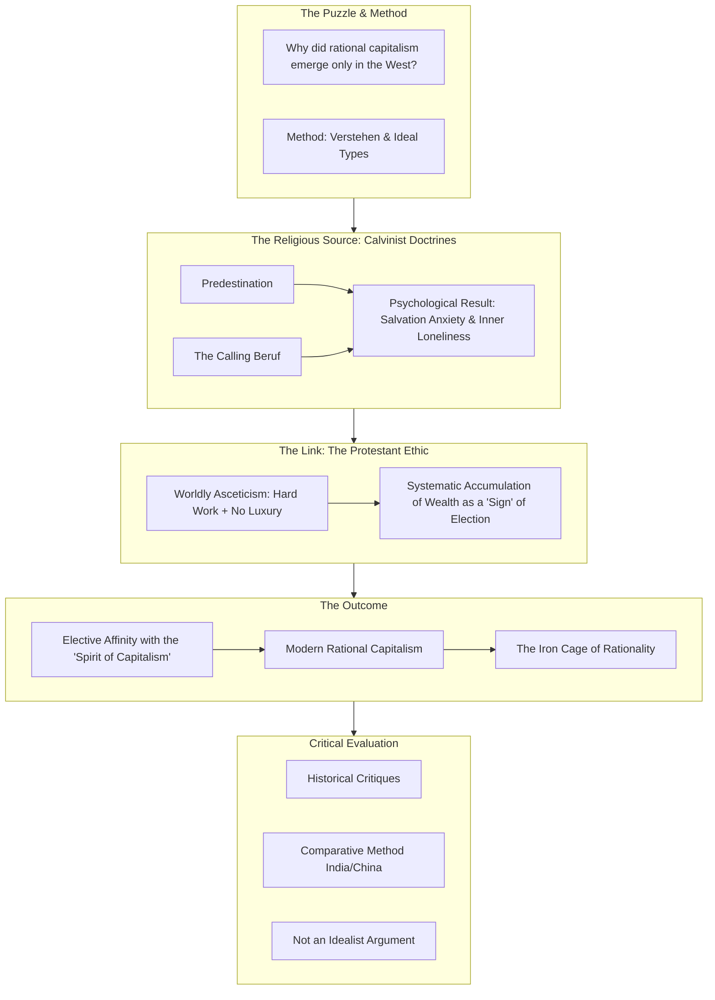
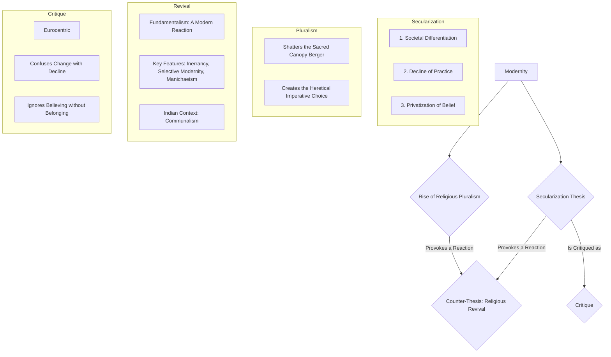
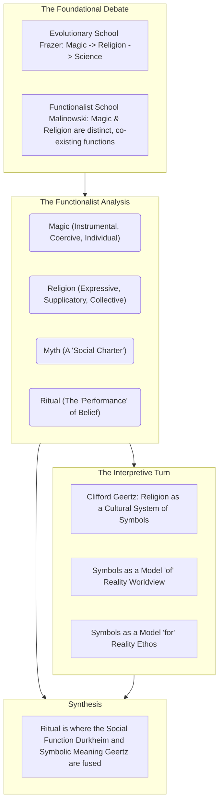
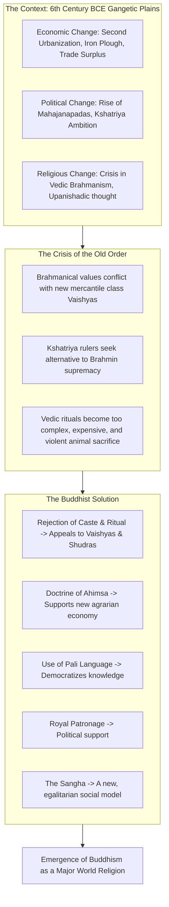
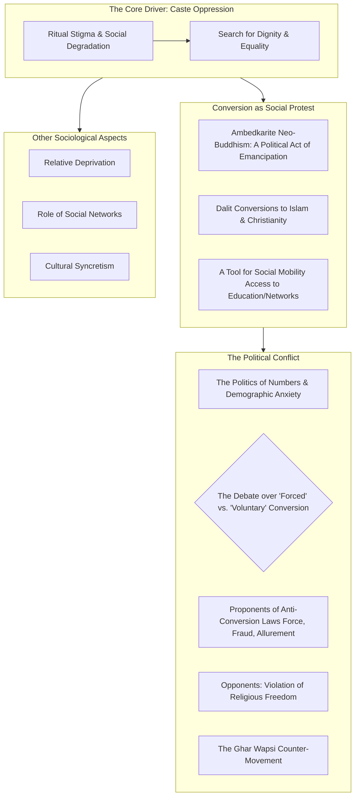
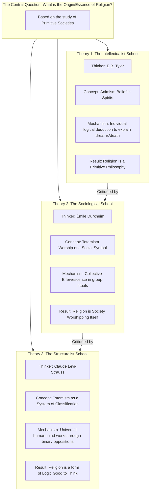
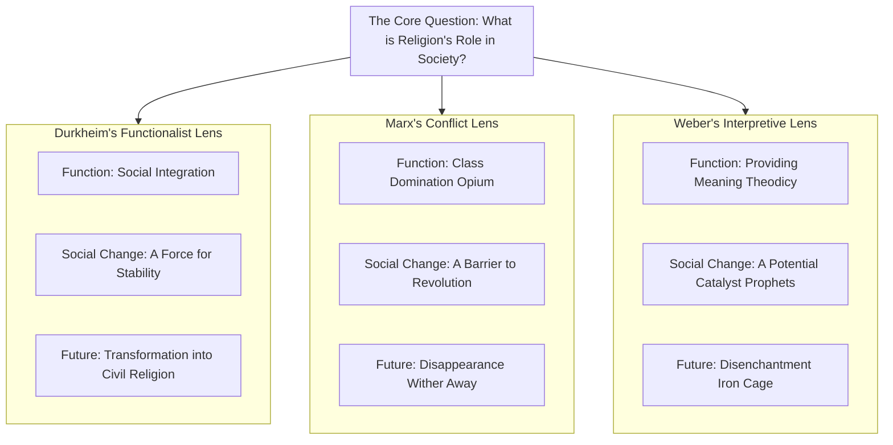

---

### **Detailed Thematic Plan with Syllabus Mapping (MSOE-003)**

#### **Tier 1: The Foundational Core (Non-Negotiable)**

**Theme 1: The Classical Trinity - The Sociological Foundation**
*   **Core Task:** Master the foundational theories of Durkheim, Marx, and Weber. Understand their core arguments, critiques, and be prepared to compare them.
*   **Syllabus Mapping:**
    *   **Émile Durkheim: The Functionalist Paradigm**
        *   **Primary Units:**
            *   Block 1, Unit 2: The Functionalist Approach
            *   Block 3, Unit 10: Sacred and Profane
            *   Block 5, Unit 20: Totemism and Taboo
        *   **Secondary Unit:** Block 3, Unit 11 (for Rituals & Collective Effervescence).
        *   **Strategic Note:** To prepare Durkheim comprehensively, you must synthesize material from three different blocks.
    *   **Karl Marx: The Conflict Paradigm**
        *   **Primary Unit:** Block 1, Unit 3: The Marxist Approach
        *   **Secondary Unit:** Block 2, Unit 6 (for application to Religion and Economy).
    *   **Max Weber: The Interpretive Paradigm**
        *   **Primary Unit:** Block 1, Unit 4: The Weberian Approach
        *   **Secondary Units:**
            *   Block 3, Unit 12: Religious Specialists (for Priests vs. Prophets).
            *   Block 2, Unit 6: Religion and Economy (for application).

**Theme 2: The Protestant Ethic & the Spirit of Capitalism**
*   **Core Task:** Master Weber's most famous thesis on the relationship between religious ideas and economic action.
*   **Syllabus Mapping:**
    *   **Primary Unit:** Block 2, Unit 6: Religion and Economy
    *   **Secondary Unit:** Block 1, Unit 4: The Weberian Approach (where the concepts are introduced).

**Theme 3: Modernity's Challenge - Secularization, Pluralism & Fundamentalism**
*   **Core Task:** Understand the interconnected debate on the fate of religion in the modern world, with a special focus on the Indian context.
*   **Syllabus Mapping:**
    *   **Primary Units:**
        *   Block 6, Unit 25: Secularism and Secularization
        *   Block 6, Unit 23: Religious Pluralism
        *   Block 6, Unit 24: Religious Fundamentalism and Revivalism
    *   **Secondary Units (for context):**
        *   Block 2, Unit 9: Religion and Science (as a driver of secularization).
        *   Block 7, Unit 28: Religion and Globalization (as a context for the rise of fundamentalism).

---

#### **Tier 2: High Probability & Application**

**Theme 4: The Mechanisms of Belief - Magic, Ritual & Symbolism**
*   **Core Task:** Understand the "how" of religion—the practices and systems of meaning that sustain belief.
*   **Syllabus Mapping:**
    *   **Primary Units:**
        *   Block 5, Unit 21: Magic, Witchcraft, and Sorcery
        *   Block 3, Unit 11: Myth, Ritual, and Symbol
    *   **Secondary Unit:** Block 3, Unit 10: Sacred and Profane (as the foundation for ritual).

**Theme 5: Religion and Social Transformation in India**
*   **Core Task:** Apply sociological concepts to understand major religious movements and changes in India.
*   **Syllabus Mapping:**
    *   **Primary Units:**
        *   Block 4, Unit 16: Buddhism and Jainism (for the emergence of Buddhism).
        *   Block 6, Unit 22: Religious Conversion

**Theme 6: Religion in "Primitive" Societies - The Anthropological Lens**
*   **Core Task:** Understand the foundational anthropological theories that shaped the sociology of religion.
*   **Syllabus Mapping:**
    *   **Primary Units:**
        *   Block 5, Unit 20: Totemism and Taboo
        *   Block 5, Unit 19: Tribal Religion: An Overview (for Animism, Animatism, and Nuer Religion).

---

#### **Tier 3: Conceptual Breadth & Nuance**

**Theme 7: Alternative Approaches - Phenomenology & Interpretivism**
*   **Core Task:** Move beyond the classical trinity to understand religion as lived experience and a system of meaning.
*   **Syllabus Mapping:**
    *   **Primary Units:**
        *   Block 1, Unit 5: The Phenomenological Approach (for Berger's Sacred Canopy).
        *   Block 3, Unit 11: Myth, Ritual, and Symbol (for Geertz's Interpretive Approach).

**Theme 8: Specific Indian Traditions & Concepts**
*   **Core Task:** Develop a nuanced understanding of specific, sociologically relevant concepts from Indian religious life.
*   **Syllabus Mapping:**
    *   **Sufism and its Influence on Sikhism:**
        *   Block 4, Unit 15: Islam
        *   Block 4, Unit 17: Sikhism
    *   **Non-renunciation (T.N. Madan):**
        *   Block 6, Unit 26: Religion and Gender (This unit covers Madan's work on Kashmiri Pandits).
    *   **Mysticism (Lamas of McLeodganj):**
        *   Block 3, Unit 13: Religious Experience
        *   Block 7, Unit 27: New Religious Movements and Cults (as a contemporary example).

---

#### **Tier 4: Strategic Awareness (For Short Notes & Value Addition)**

*   **Freud's Psychological Approach:**
    *   Block 1, Unit 1: The Sociological Perspective on Religion
*   **New Religious Movements (NRMs) & Cults:**
    *   Block 7, Unit 27: New Religious Movements and Cults
*   **Religion and Gender:**
    *   Block 6, Unit 26: Religion and Gender
*   **Okka in Coorg Society:**
    *   Block 5, Unit 19: Tribal Religion: An Overview

### **Strategic Insight from this Mapping**

The most crucial takeaway from this detailed mapping is that **you cannot study this subject block-by-block**. The syllabus is thematically interconnected but structurally fragmented. For instance, to fully grasp Durkheim's theory (a Tier 1 topic), you must pull information from Block 1, Block 3, and Block 5.

---

### **Revised Four-Tier Prioritization & Thematic Breakdown**

#### **Tier 1: The Foundational Core (Non-Negotiable)**
These three themes form the intellectual bedrock of the entire subject. They are conceptually central, have the highest frequency, and their concepts are required to understand all other themes.

**Theme 1: The Classical Trinity - The Sociological Foundation**
*   **Core Idea:** This theme covers the foundational theories of Marx, Weber, and Durkheim, who together established the sociology of religion. The most common question format is a direct examination of one or a comparison between two.
*   **Topics & Sub-topics:**
    *   **Émile Durkheim: The Functionalist Paradigm**
        *   Sub-topics: Religion as a Social Fact; The Sacred-Profane Dichotomy; Totemism as the Elementary Form (God = Society); Collective Effervescence and Rituals; Role of Religion in Social Integration; Critical Evaluation (ignores conflict, dysfunction).
    *   **Karl Marx: The Conflict Paradigm**
        *   Sub-topics: Religion as part of the Ideological Superstructure; Religion as the "Opium of the People"; Role in Legitimizing Inequality and Alienation; Its eventual withering away; Critical Evaluation (overly reductionist, ignores religion's positive functions).
    *   **Max Weber: The Interpretive Paradigm**
        *   Sub-topics: Religion as a source of Social Change; The concept of *Verstehen*; Theodicy of Suffering; Types of Religious Action (Worldly vs. Other-worldly asceticism/mysticism); Priests vs. Prophets; The process of Rationalization; Critical Evaluation.

**Theme 2: The Protestant Ethic & the Spirit of Capitalism**
*   **Core Idea:** This is Weber's single most famous and frequently tested thesis. It serves as the primary case study for the relationship between religion and the economy.
*   **Topics & Sub-topics:**
    *   **The Core Thesis:** How Calvinist doctrines (predestination, calling, asceticism) created a psychological motivation for rational, systematic work, leading to capital accumulation.
    *   **Elective Affinity:** Understanding the concept of a non-causal, yet deeply resonant, relationship between religious ideas and economic structures.
    *   **The "Iron Cage" of Rationality:** How capitalism, once established, sheds its religious roots and traps humanity in a system of instrumental rationality.
    *   **Comparative Analysis:** Contrasting the Protestant ethic with the economic ethics of other world religions (Hinduism, Confucianism) to strengthen the argument.
    *   **Critical Evaluation:** Critiques of the thesis (historical evidence, alternative explanations for capitalism).

**Theme 3: Modernity's Challenge - Secularization, Pluralism & Fundamentalism**
*   **Core Idea:** This theme addresses the central debate about the fate of religion in the modern world. It explores the interconnected processes of secularization, the reality of religious diversity, and the reactive rise of fundamentalism.
*   **Topics & Sub-topics:**
    *   **The Secularization Thesis:**
        *   Sub-topics: Defining Secularization (the process) vs. Secularism (the ideology); The differentiation of social spheres (state, economy, science from religion); The decline of religious belief and practice; The privatization of religion.
    *   **Religious Pluralism:**
        *   Sub-topics: The social condition of multiple competing religions co-existing; Its significance in the Indian context; The challenge to religious monopolies (Peter Berger's "Heretical Imperative").
    *   **Religious Revivalism & Fundamentalism:**
        *   Sub-topics: Defining fundamentalism as a modern, anti-modernist movement; Its key features (inerrancy of scripture, selective modernization, clear enemy); Its relationship to communalism in India; Its rise as a reaction to secularization and globalization.

---

#### **Tier 2: High Probability & Application**
These themes are extremely common and represent the application of Tier 1 concepts to specific domains or phenomena.

**Theme 4: The Mechanisms of Belief - Magic, Ritual & Symbolism**
*   **Core Idea:** This theme moves from grand theory to the practical "how" of religion. How do beliefs manifest and get reinforced?
*   **Topics & Sub-topics:**
    *   **Magic, Science, and Religion:**
        *   Sub-topics: The classic evolutionary debate (Frazer's view of magic -> religion -> science); Malinowski's functionalist distinction (magic for specific ends, religion for ultimate anxieties); The relationship between magic and social structure.
    *   **Ritual, Myth, and Symbol:**
        *   Sub-topics: The social functions of ritual (reinforcing norms, marking transitions); The role of myth as a sacred charter for society; Clifford Geertz's interpretive approach ("Religion as a System of Symbols" that creates moods and motivations).
    *   **Sacred and Profane:** (This is a keystone concept from Durkheim but is often asked about separately in the context of ritual).

**Theme 5: Religion and Social Transformation in India**
*   **Core Idea:** This theme applies sociological theories to understand major religious shifts and movements within Indian history and society.
*   **Topics & Sub-topics:**
    *   **The Emergence of Buddhism:**
        *   Sub-topics: The socio-historical context (crisis in Brahmanism, rise of mercantile class, urbanism); Core tenets as a rational, ethical rejection of Vedic ritualism; The role of the *Sangha*.
    *   **Religious Conversion in Indian Society:**
        *   Sub-topics: Conversion as a tool of social mobility and protest (e.g., Dalit conversions to Buddhism); The political dimensions and debates surrounding conversion; The various aspects (psychological, social, political).

**Theme 6: Religion in "Primitive" Societies - The Anthropological Lens**
*   **Core Idea:** This theme explores the foundational anthropological work on religion in small-scale, tribal societies, which heavily influenced the classical sociologists.
*   **Topics & Sub-topics:**
    *   **Totemism:**
        *   Sub-topics: Durkheim's analysis as the elementary form of religion; Lévi-Strauss's structuralist critique (Totemism as a system of classification, "good to think" rather than "good to eat").
    *   **Animism & Animatism:**
        *   Sub-topics: Tylor's theory of animism (belief in spirits) as the origin of religion; Marett's concept of animatism (belief in an impersonal supernatural force, *mana*).
    *   **The Nuer Religion (Case Study):**
        *   Sub-topics: E.E. Evans-Pritchard's work; The concept of 'Kwoth' or 'Cuong' as a complex, non-western understanding of spirit and divinity.

---

#### **Tier 3: Conceptual Breadth & Nuance**
These themes are crucial for demonstrating a deeper, more nuanced understanding and for scoring in the top bracket.

**Theme 7: Alternative Approaches - Phenomenology & Interpretivism**
*   **Core Idea:** Moving beyond the classical trinity to understand religion from the believer's perspective and as a system of meaning.
*   **Topics & Sub-topics:**
    *   **The Phenomenological Approach:**
        *   Sub-topics: The method of *epoche* (bracketing out presuppositions); Focus on lived experience; Peter Berger's theory of religion as a "Sacred Canopy" that provides a meaningful order (nomos) against the chaos of anomie.
    *   **Clifford Geertz's Interpretive Approach:** (Often covered in Theme 4, but can be a standalone question).
        *   Sub-topics: Religion as a cultural system of symbols; The "thick description" method; How symbols shape a people's ethos and worldview.

**Theme 8: Specific Indian Traditions & Concepts**
*   **Core Idea:** Understanding the unique sociological features of specific religious traditions and concepts in India.
*   **Topics & Sub-topics:**
    *   **Sufism and its Influence:**
        *   Sub-topics: Core tenets of Sufism (mystical branch of Islam); Its syncretic influence on Indian society, particularly on the emergence of Sikhism.
    *   **Non-renunciation (T.N. Madan):**
        *   Sub-topics: A critique of the overemphasis on renunciation (sannyasa) in understanding Hinduism; The householder's path among Kashmiri Pandits as a central religious value.
    *   **Mysticism in Practice (Lamas of McLeodganj):**
        *   Sub-topics: Understanding mystical traditions not just as texts but as lived, embodied practices.

---

#### **Tier 4: Strategic Awareness (For Short Notes & Value Addition)**
These are important but less frequent topics. A concise understanding is sufficient.

*   **Freud's Psychological Approach:** Religion as a collective neurosis, an illusion born from infantile helplessness and the Oedipus complex.
*   **New Religious Movements (NRMs) & Cults:** Their characteristics (charismatic leader, totalizing belief system) and their significance as a response to modernity's anomie.
*   **Religion and Gender:** How religions have traditionally reinforced patriarchy, and how women are reinterpreting religious traditions.
*   **Okka in Coorg Society:** A classic example of an ancestral cult, linking kinship and land to the sacred.

This revised structure is thematic, deeply layered, and prioritizes the core intellectual debates of the discipline. It provides a clear roadmap for our note-creation process.

---
---

### ~~**Theme 1: Émile Durkheim's Functionalist Theory of Religion**~~

~~**Syllabus Reference:**~~
*   ~~**Primary:** Block 1, Unit 2 (The Functionalist Approach); Block 3, Unit 10 (Sacred and Profane); Block 5, Unit 20 (Totemism and Taboo).~~
*   ~~**Secondary:** Block 3, Unit 11 (Myth, Ritual, and Symbol).~~

#### ~~**Introduction**~~

~~Émile Durkheim, a founding figure of modern sociology, pioneered the functionalist approach to religion. Rejecting psychological or theological explanations, he argued that religion is an eminently social phenomenon. In his seminal work, *The Elementary Forms of the Religious Life*, Durkheim proposed a radical thesis: the primary function of religion is to generate social solidarity and maintain the moral order of society. For Durkheim, the object of religious worship is not some supernatural deity, but society itself, symbolically transfigured. He sought to uncover the universal essence of religion by studying its most "elementary" form, which he believed was the totemism of Australian Aboriginal societies.~~

#### ~~**The Core Thematic Argument**~~

~~Durkheim's theory unfolds in a logical sequence, moving from a foundational definition to a universal classification, a case study, and finally, the mechanism that generates religious feeling.~~

~~**1. Religion as a Social Fact**~~
*   ~~Durkheim insisted on studying religion as a **social fact**—a category of phenomena with characteristics external to the individual and exercising a coercive force upon them.~~
*   ~~This means religion is not about individual belief, inner experience, or the truth claims of theology. It is a collective reality, a system of beliefs and practices that exists outside and above the individual, shaping their perceptions and actions.~~
*   ~~His definition of religion is therefore social: **"A unified system of beliefs and practices relative to sacred things... which unite into one single moral community called a Church, all those who adhere to them."**~~

~~**2. The Sacred-Profane Dichotomy: The Heart of All Religion**~~
*   ~~For Durkheim, the single most fundamental characteristic of all religious life is the classification of the world into two distinct, hostile, and mutually exclusive realms:~~
    *   ~~**The Sacred:** This realm includes things set apart, forbidden, and treated with awe and reverence. It is extraordinary, powerful, and dangerous.~~
    *   ~~**The Profane:** This is the realm of the everyday, the mundane, the utilitarian. It is the ordinary world of work and routine.~~
*   ~~This absolute separation is the essence of religious thought. Religious life is the system of beliefs and rituals that mediate the relationship between these two worlds.~~

~~**3. Totemism: Society Worshipping Itself**~~
*   ~~To find the origin of this dichotomy, Durkheim studied Australian **totemism**, which he considered the simplest, most "elementary" form of religion.~~
*   ~~He observed that the clan's most sacred object was its **totem** (a particular animal or plant). The totem was the source of the clan's identity and the object of its rituals.~~
*   ~~Durkheim posed a critical question: Why is this mundane plant or animal considered sacred? His answer was that the totem is not worshipped for its intrinsic qualities. The totem is merely a **symbol**.~~
*   ~~It is a symbol of an impersonal, anonymous force that is superior to the individual and upon which they depend. This force is the **clan** itself. The totem is the clan's emblem, its flag.~~
*   ~~Therefore, when the clan members worship the totem, they are, in reality, worshipping their own society. **God is the symbolic representation of society.**~~

~~**4. Collective Effervescence: The Genesis of the Sacred**~~
*   ~~If God is society, how do individuals come to *feel* this sacred force? Durkheim's answer lies in the power of ritual.~~
*   ~~During intense group rituals and ceremonies, individuals come together, lose their sense of self, and merge into a common consciousness. This heightened state of shared emotional energy and excitement is what Durkheim calls **collective effervescence**.~~
*   ~~In this state, individuals feel possessed by a powerful, external force that transports them into a higher realm. They attribute this powerful feeling to the sacred objects of the ritual (the totem).~~
*   ~~Thus, rituals are the social mechanisms that periodically recharge the community's collective sentiments, reaffirm their shared beliefs, and recreate the experience of the sacred, thereby reinforcing **social solidarity** and the **collective conscience**.~~

#### ~~**Mermaid Diagram: Durkheim's Logical Flow**~~



#### ~~**Critical Evaluation**~~

~~Durkheim's theory, while groundbreaking, has faced several significant criticisms.~~

*   ~~**Empirical Weakness:** His analysis is based entirely on second-hand, and sometimes inaccurate, accounts of a single case (Australian Aboriginals). It is a major flaw to generalize about all religion from such a narrow and contested empirical base.~~
*   ~~**Neglect of Conflict:** As a functionalist, Durkheim overemphasizes the role of religion in promoting social harmony. He largely ignores its dysfunctional aspects, such as its role in generating conflict, wars, and oppression.~~
*   ~~**Oversimplified Dichotomy:** The sharp, absolute distinction between the sacred and the profane does not hold true for all societies. In many cultures, the two realms are more fluid and intermingled.~~
*   ~~**Relevance to Modernity:** The theory works best for small-scale, homogenous societies with a single, overarching religion. It is less effective at explaining the role of religion in large-scale, complex, and religiously pluralistic modern societies where the collective conscience is weaker.~~

#### ~~**Conclusion**~~

~~Despite its flaws, Émile Durkheim's contribution to the sociology of religion is monumental. By shifting the focus away from the supernatural and onto the social, he established religion as a legitimate and vital field of sociological inquiry. His core insight—that religion is a symbolic system through which society worships itself and in doing so, reaffirms its own collective existence—remains one of the most powerful and enduring theories in the discipline. His work provides an indispensable foundation for understanding how shared beliefs and collective rituals function to create a moral community and sustain social life.~~

~~---~~

#### ~~**Bulletproof Add-ons**~~


> [!NOTE]
>  ~~**Conceptual Toolkit (Horizontal Coverage)**~~
> 
>  ~~*   **Collective Conscience:** The totality of beliefs and sentiments common to the average members of a society, which forms a determinate system with a life of its own. Religion is its primary source.~~
> ~~*   **Positive Cult:** Rituals of communion and celebration that actively bring the community together and reaffirm its values (e.g., a totemic feast).~~
>  ~~*   **Negative Cult:** Rituals based on prohibitions, asceticism, and taboos that serve to separate the sacred from the profane.~~
>  ~~*   **Piacular Rites:** Rites of mourning, atonement, and expiation performed after a death or calamity to restore the community's moral equilibrium.~~


> ~~**Thinker's Lens (Vertical Coverage)**~~
>
> ~~*   **Marxist Lens:** A Marxist would critique Durkheim's theory as naive. The "social solidarity" created by religion is not for the benefit of "society" as a whole, but a form of **false consciousness** that serves the interests of the ruling class by making the oppressed accept their fate.~~
> ~~*   **Weberian Lens:** A Weberian would argue that Durkheim's focus on the collective ignores the crucial role of **individual meaning** and agency. Weber was interested in how religious *ideas* (like the Protestant Ethic) could be a source of radical **social change**, not just social stability.~~

~~<br>~~

> ~~**Cross-Linkages (Vertical Coverage)**~~
>
> ~~*   **Connects to:**~~
>     ~~*   **Theme 4 (Magic, Ritual & Symbolism):** Durkheim's work is the foundation for the functionalist analysis of ritual.~~
>     ~~*   **Theme 6 (Tribal Religion):** His theory of totemism is a central debate in the anthropology of religion.~~
> ~~*   **Contrasts with:**~~
>     ~~*   **Theme 1 (Marxist Approach):** The classic function vs. conflict debate.~~
>     ~~*   **Theme 7 (Phenomenological Approach):** The focus on collective structures vs. individual lived experience.~~

~~---~~

#### ~~**Quick Revision Scaffold**~~

*   ~~**Core Thesis:** Religion's function is to create social solidarity. God = Society.~~
*   ~~**Method:** Treats religion as a **Social Fact**.~~
*   ~~**Foundation:** All religion is based on the **Sacred-Profane Dichotomy**.~~
*   ~~**Case Study:** **Totemism** is the "elementary form" where a clan worships its own symbol (the totem), which represents the clan itself.~~
*   ~~**Mechanism:** Rituals generate **Collective Effervescence**, a shared emotional energy that makes individuals feel the power of the sacred (i.e., society).~~
*   ~~**Critique:** Weak empirical base; ignores conflict; less relevant to modern, pluralistic societies.~~
*   ~~**Legacy:** Made religion a sociological object of study, focusing on its social functions.~~

---
---
---


# TIER 1


## **Theme 1: Émile Durkheim's Functionalist Theory of Religion**

**Syllabus Reference:**
*   **Primary:** Block 1, Unit 2 (The Functionalist Approach); Block 3, Unit 10 (Sacred and Profane); Block 5, Unit 20 (Totemism and Taboo).
*   **Secondary:** Block 3, Unit 11 (Myth, Ritual, and Symbol).

#### **Introduction (Argumentative)**

Émile Durkheim's functionalist theory represents a revolutionary break in the study of religion. In his masterpiece, *The Elementary Forms of the Religious Life* (1912), he posits that religion is not divinely inspired nor a product of individual psychology, but an eminently social phenomenon whose primary function is the generation of social solidarity. By analyzing what he considered its most "elementary" form—totemism—Durkheim developed a powerful, albeit controversial, thesis: when a society worships its gods, it is, in reality, worshipping a symbolic transfiguration of itself. While this provides a profound model for understanding social cohesion, its explanatory power is tested by the complexities of religious conflict and pluralism in the modern world.

#### **Intellectual Context & Core Argument**

> [!note] The Intellectual Debate
> Durkheim developed his theory in direct opposition to the dominant individualistic and intellectualist theories of his time. He sought to refute:
> 1.  **Animism (E.B. Tylor):** The idea that religion originated from the "primitive" belief in souls or spirits.
> 2.  **Naturism (Max Müller):** The idea that religion originated from the personification of natural forces.
> For Durkheim, these theories failed because they could not explain the obligatory, moral force of religion. The source of that force, he argued, had to be social.

**1. The Foundation: The Sacred-Profane Dichotomy**
Durkheim's entire theory rests on the foundational premise that all religious systems, without exception, classify the world into two distinct, mutually exclusive, and hostile realms:

1.  **The Sacred:** This is the realm of things set apart, protected by prohibitions, and treated with awe. It is the locus of the community's ultimate values and collective power. It is both inspiring and dangerous.
2.  **The Profane:** This is the mundane realm of everyday life, work, and utility. It is the ordinary world that must be kept separate from the sacred.

This absolute separation, maintained by rituals, is the true hallmark of religious thought. Religion is the system of beliefs and practices that mediates the relationship between these two worlds.

**2. The Case Study: Totemism as the Elementary Form**
To uncover the origins of this dichotomy, Durkheim analyzed the totemism of Australian Aboriginal clans.

1.  **The Totemic Principle:** He observed that the clan's most sacred object was its **totem** (an animal or plant), which served as its emblem. This totem was the source of an impersonal, anonymous force—what he called the **totemic principle** or *mana*.
2.  **The Symbolism of the Totem:** Durkheim argued that the totem is a **dual symbol**. It symbolizes both the totemic principle (the "god") and the clan itself. The two are inseparable.
3.  **The Core Thesis: God = Society:** Therefore, when clan members perform rituals to worship the totemic principle, they are simultaneously and unconsciously worshipping their own social group. The power they feel is not from the totem animal, but from the **moral force of the collective**. Society is the real object of worship.

**3. The Mechanism: Collective Effervescence and Ritual**
If God is society, how is this sacred force experienced? Durkheim's most brilliant insight lies in the power of collective ritual.

1.  **Collective Effervescence:** During intense, communal rituals, the ordinary rules of life are suspended. Individuals lose their sense of self, merging into a shared emotional consciousness. This heightened state of collective energy and excitement is **collective effervescence**.
2.  **The Genesis of the Sacred:** In this state, individuals feel possessed by a powerful, external force that elevates them beyond their everyday existence. They project this powerful feeling onto the symbols of the ritual (the totem). This experience is what creates and recreates the idea of the sacred.
3.  **The Function of Ritual:** Rituals are therefore the social mechanisms through which society periodically reaffirms itself. They recharge the collective conscience, reinforce shared values, and bind individuals to the social group, thus maintaining **social solidarity**.

> [!example] **Modern Applications of Durkheim's Concepts**
> Durkheim's theory is not limited to "primitive" societies. It provides a powerful lens to understand modern phenomena:
> 1.  **Civil Religion:** Sociologists like Robert Bellah have used Durkheim's ideas to describe the "civil religion" in nations like the USA, where the flag, the constitution, and national holidays (like the 4th of July) are treated as sacred objects that unify a diverse population. Rituals like the pledge of allegiance reinforce this collective sentiment.
> 2.  **Sporting Events:** The intense, shared emotion of a World Cup final or the Olympics, where millions of people feel a sense of unity and collective identity through shared symbols and chants, is a perfect modern example of **collective effervescence**.
> 3.  **Political Rallies & Social Movements:** The feeling of power and solidarity generated in a massive political rally or a protest march, where individuals feel part of something larger than themselves, can also be analyzed through a Durkheimian lens.

#### **Critical Evaluation**

Despite its profound influence, Durkheim's theory has been subjected to significant criticism.

1.  **Questionable Ethnography:** The theory is built entirely on second-hand, and often flawed, ethnographic data about a single region. Critics argue it is methodologically unsound to generalize about all religion from such a narrow base.
2.  **Overemphasis on Integration:** As a functionalist, Durkheim focuses almost exclusively on the positive, integrative functions of religion. He largely ignores its dysfunctional aspects, such as its role in generating deep social conflict, wars, and persecution.
3.  **The Lévi-Straussian Critique of Totemism:** The structuralist anthropologist **Claude Lévi-Strauss** argued that Durkheim misunderstood totemism. For Lévi-Strauss, totemism is not about religion or worship at all; it is a cognitive system, a primitive form of classification. Its purpose is not to unify the clan but to create a logical system for thinking about the world by using natural species as metaphors for social groups. It is less about being "good to eat" and more about being **"good to think."**
4.  **Limited Modern Relevance:** The theory is most persuasive for small-scale, homogenous societies with a single, dominant religion. Its ability to explain religion in large-scale, individualistic, and religiously pluralistic modern societies, where the collective conscience is fragmented, is limited.

#### **Conclusion (Synthesizing)**

Émile Durkheim's functionalist theory remains a monumental achievement in the social sciences. By brilliantly re-framing religion as a social, not supernatural, phenomenon, he carved out a legitimate space for its sociological study. His core thesis—that in religion, society is the object of its own worship—provides a powerful, though not complete, explanation for the enduring power of collective belief and ritual in forging moral communities. While his empirical base was narrow and his focus on function over conflict has been rightly criticized, his concepts of the sacred, collective effervescence, and religion as a source of social solidarity continue to be indispensable tools for analyzing the forces that bind societies together, both in their traditional and modern forms.

#### **Comprehensive Mermaid Diagram**



---

#### **Bulletproof Add-ons**

> [!book] **Conceptual Toolkit**
> 1.  **Collective Conscience:** The totality of shared beliefs and moral sentiments that operate as a unifying force in society.
> 2.  **Positive Cult:** Rituals of communion and celebration that reaffirm collective values (e.g., a totemic feast).
> 3.  **Negative Cult:** A system of prohibitions and taboos designed to separate the sacred from the profane.
> 4.  **Piacular Rites:** Rites of mourning, atonement, and expiation performed after a calamity to restore the community's moral balance.
> 5.  **Church:** For Durkheim, not just a Christian institution, but any unified moral community bound by a shared system of sacred beliefs.


> [!eye] **Thinker's Lens**
> 1.  **Marxist Lens:** A Marxist would see the "social solidarity" created by religion as a form of **false consciousness**. It doesn't serve "society" but the ruling class, by making the oppressed accept their suffering and distracting them from the real, material source of their misery.
> 2.  **Weberian Lens:** A Weberian would argue that Durkheim's focus on collective ritual misses the crucial role of **individual meaning** and **religious ideas** as drivers of **social change** (e.g., The Protestant Ethic), not just social stability.

> [!link] **Cross-Linkages**
> 1.  **Connects to:**
>     1.  **Theme 4 (Magic, Ritual & Symbolism):** Provides the foundational theory for the functionalist analysis of ritual.
>     2.  **Theme 6 (Tribal Religion):** His theory of totemism is a central debate in anthropology.
> 2.  **Contrasts with:**
>     1.  **Theme 1 (Marxist Approach):** The classic function vs. conflict debate.
>     2.  **Theme 7 (Phenomenological Approach):** Focus on collective structures vs. individual lived experience.

---

#### **Quick Revision Scaffold**


> [!NOTE]
> ## Durkheim's Functionalist Theory
> 
> ### Core Thesis
> - **Function:** Create social solidarity.
> - **Radical Idea:** God = Society.
> 
> ### Intellectual Context
> - **Argued Against:** Tylor (Animism) & Müller (Naturism).
> - **Insisted on:** Religion as a **Social Fact**.
> 
> ### Logical Argument
> 1.  **Foundation:** All religion based on **Sacred-Profane Dichotomy**.
> 2.  **Case Study:** **Totemism** (Elementary Form).
>     - Totem = Symbol of both God & Clan.
>     - Therefore, worshipping the totem is worshipping the clan.
> 3.  **Mechanism:** Rituals generate **Collective Effervescence**.
>     - This shared emotional energy is experienced as the sacred force.
>     - Function of ritual is to recharge the **Collective Conscience**.
> 
> ### Modern Applications
> - **Civil Religion** (Bellah): Sacred national symbols (flag, constitution).
> - **Collective Effervescence:** Sporting events, political rallies.
> 
> ### Critical Evaluation
> - **Weak Ethnography:** Based on flawed, second-hand data.
> - **Ignores Conflict:** Overly focused on harmony.
> - **Lévi-Strauss Critique:** Totemism is about classification ("good to think"), not worship.
> - **Limited in Modernity:** Works best for small, homogenous societies.
> 
> ### Legacy
> - Established the sociological study of religion.
> - Provided powerful tools (Sacred, Effervescence) to understand social cohesion.


---
---


## **Theme 1: Karl Marx's Conflict Theory of Religion**

**Syllabus Reference:**
*   **Primary:** Block 1, Unit 3 (The Marxist Approach).
*   **Secondary:** Block 2, Unit 6 (Religion and Economy); Block 6, Unit 24 (for analyzing fundamentalism).

#### **Introduction (Argumentative)**

In stark opposition to functionalist theories, Karl Marx presented a radical materialist critique of religion. For Marx, religion is not a source of social cohesion for the benefit of all, but a powerful instrument of class oppression rooted in the material and economic realities of society. In his view, religion is a core component of the ideological superstructure, functioning as the **"opium of the people"** to soothe the pain of exploitation while simultaneously legitimizing the power of the ruling class. Marx's theory argues that religion is a product of human alienation and will ultimately "wither away" once the class-based society that creates it is overthrown. While criticized for its economic reductionism, Marx's analysis remains an essential tool for understanding the relationship between religion, power, and inequality.

#### **Intellectual Context & Core Argument**

> [!note] The Intellectual Debate
> Marx's theory was a direct critique of German Idealist philosophy, particularly the work of Ludwig Feuerbach.
> 1.  **Feuerbach's Contribution:** Feuerbach argued in *The Essence of Christianity* that humans had created God in their own image, projecting their best qualities onto a divine being. Thus, "Man makes religion."
> 2.  **Marx's Critical Advance:** Marx agreed but pushed further, asking the crucial sociological question: *what kind of man* creates religion? His answer was the **alienated man**. For Marx, religion was not a simple intellectual error but a symptom of a deep-seated misery rooted in the material conditions of class society.

**1. The Foundation: Base and Superstructure**
Marx's entire analysis of religion stems from his foundational theory of **historical materialism**. Society is structured like a building:

1.  **The Economic Base (Substructure):** This is the foundation. It consists of the **mode of production**—the forces of production (technology, labor) and the relations of production (class relations, property ownership).
2.  **The Ideological Superstructure:** This is the rest of the building, which rises from and is determined by the base. It includes institutions like the state, law, politics, and, crucially, **religion**.

Therefore, the form and content of religion in any society are a reflection of its economic base. In a class-divided society, religion will inevitably reflect and serve the interests of the dominant class.

**2. Religion as the "Opium of the People"**
This is Marx's most famous metaphor for religion, and it has a crucial dual meaning:

1.  **Religion as a Painkiller:** It acts as an opiate that dulls the pain of oppression. For the exploited proletariat, it makes an intolerable existence bearable by offering solace, comfort, and the promise of supernatural intervention or reward in an afterlife (e.g., "the meek shall inherit the earth").
2.  **Religion as an Intoxicant:** It creates a state of illusion or **false consciousness**. It prevents the oppressed from recognizing the true, material source of their suffering (i.e., capitalist exploitation) and diverts their energy away from revolutionary struggle towards otherworldly salvation.

**3. Religion as an Instrument of Class Domination**
The ruling class (the bourgeoisie) actively uses religion as an ideological weapon to maintain and legitimize its power.

1.  **Legitimizing Inequality:** Religion presents the existing social hierarchy as natural and divinely ordained. For example, the doctrine of the "divine right of kings" in feudalism or the use of Hindu concepts like *dharma* and *karma* to justify the caste system.
2.  **Promoting Passivity:** By emphasizing virtues like humility, obedience, and acceptance of one's lot in life, religion discourages dissent and social change. It promises that suffering on earth will be rewarded in heaven, thus acting as a powerful tool of social control.

**4. The Root Cause: Religion and Alienation**
For Marx, the ultimate source of religion is **alienation**, a condition endemic to capitalist society where individuals are estranged from their own humanity.

1.  **Projection of Human Powers:** Alienated from their labor, their products, their fellow humans, and their own creative potential (*species-being*), humans project their own estranged powers and virtues onto a supernatural being.
2.  **Worshipping an Alienated Self:** In worshipping God, humans are unconsciously worshipping their own alienated essence. Religion is thus a distorted expression of human potential.

**5. The Final Stage: The Withering Away of Religion**
Since religion is merely a symptom of the disease of class society, it has no independent existence.

1.  **The End of Class Society:** With the proletarian revolution and the establishment of a classless, communist society, the material conditions that create alienation and the need for illusion will be eliminated.
2.  **The Disappearance of Religion:** Having lost its social function, religion will become unnecessary and will simply "wither away." Humans will achieve true, conscious mastery over their own lives, and the need for a supernatural crutch will vanish.

> [!example] **Applications and Tests of Marxist Theory**
> 1.  **The Caste System in India:** The traditional Hindu justification for the caste hierarchy, based on concepts of *dharma* (duty) and *karma* (reincarnation based on past deeds), is a classic example of a religious superstructure legitimizing a system of economic and social inequality.
> 2.  **The "Prosperity Gospel":** This is a modern Christian movement, particularly in the US, that preaches that financial wealth is a sign of God's favor. It perfectly fuses capitalist values with religious belief, illustrating how religion can adapt to sanctify the dominant economic ideology.
> 3.  **Liberation Theology (A Critical Test Case):** This Marxist-inspired Catholic movement in Latin America during the 1970s-80s presents a major challenge to classical Marxism. Priests used religious language and organization to fight *for* the poor and advocate for social revolution, demonstrating that religion can also be a radical force for change, not just an opiate.

#### **Critical Evaluation**

Marx's powerful theory has been subject to several major criticisms.

1.  **Economic Reductionism:** The most significant critique is that Marx reduces religion to a mere reflection of the economic base. This ignores the independent power of religious ideas and the complex, non-economic needs that religion fulfills (e.g., providing meaning in the face of death, creating community).
2.  **Ignoring Religion as a Force for Change:** The theory cannot adequately account for the numerous historical instances where religion has acted as a catalyst for radical social change. Max Weber's work on the Protestant Reformation is the classic counter-argument. The role of the Black church in the American Civil Rights Movement is another powerful example.
3.  **The Falsified Prediction:** Marx's prediction that religion would wither away has been empirically proven false. Religion has persisted and even thrived in officially atheist socialist states and remains a potent force in advanced capitalist societies, suggesting it fulfills needs that are not purely economic.
4.  **Oversimplification of Religion:** The theory treats "religion" as a monolithic entity, failing to recognize the vast differences within and between religions. It ignores internal conflicts, reform movements, and the fact that different social classes often interpret the same religion in very different ways.

#### **Conclusion (Synthesizing)**

Karl Marx's conflict theory offers an essential and enduring corrective to idealized views of religion. By stripping away the theological veil and analyzing religion as a social institution embedded in relations of power and production, he provides an indispensable framework for understanding its role as a potent ideological force. While his theory is rightly criticized for its economic reductionism and its failure to account for religion's capacity to inspire change, its core insight remains profoundly relevant. Marx compels us to always ask the critical sociological question: *Who benefits from a given set of religious beliefs?* In doing so, he ensures that the relationship between religion, power, and inequality remains a central concern of the sociological enterprise.

#### **Comprehensive Mermaid Diagram**



---

#### **Bulletproof Add-ons**

> [!book] **Conceptual Toolkit**
> 1.  **Historical Materialism:** The theory that the material conditions of a society's mode of production are the primary drivers of historical change.
> 2.  **Base and Superstructure:** The core model where the economic "base" determines the social, political, and ideological "superstructure."
> 3.  **Alienation:** The process in capitalist society by which humans become estranged from their work, their products, their fellow humans, and their own creative essence (*species-being*).
> 4.  **False Consciousness:** A state of mind where the subordinate classes unwittingly accept the ideology of the dominant class, preventing them from seeing the reality of their own exploitation.
> 5.  **Ideology:** A system of ideas and beliefs, often distorted, that serves the interests of a particular social class.

> [!eye] **Thinker's Lens**
> 1.  **Durkheimian Lens:** A Durkheimian would argue that Marx is fundamentally wrong. Religion is not a tool of a *specific class* but a representation of the *entire society's* collective conscience. Its function is integration, not domination. The conflict Marx sees is an aberration, not the norm.
> 2.  **Weberian Lens:** Weber would offer the most nuanced critique. He would agree that religion can be used to legitimize power, but he would reject the one-way causality of the Base-Superstructure model. Through the concept of **elective affinity**, Weber showed that religious ideas can have an independent, causal impact on the economy, thus turning Marx's model on its head.

> [!link] **Cross-Linkages**
> 1.  **Connects to:**
>     1.  **Theme 2 (Protestant Ethic):** Provides the classic counter-argument to Marx's economic determinism.
>     2.  **Theme 5 (Buddhism):** The rise of Buddhism can be analyzed through a quasi-Marxist lens as a challenge by new economic classes (merchants) to the old priestly class (Brahmins).
> 2.  **Contrasts with:**
>     1.  **Theme 1 (Durkheimian Approach):** The foundational conflict vs. function debate.
>     2.  **Theme 7 (Phenomenological Approach):** Focus on economic structures vs. individual lived experience and meaning.

---

## Quick Revision Scaffold Marx's Conflict Theory of Religion

### Core Thesis
- **Function:** Instrument of class oppression.
- **Famous Metaphor:** "Opium of the People."

### Intellectual Context
- **Critique of Feuerbach:** Not just "man makes religion," but **alienated man** makes religion.
- **Foundation:** **Historical Materialism**.

### Logical Argument
1.  **Base determines Superstructure:** Religion is part of the ideological superstructure, reflecting economic realities.
2.  **"Opium of the People":**
    - **Painkiller:** Dulls the pain of exploitation.
    - **Intoxicant:** Creates **false consciousness**.
3.  **Tool of Domination:** Legitimizes inequality (e.g., divine right of kings, karma/caste).
4.  **Root Cause:** A symptom of **alienation** under capitalism.
5.  **Future:** Will **"wither away"** in a classless, communist society.

### Applications & Test Cases
- **Legitimation:** Caste system in India.
- **Fusion with Capitalism:** The "Prosperity Gospel."
- **Critical Test Case:** **Liberation Theology** (religion as a tool for revolution).

### Critical Evaluation
- **Economic Reductionism:** Ignores non-economic functions of religion.
- **Ignores Religion as a Force for Change:** Cannot explain Protestant Reformation, Civil Rights Movement, etc.
- **Prediction Falsified:** Religion has not withered away.
- **Oversimplified:** Treats religion as a monolith.

### Legacy
- A powerful and essential critique of the relationship between religion, power, and inequality.


---
---
---

## **Theme 2: Max Weber's 'The Protestant Ethic and the Spirit of Capitalism'**

**Syllabus Reference:**
*   **Primary:** Block 2, Unit 6 (Religion and Economy); Block 1, Unit 4 (The Weberian Approach).
*   **Secondary:** Block 2, Unit 9 (Religion and Science, for Rationalization).

#### **Introduction (Argumentative)**

Max Weber's monumental work, *The Protestant Ethic and the Spirit of Capitalism* (1905), stands as a powerful and sophisticated challenge to simplistic materialist explanations of social change. In a nuanced dialogue with the "ghost of Marx," Weber argued that modern rational capitalism was not merely the product of economic forces, but was also powerfully shaped by a unique set of religious ideas originating in the ascetic branches of Protestantism. Using his interpretive methodology, Weber demonstrated how specific Calvinist doctrines created a profound psychological motivation for a rational, systematic, and worldly asceticism, which found an **"elective affinity"** with the "spirit" of modern capitalism. While not a complete explanation for capitalism's rise, the thesis is a masterful demonstration of how cultural values can become potent forces in history, driving the inexorable process of **rationalization**.

#### **Intellectual Context & Core Argument**

> [!note] The Intellectual Debate
> Weber was not trying to "refute" Marx by replacing economic determinism with a religious one. His goal was more subtle: to demonstrate that the relationship between the economic "base" and the ideological "superstructure" was a complex, two-way street. He wanted to show that religious ideas were not just a *reflection* of economic conditions but could be an active, independent force in shaping economic life and driving social change.

**1. The Sociological Puzzle and the "Ideal Type" Method**
Weber began with a puzzle: Why did modern, rational, bourgeois capitalism, with its systematic pursuit of profit and organization of free labor, emerge uniquely and spontaneously only in the West?

1.  **Defining the "Spirit" of Capitalism:** To answer this, he first constructed an **Ideal Type** of the "spirit" of modern capitalism. This was not simple greed, but a unique ethic that considered the systematic, rational pursuit of profit as a moral duty and an end in itself. As Benjamin Franklin famously wrote, "Time is money."
2.  **The Method of *Verstehen*:** Weber sought to understand the subjective meaning behind this ethic. He wanted to understand *why* people would dedicate their lives to accumulating wealth they could not enjoy.

**2. The Source: The Protestant Ethic of Ascetic Calvinism**
Weber located the source of this unprecedented work ethic in the unintended psychological consequences of specific doctrines of 16th-century Calvinism.

1.  **Predestination:** The core doctrine that God had already determined who was saved ("the elect") and who was damned, and this could not be changed by any human action. This created a feeling of "unprecedented inner loneliness" and intense anxiety about one's salvation.
2.  **The Calling (*Beruf*):** Protestantism transformed worldly work from a mundane necessity into a moral and religious "calling." Fulfilling one's duty in their worldly profession became the highest form of moral activity.
3.  **Worldly Asceticism:** Unlike the monastery-bound asceticism of Catholicism, Protestantism demanded that believers practice self-denial *within* the world. This meant hard work, avoiding spontaneous enjoyment, and shunning luxury.

**3. The Psychological Link: From Religious Anxiety to Economic Action**
Weber argued that these doctrines combined to produce a powerful psychological motivation for rational economic action.

1.  **The Unintended Consequence:** Since believers could not know if they were saved, they sought signs of their election. Intense, systematic work in their calling became a way to combat salvation anxiety. Success and profit were interpreted as a sign of God's favor.
2.  **The Accumulation of Capital:** The ethic demanded hard work (which produced wealth) but forbade its enjoyment (asceticism). The logical result was the constant reinvestment of profit. This created the psychological conditions for the systematic accumulation of capital for its own sake.

**4. The Outcome: The "Iron Cage" of Rationality**
Weber concluded with a powerful and pessimistic observation about modernity.

1.  **The Fading of Religious Roots:** Once modern capitalism was established, it no longer needed its religious scaffolding. The pursuit of wealth became a self-perpetuating system, driven by competition rather than religious anxiety.
2.  **The Iron Cage:** The result is that modern individuals, whether religious or not, are born into this powerful system that dictates their lives with an inescapable force. The rational pursuit of profit, once a path to salvation, has become an **"iron cage"** of instrumental rationality, stripping life of ultimate meaning and trapping humanity in a cycle of work and consumption.

> [!example] **Weber's Comparative Method: The "Control Cases"**
> To strengthen his thesis, Weber conducted massive comparative studies of other world religions to show why they did *not* produce the spirit of capitalism.
> 1.  **India (Hinduism):** He argued that the doctrines of *karma* and *dharma*, combined with the caste system, created a deeply traditionalist ethic. It encouraged acceptance of one's station in life rather than a rational transformation of the world. The other-worldly asceticism of the "holy man" was seen as superior to worldly action.
> 2.  **China (Confucianism):** He argued that Confucianism promoted a rational adjustment *to* the world, emphasizing harmony, family piety, and tradition. It lacked the inner tension and salvation anxiety that drove the Puritans to systematically remake the world.

#### **Critical Evaluation**

Weber's thesis is one of the most debated in all of sociology.

1.  **Historical Counter-Evidence:** Critics have argued that some forms of capitalism existed in Catholic regions of Europe *before* the Protestant Reformation, challenging Weber's causal timeline.
2.  **Selective Interpretation:** Some scholars argue that Weber was highly selective in his reading of Protestant texts, overemphasizing certain doctrines while ignoring others that were less supportive of his thesis.
3.  **Misinterpretation as Idealism:** A common but incorrect critique is that Weber was a "religious determinist." Weber never claimed the Protestant ethic was the *only* cause of capitalism; he explicitly stated that material factors (technology, law, accounting) were also necessary. His was an argument about the origin of a particular *ethos*.
4.  **The "Spirit" is Not Capitalism:** Critics like H.M. Robertson argued that the "spirit" Weber described was not unique to Protestantism but was a general feature of the Renaissance and the rise of modern commerce.

#### **Conclusion (Synthesizing)**

Max Weber's *The Protestant Ethic* remains a peerless masterpiece of interpretive sociology. By meticulously tracing the link between the subjective meanings of religious doctrines and the emergence of a world-changing economic system, he provided a definitive refutation of simplistic, one-sided determinism. His thesis is not just about the origins of capitalism; it is a profound meditation on the power of cultural values to shape history and the tragic, unintended consequences of human action. In identifying the rise of instrumental rationality as the defining feature of modernity and trapping humanity in an "iron cage," Weber set the central agenda for the critical sociology of the 20th century.

#### **Comprehensive Mermaid Diagram**



---

#### **Bulletproof Add-ons**
<br>

> [!book] **Conceptual Toolkit**
> 1.  ***Verstehen*:** The method of "interpretive understanding" used to grasp the subjective meanings that individuals attach to their actions.
> 2.  **Ideal Type:** An analytical construct or mental model that accentuates certain features of a social phenomenon for comparative purposes. It is a methodological tool, not a moral ideal.
> 3.  **Elective Affinity:** A concept describing the non-causal but deep, resonant relationship between two distinct social or cultural forms, which mutually attract and reinforce each other.
> 4.  **Rationalization:** The historical process by which modern society becomes increasingly dominated by calculation, efficiency, and instrumental reason, replacing traditions, values, and emotions as the basis for action.
> 5.  **Theodicy:** The religious explanation for the existence of suffering and evil in the world (e.g., the Hindu doctrine of karma is a theodicy of suffering).

<br>

> [!eye] **Thinker's Lens**
> 1.  **Marxist Lens:** A Marxist would argue that Weber gets the causal arrow backward. The Protestant ethic is not the *cause* of capitalism but a *consequence*. It is simply the ideology that arose to justify and sanctify the new capitalist relations of production. It is part of the superstructure, not the base.
> 2.  **Durkheimian Lens:** A Durkheimian would be less interested in the economic outcomes and more in how Protestantism created a new form of social solidarity. They might argue that the intense, individualistic nature of Calvinism led to a decline in the ritual-based "mechanical solidarity" of Catholicism, contributing to the rise of "organic solidarity" in modern society, but also increasing the risk of **anomie**.

<br>

> [!link] **Cross-Linkages**
> 1.  **Connects to:**
>     1.  **Theme 1 (Marxist Approach):** This note provides the classic counter-argument to Marx's economic determinism.
>     2.  **Theme 3 (Secularization):** The concept of the "Iron Cage" is a powerful statement on the disenchantment and secularization of the modern world.
> 2.  **Contrasts with:**
>     1.  **Theme 1 (Durkheimian Approach):** Focus on individual meaning and social change vs. collective ritual and social stability.

---

## **Quick Revision Scaffold**


## Weber's Protestant Ethic Thesis

### Core Thesis
- **Argument:** Ascetic Protestant ideas had an **elective affinity** with the "spirit" of modern rational capitalism.
- **Goal:** To show ideas can shape the economy (a dialogue with Marx).

### Logical Argument
1.  **The Puzzle:** Why did rational capitalism emerge only in the West?
2.  **The "Spirit":** An **Ideal Type** of an ethic demanding rational, systematic pursuit of profit as a moral duty.
3.  **The Religious Source (Calvinism):**
    - **Predestination** -> Created intense salvation anxiety.
    - **The Calling** -> Made worldly work a religious duty.
    - **Worldly Asceticism** -> Demanded hard work but forbade luxury.
4.  **The Psychological Result:** Believers worked tirelessly to accumulate wealth as a *sign* of being "elect," but had to reinvest it.
5.  **The Outcome:** The **"Iron Cage"** of rationality. Capitalism, once established, traps everyone in its logic, even without the religious motivation.

### Comparative Method
- **India (Hinduism/Caste):** Other-worldly asceticism and traditionalism prevented rational capitalism.
- **China (Confucianism):** Promoted rational adjustment *to* the world, not its transformation.

### Critical Evaluation
- **Historical Critiques:** Capitalism existed before the Reformation.
- **Selective Interpretation:** Weber may have cherry-picked his evidence.
- **Not Idealism:** Weber never said religion was the *only* cause.

### Legacy
- A masterpiece of interpretive sociology (*Verstehen*).
- Established the concept of **Rationalization** as the key process of modernity.


---
---
---

## **Theme 3: Modernity's Challenge - Secularization, Pluralism & Fundamentalism**

**Syllabus Reference:**
*   **Primary:** Block 6, Unit 25 (Secularism and Secularization); Block 6, Unit 23 (Religious Pluralism); Block 6, Unit 24 (Religious Fundamentalism and Revivalism).
*   **Secondary:** Block 2, Unit 9 (Religion and Science); Block 7, Unit 28 (Religion and Globalization).

#### **Introduction (Argumentative)**

The relationship between modernity and religion is one of the most fiercely debated topics in sociology. The classical "secularization thesis" argued that modernity, driven by science and rationality, would inevitably lead to the decline of religion's social significance. However, the contemporary global landscape presents a more complex picture: while some societies have secularized, others have witnessed the rise of vibrant **religious pluralism** and the reactive, often violent, emergence of **religious fundamentalism**. This note will argue that secularization is not a simple, linear process of decline, but a complex reconfiguration of religion's role, where the forces of differentiation and privatization exist in a tense and dynamic relationship with powerful counter-currents of religious revival.

#### **Intellectual Context & Core Argument**

> [!note] The Classical Roots of the Secularization Thesis
> The idea that modernity would erode religion is deeply rooted in the work of the classical trinity:
> 1.  **Marx:** Predicted religion would "wither away" with the end of capitalism.
> 2.  **Weber:** Argued that the process of **rationalization** would lead to the **"disenchantment of the world,"** trapping humanity in an "iron cage" devoid of sacred meaning.
> 3.  **Durkheim:** Believed that as society becomes more complex and differentiated, the all-encompassing "collective conscience" provided by religion would weaken, to be replaced by more specialized, secular institutions.

**1. The Secularization Thesis: Defining the Process**
Secularization is not simply about the decline of individual belief. It is a multi-dimensional process involving the declining social significance of religion. Key sociologists like **Bryan Wilson** and **Steve Bruce** have identified three core components:

1.  **Societal Differentiation:** This is the most important dimension. It refers to the process by which religion becomes separated from other spheres of social life (the state, the economy, law, education). These spheres develop their own secular logic and no longer depend on religious legitimation. For example, the state is no longer ruled by divine right, and science, not scripture, explains the natural world.
2.  **Decline of Belief and Practice:** This refers to a measurable decrease in religious observance, such as church attendance, adherence to religious dogma, and the social influence of religious leaders.
3.  **Privatization of Religion:** As religion loses its public functions, it retreats into the private sphere of individual choice and personal conscience. It becomes one lifestyle option among many, rather than a compulsory, society-wide framework of meaning.

**2. The Consequence: Religious Pluralism**
One of the key outcomes of modernization and globalization is the rise of **religious pluralism**, a social condition where multiple religious traditions co-exist within the same society.

1.  **The End of the "Sacred Canopy":** Sociologist **Peter Berger** argues that pluralism shatters the "sacred canopy"—the single, taken-for-granted religious worldview that once covered a society.
2.  **The "Heretical Imperative":** In a pluralistic world, belief is no longer a matter of fate but of choice. Individuals are confronted with a "market" of competing truth claims. This forces every belief system to become a conscious choice, and the Greek root of the word "heresy" is precisely "to choose." This makes all belief more fragile and subjective.
3.  **The Indian Context:** India is a classic example of deep, historical pluralism, where multiple faiths have co-existed for centuries. However, modern political dynamics have often transformed this co-existence into a site of competition and conflict.

**3. The Counter-Thesis: Religious Revivalism and Fundamentalism**
The most powerful challenge to the secularization thesis has been the global resurgence of militant, anti-modernist religious movements.

1.  **Defining Fundamentalism:** It is crucial to understand that fundamentalism is not "traditional" religion. It is a quintessentially **modern** phenomenon that arises in reaction *against* secular modernity. It seeks to restore religion to the public sphere and create a totalizing social order based on what it claims are the "fundamentals" of its faith.
2.  **Key Features (The "Fundamentalism Project"):**
    1.  **Reactive and Oppositional:** It defines itself in opposition to a perceived enemy—usually secularism, liberalism, or Western culture.
    2.  **Selective Modernization:** Fundamentalists are not anti-modern in every sense. They readily use modern technology (internet, media, weapons) to advance their anti-modern goals.
    3.  **Inerrancy of Scripture:** They insist on a literal, infallible interpretation of their sacred texts.
    4.  **Moral Manichaeism:** They see the world in stark, dualistic terms of good vs. evil, believers vs. infidels.
3.  **The Link to Communalism:** In the Indian context, religious fundamentalism often manifests as **communalism**, a political ideology that mobilizes people on the basis of a religious identity for secular ends (i.e., political power), often by fostering hostility towards other religious groups.

> [!example] **Global Manifestations**
> 1.  **Secularization in Europe:** Western Europe is often cited as the primary evidence *for* the secularization thesis, with low church attendance and the widespread privatization of belief.
> 2.  **Pluralism and Revival in the USA:** The United States presents a paradox. It is a highly modern society but also highly religious, with a vibrant "marketplace" of denominations and a powerful Christian fundamentalist movement in politics.
> 3.  **Fundamentalism in the Middle East:** The rise of political Islam (e.g., the Iranian Revolution of 1979) is a classic example of a fundamentalist movement seeking to create a state and society based on religious law in direct opposition to Western secular models.

#### **Critical Evaluation**

The secularization thesis has been one of the most contested theories in sociology.

1.  **The Thesis is Eurocentric:** Critics argue that the theory mistakenly universalizes the specific historical experience of Christian Europe. The decline of the church's power in Europe does not mean religion is declining everywhere.
2.  **Confusing Differentiation with Decline:** The theory often conflates the *changing role* of religion with its *disappearance*. Religion may have lost some of its traditional public functions (like running the state), but it can remain a powerful force in the private sphere and can re-emerge in new public forms (e.g., as a source of identity politics).
3.  **The Persistence of Belief:** Even in highly secular societies, belief in a "higher power" or "spirituality" often persists, even if it is disconnected from traditional religious institutions. This is often referred to as "believing without belonging."
4.  **The Rise of Fundamentalism:** The global resurgence of powerful religious movements directly contradicts the simple prediction of religion's inevitable decline. Sociologists now argue that secularization itself can be a *cause* of fundamentalism, as it creates a sense of threat and crisis that these movements respond to.

#### **Conclusion (Synthesizing)**

The classical secularization thesis, in its simple form, is no longer tenable. Modernity does not lead to the straightforward disappearance of religion. Instead, it unleashes a complex and contradictory set of dynamics. It promotes **differentiation** and **pluralism**, which can weaken the authority of traditional religious institutions. Simultaneously, these very forces can provoke powerful **fundamentalist backlashes**. The future of religion is therefore not a simple story of decline, but an ongoing struggle between the forces of secularization and the potent counter-forces of sacralization, a dynamic that continues to shape the political and cultural landscape of the contemporary world.

#### **Comprehensive Mermaid Diagram**



---

#### **Bulletproof Add-ons**

<br>

> [!book] **Conceptual Toolkit**
> 1.  **Secularism:** A political ideology that advocates for the separation of religion and state and/or the equal treatment of all religions by the state.
> 2.  **Secularization:** A sociological *process* of the declining social significance of religion.
> 3.  **Rationalization (Weber):** The historical process by which society becomes dominated by calculation and efficiency, leading to the "disenchantment of the world." A key driver of secularization.
> 4.  **Communalism:** A political ideology that uses religious identity to mobilize a community against another for secular ends, typically political power.
> 5.  **Revivalism:** A broader term for movements that seek to revitalize and intensify commitment to a religious tradition, of which fundamentalism is one particularly militant form.

<br>

> [!eye] **Thinker's Lens**
> 1.  **Durkheimian Lens:** From this perspective, secularization represents the weakening of the **collective conscience**. Fundamentalism can be seen as a desperate, often violent, attempt at **collective effervescence** to restore a threatened moral community and re-establish a clear boundary between the sacred (us) and the profane (them).
> 2.  **Marxist Lens:** A Marxist would view the entire debate through the lens of class conflict. Secularization is a byproduct of the shift from feudalism to capitalism. Fundamentalism is a form of **false consciousness** that distracts the oppressed from their real economic problems by focusing their anger on a cultural or religious "other." It is an ideological tool used by political elites.

<br>

> [!link] **Cross-Linkages**
> 1.  **Connects to:**
>     1.  **Theme 1 (Classical Trinity):** This theme is a direct test of the predictions made by Marx, Weber, and Durkheim about the future of religion.
>     2.  **Theme 7 (Phenomenology):** Peter Berger's work on the "sacred canopy" and "heretical imperative" is central to understanding the impact of pluralism.
> 2.  **Contrasts with:**
>     1.  The entire premise of this theme contrasts with the functionalist view of religion as a stable, integrative force. It highlights religion as a site of conflict and change.

---

## **Quick Revision Scaffold**


## Modernity's Challenge to Religion

### 1. The Secularization Thesis
- **Definition:** The *process* of declining social significance of religion.
- **Three Dimensions:**
    1.  **Societal Differentiation** (State, economy separate from religion).
    2.  **Decline of Practice** (e.g., church attendance).
    3.  **Privatization of Belief** (Religion becomes a personal choice).

### 2. The Consequence: Religious Pluralism
- **Definition:** Co-existence of multiple faiths.
- **Impact (Peter Berger):**
    - Shatters the **"Sacred Canopy"** (single worldview).
    - Creates the **"Heretical Imperative"** (belief becomes a choice).

### 3. The Counter-Thesis: Fundamentalism
- **Definition:** A **modern** reaction *against* secular modernity.
- **Key Features:**
    1.  Reactive & Oppositional.
    2.  **Selective Modernization** (uses modern tech).
    3.  Belief in Scriptural Inerrancy.
- **Indian Context:** Often manifests as **Communalism**.

### Critical Evaluation of Secularization Thesis
- **Eurocentric:** Mistakenly universalizes Europe's experience.
- **Confuses Change with Decline:** Religion's role changes, but it doesn't disappear.
- **Falsified:** The global rise of fundamentalism contradicts the prediction of decline.

### Conclusion
- Modernity creates a **dual dynamic**:
    1.  Forces of **Secularization** (differentiation, pluralism).
    2.  Counter-forces of **Sacralization** (fundamentalism).


---
---


# TIER 2 
---

## **Theme 4: The Mechanisms of Belief - Magic, Ritual & Symbolism**

**Syllabus Reference:**
*   **Primary:** Block 5, Unit 21 (Magic, Witchcraft, and Sorcery); Block 3, Unit 11 (Myth, Ritual, and Symbol).
*   **Secondary:** Block 3, Unit 10 (Sacred and Profane); Block 1, Unit 2 (The Functionalist Approach).

#### **Introduction (Argumentative)**

Beyond the grand theories that explain the *why* of religion, sociology must also explain the *how*: through what mechanisms are religious beliefs generated, sustained, and transmitted? The answer lies in the interconnected triad of **magic, ritual, and symbolism**. Early anthropologists like Frazer saw magic as a primitive and erroneous precursor to religion. However, the functionalist school, led by Malinowski and building on Durkheim's work, offered a more profound analysis. They argued that magic and religion are distinct functional responses to human anxiety, while ritual and myth act as the sacred charter and performative engine of society. This perspective was further deepened by interpretive theorists like Clifford Geertz, who saw religion itself as a system of symbols that shapes the very ethos and worldview of a people.

#### **Intellectual Context & Core Argument**

> [!note] The Evolutionary vs. Functionalist Debate
> The study of these mechanisms was born out of a foundational debate:
> 1.  **The Evolutionary School (James Frazer):** In *The Golden Bough*, Frazer proposed a linear, three-stage evolution of human thought: from **Magic** (a primitive, mistaken science based on false laws of causality) -> to **Religion** (an appeal to supernatural beings when magic failed) -> to **Science** (the final, rational stage). For Frazer, magic was simply bad science.
> 2.  **The Functionalist School (Bronisław Malinowski):** Malinowski, through his fieldwork in the Trobriand Islands, directly refuted Frazer. He argued that "primitive" man was perfectly rational and used empirical knowledge where possible. Magic was not a substitute for science; it was used only in situations of high uncertainty and danger where empirical knowledge and effort reached their limits.

**1. The Functional Distinction: Magic vs. Religion**
Building on his fieldwork, Malinowski proposed a classic functional distinction between magic and religion:

1.  **Magic:**
    *   **Function:** Instrumental and practical. It is a means to a specific, immediate end (e.g., a spell to ensure a safe voyage, a ritual to make crops grow).
    *   **Attitude:** Coercive. The magician attempts to command and manipulate supernatural forces through the precise execution of a formula.
    *   **Social Organization:** Often individualistic, performed by a specialist (magician) for a client.
2.  **Religion:**
    *   **Function:** Expressive and communal. It addresses the ultimate anxieties of human existence (death, suffering, meaning) and has no immediate practical goal.
    *   **Attitude:** Supplicatory. The believer appeals to and worships higher, sacred powers.
    *   **Social Organization:** Inherently collective. It unites people into a moral community (a "Church" in Durkheim's terms) through shared beliefs and rituals.

For Malinowski, a society needs both science for what it can control, magic for what it cannot control but must accomplish, and religion for what it must simply accept.

**2. The Social Function of Myth and Ritual**
Functionalists see myth and ritual as deeply intertwined and essential for social order.

1.  **Myth as a Social Charter:** Malinowski argued that myth is not a form of primitive science or fanciful storytelling. It is a **"social charter"**—a sacred narrative that validates and legitimizes the existing social order, its institutions, moral rules, and power structures. It explains why things are the way they are by rooting them in a sacred, primordial past.
2.  **Ritual as the Performance of Belief:** Ritual is the performative, active dimension of religion. It is where beliefs are made tangible and emotionally real. Building on Durkheim, functionalists see rituals as crucial for:
    *   **Reinforcing Social Norms:** By acting out shared values, rituals strengthen the collective conscience.
    *   **Marking Status Transitions:** **Rites of passage** (a concept from Arnold van Gennep) are rituals that manage an individual's transition from one social status to another (e.g., birth, puberty, marriage, death), thus preventing social disruption.
    *   **Alleviating Anxiety:** Rituals provide a structured, collective way of dealing with emotionally charged events.

**3. The Interpretive Turn: Clifford Geertz and Religion as a Cultural System**
While functionalism explained what religion *does*, it was less effective at explaining what it *means*. **Clifford Geertz**, in his hugely influential essay "Religion as a Cultural System," shifted the focus from social function to symbolic meaning.

1.  **Religion as a System of Symbols:** Geertz defined religion as **"a system of symbols which acts to establish powerful, pervasive, and long-lasting moods and motivations in men by formulating conceptions of a general order of existence and clothing these conceptions with such an aura of factuality that the moods and motivations seem uniquely realistic."**
2.  **Symbols as Models 'of' and 'for' Reality:** For Geertz, sacred symbols have a dual function:
    *   **Model 'of' Reality:** They provide a **worldview**—a picture of the way things are, a framework for understanding the world and giving meaning to suffering.
    *   **Model 'for' Reality:** They provide an **ethos**—a moral and aesthetic guide for how to live, shaping the moods and motivations of believers.
3.  **The Role of Ritual:** For Geertz, it is in ritual that this fusion of worldview and ethos occurs. The ritual makes the symbolic system believable and emotionally compelling, shaping the very disposition of the participants.

> [!example] **Analyzing a Ritual: The Catholic Mass**
> We can analyze a ritual like the Catholic Mass through these different lenses:
> 1.  **Durkheimian Lens:** The Mass is a powerful ritual of **collective effervescence** that brings the community ("Church") together, reaffirms their shared belief in the sacred (the Eucharist), and strengthens their collective conscience.
> 2.  **Malinowskian Lens:** It is a purely religious act, addressing the ultimate anxiety of sin and salvation. It is expressive, not instrumental. The myth of the Last Supper acts as the sacred charter for the ritual.
> 3.  **Geertzian Lens:** The Mass is a dense system of symbols (the cross, the wine, the bread). It acts as a **model 'of'** reality (presenting a worldview of sacrifice and redemption) and a **model 'for'** reality (creating moods of reverence and awe, and motivations for a moral life).

#### **Critical Evaluation**

The analysis of magic, ritual, and symbolism has been central to the sociology of religion, but these approaches have faced criticism.

1.  **The Functionalist Critique:** Functionalist theories are often criticized for their static and ahistorical nature. They are excellent at explaining how rituals maintain social order but less effective at explaining social change, conflict, or the breakdown of ritual systems.
2.  **The Problem of Definition:** The sharp distinction between magic and religion proposed by Malinowski does not always hold up empirically. In many societies, the two are deeply intertwined and not easily separated.
3.  **The Interpretive Critique:** Geertz's focus on meaning and symbols can be criticized for being overly textual and cognitive. It can neglect the role of power, politics, and economic interests in shaping which symbols become dominant and how they are used.

#### **Conclusion (Synthesizing)**

The study of magic, ritual, and symbolism provides the crucial link between abstract religious belief and concrete social action. While early evolutionary theories dismissed magic and ritual as primitive errors, the functionalist and interpretive schools revealed their profound social and psychological importance. Malinowski demonstrated how magic and religion provide different but equally necessary responses to human finitude, while Durkheim and Geertz showed how ritual and symbol work together to create a shared universe of meaning, forge a moral community, and shape the very dispositions of believers. Understanding these mechanisms is therefore indispensable for grasping how religion functions not just as a set of ideas, but as a powerful, lived reality.

#### **Comprehensive Mermaid Diagram**



---

#### **Bulletproof Add-ons**

<br>

> [!book] **Conceptual Toolkit**
> 1.  **Sympathetic Magic (Frazer):** The mistaken belief that things that resemble each other can affect each other ("like produces like"). A core principle of "primitive" magic.
> 2.  **Contagious Magic (Frazer):** The mistaken belief that things that were once in contact continue to affect each other from a distance.
> 3.  **Rites of Passage (van Gennep):** Rituals marking the transition between social statuses, typically having three stages: separation, transition (liminality), and incorporation.
> 4.  **Liminality (Victor Turner):** The ambiguous, "in-between" stage of a rite of passage, where the individual is outside the normal social structure. Turner saw this as a creative and potentially transformative social space.
> 5.  **Thick Description (Geertz):** The ethnographic method of explaining not just a behavior, but its context and layers of meaning, to understand it as a cultural text.

<br>

> [!eye] **Thinker's Lens**
> 1.  **Marxist Lens:** A Marxist would view magic, myth, and ritual as key components of the ideological superstructure. Myth is not a neutral "social charter" but a narrative that legitimizes the ruling class. Rituals distract the oppressed from their material conditions by focusing them on symbolic actions, thus reinforcing false consciousness.
> 2.  **Feminist Lens:** A feminist analysis would examine how rituals and symbols often reinforce patriarchy. For example, many religious traditions have purity rules that exclude women from key rituals during menstruation, symbolically defining them as polluted or inferior. Myths often portray male gods as powerful and female figures as subordinate.

<br>

> [!link] **Cross-Linkages**
> 1.  **Connects to:**
>     1.  **Theme 1 (Durkheim):** This theme is the direct application and extension of Durkheim's work on ritual and collective effervescence.
>     2.  **Theme 6 (Tribal Religion):** The concepts of magic and animism are central to the study of tribal societies.
>     3.  **Theme 7 (Phenomenology):** Geertz's interpretive approach is closely related to the phenomenological focus on meaning.
> 2.  **Contrasts with:**
>     1.  **Theme 1 (Marxist Approach):** Focus on function and meaning vs. ideology and conflict.

---

## **Quick Revision Scaffold**


## Magic, Ritual & Symbolism

### 1. The Core Debate
- **Evolutionary (Frazer):** Magic -> Religion -> Science. Magic is failed science.
- **Functionalist (Malinowski):** Magic & Religion are different functions for different problems.
    - **Magic:** Instrumental, for uncertain but practical ends.
    - **Religion:** Expressive, for ultimate anxieties (death, meaning).

### 2. The Role of Myth & Ritual (Functionalism)
- **Myth:** A "social charter" that legitimizes the social order.
- **Ritual:** The performance of belief.
    - Reinforces norms.
    - Manages status transitions (**Rites of Passage**).
    - Alleviates anxiety.

### 3. The Interpretive Turn (Clifford Geertz)
- **Religion:** A **Cultural System of Symbols**.
- **Symbols are dual:**
    1.  **Model 'of' Reality:** A worldview that explains how things are.
    2.  **Model 'for' Reality:** An ethos that guides how one should live.
- **Ritual:** Fuses the worldview and ethos, making them feel real.

### Critical Evaluation
- **Functionalism:** Too static, ignores conflict and change.
- **Magic/Religion Distinction:** Often blurred in reality.
- **Interpretivism:** Can neglect power and economic interests.

### Conclusion
- These mechanisms are how abstract belief becomes lived reality.
- They create meaning, manage anxiety, and sustain the social order.


---
---
---

## **Theme 5: The Socio-Historical Factors for the Emergence of Buddhism**

**Syllabus Reference:**
*   **Primary:** Block 4, Unit 16 (Buddhism and Jainism).
*   **Secondary:** Block 2, Unit 6 (Religion and Economy); Block 2, Unit 7 (Religion and Polity).

#### **Introduction (Argumentative)**

The emergence of Buddhism in the 6th century BCE was not merely a spiritual awakening but a profound social revolution that posed a fundamental challenge to the prevailing Vedic-Brahmanical order. Its rise cannot be understood without analyzing the deep structural transformations occurring in the Gangetic plains during this period. The confluence of a major agrarian expansion, the rise of new social classes, political consolidation, and a crisis of legitimacy within Brahmanism created a fertile ground for new religious ideologies. Buddhism, with its rational ethics, its rejection of caste and complex ritual, and its principle of *ahimsa*, offered a compelling alternative that was in perfect alignment with the material and ideological needs of the time, representing a pivotal moment in Indian social history.

#### **Intellectual Context & Core Argument**

> [!note] The Shramana Traditions
> Buddhism did not emerge in a vacuum. It was part of a broader intellectual and spiritual ferment known as the **Shramana** movement. The Shramanas were wandering ascetics and philosophers who rejected the authority of the Vedas and the supremacy of the Brahmins. They emphasized individual effort, asceticism, and philosophical inquiry. Other major Shramana schools included Jainism, the Ajivikas, and the Lokayatas. Buddhism was the most successful and socially significant of these heterodox traditions.

**1. Socio-Economic Transformation: The Second Urbanization**
The material base of society was undergoing a radical shift, creating new social groups with new needs that the old religion could not meet.

1.  **Agrarian Surplus and the Iron Plough:** The widespread use of the iron ploughshare in the Gangetic plains led to a massive increase in agricultural productivity and the generation of a significant surplus for the first time.
2.  **Rise of Trade and a Mercantile Class:** This surplus fueled the growth of trade, currency (punch-marked coins), and new urban centers. This gave rise to a powerful and wealthy new class of merchants and financiers (the *Vaishyas*).
3.  **Conflict with Brahmanical Values:** The Brahmanical system, with its emphasis on ritual purity and its low ranking of the *Vaishyas*, was ill-suited to this new economic reality. Furthermore, the large-scale animal sacrifices (*yajnas*) central to Vedic ritual were economically disastrous, as they destroyed the precious cattle needed for agriculture and transport.

**2. Political Consolidation: The Rise of the *Mahajanapadas***
The political landscape was also changing, creating a new dynamic between priestly and royal power.

1.  **From Tribes to Kingdoms:** The older, semi-nomadic tribal assemblies (*sabha*, *samiti*) were being replaced by large, centralized territorial kingdoms known as the **Mahajanapadas** (e.g., Magadha, Kosala).
2.  **Kshatriya Ambition:** The rulers of these new kingdoms, the *Kshatriyas*, were ambitious and sought to consolidate their power. They were often in a relationship of rivalry with the Brahmins, who claimed social supremacy.
3.  **The Search for an Alternative Ideology:** The *Kshatriya* rulers found in Buddhism an attractive alternative ideology. It did not challenge their political authority and, by rejecting the ritual supremacy of the Brahmins, it allowed the kings to align themselves with a popular and economically rational new faith. Royal patronage, most famously from Ashoka later, was a key factor in Buddhism's spread.

**3. The Ideological Crisis within Brahmanism**
The old Vedic religion was facing a crisis of both relevance and legitimacy.

1.  **Ritualism and Exclusivity:** Vedic religion had become an esoteric, highly complex, and expensive system of rituals that only the Brahmins could perform. It was conducted in Sanskrit, a language inaccessible to the masses.
2.  **The Upanishadic Critique:** An intellectual critique had already begun *within* the Brahmanical tradition itself. The Upanishads had shifted focus from external ritual to internal philosophical inquiry, questioning the efficacy of sacrifice and speculating on concepts like *karma* and rebirth. This created an atmosphere ripe for new philosophical solutions.
3.  **The Buddhist Solution:** Buddhism directly addressed these crises.
    *   It offered a simple, ethical path to salvation based on individual effort (the Eightfold Path), accessible to all regardless of caste or gender.
    *   It completely rejected the authority of the Vedas and the need for priestly intermediaries.
    *   It preached in the vernacular language of the people (Pali), making its teachings widely accessible.
    *   Its doctrine of **Ahimsa** (non-violence) was in perfect harmony with the needs of the new agrarian and mercantile economy.
    *   It created a new, egalitarian form of social organization—the **Sangha** (monastic order)—which stood as a model of a casteless society.

> [!example] **The Sangha as a Revolutionary Social Institution**
> The Buddhist *Sangha* was more than just a monastery; it was a radical social experiment.
> 1.  **Egalitarianism:** It was open to people from all castes, from Brahmins to "outcastes," and initially to women as well. Once inside, all previous social distinctions were erased.
> 2.  **Democratic Functioning:** The *Sangha* was governed by democratic principles and a codified set of rules (*Vinaya Pitaka*), a stark contrast to the hereditary authority of the Brahmins.
> 3.  **Social Mobility:** For many from the lower strata of society, joining the *Sangha* was a path to social mobility, education, and prestige that was unthinkable in the rigid Brahmanical system.

#### **Critical Evaluation**

While the socio-historical explanation is powerful, it should be nuanced.

1.  **Not Just a "Vaishya Religion":** While Buddhism strongly appealed to the mercantile class, it is an oversimplification to see it as *only* their religion. Its ethical message and rejection of caste had a broad appeal across different social strata, including many Brahmins and *Kshatriyas*.
2.  **The Role of the Buddha:** A purely materialist explanation can downplay the charismatic personality of the Buddha himself and the profound philosophical appeal of his teachings on the nature of suffering and its cessation.
3.  **Comparison with Jainism:** Jainism arose from the same social conditions and shared many features with Buddhism (e.g., *ahimsa*, rejection of Vedas). However, its extreme asceticism made it less accessible to the peasant masses, which partly explains why Buddhism became a more widespread, popular religion.

#### **Conclusion (Synthesizing)**

The rise of Buddhism was a watershed moment, born from a unique historical conjuncture where profound changes in the economic base of society rendered the old ideological superstructure obsolete. The emergence of an agrarian surplus, new social classes, and powerful kingdoms created a social and political demand for a new worldview that Brahmanism could not supply. Buddhism, with its rational ethics, its inclusive social vision, and its resonance with the new economic realities, perfectly filled this ideological vacuum. It was thus both a product of its time and a powerful agent of social transformation that would go on to shape the course of Asian history.

#### **Comprehensive Mermaid Diagram**



---

#### **Bulletproof Add-ons**

<br>

> [!book] **Conceptual Toolkit**
> 1.  ***Mahajanapadas*:** The sixteen large territorial kingdoms or republics that existed in ancient India from the 6th to 4th centuries BCE.
> 2.  ***Shramana*:** A non-Vedic ascetic movement in ancient India that gave rise to Buddhism, Jainism, and other heterodox schools of thought.
> 3.  ***Ahimsa*:** The principle of non-violence towards all living beings, a central tenet of Buddhism and Jainism.
> 4.  ***Sangha*:** The monastic order of Buddhist monks and nuns, founded by the Buddha. It was a key institution for the preservation and spread of his teachings.
> 5.  **Second Urbanization:** The historical period following the decline of the Indus Valley Civilization that saw the re-emergence of cities and towns in the Gangetic plains around the 6th century BCE.

<br>

> [!eye] **Thinker's Lens**
> 1.  **Marxist Lens:** This historical development is a textbook example of the Base-Superstructure model. A change in the **mode of production** (the economic base) created a new dominant class (the merchants). Buddhism can be seen as the new **ideological superstructure** that arose to serve the interests of this rising class and challenge the old feudal-priestly ideology of Brahmanism.
> 2.  **Weberian Lens:** Weber would analyze this as a shift from the "priestly" authority and "traditional" domination of the Brahmins to the **"charismatic" authority** of the Buddha. He would classify Buddhism as a form of **"rational ethical" religion**, which broke away from the "ritualistic magic" of the Vedic sacrifices, thus representing a major step in the rationalization of religion in India.

<br>

> [!link] **Cross-Linkages**
> 1.  **Connects to:**
>     1.  **Theme 1 (Weber/Marx):** Provides a perfect Indian case study for applying their theories of social change and the relationship between religion and the economy.
>     2.  **Theme 6 (Tribal Religion):** The rise of Buddhism marks a shift away from the clan-based, ritualistic religions towards a universalizing, ethical world religion.
> 2.  **Informs:**
>     1.  **Theme 5 (Religious Conversion):** The mass conversion of Dalits to Buddhism in the 20th century under Dr. Ambedkar was a modern echo of Buddhism's original appeal as a protest against the caste system.

---

## **Quick Revision Scaffold**


## Emergence of Buddhism

### 1. The Context (6th Century BCE)
- **Economic:** Second Urbanization, iron plough, trade surplus, rise of **Vaishya** class.
- **Political:** Rise of **Mahajanapadas**, **Kshatriya** ambition.
- **Religious:** Crisis in Vedic Brahmanism (complex, costly rituals).

### 2. The Problem with the Old Order
- Brahmanical values clashed with new economic realities.
- Animal sacrifice was economically destructive.
- Kshatriyas sought an alternative to Brahmin supremacy.
- Rituals were exclusive and in Sanskrit.

### 3. The Buddhist Solution
- **Rational Ethics:** Replaced complex ritual.
- **Rejection of Caste:** Appealed to lower castes and merchants.
- **Ahimsa:** Supported the new agrarian economy.
- **Use of Pali (vernacular):** Democratized teachings.
- **The Sangha:** A new, egalitarian social institution.

### Conclusion
- Buddhism's rise was a result of a perfect storm of economic, political, and ideological factors.
- It was an ideology perfectly suited to the new social forces of the time.

---
---
---

## **Theme 5: Analyse the Various Aspects of Conversion in Indian Society**

**Syllabus Reference:**
*   **Primary:** Block 6, Unit 22 (Religious Conversion).
*   **Secondary:** Block 4 (all units, as context); Block 6, Unit 23 (Religious Pluralism); Block 6, Unit 24 (Religious Fundamentalism).

#### **Introduction (Argumentative)**

Religious conversion in Indian society is a deeply complex and politically charged phenomenon that cannot be reduced to a simple change in personal belief. While individual spiritual quests are a factor, conversion in India is more often a collective social process, deeply intertwined with the structures of caste, power, and social mobility. It frequently represents a powerful act of social protest by marginalized communities, particularly Dalits, seeking to escape the stigma and oppression of the Hindu caste system. Consequently, conversion is a major site of conflict, challenging the dominant social order and provoking strong reactions from religious nationalist movements that view it as a threat to national identity and demographic balance.

#### **Intellectual Context & Core Argument**

> [!note] From Individual Psychology to Social Process
> Early studies of conversion, often by missionaries or psychologists, focused on the individual's inner turmoil and spiritual transformation (e.g., a "crisis" leading to a "born again" experience). Sociological approaches, in contrast, shift the focus from the individual to the group. They analyze conversion as a social process shaped by historical context, power dynamics, and the collective aspirations of communities.

**1. The Dominant Motif: Conversion as Social Protest**
The single most significant driver of mass conversion in Indian history has been the attempt by lower-caste groups to reject the hierarchical and oppressive logic of the caste system.

1.  **Escape from Stigma:** The Hindu caste system assigns ritually impure and socially degraded status to Dalit communities. Conversion to a non-casteist religion like **Buddhism, Christianity, or Islam** is seen as a path to shedding this inherited stigma and reclaiming human dignity.
2.  **The Ambedkarite Movement (Neo-Buddhism):** The most iconic example is the mass conversion of Dalits to Buddhism led by **Dr. B.R. Ambedkar** in 1956. This was explicitly a political act. Ambedkar declared, "I was born a Hindu, but I will not die a Hindu." For him, conversion was a necessary act of **emancipation**—a complete rejection of the religious texts and social structures that legitimized untouchability.
3.  **A Tool for Social Mobility:** Conversion often opens up access to new social networks and institutional resources (e.g., education and healthcare provided by Christian missions) that were previously denied, thus serving as a vehicle for collective social and economic mobility.

**2. The Political and Economic Dimensions**
Conversion is rarely a purely "religious" act; it is deeply embedded in political and economic realities.

1.  **The Politics of Numbers:** In a modern democracy, demographics are politically significant. Mass conversions are often viewed by majority groups as a threat to their political dominance. This fear fuels the politics of **"Ghar Wapsi"** ("homecoming"), a term used by Hindu nationalist organizations for campaigns aimed at "re-converting" Christians and Muslims to Hinduism.
2.  **The Debate over "Forced" and "Fraudulent" Conversions:** This is the central axis of political conflict.
    *   **The Nationalist Argument:** Proponents of anti-conversion laws argue that conversions are often not genuine but are achieved through **force, fraud, or allurement** (inducement), particularly by Christian missionaries offering material benefits like education or healthcare.
    *   **The Minority/Dalit Argument:** Opponents argue that these laws are a violation of the constitutional right to freedom of religion. They contend that what is termed "allurement" is often simply social service, and that the laws are primarily used to harass minorities and prevent Dalits from exercising their right to choose a religion that offers them dignity.

**3. The Sociological Aspects: A Multi-faceted Process**
Sociologists analyze conversion through several lenses, revealing its complexity.

1.  **Relative Deprivation:** People are more likely to convert when they feel a sense of relative deprivation—a gap between their expectations and their reality—compared to other groups in society.
2.  **Social Networks:** Conversion is rarely an isolated decision. It spreads through pre-existing social networks of family, kinship, and community. The decision of a community leader can often trigger a chain reaction.
3.  **Cultural Continuity and Syncretism:** Conversion is not always a complete break with the past. Converts often retain many of their old cultural practices and beliefs, leading to the creation of **syncretic** religious forms that blend elements of different traditions (e.g., the veneration of Sufi saints by both Hindus and Muslims).

> [!example] **Case Studies of Conversion in India**
> 1.  **Meenakshipuram Conversion (1981):** The mass conversion of hundreds of Dalits to Islam in a village in Tamil Nadu became a national flashpoint. The converts cited persistent caste discrimination and police brutality as their primary motivation, highlighting conversion as a direct response to social oppression.
> 2.  **Christianity in the Northeast:** The large-scale conversion of tribal communities in states like Nagaland and Mizoram to Christianity during the colonial period is a complex case. It was facilitated by missionary-led education and healthcare, but also served as a way for these communities to forge a new, modern identity distinct from the Indian mainstream.
> 3.  **The Lingayat Movement:** While an internal development within the Hindu fold, the recent demand by Lingayats in Karnataka to be recognized as a separate religion is a modern example of a community seeking to break away from the Brahmanical hierarchy, echoing the logic of conversion movements.

#### **Critical Evaluation**

The analysis of conversion requires a balanced perspective that avoids simplistic narratives.

1.  **Beyond a Monolithic View:** It is a mistake to view conversion as a single phenomenon. The motivations and consequences of a Dalit converting to Buddhism in Maharashtra are very different from a high-caste individual joining a new religious movement like ISKCON.
2.  **The Question of Agency:** The political debate often robs converts of their agency, portraying them either as gullible victims of "allurement" or as purely political actors. A sociological analysis must recognize that converts are rational actors making complex choices based on a mixture of spiritual, social, and material considerations.
3.  **The Persistence of Caste:** A critical point is that conversion does not always lead to the complete erasure of caste identity. Dalit Christians and Dalit Muslims often face discrimination *within* their new religious communities, indicating the deep-seated nature of caste prejudice in Indian society.

#### **Conclusion (Synthesizing)**

Religious conversion in India is a dynamic and contested social process that serves as a powerful barometer of social change and conflict. While it can be a path of individual spiritual seeking, its primary sociological significance lies in its collective form as a strategy of protest and emancipation for communities trapped at the bottom of the caste hierarchy. The intense political conflict surrounding conversion reveals the deep anxieties of the dominant social order when its religious and demographic hegemony is challenged. Ultimately, analyzing conversion forces us to confront the complex interplay between religious identity, social structure, and the ongoing struggle for dignity and equality in Indian society.

#### **Comprehensive Mermaid Diagram**



---

#### **Bulletproof Add-ons**

<br>

> [!book] **Conceptual Toolkit**
> 1.  **Syncretism:** The blending of beliefs, rituals, and practices from two or more different religious traditions. A common outcome of conversion.
> 2.  **Relative Deprivation:** The perceived disadvantage arising from a comparison with the situation of others. A key trigger for social movements and conversion.
> 3.  **Ghar Wapsi ("Homecoming"):** The term used by Hindu nationalist groups for activities aimed at converting or "re-converting" non-Hindus (primarily Christians and Muslims) to Hinduism.
> 4.  **Freedom of Religion (Article 25):** The article in the Indian Constitution that guarantees all citizens the freedom of conscience and the right to freely profess, practice, and *propagate* religion. The right to "propagate" is at the heart of the legal debate on conversion.
> 5.  **Emancipatory Religion:** The use of religion not as an opiate (Marx) but as a tool for liberation and social justice, as exemplified by the Ambedkarite movement.

<br>

> [!eye] **Thinker's Lens**
> 1.  **Marxist Lens:** Mass conversion of the oppressed can be seen as a form of **class struggle** expressed in religious language. It is a protest against the feudal-priestly ideology of the caste system. However, a classical Marxist might also be skeptical, viewing it as a shift from one form of "opium" to another, rather than a truly revolutionary change in material conditions.
> 2.  **Weberian Lens:** Weber would analyze conversion as a rational choice for groups seeking a new **theodicy** (explanation of their suffering) and a new ethical framework that offers them greater social status and meaning. The choice of Buddhism by Dalits, with its rational ethics and rejection of ritual, is a classic Weberian case of seeking a more "rational" religious path.

<br>

> [!link] **Cross-Linkages**
> 1.  **Connects to:**
>     1.  **Theme 5 (Buddhism):** The modern Dalit conversion movement is a direct callback to the original emancipatory appeal of Buddhism.
>     2.  **Theme 3 (Fundamentalism):** The politics of "Ghar Wapsi" is a direct manifestation of Hindu fundamentalist/nationalist ideology.
> 2.  **Informs:**
>     1.  **Theme 3 (Pluralism):** Conversion is one of the key dynamics that shapes the nature of religious pluralism and competition in India.

---

## **Quick Revision Scaffold**


## Religious Conversion in India

### 1. Core Driver: Social Protest against Caste
- **Main Goal:** Escape stigma and reclaim dignity.
- **Classic Example:** Dr. Ambedkar's mass conversion to **Buddhism** (1956) as an act of **emancipation**.
- **Function:** A tool for collective social mobility.

### 2. The Political Conflict
- **The "Politics of Numbers":** Conversion seen as a demographic threat by majority groups.
- **The Legal Debate:** "Forced/Fraudulent" conversion vs. Freedom of Religion (Article 25).
- **The Counter-Movement:** "Ghar Wapsi" campaigns by Hindu nationalist groups.

### 3. Other Sociological Aspects
- **Trigger:** A sense of **relative deprivation**.
- **Mechanism:** Spreads through **social networks**.
- **Outcome:** Often leads to **syncretism** (blending of traditions).

### Critical Evaluation
- **Not Monolithic:** Motivations vary greatly.
- **Agency of Converts:** They are rational actors, not just victims or pawns.
- **Persistence of Caste:** Discrimination can continue even within the new religion.

### Conclusion
- Conversion in India is primarily a collective social process of protest.
- It is a major site of political conflict over identity, power, and social hierarchy.


---
---
---

## **Theme 6: Religion in "Primitive" Societies - The Anthropological Lens**

**Syllabus Reference:**
*   **Primary:** Block 5, Unit 20 (Totemism and Taboo); Block 5, Unit 19 (Tribal Religion: An Overview).
*   **Secondary:** Block 1, Unit 2 (The Functionalist Approach); Block 3, Unit 11 (Myth, Ritual, and Symbol).

#### **Introduction (Argumentative)**

The anthropological study of religion in small-scale, "primitive" societies was the crucible in which the entire sociology of religion was forged. Early theorists like Tylor and Frazer, driven by an evolutionary quest for the "origin" of religion, proposed that it began with intellectual errors like **Animism**. This view was radically overturned by Émile Durkheim, who argued that the **Totemism** of Australian Aboriginals revealed the true, social origin of religion as the worship of society itself. This foundational debate was later re-framed by the structuralist Claude Lévi-Strauss, who reinterpreted totemism not as a religion at all, but as a system of logical classification. Analyzing these anthropological debates is therefore essential for understanding the core theoretical foundations of the discipline.

#### **Intellectual Context & Core Argument**

> [!note] The Quest for Origins
> 19th-century anthropology was dominated by an **evolutionary paradigm**. Scholars believed that by studying contemporary "primitive" societies, they could see a living version of the earliest stages of human social evolution. Their primary goal was to discover the "origin" of institutions like religion, family, and law. While this evolutionary framework is now largely discredited, it produced the first systematic theories of religion.

**1. The Intellectualist Approach: Animism as the Origin of Religion**
The first major theory was proposed by **Sir Edward Burnett Tylor** in his book *Primitive Culture*.

1.  **The Core Theory (Animism):** Tylor argued that the origin of religion was **animism**—the belief in spiritual beings.
2.  **The Logical Deduction:** He proposed that "primitive man," trying to understand phenomena like dreams, visions, and death, deduced that every human possessed a "soul" or "spirit" that could leave the body.
3.  **The Evolutionary Path:** This belief was then extended from humans to animals, plants, and inanimate objects, leading to a world populated by spirits. From this belief in a multitude of spirits, religion evolved through polytheism (belief in many gods) and eventually culminated in monotheism (belief in one God).
4.  **Critique:** Tylor's theory is purely intellectualist. It presents religion as a "primitive philosophy" born from an individual's attempt to explain the world. It completely ignores the collective, emotional, and social dimensions of religion.

**2. The Sociological Turn: Durkheim's Theory of Totemism**
As we have discussed (in Theme 1), Durkheim rejected Tylor's individualistic explanation. He sought a social origin.

1.  **Totemism as the Elementary Form:** He argued that totemism was the simplest and most elementary form of religion, and therefore held the key to its origin.
2.  **The Social, Not Individual, Origin:** For Durkheim, the source of religious feeling was not the individual's deduction about souls, but the powerful, emotional experience of **collective effervescence** in group rituals.
3.  **God = Society:** The totem, the sacred object, was merely a symbol for the impersonal force of the clan itself. Religion was born when society began to worship itself. This theory completely shifted the focus from individual psychology to collective sociology.

**3. The Structuralist Re-interpretation: Lévi-Strauss's Critique**
The French structuralist anthropologist **Claude Lévi-Strauss** offered a radical re-interpretation of the entire debate in his book *Totemism*.

1.  **Rejecting the Premise:** Lévi-Strauss argued that both Tylor and Durkheim were wrong because they were asking the wrong question. Totemism was not an "origin" of religion or a primitive institution. The very category of "totemism" was an artificial construct of anthropologists.
2.  **A System of Classification:** For Lévi-Strauss, the so-called "totemic" systems were not about worship or religion at all. They were a sophisticated system of **logical classification**.
3.  **"Good to Think":** Primitive societies used the observable, natural differences between animal and plant species as a concrete metaphor to think about and organize the social differences between human groups (clans, lineages). The relationship is not "Clan A *descends from* the Bear," but "Clan A is to Clan B as the Bear is to the Eagle."
4.  **The Universal Mind:** This process reveals a universal, underlying structure of the human mind, which works through **binary oppositions** (e.g., raw/cooked, nature/culture) to create order out of the world. Totemism was simply one manifestation of this universal logical process. It was, in his famous phrase, less about the totem being "good to eat" (*bonnes à manger*) and more about it being **"good to think"** (*bonnes à penser*).

> [!example] **Other Key Anthropological Concepts**
> 1.  **Animatism (Robert Marett):** As a refinement of Tylor's theory, Marett suggested that before the belief in personal spirits (animism), there might have been an even earlier stage: **animatism**, the belief in a diffuse, impersonal supernatural force or power (often called *mana* in Polynesian societies).
> 2.  **The Nuer Religion (E.E. Evans-Pritchard):** Evans-Pritchard's classic study of the Nuer people of Sudan provided a highly sophisticated ethnographic account that challenged simplistic categories. He described their belief in a high God or Spirit called **Kwoth**, which was both a single, transcendent being and also manifested in numerous, diverse ways in the material world. This showed that "primitive" religious thought could be just as abstract and complex as "modern" theology.

#### **Critical Evaluation**

The anthropological study of "primitive" religion has been foundational but is also deeply problematic.

1.  **The "Primitive" Label:** The very category of "primitive" is now seen as ethnocentric and pejorative. It implies a condescending, evolutionary view of human societies.
2.  **The Problem of Generalization:** These early theories often made vast generalizations about all of humanity based on limited and sometimes unreliable data from a few small-scale societies.
3.  **Function vs. Meaning:** The debate between Durkheim (who focused on social function) and Lévi-Strauss (who focused on cognitive structure/meaning) highlights a central tension in the study of religion that continues to this day. A complete analysis requires understanding both.

#### **Conclusion (Synthesizing)**

The anthropological analysis of religion in small-scale societies provided the essential raw material for the development of sociological theory. The journey from Tylor's intellectualist theory of Animism to Durkheim's sociological theory of Totemism marks the birth of the sociology of religion itself—a shift from explaining religion as an individual error to understanding it as a collective social fact. Lévi-Strauss's later structuralist critique further sophisticated the debate, forcing scholars to consider religion not just as a system of social integration or belief, but as a system of logical thought. While the evolutionary framework of these early studies is now obsolete, the core concepts and debates they initiated remain fundamental to the discipline.

#### **Comprehensive Mermaid Diagram**



---

#### **Bulletproof Add-ons**

<br>

> [!book] **Conceptual Toolkit**
> 1.  **Animism (Tylor):** The belief that natural objects, phenomena, and the universe itself possess souls or spirits. Considered by Tylor to be the first stage of religion.
> 2.  **Animatism (Marett):** The belief in a diffuse, impersonal supernatural power or force, like *mana*. Proposed as a possible precursor to animism.
> 3.  **Totemism:** A system of belief in which humans are said to have a mystical kinship with a spirit-being, such as an animal or plant.
> 4.  **Taboo:** A strong social prohibition against something (a person, place, or object) that is considered sacred or consecrated. The negative side of the sacred coin.
> 5.  **Kwoth/Cuong (Nuer Religion):** The Nuer concept of a high God or Spirit, studied by Evans-Pritchard, which demonstrated the complexity of religious thought in non-Western societies.

<br>

> [!eye] **Thinker's Lens**
> 1.  **Marxist Lens:** A Marxist would be largely uninterested in the "origin" debate. They would analyze these religious forms based on their mode of production. In a "primitive communist" society with no class divisions, religion would likely be a communal affair that reflects and regulates the group's relationship with nature, without the class-based ideological distortion seen in later societies.
> 2.  **Geertzian (Interpretive) Lens:** Geertz would find the search for a single "origin" misguided. He would be less interested in whether totemism is "really" about worship or logic, and more interested in understanding the rich web of meanings it creates for the people who practice it. He would perform a "thick description" of totemic rituals to understand how they shape the worldview and ethos of the community.

<br>

> [!link] **Cross-Linkages**
> 1.  **Connects to:**
>     1.  **Theme 1 (Durkheim):** This theme provides the detailed ethnographic and theoretical background for Durkheim's entire argument in *The Elementary Forms*.
>     2.  **Theme 4 (Magic, Ritual & Symbolism):** The concepts of animism and magic are foundational to the Frazer/Malinowski debate.
> 2.  **Contrasts with:**
>     1.  The focus on small-scale, homogenous societies in this theme contrasts sharply with the challenges of pluralism and fundamentalism in modern societies discussed in **Theme 3**.

---

## **Quick Revision Scaffold**


## Religion in "Primitive" Societies

### 1. The "Origin" Debate
- **Goal of Early Anthropology:** To find the origin of religion by studying "primitive" societies.

### 2. Theory 1: Animism (E.B. Tylor)
- **Core Idea:** Religion began with the belief in souls/spirits.
- **Mechanism:** An individual's intellectual attempt to explain dreams/death.
- **Conclusion:** Religion is a "primitive philosophy."

### 3. Theory 2: Totemism (Émile Durkheim)
- **Core Idea:** Religion began with the worship of a social symbol (the totem).
- **Mechanism:** Collective, emotional experience in rituals (**Collective Effervescence**).
- **Conclusion:** Religion is society worshipping itself.

### 4. Theory 3: Totemism as Logic (Lévi-Strauss)
- **Core Idea:** Totemism is not religion; it's a system of classification.
- **Mechanism:** Using natural differences (bear vs. eagle) as metaphors for social differences (Clan A vs. Clan B).
- **Conclusion:** It's a form of logic, "good to think," not worship.

### Other Key Concepts
- **Animatism (Marett):** Belief in an impersonal force (*mana*).
- **Nuer Religion (Evans-Pritchard):** A complex, non-Western theology (*Kwoth*).

### Critical Evaluation
- The term "primitive" is ethnocentric.
- Theories are often based on weak data and over-generalize.


---
---


# TIER 3
---

## **Theme 7: The Phenomenological & Interpretive Approaches**

**Syllabus Reference:**
*   **Primary:** Block 1, Unit 5 (The Phenomenological Approach); Block 3, Unit 11 (Myth, Ritual, and Symbol).
*   **Secondary:** Block 6, Unit 23 (Religious Pluralism).

#### **Introduction (Argumentative)**

Moving beyond the functionalist and conflict theories that view religion from an external, societal level, the phenomenological and interpretive approaches seek to understand religion from the inside out. They ask not what religion *does* for society, but what it *means* to the believer. Pioneered by thinkers like Peter Berger and Clifford Geertz, this perspective brackets out questions of ultimate truth or social function to focus on religion as a system of meaning that shapes human consciousness and lived experience. Berger, in *The Sacred Canopy*, argues that religion provides a meaningful shield against the terror of cosmic chaos, while Geertz sees it as a cultural system of symbols that makes life intellectually and emotionally comprehensible. Together, they provide a powerful framework for understanding religion as a world-building and meaning-making enterprise.

#### **Intellectual Context & Core Argument**

> [!note] The Shift from Explanation to Understanding
> These approaches are rooted in the Weberian tradition of ***Verstehen*** (interpretive understanding). They reject the positivist methods of the natural sciences and argue that studying the social world requires grasping the subjective meanings that actors attach to their own actions. The goal is not to explain religion's social causes (like Marx) or its functions (like Durkheim), but to understand and interpret the religious worldview of the believer.

**1. The Phenomenological Approach: Peter Berger's "Sacred Canopy"**
Peter Berger's work provides a brilliant synthesis of Durkheimian and Weberian insights, framed within a phenomenological lens.

1.  **The Fundamental Problem: Anomie and the Threat of Chaos:** Berger argues that the fundamental human problem is not sin or exploitation, but the terror of **anomie**—a state of meaninglessness. Humans are biologically unfinished and need to impose a meaningful order, or **"nomos,"** upon reality to make it habitable.
2.  **World-Construction as a Human Necessity:** Society is this world-building enterprise. Through a dialectical process of **externalization, objectivation, and internalization**, humans create a shared, objective social reality that provides structure and meaning.
3.  **Religion as the "Sacred Canopy":** This socially constructed world is inherently precarious and threatened by chaos (suffering, death, injustice). Religion is the most ambitious and effective attempt to protect this world. It does so by grounding the humanly constructed *nomos* in the cosmos itself. Religion projects this meaningful order onto the universe and claims it is a sacred, eternal, and objectively real order. This creates a **"sacred canopy"** that shields humanity from the terror of meaninglessness.
4.  **Theodicy as a Key Function:** A crucial function of this canopy is to provide a **theodicy**—a religious explanation for suffering and evil. By explaining why bad things happen, a theodicy makes suffering meaningful and therefore bearable.

**2. The Modern Challenge: Pluralism and the "Heretical Imperative"**
Berger argues that this sacred canopy is profoundly threatened by modernity, particularly by **religious pluralism**.

1.  **The Shattering of the Canopy:** When multiple, competing "canopies" (religions) co-exist, the taken-for-granted plausibility of any single one is shattered. The presence of a devout Muslim makes it harder for a devout Christian to believe their worldview is the only objective truth, and vice-versa.
2.  **The "Heretical Imperative":** This leads to the **"heretical imperative."** In a pluralistic world, belief is no longer a matter of fate but of conscious, individual **choice** (the root meaning of "heresy"). This fundamentally changes the nature of faith, making it more subjective, fragile, and self-conscious.

**3. The Interpretive Approach: Clifford Geertz's "Religion as a Cultural System"**
Clifford Geertz, while not strictly a phenomenologist, offers a complementary approach focused on analyzing religion as a cultural text. His goal is to understand how religious symbols shape human experience.

1.  **The Definition:** Geertz provides a dense but powerful definition of religion as **"a system of symbols which acts to establish powerful, pervasive, and long-lasting moods and motivations in men by formulating conceptions of a general order of existence and clothing these conceptions with such an aura of factuality that the moods and motivations seem uniquely realistic."**
2.  **Symbols as Models 'of' and 'for' Reality:** The core of his theory is that sacred symbols perform a dual function:
    1.  **Model 'of' Reality (The Worldview):** They provide a cognitive framework, a picture of the ultimate nature of reality. They explain the world and make sense of its contradictions.
    2.  **Model 'for' Reality (The Ethos):** They provide a moral and emotional template for how to live. They shape the dispositions, moods, and motivations of believers.
3.  **Ritual as the Point of Fusion:** For Geertz, it is in the context of ritual that the worldview and ethos are fused. The ritual makes the abstract symbols emotionally compelling and imbues the believer's everyday life with cosmic significance. The "aura of factuality" is generated here.

> [!example] **Analyzing Suffering through Different Lenses**
> Imagine a person suffering from a terrible illness.
> 1.  **A Marxist** would analyze the material causes: Is their illness due to poor working conditions, lack of access to healthcare, or environmental pollution caused by capitalism?
> 2.  **A Durkheimian** would analyze the social response: Do communal rituals (e.g., a healing ceremony) help reintegrate the suffering individual into the group and reaffirm social bonds?
> 3.  **A Bergerian/Geertzian** would ask: What *meaning* does their religion provide for this suffering? Does it see it as a test from God (a theodicy)? Does it provide symbols and rituals that make the suffering comprehensible and emotionally bearable, thus protecting the individual from anomie?

#### **Critical Evaluation**

These meaning-centered approaches, while insightful, have their own limitations.

1.  **Neglect of Power and Structure:** By focusing so heavily on individual consciousness and cultural meaning, these approaches can neglect the role of power, inequality, and economic structures. They are not well-equipped to explain how religious institutions can be used as tools of domination or how economic interests shape religious beliefs.
2.  **Idealism:** They can be criticized for being overly "idealist," giving causal priority to beliefs and symbols while downplaying the material conditions that might give rise to them.
3.  **The Problem of "Understanding":** The method of interpretive understanding can be criticized as overly subjective. How can a secular sociologist truly understand the worldview of a devout believer without "going native"? There is a risk of projecting one's own interpretations onto the subject.

#### **Conclusion (Synthesizing)**

The phenomenological and interpretive approaches provide an indispensable corrective to the external, structural perspectives of functionalism and conflict theory. By taking the believer's worldview seriously, Berger and Geertz illuminate the profound human need for meaning and order. They demonstrate that religion's most enduring power may not lie in its ability to integrate society or legitimize power, but in its capacity to construct a meaningful cosmos—a "sacred canopy"—that provides a sense of ultimate purpose and makes life, with all its suffering and contingency, comprehensible and worth living. A complete sociological analysis therefore requires a dialectical approach, understanding religion as both a social structure and a system of meaning.

#### **Comprehensive Mermaid Diagram**

```mermaid
graph TD
    subgraph A [The Core Question]
        A1[How does religion provide MEANING to individuals and construct a worldview?]
    end

    subgraph B [The Phenomenological Approach: Peter Berger]
        B1[Human Problem: The Threat of Anomie (Meaninglessness)]
        B2[Human Solution: World-Construction (Creating a 'Nomos')]
        B3[Religion's Role: Creating a "Sacred Canopy"]
        B4[Function: Grounding the human 'nomos' in the cosmos, providing a Theodicy]
        B5[Modern Challenge: Pluralism shatters the canopy, creating the "Heretical Imperative"]
    end

    subgraph C [The Interpretive Approach: Clifford Geertz]
        C1[Religion as a "Cultural System of Symbols"]
        C2[Dual Function of Symbols]
        C2 --> C3[1. Model 'of' Reality (Worldview)]
        C2 --> C4[2. Model 'for' Reality (Ethos)]
        C3 & C4 --Fused in--> C5[Ritual, which creates an "Aura of Factuality"]
    end

    subgraph D [Critical Evaluation]
        D1[Neglect of Power & Structure]
        D2[Tendency towards Idealism]
        D3[Methodological Subjectivity]
    end

    A --> B;
    A --> C;
    B & C --> D;
```

---

#### **Bulletproof Add-ons**

<br>

> [!book] **Conceptual Toolkit**
> 1.  ***Nomos* (Berger):** A meaningful order, or worldview, that is imposed upon experience. Society's primary function is to create and maintain a nomos.
> 2.  **Anomie (Berger/Durkheim):** A state of normlessness or meaninglessness. For Berger, it is the ultimate human terror that religion seeks to ward off.
> 3.  **Theodicy (Weber/Berger):** A religious explanation for the existence of suffering, evil, and injustice in the world.
> 4.  **Sacred Canopy (Berger):** The overarching, sacred worldview provided by religion that gives cosmic legitimacy to the social order and shields individuals from anomie.
> 5.  **Thick Description (Geertz):** The ethnographic method of interpreting a cultural phenomenon by understanding its dense layers of meaning within its specific context.

<br>

> [!eye] **Thinker's Lens**
> 1.  **Marxist Lens:** A Marxist would dismiss this entire approach as a form of bourgeois idealism. The "meaning" that religion provides is nothing more than **false consciousness**. The "sacred canopy" is an ideological smokescreen that hides the real, material chains of exploitation. The focus on meaning distracts from the need for revolutionary action.
> 2.  **Durkheimian Lens:** A Durkheimian would find much to agree with, especially in Berger's work. The "sacred canopy" is very similar to the **collective conscience**. Both see religion as creating a shared moral order that protects society. The key difference is the starting point: Durkheim starts with the collective and its rituals, while Berger starts with the individual's need for meaning and consciousness.

<br>

> [!link] **Cross-Linkages**
> 1.  **Connects to:**
>     1.  **Theme 3 (Pluralism):** Berger's concepts of the "sacred canopy" and "heretical imperative" are the most sophisticated theoretical tools for analyzing the impact of pluralism.
>     2.  **Theme 4 (Ritual & Symbolism):** Geertz's theory is the most advanced statement on the importance of symbolism in religion.
> 2.  **Contrasts with:**
>     1.  **Theme 1 (Marx & Durkheim):** This theme provides the classic "meaning-centered" alternative to their "structure-centered" theories.

---

## **Quick Revision Scaffold**

## Phenomenological & Interpretive Approaches

### Core Idea
- **Focus:** Understand religion from the inside, as a system of **meaning**.
- **Method:** *Verstehen* (Interpretive Understanding).
- **Rejects:** Positivist focus on external causes/functions.

### 1. Peter Berger's "Sacred Canopy"
- **Human Problem:** Threat of **Anomie** (meaninglessness).
- **Solution:** Society creates a meaningful order (**Nomos**).
- **Religion's Role:** Grounds this Nomos in the cosmos, creating a **"Sacred Canopy"**.
    - Key function: Provides a **Theodicy** (explains suffering).
- **Modern Challenge:** **Pluralism** shatters the canopy, leading to the **"Heretical Imperative"** (belief becomes a choice).

### 2. Clifford Geertz's "Cultural System"
- **Religion:** A **system of symbols**.
- **Dual Function of Symbols:**
    1.  **Model 'of' Reality:** A **Worldview** (explains the world).
    2.  **Model 'for' Reality:** An **Ethos** (guides how to live).
- **Ritual:** Fuses the worldview and ethos, making them seem uniquely real.

### Critical Evaluation
- **Neglects Power:** Can be blind to economic and political structures.
- **Idealist:** Tends to prioritize ideas over material conditions.
- **Subjective:** The method of "understanding" can be difficult to verify.

### Conclusion
- An essential corrective to structural theories.
- Highlights religion's power to build a meaningful world for believers.


---
---

Excellent. We have now completed all the major theoretical and application-oriented themes from Tiers 1, 2, and 3. Our final step before moving to the "Grand Synthesis" and Tier 4 topics is to cover the remaining specific Indian concepts from Tier 3.

This note is a composite one, designed to cover two frequently asked but distinct topics: **Sufism's influence on Sikhism** and **T.N. Madan's concept of Non-renunciation**. This is an efficient way to handle these specific, India-focused themes.

---

## **Theme 8: Specific Indian Traditions & Concepts**

**Syllabus Reference:**
*   **Primary:** Block 4, Unit 15 (Islam); Block 4, Unit 17 (Sikhism); Block 6, Unit 26 (Religion and Gender).
*   **Secondary:** Block 4, Unit 14 (Hinduism).

#### **Introduction (Argumentative)**

A deep sociological understanding of religion in India requires moving beyond pan-Indian generalizations to analyze the specific, historically-grounded concepts and interactions that define its unique landscape. This note examines two such crucial cases. First, it explores the **syncretic interaction between Sufism and the Bhakti movement**, which created the fertile ground for the emergence of **Sikhism** as a distinct world religion. Second, it analyzes **T.N. Madan's concept of "non-renunciation"** among Kashmiri Pandits, which serves as a powerful critique of the scholarly overemphasis on world-rejection (*sannyasa*) and offers a more grounded perspective on the religious life of the Hindu householder. Both cases highlight the importance of analyzing religion as a lived, dynamic reality shaped by historical interaction and specific social contexts.

---

### **Part 1: The Influence of Sufism on the Emergence of Sikhism**

#### **Intellectual Context & Core Argument**

> [!note] The Syncretic Milieu of Medieval India
> The emergence of Sikhism in the 15th century Punjab cannot be understood in isolation. It arose from a vibrant and dynamic religious environment characterized by two powerful, popular movements that challenged orthodox religion:
> 1.  **The Bhakti Movement:** A devotional movement within Hinduism that rejected complex Brahmanical ritual, caste distinctions, and emphasized a direct, emotional relationship with a personal God.
> 2.  **Sufism:** The mystical branch of Islam that similarly rejected the rigid legalism of the orthodox Ulama and emphasized a direct, experiential knowledge of God through love, devotion, and the guidance of a spiritual master (*pir*).

**1. The Core Teachings of Guru Nanak and their Resonance**
The founder of Sikhism, **Guru Nanak**, articulated a message that drew from and synthesized the most powerful currents of both the Bhakti and Sufi traditions, while also offering a unique social and theological vision.

1.  **Strict Monotheism:** Like Islam and Sufism, Guru Nanak preached a radical, formless monotheism (*Ik Onkar* - "One God"), rejecting the polytheism and idol worship prevalent in popular Hinduism.
2.  **Rejection of Ritual and Caste:** Like the Bhakti saints (e.g., Kabir, whom he is often compared to), he vehemently rejected empty external rituals, priestly authority, and the inequalities of the caste system. He stressed the equality of all humankind before God.
3.  **Emphasis on Interior Devotion:** The core of his teaching was the need for inner devotion, meditation on the divine name (*naam simran*), and ethical conduct, a path that resonated deeply with both Sufi and Bhakti principles.

**2. Direct Sufi Influences on Sikhism**
The interaction was not just thematic but direct and profound.

1.  **The Concept of the Guru/Pir:** The central importance of the living Guru in Sikhism as a spiritual guide who transmits divine knowledge is structurally very similar to the role of the Sufi *pir* or *sheikh*.
2.  **Devotional Music (Kirtan):** The use of devotional music as a primary mode of worship in Sikhism (*kirtan*) has strong parallels with the Sufi practice of *qawwali* or *sama*, which also uses music to achieve a state of spiritual ecstasy.
3.  **Shared Vocabulary and Message:** Guru Nanak's teachings and the later Sikh scriptures use a vocabulary that would have been familiar to both Hindus and Muslims, drawing on concepts from both traditions to articulate a universal message of love and devotion.

**3. The Unique Synthesis: From Bhakti/Sufi Ideals to a New Religion**
While deeply influenced by these movements, Sikhism was not merely a mixture. It institutionalized these ideals into a new, distinct social and religious community.

1.  **Institutionalization:** Guru Nanak and his successors established specific institutions like the **sangat** (congregation) and **langar** (communal kitchen), which translated the ideals of equality and community into concrete, everyday practice. The *langar*, where everyone sits and eats together regardless of caste or status, was a radical social statement.
2.  **From Pacifism to a Martial Identity:** Over time, in response to Mughal persecution, the Sikh community developed a distinct martial identity under the later Gurus, culminating in the formation of the **Khalsa** by Guru Gobind Singh. This represents a significant departure from the more quietist traditions of many Bhakti and Sufi sects.

---

### **Part 2: T.N. Madan and the Critique of "Non-Renunciation"**

#### **Intellectual Context & Core Argument**

> [!note] The Scholarly Bias towards Renunciation
> For a long time, the academic study of Hinduism, heavily influenced by the work of scholars like **Louis Dumont**, was dominated by a focus on the ideology of the Brahmin and the ideal of the world-renouncer (*sannyasi*). This perspective tended to view the religious life of the ordinary Hindu householder (*grihastha*) as a lesser, compromised form of religiousness. **T.N. Madan's** ethnographic work among the **Kashmiri Pandits** is a direct and powerful critique of this bias.

**1. The Centrality of the Householder**
Madan argues that for the vast majority of Hindus, and certainly for the Kashmiri Pandits he studied, the life of the householder is not a secondary or compromised path. It is the central arena of religious and social life.

1.  **The Ideology of Auspiciousness:** The primary religious concern of the Pandit householder is not salvation from the world (*moksha*), but the pursuit of **auspiciousness** and the avoidance of inauspiciousness within the world. This involves maintaining ritual purity, performing life-cycle rituals correctly, and ensuring the well-being of the family and lineage.
2.  **"This-Worldly" Concerns:** Their religious life is fundamentally "this-worldly," focused on health, prosperity, long life, and the continuation of the family line. This stands in contrast to the "other-worldly" goals of the renouncer.

**2. Defining "Non-Renunciation"**
Madan's concept of non-renunciation is a nuanced one.

1.  **Not Anti-Renunciation:** He is not arguing that the Pandits reject the ideal of renunciation. They acknowledge it as the highest path to salvation (*moksha*). However, they see it as a path for a very select few, and not the prescribed duty for the ordinary person.
2.  **A Positive Value:** "Non-renunciation" is therefore not a failure or a compromise. It is a **positive and cherished value**. It is the conscious and dutiful choice to live in the world, fulfill one's social and familial obligations, and pursue worldly goals within a framework of religious piety.
3.  **The Householder's Dilemma:** The religious life of the householder is a constant, creative tension between the need to engage with the world (pursuit of wealth, pleasure) and the need to maintain a degree of detachment and adherence to religious norms (*dharma*).

#### **Conclusion (Synthesizing)**

These two case studies reveal the critical importance of analyzing religion within its specific social and historical context. The emergence of Sikhism demonstrates how new religious forms can arise from the creative synthesis of existing traditions in response to broad social change. T.N. Madan's work, on the other hand, provides a crucial ethnographic corrective, warning against abstract, text-based models of religion and reminding us to focus on the lived realities and values of ordinary believers. Together, they show that the sociology of religion in India must be attentive to both the grand sweep of historical interaction and the fine-grained details of community life.

#### **Comprehensive Mermaid Diagram**

```mermaid
graph TD
    subgraph A [Theme 8: Specific Indian Concepts]
        A1[Case 1: Syncretism & Emergence of Sikhism]
        A2[Case 2: Non-Renunciation (T.N. Madan)]
    end

    subgraph B [Sikhism's Origins]
        B1[Context: Medieval Bhakti & Sufi Movements] --> B2[Core Teachings of Guru Nanak];
        B2 --> B3[Monotheism, Rejection of Caste/Ritual, Devotion];
        B3 --> B4[Institutionalization: Sangat, Langar, Khalsa];
        B4 --> B5[Result: A New, Distinct Religion];
    end

    subgraph C [Non-Renunciation]
        C1[Context: Scholarly bias towards Renunciation (Sannyasa)] --> C2[T.N. Madan's Ethnography of Kashmiri Pandits];
        C2 --> C3[Insight: The Householder's life is central];
        C3 --> C4[Core Value: Pursuit of Auspiciousness in the world];
        C4 --> C5[Result: "Non-renunciation" is a positive, cherished ideal];
    end

    A --> B;
    A --> C;
```

---

#### **Bulletproof Add-ons**

<br>

> [!book] **Conceptual Toolkit**
> 1.  **Syncretism:** The amalgamation or blending of different religions, cultures, or schools of thought.
> 2.  **Bhakti Movement:** A medieval Hindu devotional movement that emphasized a personal, emotional relationship with God and often challenged caste hierarchies.
> 3.  **Sufism:** The mystical, ascetic branch of Islam that emphasizes direct, experiential knowledge of God.
> 4.  ***Grihastha*:** The "householder" stage in the traditional Hindu scheme of life (*ashramas*), which involves marriage, family, and worldly duties.
> 5.  ***Sannyasi*:** The "renouncer" or ascetic who has left behind all worldly attachments to pursue spiritual liberation (*moksha*).

<br>

> [!eye] **Thinker's Lens**
> 1.  **Weberian Lens:** Weber would be fascinated by both cases. He would see the emergence of Sikhism as a new **theodicy** and ethical system that appealed to specific social strata (like the Jats of Punjab). He would analyze Madan's work as a perfect example of the need for **Verstehen**—understanding the subjective meaning of religious action for the actors themselves, rather than imposing an external, text-based ideal like "renunciation."
> 2.  **Durkheimian Lens:** A Durkheimian would analyze the institutions of Sikhism like the *sangat* and *langar* as powerful mechanisms for creating a new **"Church"** or moral community with a strong collective conscience. They would see the Kashmiri Pandit's focus on auspiciousness and life-cycle rituals as a way of reinforcing the solidarity of the family and lineage.

<br>

> [!link] **Cross-Linkages**
> 1.  **Connects to:**
>     1.  **Theme 5 (Buddhism):** The rise of Sikhism, like Buddhism, can be seen as a challenge to orthodox, ritualistic religion.
>     2.  **Theme 3 (Pluralism):** The interaction of Sufism and Bhakti is a prime example of the creative potential of religious pluralism.
> 2.  **Contrasts with:**
>     1.  Madan's focus on the householder provides a direct contrast to the world-rejecting asceticism that Weber identified in his study of Hinduism as a barrier to capitalism.

---

## **Quick Revision Scaffold**

## Specific Indian Concepts

### 1. Sufism & Sikhism
- **Context:** Medieval India's **Bhakti** & **Sufi** movements.
    - Shared features: Anti-ritual, anti-caste, emphasis on devotion.
- **Guru Nanak's Teachings:**
    - Synthesized key ideas: Monotheism, equality, inner devotion.
- **Sikhism's Unique Institutions:**
    - **Sangat** (congregation) & **Langar** (communal kitchen) created a distinct social community.
    - Later development of a martial identity (**Khalsa**).

### 2. Non-Renunciation (T.N. Madan)
- **Context:** A critique of the scholarly overemphasis on the **Sannyasi** (renouncer) in Hinduism.
- **Case Study:** Kashmiri Pandits.
- **Core Argument:**
    - The **Grihastha** (householder) life is the central religious arena.
    - The main goal is not *moksha* but worldly **auspiciousness**.
- **"Non-renunciation":**
    - Not a failure, but a **positive value**.
    - A conscious choice to fulfill worldly duties within a religious framework.

---
---


# TIER 4

Excellent. We will now efficiently complete the Tier 4 coverage. These notes are designed for rapid absorption, providing the core concepts, key thinkers, and application points for lower-frequency topics. They are perfect for handling short notes or for adding a unique, value-added point to a longer essay.

Here are the consolidated Tier 4 notes.

---

## **Tier 4: Strategic Awareness Notes**

### **1. Freud's Psychological Approach to Religion**

| Aspect | Core Idea & Explanation |
| :--- | :--- |
| **Syllabus Ref.** | Block 1, Unit 1 (The Sociological Perspective on Religion) |
| **Core Thesis** | Religion is a **collective neurosis** of humanity, an illusion born from deep-seated psychological conflicts. |
| **Key Work** | *Totem and Taboo* (1913), *The Future of an Illusion* (1927) |
| **The Argument** | **1. The Oedipal Complex as Origin:** In *Totem and Taboo*, Freud presents a speculative myth. The "primal horde" was dominated by a father who kept all the females. The sons, filled with envy and admiration, banded together, killed, and ate him. Overcome with guilt, they created a "totem" (a substitute father figure) and established two primary taboos: a ban on killing the totem animal and a ban on incest. For Freud, this guilt-ridden act is the origin of all religion, morality, and social organization. The totem religion is a ritualized re-enactment of this primal crime. <br><br> **2. Religion as Wish-Fulfillment:** In *The Future of an Illusion*, he argues that religion is a form of wish-fulfillment born from **infantile helplessness**. Faced with the terrifying forces of nature and the inevitability of death, humans project the image of an all-powerful, protective father figure—God—onto the cosmos. Religious beliefs are illusions we cling to because we *wish* them to be true. |
| **The Future** | Freud, as a figure of the Enlightenment, believed that as humanity matures and embraces science and reason (**Logos** over **Mythos**), this collective neurosis can be overcome, and the illusion of religion will no longer be necessary. |
| **Application** | Use this as a key **psychological reductionist** counterpoint to the sociological theories of Durkheim and Marx. While sociologists look for social causes, Freud looks for psychological ones. It's a powerful example of a non-sociological approach to religion. |

---

### **2. New Religious Movements (NRMs) & Cults**

| Aspect | Core Idea & Explanation |
| :--- | :--- |
| **Syllabus Ref.** | Block 7, Unit 27 (New Religious Movements and Cults) |
| **Definition** | **NRMs** is a neutral, scholarly term for religious groups that have emerged in the modern era and are not part of established, mainstream traditions. The term **"Cult"** is a more pejorative, media-driven term, often implying brainwashing and deviance. Sociologists prefer "NRM." |
| **Core Thesis** | NRMs are a characteristic feature of modern, secularized societies. They arise to fill the spiritual vacuum and sense of **anomie** left by the decline of traditional religions and the impersonality of modern life. |
| **Key Features** | **1. Charismatic Leader:** Often founded by and centered on a single, highly charismatic leader who claims unique insight or divine authority. <br> **2. Totalizing Belief System:** They offer a complete and often radical new worldview that provides clear answers to all of life's problems. <br> **3. High-Commitment & Sharp Boundaries:** Membership often requires a radical break with one's past life (family, career) and a high level of commitment. There is a strong "us vs. them" mentality. <br> **4. Social Composition:** They often appeal to young, well-educated, middle-class individuals who feel alienated from mainstream society's materialism. |
| **Types (Roy Wallis)** | **1. World-Rejecting NRMs:** View the secular world as evil or corrupt and demand that members withdraw from it (e.g., Hare Krishna movement in its early days, Jonestown). <br> **2. World-Affirming NRMs:** Do not require withdrawal. They offer techniques for members to unlock their inner potential and achieve success *within* the secular world (e.g., Transcendental Meditation, many "New Age" movements). <br> **3. World-Accommodating NRMs:** Are often offshoots of traditional religions that focus on restoring purity and intense personal piety but do not involve withdrawal or radical lifestyle changes (e.g., Pentecostalism). |
| **Application** | Use NRMs as a powerful piece of evidence **against the simple secularization thesis**. Their emergence shows that the decline of traditional churches does not mean the end of religion, but rather its transformation into new, more intense, and individualized forms. |

---

### **3. Religion and Gender**

| Aspect | Core Idea & Explanation |
| :--- | :--- |
| **Syllabus Ref.** | Block 6, Unit 26 (Religion and Gender) |
| **Core Thesis** | Historically, mainstream world religions have been overwhelmingly **patriarchal** institutions. They have been founded by men, their sacred texts are interpreted by men, and their structures of authority are dominated by men. However, women have never been passive recipients and are increasingly challenging and reinterpreting these traditions. |
| **The Patriarchal Face of Religion** | **1. Sacred Texts:** Many scriptures contain passages that portray women as subordinate, impure, or morally weaker. The story of Adam and Eve is a classic example. <br> **2. Exclusion from Power:** Women have been historically excluded from positions of religious authority (e.g., the priesthood in Catholicism, the Ulama in Islam). <br> **3. Control over Female Sexuality:** Religions often impose strict controls over women's sexuality, dress, and mobility through concepts of modesty and purity. <br> **4. Symbolic Representation:** God is almost universally imagined and described in male terms ("Father," "King," "Lord"). |
| **Women's Agency & Feminist Theology** | **1. Religion as a Resource:** Despite patriarchal structures, religion has often been a crucial resource for women, providing a source of community, solace, meaning, and a legitimate space outside the home. <br> **2. Feminist Re-interpretation:** Feminist theologians are actively re-reading sacred texts to highlight egalitarian themes, uncover the forgotten stories of important female figures, and challenge patriarchal interpretations. <br> **3. The Goddess Movement:** Some feminists have rejected patriarchal monotheism altogether, reviving the worship of pre-Christian female deities and creating new, women-centered spiritualities. |
| **Application** | This is a crucial critical perspective to apply to any discussion of religion. When analyzing any religious tradition, ask: *What is the role of women in this system? How do its beliefs and rituals affect gender relations?* It provides a powerful lens for a conflict-based analysis beyond just class. |

---

### **4. Okka in Coorg Society**

| Aspect                        | Core Idea & Explanation                                                                                                                                                                                                                                                                                                                                                                                                                                                                                                                                                                                                                                                                                                                                                                |
| :---------------------------- | :------------------------------------------------------------------------------------------------------------------------------------------------------------------------------------------------------------------------------------------------------------------------------------------------------------------------------------------------------------------------------------------------------------------------------------------------------------------------------------------------------------------------------------------------------------------------------------------------------------------------------------------------------------------------------------------------------------------------------------------------------------------------------------- |
| **Syllabus Ref.**             | Block 5, Unit 19 (Tribal Religion: An Overview)                                                                                                                                                                                                                                                                                                                                                                                                                                                                                                                                                                                                                                                                                                                                        |
| **Core Thesis**               | The **Okka** of the Coorgs (Kodavas) of Karnataka, as studied by sociologist **M.N. Srinivas**, is a classic example of an **ancestral cult** where kinship, land, and religion are inextricably linked.                                                                                                                                                                                                                                                                                                                                                                                                                                                                                                                                                                               |
| **Key Work**                  | *Religion and Society Among the Coorgs of South India* (1952)                                                                                                                                                                                                                                                                                                                                                                                                                                                                                                                                                                                                                                                                                                                          |
| **The Argument**              | **1. The Okka as a Patrilineal Joint Family:** The Okka is the fundamental social unit—a patrilineal, patrilocal joint family or clan. All members trace their descent from a common ancestor. <br> **2. The Link between Kinship, Land, and Ancestors:** The Okka is a land-owning unit, and the ancestral estate (*jamma*) is considered sacred. The well-being of the Okka and the fertility of its land are believed to depend on the goodwill of the spirits of the deceased ancestors. <br> **3. Ancestor Veneration as the Core Ritual:** The core of the Okka's religious life is the veneration of these ancestors. Rituals are performed to propitiate them and ensure their continued benevolence. The ancestors are the "guardians" of the Okka's morality and prosperity. |
| **Sociological Significance** | **1. A Perfect "Little Republic":** The Okka represents a self-contained social and religious world, a "little republic" where social structure (kinship) and religion (ancestor worship) are perfectly fused. <br> **2. A Counterpoint to Textual Hinduism:** Like T.N. Madan's work, Srinivas's study was crucial in shifting the focus of Indian sociology away from a purely text-based (Brahmanical) view of Hinduism towards the study of lived, local, and non-scriptural religious practices. It highlights the importance of kinship-based cults within the broader Hindu fold.                                                                                                                                                                                               |
| **Application**               | Use this as a concrete ethnographic example of **ancestor worship** and the deep fusion of religion and kinship in a specific Indian community. It's an excellent case study for demonstrating the diversity of religious practice within what is broadly termed "Hinduism."                                                                                                                                                                                                                                                                                                                                                                                                                                                                                                           |


---
---

Excellent. We have now completed all the thematic notes for Tiers 1, 2, 3, and 4. Our knowledge base is comprehensive.

The final and most crucial step is to create the **"Grand Synthesis" note**. This is our capstone. Its sole purpose is to move beyond analyzing each theory in isolation and to master the art of **comparative analysis**. This note will explicitly place Marx, Weber, and Durkheim in a direct, point-by-point dialogue, equipping you to tackle the most challenging comparative questions with authority and flair.

Here is the Grand Synthesis note.

---

## **Theme 0: The Grand Synthesis - Comparing Marx, Weber, and Durkheim**

#### **Introduction**

The sociological study of religion is founded upon a profound and enduring debate between its three principal architects: Karl Marx, Émile Durkheim, and Max Weber. While all three sought to understand religion as a social phenomenon, they arrived at radically different conclusions, creating the foundational theoretical tensions that continue to shape the discipline. Durkheim, the functionalist, saw religion as the sacred glue that binds society together. Marx, the conflict theorist, viewed it as the ideological opiate that legitimizes class oppression. And Weber, the interpretive sociologist, analyzed it as a powerful source of meaning that could, under specific conditions, catalyze radical social change. Comparing their perspectives on the function, origin, and future of religion reveals the core analytical frameworks of sociology itself.

#### **Comparative Analysis Across Key Axes**

This analysis will compare the three masters across five central axes of debate.

**1. On the Fundamental Nature and Function of Religion**

| Thinker | Core Thesis on Religion's Function |
| :--- | :--- |
| **Durkheim** | **Integration:** The primary function of religion is to create **social solidarity** and reinforce the **collective conscience**. Through collective rituals, society worships itself, thereby reaffirming its own moral existence. Religion is the ultimate source of social cohesion. |
| **Marx** | **Domination:** The primary function of religion is **ideological domination**. It is a tool used by the ruling class to create **false consciousness** among the oppressed, legitimizing inequality and distracting them from their material misery. Religion is the "opium of the people." |
| **Weber** | **Meaning & Legitimation:** Religion's primary function is to provide a meaningful answer to the problem of suffering and evil (a **theodicy**). It creates a meaningful cosmos for individuals. This meaning can have a dual effect: it can **legitimize** an existing social order (like the caste system) or, in the hands of a prophet, it can challenge it. |

**2. On the Relationship between Religion and Social Structure**

| Thinker | Causal Relationship |
| :--- | :--- |
| **Durkheim** | **Religion IS Social Structure:** Religion and social structure are nearly identical in simple societies. The structure of the clan is mirrored in the structure of its totemic beliefs. Religion is the symbolic representation of the social structure. |
| **Marx** | **Structure -> Religion (One-Way Causality):** The economic structure (**Base**) determines the religious ideology (**Superstructure**). Religion is a *reflection* of the mode of production and class relations. It has no causal autonomy. |
| **Weber** | **Religion <-> Structure (Two-Way Causality):** This is Weber's most sophisticated contribution. He rejected one-way determinism. While economic and political structures certainly influence religion, religious ideas can, in turn, have a powerful, independent causal impact on economic and social structures. His concept of **elective affinity** describes this two-way, mutually reinforcing relationship. |

**3. On Religion and Social Change**

| Thinker | Role in Social Change |
| :--- | :--- |
| **Durkheim** | **A Force for Stability:** Durkheim's functionalist model emphasizes how religion works to *maintain* social order and prevent change. Its primary role is conservative, reinforcing existing norms and values. |
| **Marx** | **A Barrier to Change:** Religion is a profoundly conservative force that actively *inhibits* revolutionary change. By promising otherworldly rewards, it makes the oppressed accept their earthly suffering and prevents them from developing class consciousness. |
| **Weber** | **A Potential Catalyst for Change:** This is Weber's key argument against Marx. While religion often legitimizes the status quo, the "charismatic authority" of a **prophet** can introduce radical new religious ideas that shatter tradition and lead to massive social transformation. The Protestant Reformation is his prime example of religion acting as a revolutionary force. |

**4. On the Future of Religion in Modernity**

| Thinker | Prediction for the Future |
| :--- | :--- |
| **Durkheim** | **Transformation:** He believed that as traditional religion weakens in complex, differentiated societies, its core functions would not disappear but would be taken over by secular institutions. He foresaw the rise of a **"cult of the individual"** and new forms of **civil religion** that would provide the sacred basis for modern social solidarity. |
| **Marx** | **Disappearance:** Since religion is merely a symptom of alienation in class society, it will become unnecessary and will **"wither away"** following the communist revolution. In a classless society, the need for the "opium" of illusion will vanish. |
| **Weber** | **Entrapment & Disenchantment:** Weber offered the most pessimistic vision. The process of **rationalization**, which religion itself helped to unleash, leads to the **"disenchantment of the world."** Religion retreats to the private sphere, and humanity is trapped in an **"iron cage"** of bureaucratic, instrumental reason, devoid of ultimate meaning or sacred value. |

**5. On Methodology**

| Thinker | Methodological Approach |
| :--- | :--- |
| **Durkheim** | **Positivist / Functionalist:** He advocated for studying religion as an objective **"social fact,"** external to the individual. His method was comparative, seeking to identify the universal functions of religion for the social system as a whole. |
| **Marx** | **Historical Materialist / Conflict:** His method was historical and dialectical, analyzing religion in the context of the class struggle inherent in a society's mode of production. The goal was to unmask the ideological role of religion. |
| **Weber** | **Interpretive / *Verstehen*:** He insisted on understanding the **subjective meaning** that religious beliefs held for individuals. His method was historical and comparative, using **Ideal Types** to analyze how these meanings shaped social action. |

#### **Conclusion: A Necessary Dialogue**

It is a mistake to see the contributions of Marx, Durkheim, and Weber as mutually exclusive choices. They are not. They are three distinct, powerful lenses that, when used together, provide a deep, multi-dimensional understanding of the complex phenomenon of religion. Durkheim reveals its power to bind us together. Marx exposes its capacity to be used as a weapon of domination. And Weber illuminates its role as a source of profound meaning that can both legitimize our world and inspire us to change it. A truly sociological imagination requires the ability to hold all three perspectives in a creative and critical tension, recognizing that religion is, at once, a source of solidarity, an instrument of conflict, and a quest for meaning.

#### **Comprehensive Mermaid Diagram: The Grand Debate**




---
---


Excellent. We have now completed the entire set of thematic notes for Tiers 1, 2, 3, and 4, as well as the crucial "Grand Synthesis" note. Our final step is to compile the promised "toolkit" of high-impact resources.

This toolkit is designed for the final stage of your preparation. It consolidates the most important comparative frameworks, quotes, and keywords from all our notes into a single, high-density resource for rapid revision and value addition in your answers.

---

## **The Final Toolkit for MSOE-003**

### **1. High-Impact Comparative Tables**

These tables are designed to help you structure answers for the most common comparative questions.

**Table 1: The Classical Trinity on Religion**

| Feature | **Durkheim (Functionalism)** | **Marx (Conflict Theory)** | **Weber (Interpretivism)** |
| :--- | :--- | :--- | :--- |
| **Primary Function** | Social Integration | Class Domination | Providing Meaning |
| **Metaphor** | The Sacred Glue | The Opium of the People | The "Switchman" on the Tracks |
| **Role in Change** | Force for Stability | Barrier to Change | Potential Catalyst for Change |
| **Future in Modernity** | Transformation (Civil Religion) | Disappearance (Wither Away) | Disenchantment (Iron Cage) |
| **Unit of Analysis** | The Social System | The Class Structure | The Individual Actor |
| **Methodology** | Positivism | Historical Materialism | *Verstehen* (Interpretive) |

**Table 2: Magic vs. Religion (Malinowski's Functional Distinction)**

| Feature | **Magic** | **Religion** |
| :--- | :--- | :--- |
| **Goal** | Instrumental (A means to an end) | Expressive (An end in itself) |
| **Problem Addressed** | Specific, immediate anxieties (e.g., a dangerous voyage) | Ultimate, existential anxieties (e.g., death, suffering) |
| **Attitude** | Coercive (Commands supernatural forces) | Supplicatory (Appeals to higher powers) |
| **Social Form** | Often individualistic (practitioner & client) | Inherently Collective (A "Church" or moral community) |

**Table 3: Secularization vs. Fundamentalism**

| Feature | **Secularization** | **Fundamentalism** |
| :--- | :--- | :--- |
| **Nature** | A sociological *process* of declining social significance of religion. | A political *ideology* and a modern social *movement*. |
| **Relationship to Modernity** | Seen as a *product* of modernity (rationalization, differentiation). | A *reaction against* secular modernity. |
| **View of Scripture** | Leads to liberal, metaphorical interpretations. | Insists on literal, inerrant interpretation. |
| **View of Public Sphere** | Pushes religion into the private sphere. | Seeks to restore religion to dominance in the public sphere. |
| **Key Driver** | Social Differentiation | A sense of crisis and threat to identity. |

---

### **2. High-Impact Sociological Quotes**

Using a direct quote can significantly elevate your answer. Memorize a few of these.

| Sl. No. | Theme | Quote | Thinker |
| :--- | :--- | :--- | :--- |
| 1 | **Marx on Religion** | "Religion is the sigh of the oppressed creature, the heart of a heartless world, and the soul of soulless conditions. It is the opium of the people." | Karl Marx |
| 2 | **Durkheim on Religion** | "The believer is not deceived when he believes in the existence of a moral power upon which he depends... this power exists, it is society." | Émile Durkheim |
| 3 | **Weber on Social Change** | "Not ideas, but material and ideal interests, directly govern men's conduct. Yet very frequently the 'world images' that have been created by 'ideas' have, like switchmen, determined the tracks along which action has been pushed by the dynamic of interest." | Max Weber |
| 4 | **Berger on Pluralism** | "The modern individual is burdened with a 'heretical imperative'; to be in a pluralistic situation is to be forced to choose." | Peter Berger |
| 5 | **Geertz on Religion** | "[Religion is a system of symbols which acts to] clothe [its] conceptions with such an aura of factuality that the moods and motivations seem uniquely realistic." | Clifford Geertz |
| 6 | **Ambedkar on Conversion** | "I was born a Hindu because I had no control over it, but I shall not die a Hindu." | B.R. Ambedkar |

---

### **3. Jargon & Keyword Bank**

Using precise terminology demonstrates mastery.

| Keyword | Associated Thinker(s) / Concept | Brief Meaning |
| :--- | :--- | :--- |
| **Sacred & Profane** | Durkheim | The fundamental, binary classification of the world into the realm of the revered/forbidden and the realm of the everyday. |
| **Collective Effervescence** | Durkheim | The heightened state of shared emotional energy generated in collective rituals, which is the source of religious feeling. |
| **False Consciousness** | Marx | A state where the subordinate classes unwittingly accept the ideology of the dominant class. |
| **Rationalization** | Weber | The historical process by which modern society becomes dominated by calculation, efficiency, and instrumental reason. |
| **Disenchantment** | Weber | The consequence of rationalization, where the world is stripped of its magical and sacred qualities. |
| **Theodicy** | Weber / Berger | A religious explanation for the existence of suffering and evil in the world. |
| **Verstehen** | Weber | The sociological method of "interpretive understanding" of subjective human action. |
| **Syncretism** | Anthropology | The blending of beliefs, rituals, and practices from two or more different religious traditions. |
| **Animism** | E.B. Tylor | The belief in spiritual beings; considered by Tylor to be the origin of religion. |
| **Sacred Canopy** | Peter Berger | The overarching, sacred worldview provided by religion that shields humanity from the terror of meaninglessness (anomie). |
| **Thick Description** | Clifford Geertz | The ethnographic method of interpreting the dense layers of meaning in a cultural phenomenon. |
| **Communalism** | Indian Sociology | A political ideology that uses religious identity to mobilize a community against another for secular ends. |

---

### **4. Thinker's Map**

A quick reference for linking key scholars to their central themes.

| School of Thought | Key Thinker(s) | Core Theme(s) |
| :--- | :--- | :--- |
| **Functionalism** | **Émile Durkheim**, Bronisław Malinowski | Social Integration, Ritual, Magic vs. Religion |
| **Conflict Theory** | **Karl Marx** | Ideology, Class Domination, Alienation |
| **Interpretivism** | **Max Weber**, **Peter Berger**, **Clifford Geertz** | Meaning, Rationalization, Social Change, Phenomenology, Symbolism |
| **Structuralism** | **Claude Lévi-Strauss** | Totemism as Classification, Binary Oppositions |
| **Evolutionism** | **E.B. Tylor**, **James Frazer** | Origins of Religion, Animism, Magic |
| **Indian Sociology** | **M.N. Srinivas**, **T.N. Madan**, **B.R. Ambedkar** | Lived Religion, Caste & Religion, Non-renunciation, Conversion |

This completes the entire study package for MSOE-003. You are now equipped with a comprehensive, deep, and strategically organized set of resources to excel in your examination.

---
---

