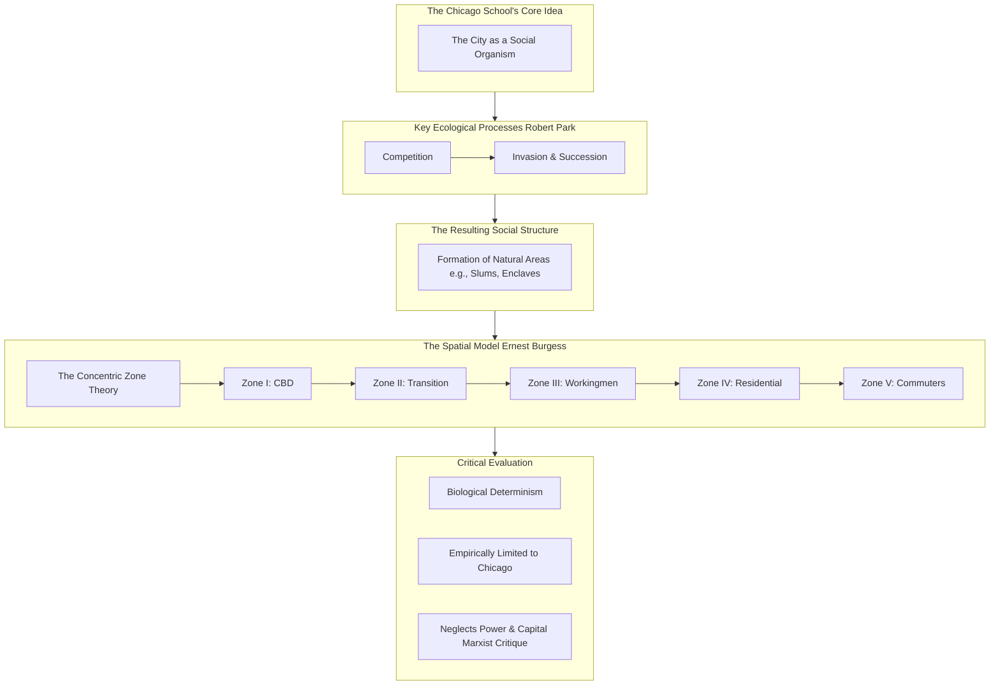
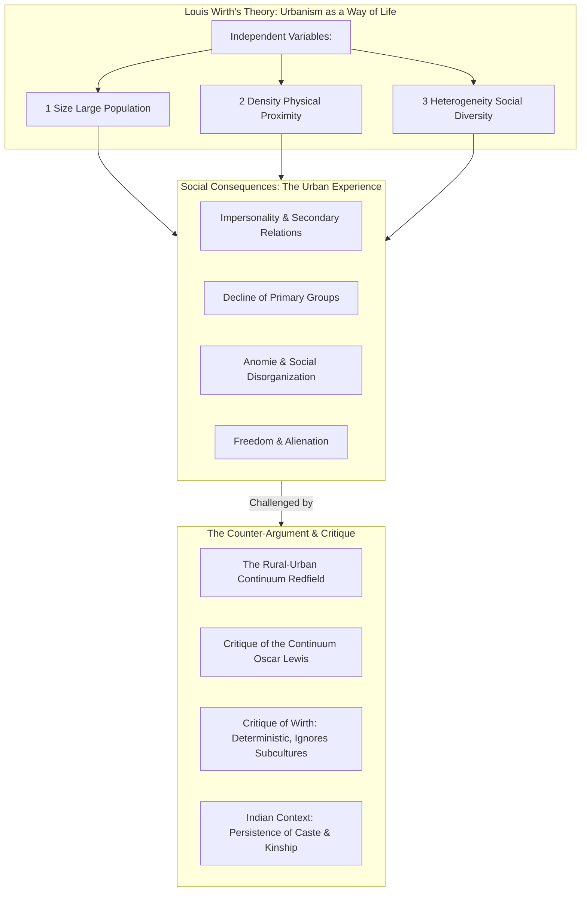
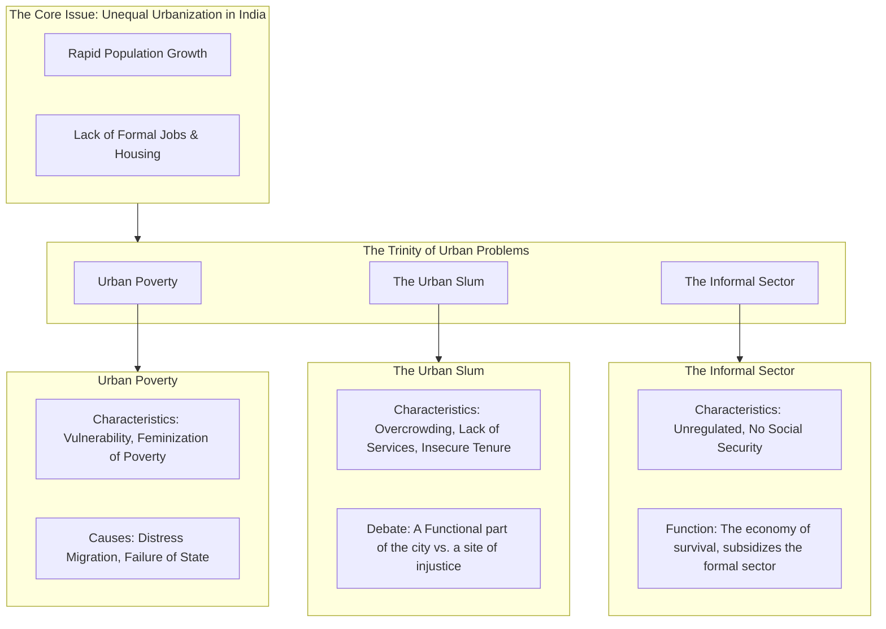
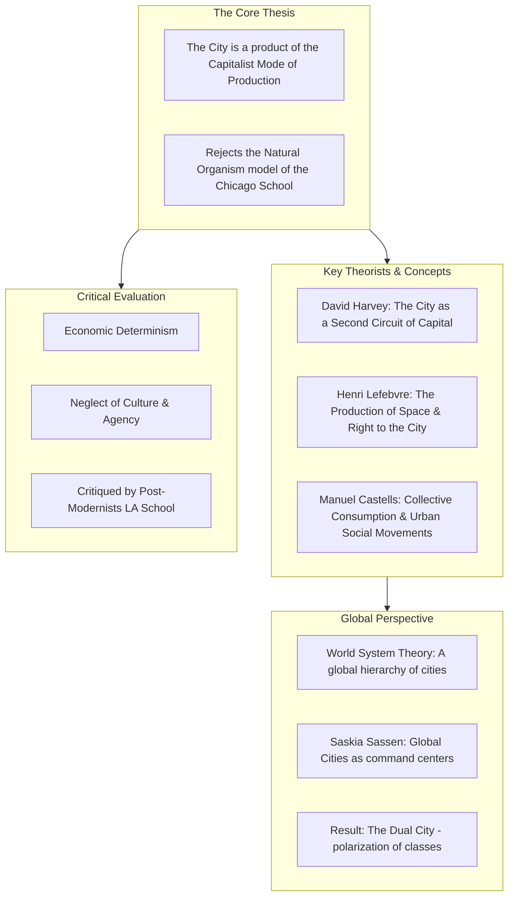
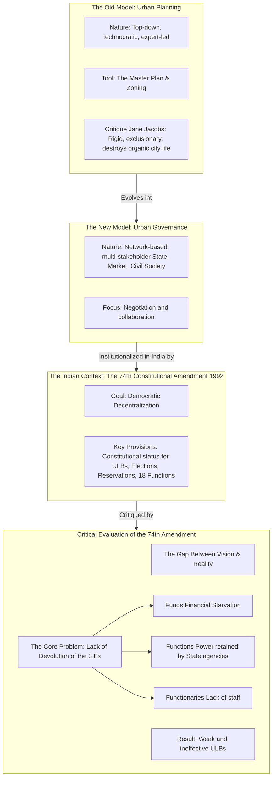
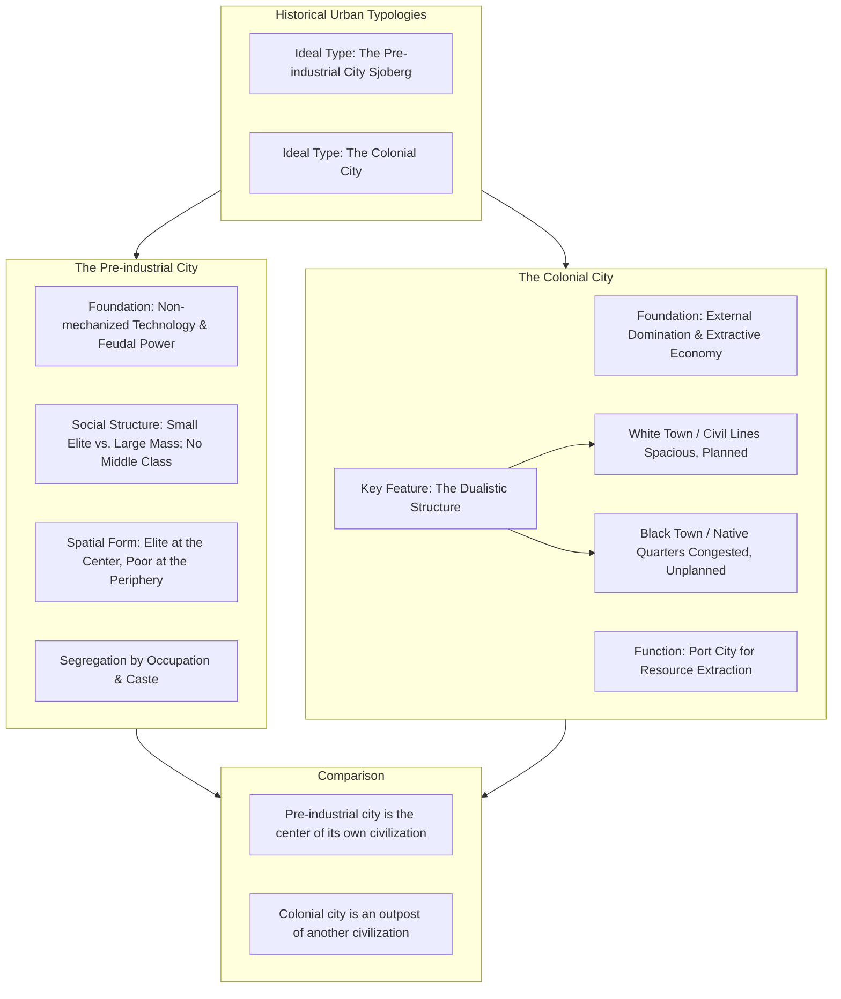
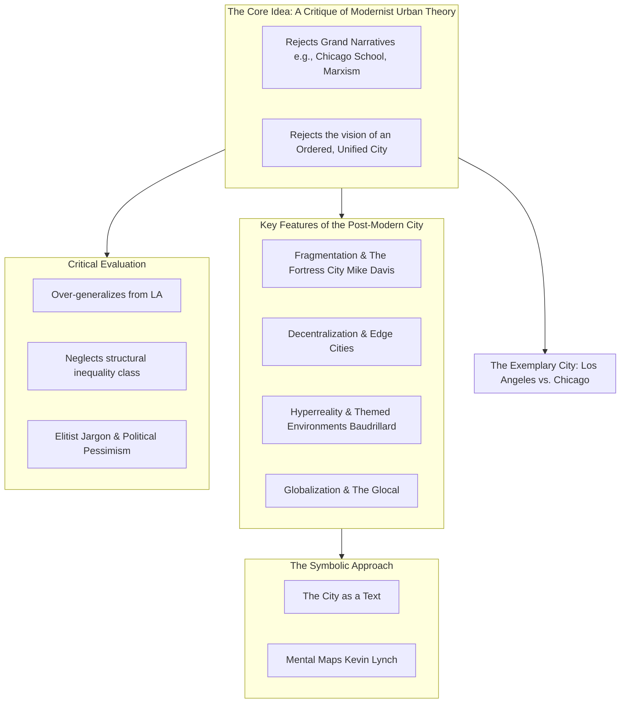
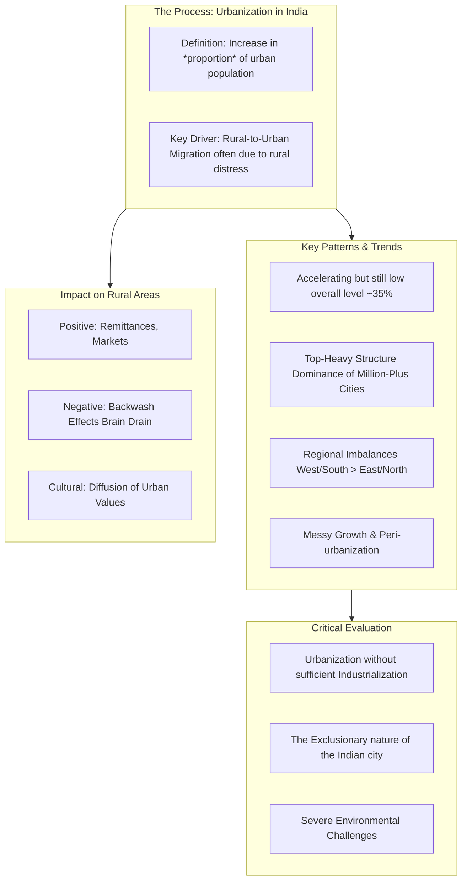
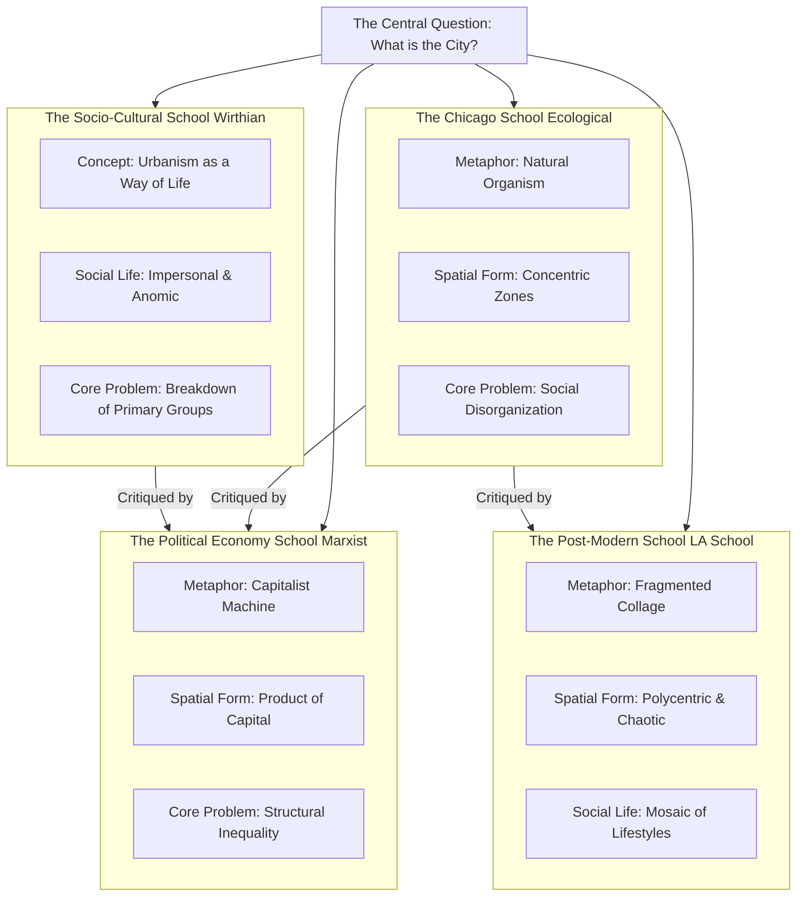

---

### **Part 1: In-depth PYQ Analysis & Strategic Plan for MSOE-004: Urban Sociology**

This analysis is designed to decode the "mind of the examiner" and provide a bulletproof strategic plan for your preparation.

#### **1. Syllabus Integration: Official IGNOU MSOE-004 Syllabus**

First, here is the official syllabus, which will serve as our foundational map.

*   **Block 1: Introduction to Urban Sociology**
    *   Unit 1: Urban Sociology: Nature and Scope
    *   Unit 2: The City and its Types
    *   Unit 3: Urbanisation and Urbanism
    *   Unit 4: Approaches to the Study of Urban Society

*   **Block 2: Perspectives on Urban Society**
    *   Unit 5: Ecological Approach
    *   Unit 6: The Political Economy Approach
    *   Unit 7: The Network Approach
    *   Unit 8: The Post-Modernist Approach

*   **Block 3: Urban Structures and Institutions**
    *   Unit 9: The Urban Community
    *   Unit 10: Urban Family and Kinship
    *   Unit 11: Urban Economy
    *   Unit 12: Urban Polity

*   **Block 4: The City in India**
    *   Unit 13: The Indian City: A Profile
    *   Unit 14: Urbanisation in India
    *   Unit 15: The Pre-colonial City
    *   Unit 16: The Colonial City
    *   Unit 17: The Post-colonial City

*   **Block 5: Urban Problems in India**
    *   Unit 18: Urban Poverty
    *   Unit 19: The Urban Slum
    *   Unit 20: Urban Environment
    *   Unit 21: Urban Social Problems

*   **Block 6: Urban Governance and Planning**
    *   Unit 22: Urban Planning
    *   Unit 23: Urban Governance
    *   Unit 24: The 74th Constitutional Amendment
    *   Unit 25: The Role of Media in Urban Governance

#### **2. Thematic Clustering & Frequency Analysis**

A thorough analysis of over a decade of PYQs reveals a remarkably consistent pattern. The questions are not random; they are drawn from a few dominant, recurring thematic clusters.

| Thematic Cluster | Core Concepts | Relevant Syllabus Blocks/Units | Frequency Score (Approx.) |
| :--- | :--- | :--- | :--- |
| **1. The Chicago School & Human Ecology** | Ecological Approach, Concentric Zone Theory (Burgess), Invasion & Succession, Urban Morphology. | **Block 2 (Unit 5)**, Block 1 (Unit 4) | **95%** (Virtually certain) |
| **2. Urban Problems in India** | Slums (socio-economic profile, role), Urban Poverty (features, factors), Informal Sector. | **Block 5 (Units 18, 19)**, Block 3 (Unit 11) | **90%** |
| **3. The Socio-Cultural Nature of Urban Life** | Urbanism as a Way of Life (Wirth), Rural-Urban Continuum (Redfield), Impact on Family/Kinship. | **Block 1 (Unit 3)**, Block 3 (Unit 10), Block 1 (Unit 4) | **85%** |
| **4. The Political Economy Approach** | Marxist/Neo-Marxist critiques, Exploitative Model, World System Theory, Political Economy of Urbanism. | **Block 2 (Unit 6)**, Block 1 (Unit 4) | **70%** |
| **5. Historical Urban Forms** | Pre-industrial City (Sjoberg), Colonial City (Kolkata), Medieval City (Shahjahanabad). | **Block 4 (Units 15, 16)**, Block 1 (Unit 2) | **65%** |
| **6. Urban Governance & Planning** | Urban Planning (nature, scope), Urban Governance, Local Self-Governance (74th Amendment), Role of Media. | **Block 6 (Units 22, 23, 24, 25)** | **60%** |
| **7. Urban Growth & Patterns in India** | Trends and patterns of urbanization in India, Models of urban growth, Urbanisation's impact on rural areas. | **Block 4 (Unit 14)**, Block 1 (Unit 3) | **55%** |
| **8. Post-Modernism & the City** | Post-modern theory of urbanism as a reaction to modernism, Fragmented city, Symbolic approach. | **Block 2 (Unit 8)**, Block 1 (Unit 4) | **45%** |

#### **3. Four-Tier Prioritization**

Based on this analysis, here is your strategic study plan.

**Tier 1: The Foundational Core (The Absolute Must-Knows)**
*   **Theme 1: The Chicago School and the Ecological Approach:**
    *   **Core Idea:** This is the absolute origin point of Urban Sociology. You must master the core concepts of human ecology (competition, invasion, succession) and its spatial models.
    *   **Topics:** The Ecological Approach; Ernest Burgess's Concentric Zone Theory (and its critiques); The Multiple Nuclei Model. (Block 2/Unit 5)

*   **Theme 2: Urban Problems in India:**
    *   **Core Idea:** This theme covers the lived reality of Indian cities. Questions are direct, frequent, and require a grasp of the socio-economic dimensions.
    *   **Topics:** The Urban Slum (its socio-economic profile, functions, and problems); Urban Poverty (its features and causes); The Informal Sector (its composition and significance). (Block 5/Units 18, 19)

*   **Theme 3: The Socio-Cultural Experience of the City:**
    *   **Core Idea:** This theme explores the classic debate on how urban life shapes personality and social relationships.
    *   **Topics:** Louis Wirth's "Urbanism as a Way of Life" (size, density, heterogeneity); The Rural-Urban Continuum vs. the Polar Approach; The impact of urbanization on family and kinship. (Block 1/Unit 3, Block 3/Unit 10)

**Tier 2: High Probability & Application**
*   **Theme 4: The Political Economy Approach:**
    *   **Core Idea:** This is the primary critical perspective, viewing the city as a product of capitalist processes, conflict, and inequality.
    *   **Topics:** Marxist and Neo-Marxist approaches (Manuel Castells, David Harvey); The city as a site of capital accumulation and class conflict. (Block 2/Unit 6)

*   **Theme 5: Urban Governance and Planning:**
    *   **Core Idea:** This theme focuses on the formal structures of managing cities.
    *   **Topics:** The nature and scope of Urban Planning; The concept of Urban Governance; The significance and critique of the 74th Constitutional Amendment. (Block 6/Units 22, 23, 24)

*   **Theme 6: Historical City Types:**
    *   **Core Idea:** Understanding the difference between modern and pre-modern cities.
    *   **Topics:** The Pre-industrial City (Gideon Sjoberg's model); The Colonial City (its dual structure, with Kolkata as a case study). (Block 4/Units 15, 16)

**Tier 3: Conceptual Breadth & Nuance**
*   **Theme 7: Post-Modern Urban Theory:**
    *   **Core Idea:** A critique of the grand, ordered models of the Chicago School and modernism. It sees the contemporary city as fragmented, multi-centered, and shaped by culture and symbols.
    *   **Topics:** Post-modern urbanism (LA School); The symbolic approach to the city. (Block 2/Unit 8)

*   **Theme 8: Urbanization Patterns in India:**
    *   **Core Idea:** Understanding the macro-level trends of how India is urbanizing.
    *   **Topics:** Major trends and patterns of urban growth in India; The impact of urbanization on rural areas. (Block 4/Unit 14)

**Tier 4: Strategic Awareness (For Short Notes & Value Addition)**
*   **Types of Cities:** Differentiating between commercial, administrative, and pilgrimage towns. (Block 1/Unit 2)
*   **Social Area Analysis:** A specific technique for studying urban populations. (Appears in PYQs but is a niche topic).
*   **Role of Media in Governance:** A specific sub-topic of the governance theme. (Block 6/Unit 25)

#### **4. Thematic Matrix: MSOE-004**

This matrix shows how key theoretical approaches (vertical) can be applied to analyze specific urban phenomena (horizontal).

| ↓ **Theoretical Lens** | **Urban Space & Form** | **Urban Social Life** | **Urban Problems (Slums/Poverty)** | **Urban Governance** |
| :--- | :--- | :--- | :--- | :--- |
| **Chicago School (Ecology)** | **CENTRAL** (Concentric Zones) | Segregation, Natural Areas | A result of competition & succession | - |
| **Wirth/Redfield (Socio-Cultural)** | - | **CENTRAL** (Anomie, Impersonality) | A manifestation of social disorganization | - |
| **Political Economy (Marxist)** | A product of capital flows | Class conflict, Alienation | **CENTRAL** (Structural inequality) | A tool of the capitalist state |
| **Post-Modernism** | Fragmented, Multi-centered | Lifestyle enclaves, Symbolic spaces | - | Fragmented, Privatized |
| **Indian Context** | Colonial vs. Post-colonial form | Persistence of caste/kinship | **CENTRAL** (Informal sector) | **CENTRAL** (74th Amendment) |

#### **5. Key Insights & Strategic Advice**

*   **The Chicago School is the Sun:** The Ecological Approach is the gravitational center of this paper. You must master it, including its concepts and critiques. It is the starting point for almost all other theories.
*   **Theory Meets Indian Reality:** The paper's structure is a dialogue between Western/global urban theories and the concrete problems of Indian cities. The best answers will always bridge this gap. For example, when discussing the informal sector, link it to the critiques of formal capitalist models from the Political Economy school.
*   **Master the Dichotomies:** Several recurring debates form the intellectual backbone of the subject. Be prepared to analyze them critically:
    *   Rural-Urban Continuum vs. Urban-Rural Dichotomy.
    *   Ecological (Orderly) Models vs. Political Economy (Conflict) Models.
    *   Modernist (Unified) City vs. Post-Modernist (Fragmented) City.
*   **Structure is Key:** For a 20-mark question, a clear structure is essential. A highly effective model is:
    1.  **Introduction:** Define the core concept and state your main argument.
    2.  **Body Paragraphs:** Explain the main theory/model.
    3.  **Critical Evaluation:** Discuss the limitations and critiques of the theory.
    4.  **Indian Context/Example:** Apply the concept to a specific Indian reality.
    5.  **Conclusion:** Summarize your analysis.

---
---
---

### **1. Detailed Thematic Plan with Syllabus Mapping (MSOE-004) - Revised & Verified**

This plan maps our strategic themes directly to the IGNOU syllabus units, providing a precise study roadmap.

**Theme 1: The Chicago School & The Ecological Approach (The Origin Point)**
*   **Core Task:** Master the foundational American school of urban sociology, its biological metaphors, and its spatial models.
*   **Syllabus Mapping:**
    *   **Primary:** Block 2, Unit 5 (Ecological Approach)
    *   **Secondary:** Block 1, Unit 4 (Approaches to the Study of Urban Society); Block 1, Unit 1 (Nature and Scope).

**Theme 2: The Socio-Cultural Experience of Urban Life (The Human Dimension)**
*   **Core Task:** Understand the classic theories on how city life shapes human personality, social interaction, and institutions.
*   **Syllabus Mapping:**
    *   **Primary:** Block 1, Unit 3 (Urbanisation and Urbanism - for Louis Wirth); Block 3, Unit 10 (Urban Family and Kinship).
    *   **Secondary:** Block 1, Unit 4 (Approaches - for Rural-Urban Continuum).

**Theme 3: Urban Problems in India (The Ground Reality)**
*   **Core Task:** Develop a deep, empirically-grounded understanding of the major challenges facing Indian cities.
*   **Syllabus Mapping:**
    *   **Primary:** Block 5, Unit 19 (The Urban Slum); Block 5, Unit 18 (Urban Poverty).
    *   **Secondary:** Block 3, Unit 11 (Urban Economy - for the Informal Sector).

**Theme 4: The Political Economy Approach (The Critical Lens)**
*   **Core Task:** Master the Marxist and neo-Marxist critiques that view the city as a product of capitalism, conflict, and power.
*   **Syllabus Mapping:**
    *   **Primary:** Block 2, Unit 6 (The Political Economy Approach).
    *   **Secondary:** Block 1, Unit 4 (Approaches).

**Theme 5: Urban Governance & Planning (The Management Dimension)**
*   **Core Task:** Understand the formal mechanisms for managing and governing urban spaces, with a focus on the Indian context.
*   **Syllabus Mapping:**
    *   **Primary:** Block 6, Unit 22 (Urban Planning); Block 6, Unit 23 (Urban Governance).
    *   **Secondary:** Block 6, Unit 24 (The 74th Constitutional Amendment); Block 6, Unit 25 (The Role of Media in Urban Governance).

**Theme 6: Historical Urban Forms (The Typological Dimension)**
*   **Core Task:** Understand the key typologies used to differentiate between cities across time and function.
*   **Syllabus Mapping:**
    *   **Primary:** Block 4, Unit 15 (The Pre-colonial City); Block 4, Unit 16 (The Colonial City).
    *   **Secondary:** Block 1, Unit 2 (The City and its Types).

**Theme 7: Post-Modern Urban Theory (The Contemporary Critique)**
*   **Core Task:** Understand the contemporary critique of grand, ordered theories and the focus on the fragmented, symbolic nature of the post-modern city.
*   **Syllabus Mapping:**
    *   **Primary:** Block 2, Unit 8 (The Post-Modernist Approach).
    *   **Secondary:** Block 1, Unit 4 (Approaches - for Symbolic Approach).

**Theme 8: Urbanization Patterns in India (The Macro Perspective)**
*   **Core Task:** Understand the broad, macro-level trends, patterns, and impacts of the urbanization process in India.
*   **Syllabus Mapping:**
    *   **Primary:** Block 4, Unit 14 (Urbanisation in India).
    *   **Secondary:** Block 1, Unit 3 (Urbanisation and Urbanism).

---

### **2. Four-Tier Prioritization & Thematic Breakdown - Revised & Verified**

This is the definitive, high-confidence prioritization based on the re-analysis.

#### **Tier 1: The Foundational Core (Virtually Guaranteed)**
These three themes are the absolute heart of the paper. They are the most frequent, most interconnected, and most essential for a high score.

*   **Theme 1: The Chicago School and the Ecological Approach**
    *   **Core Idea:** The city as a natural organism. Urban space is shaped by processes of competition, invasion, and succession, leading to predictable spatial patterns.
    *   **Topics & Sub-topics:** The Ecological Approach (Robert Park); The Concentric Zone Theory (Ernest Burgess) and its critiques; The concepts of "natural areas," invasion, and succession; The Multiple Nuclei Model as a refinement.

*   **Theme 2: Urban Problems in India**
    *   **Core Idea:** The lived reality of Indian cities is defined by informality, poverty, and spatial exclusion.
    *   **Topics & Sub-topics:** The Urban Slum (socio-economic profile, role/functions, debates on eviction vs. improvement); Urban Poverty (features, causes, feminization of poverty); The Informal Sector (its composition, significance for urban survival, relationship with the formal economy).

*   **Theme 3: The Socio-Cultural Experience of the City**
    *   **Core Idea:** The classic debate on how urban life transforms social relationships from communal and personal to impersonal and instrumental.
    *   **Topics & Sub-topics:** Louis Wirth's "Urbanism as a Way of Life" (the effects of size, density, and heterogeneity); The Rural-Urban Continuum (Robert Redfield's Folk-Urban model) and its critiques (Oscar Lewis); The impact of urbanization on family and kinship structures in India (persistence and change).

#### **Tier 2: High Probability & Critical Perspectives**
These themes provide the main critical and contextual layers to the Tier 1 topics. Expect at least one or two questions from this tier.

*   **Theme 4: The Political Economy Approach**
    *   **Core Idea:** The city is not a natural organism but a product of capitalist investment, class conflict, and state power.
    *   **Topics & Sub-topics:** Marxist and Neo-Marxist critiques of the Chicago School; The city as a circuit of capital (David Harvey); Collective consumption and urban social movements (Manuel Castells); The World System Theory's application to urban development.

*   **Theme 5: Urban Governance and Planning**
    *   **Core Idea:** The formal processes of managing and shaping the city's growth and administration.
    *   **Topics & Sub-topics:** Urban Planning (its nature, scope, and major concerns); Urban Governance (the shift from government to governance); The significance and critical evaluation of the 74th Constitutional Amendment in India.

*   **Theme 6: Historical City Types**
    *   **Core Idea:** Differentiating cities based on their dominant social and economic structures, particularly before the Industrial Revolution.
    *   **Topics & Sub-topics:** The Pre-industrial City (Gideon Sjoberg's model: feudal power structure, rigid segregation, pedestrian scale); The Colonial City (its dualistic structure, spatial segregation, role as an exploitative outpost; using Kolkata as a case study).

#### **Tier 3: Conceptual Breadth & Nuance**
These themes are important for demonstrating a well-rounded understanding and for tackling less frequent but significant questions.

*   **Theme 7: Post-Modern Urban Theory**
    *   **Core Idea:** A critique of the "grand narrative" of the modern, ordered city. The contemporary city is seen as fragmented, multi-centered, and shaped by global flows, culture, and symbolism.
    *   **Topics & Sub-topics:** Post-modern urbanism as a reaction to modernism; The city as a collage of lifestyles; The symbolic approach to the city.

*   **Theme 8: Urbanization Patterns in India**
    *   **Core Idea:** The macro-level statistical and geographical reality of India's urban transition.
    *   **Topics & Sub-topics:** Major trends and patterns of urban growth in post-independence India; The economic influence of urban areas on rural areas.

#### **Tier 4: Strategic Awareness (For Short Notes & Value Addition)**
A concise understanding of these is sufficient for rounding out answers or tackling a short note.

*   **Types of Cities:** Differentiating commercial, administrative, and pilgrimage towns.
*   **Social Area Analysis:** A specific statistical technique for classifying urban neighborhoods.
*   **Role of Media in Governance:** A specific, contemporary aspect of urban governance.
*   **Globalization & Occupational Changes:** The impact of globalization on the urban economy.

---
---

# TIER 1
## **Theme 1: The Chicago School and the Ecological Approach**

**Syllabus Reference:**
*   **Primary:** Block 2, Unit 5 (Ecological Approach).
*   **Secondary:** Block 1, Unit 4 (Approaches to the Study of Urban Society); Block 1, Unit 1 (Nature and Scope).
#### **Introduction (Argumentative)**
The Chicago School, flourishing in the early 20th century, marks the birth of urban sociology as an empirical discipline. Moving beyond the "armchair theorizing" of their European predecessors, scholars like Robert Park and Ernest Burgess treated the city of Chicago as a social laboratory. They developed the **Ecological Approach**, a powerful and influential framework that viewed the city as a natural organism. Their core argument was that the spatial and social structure of the city was not random but was shaped by impersonal ecological processes of competition, invasion, and succession, leading to a predictable and ordered urban morphology. While this approach was foundational, it has been heavily criticized for its biological determinism and its neglect of culture, power, and economic structures in shaping urban life.

#### **Intellectual Context & Core Argument**

> [!note] The City as a Laboratory
> The Chicago School's approach was a direct response to the dramatic and often chaotic growth of their city. Early 20th-century Chicago was a crucible of rapid industrialization, mass immigration from Europe, and intense social problems like crime, poverty, and ethnic conflict. The sociologists at the University of Chicago saw their city as the perfect place to study social processes in their rawest form, using methods of empirical fieldwork, mapping, and case studies.

**1. The City as a Social Organism (Robert Park)**
The intellectual leader of the school, **Robert Park**, adapted concepts from plant and animal ecology to study the city.

1.  **Biotic vs. Cultural Levels:** He argued that the city exists on two levels: the **biotic** (sub-social, competitive) and the **cultural** (social, consensual). The ecological approach focuses on the biotic level, where an impersonal struggle for survival and resources shapes the city's physical form.
2.  **Ecological Processes:** This struggle manifests through four key processes:
    1.  **Competition:** The fundamental form of interaction, an impersonal struggle for scarce resources like land and housing.
    2.  **Conflict:** When competition becomes conscious and personal.
    3.  **Accommodation:** The process by which conflict is resolved and social order is established.
    4.  **Assimilation:** The final stage where different groups merge culturally.

**2. The Concept of "Natural Areas"**
These ecological processes sort populations and institutions into distinct, homogenous urban neighborhoods that Park called **"natural areas."**

*   These are not planned by anyone but emerge "naturally" from the competitive process.
*   Examples include slums, immigrant enclaves (like "Little Sicily" or the "Ghetto"), business districts, and wealthy suburbs. Each area has its own unique social and moral character.

**3. The Process of Urban Growth: Invasion & Succession**
The city is not static. "Natural areas" are constantly changing through a dynamic process:

1.  **Invasion:** A new and different population group or land use begins to move into a "natural area" already occupied by another.
2.  **Succession:** The new group eventually displaces the original inhabitants and becomes the dominant group in the area, establishing a new social order. This cycle explains the constant process of neighborhood change.

**4. The Spatial Model: Burgess's Concentric Zone Theory**
**Ernest Burgess** translated these processes into a famous and influential spatial model of urban growth.

1.  **The Core Idea:** The city grows and develops by radiating outwards from a central core in a series of concentric circles or zones. As the city expands, each inner zone tends to invade the next outer zone.
2.  **The Five Zones:**
    1.  **Zone I: The Central Business District (CBD):** The commercial, social, and civic heart of the city. High land values, low residential population.
    2.  **Zone II: The Zone in Transition:** The most dynamic and problematic area. It surrounds the CBD and is being invaded by business and light manufacturing. It is characterized by physical decay, high population turnover, and social disorganization (slums, ghettos, crime, vice).
    3.  **Zone III: The Zone of Workingmen's Homes:** Inhabited by the stable working class who have "escaped" the Zone in Transition.
    4.  **Zone IV: The Residential Zone:** Dominated by middle-class, single-family homes and apartment buildings.
    5.  **Zone V: The Commuter's Zone:** The suburban ring, with the highest-income groups living in satellite towns.

> [!example] **Modern Applications of Ecological Concepts**
> While the specific model is dated, the core concepts remain relevant:
> 1.  **Gentrification:** This is a classic modern example of **invasion and succession**. Young, affluent professionals (the "gentry") "invade" working-class, often inner-city neighborhoods. This drives up property values and rents, eventually displacing the original residents as the area's character changes completely.
> 2.  **Ethnic Enclaves:** The concept of **"natural areas"** is still a powerful tool for understanding the formation and persistence of ethnic neighborhoods like Chinatowns, Koreatowns, or other immigrant communities in global cities.
> 3.  **Urban Planning Legacy:** The idea of separating the city into distinct functional zones, a core principle of much 20th-century urban planning, owes a significant intellectual debt to the Chicago School's model.

#### **Critical Evaluation**

The Ecological Approach, despite its foundational importance, has been heavily criticized.

1.  **Biological Determinism:** The most significant critique is that it imposes a simplistic, deterministic biological model on a complex social reality. It overemphasizes impersonal competition and neglects the role of **culture, sentiment, choice, and politics** in shaping where people live.
2.  **Empirically Limited:** The Concentric Zone model was based on the specific geography and historical conditions of Chicago in the 1920s. It does not apply well to older, pre-industrial cities, or to newer, multi-centered cities shaped by the automobile (like Los Angeles).
3.  **The Political Economy Critique:** Marxist and neo-Marxist scholars argue that the model is ideologically naive. Urban space is not shaped by "natural" processes but by the **deliberate actions of powerful actors**—capitalists, real estate developers, and the state—who structure the city to maximize profit and control labor.
4.  **Internal Refinements:** Later scholars, including those associated with the Chicago School, recognized the model's limitations. The **Multiple Nuclei Model (Harris & Ullman)**, for example, argued that cities grow around several distinct centers, not just a single CBD.

#### **Conclusion (Synthesizing)**

The Chicago School's Ecological Approach holds a monumental place in the history of sociology. Its greatest contribution was to move the study of the city from the library to the street, establishing it as an empirical science. By treating the city as a social laboratory and developing concepts like "natural areas" and "succession," it provided the first systematic theory of urban social structure. While its specific models, like the Concentric Zone Theory, have been largely superseded, and its biological determinism rightly criticized, its core legacy endures. The fundamental insight that urban space and social life are deeply intertwined remains the central preoccupation of urban sociology to this day.

#### **Comprehensive Mermaid Diagram**

---

#### **Bulletproof Add-ons**

 

> [!book] **Conceptual Toolkit**
> 1.  **Human Ecology:** The study of the relationship between human populations and their environment, particularly the spatial and temporal organization of social life.
> 2.  **Competition:** The impersonal, sub-social struggle for scarce resources (land, jobs, housing) that drives the sorting of populations in the city.
> 3.  **Invasion:** The process by which a new population group or land use begins to enter an area occupied by a different group.
> 4.  **Succession:** The end-stage of the invasion process, where the new group becomes dominant and the character of the neighborhood is transformed.
> 5.  **Natural Areas:** Distinctive urban neighborhoods that emerge "naturally" from the competitive process, not from deliberate planning (e.g., slums, ethnic enclaves).
> 6.  **Symbiosis:** The mutual dependence of different groups or land uses within the urban environment.

 

> [!eye] **Thinker's Lens**
> 1.  **Political Economy (Marxist) Lens:** A Marxist would argue that the "Zone in Transition" is not a "natural" outcome of competition. It is a **"zone of exploitation,"** deliberately created by landlords and capitalists who profit from cheap labor and dilapidated housing. The sorting of populations is a direct result of class power, not impersonal ecology.
> 2.  **Post-Modernist Lens:** A post-modernist would reject the very idea of a single, ordered, legible model like the Concentric Zones. They would see the contemporary city (like Los Angeles) as a fragmented, multi-centered, chaotic collage of "gated communities," "ethnoburbs," and theme parks that cannot be mapped by any single grand theory. This is the "LA School" vs. the "Chicago School."

 

> [!link] **Cross-Linkages**
> 1.  **Connects to:**
>     1.  **Theme 2 (Urban Problems):** The "Zone in Transition" is the classic ecological explanation for the existence of slums and social disorganization.
>     2.  **Theme 3 (Urbanism as a Way of Life):** The Chicago School provided the empirical context for Louis Wirth's theoretical work.
> 2.  **Contrasts with:**
>     1.  **Theme 4 (Political Economy Approach):** This is the primary critical alternative to the Ecological Approach.
>     2.  **Theme 7 (Post-Modern Urban Theory):** This is the contemporary critique of the Chicago School's modernist vision of an ordered city.

---

## **Quick Revision Scaffold**
## The Chicago School & Ecological Approach

### Core Idea
- **Metaphor:** The City as a **Social Organism**.
- **Method:** Empirical fieldwork; the city as a laboratory.
- **Focus:** Impersonal, biotic processes shape urban structure.

### Key Concepts & Processes
1.  **Human Ecology (Park):** Study of urban spatial & social organization.
2.  **Key Processes:** **Competition** -> **Invasion** -> **Succession**.
3.  **Result:** Formation of **"Natural Areas"** (slums, ethnic enclaves).

### The Concentric Zone Model (Burgess)
- **Logic:** City grows outwards from the center in five zones.
- **The Zones:**
    1.  **CBD:** Business core.
    2.  **Zone in Transition:** Slums, decay, social disorganization.
    3.  **Workingmen's Homes:** Stable blue-collar.
    4.  **Residential:** Middle class.
    5.  **Commuters:** Suburbs.

### Modern Applications
- **Gentrification** (as Invasion/Succession).
- **Ethnic Enclaves** (as Natural Areas).

### Critical Evaluation
- **Biological Determinism:** Ignores culture, choice, and politics.
- **Empirically Limited:** Based on 1920s Chicago.
- **Political Economy Critique:** Ignores the role of capital and power.
- **Refined by:** Multiple Nuclei Model.

### Legacy
- Founded empirical urban sociology.
- Established the link between urban space and social life as a central theme.

---
---
## **Theme 3: The Socio-Cultural Experience of the City**

**Syllabus Reference:**
*   **Primary:** Block 1, Unit 3 (Urbanisation and Urbanism); Block 3, Unit 10 (Urban Family and Kinship).
*   **Secondary:** Block 1, Unit 4 (Approaches to the Study of Urban Society).

#### **Introduction (Argumentative)**

Beyond the spatial patterns of the city, what is the nature of urban social life itself? How does living in a city change human personality, relationships, and social institutions? The classic answer to this question was provided by the Chicago School sociologist **Louis Wirth** in his seminal 1938 essay, "Urbanism as a Way of Life." Wirth formulated a powerful theoretical model arguing that three key variables—**size, density, and heterogeneity**—inevitably produce a unique urban culture characterized by impersonality, social fragmentation, and anomie. This "determinist" theory became the foundation for understanding the urban experience, but it also sparked a crucial debate, particularly from the **Rural-Urban Continuum** perspective, about whether this portrait of urban life was universally true or an over-generalized caricature.

#### **Intellectual Context & Core Argument**

> [!note] From Ecology to Social Psychology
> Louis Wirth was a core member of the Chicago School. His work should be seen as a direct attempt to create a sociological *theory* of urban life that would complement the ecological *descriptions* of urban form provided by Park and Burgess. If ecology explained the physical sorting of populations, Wirth wanted to explain the social-psychological consequences of living in the dense, diverse environments created by that process.

**1. Wirth's Theory: "Urbanism as a Way of Life"**
Wirth proposed a formal theory linking the physical characteristics of the city to its social-psychological outcomes.

1.  **The Three Independent Variables:**
    1.  **Size:** The sheer scale of population in a city makes it impossible to know everyone personally.
    2.  **Density:** The close physical proximity of a large number of socially distant individuals creates a need to filter out stimuli and avoid over-involvement.
    3.  **Heterogeneity:** The city brings together a wide variety of people from different social, ethnic, and cultural backgrounds, exposing individuals to diverse and often conflicting norms and values.

2.  **The Social Consequences (The Urban Way of Life):**
    According to Wirth, these three variables inevitably lead to a specific set of social characteristics:
    1.  **Impersonality and Superficiality:** Relationships become instrumental, segmental, and transitory. People interact based on their formal roles (e.g., customer-shopkeeper) rather than as whole personalities.
    2.  **Decline of Primary Groups:** The importance of traditional primary groups like the family and neighborhood weakens. Their functions are transferred to formal, specialized secondary groups (e.g., corporations, voluntary associations, the state).
    3.  **Social Disorganization and Anomie:** The erosion of traditional bonds and the exposure to conflicting norms lead to a state of anomie (normlessness), which manifests in higher rates of crime, suicide, and mental illness.
    4.  **Sophistication and Rationality:** On the positive side, the urban environment fosters rationality, efficiency, and a cosmopolitan outlook. The need to deal with a complex world encourages precise, calculated action.
    5.  **Freedom and Alienation:** The city offers immense personal freedom from the tight social control of the village, but this freedom comes at the cost of alienation, loneliness, and a lack of genuine community.

**2. The Counter-Argument: The Rural-Urban Continuum**
This perspective challenged Wirth's sharp dichotomy between the city and the countryside.

1.  **Robert Redfield's "Folk Society":** Anthropologist Robert Redfield, in his study of a Mexican village, constructed an **Ideal Type** of the **"Folk Society"** as the polar opposite of Wirth's urban society. It was characterized as small, isolated, homogenous, with a strong sense of group solidarity, and behavior governed by tradition and kinship.
2.  **The Continuum Model:** Redfield and others argued that real-world communities do not fit neatly into these two boxes. Instead, they can be arranged along a **continuum**, from the most "folk-like" rural villages to the most "urban-like" metropolises, with many suburban and small-town types in between.
3.  **Oscar Lewis's Critique:** In a famous re-study of the same village Redfield studied (Tepoztlán), **Oscar Lewis** found that it was not the harmonious, integrated community Redfield described. He found evidence of conflict, individualism, and social disruption, thus questioning the idealized image of "folk" life and, by extension, the sharpness of the continuum model.

> [!example] **Testing Wirth's Theory in the Indian Context**
> The Indian city provides a crucial test case that both supports and challenges Wirth's theory.
> 1.  **Evidence for Wirth:** The anonymity, fast pace of life, and formal interactions of a metropolis like Mumbai or Delhi certainly reflect Wirth's model.
> 2.  **The Challenge to Wirth:** However, numerous studies have shown the powerful **persistence of primary groups** in Indian cities. People do not simply become anonymous individuals. They maintain strong ties based on **caste, kinship (jati), and region of origin**. These networks provide a sense of community and social support, acting as a buffer against the anomie Wirth described. This is Herbert Gans's concept of **"urban villagers"** in action.

#### **Critical Evaluation**

Wirth's powerful and elegant theory has been subject to several major critiques.

1.  **Determinism and Over-generalization:** The theory is often criticized for being deterministic, suggesting that size, density, and heterogeneity will *always* produce the same effects, regardless of culture or context. It presents a single, monolithic "urban experience."
2.  **Confusing Urbanism with Modernity:** Critics like Herbert Gans argue that many of the traits Wirth described (impersonality, rationality) are not specific to the city but are characteristics of **modern industrial society** in general.
3.  **Neglect of Subcultures:** The theory has a blind spot for the vibrant subcultures and "urban villages" that exist within the city. It fails to see how people create and maintain meaningful communities in urban neighborhoods, even amidst the larger anonymous crowd.
4.  **Overly Pessimistic:** The theory presents a largely negative and pessimistic view of city life, focusing on disorganization and anomie while downplaying the positive aspects of urban culture, creativity, and freedom.

#### **Conclusion (Synthesizing)**

Louis Wirth's "Urbanism as a Way of Life" remains arguably the most influential single theory in urban sociology. It provided a powerful and coherent framework for understanding the social-psychological impact of the urban environment, and his core variables—size, density, and heterogeneity—remain indispensable tools for urban analysis. While subsequent research has shown that his model is too deterministic and fails to capture the persistence of community and subcultural life within the city, its value lies in its formulation as an **Ideal Type**. It provides a crucial baseline against which the complexities of real urban life, particularly the unique ways in which societies like India have adapted to urbanization, can be measured and understood.

#### **Comprehensive Mermaid Diagram**

---

#### **Bulletproof Add-ons**

 

> [!book] **Conceptual Toolkit**
> 1.  **Urbanism:** The distinctive way of life, social organization, and personality type associated with living in a city.
> 2.  **Primary Groups (Cooley):** Small social groups characterized by intimate, face-to-face, and emotionally deep relationships (e.g., family, close friends).
> 3.  **Secondary Groups:** Large, impersonal groups based on a specific interest or activity, with formal and instrumental relationships (e.g., a corporation, a political party).
> 4.  **Anomie (Durkheim):** A state of normlessness where social norms are weak or conflicting, leading to a sense of disorientation and rootlessness.
> 5.  **Folk Society (Redfield):** An ideal type of a pre-urban society characterized as small, homogenous, isolated, and having a strong sense of collective solidarity.
> 6.  **Urban Villagers (Gans):** A term for communities within a city (often ethnic enclaves) that maintain strong, primary-group social ties, similar to those in a village.

 

> [!eye] **Thinker's Lens**
> 1.  **Political Economy (Marxist) Lens:** A Marxist would argue that Wirth's analysis is superficial. The **alienation, anomie, and instrumental relationships** he describes are not products of "size, density, and heterogeneity." They are the direct products of **capitalism**. It is the capitalist mode of production, with its cash nexus and commodification of relationships, that creates this way of life, whether in a city or a factory town.
> 2.  **Post-Modernist Lens:** A post-modernist would see Wirth's theory as a classic "grand narrative" that tries to impose a single, monolithic experience on the city. They would argue that the contemporary city is not one "way of life" but a fragmented mosaic of countless different lifestyles, subcultures, and "scenes" that co-exist without forming a coherent whole.

 

> [!link] **Cross-Linkages**
> 1.  **Connects to:**
>     1.  **Theme 1 (Chicago School):** Wirth's theory is the social-psychological component of the Chicago School's broader project.
>     2.  **Theme 2 (Urban Problems):** The concepts of social disorganization and anomie are Wirth's theoretical explanation for the high rates of crime and deviance found in the "Zone in Transition."
> 2.  **Informs:**
>     1.  The entire debate on the **impact of urbanization on family and kinship** is a direct test of Wirth's thesis about the decline of primary groups.

---

## **Quick Revision Scaffold**
## Wirth's "Urbanism as a Way of Life"

### Core Thesis
- **Argument:** Three variables produce a unique urban culture.
- **The Variables (Independent):**
    1.  **Size** (Population Scale)
    2.  **Density** (Physical Proximity)
    3.  **Heterogeneity** (Social Diversity)

### The Consequences (The "Urban Way of Life")
- **Relationships:** Impersonal, superficial, secondary.
- **Social Bonds:** Decline of primary groups (family), rise of formal associations.
- **Psychological State:** Anomie, alienation, but also freedom and rationality.

### The Counter-Argument: Rural-Urban Continuum
- **Redfield's "Folk Society":** The ideal-typical opposite (homogenous, personal, traditional).
- **The Continuum:** Real communities lie somewhere between these two poles.
- **Oscar Lewis's Critique:** "Folk" societies are not as harmonious as Redfield claimed.

### Critical Evaluation of Wirth
- **Deterministic:** Ignores culture and choice.
- **Confuses Urbanism with Modernity/Capitalism.**
- **Ignores Subcultures:** Fails to see "urban villagers" (Gans).
- **Overly Pessimistic.**

### Indian Context
- Wirth's model is challenged by the strong persistence of **caste and kinship networks** in Indian cities.

### Legacy
- A foundational "Ideal Type" for understanding the urban experience.

---
---
## **Theme 2: Urban Problems in India**

**Syllabus Reference:**
*   **Primary:** Block 5, Unit 19 (The Urban Slum); Block 5, Unit 18 (Urban Poverty).
*   **Secondary:** Block 3, Unit 11 (Urban Economy).

#### **Introduction (Argumentative)**

While Indian cities are often portrayed as engines of economic growth and modernity, they are simultaneously arenas of extreme deprivation and inequality. The lived reality for a vast proportion of the urban population is defined by a trinity of interconnected problems: **urban poverty**, the proliferation of **slums**, and a heavy reliance on the precarious **informal sector** for survival. These are not accidental or marginal phenomena; they are systemic outcomes of India's pattern of urbanization, which has been characterized by rapid population growth without a corresponding expansion of formal employment or adequate housing. A sociological analysis reveals that slums and the informal sector are not just sites of misery but also complex social spaces of resilience, economic contribution, and political negotiation.

#### **Intellectual Context & Core Argument**

> [!note] From "Social Disorganization" to "Structural Inequality"
> The understanding of urban problems has evolved significantly.
> 1.  **The Chicago School View:** Early theories from the Chicago School saw slums and poverty as zones of **"social disorganization,"** a temporary and "natural" outcome of the ecological process of urban growth.
> 2.  **The Political Economy View:** Contemporary analysis, influenced by the **Political Economy approach**, views these problems as a **structural and permanent feature** of capitalist urbanization in developing countries. They are the result of an economic system that requires a large pool of cheap, flexible labor but fails to provide it with formal rights, housing, or social security.

**1. The Urban Slum: A Socio-Economic Profile**
Slums are the most visible manifestation of urban poverty and the housing crisis.

1.  **Defining a Slum:** A slum is an area characterized by substandard housing, overcrowding, and a lack of access to basic services like clean water, sanitation, and electricity. They are often located on hazardous or marginal land and are typically marked by insecure tenure (lack of legal ownership).
2.  **Socio-Economic Characteristics:**
    *   **Housing:** Dwellings are typically makeshift, built from temporary materials.
    *   **Overcrowding:** Extremely high population density.
    *   **Lack of Services:** Inadequate or non-existent public services (water taps, toilets, sewage, garbage collection).
    *   **Precarious Livelihoods:** The vast majority of residents work in the informal sector.
    *   **Social Fabric:** Despite the harsh conditions, slums often have a strong sense of community, built on dense networks of kinship, caste, and regional origin.

**2. The "Role" of Slums in Urban Society: A Functionalist Debate**
A common and controversial question is whether slums have a "role" or "function" in the city.

1.  **The Functionalist Argument:** From a purely economic (and often cynical) functionalist perspective, slums play several key roles:
    *   They provide a supply of **cheap labor** that subsidizes the formal economy and the middle-class lifestyle (e.g., domestic workers, construction laborers, street vendors).
    *   They provide **affordable (though inadequate) housing** for the poor in a city where formal housing is unaffordable, thus acting as a safety valve.
    *   They are hubs of the **informal economy**, producing a wide range of low-cost goods and services.
2.  **The Critical Counter-Argument:** Critics argue that this "functionalist" view is dangerous. It normalizes and justifies the existence of slums, ignoring the immense human suffering and violation of rights they represent. It treats the exploitation of the poor as a "function" for the city, rather than as a fundamental injustice that needs to be rectified.

**3. Urban Poverty: Features and Causes**
Urban poverty is distinct from rural poverty.

1.  **Key Features:** It is characterized not just by low income, but by **vulnerability**. This includes insecure employment, lack of housing tenure, exposure to environmental hazards (pollution, floods), and a constant threat of eviction. The **"feminization of poverty"** is a key feature, with women, particularly female-headed households, being disproportionately represented among the urban poor.
2.  **Primary Causes:**
    *   **Distress Migration:** A significant portion of the urban poor are migrants pushed out of rural areas due to agrarian distress, not pulled by attractive urban jobs.
    *   **Lack of Formal Employment:** The formal sector has failed to create enough jobs to absorb the growing urban labor force.
    *   **Failure of Public Services:** The state's failure to provide adequate low-cost housing, healthcare, and education traps people in a cycle of poverty.

**4. The Informal Sector: The Economy of Survival**
The informal sector (or unorganized sector) is the primary source of livelihood for the majority of the urban poor.

1.  **Definition:** It consists of economic activities that are not regulated or protected by the state. It is characterized by small-scale operations, labor-intensive work, and a lack of social security benefits (pensions, health insurance, paid leave).
2.  **Composition:** It is highly diverse, ranging from street vendors, rickshaw pullers, and construction workers to small-scale manufacturing and home-based work (e.g., garment stitching).
3.  **Relationship with the Formal Sector:** The informal sector is not separate from the formal economy. It is deeply integrated with and often **subsidizes** it. For example, large corporations often subcontract production to small, informal workshops to cut costs and avoid labor laws.

> [!example] **Dharavi, Mumbai: A Case Study**
> Dharavi is often cited as Asia's largest slum, but it is also a powerful example of the complexity of these issues.
> 1.  **As a Site of Deprivation:** It exhibits all the classic problems of overcrowding and lack of sanitation.
> 2.  **As an Economic Powerhouse:** It is also a major economic hub with a massive informal economy, producing leather goods, pottery, and recycled materials with an estimated annual turnover of over a billion dollars.
> 3.  **As a Political Battleground:** It is the site of intense conflict over "slum redevelopment" projects, pitting the interests of real estate developers and the state against the rights and livelihoods of its residents.

#### **Critical Evaluation**

The analysis of urban problems requires moving beyond simple descriptions of misery.

1.  **Beyond Victimhood: The Agency of the Poor:** It is crucial to avoid portraying the urban poor as passive victims. They are active agents who navigate a hostile environment with immense resilience, build strong social networks, and often engage in political mobilization to demand their rights.
2.  **The Spectrum of Informality:** The "informal sector" is not a monolithic category. It contains a wide spectrum, from relatively stable small-scale entrepreneurs to highly exploited wage laborers.
3.  **The Failure of Policy:** Policies towards slums have often oscillated between two extremes: **eviction/demolition** (treating slums as illegal eyesores) and **slum improvement/upgrading** (providing basic services). A rights-based approach that focuses on secure tenure and participatory planning is often advocated but rarely implemented effectively.

#### **Conclusion (Synthesizing)**

The interconnected problems of poverty, slums, and informality are not a sign of the failure of urbanization, but a direct consequence of its specific, unequal form in India. The urban poor are not a marginal group but are central to the functioning of the Indian city, providing essential labor and services that sustain its formal economy. A sociological perspective reveals that these are not simply technical problems of housing or employment, but are fundamentally political issues rooted in structural inequality and the struggle for the "right to the city." Any meaningful solution must therefore move beyond technocratic fixes to address the underlying issues of social justice, labor rights, and equitable access to urban resources.

#### **Comprehensive Mermaid Diagram**

---

#### **Bulletproof Add-ons**

 

> [!book] **Conceptual Toolkit**
> 1.  **Informal Sector:** Economic activities that are not regulated, taxed, or monitored by the state. The primary source of employment in Indian cities.
> 2.  **Social Disorganization (Chicago School):** The breakdown of social institutions and norms in a community, often attributed to rapid social change and population turnover.
> 3.  **Gentrification:** The process of neighborhood change where affluent populations move into and upgrade a working-class area, often displacing the original inhabitants.
> 4.  **Right to the City (Henri Lefebvre):** A radical concept arguing that all urban inhabitants, not just property owners or elites, have a collective right to shape and use the city and its resources.
> 5.  **Feminization of Poverty:** The social trend where women and female-headed households are becoming an increasing proportion of the poor population.

 

> [!eye] **Thinker's Lens**
> 1.  **Chicago School Lens:** This school would analyze slums as a "natural area" within the **"Zone in Transition."** They would see it as a zone of social disorganization, a temporary stage for new migrants before they assimilate and move to better neighborhoods. This view is heavily criticized for ignoring the structural and permanent nature of slums in India.
> 2.  **Political Economy (Marxist) Lens:** A Marxist would see slums and the informal sector as a direct creation of capitalism. The informal sector constitutes a **"reserve army of labor"** that keeps wages low in the formal sector. Slums are a mechanism for the reproduction of this cheap labor force at minimal cost to the capitalist state.

 

> [!link] **Cross-Linkages**
> 1.  **Connects to:**
>     1.  **Theme 1 (Chicago School):** This note provides the critical, structural counter-argument to the Chicago School's "natural" explanation of slums.
>     2.  **Theme 4 (Political Economy):** This note is the empirical, India-focused application of the Political Economy approach.
> 2.  **Informs:**
>     1.  **Theme 5 (Urban Governance):** The problem of slums and poverty is the central challenge for urban governance and planning in India.

---

## **Quick Revision Scaffold**
## Urban Problems in India

### The Core Issue
- **Unequal Urbanization:** Rapid growth without enough formal jobs or housing.
- **Result:** A trinity of interconnected problems.

### 1. The Urban Slum
- **Definition:** Substandard housing, overcrowding, no basic services, insecure tenure.
- **The "Role" Debate:**
    - **Functionalist View:** Provides cheap labor & affordable housing.
    - **Critical View:** Normalizes exploitation and injustice.

### 2. Urban Poverty
- **Key Feature:** **Vulnerability** (insecure jobs, housing, health).
- **Key Trend:** **Feminization of Poverty**.
- **Causes:** Distress migration, lack of formal jobs.

### 3. The Informal Sector
- **Definition:** Unregulated, unprotected economic activities.
- **Function:** The economy of survival for the poor.
- **Link to Formal Sector:** Is deeply integrated with and **subsidizes** the formal economy.

### Theoretical Lenses
- **Chicago School:** Slums are a "natural area" of "social disorganization." (Criticized)
- **Political Economy:** Slums are a structural outcome of capitalism, a "reserve army of labor."

### Conclusion
- These are not marginal issues but are central to the functioning of the Indian city.
- They are fundamentally political problems of inequality and the "right to the city."

---
---
---

# TIER 2

## **Theme 4: The Political Economy Approach**

**Syllabus Reference:**
*   **Primary:** Block 2, Unit 6 (The Political Economy Approach).
*   **Secondary:** Block 1, Unit 4 (Approaches); Block 5 (all units, as a critical lens).

#### **Introduction (Argumentative)**

The Political Economy Approach, rooted in the conflict tradition of Karl Marx, represents a radical and fundamental critique of mainstream urban sociology, particularly the Chicago School. It rejects the notion of the city as a natural, ecological organism. Instead, it argues that the city is a product of the capitalist mode of production, and its spatial and social form is fundamentally shaped by the dynamics of capital accumulation, class conflict, and state power. Thinkers like Henri Lefebvre, David Harvey, and Manuel Castells have demonstrated that urban space is not a neutral container for social action but is actively produced and contested, serving as both a crucial circuit for capitalist investment and a primary arena for social struggle.

#### **Intellectual Context & Core Argument**

> [!note] The Critique of the Chicago School
> The Political Economy approach emerged in the 1960s and 70s as a direct assault on the ideological blind spots of the Ecological Approach.
> 1.  **Rejection of "Natural" Processes:** It argued that concepts like "competition" and "invasion" were ideological mystifications. The reality was not an impersonal struggle, but a class-based conflict where powerful actors (capitalists, developers, the state) made deliberate decisions to shape the city for profit.
> 2.  **From Biology to Capital:** It replaced the biological metaphors of the Chicago School with the analytical categories of Marxism: capital, class, exploitation, and ideology. The central question was not "How does the city function?" but *"Cui bono?"*—Who benefits?

**1. The Core Thesis: The City as a Product of Capitalism**
The foundational argument is that the urban form is determined by the needs of the capitalist system.

1.  **The City as a Circuit of Capital (David Harvey):** Drawing on Marx, David Harvey argues that capitalism is constantly facing a crisis of over-accumulation (too much capital, not enough profitable investment opportunities). The built environment of the city becomes a crucial **"second circuit of capital."** Capital flows into massive, long-term investments in property, infrastructure, and real estate, which acts as a "spatial fix" for this crisis. This explains the constant cycle of urban development, decay, and redevelopment (gentrification).
2.  **The Production of Space (Henri Lefebvre):** Lefebvre argued that space is not a pre-existing void but is **socially produced**. Under capitalism, urban space is produced as an **abstract, commodified space**, designed for exchange value (profit) rather than use value (human needs). This leads to the creation of an alienating, homogenous urban environment.
3.  **The "Right to the City":** In response, Lefebvre articulated the radical demand for the **"right to the city"**—a collective right for all inhabitants to participate in the production of the urban spaces they live in, reclaiming it for use value.

**2. The Role of the State and Collective Consumption (Manuel Castells)**
Manuel Castells shifted the focus to the role of the state and social conflict over public services.

1.  **Collective Consumption:** In advanced capitalism, the reproduction of the labor force depends on huge public goods that are too large and unprofitable for individual capitalists to provide. These are items of **"collective consumption"**—public housing, transportation, healthcare, education.
2.  **The State as Manager:** The state steps in to manage and provide these items of collective consumption. However, the state under capitalism is inherently contradictory, caught between the need to support capital accumulation and the need to maintain social legitimacy by providing for its citizens.
3.  **Urban Social Movements:** For Castells, this contradiction makes the city a primary site of social conflict. **Urban social movements** (e.g., squatter movements, transport protests, neighborhood associations) are not just about "urban problems" but are new forms of class struggle that emerge around the politicized issue of collective consumption.

**3. The World System Theory and Global Cities**
This perspective extends the political economy approach to a global scale.

1.  **A Global Hierarchy of Cities:** The world is a single capitalist world-economy with a core, semi-periphery, and periphery. Cities are not isolated entities but are nodes in this global system, organized into a hierarchy.
2.  **Global Cities (Saskia Sassen):** At the top of this hierarchy are **"global cities"** (e.g., New York, London, Tokyo). These are not primarily industrial centers but are the command-and-control centers for the global economy, concentrating financial and specialized corporate services.
3.  **Dual City:** This global function leads to a **"dual city"**—a growing polarization between a small, highly-paid elite of transnational professionals and a vast, growing underclass of low-wage workers, often immigrants and minorities, who service their needs in the informal economy.

> [!example] **Analyzing Gentrification through a Political Economy Lens**
> The Chicago School sees gentrification as a "natural" process of invasion/succession. The Political Economy approach sees it as a deliberate strategy of capital.
> 1.  **The "Rent Gap" (Neil Smith):** Gentrification occurs in devalorized inner-city areas where there is a large gap between the actual rent being collected and the potential rent that could be collected if the area were redeveloped.
> 2.  **Capital Investment:** Developers, financial institutions, and the state collaborate to invest capital, upgrade the area, and close this "rent gap," generating massive profits.
> 3.  **Displacement as Class Struggle:** The displacement of the original working-class residents is not an unfortunate side effect; it is a necessary part of the process. It is a form of class struggle over urban space.

#### **Critical Evaluation**

The Political Economy approach, while powerful, has also been criticized.

1.  **Economic Determinism:** Critics argue that some versions of this approach are overly deterministic, reducing all urban phenomena to the logic of capital. It can neglect the role of culture, identity, and human agency in shaping the city.
2.  **Neglect of Culture:** The early political economy models were often criticized for having a "black box" when it came to culture, seeing it as a mere reflection of the economy.
3.  **Overemphasis on Production:** Castells's early work was criticized for focusing too much on consumption (collective consumption) and not enough on the sphere of production.
4.  **The Rise of the LA School:** The Post-Modernist "LA School" argues that the Marxist focus on a single logic of capital cannot explain the fragmented, chaotic, and multi-centered form of the contemporary global city.

#### **Conclusion (Synthesizing)**

The Political Economy approach fundamentally transformed urban sociology. It ripped the city out of the realm of "natural" ecology and placed it firmly in the context of capitalist dynamics, power, and conflict. By providing powerful concepts like the "production of space," "collective consumption," and the "circuits of capital," it offered a far more critical and realistic explanation for the inequalities, conflicts, and constant transformations that characterize the modern city. While it can be criticized for its economic determinism, its core insight—that the city is a terrain of struggle where powerful interests shape the built environment for profit—remains the indispensable starting point for any critical analysis of urbanism today.

#### **Comprehensive Mermaid Diagram**

---

#### **Bulletproof Add-ons**

 

> [!book] **Conceptual Toolkit**
> 1.  **Use Value vs. Exchange Value:** A core Marxist distinction. **Use value** is the practical utility of a thing (e.g., a house as shelter). **Exchange value** is its market price. The political economy approach argues that capitalism prioritizes exchange value over use value in the city.
> 2.  **Collective Consumption (Castells):** Public goods and services essential for the reproduction of labor power (e.g., public housing, transport, healthcare) that are managed by the state.
> 3.  **Production of Space (Lefebvre):** The idea that space is not a passive container but is actively and socially produced, shaped by the dominant mode of production.
> 4.  **Right to the City (Lefebvre):** The radical, collective right of urban inhabitants to participate in the creation and management of their urban environment.
> 5.  **Global City (Sassen):** A major urban node that functions as a command-and-control center for the global economy.

 

> [!eye] **Thinker's Lens**
> 1.  **Chicago School Lens:** A Chicago School sociologist would critique this approach as a conspiracy theory. They would argue that the patterns of the city emerge from the impersonal competition of thousands of individuals and businesses, not from the grand, coordinated design of a monolithic "capitalist class." They would see class segregation as a "natural" outcome of competition, not a deliberate strategy of domination.
> 2.  **Post-Modernist Lens:** A post-modernist would argue that the Political Economy approach is itself a "grand narrative" that is too totalizing. It tries to explain the entire city through the single logic of capital, ignoring the fragmentation, cultural diversity, and symbolic meanings that define the contemporary urban experience.

 

> [!link] **Cross-Linkages**
> 1.  **Connects to:**
>     1.  **Theme 2 (Urban Problems):** This approach provides the most powerful theoretical explanation for the structural causes of slums, poverty, and the informal sector.
>     2.  **Theme 5 (Urban Governance):** It provides a critical lens for analyzing urban planning and governance as tools that often serve the interests of capital over the needs of citizens.
> 2.  **Contrasts with:**
>     1.  **Theme 1 (Chicago School):** This is the primary theoretical antagonist to the Ecological Approach.
>     2.  **Theme 3 (Wirth):** It argues that alienation is a product of capitalism, not just urbanism.

---

## **Quick Revision Scaffold**

## The Political Economy Approach

### Core Thesis
- **Argument:** The city is a product of **capitalism**, not nature.
- **Focus:** Capital accumulation, class conflict, and state power.
- **Critique of:** The Chicago School's "natural" city.

### Key Theorists & Concepts
1.  **David Harvey:**
    - City as a **"Second Circuit of Capital"** (a "spatial fix" for over-accumulation).
2.  **Henri Lefebvre:**
    - **"Production of Space"**: Space is socially produced for profit (exchange value) over human needs (use value).
    - **"Right to the City"**: A radical demand for collective control over urban space.
3.  **Manuel Castells:**
    - **"Collective Consumption"**: State-provided goods (housing, transport) are sites of conflict.
    - **Urban Social Movements**: New forms of class struggle.

### Global Perspective
- **World System Theory:** A global hierarchy of cities (core, periphery).
- **Global Cities (Sassen):** Command centers of the global economy.
- **The "Dual City":** Growing polarization between a rich elite and a poor service class.

### Critical Evaluation
- **Economic Determinism:** Can neglect culture and agency.
- **Overly focused on a single logic of capital.**
- **Critiqued by Post-Modernists (LA School).**

### Conclusion
- A powerful, critical lens that reveals the role of power and profit in shaping the city.

---
---
---

## **Theme 5: Urban Governance and Planning**

**Syllabus Reference:**
*   **Primary:** Block 6, Unit 22 (Urban Planning); Block 6, Unit 23 (Urban Governance); Block 6, Unit 24 (The 74th Constitutional Amendment).
*   **Secondary:** Block 6, Unit 25 (The Role of Media in Urban Governance).

#### **Introduction (Argumentative)**

Urban planning and governance are the formal processes through which societies attempt to manage the growth, structure, and problems of their cities. Historically, urban planning was a top-down, technical exercise dominated by experts who created master plans for an ideal, ordered city. However, this approach has been increasingly replaced by the broader concept of **urban governance**, which recognizes the city as a complex arena involving a multitude of actors—including the state, private corporations, civil society, and citizens. In India, the landmark **74th Constitutional Amendment Act of 1992** was a pivotal attempt to institutionalize this shift by empowering democratic, decentralized Urban Local Bodies (ULBs). However, a critical analysis reveals a significant gap between the Amendment's vision of democratic governance and the on-the-ground reality, where ULBs often remain weak and urban governance is increasingly shaped by market forces and elite interests.

#### **Intellectual Context & Core Argument**

> [!note] From Government to Governance
> The shift in terminology from "urban government" to "urban governance" is conceptually significant.
> 1.  **Government:** Refers to the formal institutions of the state (e.g., the Municipal Corporation) and their hierarchical, top-down actions.
> 2.  **Governance:** Refers to a broader, more complex process of steering society. It involves a network of both state and non-state actors (private sector, NGOs, community groups) who collaborate, compete, and negotiate to manage the city. This shift reflects the realities of globalization and the reduced role of the interventionist state.

**1. Urban Planning: Nature, Scope, and Critiques**
Urban planning is the technical and political process of designing the physical layout and managing the land use of a city.

1.  **Nature and Scope:**
    *   **Goal:** To create an orderly, functional, and aesthetically pleasing urban environment.
    *   **Tools:** The primary tool is the **Master Plan**, a long-term, comprehensive blueprint that uses **zoning regulations** to allocate different areas of the city for specific functions (e.g., residential, commercial, industrial).
    *   **Concerns:** It deals with issues like transportation, housing, public spaces, infrastructure, and environmental management.
2.  **The Critique of Modernist Planning:** The traditional, top-down Master Plan approach, famously associated with figures like **Le Corbusier** (who designed Chandigarh), has been heavily criticized.
    *   **Technocratic and Elitist:** It is often a rigid, top-down exercise by experts that ignores the needs and knowledge of ordinary citizens.
    *   **Exclusionary:** As argued by **Jane Jacobs** in her classic critique, *The Death and Life of Great American Cities*, this kind of planning often destroys the vibrant, mixed-use, and organic life of neighborhoods, creating sterile and unsafe environments.
    *   **Inflexible:** The long-term, rigid nature of master plans makes them unable to adapt to the rapid and unpredictable changes of urban life, especially the growth of the informal sector.

**2. The 74th Constitutional Amendment Act (1992): A Landmark Reform**
This Act was a major attempt to reform urban governance in India by constitutionally empowering local, democratic bodies.

1.  **Key Objectives:**
    1.  **Constitutional Status:** To grant constitutional status to Urban Local Bodies (ULBs), making them a formal third tier of government.
    2.  **Democratic Decentralization:** To ensure regularly held elections for ULBs and to reserve seats for Scheduled Castes, Scheduled Tribes, and women (one-third of seats).
    3.  **Empowerment:** To devolve a specific list of 18 functions (listed in the Twelfth Schedule) to ULBs, including urban planning, roads, water supply, and slum improvement.
    4.  **Financial Strengthening:** To create State Finance Commissions to recommend measures for improving the financial health of ULBs.

**3. Critical Evaluation: The Gap Between Vision and Reality**
Despite its revolutionary potential, the implementation of the 74th Amendment has been deeply flawed and incomplete.

1.  **The Problem of the 3 Fs (Funds, Functions, Functionaries):** This is the central critique. State governments have been extremely reluctant to devolve real power to the ULBs.
    *   **Funds:** ULBs remain financially starved, highly dependent on grants from state governments, and lacking the power to raise their own revenue effectively.
    *   **Functions:** While the 18 functions are listed, state governments have often not transferred these powers in a meaningful way. Powerful, state-controlled parastatal agencies (like Development Authorities) continue to control key urban functions.
    *   **Functionaries:** ULBs lack the trained technical and administrative staff to carry out complex planning and management tasks.
2.  **The Rise of "Splintering Urbanism":** Instead of democratic decentralization, many cities are witnessing the rise of powerful, unelected, and often corporate-dominated bodies (like Special Purpose Vehicles for "Smart City" projects) that bypass the elected ULBs altogether.
3.  **Elite Capture:** Participatory mechanisms like ward committees have often been ineffective or have been captured by local elites, failing to give a real voice to the urban poor.

> [!example] **The "Smart Cities Mission" as a Case Study**
> The Government of India's "Smart Cities Mission" exemplifies the contradictions of modern urban governance.
> 1.  **The Vision:** It promotes a vision of technologically advanced, sustainable, and citizen-friendly cities.
> 2.  **The Governance Model:** However, its implementation relies on creating **Special Purpose Vehicles (SPVs)**, corporate-style entities that are run by bureaucrats and private sector representatives, with very little accountability to the elected Municipal Council.
> 3.  **The Critique:** Critics argue that this model undermines the spirit of the 74th Amendment. It prioritizes capital-intensive, high-tech projects in small, selected areas ("Area-Based Development") over the provision of basic services for the city as a whole, and it replaces democratic governance with a technocratic, corporate model.

#### **Conclusion (Synthesizing)**

The journey from top-down urban planning to the concept of multi-stakeholder urban governance reflects a global shift in understanding the complexity of cities. In India, the 74th Amendment provided a powerful constitutional vision for making this shift a democratic reality by empowering citizens and their local representatives. However, the persistent reluctance of state governments to devolve real power and the increasing influence of market-driven models of development have created a significant democratic deficit. The central challenge for Indian urbanism today is to bridge this gap and transform the promise of decentralized, participatory governance into a lived reality for all urban inhabitants, particularly the poor and marginalized.

#### **Comprehensive Mermaid Diagram**

---

#### **Bulletproof Add-ons**

 

> [!book] **Conceptual Toolkit**
> 1.  **Urban Governance:** The sum of the many ways individuals and institutions, public and private, plan and manage the common affairs of the city.
> 2.  **Master Plan:** A long-range, comprehensive plan for the physical development of a city, serving as a guide for zoning and land use decisions.
> 3.  **Zoning:** The practice of dividing a city into districts and prescribing regulations for the use of land and the construction of buildings within each district.
> 4.  **Urban Local Body (ULB):** The official term for municipal governance institutions in India (e.g., Municipal Corporations, Municipalities).
> 5.  **Parastatal Agency:** A state-owned corporation or agency (e.g., a city's Development Authority or Water Board) that operates alongside, and often with more power than, the elected ULB.
> 6.  **Special Purpose Vehicle (SPV):** A company-like entity created for a specific project (like a "Smart City" project), often with a mix of public and private funding and management, that operates outside the direct control of the ULB.

 

> [!eye] **Thinker's Lens**
> 1.  **Political Economy (Marxist) Lens:** From this perspective, urban planning and governance are never neutral or technical. They are key instruments of the **capitalist state**. Zoning is used to protect the property values of the rich and segregate the poor. "Smart City" projects are a classic example of **neoliberal urbanism**, where the state facilitates the accumulation of capital for private developers under the guise of "development," while bypassing democratic accountability.
> 2.  **Chicago School Lens:** An ecologist would view the failure of rigid master plans as proof of their core thesis. The city is a dynamic, living organism. The "natural" processes of competition and succession will always overwhelm the artificial, top-down designs of planners. The organic, mixed-use neighborhoods praised by Jane Jacobs are a perfect example of a "natural," well-functioning urban ecosystem.

 

> [!link] **Cross-Linkages**
> 1.  **Connects to:**
>     1.  **Theme 2 (Urban Problems):** The failure of urban planning and governance is a direct cause of the proliferation of slums and the lack of basic services for the urban poor.
>     2.  **Theme 4 (Political Economy):** This approach provides the most powerful critical lens for analyzing *why* the 74th Amendment has failed and how governance often serves elite interests.
> 2.  **Informs:**
>     1.  **Tier 4 (Role of Media):** The media plays a crucial role in urban governance by shaping public opinion, holding officials accountable, and giving a voice (or not) to marginalized communities in the planning process.

---

## **Quick Revision Scaffold**

## Urban Governance and Planning

### 1. Urban Planning (The Old Model)
- **Nature:** Top-down, expert-driven, technocratic.
- **Main Tool:** The **Master Plan** (using **Zoning**).
- **Critique (Jane Jacobs):** Rigid, elitist, destroys the organic life of the city.

### 2. Urban Governance (The New Model)
- **Nature:** A broader process involving multiple actors (state, market, civil society).
- **Focus:** Collaboration and negotiation.

### 3. The 74th Constitutional Amendment (1992)
- **Goal:** **Democratic Decentralization** for Indian cities.
- **Key Provisions:**
    - Constitutional status for **Urban Local Bodies (ULBs)**.
    - Regular elections & reservations.
    - Devolution of 18 functions.

### 4. Critical Evaluation of the 74th Amendment
- **Core Problem:** A huge gap between vision and reality.
- **The "3 Fs" Failure:** State governments have not devolved:
    1.  **Funds** (ULBs are financially weak).
    2.  **Functions** (Powerful state agencies still dominate).
    3.  **Functionaries** (Lack of skilled staff).
- **Result:** ULBs remain largely ineffective.
- **Modern Challenge:** Rise of **SPVs** ("Smart Cities") that bypass democratic ULBs.

### Conclusion
- The 74th Amendment was a landmark vision for democratic urban governance.
- Its failure to be implemented in spirit has created a major democratic deficit in Indian cities.

---
---
---

## **Theme 6: Historical City Types**

**Syllabus Reference:**
*   **Primary:** Block 4, Unit 15 (The Pre-colonial City); Block 4, Unit 16 (The Colonial City).
*   **Secondary:** Block 1, Unit 2 (The City and its Types).

#### **Introduction (Argumentative)**

The modern industrial city is a relatively recent phenomenon in human history. To understand its unique characteristics, urban sociology employs a comparative historical method, contrasting it with earlier urban forms. The most influential of these typologies is **Gideon Sjoberg's model of the "Pre-industrial City,"** which serves as an ideal type for all cities that existed before the Industrial Revolution. This pre-modern urban form, he argued, was fundamentally shaped by a feudal power structure and a non-mechanized technology. A distinct and historically significant variant is the **"Colonial City,"** which, while pre-industrial in its technology, was a product of external domination and served as a crucial link in the global capitalist system, developing a unique and deeply segregated spatial and social structure.

#### **Intellectual Context & Core Argument**

> [!note] The Use of Ideal Types
> This theme relies heavily on the Weberian methodological tool of the **Ideal Type**. Neither Sjoberg's "Pre-industrial City" nor the model of the "Colonial City" is a perfect description of any single historical city. They are analytical constructs that deliberately exaggerate certain key features to create a clear, logical model. This model can then be used as a benchmark to compare and contrast real-world cities and to understand the fundamental transformations brought about by industrialization and colonialism.

**1. The Pre-industrial City (Gideon Sjoberg)**
In his book *The Pre-industrial City: Past and Present*, Sjoberg argued that all cities from ancient Mesopotamia to 18th-century Europe shared a common set of structural characteristics because they were all based on a similar technological and social foundation.

1.  **Technological Base:** The technology was non-mechanized, relying on animate power (human and animal). This severely limited production, transportation, and communication.
2.  **Social Structure: A Feudal Order:** Society was rigidly divided into two main classes:
    *   **A small, literate elite:** Composed of religious, political, and administrative functionaries who controlled the surplus. They lived a life of leisure and cultural refinement.
    *   **A large, illiterate mass:** Composed of lower-class artisans, laborers, and the poor.
    *   There was no significant middle class. Social mobility was extremely limited.
3.  **Spatial Structure: The Primacy of the Center:** The spatial form was the inverse of Burgess's modern model.
    *   **The Center:** The most prestigious and desirable area was the city center, where the elite resided, close to the main temple/church and the palace/fort.
    *   **The Periphery:** The poorest classes and outcast groups were pushed to the periphery of the city.
    *   **Segregation:** The city was highly segregated into distinct quarters or wards based on **occupation and ethnicity/caste**, not purely on economic status.
    *   **Lack of Functional Zoning:** There was no clear separation of work and residence. Artisans lived and worked in the same premises.

**2. The Colonial City: An Externally-Imposed Form**
The colonial city was a unique hybrid. It was technologically pre-industrial but was created by and for an external, dominant power.

1.  **Dualistic Structure:** The most defining feature of the colonial city was its **dualistic structure**, a stark physical and social segregation between two distinct parts:
    *   **The "White Town" / Civil Lines:** This was the spacious, well-planned, and sanitary area where the European colonizers lived. It had wide roads, bungalows, and exclusive clubs. It was the center of colonial administration and military power.
    *   **The "Black Town" / Native Quarters:** This was the congested, chaotic, and poorly serviced area where the indigenous population was forced to live. It was the center of native commerce and residence.
2.  **Economic Function: An Exploitative Outpost:** Unlike the pre-industrial city which was the center of its own civilization, the colonial city was an economic outpost of the metropolitan power. Its primary function was to facilitate the **extraction of raw materials** from the colony and to serve as a market for manufactured goods from the mother country. This is why major colonial cities were almost always **port cities**.
3.  **A Dependent and Parasitic Relationship:** The colonial city had a parasitic relationship with its hinterland, draining its resources without contributing to its overall development.

> [!example] **Kolkata (Calcutta) as a Classic Colonial City**
> Kolkata, founded by the British, is a perfect case study of the colonial urban form.
> 1.  **Dual Structure:** It had a clear division between the spacious, monumental "White Town" around Fort William and the Dalhousie Square area, and the congested "Black Town" to the north where the Bengali population lived.
> 2.  **Port City Function:** Its location on the Hooghly river was strategic for its function as the primary port for exporting jute, tea, and other resources from Eastern India to Britain.
> 3.  **"Bridgehead" of Colonial Power:** It was the capital of British India until 1911, serving as the administrative and military "bridgehead" for the colonial conquest and control of the subcontinent.

#### **Critical Evaluation**

These ideal types are powerful tools but have limitations.

1.  **Over-generalization (Sjoberg):** Sjoberg's model has been criticized for being too monolithic. It lumps together thousands of years of urban history across diverse civilizations (e.g., ancient Rome, medieval Fez, pre-colonial Delhi) into a single type, ignoring their significant differences.
2.  **The Nature of the "Elite":** The elite in all pre-industrial cities were not the same. In some, religious leaders were dominant; in others, it was a military or bureaucratic aristocracy.
3.  **The Colonial City is Not Uniform:** The nature of the colonial city also varied depending on the specific colonial power (e.g., British vs. French vs. Portuguese) and the local context.

#### **Conclusion (Synthesizing)**

The use of historical typologies like the pre-industrial and colonial city is indispensable for urban sociology. Gideon Sjoberg's model of the pre-industrial city provides a crucial analytical baseline, demonstrating how a non-mechanized technology and a feudal power structure create a distinct urban form centered on an elite core and a segregated periphery. The model of the colonial city, in turn, shows how this form was radically reconfigured by external domination, leading to a dualistic structure designed for economic exploitation and social control. By contrasting these historical forms with the modern industrial city, we can more clearly grasp the profound and revolutionary impact of both industrial capitalism and colonialism in shaping the urban world we inhabit today.

#### **Comprehensive Mermaid Diagram**

---

#### **Bulletproof Add-ons**

 

> [!book] **Conceptual Toolkit**
> 1.  **Ideal Type (Weber):** An analytical construct that accentuates certain features of a social phenomenon to create a pure, logical model for comparative purposes.
> 2.  **Feudalism:** A social system based on a rigid hierarchy of lords, vassals, and serfs, where power is based on the control of land.
> 3.  **Dualistic Structure:** The characteristic spatial and social segregation of a colonial city into separate, unequal European and native sectors.
> 4.  **Hinterland:** The rural area surrounding a city that it serves and from which it draws its resources.
> 5.  **Primate City:** A city that is overwhelmingly the largest and most dominant city in a country, often a legacy of a colonial focus on a single port city.

 

> [!eye] **Thinker's Lens**
> 1.  **Political Economy (Marxist) Lens:** A Marxist would analyze these city types based on their **mode of production**. The pre-industrial city is a product of the **feudal mode of production**, where the elite's power comes from controlling the agricultural surplus. The colonial city is a product of **mercantile capitalism**, designed to facilitate the "primitive accumulation" of capital by draining resources from the colony to fuel the industrial revolution in the metropole.
> 2.  **Chicago School Lens:** A Chicago School ecologist would find their Concentric Zone model completely inverted in the pre-industrial city (where the rich live in the center). This would highlight that their model is specific to the modern, industrial capitalist city and not a universal law of urban growth.

 

> [![link] Cross-Linkages]
> 1.  **Connects to:**
>     1.  **Theme 1 (Chicago School):** This note provides the essential historical contrast that highlights the specificity of the Chicago School's models.
>     2.  **Theme 8 (Urbanization in India):** The legacy of the colonial urban pattern continues to shape the structure and problems of major Indian cities like Kolkata, Mumbai, and Chennai.
> 2.  **Contrasts with:**
>     1.  **Theme 7 (Post-Modern Urban Theory):** The rigid, ordered structures of these historical ideal types stand in stark contrast to the fragmented, multi-centered chaos of the post-modern city.

---

## **Quick Revision Scaffold**

## Historical City Types

### 1. The Pre-industrial City (Gideon Sjoberg)
- **Based on:** Non-mechanized technology & feudal power.
- **Social Structure:**
    - Small, literate **Elite**.
    - Large, illiterate **Mass**.
    - No significant middle class.
- **Spatial Structure (Inverse of modern city):**
    - **Elite live at the Center**.
    - **Poor live at the Periphery**.
    - Segregation by **occupation/caste**, not just income.

### 2. The Colonial City
- **Based on:** External domination for economic extraction.
- **Key Feature:** **Dualistic Structure**.
    1.  **"White Town" / Civil Lines:** For colonizers (planned, spacious).
    2.  **"Black Town" / Native Quarters:** For the colonized (congested, unplanned).
- **Function:** An **exploitative outpost**, usually a **port city**.
- **Case Study:** **Kolkata**.

### Critical Evaluation
- **Sjoberg's model:** Over-generalizes across diverse civilizations.
- **Colonial model:** Varies depending on the colonial power.

### Conclusion
- These **Ideal Types** are crucial benchmarks for understanding the revolutionary impact of industrialism and colonialism on urban form.

---
---
# TIER 3

---

## **Theme 7: Post-Modern Urban Theory**

**Syllabus Reference:**
*   **Primary:** Block 2, Unit 8 (The Post-Modernist Approach).
*   **Secondary:** Block 1, Unit 4 (Approaches - for Symbolic Approach).

#### **Introduction (Argumentative)**

Post-modern urban theory emerged in the late 20th century as a radical critique of the "grand narratives" that had previously dominated urban thought, particularly the ordered, rational models of the Chicago School and modernist planning. Championed by the **"LA School"** of urbanists, this perspective argues that the contemporary city can no longer be understood as a single, coherent, and legible entity. Instead, post-modern urbanism is characterized by **fragmentation, decentralization, and a heightened focus on culture, symbolism, and surveillance**. It sees the city not as an organism or a machine, but as a chaotic, multi-centered collage of fortified enclaves, themed environments, and global-local intersections, a landscape that defies any single explanatory model.

#### **Intellectual Context & Core Argument**

> [!note] The Shift from Chicago to Los Angeles
> The shift from modern to post-modern urban theory is often symbolized by a geographical shift in the exemplary city:
> 1.  **Chicago (The Modern City):** The model for the Chicago School was a classic industrial city with a strong, single center (the CBD) and an ordered, legible structure that could be mapped (e.g., the Concentric Zones).
> 2.  **Los Angeles (The Post-Modern City):** The "LA School" (including scholars like Edward Soja, Mike Davis, and Michael Dear) argues that Los Angeles is the prototype of the new, post-modern metropolis. It is a sprawling, decentralized, multi-centered, and socially polarized city that cannot be understood by the old models.

**1. The Critique of Modernist Urbanism**
Post-modern theory begins as a reaction against the core tenets of modernism in urban studies.

1.  **Rejection of "Grand Narratives":** It rejects the idea that a single, universal theory (like Burgess's Concentric Zones or the Marxist logic of capital) can explain the city. It emphasizes complexity, difference, and the validity of multiple, local perspectives.
2.  **Rejection of the Ordered City:** It critiques the modernist belief in a rational, planned, and socially integrated city. It argues that this vision has failed, leading instead to sterile, exclusionary, and overly controlled environments.

**2. Key Features of the Post-Modern City**
Post-modern theorists identify several key features that define the contemporary urban experience.

1.  **Fragmentation and "Fortress Cities":** The city is no longer a melting pot but a fragmented mosaic of fortified enclaves. This is Mike Davis's concept of the **"fortress city,"** where the affluent retreat into gated communities, high-security buildings, and privatized public spaces, protected by surveillance and private police. This leads to the militarization of urban space and the exclusion of the poor and "undesirable."
2.  **Decentralization and "Edge Cities":** The single, dominant Central Business District (CBD) has been replaced by a multitude of "edge cities" (a term coined by Joel Garreau)—sprawling concentrations of business, shopping, and entertainment at the periphery of the metropolis, often connected only by freeways. This creates a polycentric, sprawling urban form that lacks a single, identifiable center.
3.  **Hyperreality and Themed Environments:** The post-modern city is saturated with images, media, and simulations, creating a state of **"hyperreality"** (a concept from Jean Baudrillard) where the distinction between the real and the simulated collapses. This is visible in:
    *   **Themed Environments:** Shopping malls, theme parks (like Disneyland), and even residential communities are designed to look like idealized, simulated versions of other places or times.
    *   **Commodification of Culture:** Urban culture and history are packaged and sold as commodities.
4.  **Globalization and the "Glocal" City:** The post-modern city is a key node in global flows of capital, information, and migration. This creates a "glocal" (global + local) condition where global forces constantly interact with and reshape local cultures, leading to both homogenization and the assertion of new, hybrid identities.

**3. The Symbolic Approach to the City**
This approach, closely related to post-modernism, focuses on how people experience and interpret the city through symbols and meanings.

1.  **The City as a Text:** The city is seen as a "text" that can be read and interpreted. Its architecture, street names, monuments, and graffiti are all symbols that communicate messages about power, history, and identity.
2.  **Mental Maps (Kevin Lynch):** In *The Image of the City*, Kevin Lynch showed that people navigate the city not through a perfect cartographic map, but through a subjective **"mental map"** made up of key elements like paths, edges, districts, nodes, and landmarks. This highlighted the importance of legibility and symbolic meaning in how we experience urban space.

> [!example] **Analyzing a Shopping Mall through a Post-Modern Lens**
> A shopping mall is a perfect microcosm of the post-modern city.
> 1.  **Fortress City:** It is a privatized, controlled, and surveilled space that is designed to exclude "undesirables" (like the homeless or loitering teenagers).
> 2.  **Hyperreality:** It is a themed, artificial environment, often with simulated public squares or "streets," completely detached from its outside context. It is a space of pure consumption.
> 3.  **Fragmentation:** It contributes to the decline of traditional, public high streets and encourages a fragmented, car-dependent urban lifestyle.

#### **Critical Evaluation**

Post-modern urban theory has provided a powerful new language for describing the contemporary city, but it has also faced significant criticism.

1.  **Over-generalization from Los Angeles:** Just as the Chicago School was criticized for universalizing from Chicago, the LA School is often criticized for presenting the unique, car-dependent, and sprawling form of Los Angeles as the universal future of all cities.
2.  **Neglect of Enduring Structures:** In its focus on fragmentation, culture, and symbols, post-modernism can be criticized for downplaying the persistent, structural realities of class and economic inequality that the Political Economy approach highlights. Critics argue that the "fortress city" is simply a new manifestation of old-fashioned class struggle.
3.  **Elitism and Obscure Jargon:** The theory is often accused of being overly academic, using dense and obscure jargon that makes it inaccessible.
4.  **Political Pessimism:** By emphasizing fragmentation and the collapse of grand narratives, post-modernism can lead to a sense of political pessimism, making it difficult to imagine collective action or large-scale social change.

#### **Conclusion (Synthesizing)**

Post-modern urban theory offers an indispensable lens for understanding the profound shifts in urban life at the turn of the 21st century. By moving beyond the ordered models of modernism, it provides the critical tools to analyze the fragmentation, globalization, and cultural saturation that characterize the contemporary metropolis. While it can be criticized for its tendency to over-generalize and its neglect of structural economic forces, its core insight is undeniable: the city is no longer a simple, legible entity but a complex, contested, and symbolic landscape. It forces us to recognize that understanding the modern city requires us to be as attentive to its cultural texts and symbolic meanings as we are to its economic and ecological structures.

#### **Comprehensive Mermaid Diagram**

---

#### **Bulletproof Add-ons**

 

> [!book] **Conceptual Toolkit**
> 1.  **Grand Narrative / Metanarrative:** A large-scale theory or story that claims to provide a universal explanation for historical and social phenomena (e.g., Marxism, Freudianism). Post-modernism is deeply skeptical of such narratives.
> 2.  **Hyperreality (Baudrillard):** A condition in which the distinction between simulation and reality collapses. The simulation becomes more real than the real.
> 3.  **Fortress City (Mike Davis):** A term describing the contemporary city where public space is increasingly privatized and militarized, and the affluent live in fortified enclaves protected by surveillance and private security.
> 4.  **Edge City (Joel Garreau):** A large concentration of office space, retail, and entertainment located outside the traditional downtown, at the periphery of a metropolitan area.
> 5.  **Glocalization (Roland Robertson):** The simultaneous occurrence of both universalizing (global) and particularizing (local) tendencies in contemporary social and cultural life.

 

> [!eye] **Thinker's Lens**
> 1.  **Political Economy (Marxist) Lens:** A Marxist would argue that post-modernism is the **"cultural logic of late capitalism"** (a phrase from Fredric Jameson). The fragmentation, hyperreality, and consumer culture it describes are not a break from capitalism but its most advanced and pervasive form. The "fortress city" is a direct spatial manifestation of intensified class warfare.
> 2.  **Chicago School Lens:** A Chicago School ecologist would be bewildered by the post-modern city. They would see it as a state of extreme social disorganization, where the "natural" processes of creating an ordered, concentric city have completely broken down. They might see "edge cities" as a new form of "natural area" but would struggle to fit the overall fragmented pattern into their model.

 

> [!link] **Cross-Linkages**
> 1.  **Connects to:**
>     1.  **Theme 5 (Urban Governance):** The rise of privatized public spaces and gated communities is a key governance issue.
>     2.  **Tier 4 (Globalization):** The concept of the "glocal" city is a direct application of globalization theory to the urban context.
> 2.  **Contrasts with:**
>     1.  **Theme 1 (Chicago School):** This is the primary theoretical antagonist. It presents the opposite view of the city: fragmented and chaotic vs. ordered and legible.
>     2.  **Theme 4 (Political Economy):** While related, it contrasts by emphasizing culture and fragmentation over the single, unifying logic of capital.

---

## **Quick Revision Scaffold**

## Post-Modern Urban Theory

### Core Idea
- **A Reaction Against:** Modernist "grand narratives" (Chicago School, Marxism).
- **Rejects:** The idea of a single, ordered, unified city.
- **Exemplary City:** **Los Angeles** (decentralized) vs. Chicago (centered).

### Key Features of the Post-Modern City
1.  **Fragmentation & "Fortress City" (Mike Davis):**
    - Gated communities, privatization of public space, surveillance.
2.  **Decentralization & "Edge Cities":**
    - The end of the single, dominant CBD. A multi-centered metropolis.
3.  **Hyperreality & Themed Environments:**
    - The collapse of the real and the simulated (Baudrillard).
    - Shopping malls, theme parks as key urban forms.
4.  **Globalization & The "Glocal":**
    - The city as a node in global flows, creating hybrid cultures.

### The Symbolic Approach
- **The City as a "Text"**: Can be read and interpreted.
- **Mental Maps (Lynch):** Subjective experience of urban space.

### Critical Evaluation
- **Over-generalizes from LA.**
- **Neglects Structural Inequality:** Downplays the role of class and capital.
- **Elitist Jargon & Political Pessimism.**

### Conclusion
- A powerful lens for understanding the contemporary, fragmented, globalized city.
- Emphasizes the importance of culture, symbolism, and space.

---
---
---

## **Theme 8: Urbanization Patterns in India**

**Syllabus Reference:**
*   **Primary:** Block 4, Unit 14 (Urbanisation in India).
*   **Secondary:** Block 1, Unit 3 (Urbanisation and Urbanism).

#### **Introduction (Argumentative)**

Urbanization in India is a process of massive and historically unprecedented social transformation. While still predominantly a rural country, India is in the midst of a rapid urban transition that is reshaping its economic, political, and social landscape. This process, however, is not uniform; it is characterized by significant regional imbalances, a top-heavy urban structure dominated by a few large metropolises, and a pattern of growth often described as "messy" or "peri-urbanization." A critical analysis of these patterns reveals that Indian urbanization is driven as much by rural distress as by urban economic pull, leading to a host of challenges related to infrastructure, employment, and the complex, evolving relationship between the city and its hinterland.

#### **Intellectual Context & Core Argument**

> [!note] Defining Urbanization vs. Urban Growth
> It is crucial to distinguish between two related concepts:
> 1.  **Urbanization:** Refers to the *increase in the proportion* (percentage) of a country's population living in urban areas. It signifies a structural shift in the society from being predominantly rural to predominantly urban.
> 2.  **Urban Growth:** Refers to the *increase in the absolute number* of people living in urban areas. A country can have high urban growth without rapid urbanization if its rural population is also growing quickly. India is experiencing both.

**1. Major Trends and Patterns of Urbanization in India**
Post-independence urbanization in India can be characterized by several key trends.

1.  **Accelerating but Still Low Level:** While the *absolute number* of urban dwellers in India is enormous (over 400 million), the *level* of urbanization (the percentage of the total population) is still relatively low compared to other major economies (around 35% in 2021). However, the pace of urbanization has accelerated significantly in recent decades.
2.  **A Top-Heavy Urban Structure:** India's urban structure is highly skewed. A large and increasing proportion of the urban population is concentrated in a small number of very large metropolitan cities (those with over 1 million people), often called "million-plus cities." This leads to immense pressure on the infrastructure and resources of these megacities.
3.  **Regional Imbalances:** Urbanization is not evenly distributed across the country. It is much more advanced in the western and southern states (e.g., Maharashtra, Gujarat, Tamil Nadu, Karnataka) than in the eastern and northern states (e.g., Bihar, Uttar Pradesh, Odisha). This reflects the uneven pattern of industrial and economic development.
4.  **"Messy" Urbanization and Peri-urbanization:** A significant portion of urban growth is not happening in the core of planned cities but in their peripheries. This is **peri-urbanization**—the sprawling, largely unplanned, and semi-rural growth on the fringes of large cities. This "messy" transition zone is often characterized by a chaotic mix of land uses, inadequate infrastructure, and complex governance challenges.

**2. The Components of Urban Growth**
Urban population growth in India is driven by three main factors:

1.  **Natural Increase:** The surplus of births over deaths within the existing urban population. This has historically been the largest single component of urban growth.
2.  **Rural-to-Urban Migration:** The movement of people from the countryside to the cities. This is the most sociologically significant component, as it represents a major social shift.
3.  **Reclassification:** The process by which a rural settlement is reclassified as an urban area (a "census town") once it meets certain criteria of population size, density, and non-agricultural employment.

**3. The Impact of Urbanization on Rural Areas**
The relationship between the city and the countryside is complex and two-way.

1.  **Economic Linkages:**
    *   **Remittances:** Migrants send a significant amount of money back to their villages, which is a crucial source of income for rural households.
    *   **Markets:** Cities provide a market for rural agricultural products.
    *   **"Backwash" Effects:** However, the city can also have negative effects, draining the countryside of its most dynamic and youthful labor force ("brain drain") and outcompeting rural industries.
2.  **Social and Cultural Linkages:**
    *   **Diffusion of "Urbanism":** Migrants and the media act as channels for the diffusion of urban values, consumption patterns, and lifestyles into rural areas. This can lead to changes in family structures, aspirations, and social norms in the village.
    *   **The "Push" Factor:** It is critical to recognize that much of the migration to cities is a **"push" from the countryside** due to agrarian distress, lack of employment, and the breakdown of traditional livelihoods, rather than a "pull" from attractive urban opportunities.

> [!example] **The "Census Town" Phenomenon**
> A key feature of recent Indian urbanization is the explosion in the number of "Census Towns."
> 1.  **Definition:** These are settlements that are officially classified as rural by the state government (and thus governed by a *panchayat*) but which meet the Census of India's criteria for being urban (population > 5000, density > 400/sq km, and >75% of male workforce in non-agricultural jobs).
> 2.  **Significance:** This phenomenon reveals a large, hidden, and unplanned urban sector. These are areas in transition, often lacking the municipal governance and infrastructure needed to manage their urban characteristics, leading to significant challenges in service delivery and planning.

#### **Critical Evaluation**

A critical perspective on Indian urbanization highlights several key issues.

1.  **Urbanization without Industrialization:** Unlike the classic Western model where urbanization was driven by industrial job creation, Indian urbanization is often characterized by a shift of the workforce from low-productivity agriculture to low-productivity services in the informal sector.
2.  **The "Exclusionary" City:** The dominant model of urban development in India is often exclusionary. The formal city, with its high property values and planned infrastructure, is largely inaccessible to the poor, who are forced into the informal housing and labor markets of the slums.
3.  **The Environmental Challenge:** The rapid and often unplanned nature of urbanization is leading to a severe environmental crisis in Indian cities, including air and water pollution, depletion of groundwater, and the loss of green spaces.

#### **Conclusion (Synthesizing)**

The pattern of urbanization in India is a story of profound contradictions. It is a key driver of economic growth and social change, yet it is also deeply unequal, regionally imbalanced, and environmentally unsustainable. The top-heavy structure, the rise of "messy" peri-urban areas, and the phenomenon of "census towns" all point to a process that is largely unplanned and poorly managed. Understanding these macro-level patterns is the essential first step for grasping the specific urban problems of poverty and exclusion, and for formulating more inclusive and sustainable policies for India's urban future.

#### **Comprehensive Mermaid Diagram**

---

#### **Bulletproof Add-ons**

 

> [!book] **Conceptual Toolkit**
> 1.  **Urbanization:** The process of the increasing proportion of a population living in urban areas.
> 2.  **Peri-urbanization:** The process of dispersed, low-density urban growth on the fringes of cities, creating a hybrid rural-urban landscape.
> 3.  **Census Town:** A settlement that is administratively rural but has urban characteristics according to the Census of India's criteria. A key feature of "hidden" urbanization in India.
> 4.  **Remittances:** Money sent by migrant workers back to their families in their home communities.
> 5.  **Push and Pull Factors:** The factors that drive migration. **Push factors** are negative conditions in the place of origin (e.g., poverty, lack of jobs). **Pull factors** are perceived opportunities in the destination (e.g., employment, better services).

 

> [!eye] **Thinker's Lens**
> 1.  **Political Economy (Marxist) Lens:** A Marxist would analyze these patterns as a direct consequence of uneven capitalist development. The regional imbalances reflect the concentration of capital in certain states. The "push" factor of rural distress is a result of the penetration of capitalism into agriculture, which dispossesses small farmers. The urban informal sector is the "reserve army of labor" that this process creates.
> 2.  **Chicago School Lens:** An ecologist would be interested in how the macro-process of migration (invasion) is reshaping the ecological structure of Indian cities. They would study how new migrant groups create their own "natural areas" and how the rapid growth is leading to a constant process of succession at the urban periphery. However, their model would struggle to explain the structural causes behind these patterns.

 

> [!link] **Cross-Linkages**
> 1.  **Connects to:**
>     1.  **Theme 2 (Urban Problems):** The macro-patterns of urbanization (especially distress migration and lack of formal jobs) are the direct cause of the micro-realities of slums and urban poverty.
>     2.  **Theme 5 (Urban Governance):** The "messy" and unplanned nature of peri-urbanization and the rise of census towns pose immense challenges for urban governance.
> 2.  **Informs:**
>     1.  **Theme 3 (Urbanism as a Way of Life):** The experience of "urbanism" for a recent distress migrant living in a peri-urban area is vastly different from the classic model proposed by Wirth.

---

## **Quick Revision Scaffold**

## Urbanization Patterns in India

### 1. Core Concepts
- **Urbanization:** Increase in *proportion* (%) of urban population.
- **Urban Growth:** Increase in *absolute number*.

### 2. Key Trends & Patterns
1.  **Accelerating Pace, Low Level:** Fast growth, but still only ~35% urban.
2.  **Top-Heavy Structure:** Population is concentrated in a few huge metropolitan cities.
3.  **Regional Imbalance:** More urbanized in the West & South.
4.  **"Messy" Growth:** Proliferation of unplanned **peri-urban** areas and **"Census Towns."**

### 3. Components of Growth
1.  **Natural Increase** (births > deaths).
2.  **Rural-to-Urban Migration** (often a "push" from rural distress).
3.  **Reclassification** (villages becoming towns).

### 4. Impact on Rural Areas
- **Economic:** Remittances (positive), Brain Drain (negative).
- **Cultural:** Diffusion of urban lifestyles and values.

### Critical Evaluation
- **Urbanization without Industrialization:** Growth is in low-productivity informal services.
- **The "Exclusionary City":** The formal city is inaccessible to the poor.
- **Environmental Crisis:** Pollution, resource depletion.

### Conclusion
- India's urbanization is a story of contradictions: a driver of growth but also deeply unequal and unsustainable.

---
---
---

# TIER 4

## **Tier 4: Strategic Awareness Notes**

### **1. Types of Cities**

| Aspect | Core Idea & Explanation |
| :--- | :--- |
| **Syllabus Ref.** | Block 1, Unit 2 (The City and its Types) |
| **Core Thesis** | Cities can be classified based on their primary function, which often shapes their social and spatial character. While most large cities are multi-functional, this typology is useful for understanding the historical origins and dominant character of urban centers. |
| **Key Types** | **1. Administrative/Political Cities:** These cities are primarily centers of power, governance, and administration. Their layout is often monumental, designed to project authority. They are dominated by government buildings, and a large part of the population consists of government employees.   *Examples:* **New Delhi**, Washington D.C., Canberra, Gandhinagar.    **2. Commercial/Economic Cities:** These cities are primarily hubs of trade, finance, and industry. Their structure is shaped by the logic of the market, with a strong Central Business District (CBD), transportation networks, and industrial zones.   *Examples:* **Mumbai**, New York, Shanghai.    **3. Cultural/Religious Cities (Pilgrimage Towns):** These cities are organized around a central religious or cultural institution, such as a major temple, shrine, or university. Their calendar is often dictated by religious festivals, and their economy is heavily dependent on pilgrims and tourists.   *Examples:* **Varanasi**, Mecca, Jerusalem, Oxford. |
| **Application** | Use this typology to add nuance to any answer about a specific city. For example, when discussing the colonial city of Kolkata, you can mention that it was primarily an **administrative** and **commercial** port city. When discussing urban growth, you can contrast the planned growth of an **administrative** city like Chandigarh with the organic growth of a **commercial** city like Mumbai. |

---

### **2. Social Area Analysis**

| Aspect | Core Idea & Explanation |
| :--- | :--- |
| **Syllabus Ref.** | Appears in PYQs, related to Block 2, Unit 5 (Ecological Approach) |
| **Definition** | Social Area Analysis is a statistical technique developed in the mid-20th century to classify urban neighborhoods based on their demographic and social characteristics. It was a move to make the study of urban structure more objective and quantitative than the early Chicago School's descriptive approach. |
| **Core Thesis** | The social structure of a modern city can be understood by measuring the distribution of populations across three fundamental, independent dimensions or "constructs." |
| **The Three Dimensions** | **1. Social Rank (Economic Status):** This measures the level of wealth and occupation in a neighborhood. It is typically measured by indicators like income, education level, and the proportion of blue-collar vs. white-collar workers.    **2. Urbanization (Family Status):** This measures the "stage in the life cycle" of the population. It is measured by indicators like the fertility rate, the proportion of women in the workforce, and the percentage of single-family vs. multi-family dwellings. Neighborhoods with young families (high fertility, low female workforce participation) score low on this "urbanization" index, while areas with single professionals score high.    **3. Segregation (Ethnic Status):** This measures the degree of racial and ethnic concentration in a neighborhood. It is measured by the proportion of minority ethnic or racial groups. |
| **Application** | This is a niche but important topic. Mention it as a **quantitative successor to the Chicago School's "natural areas" concept.** While the Chicago School described areas like "the Ghetto" or "the Slum" qualitatively, Social Area Analysis provided a statistical method to classify them based on measurable data. It was a key step in the development of quantitative urban geography and sociology. |

---

### **3. Role of Media in Urban Governance**

| Aspect | Core Idea & Explanation |
| :--- | :--- |
| **Syllabus Ref.** | Block 6, Unit 25 (The Role of Media in Urban Governance) |
| **Core Thesis** | In a complex urban environment, the media (print, electronic, and now social media) plays a crucial and often contradictory role in governance. It can function as a "fourth estate" that promotes transparency and accountability, but it can also be a tool that reinforces elite agendas and marginalizes the voices of the poor. |
| **Positive Roles** | **1. Watchdog and Accountability:** The media can expose corruption, inefficiency, and illegalities in municipal government and urban development projects, holding officials accountable.   **2. Information Dissemination:** It informs citizens about urban policies, their rights, and the performance of public services.   **3. Public Forum:** It can provide a platform for public debate on urban issues, giving voice to different stakeholders.   **4. Voice for the Voiceless:** It can highlight the problems of marginalized communities (e.g., a slum demolition, lack of water supply), bringing them to the attention of the wider public and policymakers. |
| **Negative Roles & Critiques** | **1. Elite Bias:** Media outlets are often owned by large corporations and may reflect the interests of the urban elite and real estate developers. They may prioritize "world-class city" projects over the basic needs of the poor.   **2. Sensationalism:** The media may focus on sensational stories (crime, disasters) rather than systemic issues of urban planning and inequality.   **3. Manufacturing Consent:** It can be used by the state and corporate actors to build public support for controversial projects (e.g., large dams, slum "redevelopment") while downplaying their negative social and environmental impacts.   **4. The Digital Divide:** While social media has emerged as a powerful tool for citizen mobilization, its benefits are unevenly distributed, often excluding those without digital access or literacy. |
| **Application** | Use this to add a contemporary dimension to any answer on **Urban Governance (Theme 5)**. The media is a key non-state actor in the "governance" network. You can argue that the failure or success of the 74th Amendment's goal of participatory governance is heavily dependent on whether the media plays an inclusive, watchdog role or an exclusive, elite-biased one. |

---

### **4. Globalization & Occupational Changes**

| Aspect            | Core Idea & Explanation                                                                                                                                                                                                                                                                                                                                                                                                                                                                                                                                                                                                                                                                                                                                                                                                                                                                                                                                                                                                                                                                                                                                                                                                                                                                                                                              |
| :---------------- | :--------------------------------------------------------------------------------------------------------------------------------------------------------------------------------------------------------------------------------------------------------------------------------------------------------------------------------------------------------------------------------------------------------------------------------------------------------------------------------------------------------------------------------------------------------------------------------------------------------------------------------------------------------------------------------------------------------------------------------------------------------------------------------------------------------------------------------------------------------------------------------------------------------------------------------------------------------------------------------------------------------------------------------------------------------------------------------------------------------------------------------------------------------------------------------------------------------------------------------------------------------------------------------------------------------------------------------------------------- |
| **Syllabus Ref.** | Appears in PYQs, related to Block 3, Unit 11 (Urban Economy) & Block 4, Unit 14 (Urbanisation in India)                                                                                                                                                                                                                                                                                                                                                                                                                                                                                                                                                                                                                                                                                                                                                                                                                                                                                                                                                                                                                                                                                                                                                                                                                                              |
| **Core Thesis**   | Globalization, particularly since the economic liberalization of 1991 in India, has profoundly restructured the urban economy and occupational landscape. It has led to a decline in traditional manufacturing employment and a simultaneous boom in high-skill services and low-skill informal work, resulting in a growing polarization of the urban labor market.                                                                                                                                                                                                                                                                                                                                                                                                                                                                                                                                                                                                                                                                                                                                                                                                                                                                                                                                                                                 |
| **Key Changes**   | **1. Decline of Formal Manufacturing:** The old, large-scale, unionized factory jobs (e.g., in textile mills in Mumbai and Ahmedabad) have significantly declined due to global competition and de-industrialization.    **2. Rise of the Service Sector:** The major growth has been in the service sector. This is highly polarized:   &nbsp;&nbsp;&nbsp; * **High-Skill Services:** A boom in jobs in Information Technology (IT), finance, and business process outsourcing (BPO) for a small, educated, English-speaking elite.   &nbsp;&nbsp;&nbsp; * **Low-Skill Services:** A massive expansion of low-wage, precarious jobs in the informal service sector (e.g., delivery workers, security guards, domestic help) to cater to the new middle and upper classes.    **3. Increased "Flexibilization" and Informality:** Globalization has increased the pressure on companies to become more "flexible," leading to a rise in contract labor, outsourcing, and a general trend of informalization even within the formal sector. Job security has declined for many.    **4. The "Dual City" Phenomenon:** These changes contribute to the creation of a **"dual city"**—a polarized urban structure with affluent professionals living in globalized enclaves, serviced by a vast underclass of informal workers. |
| **Application**   | This is the contemporary context for any discussion of **Urban Poverty (Theme 2)** or the **Political Economy (Theme 4)**. Globalization is the primary force shaping the urban labor market today. You can argue that it has exacerbated the very inequalities that the Political Economy approach critiques, creating new forms of precarity and a widening gap between the "globalized" elite and the "localized" poor.                                                                                                                                                                                                                                                                                                                                                                                                                                                                                                                                                                                                                                                                                                                                                                                                                                                                                                                           |

---
---
---

## **Theme 0: The Grand Synthesis - Comparing the Major Approaches to Urban Sociology**

#### **Introduction**

The field of urban sociology is defined by a series of profound theoretical debates about the fundamental nature of the city. Is the city a natural, ecological organism or a product of capitalist conflict? Is its social life a unique "way of life" or simply a reflection of broader societal trends? Is its form ordered and legible or fragmented and chaotic? The answers to these questions are provided by the discipline's major theoretical schools: the **Chicago School (Ecological)**, the **Socio-Cultural (Wirthian)**, the **Political Economy (Marxist)**, and the **Post-Modernist (LA School)**. A comparative analysis of these perspectives on the city's form, social life, and core problems reveals the central intellectual tensions and the evolution of urban thought itself.

#### **Comparative Analysis Across Key Axes**

This analysis will compare the major schools across four central axes of debate.

**1. On the Fundamental Nature of the City**

| School of Thought | Core Metaphor / Concept of the City |
| :--- | :--- |
| **Chicago School (Ecological)** | **The City as a Natural Organism:** The city is a natural environment, like a biological ecosystem. Its growth and structure are governed by impersonal processes of competition, invasion, and succession. It is fundamentally an ordered, predictable system. |
| **Political Economy (Marxist)** | **The City as a Capitalist Machine:** The city is an artifact of the capitalist mode of production. It is a machine for generating profit and reproducing labor power. Its form is a direct result of capital investment strategies and class struggle. |
| **Post-Modernist (LA School)** | **The City as a Fragmented Collage:** The contemporary city has no single logic or center. It is a chaotic, fragmented, and discontinuous collage of fortified enclaves, themed environments, and global-local intersections. It is fundamentally illegible and disorderly. |

**2. On the Spatial Form of the City (Urban Morphology)**

| School of Thought | How is the City's Spatial Form Determined? |
| :--- | :--- |
| **Chicago School (Ecological)** | **Ecological Sorting:** The city is sorted into "natural areas" and concentric zones based on the impersonal competition for desirable space. The process is seen as natural and apolitical. |
| **Political Economy (Marxist)** | **Capitalist Logic:** The spatial form is deliberately structured by the decisions of capitalists, developers, and the state to maximize profit. Land use is determined by **exchange value**, not use value. Segregation is a tool of class domination. |
| **Post-Modernist (LA School)** | **Cultural & Global Forces:** The form is polycentric and fragmented, shaped by global capital flows, the automobile, and a cultural logic of segregation into lifestyle "enclaves." It rejects any single, ordered model. |

**3. On the Nature of Urban Social Life**

| School of Thought | What is the impact of the city on social relationships? |
| :--- | :--- |
| **Socio-Cultural (Louis Wirth)** | **"Urbanism as a Way of Life":** The city's size, density, and heterogeneity inevitably produce a unique culture characterized by **impersonality, secondary relationships, and anomie**. It is a deterministic view of the urban experience. |
| **Political Economy (Marxist)** | **Alienation is from Capitalism, not the City:** The alienation and instrumental relationships found in cities are not a product of "urbanism" itself, but of the **capitalist mode of production**. The city is merely the primary site where this capitalist alienation is experienced. |
| **Post-Modernist (LA School)** | **A Mosaic of Lifestyles:** There is no single "urban way of life." The city is a collection of diverse and often disconnected **subcultures and lifestyle enclaves**. Identity is more fluid and is often based on consumption patterns rather than community or class. |

**4. On the Core Urban Problem (e.g., Slums, Poverty)**

| School of Thought | What is the root cause of urban problems? |
| :--- | :--- |
| **Chicago School (Ecological)** | **Social Disorganization:** Slums are a "natural" feature of the "Zone in Transition," a temporary phase of social disorganization caused by rapid population turnover before immigrant groups eventually assimilate and move out. |
| **Political Economy (Marxist)** | **Structural Inequality:** Slums and poverty are a necessary and permanent feature of capitalist urbanization. They house the **"reserve army of labor,"** which is essential for keeping wages low and providing cheap services for the formal economy. |
| **Socio-Cultural (Louis Wirth)** | **Anomie & Breakdown of Social Control:** Urban problems are a result of the breakdown of primary group ties (family, neighborhood) and the weakening of traditional norms, leading to a state of anomie. |

#### **Conclusion: A Necessary Dialogue**

The theoretical perspectives on the city are not mutually exclusive but should be seen as a historical and intellectual dialogue. The Chicago School provided the foundational empirical method and a powerful, if flawed, model of urban order. The Political Economy approach offered the essential critical corrective, unmasking the role of power and capital that the ecologists ignored. The Socio-Cultural school focused our attention on the crucial question of the urban experience, while the Post-Modernists provide the necessary tools to grapple with the fragmented, globalized city of the contemporary era. A complete sociological understanding of the city requires the ability to use all these lenses, recognizing that the urban world is simultaneously an ecological system, a capitalist machine, a unique way of life, and a fragmented cultural text.

#### **Comprehensive Mermaid Diagram: The Grand Debate in Urban Sociology**

---
---
---

## **The Final Toolkit for MSOE-004**

### **1. High-Impact Comparative Tables**

These tables are designed to help you structure answers for the most common comparative questions.

**Table 1: The Grand Debate - Four Schools of Urban Thought**

| Feature | **Chicago School (Ecological)** | **Political Economy (Marxist)** | **Socio-Cultural (Wirthian)** | **Post-Modern (LA School)** |
| :--- | :--- | :--- | :--- | :--- |
| **Metaphor for the City** | Natural Organism | Capitalist Machine | A State of Mind | Fragmented Collage |
| **Key Process** | Competition, Succession | Capital Accumulation, Class Conflict | Anomie, Social Disorganization | Fragmentation, Simulation |
| **Spatial Form** | Concentric Zones (Ordered) | Structured by Capital (Conflictual) | (Not the main focus) | Polycentric (Chaotic) |
| **View of Slums** | A "Natural Area" in transition | A "Reserve Army of Labor" | A site of social disorganization | (Less focus, seen as excluded spaces) |
| **Key Thinkers** | Park, Burgess | Harvey, Castells | Wirth, Redfield | Soja, Davis |

**Table 2: Pre-industrial City (Sjoberg) vs. Industrial City (Burgess)**

| Feature | **Pre-industrial City (Sjoberg)** | **Industrial City (Burgess)** |
| :--- | :--- | :--- |
| **Technological Base** | Animate (Human/Animal) Power | Inanimate (Fossil Fuel) Power |
| **Spatial Logic** | **Elite at the Center**, Poor at the Periphery | **Poor/Industry at the Center**, Elite at the Periphery |
| **Social Structure** | Rigid Feudal Hierarchy (Elite vs. Mass) | Fluid Class Structure (Rise of Middle Class) |
| **Segregation Basis** | Occupation, Caste, Ethnicity | Primarily Economic Status |
| **Work & Residence** | Integrated (Artisans live & work in same place) | Separated (Functional Zoning) |

**Table 3: Rural-Urban Dichotomy (Wirth) vs. Continuum (Redfield)**

| Feature | **Rural-Urban Dichotomy (Polar Approach)** | **Rural-Urban Continuum** |
| :--- | :--- | :--- |
| **Core Idea** | The city and the village are two fundamentally different and opposite types of social organization. | There is no sharp break between rural and urban. Real communities lie on a continuous spectrum between the two ideal types. |
| **Relationships** | **Urban:** Impersonal, Secondary, Instrumental | A gradual shift from personal (rural) to impersonal (urban). |
| **Social Control** | Formal (Police, Courts) | Informal (Tradition, Kinship) |
| **Critique** | Over-generalizes and ignores the persistence of "urban villages" and primary groups within the city. | Idealizes the harmony of "folk" society (Oscar Lewis's critique) and can mask the power dynamics between city and countryside. |

---

### **2. High-Impact Sociological Quotes**

Using a direct quote can significantly elevate your answer.

| Sl. No. | Theme | Quote | Thinker |
| :--- | :--- | :--- | :--- |
| 1 | **Urbanism as a Way of Life** | "The city may be regarded as a... mosaic of social worlds in which the transition from one to the other is abrupt. The juxtaposition of divergent personalities and modes of life tends to produce a relativistic perspective..." | Louis Wirth |
| 2 | **The Right to the City** | "The right to the city is far more than the individual liberty to access urban resources: it is a right to change ourselves by changing the city." | David Harvey (interpreting Lefebvre) |
| 3 | **Critique of Modernist Planning** | "[Modernist planning] is the dishonest mask of the unlimited power of the highway lobby. It is the arrogant mask of a benign imperialistic colonialism toward the poor and the unlucky." | Jane Jacobs |
| 4 | **The Post-Modern City** | "Los Angeles is a city of 'fortress cities,' a place where the defense of luxury has given birth to a new militarization of urban space." | Mike Davis (paraphrased) |
| 5 | **The Pre-industrial City** | "The preindustrial city is a product of a 'feudal' social structure, one in which a small literate elite controls the mass of the populace." | Gideon Sjoberg (paraphrased) |

---

### **3. Jargon & Keyword Bank**

Using precise terminology demonstrates mastery.

| Keyword | Associated Thinker(s) / Concept | Brief Meaning |
| :--- | :--- | :--- |
| **Human Ecology** | Chicago School (Park) | The study of the city as a natural environment, focusing on the spatial distribution of populations through competition. |
| **Invasion & Succession** | Chicago School | The ecological process by which one population group or land use displaces another in a neighborhood. |
| **Urbanism** | Louis Wirth | The distinctive social and psychological experience of city life, characterized by impersonality, anomie, and rationality. |
| **Informal Sector** | Urban Problems | The unregulated, unprotected part of the urban economy where the majority of the poor work for survival. |
| **Political Economy** | Marx, Harvey, Castells | The approach that analyzes the city as a product of capitalist investment, class conflict, and state power. |
| **Use Value vs. Exchange Value** | Lefebvre, Harvey | The conflict between the value of a place for human life/needs (use) and its value as a commodity for profit (exchange). |
| **Gentrification** | Neil Smith | The process of neighborhood change where affluent groups displace lower-income residents, driven by a "rent gap." |
| **Dual City** | Castells, Sassen | The social and spatial polarization of a city into affluent, globalized enclaves and impoverished, marginalized peripheries. |
| **74th Amendment** | Urban Governance | The 1992 Indian constitutional reform aimed at empowering democratic Urban Local Bodies (ULBs). |
| **Peri-urbanization** | Urbanization Patterns | The "messy," sprawling, and largely unplanned growth on the fringes of large cities. |
| **Hyperreality** | Post-Modernism (Baudrillard) | A condition where simulations of reality become more real than reality itself, characteristic of themed urban spaces like malls. |

---

### **4. Thinker's Map**

A quick reference for linking key scholars to their central themes.

| School of Thought | Key Thinker(s) | Core Theme(s) |
| :--- | :--- | :--- |
| **Chicago School (Ecological)** | **Robert Park, Ernest Burgess** | Human Ecology, Concentric Zones, Natural Areas |
| **Socio-Cultural School** | **Louis Wirth, Robert Redfield** | Urbanism as a Way of Life, Folk-Urban Continuum |
| **Political Economy (Marxist)** | **David Harvey, Manuel Castells, Henri Lefebvre** | Capital Accumulation, Collective Consumption, Production of Space |
| **Historical-Typological** | **Gideon Sjoberg** | The Pre-industrial City |
| **Post-Modernist (LA School)** | **Edward Soja, Mike Davis** | Fragmented City, Fortress City, Post-modern Urbanism |
| **Planning Critique** | **Jane Jacobs** | Critique of Modernist Planning, Importance of Mixed-Use |
| **Indian Sociology** | **M.N. Srinivas** | Study of Lived Urban/Rural Realities |

---
---

