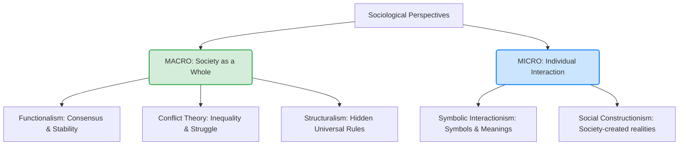
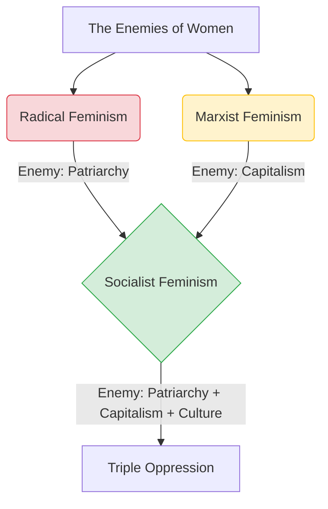
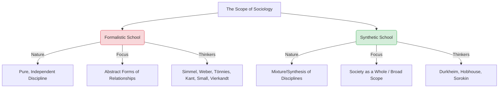
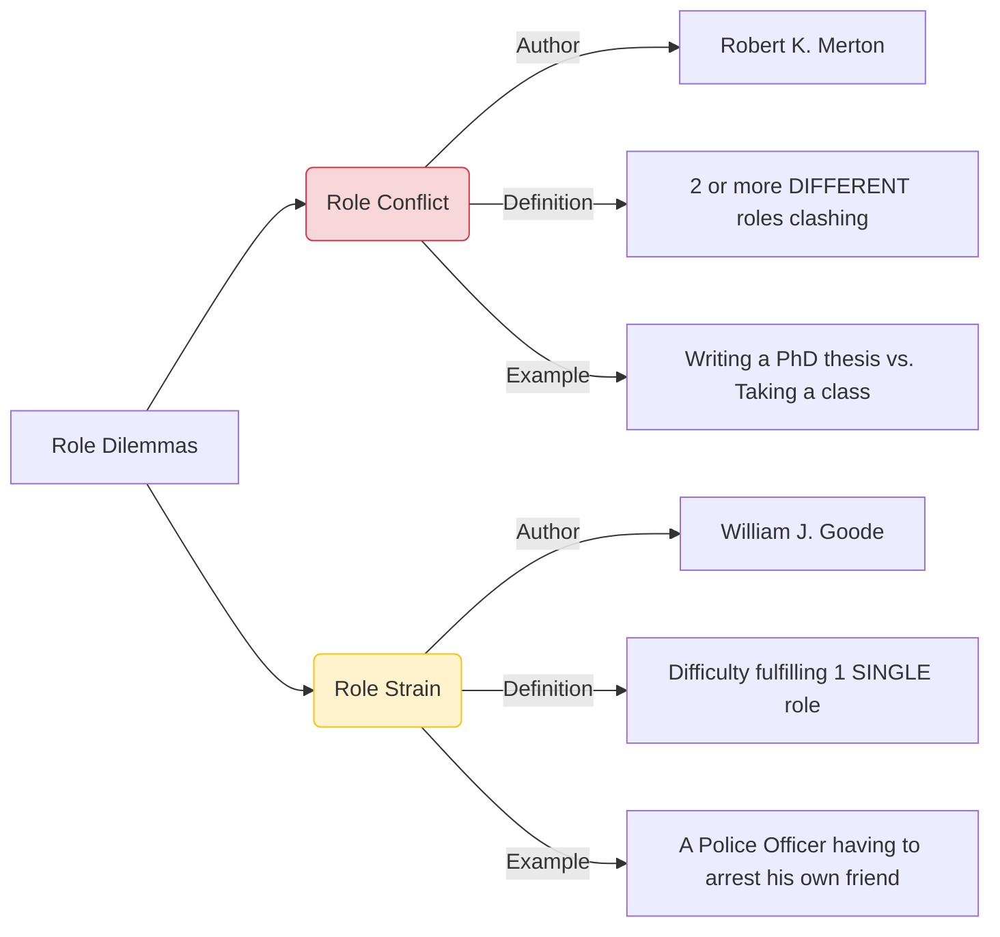
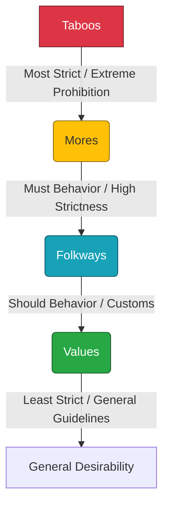

***
# **UGC NET Sociology: Foundations & Perspectives (Comprehensive Notes)**
*Based on Antara Chak's Mega Marathon Transcript*

## **MODULE 1: THE GENESIS OF SOCIOLOGY**

### **1. Sociology vs. Common Sense**
*   **Common Sense:** Accepts societal happenings without questioning. Relies on routine beliefs (e.g., "People are poor because they are lazy").
*   **Sociology:** Questions everything analytically. Looks for structural, in-depth reasons behind phenomena (e.g., Poverty is driven by class differentiation, caste stratification, and structural inequalities).

### **2. The Lineage & Etymology of Sociology**
*   `[JRF Edge]` **Etymology Trap:** The word "Sociology" is a hybrid of two languages: **Socius** (Latin = companion) + **Logos** (Greek = study).
*   `[JRF Edge]` **The Infamous Father:** **Ibn Khaldun** (14th Century). Wrote the famous book ***Muqaddimah***. He discussed sociological concepts 400 years before European thinkers, exposing the "Eurocentric Bias" of the discipline.
*   **The Father of Sociology:** **Auguste Comte** (Coined the term in 1838/1839).
    *   `[Origin Trap]` Comte initially named the discipline **"Social Physics."** He was forced to change it to "Sociology" because another thinker, **Adolphe Quetelet**, had already used the term.
*   **The Second Father:** **Herbert Spencer**.
*   **The Academic Father:** **Émile Durkheim** (First to introduce sociology as a formal university discipline).
*   **The Mother of Sociology:** **Harriet Martineau**.

### **3. The Three Pillars of Emergence (Eurocentric View)**
Sociology emerged in 19th-century Europe as a response to massive societal upheaval caused by three major events:

**I. The Enlightenment (17th - 18th Century)**
*   **Nature:** An intellectual and philosophical awakening. Also known as the **Age of Reason** or **Age of Rationality**.
*   **Shift:** Moved society away from blind faith, religion, and superstition toward **Science, Individualism, and Skepticism** (questioning the "why").
*   **Key Thinkers:** John Locke, Voltaire, and **Montesquieu**.
    *   `[JRF Edge]` *Exam Trap:* Montesquieu wrote the highly tested book ***The Spirit of Laws***, which heavily inspired Émile Durkheim.
*   **Counter-Enlightenment:** A reactionary movement defending traditional/religious culture against scientific rationality. 

**II. The Industrial Revolution (Late 18th - 19th Century)**
*   **Nature:** Technological and commercial revolution (e.g., the Steam Engine).
*   **Timeline Context:** *Occurred concurrently with the British entering India as colonizers.*
*   **Shift:** Moved society from rural/agricultural to urban/mechanized (Urbanization).
*   **Sociological Impact:** Created massive new social problems (slums, poverty, class restructuring, factory exploitation) that existing disciplines (Economics, Political Science) could not study holistically.

**III. The French Revolution (1789)**
*   **Nature:** Social and political revolution.
*   **Shift:** Overthrew the Monarchy and the **Feudal Estate System**.
    *   **[MTF-Ready: The Three Estates]**
        1.  **First Estate:** Clergy (Religious leaders).
        2.  **Second Estate:** Nobility (Kings, Military).
        3.  **Third Estate:** Commoners (The general public).
*   **Sociological Impact:** Introduced concepts of Democracy, Citizenship, and the quest for political stability.

### **4. Modernity & The Natural Science Inspiration**
*   Early sociologists suffered from "physics envy" and wanted to model sociology after the natural sciences.
*   **Key Inspirations:** **Isaac Newton** (Physics/Gravity) and **Charles Darwin** (Biology/Evolution).
*   **Features of Modernity:**
    *   Focus on Science and Rationality.
    *   **Universal Truth:** The belief that scientific facts (e.g., water boils at 100°C) apply equally everywhere.
    *   **Objectivity:** Factual, verifiable data.

### **5. Defining the Discipline**
**A. Alex Inkeles**
*   **Book:** ***What is Sociology?***
*   **The 3 Domains of Sociology:**
    1.  **Analytical:** Understanding social phenomena and aggregating social problems (e.g., studying poverty not just as an individual issue, but a societal one).
    2.  **Historical:** Recognizing that every topic (caste, stratification) has a historical background.
    3.  **Empirical:** Studying things that can be directly, practically experienced and proven on the ground (e.g., you cannot empirically prove you saw a ghost).

**B. C.W. Mills (American Sociologist)**
*   **Book:** ***The Sociological Imagination*** (1959).
*   **Core Concept:** The ability to connect individual lives to broader societal structures.
*   **Two Key Connections:**
    1.  **Personal Troubles vs. Public Issues:** What seems like a personal failure (e.g., unemployment, divorce, illness) is often tied to a massive public/structural issue (e.g., economic recession, failing healthcare system).
    2.  **Biography vs. History:** Connecting one's personal life story (Biography) to the broader timeline of society (History).

### **6. Natural Science vs. Social Science**
*   *A-R Cue:* **Because** human beings have free will and change their minds, **Therefore** social sciences cannot perfectly replicate the methods of natural sciences.
*   **[MTF-Ready Table: Key Differences]**
    *   **Natural Science (Physics/Chem):** Predictable Data | Objective (Factual) | Easily Verifiable.
    *   **Social Science (Sociology):** Unpredictable Data | Subjective (Opinion-based) | Difficult to Verify.

***

## **MODULE 2: SOCIOLOGICAL PERSPECTIVES & SCHOOLS OF THOUGHT**

*(Visual Aid: Cognitive map separating perspectives by scale. NTA frequently tests whether a theory is Macro or Micro).*

### **1. Functionalism (Macro)**
*   **Core Idea:** Society is a complex system whose parts work together to promote solidarity and stability (Consensus). Everything, even poverty, has a "function."
*   **Organic Analogy:** `[Origin: Herbert Spencer]` Compares society to a human body. Just as the heart, lungs, and brain work together to keep the body alive, social institutions (Family, Education, Economy) work together to keep society stable.
*   **Key Thinkers:** Herbert Spencer, Émile Durkheim, Talcott Parsons, Robert K. Merton.
*   `[Versus Trap]` **Pure vs. Structural Functionalism:**
    *   **Pure Functionalism:** Bronisław Malinowski (Did not use the word "structure").
    *   **Structural Functionalism:** A.R. Radcliffe-Brown (First to strictly introduce the word "structure" to functionalism).

### **2. Conflict Theory (Macro)**
*   **Core Idea:** Rejects functionalist consensus. Society is driven by inequality, power struggles, and competition for limited resources.
*   **Dialectics:** `[Origin: G.W.F. Hegel]` The mechanism of conflict.
    *   **Thesis** (Idea A) vs. **Antithesis** (Idea B) $\rightarrow$ Results in **Synthesis** (Idea C).
*   **Key Thinkers:** Karl Marx (Founder), C.W. Mills, Ralf Dahrendorf, Lewis Coser, Randall Collins.

### **3. Symbolic Interactionism (Micro)**
*   **Core Idea:** People interact using symbols (language, gestures, writing). Society is built upward from these micro-level, day-to-day interactions and the meanings we attach to them.
*   **Key Thinkers:** 
    *   **George Herbert Mead** (Founder/Father).
    *   **Herbert Blumer** `[Origin Trap]` (He *coined* the term "Symbolic Interactionism").
    *   C.H. Cooley, Erving Goffman (Dramaturgy is a subset of this).

### **4. Structuralism (Macro)**
*   **Core Idea:** Despite outward differences, all human societies share a universal, hidden, underlying structure.
*   **Key Thinkers:**
    *   **Ferdinand de Saussure:** Father of Structuralism (in Linguistics).
    *   **Claude Lévi-Strauss:** Father of Structural Anthropology. Brought the theory to sociology/anthropology. Famous for **Binary Oppositions** (understanding the world in pairs: Night/Day, Good/Bad, Raw/Cooked).

### **5. Neo-Marxism / Critical Theory / Frankfurt School**
*   **Core Idea:** Modifies traditional Marxism. Marx focused *only* on the economy (money). Critical theorists argue that **Culture** also plays a massive role in oppression. Also known as **Cultural Marxism**.
*   **Key Thinkers:** Max Horkheimer, Theodor Adorno, Jürgen Habermas, Herbert Marcuse, Walter Benjamin.

### **6. Social Constructionism**
*   **Core Idea:** Human behaviors, meanings, and concepts are not natural; they are created (constructed) by society.
*   **Key Thinkers:** Peter Berger & Thomas Luckmann (Book: *The Social Construction of Reality*).

### **7. Post-Modernism**
*   **Core Idea:** Rejects the Enlightenment's focus on absolute Science and Universal Truth. Embraces **Multiple Truths**, subjectivity, and the fluidity of society.
*   `[JRF Edge]` **Rejection of Meta-Narratives:** Post-modernists reject "Grand Narratives" (like Marx's theory of capitalism or Newton's laws applied to society) because no single theory can explain everyone's unique experience.
*   **Key Thinkers:** Jean-François Lyotard, Jean Baudrillard, Michel Foucault.

### **8. Post-Structuralism**
*   **Core Idea:** Critiques Structuralism. Argues that meanings and language are *not* stable or universal.
*   **Key Thinkers:** **Jacques Derrida** (Famous for the concept of **Deconstruction**—breaking things down because universal meanings are impossible), Michel Foucault, Judith Butler.

### **9. Post-Colonialism & De-Colonial Theory**
*   **Post-Colonialism:** Critiques the colonizers (the West). Rejects the biased, exotic, and negative histories written about the East by Western administrators.
    *   **Key Concept:** **Orientalism** (Book by **Edward Said**, 1978). How the West painted a fake, exotic picture of the East.
    *   **Key Thinkers:** Edward Said, Frantz Fanon, Gayatri Spivak.
*   **De-Colonial Theory:** Broader than East vs. West; challenges colonial ideas globally.
    *   **Key Thinkers:** Walter Mignolo, Aníbal Quijano, María Lugones.

### **10. Indological Approach (Indian Context)**
*   **Core Idea:** Understanding Indian society strictly through its classical texts and traditions (Vedas, Puranas, Dharmashastras).
*   **Key Thinkers:** Max Müller, A.L. Basham, Romila Thapar, G.S. Ghurye, Irawati Karve, Louis Dumont.

### **11. Humanistic Perspective**
*   **Core Idea:** The social world is fundamentally different from the natural world. Therefore, we must study society from the perspective of human beings (Hermeneutics/Interpretation), not through rigid scientific laws (Positivism).
*   **Key Thinkers:** C.W. Mills, Peter Berger.

***

### 💡 **Lecturer’s Key Insights & Exam Traps (Chunk 1)**
*   **The "Elephant" Metaphor:** Used to explain Macro vs. Micro. If you look at an elephant part-by-part (trunk, tail), it is Micro. If you look at the entire animal at once, it is Macro.
*   **Objectivity vs. Subjectivity Hook:** "The jacket I am wearing is black" = Objective (factual, verifiable). "My favorite color is black" = Subjective (opinion-based, varies by person).
*   **Counter-Enlightenment Hook:** When Raja Ram Mohan Roy tried to abolish *Sati* using rational arguments, traditionalists fought back to preserve their "culture." This is a prime example of Counter-Enlightenment.
*   **Dialectics Hook:** Thesis ("I want tea") vs. Antithesis ("I want coffee") $\rightarrow$ Synthesis ("Let's drink milk").
*   **Structuralism Hook:** "Ram ek ladka hai" (Hindi) vs. "Ram is a boy" (English). The grammar differs, but both follow an underlying, universal structural rule of language.
*   **Post-Modernism Hook:** Antara's mother telling her not to cut her nails at night. A modern scientist would dismiss it as unscientific; a post-modernist respects it as a valid, subjective "multiple truth."

***
**[End of Chunk 1]**

---
---
***

# **UGC NET Sociology: Foundations & Perspectives (Comprehensive Notes)**
*Based on Antara Chak's Mega Marathon Transcript*

## **MODULE 3: THE ULTIMATE FEMINISM MODULE**

### **1. The Core Foundation: Sex vs. Gender**
*   **Feminism's Core Premise:** It does *not* mean giving women more rights than men; it means demanding **equality** across all sexes and genders.
*   `[Origin Trap]` **Ann Oakley** was the first to formally differentiate between Sex and Gender in her book ***Sex, Gender and Society***.
*   `[Versus Trap]` **Sex vs. Gender:**
    *   **Sex:** Biological status at birth (Male/Female genitalia).
    *   **Gender:** A **Social Construction**. The societal rules, behaviors, and expectations assigned to a specific sex (e.g., girls wear pink and have long hair; boys don't cry).
*   **The Mechanics of Oppression:**
    1.  **Stereotype:** Unchanging, rigid thoughts society refuses to alter (e.g., "Women can't drive").
    2.  **Prejudice:** Pre-conceived notions or assumptions made before knowing the facts.
    3.  **Discrimination:** When Stereotype + Prejudice are translated into *action* (e.g., practically denying a woman a driving job).

### **2. The Four Waves of Feminism**

*   **First Wave (Public Rights - 19th/20th C.):**
    *   **Demand:** Basic public rights that men had (Suffrage/Voting, Education, Employment).
    *   **Key Event:** The Seneca Falls Convention.
    *   **Key Thinkers:** Mary Wollstonecraft, Susan B. Anthony, Elizabeth Cady Stanton, Emmeline Pankhurst.
*   **Second Wave (Personal Rights - 1960s/80s):**
    *   **Demand:** Rights within the private sphere (Family dynamics, sexuality, reproductive rights, abortion).
    *   `[Origin Trap]` **"The Personal is Political"**: A defining slogan of the 2nd wave, coined by **Carol Hanisch**. It means personal struggles (like who does the dishes or reproductive choices) are actually massive political/structural issues.
    *   **Key Thinkers:** Simone de Beauvoir, Betty Friedan, Gloria Steinem, Germaine Greer, Kate Millett.
*   **Third Wave (Intersectionality - 1990s/2000s):**
    *   **Demand:** Recognizing that the first two waves only solved problems for upper-class, white women. A Dalit woman's problem is vastly different from a white American woman's problem.
    *   `[JRF Edge]` **LGBTQIA+ Movement:** Antara explicitly noted that the LGBTQIA+ movement conceptually belongs here because of the focus on diverse, intersecting identities.
    *   `[Origin Trap]` **Intersectionality:** Coined by **Kimberlé Crenshaw**. The idea that a person has multiple overlapping identities (Race, Class, Caste, Gender, Disability) that compound their oppression.
    *   *A-R Cue:* **Because** women experience different intersecting oppressions, **Therefore** the solutions to their problems cannot be uniform.
    *   **Key Thinkers:** Rebecca Walker, Judith Butler, Bell Hooks, Naomi Wolf.
*   **Fourth Wave (Digital Feminism - 2010s onwards):**
    *   **Demand:** Combating sexual harassment and rape culture using the internet and social media.
    *   **Key Event:** The **#MeToo** movement.
    *   **Key Thinkers:** Laura Bates, continued relevance of Kimberlé Crenshaw.

### **3. The 8 Schools of Feminism & The "Math of Oppression"**

*(Visual Aid: How Socialist Feminism synthesizes the Radical and Marxist schools to create the concept of Triple Oppression).*

1.  **Liberal Feminism:** 
    *   **Enemy:** The State/Government.
    *   **Solution:** The state is biased; it must provide equal legal opportunities and policies for women.
2.  **Radical Feminism:**
    *   **Enemy:** Patriarchy and Men.
    *   **Solution:** Completely reject and overthrow patriarchy and traditional gender roles.
    *   **Thinkers:** Andrea Dworkin, Shulamith Firestone.
3.  **Marxist Feminism:**
    *   **Enemy:** Capitalism + Patriarchy (**Dual/Double Oppression**).
    *   **Core Idea:** Women are doubly oppressed because they perform **Unpaid Domestic Labor** at home (which fuels capitalism) and face patriarchy outside.
    *   **Thinkers:** Friedrich Engels, Silvia Federici, Angela Davis.
4.  **Socialist Feminism:**
    *   **Enemy:** Capitalism + Patriarchy + Culture/Gender Norms (**Triple Oppression**).
    *   **Core Idea:** Merges Marxist and Radical feminism, adding the layer of cultural conditioning.
    *   **Thinkers:** Charlotte Perkins Gilman, Bell Hooks, Simone de Beauvoir, Barbara Ehrenreich.
5.  **Standpoint Feminism:**
    *   **Core Idea:** Your location in society dictates your knowledge.
    *   *A-R Cue:* **Because** an upper-caste woman has never lived the experience of a lower-caste woman, **Therefore** only those who personally experience a specific oppression have the right and ability to truly explain it.
    *   **Thinkers:** Sandra Harding, Dorothy Smith.
6.  **Black Feminism:**
    *   **Core Idea:** Specifically addresses the unique historical oppression of Black women (slavery, apartheid, racism) which white feminism ignored.
    *   **Thinkers:** Patricia Hill Collins, Audre Lorde, Bell Hooks.
7.  **Post-Modern Feminism:**
    *   **Core Idea:** Rejects fixed categories. Gender is not a strict binary (Masculine/Feminine) but a **Fluid Spectrum**.
    *   **Thinkers:** Judith Butler, Hélène Cixous, Luce Irigaray.
8.  **Psychoanalytical Feminism:**
    *   **Core Idea:** Critiques **Sigmund Freud**. Freud was **Phallocentric** (centered on the male organ) and argued women suffer from "Penis Envy." Psychoanalytical feminists use his framework but critique its inherent male bias.
    *   **Thinkers:** Juliet Mitchell, Nancy Chodorow, Julia Kristeva. `[JRF Edge: NTA asked specifically about Kristeva & Mitchell in the Dec 2020 paper]`.

### **4. Eco-Feminism & The Indian Context**
*   **Eco-Feminism (Western & Global):**
    *   **Core Idea:** Women and Nature are intimately connected, and both are equally oppressed/exploited by Men/Patriarchy.
    *   **Similarities:** Both give birth, provide care, and offer nourishment (food/milk). Both are treated as powerless objects to be conquered.
    *   **Key Thinkers:** **Vandana Shiva** and **Maria Mies**.
*   `[Versus Trap]` **Feminist Environmentalism / Ecological Feminism (The Critique):**
    *   **Bina Agarwal** heavily criticized Vandana Shiva's Eco-Feminism.
    *   **Critique:** Equating women with nature strips women of their **agency**. Not all women want to give birth or be "soft caregivers." Agarwal proposed focusing on women's material relationship with the environment instead.

### **5. Specialized Feminist Concepts & Thinkers**
*   **Leela Dube (Cultural Feminism - India):**
    *   **Concept:** **The Seed and Earth Metaphor**.
    *   **Meaning:** In Hindu socialization, the male sperm is viewed as the "Seed" and the female womb as the "Earth/Field." If a crop fails (infertility), the Earth (woman) is blamed, leading to severe derogatory treatment of women.
*   **Laura Mulvey:**
    *   **Concept:** **The Male Gaze**.
    *   **Meaning:** How visual arts and literature depict the world and women from a masculine, heterosexual perspective, presenting women as objects of male pleasure.
*   **Judith Butler (Post-Modern):**
    *   **Concept:** **Gender Performativity**.
    *   **Meaning:** Gender is not something you *are*; it is something you *do*. It is an act or a performance we put on for society (e.g., wearing lipstick is performing femininity).
*   **Donna Haraway:**
    *   **Concepts:** **Situated Knowledges** & **The Cyborg**.
    *   **Meaning:** She pioneered **Feminist Epistemology**. She argued that science is not unbiased; it is a male-dominated space. Her "Cyborg" concept explores how technology and humans merge, breaking down traditional gender boundaries.
*   **Adrienne Rich:**
    *   **Concept:** **Lesbian Continuum** (A broad spectrum of woman-identified experience, not strictly sexual).
*   `[Versus Trap]` **The "Dalit Women" Article Trap:**
    *   If NTA asks who wrote the article ***"Dalit Women Talk Differently"*** $\rightarrow$ **Gopal Guru** (Published in EPW).
    *   If NTA asks who wrote ***"Dalit Women Talk Differently: A Dalit Feminist Standpoint"*** (The response/critique) $\rightarrow$ **Sharmila Rege**.

***

### 💡 **Lecturer’s Key Insights & Exam Traps (Chunk 2)**
*   **The "Standpoint" Metaphor:** Two people standing on two different mountains will have completely different views of the valley below. You cannot explain the view from a mountain you haven't climbed.
*   **The "Male Gaze" Example:** Antara specifically cited the song *"Aaj Ki Raat"* (Tamannaah Bhatia) and online teachers dressing inappropriately for views as modern examples of catering to the Male Gaze.
*   **The "Cyborg" Example:** Antara linked Haraway's Cyborg to the modern phenomenon of "Brain Rot" (mindlessly scrolling reels), showing how deeply integrated humans have become with machines/internet.
*   `[JRF Edge]` **Live-Lecture Correction Trap:** During the lecture, Antara mentioned, *"Kate Millett ki hi I think that important book comes Women's Estate."* **Exam Trap Alert:** *Women's Estate* was actually written by **Juliet Mitchell**. Kate Millett wrote ***Sexual Politics***.

***

### 📚 **[MTF-Ready] MASTER TABLE: FEMINIST BOOKS & AUTHORS**
*(NTA heavily tests these exact pairings in Match-The-Following formats)*

| Feminist Author | Key Book / Concept | Wave / School |
| :--- | :--- | :--- |
| **Mary Wollstonecraft** | *A Vindication of the Rights of Woman* AND *A Vindication of the Rights of Men* | 1st Wave / Liberal |
| **Simone de Beauvoir** | *The Second Sex* | 2nd Wave / Socialist |
| **Betty Friedan** | *The Feminine Mystique* | 2nd Wave / Liberal |
| **Germaine Greer** | *The Female Eunuch* (Eunuch = "castration" of rights over generations) | 2nd Wave |
| **Shulamith Firestone** | *The Dialectic of Sex* | Radical |
| **Kate Millett** | *Sexual Politics* | 2nd Wave / Radical |
| **Juliet Mitchell** | *Women's Estate* | Psychoanalytical |
| **Judith Butler** | *Gender Trouble* / *Undoing Gender* | 3rd Wave / Post-Modern |
| **Candace West & Don Zimmerman**| *Doing Gender* (Article) | Symbolic Interactionism |
| **Naomi Wolf** | *The Beauty Myth* | 3rd Wave |
| **Patricia Hill Collins** | *Black Feminist Thought* | Black Feminism / Standpoint |
| **Bell Hooks** | *Feminism is for Everybody* / *All About Love* | 3rd Wave / Socialist / Black |
| **Vandana Shiva & Maria Mies** | *Ecofeminism* | Eco-Feminism |
| **Bina Agarwal** | *A Field of One's Own* | Feminist Environmentalism |
| **Donna Haraway** | *A Cyborg Manifesto* | Post-Modern / Epistemology |

***
**[End of Chunk 2]**

---
---
***

# **UGC NET Sociology: Foundations & Perspectives (Comprehensive Notes)**
*Based on Antara Chak's Mega Marathon Transcript*

## **MODULE 4: THE SCOPE OF SOCIOLOGY DEBATE**

What exactly should Sociology study? Early thinkers were divided into two strict camps:

### **1. The Formalistic School (The Purists)**
*   **Core Idea:** Sociology is a **pure, independent discipline** with a limited, specific scope. It should only study the "forms" of social relationships (abstract models), not the contents.
*   **Key Thinkers:** George Simmel, Alfred Vierkandt, Max Weber, Albion Small, Ferdinand Tönnies, Immanuel Kant.

### **2. The Synthetic School (The Integrators)**
*   **Core Idea:** Sociology is a synthesis (mixture) of various disciplines (Economics + History + Political Science). It has a **broad, vast scope** and studies society as a whole.
*   *Lecturer's Metaphor:* Just like "synthetic clothes" are made by mixing different threads, synthetic sociology mixes different subjects.
*   **Key Thinkers:** Émile Durkheim, L.T. Hobhouse, Pitirim Sorokin.

*   `[Versus Trap]` **Formalistic vs. Synthetic:** If NTA asks which school limits the scope of sociology, it is the Formalistic school. The Synthetic school expands it.

***

## **MODULE 5: THE EARLY & FOUNDATION THINKERS**

### **1. Auguste Comte (French)**
*   **Identity:** Father of Sociology.
*   `[Origin Trap]` **Social Physics:** Comte initially named the discipline "Social Physics." He changed it to "Sociology" in 1838/39 only because a Belgian statistician, **Adolphe Quetelet**, stole/used the term first.
*   **Positivism:** Inspired by Isaac Newton. The belief that society should be studied using the exact same empirical, objective methods used in the natural sciences.
*   **The Law of Three Stages:** Human intellectual development passes through three evolutionary stages:
    1.  **Theological Stage:** Society is highly religious and superstitious. Driven by supernatural explanations. Divided into three sub-stages: **Fetishism $\rightarrow$ Polytheism $\rightarrow$ Monotheism**.
    2.  **Metaphysical Stage:** A transitional phase. A mix of science and religion where people start questioning absolute divine power.
    3.  **Positive / Scientific Stage:** The modern era driven by rational, scientific reasoning and empirical observation.
*   **Hierarchy of Sciences:**
    *   *A-R Cue:* **Because** sciences develop based on their complexity, **Therefore** sociology emerged last because human society is the most complex subject to study.
    *   **Mnemonic (MAPCBS):** Math $\rightarrow$ Astronomy $\rightarrow$ Physics $\rightarrow$ Chemistry $\rightarrow$ Biology $\rightarrow$ Sociology.
    *   *Rule:* Math is the most general and least complex. Sociology is the most complex and least general. Comte famously crowned Sociology the **"Queen of Sciences."**
*   **Social Change Theory:** Comte believed in **Unilinear Evolution** (society evolves in one straight line based on intellectual development).
*   **Social Statics vs. Social Dynamics:**
    *   **Statics:** Things that remain stable in society (e.g., Family, Language).
    *   **Dynamics:** Things that constantly change and evolve.
*   **Sociocracy:** A future utopian system where social scientists/sociologists play an advisory role in governing the state.
*   **Religion of Humanity:** In his later life, Comte proposed a secular religion where humans worship "Humanity" itself instead of a supernatural God. *(Antara noted this heavily influenced Durkheim's later theory that God is just a glorified human/society).*
*   **Key Books:** *Course of Positive Philosophy* (6 Volumes), *System of Positive Polity* (4 Volumes), *Social Physics*, *General View of Positivism*.

### **2. Herbert Spencer (English)**
*   **Identity:** Second Father of Sociology. Hardcore Capitalist.
*   **Inspiration:** Biology, specifically **Charles Darwin**.
*   `[Origin Trap]` **Social Darwinism & Core Terms:** Spencer coined the phrase **"Survival of the Fittest"**, NOT Darwin. He also was the first to use the words **"Structure"** and **"Function"** in sociology.
*   **Laissez-Faire Economy:** `[Origin: Adam Smith]` "Leave the market alone." Spencer believed in zero government interference.
*   **4 Features of Capitalism (Spencer's View):** 1) Private Property, 2) Profit-driven, 3) Free & Fair Competition, 4) Consumer Freedom.
*   **Organic Analogy:** Society = Human Body. Social Institutions (Family, Economy) = Organs (Heart, Lungs). If one organ fails, the body dies.
*   **Types of Society (By Nature):**
    1.  **Militant Society:** Ancient. Coercive, centralized power, forced labor, hierarchical.
    2.  **Industrial Society:** Modern. Voluntary, decentralized power, individual freedom.
*   **Types of Society (By Size):** Simple $\rightarrow$ Compound $\rightarrow$ Doubly Compound $\rightarrow$ Trebly Compound.
    *   `[Versus Trap]` Do not confuse Spencer's "Compound" terminology with Durkheim's "Segmental" terminology.
*   **Key Books:** *Social Statics*, *First Principles*, *Principles of Sociology*, *Synthetic Philosophy*.

### **3. Vilfredo Pareto (Italian)**
*   **Identity:** Economist turned Sociologist.
*   **Equilibrium:** Introduced the economic concept of equilibrium (where demand meets supply) to sociology. `[Origin Trap]` Talcott Parsons later borrowed this to create his "Moving Equilibrium" concept.
*   **Methodology:** **Logico-Experimental Method**.
*   **Theory of Social Action:**
    *   **Logical Action:** Rational, thought-out actions (can be both objective and subjective).
    *   **Non-Logical Action:** Emotional, instinctual actions taken for granted.
*   **Residues vs. Derivatives (Non-Logical Actions):**
    *   **Residues:** Fixed, universal human instincts. (Pareto gave 6 types).
    *   **Derivatives:** The variable, changing explanations/justifications people give for their actions (e.g., different ways people pray).
*   **[MTF-Ready: The Two Main Residues]**
    *   **Instinct for Combinations (The Foxes):** Cunning, manipulative, on-the-spot thinkers. They don't care about rules. `[Origin: Machiavelli]`.
    *   **Persistence of Aggregates (The Lions):** Principled, traditional, strict rule-followers.
*   **Theory of Elites:**
    *   **Governing Elite:** Politicians, Ministers.
    *   **Non-Governing Elite:** Celebrities, Businessmen (e.g., Shahrukh Khan).
    *   **Circulation of Elites:** "History is a graveyard of aristocracies." Elites are never permanent; they eventually fall and are replaced by new elites (e.g., the fall of the Mughals).
*   **Economic Classes:**
    *   **Rentiers:** Fixed income, avoid risks, stick to the status quo.
    *   **Speculators:** Risk-takers, innovators, entrepreneurs.
*   **Pareto Principle (80/20 Rule):** 80% of the effects come from 20% of the causes (e.g., 80% of India's wealth is held by 20% of the people, like the Ambanis).
*   **Key Book:** *The Mind and Society*.

### **4. Thorstein Veblen (American)**
*   **Identity:** Economist/Sociologist.
*   **Conspicuous Consumption:** Spending money lavishly purely to show off wealth and gain status, not out of actual need.
*   **The Leisure Class / Pecuniary Class:** The newly rich who have the money and time to waste on conspicuous consumption (e.g., hanging out in shopping malls, throwing massive Indian weddings).
*   **The Predatory Class vs. The Poor:** The Bourgeoisie (Predatory Class) show off and live entirely on the hard work and labor of the poor.

### **5. Ferdinand Tönnies (German)**
*   **[MTF-Ready Table: Typology of Society]**
    *   **Gemeinschaft (Community):** Traditional, rural, personal, direct relationships. Driven by **Wesenwille** (Natural Will - doing things out of genuine care).
    *   **Gesellschaft (Society/Association):** Modern, urban, impersonal, fake/transactional relationships. Driven by **Kürwille** (Rational Will - talking to people only when you need something from them).

### **6. George Simmel (German)**
*   **Identity:** A **Micro-Sociologist** who used the **Conflict Perspective** (a rare exception, as conflict is usually macro).
*   **Sociation:** The specific forms and patterns of social interaction (how people cooperate, compete, or subordinate each other).
*   **Group Size Theory:** Monad (1 person) $\rightarrow$ Dyad (2 people) $\rightarrow$ Triad (3 people).
*   **Father of Urban Sociology:** Wrote the essay ***Metropolis and Mental Life*** long before the Chicago School existed.
*   **The Blasé Attitude:** An urban psychological defense mechanism. City dwellers become detached, indifferent, and ignorant of others to protect themselves from sensory overload (e.g., ignoring a street fight because it doesn't affect you).
*   **Philosophy of Money:** Money gives us freedom, but it destroys personal relationships, leading to alienation (e.g., rich relatives ignoring poor ones).
*   **Social Types:** Every society has universal categories of people, such as **The Stranger**.
*   **Tragedy of Culture:**
    *   **Objective Culture:** The massive accumulation of human knowledge, science, art, and societal expectations.
    *   **Subjective Culture:** An individual's personal capacity to learn and grow.
    *   *The Tragedy:* Objective culture grows so fast that individuals cannot keep up. People become shallow, faking depth without actually reading or understanding the original sources.
*   **Key Books:** *Philosophy of Money*, *Social Differentiation*, *Sociology*, *Investigations on the Form of Sociation*, *Metropolis and Mental Life*, *Individuality and Social Forms*.

***

## **MODULE 6: THE GENESIS OF INDIAN SOCIOLOGY**

### **1. The Colonial Catalyst**
*   Indian sociology did not emerge from the Enlightenment or Industrial Revolution. It emerged as a direct result of **British Colonialism**. The British needed to study Indian society to rule it effectively.
*   **The 3 British Perspectives on India:**
    1.  **Orientalist Perspective:** Over-glorified, exoticized view of India's ancient past. (Key figures: William Jones, Max Müller, **Abbé Dubois**).
    2.  **Administrative Perspective:** Studied India strictly to govern, categorize, and tax it. (Key figures: **Henry Maine**, Herbert Risley, **J.H. Hutton**, **Baden-Powell**).
    3.  **Missionary Perspective:** Viewed Indian religion as backward and sought to preach/spread Christianity.

### **2. Institutionalization of Indian Sociology**
*   **1919:** Sociology formally began in India at **Bombay University**.
*   **Patrick Geddes:** A Scottish town planner from the London School of Economics (LSE) became the first HOD. (Known for the concept of *Conurbation*).
*   **1924:** **G.S. Ghurye** (Father of Indian Sociology) took over as HOD.

### **3. Rapid-Fire: Key Indian Thinkers & Core Concepts**
*(Antara provided a rapid mapping of Indian thinkers to their specific domains)*
*   **D.P. Mukerji:** Called himself a **"Marxologist"** (studied Marx, but wasn't a blind Marxist). Focused on the Indian Middle Class and Economic Sociology.
*   **Radha Kamal Mukherjee:** Introduced the **Ecological Approach** to India. Studied Sociology of Values and Art.
*   **Irawati Karve:** First female anthropologist. Mapped India's **Kinship Zones**.
*   **M.N. Srinivas:** Brought sociology out of the library and into the field (**Participant Observation**).
*   **A.R. Desai:** Marxist scholar. Focused on **Rural Sociology** and Social Movements.
*   **Nirmal Kumar (N.K.) Bose:** Used a **Civilizational Approach**. Studied tribes.
*   **S.C. Dube:** Focused on Rural Sociology.
*   **M.S.A. Rao:** Famous for his studies on **Migration**.
*   **Yogendra Singh:** Book: ***Modernization of Indian Tradition***.
*   **T.K. Oommen:** Studied **Citizenship** and Social Movements.
*   **Veena Das:** Anthropologist known for studying **Violence and Suffering** (Structuralist approach). Book: *Structure and Cognition*.
*   **André Béteille:** Studied **Caste, Class, and Power**.
*   **Dipankar Gupta:** Studied **Modernity**, Urban Sociology, and Caste Politics.
*   **Satish Deshpande:** Studied Caste/Class in Contemporary India and educational discrimination.
*   **Patricia Uberoi:** Studied Family, Kinship, and Gender Relations through the lens of **Bollywood/Hindi Movies**.
*   **Amita Baviskar:** Coined the concept of **Bourgeois Environmentalism** (middle-class environmentalism that ignores the poor).

***

### 💡 **Lecturer’s Key Insights & Exam Traps (Chunk 3)**
*   **The "Deewar" Metaphor (Veblen):** Antara used the famous Amitabh Bachchan dialogue *"Mere paas gaadi hai, bangla hai..."* as the perfect pop-culture example of Veblen's **Conspicuous Consumption**.
*   **The "DIY Ripped Jeans" Example (Simmel):** Simmel argued that **Fashion** is not about individual expression; it is about conforming to a group identity. Antara shared a personal story of ripping her own jeans with a needle just to fit in with the group trend.
*   **The "Shallow Knowledge" Example (Simmel's Tragedy of Culture):** Antara explicitly warned students about this: "Students don't read original books anymore. They just memorize 26 words about Durkheim from a PDF and claim they know him." This is the exact modern manifestation of the Tragedy of Culture.
*   `[Live Lecture Correction Trap]` **Conflict & Cooperation:** Simmel stated that conflict and cooperation always *coexist*. However, if the quote says they are **"Two sides of the same coin,"** that is **Lewis Coser**, NOT Simmel or Dahrendorf. (Antara corrected the live chat on this specific trap).

***
**[End of Chunk 3]**

---
---
***

# **UGC NET Sociology: Foundations & Perspectives (Master Notes)**
*Based on Antara Chak's Mega Marathon Transcript*

## **MODULE 1: THE GENESIS & SCOPE OF SOCIOLOGY**

### **1. Sociology vs. Common Sense**
*   **Common Sense:** Accepts societal happenings without questioning. Relies on routine beliefs (e.g., "People are poor because they are lazy").
*   **Sociology:** Questions everything analytically. Looks for structural, in-depth reasons behind phenomena (e.g., Poverty is driven by class differentiation, caste stratification, and structural inequalities).

### **2. The Lineage & Etymology of Sociology**
*   `[JRF Edge]` **Etymology Trap:** The word "Sociology" is a hybrid of two languages: **Socius** (Latin = companion) + **Logos** (Greek = study).
*   `[JRF Edge]` **The Infamous Father:** **Ibn Khaldun** (14th Century). Wrote the famous book ***Muqaddimah***. He discussed sociological concepts 400 years before European thinkers, exposing the "Eurocentric Bias" of the discipline.
*   **The Father of Sociology:** **Auguste Comte** (Coined the term in 1838/1839).
    *   `[Origin Trap]` Comte initially named the discipline **"Social Physics."** He was forced to change it to "Sociology" because a Belgian statistician, **Adolphe Quetelet**, had already used the term.
*   **The Second Father:** **Herbert Spencer**.
*   **The Academic Father:** **Émile Durkheim** (First to introduce sociology as a formal university discipline).
*   **The Mother of Sociology:** **Harriet Martineau**.

### **3. The Three Pillars of Emergence (Eurocentric View)**
Sociology emerged in 19th-century Europe as a response to massive societal upheaval caused by three major events:

**I. The Enlightenment (17th - 18th Century)**
*   **Nature:** An intellectual and philosophical awakening. Also known as the **Age of Reason** or **Age of Rationality**.
*   **Shift:** Moved society away from blind faith, religion, and superstition toward **Science, Individualism, and Skepticism** (questioning the "why").
*   **Key Thinkers:** John Locke, Voltaire, and **Montesquieu**.
    *   `[JRF Edge]` *Exam Trap:* Montesquieu wrote the highly tested book ***The Spirit of Laws***, which heavily inspired Émile Durkheim.
*   **Counter-Enlightenment:** A reactionary movement defending traditional/religious culture against scientific rationality. 
    *   *Lecturer's Hook:* When Raja Ram Mohan Roy tried to abolish *Sati* using rational arguments, traditionalists fought back to preserve their "culture."

**II. The Industrial Revolution (Late 18th - 19th Century)**
*   **Nature:** Technological and commercial revolution (e.g., the Steam Engine).
*   **Timeline Context:** *Occurred concurrently with the British entering India as colonizers.*
*   **Shift:** Moved society from rural/agricultural to urban/mechanized (Urbanization).
*   **Sociological Impact:** Created massive new social problems (slums, poverty, class restructuring) that existing disciplines could not study holistically.

**III. The French Revolution (1789)**
*   **Nature:** Social and political revolution.
*   **Shift:** Overthrew the Monarchy and the **Feudal Estate System**.
    *   **[MTF-Ready: The Three Estates]**
        1.  **First Estate:** Clergy (Religious leaders).
        2.  **Second Estate:** Nobility (Kings, Military).
        3.  **Third Estate:** Commoners (The general public).

### **4. Modernity & The Natural Science Inspiration**
*   Early sociologists suffered from "physics envy" and wanted to model sociology after the natural sciences.
*   **Key Inspirations:** **Isaac Newton** (Physics/Gravity) and **Charles Darwin** (Biology/Evolution).
*   **Features of Modernity:**
    *   Focus on Science and Rationality.
    *   **Universal Truth:** The belief that scientific facts (e.g., water boils at 100°C) apply equally everywhere.
    *   **Objectivity:** Factual, verifiable data.

### **5. Defining the Discipline**
**A. Alex Inkeles**
*   **Book:** ***What is Sociology?***
*   **The 3 Domains of Sociology:**
    1.  **Analytical:** Understanding social phenomena and aggregating social problems.
    2.  **Historical:** Recognizing that every topic has a historical background.
    3.  **Empirical:** Studying things that can be directly, practically experienced and proven on the ground.

**B. C.W. Mills (American Sociologist)**
*   **Book:** ***The Sociological Imagination*** (1959).
*   **Core Concept:** The ability to connect individual lives to broader societal structures.
*   **Two Key Connections:**
    1.  **Personal Troubles vs. Public Issues:** What seems like a personal failure (e.g., unemployment, divorce, illness) is often tied to a massive public/structural issue.
    2.  **Biography vs. History:** Connecting one's personal life story (Biography) to the broader timeline of society (History).

### **6. Natural Science vs. Social Science**
*   *A-R Cue:* **Because** human beings have free will and change their minds, **Therefore** social sciences cannot perfectly replicate the methods of natural sciences.
*   **[MTF-Ready Table: Key Differences]**
    *   **Natural Science (Physics/Chem):** Predictable Data | Objective (Factual) | Easily Verifiable.
    *   **Social Science (Sociology):** Unpredictable Data | Subjective (Opinion-based) | Difficult to Verify.
*   *Lecturer's Hook:* "The jacket I am wearing is black" = Objective. "My favorite color is black" = Subjective.

***

## **MODULE 2: SOCIOLOGICAL PERSPECTIVES & SCHOOLS OF THOUGHT**

*(Visual Aid: Cognitive map separating perspectives by scale. NTA frequently tests whether a theory is Macro or Micro).*

### **1. Functionalism (Macro)**
*   **Core Idea:** Society is a complex system whose parts work together to promote solidarity and stability (Consensus). Everything, even poverty, has a "function."
*   **Organic Analogy:** `[Origin: Herbert Spencer]` Compares society to a human body. Just as organs keep the body alive, social institutions (Family, Education, Economy) keep society stable.
*   **Key Thinkers:** Herbert Spencer, Émile Durkheim, Talcott Parsons, Robert K. Merton.
*   `[Versus Trap]` **Pure vs. Structural Functionalism:**
    *   **Pure Functionalism:** Bronisław Malinowski (Did not use the word "structure").
    *   **Structural Functionalism:** A.R. Radcliffe-Brown (First to strictly introduce the word "structure" to functionalism).

### **2. Conflict Theory (Macro)**
*   **Core Idea:** Rejects functionalist consensus. Society is driven by inequality, power struggles, and competition for limited resources.
*   **Dialectics:** `[Origin: G.W.F. Hegel]` The mechanism of conflict.
    *   **Thesis** (Idea A) vs. **Antithesis** (Idea B) $\rightarrow$ Results in **Synthesis** (Idea C).
*   **Key Thinkers:** Karl Marx (Founder), C.W. Mills, Ralf Dahrendorf, Lewis Coser, Randall Collins.

### **3. Symbolic Interactionism (Micro)**
*   **Core Idea:** People interact using symbols (language, gestures). Society is built upward from these micro-level, day-to-day interactions.
*   **Key Thinkers:** 
    *   **George Herbert Mead** (Founder/Father).
    *   **Herbert Blumer** `[Origin Trap]` (He *coined* the term "Symbolic Interactionism").
    *   C.H. Cooley, Erving Goffman (Dramaturgy is a subset of this).

### **4. Structuralism (Macro)**
*   **Core Idea:** Despite outward differences, all human societies share a universal, hidden, underlying structure.
*   *Lecturer's Hook:* "Ram ek ladka hai" (Hindi) vs. "Ram is a boy" (English). The grammar differs, but both follow an underlying structural rule of language.
*   **Key Thinkers:**
    *   **Ferdinand de Saussure:** Father of Structuralism (in Linguistics).
    *   **Claude Lévi-Strauss:** Father of Structural Anthropology. Brought the theory to sociology. Famous for **Binary Oppositions** (understanding the world in pairs: Night/Day, Raw/Cooked).

### **5. Neo-Marxism / Critical Theory / Frankfurt School**
*   **Core Idea:** Modifies traditional Marxism. Marx focused *only* on the economy. Critical theorists argue that **Culture** also plays a massive role in oppression. Also known as **Cultural Marxism**.
*   **Key Thinkers:** Max Horkheimer, Theodor Adorno, Jürgen Habermas, Herbert Marcuse, Walter Benjamin.

### **6. Social Constructionism**
*   **Core Idea:** Human behaviors, meanings, and concepts (like saying "Sorry") are not natural; they are created (constructed) by society.
*   **Key Thinkers:** Peter Berger & Thomas Luckmann (Book: *The Social Construction of Reality*).

### **7. Post-Modernism**
*   **Core Idea:** Rejects the Enlightenment's focus on absolute Science and Universal Truth. Embraces **Multiple Truths**, subjectivity, and the fluidity of society.
*   `[JRF Edge]` **Rejection of Meta-Narratives:** Post-modernists reject "Grand Narratives" (like Marx's theory of capitalism) because no single theory can explain everyone's unique experience.
*   `[Versus Trap]` **The Science Clarification:** Post-modernists do *not* hate or absolutely reject science. They simply argue that science is not the *ultimate* or *only* truth.
*   *Lecturer's Hook:* Antara's mother telling her not to cut her nails at night. A modern scientist dismisses it; a post-modernist respects it as a valid, subjective "multiple truth."
*   **Key Thinkers:** Jean-François Lyotard, Jean Baudrillard, Michel Foucault.

### **8. Post-Structuralism**
*   **Core Idea:** Critiques Structuralism. Argues that meanings and language are *not* stable or universal.
*   **Key Thinkers:** **Jacques Derrida** (Famous for the concept of **Deconstruction**), Michel Foucault, Judith Butler.

### **9. Post-Colonialism & De-Colonial Theory**
*   **Post-Colonialism:** Critiques the colonizers (the West). Rejects the biased, exotic, and negative histories written about the East by Western administrators.
    *   **Key Concept:** **Orientalism** (Book by **Edward Said**, 1978). How the West painted a fake, exotic picture of the East.
    *   **Key Thinkers:** Edward Said, Frantz Fanon, Gayatri Spivak.
*   **De-Colonial Theory:** Broader than East vs. West; challenges colonial ideas globally.
    *   **Key Thinkers:** Walter Mignolo, Aníbal Quijano, María Lugones.

### **10. Indological Approach (Indian Context)**
*   **Core Idea:** Understanding Indian society strictly through its classical texts and traditions (Vedas, Puranas, Dharmashastras).
*   **Key Thinkers:** Max Müller, A.L. Basham, Romila Thapar, G.S. Ghurye, Irawati Karve, Louis Dumont.

### **11. Humanistic Perspective**
*   **Core Idea:** The social world is fundamentally different from the natural world. Therefore, we must study society from the perspective of human beings (Hermeneutics/Interpretation), not through rigid scientific laws (Positivism).
*   **Key Thinkers:** C.W. Mills, Peter Berger.

***

## **MODULE 3: THE ULTIMATE FEMINISM MODULE**

### **1. The Core Foundation: Sex vs. Gender**
*   **Feminism's Core Premise:** Demanding **equality** across all sexes and genders, not female superiority.
*   `[Origin Trap]` **Ann Oakley** was the first to formally differentiate between Sex and Gender in her book ***Sex, Gender and Society***.
*   `[Versus Trap]` **Sex vs. Gender:**
    *   **Sex:** Biological status at birth (Male/Female genitalia).
    *   **Gender:** A **Social Construction**. The societal rules, behaviors, and expectations assigned to a specific sex.
*   **The Mechanics of Oppression:**
    1.  **Stereotype:** Unchanging, rigid thoughts society refuses to alter.
    2.  **Prejudice:** Pre-conceived notions or assumptions.
    3.  **Discrimination:** When Stereotype + Prejudice are translated into *action*.

### **2. The Four Waves of Feminism**
*   **First Wave (Public Rights - 19th/20th C.):**
    *   **Demand:** Basic public rights (Suffrage/Voting, Education, Employment).
    *   **Key Event:** The Seneca Falls Convention.
    *   **Key Thinkers:** Mary Wollstonecraft, Susan B. Anthony, Elizabeth Cady Stanton, Emmeline Pankhurst.
*   **Second Wave (Personal Rights - 1960s/80s):**
    *   **Demand:** Rights within the private sphere (Family dynamics, sexuality, reproductive rights).
    *   `[Origin Trap]` **"The Personal is Political"**: Coined by **Carol Hanisch**. Personal struggles are actually massive political/structural issues.
    *   **Key Thinkers:** Simone de Beauvoir, Betty Friedan, Gloria Steinem, Germaine Greer, Kate Millett.
*   **Third Wave (Intersectionality - 1990s/2000s):**
    *   **Demand:** Recognizing that a Dalit woman's problem is vastly different from a white American woman's problem.
    *   `[JRF Edge]` **LGBTQIA+ Movement:** Belongs here because of the focus on diverse, intersecting identities and breaking binaries.
    *   `[Origin Trap]` **Intersectionality:** Coined by **Kimberlé Crenshaw**. The idea that a person has multiple overlapping identities (Race, Class, Caste, Gender) that compound their oppression.
    *   **Key Thinkers:** Rebecca Walker, Judith Butler, Bell Hooks, Naomi Wolf.
*   **Fourth Wave (Digital Feminism - 2010s onwards):**
    *   **Demand:** Combating sexual harassment and rape culture using the internet.
    *   **Key Event:** The **#MeToo** movement.
    *   **Key Thinkers:** Laura Bates, Kimberlé Crenshaw.

### **3. The 8 Schools of Feminism & The "Math of Oppression"**

1.  **Liberal Feminism:** 
    *   **Enemy:** The State/Government.
    *   **Solution:** The state is biased; it must provide equal legal opportunities.
2.  **Radical Feminism:**
    *   **Enemy:** Patriarchy and Men.
    *   **Solution:** Completely reject and overthrow patriarchy.
    *   **Thinkers:** Andrea Dworkin, Shulamith Firestone.
3.  **Marxist Feminism:**
    *   **Enemy:** Capitalism + Patriarchy (**Dual/Double Oppression**).
    *   **Core Idea:** Women are doubly oppressed because they perform **Unpaid Domestic Labor** at home (which fuels capitalism) and face patriarchy outside.
    *   **Thinkers:** Friedrich Engels, Silvia Federici, Angela Davis.
4.  **Socialist Feminism:**
    *   **Enemy:** Capitalism + Patriarchy + Culture/Gender Norms (**Triple Oppression**).
    *   **Core Idea:** Merges Marxist and Radical feminism, adding the layer of cultural conditioning.
    *   **Thinkers:** Charlotte Perkins Gilman, Bell Hooks, Simone de Beauvoir, Barbara Ehrenreich.
5.  **Standpoint Feminism:**
    *   **Core Idea:** Your location in society dictates your knowledge.
    *   *A-R Cue:* **Because** an upper-caste woman has never lived the experience of a lower-caste woman, **Therefore** only those who personally experience a specific oppression have the right and ability to truly explain it.
    *   **Thinkers:** Sandra Harding, Dorothy Smith.
6.  **Black Feminism:**
    *   **Core Idea:** Specifically addresses the unique historical oppression of Black women (slavery, apartheid, racism).
    *   **Thinkers:** Patricia Hill Collins, Audre Lorde, Bell Hooks.
7.  **Post-Modern Feminism:**
    *   **Core Idea:** Rejects fixed categories. Gender is not a strict binary but a **Fluid Spectrum**.
    *   **Thinkers:** Judith Butler, Hélène Cixous, Luce Irigaray.
8.  **Psychoanalytical Feminism:**
    *   **Core Idea:** Critiques **Sigmund Freud**. Freud was **Phallocentric** (centered on the male organ) and argued women suffer from "Penis Envy." Psychoanalytical feminists use his framework but critique its inherent male bias.
    *   **Thinkers:** Juliet Mitchell, Nancy Chodorow, Julia Kristeva. `[JRF Edge: NTA asked specifically about Kristeva & Mitchell in the Dec 2020 paper]`.

### **4. Eco-Feminism & The Indian Context**
*   **Eco-Feminism (Western & Global):**
    *   **Core Idea:** Women and Nature are intimately connected, and both are equally oppressed/exploited by Men/Patriarchy.
    *   **Similarities:** Both give birth, provide care, and offer nourishment. Both are treated as powerless objects.
    *   **Key Thinkers:** **Vandana Shiva** and **Maria Mies**.
*   `[Versus Trap]` **Feminist Environmentalism / Ecological Feminism (The Critique):**
    *   **Bina Agarwal** heavily criticized Vandana Shiva's Eco-Feminism.
    *   **Critique:** Equating women with nature strips women of their **agency**. Not all women want to give birth or be "soft caregivers." Agarwal proposed focusing on women's material relationship with the environment instead.

### **5. Specialized Feminist Concepts & Thinkers**
*   **Leela Dube (Cultural Feminism - India):**
    *   `[JRF Edge]` *Lecturer's Hook:* "It is very wrong to say she was the wife of S.C. Dube... this isn't a techno song where she is Guddu's wife. We must know her by her own identity."
    *   **Concept:** **The Seed and Earth Metaphor**.
    *   **Meaning:** In Hindu socialization, the male sperm is viewed as the "Seed" and the female womb as the "Earth/Field." If a crop fails (infertility), the Earth (woman) is blamed, leading to severe derogatory treatment of women.
*   **Laura Mulvey:**
    *   **Concept:** **The Male Gaze**.
    *   **Meaning:** How visual arts and literature depict the world and women from a masculine, heterosexual perspective, presenting women as objects of male pleasure (e.g., Bollywood item songs).
*   **Judith Butler (Post-Modern):**
    *   **Concept:** **Gender Performativity**.
    *   **Meaning:** Gender is not something you *are*; it is something you *do*. It is an act or a performance we put on for society.
*   **Donna Haraway:**
    *   **Concepts:** **Situated Knowledges** & **The Cyborg**.
    *   **Meaning:** She pioneered **Feminist Epistemology**. She argued that science is not unbiased; it is a male-dominated space. Her "Cyborg" concept explores how technology and humans merge.
*   **Adrienne Rich:**
    *   **Concept:** **Lesbian Continuum** (A broad spectrum of woman-identified experience, not strictly sexual).
*   `[Versus Trap]` **The "Dalit Women" Article Trap:**
    *   If NTA asks who wrote the article ***"Dalit Women Talk Differently"*** $\rightarrow$ **Gopal Guru** (Published in EPW).
    *   If NTA asks who wrote ***"Dalit Women Talk Differently: A Dalit Feminist Standpoint"*** (The response/critique) $\rightarrow$ **Sharmila Rege**.

### 📚 **[MTF-Ready] MASTER TABLE: FEMINIST BOOKS & AUTHORS**
*(NTA heavily tests these exact pairings in Match-The-Following formats)*

| Feminist Author | Key Book / Concept | Wave / School |
| :--- | :--- | :--- |
| **Mary Wollstonecraft** | *A Vindication of the Rights of Woman* AND *A Vindication of the Rights of Men* | 1st Wave / Liberal |
| **Simone de Beauvoir** | *The Second Sex* | 2nd Wave / Socialist |
| **Betty Friedan** | *The Feminine Mystique* | 2nd Wave / Liberal |
| **Germaine Greer** | *The Female Eunuch* (Eunuch = "castration" of rights over generations) | 2nd Wave |
| **Shulamith Firestone** | *The Dialectic of Sex* | Radical |
| **Kate Millett** | *Sexual Politics* | 2nd Wave / Radical |
| **Juliet Mitchell** | *Women's Estate* `[Live Lecture Correction Trap: Not Kate Millett]` | Psychoanalytical |
| **Judith Butler** | *Gender Trouble* / *Undoing Gender* | 3rd Wave / Post-Modern |
| **Candace West & Don Zimmerman**| *Doing Gender* (Article) | Symbolic Interactionism |
| **Naomi Wolf** | *The Beauty Myth* | 3rd Wave |
| **Patricia Hill Collins** | *Black Feminist Thought* / *Palgrave Handbook of Black Feminism* | Black Feminism / Standpoint |
| **Bell Hooks** | *Feminism is for Everybody* / *All About Love* | 3rd Wave / Socialist / Black |
| **Vandana Shiva & Maria Mies** | *Ecofeminism* | Eco-Feminism |
| **Bina Agarwal** | *A Field of One's Own* | Feminist Environmentalism |
| **Donna Haraway** | *A Cyborg Manifesto* | Post-Modern / Epistemology |

***

## **MODULE 4: THE SCOPE OF SOCIOLOGY DEBATE**

What exactly should Sociology study? Early thinkers were divided into two strict camps:

*   `[Versus Trap]` **Formalistic vs. Synthetic:** If NTA asks which school limits the scope of sociology, it is the Formalistic school. The Synthetic school expands it.

***

## **MODULE 5: THE EARLY & FOUNDATION THINKERS**

### **1. Auguste Comte (French)**
*   **Identity:** Father of Sociology.
*   `[Origin Trap]` **Social Physics:** Comte initially named the discipline "Social Physics." He changed it to "Sociology" in 1838/39 only because a Belgian statistician, **Adolphe Quetelet**, stole/used the term first.
*   **Positivism:** Inspired by Isaac Newton. The belief that society should be studied using the exact same empirical, objective methods used in the natural sciences.
*   **The Law of Three Stages:** Human intellectual development passes through three evolutionary stages:
    1.  **Theological Stage:** Society is highly religious and superstitious. Divided into three sub-stages: **Fetishism $\rightarrow$ Polytheism $\rightarrow$ Monotheism**.
    2.  **Metaphysical Stage:** A transitional phase. A mix of science and religion.
    3.  **Positive / Scientific Stage:** The modern era driven by rational, scientific reasoning and empirical observation.
*   **Hierarchy of Sciences:**
    *   *A-R Cue:* **Because** sciences develop based on their complexity, **Therefore** sociology emerged last because human society is the most complex subject to study.
    *   **Mnemonic (MAPCBS):** Math $\rightarrow$ Astronomy $\rightarrow$ Physics $\rightarrow$ Chemistry $\rightarrow$ Biology $\rightarrow$ Sociology.
    *   *Rule:* Math is the most general and least complex. Sociology is the most complex and least general. Comte famously crowned Sociology the **"Queen of Sciences."**
*   **Social Change Theory:** Comte believed in **Unilinear Evolution** (society evolves in one straight line based on intellectual development).
*   **Social Statics vs. Social Dynamics:**
    *   **Statics:** Things that remain stable in society (e.g., Family, Language).
    *   **Dynamics:** Things that constantly change and evolve.
*   **Sociocracy:** A future utopian system where social scientists/sociologists play an advisory role in governing the state.
*   **Religion of Humanity:** In his later life, Comte proposed a secular religion where humans worship "Humanity" itself instead of a supernatural God. *(Antara noted this heavily influenced Durkheim's later theory that God is just a glorified human/society).*
*   **Key Books:** *Course of Positive Philosophy* (6 Volumes), *System of Positive Polity* (4 Volumes), *General View of Positivism*.

### **2. Herbert Spencer (English)**
*   **Identity:** Second Father of Sociology. Hardcore Capitalist.
*   **Inspiration:** Biology, specifically **Charles Darwin**.
*   `[Origin Trap]` **Social Darwinism & Core Terms:** Spencer coined the phrase **"Survival of the Fittest"**, NOT Darwin. He also was the first to use the words **"Structure"** and **"Function"** in sociology.
*   **Laissez-Faire Economy:** `[Origin: Adam Smith]` "Leave the market alone." Spencer believed in zero government interference.
*   **4 Features of Capitalism (Spencer's View):** 1) Private Property, 2) Profit-driven, 3) Free & Fair Competition, 4) Consumer Freedom.
*   **Organic Analogy:** Society = Human Body. Social Institutions (Family, Economy) = Organs (Heart, Lungs). If one organ fails, the body dies.
*   **Types of Society (By Nature):**
    1.  **Militant Society:** Ancient. Coercive, centralized power, forced labor, hierarchical.
    2.  **Industrial Society:** Modern. Voluntary, decentralized power, individual freedom.
*   **Types of Society (By Size):** Simple $\rightarrow$ Compound $\rightarrow$ Doubly Compound $\rightarrow$ Trebly Compound.
    *   `[Versus Trap]` Do not confuse Spencer's "Compound" terminology with Durkheim's "Segmental" terminology.
*   **Key Books:** *Social Statics*, *First Principles*, *Principles of Sociology*, *Synthetic Philosophy*.

### **3. Vilfredo Pareto (Italian)**
*   **Identity:** Economist turned Sociologist.
*   **Equilibrium:** Introduced the economic concept of equilibrium (where demand meets supply) to sociology. `[Origin Trap]` Talcott Parsons later borrowed this to create his "Moving Equilibrium" concept.
*   **Methodology:** **Logico-Experimental Method**.
*   **Theory of Social Action:**
    *   **Logical Action:** Rational, thought-out actions (can be both objective and subjective).
    *   **Non-Logical Action:** Emotional, instinctual actions taken for granted.
*   **Residues vs. Derivatives (Non-Logical Actions):**
    *   **Residues:** Fixed, universal human instincts. (Pareto gave 6 types).
    *   **Derivatives:** The variable, changing explanations/justifications people give for their actions (e.g., different ways people pray).
*   **[MTF-Ready: The Two Main Residues]**
    *   **Instinct for Combinations (The Foxes):** Cunning, manipulative, on-the-spot thinkers. They don't care about rules. `[Origin: Machiavelli]`.
    *   **Persistence of Aggregates (The Lions):** Principled, traditional, strict rule-followers.
*   **Theory of Elites:**
    *   **Governing Elite:** Politicians, Ministers.
    *   **Non-Governing Elite:** Celebrities, Businessmen (e.g., Shahrukh Khan).
    *   **Circulation of Elites:** "History is a graveyard of aristocracies." Elites are never permanent; they eventually fall and are replaced by new elites (e.g., the fall of the Mughals).
*   **Economic Classes:**
    *   **Rentiers:** Fixed income, avoid risks, stick to the status quo.
    *   **Speculators:** Risk-takers, innovators, entrepreneurs.
*   **Pareto Principle (80/20 Rule):** 80% of the effects come from 20% of the causes (e.g., 80% of India's wealth is held by 20% of the people, like the Ambanis).
*   **Key Book:** *The Mind and Society*.

### **4. Thorstein Veblen (American)**
*   **Identity:** Economist/Sociologist.
*   **Conspicuous Consumption:** Spending money lavishly purely to show off wealth and gain status, not out of actual need.
    *   *Lecturer's Hook:* Amitabh Bachchan's *Deewar* dialogue: *"Mere paas gaadi hai, bangla hai..."* is Conspicuous Consumption. Shashi Kapoor's reply, *"Mere paas maa hai,"* is the ultimate grounded response.
*   **The Leisure Class / Pecuniary Class:** The newly rich who have the money and time to waste on conspicuous consumption (e.g., hanging out in shopping malls).
*   **The Predatory Class vs. The Poor:** The Bourgeoisie (Predatory Class) show off and live entirely on the hard work and labor of the poor.

### **5. Ferdinand Tönnies (German)**
*   **[MTF-Ready Table: Typology of Society]**
    *   **Gemeinschaft (Community):** Traditional, rural, personal, direct relationships. Driven by **Wesenwille** (Natural Will - doing things out of genuine care).
    *   **Gesellschaft (Society/Association):** Modern, urban, impersonal, fake/transactional relationships. Driven by **Kürwille** (Rational Will - talking to people only when you need something from them).

### **6. George Simmel (German)**
*   **Identity:** A **Micro-Sociologist** who used the **Conflict Perspective** (a rare exception, as conflict is usually macro).
*   **Sociation:** The specific forms and patterns of social interaction (how people cooperate, compete, or subordinate each other).
*   **Group Size Theory:** Monad (1 person) $\rightarrow$ Dyad (2 people) $\rightarrow$ Triad (3 people).
*   **Father of Urban Sociology:** Wrote the essay ***Metropolis and Mental Life*** long before the Chicago School existed.
*   **The Blasé Attitude:** An urban psychological defense mechanism. City dwellers become detached, indifferent, and ignorant of others to protect themselves from sensory overload (e.g., ignoring a street fight because it doesn't affect you).
*   **Philosophy of Money:** Money gives us freedom, but it destroys personal relationships, leading to alienation.
*   **Social Types:** Every society has universal categories of people, such as **The Stranger**.
*   **Fashion:** `[JRF Edge]` Simmel argued that fashion is not about individual expression; it is about conforming to a group identity. *(Lecturer's Hook: Antara ripping her own jeans with a needle just to fit in with the group trend).*
*   **Tragedy of Culture:**
    *   **Objective Culture:** The massive accumulation of human knowledge, science, art, and societal expectations.
    *   **Subjective Culture:** An individual's personal capacity to learn and grow.
    *   *The Tragedy:* Objective culture grows so fast that individuals cannot keep up. People become shallow, faking depth without actually reading or understanding the original sources. *(Lecturer's Hook: Students memorizing 26 words from a PDF instead of reading original books).*
*   `[Live Lecture Correction Trap]` **Conflict & Cooperation:** Simmel stated that conflict and cooperation always *coexist*. However, if the quote says they are **"Two sides of the same coin,"** that is **Lewis Coser**, NOT Simmel.
*   **Key Books:** *Philosophy of Money*, *Social Differentiation*, *Sociology*, *Investigations on the Form of Sociation*, *Metropolis and Mental Life*, *Individuality and Social Forms*.

***

## **MODULE 6: THE GENESIS OF INDIAN SOCIOLOGY**

### **1. The Colonial Catalyst**
*   Indian sociology did not emerge from the Enlightenment or Industrial Revolution. It emerged as a direct result of **British Colonialism**. The British needed to study Indian society to rule it effectively.
*   **The 3 British Perspectives on India:**
    1.  **Orientalist Perspective:** Over-glorified, exoticized view of India's ancient past. (Key figures: William Jones, Max Müller, **Abbé Dubois**).
    2.  **Administrative Perspective:** Studied India strictly to govern, categorize, and tax it. (Key figures: **Henry Maine**, Herbert Risley, **J.H. Hutton**, **Baden-Powell**).
    3.  **Missionary Perspective:** Viewed Indian religion as backward and sought to preach/spread Christianity.

### **2. Institutionalization of Indian Sociology**
*   **1919:** Sociology formally began in India at **Bombay University**.
*   **Patrick Geddes:** A Scottish town planner from the London School of Economics (LSE) became the first HOD. (Known for the concept of *Conurbation*).
*   **1924:** **G.S. Ghurye** (Father of Indian Sociology) took over as HOD.

### **3. Rapid-Fire: Key Indian Thinkers & Core Concepts**
*(Antara provided a rapid mapping of Indian thinkers to their specific domains)*
*   **D.P. Mukerji:** Called himself a **"Marxologist"** (studied Marx, but wasn't a blind Marxist). Focused on the Indian Middle Class and Economic Sociology.
*   **Radha Kamal Mukherjee:** Introduced the **Ecological Approach** to India. Studied Sociology of Values and Art.
*   **Irawati Karve:** First female anthropologist. Mapped India's **Kinship Zones**.
*   **M.N. Srinivas:** Brought sociology out of the library and into the field (**Participant Observation**).
*   **A.R. Desai:** Marxist scholar. Focused on **Rural Sociology** and Social Movements.
*   **Nirmal Kumar (N.K.) Bose:** Used a **Civilizational Approach**. Studied tribes.
*   **S.C. Dube:** Focused on Rural Sociology.
*   **M.S.A. Rao:** Famous for his studies on **Migration**.
*   **Yogendra Singh:** Book: ***Modernization of Indian Tradition***.
*   **T.K. Oommen:** Studied **Citizenship** and Social Movements.
*   **Veena Das:** Anthropologist known for studying **Violence and Suffering** (Structuralist approach). Book: *Structure and Cognition*.
*   **André Béteille:** Studied **Caste, Class, and Power**.
*   **Dipankar Gupta:** Studied **Modernity**, Urban Sociology, and Caste Politics.
*   **Satish Deshpande:** Studied Caste/Class in Contemporary India and educational discrimination.
*   **Patricia Uberoi:** Studied Family, Kinship, and Gender Relations through the lens of **Bollywood/Hindi Movies**.
*   **Amita Baviskar:** Coined the concept of **Bourgeois Environmentalism** (middle-class environmentalism that ignores the poor).

***

## **MODULE 7: BASIC CONCEPTS (STATUS, ROLE, & NORMS)**

### **1. Status and Role: The Foundations**
*   **Status:** Your social position in society (e.g., Teacher).
*   **Role:** The duties and behaviors expected from that social position (e.g., Teaching, grading papers).

### **2. Ralph Linton’s Typology of Status**
`[Origin Trap]` Ralph Linton was the first to divide status into two distinct categories:
*   **Ascribed Status:** Status assigned at birth. It cannot be changed.
    *   *Examples:* Caste, Race, **Sex** (Biological).
*   **Achieved Status:** Status earned later in life through effort, merit, or social conditioning.
    *   *Examples:* Class, Education, **Gender** (Socially constructed).
    *   `[JRF Edge]` *Exam Trap:* **"Father"** is an *Achieved* status, not Ascribed. You are not born a father; it is a status you achieve/acquire later in life.

### **3. The Merton vs. Linton Debate (Status & Role Sets)**
This is one of the most highly tested areas in NTA NET. Pay strict attention to the differences.

*   **Robert K. Merton's Concepts:**
    *   **Status Set:** All the different statuses a person holds at *one single time*. 
        *   *Lecturer's Example:* At this exact moment, Antara is a Teacher, a Daughter, a Sister, an Aunt, and a PhD Research Scholar.
    *   **Role Set:** The array of different roles attached to *one single status*.
        *   *Lecturer's Example:* Just as a "Teacher," she has to teach, make PDFs, create mock tests, and clear doubts.
    *   **Status Sequence:** The chronological shift from one status to another over a lifetime.
        *   *Example:* Student $\rightarrow$ PhD Scholar $\rightarrow$ Assistant Professor $\rightarrow$ Professor.

*   `[Versus Trap]` **Ralph Linton's Concept:**
    *   **Multiple Roles:** Linton rejected Merton's neat divisions. He argued that "Multiple Roles" is the total sum of *all* roles from *all* the statuses a person holds at one time (e.g., combining the duties of being a teacher, sister, and daughter all at once).

### **4. The "Main" Status Debate**
When a person holds many statuses, which one defines them the most?
*   `[Origin Trap]` **Master Status:** Coined by **Everett Hughes**. (The primary status by which society identifies you, e.g., your profession).
*   `[Origin Trap]` **Key Status:** Coined by **E.T. Hiller**. (Functionally similar to Master Status, but NTA tests the specific author).

### **5. Role Conflict vs. Role Strain**

*   `[Versus Trap]` **The Core Difference:** **Role Conflict** (Merton) involves a clash between *multiple* roles demanding your time. **Role Strain** (W.J. Goode) involves intense pressure or discomfort in fulfilling the duties of just *one* role.

### **6. Social Sanctions**
Society controls human behavior through sanctions.
*   **Positive Sanctions (Rewards):** Clapping, giving an award, praising.
*   **Negative Sanctions (Punishments):** Scolding, slapping, jailing.
*   **Formal vs. Informal:**
    *   **Formal Sanctions:** Backed by written rules and legal authority (e.g., Police arrest, Law).
    *   **Informal Sanctions:** Backed by societal pressure, not the law (e.g., Parents slapping a child, neighbors mocking you).

### **7. Values, Norms, and the Hierarchy of Strictness**
How does society decide what is acceptable? There is a hierarchy of strictness.

*   **Values:** General, broad guidelines of what is desirable (e.g., Honesty, Respect). If you break them, there is no severe punishment.
*   **Norms:** Specific codes of conduct. `[Origin Trap]` Norms are divided into two main types by **W.G. Sumner** (Antara noted a recent PYQ on Sumner and Folkways):
    1.  **Folkways (Customs):** The *"Should"* behaviors. Everyday habits and customs (e.g., saying Namaste). If broken, people might get annoyed, but society won't collapse.
    2.  **Mores (Morals):** The *"Must"* behaviors. Highly strict norms tied to group welfare. If broken, society reacts with intense anger.
*   **Taboos:** The absolute most extreme prohibitions. Things society completely forbids (e.g., the Incest Taboo—sexual relations with blood relatives). Breaking a taboo results in total social exile or severe punishment.

***

### 💡 **Lecturer’s Key Insights & Exam Traps (Chunk 4)**
*   **The "Father" Trap:** Antara explicitly laughed at students who mark "Father" as an ascribed status. *"Were you born as a papa? No. You achieve it later in life."*
*   **The "Naked vs. Shirtless" Example (Mores vs. Folkways):** 
    *   If a man walks around public *shirtless*, people will stare and judge him. It breaks a custom/expectation (**Folkway**).
    *   If that same man walks around public completely *naked*, he will be arrested or beaten. It breaks a fundamental moral rule of human society (**Mores**).
*   **The "Inter-caste Marriage" Context:** Antara noted that classifying behaviors depends on the society. In a liberal society, inter-caste marriage might just break a *Folkway*. In a highly conservative society, it might break a *Mores* or *Taboo*, leading to extreme reactions like honor killings.
*   **The "Police/Friend" Example (Role Strain):** If you are a police officer and you find out the thief is your best friend, the psychological pressure of doing your job (arresting them) is **Role Strain**, because the strain exists within the *single* role of being a cop.

***
**[END OF MASTER DOCUMENT]**

---
---
---

