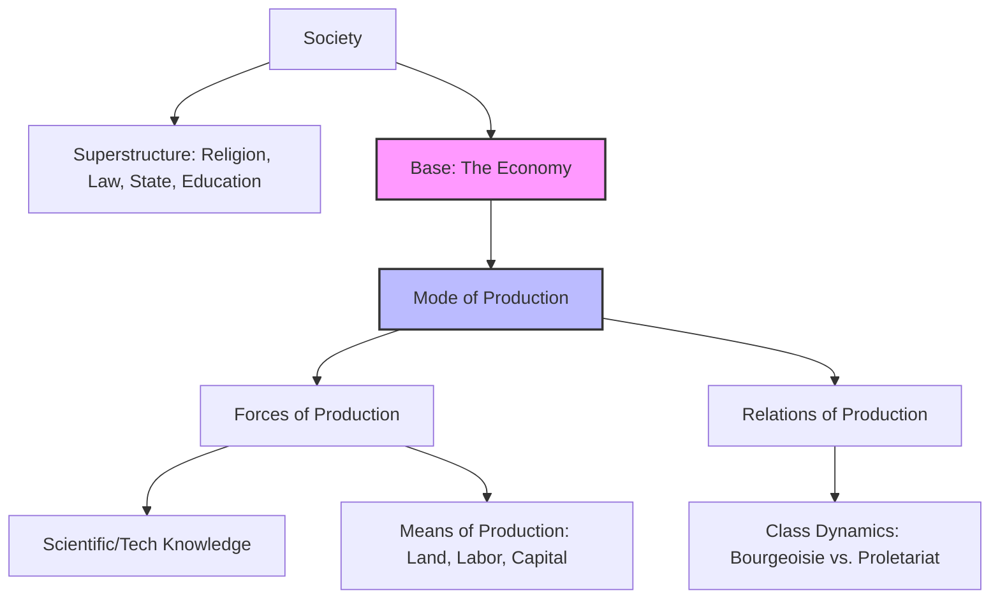
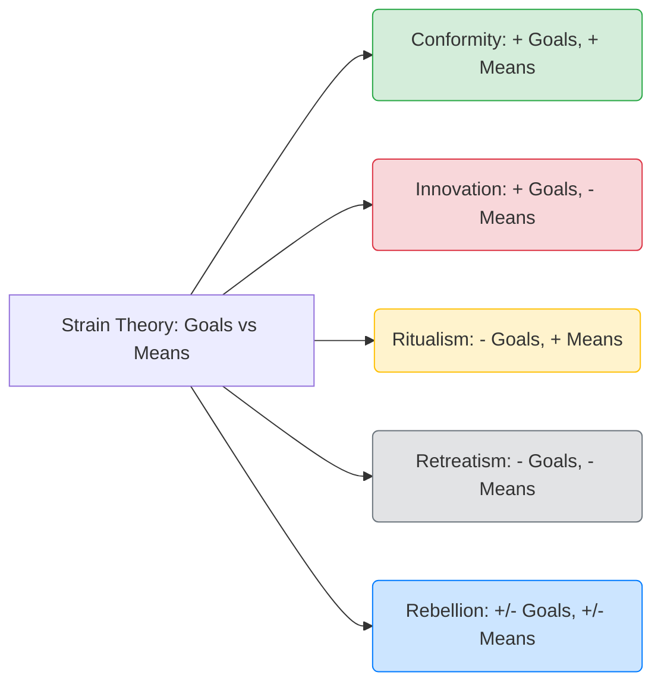
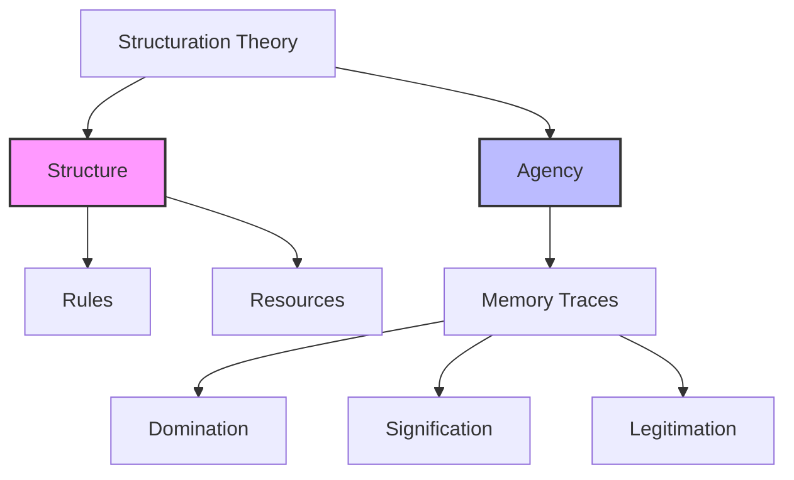

***

# **UGC NET Sociology: Unit 1 Thinkers (Comprehensive Notes)**
*Based on Antara Chak's Lecture Transcript*

## **PART 1: THE CLASSICAL THINKERS**

### **1. Émile Durkheim**
**1. Core Identity & Perspective**
*   **Background:** French School of Sociology.
*   **Perspective:** Structural Functionalism / Positivism.
*   **Influences:** Montesquieu, Auguste Comte, and Saint-Simon.
*   **Scope:** Macro-sociological. He is *not* interested in micro/subjective approaches; he looks at society as a whole.
*   **Identity:** Academic Father of Sociology (established it as a university discipline). Belongs to the **Synthetic School** of Sociology (believes sociology has a broad scope, synthesizing other disciplines).

**2. Methodology**
*   **Methodological Holism:** Studying the whole picture/society, not individuals.
*   **Inductive Method:** Studying particular cases first to build a general theory (e.g., studying 11 European countries to build the theory of suicide). *[Versus Trap]: Do not confuse with deductive.*
*   **Indirect Experiment:** His specific term for the **Comparative Method**, as direct laboratory experiments aren't possible in social sciences.
*   **Concomitant Variation:** Using statistical trends to find patterns (e.g., noticing a statistical correlation between symptoms and a disease). `[JRF Edge]` *Origin: This is originally J.S. Mill's term, not Durkheim's.*
*   **Objective/Quantitative:** Heavily reliant on statistics and numbers.

**3. Exhaustive Conceptual Breakdown**
*   **Social Facts:** Defined in *The Rules of Sociological Method*. Think of them as established social institutions (religion, marriage). 
    *   **4 Core Features (MTF/Not-Question Alert):** 
        1. **External:** Beyond the individual's control.
        2. **Coercive:** Forces you to follow them (pressure from society).
        3. **Enduring:** Persists across generations.
        4. **Social:** *Not* psychological or biological.
    *   **Types of Social Facts:**
        *   **Material:** Visible (e.g., a church building, demographic distribution).
        *   **Non-Material:** Invisible, in the mind (e.g., norms, values, respecting elders).
        *   **Social Currents:** Temporary, spontaneous collective expressions (e.g., a stadium cheering, an audience crying at a movie).
    *   **Normal vs. Pathological:** A social fact (like crime or suicide) is **Normal** if it occurs within a limited, expected rate. It becomes **Pathological** (causing societal disintegration) if it exceeds that limit and goes out of control.

*   **Division of Labour & Solidarity (from his PhD Thesis):**
    *   **Mechanical Solidarity:** Older, traditional societies. People are homogeneous (similar skills). High **Collective Conscience** (everyone thinks similarly). Law is **Repressive** (gruesome, public punishments).
    *   **Organic Solidarity:** Modern, industrial societies. People are heterogeneous (specialized division of labor). *Lacks* a strong collective conscience. Driven by **Moral Density** (mental/social interdependence) and **Material Density** (increased population/industrialization). Law is **Restitutive/Retributive** (aims to restore order).
    *   **Abnormal Forms of Division of Labour:**
        1.  **Anomic:** Lack of coordination between norms and labor (e.g., a PhD holder forced to work as a waiter).
        2.  **Forced:** Individuals forced into roles they don't want (e.g., the traditional Caste system).
        3.  **Poorly Coordinated:** Technological shifts outpace human adaptation (e.g., older employees struggling when computers were first introduced).

*   **Theory of Suicide:**
    *   Studied data from 11 European countries. Rejected psychological/biological reasons.
    *   *A-R Cue:* **Because** suicide rates vary consistently across different religious and social groups, **Therefore** suicide is a social fact driven by social currents, not individual psychology.
    *   **4 Types based on Integration & Regulation:**
        1.  **Egoistic:** Low Integration (disconnected from society).
        2.  **Altruistic:** High Integration (sacrificing life for society, e.g., army, *Sati*, *Jauhar*, terrorists).
        3.  **Anomic:** Low Regulation / Normlessness (e.g., COVID-19 breakdown, sudden divorce/breakup, sudden lottery win).
        4.  **Fatalistic:** High Regulation / Over-imposition of rules (e.g., prisoners, slaves).

*   **Sociology of Religion:**
    *   Studied **Totemism** in the **Arunta Tribe** of Australia (considered the most elementary religion).
    *   **Totem:** A sacred symbol (plant, animal, bird) representing a clan.
    *   **Sacred vs. Profane:** Sacred = holy/religious items. Profane = everyday/mundane items (clothes, pens).
    *   **Core Argument:** Religion is nothing but "worshipping our society." Heaven is a glorified version of society; Hell is a degraded version. Religion acts as a **Moral Community** for social integration.
    *   **The Formula of Religion:** Religion is made up of two things: a **Belief System** (framework) and **Rites** (activities).
    *   **Three Types of Rituals (Rites):**
        1.  **Positive:** Expected daily activities (e.g., Namaz, Puja).
        2.  **Negative:** Taboos/Prohibitions (e.g., not drinking alcohol, dietary restrictions).
        3.  **Piacular:** Rites of atonement/mourning (e.g., bathing in the Ganga to wash away sins).

*   **Other Key Concepts:**
    *   **Types of Societies by Size:** Categorized societies structurally into **Simple Society (Horde)**, **Polysegmental**, and **Simply Compounded**. *[Versus Trap]: Do not confuse his use of the word "segmental" with Herbert Spencer's division of societies.*
    *   **Sociology of Education:** Education as an institution plays the specific function of passing all the dominant ideas of the society from one generation to another.
    *   **Collective Effervescence:** The sense of unity felt when people come together to celebrate (e.g., Diwali, Christmas).
    *   **Collective Representations:** Symbolic items representing a community (e.g., religious symbols).
    *   **Agelicism:** The principle that society cannot be reduced to its smaller parts (like the human body, taking organs out and putting them on a table doesn't make a functioning body).
    *   **Sui Generis:** French/Latin term meaning society is "unique" and existed before us.
    *   **Civil Religion:** `[JRF Edge]` *Origin: Rousseau.* Religion in public life/publicity, not a personal choice.
    *   **Three Divisions of Sociology:**
        1.  **Social Morphology:** Visible things (population, demography, housing).
        2.  **Social Physiology:** Invisible things (norms, values).
        3.  **General Sociology:** Temporary societal shifts (social currents).

**4. 💡 Lecturer’s Key Insights & Exam Traps**
*   **Exam Trap - Anomie:** If asked which book *first* introduced Anomie, the answer is **Division of Labour**, NOT *Suicide*.
*   **Exam Trap - Anomic Suicide:** Antara notes students get confused here. A sudden breakup/divorce or winning the lottery causes *Anomic* suicide, not Egoistic, because it disrupts the stable *norms* and regulations of your daily life.
*   **Mnemonic - Suicide Types:** Remember them in pairs: **"Ig-Al and An-Fa"** (Egoistic/Altruistic & Anomic/Fatalistic).
*   **Exam Trap - Evolution:** Durkheim followed **Darwin's** principle of evolution, *not* Spencer's.
*   **Famous Quote:** *"Men are product of nature, women are product of culture."*
*   **Journal:** He started the French sociology journal *L'Année Sociologique* (Note: This is a journal, not a concept).

**5. Chronology of Major Works**
1.  *The Division of Labour in Society* (1893) - *His PhD Thesis*
2.  *The Rules of Sociological Method* (1895)
3.  *Suicide* (1897)
4.  *The Elementary Forms of Religious Life* (1912)
*   **Posthumous Works (Uncommon but PYQs):** *Education and Society*, *Moral Education*, *Socialism and Saint-Simon*, *Professional Ethics and Civic Morals*, *Evolution of Educational Thought*, *Pragmatism and Sociology*.

---

### **2. Max Weber**
**1. Core Identity & Perspective**
*   **Background:** German thinker.
*   **Perspective:** Interpretive Sociology, Micro-aspects.
*   **Influences:** Immanuel Kant and Wilhelm Dilthey (specifically Dilthey's Hermeneutics).
*   **Scope:** Belongs to the **Formalistic School** (believed sociology is a pure, independent science with a limited scope, unlike Durkheim's Synthetic school).
*   **Titles:** Founder of Political Sociology. Sometimes called the "Bourgeois Marx" (per George Ritzer).

**2. Methodology**
*   **Methodological Individualism:** Focuses on individuals, opposite of Durkheim's holism.
*   **Verstehen:** In-depth, empathetic understanding.
*   **Causal Pluralism (Multi-causal):** Rejected Marx's single-cause (economy) theory. Believed every event has multiple causes.
*   **Value-Free vs. Value Relevance:** We are human, not robots, so absolute "value-free" objectivity is impossible. Instead, we use **Value Relevance/Reflexivity**: You can use your biases when *selecting* a research topic, but must remain neutral once research begins.
*   **Ideal Types:** Pure types or exaggerated versions of reality used as a "measuring rod" or "heuristic device." *They do not exist in strict reality* (e.g., no real-world office perfectly matches his "Ideal Type" of Bureaucracy).

**3. Exhaustive Conceptual Breakdown**
*   **Social Action:**
    *   Action is only "social" if it meets two criteria: 1) It is **Meaningful**, and 2) It is **Responsive** (action-reaction involving others. E.g., brushing teeth alone is *not* social action).
    *   **4 Types of Social Action (MTF-Ready):**
        1.  **Zweckrational (Instrumental):** Goal-oriented means (e.g., studying specifically to crack JRF).
        2.  **Wertrational (Value-Rational):** Morality-based (e.g., giving up your bus seat to an elderly person, giving money to a beggar).
        3.  **Traditional:** Done for generations without much thought (e.g., dowry, rituals).
        4.  **Affective (Emotional):** Strictly emotional (e.g., hitting someone in anger, crying).

*   **Types of Rationality (MTF-Ready):**
    1.  **Practical:** Used in day-to-day life (brushing teeth).
    2.  **Theoretical:** Logical approach to understanding new concepts (inductive/deductive).
    3.  **Substantive:** Applying moral rationality (similar to Wertrational action).
    4.  **Formal:** Strictly instrumental, calculating means to an end based on rules.

*   **Power vs. Authority:**
    *   **Power:** Coercing/imposing opinions.
    *   **Authority:** Power that is *legitimized* and recognized.
    *   **3 Types of Authority:**
        1.  **Rational-Legal:** Respecting the *position*, not the person (e.g., Prime Minister, President). Based on written rules.
        2.  **Charismatic:** Based on the personal, exceptional qualities of a leader (e.g., Buddha, Gandhi, Hitler, Osama Bin Laden). Over time, this fades and becomes regularized (**Routinization of Charisma**).
        3.  **Traditional:** Hereditary, merit is not required (e.g., King's son becomes King).

*   **Social Stratification (Tripartite Model):**
    *   **Class:** Determined by money and **Market Situation**. Linked to **Life Chances** (opportunities).
    *   **Status:** Determined by prestige/respect (e.g., a Professor or IAS officer has high status even if not a billionaire). Linked to **Lifestyle** (status symbols like phones/brands).
    *   **Party:** Political power.
    *   *Note:* He used the Indian Caste system as an example of Status, governed by **Social Closure** (invisible boundaries preventing mobility), **Connubium** (endogamous marriage rules), and **Commensality** (food-sharing rules).

*   **Religion & Capitalism:**
    *   Used a **Comparative Approach** studying exactly 6 world religions: **Hinduism, Taoism, Confucianism, Buddhism, Christianity, and Judaism**.
    *   **The Protestant Ethic:** Studied the **Calvinist** sect of Protestants (not Lutherans). Their ethics acted as a spark (**Elective Affinity** / coincidence) for the rise of Capitalism.
    *   **Calvinist Principles:** "Time is money," "Money begets money" `[JRF Edge]` *Origin: Benjamin Franklin*. Belief in a **Calling** (vocation/work to reach heaven).
    *   **Types of Asceticism/Mysticism (MTF-Ready):**
        1.  **Inner-Worldly Asceticism:** Work hard in *this* life to get salvation (Protestant/Calvinist).
        2.  **Other-Worldly Asceticism:** Give up everything in this life; money is an illusion (Hinduism). *This is why capitalism didn't rise in India.*
        3.  **World-Rejecting Mysticism:** Aiming to meet God after death.
        4.  **Inner-Worldly Mysticism:** Focus on current life via meditation/mindfulness (Zen Buddhism).
    *   **Soteriology / Theodicy of Fortune & Misfortune:** Giving religious/fate-based explanations for life events (e.g., "It wasn't in my destiny/kismet").

*   **Bureaucracy:**
    *   Ideal type features: Written rules, Rationality/Logic, Hierarchy, Impersonality (no family ties at work), Merit-based.

*   **Modernity:**
    *   **Disenchantment:** Modernity and extreme rationalization have killed the "inner happiness" and magic of life. We are trapped in an **Iron Cage of Rationality** where everything is calculated.

**4. 💡 Lecturer’s Key Insights & Exam Traps**
*   **Exam Trap - Constant Sum Theory:** Weber believed in the **Constant Sum Theory of Power** (power is fixed; only one person/group can hold it at a time). *[Versus Trap]: Do not confuse this with Parsons' Variable Sum theory.*
*   **Famous Quote (PYQ):** *"Tribes, if they lose the significance of their territory, become castes."*
*   **[Versus Trap] - Class:** Weber's definition of "Class" (Market Situation) is fundamentally different from Marx's definition (Position in the Production Process).

**5. Chronology of Major Works**
*   *The Protestant Ethic and the Spirit of Capitalism* (1904-1905) - **Exam Trap:** This is the *only* major book published before his death.
*   *The City* (1921)
*   *Economy and Society* (1921-1922) - Contains his theories on Social Action and Bureaucracy.
*   *The Religion of China / The Religion of India*
*   **Uncommon PYQ Books:** *The Rational and Social Foundations of Music* (BHU Entrance PYQ), *Methodology of Social Sciences*, *Politics as a Vocation*, *Science as a Vocation*.

---

### **3. Karl Marx**
**1. Core Identity & Perspective**
*   **Background:** German thinker. The oldest of the classical trio.
*   **Perspective:** Founder of the **Conflict Perspective**.
*   **Identity:** Widely known as the **Father of Scientific Socialism**.
*   **Influences:** G.W.F. Hegel (Dialectics) and Ludwig Feuerbach (Materialism/Religion).

**2. Methodology**
*   **Dialectical Materialism:** Borrowed Hegel's "Dialectics" (Thesis vs. Antithesis = Synthesis) but applied it to the *practical, material world*, rejecting Hegel's focus on "ideas" (Idealism).
*   **Historical Materialism:** Analyzing how society progresses historically through different modes of production.
*   `[JRF Edge]` *Origin Trap: Marx never personally used the terms "Dialectical Materialism" or "Historical Materialism" in his writings. They were later coined/interpreted by his colleague Friedrich Engels.*

**3. Exhaustive Conceptual Breakdown**
*   **Base and Superstructure:**
    *   **Base:** The Economy.
    *   **Superstructure:** Everything else built on the economy (Religion, Polity, Education, Family).
    *   *A-R Cue:* **Because** the economic base dictates survival, **Therefore** the base determines the shape and function of the superstructure.

*   **Mode of Production:** How a society produces things. Comprises:
    1.  **Forces of Production:** Scientific/Tech knowledge + **Means of Production** (Land, Labor, Capital, Organization).
    2.  **Relations of Production:** The relationship between classes (e.g., Master/Slave, Bourgeoisie/Proletariat).
    *   *Capital Types:* **Fixed Capital** (Machines) vs. **Variable Capital** (Human Labor).


*(Visual Aid: The hierarchical structure of Marx's materialist conception of society. Note how Means of Production is a subset of Forces of Production).*

*   **Historical Stages (Chronology):**
    1.  **Primitive Communism:** No inequality.
    2.  **Slavery:** **Exam Trap:** *This is the stage where the concept of Private Property first emerges*, NOT Capitalism.
    3.  **Feudalism:** Landlords and Serfs/Peasants.
    4.  **Capitalism:** Bourgeoisie and Proletariat.
    5.  **Socialism/Communism (Future):** Private property abolished, state owns everything.
    *   *Exception:* **Asiatic Mode of Production:** A separate, stagnant mode of production applied to Asian societies (like India's caste system) where change is slow.

*   **Class & Stratification:**
    *   **Definition:** Class is your position in the *production process* (e.g., Ambani owns the factory, he doesn't work the floor).
    *   **The Classes:**
        *   **Bourgeoisie:** The "Haves" (Owners).
        *   **Proletariat:** The "Have-Nots" (Workers).
        *   **Petty Bourgeoisie:** Transitional/fluctuating class (sometimes act like owners, sometimes workers).
        *   **Lumpenproletariat:** The absolute lowest, poorest section (e.g., beggars).
    *   **Class-in-itself vs. Class-for-itself (Mnemonic: 1 comes before 4):**
        *   *Class-in-itself (1):* Workers are unaware of their exploitation (**False Consciousness**).
        *   *Class-for-itself (4):* Workers gain **Class Consciousness**, realize their exploitation, and start class conflict/revolution.

*   **Capitalism's Mechanics:**
    *   **Circuit of Commodity (C-M-C):** Older barter system (Commodity $\rightarrow$ Money $\rightarrow$ Commodity).
    *   **Circuit of Capital (M-C-M'):** Capitalist system. Money $\rightarrow$ Commodity $\rightarrow$ More Money (M' is always greater than M due to profit).
    *   **Commodification:** Things that weren't commodities are now bought and sold (e.g., selling blood, human labor).
    *   **Commodity Fetishism:** Obsession with brands/prices while ignoring the human labor behind them (e.g., buying expensive Zara/H&M clothes made in Bangladeshi sweatshops).

*   **Theories of Exploitation & Downfall:**
    *   **Labour Theory of Value:** Profit comes from **Surplus Labour** (unpaid extra hours worked beyond the **Socially Necessary Labour Time** needed to survive).
        *   *Absolute Surplus:* Increasing the length of the working day (8 hours to 16 hours).
        *   *Relative Surplus:* Making work more efficient in the same time frame (e.g., using better machines to produce 4 chairs instead of 2 in 8 hours).
    *   **Theory of Alienation:** Workers are disconnected from: 1) The Product, 2) The Production Process, 3) Themselves (Self/Decisions), 4) Fellow Species (other workers).
    *   **Falling Rate of Profit / Overproduction:** Capitalism contains the "seeds of its own destruction." Capitalists will replace humans with machines (robots) to increase profit. This leads to mass unemployment. Without wages, people can't buy the goods produced, leading to overproduction and the system's collapse.
    *   **"A Specter is Haunting Europe":** A famous phrase from the *Communist Manifesto* asserting that Europe should live in fear of capitalism's inevitable downfall and the rise of communism.

*   **Other Key Concepts:**
    *   **Use Value vs. Exchange Value:** Oxygen has Use Value but no Exchange Value (price). Commodities have both.
    *   **Reserve Army of Labour:** Women and children kept as cheap, substitute labor.
    *   **Praxis:** Bridging the gap between theory and practical application.
    *   **Pauperization:** The working class getting poorer day by day.
    *   **Polarization:** The increasing gap between the rich and the poor.

**4. 💡 Lecturer’s Key Insights & Exam Traps**
*   **Exam Trap - Private Property:** Remember, private property started in *Slavery*, not Capitalism.
*   **Famous Quotes:** 
    *   *"Religion is the opium of the masses."* (It fools people into a false sense of security).
    *   *"Revolutions are the locomotives of history."*
    *   *"Thank God I am not a Marxist."* (Said at the end of his life out of self-loathing, feeling he didn't do enough for the working class).
*   **Power Theory:** Like Weber, Marx believed in the **Zero-Sum / Constant Sum** theory of power.

**5. Chronology of Major Works**
*   *Economic and Philosophic Manuscripts of 1844* (Contains the theory of **Alienation**)
*   *The Holy Family*
*   *The German Ideology*
*   *The Communist Manifesto*
*   *The 18th Brumaire of Louis Napoleon*
*   *Grundrisse* (PYQ)
*   *Contribution to the Critique of Political Economy* (PYQ)
*   *Das Kapital* (Capital) - 3 Volumes. Volume 1 contains theories on **Surplus Value** and **Commodity**.

---

### **INTEGRATED VIEW: THE CLASSICAL THINKERS**
*(Use this table for quick comparative revision and Assertion-Reasoning logic)*

| Analytical Axis | Émile Durkheim | Max Weber | Karl Marx |
| :--- | :--- | :--- | :--- |
| **Core Methodology** | Methodological Holism / Positivism | Methodological Individualism / Verstehen | Historical & Dialectical Materialism |
| **View of Stratification** | Division of Labour (Mechanical vs. Organic) | Tripartite: Class (Market), Status (Honor), Party (Power) | Dichotomous: Bourgeoisie vs. Proletariat (Production Process) |
| **View of Religion** | Functional: Worshipping society, creates moral community. | Catalyst: Protestant Ethic sparked Capitalism. | Conflict: "Opium of the masses," creates false consciousness. |
| **The "Problem" with Modernity** | **Anomie:** Breakdown of norms/regulation. | **Iron Cage:** Extreme rationalization & disenchantment. | **Alienation:** Estrangement from labor, self, and species. |
| **View of Power** | Not a primary focus; implicit in coercive Social Facts. | Constant-Sum; Authority must be legitimized (3 types). | Zero-Sum; Power is held exclusively by the bourgeoisie. |


---
---

## **PART 2: STRUCTURAL-FUNCTIONALISTS & STRUCTURALISTS**

### **4. Bronisław Malinowski**
**1. Core Identity & Perspective**
*   **Background:** Polish-born, but considered the Founder of the **British School of Social Anthropology** (along with Radcliffe-Brown).
*   **Perspective:** Pure Functionalist.
*   **Specific School:** **Psychological Functionalism** or **Individualistic Functionalism**.
    *   *A-R Cue:* **Because** he believed institutions exist to satisfy the biological/psychological needs of *individuals*, **Therefore** he is not a "structural" functionalist. He did not believe in the idea of "structure."
*   **Fieldwork:** Trobriand Islanders of Melanesia (a Matrilineal community).

**2. Exhaustive Conceptual Breakdown**
*   **Theory of Needs (Biophysical Needs):** Culture is created solely to satisfy human biological, physiological, and psychological needs.
*   **Biocultural Functionalism:** The linking of biological needs to cultural responses.
*   **The Kula Ring:** A system of ceremonial exchange among the Trobriand Islanders.
    *   *Core Concept:* Exchange of two items: an arm shell and a necklace. It occurred in a circular/ring pattern across islands.
    *   *Function:* These items were not economically expensive but held immense **symbolic status value**. Only higher sections of society participated. Once a part of the Kula Ring, you are a part forever.
    *   `[JRF Edge]` *Exam Trap:* Do not confuse *Kula Ring* (ceremonial exchange) with ***Gimwali*** (the ordinary barter system for daily goods).
*   **Magic, Science, and Religion:** Conducted a comparative study of these three.
    *   **White Magic:** Used for good, without harming others.
    *   **Black Magic:** Used to harm others.
    *   *A-R Cue:* **Because** primitive people successfully built complex items like canoes (boats that don't sink), **Therefore** it is a myth that primitive societies lacked scientific knowledge.
    *   *Function of Religion:* To reduce emotional stress and increase unity among people.
*   **Participant Observation:** He is the *propounder* (popularizer) of this method in ethnography, advocating for "practical anthropology" (going directly to the field).
    *   `[JRF Edge]` *Origin Trap:* The actual terms "Participant/Non-Participant Observation" were coined by **Eduard Lindeman**.
*   **Functional Universalism:** The belief that *every* single cultural item has a positive function.

**3. 💡 Lecturer’s Key Insights & [Versus Traps]**
*   **[Versus Trap] - Definition of Culture:** Malinowski defined culture as a **"Total way of life"** vs. Ralph Linton who defined it merely as a **"Way of life."**
*   **[Versus Trap] - Evolutionism:** Malinowski heavily criticized Classical Evolutionists (like Morgan and Spencer). He called their work a **"Limbo of conjectural reconstruction"** (useless guesswork without field data).
*   **Metaphors & Views:**
    *   Viewed Kinship as an **"Algebra"** (a complex network of connections).
    *   Viewed Marriage as a **"Contract for reproduction."**
*   **Influence:** Heavily inspired by **James Frazer's** book *The Golden Bough* for his work on magic and science. Used the **Descent Approach** to study kinship.

**4. Chronology & Major Works**
*   *Argonauts of the Western Pacific* (1922) - *Published the same year as Radcliffe-Brown's Andaman Islanders.*
*   *Crime and Custom in Savage Society*
*   *Sex and Repression in Savage Society*
*   *A Scientific Theory of Culture*
*   *Magic, Science and Religion*
*   *Sex, Culture, and Myth*
*   *A Diary in the Strict Sense of the Term* (Published posthumously by his wife).
*   `[JRF Edge]` *Exam Trap:* The book *The Politics of Kula Ring* is NOT by Malinowski; it is by Indian sociologist **J.P.S. Uberoi**.

---

### **5. A.R. Radcliffe-Brown**
**1. Core Identity & Perspective**
*   **Background:** British Social Anthropologist.
*   **Perspective:** **Structural Functionalism**.
    *   *A-R Cue:* **Because** he believed individuals die but the "structure" remains, **Therefore** he focused on the needs of the *society/structure*, not the individual.
*   **Fieldwork:** Andaman Islanders. Also studied the **Kariera tribe** (Australian Aboriginals), **Choctaw**, and **Omaha** tribes.
*   **Influences:** Malinowski and Durkheim.
*   `[JRF Edge]` *Chronology Trap:* He was born in 1881, making him *older* than Malinowski, even though students often mistakenly think he came later because he critiqued Malinowski.

**2. Exhaustive Conceptual Breakdown**
*   **Social Structure:** Defined as an **"Arrangement of people"** or **"Social Relations."**
    *   **Actual Structure:** The reality that is in constant flux and keeps changing.
    *   **Structural Form:** The underlying rules/patterns that remain stable and do not change easily.
*   **Functional Unity (Co-adaptation):** The idea that all parts of a society work together to maintain a unified whole, regardless of turbulence.
*   **Eunomia vs. Dysnomia:**
    *   **Eunomia:** A state of social health, balance, and happiness (Euphoria).
    *   **Dysnomia:** A state of social illness, imbalance, or turbulence (Dysphoria).
    *   *Note:* He borrowed the concept of Social Morphology/Physiology from Durkheim.
*   **"Necessary Conditions of Existence":**
    *   He completely rejected Malinowski’s word "Needs."
    *   *A-R Cue:* **Because** a factory worker and a monk require completely different things to survive, **Therefore** we cannot use a universal biological "Need"; we must look at the "Necessary conditions of existence" for specific structures.
*   **Kinship Concepts:**
    *   **Joking Relationships:** Permitted disrespect/sexual jokes (e.g., Devar-Bhabhi). Can be *Symmetrical* (both sides joke) or *Asymmetrical* (one-sided).
    *   **Amitate:** Special relationship with the Father's Sister (Bua).
    *   **Avunculate:** Special relationship with the Mother's Brother (Mama).
*   **Three Types of Unity (MTF-Ready):**
    1.  **Unity of Sibling Group:** Brothers/sisters act as a single unit.
    2.  **Unity of Lineage Group:** The family descent line acts as a unit.
    3.  **Generation Principle:** Alternate generations connect (Grandparents relate best to Grandchildren). *Note: Seen in Hawaiian kinship.*

**3. 💡 Lecturer’s Key Insights & [Versus Traps]**
*   **[Versus Trap] - Methodology:** Radcliffe-Brown believed Social Structure is **Empirically Visible** (you can see the arrangements). Lévi-Strauss believed Social Structure is an invisible mental model.
*   **Methodology Name:** He called his comparative ethnography **"Comparative Sociology"** and famously called Anthropology the **"Natural Science of Society."**
*   **Critique of Teleology:** He warned that early functionalism suffered from "Illegitimacy" or **Teleology** (circular reasoning where cause and effect are confused).
*   **Other Studies:** He studied the practice of **Ceremonial Weeping** (formal crying rituals in tribes). Defined culture as a **"Set of rules."** Called sociology a **"Baby discipline."**

**4. Chronology & Major Works**
*   *The Andaman Islanders* (1922)
*   *The Mother's Brother in South Africa*
*   *African Systems of Kinship and Marriage*
*   *Structure and Function in Primitive Society*
*   *Three Tribes of Western Australia*
*   *On Joking Relationships*
*   *A Natural Science of Society*

---

### **6. Talcott Parsons**
**1. Core Identity & Perspective**
*   **Background:** American Sociologist.
*   **Perspective:** Structural Functionalism / **Analytical Approach**.
*   **Identity:** A **Cultural Determinist** (believed culture drives society). Famous for popularizing the "American Dream" in sociology.
*   *Critique:* Known for "Grand/Meta Theories" that are highly abstract and hard to apply to real life.

**2. Exhaustive Conceptual Breakdown**
*   **AGIL Model (Functional Prerequisites / Imperatives):**
    *   *A-R Cue:* **Because** every society must solve four fundamental survival problems, **Therefore** these four imperatives must be met for a system to survive.

```mermaid
quadrantChart
    title Parsons' AGIL System
    x-axis External Focus --> Internal Focus
    y-axis Instrumental (Means) --> Consummatory (Ends)
    quadrant-1 Goal Attainment (Polity / Personality)
    quadrant-2 Adaptation (Economy / Biological)
    quadrant-3 Latency (Family-Edu / Cultural)
    quadrant-4 Integration (Law / Social)
```
*(Visual Aid: The AGIL system mapped by systemic function. Lecturer's Mnemonic for Systems: **BPSC** - Biological, Personality, Social, Cultural).*

*   **Pattern Variables (The Dilemmas of Action):**
    *   Five pairs of dilemmas an actor faces before taking action (Traditional vs. Modern choices).
    *   **[MTF-Ready Table: Pattern Variables]**
        1.  **Affectivity** (Emotion) vs. **Affective Neutrality** (Professionalism)
        2.  **Particularism** (Treating based on identity/caste) vs. **Universalism** (Treating everyone equally)
        3.  **Ascription** (Status by birth) vs. **Achievement** (Status by merit)
        4.  **Diffuseness** (Broad, undefined relationship, e.g., mother) vs. **Specificity** (Narrow, defined relationship, e.g., cashier)
        5.  **Self-Orientation** (Selfish) vs. **Collectivity-Orientation** (For the group)

*   **Voluntaristic (General) Theory of Social Action:**
    *   **[MTF-Ready Table: Antara's Action Schema Mnemonic - VCAM]**
        *   *Action Type* $\rightarrow$ *Value Orientation* $\rightarrow$ *Motivational Orientation*
        *   **Instrumental** $\rightarrow$ **Cognitive** (Thinking) $\rightarrow$ **Cognitive**
        *   **Expressive** $\rightarrow$ **Appreciative** $\rightarrow$ **Cathectic** (Emotion)
        *   **Moral** $\rightarrow$ **Moral** $\rightarrow$ **Evaluative**

*   **Socialization & Health:**
    *   **Education:** Schools act as the bridge socializing individuals from their family roles into adult roles.
    *   **Warm Bath Theory:** The family acts as an emotional release (like a warm bath) to stabilize adult personalities after the stress of work.
    *   **Sick Role & Patient Role:**
        *   *Rights:* Exempt from normal duties; not blamed for the illness.
        *   *Obligations:* Must view being sick as undesirable; must seek competent medical help.

*   **Evolutionary Universals:**
    *   Societies evolve through 3 stages (Mnemonic: PAM): **Primitive $\rightarrow$ Archaic $\rightarrow$ Modern**.
    *   Evolution process (Mnemonic: DAIG): **Differentiation $\rightarrow$ Adaptation $\rightarrow$ Integration $\rightarrow$ Generalization**.
    *   Certain developments (like Language) are "Evolutionary Universals" because every surviving society develops them.

**3. 💡 Lecturer’s Key Insights & [Origin Traps]**
*   **[Origin Trap] - Homeostasis:** Parsons borrowed the concept of Homeostasis (the body/society trying to return to equilibrium after illness/crisis) from **Walter Cannon**.
*   **[Origin Trap] - Moving Equilibrium:** Borrowed from **Vilfredo Pareto**.
*   **[Origin Trap] - Cybernetic Hierarchy:** Borrowed from **Norbert Wiener**. (Hierarchy of control: Information/Culture controls Energy/Biology. Animals are above plants; humans above animals).
*   **Exam Trap - Power Theory:** Parsons believed in the **Variable Sum Theory of Power** (power can expand and be held by many), directly opposing Marx/Weber's Zero-Sum theory.
*   **Stratification:** He argued stratification/inequality is *inevitable* and necessary because high-level roles require "incentives" to motivate people. Poverty is necessary so "menial jobs" get done.
*   **Three Types of Social Control:** Persuasion, Insulation, Isolation.
*   **Basic Unit of Society:** The **Status-Role Complex**.
*   **Family:** The Nuclear Family is the "perfect fit" for industrial society (shifted from **production to consumption**).

**4. Chronology & Major Works**
*   *The Structure of Social Action* (1937)
*   *The Social System* (1951)
*   *Essays in Sociological Theory*
*   *Family, Socialization and Interaction Process*
*   *American Society*
*   *Translated Weber's:* Protestant Ethic & Theory of Social and Economic Organization.

---

### **7. Robert K. Merton**
**1. Core Identity & Perspective**
*   **Background:** American Sociologist (Student of Parsons).
*   **Perspective:** Structural Functionalist, but highly **Empirical**.
*   *Critique:* Rejected Parsons' "Grand Theories" in favor of **Middle-Range Theories** (theories that are theoretically sound but practically testable in reality).

**2. Exhaustive Conceptual Breakdown**
*   **Critique of Early Functional Postulates:**
    1.  *Rejected Universal Functionalism:* Argued some things have negative consequences (e.g., Slavery, Caste system).
    2.  *Rejected Functional Indispensability:* Argued for **Functional Equivalents / Alternatives**. (Lecturer's Example: If you don't have a modern mixer-grinder, the traditional *shil batta* is a functional alternative. Religion isn't indispensable; communist societies function without it).
    3.  *Rejected Functional Unity:* Society is not always perfectly integrated (critique of Radcliffe-Brown).

*   **Functions vs. Dysfunctions:**
    *   **Manifest Function:** Intended, recognized purpose (e.g., a pen is for writing).
    *   **Latent Function:** Unintended, hidden consequence (e.g., a pen used to scratch your back. *Lecturer's Example: Better healthcare means people live longer, but the latent dysfunction is an aging population burdening the working class*).
    *   **Dysfunction:** Negative consequences (can also be Manifest or Latent).
    *   **Non-Function:** Irrelevant survivals (e.g., the human appendix).
    *   **Net Balance:** Assessing whether the functions outweigh the dysfunctions in a society.

*   **Strain Theory of Deviance (Modes of Adaptation):**
    *   *A-R Cue:* **Because** there is a mismatch between culturally accepted *Goals* (American Dream) and institutionalized *Means* (jobs/education), **Therefore** individuals experience "strain" and commit crimes/deviance.


*(Visual Aid: Merton's Modes of Adaptation. Innovation = Thief; Ritualism = Forced Engineer; Retreatism = Drug Addict).*

*   **Sociology of Science (CUDOS Framework):**
    *   The ethos scientists must follow:
        *   **C - Communism:** Scientific knowledge belongs to the whole community, not just the individual. *(Not Marx's communism).*
        *   **U - Universalism:** Science is judged on merit, regardless of the scientist's race/caste.
        *   **D - Disinterestedness:** Scientists must not act for personal/financial gain.
        *   **OS - Organized Skepticism:** Constantly questioning and testing findings; nothing is taken for granted.

*   **Status and Role Concepts:**
    *   **Status Set:** All the statuses a person holds at a given time.
    *   **Role Set:** The array of roles attached to *one* single status.
    *   **Status Sequence:** The progression of statuses over a lifetime (Child $\rightarrow$ Adult $\rightarrow$ Elder).
    *   **Role Strain:** The difficulty in fulfilling multiple roles.
    *   *Key/Master Status:* The controlling, primary status; *Salient Status:* Minor/temporary status.

*   **Other Key Concepts:**
    *   **Self-Fulfilling Prophecy:** A false definition of a situation evoking a new behavior which makes the original false conception come true.
    *   **Self-Defeating Prophecy:** Rebelliously acting against a prediction, causing it to fail.
    *   **Anticipatory Socialization:** Training for a future role you hope to achieve (e.g., taking classical music classes to become a singer).
    *   **Bureaucratic Personality & Red Tapism:** Critiqued Weber, arguing that extreme bureaucracy makes people inflexible, rule-obsessed, and inhuman.
    *   **Serendipity:** A happy coincidence. Used to describe the unexpected merging of Natural and Social Sciences.

**3. 💡 Lecturer’s Key Insights & [Origin Traps]**
*   **[Origin Trap] - Reference Group:** Borrowed from **Herbert Hyman**. (Can be Positive—who you want to be; or Negative—who you *don't* want to be).
*   **[Origin Trap] - Relative Deprivation:** Borrowed from **Samuel Stouffer's** *The American Soldier*. (Feeling deprived only when comparing yourself to others).
*   **Methodological Innovations:** Introduced **Focused Group Discussions (Interviews)** and the use of **Content Analysis** in qualitative studies.
*   **Definition:** Described Social Structure as **Polymorphous** and **Polythetic** (cannot be defined by a single word).

**4. Chronology & Major Works**
*   *Social Theory and Social Structure*
*   *The Sociology of Science*
*   *The Focused Interview*
*   *On the Shoulders of Giants*
*   *Mass Persuasion*
*   *The Travels and Adventures of Serendipity*
*   *Role Set* (Essay/Article)
*   *Puritanism, Pietism, and Science*

---

### **8. Claude Lévi-Strauss**
**1. Core Identity & Perspective**
*   **Background:** Belgian-born French thinker.
*   **Perspective:** **Structuralism** (Father of Structural Anthropology).
*   `[JRF Edge]` *Origin Trap:* The actual founder of Structuralism in linguistics was **Ferdinand de Saussure**.

**2. Exhaustive Conceptual Breakdown**
*   **Binary Opposition:**
    *   The core of his theory. The human mind universally structures reality in contrasting pairs (e.g., Raw/Cooked, Good/Evil, Hero/Villain).
    *   *A-R Cue:* **Because** the physical structure of the human brain is the same everywhere, **Therefore** all cultures, despite looking different on the outside, share this hidden universal structure of binary oppositions.

*   **Mythology & Bricolage:**
    *   Analyzed myths (like the Ramayana or Mahabharata) to find underlying universal themes.
    *   **Mytheme:** The fundamental, irreducible unit/theme of a myth.
    *   **Bricolage:** The process of creating a "collage" of these different mythical themes.
    *   **Bricoleur:** The person (researcher/myth-maker) who creates the bricolage.

*   **Alliance Theory of Kinship:**
    *   Argued that kinship is based on the exchange of women between groups, driven by two rules:
        1.  **Incest Taboo:** Forces you to look outside your family for a partner.
        2.  **Reciprocity:** The give-and-take exchange between families.
    *   **Three Structures of Kinship:**
        1.  **Elementary:** Strict, positive rules about exactly *who* you must marry (e.g., cross-cousin marriage).
        2.  **Complex:** Negative rules; tells you who you *cannot* marry, leaving the rest open.
        3.  **Semi-Complex:** A mix of both.
    *   **Three Types of Exchange:** Exchange of Women, Exchange of Words, Exchange of Goods/Commodities.

*   **Models of Social Structure:**
    *   **Mechanical Model:** The model matches the exact reality/scale of the society.
    *   **Statistical Model:** Averages and probabilities used when the society is too large.
    *   **Conscious vs. Unconscious Structure:** People are aware of conscious models (norms), but the true structure is *unconscious* (hidden in the mind).

*   **The Culinary Triangle:**
```mermaid
triangle
    title Lévi-Strauss's Culinary Triangle
    "Raw (Unelaborated)"
    "Cooked (Cultural Transformation)"
    "Rotted (Natural Transformation)"
```
*(Visual Aid: A structural analysis of food preparation showing the transition from nature to culture).*

**3. 💡 Lecturer’s Key Insights & [Origin Traps]**
*   **[Versus Trap] - Social Structure:** Unlike Radcliffe-Brown who said structure is an empirical reality, Lévi-Strauss argued Social Structure is a **Myth/Model/Method**—it exists only in the mind and cannot be seen physically.
*   **[Origin Trap] - Linguistics:** Borrowed heavily from **Ferdinand de Saussure**, specifically the concepts of **Signifier** (Floating Signifier) and **Langue/Parole** (Formal language vs. informal/slang).
*   **Methodology Note:** He heavily utilized **Graphical Methods** (e.g., mapping married vs. unmarried women). *Exam Tip: If you see "graphical method" in an exam, it is almost always Lévi-Strauss.*
*   **Indian Connection:** Indian sociologist **Veena Das** was his direct student and applied his theories.
*   **Fieldwork:** Studied the **Nambikwara** and **Caduveo** tribes.

**4. Chronology & Major Works**
*   *The Elementary Structures of Kinship*
*   *Structural Anthropology*
*   *Totemism*
*   *The Savage Mind* (Contains the theory of Binary Opposition)
*   *Myth and Meaning*
*   *Mythologiques* (A massive 4-volume work. *Volumes: 1. The Raw and the Cooked, 2. From Honey to Ashes, 3. The Origin of Table Manners, 4. The Naked Man*).

---

### **INTEGRATED VIEW: FUNCTIONALISTS & STRUCTURALISTS**
*(Use this table for quick comparative revision and Assertion-Reasoning logic)*

| Analytical Axis | Malinowski | Radcliffe-Brown | Parsons | Merton | Lévi-Strauss |
| :--- | :--- | :--- | :--- | :--- | :--- |
| **Core Focus** | Individual Biological/Psychological Needs | Social Structure / Social Relations | Grand Systems / Cultural Determinism | Middle-Range Empirical Reality | Unconscious Mind / Universal Structures |
| **View of Functionalism** | **Universal:** Everything has a positive function. | **Co-adaptation:** Parts work for the unity of the whole. | **Imperatives:** Systems must solve AGIL to survive. | **Critical:** Things can be dysfunctional or non-functional. | *Not a functionalist; Structuralist.* |
| **Methodology** | Participant Observation / Fieldwork | Comparative Sociology | Analytical / Grand Theory | Empirical / Middle-Range | Mental Models / Graphical Methods |
| **Key Kinship/Exchange Concept** | Kula Ring (Status/Symbolic) | Joking Relationships / Amitate | Nuclear Family fits Industry | Role Set / Status Sequence | Alliance Theory (Exchange of Women) |
| **View of Social Structure** | Did not focus on structure. | It is an empirical, visible reality. | Status-Role Complex. | Polymorphous & Polythetic. | It is an invisible mental model/myth. |


***
---

## **PART 3: THE HERMENEUTIC & INTERPRETIVE THINKERS**

### **9. George Herbert Mead**
**1. Core Identity & Perspective**
*   **Background:** American sociologist, Chicago School.
*   **Perspective:** Founder and Father of **Symbolic Interactionism**.
*   `[JRF Edge]` *Origin Trap:* Mead never used the term "Symbolic Interactionism" himself. It was coined after his death by his student, **Herbert Blumer**.
*   **Identity:** Considered a **Social Psychologist**. Influenced by Pragmatism and Behaviorism.

**2. Exhaustive Conceptual Breakdown**
*   **The Self (Mind, Self, and Society):**
    *   The "Self" is not present at birth; it develops through social interaction and experience.
    *   *A-R Cue:* **Because** the mind develops through social interaction, and the self develops through the mind, **Therefore** both mind and self are social products. The **Mind is Social**.
    *   **The "I" and the "Me":** The Self has two phases:
        *   **The "Me":** The social self. It is the part of the self that is aware of societal expectations and attitudes. It is predictable.
        *   **The "I":** The individual's impulsive, creative, and unpredictable response to the "Me." It is the source of novelty and change.

*   **Stages of Socialization (Development of the Self):**
    *   The three key elements in his stages of socialization are **Language, Play, and Game**.
    1.  **Imitation Stage (Preparatory Stage):** The child simply mimics the actions of others without understanding them.
    2.  **Play Stage:** The child begins to **role-play**, taking on the role of one specific person at a time (e.g., playing "mommy" or "doctor").
    3.  **Game Stage:** The child learns to **role-take**, understanding and anticipating the roles of multiple others simultaneously (e.g., in a game of cricket, knowing what the bowler, fielder, and batsman will do).

*   **Key Concepts in Interaction:**
    *   **Significant Others:** Individuals who are most important in the development of the self (e.g., parents, close friends).
    *   **Generalized Other:** The widespread cultural norms and values of the broader society that we use as a reference in evaluating ourselves.
    *   **Significant Symbols:** Gestures (especially language) that arouse in the person expressing them the same kind of response that they are intended to elicit from those to whom they are addressed.
    *   **The Primitive Act (Four Stages - Mnemonic: IPMC):**
        1.  **Impulse:** An immediate stimulus (e.g., hunger).
        2.  **Perception:** The brain perceives the stimulus and its context.
        3.  **Manipulation:** The individual acts upon the object (e.g., preparing food).
        4.  **Consummation:** The satisfaction of the impulse (e.g., eating the food).

**3. 💡 Lecturer’s Key Insights & [Versus Traps]**
*   **[Versus Trap] - Play vs. Game Stage:** Antara stresses the difference: **Role-Playing** (Play Stage) is simple imitation of one role. **Role-Taking** (Game Stage) is a complex understanding of multiple, interconnected roles.
*   **Core Argument:** The Self and Society are not identical, but they are deeply intertwined. Social groups lead to self-conscious mental states.
*   **Famous Quote/Idea:** The "Self" is a sacred entity.

**4. Chronology & Major Works**
*   *Mind, Self, and Society* (Published posthumously from student notes).
*   `[JRF Edge]` *Versus Trap:* Do not confuse with Vilfredo Pareto's book, *The Mind and Society*.

---

### **10. Karl Mannheim**
**1. Core Identity & Perspective**
*   **Background:** Hungarian-born sociologist.
*   **Perspective:** **Sociology of Knowledge**.
*   `[JRF Edge]` *Origin Trap:* The term "Sociology of Knowledge" was first coined by **Max Scheler**. Mannheim popularized and developed it.

**2. Exhaustive Conceptual Breakdown**
*   **Sociology of Knowledge:** The study of the relationship between human thought and the social context within which it arises.
    *   *A-R Cue:* **Because** all knowledge is shaped by the social position (class, generation, group) of the thinker, **Therefore** there is no such thing as absolute, context-free knowledge.
*   **Historical Relativism / Relationism:** Knowledge is always relative to a specific time (historical period) and place (social location).
*   **Ideology vs. Utopia:**
    *   **Ideology:** The thought system of the **ruling class (Bourgeoisie)**. It is backward-looking and aims to *preserve* the existing social order (the status quo).
    *   **Utopia:** The thought system of the **oppressed class (Proletariat)**. It is forward-looking and aims to *transform* or shatter the existing social order.
*   **Types of Ideology:**
    *   **Particular Ideology:** The beliefs of a specific, small-scale opponent (e.g., a single individual's bias).
    *   **Total Ideology:** The entire worldview or "Weltanschauung" of a whole class or historical epoch.
*   **The Free-Floating Intelligentsia (Creative Intelligentsia):**
    *   A class of intellectuals who are not firmly rooted in any single social class.
    *   **Because** they are socially unattached, they are capable of synthesizing different perspectives and arriving at a more objective understanding of reality. They have the capacity to bring about social change.

**3. 💡 Lecturer’s Key Insights & Exam Traps**
*   **Exam Trap - Book Title:** Mannheim's key book is ***Ideology and Utopia***. He also wrote ***Essays on the Sociology of Knowledge***. The book titled simply *Sociology of Knowledge* is by **Werner Stark**.
*   **Other Concepts:** He wrote on **Systematic Sociology**, believed in **Planning for Democracy**, and analyzed the structure of personality. His approach is considered both macro and micro.
*   **Four Types of Utopia:** Organized-Chiliastic, Liberal-Humanist, Conservative, and Modern-Communist.

**4. Chronology & Major Works**
*   *Ideology and Utopia*
*   *Man and Society in an Age of Reconstruction*
*   *Diagnosis of Our Time*
*   *Essays on the Sociology of Knowledge*
*   *Structures of Thinking*
*   *Conservatism*

---

### **11. Alfred Schutz**
**1. Core Identity & Perspective**
*   **Background:** Austrian sociologist.
*   **Perspective:** **Phenomenology** (Father of Phenomenological Sociology).
*   `[JRF Edge]` *Origin Trap:* The founder of Phenomenology as a philosophy was **Edmund Husserl**. Schutz applied Husserl's ideas to sociology.

**2. Exhaustive Conceptual Breakdown**
*   **Phenomenology:** The study of structures of experience and consciousness from a first-person perspective. It focuses on how individuals experience and understand the world.
*   **Life-World (Lebenswelt):** `[Origin: Husserl]` The world of everyday life, which we experience as taken-for-granted and "paramount reality."
*   **Stock Knowledge:** The collection of common-sense "recipes," assumptions, and typifications that we use to navigate daily life without having to think from scratch.
*   **Typification:** The process of organizing our experiences into typical categories (e.g., "a typical teacher," "a typical student"). This allows us to make sense of the world efficiently.
*   **Intersubjectivity:** `[Origin: Husserl]` The shared space of meaning that allows us to communicate and understand each other. It is the bridge between our individual subjective worlds.
*   **The Four Realms of the Life-World:** Schutz divided the life-world into four zones based on time and space:
    1.  **Umwelt:** The realm of directly experienced social reality (people we interact with face-to-face).
    2.  **Mitwelt:** The realm of contemporaries whom we do not meet face-to-face (e.g., the person who made this pen).
    3.  **Vorwelt:** The realm of predecessors (the past, ancestors).
    4.  **Folgewelt:** The realm of successors (the future, descendants).

**3. 💡 Lecturer’s Key Insights & Exam Traps**
*   **Critique of Weber:** Schutz criticized Weber's concept of *Verstehen*. He argued that Weber failed to explain *how* we come to understand the subjective meaning of others' actions.
*   **Natural Attitude:** `[Origin: Husserl]` Our default, uncritical acceptance of the life-world as an objective reality.
*   **Three Pillars of Phenomenology:** Intersubjectivity, Natural Attitude, and Typification.
*   **Reciprocity of Perspectives:** The assumption that if we were to switch places with someone else, we would see the world in roughly the same way.
*   **Other Concepts:** Distinguished between **"Art" and "Actions"** and discussed **"Empathetic Receptivity."**
*   **[Versus Trap]:** Do not confuse Schutz's work with Hegel's books on phenomenology (*Phenomenology of the Mind*, *Dialectical Phenomenology*) or Husserl's (*Transcendental Phenomenology*, *Ideas: A General Introduction to Pure Phenomenology*).

**4. Chronology & Major Works**
*   *The Phenomenology of the Social World* (His only major book).

---

### **12. Harold Garfinkel**
**1. Core Identity & Perspective**
*   **Background:** American sociologist.
*   **Perspective:** Founder of **Ethnomethodology**.
*   *Note:* Ethnomethodology is built upon the foundations of phenomenology.

**2. Exhaustive Conceptual Breakdown**
*   **Ethnomethodology:** The study of the everyday methods ("ethno-methods") that people use to make sense of and accomplish their daily lives.
*   **Indexicality:** The meaning of any action or utterance is dependent on its context. The index finger is used to point to different things ("here," "there," "you," "me") depending on the situation.
*   **Reflexivity:** The way in which our actions and accounts of those actions simultaneously create and sustain the social reality we are in. We are both creating and explaining our reality at the same time.
*   **Accounting:** The process by which people explain and justify their actions to make them seem rational and understandable to others.
*   **Breaching Experiments:** Deliberately violating social norms to reveal the taken-for-granted assumptions that structure social reality.
    *   *Lecturer's Example:* Playing Tic-Tac-Toe but drawing a circle on the line between squares instead of inside a square. The experiment is to observe the other player's confused or angry reaction, which reveals the unspoken rules of the game.
*   **Cultural Dope / Judgmental Dope:** Garfinkel's term for the over-socialized actor in mainstream sociology (especially functionalism). He rejected the idea that humans are passive puppets ("dopes") controlled by external social facts.
    *   *A-R Cue:* **Because** individuals actively create and manage their social reality using common-sense methods, **Therefore** they are not simply "cultural dopes" blindly following Durkheimian social facts.

**3. 💡 Lecturer’s Key Insights & Exam Traps**
*   **Approach:** He emphasized **Practical Reasoning** over formal inductive/deductive logic.
*   **Et Cetera Principle:** In conversations, we don't need every detail spelled out. We fill in the gaps assuming that the other person knows what we mean, and so on, "et cetera."
*   **Glossing:** The process of filtering conversations to pay attention only to the parts relevant to our purpose.
*   **First Article:** His first publication was titled *"Color Trouble."*
*   **Other Concepts:** Discussed the **"Shop Floor Problem"** and the **"Service Lines & Etcetera Principle."**
*   **Macro/Micro Stance:** Ethnomethodology is **"neither macro nor micro,"** but it is **"certainly not macro."**
*   **Timeline:** First began discussing ethnomethodology around **1940**.

**4. Chronology & Major Works**
*   *Studies in Ethnomethodology* (1967)

---

### **13. Erving Goffman**
**1. Core Identity & Perspective**
*   **Background:** Canadian-American sociologist.
*   **Perspective:** **Dramaturgy** (a unique offshoot of Symbolic Interactionism).
*   `[JRF Edge]` *Origin Trap:* Goffman was heavily inspired by the dramaturgical ideas of **Kenneth Burke**.

**2. Exhaustive Conceptual Breakdown**
*   **Dramaturgy:** An approach that analyzes social life as a theatrical performance.
    *   *Core Metaphor:* "All the world's a stage, and all the men and women merely players" (Shakespeare).
*   **Presentation of Self:** The process of **Impression Management**, where we attempt to control how others perceive us.
*   **The Stages of Performance:**
    *   **Front Stage:** Where the performance takes place for an audience (e.g., a teacher in a classroom).
    *   **Back Stage:** Where the performer can relax, drop their persona, and prepare for the front stage performance (e.g., the teacher's lounge).
    *   **Off Stage:** Areas completely unrelated to the performance (e.g., the teacher at a shopping mall).
*   **Total Institutions:** Places where individuals are cut off from the wider society and lead a formally administered life (e.g., prisons, mental asylums, monasteries). This often involves **Resocialization**.
*   **Stigma:** An attribute that is deeply discrediting.
    *   **Discredited Stigma:** A stigma that is immediately visible or known (e.g., a physical disability).
    *   **Discreditable Stigma:** A stigma that is hidden and not immediately apparent (e.g., a past crime, a secret illness).
*   **Frame Analysis:** The study of the social frameworks or "definitions of the situation" that people use to make sense of reality.
    *   **Natural Frames:** Purely physical occurrences (e.g., the weather).
    *   **Social Frames:** Events that involve human agency and intention.
*   **The Seven Elements of Performance (MTF-Ready):**
    1.  **Belief:** The performer's conviction in the role they are playing.
    2.  **Front (Mask):** The expressive equipment used in the performance (setting, appearance, manner).
    3.  **Dramatic Realization:** Emphasizing aspects of the performance that the audience should notice.
    4.  **Idealization:** Presenting an idealized version of the situation to the audience.
    5.  **Maintenance of Expressive Control:** Staying in character and avoiding slips.
    6.  **Misrepresentation:** Deception or lying.
    7.  **Mystification:** Creating social distance to maintain awe and respect from the audience.

**3. 💡 Lecturer’s Key Insights & Exam Traps**
*   **Unit of Analysis:** Goffman focused on **Teams**, not just individuals or groups.
*   **Civil Inattention:** The process whereby strangers in public acknowledge each other's presence with a brief glance but then look away to avoid intrusion.
*   **Role Distance:** The act of detaching oneself from a role to show that one is more than just that role.
*   **Sign Vehicles (Tie-Signs):** Clues that communicate the nature of a relationship (e.g., a couple holding hands).
*   **Mortification of the Self:** The process in total institutions where an individual's old identity is stripped away.
*   **[Versus Trap]:** Do not confuse Goffman's *Interaction Order* with Randall Collins' book *Interaction Order Chains*.
*   **Fieldwork Method:** Used **participant observation** in his study of asylums.
*   **Types of Secrets (MTF-Ready):**
    *   **Dark Secrets:** Must be hidden from everyone outside the team.
    *   **Strategic Secrets:** Team plans and tactics.
    *   **Entrusted Secrets:** Secrets shared only with a few trusted team members.
    *   **Inside Secrets:** Knowledge that marks one as a member of the team.
    *   **Free Secrets:** Secrets that can be revealed without consequence.

**4. Chronology & Major Works**
*   *The Presentation of Self in Everyday Life* (1956/1959)
*   *Asylums*
*   *Stigma*
*   *Interaction Ritual*
*   *Frame Analysis*
*   *Gender Advertisements*
*   *Encounters*
*   *Forms of Talk*

---

### **14. Clifford Geertz**
**1. Core Identity & Perspective**
*   **Background:** American anthropologist.
*   **Perspective:** **Interpretive Anthropology** / **Symbolic Anthropology**.
*   **Influences:** Max Weber and the philosopher **Gilbert Ryle**.

**2. Exhaustive Conceptual Breakdown**
*   **Culture as a Web of Symbols:** Culture is not a power or a structure, but a context. It is a system of inherited conceptions expressed in symbolic forms by means of which men communicate, perpetuate, and develop their knowledge about and attitudes toward life.
*   **Thick Description vs. Thin Description:** `[Origin: Gilbert Ryle]`
    *   **Thin Description:** A superficial, factual account of a behavior (e.g., "His eyelid contracted").
    *   **Thick Description:** A deep, interpretive account that embeds the behavior in its cultural context, revealing its social meaning (e.g., Was it an involuntary twitch, a conspiratorial wink, a parody of a wink, or a rehearsal of a parody of a wink?). The job of the ethnographer is to produce thick descriptions.
*   **Balinese Cockfight:** His most famous ethnographic study, used as a prime example of thick description. He interpreted the cockfight not just as a sport, but as a deep cultural text about status, masculinity, and social conflict in Balinese society.
*   **Semiotic Theory of Culture:** Culture should be analyzed like a text, by interpreting the meaning of its signs and symbols.
*   **Critique of Epokism:** Criticized the tendency of people to believe their own era ("epok") is unique and superior, and to judge other eras by their own standards (e.g., the "in our time..." fallacy).

**3. 💡 Lecturer’s Key Insights & Exam Traps**
*   **Fieldwork Locations:** Bali, Java (Indonesia), and Morocco.
*   **Famous Quote (PYQ):** "Ethnicity and ethnic groupings are primordial."

**4. Chronology & Major Works**
*   *The Religion of Java*
*   *Peddlers and Princes*
*   *The Interpretation of Cultures* (This book contains the famous chapter on the **Balinese Cockfight**).
*   *Works and Lives: The Anthropologist as Author*

---

### **INTEGRATED VIEW: HERMENEUTIC & INTERPRETIVE THINKERS**

| Analytical Axis | G.H. Mead | K. Mannheim | A. Schutz | H. Garfinkel | E. Goffman | C. Geertz |
| :--- | :--- | :--- | :--- | :--- | :--- | :--- |
| **Core Focus** | The Social Self & Interaction | Knowledge & Ideology | Lived Experience & Consciousness | Common-sense Methods | Social Performance & Impression Management | Cultural Symbols & Meaning |
| **Key Methodology** | Symbolic Interactionism | Sociology of Knowledge | Phenomenology | Ethnomethodology | Dramaturgy | Interpretive Anthropology |
| **View of Social Actor** | Creative "I" responding to social "Me" | Socially-located thinker | Subject experiencing the Life-World | Practical reasoner; not a "cultural dope" | Performer on a social stage | Actor caught in "webs of significance" |
| **Central Concept** | The Self | Ideology & Utopia | Life-World | Indexicality & Reflexivity | Presentation of Self | Thick Description |


***
---


## **PART 4: POST-STRUCTURALIST, POST-MODERN & POST-COLONIAL THINKERS**

### **15. Michel Foucault**
**1. Core Identity & Perspective**
*   **Background:** French philosopher and social theorist.
*   **Perspective:** Post-Structuralist / Post-Modernist.
*   **Influences:** Sigmund Freud, Jacques Lacan, Gilles Deleuze.

**2. Exhaustive Conceptual Breakdown**
*   **Theories of Power:** Power is not something one possesses; it is a productive, pervasive force that operates through all social relations.
    *   **Sovereign Power:** Pre-modern power. Public, brutal, physical punishment of the body (e.g., public executions).
    *   **Disciplinary Power:** Modern power. It works through surveillance and normalization to control the "soul," not just the body. It makes individuals self-policing. It is the most sinister form of power.
    *   **Bio-Power vs. Body Politics:**
        *   **Bio-Power / Bio-Politics:** Macro-level power focused on managing entire populations (birth rates, health, longevity, e.g., Aadhaar cards, Hitler's gas chambers) through science and state administration.
        *   **Body Politics:** Micro-level politics of how an individual responds to and manages their own body (e.g., relying heavily on doctors for minor sleep issues).
*   **Panopticism & Carceral Archipelago:** `[Origin: Jeremy Bentham]`
    *   **Panopticon:** A model of a prison where a central guard tower can see every inmate, but the inmates cannot see the guard.
    *   *A-R Cue:* **Because** inmates never know if they are being watched, **Therefore** they internalize the surveillance and discipline themselves. Foucault uses this as a metaphor for the modern "surveillance society."
    *   **Carceral Archipelago:** The network of prisons and disciplinary institutions that spread across society like a chain of islands.
*   **Discourse & Episteme:**
    *   **Discourse:** The system of thoughts, ideas, and language that structures how we think and talk about a subject (e.g., the medical discourse on madness).
    *   **Episteme:** The underlying, unconscious framework of knowledge that shapes the discourses of a particular historical era.
*   **Methodology (Archaeology vs. Genealogy):**
    *   **Archaeology of Knowledge:** An earlier method. It "digs" beneath conscious thought to uncover the unconscious *epistemes* or rules of discourse that defined knowledge in different eras.
    *   **Genealogy of Power:** A later method. It traces the historical development of power/knowledge relationships to show how current institutions came to be, revealing their contingent origins without searching for an "ultimate origin."
*   **Other Key Concepts:**
    *   **Governmentality:** The "art of governance." The techniques and rationalities through which a state governs its population.
    *   **Medical Gaze:** The process by which modern medicine objectifies the human body, turning it into a site of scientific knowledge and control (e.g., ultrasound monitoring before birth).
    *   **Heterotopia:** "Other spaces" that exist within society but operate by different rules (e.g., prisons, mental asylums, brothels, movie theaters).
    *   **Subjectivation:** The process by which individuals are made into "subjects" (e.g., a "student," a "patient") through power relations and discourses.
    *   **Regimes of Truth:** The types of discourse which a society accepts and makes function as true.

**3. 💡 Lecturer’s Key Insights & [Versus Traps]**
*   **[Versus Trap] - Knowledge & Power:** Francis Bacon said, "Knowledge is Power." Foucault inverted this, arguing **"Power is Knowledge."** Those in power determine what counts as truth.
*   **[Versus Trap] - Medicalization vs. Medical Gaze:** Do not confuse Foucault's *Medical Gaze* with Irving Zola's concept of *Medicalization*.
*   **Famous Quote (PYQ):** Social sciences have created **"docile bodies and subjected minds."**
*   **Critique:** Foucault was criticized by Habermas for **"crypto-normativity"** (hiding his own moral judgments while claiming to be objective).
*   `[JRF Edge]` *Exam Trap:* The book *Discourse Analysis* is by **Norman Fairclough**, not Foucault.

**4. Chronology & Major Works**
1.  *Madness and Civilization* (1961)
2.  *The Birth of the Clinic* (1963)
3.  *The Order of Things* (1966)
4.  *The Archaeology of Knowledge* (1969)
5.  *Discipline and Punish: The Birth of the Prison* (1975)
6.  *The History of Sexuality* (4 Volumes - Mnemonic: Will Use Care Flesh):
    *   Vol 1: *The Will to Knowledge*
    *   Vol 2: *The Use of Pleasure*
    *   Vol 3: *The Care of the Self*
    *   Vol 4: *Confessions of the Flesh* (Published posthumously)
*   *Power/Knowledge*
*   *Technologies of the Self*
*   *The Birth of Biopolitics*

---

### **16. Pierre Bourdieu**
**1. Core Identity & Perspective**
*   **Background:** French sociologist.
*   **Perspective:** Post-Structuralist, but heavily integrated Marxist elements. Can be termed a **Structuralist Marxist**.
*   **Self-Identified Perspective:** He referred to his own approach as **Genetic Structuralism** or **Genetic Constructivism**.

**2. Exhaustive Conceptual Breakdown**
*   **Forms of Capital:** Expanded Marx’s strictly economic view of capital into four dimensions:
    1.  **Economic Capital:** Financial resources and wealth.
    2.  **Social Capital:** Networking; the size and quality of one's social connections.
    3.  **Cultural Capital:** Valued cultural knowledge, skills, and tastes.
    4.  **Symbolic Capital:** Prestige, honor, and recognition (e.g., speaking with a high-status accent).
*   **Habitus & Hexis:**
    *   **Habitus:** Deeply ingrained habits, skills, and dispositions formed through early socialization. It is **class-dependent**. It becomes an **Embodiment** (part of the physical body).
    *   **Hexis:** `[Origin: Marcel Mauss]` The physical expression of Habitus (how one walks, talks, carries themselves).
*   **Field (Le Champ):** Distinct social arenas (e.g., academia, medicine) where individuals compete for resources and capital.
    *   **Doxa:** The unwritten, taken-for-granted rules of a field.
    *   **Illusio:** The "libido" or driving interest/passion that keeps an actor competing in the field.
    *   **Nomos:** The lack of economic value assigned to certain fields (e.g., "art for art's sake").
*   **Violence & Reproduction:**
    *   **Symbolic Violence:** Non-physical violence exercised upon a social agent with their complicity (e.g., verbal abuse, systemic degradation).
    *   **Cultural/Social Reproduction:** The process by which the education system and families pass on class-based cultural capital, reproducing social inequality.
    *   **The Elimination Principle:** Education acts as a filter, systematically eliminating individuals from lower classes over time, much like a reality TV show.
*   **Kinship & Methodological Critiques:**
    *   **Official vs. Practical Kinship:** *Official kinship* is the biological/legal relation (e.g., a cousin). *Practical kinship* is how the relationship actually functions in reality (e.g., a cousin of the same age acting more like a best friend).
    *   **Logic and Practice:** Bourdieu's attempt to reconcile the macro/micro divide. "Logic" equates to external social structures; "Practice" equates to individual agency.
    *   **Scholastic Fallacy:** The error a researcher makes when they project their own high-level theoretical thinking onto the minds of the everyday social actors they are studying (ideological blindness).

**3. 💡 Lecturer’s Key Insights & Exam Traps**
*   **Exam Trap - Habitus Example:** Antara's **"Horlicks Bottle" example**: Middle-class Indian mothers reusing glass jars for lentils is a class-based Habitus, not just a personal quirk.
*   **Exam Trap - Cultural Capital Example:** Antara's **"Piano vs. Tabla" example**: Rich children learn the piano (high cultural capital); middle-class children learn the harmonium/tabla.
*   **[Versus Trap]:** Do not confuse Bourdieu's *Habitus* with Norbert Elias, who also discussed it. Do not confuse his *Social Capital* with Robert Putnam or James Coleman.

**4. Chronology & Major Works**
*   *Distinction: A Social Critique of the Judgement of Taste*
*   *Language and Symbolic Power*
*   *The Love of Art*
*   *The Forms of Capital*
*   *The Logic of Practice*
*   *Homo Academicus*
*   *The State Nobility* (PYQ)
*   *Acts of Resistance*

---

### **17. Jürgen Habermas**
**1. Core Identity & Perspective**
*   **Background:** German sociologist, second-generation Frankfurt School.
*   **Perspective:** **Critical Theory** (Neo-Marxist / Cultural Marxism).

**2. Exhaustive Conceptual Breakdown**
*   **The Public Sphere:** A space (physical or virtual) where private individuals can come together to freely discuss matters of public concern and form public opinion.
*   **Ideal Speech Situation vs. Distorted Communication:**
    *   **Ideal Speech Situation:** A communicative context free from coercion, distortion, and power imbalances, where the best argument prevails.
    *   **Systematically Distorted Communication:** Communication impaired by power relations and ideological forces (e.g., censorship).
*   **System vs. Lifeworld:**
    *   **Lifeworld:** The world of everyday life, mutual understanding, and communicative action. It is composed of three elements (Mnemonic: **CSP**): **Culture, Society, and Personality**.
    *   **System:** The impersonal, large-scale structures of the economy and state (instrumental action).
    *   **Colonization of the Lifeworld:** The process in modern society where the instrumental logic of the System invades and dominates the communicative logic of the Lifeworld.
    *   **Rationalization of the Lifeworld:** The process by which traditional worldviews are replaced by reflexive, rational understanding.
*   **Four Types of Action (MTF-Ready):**
    1.  **Teleological Action:** Goal-oriented, calculating means to ends.
    2.  **Dramaturgical Action:** Expressing oneself to an audience (like Goffman).
    3.  **Normative Action:** Action guided by common values and rules.
    4.  **Communicative Action:** Action aimed at mutual understanding and consensus.
*   **Three Types of Rationality:**
    1.  **Cognitive-Instrumental** (Efficiency/Science).
    2.  **Moral-Practical** (Ethics/Norms).
    3.  **Aesthetic-Expressive** (Art/Literature).
*   **Three Types of Knowledge (Cognitive Interests):**
    *   **[MTF-Ready Table]**
        *   **Empirical-Analytical Sciences** (Natural Sciences) $\rightarrow$ **Technical Interest** (Prediction & Control)
        *   **Historical-Hermeneutic Sciences** (Humanities) $\rightarrow$ **Practical Interest** (Understanding)
        *   **Critically Oriented Sciences** (Sociology, Psychoanalysis) $\rightarrow$ **Emancipatory Interest** (Freedom & Liberation)
*   **Macro-Economic Theories:**
    *   **Three Types of Capitalism:** Liberal Capitalism, Organized Capitalism, Post-Capitalism.
    *   **Four Types of Crises in Late Capitalism:** Economic, Rationality, Legitimation, and Motivation.

**3. 💡 Lecturer’s Key Insights & Exam Traps**
*   **[Versus Trap] - Modernity:** Unlike most post-modernists who reject modernity, Habermas saw it as an **"Unfinished Project."**
*   **Political/Ethical Concepts:**
    *   **Discourse Ethics:** Moral norms justified through rational discourse.
    *   **Deliberative Democracy:** Emphasizes public deliberation over mere voting.
    *   **Post-National Constellation:** The decline of the nation-state's importance in a globalized world.
    *   **Constitutional Patriotism:** Loyalty to the democratic constitution rather than a national/ethnic identity.
*   **Methodology:** Utilized **Depth Hermeneutics** and **Reconstructive Science** (uncovering implicit knowledge).

**4. Chronology & Major Works**
*   *The Structural Transformation of the Public Sphere*
*   *Theory and Practice*
*   *Legitimation Crisis*
*   *The Theory of Communicative Action* (2 Volumes)
*   *The Philosophical Discourse of Modernity*
*   *The Postnational Constellation*

---

### **18. Anthony Giddens**
**1. Core Identity & Perspective**
*   **Background:** British sociologist.
*   **Perspective:** **Structuration Theory**.

**2. Exhaustive Conceptual Breakdown**
*   **Structuration Theory:** An attempt to overcome the structure vs. agency debate.
    *   **Duality of Structure:** Structure and agency are not separate forces (a dualism) but are two sides of the same coin (a duality). Structure is both the medium and the outcome of social action.


*(Visual Aid: The Duality of Structure mapping the components of Structure and Agency).*

*   **Consciousness:**
    *   **Practical Consciousness:** Knowing *how* to do things in daily life without being able to explicitly explain the rules.
    *   **Discursive Consciousness:** Being able to explicitly state and explain the rules and conditions of action.
*   **Late / High Modernity:**
    *   Giddens rejected the term "post-modernity." He argued we are in a phase of intensified modernity.
    *   **Juggernaut of Modernity:** Modernity is like a massive, out-of-control engine that we are all riding.
    *   **Four Pillars of Modernity:** Surveillance, Industrialism, Capitalism, and Military Power.
    *   **Three Dynamics of Modernity:**
        1.  **Time-Space Distanciation/Separation:** The separation of time from space and space from place.
        2.  **Disembedding Mechanisms:** "Lifting out" of social relations from local contexts (e.g., Symbolic Tokens like money, and Expert Systems).
        3.  **Reflexivity:** The constant monitoring and re-evaluation of social practices in light of new information.
*   **Risk Society:** `[Origin: Ulrich Beck]` A society increasingly preoccupied with future risks and insecurities created by modernization itself (**Manufactured Risks**).
*   **Intimacy & Identity:**
    *   **Reflexive Project of the Self:** In modern society, identity is not inherited; it is a continuous, reflexive project we must actively build.
    *   **Plastic Sexuality:** Sexuality freed from the needs of reproduction.
    *   **Pure Relationship / Confluent Love:** A relationship entered into for its own sake, which survives only as long as both partners find it fulfilling.
*   **New Social Movements (4 Types):** Labor, Peace, Democracy, and Ecological movements.

**3. 💡 Lecturer’s Key Insights & Exam Traps**
*   **Politics:** Advocated for a **"Third Way"** politics, beyond traditional left-wing and right-wing ideologies.
*   **Famous Quote (PYQ):** 20th-century thinkers were "obsessed with the ghost of Marx."
*   **Methodology:** **Double Hermeneutic** (sociologists study a world that is already interpreted by the actors within it, and these sociological interpretations then feed back into and change that world).
*   **Concept:** **Post-Scarcity** and the clash between **Fundamentalism vs. Cosmopolitanism**.

**4. Chronology & Major Works**
*   *New Rules of Sociological Method*
*   *The Constitution of Society* (Outlines Structuration Theory)
*   *The Consequences of Modernity*
*   *Modernity and Self-Identity*
*   *The Transformation of Intimacy*
*   *Beyond Left and Right*
*   *In Defense of Sociology*
*   *The Third Way*
*   *Runaway World*

---

### **19. Manuel Castells**
**1. Core Identity & Perspective**
*   **Background:** Spanish sociologist.
*   **Perspective:** Marxist / Post-Modernist theorist of the **Information Age** and **Urban Sociology**.

**2. Exhaustive Conceptual Breakdown**
*   **The Network Society / Information Society:** A new form of social organization where the key social structures and activities are organized around electronically processed information networks.
*   **Space & Time Transformations:**
    *   **Space of Places:** The traditional, physical, and geographical location of social life.
    *   **Space of Flows:** The new spatial logic of the network society, where interactions happen across vast distances in real-time through technological networks.
    *   **Timeless Time:** The disruption of the linear, chronological sequence of time in the network society, where everything can happen instantly or out of sequence.
*   **Communication & Organization:**
    *   **Mass Self-Communication:** The ability of individuals to generate their own content and distribute it globally via digital networks (e.g., YouTube, social media).
    *   **Real Virtuality:** A system in which reality itself is captured and communicated through virtual images and symbols, becoming the experience itself.
    *   **The Network Enterprise:** A new, flexible, and decentralized model of business organization that has replaced the old hierarchical bureaucracy.
*   **Inequality & Urbanization:**
    *   **The Fourth World:** Populations that are socially excluded from the network society (e.g., those without internet access, the homeless).
    *   **Dual City:** The increasing spatial and social polarization in global cities (e.g., Los Angeles, New York).
    *   **Collective Consumption:** The provision of public goods and services (housing, transport) by the state in urban areas.
    *   **Milieux of Innovation (PYQ):** Specific geographic and social environments that foster technological innovation (e.g., Silicon Valley).

**3. 💡 Lecturer’s Key Insights & Exam Traps**
*   **Social Movements:** Analyzed **Networked Social Movements** (e.g., Arab Spring, Occupy Wall Street, #MeToo) which create a **Transnational Public Sphere**.
*   **Family:** Argued for the **"End of Patriarchalism"** as traditional family structures are challenged in the information age.
*   **Global Politics:** The rise of the **Network State**, where the physical boundaries of the nation-state matter less.

**4. Chronology & Major Works**
*   *The Urban Question: A Marxist Approach*
*   *The City and the Grassroots*
*   *The Informational City*
*   *The Information Age: Economy, Society, and Culture* (His magnum opus, a trilogy):
    *   Vol 1: *The Rise of the Network Society*
    *   Vol 2: *The Power of Identity*
    *   Vol 3: *End of Millennium*
*   *Networks of Outrage and Hope*

---

### **20. Edward Said**
**1. Core Identity & Perspective**
*   **Background:** Palestinian-American literary critic.
*   **Perspective:** Founder of **Post-Colonial Theory**.
*   **Influence:** Heavily influenced by Michel Foucault and Antonio Gramsci.

**2. Exhaustive Conceptual Breakdown**
*   **Orientalism:** A critique of the Western (Occidental) academic and artistic tradition of representing the East (the Orient).
    *   *A-R Cue:* **Because** the West constructed the Orient as its "Other"—exotic, irrational, despotic, and inferior—**Therefore** this representation served as an ideological justification for colonialism and imperialism.
*   **Occident vs. Orient (Self vs. Other):** The binary opposition where the West constructed its own "Self" (rational, civilized) by constructing the East as its "Other" (backward, exotic).
*   **Types of Violence:**
    *   **Epistemic Violence:** The violence of imposing a distorted knowledge system and erasing the knowledge of the colonized.
    *   **Violence of Apprehension:** The violent way the West perceived and captured the image of the East.
*   **Contrapuntal Reading:** A method of reading colonial texts "against the grain" to uncover the voices and perspectives of the colonized that have been silenced.
*   **Traveling Theory:** The idea that theories and ideas "travel" across different cultures and historical contexts, and their meanings are transformed in the process.
*   **Intellectual Exile:** The unique critical perspective available to the intellectual who is an "outsider" or in exile (not just physically, but intellectually), allowing them to see things that insiders cannot.

**3. 💡 Lecturer’s Key Insights & Exam Traps**
*   **Key Influence:** Deeply inspired by **Frantz Fanon's** book *The Wretched of the Earth*.
*   **Other Concepts:** **Cultural Imperialism**, **Worldliness of the Text** (no text is free of its political/historical context).

**4. Chronology & Major Works**
*   *Orientalism* (1978)
*   *The Question of Palestine*
*   *The Politics of Dispossession*
*   *The World, the Text, and the Critic*
*   *Culture and Imperialism*

---

### **INTEGRATED VIEW: POST-STRUCTURALIST, POST-MODERN & POST-COLONIAL THINKERS**

| Analytical Axis | M. Foucault | P. Bourdieu | J. Habermas | A. Giddens | M. Castells | E. Said |
| :--- | :--- | :--- | :--- | :--- | :--- | :--- |
| **Core Focus** | Power/Knowledge, Discourse | Capital, Habitus, Field | Communication, Public Sphere | Structuration, Modernity | Network Society, Information Age | Colonial Discourse, Orientalism |
| **View of Power** | Productive, dispersed, disciplinary | Symbolic violence, field-specific | Distorts communication | Resources (part of structure) | Embedded in networks | Asymmetrical (West over East) |
| **Stance on Modernity** | A historical episteme (Discipline) | A set of fields | An "Unfinished Project" | "Late/High Modernity" (Juggernaut) | The "Information Age" | A precursor to Colonialism |
| **Key Methodology** | Genealogy / Archaeology | Genetic Structuralism | Critical Theory | Structuration Theory | Network Analysis | Contrapuntal Reading |
| **Macro/Micro Link** | Micro-physics of power create macro effects | Habitus (micro) navigates Field (macro) | System colonizes Lifeworld | Duality of Structure (co-constitutive) | Global networks shape local lives | Macro discourse shapes individual identity |

***
---

## **PART 5: THE INDIAN THINKERS**

### **21. Radha Kamal Mukherjee**
**1. Core Identity & Perspective**
*   **Background:** Born in Murshidabad (1889). Originally from an Economics background.
*   **Perspective:** **Trans-disciplinary / Integrated Approach**. He cannot be strictly boxed into functionalism or conflict theory because he synthesized multiple disciplines.
*   **Identity:** Founder of **Ecological Studies** in India.
    *   `[JRF Edge]` *Exam Trap:* If asked who founded ecological studies in India, the answer is R.K. Mukherjee, *not* Ramachandra Guha. (Also, do not confuse his ecological work with William Rees' concept of "Ecological Footprint").

**2. Exhaustive Conceptual Breakdown**
*   **Key Areas of Study:** Sociology of Art, Sociology of Values, Indian Civilization, Adult Education, and Urban Studies.
*   **Ameliorative Approach:** An approach focused on solving social problems and improving conditions. He used this to study the problems of the Indian working class (their diversity, working ethics, and conditions).
*   **Philosophical Influences:** Deeply inspired by Indian religions (Hinduism, Jainism, Buddhism) and the *Dharmashastra*.
*   **Sangha:** Borrowed the concept of *Sangha* (community/association) from Indian philosophy to explain social integration.
*   **Three Stages of Universal Civilization:**
    *   *A-R Cue:* **Because** human development is not just physical but also moral, **Therefore** civilization evolves through three distinct, ascending stages:


*(Visual Aid: R.K. Mukherjee's teleological view of human civilization, culminating in spiritual unity, a stage not everyone reaches).*

**3. 💡 Lecturer’s Key Insights & Exam Traps**
*   **Niche Concept:** He analyzed **Beggary as a profession**, arguing it functions as a specialized occupation in the Indian context.

**4. Chronology & Major Works**
*   *Foundations of Indian Economics*
*   *Culture and Art of India*
*   *India the Developing Regional Economy*
*   *Moral and Philosophical Foundations of Hindu Economics* (PYQ)
*   *The Indian Middle Classes*
*   *Social Structure of Values*
*   *Frontiers of Civilization*
*   *Cultural Heritage of India*
*   *Regional Ecology*
*   *Social Ecology*
*   *The Indian Working Class*
*   *Dynamics of Morals*

---

### **22. G.S. Ghurye**
**1. Core Identity & Perspective**
*   **Background:** The **Father of Indian Sociology**. M.N. Srinivas famously called him the **"Don of Indian Sociology"** (the pioneer/boss).
*   **Perspective:** **Theoretical Pluralism** (used multiple theories) and **Indology** (in-depth reading of Indian classical texts to understand society).
*   **Methodology:** **"Down to Earth Empiricism."** He was the first to bring empirical, field-based studies to Indian sociology, even though he is often critiqued as an "armchair philosopher."

**2. Exhaustive Conceptual Breakdown**
*   **Caste System:**
    *   Argued that caste is the **"Brahmanical Child"** (an outcome of the Brahmanical tradition).
    *   Supported the **Racial Theory of Origin** of caste. `[Origin: Herbert Risley]`.
    *   `[JRF Edge]` *Core Features:* He famously outlined 6 structural features of the caste system (Segmental division, Hierarchy, Restrictions on feeding/social intercourse, Civil/religious disabilities, Lack of unrestricted choice of occupation, Restrictions on marriage).
*   **Rules of Exogamy:**
    *   **Sapinda:** Cannot marry within 5 generations on the father's side and 3 generations on the mother's side.
    *   **Sept / Gotra:** Cannot marry within the same Gotra.
*   **Tribes as "Backward Hindus":**
    *   *A-R Cue:* **Because** tribes share many cultural and religious traits with the lower strata of Hindu society, **Therefore** they are not distinct entities but merely "Backward Hindus" who should be assimilated.
    *   **[Versus Trap] - The Great Debate:** Ghurye argued for **Assimilation** (integrating tribes into Hinduism). Verrier Elwin argued for **Isolation** (leaving tribes alone in "National Parks" to protect their culture).
*   **Other Key Concepts:**
    *   Hindu religion is based on **Varnashrama Dharma**.
    *   **Rururban Community:** The blending of rural and urban life. `[Origin: Charles Galpin]`.
    *   Divided civilization into **High and Low Civilization**.

**3. 💡 Lecturer’s Key Insights & Exam Traps**
*   **Institutional Role:** Founded the **Indian Sociological Society** and its journal, the ***Sociological Bulletin***.
*   **Academic Lineage:** His teacher was **W.H.R. Rivers** (a Diffusionist). He became the Head of Bombay University's Sociology Dept in 1924, succeeding **Patrick Geddes** (who started it in 1919).
*   **Fieldwork:** Conducted empirical fieldwork on the **Mahadev Kolis**.
*   **Article Trap:** Wrote an article titled *"Occidental Civilization."* `[Exam Trap: Do not confuse this with Edward Said's Orientalism/Occidentalism]`. Also wrote *"Lonikand Then and Now."*

**4. Chronology & Major Works**
*   *Caste and Race in India*
*   *Culture and Society*
*   *Indian Sadhus*
*   *Cities and Civilization*
*   *Anatomy of a Rururban Community*
*   *The Scheduled Tribes*
*   *Religious Consciousness* `[Exam Trap: Do not confuse with Weber]`
*   *Social Tensions in India*
*   *Whither India*
*   *Indian Acculturation*
*   *The Burning Caldron of North East India*

---

### **23. Irawati Karve**
**1. Core Identity & Perspective**
*   **Background:** Born in Burma (named after the Irrawaddy River). A Chitpavan Brahmin. Student of G.S. Ghurye.
*   **Identity:** The **First Female Sociologist / Social Anthropologist** of India. Established the Anthropology department at Pune University.
*   **Perspective:** **Indologist** and **Diffusionist** (believed in the cultural exchange of traits).

**2. Exhaustive Conceptual Breakdown**
*   **Kinship Organization in India:**
    *   Her magnum opus. She divided India into **4 Kinship Zones** (North, Central, South, East).
    *   These zones were mapped based on 3 variables: **Language, Caste, and Family Organization**.
*   **Definition of Caste:** Defined caste as an **"Extended Kin Group."**
*   **The Joint Family:**
    *   Identified two core features of the Indian Joint Family:
        1.  **Common Kitchen** (sharing food cooked at one hearth).
        2.  **Generation Principle** (multiple generations living under one roof).
*   **Inheritance Systems:** Studied the two classical Hindu inheritance laws: **Dayabhaga** (Bengal/Assam) and **Mitakshara** (Rest of India).
*   **Metaphor of Society:** Compared Indian society to a **Quilt** (a multi-colored, heterogeneous patchwork stitched together).

**3. 💡 Lecturer’s Key Insights & Exam Traps**
*   **Methodology:** Utilized **Anthropometric** (physical measurements) and **Linguistic Surveys**.
*   **Niche Studies:** Conducted studies on **Folk Songs** and **Feminist Poetry**.
*   **Literary Award:** Won the prestigious Sahitya Akademi Award for her book ***Yuganta*** (a sociological study of the characters in the Mahabharata).

**4. Chronology & Major Works**
*   *Kinship Organization in India*
*   *The Bhils of West Khandesh*
*   *Hindu Society: An Interpretation*
*   *Group Relations in Village Community*
*   *Social Dynamics of a Growing Town*
*   *Maharashtra: Land and People*
*   *Yuganta: The End of an Epoch*

---

### **24. M.N. Srinivas**
**1. Core Identity & Perspective**
*   **Background:** Born in Mysuru. Professor at the Delhi School of Economics. Student of G.S. Ghurye.
*   **Perspective:** **Structural Functionalism**. Belongs to the **Attribute School** of caste (focusing on the inherent attributes of a caste, not just how they interact).
*   **Methodology:** **Fieldwork / Participant Observation**.
    *   *Lecturer's Note:* He is credited with taking Indian sociology *out* of the library (historical/Indological texts) and into the field.

**2. Exhaustive Conceptual Breakdown**
*   **Sanskritization:**
    *   The process by which a lower caste copies the customs, rituals, and ideology of an upper caste (specifically the **Dvija / Twice-Born castes**: Brahmin, Kshatriya, Vaishya) to raise its status.
    *   It results in **Positional / Vertical Mobility** within the caste system, but *not* structural change (the system itself doesn't change).
    *   *Note:* He originally called it *Brahmanization* but changed it when he realized lower castes also copy Kshatriyas and Vaishyas.
*   **Westernization & Modernization:** The process of high classes copying British/Western lifestyles. In the Indian context, Srinivas argued that Westernization and Modernization mean almost the same thing.
*   **Dominant Caste (MTF-Ready Features):**
    *   A caste that wields economic and political power in a village. To be dominant, a caste *must* have:
        1.  **Numerical Strength** (large population).
        2.  **High Ritual Status** (cannot be an untouchable/lower caste).
        3.  **Economic Power** (Land ownership / Jobs in administration).
        4.  **Political Power**.
        5.  **Western Education**.
    *   *Exam Trap:* Even if a lower caste gains land and money, they cannot become the "Dominant Caste" due to their low ritual status. Examples: Yadavs, Lingayats, Reddys.
*   **Vote Bank Politics:** Coined the term to describe how political parties treat specific castes as a consolidated block of votes.
*   **Secularization:** The process of separating religion from the state and daily life.

**3. 💡 Lecturer’s Key Insights & Exam Traps**
*   **Fieldwork & The Burned Notes:** He conducted fieldwork in **Rampura Village**. His field notes were destroyed in a fire at Stanford. He wrote his most famous book, ***The Remembered Village***, entirely from memory. (This book first introduced the concept of *Dominant Caste*).
*   **First Use of Concept:** The concept of *Sanskritization* was first introduced in his book ***Religion and Society Among the Coorgs*** (where he studied the Okkas/Coorgs).
*   **[Versus Trap] - Village Republic:** Srinivas heavily criticized Charles Metcalfe and Gandhi's romanticized idea of the "Village Republic." Srinivas called the self-sufficient village republic a **"Myth."**
*   **View on Unity:** Argued that the basis of Indian unity is **Dharmic/Religious**.

**4. Chronology & Major Works**
*   *Religion and Society Among the Coorgs of South India*
*   *India's Villages*
*   *Caste in Modern India and Other Essays*
*   *Social Change in Modern India*
*   *The Remembered Village*
*   *The Cohesive Role of Sanskritization*
*   *Village, Caste, Gender and Method*
*   *Caste in its New Avatar* (Also known as *Caste: Its Twentieth Century Avatar*)

---

### **25. B.R. Ambedkar**
**1. Core Identity & Perspective**
*   **Background:** First Law Minister of Independent India. Chairman of the Drafting Committee of the Constitution.
*   **Perspective:** **Subaltern School**. Inspired by Antonio Gramsci's idea of "self-struggle" (the oppressed must fight for their own rights, not wait for saviors).
*   **Self-Description:** Called himself a **"Progressive Conservative"** or **"Progressive Radical."**
*   **Influences:** Jyotirao Phule, John Dewey, Buddhism, Edwin Seligman, the Fabians, and British Idealists.

**2. Exhaustive Conceptual Breakdown**
*   **Graded Inequality:** Caste is not just a division of labor; it is a graded system of exploitation where the lower you go, the worse the oppression.
*   **Broken Men Theory:** His theory of the origin of untouchability. He argued that in ancient times, tribes that were defeated in wars became fragmented ("broken men"). They were forced to live outside village limits and eventually became the Shudras/Untouchables.
*   **Views on Caste & Villages:**
    *   **Caste:** It is a **"Superimposition of endogamy over exogamy"** (forcing people to marry within their group). It is *not* a division of labor, but a **"Division of Laborers."**
    *   **Villages:** Completely rejected Gandhi's romantic view of villages. Called the Indian village a **"Cesspool of degradation and corruption"** and a "den of ignorance, narrow-mindedness, and communalism."
*   **Panchasutra for Dalit Freedom (MTF-Ready):**
    1.  Self-improvement
    2.  Self-progress
    3.  Self-dependency
    4.  Self-respect
    5.  Self-confidence
*   **Slogan:** **"Educate, Agitate, Organize"** (EAO).

**3. 💡 Lecturer’s Key Insights & GK/Exam Traps**
*   **Movements & Organizations:**
    *   Led the **Mahad Satyagraha** (fighting for the right of Dalits to drink from the public Chavadar tank).
    *   Founded the **Bahishkrit Hitakarini Sabha** (1924), **Independent Labour Party**, **Scheduled Castes Federation**, **Dalit Bahujan Samaj**, and **All India Depressed Class**.
    *   Started the **Dalit Buddhist Movement** (Bharatiya Bauddha Mahasabha).
*   **Key Events:**
    *   Invited to speak at the **Jat-Pat Todak Mandal**, where he wrote the essay *Annihilation of Caste* (the lecture was cancelled because it was too radical).
    *   Burned the *Manusmriti* on Dec 25 (**Manusmriti Dahan Din**) because he viewed it as regressive.
*   **Terminology:** Borrowed the term **"Adivasi"** (for tribes) from **Thakkar Bapa**.
*   **Constitution:** Called Article 32 (Constitutional Remedies) the **"Heart and Soul"** of the Indian Constitution.

**4. Chronology & Major Works**
*   *The Problem of the Rupee* (His PhD Thesis)
*   *Waiting for a Visa* (Autobiography)
*   *The Untouchables: Who Were They and Why They Became Untouchables*
*   *Who Were the Shudras?*
*   *Annihilation of Caste*
*   *Pakistan or the Partition of India*
*   *States and Minorities*
*   *Ranade, Gandhi and Jinnah*
*   *Buddha or Karl Marx*
*   *Caste in India: Their Mechanism, Genesis and Development*
*   *The Empire of the Untouchables*

---

### **26. M.K. Gandhi**
**1. Core Identity & Perspective**
*   **Background:** Father of the Nation. Assassinated Jan 30, 1948, by Nathuram Godse.
*   **Perspective:** **Philosophical Anarchist**. (Lecturer notes: If he were classified as a sociologist, he would lean towards Functionalism).
*   **Influences:** Deeply inspired by Buddhism and Jainism (specifically the concepts of *Ahimsa* / non-violence and Vegetarianism).

**2. Exhaustive Conceptual Breakdown**
*   **Economic & Political Models:**
    *   **Swadeshi:** The model of self-reliance and indigenous development.
    *   **Swaraj:** Self-rule.
    *   **Trusteeship:** Unlike Marx, Gandhi *did not* reject private property. He believed the rich should hold their surplus wealth "in trust" for the welfare of the poor.
*   **Oceanic Circle Theory (Decentralization):**
    *   Power should not be a hierarchical pyramid with the state at the top. Power should be decentralized, spreading outward equally to the villages like ripples in an ocean.
*   **Village Republics:**
    *   Supported **Charles Metcalfe's** idea that Indian villages are self-sufficient "Little Republics."
*   **Social Upliftment:**
    *   **Antyodaya:** Upliftment of the absolute lowest/poorest in society.
    *   **Sarvodaya:** The progress and development of *all*.
    *   **Ram Rajya:** His utopian vision of a perfect, equal society (not a religious state, but a moral one).
*   **Satyagraha:**
    *   A "Moral Weapon" based on truth-force.
    *   *Exam Trap:* It is *not* passive aggression. It is the active, moral convincing of the enemy that they are wrong.

**3. 💡 Lecturer’s Key Insights & GK/Exam Traps**
*   **Terminology:** He coined the term **"Harijan"** (Children of God) for untouchables and **"Girijan"** for tribes.
*   **The Poona Pact (1932):** An agreement between Gandhi and Ambedkar. Gandhi supported it to keep Hindus united; Ambedkar initially rejected it but eventually signed it to secure reserved electoral seats for the Depressed Classes.
*   **Key Dates & Commemorations:**
    *   **Pravasi Bharatiya Divas (Jan 9):** Celebrates his return from South Africa.
    *   **Swachh Bharat Abhiyan (Oct 2):** Launched to commemorate his birth anniversary and focus on sanitation.
*   **Movements Led:** Champaran Satyagraha (1917), Kheda/Bardoli, Khilafat Movement (1919-1924), Non-Cooperation Movement (1920-1922), Civil Disobedience Movement (1930-1931), Quit India Movement (1942), Anti-Untouchability Movement.
*   **Journals & Newspapers (MTF-Ready):**
    *   *Young India* (English)
    *   *Harijan* (English)
    *   *Navjivan* (Gujarati)
    *   *Indian Opinion* (South Africa)
    *   *Harijan Bandhu* (Gujarati)
    *   *Harijan Sevak* (Hindi)
*   **Inspired Works:**
    *   E.F. Schumacher wrote ***Small is Beautiful*** based on Gandhian philosophy.
    *   W.H. Morris-Jones wrote ***Saintly Politics*** based on Gandhi.

**4. Chronology & Major Works**
*   *The Story of My Experiments with Truth* (Autobiography)
*   *Hind Swaraj or Indian Home Rule* (1909)
*   *India of My Dreams*
*   *Satyagraha in South Africa*

---

### **INTEGRATED VIEW: THE INDIAN THINKERS**

| Analytical Axis | G.S. Ghurye | M.N. Srinivas | B.R. Ambedkar | M.K. Gandhi |
| :--- | :--- | :--- | :--- | :--- |
| **Core Perspective** | Indology / Theoretical Pluralism | Structural Functionalism / Empiricism | Subaltern / Radical Critique | Philosophical Anarchism / Functionalist |
| **View of Caste** | Brahmanical Child; Supported Racial Theory | Focus on attributes & mobility (Sanskritization) | Graded Inequality; Superimposition of endogamy | Opposed untouchability, but initially supported Varna |
| **View of the Village** | Studied rururban transitions | A site of dominance and vote banks; Republic is a "myth" | A "cesspool of degradation" and communalism | The ideal "Little Republic"; center of Swaraj |
| **View of Tribes** | "Backward Hindus" (Assimilation) | *Not a primary focus* | "Adivasis" (Broken Men theory links to untouchables) | "Girijans" |
| **Key Method/Action** | Textual analysis + Early Fieldwork | Participant Observation | Political Agitation (EAO) | Satyagraha (Moral Weapon) |


***
---