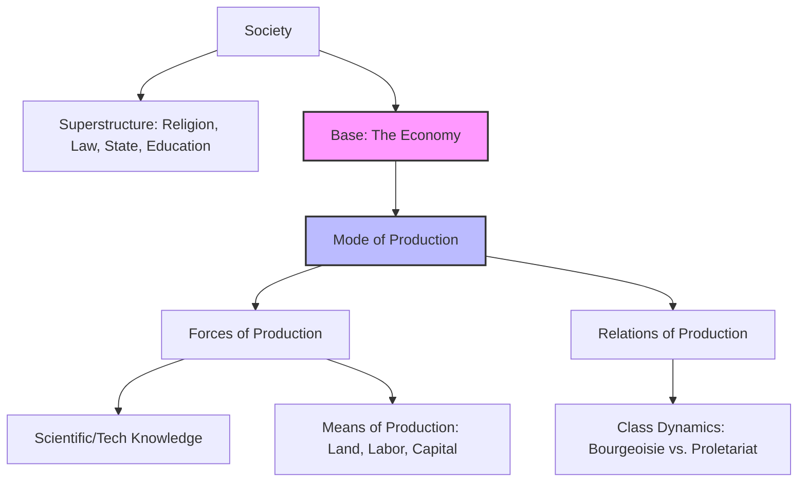

Here is the final, updated, and 100% exhaustive draft for **Part 1: The Classical Thinkers**. It now seamlessly integrates every single micro-detail, influence, and specific phrasing from the lecture transcript, alongside the structural upgrades we agreed upon.

***

# **UGC NET Sociology: Unit 1 Thinkers (Comprehensive Notes)**
*Based on Antara Chak's Lecture Transcript*

## **PART 1: THE CLASSICAL THINKERS**

### **1. Émile Durkheim**
**1. Core Identity & Perspective**
*   **Background:** French School of Sociology.
*   **Perspective:** Structural Functionalism / Positivism.
*   **Influences:** Montesquieu, Auguste Comte, and Saint-Simon.
*   **Scope:** Macro-sociological. He is *not* interested in micro/subjective approaches; he looks at society as a whole.
*   **Identity:** Academic Father of Sociology (established it as a university discipline). Belongs to the **Synthetic School** of Sociology (believes sociology has a broad scope, synthesizing other disciplines).

**2. Methodology**
*   **Methodological Holism:** Studying the whole picture/society, not individuals.
*   **Inductive Method:** Studying particular cases first to build a general theory (e.g., studying 11 European countries to build the theory of suicide). *[Versus Trap]: Do not confuse with deductive.*
*   **Indirect Experiment:** His specific term for the **Comparative Method**, as direct laboratory experiments aren't possible in social sciences.
*   **Concomitant Variation:** Using statistical trends to find patterns (e.g., noticing a statistical correlation between symptoms and a disease). `[JRF Edge]` *Origin: This is originally J.S. Mill's term, not Durkheim's.*
*   **Objective/Quantitative:** Heavily reliant on statistics and numbers.

**3. Exhaustive Conceptual Breakdown**
*   **Social Facts:** Defined in *The Rules of Sociological Method*. Think of them as established social institutions (religion, marriage). 
    *   **4 Core Features (MTF/Not-Question Alert):** 
        1. **External:** Beyond the individual's control.
        2. **Coercive:** Forces you to follow them (pressure from society).
        3. **Enduring:** Persists across generations.
        4. **Social:** *Not* psychological or biological.
    *   **Types of Social Facts:**
        *   **Material:** Visible (e.g., a church building, demographic distribution).
        *   **Non-Material:** Invisible, in the mind (e.g., norms, values, respecting elders).
        *   **Social Currents:** Temporary, spontaneous collective expressions (e.g., a stadium cheering, an audience crying at a movie).
    *   **Normal vs. Pathological:** A social fact (like crime or suicide) is **Normal** if it occurs within a limited, expected rate. It becomes **Pathological** (causing societal disintegration) if it exceeds that limit and goes out of control.

*   **Division of Labour & Solidarity (from his PhD Thesis):**
    *   **Mechanical Solidarity:** Older, traditional societies. People are homogeneous (similar skills). High **Collective Conscience** (everyone thinks similarly). Law is **Repressive** (gruesome, public punishments).
    *   **Organic Solidarity:** Modern, industrial societies. People are heterogeneous (specialized division of labor). *Lacks* a strong collective conscience. Driven by **Moral Density** (mental/social interdependence) and **Material Density** (increased population/industrialization). Law is **Restitutive/Retributive** (aims to restore order).
    *   **Abnormal Forms of Division of Labour:**
        1.  **Anomic:** Lack of coordination between norms and labor (e.g., a PhD holder forced to work as a waiter).
        2.  **Forced:** Individuals forced into roles they don't want (e.g., the traditional Caste system).
        3.  **Poorly Coordinated:** Technological shifts outpace human adaptation (e.g., older employees struggling when computers were first introduced).

*   **Theory of Suicide:**
    *   Studied data from 11 European countries. Rejected psychological/biological reasons.
    *   *A-R Cue:* **Because** suicide rates vary consistently across different religious and social groups, **Therefore** suicide is a social fact driven by social currents, not individual psychology.
    *   **4 Types based on Integration & Regulation:**
        1.  **Egoistic:** Low Integration (disconnected from society).
        2.  **Altruistic:** High Integration (sacrificing life for society, e.g., army, *Sati*, *Jauhar*, terrorists).
        3.  **Anomic:** Low Regulation / Normlessness (e.g., COVID-19 breakdown, sudden divorce/breakup, sudden lottery win).
        4.  **Fatalistic:** High Regulation / Over-imposition of rules (e.g., prisoners, slaves).

*   **Sociology of Religion:**
    *   Studied **Totemism** in the **Arunta Tribe** of Australia (considered the most elementary religion).
    *   **Totem:** A sacred symbol (plant, animal, bird) representing a clan.
    *   **Sacred vs. Profane:** Sacred = holy/religious items. Profane = everyday/mundane items (clothes, pens).
    *   **Core Argument:** Religion is nothing but "worshipping our society." Heaven is a glorified version of society; Hell is a degraded version. Religion acts as a **Moral Community** for social integration.
    *   **The Formula of Religion:** Religion is made up of two things: a **Belief System** (framework) and **Rites** (activities).
    *   **Three Types of Rituals (Rites):**
        1.  **Positive:** Expected daily activities (e.g., Namaz, Puja).
        2.  **Negative:** Taboos/Prohibitions (e.g., not drinking alcohol, dietary restrictions).
        3.  **Piacular:** Rites of atonement/mourning (e.g., bathing in the Ganga to wash away sins).

*   **Other Key Concepts:**
    *   **Types of Societies by Size:** Categorized societies structurally into **Simple Society (Horde)**, **Polysegmental**, and **Simply Compounded**. *[Versus Trap]: Do not confuse his use of the word "segmental" with Herbert Spencer's division of societies.*
    *   **Sociology of Education:** Education as an institution plays the specific function of passing all the dominant ideas of the society from one generation to another.
    *   **Collective Effervescence:** The sense of unity felt when people come together to celebrate (e.g., Diwali, Christmas).
    *   **Collective Representations:** Symbolic items representing a community (e.g., religious symbols).
    *   **Agelicism:** The principle that society cannot be reduced to its smaller parts (like the human body, taking organs out and putting them on a table doesn't make a functioning body).
    *   **Sui Generis:** French/Latin term meaning society is "unique" and existed before us.
    *   **Civil Religion:** `[JRF Edge]` *Origin: Rousseau.* Religion in public life/publicity, not a personal choice.
    *   **Three Divisions of Sociology:**
        1.  **Social Morphology:** Visible things (population, demography, housing).
        2.  **Social Physiology:** Invisible things (norms, values).
        3.  **General Sociology:** Temporary societal shifts (social currents).

**4. 💡 Lecturer’s Key Insights & Exam Traps**
*   **Exam Trap - Anomie:** If asked which book *first* introduced Anomie, the answer is **Division of Labour**, NOT *Suicide*.
*   **Exam Trap - Anomic Suicide:** Antara notes students get confused here. A sudden breakup/divorce or winning the lottery causes *Anomic* suicide, not Egoistic, because it disrupts the stable *norms* and regulations of your daily life.
*   **Mnemonic - Suicide Types:** Remember them in pairs: **"Ig-Al and An-Fa"** (Egoistic/Altruistic & Anomic/Fatalistic).
*   **Exam Trap - Evolution:** Durkheim followed **Darwin's** principle of evolution, *not* Spencer's.
*   **Famous Quote:** *"Men are product of nature, women are product of culture."*
*   **Journal:** He started the French sociology journal *L'Année Sociologique* (Note: This is a journal, not a concept).

**5. Chronology of Major Works**
1.  *The Division of Labour in Society* (1893) - *His PhD Thesis*
2.  *The Rules of Sociological Method* (1895)
3.  *Suicide* (1897)
4.  *The Elementary Forms of Religious Life* (1912)
*   **Posthumous Works (Uncommon but PYQs):** *Education and Society*, *Moral Education*, *Socialism and Saint-Simon*, *Professional Ethics and Civic Morals*, *Evolution of Educational Thought*, *Pragmatism and Sociology*.

---

### **2. Max Weber**
**1. Core Identity & Perspective**
*   **Background:** German thinker.
*   **Perspective:** Interpretive Sociology, Micro-aspects.
*   **Influences:** Immanuel Kant and Wilhelm Dilthey (specifically Dilthey's Hermeneutics).
*   **Scope:** Belongs to the **Formalistic School** (believed sociology is a pure, independent science with a limited scope, unlike Durkheim's Synthetic school).
*   **Titles:** Founder of Political Sociology. Sometimes called the "Bourgeois Marx" (per George Ritzer).

**2. Methodology**
*   **Methodological Individualism:** Focuses on individuals, opposite of Durkheim's holism.
*   **Verstehen:** In-depth, empathetic understanding.
*   **Causal Pluralism (Multi-causal):** Rejected Marx's single-cause (economy) theory. Believed every event has multiple causes.
*   **Value-Free vs. Value Relevance:** We are human, not robots, so absolute "value-free" objectivity is impossible. Instead, we use **Value Relevance/Reflexivity**: You can use your biases when *selecting* a research topic, but must remain neutral once research begins.
*   **Ideal Types:** Pure types or exaggerated versions of reality used as a "measuring rod" or "heuristic device." *They do not exist in strict reality* (e.g., no real-world office perfectly matches his "Ideal Type" of Bureaucracy).

**3. Exhaustive Conceptual Breakdown**
*   **Social Action:**
    *   Action is only "social" if it meets two criteria: 1) It is **Meaningful**, and 2) It is **Responsive** (action-reaction involving others. E.g., brushing teeth alone is *not* social action).
    *   **4 Types of Social Action (MTF-Ready):**
        1.  **Zweckrational (Instrumental):** Goal-oriented means (e.g., studying specifically to crack JRF).
        2.  **Wertrational (Value-Rational):** Morality-based (e.g., giving up your bus seat to an elderly person, giving money to a beggar).
        3.  **Traditional:** Done for generations without much thought (e.g., dowry, rituals).
        4.  **Affective (Emotional):** Strictly emotional (e.g., hitting someone in anger, crying).

*   **Types of Rationality (MTF-Ready):**
    1.  **Practical:** Used in day-to-day life (brushing teeth).
    2.  **Theoretical:** Logical approach to understanding new concepts (inductive/deductive).
    3.  **Substantive:** Applying moral rationality (similar to Wertrational action).
    4.  **Formal:** Strictly instrumental, calculating means to an end based on rules.

*   **Power vs. Authority:**
    *   **Power:** Coercing/imposing opinions.
    *   **Authority:** Power that is *legitimized* and recognized.
    *   **3 Types of Authority:**
        1.  **Rational-Legal:** Respecting the *position*, not the person (e.g., Prime Minister, President). Based on written rules.
        2.  **Charismatic:** Based on the personal, exceptional qualities of a leader (e.g., Buddha, Gandhi, Hitler, Osama Bin Laden). Over time, this fades and becomes regularized (**Routinization of Charisma**).
        3.  **Traditional:** Hereditary, merit is not required (e.g., King's son becomes King).

*   **Social Stratification (Tripartite Model):**
    *   **Class:** Determined by money and **Market Situation**. Linked to **Life Chances** (opportunities).
    *   **Status:** Determined by prestige/respect (e.g., a Professor or IAS officer has high status even if not a billionaire). Linked to **Lifestyle** (status symbols like phones/brands).
    *   **Party:** Political power.
    *   *Note:* He used the Indian Caste system as an example of Status, governed by **Social Closure** (invisible boundaries preventing mobility), **Connubium** (endogamous marriage rules), and **Commensality** (food-sharing rules).

*   **Religion & Capitalism:**
    *   Used a **Comparative Approach** studying exactly 6 world religions: **Hinduism, Taoism, Confucianism, Buddhism, Christianity, and Judaism**.
    *   **The Protestant Ethic:** Studied the **Calvinist** sect of Protestants (not Lutherans). Their ethics acted as a spark (**Elective Affinity** / coincidence) for the rise of Capitalism.
    *   **Calvinist Principles:** "Time is money," "Money begets money" `[JRF Edge]` *Origin: Benjamin Franklin*. Belief in a **Calling** (vocation/work to reach heaven).
    *   **Types of Asceticism/Mysticism (MTF-Ready):**
        1.  **Inner-Worldly Asceticism:** Work hard in *this* life to get salvation (Protestant/Calvinist).
        2.  **Other-Worldly Asceticism:** Give up everything in this life; money is an illusion (Hinduism). *This is why capitalism didn't rise in India.*
        3.  **World-Rejecting Mysticism:** Aiming to meet God after death.
        4.  **Inner-Worldly Mysticism:** Focus on current life via meditation/mindfulness (Zen Buddhism).
    *   **Soteriology / Theodicy of Fortune & Misfortune:** Giving religious/fate-based explanations for life events (e.g., "It wasn't in my destiny/kismet").

*   **Bureaucracy:**
    *   Ideal type features: Written rules, Rationality/Logic, Hierarchy, Impersonality (no family ties at work), Merit-based.

*   **Modernity:**
    *   **Disenchantment:** Modernity and extreme rationalization have killed the "inner happiness" and magic of life. We are trapped in an **Iron Cage of Rationality** where everything is calculated.

**4. 💡 Lecturer’s Key Insights & Exam Traps**
*   **Exam Trap - Constant Sum Theory:** Weber believed in the **Constant Sum Theory of Power** (power is fixed; only one person/group can hold it at a time). *[Versus Trap]: Do not confuse this with Parsons' Variable Sum theory.*
*   **Famous Quote (PYQ):** *"Tribes, if they lose the significance of their territory, become castes."*
*   **[Versus Trap] - Class:** Weber's definition of "Class" (Market Situation) is fundamentally different from Marx's definition (Position in the Production Process).

**5. Chronology of Major Works**
*   *The Protestant Ethic and the Spirit of Capitalism* (1904-1905) - **Exam Trap:** This is the *only* major book published before his death.
*   *The City* (1921)
*   *Economy and Society* (1921-1922) - Contains his theories on Social Action and Bureaucracy.
*   *The Religion of China / The Religion of India*
*   **Uncommon PYQ Books:** *The Rational and Social Foundations of Music* (BHU Entrance PYQ), *Methodology of Social Sciences*, *Politics as a Vocation*, *Science as a Vocation*.

---

### **3. Karl Marx**
**1. Core Identity & Perspective**
*   **Background:** German thinker. The oldest of the classical trio.
*   **Perspective:** Founder of the **Conflict Perspective**.
*   **Identity:** Widely known as the **Father of Scientific Socialism**.
*   **Influences:** G.W.F. Hegel (Dialectics) and Ludwig Feuerbach (Materialism/Religion).

**2. Methodology**
*   **Dialectical Materialism:** Borrowed Hegel's "Dialectics" (Thesis vs. Antithesis = Synthesis) but applied it to the *practical, material world*, rejecting Hegel's focus on "ideas" (Idealism).
*   **Historical Materialism:** Analyzing how society progresses historically through different modes of production.
*   `[JRF Edge]` *Origin Trap: Marx never personally used the terms "Dialectical Materialism" or "Historical Materialism" in his writings. They were later coined/interpreted by his colleague Friedrich Engels.*

**3. Exhaustive Conceptual Breakdown**
*   **Base and Superstructure:**
    *   **Base:** The Economy.
    *   **Superstructure:** Everything else built on the economy (Religion, Polity, Education, Family).
    *   *A-R Cue:* **Because** the economic base dictates survival, **Therefore** the base determines the shape and function of the superstructure.

*   **Mode of Production:** How a society produces things. Comprises:
    1.  **Forces of Production:** Scientific/Tech knowledge + **Means of Production** (Land, Labor, Capital, Organization).
    2.  **Relations of Production:** The relationship between classes (e.g., Master/Slave, Bourgeoisie/Proletariat).
    *   *Capital Types:* **Fixed Capital** (Machines) vs. **Variable Capital** (Human Labor).

*(Visual Aid: The hierarchical structure of Marx's materialist conception of society. Note how Means of Production is a subset of Forces of Production).*

*   **Historical Stages (Chronology):**
    1.  **Primitive Communism:** No inequality.
    2.  **Slavery:** **Exam Trap:** *This is the stage where the concept of Private Property first emerges*, NOT Capitalism.
    3.  **Feudalism:** Landlords and Serfs/Peasants.
    4.  **Capitalism:** Bourgeoisie and Proletariat.
    5.  **Socialism/Communism (Future):** Private property abolished, state owns everything.
    *   *Exception:* **Asiatic Mode of Production:** A separate, stagnant mode of production applied to Asian societies (like India's caste system) where change is slow.

*   **Class & Stratification:**
    *   **Definition:** Class is your position in the *production process* (e.g., Ambani owns the factory, he doesn't work the floor).
    *   **The Classes:**
        *   **Bourgeoisie:** The "Haves" (Owners).
        *   **Proletariat:** The "Have-Nots" (Workers).
        *   **Petty Bourgeoisie:** Transitional/fluctuating class (sometimes act like owners, sometimes workers).
        *   **Lumpenproletariat:** The absolute lowest, poorest section (e.g., beggars).
    *   **Class-in-itself vs. Class-for-itself (Mnemonic: 1 comes before 4):**
        *   *Class-in-itself (1):* Workers are unaware of their exploitation (**False Consciousness**).
        *   *Class-for-itself (4):* Workers gain **Class Consciousness**, realize their exploitation, and start class conflict/revolution.

*   **Capitalism's Mechanics:**
    *   **Circuit of Commodity (C-M-C):** Older barter system (Commodity $\rightarrow$ Money $\rightarrow$ Commodity).
    *   **Circuit of Capital (M-C-M'):** Capitalist system. Money $\rightarrow$ Commodity $\rightarrow$ More Money (M' is always greater than M due to profit).
    *   **Commodification:** Things that weren't commodities are now bought and sold (e.g., selling blood, human labor).
    *   **Commodity Fetishism:** Obsession with brands/prices while ignoring the human labor behind them (e.g., buying expensive Zara/H&M clothes made in Bangladeshi sweatshops).

*   **Theories of Exploitation & Downfall:**
    *   **Labour Theory of Value:** Profit comes from **Surplus Labour** (unpaid extra hours worked beyond the **Socially Necessary Labour Time** needed to survive).
        *   *Absolute Surplus:* Increasing the length of the working day (8 hours to 16 hours).
        *   *Relative Surplus:* Making work more efficient in the same time frame (e.g., using better machines to produce 4 chairs instead of 2 in 8 hours).
    *   **Theory of Alienation:** Workers are disconnected from: 1) The Product, 2) The Production Process, 3) Themselves (Self/Decisions), 4) Fellow Species (other workers).
    *   **Falling Rate of Profit / Overproduction:** Capitalism contains the "seeds of its own destruction." Capitalists will replace humans with machines (robots) to increase profit. This leads to mass unemployment. Without wages, people can't buy the goods produced, leading to overproduction and the system's collapse.
    *   **"A Specter is Haunting Europe":** A famous phrase from the *Communist Manifesto* asserting that Europe should live in fear of capitalism's inevitable downfall and the rise of communism.

*   **Other Key Concepts:**
    *   **Use Value vs. Exchange Value:** Oxygen has Use Value but no Exchange Value (price). Commodities have both.
    *   **Reserve Army of Labour:** Women and children kept as cheap, substitute labor.
    *   **Praxis:** Bridging the gap between theory and practical application.
    *   **Pauperization:** The working class getting poorer day by day.
    *   **Polarization:** The increasing gap between the rich and the poor.

**4. 💡 Lecturer’s Key Insights & Exam Traps**
*   **Exam Trap - Private Property:** Remember, private property started in *Slavery*, not Capitalism.
*   **Famous Quotes:** 
    *   *"Religion is the opium of the masses."* (It fools people into a false sense of security).
    *   *"Revolutions are the locomotives of history."*
    *   *"Thank God I am not a Marxist."* (Said at the end of his life out of self-loathing, feeling he didn't do enough for the working class).
*   **Power Theory:** Like Weber, Marx believed in the **Zero-Sum / Constant Sum** theory of power.

**5. Chronology of Major Works**
*   *Economic and Philosophic Manuscripts of 1844* (Contains the theory of **Alienation**)
*   *The Holy Family*
*   *The German Ideology*
*   *The Communist Manifesto*
*   *The 18th Brumaire of Louis Napoleon*
*   *Grundrisse* (PYQ)
*   *Contribution to the Critique of Political Economy* (PYQ)
*   *Das Kapital* (Capital) - 3 Volumes. Volume 1 contains theories on **Surplus Value** and **Commodity**.

---

### **INTEGRATED VIEW: THE CLASSICAL THINKERS**
*(Use this table for quick comparative revision and Assertion-Reasoning logic)*

| Analytical Axis | Émile Durkheim | Max Weber | Karl Marx |
| :--- | :--- | :--- | :--- |
| **Core Methodology** | Methodological Holism / Positivism | Methodological Individualism / Verstehen | Historical & Dialectical Materialism |
| **View of Stratification** | Division of Labour (Mechanical vs. Organic) | Tripartite: Class (Market), Status (Honor), Party (Power) | Dichotomous: Bourgeoisie vs. Proletariat (Production Process) |
| **View of Religion** | Functional: Worshipping society, creates moral community. | Catalyst: Protestant Ethic sparked Capitalism. | Conflict: "Opium of the masses," creates false consciousness. |
| **The "Problem" with Modernity** | **Anomie:** Breakdown of norms/regulation. | **Iron Cage:** Extreme rationalization & disenchantment. | **Alienation:** Estrangement from labor, self, and species. |
| **View of Power** | Not a primary focus; implicit in coercive Social Facts. | Constant-Sum; Authority must be legitimized (3 types). | Zero-Sum; Power is held exclusively by the bourgeoisie. |

